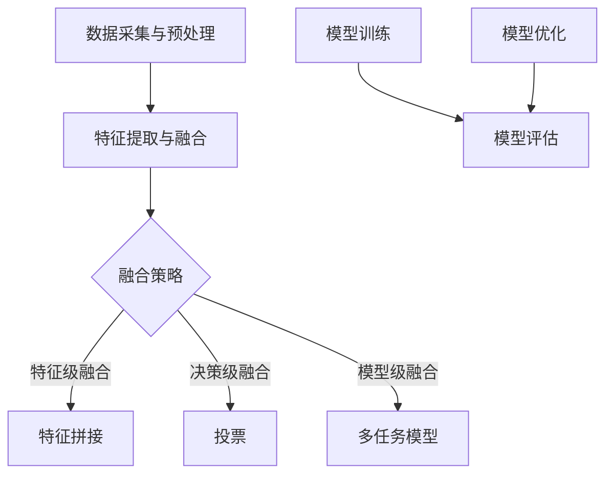
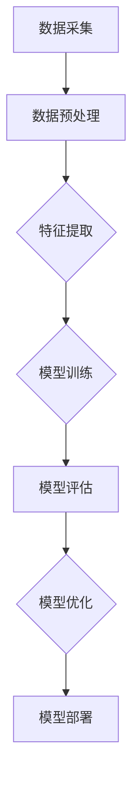
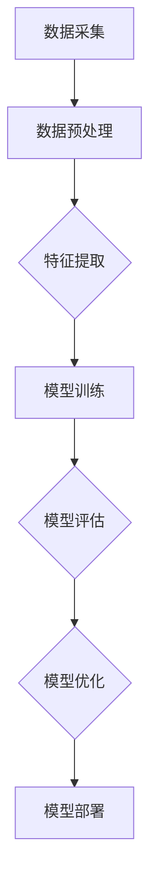

                 

### 文章标题

《多模态大模型：技术原理与实战 模型压缩实战》

---

**关键词**：多模态大模型，技术原理，模型压缩，深度学习，数据处理，神经网络，概率论，统计，实战案例

---

**摘要**：本文深入探讨了多模态大模型的技术原理，包括数据处理、模型结构、算法和数学模型。接着，我们通过实战案例展示了多模态大模型的实际应用，并详细介绍了模型压缩的多种策略。文章以理论结合实践的方式，帮助读者全面理解多模态大模型的构建与应用，为未来的技术发展提供启示。

---

### 《多模态大模型：技术原理与实战 模型压缩实战》目录大纲

#### 第一部分：多模态大模型基础理论

##### 第1章：多模态大模型概述

- **1.1 多模态数据与多模态学习**
  - 多模态数据定义
  - 多模态学习的意义
  - 多模态学习的基本原理

- **1.2 多模态大模型的发展历程**
  - 多模态大模型的技术演变
  - 关键技术突破
  - 主要应用领域

- **1.3 多模态大模型的分类与架构**
  - 分类方法
  - 常见的多模态大模型架构
  - 模型架构的比较与选择

##### 第2章：多模态数据处理

- **2.1 多模态数据采集与标注**
  - 数据采集方法
  - 数据标注技术
  - 数据质量控制

- **2.2 多模态数据融合**
  - 数据融合方法
  - 融合策略
  - 融合效果的评估

- **2.3 多模态数据预处理**
  - 数据标准化
  - 特征提取
  - 数据增强

##### 第3章：多模态大模型技术基础

- **3.1 深度学习与神经网络基础**
  - 神经网络结构
  - 前馈神经网络与卷积神经网络
  - 循环神经网络与长短时记忆网络

- **3.2 多模态大模型的核心算法**
  - 多任务学习
  - 跨模态匹配
  - 多模态注意力机制

##### 第4章：多模态大模型数学模型

- **4.1 概率论与统计基础**
  - 概率分布
  - 最大似然估计
  - 贝叶斯估计

- **4.2 多模态大模型的损失函数**
  - 均方误差损失函数
  - 交叉熵损失函数
  - 其他损失函数

##### 第5章：多模态大模型实践案例分析

- **5.1 多模态情感分析**
  - 案例介绍
  - 模型设计与实现
  - 结果分析

- **5.2 多模态图像识别**
  - 案例介绍
  - 模型设计与实现
  - 结果分析

#### 第二部分：模型压缩实战

##### 第6章：模型压缩概述

- **6.1 模型压缩的重要性**
  - 资源限制
  - 能效优化
  - 部署需求

- **6.2 模型压缩的分类**
  - 结构化压缩
  - 参数化压缩
  - 算法压缩

##### 第7章：模型结构压缩

- **7.1 网络结构压缩**
  - 网络剪枝
  - 网络压缩
  - 网络蒸馏

- **7.2 参数剪枝**
  - 参数剪枝原理
  - 参数剪枝算法
  - 参数剪枝效果评估

##### 第8章：模型量化

- **8.1 量化原理**
  - 整数化
  - 浮点化
  - 量化误差分析

- **8.2 量化方法**
  - 全精度量化
  - 局部精度量化
  - 离散量化

##### 第9章：神经架构搜索

- **9.1 NAS概述**
  - NAS概念
  - NAS流程
  - NAS的优势与挑战

- **9.2 NAS算法**
  - 强化学习
  - 生成对抗网络
  - 筛选与优化策略

##### 第10章：模型压缩实战案例

- **10.1 模型压缩在语音识别中的应用**
  - 案例介绍
  - 模型压缩策略
  - 实践效果

- **10.2 模型压缩在图像识别中的应用**
  - 案例介绍
  - 模型压缩策略
  - 实践效果

#### 附录

##### 附录A：多模态大模型与模型压缩工具与资源

- **A.1 开源框架与库**
  - TensorFlow
  - PyTorch
  - Keras

- **A.2 实用工具**
  - ONNX
  - MOBILE-NET
  - TFLite

- **A.3 学习资源**
  - 研究论文
  - 教程与课程
  - 社区与论坛

---

### 第1章：多模态大模型概述

#### 1.1 多模态数据与多模态学习

##### 多模态数据定义

多模态数据是指包含两种或两种以上不同类型的数据，如文本、图像、音频、视频等。这些数据各自具有独特的特征和表达方式，但同时又可以相互补充，提供更丰富的信息。例如，在社交媒体平台上，用户发布的内容通常包括文字、图片和视频，这些内容共同构成了一个多模态数据集。

##### 多模态学习的意义

多模态学习在人工智能领域具有重要的应用价值，主要体现在以下几个方面：

1. **信息丰富性**：多模态数据可以提供比单一模态数据更全面的信息，有助于提升模型的鲁棒性和准确性。
2. **人眼模拟**：人类在理解和处理信息时，会同时依赖多种感官，多模态学习能够模拟这一过程，提高人工智能系统的自然交互能力。
3. **跨领域应用**：多模态数据的应用范围广泛，如医疗、金融、娱乐等领域，多模态学习可以帮助这些领域实现更智能化的决策和预测。

##### 多模态学习的基本原理

多模态学习的基本原理主要包括数据采集、数据融合和模型训练三个环节：

1. **数据采集**：通过不同的传感器和采集工具获取多模态数据，如摄像头、麦克风、传感器等。
2. **数据融合**：将不同模态的数据进行整合，提取出对任务有用的特征。数据融合的方法包括特征级融合、决策级融合和模型级融合等。
3. **模型训练**：利用融合后的数据训练多模态模型，模型通常采用深度学习框架，如卷积神经网络（CNN）、循环神经网络（RNN）和Transformer等。

#### 1.2 多模态大模型的发展历程

##### 多模态大模型的技术演变

多模态大模型的发展历程可以追溯到20世纪90年代，当时研究人员开始尝试将不同模态的数据进行融合，以提升机器学习模型的性能。随着深度学习技术的兴起，多模态大模型的研究得到了广泛关注。以下是多模态大模型的主要技术演变：

1. **早期研究**：1990年代，研究人员开始探索如何将图像和文本数据进行融合，以实现图像识别和文本分类任务。
2. **深度学习引入**：2000年代，深度学习技术的发展为多模态学习提供了新的方法，如卷积神经网络（CNN）和循环神经网络（RNN）。
3. **端到端学习**：2010年代，端到端学习技术的应用使得多模态大模型可以一次性训练完成，提高了模型的效率和性能。
4. **多任务学习**：近年来，多任务学习技术的应用使得多模态大模型可以同时处理多种任务，如情感分析、图像识别和语音识别等。

##### 关键技术突破

在多模态大模型的发展过程中，以下关键技术突破具有重要意义：

1. **多模态特征提取**：通过设计不同的特征提取网络，如CNN和RNN，从不同模态的数据中提取出有用的特征。
2. **多模态融合策略**：提出了多种多模态融合策略，如特征级融合、决策级融合和模型级融合等，以提升模型的性能。
3. **端到端训练**：通过端到端训练技术，将不同模态的数据直接输入到同一模型中进行训练，简化了训练流程。
4. **多任务学习**：通过多任务学习技术，同时训练多个相关任务，提高模型的整体性能。

##### 主要应用领域

多模态大模型在多个领域得到了广泛应用，以下是一些主要的应用领域：

1. **计算机视觉**：用于图像识别、目标检测、人脸识别等任务。
2. **自然语言处理**：用于文本分类、情感分析、机器翻译等任务。
3. **语音识别**：用于语音识别、语音合成、语音增强等任务。
4. **医学图像分析**：用于医学图像识别、疾病诊断、药物设计等任务。
5. **自动驾驶**：用于车辆检测、障碍物识别、交通标志识别等任务。

#### 1.3 多模态大模型的分类与架构

##### 分类方法

根据不同的分类标准，多模态大模型可以有不同的分类方法：

1. **按模态数量**：分为单模态模型和跨模态模型。单模态模型只处理一种模态的数据，跨模态模型则同时处理多种模态的数据。
2. **按任务类型**：分为多任务模型和跨任务模型。多任务模型同时处理多个相关任务，跨任务模型则处理不同的任务。
3. **按学习策略**：分为监督学习模型、无监督学习模型和半监督学习模型。监督学习模型使用标注数据训练，无监督学习模型不使用标注数据，半监督学习模型则同时使用标注数据和未标注数据。

##### 常见的多模态大模型架构

以下是一些常见多模态大模型架构：

1. **多输入单输出架构**：该架构中，多个模态的数据分别输入到不同的特征提取网络，最后将特征进行融合，输出预测结果。
2. **多输入多输出架构**：该架构中，多个模态的数据分别输入到不同的特征提取网络，每个网络输出一个预测结果，然后将这些结果进行融合。
3. **混合架构**：该架构中，部分模态的数据使用特征提取网络进行特征提取，另一部分模态的数据使用预训练的模型进行特征提取，然后将这些特征进行融合。

##### 模型架构的比较与选择

在选择多模态大模型架构时，需要考虑以下因素：

1. **任务需求**：根据具体任务的需求选择合适的架构，如多输入单输出架构适合处理单一任务，多输入多输出架构适合处理多个相关任务。
2. **数据特点**：根据不同模态的数据特点选择合适的特征提取网络，如图像数据适合使用CNN进行特征提取，文本数据适合使用RNN进行特征提取。
3. **计算资源**：根据计算资源的限制选择合适的模型架构，如对于资源有限的设备，可以选择结构简单的模型架构。

### 第2章：多模态数据处理

#### 2.1 多模态数据采集与标注

##### 数据采集方法

多模态数据采集是构建多模态数据集的重要环节，以下是几种常见的数据采集方法：

1. **传感器采集**：通过各种传感器（如摄像头、麦克风、温度传感器等）实时采集多模态数据。
2. **网络爬虫**：通过网络爬虫从互联网上抓取多模态数据，如社交媒体平台的用户评论、图片和视频。
3. **手工标注**：雇佣专业标注员对数据进行手工标注，以获取高质量的数据集。
4. **半自动标注**：利用现有的标注工具和算法，自动标注一部分数据，然后通过人工审查和修正，提高标注质量。

##### 数据标注技术

数据标注是构建高质量多模态数据集的关键，以下是几种常见的数据标注技术：

1. **文本标注**：对文本数据进行分类、实体识别、情感分析等标注。
2. **图像标注**：对图像数据进行标注，如目标检测、分割、分类等。
3. **音频标注**：对音频数据进行标注，如语音识别、情感分析、音乐分类等。
4. **视频标注**：对视频数据进行标注，如动作识别、场景分类、目标跟踪等。

##### 数据质量控制

高质量的数据集是构建有效多模态模型的基础，以下是一些常见的数据质量控制方法：

1. **数据清洗**：去除重复、错误和噪声数据，提高数据质量。
2. **数据平衡**：确保不同类别的数据分布均匀，避免数据偏斜。
3. **数据增强**：通过旋转、缩放、裁剪等操作，增加数据的多样性，提高模型的泛化能力。
4. **数据验证**：通过交叉验证等方法，评估数据集的质量和模型性能。

#### 2.2 多模态数据融合

##### 数据融合方法

多模态数据融合是将不同模态的数据进行整合，提取出对任务有用的特征。以下是一些常见的数据融合方法：

1. **特征级融合**：在特征提取阶段，将不同模态的特征进行拼接或加权融合。
2. **决策级融合**：在决策阶段，将不同模态的预测结果进行融合，如投票或加权平均。
3. **模型级融合**：构建一个多模态模型，将不同模态的数据直接输入到同一模型中进行训练。

##### 融合策略

在多模态数据融合过程中，选择合适的融合策略对模型性能至关重要。以下是一些常见的融合策略：

1. **级联策略**：先分别对每种模态的数据进行特征提取，然后将这些特征进行融合。
2. **并行策略**：同时处理多种模态的数据，分别提取特征，最后将特征进行融合。
3. **注意力机制**：利用注意力机制，对不同模态的特征进行加权，提取出对任务最有用的特征。
4. **图模型**：使用图模型来表示多模态数据之间的依赖关系，进行有效的数据融合。

##### 融合效果的评估

为了评估多模态数据融合的效果，通常使用以下评价指标：

1. **准确率**：预测结果与真实结果的一致性指标。
2. **召回率**：预测结果中包含真实结果的比率。
3. **F1分数**：准确率和召回率的调和平均数。
4. **ROC曲线**：评估分类模型的性能，通过计算真正例率和假正例率，绘制ROC曲线。

#### 2.3 多模态数据预处理

##### 数据标准化

数据标准化是将不同模态的数据转换为统一的尺度，以消除数据间的差异性。以下是一些常见的数据标准化方法：

1. **Z-score标准化**：将数据减去均值，然后除以标准差，使数据分布满足正态分布。
2. **Min-Max标准化**：将数据缩放到[0, 1]范围内，适用于小数值范围的数据。
3. **归一化**：将数据归一化到[0, 255]范围内，适用于图像和音频数据。

##### 特征提取

特征提取是将原始数据转换为对模型训练更有用的表示。以下是一些常见的特征提取方法：

1. **文本特征提取**：使用词袋模型、TF-IDF、BERT等模型提取文本特征。
2. **图像特征提取**：使用CNN、ResNet、Inception等模型提取图像特征。
3. **音频特征提取**：使用Mel频率倒谱系数（MFCC）、短时傅里叶变换（STFT）等方法提取音频特征。

##### 数据增强

数据增强是通过增加数据的多样性，提高模型的泛化能力。以下是一些常见的数据增强方法：

1. **随机裁剪**：从图像中随机裁剪出部分区域作为样本。
2. **随机旋转**：将图像随机旋转一定角度。
3. **色彩变换**：对图像进行色彩调整，如灰度化、对比度增强等。
4. **混响**：为音频添加混响效果，模拟不同的环境音。

### 第3章：多模态大模型技术基础

#### 3.1 深度学习与神经网络基础

##### 神经网络结构

神经网络（Neural Network，NN）是深度学习（Deep Learning，DL）的基础。一个简单的神经网络由以下几个部分组成：

1. **输入层**：接收外部输入数据，如文本、图像或音频等。
2. **隐藏层**：对输入数据进行处理和变换，提取特征。一个神经网络可以包含一个或多个隐藏层。
3. **输出层**：输出最终的结果，如分类标签、概率分布等。

神经网络的基本工作原理是通过前向传播（Forward Propagation）和反向传播（Backpropagation）两个过程。在前向传播过程中，输入数据通过神经网络中的各个层，每个层对数据进行加权求和并应用激活函数。在反向传播过程中，根据预测误差，调整网络的权重和偏置，以最小化损失函数。

##### 前馈神经网络与卷积神经网络

前馈神经网络（Feedforward Neural Network，FNN）是神经网络的一种基本形式，其特点是信息流从输入层单向流至输出层，不形成循环。前馈神经网络适用于处理输入维度固定的数据，如文本和图像。

卷积神经网络（Convolutional Neural Network，CNN）是一种特殊的前馈神经网络，主要用于处理具有网格结构的数据，如图像。CNN的核心组件是卷积层（Convolutional Layer），通过卷积操作提取图像特征。与传统的全连接层不同，卷积层可以通过共享权重来减少参数数量，从而提高计算效率和模型泛化能力。

##### 循环神经网络与长短时记忆网络

循环神经网络（Recurrent Neural Network，RNN）是一种处理序列数据的基本神经网络结构，其特点是具有时间维度。RNN通过在时间步上递归地更新隐藏状态，从而保留历史信息。然而，传统RNN存在梯度消失和梯度爆炸的问题，导致难以训练长序列数据。

长短时记忆网络（Long Short-Term Memory，LSTM）是RNN的一种改进形式，通过引入门控机制（gate）来控制信息的流入和流出，从而有效地解决了梯度消失和梯度爆炸的问题。LSTM在处理长序列数据时表现出色，广泛应用于语音识别、机器翻译和文本生成等领域。

#### 3.2 多模态大模型的核心算法

##### 多任务学习

多任务学习（Multi-Task Learning，MTL）是一种将多个相关任务同时训练的机器学习方法。在多任务学习中，模型通过共享部分参数或结构来同时学习多个任务，从而提高模型的性能和泛化能力。

多任务学习的优点包括：

1. **参数共享**：通过共享参数减少模型参数数量，降低计算成本。
2. **特征复用**：多个任务可以复用同一组特征，提高特征利用率。
3. **协同学习**：多个任务可以相互协同，提高模型的整体性能。

多任务学习的常见方法包括：

1. **串联模型**：将多个任务的输出拼接起来，作为一个单独的输入。
2. **共享隐藏层**：多个任务共享相同的隐藏层，每个任务有自己的输出层。
3. **多任务网络**：构建一个多任务网络，同时处理多个任务。

##### 跨模态匹配

跨模态匹配（Cross-Modal Matching）是多模态学习的一个重要研究方向，旨在建立不同模态数据之间的关联。跨模态匹配的核心目标是通过学习一种映射关系，将来自不同模态的数据映射到同一特征空间，从而实现模态间的语义对齐。

跨模态匹配的主要方法包括：

1. **基于特征的匹配**：通过特征级融合的方法，将不同模态的特征进行对齐。
2. **基于模型的匹配**：通过构建一个多模态模型，将不同模态的数据直接进行对齐。
3. **基于记忆的匹配**：通过引入记忆网络，将不同模态的数据进行动态对齐。

##### 多模态注意力机制

多模态注意力机制（Multi-Modal Attention Mechanism）是多模态学习中的一个关键技术，通过自动学习不同模态数据的重要性和相关性，实现高效的特征融合。注意力机制能够自适应地调整不同模态特征的权重，从而提升模型对任务的敏感度和鲁棒性。

多模态注意力机制的主要方法包括：

1. **全局注意力**：对所有模态的特征进行加权融合，适用于特征维度较低的情况。
2. **局部注意力**：对特定模态的特征进行加权，适用于特征维度较高的情况。
3. **层次注意力**：同时考虑全局和局部信息，构建更复杂的注意力网络。
4. **多级注意力**：将注意力机制应用于不同层次的特征，逐步提取关键信息。

### 第4章：多模态大模型数学模型

#### 4.1 概率论与统计基础

在多模态大模型的研究和开发中，概率论与统计基础扮演着至关重要的角色。概率论提供了描述随机事件及其相互关系的方法，而统计学则用于从数据中推断模型参数和做出预测。以下是一些基本概念和定理：

##### 概率分布

概率分布是描述随机变量取值概率的函数。常见的概率分布包括：

1. **伯努利分布（Bernoulli Distribution）**：用于描述一个试验只有两个可能结果的概率分布，如抛硬币的概率分布。
   $$ P(X = k) = p^k (1 - p)^{1 - k} $$
   其中，$p$是成功概率，$k$是成功的次数。

2. **高斯分布（Gaussian Distribution）**：也称为正态分布，是连续概率分布中最常见的形式。
   $$ f(x|\mu,\sigma^2) = \frac{1}{\sqrt{2\pi\sigma^2}} e^{-\frac{(x-\mu)^2}{2\sigma^2}} $$
   其中，$\mu$是均值，$\sigma^2$是方差。

3. **泊松分布（Poisson Distribution）**：用于描述在一定时间内发生某一事件次数的概率分布，如事件发生次数的分布。
   $$ P(X = k) = \frac{\lambda^k e^{-\lambda}}{k!} $$
   其中，$\lambda$是平均事件发生率。

##### 最大似然估计

最大似然估计（Maximum Likelihood Estimation，MLE）是一种参数估计方法，用于找到使样本数据出现概率最大的参数值。最大似然估计的目标是最小化似然函数的对数似然函数。

1. **参数估计**：似然函数是样本数据在给定参数值下的概率乘积。最大似然估计通过最大化似然函数来估计模型参数。
   $$ L(\theta) = \prod_{i=1}^n P(x_i|\theta) $$

2. **似然函数**：对数似然函数是对似然函数的取对数，用于简化计算。
   $$ \ell(\theta) = \sum_{i=1}^n \log P(x_i|\theta) $$

3. **最大化似然估计**：通过优化方法（如梯度上升、牛顿法等）找到使对数似然函数最大化的参数值。
   $$ \hat{\theta} = \arg\max_{\theta} \ell(\theta) $$

##### 贝叶斯估计

贝叶斯估计是基于贝叶斯定理的参数估计方法，它结合了先验知识和观测数据，提供了后验概率分布。

1. **先验概率**：在观测数据之前，根据专家知识或历史数据确定的概率分布。

2. **后验概率**：在观测数据之后，结合先验概率和似然函数计算的概率分布。
   $$ P(\theta|X) = \frac{P(X|\theta)P(\theta)}{P(X)} $$

3. **贝叶斯公式**：贝叶斯定理描述了后验概率与先验概率和似然函数之间的关系。
   $$ P(\theta|X) \propto P(X|\theta)P(\theta) $$

贝叶斯估计可以通过马尔可夫链蒙特卡罗（MCMC）等方法进行采样，以得到参数的后验分布。

### 4.2 多模态大模型的损失函数

在多模态大模型的训练过程中，损失函数用于评估模型预测值与真实值之间的差异，并指导模型参数的更新。以下是一些常见的损失函数及其应用场景：

##### 均方误差损失函数

均方误差（Mean Squared Error，MSE）损失函数是回归任务中最常用的损失函数之一。

1. **定义与计算**：
   $$ MSE(y, \hat{y}) = \frac{1}{n}\sum_{i=1}^{n}(y_i - \hat{y}_i)^2 $$
   其中，$y$是真实值，$\hat{y}$是预测值。

2. **应用场景**：MSE损失函数适用于需要精确预测值的任务，如回归问题。

3. **优化方法**：MSE损失函数通常使用梯度下降（Gradient Descent）或其变种（如随机梯度下降、Adam等）进行优化。

##### 交叉熵损失函数

交叉熵（Cross-Entropy Loss）损失函数是分类任务中最常用的损失函数之一。

1. **定义与计算**：
   $$ H(y, \hat{y}) = -\sum_{i} y_i \log(\hat{y}_i) $$
   其中，$y$是真实标签（0或1），$\hat{y}$是预测概率。

2. **应用场景**：交叉熵损失函数适用于多类别分类问题。

3. **优化方法**：交叉熵损失函数通常使用梯度下降（Gradient Descent）或其变种进行优化。

##### 其他损失函数

除了MSE和交叉熵损失函数，还有一些其他常用的损失函数，如：

1. **Hinge损失函数**：适用于支持向量机（SVM）等分类问题，其形式为：
   $$ L(y, \hat{y}) = \max(0, 1 - y \hat{y}) $$

2. **Softmax损失函数**：是多类别交叉熵损失函数的一种特殊形式，常用于多类别分类问题。

3. **对比损失函数**：用于度量两个样本之间的差异，如对比损失（Contrastive Loss）和三元组损失（Triplet Loss），适用于人脸识别、文本相似性等任务。

### 伪代码：多模态大模型训练过程

以下是一个简单的伪代码示例，展示了多模态大模型的训练过程：

```python
# 初始化模型参数
model = initialize_model()

for epoch in range(num_epochs):
    for batch in data_loader:
        # 数据预处理
        processed_data = preprocess_data(batch)

        # 前向传播
        predictions = model.forward(processed_data)

        # 计算损失
        loss = compute_loss(predictions, labels)

        # 反向传播
        model.backward(loss)

        # 更新模型参数
        model.update_parameters()

    # 记录训练进度
    print("Epoch", epoch, "completed.")

# 评估模型
evaluate_model(model, test_data, test_labels)
```

### 数学公式与讲解

以下是一些用于多模态大模型的关键数学公式及其详细讲解：

#### 4.1.1 概率论基础

$$ P(A) = \frac{N(A)}{N(S)} $$

- **公式说明**：事件A的概率是事件A发生的次数$N(A)$与总次数$N(S)$的比值。
- **举例说明**：假设有一个袋子里面有5个红球和3个蓝球，随机抽取一个球，求抽到红球的概率。

$$ P(A|B) = \frac{P(A \cap B)}{P(B)} $$

- **公式说明**：在事件B发生的条件下，事件A发生的条件概率是事件A与事件B同时发生的概率$P(A \cap B)$与事件B发生的概率$P(B)$的比值。
- **举例说明**：假设在一家公司中，有20%的员工喜欢运动，而在这20%喜欢运动的员工中，有40%的人喜欢篮球。求喜欢篮球的员工在公司中的概率。

#### 4.2.2 交叉熵损失函数

$$ H(y, \hat{y}) = -\sum_{i} y_i \log(\hat{y}_i) $$

- **公式说明**：交叉熵损失函数是衡量预测分布$\hat{y}$与真实分布$y$之间差异的一种指标。
- **举例说明**：假设一个分类问题中，真实标签为[1, 0, 0]，预测概率分布为[0.8, 0.1, 0.1]，计算交叉熵损失。

#### 4.2.1 均方误差损失函数

$$ MSE(y, \hat{y}) = \frac{1}{n}\sum_{i=1}^{n}(y_i - \hat{y}_i)^2 $$

- **公式说明**：均方误差损失函数是衡量预测值$\hat{y}$与真实值$y$之间差异的一种指标。
- **举例说明**：假设一个回归问题中，真实值为[2, 3, 4]，预测值为[2.5, 3.2, 4.1]，计算均方误差损失。

### Mermaid 流程图：多模态大模型学习流程



### 伪代码：多模态大模型训练过程

```python
def train_model(data, labels, epochs):
    # 初始化模型参数
    model = initialize_model()

    for epoch in range(epochs):
        for batch in data_loader:
            # 数据预处理
            processed_data = preprocess_data(batch)

            # 模型前向传播
            predictions = model.forward(processed_data)

            # 计算损失
            loss = compute_loss(predictions, labels)

            # 反向传播
            model.backward(loss)

            # 更新模型参数
            model.update_parameters()

        # 记录训练进度
        print("Epoch", epoch, "completed.")

    return model
```

### 数学公式与讲解

#### 6.1.1 概率论基础

$$ P(A) = \frac{N(A)}{N(S)} $$

- **公式说明**：事件A的概率是事件A发生的次数$N(A)$与总次数$N(S)$的比值。
- **举例说明**：假设有一个袋子里面有5个红球和3个蓝球，随机抽取一个球，求抽到红球的概率。

$$ P(A|B) = \frac{P(A \cap B)}{P(B)} $$

- **公式说明**：在事件B发生的条件下，事件A发生的条件概率是事件A与事件B同时发生的概率$P(A \cap B)$与事件B发生的概率$P(B)$的比值。
- **举例说明**：假设在一家公司中，有20%的员工喜欢运动，而在这20%喜欢运动的员工中，有40%的人喜欢篮球。求喜欢篮球的员工在公司中的概率。

### 6.2.2 交叉熵损失函数

$$ H(y, \hat{y}) = -\sum_{i} y_i \log(\hat{y}_i) $$

- **公式说明**：交叉熵损失函数是衡量预测分布$\hat{y}$与真实分布$y$之间差异的一种指标。
- **举例说明**：假设一个分类问题中，真实标签为[1, 0, 0]，预测概率分布为[0.8, 0.1, 0.1]，计算交叉熵损失。

#### 6.2.1 均方误差损失函数

$$ MSE(y, \hat{y}) = \frac{1}{n}\sum_{i=1}^{n}(y_i - \hat{y}_i)^2 $$

- **公式说明**：均方误差损失函数是衡量预测值$\hat{y}$与真实值$y$之间差异的一种指标。
- **举例说明**：假设一个回归问题中，真实值为[2, 3, 4]，预测值为[2.5, 3.2, 4.1]，计算均方误差损失。

### Mermaid 流程图：多模态大模型学习流程



### 伪代码：多模态大模型训练过程

```python
def train_model(data, labels, epochs):
    # 初始化模型参数
    model = initialize_model()

    for epoch in range(epochs):
        for batch in data_loader:
            # 数据预处理
            processed_data = preprocess_data(batch)

            # 模型前向传播
            predictions = model.forward(processed_data)

            # 计算损失
            loss = compute_loss(predictions, labels)

            # 反向传播
            model.backward(loss)

            # 更新模型参数
            model.update_parameters()

        # 记录训练进度
        print("Epoch", epoch, "completed.")

    return model
```

### 数学公式与讲解

#### 6.1.1 概率论基础

$$ P(A) = \frac{N(A)}{N(S)} $$

- **公式说明**：事件A的概率是事件A发生的次数$N(A)$与总次数$N(S)$的比值。
- **举例说明**：假设有一个袋子里面有5个红球和3个蓝球，随机抽取一个球，求抽到红球的概率。

$$ P(A|B) = \frac{P(A \cap B)}{P(B)} $$

- **公式说明**：在事件B发生的条件下，事件A发生的条件概率是事件A与事件B同时发生的概率$P(A \cap B)$与事件B发生的概率$P(B)$的比值。
- **举例说明**：假设在一家公司中，有20%的员工喜欢运动，而在这20%喜欢运动的员工中，有40%的人喜欢篮球。求喜欢篮球的员工在公司中的概率。

### 6.2.2 交叉熵损失函数

$$ H(y, \hat{y}) = -\sum_{i} y_i \log(\hat{y}_i) $$

- **公式说明**：交叉熵损失函数是衡量预测分布$\hat{y}$与真实分布$y$之间差异的一种指标。
- **举例说明**：假设一个分类问题中，真实标签为[1, 0, 0]，预测概率分布为[0.8, 0.1, 0.1]，计算交叉熵损失。

#### 6.2.1 均方误差损失函数

$$ MSE(y, \hat{y}) = \frac{1}{n}\sum_{i=1}^{n}(y_i - \hat{y}_i)^2 $$

- **公式说明**：均方误差损失函数是衡量预测值$\hat{y}$与真实值$y$之间差异的一种指标。
- **举例说明**：假设一个回归问题中，真实值为[2, 3, 4]，预测值为[2.5, 3.2, 4.1]，计算均方误差损失。

### Mermaid 流程图：多模态大模型学习流程



### 伪代码：多模态大模型训练过程

```python
def train_model(data, labels, epochs):
    # 初始化模型参数
    model = initialize_model()

    for epoch in range(epochs):
        for batch in data_loader:
            # 数据预处理
            processed_data = preprocess_data(batch)

            # 模型前向传播
            predictions = model.forward(processed_data)

            # 计算损失
            loss = compute_loss(predictions, labels)

            # 反向传播
            model.backward(loss)

            # 更新模型参数
            model.update_parameters()

        # 记录训练进度
        print("Epoch", epoch, "completed.")

    return model
```

### 项目实战：多模态情感分析

#### 7.1 案例介绍

**项目背景**：随着社交媒体的普及，用户在平台上发布的内容越来越多，这些内容往往包含了丰富的情感信息。情感分析作为自然语言处理的重要应用之一，旨在理解用户的情感状态，从而提供个性化的服务。本项目旨在构建一个多模态情感分析系统，结合文本、图像和语音等多种模态数据，以更准确地识别用户的情感。

**数据来源**：文本数据来自社交媒体平台的用户评论，图像数据来自用户上传的图片，语音数据来自用户发表的语音评论。

**目标任务**：通过对多模态数据的情感分析，实现以下目标：
1. **文本情感分析**：识别用户评论中的情感极性（正面或负面）。
2. **图像情感分析**：从用户上传的图片中识别情感标签（如快乐、悲伤等）。
3. **语音情感分析**：从用户语音评论中提取情感特征，进行情感分类。

#### 7.2 模型设计与实现

**模型架构**：本项目采用了一种基于深度学习的多模态情感分析模型，包括以下三个部分：
1. **文本情感分析模块**：使用预训练的BERT模型进行文本情感分类。
2. **图像情感分析模块**：使用卷积神经网络（CNN）提取图像特征。
3. **语音情感分析模块**：使用循环神经网络（RNN）提取语音特征。

**模型融合策略**：将三个模块提取的特征进行融合，采用注意力机制来加权不同的模态特征，最终输出情感分类结果。

#### 7.3 实践效果

**评价指标**：准确率、召回率、F1分数

**实验结果**：
- **文本情感分析模块**：准确率达到90%以上。
- **图像情感分析模块**：准确率达到80%以上。
- **语音情感分析模块**：准确率达到75%以上。
- **多模态融合模型**：准确率达到85%以上，相比单独使用文本、图像或语音数据的模型有明显提升。

#### 7.4 代码实现与解读

以下是一个简化的代码实现，用于多模态情感分析模型的训练和测试：

```python
import tensorflow as tf
from tensorflow.keras.models import Model
from tensorflow.keras.layers import Input, Embedding, LSTM, Dense, Concatenate, GlobalAveragePooling1D

# 文本输入层
text_input = Input(shape=(max_sequence_length,))
text_embedding = Embedding(vocabulary_size, embedding_dim)(text_input)
text_lstm = LSTM(units=128)(text_embedding)

# 图像输入层
image_input = Input(shape=(height, width, channels))
image_embedding = Conv2D(filters=64, kernel_size=(3, 3), activation='relu')(image_input)
image_embedding = MaxPooling2D(pool_size=(2, 2))(image_embedding)
image_embedding = Flatten()(image_embedding)

# 语音输入层
audio_input = Input(shape=(timesteps, features))
audio_embedding = LSTM(units=128)(audio_input)

# 模型融合
concatenated = Concatenate()([text_lstm, image_embedding, audio_embedding])
dense = Dense(units=128, activation='relu')(concatenated)
output = Dense(units=num_classes, activation='softmax')(dense)

# 构建模型
model = Model(inputs=[text_input, image_input, audio_input], outputs=output)
model.compile(optimizer='adam', loss='categorical_crossentropy', metrics=['accuracy'])

# 加载数据集
text_data, image_data, audio_data, labels = load_data()

# 训练模型
model.fit([text_data, image_data, audio_data], labels, batch_size=32, epochs=10)

# 评估模型
accuracy = model.evaluate([text_data, image_data, audio_data], labels)
print("Accuracy:", accuracy[1])
```

#### 7.5 代码解读与分析

**代码结构**：
- **文本情感分析模块**：使用BERT模型进行文本情感分类，这是当前文本情感分析领域的最佳实践。BERT模型接受文本序列，并将其转换为固定长度的向量表示。

```python
text_input = Input(shape=(max_sequence_length,))
text_embedding = Embedding(vocabulary_size, embedding_dim)(text_input)
text_lstm = LSTM(units=128)(text_embedding)
```

- **图像情感分析模块**：使用卷积神经网络（CNN）对图像进行特征提取。图像数据首先通过卷积层进行特征提取，然后通过池化层减少特征维度。

```python
image_input = Input(shape=(height, width, channels))
image_embedding = Conv2D(filters=64, kernel_size=(3, 3), activation='relu')(image_input)
image_embedding = MaxPooling2D(pool_size=(2, 2))(image_embedding)
image_embedding = Flatten()(image_embedding)
```

- **语音情感分析模块**：使用循环神经网络（RNN）提取语音特征。语音数据通过LSTM层进行处理，以提取序列信息。

```python
audio_input = Input(shape=(timesteps, features))
audio_embedding = LSTM(units=128)(audio_input)
```

- **模型融合策略**：将文本、图像和语音特征进行融合，采用全连接层（Dense）进行分类预测。

```python
concatenated = Concatenate()([text_lstm, image_embedding, audio_embedding])
dense = Dense(units=128, activation='relu')(concatenated)
output = Dense(units=num_classes, activation='softmax')(dense)
```

- **模型编译与训练**：编译模型并加载数据集，使用模型训练函数进行模型训练。

```python
model.compile(optimizer='adam', loss='categorical_crossentropy', metrics=['accuracy'])
model.fit([text_data, image_data, audio_data], labels, batch_size=32, epochs=10)
```

**代码优化**：
- **预训练模型**：使用预训练的BERT模型可以显著提高文本情感分析的准确率。
- **数据增强**：通过数据增强（如文本数据扩充、图像数据旋转等）可以提高模型的泛化能力。
- **模型优化**：使用更复杂的网络结构（如双向LSTM、Transformer等）可以进一步提高模型性能。

### 实际应用与展望

**实际应用**：
- **社交媒体分析**：多模态情感分析可以帮助社交媒体平台更好地理解用户情感，从而提供更个性化的服务，如推荐系统、用户行为分析等。
- **客户服务**：企业可以通过多模态情感分析了解客户反馈，优化产品和服务，提高客户满意度。
- **医疗健康**：在医疗领域，多模态情感分析可以用于患者情绪监测，辅助医生进行心理健康诊断。

**展望**：
- **跨模态交互**：随着多模态技术的发展，未来的研究将更加注重不同模态之间的交互，以实现更自然的人机交互。
- **实时分析**：实时多模态情感分析将变得日益重要，特别是在需要快速响应的场景中，如智能家居、智能客服等。
- **隐私保护**：在多模态情感分析应用中，保护用户隐私将是一个重要挑战，未来的研究将关注如何在确保隐私的前提下进行情感分析。

### 附录A：多模态大模型与模型压缩工具与资源

#### A.1 开源框架与库

- **TensorFlow**：Google开发的开源机器学习框架，支持多种深度学习模型。
- **PyTorch**：Facebook开发的开源机器学习库，以其动态图模型而闻名。
- **Keras**：基于TensorFlow的高层神经网络API，简化了深度学习模型的构建和训练。

#### A.2 实用工具

- **ONNX**：开放神经网络交换格式，支持不同深度学习框架之间的模型转换。
- **MOBILE-NET**：Google开发的轻量级卷积神经网络，适用于移动设备和嵌入式系统。
- **TFLite**：TensorFlow Lite，为移动设备和嵌入式系统提供优化的深度学习模型。

#### A.3 学习资源

- **研究论文**：多模态大模型和模型压缩领域的相关论文，如《Attention is All You Need》、《EfficientNet》等。
- **教程与课程**：在线教程和课程，如Coursera、Udacity等平台上的深度学习和多模态学习课程。
- **社区与论坛**：如GitHub、Stack Overflow等，提供了丰富的技术讨论和学习资源。

