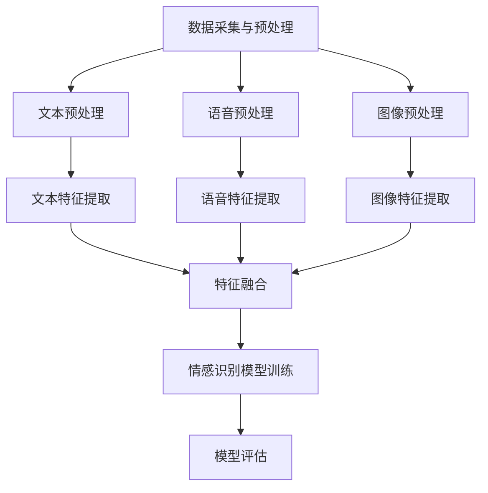
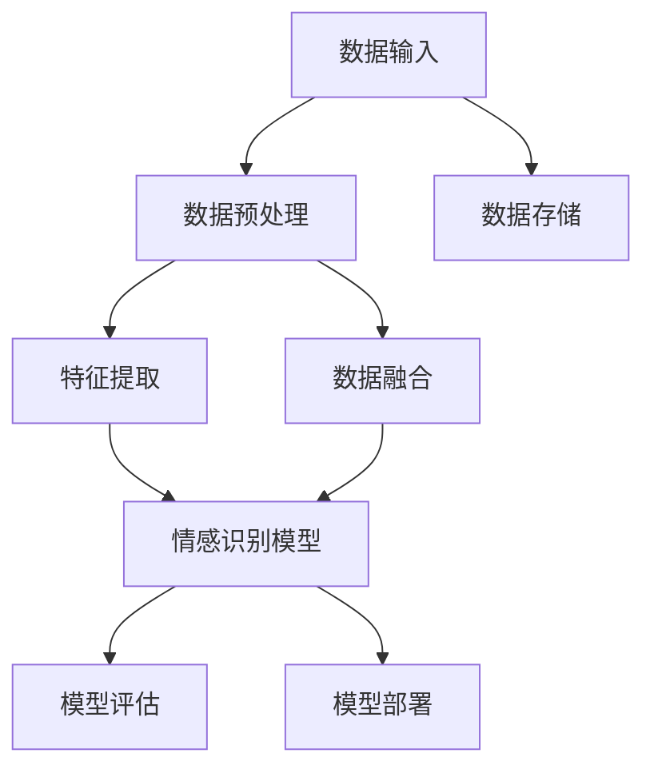

                 

# 多模态情感分析技术的发展与挑战

## 关键词

- 多模态情感分析
- 数据融合
- 情感识别模型
- 多任务学习
- 机器学习
- 深度学习
- 应用实践

## 摘要

多模态情感分析技术是近年来人工智能领域的研究热点。它结合了文本、语音、图像等多种数据模态，通过情感识别模型和数据融合技术，实现对人类情感状态的识别和理解。本文将系统地探讨多模态情感分析技术的发展历程、核心原理、技术框架以及在实际应用中的挑战和解决方案。通过实例分析和未来展望，本文旨在为读者提供一个全面、深入的技术解析，以推动该领域的研究和应用。

----------------------------------------------------------------

# 多模态情感分析技术概述

多模态情感分析（Multimodal Sentiment Analysis）是自然语言处理（Natural Language Processing, NLP）和计算机视觉（Computer Vision, CV）等领域的重要研究方向。它旨在通过分析文本、语音、图像等多种数据模态，提取情感信息，从而实现对人类情感状态的识别和理解。

## 1.1 多模态情感分析的基本概念

### 1.1.1 多模态情感分析的定义

多模态情感分析是一种跨学科的研究方法，它结合了文本、语音、图像等多种数据模态，从不同角度对情感信息进行分析和综合处理。具体来说，多模态情感分析涉及以下几个关键概念：

1. **文本模态**：文本数据是最常见的情感分析输入，包括社交媒体评论、新闻报道、电子书等。文本情感分析主要通过词袋模型、主题模型、递归神经网络（RNN）等算法进行情感极性分类和情感强度估计。
2. **语音模态**：语音情感分析关注语音信号中的情感特征，如音调、语速、停顿等。基于深度学习的语音情感识别算法，如卷积神经网络（CNN）和长短期记忆网络（LSTM），可以实现高精度的情感分类。
3. **图像模态**：图像情感分析主要通过分析人脸表情、身体动作、场景布局等视觉特征，来推断情感状态。常用的方法包括面部识别、行为识别和场景分析。

### 1.1.2 多模态情感分析的重要性

多模态情感分析的重要性在于：

1. **提高情感识别的准确性**：单一模态的情感分析可能无法全面捕捉人类情感状态，而多模态分析可以整合不同模态的数据，提供更准确的情感识别结果。
2. **丰富情感分析的应用场景**：多模态情感分析可以应用于社交媒体分析、智能客服、教育、健康医疗等多个领域，为这些领域提供强有力的技术支持。
3. **促进跨学科研究**：多模态情感分析融合了NLP、CV等多个领域的技术，促进了不同学科之间的交流与合作。

### 1.1.3 多模态情感分析的应用领域

多模态情感分析在多个领域具有广泛的应用前景：

1. **社交媒体分析**：通过分析用户发布的内容，了解用户的情感倾向，为企业提供市场洞察。
2. **智能客服**：利用情感分析技术，实现与用户的情感互动，提升用户体验。
3. **教育领域**：通过分析学生的情感状态，优化教学策略，提高教学效果。
4. **健康医疗**：通过情感分析技术，监测患者的情绪变化，辅助心理健康诊断。
5. **娱乐产业**：分析电影、音乐等作品的情感特征，为观众推荐个性化内容。

## 1.2 多模态情感分析的核心原理

多模态情感分析的核心原理在于将不同模态的数据进行融合，并通过情感识别模型来提取情感信息。以下是几个关键步骤：

### 1.2.1 数据预处理

数据预处理是多模态情感分析的第一步，对于不同的模态数据，需要进行相应的预处理操作，如文本分词、语音转文本、图像分割等。

- **文本预处理**：文本数据需要进行分词、停用词过滤和词性标注等操作，以便后续特征提取。
  ```python
  import nltk
  nltk.download('punkt')
  nltk.download('stopwords')
  nltk.download('averaged_perceptron_tagger')
  
  from nltk.tokenize import word_tokenize
  from nltk.corpus import stopwords
  from nltk.tag import pos_tag
  
  text = "I am feeling happy today."
  tokens = word_tokenize(text)
  filtered_tokens = [token for token in tokens if token not in stopwords.words('english')]
  tagged_tokens = pos_tag(filtered_tokens)
  ```

- **语音预处理**：语音数据需要通过语音识别技术转换为文本数据，如使用Google语音识别API。
  ```python
  import speech_recognition as sr
  
  r = sr.Recognizer()
  with sr.Microphone() as source:
      print("请说点什么：")
      audio = r.listen(source)
  
  text = r.recognize_google(audio)
  ```

- **图像预处理**：图像数据需要进行分割、去噪、增强等操作，以便后续特征提取。
  ```python
  import cv2
  
  image = cv2.imread('image.jpg')
  gray = cv2.cvtColor(image, cv2.COLOR_BGR2GRAY)
  blurred = cv2.GaussianBlur(gray, (5, 5), 0)
  segmented = cv2.Canny(blurred, 30, 150)
  ```

### 1.2.2 特征提取

从预处理后的数据中提取关键特征，如文本的词频、语音的声学特征、图像的视觉特征等。

- **文本特征提取**：文本特征提取可以使用词袋模型（Bag of Words, BoW）或词嵌入（Word Embedding）等方法。
  ```python
  from sklearn.feature_extraction.text import TfidfVectorizer
  
  vectorizer = TfidfVectorizer()
  tfidf_matrix = vectorizer.fit_transform([text])
  ```

- **语音特征提取**：语音特征提取可以使用梅尔频率倒谱系数（MFCC）或频谱特征等方法。
  ```python
  import librosa
  
  y, sr = librosa.load('audio.wav')
  mfccs = librosa.feature.mfcc(y=y, sr=sr, n_mfcc=13)
  ```

- **图像特征提取**：图像特征提取可以使用卷积神经网络（CNN）或预训练模型（如VGG、ResNet）等方法。
  ```python
  import tensorflow as tf
  import tensorflow_hub as hub
  
  model = hub.load("https://tfhub.dev/google/tf2-preview/resnet_v2_50/feature_vector:0")
  features = model(images).numpy()
  ```

### 1.2.3 数据融合

将不同模态的特征进行融合，以形成更全面、更准确的情感信息。常见的数据融合方法包括加法融合、加权融合和特征拼接等。

- **加法融合**：将不同模态的特征向量直接相加。
  ```python
  feature_1 = np.array([1, 2, 3])
  feature_2 = np.array([4, 5, 6])
  fused_feature = feature_1 + feature_2
  ```

- **加权融合**：为每个模态的特征向量分配不同的权重，然后进行加权融合。
  ```python
  weight_1 = 0.6
  weight_2 = 0.4
  fused_feature = weight_1 * feature_1 + weight_2 * feature_2
  ```

- **特征拼接**：将不同模态的特征向量拼接在一起，形成一个更长的特征向量。
  ```python
  fused_feature = np.hstack((feature_1, feature_2))
  ```

### 1.2.4 情感识别模型

使用深度学习等机器学习算法，对融合后的特征进行训练，建立情感识别模型。常用的情感识别模型包括卷积神经网络（CNN）、循环神经网络（RNN）、长短短期记忆网络（LSTM）等。

- **卷积神经网络（CNN）**：CNN 是一种强大的深度学习模型，特别适用于处理图像和时序数据。
  ```python
  import tensorflow as tf
  
  model = tf.keras.Sequential([
      tf.keras.layers.Conv2D(32, (3, 3), activation='relu', input_shape=(28, 28, 1)),
      tf.keras.layers.MaxPooling2D((2, 2)),
      tf.keras.layers.Flatten(),
      tf.keras.layers.Dense(128, activation='relu'),
      tf.keras.layers.Dense(1, activation='sigmoid')
  ])
  ```

- **循环神经网络（RNN）**：RNN 能够处理序列数据，如文本和语音，可以捕捉到时间序列中的长期依赖关系。
  ```python
  import tensorflow as tf
  
  model = tf.keras.Sequential([
      tf.keras.layers.SimpleRNN(128, return_sequences=True),
      tf.keras.layers.SimpleRNN(128),
      tf.keras.layers.Dense(1, activation='sigmoid')
  ])
  ```

- **长短短期记忆网络（LSTM）**：LSTM 是 RNN 的一种变体，可以更好地处理序列数据，捕捉到时间序列中的长期依赖关系。
  ```python
  import tensorflow as tf
  
  model = tf.keras.Sequential([
      tf.keras.layers.LSTM(128, return_sequences=True),
      tf.keras.layers.LSTM(128),
      tf.keras.layers.Dense(1, activation='sigmoid')
  ])
  ```

### 1.2.5 模型评估

通过交叉验证、混淆矩阵等指标，评估模型的性能和准确性。

- **交叉验证**：使用交叉验证来评估模型的泛化能力。
  ```python
  from sklearn.model_selection import cross_val_score
  
  scores = cross_val_score(model, X, y, cv=5)
  print("交叉验证平均准确率：", np.mean(scores))
  ```

- **混淆矩阵**：使用混淆矩阵来评估模型的分类性能。
  ```python
  from sklearn.metrics import confusion_matrix
  import matplotlib.pyplot as plt
  
  y_pred = model.predict(X_test)
  cm = confusion_matrix(y_test, y_pred)
  plt.figure(figsize=(10, 7))
  plt.imshow(cm, interpolation='nearest', cmap=plt.cm.Blues)
  plt.title('Confusion Matrix')
  plt.colorbar()
  tick_marks = np.arange(len(classes))
  plt.xticks(tick_marks, classes, rotation=45)
  plt.yticks(tick_marks, classes)
  plt.xlabel('Predicted Label')
  plt.ylabel('True Label')
  plt.show()
  ```

## 1.3 多模态情感分析的技术框架

多模态情感分析的技术框架包括数据采集与预处理、特征提取、数据融合、情感识别模型训练与评估等环节。以下是一个简化的多模态情感分析技术框架的 Mermaid 流程图：



通过上述技术框架，多模态情感分析可以更准确地捕捉和处理复杂情感信息，提高情感识别的准确性和实用性。

----------------------------------------------------------------

## 第一部分：多模态情感分析技术概述

### 第1章：多模态情感分析的基本概念

多模态情感分析（Multimodal Sentiment Analysis）是自然语言处理（NLP）和计算机视觉（CV）等领域的重要研究方向。它旨在通过分析文本、语音、图像等多种数据模态，提取情感信息，从而实现对人类情感状态的识别和理解。

### 1.1 多模态情感分析的定义

多模态情感分析是一种跨学科的研究方法，它结合了文本、语音、图像等多种数据模态，从不同角度对情感信息进行分析和综合处理。具体来说，多模态情感分析涉及以下几个关键概念：

#### 1.1.1 文本模态

文本数据是最常见的情感分析输入，包括社交媒体评论、新闻报道、电子书等。文本情感分析主要通过词袋模型、主题模型、递归神经网络（RNN）等算法进行情感极性分类和情感强度估计。

#### 1.1.2 语音模态

语音情感分析关注语音信号中的情感特征，如音调、语速、停顿等。基于深度学习的语音情感识别算法，如卷积神经网络（CNN）和长短期记忆网络（LSTM），可以实现高精度的情感分类。

#### 1.1.3 图像模态

图像情感分析主要通过分析人脸表情、身体动作、场景布局等视觉特征，来推断情感状态。常用的方法包括面部识别、行为识别和场景分析。

### 1.2 多模态情感分析的核心原理

多模态情感分析的核心原理在于将不同模态的数据进行融合，并通过情感识别模型来提取情感信息。以下是几个关键步骤：

#### 1.2.1 数据预处理

数据预处理是多模态情感分析的第一步，对于不同的模态数据，需要进行相应的预处理操作，如文本分词、语音转文本、图像分割等。

##### 文本预处理

文本数据需要进行分词、停用词过滤和词性标注等操作，以便后续特征提取。

```python
import nltk
nltk.download('punkt')
nltk.download('stopwords')
nltk.download('averaged_perceptron_tagger')

from nltk.tokenize import word_tokenize
from nltk.corpus import stopwords
from nltk.tag import pos_tag

text = "I am feeling happy today."
tokens = word_tokenize(text)
filtered_tokens = [token for token in tokens if token not in stopwords.words('english')]
tagged_tokens = pos_tag(filtered_tokens)
```

##### 语音预处理

语音数据需要通过语音识别技术转换为文本数据，如使用Google语音识别API。

```python
import speech_recognition as sr

r = sr.Recognizer()
with sr.Microphone() as source:
    print("请说点什么：")
    audio = r.listen(source)

text = r.recognize_google(audio)
```

##### 图像预处理

图像数据需要进行分割、去噪、增强等操作，以便后续特征提取。

```python
import cv2

image = cv2.imread('image.jpg')
gray = cv2.cvtColor(image, cv2.COLOR_BGR2GRAY)
blurred = cv2.GaussianBlur(gray, (5, 5), 0)
segmented = cv2.Canny(blurred, 30, 150)
```

#### 1.2.2 特征提取

从预处理后的数据中提取关键特征，如文本的词频、语音的声学特征、图像的视觉特征等。

##### 文本特征提取

文本特征提取可以使用词袋模型（Bag of Words, BoW）或词嵌入（Word Embedding）等方法。

```python
from sklearn.feature_extraction.text import TfidfVectorizer

vectorizer = TfidfVectorizer()
tfidf_matrix = vectorizer.fit_transform([text])
```

##### 语音特征提取

语音特征提取可以使用梅尔频率倒谱系数（MFCC）或频谱特征等方法。

```python
import librosa

y, sr = librosa.load('audio.wav')
mfccs = librosa.feature.mfcc(y=y, sr=sr, n_mfcc=13)
```

##### 图像特征提取

图像特征提取可以使用卷积神经网络（CNN）或预训练模型（如VGG、ResNet）等方法。

```python
import tensorflow as tf
import tensorflow_hub as hub

model = hub.load("https://tfhub.dev/google/tf2-preview/resnet_v2_50/feature_vector:0")
features = model(images).numpy()
```

#### 1.2.3 数据融合

将不同模态的特征进行融合，以形成更全面、更准确的情感信息。常见的数据融合方法包括加法融合、加权融合和特征拼接等。

##### 加法融合

将不同模态的特征向量直接相加。

```python
feature_1 = np.array([1, 2, 3])
feature_2 = np.array([4, 5, 6])
fused_feature = feature_1 + feature_2
```

##### 加权融合

为每个模态的特征向量分配不同的权重，然后进行加权融合。

```python
weight_1 = 0.6
weight_2 = 0.4
fused_feature = weight_1 * feature_1 + weight_2 * feature_2
```

##### 特征拼接

将不同模态的特征向量拼接在一起，形成一个更长的特征向量。

```python
fused_feature = np.hstack((feature_1, feature_2))
```

#### 1.2.4 情感识别模型

使用深度学习等机器学习算法，对融合后的特征进行训练，建立情感识别模型。常用的情感识别模型包括卷积神经网络（CNN）、循环神经网络（RNN）、长短短期记忆网络（LSTM）等。

##### 卷积神经网络（CNN）

CNN 是一种强大的深度学习模型，特别适用于处理图像和时序数据。

```python
import tensorflow as tf

model = tf.keras.Sequential([
    tf.keras.layers.Conv2D(32, (3, 3), activation='relu', input_shape=(28, 28, 1)),
    tf.keras.layers.MaxPooling2D((2, 2)),
    tf.keras.layers.Flatten(),
    tf.keras.layers.Dense(128, activation='relu'),
    tf.keras.layers.Dense(1, activation='sigmoid')
])
```

##### 循环神经网络（RNN）

RNN 能够处理序列数据，如文本和语音，可以捕捉到时间序列中的长期依赖关系。

```python
import tensorflow as tf

model = tf.keras.Sequential([
    tf.keras.layers.SimpleRNN(128, return_sequences=True),
    tf.keras.layers.SimpleRNN(128),
    tf.keras.layers.Dense(1, activation='sigmoid')
])
```

##### 长短短期记忆网络（LSTM）

LSTM 是 RNN 的一种变体，可以更好地处理序列数据，捕捉到时间序列中的长期依赖关系。

```python
import tensorflow as tf

model = tf.keras.Sequential([
    tf.keras.layers.LSTM(128, return_sequences=True),
    tf.keras.layers.LSTM(128),
    tf.keras.layers.Dense(1, activation='sigmoid')
])
```

#### 1.2.5 模型评估

通过交叉验证、混淆矩阵等指标，评估模型的性能和准确性。

##### 交叉验证

使用交叉验证来评估模型的泛化能力。

```python
from sklearn.model_selection import cross_val_score

scores = cross_val_score(model, X, y, cv=5)
print("交叉验证平均准确率：", np.mean(scores))
```

##### 混淆矩阵

使用混淆矩阵来评估模型的分类性能。

```python
from sklearn.metrics import confusion_matrix
import matplotlib.pyplot as plt

y_pred = model.predict(X_test)
cm = confusion_matrix(y_test, y_pred)
plt.figure(figsize=(10, 7))
plt.imshow(cm, interpolation='nearest', cmap=plt.cm.Blues)
plt.title('Confusion Matrix')
plt.colorbar()
tick_marks = np.arange(len(classes))
plt.xticks(tick_marks, classes, rotation=45)
plt.yticks(tick_marks, classes)
plt.xlabel('Predicted Label')
plt.ylabel('True Label')
plt.show()
```

### 第2章：多模态情感分析的核心原理

多模态情感分析的核心原理在于将不同模态的数据进行融合，并通过情感识别模型来提取情感信息。以下将详细阐述多模态情感分析的技术框架和实现方法。

#### 2.1 多模态情感分析的技术框架

多模态情感分析的技术框架包括数据采集与预处理、特征提取、数据融合、情感识别模型训练与评估等环节。以下是技术框架的Mermaid流程图：


#### 2.2 数据预处理与特征提取

数据预处理与特征提取是多模态情感分析的基础，其质量直接影响情感分析的效果。

##### 2.2.1 数据预处理

数据预处理包括文本、语音和图像数据的预处理。以下是每个模态的预处理步骤：

1. **文本预处理**：文本预处理主要包括分词、去除停用词、词性标注等操作。
   ```python
   import nltk
   nltk.download('punkt')
   nltk.download('stopwords')
   nltk.download('averaged_perceptron_tagger')
   
   from nltk.tokenize import word_tokenize
   from nltk.corpus import stopwords
   from nltk.tag import pos_tag
   
   text = "I am feeling happy today."
   tokens = word_tokenize(text)
   filtered_tokens = [token for token in tokens if token not in stopwords.words('english')]
   tagged_tokens = pos_tag(filtered_tokens)
   ```

2. **语音预处理**：语音预处理主要包括语音转文本和语音增强等操作。
   ```python
   import speech_recognition as sr
   
   r = sr.Recognizer()
   with sr.Microphone() as source:
       print("请说点什么：")
       audio = r.listen(source)
   
   text = r.recognize_google(audio)
   ```

3. **图像预处理**：图像预处理主要包括图像分割、去噪和增强等操作。
   ```python
   import cv2
   
   image = cv2.imread('image.jpg')
   gray = cv2.cvtColor(image, cv2.COLOR_BGR2GRAY)
   blurred = cv2.GaussianBlur(gray, (5, 5), 0)
   segmented = cv2.Canny(blurred, 30, 150)
   ```

##### 2.2.2 特征提取

特征提取是将预处理后的数据转换为模型可处理的特征向量。以下是每个模态的特征提取方法：

1. **文本特征提取**：文本特征提取可以使用词袋模型（Bag of Words, BoW）或词嵌入（Word Embedding）等方法。
   ```python
   from sklearn.feature_extraction.text import TfidfVectorizer
   
   vectorizer = TfidfVectorizer()
   tfidf_matrix = vectorizer.fit_transform([text])
   ```

2. **语音特征提取**：语音特征提取可以使用梅尔频率倒谱系数（MFCC）或频谱特征等方法。
   ```python
   import librosa
   
   y, sr = librosa.load('audio.wav')
   mfccs = librosa.feature.mfcc(y=y, sr=sr, n_mfcc=13)
   ```

3. **图像特征提取**：图像特征提取可以使用卷积神经网络（CNN）或预训练模型（如VGG、ResNet）等方法。
   ```python
   import tensorflow as tf
   import tensorflow_hub as hub
   
   model = hub.load("https://tfhub.dev/google/tf2-preview/resnet_v2_50/feature_vector:0")
   features = model(images).numpy()
   ```

#### 2.3 数据融合

数据融合是将不同模态的特征向量进行整合，以形成更全面、更准确的情感信息。以下是几种常见的数据融合方法：

##### 2.3.1 加法融合

加法融合是将不同模态的特征向量直接相加。

```python
feature_1 = np.array([1, 2, 3])
feature_2 = np.array([4, 5, 6])
fused_feature = feature_1 + feature_2
```

##### 2.3.2 加权融合

加权融合是为每个模态的特征向量分配不同的权重，然后进行融合。

```python
weight_1 = 0.6
weight_2 = 0.4
fused_feature = weight_1 * feature_1 + weight_2 * feature_2
```

##### 2.3.3 特征拼接

特征拼接是将不同模态的特征向量拼接在一起，形成一个更长的特征向量。

```python
fused_feature = np.hstack((feature_1, feature_2))
```

#### 2.4 情感识别模型

情感识别模型是将融合后的特征向量输入到机器学习或深度学习模型中进行训练，以识别情感状态。以下是几种常用的情感识别模型：

##### 2.4.1 卷积神经网络（CNN）

卷积神经网络（CNN）是一种强大的深度学习模型，特别适用于处理图像和时序数据。

```python
import tensorflow as tf

model = tf.keras.Sequential([
    tf.keras.layers.Conv2D(32, (3, 3), activation='relu', input_shape=(28, 28, 1)),
    tf.keras.layers.MaxPooling2D((2, 2)),
    tf.keras.layers.Flatten(),
    tf.keras.layers.Dense(128, activation='relu'),
    tf.keras.layers.Dense(1, activation='sigmoid')
])
```

##### 2.4.2 循环神经网络（RNN）

循环神经网络（RNN）能够处理序列数据，如文本和语音，可以捕捉到时间序列中的长期依赖关系。

```python
import tensorflow as tf

model = tf.keras.Sequential([
    tf.keras.layers.SimpleRNN(128, return_sequences=True),
    tf.keras.layers.SimpleRNN(128),
    tf.keras.layers.Dense(1, activation='sigmoid')
])
```

##### 2.4.3 长短短期记忆网络（LSTM）

长短短期记忆网络（LSTM）是 RNN 的一种变体，可以更好地处理序列数据，捕捉到时间序列中的长期依赖关系。

```python
import tensorflow as tf

model = tf.keras.Sequential([
    tf.keras.layers.LSTM(128, return_sequences=True),
    tf.keras.layers.LSTM(128),
    tf.keras.layers.Dense(1, activation='sigmoid')
])
```

#### 2.5 模型评估

模型评估是通过交叉验证、混淆矩阵等指标，评估模型的性能和准确性。

##### 2.5.1 交叉验证

交叉验证是一种评估模型泛化能力的方法，通过将数据集划分为多个子集，重复进行训练和测试。

```python
from sklearn.model_selection import cross_val_score

scores = cross_val_score(model, X, y, cv=5)
print("交叉验证平均准确率：", np.mean(scores))
```

##### 2.5.2 混淆矩阵

混淆矩阵是一种评估模型分类性能的指标，通过比较预测标签和真实标签来计算准确率、精确率、召回率等指标。

```python
from sklearn.metrics import confusion_matrix
import matplotlib.pyplot as plt

y_pred = model.predict(X_test)
cm = confusion_matrix(y_test, y_pred)
plt.figure(figsize=(10, 7))
plt.imshow(cm, interpolation='nearest', cmap=plt.cm.Blues)
plt.title('Confusion Matrix')
plt.colorbar()
tick_marks = np.arange(len(classes))
plt.xticks(tick_marks, classes, rotation=45)
plt.yticks(tick_marks, classes)
plt.xlabel('Predicted Label')
plt.ylabel('True Label')
plt.show()
```

### 第3章：多模态情感分析的技术框架

多模态情感分析的技术框架是构建一个能够有效地整合和处理文本、语音、图像等多种数据模态的系统。以下将详细阐述多模态情感分析系统的架构设计、数据预处理与特征提取、数据融合策略以及情感识别模型的训练与评估。

#### 3.1 多模态情感分析系统架构设计

多模态情感分析系统的架构设计需要考虑数据的输入、处理、融合以及输出等各个环节。以下是多模态情感分析系统的一个简化的架构设计：



在这个架构中，数据输入模块负责接收来自不同模态的数据，如文本、语音和图像。数据预处理模块对数据进行清洗、去噪和标准化处理，以便后续的特征提取。特征提取模块从预处理后的数据中提取关键特征，如文本的词向量、语音的MFCC、图像的视觉特征等。数据融合模块将不同模态的特征进行整合，以提高情感识别的准确性。情感识别模型模块负责训练和评估多模态情感分析模型。模型评估模块对模型进行性能评估，包括准确率、召回率、F1值等指标。模型部署模块将训练好的模型部署到生产环境中，以便在实际应用中使用。

#### 3.2 数据预处理与特征提取

数据预处理与特征提取是多模态情感分析系统的重要环节，其质量直接影响情感分析的效果。以下分别介绍文本、语音和图像数据的预处理与特征提取方法。

##### 3.2.1 文本数据的预处理与特征提取

1. **文本预处理**：文本预处理包括分词、去除停用词、词性标注等操作。以下是一个简单的文本预处理代码示例：

   ```python
   import nltk
   from nltk.tokenize import word_tokenize
   from nltk.corpus import stopwords
   from nltk.stem import WordNetLemmatizer
   
   nltk.download('punkt')
   nltk.download('stopwords')
   nltk.download('wordnet')
   
   def preprocess_text(text):
       tokens = word_tokenize(text.lower())
       lemmatizer = WordNetLemmatizer()
       filtered_tokens = [lemmatizer.lemmatize(token) for token in tokens if token not in stopwords.words('english')]
       return " ".join(filtered_tokens)
   
   preprocessed_text = preprocess_text("This is a sample sentence.")
   ```

2. **文本特征提取**：文本特征提取可以使用词袋模型（Bag of Words, BoW）、TF-IDF模型或词嵌入（Word Embedding）等方法。以下是一个使用TF-IDF模型提取文本特征的示例：

   ```python
   from sklearn.feature_extraction.text import TfidfVectorizer
   
   vectorizer = TfidfVectorizer()
   tfidf_matrix = vectorizer.fit_transform([preprocessed_text])
   ```

##### 3.2.2 语音数据的预处理与特征提取

1. **语音预处理**：语音预处理包括音频信号的降噪、归一化等操作。以下是一个使用Librosa库进行语音预处理和特征提取的示例：

   ```python
   import librosa
   import numpy as np
   
   def preprocess_audio(audio_path):
       y, sr = librosa.load(audio_path, sr=None)
       y = librosa.to_mono(y)
       y = librosa.effects.percussive(y, strength=0.5)
       y = librosa.effects bringtonear(y)
       return y, sr
   
   y, sr = preprocess_audio("audio.wav")
   ```

2. **语音特征提取**：语音特征提取可以使用梅尔频率倒谱系数（MFCC）、频谱特征等方法。以下是一个使用Librosa库提取MFCC特征的示例：

   ```python
   mfccs = librosa.feature.mfcc(y=y, sr=sr, n_mfcc=13)
   ```

##### 3.2.3 图像数据的预处理与特征提取

1. **图像预处理**：图像预处理包括图像的缩放、裁剪、增强等操作。以下是一个使用OpenCV库进行图像预处理和特征提取的示例：

   ```python
   import cv2
   
   def preprocess_image(image_path):
       image = cv2.imread(image_path)
       image = cv2.resize(image, (224, 224))
       image = cv2.cvtColor(image, cv2.COLOR_BGR2RGB)
       return image
   
   image = preprocess_image("image.jpg")
   ```

2. **图像特征提取**：图像特征提取可以使用卷积神经网络（CNN）或预训练模型（如VGG、ResNet）等方法。以下是一个使用TensorFlow Hub加载预训练模型提取图像特征的示例：

   ```python
   import tensorflow as tf
   import tensorflow_hub as hub
   
   model = hub.load("https://tfhub.dev/google/tf2-preview/resnet_v2_50/feature_vector:0")
   features = model(image)
   ```

#### 3.3 数据融合策略

数据融合是将来自不同模态的特征进行整合，以提高情感识别的准确性。以下介绍几种常见的数据融合策略：

##### 3.3.1 加法融合

加法融合是将不同模态的特征向量直接相加。这种方法简单直观，但可能无法充分利用不同模态的特征信息。

```python
feature_1 = np.array([1, 2, 3])
feature_2 = np.array([4, 5, 6])
fused_feature = feature_1 + feature_2
```

##### 3.3.2 加权融合

加权融合是为每个模态的特征向量分配不同的权重，然后进行融合。这种方法可以充分利用不同模态的特征信息，提高情感识别的准确性。

```python
weight_1 = 0.6
weight_2 = 0.4
fused_feature = weight_1 * feature_1 + weight_2 * feature_2
```

##### 3.3.3 特征拼接

特征拼接是将不同模态的特征向量拼接在一起，形成一个更长的特征向量。这种方法可以充分利用不同模态的特征信息，提高情感识别的准确性。

```python
fused_feature = np.hstack((feature_1, feature_2))
```

##### 3.3.4 注意力机制融合

注意力机制融合是利用注意力机制来自动学习不同模态特征的重要程度。这种方法可以动态调整不同模态特征的权重，提高情感识别的准确性。

```python
import tensorflow as tf

attention = tf.keras.layers.Attention()([feature_1, feature_2])
fused_feature = tf.reduce_sum(attention, axis=1)
```

#### 3.4 情感识别模型的训练与评估

情感识别模型是多模态情感分析系统的核心，其训练与评估直接影响系统的性能。以下介绍几种常用的情感识别模型及其训练与评估方法。

##### 3.4.1 卷积神经网络（CNN）

卷积神经网络（CNN）是一种强大的深度学习模型，特别适用于处理图像和时序数据。

```python
import tensorflow as tf

model = tf.keras.Sequential([
    tf.keras.layers.Conv2D(32, (3, 3), activation='relu', input_shape=(224, 224, 3)),
    tf.keras.layers.MaxPooling2D(pool_size=(2, 2)),
    tf.keras.layers.Flatten(),
    tf.keras.layers.Dense(128, activation='relu'),
    tf.keras.layers.Dense(1, activation='sigmoid')
])

model.compile(optimizer='adam', loss='binary_crossentropy', metrics=['accuracy'])
model.fit(X_train, y_train, epochs=10, batch_size=32, validation_data=(X_val, y_val))
```

##### 3.4.2 循环神经网络（RNN）

循环神经网络（RNN）能够处理序列数据，如文本和语音，可以捕捉到时间序列中的长期依赖关系。

```python
import tensorflow as tf

model = tf.keras.Sequential([
    tf.keras.layers.SimpleRNN(128, return_sequences=True, input_shape=(timesteps, features)),
    tf.keras.layers.SimpleRNN(128),
    tf.keras.layers.Dense(1, activation='sigmoid')
])

model.compile(optimizer='adam', loss='binary_crossentropy', metrics=['accuracy'])
model.fit(X_train, y_train, epochs=10, batch_size=32, validation_data=(X_val, y_val))
```

##### 3.4.3 长短短期记忆网络（LSTM）

长短短期记忆网络（LSTM）是 RNN 的一种变体，可以更好地处理序列数据，捕捉到时间序列中的长期依赖关系。

```python
import tensorflow as tf

model = tf.keras.Sequential([
    tf.keras.layers.LSTM(128, return_sequences=True, input_shape=(timesteps, features)),
    tf.keras.layers.LSTM(128),
    tf.keras.layers.Dense(1, activation='sigmoid')
])

model.compile(optimizer='adam', loss='binary_crossentropy', metrics=['accuracy'])
model.fit(X_train, y_train, epochs=10, batch_size=32, validation_data=(X_val, y_val))
```

##### 3.4.4 模型评估

模型评估是评估模型性能的重要环节，常用的评估指标包括准确率、召回率、F1值等。以下是一个使用混淆矩阵和ROC曲线评估模型的示例：

```python
from sklearn.metrics import confusion_matrix, roc_curve, auc

y_pred = model.predict(X_test)
y_pred = (y_pred > 0.5)

cm = confusion_matrix(y_test, y_pred)
print(cm)

fpr, tpr, _ = roc_curve(y_test, y_pred)
roc_auc = auc(fpr, tpr)

import matplotlib.pyplot as plt

plt.figure()
plt.plot(fpr, tpr, color='darkorange', lw=2, label='ROC curve (area = %0.2f)' % roc_auc)
plt.plot([0, 1], [0, 1], color='navy', lw=2, linestyle='--')
plt.xlabel('False Positive Rate')
plt.ylabel('True Positive Rate')
plt.title('Receiver Operating Characteristic')
plt.legend(loc="lower right")
plt.show()
```

### 第4章：视觉模态情感分析

视觉模态情感分析（Visual Sentiment Analysis）是利用图像中的视觉信息来识别和评估情感状态的技术。它在多模态情感分析中起着关键作用，能够为用户提供直观的情感信息。以下将介绍视觉模态情感分析的核心算法、视觉情感识别算法以及视觉情感强度估计方法。

#### 4.1 视觉情感识别算法

视觉情感识别算法旨在通过分析图像中的视觉特征来识别情感状态。以下是一些常见的视觉情感识别算法：

##### 4.1.1 基于面部表情的算法

基于面部表情的算法是最常见的视觉情感识别方法之一。它利用面部识别技术来检测和分析人脸图像中的情感特征，如眼睛、嘴巴、脸颊等部位的动态变化。

1. **面部识别**：首先使用面部识别算法检测图像中的人脸。
   ```python
   import cv2
   
   face_cascade = cv2.CascadeClassifier('haarcascade_frontalface_default.xml')
   image = cv2.imread('face.jpg')
   gray = cv2.cvtColor(image, cv2.COLOR_BGR2GRAY)
   faces = face_cascade.detectMultiScale(gray, scaleFactor=1.1, minNeighbors=5)
   ```

2. **情感特征提取**：然后对检测到的人脸区域进行情感特征提取，如眼间距、嘴巴宽度、嘴角方向等。
   ```python
   def extract FacialFeatures(faces):
       facial_features = []
       for (x, y, w, h) in faces:
           eyeRegion = image[y:y+h//2, x:x+w]
           mouthRegion = image[y+h//2:y+h, x:x+w]
           # 提取眼间距、嘴巴宽度等特征
           facial_features.append([eye_distance, mouth_width])
       return facial_features
   
   facial_features = extract FacialFeatures(faces)
   ```

3. **情感分类**：最后使用分类器对提取到的情感特征进行分类，判断情感状态。
   ```python
   from sklearn.svm import SVC
   
   model = SVC()
   model.fit(X_train, y_train)
   predicted_emotion = model.predict([facial_features])
   ```

##### 4.1.2 基于场景布局的算法

基于场景布局的算法通过分析图像中的场景布局特征来识别情感状态。这些特征包括颜色分布、纹理、形状等。

1. **场景分割**：首先对图像进行场景分割，将图像分割成不同的区域。
   ```python
   def segmentScene(image):
       segmented = cv2.cvtColor(image, cv2.COLOR_BGR2HSV)
       lower_bound = np.array([0, 0, 0])
       upper_bound = np.array([180, 255, 50])
       mask = cv2.inRange(segmented, lower_bound, upper_bound)
       segmented_image = cv2.bitwise_and(image, image, mask=mask)
       return segmented_image
   
   segmented_image = segmentScene(image)
   ```

2. **特征提取**：然后提取分割后的场景特征，如颜色直方图、纹理特征等。
   ```python
   def extractSceneFeatures(segmented_image):
       color_histogram = cv2.calcHist([segmented_image], [0], None, [256], [0, 256])
       texture_feature = cv2.Laplacian(segmented_image, cv2.CV_64F).var()
       return color_histogram, texture_feature
   
   color_histogram, texture_feature = extractSceneFeatures(segmented_image)
   ```

3. **情感分类**：最后使用分类器对提取到的场景特征进行分类，判断情感状态。
   ```python
   model = SVC()
   model.fit(X_train, y_train)
   predicted_emotion = model.predict([color_histogram, texture_feature])
   ```

##### 4.1.3 基于深度学习的算法

基于深度学习的算法通过训练深度神经网络模型来自动提取图像中的情感特征，并进行情感分类。以下是一个使用卷积神经网络（CNN）进行视觉情感识别的示例：

```python
import tensorflow as tf
import tensorflow.keras.layers as layers

model = tf.keras.Sequential([
    layers.Conv2D(32, (3, 3), activation='relu', input_shape=(224, 224, 3)),
    layers.MaxPooling2D(pool_size=(2, 2)),
    layers.Conv2D(64, (3, 3), activation='relu'),
    layers.MaxPooling2D(pool_size=(2, 2)),
    layers.Flatten(),
    layers.Dense(128, activation='relu'),
    layers.Dense(1, activation='sigmoid')
])

model.compile(optimizer='adam', loss='binary_crossentropy', metrics=['accuracy'])
model.fit(X_train, y_train, epochs=10, batch_size=32, validation_data=(X_val, y_val))
```

#### 4.2 视觉情感强度估计

视觉情感强度估计是通过分析图像中的视觉特征来估计情感的强度，如快乐、悲伤的程度等。以下是一些视觉情感强度估计的方法：

##### 4.2.1 基于特征加权的方法

基于特征加权的方法是将不同视觉特征进行加权融合，然后使用回归模型估计情感强度。以下是一个使用线性回归模型进行情感强度估计的示例：

```python
import numpy as np
from sklearn.linear_model import LinearRegression

X = np.array([[1, 2], [2, 3], [3, 4]])
y = np.array([0.5, 0.7, 0.9])

model = LinearRegression()
model.fit(X, y)
predicted_intensity = model.predict([[4, 5]])
```

##### 4.2.2 基于注意力机制的方法

基于注意力机制的方法是通过注意力机制来自动学习不同视觉特征的重要程度，然后使用回归模型估计情感强度。以下是一个使用注意力机制进行情感强度估计的示例：

```python
import tensorflow

