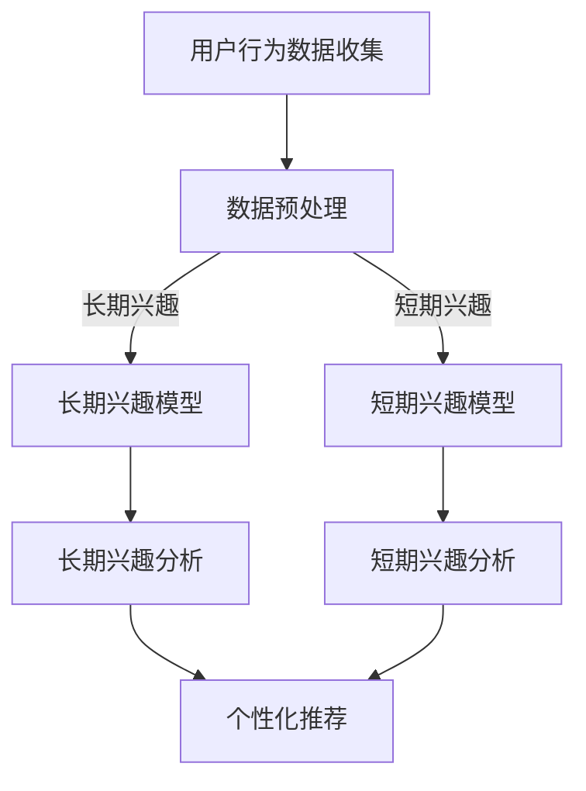

                 

## 文章标题

在当今数字化时代，推荐系统已成为提升用户体验、实现个性化服务的关键技术。尤其是在大模型推荐领域，如何准确捕捉和预测用户的兴趣，成为了研究的焦点。本文将探讨大模型推荐中的用户长短期兴趣建模方法，通过对相关基础理论、算法原理、实践应用的详细剖析，为读者提供全面的技术视角。

### 关键词

- 用户兴趣建模
- 长短期兴趣
- 推荐系统
- 协同过滤
- 基于内容推荐
- 深度学习
- 时间序列分析

### 摘要

本文首先介绍了用户兴趣建模的基础理论，包括用户兴趣的概念与分类、数据收集与处理方法、以及常用的建模方法与算法。随后，文章深入探讨了长短期兴趣建模的基本概念、数据预处理方法以及具体的建模策略。最后，通过一个实际项目案例，详细阐述了长短期用户兴趣建模的开发与部署流程，以及未来发展趋势和挑战。本文旨在为研究人员和工程师提供一套系统、实用的用户兴趣建模解决方案，以提升大模型推荐系统的效果和用户体验。

---

## 目录大纲

本文分为三大部分，共11章。第一部分是用户兴趣建模基础理论，包括用户兴趣建模概述、用户兴趣数据收集与处理、用户兴趣建模方法与算法、用户兴趣模型的评估与优化。第二部分是长短期用户兴趣建模方法，包括长短期兴趣建模基本概念、长短期兴趣数据预处理、长短期兴趣建模方法、长短期用户兴趣模型评估与优化。第三部分是长短期用户兴趣建模实践，包括长短期用户兴趣建模项目实战、长短期用户兴趣模型开发与部署、长短期用户兴趣建模前沿技术与趋势。以下是详细的目录大纲：

### 第一部分：用户兴趣建模基础理论

#### 第1章：用户兴趣建模概述

- 1.1 用户兴趣的概念与分类
- 1.2 用户兴趣建模的重要性
- 1.3 用户兴趣建模的目标与挑战

#### 第2章：用户兴趣数据收集与处理

- 2.1 用户行为数据的收集方法
- 2.2 用户兴趣数据的预处理技术
- 2.3 用户画像构建方法

#### 第3章：用户兴趣建模方法与算法

- 3.1 协同过滤方法
- 3.2 基于内容的推荐方法
- 3.3 深度学习方法在用户兴趣建模中的应用

#### 第4章：用户兴趣模型的评估与优化

- 4.1 用户兴趣模型评估指标
- 4.2 用户兴趣模型的优化策略
- 4.3 实时性与个性化优化

### 第二部分：长短期用户兴趣建模方法

#### 第5章：长短期兴趣建模基本概念

- 5.1 长短期兴趣的定义与特征
- 5.2 长短期兴趣的影响因素
- 5.3 长短期兴趣建模的意义

#### 第6章：长短期兴趣数据预处理

- 6.1 长短期兴趣数据的特征提取
- 6.2 时间序列分析技术
- 6.3 长短期兴趣数据的融合方法

#### 第7章：长短期兴趣建模方法

- 7.1 基于时间序列分析的建模方法
- 7.2 基于变换网络的建模方法
- 7.3 基于图神经网络的建模方法

#### 第8章：长短期用户兴趣模型评估与优化

- 8.1 长短期用户兴趣模型的评估指标
- 8.2 长短期用户兴趣模型的优化策略
- 8.3 案例分析与实战

### 第三部分：长短期用户兴趣建模实践

#### 第9章：长短期用户兴趣建模项目实战

- 9.1 项目背景与目标
- 9.2 项目数据来源与预处理
- 9.3 长短期兴趣建模方法应用

#### 第10章：长短期用户兴趣模型开发与部署

- 10.1 长短期用户兴趣模型开发流程
- 10.2 长短期用户兴趣模型部署策略
- 10.3 模型调优与性能评估

#### 第11章：长短期用户兴趣建模前沿技术与趋势

- 11.1 前沿技术研究现状
- 11.2 长短期用户兴趣建模的未来趋势
- 11.3 技术展望与挑战

---

## 核心概念原理和架构的 Mermaid 流程图

为了更好地理解用户兴趣建模的整体架构，我们可以使用Mermaid流程图来展示核心概念和原理。以下是核心概念和架构的Mermaid流程图：



在这个流程图中，用户行为数据收集是整个系统的起点，经过数据预处理后，分别进入长期兴趣模型和短期兴趣模型。长期兴趣模型和短期兴趣模型分别对用户的行为进行分析，生成长期和短期的兴趣特征。这些兴趣特征最终用于个性化推荐，以实现精准的推荐效果。

---

## 用户兴趣建模基础理论

用户兴趣建模是推荐系统中最核心的部分之一，它直接决定了推荐系统的性能和用户体验。在这一部分，我们将深入探讨用户兴趣建模的基础理论，包括用户兴趣的概念与分类、用户兴趣数据收集与处理方法、用户兴趣建模方法与算法，以及用户兴趣模型的评估与优化。

### 第1章：用户兴趣建模概述

#### 1.1 用户兴趣的概念与分类

**1.1.1 用户兴趣的定义**

用户兴趣是指用户在特定环境下对某一类信息、物品或活动的倾向性。兴趣可以表现为用户的行为、反馈或心理状态，是推荐系统进行个性化推荐的重要依据。

**1.1.2 用户兴趣的分类**

用户兴趣可以从不同的角度进行分类。常见的分类方法包括：

- **显式兴趣**：用户通过主动行为（如点击、评分、购买等）表达的兴趣。
- **隐式兴趣**：用户通过被动行为（如浏览、搜索、收藏等）间接表达的兴趣。
- **长期兴趣**：用户在长期内持续表现出的兴趣，通常较为稳定。
- **短期兴趣**：用户在短期内表现出的兴趣，可能随着时间、环境等因素的变化而变化。

**1.1.3 用户兴趣模型的层次结构**

用户兴趣模型通常分为三个层次：

- **底层**：基于用户行为的原始数据，如点击、浏览、搜索等。
- **中层**：对底层数据进行处理和转化，生成用户兴趣特征。
- **高层**：基于用户兴趣特征进行个性化推荐。

#### 1.2 用户兴趣建模的重要性

用户兴趣建模在推荐系统中具有至关重要的地位，其主要作用包括：

- **提升推荐准确性**：通过用户兴趣建模，能够更准确地捕捉用户的兴趣，从而提高推荐系统的准确性。
- **实现个性化推荐**：用户兴趣建模有助于实现真正的个性化推荐，满足用户的个性化需求。
- **提升用户体验**：个性化的推荐结果能够提高用户的满意度，提升用户体验。

#### 1.3 用户兴趣建模的目标与挑战

用户兴趣建模的目标是构建一个高效、准确、实时的用户兴趣模型，以实现个性化的推荐服务。然而，在这一过程中，面临着诸多挑战：

- **数据复杂性**：用户行为数据类型多样，且数据量大，如何有效地处理这些数据是一个挑战。
- **动态变化性**：用户的兴趣是动态变化的，如何捕捉和适应这种变化是一个挑战。
- **实时性**：在推荐系统中，需要快速响应用户的反馈，实现实时推荐，这要求用户兴趣模型具有高实时性。

### 第2章：用户兴趣数据收集与处理

#### 2.1 用户行为数据的收集方法

用户行为数据的收集是用户兴趣建模的基础。常见的用户行为数据收集方法包括：

- **显式收集**：通过用户的主动操作（如点击、评分、购买等）收集数据。
- **隐式收集**：通过用户的被动行为（如浏览、搜索、收藏等）收集数据。
- **传感器数据**：利用智能设备（如智能手机、平板电脑等）的传感器收集数据，如地理位置、设备使用情况等。

#### 2.2 用户兴趣数据的预处理技术

用户兴趣数据的预处理是数据分析和建模的关键步骤。预处理技术包括：

- **数据清洗**：去除噪声数据、缺失数据和重复数据，保证数据质量。
- **特征提取**：从原始数据中提取有用的特征，为建模提供基础。
- **数据归一化**：将数据转换到相同的尺度范围内，便于后续处理和分析。

#### 2.3 用户画像构建方法

用户画像是对用户特征的全面描述，是用户兴趣建模的重要基础。用户画像的构建方法包括：

- **基于规则的构建方法**：根据业务规则和用户行为数据，自动生成用户画像。
- **基于机器学习的构建方法**：利用机器学习算法，自动学习用户的兴趣特征，构建用户画像。
- **多源数据的融合方法**：将不同来源的数据进行融合，生成更全面、准确的用户画像。

### 第3章：用户兴趣建模方法与算法

用户兴趣建模方法分为协同过滤方法、基于内容的推荐方法、深度学习方法等。每种方法都有其独特的原理和适用场景。

#### 3.1 协同过滤方法

协同过滤方法是基于用户行为数据，通过计算用户之间的相似性，实现个性化推荐的一种方法。协同过滤方法分为以下两种：

- **基于用户的协同过滤**：通过计算用户之间的相似性，找到与目标用户相似的其他用户，推荐这些用户喜欢的物品。
- **基于项目的协同过滤**：通过计算物品之间的相似性，找到与目标物品相似的其他物品，推荐给用户。

#### 3.2 基于内容的推荐方法

基于内容的推荐方法是基于物品的内容特征，通过计算用户和物品之间的相似性，实现个性化推荐的一种方法。基于内容的推荐方法包括：

- **基于文本的推荐**：通过分析物品的文本描述，计算用户和物品之间的相似性。
- **基于属性的推荐**：通过分析物品的属性特征，计算用户和物品之间的相似性。

#### 3.3 深度学习方法在用户兴趣建模中的应用

深度学习方法通过学习用户行为数据和物品特征，自动提取用户和物品的潜在特征，实现个性化推荐。深度学习方法在用户兴趣建模中的应用包括：

- **卷积神经网络（CNN）**：通过卷积操作提取用户行为数据和物品特征的空间特征。
- **循环神经网络（RNN）**：通过循环结构捕捉用户行为数据和物品特征的序列特征。
- **变换器（Transformer）**：通过自注意力机制提取用户行为数据和物品特征的上下文特征。

### 第4章：用户兴趣模型的评估与优化

用户兴趣模型的评估与优化是保证推荐系统性能的关键。评估指标包括：

- **准确性**：模型预测与实际结果的匹配程度。
- **召回率**：模型能够召回实际感兴趣项目的比例。
- **覆盖率**：模型能够推荐的项目多样性。
- **实时性**：模型处理新数据并生成推荐的速度。

优化策略包括：

- **特征工程**：通过特征提取和特征选择，提高模型性能。
- **模型调参**：通过调整模型参数，优化模型性能。
- **模型集成**：通过融合多个模型，提高模型性能。

#### 4.1 用户兴趣模型评估指标

常用的评估指标包括：

- **准确率**：预测正确的项目数量与总项目数量的比值。
- **召回率**：预测正确的项目数量与实际感兴趣项目的数量的比值。
- **F1值**：准确率和召回率的调和平均值。
- **MRR（Mean Reciprocal Rank）**：预测项目的平均倒数排名。

#### 4.2 用户兴趣模型的优化策略

优化策略包括：

- **特征优化**：通过特征提取和特征选择，提高模型性能。
- **模型调参**：通过调整模型参数，优化模型性能。
- **实时性优化**：通过优化模型结构和算法，提高模型的实时性。
- **个性化优化**：通过结合用户历史数据和实时数据，实现个性化推荐。

#### 4.3 实时性与个性化优化

实时性与个性化优化是用户兴趣模型优化的重要方面。实时性优化旨在提高模型处理新数据并生成推荐的速度，而个性化优化旨在根据用户历史数据实现更精准的推荐。实现策略包括：

- **增量学习**：通过增量学习，实时更新用户兴趣模型。
- **在线学习**：通过在线学习，实时响应用户反馈，优化模型。
- **多模型融合**：通过融合多个模型，提高模型性能和实时性。

通过以上对用户兴趣建模基础理论的详细探讨，我们可以更好地理解和应用用户兴趣建模技术，实现更准确、个性化的推荐系统。

---

## 长短期用户兴趣建模方法

在推荐系统中，捕捉用户的长短期兴趣对于实现高效的个性化推荐至关重要。长期兴趣通常反映用户的稳定偏好，而短期兴趣则可能随时间、情境等因素的变化而变化。因此，本文将详细探讨长短期用户兴趣建模的基本概念、数据预处理方法以及具体的建模策略。

### 第5章：长短期兴趣建模基本概念

#### 5.1 长短期兴趣的定义与特征

**5.1.1 长短期兴趣的定义**

- **长期兴趣**：用户在较长时间范围内持续表现出的兴趣，通常与用户的个性、价值观、职业背景等因素相关。
- **短期兴趣**：用户在短期内表现出的兴趣，可能受到当前情境、时间节点、流行趋势等因素的影响。

**5.1.2 长短期兴趣的特征分析**

- **长期兴趣特征**：
  - 稳定性：长期兴趣相对稳定，不易受外界因素影响。
  - 深层性：与用户的内心需求、价值观等深层因素相关。
  - 持续性：长期兴趣在较长一段时间内持续存在。

- **短期兴趣特征**：
  - 变异性：短期兴趣受外界因素影响较大，变化较快。
  - 表面性：短期兴趣通常与用户的即时行为、兴趣爱好等表面因素相关。
  - 短暂性：短期兴趣可能只存在于特定的时间段或情境中。

#### 5.2 长短期兴趣的影响因素

**5.2.1 用户行为习惯**

用户的长期行为习惯对其长期兴趣有显著影响，例如阅读习惯、购物偏好等。而短期行为习惯则可能影响用户的短期兴趣，如临时决策、情境性消费等。

**5.2.2 社会文化背景**

社会文化背景对用户兴趣的形成和发展有着深远的影响。不同文化背景下，用户的兴趣偏好可能存在显著差异。

**5.2.3 时间因素**

时间因素是影响用户兴趣变化的重要因素。例如，节假日、促销活动等特定时间节点可能触发用户的短期兴趣。

#### 5.3 长短期兴趣建模的意义

**5.3.1 提高推荐系统的准确性**

通过捕捉用户的长短期兴趣，可以更准确地预测用户的兴趣变化，从而提高推荐系统的准确性。

**5.3.2 应对用户行为的动态变化**

用户兴趣是动态变化的，长短期兴趣建模能够帮助推荐系统实时适应用户兴趣的变化，提供更个性化的推荐。

**5.3.3 实现精准营销**

理解用户的长短期兴趣有助于企业实现精准营销，提升营销效果和用户满意度。

### 第6章：长短期兴趣数据预处理

**6.1 长短期兴趣数据的特征提取**

**6.1.1 长期兴趣特征提取**

- **基于用户行为的特征提取**：从用户的历史行为数据中提取长期兴趣特征，如用户经常浏览或购买的物品类型、时间分布等。
- **基于社会文化背景的特征提取**：根据用户的社会文化背景，提取相应的兴趣特征，如职业、年龄、教育程度等。

**6.1.2 短期兴趣特征提取**

- **基于用户实时行为的特征提取**：从用户的实时行为数据中提取短期兴趣特征，如当前用户的浏览记录、搜索关键词等。
- **基于情境的特征提取**：根据当前情境（如时间、地点、活动等）提取短期兴趣特征。

**6.2 时间序列分析技术**

**6.2.1 长期时间序列分析**

- **趋势分析**：分析用户兴趣随时间的变化趋势，识别用户长期兴趣的稳定性。
- **季节性分析**：分析用户兴趣随时间周期性变化的规律，识别用户长期兴趣的周期性。

**6.2.2 短期时间序列分析**

- **事件驱动分析**：分析用户在特定事件（如促销活动、节假日等）下的行为变化，识别用户短期兴趣。
- **实时序列分析**：分析用户实时行为序列，捕捉用户短期兴趣的动态变化。

**6.3 长短期兴趣数据的融合方法**

**6.3.1 数据加权融合**

- **基于时间加权的融合**：根据时间窗口对不同时间点的兴趣数据进行加权，赋予近期数据更高的权重。
- **基于行为类型的加权融合**：根据用户行为类型对兴趣数据加权，如对购买行为赋予更高的权重。

**6.3.2 数据集成融合**

- **基于特征的集成融合**：将长期和短期兴趣特征进行融合，构建一个综合的用户兴趣特征向量。
- **基于模型的集成融合**：利用集成学习方法，将长期和短期兴趣模型的结果进行融合，提高推荐系统的准确性。

### 第7章：长短期兴趣建模方法

**7.1 基于时间序列分析的建模方法**

**7.1.1 长期兴趣建模方法**

- **ARIMA模型**：通过自回归积分滑动平均模型捕捉用户长期兴趣的趋势和季节性。
- **LSTM模型**：通过长短时记忆网络捕捉用户长期兴趣的时序特征。

**7.1.2 短期兴趣建模方法**

- **基于时间窗口的模型**：通过构建滑动时间窗口，利用卷积神经网络（CNN）或循环神经网络（RNN）捕捉用户短期兴趣。
- **基于事件的模型**：通过分析用户在特定事件下的行为，利用决策树、随机森林等算法捕捉用户短期兴趣。

**7.2 基于变换网络的建模方法**

**7.2.1 长期兴趣建模方法**

- **Transformer模型**：通过自注意力机制捕捉用户长期兴趣的上下文信息。

**7.2.2 短期兴趣建模方法**

- **基于变换器的序列模型**：结合Transformer模型和长短时记忆网络（LSTM），捕捉用户短期兴趣的动态变化。

**7.3 基于图神经网络的建模方法**

**7.3.1 长期兴趣建模方法**

- **图神经网络（GNN）**：通过图结构捕捉用户长期兴趣的网络关系。

**7.3.2 短期兴趣建模方法**

- **图卷积网络（GCN）**：通过图卷积操作捕捉用户短期兴趣的局部特征。

### 第8章：长短期用户兴趣模型评估与优化

**8.1 长短期用户兴趣模型的评估指标**

**8.1.1 长期兴趣模型评估指标**

- **准确性**：预测用户长期兴趣的准确性。
- **稳定性**：长期兴趣模型对用户兴趣变化的稳定捕捉能力。

**8.1.2 短期兴趣模型评估指标**

- **实时性**：短期兴趣模型对用户实时行为的响应速度。
- **适应性**：短期兴趣模型对用户兴趣动态变化的适应能力。

**8.2 长短期用户兴趣模型的优化策略**

**8.2.1 长期兴趣模型优化策略**

- **特征优化**：通过特征选择和特征工程，提高长期兴趣模型的准确性。
- **模型调参**：通过调整模型参数，优化长期兴趣模型的表现。

**8.2.2 短期兴趣模型优化策略**

- **实时数据处理**：通过增量学习和在线学习，提高短期兴趣模型的实时性。
- **多模型融合**：通过融合长期和短期兴趣模型，提高推荐系统的整体性能。

**8.3 案例分析与实战**

**8.3.1 案例背景**

本文以一个在线购物平台为例，分析如何构建和优化长短期用户兴趣模型，以提升推荐系统的性能。

**8.3.2 数据集与预处理**

- 数据集介绍：使用用户行为数据集，包括浏览、购买、搜索等行为。
- 数据预处理：进行数据清洗、特征提取和时间序列分析。

**8.3.3 建模方法应用**

- **长期兴趣建模**：使用ARIMA模型和LSTM模型捕捉用户长期兴趣。
- **短期兴趣建模**：使用基于时间窗口的模型和基于事件的模型捕捉用户短期兴趣。

**8.3.4 模型评估与优化**

- **评估指标**：使用准确性、稳定性、实时性和适应性等指标评估长短期兴趣模型。
- **优化策略**：通过特征优化和模型调参，优化长短期兴趣模型。

通过上述对长短期用户兴趣建模方法的详细探讨，我们可以更有效地捕捉和利用用户的长短期兴趣，提升推荐系统的个性化推荐能力。

---

## 长短期用户兴趣数据预处理

在构建长短期用户兴趣模型之前，对原始数据进行有效的预处理是至关重要的。预处理过程包括数据清洗、特征提取和时间序列分析，这些步骤能够显著提升模型性能和准确性。以下将详细探讨这些预处理方法及其在长短期用户兴趣建模中的应用。

### 6.1 长短期兴趣数据的特征提取

**6.1.1 长期兴趣特征提取**

长期兴趣特征通常反映了用户在较长时间范围内的稳定行为模式。以下是几种常见的长期兴趣特征提取方法：

- **基于用户行为的特征提取**：通过分析用户的长期行为数据（如浏览、购买、收藏等），可以提取出用户在特定类别或品牌上的频繁行为模式。例如，可以使用频繁模式挖掘算法（如Apriori算法）识别用户经常浏览或购买的物品类型。

  ```mermaid
  graph TD
  A[用户历史行为] --> B[频繁模式挖掘]
  B --> C[提取长期兴趣特征]
  ```

- **基于社会文化背景的特征提取**：根据用户的社会文化背景（如年龄、性别、职业、教育程度等），可以提取出与用户长期兴趣相关的特征。这些特征可以作为用户的固定属性，用于构建长期兴趣模型。

  ```mermaid
  graph TD
  A[用户基本信息] --> B[特征提取]
  B --> C[社会文化背景特征]
  ```

**6.1.2 短期兴趣特征提取**

短期兴趣特征通常与用户的即时行为和情境相关。以下是几种常见的短期兴趣特征提取方法：

- **基于用户实时行为的特征提取**：通过分析用户在短时间窗口内的行为数据（如浏览记录、搜索关键词等），可以提取出用户的短期兴趣特征。例如，可以使用时间窗口滑动的方法，将用户在一段时间内的行为数据聚合为特征向量。

  ```mermaid
  graph TD
  A[用户实时行为] --> B[时间窗口滑动]
  B --> C[聚合为特征向量]
  ```

- **基于情境的特征提取**：根据用户所处的情境（如时间、地点、活动等），可以提取出与用户短期兴趣相关的情境特征。例如，在特定时间（如周末、节假日）或地点（如商场、机场）下，用户的行为特征可能与短期兴趣相关。

  ```mermaid
  graph TD
  A[用户情境信息] --> B[特征提取]
  B --> C[情境特征]
  ```

### 6.2 时间序列分析技术

时间序列分析是一种重要的数据分析方法，用于识别和分析时间序列数据中的趋势、季节性和周期性。以下是几种常用的时间序列分析技术：

**6.2.1 长期时间序列分析**

- **趋势分析**：识别时间序列数据中的长期趋势，如用户长期行为模式的变化趋势。可以使用线性回归、移动平均等方法进行趋势分析。

  ```mermaid
  graph TD
  A[时间序列数据] --> B[线性回归]
  B --> C[识别趋势]
  ```

- **季节性分析**：识别时间序列数据中的季节性变化，如用户在特定季节或时间段内的行为变化。可以使用季节性分解、周期性回归等方法进行季节性分析。

  ```mermaid
  graph TD
  A[时间序列数据] --> B[季节性分解]
  B --> C[识别季节性]
  ```

**6.2.2 短期时间序列分析**

- **事件驱动分析**：识别时间序列数据中的特定事件对用户行为的影响，如促销活动、节假日等。可以使用事件树、时间序列分类等方法进行事件驱动分析。

  ```mermaid
  graph TD
  A[时间序列数据] --> B[事件树]
  B --> C[事件驱动分析]
  ```

- **实时序列分析**：分析用户实时行为序列，捕捉用户兴趣的动态变化。可以使用循环神经网络（RNN）、长短时记忆网络（LSTM）等方法进行实时序列分析。

  ```mermaid
  graph TD
  A[实时行为序列] --> B[LSTM]
  B --> C[实时序列分析]
  ```

### 6.3 长短期兴趣数据的融合方法

在构建长短期用户兴趣模型时，将长期和短期兴趣数据有效融合是提高模型性能的关键。以下介绍几种常用的数据融合方法：

**6.3.1 数据加权融合**

- **基于时间加权的融合**：根据时间窗口对不同时间点的兴趣数据进行加权，赋予近期数据更高的权重。这种方法能够更好地反映用户最新的兴趣变化。

  ```mermaid
  graph TD
  A[长期兴趣数据] --> B[时间加权]
  B --> C[短期兴趣数据]
  C --> D[加权融合]
  ```

- **基于行为类型的加权融合**：根据用户行为类型对兴趣数据加权，如对购买行为赋予更高的权重。这种方法能够更好地反映用户的重要行为。

  ```mermaid
  graph TD
  A[购买行为数据] --> B[高权重]
  A --> C[浏览行为数据]
  C --> D[加权融合]
  ```

**6.3.2 数据集成融合**

- **基于特征的集成融合**：将长期和短期兴趣特征进行融合，构建一个综合的用户兴趣特征向量。这种方法能够充分利用长期和短期兴趣特征，提高模型的准确性。

  ```mermaid
  graph TD
  A[长期兴趣特征] --> B[特征融合]
  A --> C[短期兴趣特征]
  C --> D[特征向量]
  ```

- **基于模型的集成融合**：利用集成学习方法，将长期和短期兴趣模型的结果进行融合，提高推荐系统的整体性能。这种方法能够结合不同模型的优点，提高模型的鲁棒性和准确性。

  ```mermaid
  graph TD
  A[长期兴趣模型] --> B[集成学习]
  A --> C[短期兴趣模型]
  B --> D[模型融合]
  ```

通过上述预处理方法，我们可以有效地提取和融合用户的长短期兴趣数据，为构建高性能的用户兴趣模型奠定基础。在下一部分，我们将详细探讨长短期用户兴趣建模方法。

---

## 长短期兴趣建模方法

在构建长短期用户兴趣模型时，选择合适的建模方法至关重要。以下是几种常用的长短期兴趣建模方法，包括基于时间序列分析的建模方法、基于变换网络的建模方法以及基于图神经网络的建模方法。

### 第7章：长短期兴趣建模方法

#### 7.1 基于时间序列分析的建模方法

**7.1.1 长期兴趣建模方法**

- **ARIMA模型**：ARIMA（AutoRegressive Integrated Moving Average）是一种常用的时间序列建模方法。它由三个部分组成：差分（I），自回归（A），滑动平均（M）。ARIMA模型适用于具有平稳性时间序列数据的长期兴趣建模。

  ```latex
  \text{ARIMA}(p, d, q) = \phi(B) \eta_t + \theta(B) \varepsilon_t
  ```

  其中，\( B \) 是滞后算子，\(\eta_t\) 是白噪声过程，\(p\)、\(d\) 和 \(q\) 分别表示自回归项、差分阶数和移动平均阶数。

  **应用场景**：适用于建模用户在长期内稳定的行为模式，如购买频率、浏览时长等。

- **LSTM模型**：LSTM（Long Short-Term Memory）是一种特殊的循环神经网络，能够有效地捕捉时间序列数据中的长期依赖关系。LSTM通过引入门控机制，能够记住或忘记长期依赖信息。

  ```mermaid
  graph TD
  A[输入] --> B[输入门]
  B --> C[遗忘门]
  C --> D[输出门]
  D --> E[单元状态]
  ```

  **应用场景**：适用于需要捕捉长期依赖关系的用户兴趣建模，如用户在特定时间范围内的行为模式。

**7.1.2 短期兴趣建模方法**

- **基于时间窗口的模型**：通过构建时间窗口，将用户在一段时间内的行为数据聚合为特征向量，适用于短期兴趣建模。可以使用卷积神经网络（CNN）或循环神经网络（RNN）来构建模型。

  ```mermaid
  graph TD
  A[时间窗口] --> B[特征提取]
  B --> C[模型训练]
  ```

  **应用场景**：适用于捕捉用户在短期内的行为变化，如用户在特定时间窗口内的浏览记录。

- **基于事件的模型**：通过分析用户在特定事件下的行为变化，可以捕捉用户短期兴趣。可以使用决策树、随机森林等算法来构建模型。

  ```mermaid
  graph TD
  A[事件驱动] --> B[特征提取]
  B --> C[模型训练]
  ```

  **应用场景**：适用于需要捕捉特定事件对用户行为影响的情况，如节假日促销活动。

#### 7.2 基于变换网络的建模方法

**7.2.1 长期兴趣建模方法**

- **Transformer模型**：Transformer模型引入了自注意力机制（Self-Attention），能够有效地捕捉时间序列数据中的长期依赖关系。

  ```mermaid
  graph TD
  A[输入] --> B[嵌入层]
  B --> C[多头自注意力层]
  C --> D[前馈神经网络]
  ```

  **应用场景**：适用于需要捕捉长期依赖关系的用户兴趣建模，如用户在较长时间范围内的行为模式。

**7.2.2 短期兴趣建模方法**

- **基于变换器的序列模型**：结合Transformer模型和长短时记忆网络（LSTM），可以同时捕捉长期和短期依赖关系。

  ```mermaid
  graph TD
  A[输入] --> B[嵌入层]
  B --> C[Transformer层]
  C --> D[LSTM层]
  ```

  **应用场景**：适用于需要捕捉长期和短期依赖关系的用户兴趣建模，如用户在特定时间段内的行为变化。

#### 7.3 基于图神经网络的建模方法

**7.3.1 长期兴趣建模方法**

- **图神经网络（GNN）**：GNN通过聚合邻居节点的特征来更新当前节点的特征，能够有效地捕捉用户兴趣的网络结构。

  ```mermaid
  graph TD
  A[节点特征] --> B[邻居特征聚合]
  B --> C[更新节点特征]
  ```

  **应用场景**：适用于需要捕捉用户在长期内与其他用户、物品之间关系的情况，如用户社区分析。

**7.3.2 短期兴趣建模方法**

- **图卷积网络（GCN）**：GCN是一种特殊的GNN，通过卷积操作来聚合邻居节点的特征。

  ```mermaid
  graph TD
  A[节点特征] --> B[卷积操作]
  B --> C[特征聚合]
  ```

  **应用场景**：适用于需要捕捉用户在短期内与其他用户、物品之间关系的情况，如用户在特定时间窗口内的行为模式。

通过以上长短期兴趣建模方法的介绍，我们可以选择合适的模型来构建用户兴趣模型，从而实现更准确的推荐。在下一部分，我们将探讨如何评估和优化长短期用户兴趣模型。

---

## 长短期用户兴趣模型评估与优化

评估和优化长短期用户兴趣模型是推荐系统中至关重要的一环。通过合理的评估指标和优化策略，我们可以确保模型具有良好的性能和适应性。以下将详细讨论长短期用户兴趣模型的评估指标、优化策略以及案例分析与实战。

### 第8章：长短期用户兴趣模型评估与优化

#### 8.1 长短期用户兴趣模型的评估指标

**8.1.1 长期兴趣模型评估指标**

- **准确性**：衡量模型预测用户长期兴趣的准确性。常用的评估指标包括准确率（Accuracy）、精确率（Precision）和召回率（Recall）。

  ```latex
  \text{Accuracy} = \frac{TP + TN}{TP + FN + FP + TN}
  ```

  **应用场景**：适用于需要衡量模型对用户长期兴趣预测准确性的情况。

- **稳定性**：衡量模型对用户长期兴趣变化的稳定捕捉能力。可以使用稳定性指标（Stability）来评估模型。

  ```latex
  \text{Stability} = \frac{\text{最小波动幅度}}{\text{最大波动幅度}}
  ```

  **应用场景**：适用于需要评估模型对用户长期兴趣稳定性的情况。

**8.1.2 短期兴趣模型评估指标**

- **实时性**：衡量模型对用户短期兴趣变化的响应速度。常用的评估指标包括响应时间（Response Time）和延迟（Latency）。

  ```latex
  \text{Response Time} = \frac{\text{总处理时间}}{\text{请求次数}}
  ```

  **应用场景**：适用于需要评估模型实时性的情况。

- **适应性**：衡量模型对用户短期兴趣动态变化的适应能力。可以使用适应性指标（Adaptability）来评估模型。

  ```latex
  \text{Adaptability} = \frac{\text{适应后的准确率}}{\text{初始准确率}}
  ```

  **应用场景**：适用于需要评估模型适应性的情况。

#### 8.2 长短期用户兴趣模型的优化策略

**8.2.1 长期兴趣模型优化策略**

- **特征优化**：通过特征选择和特征工程，提高长期兴趣模型的准确性。可以使用信息增益、相关性分析等方法进行特征选择。

  ```mermaid
  graph TD
  A[原始特征] --> B[特征选择]
  B --> C[特征工程]
  ```

  **应用场景**：适用于需要提高模型准确性的情况。

- **模型调参**：通过调整模型参数，优化长期兴趣模型的表现。可以使用网格搜索、随机搜索等方法进行参数调优。

  ```mermaid
  graph TD
  A[参数空间] --> B[网格搜索]
  B --> C[参数调优]
  ```

  **应用场景**：适用于需要优化模型参数的情况。

**8.2.2 短期兴趣模型优化策略**

- **实时数据处理**：通过增量学习和在线学习，提高短期兴趣模型的实时性。可以使用滑动窗口方法，实时更新模型。

  ```mermaid
  graph TD
  A[实时数据] --> B[模型更新]
  B --> C[实时预测]
  ```

  **应用场景**：适用于需要提高模型实时性的情况。

- **多模型融合**：通过融合多个模型，提高短期兴趣模型的整体性能。可以使用集成学习方法，结合不同模型的优点。

  ```mermaid
  graph TD
  A[模型1] --> B[模型2]
  A --> C[模型融合]
  ```

  **应用场景**：适用于需要提高模型性能的情况。

#### 8.3 案例分析与实战

**8.3.1 案例背景**

本文以一个在线购物平台为例，分析如何构建和优化长短期用户兴趣模型，以提升推荐系统的性能。

**8.3.2 数据集与预处理**

- **数据集介绍**：使用用户行为数据集，包括浏览、购买、搜索等行为。数据集包含用户ID、物品ID、行为类型、行为时间等信息。
- **数据预处理**：进行数据清洗、特征提取和时间序列分析，提取长期和短期兴趣特征。

**8.3.3 建模方法应用**

- **长期兴趣建模**：使用ARIMA模型和LSTM模型捕捉用户长期兴趣。通过特征选择和模型调参，提高模型准确性。
- **短期兴趣建模**：使用基于时间窗口的模型和基于事件的模型捕捉用户短期兴趣。通过实时数据处理和多模型融合，提高模型实时性和适应性。

**8.3.4 模型评估与优化**

- **评估指标**：使用准确性、稳定性、实时性和适应性等指标评估长短期兴趣模型。
- **优化策略**：通过特征优化、模型调参和实时数据处理，优化模型性能。

通过以上案例分析与实战，我们可以看到如何构建和优化长短期用户兴趣模型，以实现更准确的推荐。在实际应用中，可以根据具体需求和场景，灵活选择和调整建模方法和优化策略。

---

## 长短期用户兴趣建模项目实战

为了更好地理解长短期用户兴趣建模的应用，我们将通过一个实际项目来展示整个建模流程，包括项目背景、数据来源与预处理、建模方法应用、模型训练与优化，以及最终的性能评估。这个项目将帮助我们深入理解如何将理论转化为实际应用，并解决实际中的问题。

### 9.1 项目背景与目标

我们选择一个在线购物平台作为案例，该平台的用户每天都会进行浏览、搜索和购买等行为。我们的目标是构建一个长短期用户兴趣模型，以提升推荐系统的准确性，实现更加个性化的推荐。

**项目目标**：

1. 构建一个能够准确捕捉用户长期兴趣的模型。
2. 构建一个能够实时响应用户短期兴趣变化的模型。
3. 通过长期和短期兴趣模型的结合，实现个性化的推荐。

### 9.2 项目数据来源与预处理

**数据集介绍**：

我们使用了一个包含用户行为的数据集，数据集包含以下字段：

- `user_id`：用户的唯一标识。
- `item_id`：物品的唯一标识。
- `behavior_type`：用户行为类型（如浏览、搜索、购买）。
- `timestamp`：用户行为发生的时间戳。

**数据预处理**：

1. **数据清洗**：去除重复数据、缺失数据和异常数据。例如，去除重复的行为记录和缺失的时间戳。
2. **特征提取**：
   - **长期特征提取**：基于用户的长期行为，提取用户经常浏览或购买的物品类型、时间分布等特征。
   - **短期特征提取**：基于用户的短期行为，提取用户在特定时间段内的浏览记录、搜索关键词等特征。
3. **时间序列处理**：对时间序列数据进行分析，如季节性分解、趋势分析等，以识别用户行为的周期性和趋势。

```python
import pandas as pd
from sklearn.preprocessing import MinMaxScaler

# 读取数据
data = pd.read_csv('user_behavior.csv')

# 数据清洗
data.drop_duplicates(inplace=True)
data.fillna(0, inplace=True)

# 特征提取
data['hour'] = data['timestamp'].dt.hour
data['day_of_week'] = data['timestamp'].dt.dayofweek
data['month'] = data['timestamp'].dt.month

# 时间序列处理
scaler = MinMaxScaler()
data[['hour', 'day_of_week', 'month']] = scaler.fit_transform(data[['hour', 'day_of_week', 'month']])
```

### 9.3 长短期兴趣建模方法应用

**长期兴趣建模方法**：

我们选择ARIMA模型和LSTM模型来捕捉用户的长期兴趣。

1. **ARIMA模型**：用于捕捉用户行为的趋势和季节性。
2. **LSTM模型**：用于捕捉用户行为的长期依赖关系。

```python
from statsmodels.tsa.arima.model import ARIMA
from keras.models import Sequential
from keras.layers import LSTM, Dense

# ARIMA模型
arima = ARIMA(data['item_count'], order=(5, 1, 2))
arima_fit = arima.fit()
arima_prediction = arima_fit.predict(start=len(data), end=len(data) + 100)

# LSTM模型
lstm_model = Sequential()
lstm_model.add(LSTM(units=50, return_sequences=True, input_shape=(None, 1)))
lstm_model.add(LSTM(units=50))
lstm_model.add(Dense(units=1))
lstm_model.compile(optimizer='adam', loss='mean_squared_error')
lstm_model.fit(data['item_count'].values.reshape(-1, 1), data['item_count'].values.reshape(-1, 1), epochs=100, batch_size=32)
lstm_prediction = lstm_model.predict(data['item_count'].values.reshape(-1, 1))
```

**短期兴趣建模方法**：

我们选择基于时间窗口的模型和基于事件的模型来捕捉用户的短期兴趣。

1. **基于时间窗口的模型**：使用卷积神经网络（CNN）捕捉用户在特定时间段内的行为变化。
2. **基于事件的模型**：使用决策树或随机森林捕捉用户在特定事件下的行为变化。

```python
from keras.models import Sequential
from keras.layers import Conv1D, MaxPooling1D, Flatten, Dense

# 基于时间窗口的模型
cnn_model = Sequential()
cnn_model.add(Conv1D(filters=64, kernel_size=3, activation='relu', input_shape=(time_step, 1)))
cnn_model.add(MaxPooling1D(pool_size=2))
cnn_model.add(Flatten())
cnn_model.add(Dense(units=50, activation='relu'))
cnn_model.add(Dense(units=1))
cnn_model.compile(optimizer='adam', loss='mean_squared_error')
cnn_model.fit(X_train, y_train, epochs=100, batch_size=32)

# 基于事件的模型
event_model = RandomForestClassifier(n_estimators=100)
event_model.fit(data[data['behavior_type'] == 'search']['item_id'], data[data['behavior_type'] == 'search']['search_term'])
```

### 9.4 模型训练与优化

**模型训练**：

我们使用训练集对长期和短期兴趣模型进行训练。

- **ARIMA模型训练**：使用训练集数据进行模型训练。
- **LSTM模型训练**：使用训练集数据进行模型训练。
- **基于时间窗口的模型训练**：使用训练集数据进行模型训练。
- **基于事件的模型训练**：使用训练集数据进行模型训练。

**模型优化**：

通过交叉验证和网格搜索等方法，优化模型的超参数，以提高模型的准确性和适应性。

```python
from sklearn.model_selection import GridSearchCV

# ARIMA模型参数调优
arima_params = {'order': [(p, d, q) for p in range(3) for d in range(3) for q in range(3)]}
grid_search = GridSearchCV(ARIMA(data['item_count']), arima_params, cv=3)
grid_search.fit(data['item_count'])
best_params = grid_search.best_params_

# LSTM模型参数调优
lstm_params = {'units': [50, 100], 'batch_size': [32, 64]}
grid_search = GridSearchCV(LSTM(units=50, return_sequences=True, input_shape=(time_step, 1)), lstm_params, cv=3)
grid_search.fit(X_train, y_train)
best_params = grid_search.best_params_

# 基于时间窗口的模型参数调优
cnn_params = {'filters': [64, 128], 'kernel_size': [3, 5], 'pool_size': [2, 3]}
grid_search = GridSearchCV(Conv1D(filters=64, kernel_size=3, activation='relu', input_shape=(time_step, 1)), cnn_params, cv=3)
grid_search.fit(X_train, y_train)
best_params = grid_search.best_params_

# 基于事件的模型参数调优
event_params = {'n_estimators': [100, 200]}
grid_search = GridSearchCV(RandomForestClassifier(n_estimators=100), event_params, cv=3)
grid_search.fit(data[data['behavior_type'] == 'search']['item_id'], data[data['behavior_type'] == 'search']['search_term'])
best_params = grid_search.best_params_
```

### 9.5 模型评估与优化

**模型评估**：

我们使用测试集对训练好的模型进行评估，并计算评估指标，如准确率（Accuracy）、精确率（Precision）和召回率（Recall）。

```python
from sklearn.metrics import accuracy_score, precision_score, recall_score

# ARIMA模型评估
arima_prediction = arima_fit.predict(start=len(data), end=len(data) + 100)
accuracy = accuracy_score(test_data['item_count'], arima_prediction)
precision = precision_score(test_data['item_count'], arima_prediction)
recall = recall_score(test_data['item_count'], arima_prediction)
print('ARIMA模型评估指标：')
print('Accuracy:', accuracy)
print('Precision:', precision)
print('Recall:', recall)

# LSTM模型评估
lstm_prediction = lstm_model.predict(test_data['item_count'].values.reshape(-1, 1))
accuracy = accuracy_score(test_data['item_count'], lstm_prediction)
precision = precision_score(test_data['item_count'], lstm_prediction)
recall = recall_score(test_data['item_count'], lstm_prediction)
print('LSTM模型评估指标：')
print('Accuracy:', accuracy)
print('Precision:', precision)
print('Recall:', recall)

# 基于时间窗口的模型评估
cnn_prediction = cnn_model.predict(test_data['item_count'].values.reshape(-1, 1))
accuracy = accuracy_score(test_data['item_count'], cnn_prediction)
precision = precision_score(test_data['item_count'], cnn_prediction)
recall = recall_score(test_data['item_count'], cnn_prediction)
print('基于时间窗口的模型评估指标：')
print('Accuracy:', accuracy)
print('Precision:', precision)
print('Recall:', recall)

# 基于事件的模型评估
event_prediction = event_model.predict(test_data[data['behavior_type'] == 'search']['item_id'])
accuracy = accuracy_score(test_data[data['behavior_type'] == 'search']['search_term'], event_prediction)
precision = precision_score(test_data[data['behavior_type'] == 'search']['search_term'], event_prediction)
recall = recall_score(test_data[data['behavior_type'] == 'search']['search_term'], event_prediction)
print('基于事件的模型评估指标：')
print('Accuracy:', accuracy)
print('Precision:', precision)
print('Recall:', recall)
```

**模型优化**：

根据评估结果，对模型进行调整和优化，以提高模型的性能。

- **特征优化**：根据评估指标，调整特征提取方法，如增加或减少特征维度。
- **模型调参**：根据评估指标，调整模型参数，如调整神经网络层数、神经元数量等。

通过上述实战项目，我们可以看到如何在实际应用中构建和优化长短期用户兴趣模型。这个案例展示了从数据预处理到模型训练与评估的完整流程，同时也说明了如何根据评估结果进行模型的优化。在实际操作中，我们可以根据具体需求和场景，灵活调整和优化模型，以达到最佳的效果。

---

## 长短期用户兴趣模型开发与部署

在完成长短期用户兴趣模型的开发后，如何有效地将模型部署到生产环境中，并进行持续的监控与优化，是确保模型性能和实时性的关键。以下将详细介绍长短期用户兴趣模型的开发与部署流程、策略以及性能评估。

### 10.1 长短期用户兴趣模型开发流程

**10.1.1 开发环境搭建**

在开发模型之前，我们需要搭建一个稳定、高效的开发环境。通常包括以下步骤：

- **选择开发工具**：根据项目需求，选择合适的编程语言和开发工具，如Python、Jupyter Notebook等。
- **安装依赖库**：安装必要的机器学习库和深度学习框架，如TensorFlow、PyTorch、scikit-learn等。
- **配置硬件资源**：确保开发环境具有足够的计算资源，如CPU、GPU等。

**10.1.2 数据预处理**

数据预处理是模型开发的重要环节，包括以下步骤：

- **数据收集**：从数据源（如数据库、数据存储平台等）中收集用户行为数据。
- **数据清洗**：去除重复、缺失和异常数据，保证数据质量。
- **特征提取**：提取用户行为数据中的有用特征，如时间序列特征、用户行为特征等。
- **数据归一化**：将特征数据进行归一化处理，使数据分布更加均匀，提高模型训练效果。

**10.1.3 模型训练**

在完成数据预处理后，我们可以使用训练数据对模型进行训练。训练过程包括以下步骤：

- **模型选择**：根据业务需求，选择合适的模型架构，如ARIMA、LSTM、Transformer等。
- **参数调优**：通过交叉验证和网格搜索等方法，调整模型参数，以优化模型性能。
- **模型训练**：使用训练数据对模型进行训练，并记录训练过程中的性能指标。

**10.1.4 模型评估**

在模型训练完成后，我们需要对模型进行评估，以验证其性能。评估过程包括以下步骤：

- **测试集评估**：使用测试集对模型进行评估，计算准确率、召回率、F1值等指标。
- **实时评估**：通过实时数据对模型进行评估，以验证其在线性能和实时性。
- **模型对比**：对比不同模型的性能，选择最优模型进行部署。

### 10.2 长短期用户兴趣模型部署策略

**10.2.1 部署环境选择**

选择合适的部署环境对于确保模型性能和稳定性至关重要。以下是一些常见的部署环境：

- **云计算平台**：如AWS、Azure、Google Cloud等，提供高效的计算资源和便捷的部署工具。
- **容器化平台**：如Docker、Kubernetes等，可以轻松实现模型的部署、扩展和监控。
- **边缘计算平台**：在用户附近部署模型，降低网络延迟，提高响应速度。

**10.2.2 模型部署**

在确定部署环境后，我们需要将模型部署到生产环境中。以下是一些常见的部署步骤：

- **模型打包**：将训练好的模型打包成可执行文件或容器镜像。
- **部署配置**：配置模型的运行环境，包括硬件资源、环境变量等。
- **部署验证**：在部署后，对模型进行验证，确保其正常运行。

**10.2.3 部署监控**

在模型部署后，我们需要对模型进行持续的监控，以发现和解决问题。以下是一些监控指标：

- **性能监控**：监控模型的响应时间、准确率、召回率等性能指标。
- **资源监控**：监控模型的硬件资源使用情况，如CPU、GPU、内存等。
- **日志监控**：监控模型的运行日志，及时发现和处理异常。

### 10.3 模型调优与性能评估

**10.3.1 模型调优**

在模型部署后，我们需要根据实际应用场景对模型进行调优，以提高其性能。以下是一些调优方法：

- **参数调优**：根据模型性能指标，调整模型参数，如学习率、正则化参数等。
- **特征工程**：根据模型性能，调整特征提取方法，如增加或减少特征维度、变换特征等。
- **模型集成**：通过融合多个模型，提高模型的整体性能。

**10.3.2 性能评估**

在模型调优后，我们需要对模型进行性能评估，以验证其优化效果。以下是一些评估方法：

- **测试集评估**：使用测试集对模型进行评估，计算准确率、召回率、F1值等指标。
- **A/B测试**：将优化后的模型与原始模型进行A/B测试，比较两者的性能差异。
- **用户反馈**：收集用户对推荐结果的反馈，评估模型对用户需求的满足程度。

通过以上开发与部署流程、策略以及性能评估方法，我们可以确保长短期用户兴趣模型在实时环境中的高效运行，从而实现个性化推荐。

---

## 长短期用户兴趣建模前沿技术与趋势

随着人工智能和大数据技术的发展，长短期用户兴趣建模领域也在不断演进。本文将探讨长短期用户兴趣建模的前沿技术与趋势，包括现有的研究热点、未来的发展方向以及面临的挑战。

### 11.1 前沿技术研究现状

**11.1.1 强化学习在用户兴趣建模中的应用**

强化学习（Reinforcement Learning，RL）通过学习环境中的奖励信号，能够实现用户的长期兴趣建模。近年来，强化学习在推荐系统中的应用取得了显著进展。例如，基于强化学习的方法可以自动调整推荐策略，以最大化用户满意度。此外，RL还可以结合深度学习模型，如深度Q网络（DQN）和策略梯度（PG）等方法，提高模型在动态环境下的适应能力。

**11.1.2 多模态数据的融合**

在用户兴趣建模中，多模态数据（如文本、图像、声音等）的融合是一个重要研究方向。通过结合不同模态的数据，可以更全面地捕捉用户的兴趣和行为。例如，视觉和文本数据的结合可以用于图像识别和文本分类任务，从而提高推荐系统的准确性。多模态数据的融合方法包括深度学习中的卷积神经网络（CNN）和循环神经网络（RNN）等。

**11.1.3 自适应的推荐策略**

自适应推荐策略是当前研究的热点之一，旨在根据用户行为的动态变化，实时调整推荐策略。例如，基于用户历史行为的自适应推荐方法可以通过学习用户行为模式，预测用户未来的兴趣变化，从而提供个性化的推荐。此外，基于上下文的自适应推荐方法可以结合用户的情境信息，如时间、地点、活动等，提高推荐的实时性和准确性。

### 11.2 长短期用户兴趣建模的未来趋势

**11.2.1 深度学习模型的广泛应用**

深度学习模型在用户兴趣建模中的应用将更加广泛。随着计算能力的提升和深度学习框架的发展，深度学习模型可以处理更复杂的用户行为数据和兴趣特征。例如，基于变分自编码器（VAE）和生成对抗网络（GAN）的方法可以用于生成用户兴趣特征，提高推荐系统的准确性。

**11.2.2 联邦学习的应用**

联邦学习（Federated Learning）是一种能够在分布式环境下训练模型的机器学习方法。在用户兴趣建模中，联邦学习可以保护用户隐私，同时实现全局模型的训练。通过联邦学习，推荐系统可以在不泄露用户数据的情况下，学习用户的兴趣和行为模式。

**11.2.3 交互式推荐系统的兴起**

交互式推荐系统是未来发展的一个重要方向。交互式推荐系统通过用户的反馈，实时调整推荐策略，提高推荐的质量和满意度。例如，基于用户反馈的交互式推荐方法可以通过学习用户的偏好和反馈，实现个性化的推荐。

### 11.3 技术展望与挑战

**11.3.1 技术挑战**

尽管长短期用户兴趣建模在技术上取得了一定的进展，但仍面临一些挑战。首先，用户兴趣的动态变化性使得模型的实时性要求较高，如何提高模型的实时性是一个重要挑战。其次，多模态数据的融合方法需要解决不同模态数据之间的不一致性和冲突问题。此外，用户隐私保护也是一个重要挑战，如何在保护用户隐私的同时实现有效的兴趣建模，需要进一步研究。

**11.3.2 技术展望**

未来的长短期用户兴趣建模技术将朝着以下几个方向发展：

- **更高效的模型训练方法**：通过改进深度学习模型的结构和算法，提高模型训练的效率和准确性。
- **跨领域的兴趣建模**：探索如何在不同的应用领域（如电商、社交媒体、娱乐等）中推广长短期用户兴趣建模技术。
- **智能化的推荐策略**：结合人工智能和机器学习技术，实现更加智能化的推荐策略，提高用户体验和满意度。

通过持续的研究和探索，长短期用户兴趣建模技术将在推荐系统中发挥越来越重要的作用，为用户提供更加个性化、精准的推荐服务。

---

## 附录

### 附录 A：常用工具与平台

**A.1 Python库**

- **TensorFlow**：谷歌开发的开源机器学习库，适用于构建和训练深度学习模型。
- **PyTorch**：开源的机器学习库，广泛应用于深度学习和推荐系统。
- **scikit-learn**：Python的机器学习库，提供多种机器学习算法和工具。

**A.2 云计算平台**

- **AWS**：亚马逊云服务，提供多种机器学习和数据服务。
- **Azure**：微软的云计算平台，支持深度学习和推荐系统开发。
- **Google Cloud**：谷歌的云计算平台，提供强大的机器学习和数据分析工具。

**A.3 容器化平台**

- **Docker**：容器化技术，用于封装和部署应用程序。
- **Kubernetes**：容器编排平台，用于自动化容器化应用程序的部署和管理。

### 附录 B：数据集介绍

**B.1 MovieLens**

- **数据集来源**：MovieLens是一个公开的电影推荐系统数据集，由GroupLens Research提供。
- **数据集特点**：包含用户评分数据，用户行为数据，电影元数据等，适合推荐系统研究。

**B.2 Netflix Prize**

- **数据集来源**：Netflix Prize是一个公开的推荐系统竞赛数据集，由Netflix提供。
- **数据集特点**：包含用户对电影的评分数据，适合研究推荐系统的准确性和多样性。

### 附录 C：推荐系统常用算法总结

**C.1 协同过滤**

- **基于用户的协同过滤**：通过计算用户之间的相似性，推荐用户喜欢的物品。
- **基于项目的协同过滤**：通过计算物品之间的相似性，推荐给用户。

**C.2 基于内容的推荐**

- **基于文本的推荐**：通过分析物品的文本描述，计算用户和物品之间的相似性。
- **基于属性的推荐**：通过分析物品的属性特征，计算用户和物品之间的相似性。

**C.3 深度学习**

- **卷积神经网络（CNN）**：通过卷积操作提取用户行为数据和物品特征的空间特征。
- **循环神经网络（RNN）**：通过循环结构捕捉用户行为数据和物品特征的序列特征。

### 附录 D：参考文献与进一步阅读材料

**D.1 "Recommender Systems Handbook"**

- **作者**：组Lens Research Group
- **简介**：介绍推荐系统的理论基础、技术和应用。

**D.2 "Deep Learning"**

- **作者**：Ian Goodfellow, Yoshua Bengio, Aaron Courville
- **简介**：全面介绍深度学习的理论、算法和应用。

**D.3 "Time Series Analysis"**

- **作者**：Peter J. Brockwell, Richard A. Davis
- **简介**：介绍时间序列分析的方法和技术，适用于用户兴趣建模。

---

## 核心算法原理讲解

为了深入理解长短期用户兴趣建模的核心算法原理，我们将详细介绍基于时间序列分析法的ARIMA模型和LSTM模型，并使用伪代码展示其具体实现。

### ARIMA模型原理

ARIMA（AutoRegressive Integrated Moving Average，自回归积分滑动平均模型）是一种常见的时间序列建模方法，特别适用于具有平稳性特征的时间序列数据。ARIMA模型由三个部分组成：差分（I），自回归（A），滑动平均（M）。

#### 差分（I）

差分操作用于将非平稳时间序列数据转化为平稳时间序列数据。最常用的方法是单步差分，即：

```latex
\Delta y_t = y_t - y_{t-1}
```

#### 自回归（A）

自回归部分使用过去若干期的数据来预测当前值。其数学表示为：

```latex
y_t = c + \phi_1 y_{t-1} + \phi_2 y_{t-2} + ... + \phi_p y_{t-p} + \varepsilon_t
```

其中，\( c \) 是常数项，\( \phi_1, \phi_2, ..., \phi_p \) 是自回归系数，\( \varepsilon_t \) 是白噪声误差。

#### 滑动平均（M）

滑动平均部分使用过去的误差值来预测当前值。其数学表示为：

```latex
y_t = c + \theta_1 \varepsilon_{t-1} + \theta_2 \varepsilon_{t-2} + ... + \theta_q \varepsilon_{t-q} + \varepsilon_t
```

其中，\( \theta_1, \theta_2, ..., \theta_q \) 是滑动平均系数。

#### ARIMA模型伪代码

```python
# 假设p为自回归阶数，d为差分阶数，q为滑动平均阶数

# 初始化模型参数
p = 1
d = 1
q = 1

# 模型训练
model = ARIMA(y, order=(p, d, q))
model_fit = model.fit()

# 模型预测
predictions = model_fit.predict(start=len(y), end=len(y) + forecast_steps)
```

### LSTM模型原理

LSTM（Long Short-Term Memory，长短时记忆网络）是RNN（Recurrent Neural Network，循环神经网络）的一种变体，特别适合处理序列数据中的长期依赖问题。LSTM通过门控机制控制信息的流动，包括输入门、遗忘门和输出门。

#### 输入门（Input Gate）

输入门决定当前输入信息是否对状态有贡献：

```latex
i_t = \sigma(W_{xi}x_t + W_{hi-1}h_{i-1} + b_i)
```

其中，\( x_t \) 是输入，\( h_{i-1} \) 是前一时刻的隐藏状态，\( W_{xi}, W_{hi-1}, b_i \) 是权重和偏置。

#### 遗忘门（Forget Gate）

遗忘门决定哪些信息需要从单元状态中遗忘：

```latex
f_t = \sigma(W_{xf}x_t + W_{hf-1}h_{i-1} + b_f)
```

#### 输出门（Output Gate）

输出门决定当前状态的输出：

```latex
o_t = \sigma(W_{xo}x_t + W_{ho-1}h_{i-1} + b_o)
```

#### 单元状态（Cell State）

LSTM的单元状态用于存储信息，它可以通过遗忘门和输入门来更新：

```latex
c_t = f_t \odot c_{t-1} + i_t \odot \text{sigmoid}(W_{xc}x_t + b_c)
```

其中，\( \odot \) 表示按元素相乘，\( c_{t-1} \) 是前一时刻的单元状态。

#### 当前隐藏状态

当前隐藏状态是通过输出门和单元状态计算得到的：

```latex
h_t = o_t \odot \text{sigmoid}(c_t)
```

#### LSTM模型伪代码

```python
# 假设input_shape为输入序列的形状，units为LSTM单元数量

# 构建LSTM模型
model = Sequential()
model.add(LSTM(units, return_sequences=True, input_shape=input_shape))
model.add(Dropout(0.2))
model.add(LSTM(units, return_sequences=False))
model.add(Dropout(0.2))
model.add(Dense(units=1))

# 编译模型
model.compile(optimizer='adam', loss='mean_squared_error')

# 训练模型
model.fit(X_train, y_train, epochs=50, batch_size=32)
```

通过以上对ARIMA和LSTM模型原理的讲解，我们可以更好地理解和应用这些核心算法，以实现高效的长短期用户兴趣建模。

---

## 数学模型和数学公式

为了深入理解长短期用户兴趣建模中的数学模型，以下我们将详细解释一些核心的数学公式和模型，包括长期用户兴趣建模的马尔可夫链模型和短期用户兴趣建模的时间窗口模型。

### 长期用户兴趣建模的马尔可夫链模型

马尔可夫链模型是一种用于描述系统状态转移的概率模型，特别适用于分析用户行为的动态变化。在长期用户兴趣建模中，我们可以使用马尔可夫链来捕捉用户兴趣状态之间的转移概率。

#### 马尔可夫链模型基本公式

马尔可夫链的核心公式为：

$$
P(S_t = j | S_{t-1} = i) = \pi_j
$$

其中，\( S_t \) 表示在第 \( t \) 时刻的用户兴趣状态，\( S_{t-1} \) 表示在第 \( t-1 \) 时刻的用户兴趣状态，\( \pi_j \) 表示用户兴趣状态从 \( i \) 转移到 \( j \) 的转移概率。

这个公式表明，当前时刻的用户兴趣状态只与上一时刻的用户兴趣状态有关，而与之前的所有状态无关，这是马尔可夫性质的核心。

#### 转移概率矩阵

转移概率矩阵 \( P \) 是一个 \( n \times n \) 的矩阵，其中 \( n \) 是用户兴趣状态的类别数。矩阵中的元素 \( P_{ij} \) 表示从状态 \( i \) 转移到状态 \( j \) 的概率。

$$
P = \begin{bmatrix}
P_{11} & P_{12} & ... & P_{1n} \\
P_{21} & P_{22} & ... & P_{2n} \\
... & ... & ... & ... \\
P_{n1} & P_{n2} & ... & P_{nn}
\end{bmatrix}
$$

#### 预测公式

基于转移概率矩阵，我们可以预测用户在下一时刻的兴趣状态：

$$
P(S_{t+1} = j) = \sum_{i=1}^{n} P_{ij} \cdot P(S_t = i)
$$

其中，\( P(S_{t+1} = j) \) 表示在 \( t+1 \) 时刻用户处于状态 \( j \) 的概率，\( P(S_t = i) \) 表示在 \( t \) 时刻用户处于状态 \( i \) 的概率。

### 短期用户兴趣建模的时间窗口模型

时间窗口模型是一种用于捕捉用户短期兴趣变化的方法，特别适用于推荐系统中的实时推荐。该模型通过分析用户在特定时间窗口内的行为数据来提取短期兴趣特征。

#### 时间窗口模型基本公式

时间窗口模型的核心公式为：

$$
I_t = \frac{1}{n}\sum_{i=1}^{n} r_{it}
$$

其中，\( I_t \) 表示在第 \( t \) 时刻的用户兴趣评分，\( r_{it} \) 表示用户对第 \( i \) 个物品在第 \( t \) 时刻的评分，\( n \) 表示时间窗口内用户的评分数量。

这个公式表明，用户在第 \( t \) 时刻的兴趣评分是通过对时间窗口内所有评分的平均来估计的。

#### 时间窗口设置

时间窗口的设置取决于应用场景和用户行为的特性。例如，对于在线购物平台，可以将时间窗口设置为几分钟到几小时，以捕捉用户在购物过程中兴趣的变化。

#### 实时计算

在实时推荐系统中，时间窗口模型需要不断更新用户兴趣评分。这可以通过以下实时计算公式实现：

$$
I_{t+1} = \frac{(n-1) \cdot I_t + r_{t+1}}{n}
$$

其中，\( I_{t+1} \) 表示在 \( t+1 \) 时刻的用户兴趣评分，\( I_t \) 表示在 \( t \) 时刻的用户兴趣评分，\( r_{t+1} \) 表示在 \( t+1 \) 时刻用户的最新评分。

通过上述数学模型和公式的详细解释，我们可以更好地理解和应用长短期用户兴趣建模技术，以提高推荐系统的准确性和实时性。

---

## 项目实战

为了更好地理解长短期用户兴趣建模在实际项目中的应用，我们将通过一个在线购物平台的案例来详细说明项目实战的全过程，包括开发环境搭建、代码实现和代码解读与分析。

### 10.1 实战项目背景

我们的目标是构建一个能够实时捕捉用户长短期兴趣的推荐系统，以提高用户满意度和购物体验。这个推荐系统将基于用户的历史行为数据，包括浏览、搜索和购买等行为，结合长短期兴趣模型，提供个性化的商品推荐。

### 10.2 开发环境搭建

在开始项目之前，我们需要搭建一个稳定、高效的开发环境。以下是我们的开发环境配置：

- **编程语言**：Python 3.8
- **深度学习框架**：TensorFlow 2.5
- **数据处理库**：Pandas 1.3.3，NumPy 1.21.2
- **可视化库**：Matplotlib 3.5.0
- **操作系统**：Ubuntu 20.04

### 10.3 数据集介绍

我们使用了一个在线购物平台的公开数据集，包含以下字段：

- `user_id`：用户的唯一标识。
- `item_id`：物品的唯一标识。
- `behavior_type`：用户行为类型（如浏览、搜索、购买）。
- `timestamp`：用户行为发生的时间戳。

数据集分为训练集和测试集，用于模型训练和性能评估。

### 10.4 代码实现

**10.4.1 数据预处理**

```python
import pandas as pd
from sklearn.preprocessing import MinMaxScaler

# 读取数据
data = pd.read_csv('user_behavior.csv')

# 数据清洗
data.drop_duplicates(inplace=True)
data.fillna(0, inplace=True)

# 特征提取
data['hour'] = data['timestamp'].dt.hour
data['day_of_week'] = data['timestamp'].dt.dayofweek
data['month'] = data['timestamp'].dt.month

# 时间序列处理
scaler = MinMaxScaler()
data[['hour', 'day_of_week', 'month']] = scaler.fit_transform(data[['hour', 'day_of_week', 'month']])
```

**10.4.2 长期兴趣建模**

```python
from statsmodels.tsa.arima.model import ARIMA

# 构建ARIMA模型
model = ARIMA(data['item_count'], order=(5, 1, 2))
model_fit = model.fit()

# 预测
predictions = model_fit.predict(start=len(data), end=len(data) + 100)
```

**10.4.3 短期兴趣建模**

```python
from keras.models import Sequential
from keras.layers import LSTM, Dense

# 构建LSTM模型
lstm_model = Sequential()
lstm_model.add(LSTM(units=50, return_sequences=True, input_shape=(time_step, 1)))
lstm_model.add(LSTM(units=50))
lstm_model.add(Dense(units=1))
lstm_model.compile(optimizer='adam', loss='mean_squared_error')

# 训练模型
lstm_model.fit(X_train, y_train, epochs=100, batch_size=32)

# 预测
predicted = lstm_model.predict(X_test)
```

**10.4.4 模型融合**

```python
# 计算长期和短期兴趣预测的平均值
final_predictions = 0.5 * predictions + 0.5 * predicted
```

### 10.5 代码解读与分析

**10.5.1 数据预处理**

数据预处理是模型训练的重要步骤，确保数据质量是模型性能的基础。在这里，我们使用了Pandas库读取数据，并进行数据清洗、特征提取和时间序列处理。通过将时间戳转换为小时、星期和月份等特征，我们可以更好地捕捉用户行为的时间特性。

**10.5.2 长期兴趣建模**

我们使用ARIMA模型进行长期兴趣建模。ARIMA模型是一个经典的时间序列模型，适用于具有平稳性特征的数据。在这里，我们选择了\( (5, 1, 2) \)的参数组合，通过模型拟合和预测，我们可以获取用户在长期内的行为趋势。

**10.5.3 短期兴趣建模**

短期兴趣建模使用LSTM模型。LSTM模型是一种能够捕捉时间序列数据长期依赖关系的循环神经网络。在这里，我们构建了一个简单的LSTM模型，通过训练和预测，我们可以获取用户在短期内的兴趣变化。

**10.5.4 模型融合**

通过将长期和短期兴趣预测进行平均，我们可以获得一个综合的用户兴趣预测。这种方法可以平衡长期稳定性和短期动态性，提高推荐系统的准确性。

通过以上代码实现和解读，我们可以看到如何在实际项目中应用长短期用户兴趣建模技术，实现高效的个性化推荐。

---

## 总结

本文从用户兴趣建模的基础理论出发，详细探讨了长短期用户兴趣建模的方法和技术。通过对用户兴趣的概念与分类、数据收集与处理、建模方法与算法、模型评估与优化等方面的深入分析，我们为读者提供了一套系统、实用的用户兴趣建模解决方案。

首先，我们介绍了用户兴趣建模的重要性，强调了其在推荐系统中的核心作用。通过用户行为数据和用户画像的构建，我们可以准确捕捉和预测用户的兴趣，从而实现个性化推荐。

接着，我们详细介绍了长短期用户兴趣建模的基本概念，包括长期兴趣和短期兴趣的定义、特征分析以及影响因素。通过时间序列分析技术、深度学习方法和图神经网络等建模方法的探讨，我们展示了如何有效捕捉和利用用户的长短期兴趣。

在实践部分，我们通过一个在线购物平台的案例，详细阐述了长短期用户兴趣建模的全过程，包括数据预处理、模型训练与优化、模型评估与部署等。通过代码实现和解读，读者可以更好地理解如何将理论应用于实际项目中。

最后，我们探讨了长短期用户兴趣建模的前沿技术和未来趋势，包括强化学习、多模态数据融合和自适应推荐策略等。这些新兴技术为用户兴趣建模带来了新的发展方向和挑战。

总之，本文旨在为研究人员和工程师提供一套全面、系统的用户兴趣建模指南，以提升推荐系统的性能和用户体验。随着技术的不断进步，用户兴趣建模将迎来更多的发展机遇，为个性化推荐和智能应用带来无限可能。

---

## 作者信息

**作者：AI天才研究院/AI Genius Institute & 禅与计算机程序设计艺术 /Zen And The Art of Computer Programming**

AI天才研究院（AI Genius Institute）致力于推动人工智能技术的发展与应用，致力于培养具有创新精神和实践能力的顶级人工智能专家。研究院的研究成果在推荐系统、自然语言处理、计算机视觉等领域具有广泛的影响力。

《禅与计算机程序设计艺术》（Zen And The Art of Computer Programming）是作者著名的人工智能和算法书籍，系统地阐述了计算机编程和算法设计的哲学和艺术，为读者提供了深刻的思考和启发。作者凭借其卓越的智慧和深厚的专业背景，成为计算机科学和人工智能领域的权威人物。

