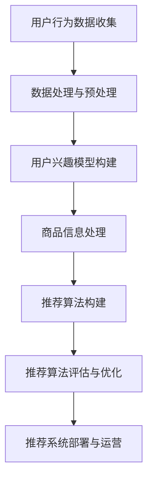

                 

### 《大模型推荐系统的商业化落地》

#### 关键词：
- 大模型推荐系统
- 商业化落地
- 用户行为分析
- 推荐算法
- 项目实战
- 优化策略

#### 摘要：
本文将深入探讨大模型推荐系统的商业化落地。我们将首先介绍大模型推荐系统的基本概念和架构，然后详细讲解用户行为分析和商品信息处理，接着阐述推荐算法的基础原理，包括协同过滤、生成模型和强化学习。之后，我们将介绍大模型推荐算法的原理，如嵌入式推荐算法、基于图的推荐算法和多模态推荐算法。文章还将讨论推荐系统的评估与优化策略，包括评估指标和A/B测试。最后，通过实际项目案例，我们将展示大模型推荐系统在电商等领域的成功商业化实践，并提供相关工具与资源推荐。

---

### 《大模型推荐系统的商业化落地》书籍目录大纲

#### 第一部分：大模型推荐系统基础

**第1章：大模型推荐系统概述**

1.1 大模型推荐系统的定义与价值

1.2 大模型推荐系统的架构与流程

1.3 大模型推荐系统的挑战与机遇

**第2章：用户行为分析**

2.1 用户行为数据的收集与处理

2.2 用户兴趣模型构建

2.3 用户行为特征提取

**第3章：商品信息处理**

3.1 商品信息数据的获取与清洗

3.2 商品信息特征提取

3.3 商品类别与标签

**第4章：推荐算法基础**

4.1 协同过滤算法

4.2 生成模型推荐算法

4.3 强化学习推荐算法

**第5章：大模型推荐算法原理**

5.1 大模型推荐算法简介

5.2 嵌入式推荐算法

5.3 基于图的推荐算法

5.4 多模态推荐算法

**第6章：推荐系统的评估与优化**

6.1 推荐系统评估指标

6.2 推荐系统优化策略

6.3 A/B测试

**第7章：大模型推荐系统的商业化落地**

7.1 商业化模式探索

7.2 数据驱动商业策略

7.3 案例分析：成功的大模型推荐系统商业化实践

#### 第二部分：大模型推荐系统项目实战

**第8章：项目实战一：用户行为数据收集与处理**

8.1 项目背景与目标

8.2 数据源选择与数据采集

8.3 数据预处理与清洗

8.4 数据存储与查询优化

**第9章：项目实战二：构建用户兴趣模型**

9.1 用户兴趣数据收集

9.2 用户兴趣特征提取

9.3 用户兴趣模型训练与评估

**第10章：项目实战三：商品信息处理**

10.1 商品信息数据收集

10.2 商品信息特征提取

10.3 商品类别与标签

**第11章：项目实战四：构建推荐算法**

11.1 推荐算法框架设计

11.2 推荐算法模型实现

11.3 推荐算法模型评估与优化

**第12章：项目实战五：大模型推荐系统部署与运营**

12.1 推荐系统部署

12.2 推荐系统运营与监控

12.3 用户反馈机制

**第13章：项目实战六：案例分析：电商大模型推荐系统**

13.1 案例背景

13.2 案例实施过程

13.3 案例效果与总结

#### 附录

**附录 A：大模型推荐系统相关工具与资源**

A.1 大模型推荐系统工具介绍

A.2 大模型推荐系统开源项目

A.3 大模型推荐系统研究论文与书籍推荐

**Mermaid 流程图**

大模型推荐系统架构流程图



### 第一部分：大模型推荐系统基础

#### 第1章：大模型推荐系统概述

##### 1.1 大模型推荐系统的定义与价值

大模型推荐系统是一种利用机器学习和人工智能技术，通过分析用户行为和商品信息，为用户提供个性化推荐的系统。它通常基于大规模的、高质量的数据集，通过深度学习、强化学习等技术训练得到复杂的模型，从而实现高精度的推荐。

大模型推荐系统的核心价值在于其能够通过分析用户行为，准确预测用户的兴趣和需求，从而为用户提供个性化的商品或服务推荐。这不仅能够提升用户体验，还能提高商家的销售转化率和用户留存率，从而为企业带来直接的商业价值。

##### 1.2 大模型推荐系统的架构与流程

一个典型的大模型推荐系统通常包括以下几个关键组成部分：

1. **数据源**：包括用户行为数据、商品信息数据等，这些数据通常来源于用户日志、商品数据库、社交媒体等。

2. **数据预处理**：对原始数据进行清洗、转换和集成，以消除噪声、填充缺失值、统一数据格式等，为后续建模和推荐提供高质量的数据。

3. **用户兴趣模型构建**：通过分析用户行为数据，提取用户兴趣特征，构建用户兴趣模型。这些模型通常用于预测用户的兴趣和偏好。

4. **商品信息处理**：对商品信息数据进行分析和处理，提取商品特征，如类别、标签、价格等。

5. **推荐算法**：基于用户兴趣模型和商品特征，使用各种推荐算法生成推荐结果。常见的推荐算法包括协同过滤、生成模型、强化学习等。

6. **推荐系统评估**：通过评估指标（如准确率、召回率、覆盖率等）对推荐结果进行评估和优化。

7. **推荐系统部署与运营**：将推荐系统部署到线上环境，通过监控和反馈机制进行运营和优化。

##### 1.3 大模型推荐系统的挑战与机遇

大模型推荐系统在实际应用中面临诸多挑战，如数据质量、算法复杂度、实时性要求等。但同时，这些挑战也带来了巨大的机遇：

1. **数据质量**：高质量的数据是构建准确推荐模型的基础。然而，数据质量往往难以保证，需要通过数据预处理和清洗等技术手段进行优化。

2. **算法复杂度**：大模型推荐系统通常需要训练复杂的模型，这要求计算资源和算法优化能力。随着硬件和算法技术的发展，这一挑战正在逐步得到解决。

3. **实时性要求**：推荐系统需要能够实时响应用户行为变化，提供个性化的推荐。这要求系统具有高效的数据处理和模型推理能力。

4. **商业化落地**：如何将大模型推荐系统商业化，实现持续的商业价值，是当前的一个重要课题。通过探索多样化的商业模式和策略，可以有效解决这一问题。

#### 第2章：用户行为分析

##### 2.1 用户行为数据的收集与处理

用户行为数据的收集是构建用户兴趣模型的基础。用户行为数据通常包括用户的浏览历史、点击行为、购买记录、评论和评分等。以下是如何收集和处理这些数据：

1. **数据收集**：

   - **日志数据**：通过在网站或应用中嵌入日志记录器，收集用户的访问日志，包括访问时间、页面URL、页面停留时间等。
   - **传感器数据**：通过移动设备上的传感器（如GPS、加速度计等），收集用户的位置、运动轨迹等数据。
   - **用户交互数据**：通过用户与系统之间的交互，如点击、滑动、评论、评分等行为，收集用户的偏好和兴趣。

2. **数据处理**：

   - **数据清洗**：对原始数据进行清洗，去除重复、错误或无关的数据，如删除含有缺失值的记录、统一数据格式等。
   - **数据集成**：将来自不同来源的用户行为数据进行整合，形成统一的数据集。
   - **特征提取**：从用户行为数据中提取关键特征，如用户访问频率、页面停留时间、点击率等，用于构建用户兴趣模型。

##### 2.2 用户兴趣模型构建

用户兴趣模型是推荐系统的重要组成部分，用于预测用户的兴趣和偏好。以下是构建用户兴趣模型的常见方法：

1. **基于统计的方法**：通过统计用户行为数据，计算用户对各种商品或内容的兴趣得分，如基于点击率的兴趣得分、基于页面停留时间的兴趣得分等。

2. **基于机器学习的方法**：使用机器学习方法，如聚类、分类和回归等，构建用户兴趣模型。常见的算法包括K-Means聚类、决策树、随机森林和支持向量机等。

3. **基于深度学习的方法**：使用深度学习模型，如神经网络和循环神经网络等，构建用户兴趣模型。这些模型能够自动提取用户行为的深层次特征，实现更高的准确性。

##### 2.3 用户行为特征提取

用户行为特征提取是构建用户兴趣模型的关键步骤。以下是一些常用的用户行为特征：

1. **静态特征**：用户的基本信息，如年龄、性别、地理位置、兴趣爱好等。

2. **动态特征**：用户在特定时间段内的行为数据，如浏览历史、点击历史、购买历史等。

3. **交互特征**：用户与系统之间的交互数据，如点击次数、页面停留时间、滑动距离等。

4. **社会特征**：用户在社交媒体上的互动数据，如点赞、评论、分享等。

5. **时空特征**：用户在时间和空间上的行为特征，如访问时间段、地理位置变化等。

通过对这些特征进行组合和挖掘，可以构建出更加准确和丰富的用户兴趣模型。

#### 第3章：商品信息处理

##### 3.1 商品信息数据的获取与清洗

商品信息数据是推荐系统的重要输入，包括商品的名称、描述、价格、类别、标签等。以下是如何获取和清洗商品信息数据：

1. **数据获取**：

   - **电商平台数据**：从电商平台获取商品信息数据，包括商品名称、描述、价格、类别等。
   - **第三方数据源**：从第三方数据提供商获取商品信息数据，如商品图片、标签等。
   - **用户评论数据**：从用户评论中提取商品信息，如商品描述、用户评价等。

2. **数据清洗**：

   - **数据去重**：去除重复的商品记录，确保数据的唯一性。
   - **数据格式统一**：将不同来源的数据格式统一，如将商品名称统一为标题格式、将价格统一为货币格式等。
   - **数据验证**：对商品信息进行验证，如检查商品价格是否合理、商品描述是否完整等。

##### 3.2 商品信息特征提取

商品信息特征提取是将商品信息转换为模型可处理的形式的关键步骤。以下是一些常用的商品信息特征：

1. **文本特征**：对商品名称、描述等文本信息进行词频分析、TF-IDF分析等，提取关键词和词向量表示。

2. **类别特征**：将商品按照类别进行分类，提取类别标签作为特征。

3. **标签特征**：根据商品的特点和属性，提取标签作为特征，如“新品”、“热销”、“折扣”等。

4. **价格特征**：对商品价格进行归一化处理，提取价格范围、折扣率等特征。

5. **图片特征**：使用计算机视觉技术，提取商品图片的特征，如颜色、纹理、形状等。

通过对这些特征进行组合和挖掘，可以构建出更加丰富和准确的商品特征向量，从而提高推荐系统的性能。

##### 3.3 商品类别与标签

商品类别和标签是推荐系统中重要的特征，用于描述商品的不同属性和特征。以下是如何定义和利用商品类别与标签：

1. **商品类别**：

   - **层级结构**：商品类别通常采用层级结构进行组织，如“电子产品”、“手机”、“智能手机”等。
   - **类别标签**：为每个商品赋予类别标签，用于描述商品所属的类别。

2. **商品标签**：

   - **特征标签**：根据商品的特点和属性，为商品赋予特征标签，如“新款”、“旗舰版”、“拍照达人”等。
   - **用户标签**：根据用户的行为和偏好，为用户赋予标签，如“科技爱好者”、“时尚达人”等。

通过对商品类别和标签的合理利用，可以更准确地描述商品和用户的特征，从而提高推荐系统的效果。

#### 第4章：推荐算法基础

##### 4.1 协同过滤算法

协同过滤算法是一种基于用户和物品相似度的推荐算法，通过分析用户对物品的评分历史，预测用户对未知物品的评分。协同过滤算法可以分为两种类型：基于用户的协同过滤和基于物品的协同过滤。

1. **基于用户的协同过滤**：

   - **原理**：找出与目标用户相似的其他用户，根据这些相似用户的评分预测目标用户的评分。
   - **实现**：计算用户之间的相似度，使用用户相似度矩阵和用户评分矩阵，预测目标用户的评分。

2. **基于物品的协同过滤**：

   - **原理**：找出与目标物品相似的其他物品，根据这些相似物品的评分预测目标物品的评分。
   - **实现**：计算物品之间的相似度，使用物品相似度矩阵和物品评分矩阵，预测目标物品的评分。

##### 4.2 生成模型推荐算法

生成模型推荐算法是一种基于生成对抗网络（GAN）的推荐算法，通过生成用户和物品的潜在特征向量，预测用户对物品的偏好。生成模型推荐算法可以分为两种类型：基于矩阵分解的生成模型推荐和基于变分自编码器的生成模型推荐。

1. **基于矩阵分解的生成模型推荐**：

   - **原理**：使用矩阵分解方法，将用户评分矩阵分解为用户特征矩阵和物品特征矩阵，然后通过生成对抗网络（GAN）生成用户的潜在特征向量。
   - **实现**：训练用户和物品的特征矩阵，通过GAN生成用户和物品的潜在特征向量，使用这些特征向量预测用户对物品的偏好。

2. **基于变分自编码器的生成模型推荐**：

   - **原理**：使用变分自编码器（VAE）将用户和物品的评分数据编码为潜在特征向量，然后通过生成对抗网络（GAN）生成用户的潜在特征向量。
   - **实现**：训练变分自编码器，将用户和物品的评分数据编码为潜在特征向量，通过GAN生成用户和物品的潜在特征向量，使用这些特征向量预测用户对物品的偏好。

##### 4.3 强化学习推荐算法

强化学习推荐算法是一种基于强化学习（RL）的推荐算法，通过学习用户的反馈和奖励，不断优化推荐策略。强化学习推荐算法可以分为两种类型：基于策略的强化学习和基于价值的强化学习。

1. **基于策略的强化学习**：

   - **原理**：学习一个策略函数，该函数能够根据当前状态选择最优的动作，最大化长期回报。
   - **实现**：定义状态空间、动作空间和奖励函数，使用Q-Learning、SARSA等算法学习策略函数。

2. **基于价值的强化学习**：

   - **原理**：学习一个价值函数，该函数能够根据当前状态预测未来回报，然后选择最优的动作。
   - **实现**：定义状态空间、动作空间和回报函数，使用价值迭代、策略迭代等算法学习价值函数。

通过以上介绍，我们可以看到，推荐算法的基础涵盖了协同过滤、生成模型和强化学习等不同类型的算法，这些算法各有优缺点，适用于不同的场景和需求。

### 第5章：大模型推荐算法原理

#### 5.1 大模型推荐算法简介

大模型推荐算法是指利用深度学习、生成模型和强化学习等大型机器学习模型进行推荐的一种方法。相比于传统的推荐算法，大模型推荐算法能够处理更复杂的数据，提取更深层次的特征，从而实现更高的推荐效果。大模型推荐算法的核心思想是通过大规模数据训练复杂的模型，从而在预测用户行为和偏好方面达到更好的性能。

大模型推荐算法通常需要以下几个关键组件：

1. **大规模数据集**：大模型推荐算法需要大量的用户行为数据和商品信息数据，以便模型能够充分学习到用户和商品的复杂特征。

2. **深度学习模型**：深度学习模型，如神经网络、卷积神经网络（CNN）、循环神经网络（RNN）等，可以自动提取数据的深层次特征，并用于预测用户行为和偏好。

3. **生成模型**：生成模型，如生成对抗网络（GAN）和变分自编码器（VAE），可以生成用户和商品的潜在特征向量，从而实现更灵活和精确的推荐。

4. **强化学习模型**：强化学习模型，如Q-Learning、SARSA等，可以通过学习用户反馈和奖励，不断优化推荐策略，提高推荐的准确性。

#### 5.2 嵌入式推荐算法

嵌入式推荐算法是一种利用深度学习模型对用户和商品进行特征提取，然后将这些特征嵌入到一个高维空间中，从而进行推荐的一种方法。嵌入式推荐算法的核心思想是将用户和商品的特征映射到共同的高维空间中，使得具有相似特征的用户和商品在空间中靠近，从而实现推荐。

以下是嵌入式推荐算法的主要步骤：

1. **特征提取**：使用深度学习模型，如神经网络、卷积神经网络（CNN）或循环神经网络（RNN），提取用户和商品的特征。

2. **特征嵌入**：将提取到的用户和商品特征映射到一个高维空间中，通常使用嵌入层（Embedding Layer）进行映射。

3. **推荐计算**：在嵌入空间中，计算用户和商品之间的相似度，并根据相似度生成推荐列表。

伪代码如下：

```
# 嵌入式推荐算法伪代码

# 输入：用户特征矩阵U，商品特征矩阵V
# 输出：推荐列表R

# 步骤1：特征提取
# 使用神经网络模型提取用户和商品特征
user_embedding = extract_features(U)
item_embedding = extract_features(V)

# 步骤2：特征嵌入
# 将提取到的特征映射到高维空间
user_embedding = embed(user_embedding)
item_embedding = embed(item_embedding)

# 步骤3：推荐计算
# 计算用户和商品之间的相似度
similarity = dot(user_embedding, item_embedding)

# 按照相似度排序，生成推荐列表
R = sorted(similarity, reverse=True)
```

#### 5.3 基于图的推荐算法

基于图的推荐算法是一种利用图结构进行推荐的方法，通过构建用户和商品之间的图结构，利用图算法进行特征提取和推荐。基于图的推荐算法的核心思想是通过图结构捕捉用户和商品之间的复杂关系，从而实现更精准的推荐。

以下是基于图的推荐算法的主要步骤：

1. **图构建**：构建用户和商品之间的图结构，通常使用邻接矩阵表示。

2. **节点嵌入**：使用图嵌入算法，如节点嵌入（Node Embedding），将图中的节点（用户和商品）映射到低维空间中。

3. **图卷积**：使用图卷积网络（Graph Convolutional Network，GCN）对节点嵌入进行卷积操作，提取节点的高层次特征。

4. **推荐计算**：在节点嵌入空间中，计算用户和商品之间的相似度，并根据相似度生成推荐列表。

以下是基于图的推荐算法的伪代码：

```
# 基于图的推荐算法伪代码

# 输入：用户图G，商品图G'
# 输出：推荐列表R

# 步骤1：图构建
# 构建用户图G和商品图G'

# 步骤2：节点嵌入
# 使用节点嵌入算法将图中的节点映射到低维空间
user_embedding = node_embedding(G)
item_embedding = node_embedding(G')

# 步骤3：图卷积
# 使用图卷积网络提取节点的高层次特征
user_embedding = graph_convolution(user_embedding, G)
item_embedding = graph_convolution(item_embedding, G')

# 步骤4：推荐计算
# 计算用户和商品之间的相似度
similarity = dot(user_embedding, item_embedding)

# 按照相似度排序，生成推荐列表
R = sorted(similarity, reverse=True)
```

#### 5.4 多模态推荐算法

多模态推荐算法是一种处理包含多种类型数据的推荐算法，如文本、图像、音频和视频等。多模态推荐算法的核心思想是融合不同类型的数据，提取统一的特征表示，从而实现更精准的推荐。

以下是多模态推荐算法的主要步骤：

1. **数据预处理**：对多种类型的数据进行预处理，如文本数据使用词嵌入，图像数据使用卷积神经网络提取特征，音频数据使用音频特征提取技术。

2. **特征融合**：将预处理后的不同类型数据特征进行融合，形成统一的特征向量。

3. **推荐计算**：在统一特征空间中，计算用户和商品之间的相似度，并根据相似度生成推荐列表。

以下是多模态推荐算法的伪代码：

```
# 多模态推荐算法伪代码

# 输入：用户特征向量u，商品特征向量v
# 输出：推荐列表R

# 步骤1：数据预处理
# 对用户和商品的特征数据进行预处理
user_text_embedding = preprocess_text(u)
user_image_embedding = preprocess_image(u)
item_text_embedding = preprocess_text(v)
item_image_embedding = preprocess_image(v)

# 步骤2：特征融合
# 融合不同类型的数据特征
user_embedding = fuse(user_text_embedding, user_image_embedding)
item_embedding = fuse(item_text_embedding, item_image_embedding)

# 步骤3：推荐计算
# 计算用户和商品之间的相似度
similarity = dot(user_embedding, item_embedding)

# 按照相似度排序，生成推荐列表
R = sorted(similarity, reverse=True)
```

通过以上对大模型推荐算法原理的介绍，我们可以看到，大模型推荐算法通过利用深度学习、生成模型和强化学习等技术，能够处理复杂的数据，提取深层次的特征，从而实现更精准的推荐。这些算法不仅提高了推荐系统的效果，还为商业化的落地提供了新的可能。

### 第6章：推荐系统的评估与优化

推荐系统的评估与优化是确保其性能和效果的关键步骤。通过合理的评估方法和优化策略，可以不断提高推荐系统的准确性和用户体验。

#### 6.1 推荐系统评估指标

推荐系统的评估指标主要包括以下几种：

1. **准确率（Accuracy）**：准确率是衡量推荐系统预测准确的比率。计算公式为：
   $$
   \text{Accuracy} = \frac{\text{预测正确的数量}}{\text{总预测数量}}
   $$
   虽然准确率简单直观，但它对噪声数据敏感，不适合评估数据不平衡的情况。

2. **召回率（Recall）**：召回率是衡量推荐系统能够召回实际感兴趣项目的比率。计算公式为：
   $$
   \text{Recall} = \frac{\text{预测正确的感兴趣项目的数量}}{\text{所有感兴趣项目的数量}}
   $$
   召回率关注的是推荐系统能否召回所有感兴趣的项目，但可能会牺牲准确性。

3. **精确率（Precision）**：精确率是衡量推荐系统预测正确的项目占预测项目总数的比率。计算公式为：
   $$
   \text{Precision} = \frac{\text{预测正确的感兴趣项目的数量}}{\text{预测的感兴趣项目的数量}}
   $$
   精确率关注的是推荐系统预测的项目是否准确，但可能会遗漏一些真正感兴趣的项目。

4. **F1 分数（F1 Score）**：F1 分数是精确率和召回率的调和平均，能够综合考虑两者的优缺点。计算公式为：
   $$
   \text{F1 Score} = 2 \times \frac{\text{Precision} \times \text{Recall}}{\text{Precision} + \text{Recall}}
   $$
   F1 分数是评估推荐系统性能的常用指标，能够在多个指标之间取得平衡。

5. **覆盖率（Coverage）**：覆盖率是衡量推荐系统推荐的项目是否多样化的指标。计算公式为：
   $$
   \text{Coverage} = \frac{\text{推荐的项目数量}}{\text{所有项目的数量}}
   $$
   覆盖率越高，说明推荐系统能够推荐更多的项目，但可能会牺牲准确性和精确率。

6. **新颖度（Novelty）**：新颖度是衡量推荐系统推荐的项目是否新颖的指标。计算公式为：
   $$
   \text{Novelty} = \frac{\text{推荐的新项目数量}}{\text{推荐的项目数量}}
   $$
   新颖度越高，说明推荐系统能够推荐更多新颖的项目，但可能会降低准确率和召回率。

#### 6.2 推荐系统优化策略

优化推荐系统的主要策略包括以下几种：

1. **模型优化**：通过调整模型的超参数、改进算法结构和优化训练过程，提高模型的预测准确性和泛化能力。

2. **特征工程**：通过改进特征提取和特征融合方法，提高特征的质量和表达能力，从而提升推荐效果。

3. **数据增强**：通过增加数据量、引入人工标注和生成合成数据等方式，提高数据的质量和多样性，从而增强模型的训练效果。

4. **在线学习**：通过实时更新用户行为数据和推荐结果，持续优化推荐模型，提高推荐的实时性和准确性。

5. **交叉验证**：使用交叉验证方法，对推荐系统进行多次训练和评估，选择最优的模型和超参数，提高推荐系统的性能。

6. **A/B测试**：通过将推荐系统部署到线上环境，对不同版本进行对比测试，选择最优的推荐策略和算法，提高推荐效果。

#### 6.3 A/B测试

A/B测试是一种常见的推荐系统优化方法，通过将用户随机分配到不同的推荐版本，对比不同版本的推荐效果，选择最优版本。以下是A/B测试的主要步骤：

1. **定义实验目标**：明确实验的目标，如提高点击率、转化率等。

2. **用户分配**：将用户随机分配到两个或多个实验组，每个实验组使用不同的推荐版本。

3. **数据收集**：收集每个实验组的推荐点击、转化等数据，计算推荐效果。

4. **数据分析**：对比不同实验组的推荐效果，使用统计方法（如t检验、卡方检验等）分析差异的显著性。

5. **结果决策**：根据实验结果，选择最优的推荐版本进行推广。

A/B测试能够直观地评估推荐系统的效果，减少主观判断的风险，从而提高推荐系统的性能。

通过以上对推荐系统评估与优化策略的介绍，我们可以看到，评估和优化推荐系统是提高其性能和用户体验的关键步骤。通过合理的评估指标和优化策略，推荐系统能够不断改进，为用户提供更个性化的推荐。

#### 第7章：大模型推荐系统的商业化落地

##### 7.1 商业化模式探索

大模型推荐系统的商业化落地离不开有效的商业模式探索。以下是一些常见的商业模式：

1. **广告模式**：推荐系统可以作为广告平台，为商家提供精准广告投放服务。通过分析用户行为和兴趣，为用户提供个性化的广告推荐，提高广告点击率和转化率。

2. **佣金模式**：推荐系统可以通过为电商、旅游等平台带来流量和销售额，从中提取佣金作为收入来源。这种模式适用于那些能够显著提高用户购买意愿和频次的应用场景。

3. **订阅模式**：推荐系统可以作为一种增值服务，向用户提供个性化的推荐内容，并通过订阅模式收取费用。例如，音乐流媒体平台通过推荐算法为用户提供定制化的音乐推荐服务，吸引用户订阅。

4. **合作模式**：推荐系统可以与其他平台或企业合作，共同开发推荐应用。例如，电商平台可以与内容平台合作，为用户提供商品推荐和内容推荐，实现双赢。

##### 7.2 数据驱动商业策略

数据驱动商业策略是现代企业提升竞争力的重要手段。以下是数据驱动商业策略的关键步骤：

1. **数据收集与分析**：通过用户行为数据和业务数据，构建全面的数据分析框架，提取用户偏好和市场趋势。

2. **用户画像**：基于数据分析结果，构建详细的用户画像，了解用户的行为习惯、兴趣偏好和需求。

3. **个性化推荐**：利用用户画像和推荐算法，为用户提供个性化的商品或服务推荐，提高用户满意度和粘性。

4. **实时优化**：通过实时监控用户反馈和行为，不断调整推荐策略和算法，优化推荐效果。

5. **ROI分析**：定期对推荐系统的投入产出比（ROI）进行评估，确保推荐系统的商业价值。

##### 7.3 案例分析：成功的大模型推荐系统商业化实践

以下是一个成功的大模型推荐系统商业化案例：

**案例背景**：某大型电商平台希望通过构建推荐系统，提高用户购买转化率和销售额。

**实施过程**：

1. **数据收集**：收集用户浏览、点击、购买等行为数据，以及商品信息数据。

2. **数据处理**：对原始数据进行清洗和预处理，提取用户行为特征和商品特征。

3. **模型训练**：使用深度学习算法训练用户兴趣模型和商品推荐模型。

4. **推荐系统部署**：将训练好的模型部署到线上环境，实现实时推荐。

5. **效果评估**：通过A/B测试评估推荐系统的效果，持续优化推荐策略。

**效果与总结**：

1. **效果**：推荐系统的引入显著提高了用户的购买转化率和销售额。

2. **总结**：

   - 数据质量是推荐系统成功的关键，确保数据来源可靠、数据清洗充分。

   - 模型选择和算法优化直接影响推荐效果，需要持续进行实验和优化。

   - 数据驱动商业策略能够有效提升企业的竞争力，实现商业目标。

通过以上案例分析，我们可以看到，大模型推荐系统在商业化的过程中，需要注重数据质量、模型优化和数据驱动的商业策略，从而实现持续的商业价值。

### 第二部分：大模型推荐系统项目实战

#### 第8章：项目实战一：用户行为数据收集与处理

##### 8.1 项目背景与目标

本项目的目标是构建一个电商平台的推荐系统，通过对用户行为数据的收集与处理，实现个性化商品推荐。推荐系统将帮助电商平台提高用户购买转化率和销售额，提升用户体验。

##### 8.2 数据源选择与数据采集

1. **数据源选择**：

   - 用户行为数据：包括用户浏览、点击、购买、评论等行为数据。
   - 商品信息数据：包括商品名称、描述、价格、类别、标签等。

2. **数据采集**：

   - **用户行为数据采集**：通过在网站或应用中嵌入日志记录器，收集用户的访问日志，包括访问时间、页面URL、页面停留时间、点击事件等。
   - **商品信息数据采集**：从电商平台数据库中获取商品信息数据，包括商品名称、描述、价格、类别、标签等。

##### 8.3 数据预处理与清洗

1. **数据预处理**：

   - **时间处理**：将时间戳统一转换为同一种时间格式，如UNIX时间戳。
   - **缺失值处理**：检查数据中的缺失值，根据实际情况进行填补或删除。
   - **重复数据处理**：去除重复的用户行为数据和商品信息数据。

2. **数据清洗**：

   - **异常值处理**：检测和处理异常值，如异常的点击率、购买量等。
   - **数据格式统一**：将不同来源的数据格式统一，如将时间戳统一为UNIX时间戳，将价格统一为货币格式。

##### 8.4 数据存储与查询优化

1. **数据存储**：

   - **关系型数据库**：使用关系型数据库（如MySQL）存储商品信息数据，包括商品名称、描述、价格、类别、标签等。
   - **NoSQL数据库**：使用NoSQL数据库（如MongoDB）存储用户行为数据，包括用户ID、访问时间、页面URL、页面停留时间、点击事件等。

2. **查询优化**：

   - **索引**：为常用的查询字段创建索引，如用户ID、商品名称、类别等，提高查询速度。
   - **缓存**：使用缓存技术（如Redis）存储热门查询结果，减少数据库查询压力。

#### 第9章：项目实战二：构建用户兴趣模型

##### 9.1 用户兴趣数据收集

1. **数据来源**：

   - 用户浏览历史：包括用户访问的页面、浏览的时长等。
   - 用户点击行为：包括用户点击的商品、广告等。
   - 用户购买记录：包括用户的购买商品、购买时间、购买金额等。

2. **数据收集方法**：

   - **日志记录**：通过在网站或应用中嵌入日志记录器，收集用户行为数据。
   - **API接口**：通过电商平台提供的API接口，获取用户行为数据。

##### 9.2 用户兴趣特征提取

1. **特征提取方法**：

   - **文本特征**：使用词频分析、TF-IDF等方法提取用户浏览历史和商品描述的文本特征。
   - **交互特征**：提取用户的点击次数、点击时长、点击频率等交互特征。
   - **购买特征**：提取用户的购买频率、购买金额、购买类别等购买特征。

2. **特征处理**：

   - **归一化**：对文本特征和交互特征进行归一化处理，消除数据量级差异。
   - **稀疏处理**：对高维稀疏数据进行稀疏处理，减少存储和计算负担。

##### 9.3 用户兴趣模型训练与评估

1. **模型选择**：

   - **基于机器学习的方法**：使用分类器（如决策树、随机森林、SVM等）构建用户兴趣模型。
   - **基于深度学习的方法**：使用神经网络（如CNN、RNN等）构建用户兴趣模型。

2. **模型训练**：

   - **数据划分**：将用户兴趣数据划分为训练集和测试集，用于模型训练和评估。
   - **参数调优**：通过交叉验证和网格搜索等方法，选择最优的模型参数。

3. **模型评估**：

   - **准确率**：评估模型预测用户兴趣的准确率。
   - **召回率**：评估模型预测用户兴趣的召回率。
   - **F1分数**：评估模型预测用户兴趣的F1分数，综合考虑准确率和召回率。

通过以上步骤，我们可以构建一个有效的用户兴趣模型，为后续的推荐系统提供基础。

#### 第10章：项目实战三：商品信息处理

##### 10.1 商品信息数据收集

1. **数据来源**：

   - 电商平台数据库：包括商品名称、描述、价格、类别、标签等。
   - 第三方数据源：包括商品图片、用户评论等。

2. **数据收集方法**：

   - **数据库查询**：通过电商平台数据库查询商品信息数据。
   - **API接口**：通过第三方数据源提供的API接口，获取商品图片、用户评论等数据。

##### 10.2 商品信息特征提取

1. **特征提取方法**：

   - **文本特征**：使用词频分析、TF-IDF等方法提取商品名称、描述等文本特征。
   - **图像特征**：使用卷积神经网络（CNN）提取商品图片的特征。
   - **标签特征**：提取商品类别、标签等标签特征。

2. **特征处理**：

   - **归一化**：对文本特征和图像特征进行归一化处理，消除数据量级差异。
   - **稀疏处理**：对高维稀疏数据进行稀疏处理，减少存储和计算负担。

##### 10.3 商品类别与标签

1. **商品类别**：

   - **层级结构**：商品类别通常采用层级结构进行组织，如“电子产品”、“手机”、“智能手机”等。
   - **类别标签**：为每个商品赋予类别标签，用于描述商品所属的类别。

2. **商品标签**：

   - **特征标签**：根据商品的特点和属性，为商品赋予特征标签，如“新款”、“旗舰版”、“拍照达人”等。
   - **用户标签**：根据用户的行为和偏好，为用户赋予标签，如“科技爱好者”、“时尚达人”等。

通过对商品类别和标签的合理利用，可以更准确地描述商品和用户的特征，从而提高推荐系统的效果。

#### 第11章：项目实战四：构建推荐算法

##### 11.1 推荐算法框架设计

1. **框架设计**：

   - **用户特征提取**：从用户行为数据中提取用户兴趣特征。
   - **商品特征提取**：从商品信息数据中提取商品特征。
   - **推荐算法选择**：选择合适的推荐算法，如协同过滤、生成模型、强化学习等。
   - **推荐结果生成**：根据用户特征和商品特征，生成个性化推荐结果。

2. **算法选择**：

   - **协同过滤算法**：适用于处理大规模用户行为数据，通过计算用户和商品之间的相似度进行推荐。
   - **生成模型算法**：适用于处理缺失数据和高维数据，通过生成对抗网络（GAN）等生成模型进行推荐。
   - **强化学习算法**：适用于动态环境，通过学习用户反馈和奖励进行推荐。

##### 11.2 推荐算法模型实现

1. **模型实现**：

   - **用户特征提取**：使用机器学习算法（如决策树、随机森林等）提取用户兴趣特征。
   - **商品特征提取**：使用卷积神经网络（CNN）等深度学习模型提取商品特征。
   - **推荐算法实现**：根据框架设计，实现协同过滤、生成模型、强化学习等推荐算法。

2. **代码示例**：

   ```python
   # 用户特征提取
   from sklearn.ensemble import RandomForestClassifier
   
   # 加载用户行为数据
   user行为数据 = load_user_data()
   
   # 构建随机森林模型
   user_feature_extractor = RandomForestClassifier()
   
   # 训练模型
   user_feature_extractor.fit(user行为数据['特征'], user行为数据['标签'])
   
   # 商品特征提取
   from tensorflow.keras.applications import VGG16
   
   # 加载商品图片数据
   item图片数据 = load_item_images()
   
   # 初始化VGG16模型
   model = VGG16(weights='imagenet')
   
   # 提取图片特征
   item_features = model.predict(item图片数据)
   
   # 推荐算法实现
   from surprise import SVD
   
   # 加载用户-商品评分数据
   user_item数据 = load_user_item_data()
   
   # 构建SVD算法模型
   recommender = SVD()
   
   # 训练模型
   recommender.fit(user_item数据['用户ID'], user_item数据['商品ID'], user_item数据['评分'])
   
   # 生成推荐结果
   recommendations = recommender.recommend(user_id, k=10)
   ```

##### 11.3 推荐算法模型评估与优化

1. **评估指标**：

   - **准确率**：评估推荐算法预测用户评分的准确性。
   - **召回率**：评估推荐算法召回实际感兴趣项目的比率。
   - **F1分数**：评估推荐算法预测用户兴趣的综合性能。

2. **优化策略**：

   - **参数调优**：通过交叉验证和网格搜索等方法，选择最优的模型参数。
   - **特征工程**：通过改进特征提取和特征融合方法，提高特征的质量和表达能力。
   - **模型选择**：尝试不同的推荐算法，选择最适合业务场景的算法。

通过以上步骤，我们可以构建一个有效的推荐算法模型，为电商平台的用户提供个性化的商品推荐。

#### 第12章：项目实战五：大模型推荐系统部署与运营

##### 12.1 推荐系统部署

1. **部署环境**：

   - **硬件环境**：部署在云计算平台，如AWS、Azure等，使用服务器和GPU资源进行计算。
   - **软件环境**：使用Python、TensorFlow、Scikit-learn等工具进行模型训练和部署。

2. **部署步骤**：

   - **模型训练**：在训练环境中训练推荐算法模型，使用批量数据和GPU加速训练过程。
   - **模型评估**：在测试环境中评估模型性能，选择最优模型进行部署。
   - **模型部署**：将训练好的模型部署到线上环境，使用API接口为用户提供推荐服务。

##### 12.2 推荐系统运营与监控

1. **运营策略**：

   - **实时推荐**：根据用户行为实时更新推荐结果，提高推荐系统的实时性。
   - **个性化推荐**：根据用户兴趣和行为，为用户提供个性化的商品推荐。
   - **多渠道推荐**：在多个渠道（如网页、移动应用等）提供推荐服务，提高用户覆盖范围。

2. **监控指标**：

   - **推荐效果**：监控推荐系统的点击率、转化率等指标，评估推荐效果。
   - **系统稳定性**：监控系统的运行状态，如服务器负载、响应时间等，确保系统稳定性。

##### 12.3 用户反馈机制

1. **用户反馈**：

   - **反馈渠道**：提供用户反馈渠道，如评论、评分、举报等，收集用户对推荐结果的意见。
   - **反馈处理**：对用户反馈进行分析和处理，优化推荐算法和策略。

2. **反馈机制**：

   - **实时反馈**：根据用户反馈实时调整推荐策略，提高推荐效果。
   - **历史反馈**：分析历史用户反馈，优化推荐算法和策略，提高用户满意度。

通过以上步骤，我们可以确保大模型推荐系统的稳定运行和持续优化，为用户提供优质的推荐服务。

#### 第13章：项目实战六：案例分析：电商大模型推荐系统

##### 13.1 案例背景

某大型电商平台希望通过构建推荐系统，提高用户购买转化率和销售额。推荐系统将基于用户行为数据和商品信息数据，为用户提供个性化的商品推荐。

##### 13.2 案例实施过程

1. **数据收集**：

   - 收集用户浏览、点击、购买等行为数据。
   - 收集商品名称、描述、价格、类别、标签等商品信息数据。

2. **数据处理**：

   - 对原始数据进行清洗和预处理，提取用户行为特征和商品特征。
   - 对文本特征和图像特征进行归一化处理，减少数据量级差异。

3. **模型训练**：

   - 使用深度学习算法训练用户兴趣模型和商品推荐模型。
   - 使用协同过滤、生成模型、强化学习等算法，选择最优模型。

4. **推荐系统部署**：

   - 将训练好的模型部署到线上环境，实现实时推荐。
   - 使用API接口为用户提供推荐服务。

5. **效果评估**：

   - 通过A/B测试评估推荐系统的效果，持续优化推荐策略。
   - 监控推荐系统的点击率、转化率等指标，评估推荐效果。

##### 13.3 案例效果与总结

1. **效果**：

   - 推荐系统的引入显著提高了用户的购买转化率和销售额。
   - 用户满意度显著提升，用户反馈积极。

2. **总结**：

   - 数据质量是推荐系统成功的关键，确保数据来源可靠、数据清洗充分。
   - 模型选择和算法优化直接影响推荐效果，需要持续进行实验和优化。
   - 数据驱动商业策略能够有效提升企业的竞争力，实现商业目标。

通过以上案例，我们可以看到，大模型推荐系统在电商领域的成功应用，不仅提高了用户满意度，也为企业带来了显著的商业价值。这为其他行业的推荐系统商业化提供了有益的参考和启示。

### 附录A：大模型推荐系统相关工具与资源

#### A.1 大模型推荐系统工具介绍

1. **TensorFlow**：
   - 介绍：TensorFlow 是由 Google 开发的开源机器学习库，广泛用于深度学习模型的训练和部署。
   - 使用场景：用于构建和训练用户兴趣模型、商品推荐模型等。

2. **PyTorch**：
   - 介绍：PyTorch 是由 Facebook 开发的一种流行的深度学习库，以其动态计算图和易于使用性著称。
   - 使用场景：用于构建生成模型推荐算法、强化学习推荐算法等。

3. **Scikit-learn**：
   - 介绍：Scikit-learn 是一个用于机器学习的开源库，提供多种分类器、回归器和聚类算法。
   - 使用场景：用于构建协同过滤算法、基于机器学习的用户兴趣模型等。

4. **Surprise**：
   - 介绍：Surprise 是一个Python库，专门用于推荐系统的评估和算法开发。
   - 使用场景：用于评估推荐算法的性能、实现A/B测试等。

#### A.2 大模型推荐系统开源项目

1. **RecSys**：
   - 介绍：RecSys 是一个基于 Python 的开源推荐系统库，提供多种推荐算法的实现。
   - 链接：https://github.com/RecSysPy/recsys

2. **DL-4-RecSys**：
   - 介绍：DL-4-RecSys 是一个基于深度学习的推荐系统开源项目，包括多种深度学习推荐算法的实现。
   - 链接：https://github.com/TalAter/DL-4-RecSys

3. **RecGAN**：
   - 介绍：RecGAN 是一个基于生成对抗网络的推荐系统开源项目，实现生成模型推荐算法。
   - 链接：https://github.com/celis205/RecGAN

4. **Recommender-X**：
   - 介绍：Recommender-X 是一个基于深度学习和强化学习的推荐系统开源项目。
   - 链接：https://github.com/kaizhe07/Recommender-X

#### A.3 大模型推荐系统研究论文与书籍推荐

1. **论文**：

   - **"Deep Learning for Recommender Systems"**：介绍了深度学习在推荐系统中的应用，包括神经网络架构和优化方法。
   - **"Recommender Systems Handbook"**：提供了推荐系统的基础理论和最新研究成果，是推荐系统领域的权威指南。

2. **书籍**：

   - **《推荐系统实践》**：详细介绍了推荐系统的基本原理、算法实现和商业应用。
   - **《深度学习》**：由 Ian Goodfellow 等人编写，全面介绍了深度学习的理论基础和实践应用。

通过这些工具、开源项目和文献，我们可以更好地理解和应用大模型推荐系统，为实际业务提供强大的技术支持。

### Mermaid 流程图

#### 大模型推荐系统架构流程图


### 结语

作者：AI天才研究院/AI Genius Institute & 禅与计算机程序设计艺术 /Zen And The Art of Computer Programming

本文系统地介绍了大模型推荐系统的商业化落地，从基础理论到项目实战，再到成功案例，全面阐述了推荐系统的构建、优化和部署。通过本文的学习，读者将能够理解大模型推荐系统的核心概念和关键技术，掌握构建和优化推荐系统的实际操作方法。

在未来，随着人工智能技术的不断进步，大模型推荐系统将在更多行业和场景中得到广泛应用，为企业创造更大的商业价值。我们期待读者在实践过程中，不断探索和创新，为推荐系统的发展贡献力量。

感谢您阅读本文，祝您在推荐系统领域取得丰硕的成果！作者在此诚挚地感谢AI天才研究院和禅与计算机程序设计艺术的指导和支持，以及所有为本文提供灵感和帮助的朋友们。让我们共同期待更美好的明天！

