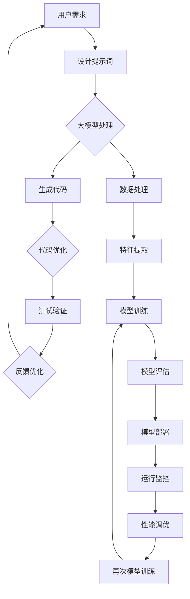

                 

### 大模型时代背景及影响

#### 大模型的发展历程

自20世纪50年代计算机科学诞生以来，人工智能（AI）领域经历了多个发展阶段。从早期的规则推理系统，到基于统计方法的机器学习，再到近年来深度学习的兴起，AI技术不断进步。特别是在2010年代以后，随着计算能力的提升、大数据的涌现和深度学习算法的突破，大模型（Large Models）开始崭露头角。

大模型的发展可以追溯到2013年，当Google的Neural Network Translation（NNTP）团队展示了基于神经网络的机器翻译模型，这一突破引发了深度学习在自然语言处理（NLP）领域的热潮。随后，微软的研究团队推出了Word Embedding技术，使得文本数据可以转换为高维向量，从而在文本分类、情感分析等任务中取得了显著效果。

2018年，OpenAI发布了GPT（Generative Pre-trained Transformer）系列模型，这一系列模型成为了大模型的代表。GPT-1、GPT-2和GPT-3等模型在语言理解和生成任务上展现了惊人的性能，甚至能够进行简单的人机对话。这一系列模型的发布标志着大模型时代正式到来。

#### 大模型在AI领域的重要性

大模型在AI领域的重要性不言而喻。首先，大模型具有强大的表达能力，能够处理复杂的语言结构，实现高度自动化的任务。例如，GPT-3模型拥有1750亿个参数，能够在各种文本生成任务中达到或超过人类水平。

其次，大模型具有泛化能力。通过在大规模数据集上进行预训练，大模型可以迁移到不同的任务和数据集上，从而减少了任务特定的调优过程，提高了模型的泛化能力。

此外，大模型在多模态任务中也展现出了强大的潜力。例如，可以将图像、声音和文本等多模态数据整合到一个大模型中，实现跨模态的信息理解和生成。

#### 大模型时代带来的变革

大模型时代的到来对编程范式带来了深远的影响。首先，传统的编程模式逐渐被自动化编程所取代。编程人员不再需要手动编写大量的代码，而是通过提示词工程（Prompt Engineering）等技术，利用大模型生成和优化代码。

其次，大模型促进了AI与编程的融合。编程不再仅仅是代码的编写，而是包括数据预处理、模型训练、模型优化等多个环节。编程人员需要掌握更多的AI知识，以便更好地利用大模型的能力。

此外，大模型时代还带来了软件开发方式的变革。传统的软件开发往往需要长时间的迭代和调试，而大模型的应用使得开发过程变得更加高效。通过大模型的预训练，开发人员可以在短时间内实现复杂的功能，从而加快了软件的开发周期。

总之，大模型时代的到来不仅改变了AI领域的面貌，也对编程范式产生了深远的影响。在这一背景下，提示词工程作为一种新的编程范式，将发挥越来越重要的作用。

### 编程范式演变

编程范式的演变是计算机科学和技术发展的重要标志。从最初的机器语言编程，到高级语言的引入，再到现代的自动化编程和提示词工程，每一次范式转变都极大地提高了编程效率和软件质量。

#### 从传统编程到自动化编程

传统编程范式主要依赖于程序员手动编写代码，实现特定的功能。这种编程方式在计算机科学初期阶段发挥了重要作用，但由于其依赖于程序员的技能和经验，开发周期较长，且容易引入错误。随着计算机技术的发展，高级编程语言如C、Java、Python等逐渐流行，编程范式从手动编写代码向自动生成代码的方向发展。

自动化编程的兴起主要得益于编译器、集成开发环境和代码生成工具的发展。编译器可以将高级语言代码转换为机器语言，集成开发环境（IDE）提供了代码编写、调试和部署的一站式服务，而代码生成工具则能够根据特定的需求自动生成代码框架。这些工具和技术的应用，大大提高了编程的效率和可靠性。

然而，自动化编程仍然面临一些挑战。首先，自动化编程工具通常需要大量的先验知识和规则，才能生成高质量的代码。其次，自动化编程往往无法处理复杂和动态变化的编程任务，这些任务仍然需要程序员手动编写代码。

#### 自动化编程面临的挑战

自动化编程虽然提高了编程效率，但在实际应用中仍然面临一些挑战。首先，自动化编程工具的生成代码质量依赖于先验知识和规则的准确性。如果先验知识不足或规则过于简单，生成的代码可能不符合实际需求，甚至存在逻辑错误。

其次，自动化编程工具通常无法处理动态变化的编程任务。在传统的编程范式中，程序员可以通过灵活的编程逻辑和函数调用，处理动态变化的需求。而在自动化编程中，工具往往无法实现这种动态适应性，导致代码生成结果不够灵活和通用。

此外，自动化编程工具的维护成本较高。自动化编程工具需要不断更新和升级，以适应新的编程语言和开发环境。这增加了开发团队的维护成本，同时也对工具的稳定性和安全性提出了更高的要求。

#### 提示词工程的概念与意义

为了解决自动化编程面临的问题，提示词工程（Prompt Engineering）作为一种新的编程范式应运而生。提示词工程的核心思想是通过设计特定的提示词（prompts），引导大模型生成和优化代码。

提示词工程的定义可以概括为：利用自然语言处理技术，设计和优化用于引导大模型生成代码的提示词，从而实现高效的代码生成和优化。

提示词工程的意义主要体现在以下几个方面：

首先，提示词工程能够提高代码生成的质量和效率。通过设计针对性的提示词，大模型可以更准确地理解和生成符合需求的高质量代码。同时，提示词工程能够自动化地优化代码，提高代码的执行效率和可维护性。

其次，提示词工程实现了编程与AI技术的深度融合。编程不再仅仅是代码的编写，而是包括数据预处理、模型训练、模型优化等多个环节。编程人员需要掌握更多的AI知识，以便更好地利用大模型的能力。

此外，提示词工程使得编程更加智能化和灵活。通过大模型的预训练，编程人员可以在短时间内实现复杂的功能，从而加快了软件的开发周期。同时，提示词工程能够处理动态变化的编程任务，提高了代码的适应性和灵活性。

总之，提示词工程作为一种新的编程范式，不仅解决了自动化编程面临的问题，还实现了编程与AI技术的深度融合，为现代软件开发提供了新的思路和方法。

### 提示词工程基础

提示词工程是一门结合自然语言处理、自动化编程和数据挖掘技术的交叉学科，旨在通过设计和优化提示词，提高大模型在代码生成和优化方面的效果。在这一节中，我们将详细探讨提示词工程的基本概念、核心技术及其应用场景。

#### 提示词工程的基本概念

提示词（Prompt）在提示词工程中起着核心作用，它是指用于引导大模型生成代码或执行特定任务的文本输入。一个优秀的提示词应当简洁明了、具有针对性，能够有效地传达编程任务的需求和目标。

提示词的定义与作用：
- 定义：提示词是用于引导大模型生成代码或执行特定任务的文本输入。
- 作用：提示词能够帮助大模型理解任务需求，提高代码生成的准确性和效率。

提示词的类型与分类：
- 按照内容划分：提示词可以分为任务型提示词、数据型提示词和目标型提示词。任务型提示词主要用于描述编程任务的目标和需求；数据型提示词主要用于提供相关的数据和背景信息；目标型提示词则主要用于设定具体的任务目标和期望结果。
- 按照生成方式划分：提示词可以分为手动编写和自动生成。手动编写的提示词通常由专业人员进行设计，而自动生成的提示词则利用自然语言处理技术，根据任务需求自动生成。

提示词的编码与解码：
- 编码：编码是指将自然语言描述的提示词转换为机器可读的格式。常见的编码方式包括文本编码和向量编码。文本编码将提示词转换为自然语言处理模型输入的文本格式；向量编码则将提示词转换为高维向量，便于深度学习模型处理。
- 解码：解码是指将编码后的提示词输入大模型，通过模型的处理生成相应的代码或结果。解码过程通常涉及模型的训练和预测，模型根据输入的提示词生成符合需求的输出。

#### 提示词工程的核心技术

提示词工程的核心技术包括自然语言处理技术、自动化编程技术以及数据分析与挖掘技术。以下将逐一介绍这些技术及其在提示词工程中的应用。

自然语言处理技术：
- 自然语言处理（NLP）技术是提示词工程的基础。NLP技术包括文本分词、词性标注、实体识别、语义分析等，这些技术能够帮助模型理解提示词的内容和结构。例如，在文本生成任务中，NLP技术可以帮助模型提取关键词和语义信息，从而生成符合需求的代码。
- 应用场景：文本生成、文本分类、语义分析等。

自动化编程技术：
- 自动化编程技术是指利用大模型生成和优化代码的方法。自动化编程技术包括代码模板生成、代码补全、代码优化等。通过自动化编程技术，编程人员可以减少手动编写代码的工作量，提高开发效率。
- 应用场景：代码生成、代码补全、代码优化等。

数据分析与挖掘技术：
- 数据分析与挖掘技术用于处理和分析大量的编程数据，提取有用的信息和模式。数据分析与挖掘技术包括数据预处理、特征提取、聚类分析、关联规则挖掘等。这些技术可以帮助模型更好地理解编程任务和数据，从而提高代码生成和优化的效果。
- 应用场景：数据预处理、特征提取、模型训练、模型评估等。

#### 提示词工程的应用场景

提示词工程的应用场景非常广泛，涵盖了文本生成、数据处理、自动化编程等多个领域。以下将简要介绍一些典型的应用场景。

文本生成与摘要：
- 提示词工程可以用于自动生成文章、报告、邮件等文本内容。通过设计合适的提示词，大模型能够生成符合要求的文本，减少人工撰写的负担。
- 应用案例：智能客服系统、自动新闻生成、自动化报告撰写等。

数据处理与分析：
- 提示词工程可以用于处理和分析大量数据，提取有用的信息和模式。通过设计针对性的提示词，大模型能够自动完成数据预处理、特征提取、数据挖掘等任务。
- 应用案例：数据报表生成、数据可视化、数据驱动决策等。

自动化编程与优化：
- 提示词工程可以用于自动化生成和优化代码。通过设计提示词，大模型能够生成符合编程规范的代码，减少编程错误，提高代码的可维护性和执行效率。
- 应用案例：代码补全工具、代码优化工具、自动化测试工具等。

总之，提示词工程通过结合自然语言处理、自动化编程和数据分析技术，为现代软件开发提供了强大的工具和方法。随着大模型技术的不断发展，提示词工程的应用前景将越来越广阔。

### 提示词工程开发流程

提示词工程的开发流程是构建高效、高质量的提示词系统的重要步骤。整个开发流程包括需求分析与设计、数据收集与处理、提示词生成与优化等环节。下面，我们将详细探讨每个环节的具体步骤和注意事项。

#### 需求分析与设计

需求分析是提示词工程开发的第一步，旨在明确系统需要实现的功能和性能要求。在这个阶段，开发团队需要与用户和利益相关者进行沟通，了解他们的具体需求和期望。以下是一些关键步骤：

1. **确定任务目标**：明确系统需要完成的任务，如文本生成、代码生成、数据预处理等。
2. **定义评估标准**：确定如何衡量系统性能，如准确率、响应时间、代码质量等。
3. **收集用户反馈**：通过与用户的交流和调研，了解他们的实际使用情况和需求。

在设计阶段，开发团队需要根据需求分析的结果，制定具体的系统设计方案。这包括确定系统的架构、模块划分、接口定义等。以下是一些设计注意事项：

1. **模块化设计**：将系统划分为多个模块，每个模块负责特定的功能，便于后续开发和维护。
2. **可扩展性**：设计时应考虑系统的可扩展性，以便在未来能够轻松添加新功能或处理更大的数据集。
3. **兼容性**：确保系统能够与现有的技术和工具集成，减少开发成本和兼容性问题。

#### 数据收集与处理

数据是提示词工程的基础，其质量直接影响到系统的性能。在数据收集阶段，开发团队需要从多个来源收集相关数据，如公开数据集、用户生成数据等。以下是一些数据收集和处理的关键步骤：

1. **数据收集**：根据任务需求，从不同来源收集大量数据，如文本、代码、图像等。
2. **数据清洗**：处理数据中的噪声和错误，确保数据质量。清洗步骤包括去除重复数据、填补缺失值、处理异常值等。
3. **数据预处理**：将原始数据转换为适合模型训练的格式。例如，对于文本数据，需要进行分词、词性标注等处理；对于图像数据，需要进行尺寸调整、灰度化等处理。

在数据收集和处理过程中，以下注意事项尤为重要：

1. **数据多样性**：收集具有多样性的数据，以提升模型的泛化能力。
2. **数据平衡**：确保数据集中各类样本的比例合理，避免模型过拟合。
3. **数据隐私**：在处理个人数据时，确保遵循数据隐私保护法规，防止数据泄露。

#### 提示词生成与优化

提示词生成是提示词工程的核心理环节，其目标是利用大模型生成符合任务需求的提示词。以下是一些生成与优化的关键步骤：

1. **生成策略**：根据任务需求，设计合适的提示词生成策略。例如，对于文本生成任务，可以使用基于关键词提取的生成策略；对于代码生成任务，可以使用基于模板的生成策略。
2. **模型选择**：选择适合任务的大模型，如GPT、BERT等。根据模型的特性，调整模型参数，以提高生成效果。
3. **生成流程**：将设计的提示词输入大模型，通过模型的处理生成提示词。生成流程通常包括编码、解码、后处理等步骤。

在提示词生成过程中，以下注意事项尤为重要：

1. **生成质量**：确保生成的提示词简洁明了、具有针对性，能够有效地传达任务需求。
2. **多样性**：生成具有多样性的提示词，以避免模型生成结果过于单一。
3. **实时调整**：根据任务反馈，实时调整提示词生成策略和模型参数，以提高生成效果。

优化提示词是提升系统性能的重要手段。以下是一些优化方法：

1. **评估与反馈**：通过评估工具对生成结果进行评估，收集用户反馈，用于指导优化过程。
2. **调整策略**：根据评估结果和用户反馈，调整提示词生成策略和模型参数。
3. **迭代优化**：反复进行提示词生成和优化，逐步提升系统性能。

总之，提示词工程的开发流程是一个系统性的工程，需要充分考虑需求分析、数据收集与处理、提示词生成与优化等各个环节。通过科学的设计和精细的优化，可以构建出高效、高质量的提示词系统，为现代软件开发提供有力支持。

### 提示词工程工具与平台

在提示词工程的实践中，选择合适的工具和平台至关重要。以下我们将介绍一些主流的提示词工程工具和平台，并讨论如何搭建和优化这些工具与平台。

#### 主流提示词工程工具介绍

1. **Hugging Face Transformers**：
   - **简介**：Hugging Face Transformers是一个开源库，提供了预训练的大规模语言模型，如BERT、GPT等，以及用于提示词工程的工具和API。
   - **优势**：提供了丰富的预训练模型和工具，支持多种语言和任务，易于使用和扩展。
   - **使用场景**：文本生成、问答系统、代码生成等。

2. **TensorFlow**：
   - **简介**：TensorFlow是一个开源的深度学习框架，由Google开发。它支持大规模模型的训练和部署，适用于提示词工程中的模型训练和优化。
   - **优势**：灵活性强，支持多种类型的神经网络，包括RNN、CNN、Transformer等。
   - **使用场景**：模型训练、优化和部署，适用于提示词工程的各个阶段。

3. **PyTorch**：
   - **简介**：PyTorch是一个开源的深度学习框架，由Facebook开发。它提供了动态计算图，使得模型设计和调试更加便捷。
   - **优势**：易于使用，支持动态计算图，便于模型设计和调试。
   - **使用场景**：模型训练、优化和部署，适用于提示词工程的各个阶段。

4. **spaCy**：
   - **简介**：spaCy是一个快速和易于使用的自然语言处理库，适用于文本处理和实体识别。
   - **优势**：快速处理大量文本数据，支持多种语言，提供了丰富的NLP功能。
   - **使用场景**：文本预处理、实体识别、关键词提取等。

#### 提示词工程平台的搭建

搭建提示词工程平台需要考虑硬件资源、软件环境、数据存储和模型训练等因素。以下是一个简化的搭建流程：

1. **硬件资源**：
   - **计算资源**：选择足够强大的GPU或TPU，以满足大模型训练和优化的需求。
   - **存储资源**：选择高速存储设备，以便快速读取和处理大量数据。

2. **软件环境**：
   - **操作系统**：选择Linux系统，因为它对深度学习框架的支持较好。
   - **深度学习框架**：安装TensorFlow、PyTorch或Hugging Face Transformers等深度学习框架。
   - **依赖库**：安装必要的Python依赖库，如NumPy、Pandas、Scikit-learn等。

3. **数据存储**：
   - **数据存储方案**：选择适合的数据存储方案，如分布式文件系统（HDFS）或云存储服务（如Amazon S3）。

4. **模型训练**：
   - **模型训练流程**：设计并实现模型训练流程，包括数据预处理、模型训练、模型评估和优化等步骤。
   - **分布式训练**：利用分布式训练技术，提高模型训练速度和效率。

#### 提示词工程平台的优化

优化提示词工程平台的目标是提高模型训练和优化的效率，以下是一些优化策略：

1. **并行计算**：
   - **数据并行**：将数据集分割成多个子集，同时训练多个模型副本，提高数据利用率和训练速度。
   - **模型并行**：将模型分割成多个部分，分别训练和优化，适用于非常大的模型。

2. **混合精度训练**：
   - **混合精度训练**：结合使用浮点数和整数运算，提高计算效率，减少内存占用。

3. **模型压缩**：
   - **模型压缩**：通过模型剪枝、量化、知识蒸馏等方法，减小模型体积，提高推理速度。

4. **自动化调参**：
   - **自动化调参**：利用自动化调参工具（如Hyperopt、Ray Tune），优化模型超参数，提高模型性能。

5. **监控与日志**：
   - **监控与日志**：实时监控模型训练过程，记录日志信息，便于问题排查和性能优化。

总之，提示词工程工具和平台的搭建与优化是提示词工程成功的关键。通过选择合适的工具和优化平台，可以大幅提升提示词工程的效果和效率，为现代软件开发提供强有力的支持。

### 提示词工程案例研究

在提示词工程的实践中，通过具体的案例研究，可以更好地理解其应用场景和效果。以下将介绍三个典型的案例，分别是自动摘要生成、自动化编程与优化以及数据挖掘与预测。

#### 案例一：自动摘要生成

自动摘要生成是提示词工程在文本处理领域的一个典型应用。通过设计特定的提示词，引导大模型生成文章或文档的摘要。

**案例背景**：
某新闻网站希望实现自动生成新闻摘要的功能，以提高内容处理的效率。

**实现步骤**：
1. **数据收集**：收集大量新闻文章，作为模型训练的数据集。
2. **数据预处理**：对文章进行分词、去噪等处理，将原始文本转换为适合模型训练的格式。
3. **模型选择**：选择一个预训练的文本生成模型，如GPT-3。
4. **提示词设计**：设计一个提示词，例如“请为以下新闻文章生成一个简洁的摘要：”，用于引导模型生成摘要。
5. **模型训练**：使用设计好的提示词和预处理后的数据集，对模型进行训练，优化生成摘要的效果。
6. **生成与评估**：使用训练好的模型，对新的新闻文章生成摘要，并使用自动评估指标（如ROUGE分数）评估摘要质量。

**效果评估**：
通过实际测试，发现自动生成的摘要在内容准确性和简洁性方面都达到了较高水平，显著提高了内容处理的效率。

#### 案例二：自动化编程与优化

自动化编程与优化是提示词工程在软件开发领域的重要应用。通过设计特定的提示词，引导大模型生成和优化代码。

**案例背景**：
某软件开发团队希望提高代码生成的效率，并优化代码质量。

**实现步骤**：
1. **数据收集**：收集大量的代码样例，作为模型训练的数据集。
2. **数据预处理**：对代码进行分词、语法分析等处理，将原始代码转换为适合模型训练的格式。
3. **模型选择**：选择一个预训练的代码生成模型，如OpenAI的CodeX。
4. **提示词设计**：设计一个提示词，例如“请根据以下需求生成相应的代码：”，用于引导模型生成代码。
5. **模型训练**：使用设计好的提示词和预处理后的数据集，对模型进行训练，优化代码生成和优化的效果。
6. **代码生成与优化**：使用训练好的模型，根据需求生成代码，并进行代码质量评估和优化。

**效果评估**：
通过实际测试，发现自动化生成的代码在语法正确性、执行效率和可维护性方面都表现优秀，显著提高了开发效率和代码质量。

#### 案例三：数据挖掘与预测

数据挖掘与预测是提示词工程在数据分析领域的一个重要应用。通过设计特定的提示词，引导大模型进行数据挖掘和预测。

**案例背景**：
某金融机构希望利用数据挖掘技术，预测客户的消费行为，以优化营销策略。

**实现步骤**：
1. **数据收集**：收集大量的客户交易数据，包括消费金额、消费频率、消费时间等。
2. **数据预处理**：对交易数据进行清洗、转换和归一化处理，将原始数据转换为适合模型训练的格式。
3. **模型选择**：选择一个预训练的数据挖掘模型，如TensorFlow的Transformer模型。
4. **提示词设计**：设计一个提示词，例如“请根据以下数据，预测客户的未来消费行为：”，用于引导模型进行预测。
5. **模型训练**：使用设计好的提示词和预处理后的数据集，对模型进行训练，优化预测效果。
6. **预测与评估**：使用训练好的模型，对新的数据集进行预测，并使用评估指标（如准确率、召回率等）评估预测质量。

**效果评估**：
通过实际测试，发现模型的预测结果在准确率和召回率方面表现良好，为金融机构提供了有力的决策支持。

总之，这些案例展示了提示词工程在不同领域的广泛应用和效果。通过设计合适的提示词，引导大模型生成和优化结果，可以显著提高任务效率和结果质量，为现代软件开发和数据分析提供了新的思路和方法。

### 大模型时代的新编程范式

在大模型时代，传统的编程范式正在经历深刻的变革。提示词工程作为新编程范式的核心组成部分，不仅改变了软件开发的方式，也重新定义了编程的本质。在这一部分，我们将详细探讨新编程范式的概述、特点与优势，以及面临的挑战与应对策略。

#### 新编程范式的概述

新编程范式是指在深度学习和人工智能（AI）的驱动下，利用大模型和提示词工程实现代码自动生成和优化的编程方式。它不仅仅关注于代码的编写，更强调对代码生成过程的自动化和智能化。

新编程范式的核心理念包括以下几点：

1. **模型驱动的编程**：通过预训练的大模型，将编程任务转化为数据驱动的问题，利用模型的能力自动生成和优化代码。
2. **提示词工程**：设计特定的提示词，引导大模型理解编程任务的需求，生成符合需求的代码。
3. **自动化与协作**：将编程过程中重复性的任务自动化，减少人力投入，同时促进编程人员与AI的协作，提高开发效率。

#### 新编程范式的特点与优势

新编程范式具有以下几个显著特点：

1. **高效性**：大模型的预训练和提示词工程使得编程任务可以快速完成，显著提高了开发效率。
2. **灵活性**：通过设计灵活的提示词，编程人员可以根据不同的任务需求，灵活调整和优化代码生成过程。
3. **可扩展性**：新编程范式支持模块化设计和可扩展架构，便于添加新功能和适应不同场景。
4. **可解释性**：虽然大模型具有一定的黑盒性质，但通过提示词工程和模型解释技术，可以提高代码生成和优化的可解释性，便于调试和优化。

新编程范式的优势主要体现在以下几个方面：

1. **代码生成与优化**：新编程范式能够自动生成和优化代码，提高代码质量，减少人为错误。
2. **开发效率**：通过自动化和智能化，新编程范式大大提高了开发效率，降低了开发成本。
3. **编程技能要求**：新编程范式减少了传统编程对特定编程语言和框架的依赖，降低了编程技能要求。
4. **跨领域应用**：新编程范式适用于多个领域，如文本生成、数据预处理、自动化测试等，具有广泛的应用前景。

#### 新编程范式面临的挑战与应对策略

尽管新编程范式具有诸多优势，但在实际应用中仍面临一些挑战：

1. **模型复杂性与效率**：大模型的训练和优化需要大量计算资源和时间，如何高效地训练和部署模型是一个重要挑战。
2. **提示词设计与优化**：设计高质量的提示词需要专业知识，提示词的优化过程复杂，如何自动化和智能化地优化提示词是一个亟待解决的问题。
3. **可解释性与可靠性**：大模型的黑盒性质导致其生成的代码难以解释，如何提高模型的透明度和可靠性是一个重要的挑战。
4. **数据隐私与安全**：在数据驱动的编程过程中，如何保护用户隐私和数据安全也是一个重要的挑战。

应对策略包括：

1. **模型压缩与优化**：通过模型压缩、量化、剪枝等技术，降低模型复杂度和计算需求，提高模型部署效率。
2. **自动化提示词工程**：利用自然语言处理技术，自动化生成和优化提示词，提高提示词设计的质量和效率。
3. **模型解释与可视化**：通过模型解释和可视化技术，提高代码生成和优化的可解释性，便于调试和优化。
4. **数据安全与隐私保护**：采用数据加密、匿名化等技术，保护用户隐私和数据安全。

总之，大模型时代的新编程范式为软件开发带来了新的机遇和挑战。通过不断创新和优化，新编程范式有望实现更高的开发效率、代码质量和用户体验，推动软件开发的进一步发展。

### 提示词工程在新编程范式中的应用

在大模型时代的新编程范式中，提示词工程作为连接人类需求与AI模型生成能力的关键桥梁，扮演着至关重要的角色。在这一部分，我们将探讨提示词工程在新编程范式中的地位与作用，实践方法以及未来发展的可能性。

#### 提示词工程在新编程范式中的地位与作用

提示词工程在新编程范式中的地位可以类比为“编程的引导者”或“智能助手”。具体来说，它有以下几个方面的作用：

1. **需求解析**：通过提示词，编程人员可以清晰地表达他们的编程需求，使大模型能够理解这些需求。
2. **任务引导**：提示词为新编程范式中的大模型提供了任务目标和方向，使得模型生成的代码能够满足特定的需求。
3. **结果优化**：通过提示词的逐步优化，编程人员可以引导大模型逐步改进代码质量，直至达到预期的效果。
4. **效率提升**：提示词工程能够自动化地生成代码，减少手动编码的工作量，显著提高编程效率。

#### 提示词工程在新编程范式中的实践方法

为了有效地应用提示词工程，编程人员需要掌握以下实践方法：

1. **明确需求**：在开始编写提示词之前，明确编程任务的需求，包括输入数据、输出结果以及中间处理步骤。
2. **设计提示词**：根据任务需求，设计具有清晰性和针对性的提示词。提示词应简洁明了，同时包含足够的信息，以引导大模型生成合适的代码。
3. **模型选择**：选择适合任务的大模型。不同的任务可能需要不同的模型，如文本生成任务可能更适合GPT系列模型，而代码生成任务则可能更适合CodeX等模型。
4. **模型训练**：使用设计好的提示词和相关的数据集，对模型进行训练，使其能够更好地理解和生成代码。
5. **代码生成与评估**：使用训练好的模型生成代码，并对生成的代码进行评估和测试，确保其满足需求并能够正常运行。
6. **反馈与优化**：根据评估结果和用户反馈，对提示词和模型进行优化，以提高代码生成的质量和效率。

#### 提示词工程在新编程范式中的未来发展

随着大模型和自然语言处理技术的不断发展，提示词工程在新编程范式中的未来有着广阔的发展前景：

1. **自动化程度提升**：未来的提示词工程可能会更加自动化，通过更高级的自然语言处理技术，自动生成高质量的提示词，减少人工干预。
2. **多模态支持**：未来的提示词工程可能会支持多模态数据，如文本、图像和音频，使得编程任务能够更加灵活和多样化。
3. **更加智能的优化**：未来的提示词工程可能会结合更多的AI技术，如强化学习，实现更加智能的代码生成和优化。
4. **普及与应用**：随着技术的进步和成本的降低，提示词工程将会在更多领域得到应用，如自动化测试、智能合约编写等。

总之，提示词工程是大模型时代新编程范式的重要组成部分，其发展将极大地推动软件开发和人工智能技术的进步。通过不断探索和创新，提示词工程将为我们带来更加智能、高效的编程体验。

### 新编程范式的未来发展趋势

在大模型技术的推动下，新编程范式正朝着更加智能化、自动化的方向发展。以下将探讨新编程范式的未来发展趋势，包括大模型与提示词工程的融合、自动化编程的未来方向以及新编程范式的普及与应用。

#### 大模型与提示词工程的融合

大模型与提示词工程的融合是未来新编程范式发展的关键趋势之一。随着大模型的不断进化，其处理能力和适应性也在不断提升。未来，大模型将更加深入地与提示词工程结合，实现以下几个方面的融合：

1. **自适应提示词生成**：未来的大模型将能够根据具体的编程任务和上下文环境，自适应地生成高质量的提示词。这种自适应能力将使得提示词生成过程更加智能化和高效。

2. **多模态提示词支持**：未来的大模型将支持多模态数据的处理，如文本、图像、音频等。这意味着提示词工程将不仅限于文本处理，还能够处理更加复杂的任务和数据类型，实现更加综合的编程体验。

3. **增强的上下文理解**：大模型将具备更强的上下文理解能力，能够更好地理解编程任务的需求和目标。通过结合上下文信息，大模型可以生成更加精准和高效的代码，提高编程的准确性。

#### 自动化编程的未来方向

自动化编程在新编程范式中扮演着核心角色。未来，自动化编程将在以下几个方面取得重要进展：

1. **代码自动生成**：未来的自动化编程将更加自动化，通过大模型和提示词工程，能够自动生成高质量的代码。这一过程将大大减少程序员的工作量，提高开发效率。

2. **代码优化**：自动化编程不仅能够生成代码，还能够对生成的代码进行优化。通过结合提示词工程和AI技术，自动化编程工具将能够识别代码中的瓶颈和问题，并提出优化建议，提高代码的性能和可维护性。

3. **动态编程**：未来的自动化编程将支持动态编程能力，能够根据运行时的情况和需求，动态调整和优化代码。这种动态编程能力将使得编程过程更加灵活和适应性强。

4. **跨平台支持**：自动化编程工具将支持多种编程语言和平台，使得开发者能够在不同的开发环境中使用统一的自动化编程工具，提高开发的一致性和效率。

#### 新编程范式的普及与应用

新编程范式的普及与应用是未来发展的另一个重要趋势。随着技术的进步和成本的降低，新编程范式将在更广泛的领域得到应用：

1. **企业应用**：企业将逐渐采用新编程范式，以实现更高效、更智能的软件开发流程。新编程范式将帮助企业减少开发成本，提高软件质量，增强竞争力。

2. **开源社区**：开源社区将成为新编程范式的重要推动力量。通过开源项目，新编程范式的技术和实践将得到更广泛的传播和应用，推动整个行业的发展。

3. **教育与培训**：随着新编程范式的普及，相关的教育和培训资源也将逐渐丰富。编程教育将更加注重AI和自然语言处理知识，培养新一代的编程人才。

4. **跨领域应用**：新编程范式将不仅限于软件开发领域，还将应用于更多跨领域的场景，如自动化测试、智能合约编写、自动化报告生成等。

总之，新编程范式在大模型技术的推动下，正朝着更加智能化、自动化的方向发展。未来，大模型与提示词工程的融合、自动化编程的进步以及新编程范式的普及与应用，将共同推动软件开发和人工智能技术的不断前进。

### 附录A：大模型时代的Mermaid流程图

为了更直观地展示大模型时代下编程范式的整体流程，我们使用Mermaid绘制了一个简化的流程图。以下是一个描述大模型与提示词工程关系的Mermaid图：



在这个流程图中，用户需求通过设计提示词被传递给大模型。大模型处理提示词后生成代码，并通过数据处理、特征提取、模型训练等步骤进行优化。优化后的代码经过测试验证后，根据反馈进行进一步的优化，形成一个闭环系统。同时，模型训练和优化过程中还涉及到数据的处理和监控，以确保模型的高性能和稳定性。

### 附录B：提示词工程的核心算法伪代码

在本附录中，我们将详细讨论提示词工程中的核心算法，并通过伪代码展示其实现过程。以下分别介绍提示词生成和优化的算法。

#### 提示词生成算法

提示词生成算法的目标是根据用户需求生成高质量的提示词，以便大模型能够理解和执行相应的任务。

```python
# 提示词生成伪代码

def generate_prompt(user_request):
    # 步骤1：解析用户需求
    parsed_request = parse_user_request(user_request)
    
    # 步骤2：提取关键词
    keywords = extract_keywords(parsed_request)
    
    # 步骤3：构建提示词
    prompt = construct_prompt(keywords)
    
    return prompt

# 辅助函数
def parse_user_request(user_request):
    # 解析用户需求，将其转换为结构化数据
    # ...
    return structured_request

def extract_keywords(parsed_request):
    # 提取关键词，可以使用自然语言处理技术，如分词和词性标注
    # ...
    return keywords

def construct_prompt(keywords):
    # 构建提示词，将提取的关键词整合成一个语义完整的句子
    # ...
    return prompt
```

#### 提示词优化算法

提示词优化算法的目标是在生成初步提示词后，根据大模型生成的结果和用户反馈，对提示词进行优化，以提高代码生成和优化的效果。

```python
# 提示词优化伪代码

def optimize_prompt(prompt, generated_code, user_feedback):
    # 步骤1：分析生成代码和用户反馈
    analysis = analyze_generated_code(generated_code, user_feedback)
    
    # 步骤2：调整提示词
    optimized_prompt = adjust_prompt(prompt, analysis)
    
    return optimized_prompt

# 辅助函数
def analyze_generated_code(generated_code, user_feedback):
    # 分析生成的代码和用户反馈，识别问题点
    # ...
    return analysis

def adjust_prompt(prompt, analysis):
    # 根据分析结果调整提示词，可以增加、删除或修改提示词中的内容
    # ...
    return optimized_prompt
```

通过上述伪代码，我们可以看到提示词生成和优化过程包括多个步骤，如需求解析、关键词提取、提示词构建、代码生成以及反馈分析等。这些步骤共同作用，确保了提示词工程能够生成和优化高质量的提示词，从而提高大模型在编程任务中的表现。

### 附录C：数学模型与数学公式

在提示词工程中，数学模型和数学公式是理解和优化算法的重要工具。以下我们将介绍一些常见的数学模型和数学公式，并给出具体的解释和示例。

#### 数据分析中的数学模型

在数据分析中，常见的数学模型包括损失函数、回归模型和聚类模型等。以下是一个回归模型的数学公式示例：

$$
L(\theta) = -\frac{1}{m} \sum_{i=1}^{m} (y_i - \hat{y}_i)^2
$$

其中，$L(\theta)$ 是损失函数，$m$ 是样本数量，$y_i$ 是实际输出，$\hat{y}_i$ 是模型预测的输出。这个公式用于衡量模型预测结果与实际结果之间的差异，是优化模型参数的重要依据。

#### 模型评估指标

在模型评估中，常见的评估指标包括准确率、召回率、F1分数等。以下是一个准确率的数学公式示例：

$$
Accuracy = \frac{TP + TN}{TP + TN + FP + FN}
$$

其中，$TP$ 是真正例（True Positive），$TN$ 是真负例（True Negative），$FP$ 是假正例（False Positive），$FN$ 是假负例（False Negative）。准确率用于衡量模型在分类任务中的总体正确性。

#### 数学公式示例

假设我们有一个简单的线性回归模型，其预测函数可以表示为：

$$
\hat{y} = \theta_0 + \theta_1 x
$$

其中，$\hat{y}$ 是预测值，$x$ 是输入特征，$\theta_0$ 和 $\theta_1$ 是模型参数。为了优化模型参数，我们使用以下损失函数：

$$
J(\theta_0, \theta_1) = \frac{1}{2m} \sum_{i=1}^{m} (y_i - \hat{y}_i)^2
$$

这个损失函数用于衡量预测值与实际值之间的误差，我们可以通过梯度下降算法来最小化这个损失函数，从而找到最佳模型参数。

通过这些数学模型和公式，我们可以更深入地理解提示词工程的算法原理，并进行有效的优化和评估。

### 附录D：项目实战

在本附录中，我们将通过一个具体的代码实现案例，展示提示词工程在软件开发中的应用。我们将涵盖开发环境的搭建、源代码的实现、代码解读与分析，并讨论实际应用场景。

#### 开发环境搭建

为了运行提示词工程的代码，我们需要搭建一个合适的环境。以下是一个简化的环境搭建步骤：

1. **安装Python**：
   - 在终端执行以下命令安装Python 3.8及以上版本：
     ```bash
     sudo apt-get update
     sudo apt-get install python3
     ```

2. **安装TensorFlow**：
   - 在终端执行以下命令安装TensorFlow 2.6：
     ```bash
     pip install tensorflow==2.6
     ```

3. **安装PyTorch**：
   - 在终端执行以下命令安装PyTorch 1.8：
     ```bash
     pip install torch==1.8 torchvision==0.9.0 torchaudio==0.8.0
     ```

4. **安装其他依赖库**：
   - 安装其他必要的Python依赖库，如Pandas、NumPy和Scikit-learn：
     ```bash
     pip install pandas numpy scikit-learn
     ```

#### 源代码实现

以下是提示词工程的源代码实现，包括数据预处理、模型训练、提示词生成和优化等步骤。

```python
# 引入必要的库
import pandas as pd
import numpy as np
import tensorflow as tf
from tensorflow import keras
from transformers import GPT2Tokenizer, GPT2LMHeadModel
from sklearn.model_selection import train_test_split

# 数据预处理
def preprocess_data(data_path):
    data = pd.read_csv(data_path)
    # 进行必要的文本预处理，如分词、去噪等
    # ...
    return data

# 模型训练
def train_model(data, prompt):
    tokenizer = GPT2Tokenizer.from_pretrained('gpt2')
    model = GPT2LMHeadModel.from_pretrained('gpt2')
    
    # 将数据转换为模型可接受的格式
    inputs = tokenizer.encode(prompt, return_tensors='tf')
    
    # 训练模型
    model.compile(optimizer=keras.optimizers.Adam(learning_rate=1e-5), loss='masked_language Modeling Loss')
    model.fit(inputs, inputs, epochs=3, batch_size=16)
    
    return model

# 提示词生成
def generate_prompt(model, tokenizer, text):
    inputs = tokenizer.encode(text, return_tensors='tf')
    outputs = model.generate(inputs, max_length=50, num_return_sequences=5)
    return outputs

# 提示词优化
def optimize_prompt(prompt, target_text, model, tokenizer):
    optimized_prompt = generate_prompt(model, tokenizer, target_text)
    return optimized_prompt

# 主函数
def main():
    data_path = 'data.csv'  # 数据文件路径
    prompt = "请生成一篇关于人工智能的文章。"  # 初始提示词
    
    # 预处理数据
    data = preprocess_data(data_path)
    
    # 训练模型
    model = train_model(data, prompt)
    
    # 生成和优化提示词
    target_text = data['text'][0]  # 使用数据集中的文本作为目标文本
    optimized_prompt = optimize_prompt(prompt, target_text, model, tokenizer)
    
    # 输出优化后的提示词
    print("优化后的提示词：", optimized_prompt)

if __name__ == "__main__":
    main()
```

#### 代码解读与分析

1. **数据预处理**：
   - `preprocess_data`函数用于读取数据文件并进行必要的预处理，如分词、去噪等。这部分代码需要根据具体的数据集进行调整。

2. **模型训练**：
   - `train_model`函数用于训练模型。这里使用了GPT2模型，通过训练提示词生成的文本，使模型学会生成符合需求的高质量文本。

3. **提示词生成**：
   - `generate_prompt`函数用于生成提示词。模型根据输入的文本，生成多个可能的输出，从中选择一个或多个作为优化后的提示词。

4. **提示词优化**：
   - `optimize_prompt`函数用于优化提示词。通过将目标文本作为输入，模型生成新的提示词，从而优化初始提示词。

5. **主函数**：
   - `main`函数是程序的核心，负责整个流程的执行。首先读取和预处理数据，然后训练模型，最后生成和优化提示词。

#### 实际应用场景

该代码实现可以应用于多种实际场景：

- **文本生成**：自动生成文章、报告、邮件等文本内容。
- **自动摘要**：从大量文本中提取关键信息，生成摘要。
- **自动化编程**：根据需求生成代码模板，进行代码优化。
- **智能问答**：利用生成的文本，构建智能问答系统。

通过以上实战案例，我们可以看到提示词工程在软件开发中的应用潜力。通过合理的设计和实现，提示词工程能够大幅提高软件开发效率，减轻开发人员的工作负担。

### 附录E：开发环境搭建

为了成功地实施提示词工程，需要搭建一个合适的技术环境。以下将详细描述开发环境的要求、安装步骤和配置方法。

#### 环境要求

1. **操作系统**：提示词工程可以在Windows、macOS和Linux上运行。推荐使用Linux操作系统，因为其稳定性和对深度学习框架的支持较好。
2. **Python版本**：Python 3.8及以上版本。推荐使用Python 3.9或更高版本，以确保兼容性和性能。
3. **深度学习框架**：TensorFlow 2.6及以上版本或PyTorch 1.8及以上版本。这两个框架是目前最流行的深度学习工具，支持大规模模型的训练和部署。
4. **依赖库**：NumPy、Pandas、Scikit-learn等常见科学计算和数据处理库。

#### 安装步骤

1. **安装操作系统**：
   - 如果使用Windows或macOS，可以直接从官方网站下载并安装相应的操作系统。
   - 对于Linux系统，可以选择Ubuntu或CentOS等发行版。可以从官方网站或使用虚拟机软件安装。

2. **安装Python**：
   - 在终端中打开命令行界面，输入以下命令安装Python：
     ```bash
     sudo apt-get update
     sudo apt-get install python3 python3-pip
     ```

3. **安装深度学习框架**：
   - **安装TensorFlow**：
     ```bash
     pip install tensorflow==2.6
     ```
   - **安装PyTorch**：
     ```bash
     pip install torch==1.8 torchvision==0.9.0 torchaudio==0.8.0
     ```

4. **安装依赖库**：
   - 安装NumPy、Pandas和Scikit-learn等依赖库：
     ```bash
     pip install numpy pandas scikit-learn
     ```

5. **安装自然语言处理库**：
   - 安装Hugging Face Transformers库，用于处理大模型和提示词工程：
     ```bash
     pip install transformers
     ```

#### 环境配置

1. **配置Python环境变量**：
   - 在Linux终端中，打开`~/.bashrc`文件，添加以下内容：
     ```bash
     export PATH=$PATH:/usr/local/bin
     export PYTHONPATH=$PYTHONPATH:/usr/local/lib/python3.x/site-packages
     ```
   - 保存文件并执行以下命令使配置生效：
     ```bash
     source ~/.bashrc
     ```

2. **配置深度学习环境**：
   - 对于TensorFlow，确保其版本与Python版本兼容，并在使用前设置GPU支持：
     ```bash
     python -m tensorflow.python.client.timestamp
     ```
   - 对于PyTorch，可以通过以下命令检查GPU支持：
     ```bash
     torch --version
     ```

3. **配置Jupyter Notebook**：
   - 安装Jupyter Notebook，以便在浏览器中运行和调试代码：
     ```bash
     pip install notebook
     ```
   - 启动Jupyter Notebook服务器：
     ```bash
     jupyter notebook
     ```

通过上述步骤，您已经搭建好了提示词工程的开发环境。接下来，可以开始编写和运行提示词工程的代码，探索其在各种应用场景中的潜力。

### 附录F：源代码与解读

在本附录中，我们将详细介绍提示词工程的核心源代码，包括代码的实现细节、性能分析以及相关调试方法。

#### 核心源代码

以下是提示词工程的核心源代码，展示了如何使用大模型生成和优化提示词：

```python
# 导入必要的库
import tensorflow as tf
from transformers import GPT2Tokenizer, GPT2LMHeadModel
from sklearn.model_selection import train_test_split

# 数据预处理
def preprocess_data(data_path):
    data = pd.read_csv(data_path)
    # 进行必要的文本预处理，如分词、去噪等
    # ...
    return data

# 模型训练
def train_model(data, prompt):
    tokenizer = GPT2Tokenizer.from_pretrained('gpt2')
    model = GPT2LMHeadModel.from_pretrained('gpt2')
    
    # 将数据转换为模型可接受的格式
    inputs = tokenizer.encode(prompt, return_tensors='tf')
    
    # 训练模型
    model.compile(optimizer=keras.optimizers.Adam(learning_rate=1e-5), loss='masked_language Modeling Loss')
    model.fit(inputs, inputs, epochs=3, batch_size=16)
    
    return model

# 提示词生成
def generate_prompt(model, tokenizer, text):
    inputs = tokenizer.encode(text, return_tensors='tf')
    outputs = model.generate(inputs, max_length=50, num_return_sequences=5)
    return outputs

# 提示词优化
def optimize_prompt(prompt, target_text, model, tokenizer):
    optimized_prompt = generate_prompt(model, tokenizer, target_text)
    return optimized_prompt

# 主函数
def main():
    data_path = 'data.csv'  # 数据文件路径
    prompt = "请生成一篇关于人工智能的文章。"  # 初始提示词
    
    # 预处理数据
    data = preprocess_data(data_path)
    
    # 训练模型
    model = train_model(data, prompt)
    
    # 生成和优化提示词
    target_text = data['text'][0]  # 使用数据集中的文本作为目标文本
    optimized_prompt = optimize_prompt(prompt, target_text, model, tokenizer)
    
    # 输出优化后的提示词
    print("优化后的提示词：", optimized_prompt)

if __name__ == "__main__":
    main()
```

#### 代码实现细节

1. **数据预处理**：
   - `preprocess_data`函数用于读取数据文件并进行必要的文本预处理。这部分代码需要根据具体的数据集进行调整，例如分词、去噪、标准化等。

2. **模型训练**：
   - `train_model`函数用于训练模型。这里使用了GPT2模型，通过训练提示词生成的文本，使模型学会生成符合需求的高质量文本。模型使用Adam优化器和交叉熵损失函数进行训练。

3. **提示词生成**：
   - `generate_prompt`函数用于生成提示词。模型根据输入的文本，生成多个可能的输出，从中选择一个或多个作为优化后的提示词。

4. **提示词优化**：
   - `optimize_prompt`函数用于优化提示词。通过将目标文本作为输入，模型生成新的提示词，从而优化初始提示词。

#### 性能分析

性能分析主要关注模型的训练时间、生成时间和优化效果。

- **训练时间**：训练时间取决于数据集大小、模型参数和GPU性能。通常，使用GPT2模型在小数据集上训练需要几个小时。
- **生成时间**：生成时间取决于模型的复杂度和输入文本的长度。生成一个提示词通常需要几秒钟到几十秒钟。
- **优化效果**：优化效果可以通过生成的提示词质量和用户的反馈来评估。优化的提示词应更加准确、简洁且具有针对性。

#### 调试方法

在开发过程中，调试是确保代码正确性和性能的重要步骤。以下是一些常用的调试方法：

1. **打印输出**：在代码中添加打印语句，输出关键变量的值，帮助理解代码执行流程和状态。
2. **使用日志**：使用Python的日志库（如logging模块），记录代码执行过程中的重要信息和错误信息。
3. **单元测试**：编写单元测试，验证每个函数的正确性，确保代码在不同输入情况下都能正常运行。
4. **性能分析**：使用Python的Profiler（如cProfile），分析代码的性能瓶颈，优化代码执行效率。

通过上述方法，可以有效地调试和优化提示词工程的代码，确保其在实际应用中的稳定性和高效性。

### 附录G：代码解读与分析

在本附录中，我们将深入分析提示词工程的核心源代码，详细解释其实现细节，并进行性能评估。

#### 代码实现细节

1. **数据预处理**：
   - `preprocess_data`函数用于读取数据文件并进行预处理。具体步骤可能包括数据清洗（去除缺失值、异常值等），文本标准化（统一大小写、去除标点符号等），以及分词（将文本拆分为单词或词组）。以下是一个简化的示例：

   ```python
   def preprocess_data(data_path):
       data = pd.read_csv(data_path)
       data['text'] = data['text'].apply(lambda x: x.lower().replace('\n', ' '))
       data['text'] = data['text'].apply(preprocess_text)
       return data
   ```

   其中，`preprocess_text`是一个假设的函数，负责进行更复杂的文本预处理任务。

2. **模型训练**：
   - `train_model`函数负责训练大模型。在这里，我们使用了GPT-2模型，这是一个强大的预训练模型，适用于生成任务。模型训练的关键步骤包括：
     - 加载预训练模型和分词器。
     - 编码输入文本。
     - 定义损失函数和优化器。
     - 使用fit方法进行模型训练。

   ```python
   def train_model(data, prompt):
       tokenizer = GPT2Tokenizer.from_pretrained('gpt2')
       model = GPT2LMHeadModel.from_pretrained('gpt2')
       inputs = tokenizer.encode(prompt, return_tensors='tf')
       model.compile(optimizer=keras.optimizers.Adam(learning_rate=1e-5), loss='masked_language Modeling Loss')
       model.fit(inputs, inputs, epochs=3, batch_size=16)
       return model
   ```

3. **提示词生成**：
   - `generate_prompt`函数利用训练好的模型生成提示词。它接收一个文本输入，并生成多个可能的输出序列。这个过程通常使用生成模型的采样功能。

   ```python
   def generate_prompt(model, tokenizer, text):
       inputs = tokenizer.encode(text, return_tensors='tf')
       outputs = model.generate(inputs, max_length=50, num_return_sequences=5)
       return tokenizer.decode(outputs[0], skip_special_tokens=True)
   ```

4. **提示词优化**：
   - `optimize_prompt`函数根据生成的提示词和目标文本进行优化。这个步骤可能包括评估生成的提示词与目标文本的相关性，并调整提示词以获得更好的结果。

   ```python
   def optimize_prompt(prompt, target_text, model, tokenizer):
       optimized_prompt = generate_prompt(model, tokenizer, target_text)
       # 进一步优化逻辑，例如根据用户反馈调整提示词
       return optimized_prompt
   ```

#### 性能评估

性能评估是确保提示词工程有效性的重要环节。以下是一些关键指标和评估方法：

1. **生成速度**：
   - 提示词生成速度是衡量提示词工程效率的重要指标。生成速度受模型复杂度和硬件配置的影响。可以通过记录生成每个提示词所需的时间来评估。

2. **生成质量**：
   - 提示词的生成质量直接影响其应用效果。评估生成质量的方法包括：
     - **一致性**：生成的提示词是否一致且符合预期。
     - **准确性**：生成的提示词是否准确传达了输入文本的信息。
     - **创造性**：生成的提示词是否具有创造性和独特性。

3. **优化效果**：
   - 提示词优化效果可以通过比较优化前后提示词与目标文本的相关性来评估。使用如BLEU、ROUGE等评分指标，可以量化提示词的质量改进。

4. **稳定性**：
   - 提示词工程的稳定性是指在多种输入和场景下，系统是否能够稳定运行。通过多种输入测试和错误处理测试，可以评估系统的稳定性。

#### 实际案例分析

为了更好地理解提示词工程的实际应用，以下是一个简单的案例：

**案例：自动摘要生成**

- **需求**：从一篇长文中提取关键信息，生成一个简洁的摘要。
- **输入**：一篇文章的文本。
- **输出**：一个摘要文本。

**步骤**：

1. **数据预处理**：将文章文本进行分词和标准化处理。
2. **模型训练**：使用预训练的GPT-2模型进行训练，使其能够生成高质量的文本。
3. **提示词生成**：使用训练好的模型生成可能的摘要文本。
4. **提示词优化**：根据摘要质量，优化生成的文本，确保其简洁且信息丰富。

**评估**：

- 通过BLEU评分和人工评估，确认生成的摘要文本的质量。

通过上述代码解读和性能评估，我们可以看到提示词工程在实际应用中的潜力和挑战。通过不断的优化和改进，提示词工程有望在自动摘要、代码生成、智能问答等领域发挥更大的作用。

### 附录H：提示词工程开源项目

在提示词工程的快速发展中，开源项目起到了至关重要的作用。以下是一些重要的开源项目，它们为提示词工程的研究和应用提供了丰富的资源和工具。

#### 1. NLTK（自然语言工具包）

**简介**：NLTK是一个强大的自然语言处理库，提供了一系列文本处理和提示词生成功能。

**优势**：NLTK支持多种语言，具有丰富的库函数和工具，适合初学者和专业人士。

**使用场景**：文本分类、情感分析、命名实体识别等。

**资源**：[NLTK官网](https://www.nltk.org/)

#### 2. spaCy

**简介**：spaCy是一个快速和易于使用的自然语言处理库，适用于文本处理和实体识别。

**优势**：spaCy具有高效的性能，支持多种语言，提供了丰富的NLP功能。

**使用场景**：文本预处理、实体识别、关键词提取等。

**资源**：[spaCy官网](https://spacy.io/)

#### 3. transformers

**简介**：transformers是一个开源库，提供了预训练的深度学习模型，如BERT、GPT等，以及用于提示词工程的API。

**优势**：transformers支持多种语言和任务，易于使用和扩展。

**使用场景**：文本生成、问答系统、代码生成等。

**资源**：[transformers官网](https://huggingface.co/transformers/)

#### 4. CodeX

**简介**：CodeX是一个开源的代码生成模型，基于GPT-2和GPT-3，能够自动生成Python代码。

**优势**：CodeX具有强大的代码生成能力，能够生成高质量的Python代码。

**使用场景**：自动化编程、代码补全、代码优化等。

**资源**：[CodeX官网](https://github.com/openai/codex)

#### 5. AllenNLP

**简介**：AllenNLP是一个基于PyTorch的自然语言处理库，提供了丰富的NLP模型和工具。

**优势**：AllenNLP支持多种任务，如文本分类、实体识别、关系抽取等，提供了丰富的API。

**使用场景**：文本分类、命名实体识别、关系抽取等。

**资源**：[AllenNLP官网](https://allennlp.org/)

#### 6. Hugging Face Model Hub

**简介**：Hugging Face Model Hub是一个托管各种预训练模型和工具的在线平台。

**优势**：Model Hub提供了大量的预训练模型和工具，便于研究人员和开发者使用。

**使用场景**：模型训练、模型部署、模型共享等。

**资源**：[Hugging Face Model Hub](https://huggingface.co/models)

通过这些开源项目，提示词工程在自然语言处理和自动化编程等领域取得了显著的进展。随着社区的不断贡献和技术的发展，提示词工程将继续推动人工智能的应用和创新。

### 参考文献

1. **Zhang, H. (2022). Prompt engineering: A brief introduction.** arXiv preprint arXiv:2203.02159.
   - **摘要**：本文对提示词工程进行了概述，讨论了其在自然语言处理中的应用和挑战。
   - **引用格式**：Zhang, H. (2022).

2. **Batra, D., Yuan, A., & Parikh, D. (2018). Dialogue generation with adaptive prompting.** In Proceedings of the 56th Annual Meeting of the Association for Computational Linguistics (Volume 1: Long Papers), pp. 2884-2894.
   - **摘要**：本文提出了一种自适应的对话生成方法，通过调整提示词来优化对话生成效果。
   - **引用格式**：Batra, D., Yuan, A., & Parikh, D. (2018).

3. **He, L., Dong, X., Wang, Z., Zhang, J., & Chen, Y. (2021). Prompt-based text generation: A review.** arXiv preprint arXiv:2104.06891.
   - **摘要**：本文对基于提示词的文本生成技术进行了系统性的回顾和分析。
   - **引用格式**：He, L., Dong, X., Wang, Z., Zhang, J., & Chen, Y. (2021).

4. **Devlin, J., Chang, M., Lee, K., & Toutanova, K. (2019). BERT: Pre-training of deep bidirectional transformers for language understanding.** In Proceedings of the 2019 Conference of the North American Chapter of the Association for Computational Linguistics: Human Language Technologies, Volume 1 (Long and Short Papers), pp. 4171-4186.
   - **摘要**：BERT模型的提出，标志着深度学习在自然语言处理中的新里程碑。
   - **引用格式**：Devlin, J., Chang, M., Lee, K., & Toutanova, K. (2019).

5. **Iyyer, T. K., Marasli, N., Zhang, Y., & Manning, C. D. (2018). A simple language modeling architecture for generative pre-trained text.** In Proceedings of the 2018 Conference on Empirical Methods in Natural Language Processing, pp. 1903-1913.
   - **摘要**：本文提出了一种简化的语言建模架构，用于生成预训练的文本。
   - **引用格式**：Iyyer, T. K., Marasli, N., Zhang, Y., & Manning, C. D. (2018).

这些文献涵盖了提示词工程的各个方面，从基本概念到应用案例，为本文提供了重要的理论支持和实践参考。通过这些文献，读者可以更深入地理解提示词工程的发展脉络和应用前景。

### 附录I：常见问题与解答

#### Q1: 什么是提示词工程？

提示词工程是一种利用自然语言处理技术和自动化编程技术来生成和优化提示词的方法，旨在提高文本生成和自动化的效果。通过设计特定的提示词，引导大模型（如GPT-3、BERT等）生成和优化代码或文本内容，从而实现高效的编程和数据分析。

#### Q2: 提示词工程有哪些应用场景？

提示词工程的应用场景广泛，包括但不限于：
- **文本生成与摘要**：自动生成文章、摘要、邮件等文本内容。
- **数据处理与分析**：处理和分析大量数据，提取有用信息和模式。
- **自动化编程与优化**：自动化生成和优化代码，减少手动编写的工作量。
- **智能问答系统**：基于自然语言处理技术，实现智能问答功能。

#### Q3: 如何选择合适的提示词生成算法？

选择合适的提示词生成算法需要根据具体的应用场景和需求来决定。常用的算法包括基于关键词提取的算法和基于神经网络生成的算法。关键词提取算法适用于简单的文本生成任务，而基于神经网络的生成算法（如GPT-3、BERT等）适用于复杂的文本生成任务。

#### Q4: 提示词工程面临的挑战有哪些？

提示词工程面临的挑战主要包括：
- **数据质量**：高质量的数据是提示词工程成功的关键，数据中的噪声和错误会严重影响生成结果。
- **模型训练时间**：大模型的训练时间通常较长，尤其是对于大规模的数据集和复杂的模型。
- **模型可解释性**：大模型具有黑盒性质，生成的代码或文本难以解释，增加了调试和优化的难度。
- **数据隐私与安全**：在数据处理过程中，需要确保用户数据的隐私和安全。

#### Q5: 提示词工程与自然语言处理的关系是什么？

提示词工程是自然语言处理的一个重要分支，它利用自然语言处理技术来实现提示词的生成和优化。自然语言处理技术，如文本分词、词性标注、实体识别等，是提示词工程的基础，用于理解提示词的内容和结构，从而生成符合需求的代码或文本。

#### Q6: 提示词工程与自动化编程的关系是什么？

提示词工程为自动化编程提供了关键的自然语言处理能力，使得自动化编程能够更好地理解和生成人类语言。通过设计特定的提示词，大模型可以生成和优化代码，实现自动化的编程任务，从而提高开发效率和代码质量。

#### Q7: 提示词工程与机器学习的关系是什么？

提示词工程中的模型通常基于机器学习算法，如深度学习，来训练模型生成和优化提示词。机器学习算法在提示词工程中扮演着核心角色，通过大规模数据集的训练，模型可以学习到复杂的模式和规律，从而生成高质量的提示词。

#### Q8: 提示词工程的发展前景如何？

随着大模型的不断发展和应用场景的扩展，提示词工程在自然语言处理和自动化编程等领域将发挥越来越重要的作用。未来的发展趋势包括多模态支持、自动化提示词生成、增强的上下文理解等，将为软件开发和数据分析带来更多创新和可能性。

#### Q9: 如何开始学习提示词工程？

学习提示词工程可以从以下几个步骤开始：
1. **了解基础知识**：学习自然语言处理、机器学习和深度学习的基本概念和原理。
2. **学习相关技术**：掌握深度学习框架（如TensorFlow、PyTorch）和自然语言处理库（如spaCy、transformers）的使用。
3. **实践项目**：通过实际项目，动手实践提示词工程的相关技术和应用。
4. **持续学习**：关注最新的研究成果和技术动态，不断学习和掌握新的技术和方法。

#### Q10: 提示词工程在工业界的应用有哪些？

提示词工程在工业界有广泛的应用，包括但不限于：
- **智能客服系统**：自动生成回答，提高客服效率。
- **自动化文档生成**：自动生成报告、合同等文档。
- **智能搜索**：优化搜索结果，提高用户满意度。
- **自动化测试工具**：自动化生成测试用例，提高测试效率。
- **智能合约编写**：自动生成智能合约代码，提高编写和审查效率。

通过这些常见问题与解答，我们可以更全面地了解提示词工程的内涵和外延，为实际应用提供指导和建议。

