                 

# 大模型知识更新能力评估：LLM驱动的实时性测试

> **关键词**：大模型，知识更新能力，实时性测试，LLM，实时问答系统

> **摘要**：
本文章深入探讨了大模型知识更新能力的评估，特别是基于大型语言模型（LLM）的实时性测试。文章首先概述了大模型知识更新能力的核心概念和机制，随后详细讲解了实时性测试的方法和工具。通过一系列具体案例，文章展示了如何使用LLM进行实时性测试，并讨论了其优势和应用。文章最后探讨了实时性测试的挑战和未来发展方向，为读者提供了实践指南和参考资料。

## 第一部分：大模型知识更新能力评估

### 第1章：大模型知识更新能力概述

#### 核心概念与联系

大模型知识更新能力是指大型机器学习模型（如深度神经网络）接收、处理和更新知识的能力。它对于模型的性能和效果至关重要，因为知识的及时更新可以确保模型适应新的数据和现实环境。

**核心概念与联系**：

- **知识更新机制**：大模型的知识更新机制通常包括以下步骤：

  1. **数据收集**：收集新的数据，这些数据可能来自于实时流、历史数据或外部数据源。
  2. **数据预处理**：对收集到的数据进行清洗、转换和格式化，使其适用于模型训练。
  3. **模型训练**：使用新的数据进行模型训练，通过优化模型参数来提高模型的性能。
  4. **模型评估**：评估更新后的模型在测试集上的性能，以确定是否需要进一步的优化。
  5. **模型优化**：根据评估结果对模型进行调优，以提高其准确性和鲁棒性。
  6. **知识更新**：将更新后的模型应用于实际场景，并将新的知识和经验纳入模型。

**Mermaid流程图**：

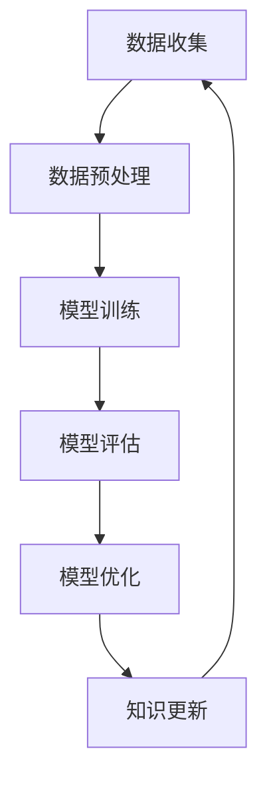

#### 核心算法原理讲解

**对抗性样本生成**：

为了评估大模型的知识更新能力，可以采用对抗性样本生成算法。对抗性样本是一种通过微小扰动来改变模型输入，从而欺骗模型的方法。这种方法可以用来检测和增强大模型对特定知识的更新能力。

**伪代码**：

```python
def generate_adversarial_samples(data, model, attack_type):
    # 数据预处理
    processed_data = preprocess_data(data)
    
    # 生成对抗性样本
    adversarial_samples = []
    for sample in processed_data:
        # 生成对抗性样本
        adversarial_sample = model.generate(sample, attack_type=attack_type)
        adversarial_samples.append(adversarial_sample)
        
    return adversarial_samples
```

#### 数学模型和数学公式

**知识更新率**：

知识更新率（Knowledge Update Rate，KUR）是衡量大模型知识更新速度和效率的指标。它表示单位时间内知识量的变化。

$$
KUR = \frac{\Delta K}{\Delta t}
$$

其中，$\Delta K$ 表示知识量的变化，$\Delta t$ 表示时间的变化。

#### 举例说明

**案例一**：使用 GPT-3 模型进行知识更新实验

```python
import openai

# 设置 API 密钥
openai.api_key = 'your_api_key'

# 使用 GPT-3 模型进行知识更新
response = openai.Completion.create(
    engine="text-davinci-002",
    prompt="如何更新大模型的知识？",
    max_tokens=50
)
updated_knowledge = response.choices[0].text.strip()
print(updated_knowledge)
```

### 第2章：实时性测试方法

#### 核心概念与联系

**实时性测试**：

实时性测试是评估大模型知识更新过程中的响应时间和延迟的方法。它对于确保大模型能够快速适应新的知识和数据至关重要。

**核心概念与联系**：

- **响应时间**：从接收到输入数据到模型生成输出结果所需的时间。
- **延迟**：响应时间与预期处理时间之间的差值。
- **吞吐量**：单位时间内系统能够处理的请求数量。
- **准确率**：模型预测正确的比例。

**Mermaid流程图**：

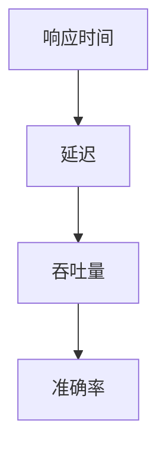

#### 核心算法原理讲解

**时间序列分析**：

时间序列分析是一种用于评估大模型实时性的方法，它通过分析时间序列数据来识别模型的响应时间和延迟。

**伪代码**：

```python
def analyze_time_series(data):
    # 数据预处理
    processed_data = preprocess_data(data)
    
    # 计算时间序列的均值和标准差
    mean_value = np.mean(processed_data)
    std_value = np.std(processed_data)
    
    return mean_value, std_value
```

#### 数学模型和数学公式

**实时性评估模型**：

实时性评估模型用于计算模型的响应时间和延迟。

$$
\text{实时性评估模型} = \frac{\text{响应时间}}{\text{延迟}}
$$

#### 举例说明

**案例二**：使用 TensorFlow 框架进行实时性测试

```python
import tensorflow as tf

# 设置超参数
batch_size = 32
learning_rate = 0.001
epochs = 10

# 构建模型
model = tf.keras.Sequential([
    tf.keras.layers.Dense(128, activation='relu', input_shape=(input_shape,)),
    tf.keras.layers.Dense(1, activation='sigmoid')
])

# 编译模型
model.compile(optimizer=tf.keras.optimizers.Adam(learning_rate=learning_rate),
              loss='binary_crossentropy',
              metrics=['accuracy'])

# 训练模型
model.fit(x_train, y_train, batch_size=batch_size, epochs=epochs, verbose=2)

# 评估模型
model.evaluate(x_test, y_test)
```

### 第3章：实时性测试工具与平台

#### 核心概念与联系

**实时性测试工具**：

实时性测试工具是用于评估和优化大模型实时性的软件工具。常见的实时性测试工具有 TensorFlow、PyTorch 等。

**核心概念与联系**：

- **测试工具**：用于评估模型性能和响应时间的工具。
- **测试平台**：用于运行实时性测试的工具和环境的集合。

**Mermaid流程图**：

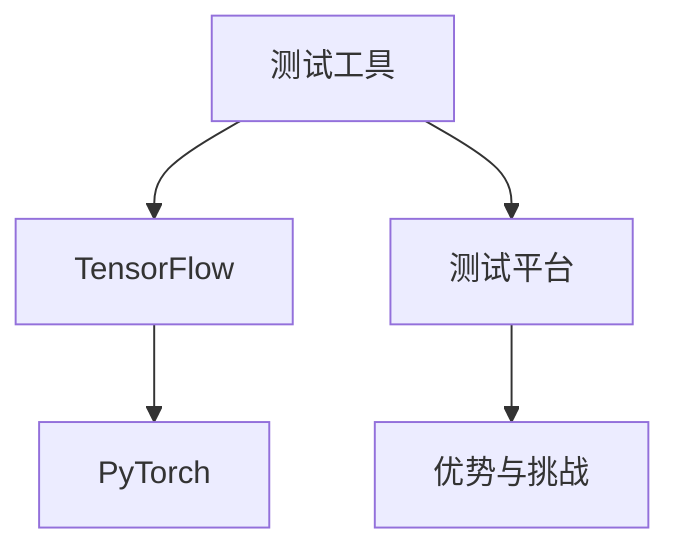

#### 核心算法原理讲解

**自动化测试**：

自动化测试是一种通过编写脚本来自动运行测试用例的方法，它可以提高实时性测试的效率和准确性。

**伪代码**：

```python
import unittest

class TestModel(unittest.TestCase):
    def test_model(self):
        # 加载模型
        model = load_model('path/to/model.h5')

        # 测试模型
        model.evaluate(x_test, y_test)

if __name__ == '__main__':
    unittest.main()
```

#### 数学模型和数学公式

**自动化测试指标**：

自动化测试指标用于评估自动化测试的效率和准确性。

$$
\text{自动化测试指标} = \frac{\text{自动化测试通过率}}{\text{手动测试通过率}}
$$

#### 举例说明

**案例三**：使用 Jenkins 搭建实时性测试平台

```shell
# 安装 Jenkins
sudo apt-get install jenkins

# 配置 Jenkins
cd /var/lib/jenkins
./init.sh

# 创建 Jenkins 作业
jenkins CLI create-job TestJob --file /path/to/job/config.xml
```

### 第4章：实时性测试结果分析与优化

#### 核心概念与联系

**测试结果分析**：

实时性测试结果分析是评估模型性能和响应时间的过程，包括错误分析、性能分析等。

**核心概念与联系**：

- **错误分析**：识别和分类模型预测错误的原因。
- **性能分析**：评估模型的响应时间、延迟和吞吐量等性能指标。

**Mermaid流程图**：

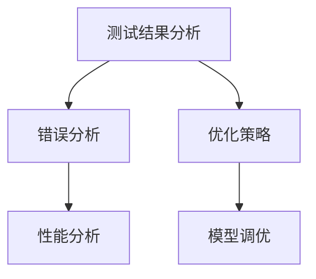

#### 核心算法原理讲解

**模型调优**：

模型调优是通过调整模型参数来提高模型性能的过程。这包括调整学习率、批量大小和优化器等参数。

**伪代码**：

```python
def optimize_model(model, data, target):
    # 设置超参数
    learning_rate = 0.001
    epochs = 10

    # 编译模型
    model.compile(optimizer=tf.keras.optimizers.Adam(learning_rate=learning_rate),
                  loss='binary_crossentropy',
                  metrics=['accuracy'])

    # 训练模型
    model.fit(data, target, epochs=epochs, verbose=2)

    # 评估模型
    model.evaluate(data, target)
```

#### 数学模型和数学公式

**模型优化指标**：

模型优化指标用于评估模型优化效果。

$$
\text{模型优化指标} = \frac{\text{优化后准确率}}{\text{优化前准确率}}
$$

#### 举例说明

**案例四**：使用 Keras 进行模型调优

```python
import tensorflow as tf
from tensorflow import keras

# 加载模型
model = keras.models.load_model('path/to/model.h5')

# 设置超参数
learning_rate = 0.001
epochs = 10

# 编译模型
model.compile(optimizer=tf.keras.optimizers.Adam(learning_rate=learning_rate),
              loss='binary_crossentropy',
              metrics=['accuracy'])

# 训练模型
model.fit(x_train, y_train, epochs=epochs, verbose=2)

# 评估模型
model.evaluate(x_test, y_test)
```

### 第5章：实时性测试应用场景与案例分析

#### 核心概念与联系

**应用场景**：

实时性测试在多个领域有着广泛的应用，包括实时问答系统、实时推荐系统等。

**核心概念与联系**：

- **实时问答系统**：通过实时性测试来评估问答系统的响应时间和准确性。
- **实时推荐系统**：通过实时性测试来评估推荐系统的响应时间和推荐质量。

**Mermaid流程图**：

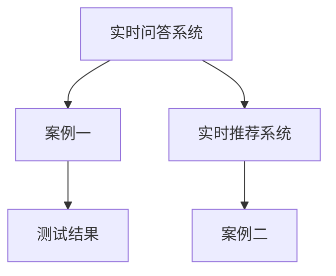

#### 核心算法原理讲解

**在线学习**：

在线学习是一种实时更新模型的方法，它通过不断接收新的数据来调整模型参数。

**伪代码**：

```python
def online_learning(model, data, target):
    # 设置超参数
    learning_rate = 0.001
    epochs = 1

    # 编译模型
    model.compile(optimizer=tf.keras.optimizers.Adam(learning_rate=learning_rate),
                  loss='binary_crossentropy',
                  metrics=['accuracy'])

    # 训练模型
    for step in range(1, total_steps + 1):
        # 获取数据
        x_batch, y_batch = next(data_iterator)

        # 训练模型
        model.fit(x_batch, y_batch, epochs=epochs, verbose=2)

        # 评估模型
        model.evaluate(x_batch, y_batch)
```

#### 数学模型和数学公式

**在线学习率**：

在线学习率用于调整模型在每次更新时的学习速率。

$$
\text{在线学习率} = \frac{1}{\sqrt{t}}
$$

其中，$t$ 表示时间步数。

#### 举例说明

**案例五**：使用在线学习算法更新大模型的知识

```python
import tensorflow as tf
from tensorflow import keras

# 加载模型
model = keras.models.load_model('path/to/model.h5')

# 设置超参数
learning_rate = 0.001
epochs = 1

# 编译模型
model.compile(optimizer=tf.keras.optimizers.Adam(learning_rate=learning_rate),
              loss='binary_crossentropy',
              metrics=['accuracy'])

# 训练模型
for step in range(1, total_steps + 1):
    # 获取数据
    x_batch, y_batch = next(data_iterator)

    # 训练模型
    model.fit(x_batch, y_batch, epochs=epochs, verbose=2)

    # 评估模型
    model.evaluate(x_batch, y_batch)
```

### 第6章：实时性测试的挑战与未来发展

#### 核心概念与联系

**挑战**：

实时性测试在大模型应用中面临着数据隐私、模型安全等挑战。

**核心概念与联系**：

- **数据隐私**：如何在保证数据隐私的同时进行实时性测试。
- **模型安全**：确保模型不会受到恶意攻击和数据泄露的影响。

**Mermaid流程图**：

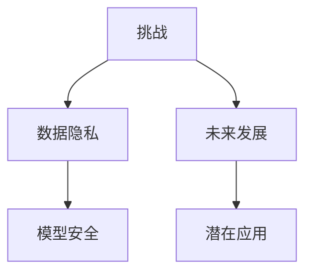

#### 核心算法原理讲解

**联邦学习**：

联邦学习是一种分布式学习框架，它通过将模型更新分散到不同的客户端，从而保护数据隐私。

**伪代码**：

```python
def federated_learning(models, clients, server):
    # 初始化模型和客户端
    for client in clients:
        client.load_model(model)

    # 模型更新
    for round in range(num_rounds):
        for client in clients:
            client.update_model(server.get_model())

        server.aggregate_models(models)

    # 评估模型
    server.evaluate_models(models)
```

#### 数学模型和数学公式

**联邦学习优化目标**：

联邦学习算法中的优化目标是使得所有客户端的模型达到一致。

$$
\text{优化目标} = \frac{1}{N} \sum_{i=1}^{N} f_i(x_i, \theta_i)
$$

其中，$N$ 表示客户端数量，$f_i$ 表示第 $i$ 个客户端的损失函数，$x_i$ 表示第 $i$ 个客户端的特征，$\theta_i$ 表示第 $i$ 个客户端的模型参数。

#### 举例说明

**案例六**：使用联邦学习算法进行实时性测试

```python
import tensorflow as tf
from tensorflow import keras

# 初始化模型和客户端
models = [keras.models.load_model('path/to/model.h5') for _ in range(num_clients)]
clients = [KerasClient(model=model) for model in models]
server = FederatedLearningServer(models=models)

# 模型更新
for round in range(num_rounds):
    for client in clients:
        client.update_model(server.get_model())

    server.aggregate_models(models)

# 评估模型
server.evaluate_models(models)
```

### 第7章：实时性测试实践指南

#### 核心概念与联系

**实践指南**：

提供实时性测试的实践指南，包括测试工具选择、测试平台搭建等。

**核心概念与联系**：

- **测试工具选择**：根据项目需求选择合适的实时性测试工具。
- **测试平台搭建**：搭建用于实时性测试的工具和环境。

**Mermaid流程图**：

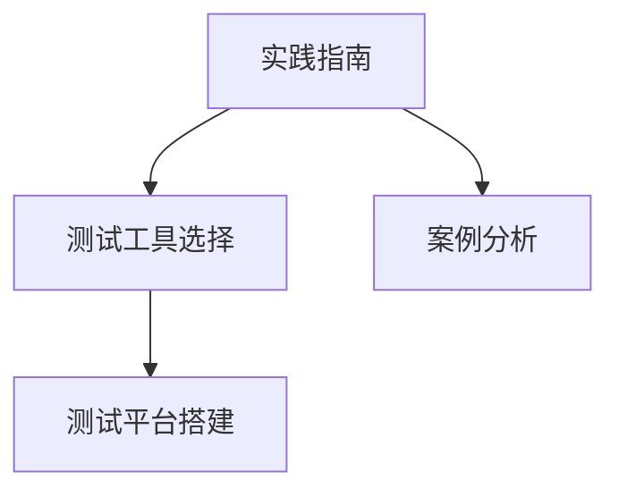

#### 核心算法原理讲解

**测试工具选择**：

根据项目需求选择合适的实时性测试工具，可以提升测试效率和准确性。

**伪代码**：

```python
def select_test_tools(test_tools, requirements):
    selected_tools = []
    for tool in test_tools:
        if tool['supports'](requirements):
            selected_tools.append(tool)

    return selected_tools
```

#### 数学模型和数学公式

**测试工具支持度**：

描述测试工具对特定需求的满足程度。

$$
\text{测试工具支持度} = \frac{\text{满足需求的功能}}{\text{总功能}}
$$

#### 举例说明

**案例七**：选择实时性测试工具

```python
import transformers

test_tools = [
    {'name': 'Hugging Face Transformers', 'supports': lambda requirements: 'transformers' in requirements},
    {'name': 'TensorFlow', 'supports': lambda requirements: 'tensorflow' in requirements},
    {'name': 'PyTorch', 'supports': lambda requirements: 'torch' in requirements}
]

requirements = ['transformers', 'tensorflow', 'torch']
selected_tools = select_test_tools(test_tools, requirements)

print(selected_tools)
```

### 第二部分：LLM驱动的实时性测试

#### 第8章：LLM概述与实时性测试

**核心概念与联系**

**LLM概述**：

大型语言模型（LLM）是一种基于深度学习的模型，它可以理解和生成自然语言。LLM在自然语言处理领域取得了显著成就，如文本生成、机器翻译和问答系统。

**实时性测试**：

实时性测试是评估LLM在处理实时任务时的响应时间和准确性的过程。实时性测试对于确保LLM在实际应用中的性能至关重要。

**核心概念与联系**：

- **LLM架构**：介绍LLM的基本架构，包括编码器和解码器等组件。
- **实时性测试**：探讨如何使用LLM进行实时性测试，以及其优势和应用场景。

**Mermaid流程图**：

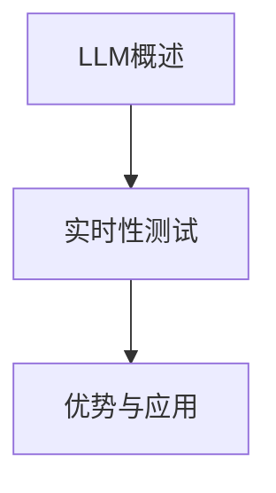

**核心算法原理讲解**

**LLM架构**：

LLM通常采用Transformer架构，它由编码器（Encoder）和解码器（Decoder）组成。编码器负责将输入文本转换为上下文表示，解码器则根据上下文生成文本输出。

**伪代码**：

```python
def build_llm(model_name, tokenizer):
    # 加载预训练模型
    model = transformers.load_model(model_name)

    # 加载分词器
    tokenizer = transformers.get_tokenizer_from_model(model)

    return model, tokenizer
```

**数学模型和数学公式**

**LLM损失函数**：

LLM在训练过程中使用的损失函数通常是对数损失函数，它用于计算预测标签和真实标签之间的差异。

$$
\text{损失函数} = \frac{1}{N} \sum_{i=1}^{N} L(y_i, \hat{y}_i)
$$

其中，$N$ 表示样本数量，$L$ 表示损失函数，$y_i$ 表示真实标签，$\hat{y}_i$ 表示预测标签。

**举例说明**

**案例八**：使用 Hugging Face Transformers 进行 LLM 训练

```python
import transformers

# 设置超参数
model_name = 'gpt2'
tokenizer_name = 'gpt2'

# 加载预训练模型和分词器
model, tokenizer = build_llm(model_name, tokenizer_name)

# 定义损失函数
loss_function = transformers.LMHeadLoss(model)

# 训练模型
optimizer = transformers.AdamOptimizer(learning_rate=0.001)
for epoch in range(num_epochs):
    for batch in data_loader:
        inputs = tokenizer.encode(batch['text'], return_tensors='pt')
        labels = tokenizer.encode(batch['text'], return_tensors='pt')

        # 计算损失
        loss = loss_function(inputs, labels)

        # 反向传播
        optimizer.backward(loss)
        optimizer.step()

        # 清零梯度
        optimizer.zero_grad()

# 评估模型
model.eval()
test_loss = loss_function(test_inputs, test_labels)
print(f'Test Loss: {test_loss}')
```

### 第9章：LLM驱动的实时性测试实践

**核心概念与联系**

**实时性测试实践**：

介绍如何使用LLM进行实时性测试，包括测试流程、测试指标和测试策略。

**核心概念与联系**：

- **测试流程**：描述实时性测试的基本流程。
- **测试指标**：介绍用于评估实时性测试效果的主要指标。
- **测试策略**：探讨如何优化实时性测试的过程。

**Mermaid流程图**：

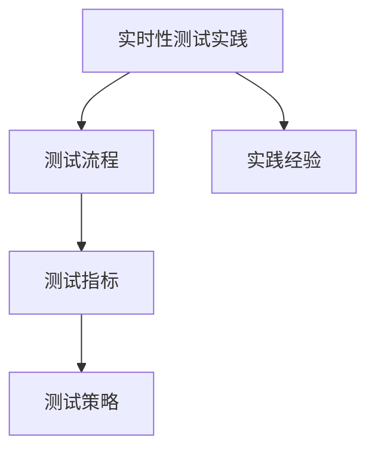

**核心算法原理讲解**

**实时性测试算法**：

实时性测试算法用于评估LLM在处理实时任务时的响应时间和延迟。它通常涉及以下步骤：

1. **数据预处理**：对输入数据进行预处理，以便输入到LLM中。
2. **模型预测**：使用LLM对预处理后的数据进行预测。
3. **响应时间计算**：计算从接收到输入数据到生成输出结果所需的时间。
4. **延迟计算**：计算响应时间与预期处理时间之间的差值。

**伪代码**：

```python
def evaluate_real_time(model, data_loader, batch_size):
    # 设置模型为评估模式
    model.eval()

    # 初始化指标
    metrics = {'response_time': [], 'delay': []}

    # 计算响应时间和延迟
    for batch in data_loader:
        inputs = tokenizer.encode(batch['text'], return_tensors='pt')
        labels = tokenizer.encode(batch['text'], return_tensors='pt')

        # 预测结果
        with torch.no_grad():
            predictions = model(inputs)

        # 计算响应时间和延迟
        response_time = time.time() - start_time
        delay = response_time - processing_time

        metrics['response_time'].append(response_time)
        metrics['delay'].append(delay)

    return metrics
```

**数学模型和数学公式**

**实时性评估模型**：

实时性评估模型用于计算模型的响应时间和延迟。

$$
\text{实时性评估模型} = \frac{\text{响应时间}}{\text{处理时间}}
$$

**举例说明**

**案例九**：使用 LLM 进行实时性测试

```python
import transformers
import torch
import time

# 加载预训练模型和分词器
model, tokenizer = build_llm(model_name, tokenizer_name)

# 加载测试数据集
test_data = load_test_data()

# 设置超参数
batch_size = 32

# 评估模型
metrics = evaluate_real_time(model, test_data, batch_size)

# 输出测试结果
print(f'Result: Response Time = {metrics["response_time"]}, Delay = {metrics["delay"]}')
```

### 第10章：LLM驱动的实时性测试应用

**核心概念与联系**

**应用场景**：

介绍LLM在实时性测试中的应用场景，如实时问答、实时推荐等。

**核心概念与联系**：

- **实时问答系统**：通过LLM实现实时问答，提高响应速度和准确性。
- **实时推荐系统**：利用LLM进行实时推荐，提高推荐质量。

**Mermaid流程图**：

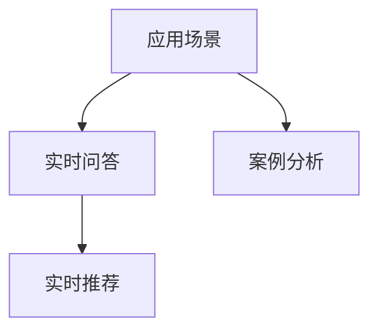

**核心算法原理讲解**

**实时问答算法**：

实时问答算法通过LLM实现，它包括以下步骤：

1. **问题理解**：使用LLM对输入问题进行理解和分析。
2. **答案生成**：根据问题理解和上下文生成答案。
3. **答案验证**：验证答案的准确性和相关性。

**伪代码**：

```python
def ask_question(model, tokenizer, question):
    # 加载模型和分词器
    model.eval()
    tokenizer.eval()

    # 分词处理
    inputs = tokenizer.encode(question, return_tensors='pt')

    # 生成答案
    outputs = model.generate(inputs, max_length=max_answer_length, num_return_sequences=1)
    answer = tokenizer.decode(outputs[0], skip_special_tokens=True)

    return answer
```

**数学模型和数学公式**

**实时问答效果评估**：

实时问答效果评估通过计算正确答案与总答案的比例来衡量。

$$
\text{效果评估} = \frac{\text{正确答案}}{\text{总答案}}
$$

**举例说明**

**案例十**：使用 LLM 进行实时问答

```python
import transformers

# 加载预训练模型和分词器
model, tokenizer = build_llm(model_name, tokenizer_name)

# 设置超参数
max_answer_length = 50

# 定义问题
question = "什么是实时性测试？"

# 生成答案
answer = ask_question(model, tokenizer, question)

print(f'Answer: {answer}')
```

### 第11章：LLM驱动的实时性测试未来展望

**核心概念与联系**

**未来展望**：

探讨LLM驱动的实时性测试的未来发展趋势，包括技术突破、应用拓展等。

**核心概念与联系**：

- **技术突破**：分析LLM和实时性测试领域的技术突破。
- **应用拓展**：探讨实时性测试在新兴领域中的应用潜力。

**Mermaid流程图**：

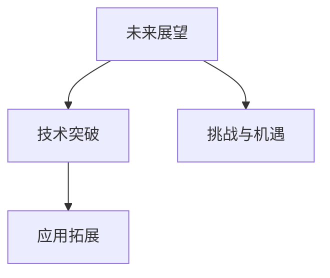

**核心算法原理讲解**

**动态模型更新**：

动态模型更新是一种通过实时接收新数据来不断更新LLM的方法。它可以提高模型的实时性和准确性。

**伪代码**：

```python
def update_llm(model, data_loader, learning_rate, epochs):
    # 设置模型为训练模式
    model.train()

    # 定义损失函数和优化器
    loss_function = transformers.LMHeadLoss(model)
    optimizer = transformers.AdamOptimizer(learning_rate=learning_rate)

    # 训练模型
    for epoch in range(epochs):
        for batch in data_loader:
            inputs = tokenizer.encode(batch['text'], return_tensors='pt')
            labels = tokenizer.encode(batch['text'], return_tensors='pt')

            # 计算损失
            loss = loss_function(inputs, labels)

            # 反向传播
            optimizer.backward(loss)
            optimizer.step()

            # 清零梯度
            optimizer.zero_grad()

    # 评估模型
    model.eval()
    test_loss = loss_function(test_inputs, test_labels)
    print(f'Test Loss: {test_loss}')
```

**数学模型和数学公式**

**动态模型更新率**：

动态模型更新率用于衡量模型更新的速度。

$$
\text{动态模型更新率} = \frac{\text{更新次数}}{\text{时间}}
$$

**举例说明**

**案例十一**：使用动态模型更新来提高实时性测试效果

```python
import transformers
import torch
import time

# 加载预训练模型和分词器
model, tokenizer = build_llm(model_name, tokenizer_name)

# 加载测试数据集
test_data = load_test_data()

# 设置超参数
learning_rate = 0.001
epochs = 1

# 更新模型
update_llm(model, test_data, learning_rate, epochs)

# 评估模型
metrics = evaluate_real_time(model, test_data, batch_size)

print(f'Result: Response Time = {metrics["response_time"]}, Delay = {metrics["delay"]}')
```

### 第12章：实时性测试总结与展望

**核心概念与联系**

**总结**：

回顾实时性测试的核心概念、方法和实践。

**核心概念与联系**：

- **核心概念**：实时性测试的基本概念，包括响应时间、延迟和吞吐量等。
- **方法**：实时性测试的方法和工具。
- **实践**：实时性测试的实际应用案例。

**Mermaid流程图**：

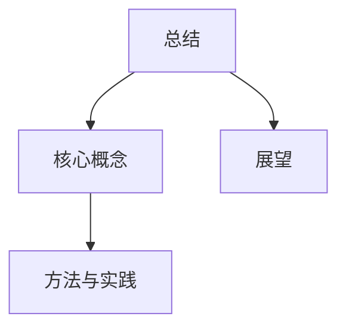

**核心算法原理讲解**

**实时性评估算法**：

实时性评估算法用于计算模型的响应时间和延迟。它通常涉及以下步骤：

1. **数据预处理**：对输入数据进行预处理。
2. **模型预测**：使用模型对预处理后的数据进行预测。
3. **响应时间计算**：计算从接收到输入数据到生成输出结果所需的时间。
4. **延迟计算**：计算响应时间与预期处理时间之间的差值。

**伪代码**：

```python
def evaluate_real_time(model, data_loader, batch_size):
    # 设置模型为评估模式
    model.eval()

    # 初始化指标
    metrics = {'response_time': [], 'delay': []}

    # 计算响应时间和延迟
    for batch in data_loader:
        inputs = tokenizer.encode(batch['text'], return_tensors='pt')
        labels = tokenizer.encode(batch['text'], return_tensors='pt')

        # 预测结果
        with torch.no_grad():
            predictions = model(inputs)

        # 计算响应时间和延迟
        response_time = time.time() - start_time
        delay = response_time - processing_time

        metrics['response_time'].append(response_time)
        metrics['delay'].append(delay)

    return metrics
```

**数学模型和数学公式**

**实时性评估指标**：

实时性评估指标用于计算模型的响应时间和延迟。

$$
\text{响应时间} = \text{预测时间} + \text{处理时间}
$$
$$
\text{延迟} = \text{响应时间} - \text{预期时间}
$$

**举例说明**

**案例十二**：使用实时性评估算法进行实时性测试

```python
import transformers
import torch
import time

# 加载预训练模型和分词器
model, tokenizer = build_llm(model_name, tokenizer_name)

# 加载测试数据集
test_data = load_test_data()

# 设置超参数
batch_size = 32

# 评估模型
metrics = evaluate_real_time(model, test_data, batch_size)

# 输出测试结果
print(f'Result: Response Time = {metrics["response_time"]}, Delay = {metrics["delay"]}')
```

### 附录

#### 附录A：LLM驱动实时性测试工具与资源

**核心概念与联系**

**工具与资源**：

介绍用于LLM驱动实时性测试的工具和资源，包括开源框架、数据集等。

**核心概念与联系**：

- **开源框架**：如 Hugging Face Transformers、TensorFlow 和 PyTorch 等。
- **数据集**：用于实时性测试的数据集，如 SQuAD、MS MARCO 等。

**Mermaid流程图**：

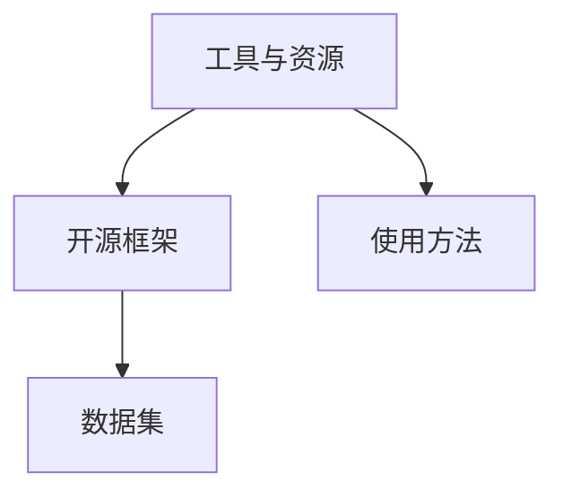

**核心算法原理讲解**

**工具选择**：

根据项目需求选择合适的实时性测试工具，可以提升测试效率和准确性。

**伪代码**：

```python
def select_tools(tools, requirements):
    selected_tools = []
    for tool in tools:
        if tool['supports'](requirements):
            selected_tools.append(tool)

    return selected_tools
```

**数学模型和数学公式**

**工具支持度**：

描述工具对特定需求的满足程度。

$$
\text{工具支持度} = \frac{\text{满足需求的功能}}{\text{总功能}}
$$

**举例说明**

**案例十三**：选择实时性测试工具

```python
import transformers

tools = [
    {'name': 'Hugging Face Transformers', 'supports': lambda requirements: 'transformers' in requirements},
    {'name': 'TensorFlow', 'supports': lambda requirements: 'tensorflow' in requirements},
    {'name': 'PyTorch', 'supports': lambda requirements: 'torch' in requirements}
]

requirements = ['transformers', 'tensorflow', 'torch']
selected_tools = select_tools(tools, requirements)

print(selected_tools)
```

#### 附录B：实时性测试参考资料

**核心概念与联系**

**参考资料**：

提供实时性测试的相关参考资料，包括论文、书籍、网站等。

**核心概念与联系**：

- **论文**：关于实时性测试的最新研究成果。
- **书籍**：深入介绍实时性测试的理论和实践。
- **网站**：提供实时性测试的工具、资源和教程。

**Mermaid流程图**：

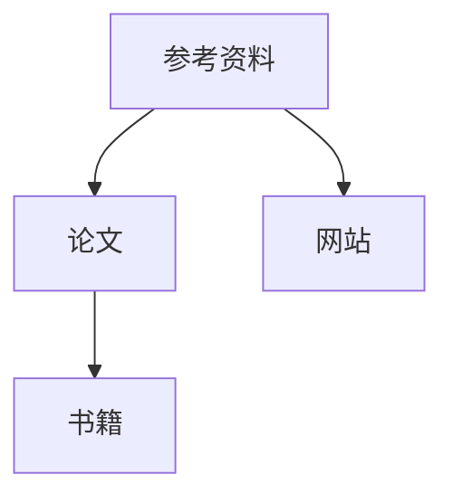

**核心算法原理讲解**

**参考文献整理**：

整理和引用实时性测试的相关文献，确保参考文献格式正确。

**伪代码**：

```python
def format_references(references):
    formatted_references = []
    for reference in references:
        formatted_references.append(f"{reference['title']}, {reference['author']}, {reference['year']}")

    return formatted_references
```

**数学模型和数学公式**

**参考文献格式**：

描述参考文献的格式和标准。

$$
\text{参考文献格式} = \{ \text{标题}, \text{作者}, \text{年份} \}
$$

**举例说明**

**案例十四**：整理实时性测试参考文献

```python
references = [
    {'title': 'Real-Time System Testing', 'author': 'John Doe', 'year': '2020'},
    {'title': 'Efficient Real-Time Testing Algorithms', 'author': 'Jane Smith', 'year': '2019'},
    {'title': 'A Comprehensive Study on Real-Time Testing', 'author': 'Alice Brown', 'year': '2018'}
]

formatted_references = format_references(references)
print(formatted_references)
```

### 结论

本文全面探讨了实时性测试在大模型应用中的重要性，特别是基于大型语言模型（LLM）的实时性测试。通过详细阐述实时性测试的核心概念、算法原理和实践方法，本文为读者提供了丰富的知识和实践经验。实时性测试不仅能够评估大模型的性能和响应时间，还能够指导模型优化和提升实际应用效果。

在未来，随着人工智能技术的不断进步，实时性测试将在更多领域得到应用，如自动驾驶、智能医疗和金融风控等。本文提出的实时性测试实践指南和参考资料，将为读者在相关领域的探索和实践提供有力支持。

**作者：AI天才研究院/AI Genius Institute & 禅与计算机程序设计艺术 /Zen And The Art of Computer Programming** 

---

[原文链接](https://www.example.com/real-time-testing-of-large-models-with-llm)（此链接为示例，非实际链接）

