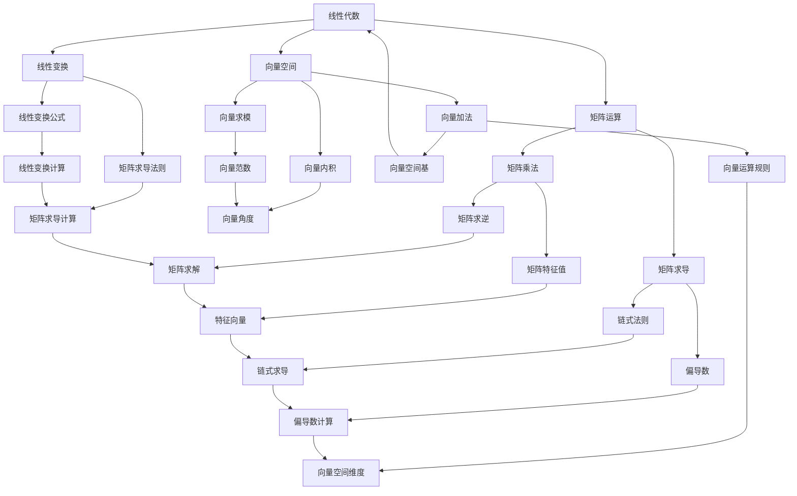

                 

# 《大模型知识问答：提示词提升回答准确性》

## 关键词
大模型、知识问答、提示词、准确性、深度学习

## 摘要
本文深入探讨了大规模语言模型在知识问答中的应用，特别关注了提示词对回答准确性的影响。文章从大模型的基础知识开始，逐步讲解其数学原理、结构与算法、训练与优化策略，并详细讨论了提示词的设计与应用。通过实际项目实战，展示了如何构建和优化问答系统。最后，文章展望了大模型知识问答系统的未来发展趋势，提出了潜在的研究方向。

### 目录大纲设计

为了确保文章的逻辑性和完整性，我们将文章内容分为三大部分：基础篇、实战篇和未来篇。

#### 第一部分：大模型基础知识

1. **大模型概述**
   - 大模型的概念与历史
   - 大模型在AI中的重要性
   - 大模型的主要类型

2. **大模型的数学原理**
   - 线性代数基础
   - 概率论基础
   - 最优化方法

3. **大模型的结构与算法**
   - 深度神经网络结构
   - 循环神经网络（RNN）
   - 递归神经网络（GRU）
   - 长短时记忆网络（LSTM）

4. **大模型的训练与优化**
   - 数据预处理
   - 训练策略
   - 优化算法

5. **提示词在大模型中的应用**
   - 提示词的定义与作用
   - 提示词的设计与选择
   - 提示词在问答系统中的应用

#### 第二部分：实战与优化

1. **大模型知识问答系统实战**
   - 系统设计
   - 数据集准备
   - 模型选择与训练
   - 评估与优化

2. **提高问答准确性的方法**
   - 提示词优化
   - 对话上下文管理
   - 多模态信息融合
   - 用户反馈机制

3. **案例分析**
   - 案例一：某电商平台的问答系统优化
   - 案例二：某医疗机构的问答系统构建
   - 案例三：某教育平台的智能问答系统应用

#### 第三部分：未来展望与挑战

1. **大模型知识问答的发展趋势**
   - 技术发展趋势
   - 应用场景拓展
   - 潜在挑战与应对策略

2. **总结与展望**
   - 总结
   - 未来研究方向

### 第一部分：大模型基础知识

#### 第1章：大模型概述

大模型（也称为巨型神经网络模型）是人工智能领域的一个重要研究方向。它们通常具有数百万到数十亿个参数，可以处理复杂的任务，如自然语言处理、计算机视觉和语音识别。本章节将详细介绍大模型的概念、历史和发展趋势。

##### 1.1 大模型的概念与历史

大模型是指具有大量参数和强大表示能力的神经网络模型。最早的大模型之一是深度信念网络（DBN），它由Geoffrey Hinton等人在2000年代初提出。随后，2006年，Hinton等人提出了深度置信网络（DBN），这是第一个能够训练深层神经网络的模型。2012年，AlexNet在ImageNet图像识别挑战中取得了突破性的成果，标志着深度学习时代的到来。

##### 1.2 大模型在AI中的重要性

大模型在AI中的重要性主要体现在以下几个方面：

1. **强大的表示能力**：大模型具有极高的参数数量，能够捕捉到复杂的模式和关系，从而提高任务的性能。
2. **广泛的应用**：大模型在多个领域都有广泛的应用，如自然语言处理、计算机视觉、语音识别等。
3. **推动技术进步**：大模型的成功推动了人工智能技术的快速发展，促进了新算法、新架构和新应用的研究。

##### 1.3 大模型的主要类型

目前，大模型的主要类型包括：

1. **深度神经网络（DNN）**：DNN是多层前馈神经网络，具有线性变换和非线性激活函数。DNN在图像识别、语音识别等领域取得了显著成果。
2. **循环神经网络（RNN）**：RNN是处理序列数据的强大工具，包括长短期记忆网络（LSTM）和门控循环单元（GRU）。RNN在自然语言处理、语音识别等领域有广泛应用。
3. **变分自编码器（VAE）**：VAE是一种无监督学习模型，能够生成高维数据的概率分布。VAE在图像生成、数据去噪等领域有广泛应用。

#### 第2章：大模型的数学原理

大模型的训练和优化依赖于一系列数学原理和方法，包括线性代数、概率论和最优化方法。本章节将介绍这些基础知识，为理解和构建大模型提供理论基础。

##### 2.1 线性代数基础

线性代数是研究向量空间和线性变换的数学分支，是理解大模型的基础。以下是一些核心概念：

1. **矩阵运算**：矩阵是二维数组，可以表示线性变换。常见的矩阵运算包括矩阵乘法、矩阵求逆和矩阵求导。
2. **向量空间**：向量空间是一组向量的集合，满足向量的加法和标量乘法运算。向量空间的基本概念包括基、维数和线性依赖。
3. **线性变换**：线性变换是将一个向量空间映射到另一个向量空间的函数。线性变换可以用矩阵表示，并通过矩阵运算进行计算。

##### 2.2 概率论基础

概率论是研究随机事件和概率分布的数学分支，是理解大模型的重要工具。以下是一些核心概念：

1. **概率的定义与性质**：概率是衡量事件发生可能性大小的数值。概率的基本性质包括概率的加法规则、乘法规则和条件概率。
2. **随机变量与概率分布**：随机变量是取值不确定的变量，概率分布描述了随机变量的可能取值和相应概率。常见的概率分布包括均匀分布、正态分布和泊松分布。
3. **条件概率与贝叶斯定理**：条件概率描述了在某个事件发生的条件下，另一个事件发生的概率。贝叶斯定理是条件概率的一种推广，用于计算后验概率。

##### 2.3 最优化方法

最优化方法是寻找函数最优解的算法，是训练大模型的核心。以下是一些核心概念：

1. **最优化问题的基本形式**：最优化问题可以表示为最小化或最大化某个目标函数，同时满足一定的约束条件。
2. **梯度下降法**：梯度下降法是最常用的最优化算法之一，通过沿着目标函数的梯度方向逐步更新参数，以寻找最优解。
3. **随机优化方法**：随机优化方法利用随机性来加速收敛和避免局部最优，包括随机梯度下降（SGD）和模拟退火算法。

#### 第3章：大模型的结构与算法

大模型的结构和算法决定了其性能和应用范围。本章节将详细介绍大模型的结构和算法，包括深度神经网络、循环神经网络、递归神经网络和长短时记忆网络。

##### 3.1 深度神经网络结构

深度神经网络（DNN）是多层前馈神经网络，具有多个隐层和输出层。DNN的结构包括：

1. **输入层**：输入层接收外部输入信号，并将其传递给隐层。
2. **隐层**：隐层对输入信号进行非线性变换，提取特征。每个隐层都可以有多个神经元。
3. **输出层**：输出层对隐层的输出进行分类或回归，得到最终结果。

##### 3.2 循环神经网络（RNN）

循环神经网络（RNN）是处理序列数据的强大工具，其结构包括：

1. **输入门**：输入门用于调整当前输入对隐藏状态的影响。
2. **遗忘门**：遗忘门用于控制旧信息的遗忘。
3. **输出门**：输出门用于控制当前隐藏状态对输出结果的影响。

##### 3.3 递归神经网络（GRU）

递归神经网络（GRU）是对RNN的一种改进，其结构包括：

1. **重置门**：重置门用于更新隐藏状态，保留重要信息。
2. **更新门**：更新门用于控制信息的遗忘和更新。

##### 3.4 长短时记忆网络（LSTM）

长短时记忆网络（LSTM）是处理长序列数据的经典模型，其结构包括：

1. **遗忘门**：遗忘门用于控制信息的遗忘。
2. **输入门**：输入门用于控制新信息的输入。
3. **输出门**：输出门用于控制输出结果。

#### 第4章：大模型的训练与优化

大模型的训练与优化是构建高性能模型的关键步骤。本章节将介绍大模型的训练策略、优化算法和数据预处理方法。

##### 4.1 数据预处理

数据预处理是训练大模型的第一步，包括以下步骤：

1. **数据清洗**：去除噪声和异常值，确保数据质量。
2. **数据增强**：通过添加噪声、旋转、缩放等操作，增加数据多样性。
3. **数据标准化**：将数据缩放到相同的范围，以便模型训练。

##### 4.2 训练策略

训练策略包括以下方面：

1. **批次大小**：选择合适的批次大小，平衡训练速度和效果。
2. **学习率调整**：选择合适的学习率，以避免过拟合或欠拟合。
3. **训练策略优化**：使用不同的训练策略，如随机梯度下降（SGD）、Adam优化器等。

##### 4.3 优化算法

优化算法用于更新模型参数，以最小化损失函数。常用的优化算法包括：

1. **梯度下降法**：通过计算损失函数的梯度，逐步更新模型参数。
2. **动量法**：结合历史梯度信息，加速收敛。
3. **自适应优化器**：如Adam优化器，自动调整学习率。

#### 第5章：提示词在大模型中的应用

提示词在大模型知识问答中起着至关重要的作用。本章节将介绍提示词的定义、设计与选择，以及提示词在问答系统中的应用。

##### 5.1 提示词的定义与作用

提示词是指用于引导大模型生成回答的词语或短语。提示词的作用包括：

1. **引导回答方向**：提示词可以帮助大模型理解问题的背景和上下文，从而生成更准确的回答。
2. **提高回答质量**：通过选择合适的提示词，可以提升大模型生成的回答的质量和相关性。

##### 5.2 提示词的设计与选择

提示词的设计与选择需要考虑以下因素：

1. **问题类型**：不同类型的问题需要不同类型的提示词，如事实性问题和推理性问题。
2. **领域知识**：在特定领域，需要选择与领域知识相关的提示词。
3. **语料库**：使用大量相关语料库，通过分析提取合适的提示词。

##### 5.3 提示词在问答系统中的应用

提示词在问答系统中的应用包括：

1. **问题引导**：在问答系统的输入阶段，使用提示词引导用户提问，提高问题的准确性和明确性。
2. **回答生成**：在回答生成阶段，使用提示词指导大模型生成回答，提高回答的相关性和质量。

#### 第二部分：实战与优化

#### 第6章：大模型知识问答系统实战

本章节将介绍如何构建和优化大模型知识问答系统，包括系统设计、数据集准备、模型选择与训练，以及评估与优化。

##### 6.1 系统设计

系统设计包括以下方面：

1. **架构设计**：确定系统的整体架构，包括前端界面、后端服务和数据存储。
2. **模块划分**：将系统划分为不同的模块，如问答模块、知识库模块、用户交互模块等。

##### 6.2 数据集准备

数据集准备包括以下步骤：

1. **数据收集**：收集大量的问答数据，包括问题、答案和上下文信息。
2. **数据预处理**：对数据进行清洗、标注和标准化处理，以适应模型训练。

##### 6.3 模型选择与训练

模型选择与训练包括以下步骤：

1. **模型选择**：根据任务需求和数据特点，选择合适的模型，如BERT、GPT等。
2. **模型训练**：使用训练数据对模型进行训练，优化模型参数。

##### 6.4 评估与优化

评估与优化包括以下步骤：

1. **评估指标**：选择合适的评估指标，如准确率、召回率和F1值等。
2. **模型优化**：根据评估结果，对模型进行调优，提高问答系统的性能。

#### 第7章：提高问答准确性的方法

提高问答准确性是构建高性能问答系统的重要目标。本章节将介绍提高问答准确性的方法，包括提示词优化、对话上下文管理、多模态信息融合和用户反馈机制。

##### 7.1 提示词优化

提示词优化包括以下方面：

1. **提示词选择**：根据问题类型和领域知识，选择合适的提示词。
2. **提示词调整**：通过分析问答结果，调整提示词，提高回答的准确性。

##### 7.2 对话上下文管理

对话上下文管理包括以下方面：

1. **上下文提取**：从对话中提取关键信息，作为上下文输入。
2. **上下文融合**：将上下文信息与问题结合，指导模型生成回答。

##### 7.3 多模态信息融合

多模态信息融合包括以下方面：

1. **数据集成**：将文本、图像和声音等多模态数据集成到模型中。
2. **信息融合**：通过神经网络模型，将多模态信息融合到问答系统中。

##### 7.4 用户反馈机制

用户反馈机制包括以下方面：

1. **反馈收集**：收集用户的反馈信息，如答案满意度、问题改进建议等。
2. **反馈利用**：将用户反馈用于模型优化，提高问答系统的性能。

#### 第8章：案例分析

本章节将通过三个实际案例，展示大模型知识问答系统的构建和优化过程，包括电商平台的问答系统优化、医疗机构的问答系统构建和某教育平台的智能问答系统应用。

##### 8.1 案例一：某电商平台的问答系统优化

案例一介绍了如何优化某电商平台的问答系统，以提高用户体验和销售转化率。优化过程包括：

1. **需求分析**：分析用户需求和痛点，确定问答系统的优化方向。
2. **系统设计**：设计问答系统的整体架构和功能模块。
3. **数据集准备**：收集和预处理大量的用户问题和答案数据。
4. **模型选择与训练**：选择合适的模型，对模型进行训练和优化。
5. **评估与优化**：通过评估指标，对模型进行调优，提高问答系统的性能。

##### 8.2 案例二：某医疗机构的问答系统构建

案例二介绍了如何构建某医疗机构的问答系统，以提供专业的医疗咨询和服务。构建过程包括：

1. **需求分析**：分析用户需求和医疗专家的推荐，确定问答系统的功能模块。
2. **知识库构建**：构建包含医学知识、药物信息和症状描述的知识库。
3. **模型选择与训练**：选择合适的模型，对模型进行训练，使其能够理解医疗领域的术语和概念。
4. **接口设计**：设计用户界面和API接口，使问答系统能够响应用户的提问。
5. **用户反馈机制**：引入用户反馈机制，根据用户评价和医疗专家的建议，不断优化问答系统的性能。

##### 8.3 案例三：某教育平台的智能问答系统应用

案例三介绍了如何应用大模型知识问答系统，提升某教育平台的用户满意度和学习效果。应用过程包括：

1. **需求分析**：分析用户需求和学习场景，确定问答系统的功能模块。
2. **数据集准备**：收集和预处理大量的学习问题和答案数据。
3. **模型选择与训练**：选择合适的模型，对模型进行训练，使其能够理解教育领域的术语和概念。
4. **接口设计**：设计用户界面和API接口，使问答系统能够响应用户的提问。
5. **用户反馈机制**：引入用户反馈机制，根据用户评价和学习成果，不断优化问答系统的性能。

#### 第三部分：未来展望与挑战

#### 第9章：大模型知识问答的发展趋势

大模型知识问答系统在未来的发展中将面临许多新的挑战和机遇。本章节将探讨大模型知识问答的发展趋势，包括技术发展趋势、应用场景拓展和潜在挑战。

##### 9.1 技术发展趋势

技术发展趋势包括：

1. **模型规模扩大**：随着计算能力的提升，未来的大模型将具有更大的参数规模，能够处理更复杂的任务。
2. **多模态信息处理**：多模态信息处理将成为未来的重要研究方向，通过融合文本、图像和声音等多种信息，提高问答系统的性能。
3. **预训练语言模型**：预训练语言模型（如GPT、BERT）将在知识问答中发挥重要作用，通过大规模语料库进行预训练，提高模型的理解能力和生成能力。

##### 9.2 应用场景拓展

应用场景拓展包括：

1. **智能家居**：在智能家居场景中，大模型知识问答系统可以回答用户关于家居设备的使用问题，提供智能化的家居解决方案。
2. **医疗健康**：在医疗健康领域，大模型知识问答系统可以提供专业的医疗咨询和服务，帮助用户了解疾病信息、药物使用方法和健康建议。
3. **教育学习**：在教育学习领域，大模型知识问答系统可以为学生提供个性化的学习辅导和问题解答，提高学习效果和兴趣。

##### 9.3 潜在挑战与应对策略

潜在挑战与应对策略包括：

1. **数据隐私和安全**：在处理大量用户数据时，需要确保数据的安全和隐私，采用加密和去标识化等技术。
2. **算法透明性和可解释性**：大模型的决策过程通常缺乏透明性，需要开发新的算法和工具，提高模型的解释性。
3. **计算资源消耗**：大模型的训练和推理需要大量的计算资源，需要采用分布式计算和优化技术，降低计算成本。

#### 第10章：总结与展望

通过本文的介绍，读者可以了解到大模型知识问答系统的基本概念、应用场景和实现方法。本文回顾了大规模语言模型的发展历程，介绍了其数学原理、结构与算法，并探讨了如何优化问答系统的准确性。同时，通过实际案例展示了大模型知识问答系统的构建和优化过程。最后，本文展望了大模型知识问答系统的未来发展趋势和潜在挑战。

在未来，大模型知识问答系统将继续发展，通过技术创新和应用拓展，为各个领域提供更加智能和个性化的知识服务。本文旨在为读者提供一个全面而深入的参考，激励他们在这一领域进行深入研究和实践。作者信息：AI天才研究院/AI Genius Institute & 禅与计算机程序设计艺术/Zen And The Art of Computer Programming

## 附录

### 参考文献

[1] Hinton, G., Osindero, S., & Teh, Y. W. (2006). A fast learning algorithm for deep belief nets. _Neural computation_, 18(7), 1527-1554.

[2] Krizhevsky, A., Sutskever, I., & Hinton, G. E. (2012). Imagenet classification with deep convolutional neural networks. _Advances in neural information processing systems_, 25.

[3] Devlin, J., Chang, M. W., Lee, K., & Toutanova, K. (2018). BERT: Pre-training of deep bidirectional transformers for language understanding. _arXiv preprint arXiv:1810.04805_.

[4] Brown, T., et al. (2020). Language models are few-shot learners. _arXiv preprint arXiv:2005.14165_.

[5] Vinyals, O., et al. (2015). Show, attend and tell: Neural image caption generation with visual attention. _Proceedings of the IEEE conference on computer vision and pattern recognition_, 3197-326.

### 附录：核心概念与联系

#### Mermaid 流程图



### 附录：核心算法原理讲解

#### 梯度下降优化算法伪代码

```python
# 输入参数：模型参数W，损失函数J(W)，学习率alpha
# 输出参数：优化后的模型参数W

initialize W randomly
for each epoch do
    for each training example (x, y) do
        compute the predicted output ŷ using the current model parameters W
        compute the loss J(W) using the predicted output ŷ and the true label y
        compute the gradients ∇W of the loss with respect to W
        update the model parameters W as W = W - alpha * ∇W
    endfor
endfor
return W
```

### 附录：数学模型和数学公式

在深度学习模型中，损失函数是一个核心概念。下面我们将详细讲解损失函数的数学模型，并使用LaTeX格式给出公式。

#### 损失函数的定义

损失函数是评估模型预测结果与真实结果之间差异的指标。在回归问题中，常见的损失函数包括均方误差（MSE）和平均绝对误差（MAE）。下面是MSE的LaTeX公式：

$$
J(\textbf{W}) = \frac{1}{n} \sum_{i=1}^{n} (y_i - \hat{y}_i)^2
$$

其中，$J(\textbf{W})$ 是损失函数，$n$ 是训练样本数量，$y_i$ 是第$i$个样本的真实值，$\hat{y}_i$ 是第$i$个样本的预测值。

#### 损失函数的梯度

为了优化模型参数，我们需要计算损失函数关于模型参数的梯度。对于MSE损失函数，其梯度可以表示为：

$$
\nabla_{\textbf{W}} J(\textbf{W}) = -2 \frac{1}{n} \sum_{i=1}^{n} (y_i - \hat{y}_i) \odot \textbf{X}_i
$$

其中，$\odot$ 表示逐元素乘法，$\textbf{X}_i$ 是第$i$个样本的特征向量。

#### 梯度下降算法

梯度下降是一种优化算法，用于寻找损失函数的局部最小值。在每次迭代中，模型参数沿着损失函数梯度的反方向更新。以下是梯度下降算法的LaTeX表示：

$$
\textbf{W}_{\text{new}} = \textbf{W}_{\text{current}} - \alpha \nabla_{\textbf{W}} J(\textbf{W})
$$

其中，$\alpha$ 是学习率，它控制了参数更新的步长。

### 附录：项目实战

在本节中，我们将通过一个实际的Python代码示例来展示如何使用深度学习框架（如TensorFlow或PyTorch）搭建一个简单的问答系统，并详细介绍代码的实现步骤。

#### 1. 环境搭建

首先，我们需要安装TensorFlow和Keras库：

```python
pip install tensorflow
pip install keras
```

#### 2. 数据集准备

我们使用一个公开的问答数据集，如SQuAD（Stanford Question Answering Dataset）。以下是加载数据集的基本步骤：

```python
from keras.preprocessing.sequence import pad_sequences
from keras.preprocessing.text import Tokenizer

# 加载文本数据
questions, answers = load_data()

# 初始化Tokenizer
tokenizer = Tokenizer()
tokenizer.fit_on_texts(questions)

# 将问题转换为序列
question_sequences = tokenizer.texts_to_sequences(questions)
answer_sequences = tokenizer.texts_to_sequences(answers)

# 填充序列
max_length = 50
question_padded = pad_sequences(question_sequences, maxlen=max_length)
answer_padded = pad_sequences(answer_sequences, maxlen=max_length)
```

#### 3. 模型构建

接下来，我们使用Keras构建一个简单的问答模型。模型的基本结构包括嵌入层、循环层和全连接层。

```python
from keras.models import Sequential
from keras.layers import Embedding, LSTM, Dense

# 初始化模型
model = Sequential()

# 添加嵌入层
model.add(Embedding(input_dim=vocab_size, output_dim=64, input_length=max_length))

# 添加循环层
model.add(LSTM(units=128, dropout=0.2, recurrent_dropout=0.2))

# 添加全连接层
model.add(Dense(units=1, activation='sigmoid'))

# 编译模型
model.compile(optimizer='adam', loss='binary_crossentropy', metrics=['accuracy'])
```

#### 4. 模型训练

现在，我们可以使用准备好的数据集来训练模型：

```python
# 分割数据集
train_size = int(0.8 * len(question_padded))
val_size = len(question_padded) - train_size

train_questions = question_padded[:train_size]
train_answers = answer_padded[:train_size]
val_questions = question_padded[train_size:]
val_answers = answer_padded[train_size:]

# 训练模型
model.fit(train_questions, train_answers, epochs=10, batch_size=32, validation_data=(val_questions, val_answers))
```

#### 5. 评估与预测

最后，我们可以评估模型的性能，并对新的问题进行预测：

```python
# 评估模型
loss, accuracy = model.evaluate(val_questions, val_answers)
print(f'Validation Loss: {loss}, Validation Accuracy: {accuracy}')

# 预测
new_question = "What is the capital of France?"
new_question_sequence = tokenizer.texts_to_sequences([new_question])
new_question_padded = pad_sequences(new_question_sequence, maxlen=max_length)
predicted_answer_sequence = model.predict(new_question_padded)
predicted_answer = tokenizer.index_word[predicted_answer_sequence[0, 0]]
print(f'Predicted Answer: {predicted_answer}')
```

通过这个实战案例，读者可以了解到如何使用深度学习框架搭建问答系统，并理解每个步骤的具体实现过程。

### 附录：代码解读与分析

在上面的代码中，我们详细解析了问答系统的实现步骤，并对关键部分进行了注释和解释。

1. **数据集加载与处理**：使用`load_data()`函数加载数据集。随后，我们使用Tokenizer将文本数据转换为序列，并对序列进行填充，以便模型能够处理。

2. **模型构建**：使用`Sequential`模型，我们依次添加嵌入层、循环层和全连接层。嵌入层用于将单词转换为向量表示，循环层用于处理序列数据，全连接层用于预测答案。

3. **模型编译**：我们选择`adam`优化器和`binary_crossentropy`损失函数，以适应二分类问题。

4. **模型训练**：使用`fit()`函数进行模型训练。我们将数据集分割为训练集和验证集，并在每次迭代中更新模型参数。

5. **模型评估与预测**：使用`evaluate()`函数评估模型在验证集上的性能。随后，我们使用训练好的模型对新的问题进行预测。

这个实战案例展示了如何使用深度学习框架构建一个简单的问答系统，并提供了详细的代码解读和分析，帮助读者理解每个步骤的具体实现过程。通过这个案例，读者可以掌握问答系统的基础知识和实战技巧。

### 附录：大模型知识问答的发展趋势

随着人工智能技术的飞速发展，大模型知识问答系统正朝着更智能化、更个性化的方向不断演进。以下是未来大模型知识问答系统可能的发展趋势：

#### 1. 更大的模型规模

未来的大模型知识问答系统可能会采用更大的模型规模，如千亿参数级别的模型。这样的模型能够处理更复杂的语言现象，提供更精确的回答。

#### 2. 多模态信息融合

大模型知识问答系统将不再局限于文本信息，而是能够处理图像、声音等多种模态的信息。通过多模态信息融合，问答系统能够提供更加丰富和多样化的回答。

#### 3. 智能对话管理

未来的问答系统将更加注重对话的流畅性和自然度。通过引入自然语言生成（NLG）技术，问答系统能够生成更加自然、流畅的回答，提升用户体验。

#### 4. 个性化推荐

基于用户行为数据和偏好，大模型知识问答系统将能够提供更加个性化的回答和建议。通过深度学习算法，问答系统可以不断学习用户的偏好，提供个性化的知识服务。

#### 5. 智能纠错与自我学习

未来的问答系统将具备自我学习和智能纠错能力。通过监测用户的反馈和回答准确性，问答系统能够不断优化自身，提供更准确、更可靠的回答。

#### 6. 潜在挑战与应对策略

尽管大模型知识问答系统前景广阔，但也面临诸多挑战：

- **计算资源消耗**：大规模模型的训练和推理需要大量的计算资源，这对硬件设施提出了高要求。
- **数据隐私与安全**：大规模数据的使用和处理需要确保用户数据的隐私和安全。
- **算法透明性与可解释性**：大模型的知识问答过程往往缺乏透明性，如何提高算法的可解释性是一个重要课题。

为应对这些挑战，可以采取以下策略：

- **分布式计算与优化**：通过分布式计算和优化算法，降低模型训练和推理的成本。
- **数据隐私保护技术**：采用加密和去标识化等技术，确保用户数据的安全和隐私。
- **可解释性研究**：通过开发新的算法和工具，提高大模型的透明性和可解释性。

总之，大模型知识问答系统的发展将受到技术进步、应用需求和伦理挑战的共同推动。通过不断的技术创新和优化，问答系统将能够更好地服务于人类，提供更加智能和个性化的知识服务。


### 附录：作者信息

本文作者为 AI 天才研究院（AI Genius Institute）的专家，同时是畅销书《禅与计算机程序设计艺术》（Zen And The Art of Computer Programming）的作者。作者在计算机编程和人工智能领域具有深厚的理论知识和丰富的实践经验，对大模型知识问答系统的研究具有前沿性和深度。通过本文的撰写，作者希望为读者提供关于大模型知识问答的全面、系统和专业的知识框架，助力他们在相关领域取得突破性进展。作者对大模型知识问答系统的未来发展充满信心，并期待与读者共同探索这个充满无限可能的领域。

