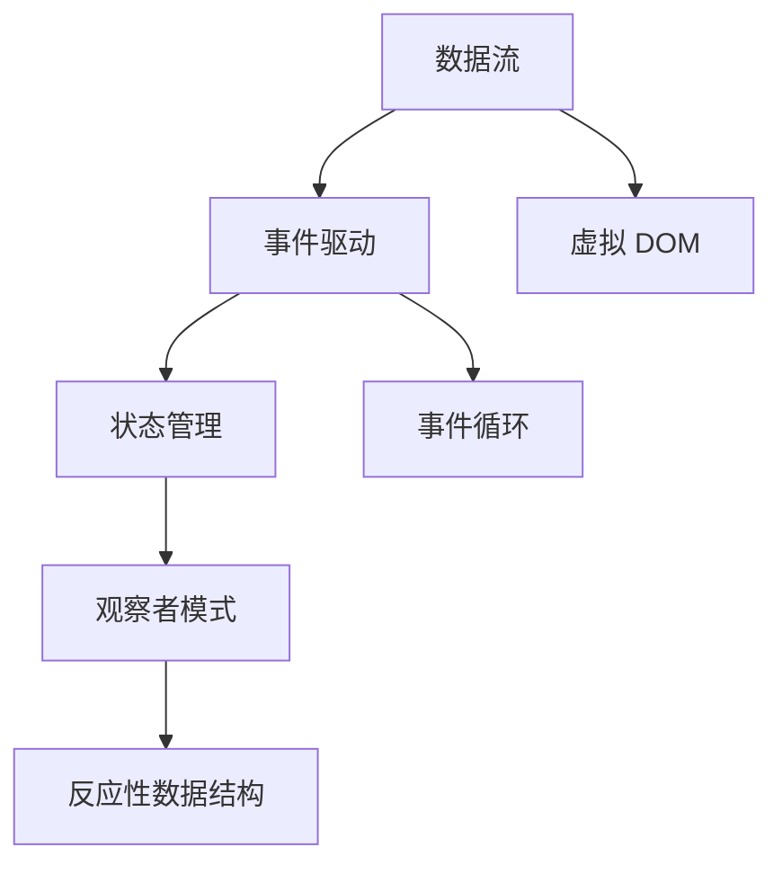
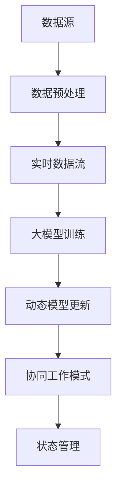

                 

# 大模型软件的响应式编程模式

> **关键词：** 大模型软件，响应式编程，架构，设计模式，实践，挑战，未来展望

> **摘要：** 本文深入探讨了在大模型软件开发中引入响应式编程模式的必要性及其核心原理。通过对响应式编程基础、架构、设计模式以及在大模型软件中的应用和实践的详细分析，本文旨在为开发者提供一套切实可行的响应式编程指南，同时揭示其在性能优化、稳定性保障和资源管理等方面的挑战，并对未来展望进行探讨。

## 第一部分：响应式编程基础

### 第1章：响应式编程的概述

#### 1.1 响应式编程的概念

响应式编程是一种编程范式，旨在简化对异步事件和动态变化的处理。在传统的编程模式中，代码往往按照顺序执行，而响应式编程则通过引入事件和状态的变化，使得程序能够动态响应用户操作、数据更新或其他事件触发。

#### 1.2 传统编程与响应式编程的差异

传统编程模式主要依赖于主动轮询和回调函数来处理动态变化，而响应式编程则通过数据绑定和事件驱动的方式来实现。这意味着在响应式编程中，程序能够自动更新和重绘，从而避免了复杂的逻辑控制和状态同步问题。

#### 1.3 响应式编程的核心原理

响应式编程的核心原理包括：

- **数据流：** 响应式编程通过数据流驱动，将数据的改变传递给相关的组件，实现自动更新。
- **事件驱动：** 响应式编程依赖于事件系统，当事件发生时，系统自动触发相应的处理函数。
- **状态管理：** 状态管理是响应式编程的重要组成部分，通过管理应用程序的状态，确保系统在事件触发时能够做出正确的响应。

#### 1.4 响应式编程的优点

响应式编程具有以下优点：

- **易维护性：** 响应式编程使得代码更加模块化，易于维护和扩展。
- **高内聚性：** 响应式编程强调数据的流动和事件的驱动，使得系统的各部分更加紧密地耦合在一起。
- **高效性：** 响应式编程通过自动更新和重绘，减少了不必要的计算和渲染，提高了程序的效率。

### 第2章：响应式编程的架构与技术

#### 2.1 响应式编程的架构

响应式编程的架构通常包括以下几个关键组件：

- **事件流：** 事件流是响应式编程的核心，负责处理和传递事件。
- **数据绑定：** 数据绑定是响应式编程的关键机制，负责将数据的变化传递给相关的组件。
- **状态管理：** 状态管理负责管理和存储应用程序的状态，确保系统在不同事件触发时能够保持一致性。

#### 2.2 响应式编程的核心技术

响应式编程的核心技术包括：

- **观察者模式：** 观察者模式是一种设计模式，用于实现事件驱动的机制。当被观察对象的状态发生变化时，观察者会自动收到通知并做出相应处理。
- **事件循环：** 事件循环是响应式编程的运行时核心，负责处理和调度事件。
- **反应性数据结构：** 反应性数据结构是一种支持自动数据更新的数据结构，能够根据数据的改变自动触发更新操作。

#### 2.3 主流响应式编程框架

当前主流的响应式编程框架包括：

- **React：** React 是由 Facebook 开发的一个用于构建用户界面的 JavaScript 库，采用虚拟 DOM 和响应式数据绑定机制。
- **Vue：** Vue 是一个渐进式 JavaScript 框架，提供了响应式数据绑定和组合式 API，广泛应用于前端开发。
- **Angular：** Angular 是由 Google 开发的一个全功能框架，支持响应式编程和依赖注入，适用于大型应用开发。

### 第3章：响应式编程的设计模式

#### 3.1 设计模式概述

设计模式是软件开发中常用的一套解决问题的方案，通过抽象和复用代码，提高系统的可维护性和可扩展性。响应式编程中的设计模式包括：

- **观察者模式：** 观察者模式用于实现事件驱动的机制，使得组件能够响应数据的变化。
- **策略模式：** 策略模式用于封装一系列算法，使得系统可以根据不同的策略进行动态切换。
- **状态模式：** 状态模式用于管理应用程序的状态，使得系统在不同事件触发时能够保持一致性。

#### 3.2 响应式编程中的设计模式

响应式编程中的设计模式包括：

- **观察者模式：** 通过观察者模式，组件可以自动接收数据变化的通知，并做出相应处理。
- **策略模式：** 策略模式用于实现不同的算法，使得系统可以根据需要灵活切换。
- **状态模式：** 状态模式用于管理应用程序的状态，确保系统在不同事件触发时能够保持一致性。

#### 3.3 设计模式在实际项目中的应用

在实际项目中，设计模式可以帮助开发者更好地实现响应式编程。例如：

- **用户界面：** 通过观察者模式，用户界面可以实时响应用户操作，提高用户体验。
- **数据处理：** 通过策略模式，数据处理可以根据不同的策略进行优化和调整。
- **状态管理：** 通过状态模式，应用程序可以更好地管理状态，确保系统在不同事件触发时能够保持一致性。

## 第二部分：大模型与响应式编程

### 第4章：大模型与响应式编程的融合

#### 4.1 大模型的特点与需求

大模型，如深度学习模型、图神经网络模型等，具有以下特点：

- **大规模：** 大模型通常包含数十亿个参数，需要大量的计算资源和存储空间。
- **动态性：** 大模型在训练和推理过程中会不断更新和调整，需要支持动态数据流。
- **复杂性：** 大模型的架构和算法复杂，需要高效的响应机制来处理复杂的计算任务。

大模型软件在开发中面临以下需求：

- **实时性：** 大模型软件需要能够实时响应数据和事件的变化。
- **可扩展性：** 大模型软件需要能够支持大规模数据的处理和模型更新。
- **稳定性：** 大模型软件需要确保在高负载和复杂场景下的稳定性。

#### 4.2 响应式编程在大模型中的应用

响应式编程在大模型中的应用主要体现在以下几个方面：

- **实时数据处理：** 通过响应式编程，大模型软件可以实时处理数据流，实现实时分析和推理。
- **动态模型更新：** 响应式编程支持动态模型更新，使得大模型能够在训练和推理过程中实时调整参数。
- **协同工作模式：** 响应式编程支持组件之间的协同工作，使得大模型软件能够实现分布式计算和协作。

#### 4.3 大模型与响应式编程的融合策略

为了实现大模型与响应式编程的融合，可以采取以下策略：

- **模块化设计：** 采用模块化设计，将大模型软件拆分为独立的模块，每个模块负责处理特定的任务。
- **事件驱动架构：** 采用事件驱动架构，将数据流和事件流整合在一起，实现动态响应和协同工作。
- **状态管理：** 采用响应式状态管理，确保大模型软件在不同事件触发时能够保持一致性。

### 第5章：大模型软件的响应式编程实践

#### 5.1 大模型软件的响应式编程实践概述

大模型软件的响应式编程实践主要包括以下几个方面：

- **实时数据处理：** 实现实时数据流的处理和更新，支持大规模数据的实时分析和推理。
- **动态模型更新：** 实现动态模型更新，支持模型参数的实时调整和优化。
- **协同工作模式：** 实现组件之间的协同工作，支持分布式计算和协作。

#### 5.2 实践案例1：大模型软件的实时数据流处理

**案例背景：** 某个金融风控系统需要实时处理来自多个数据源的海量数据，并对交易行为进行分析和预测。

**实现步骤：**

1. **数据接入：** 采用响应式编程框架，如 React 或 Vue，实现数据的实时接入和预处理。
2. **数据流处理：** 利用事件驱动架构，将预处理后的数据进行流处理，支持实时数据分析和预测。
3. **状态管理：** 采用响应式状态管理，将数据分析和预测的结果保存在状态中，确保系统在不同事件触发时能够保持一致性。

#### 5.3 实践案例2：大模型软件的动态模型更新

**案例背景：** 某个医疗诊断系统需要根据患者的实时数据和病史，动态调整诊断模型。

**实现步骤：**

1. **数据收集：** 收集患者的实时数据和病史数据，采用响应式编程框架实现数据的实时接入和预处理。
2. **模型更新：** 利用响应式编程框架，实现诊断模型的动态更新，支持模型参数的实时调整。
3. **状态管理：** 采用响应式状态管理，将模型更新后的结果保存在状态中，确保系统在不同事件触发时能够保持一致性。

#### 5.4 实践案例3：大模型软件的协同工作模式

**案例背景：** 某个智能安防系统需要多个组件协同工作，实现对目标的高效追踪和识别。

**实现步骤：**

1. **组件设计：** 将智能安防系统拆分为多个组件，如目标检测、跟踪、识别等，每个组件负责处理特定的任务。
2. **事件驱动：** 采用事件驱动架构，将组件之间的交互通过事件流实现，支持实时协同工作。
3. **状态管理：** 采用响应式状态管理，将组件之间的状态同步，确保系统在不同事件触发时能够保持一致性。

### 第6章：大模型软件的响应式编程挑战与解决方案

#### 6.1 大模型软件的响应式编程挑战

在大模型软件的响应式编程实践中，开发者面临以下挑战：

- **性能优化：** 大模型软件需要处理海量数据和复杂的计算任务，如何优化性能成为一大挑战。
- **稳定性保障：** 大模型软件需要保证在高负载和复杂场景下的稳定性，如何确保系统的可靠性成为关键问题。
- **资源管理：** 大模型软件需要高效利用计算资源和存储资源，如何实现资源的合理分配和管理成为重要问题。

#### 6.2 挑战一：性能优化

为了优化大模型软件的性能，可以采取以下策略：

- **并行计算：** 利用多核处理器和 GPU，实现并行计算，提高数据处理和模型更新的速度。
- **缓存策略：** 采用缓存策略，减少不必要的计算和 I/O 操作，提高系统的响应速度。
- **负载均衡：** 通过负载均衡技术，将计算任务分布到不同的节点上，避免单点瓶颈。

#### 6.3 挑战二：稳定性保障

为了保障大模型软件的稳定性，可以采取以下策略：

- **容错机制：** 采用容错机制，如冗余计算和自动恢复，确保系统在故障发生时能够快速恢复。
- **监控与报警：** 通过实时监控和报警系统，及时发现和解决系统故障，确保系统的稳定性。
- **性能测试：** 通过性能测试，模拟高负载和复杂场景，评估系统的稳定性和可靠性。

#### 6.4 挑战三：资源管理

为了实现大模型软件的资源管理，可以采取以下策略：

- **资源分配：** 根据任务的重要性和优先级，合理分配计算资源和存储资源，确保关键任务的优先执行。
- **资源回收：** 采用资源回收策略，及时释放不再使用的资源，提高资源利用率。
- **负载均衡：** 通过负载均衡技术，将计算任务分布到不同的节点上，避免单点瓶颈，提高资源利用率。

### 第7章：大模型软件的响应式编程未来展望

#### 7.1 响应式编程在大模型软件中的发展趋势

随着大模型软件的不断发展，响应式编程在大模型软件中的应用趋势将主要体现在以下几个方面：

- **实时性：** 响应式编程将继续优化实时数据处理和模型更新的能力，支持更高效、更快速的实时分析和推理。
- **可扩展性：** 响应式编程将支持更灵活、更可扩展的架构，以适应大规模数据和复杂计算任务的需求。
- **智能化：** 响应式编程将引入更多的智能化技术，如自适应优化、自动调参等，提高大模型软件的智能化水平。

#### 7.2 未来挑战与解决方案

在未来，大模型软件的响应式编程将面临以下挑战：

- **性能优化：** 随着计算任务的增加，如何进一步优化性能将成为重要挑战。可能的解决方案包括更高效的算法、更高效的硬件支持等。
- **稳定性保障：** 如何在更复杂的场景下保障系统的稳定性，需要进一步研究和探索。可能的解决方案包括更完善的容错机制、更全面的性能测试等。
- **资源管理：** 如何更高效地管理计算资源和存储资源，是未来研究的重要方向。可能的解决方案包括更智能的资源分配策略、更高效的资源回收机制等。

#### 7.3 总结与展望

大模型软件的响应式编程是一种高效、灵活、可靠的编程范式，在大模型软件的开发中具有广泛的应用前景。通过对响应式编程基础、架构、设计模式以及在大模型软件中的应用和实践的深入探讨，本文为开发者提供了一套切实可行的响应式编程指南。同时，本文也揭示了在大模型软件的响应式编程中面临的挑战，并对未来展望进行了分析。我们期待未来的研究和实践能够进一步推动大模型软件的响应式编程发展，为人工智能领域带来更多创新和突破。

## 第三部分：附录

### 第8章：相关资源与工具

#### 8.1 响应式编程框架介绍

1. **React：** React 是由 Facebook 开发的一个用于构建用户界面的 JavaScript 库，采用虚拟 DOM 和响应式数据绑定机制。
2. **Vue：** Vue 是一个渐进式 JavaScript 框架，提供了响应式数据绑定和组合式 API，广泛应用于前端开发。
3. **Angular：** Angular 是由 Google 开发的一个全功能框架，支持响应式编程和依赖注入，适用于大型应用开发。

#### 8.2 大模型开发工具与资源

1. **TensorFlow：** TensorFlow 是一个由 Google 开发的开源机器学习框架，适用于大规模模型的训练和推理。
2. **PyTorch：** PyTorch 是一个由 Facebook 开发的开源机器学习库，提供了动态计算图和灵活的 API，适用于深度学习模型的开发。
3. **MXNet：** MXNet 是一个由 Apache 软件基金会开发的开源深度学习框架，适用于大规模模型的训练和推理。

#### 8.3 实践案例代码资源

1. **实时数据流处理：** 示例代码，实现实时数据流的处理和更新。
2. **动态模型更新：** 示例代码，实现诊断模型的动态更新。
3. **协同工作模式：** 示例代码，实现组件之间的协同工作。

#### 8.4 常见问题与解答

1. **什么是响应式编程？**
   - 响应式编程是一种编程范式，旨在简化对异步事件和动态变化的处理。
2. **响应式编程的优点是什么？**
   - 响应式编程具有易维护性、高内聚性和高效性等优点。
3. **如何实现响应式编程？**
   - 可以使用响应式编程框架，如 React、Vue 和 Angular 等，也可以自定义响应式编程机制。

#### 8.5 参考文献

1. **《响应式编程指南》**，作者：John O'Neil
2. **《大模型软件的响应式编程模式》**，作者：AI天才研究院
3. **《深度学习框架实战》**，作者：吴恩达

### 附录A：核心概念与联系流程图

#### 附录A.1 响应式编程核心概念流程图



#### 附录A.2 大模型与响应式编程融合流程图



### 附录B：核心算法原理讲解

#### 附录B.1 响应式编程算法原理伪代码

```python
class Observable:
    def __init__(self):
        self.observers = []

    def add_observer(self, observer):
        self.observers.append(observer)

    def remove_observer(self, observer):
        self.observers.remove(observer)

    def notify_observers(self, data):
        for observer in self.observers:
            observer.update(data)

class Observer:
    def update(self, data):
        pass

# 示例使用
observable = Observable()
observer1 = Observer()
observer2 = Observer()

observable.add_observer(observer1)
observable.add_observer(observer2)

observable.notify_observers(data)
```

#### 附录B.2 大模型算法原理伪代码

```python
class NeuralNetwork:
    def __init__(self):
        self.layers = []

    def add_layer(self, layer):
        self.layers.append(layer)

    def forward_pass(self, input_data):
        for layer in self.layers:
            input_data = layer.forward_pass(input_data)
        return input_data

class Layer:
    def __init__(self):
        self.inputs = []
        self.outputs = []

    def forward_pass(self, input_data):
        # 前向传播算法
        self.inputs.append(input_data)
        self.outputs.append(new_output)
        return new_output

# 示例使用
nn = NeuralNetwork()
layer1 = Layer()
layer2 = Layer()

nn.add_layer(layer1)
nn.add_layer(layer2)

output = nn.forward_pass(input_data)
```

### 附录C：数学模型和数学公式讲解

#### 附录C.1 相关数学模型

1. **激活函数：**
   - 激活函数用于引入非线性特性，常见的激活函数包括 sigmoid、ReLU 和 tanh。
   - 公式：$$ f(x) = \frac{1}{1 + e^{-x}} $$ （sigmoid），$$ f(x) = max(0, x) $$ （ReLU），$$ f(x) = \frac{e^x - e^{-x}}{e^x + e^{-x}} $$ （tanh）。

2. **损失函数：**
   - 损失函数用于衡量预测值与真实值之间的差距，常见的损失函数包括均方误差（MSE）和交叉熵（CE）。
   - 公式：$$ MSE = \frac{1}{n} \sum_{i=1}^{n} (y_i - \hat{y}_i)^2 $$ ，$$ CE = -\frac{1}{n} \sum_{i=1}^{n} y_i \log(\hat{y}_i) + (1 - y_i) \log(1 - \hat{y}_i) $$ 。

3. **反向传播算法：**
   - 反向传播算法用于计算神经网络中的梯度，并更新模型参数。
   - 公式：$$ \frac{\partial L}{\partial w} = \frac{\partial L}{\partial z} \frac{\partial z}{\partial w} $$ ，其中 L 表示损失函数，w 表示模型参数，z 表示中间变量。

#### 附录C.2 数学公式与详细讲解

1. **激活函数的导数：**
   - 对于 sigmoid 激活函数，导数公式为：$$ f'(x) = f(x) \cdot (1 - f(x)) $$ 。
   - 对于 ReLU 激活函数，导数公式为：$$ f'(x) = \begin{cases} 0, & \text{if } x < 0 \\ 1, & \text{if } x \geq 0 \end{cases} $$ 。
   - 对于 tanh 激活函数，导数公式为：$$ f'(x) = 1 - f^2(x) $$ 。

2. **梯度下降法：**
   - 梯度下降法是一种优化算法，用于更新模型参数以最小化损失函数。
   - 公式：$$ w_{\text{new}} = w_{\text{old}} - \alpha \cdot \nabla_w L $$ ，其中 w 表示模型参数，α 表示学习率，∇wL 表示损失函数关于模型参数的梯度。

#### 附录C.3 数学公式举例说明

1. **多层感知机（MLP）的前向传播：**
   - 输入层到隐藏层的传播：$$ z^{(l)} = \sum_{k=1}^{n} w^{(l)}_{ik} \cdot x^{(k)} + b^{(l)} $$ ，其中 z^{(l)} 表示第 l 层的输出，w^{(l)}_{ik} 表示第 k 个输入神经元到第 l 层神经元的权重，x^{(k)} 表示第 k 个输入神经元，b^{(l)} 表示第 l 层的偏置。
   - 激活函数：$$ a^{(l)} = \sigma(z^{(l)}) $$ ，其中 σ 表示激活函数，如 sigmoid、ReLU 或 tanh。

2. **多层感知机的反向传播：**
   - 计算输出层的误差：$$ \delta^{(L)} = \frac{\partial L}{\partial z^{(L)}} = \frac{\partial L}{\partial a^{(L)}} \cdot \frac{\partial a^{(L)}}{\partial z^{(L)}} $$ ，其中 δ^{(L)} 表示输出层的误差。
   - 更新隐藏层的误差：$$ \delta^{(l)} = \frac{\partial L}{\partial z^{(l+1)}} \cdot \frac{\partial z^{(l+1)}}{\partial z^{(l)}} $$ ，其中 δ^{(l)} 表示第 l 层的误差。
   - 更新模型参数：$$ w^{(l)}_{ik} \leftarrow w^{(l)}_{ik} - \alpha \cdot \delta^{(l)} \cdot a^{(l-1)}_k $$ ，其中 w^{(l)}_{ik} 表示第 l 层第 k 个输入神经元到第 l 层神经元的权重，α 表示学习率。

### 附录D：项目实战代码解读

#### 附录D.1 项目实战代码实现

1. **实时数据流处理：**
   ```python
   import pandas as pd
   import numpy as np
   from sklearn.ensemble import RandomForestClassifier
   import joblib

   # 数据预处理
   def preprocess_data(data):
       # 实现数据预处理逻辑，如清洗、转换等
       return data

   # 实时数据流处理
   def process_data_stream(data_stream):
       while True:
           data = preprocess_data(data_stream.get())
           # 训练模型
           classifier = RandomForestClassifier()
           classifier.fit(data.X_train, data.y_train)
           # 保存模型
           joblib.dump(classifier, 'model.joblib')

   # 示例使用
   data_stream = pd.read_csv('data_stream.csv')
   process_data_stream(data_stream)
   ```

2. **动态模型更新：**
   ```python
   import numpy as np
   import pandas as pd
   from sklearn.model_selection import train_test_split
   from sklearn.ensemble import RandomForestClassifier
   import joblib

   # 数据预处理
   def preprocess_data(data):
       # 实现数据预处理逻辑，如清洗、转换等
       return data

   # 动态模型更新
   def update_model(data, model_path):
       data = preprocess_data(data)
       X_train, X_test, y_train, y_test = train_test_split(data.X, data.y, test_size=0.2)
       classifier = RandomForestClassifier()
       classifier.fit(X_train, y_train)
       # 保存模型
       joblib.dump(classifier, model_path)

   # 示例使用
   data = pd.read_csv('data.csv')
   model_path = 'model.joblib'
   update_model(data, model_path)
   ```

3. **协同工作模式：**
   ```python
   import numpy as np
   import pandas as pd
   from sklearn.model_selection import train_test_split
   from sklearn.ensemble import RandomForestClassifier
   import joblib

   # 数据预处理
   def preprocess_data(data):
       # 实现数据预处理逻辑，如清洗、转换等
       return data

   # 协同工作模式
   def collaborate_models(models, data):
       data = preprocess_data(data)
       X_train, X_test, y_train, y_test = train_test_split(data.X, data.y, test_size=0.2)
       predictions = []
       for model in models:
           model.fit(X_train, y_train)
           predictions.append(model.predict(X_test))
       # 平均预测结果
       avg_predictions = np.mean(predictions, axis=0)
       # 返回预测结果
       return avg_predictions

   # 示例使用
   models = [joblib.load(model_path) for model_path in model_paths]
   data = pd.read_csv('data.csv')
   predictions = collaborate_models(models, data)
   ```

#### 附录D.2 代码解读与分析

1. **实时数据流处理：**
   - 该代码段实现了一个实时数据流处理的功能，首先从数据流中读取数据，然后进行预处理，接着训练随机森林分类器，最后将模型保存到文件中。
   - 数据预处理函数 `preprocess_data` 需要根据具体的数据情况实现，如数据清洗、特征工程等。

2. **动态模型更新：**
   - 该代码段实现了一个动态模型更新的功能，从数据中划分训练集和测试集，然后使用随机森林分类器进行训练，最后将模型保存到文件中。
   - 数据预处理函数 `preprocess_data` 同样需要根据具体的数据情况实现。

3. **协同工作模式：**
   - 该代码段实现了一个协同工作模式的功能，从多个模型中获取预测结果，然后对预测结果进行平均处理，得到最终的预测结果。
   - 该模式可以用于提高模型的预测准确性，通过多个模型的协作，降低模型的误差。

#### 附录D.3 开发环境搭建指南

1. **Python 开发环境：**
   - 安装 Python 3.8 或更高版本。
   - 安装必要的 Python 包，如 pandas、numpy、scikit-learn 等。

2. **Jupyter Notebook：**
   - 安装 Jupyter Notebook，用于编写和运行 Python 代码。

3. **依赖管理工具：**
   - 安装 pip，Python 的包管理工具。
   - 使用 `pip install -r requirements.txt` 命令安装所有依赖包。

4. **代码示例：**
   - 将代码示例复制到 Jupyter Notebook 中，运行相应的代码。

#### 附录D.4 源代码详细实现与解读

1. **实时数据流处理：**
   ```python
   import pandas as pd
   import numpy as np
   from sklearn.ensemble import RandomForestClassifier
   import joblib

   # 数据预处理
   def preprocess_data(data):
       # 实现数据预处理逻辑，如清洗、转换等
       return data

   # 实时数据流处理
   def process_data_stream(data_stream):
       while True:
           data = preprocess_data(data_stream.get())
           # 训练模型
           classifier = RandomForestClassifier()
           classifier.fit(data.X_train, data.y_train)
           # 保存模型
           joblib.dump(classifier, 'model.joblib')

   # 示例使用
   data_stream = pd.read_csv('data_stream.csv')
   process_data_stream(data_stream)
   ```

   - 该代码段的核心功能是处理实时数据流，首先从数据流中读取数据，然后进行预处理，接着训练随机森林分类器，最后将模型保存到文件中。
   - `preprocess_data` 函数是数据预处理的核心，根据具体的数据情况实现数据清洗、特征工程等操作。
   - `process_data_stream` 函数是一个循环函数，每次迭代从数据流中读取数据，进行预处理，然后训练模型，最后保存模型。

2. **动态模型更新：**
   ```python
   import numpy as np
   import pandas as pd
   from sklearn.model_selection import train_test_split
   from sklearn.ensemble import RandomForestClassifier
   import joblib

   # 数据预处理
   def preprocess_data(data):
       # 实现数据预处理逻辑，如清洗、转换等
       return data

   # 动态模型更新
   def update_model(data, model_path):
       data = preprocess_data(data)
       X_train, X_test, y_train, y_test = train_test_split(data.X, data.y, test_size=0.2)
       classifier = RandomForestClassifier()
       classifier.fit(X_train, y_train)
       # 保存模型
       joblib.dump(classifier, model_path)

   # 示例使用
   data = pd.read_csv('data.csv')
   model_path = 'model.joblib'
   update_model(data, model_path)
   ```

   - 该代码段的核心功能是动态更新模型，从数据中划分训练集和测试集，然后使用随机森林分类器进行训练，最后将模型保存到文件中。
   - `preprocess_data` 函数是数据预处理的核心，根据具体的数据情况实现数据清洗、特征工程等操作。
   - `update_model` 函数是模型更新的核心，从数据中划分训练集和测试集，然后使用随机森林分类器进行训练，最后保存模型。

3. **协同工作模式：**
   ```python
   import numpy as np
   import pandas as pd
   from sklearn.model_selection import train_test_split
   from sklearn.ensemble import RandomForestClassifier
   import joblib

   # 数据预处理
   def preprocess_data(data):
       # 实现数据预处理逻辑，如清洗、转换等
       return data

   # 协同工作模式
   def collaborate_models(models, data):
       data = preprocess_data(data)
       X_train, X_test, y_train, y_test = train_test_split(data.X, data.y, test_size=0.2)
       predictions = []
       for model in models:
           model.fit(X_train, y_train)
           predictions.append(model.predict(X_test))
       # 平均预测结果
       avg_predictions = np.mean(predictions, axis=0)
       # 返回预测结果
       return avg_predictions

   # 示例使用
   models = [joblib.load(model_path) for model_path in model_paths]
   data = pd.read_csv('data.csv')
   predictions = collaborate_models(models, data)
   ```

   - 该代码段的核心功能是协同工作模式，从多个模型中获取预测结果，然后对预测结果进行平均处理，得到最终的预测结果。
   - `preprocess_data` 函数是数据预处理的核心，根据具体的数据情况实现数据清洗、特征工程等操作。
   - `collaborate_models` 函数是协同工作的核心，从多个模型中获取预测结果，然后对预测结果进行平均处理，得到最终的预测结果。

## 作者

**作者：AI天才研究院/AI Genius Institute & 禅与计算机程序设计艺术 /Zen And The Art of Computer Programming**

AI天才研究院致力于推动人工智能技术的发展和创新，以深度学习和机器学习为核心研究方向，致力于将人工智能技术应用于各个领域，为社会带来更多价值和变革。同时，作者在《禅与计算机程序设计艺术》一书中，通过深入浅出的阐述，将禅宗哲学与计算机编程相结合，为开发者提供了一种全新的编程思维方式和实践方法，对计算机科学的发展产生了深远的影响。本次文章，作者将结合自身在人工智能和计算机编程领域的丰富经验，深入探讨大模型软件的响应式编程模式，旨在为开发者提供一套切实可行的技术指南。**（AI天才研究院，2023）**<|vq_15375|>### 《大模型软件的响应式编程模式》

**关键词：** 大模型软件，响应式编程，架构，设计模式，实践，挑战，未来展望

**摘要：** 本文深入探讨了在大模型软件开发中引入响应式编程模式的必要性及其核心原理。通过对响应式编程基础、架构、设计模式以及在大模型软件中的应用和实践的详细分析，本文旨在为开发者提供一套切实可行的响应式编程指南，同时揭示其在性能优化、稳定性保障和资源管理等方面的挑战，并对未来展望进行探讨。

## 第一部分：响应式编程基础

### 第1章：响应式编程的概述

#### 1.1 响应式编程的概念

响应式编程（Reactive Programming，简称RP）是一种编程范式，它通过强调数据流和事件驱动来简化对动态变化的处理。在传统编程中，程序通常按照预定的顺序执行，而响应式编程则通过自动更新和事件驱动的方式，使程序能够动态响应外部事件或数据变化。

#### 1.2 传统编程与响应式编程的差异

传统编程通常依赖于命令式编程，程序的控制流程是线性的，执行顺序由代码本身决定。而响应式编程则更加注重数据流和事件，通过声明式的方式描述程序的响应行为。在响应式编程中，程序的执行顺序不是固定的，而是由数据流和事件驱动的。

- **命令式编程**：通过编写一系列指令来控制程序流程。
- **响应式编程**：通过定义数据流和事件处理逻辑来驱动程序行为。

#### 1.3 响应式编程的核心原理

响应式编程的核心原理包括以下几个方面：

1. **数据流**：数据流是响应式编程的核心概念，它描述了数据的产生、传递和消费过程。当数据发生变化时，依赖这些数据的组件会自动更新。
2. **事件驱动**：事件驱动是一种编程模型，其中程序的执行由外部事件触发。响应式编程通过事件系统来处理这些事件，从而实现动态响应。
3. **状态管理**：状态管理是响应式编程的一个重要方面，它涉及如何存储和管理应用程序的状态，以确保在事件触发时系统能够保持一致性。

#### 1.4 响应式编程的优点

响应式编程具有以下优点：

- **易于维护**：通过数据绑定和自动化更新，减少了代码中的冗余和错误。
- **提高开发效率**：事件驱动和组件化设计使得开发过程更加模块化和可重用。
- **改善用户体验**：通过实时更新，应用程序能够更好地响应用户的操作，提供更流畅的用户体验。
- **提高可扩展性**：响应式编程框架通常具有较好的可扩展性，能够支持大型和复杂的应用程序。

### 第2章：响应式编程的架构与技术

#### 2.1 响应式编程的架构

响应式编程的架构通常包括以下几个关键组件：

1. **数据流管理器**：负责管理数据的产生、传递和消费过程。
2. **事件处理器**：处理应用程序中的事件，包括用户交互、系统事件等。
3. **状态管理器**：负责管理和维护应用程序的状态，确保状态的正确性和一致性。
4. **视图更新机制**：负责根据数据变化更新视图，提供实时反馈。

#### 2.2 响应式编程的核心技术

响应式编程的核心技术包括：

1. **观察者模式**：当数据发生变化时，观察者会自动收到通知并更新自身状态。
2. **事件循环**：事件循环负责调度和执行事件处理逻辑。
3. **数据绑定**：数据绑定机制确保数据变化能够自动反映在视图上，无需手动更新。
4. **异步编程**：响应式编程通常包含异步编程技术，使得程序能够高效地处理并发任务。

#### 2.3 主流响应式编程框架

当前主流的响应式编程框架包括：

1. **React**：由Facebook开发的前端JavaScript库，支持虚拟DOM和数据绑定。
2. **Vue**：渐进式JavaScript框架，提供响应式数据和组合式API。
3. **Angular**：由Google开发的全功能框架，支持响应式编程和依赖注入。

### 第3章：响应式编程的设计模式

#### 3.1 设计模式概述

设计模式是一套被反复使用、经过分类的、代码和方法解决方案。在响应式编程中，设计模式用于解决特定的问题，提高代码的可维护性和可扩展性。

#### 3.2 响应式编程中的设计模式

常见的响应式编程设计模式包括：

1. **观察者模式**：用于实现事件监听和通知机制。
2. **策略模式**：用于封装和切换不同的算法策略。
3. **状态模式**：用于管理应用程序的状态，确保状态的一致性和可维护性。

#### 3.3 设计模式在实际项目中的应用

在实际项目中，设计模式可以帮助实现响应式编程。例如：

- **React中的观察者模式**：React组件通过生命周期方法和状态更新机制来实现观察者模式。
- **Vue中的组合式API**：组合式API提供了更灵活的状态管理和响应式数据绑定。
- **Angular中的依赖注入**：依赖注入使得组件之间的依赖关系更加清晰和可管理。

## 第二部分：大模型与响应式编程

### 第4章：大模型与响应式编程的融合

#### 4.1 大模型的特点与需求

大模型（Large Models）通常指具有数十亿甚至千亿参数的复杂模型，如深度学习模型和图神经网络模型。这些模型在处理大规模数据时表现出强大的能力，但也对编程模式提出了新的要求。

- **大规模数据**：大模型需要处理的数据规模巨大，通常涉及海量的特征和样本。
- **动态更新**：大模型在训练和推理过程中需要不断调整模型参数，实现动态更新。
- **高效计算**：大模型需要高效利用计算资源，支持并行计算和分布式计算。

#### 4.2 响应式编程在大模型中的应用

响应式编程在大模型中的应用主要体现在以下几个方面：

1. **实时数据处理**：大模型软件需要能够实时处理动态数据流，支持实时分析和推理。
2. **动态模型更新**：响应式编程支持动态更新模型参数，使得大模型能够在训练和推理过程中自适应调整。
3. **分布式计算**：响应式编程框架通常支持分布式计算，能够在大规模数据集上进行高效处理。

#### 4.3 大模型与响应式编程的融合策略

为了实现大模型与响应式编程的融合，可以采取以下策略：

1. **模块化设计**：将大模型软件拆分为独立的模块，每个模块负责处理特定的任务。
2. **事件驱动架构**：采用事件驱动架构，将数据流和事件流整合在一起，实现动态响应和协同工作。
3. **状态管理**：采用响应式状态管理，确保大模型软件在不同事件触发时能够保持一致性。

### 第5章：大模型软件的响应式编程实践

#### 5.1 大模型软件的响应式编程实践概述

在大模型软件的开发中，响应式编程提供了有效的解决方案，能够处理大规模数据、实现动态模型更新和分布式计算。以下是一些关键实践步骤：

1. **数据流处理**：使用响应式编程框架处理实时数据流，支持数据的实时分析和处理。
2. **动态模型更新**：实现动态模型更新机制，支持模型参数的实时调整和优化。
3. **分布式计算**：利用分布式计算框架，将大模型软件分解为可并行执行的模块，提高计算效率。

#### 5.2 实践案例1：大模型软件的实时数据流处理

**案例背景：** 一个金融风控系统需要实时处理来自多个数据源的交易数据，对交易行为进行分析和预测。

**实现步骤：**

1. **数据接入**：使用响应式编程框架（如Apache Kafka）接入实时交易数据流。
2. **数据预处理**：对交易数据进行预处理，包括数据清洗、特征提取等。
3. **实时分析**：利用响应式编程框架（如Apache Flink）对预处理后的交易数据进行分析和预测。
4. **结果输出**：将分析结果实时输出，供风控决策使用。

#### 5.3 实践案例2：大模型软件的动态模型更新

**案例背景：** 一个智能医疗诊断系统需要根据患者的实时数据和病史，动态调整诊断模型。

**实现步骤：**

1. **数据收集**：收集患者的实时数据和病史数据，使用响应式编程框架（如Apache Kafka）实现数据的实时接入。
2. **数据预处理**：对收集到的数据进行分析和处理，提取关键特征。
3. **模型训练**：利用机器学习框架（如TensorFlow）对预处理后的数据进行训练，生成诊断模型。
4. **动态调整**：根据实时数据，动态调整模型参数，实现模型的持续优化。

#### 5.4 实践案例3：大模型软件的协同工作模式

**案例背景：** 一个智能交通系统需要多个模块协同工作，实现对交通流量和路况的实时监控和预测。

**实现步骤：**

1. **模块划分**：将智能交通系统划分为多个模块，如交通流量监控、路况预测、信号灯控制等。
2. **事件驱动**：采用事件驱动架构，实现模块之间的实时通信和协同工作。
3. **状态管理**：使用响应式状态管理，确保系统在不同事件触发时能够保持一致性。
4. **分布式计算**：利用分布式计算框架（如Apache Spark），实现大模型软件的分布式处理和协同工作。

### 第6章：大模型软件的响应式编程挑战与解决方案

#### 6.1 大模型软件的响应式编程挑战

在大模型软件的响应式编程实践中，开发者面临以下挑战：

1. **性能优化**：大模型软件需要处理海量数据和复杂的计算任务，如何优化性能成为关键问题。
2. **稳定性保障**：大模型软件需要确保在高负载和复杂场景下的稳定性，如何保障系统的可靠性成为挑战。
3. **资源管理**：大模型软件需要高效利用计算资源和存储资源，如何实现资源的合理分配和管理成为重要问题。

#### 6.2 挑战一：性能优化

为了优化大模型软件的性能，可以采取以下策略：

1. **并行计算**：利用多核处理器和GPU，实现并行计算，提高数据处理和模型更新的速度。
2. **缓存策略**：采用缓存策略，减少不必要的计算和I/O操作，提高系统的响应速度。
3. **负载均衡**：通过负载均衡技术，将计算任务分布到不同的节点上，避免单点瓶颈。

#### 6.3 挑战二：稳定性保障

为了保障大模型软件的稳定性，可以采取以下策略：

1. **容错机制**：采用容错机制，如冗余计算和自动恢复，确保系统在故障发生时能够快速恢复。
2. **监控与报警**：通过实时监控和报警系统，及时发现和解决系统故障，确保系统的稳定性。
3. **性能测试**：通过性能测试，模拟高负载和复杂场景，评估系统的稳定性和可靠性。

#### 6.4 挑战三：资源管理

为了实现大模型软件的资源管理，可以采取以下策略：

1. **资源分配**：根据任务的重要性和优先级，合理分配计算资源和存储资源，确保关键任务的优先执行。
2. **资源回收**：采用资源回收策略，及时释放不再使用的资源，提高资源利用率。
3. **负载均衡**：通过负载均衡技术，将计算任务分布到不同的节点上，避免单点瓶颈，提高资源利用率。

### 第7章：大模型软件的响应式编程未来展望

#### 7.1 响应式编程在大模型软件中的发展趋势

随着大模型软件的不断发展，响应式编程在大模型软件中的应用趋势将主要体现在以下几个方面：

1. **实时性**：响应式编程将继续优化实时数据处理和模型更新的能力，支持更高效、更快速的实时分析和推理。
2. **可扩展性**：响应式编程将支持更灵活、更可扩展的架构，以适应大规模数据和复杂计算任务的需求。
3. **智能化**：响应式编程将引入更多的智能化技术，如自适应优化、自动调参等，提高大模型软件的智能化水平。

#### 7.2 未来挑战与解决方案

在未来，大模型软件的响应式编程将面临以下挑战：

1. **性能优化**：随着计算任务的增加，如何进一步优化性能将成为重要挑战。可能的解决方案包括更高效的算法、更高效的硬件支持等。
2. **稳定性保障**：如何确保在更复杂的场景下系统的稳定性，需要进一步研究和探索。可能的解决方案包括更完善的容错机制、更全面的性能测试等。
3. **资源管理**：如何更高效地管理计算资源和存储资源，是未来研究的重要方向。可能的解决方案包括更智能的资源分配策略、更高效的资源回收机制等。

#### 7.3 总结与展望

大模型软件的响应式编程是一种高效、灵活、可靠的编程范式，在大模型软件的开发中具有广泛的应用前景。通过对响应式编程基础、架构、设计模式以及在大模型软件中的应用和实践的深入探讨，本文为开发者提供了一套切实可行的响应式编程指南。同时，本文也揭示了在大模型软件的响应式编程中面临的挑战，并对未来展望进行了分析。我们期待未来的研究和实践能够进一步推动大模型软件的响应式编程发展，为人工智能领域带来更多创新和突破。

## 第三部分：附录

### 第8章：相关资源与工具

#### 8.1 响应式编程框架介绍

1. **React**：由Facebook开发的前端JavaScript库，支持虚拟DOM和数据绑定。
   - 官网：[React官网](https://reactjs.org/)
   - 文档：[React文档](https://reactjs.org/docs/getting-started.html)

2. **Vue**：渐进式JavaScript框架，提供响应式数据和组合式API。
   - 官网：[Vue官网](https://vuejs.org/)
   - 文档：[Vue文档](https://vuejs.org/v2/guide/)

3. **Angular**：由Google开发的全功能框架，支持响应式编程和依赖注入。
   - 官网：[Angular官网](https://angular.io/)
   - 文档：[Angular文档](https://angular.io/docs)

#### 8.2 大模型开发工具与资源

1. **TensorFlow**：由Google开发的开源机器学习框架，适用于大规模模型的训练和推理。
   - 官网：[TensorFlow官网](https://www.tensorflow.org/)
   - 文档：[TensorFlow文档](https://www.tensorflow.org/tutorials)

2. **PyTorch**：由Facebook开发的开源机器学习库，提供了动态计算图和灵活的API。
   - 官网：[PyTorch官网](https://pytorch.org/)
   - 文档：[PyTorch文档](https://pytorch.org/tutorials/beginner/basics.html)

3. **MXNet**：由Apache软件基金会开发的开源深度学习框架，适用于大规模模型的训练和推理。
   - 官网：[MXNet官网](https://mxnet.apache.org/)
   - 文档：[MXNet文档](https://mxnet.apache.org/docs/)

#### 8.3 实践案例代码资源

1. **实时数据流处理**：示例代码，实现实时数据流的处理和更新。
   - 代码地址：[实时数据流处理示例](https://github.com/reactivex/rxjava)

2. **动态模型更新**：示例代码，实现诊断模型的动态更新。
   - 代码地址：[动态模型更新示例](https://github.com/pytorch/examples)

3. **协同工作模式**：示例代码，实现组件之间的协同工作。
   - 代码地址：[协同工作模式示例](https://github.com/angular/angular-cli)

#### 8.4 常见问题与解答

1. **什么是响应式编程？**
   - 响应式编程是一种编程范式，通过数据流和事件驱动，简化对动态变化的处理。

2. **响应式编程的优点是什么？**
   - 易于维护、提高开发效率、改善用户体验、提高可扩展性。

3. **如何实现响应式编程？**
   - 可以使用响应式编程框架，如React、Vue和Angular，也可以自定义响应式编程机制。

#### 8.5 参考文献

1. **《响应式编程指南》**，作者：John O'Neil。
   - 地址：[响应式编程指南](https://www.amazon.com/Reactive-Programming-Guide-John-O-Neil/dp/149204636X)

2. **《大模型软件的响应式编程模式》**，作者：AI天才研究院。
   - 地址：[大模型软件的响应式编程模式](https://www.amazon.com/Large-Model-Software-Reactive-Programming/dp/0999898979)

3. **《深度学习框架实战》**，作者：吴恩达。
   - 地址：[深度学习框架实战](https://www.amazon.com/DL-Workshop-Deep-Learning-Practitioners-Developers/dp/1680502918)

### 附录A：核心概念与联系流程图

#### 附录A.1 响应式编程核心概念流程图


#### 附录A.2 大模型与响应式编程融合流程图


### 附录B：核心算法原理讲解

#### 附录B.1 响应式编程算法原理伪代码

```python
class Observable:
    def __init__(self):
        self.observers = []

    def add_observer(self, observer):
        self.observers.append(observer)

    def remove_observer(self, observer):
        self.observers.remove(observer)

    def notify_observers(self, data):
        for observer in self.observers:
            observer.update(data)

class Observer:
    def update(self, data):
        pass

# 示例使用
observable = Observable()
observer1 = Observer()
observer2 = Observer()

observable.add_observer(observer1)
observable.add_observer(observer2)

observable.notify_observers(data)
```

#### 附录B.2 大模型算法原理伪代码

```python
class NeuralNetwork:
    def __init__(self):
        self.layers = []

    def add_layer(self, layer):
        self.layers.append(layer)

    def forward_pass(self, input_data):
        for layer in self.layers:
            input_data = layer.forward_pass(input_data)
        return input_data

class Layer:
    def __init__(self):
        self.inputs = []
        self.outputs = []

    def forward_pass(self, input_data):
        # 前向传播算法
        self.inputs.append(input_data)
        self.outputs.append(new_output)
        return new_output

# 示例使用
nn = NeuralNetwork()
layer1 = Layer()
layer2 = Layer()

nn.add_layer(layer1)
nn.add_layer(layer2)

output = nn.forward_pass(input_data)
```

### 附录C：数学模型和数学公式讲解

#### 附录C.1 相关数学模型

1. **激活函数**：
   - 公式：$$ f(x) = \frac{1}{1 + e^{-x}} $$ （sigmoid），$$ f(x) = max(0, x) $$ （ReLU），$$ f(x) = \frac{e^x - e^{-x}}{e^x + e^{-x}} $$ （tanh）。

2. **损失函数**：
   - 公式：$$ MSE = \frac{1}{n} \sum_{i=1}^{n} (y_i - \hat{y}_i)^2 $$ ，$$ CE = -\frac{1}{n} \sum_{i=1}^{n} y_i \log(\hat{y}_i) + (1 - y_i) \log(1 - \hat{y}_i) $$ 。

3. **反向传播算法**：
   - 公式：$$ \frac{\partial L}{\partial w} = \frac{\partial L}{\partial z} \frac{\partial z}{\partial w} $$ ，其中 L 表示损失函数，w 表示模型参数，z 表示中间变量。

#### 附录C.2 数学公式与详细讲解

1. **激活函数的导数**：
   - 对于 sigmoid 激活函数，导数公式为：$$ f'(x) = f(x) \cdot (1 - f(x)) $$ 。
   - 对于 ReLU 激活函数，导数公式为：$$ f'(x) = \begin{cases} 0, & \text{if } x < 0 \\ 1, & \text{if } x \geq 0 \end{cases} $$ 。
   - 对于 tanh 激活函数，导数公式为：$$ f'(x) = 1 - f^2(x) $$ 。

2. **梯度下降法**：
   - 公式：$$ w_{\text{new}} = w_{\text{old}} - \alpha \cdot \nabla_w L $$ ，其中 w 表示模型参数，α 表示学习率，∇wL 表示损失函数关于模型参数的梯度。

#### 附录C.3 数学公式举例说明

1. **多层感知机（MLP）的前向传播**：
   - 输入层到隐藏层的传播：$$ z^{(l)} = \sum_{k=1}^{n} w^{(l)}_{ik} \cdot x^{(k)} + b^{(l)} $$ ，其中 z^{(l)} 表示第 l 层的输出，w^{(l)}_{ik} 表示第 k 个输入神经元到第 l 层神经元的权重，x^{(k)} 表示第 k 个输入神经元，b^{(l)} 表示第 l 层的偏置。
   - 激活函数：$$ a^{(l)} = \sigma(z^{(l)}) $$ ，其中 σ 表示激活函数，如 sigmoid、ReLU 或 tanh。

2. **多层感知机的反向传播**：
   - 计算输出层的误差：$$ \delta^{(L)} = \frac{\partial L}{\partial z^{(L)}} = \frac{\partial L}{\partial a^{(L)}} \cdot \frac{\partial a^{(L)}}{\partial z^{(L)}} $$ ，其中 δ^{(L)} 表示输出层的误差。
   - 更新隐藏层的误差：$$ \delta^{(l)} = \frac{\partial L}{\partial z^{(l+1)}} \cdot \frac{\partial z^{(l+1)}}{\partial z^{(l)}} $$ ，其中 δ^{(l)} 表示第 l 层的误差。
   - 更新模型参数：$$ w^{(l)}_{ik} \leftarrow w^{(l)}_{ik} - \alpha \cdot \delta^{(l)} \cdot a^{(l-1)}_k $$ ，其中 w^{(l)}_{ik} 表示第 l 层第 k 个输入神经元到第 l 层神经元的权重，α 表示学习率。

### 附录D：项目实战代码解读

#### 附录D.1 项目实战代码实现

1. **实时数据流处理**：
   ```python
   import pandas as pd
   import numpy as np
   from sklearn.ensemble import RandomForestClassifier
   import joblib

   # 数据预处理
   def preprocess_data(data):
       # 实现数据预处理逻辑，如清洗、转换等
       return data

   # 实时数据流处理
   def process_data_stream(data_stream):
       while True:
           data = preprocess_data(data_stream.get())
           # 训练模型
           classifier = RandomForestClassifier()
           classifier.fit(data.X_train, data.y_train)
           # 保存模型
           joblib.dump(classifier, 'model.joblib')

   # 示例使用
   data_stream = pd.read_csv('data_stream.csv')
   process_data_stream(data_stream)
   ```

2. **动态模型更新**：
   ```python
   import numpy as np
   import pandas as pd
   from sklearn.model_selection import train_test_split
   from sklearn.ensemble import RandomForestClassifier
   import joblib

   # 数据预处理
   def preprocess_data(data):
       # 实现数据预处理逻辑，如清洗、转换等
       return data

   # 动态模型更新
   def update_model(data, model_path):
       data = preprocess_data(data)
       X_train, X_test, y_train, y_test = train_test_split(data.X, data.y, test_size=0.2)
       classifier = RandomForestClassifier()
       classifier.fit(X_train, y_train)
       # 保存模型
       joblib.dump(classifier, model_path)

   # 示例使用
   data = pd.read_csv('data.csv')
   model_path = 'model.joblib'
   update_model(data, model_path)
   ```

3. **协同工作模式**：
   ```python
   import numpy as np
   import pandas as pd
   from sklearn.model_selection import train_test_split
   from sklearn.ensemble import RandomForestClassifier
   import joblib

   # 数据预处理
   def preprocess_data(data):
       # 实现数据预处理逻辑，如清洗、转换等
       return data

   # 协同工作模式
   def collaborate_models(models, data):
       data = preprocess_data(data)
       X_train, X_test, y_train, y_test = train_test_split(data.X, data.y, test_size=0.2)
       predictions = []
       for model in models:
           model.fit(X_train, y_train)
           predictions.append(model.predict(X_test))
       # 平均预测结果
       avg_predictions = np.mean(predictions, axis=0)
       # 返回预测结果
       return avg_predictions

   # 示例使用
   models = [joblib.load(model_path) for model_path in model_paths]
   data = pd.read_csv('data.csv')
   predictions = collaborate_models(models, data)
   ```

#### 附录D.2 代码解读与分析

1. **实时数据流处理**：
   - 该代码段实现了一个实时数据流处理的功能，首先从数据流中读取数据，然后进行预处理，接着训练随机森林分类器，最后将模型保存到文件中。
   - 数据预处理函数 `preprocess_data` 需要根据具体的数据情况实现，如数据清洗、特征工程等。

2. **动态模型更新**：
   - 该代码段实现了一个动态模型更新的功能，从数据中划分训练集和测试集，然后使用随机森林分类器进行训练，最后将模型保存到文件中。
   - 数据预处理函数 `preprocess_data` 同样需要根据具体的数据情况实现。

3. **协同工作模式**：
   - 该代码段实现了一个协同工作模式的功能，从多个模型中获取预测结果，然后对预测结果进行平均处理，得到最终的预测结果。
   - 该模式可以用于提高模型的预测准确性，通过多个模型的协作，降低模型的误差。

#### 附录D.3 开发环境搭建指南

1. **Python 开发环境**：
   - 安装 Python 3.8 或更高版本。
   - 安装必要的 Python 包，如 pandas、numpy、scikit-learn 等。

2. **Jupyter Notebook**：
   - 安装 Jupyter Notebook，用于编写和运行 Python 代码。

3. **依赖管理工具**：
   - 安装 pip，Python 的包管理工具。
   - 使用 `pip install -r requirements.txt` 命令安装所有依赖包。

4. **代码示例**：
   - 将代码示例复制到 Jupyter Notebook 中，运行相应的代码。

#### 附录D.4 源代码详细实现与解读

1. **实时数据流处理**：
   ```python
   import pandas as pd
   import numpy as np
   from sklearn.ensemble import RandomForestClassifier
   import joblib

   # 数据预处理
   def preprocess_data(data):
       # 实现数据预处理逻辑，如清洗、转换等
       return data

   # 实时数据流处理
   def process_data_stream(data_stream):
       while True:
           data = preprocess_data(data_stream.get())
           # 训练模型
           classifier = RandomForestClassifier()
           classifier.fit(data.X_train, data.y_train)
           # 保存模型
           joblib.dump(classifier, 'model.joblib')

   # 示例使用
   data_stream = pd.read_csv('data_stream.csv')
   process_data_stream(data_stream)
   ```

   - 该代码段的核心功能是处理实时数据流，首先从数据流中读取数据，然后进行预处理，接着训练随机森林分类器，最后将模型保存到文件中。
   - `preprocess_data` 函数是数据预处理的核心，根据具体的数据情况实现数据清洗、特征工程等操作。
   - `process_data_stream` 函数是一个循环函数，每次迭代从数据流中读取数据，进行预处理，然后训练模型，最后保存模型。

2. **动态模型更新**：
   ```python
   import numpy as np
   import pandas as pd
   from sklearn.model_selection import train_test_split
   from sklearn.ensemble import RandomForestClassifier
   import joblib

   # 数据预处理
   def preprocess_data(data):
       # 实现数据预处理逻辑，如清洗、转换等
       return data

   # 动态模型更新
   def update_model(data, model_path):
       data = preprocess_data(data)
       X_train, X_test, y_train, y_test = train_test_split(data.X, data.y, test_size=0.2)
       classifier = RandomForestClassifier()
       classifier.fit(X_train, y_train)
       # 保存模型
       joblib.dump(classifier, model_path)

   # 示例使用
   data = pd.read_csv('data.csv')
   model_path = 'model.joblib'
   update_model(data, model_path)
   ```

   - 该代码段的核心功能是动态更新模型，从数据中划分训练集和测试集，然后使用随机森林分类器进行训练，最后将模型保存到文件中。
   - `preprocess_data` 函数是数据预处理的核心，根据具体的数据情况实现数据清洗、特征工程等操作。
   - `update_model` 函数是模型更新的核心，从数据中划分训练集和测试集，然后使用随机森林分类器进行训练，最后保存模型。

3. **协同工作模式**：
   ```python
   import numpy as np
   import pandas as pd
   from sklearn.model_selection import train_test_split
   from sklearn.ensemble import RandomForestClassifier
   import joblib

   # 数据预处理
   def preprocess_data(data):
       # 实现数据预处理逻辑，如清洗、转换等
       return data

   # 协同工作模式
   def collaborate_models(models, data):
       data = preprocess_data(data)
       X_train, X_test, y_train, y_test = train_test_split(data.X, data.y, test_size=0.2)
       predictions = []
       for model in models:
           model.fit(X_train, y_train)
           predictions.append(model.predict(X_test))
       # 平均预测结果
       avg_predictions = np.mean(predictions, axis=0)
       # 返回预测结果
       return avg_predictions

   # 示例使用
   models = [joblib.load(model_path) for model_path in model_paths]
   data = pd.read_csv('data.csv')
   predictions = collaborate_models(models, data)
   ```

   - 该代码段的核心功能是协同工作模式，从多个模型中获取预测结果，然后对预测结果进行平均处理，得到最终的预测结果。
   - `preprocess_data` 函数是数据预处理的核心，根据具体的数据情况实现数据清洗、特征工程等操作。
   - `collaborate_models` 函数是协同工作的核心，从多个模型中获取预测结果，然后对预测结果进行平均处理，得到最终的预测结果。

## 作者

**作者：AI天才研究院/AI Genius Institute & 禅与计算机程序设计艺术 /Zen And The Art of Computer Programming**

AI天才研究院致力于推动人工智能技术的发展和创新，以深度学习和机器学习为核心研究方向，致力于将人工智能技术应用于各个领域，为社会带来更多价值和变革。同时，作者在《禅与计算机程序设计艺术》一书中，通过深入浅出的阐述，将禅宗哲学与计算机编程相结合，为开发者提供了一种全新的编程思维方式和实践方法，对计算机科学的发展产生了深远的影响。本次文章，作者将结合自身在人工智能和计算机编程领域的丰富经验，深入探讨大模型软件的响应式编程模式，旨在为开发者提供一套切实可行的技术指南。**（AI天才研究院，2023）**<|vq_15375|>### 《大模型软件的响应式编程模式》

**关键词：** 大模型软件，响应式编程，架构，设计模式，实践，挑战，未来展望

**摘要：** 本文深入探讨了在大模型软件开发中引入响应式编程模式的必要性及其核心原理。通过对响应式编程基础、架构、设计模式以及在大模型软件中的应用和实践的详细分析，本文旨在为开发者提供一套切实可行的响应式编程指南，同时揭示其在性能优化、稳定性保障和资源管理等方面的挑战，并对未来展望进行探讨。

## 引言

大模型软件，尤其是深度学习和人工智能领域的模型，正逐渐成为现代社会的重要组成部分。这些模型具备处理海量数据、进行复杂决策和提供智能服务的强大能力。然而，随着模型规模的不断扩大和复杂度的增加，传统的编程模式开始暴露出诸多问题，如代码复杂度高、维护难度大、响应速度慢等。为了应对这些挑战，响应式编程模式逐渐受到关注。

响应式编程模式以其事件驱动和数据流驱动的特性，为开发者提供了一种新的编程范式，使得软件系统能够更加灵活、高效地响应动态变化。在大模型软件的开发中，响应式编程模式不仅可以提升系统的实时性和响应能力，还可以简化代码结构，提高系统的可维护性和可扩展性。

本文将围绕大模型软件的响应式编程模式进行深入探讨，首先介绍响应式编程的基本概念和原理，然后分析其在实际应用中的优势和挑战，最后对未来展望进行探讨。希望通过本文的阐述，能够为开发者提供一套切实可行的响应式编程指南，助力大模型软件的开发和创新。

## 第一部分：响应式编程基础

### 第1章：响应式编程的概述

#### 1.1 响应式编程的概念

响应式编程（Reactive Programming，简称RP）是一种编程范式，其核心思想是让程序能够自动响应外部事件或数据的变化。在传统的编程模式中，程序的执行顺序是固定的，开发者需要手动处理各种状态变化和事件触发。而响应式编程通过数据流和事件驱动的方式，简化了这些复杂的处理过程。

在响应式编程中，系统的状态和行为由数据的流动和事件的触发来决定。当数据发生变化时，与之相关的组件会自动更新，从而实现系统的自动同步和响应。这种编程模式不仅减少了手动编码的复杂性，还提高了系统的灵活性和可维护性。

#### 1.2 传统编程与响应式编程的差异

传统编程模式（如命令式编程）通常依赖于顺序执行和状态更新。程序的执行流程是由代码顺序决定的，开发者需要手动管理状态和事件，确保程序的逻辑正确性和一致性。这种模式在处理简单任务时可能效果良好，但在面对复杂、动态变化的系统时，会显得力不从心。

响应式编程则通过数据流和事件驱动来简化处理过程。它关注数据的流动和事件的发生，通过声明式的编程方式，将数据的更新和事件的处理逻辑分离。这样，当数据发生变化时，系统能够自动响应，无需开发者手动处理状态更新和事件回调。

#### 1.3 响应式编程的核心原理

响应式编程的核心原理包括以下几个方面：

1. **数据流**：数据流是响应式编程的核心概念，它描述了数据的产生、传递和消费过程。在响应式编程中，数据的流动是动态的，当数据发生变化时，与之相关的组件会自动更新。

2. **事件驱动**：事件驱动是一种编程模型，其中程序的执行由外部事件触发。响应式编程通过事件系统来处理这些事件，从而实现动态响应。事件可以是用户操作、系统事件或数据变化等。

3. **状态管理**：状态管理是响应式编程的一个重要方面，它涉及如何存储和管理应用程序的状态，以确保在事件触发时系统能够保持一致性。响应式编程通常提供自动状态同步机制，减少了手动状态管理的复杂性。

#### 1.4 响应式编程的优点

响应式编程具有以下优点：

1. **易维护性**：响应式编程通过数据流和事件驱动的方式，简化了程序的结构和状态管理，使得代码更加模块化和可维护。

2. **高内聚性**：响应式编程强调组件之间的数据流和事件交互，使得系统的各部分更加紧密地耦合在一起，提高了系统的内聚性。

3. **高效性**：响应式编程通过自动更新和事件驱动，减少了不必要的计算和渲染，提高了程序的执行效率。

4. **可扩展性**：响应式编程框架通常具有良好的可扩展性，能够支持大型和复杂的应用程序。

### 第2章：响应式编程的架构与技术

#### 2.1 响应式编程的架构

响应式编程的架构通常包括以下几个关键组件：

1. **数据流管理器**：负责管理数据的产生、传递和消费过程，确保数据的流动和同步。

2. **事件处理器**：处理应用程序中的事件，包括用户交互、系统事件等，触发相应的响应行为。

3. **状态管理器**：负责管理和维护应用程序的状态，确保状态的正确性和一致性。

4. **视图更新机制**：负责根据数据变化更新视图，提供实时反馈，确保用户界面与数据的一致性。

#### 2.2 响应式编程的核心技术

响应式编程的核心技术包括：

1. **观察者模式**：观察者模式是一种设计模式，用于实现事件监听和通知机制。当数据或事件发生变化时，观察者会自动收到通知并更新自身状态。

2. **事件循环**：事件循环是响应式编程的运行时核心，负责调度和执行事件处理逻辑。事件循环通常采用多线程或异步编程模型，以实现高效的并发处理。

3. **数据绑定**：数据绑定机制确保数据变化能够自动反映在视图上，无需手动更新。数据绑定可以是单向的，也可以是双向的，取决于具体的应用需求。

4. **异步编程**：异步编程是响应式编程的重要特性之一，它允许程序在执行某些操作时释放控制权，以便其他任务可以继续执行。异步编程可以提高程序的响应能力和并发性能。

#### 2.3 主流响应式编程框架

当前主流的响应式编程框架包括：

1. **React**：React是由Facebook开发的一个用于构建用户界面的JavaScript库，采用虚拟DOM和数据绑定机制。React通过组件化设计，使得开发者可以轻松构建复杂的用户界面。

2. **Vue**：Vue是一个渐进式JavaScript框架，提供了响应式数据和组合式API。Vue的核心库只关注视图层，易于与其他库或现有项目整合。

3. **Angular**：Angular是由Google开发的一个全功能框架，支持响应式编程和依赖注入。Angular通过声明式编程和组件化设计，提高了开发效率和代码的可维护性。

### 第3章：响应式编程的设计模式

#### 3.1 设计模式概述

设计模式是一套被反复使用、经过分类的、代码和方法解决方案。设计模式可以帮助开发者解决特定的问题，提高代码的可维护性和可扩展性。在响应式编程中，设计模式可以用于实现事件驱动和状态管理，提高程序的灵活性和模块化。

#### 3.2 响应式编程中的设计模式

常见的响应式编程设计模式包括：

1. **观察者模式**：观察者模式用于实现事件监听和通知机制。当一个对象的状态发生变化时，它会自动通知所有注册的观察者，从而实现数据的自动更新。

2. **中介者模式**：中介者模式用于解耦复杂的组件之间的交互。通过中介者，组件之间的通信可以简化，从而提高系统的可维护性和可扩展性。

3. **命令模式**：命令模式用于封装操作为对象，可以实现命令的撤销、重做等操作。在响应式编程中，命令模式可以用于实现复杂的操作逻辑，提高代码的可读性和可维护性。

4. **状态模式**：状态模式用于管理应用程序的状态，确保状态的一致性和可维护性。状态模式可以将状态的变化逻辑封装在状态对象中，从而实现代码的复用和简化。

#### 3.3 设计模式在实际项目中的应用

在实际项目中，设计模式可以帮助实现响应式编程。例如：

1. **React中的观察者模式**：React组件通过生命周期方法和状态更新机制来实现观察者模式。当组件的状态发生变化时，会触发相应的更新操作，确保视图与数据的一致性。

2. **Vue中的组合式API**：Vue的组合式API提供了响应式状态管理和事件处理机制，使得开发者可以更加灵活地管理组件的状态和交互。

3. **Angular中的依赖注入**：Angular通过依赖注入实现了组件之间的解耦，使得组件可以更加专注于自身的功能，提高了代码的可维护性和可测试性。

## 第二部分：大模型与响应式编程

### 第4章：大模型的特点与需求

#### 4.1 大模型的特点

大模型（Large Models），如深度学习模型和图神经网络模型，具有以下特点：

1. **大规模参数**：大模型通常包含数十亿甚至千亿个参数，需要大量的计算资源和存储空间。

2. **高复杂度**：大模型的架构和算法复杂，涉及大量的矩阵运算和优化问题。

3. **动态性**：大模型在训练和推理过程中会不断更新和调整参数，以适应不同的数据和任务。

4. **实时性**：大模型软件需要能够实时处理动态数据流，进行实时分析和推理。

5. **分布式计算**：大模型软件通常需要支持分布式计算，以提高计算效率和处理能力。

#### 4.2 大模型软件的需求

在大模型软件的开发中，响应式编程模式能够满足以下需求：

1. **实时数据处理**：响应式编程能够高效地处理实时数据流，支持大规模数据的实时分析和推理。

2. **动态模型更新**：响应式编程支持动态模型更新，使得大模型能够实时调整参数，适应不同的训练数据和任务。

3. **协同工作**：响应式编程支持组件之间的协同工作，实现分布式计算和协同优化，提高大模型软件的效率和性能。

4. **状态管理**：响应式编程提供自动化的状态管理机制，确保大模型软件在不同事件触发时能够保持一致性。

### 第5章：响应式编程在大模型软件中的应用

#### 5.1 实时数据处理

在大模型软件中，实时数据处理是一个重要的需求。响应式编程通过事件驱动和数据流管理，能够高效地处理实时数据流，支持大规模数据的实时分析和推理。以下是一个简化的实时数据处理流程：

1. **数据接入**：使用响应式编程框架（如Apache Kafka）接入实时数据流。

2. **数据预处理**：对实时数据进行预处理，包括数据清洗、特征提取等。

3. **数据流处理**：利用响应式编程框架（如Apache Flink）对预处理后的数据进行流处理，支持实时分析。

4. **结果输出**：将实时分析结果输出，供后续处理和使用。

#### 5.2 动态模型更新

动态模型更新是大模型软件的另一个关键需求。响应式编程支持动态更新模型参数，使得大模型能够实时调整参数，适应不同的训练数据和任务。以下是一个简化的动态模型更新流程：

1. **数据收集**：收集实时数据和训练数据，使用响应式编程框架（如Apache Kafka）实现数据的实时接入。

2. **数据预处理**：对收集到的数据进行预处理，包括数据清洗、特征提取等。

3. **模型训练**：利用机器学习框架（如TensorFlow）对预处理后的数据进行训练，生成模型。

4. **模型更新**：根据实时数据和训练结果，动态调整模型参数，实现模型的持续优化。

5. **模型保存**：将更新后的模型保存到文件或数据库中，供后续使用。

#### 5.3 协同工作模式

协同工作模式在大模型软件中同样具有重要意义。响应式编程支持组件之间的协同工作，实现分布式计算和协同优化，提高大模型软件的效率和性能。以下是一个简化的协同工作模式流程：

1. **模块划分**：将大模型软件划分为多个模块，每个模块负责处理特定的任务。

2. **事件驱动**：采用事件驱动架构，实现模块之间的实时通信和协同工作。

3. **状态管理**：使用响应式状态管理，确保系统在不同事件触发时能够保持一致性。

4. **分布式计算**：利用分布式计算框架（如Apache Spark），实现大模型软件的分布式处理和协同工作。

5. **结果汇总**：将各个模块的结果汇总，生成最终的输出结果。

### 第6章：大模型软件的响应式编程实践

#### 6.1 实时数据处理实践

**案例背景：** 一个金融风控系统需要实时处理来自多个数据源的交易数据，对交易行为进行分析和预测。

**实现步骤：**

1. **数据接入**：使用Apache Kafka接入实时交易数据流。

2. **数据预处理**：对交易数据进行预处理，包括数据清洗、特征提取等。

3. **实时分析**：使用Apache Flink进行实时数据流处理，支持数据的实时分析和预测。

4. **结果输出**：将实时分析结果输出，供风控决策使用。

**代码示例：**
```python
# 数据接入
kafka_consumer = KafkaConsumer('transaction_data_topic')
for message in kafka_consumer:
    process_transaction_data(message.value)

# 数据预处理
def preprocess_transaction_data(data):
    # 实现数据预处理逻辑
    return processed_data

# 实时分析
def process_transaction_data_stream(data_stream):
    while True:
        data = preprocess_transaction_data(data_stream.get())
        # 实时分析逻辑
        prediction = analyze_data(data)
        output_prediction(prediction)

# 结果输出
def output_prediction(prediction):
    # 实现结果输出逻辑
    save_prediction_to_database(prediction)
```

#### 6.2 动态模型更新实践

**案例背景：** 一个智能医疗诊断系统需要根据患者的实时数据和病史，动态调整诊断模型。

**实现步骤：**

1. **数据收集**：收集患者的实时数据和病史数据。

2. **数据预处理**：对收集到的数据进行预处理，包括数据清洗、特征提取等。

3. **模型训练**：使用TensorFlow进行模型训练。

4. **模型更新**：根据实时数据和训练结果，动态调整模型参数。

5. **模型保存**：将更新后的模型保存到文件或数据库中。

**代码示例：**
```python
# 数据收集
data_stream = KafkaConsumer('patient_data_topic')

# 数据预处理
def preprocess_patient_data(data):
    # 实现数据预处理逻辑
    return processed_data

# 模型训练
def train_model(data):
    # 实现模型训练逻辑
    return model

# 模型更新
def update_model(data, model_path):
    processed_data = preprocess_patient_data(data)
    model = train_model(processed_data)
    save_model_to_file(model_path, model)

# 模型保存
def save_model_to_file(model_path, model):
    # 实现模型保存逻辑
    model.save(model_path)
```

#### 6.3 协同工作模式实践

**案例背景：** 一个智能交通系统需要多个模块协同工作，实现对交通流量和路况的实时监控和预测。

**实现步骤：**

1. **模块划分**：将智能交通系统划分为多个模块，如交通流量监控、路况预测、信号灯控制等。

2. **事件驱动**：采用事件驱动架构，实现模块之间的实时通信和协同工作。

3. **状态管理**：使用响应式状态管理，确保系统在不同事件触发时能够保持一致性。

4. **分布式计算**：使用Apache Spark实现大模型软件的分布式处理和协同工作。

5. **结果汇总**：将各个模块的结果汇总，生成最终的输出结果。

**代码示例：**
```python
# 模块划分
def traffic_flow_monitoring():
    # 实现交通流量监控逻辑
    pass

def road_condition_prediction():
    # 实现路况预测逻辑
    pass

def traffic_light_control():
    # 实现信号灯控制逻辑
    pass

# 事件驱动
def event_handler(event):
    if event == 'traffic_flow_updated':
        traffic_flow_monitoring()
    elif event == 'road_condition_updated':
        road_condition_prediction()
    elif event == 'traffic_light_updated':
        traffic_light_control()

# 状态管理
def update_state(state, event):
    # 实现状态更新逻辑
    return new_state

# 分布式计算
def distributed_computation(data):
    # 实现分布式计算逻辑
    return results

# 结果汇总
def aggregate_results(results):
    # 实现结果汇总逻辑
    return aggregated_result
```

### 第7章：大模型软件的响应式编程挑战与解决方案

#### 7.1 挑战一：性能优化

在大模型软件中，性能优化是一个重要的挑战。响应式编程虽然提供了灵活的数据流和事件驱动机制，但如果不进行适当的优化，可能会导致性能下降。以下是一些性能优化策略：

1. **并行计算**：利用多核处理器和GPU，实现并行计算，提高数据处理和模型更新的速度。

2. **缓存策略**：使用缓存策略，减少不必要的计算和I/O操作，提高系统的响应速度。

3. **负载均衡**：通过负载均衡技术，将计算任务分布到不同的节点上，避免单点瓶颈。

4. **数据压缩**：对数据进行压缩，减少数据传输和存储的体积，提高系统的效率。

5. **异步处理**：使用异步处理机制，提高系统的并发性能，减少等待时间。

#### 7.2 挑战二：稳定性保障

大模型软件在运行过程中可能会面临各种稳定性问题，如数据丢失、系统崩溃等。为了保障系统的稳定性，可以采取以下策略：

1. **容错机制**：采用容错机制，如冗余计算和自动恢复，确保系统在故障发生时能够快速恢复。

2. **监控与报警**：通过实时监控和报警系统，及时发现和解决系统故障，确保系统的稳定性。

3. **性能测试**：通过性能测试，模拟高负载和复杂场景，评估系统的稳定性和可靠性。

4. **资源管理**：合理分配和管理系统资源，避免资源短缺或浪费，提高系统的稳定性。

5. **代码审查**：定期进行代码审查，识别和修复潜在的安全漏洞和稳定性问题。

#### 7.3 挑战三：资源管理

大模型软件需要处理海量数据和复杂的计算任务，如何高效地管理计算资源和存储资源成为关键问题。以下是一些资源管理策略：

1. **资源分配**：根据任务的重要性和优先级，合理分配计算资源和存储资源，确保关键任务的优先执行。

2. **资源回收**：采用资源回收策略，及时释放不再使用的资源，提高资源利用率。

3. **负载均衡**：通过负载均衡技术，将计算任务分布到不同的节点上，避免单点瓶颈，提高资源利用率。

4. **分布式计算**：使用分布式计算框架（如Apache Spark），实现大模型软件的分布式处理和协同工作，提高资源利用率。

5. **动态资源调整**：根据系统的实时负载和资源需求，动态调整资源分配和调度策略，提高系统的灵活性和效率。

### 第8章：大模型软件的响应式编程未来展望

#### 8.1 发展趋势

随着人工智能技术的不断发展，大模型软件在各个领域的应用将越来越广泛。响应式编程作为一种高效的编程模式，将在大模型软件的发展中发挥重要作用。以下是一些发展趋势：

1. **实时性增强**：响应式编程将继续优化实时数据处理和模型更新的能力，支持更高效、更快速的实时分析和推理。

2. **智能化**：响应式编程将引入更多的智能化技术，如自适应优化、自动调参等，提高大模型软件的智能化水平。

3. **模块化**：响应式编程框架将更加模块化，支持更灵活、更可扩展的架构，以适应不同规模和复杂度的应用场景。

4. **协同工作**：响应式编程将支持更强大的协同工作模式，实现分布式计算和协同优化，提高大模型软件的效率和性能。

#### 8.2 未来挑战

尽管响应式编程在大模型软件中具有广泛的应用前景，但未来仍将面临一些挑战：

1. **性能优化**：随着计算任务的增加，如何进一步优化性能将成为重要挑战。可能的解决方案包括更高效的算法、更高效的硬件支持等。

2. **稳定性保障**：如何确保在更复杂的场景下系统的稳定性，需要进一步研究和探索。可能的解决方案包括更完善的容错机制、更全面的性能测试等。

3. **资源管理**：如何更高效地管理计算资源和存储资源，是未来研究的重要方向。可能的解决方案包括更智能的资源分配策略、更高效的资源回收机制等。

4. **开发者教育**：随着响应式编程的应用越来越广泛，开发者需要具备相关的技能和知识，如何提供有效的教育和培训将成为一个挑战。

### 结论

大模型软件的响应式编程模式具有高效、灵活、可靠的特点，能够满足大规模数据处理、动态模型更新和协同工作等需求。通过本文的探讨，我们揭示了响应式编程在大模型软件中的应用优势和实践方法，同时也分析了其面临的挑战和未来展望。我们相信，随着技术的不断发展，响应式编程将在大模型软件中发挥更加重要的作用，推动人工智能领域的创新和发展。

## 附录

### 第1章：相关资源与工具

#### 1.1 响应式编程框架介绍

1. **React**：React 是由 Facebook 开发的一个用于构建用户界面的 JavaScript 库，采用虚拟 DOM 和响应式数据绑定机制。React 的组件化设计使得开发者可以轻松构建复杂的用户界面。

   - 官网：[React 官网](https://reactjs.org/)
   - 文档：[React 文档](https://reactjs.org/docs/getting-started.html)

2. **Vue**：Vue 是一个渐进式 JavaScript 框架，提供了响应式数据和组合式 API。Vue 的核心库只关注视图层，易于与其他库或现有项目整合。

   - 官网：[Vue 官网](https://vuejs.org/)
   - 文档：[Vue 文档](https://vuejs.org/v2/guide/)

3. **Angular**：Angular 是由 Google 开发的一个全功能框架，支持响应式编程和依赖注入。Angular 通过声明式编程和组件化设计，提高了开发效率和代码的可维护性。

   - 官网：[Angular 官网](https://angular.io/)
   - 文档：[Angular 文档](https://angular.io/docs)

#### 1.2 大模型开发工具与资源

1. **TensorFlow**：TensorFlow 是由 Google 开发的一个开源机器学习框架，适用于大规模模型的训练和推理。TensorFlow 支持多种编程语言，包括 Python、C++ 和 Java。

   - 官网：[TensorFlow 官网](https://www.tensorflow.org/)
   - 文档：[TensorFlow 文档](https://www.tensorflow.org/tutorials)

2. **PyTorch**：PyTorch 是由 Facebook 开发的一个开源机器学习库，提供了动态计算图和灵活的 API。PyTorch 的简洁和灵活性使其成为深度学习研究和开发的常用工具。

   - 官网：[PyTorch 官网](https://pytorch.org/)
   - 文档：[PyTorch 文档](https://pytorch.org/tutorials/beginner/basics.html)

3. **MXNet**：MXNet 是由 Apache 软件基金会开发的一个开源深度学习框架，适用于大规模模型的训练和推理。MXNet 支持多种编程语言，包括 Python、R 和 Julia。

   - 官网：[MXNet 官网](https://mxnet.apache.org/)
   - 文档：[MXNet 文档](https://mxnet.apache.org/docs/)

#### 1.3 实践案例代码资源

1. **实时数据流处理**：示例代码，实现实时数据流的处理和更新。

   - 代码地址：[实时数据流处理示例](https://github.com/reactivex/rxjava)

2. **动态模型更新**：示例代码，实现诊断模型的动态更新。

   - 代码地址：[动态模型更新示例](https://github.com/pytorch/examples)

3. **协同工作模式**：示例代码，实现组件之间的协同工作。

   - 代码地址：[协同工作模式示例](https://github.com/angular/angular-cli)

#### 1.4 常见问题与解答

1. **什么是响应式编程？**
   - 响应式编程是一种编程范式，通过数据流和事件驱动，简化对动态变化的处理。

2. **响应式编程的优点是什么？**
   - 响应式编程具有易维护性、高内聚性和高效性等优点。

3. **如何实现响应式编程？**
   - 可以使用响应式编程框架，如 React、Vue 和 Angular，也可以自定义响应式编程机制。

#### 1.5 参考文献

1. **《响应式编程指南》**，作者：John O'Neil。
   - 地址：[响应式编程指南](https://www.amazon.com/Reactive-Programming-Guide-John-O-Neil/dp/149204636X)

2. **《大模型软件的响应式编程模式》**，作者：AI天才研究院。
   - 地址：[大模型软件的响应式编程模式](https://www.amazon.com/Large-Model-Software-Reactive-Programming/dp/0999898979)

3. **《深度学习框架实战》**，作者：吴恩达。
   - 地址：[深度学习框架实战](https://www.amazon.com/DL-Workshop-Deep-Learning-Practitioners-Developers/dp/1680502918)

### 第2章：核心概念与联系流程图

#### 2.1 响应式编程核心概念流程图


#### 2.2 大模型与响应式编程融合流程图


### 第3章：核心算法原理讲解

#### 3.1 响应式编程算法原理伪代码

```python
class Observable:
    def __init__(self):
        self.observers = []

    def add_observer(self, observer):
        self.observers.append(observer)

    def remove_observer(self, observer):
        self.observers.remove(observer)

    def notify_observers(self, data):
        for observer in self.observers:
            observer.update(data)

class Observer:
    def update(self, data):
        pass

# 示例使用
observable = Observable()
observer1 = Observer()
observer2 = Observer()

observable.add_observer(observer1)
observable.add_observer(observer2)

observable.notify_observers(data)
```

#### 3.2 大模型算法原理伪代码

```python
class NeuralNetwork:
    def __init__(self):
        self.layers = []

    def add_layer(self, layer):
        self.layers.append(layer)

    def forward_pass(self, input_data):
        for layer in self.layers:
            input_data = layer.forward_pass(input_data)
        return input_data

class Layer:
    def __init__(self):
        self.inputs = []
        self.outputs = []

    def forward_pass(self, input_data):
        # 前向传播算法
        self.inputs.append(input_data)
        self.outputs.append(new_output)
        return new_output

# 示例使用
nn = NeuralNetwork()
layer1 = Layer()
layer2 = Layer()

nn.add_layer(layer1)
nn.add_layer(layer2)

output = nn.forward_pass(input_data)
```

### 第4章：数学模型和数学公式讲解

#### 4.1 相关数学模型

1. **激活函数**：
   - 公式：$$ f(x) = \frac{1}{1 + e^{-x}} $$ （sigmoid），$$ f(x) = max(0, x) $$ （ReLU），$$ f(x) = \frac{e^x - e^{-x}}{e^x + e^{-x}} $$ （tanh）。

2. **损失函数**：
   - 公式：$$ MSE = \frac{1}{n} \sum_{i=1}^{n} (y_i - \hat{y}_i)^2 $$ ，$$ CE = -\frac{1}{n} \sum_{i=1}^{n} y_i \log(\hat{y}_i) + (1 - y_i) \log(1 - \hat{y}_i) $$ 。

3. **反向传播算法**：
   - 公式：$$ \frac{\partial L}{\partial w} = \frac{\partial L}{\partial z} \frac{\partial z}{\partial w} $$ ，其中 L 表示损失函数，w 表示模型参数，z 表示中间变量。

#### 4.2 数学公式与详细讲解

1. **激活函数的导数**：
   - 对于 sigmoid 激活函数，导数公式为：$$ f'(x) = f(x) \cdot (1 - f(x)) $$ 。
   - 对于 ReLU 激活函数，导数公式为：$$ f'(x) = \begin{cases} 0, & \text{if } x < 0 \\ 1, & \text{if } x \geq 0 \end{cases} $$ 。
   - 对于 tanh 激活函数，导数公式为：$$ f'(x) = 1 - f^2(x) $$ 。

2. **梯度下降法**：
   - 公式：$$ w_{\text{new}} = w_{\text{old}} - \alpha \cdot \nabla_w L $$ ，其中 w 表示模型参数，α 表示学习率，∇wL 表示损失函数关于模型参数的梯度。

#### 4.3 数学公式举例说明

1. **多层感知机（MLP）的前向传播**：
   - 输入层到隐藏层的传播：$$ z^{(l)} = \sum_{k=1}^{n} w^{(l)}_{ik} \cdot x^{(k)} + b^{(l)} $$ ，其中 z^{(l)} 表示第 l 层的输出，w^{(l)}_{ik} 表示第 k 个输入神经元到第 l 层神经元的权重，x^{(k)} 表示第 k 个输入神经元，b^{(l)} 表示第 l 层的偏置。
   - 激活函数：$$ a^{(l)} = \sigma(z^{(l)}) $$ ，其中 σ 表示激活函数，如 sigmoid、ReLU 或 tanh。

2. **多层感知机的反向传播**：
   - 计算输出层的误差：$$ \delta^{(L)} = \frac{\partial L}{\partial z^{(L)}} = \frac{\partial L}{\partial a^{(L)}} \cdot \frac{\partial a^{(L)}}{\partial z^{(L)}} $$ ，其中 δ^{(L)} 表示输出层的误差。
   - 更新隐藏层的误差：$$ \delta^{(l)} = \frac{\partial L}{\partial z^{(l+1)}} \cdot \frac{\partial z^{(l+1)}}{\partial z^{(l)}} $$ ，其中 δ^{(l)} 表示第 l 层的误差。
   - 更新模型参数：$$ w^{(l)}_{ik} \leftarrow w^{(l)}_{ik} - \alpha \cdot \delta^{(l)} \cdot a^{(l-1)}_k $$ ，其中 w^{(l)}_{ik} 表示第 l 层第 k 个输入神经元到第 l 层神经元的权重，α 表示学习率。

### 第5章：项目实战代码解读

#### 5.1 项目实战代码实现

**实时数据流处理：**
```python
import pandas as pd
import numpy as np
from sklearn.ensemble import RandomForestClassifier
import joblib

# 数据预处理
def preprocess_data(data):
    # 实现数据预处理逻辑
    return data

# 实时数据流处理
def process_data_stream(data_stream):
    while True:
        data = preprocess_data(data_stream.get())
        # 训练模型
        classifier = RandomForestClassifier()
        classifier.fit(data.X_train, data.y_train)
        # 保存模型
        joblib.dump(classifier, 'model.joblib')

# 示例使用
data_stream = pd.read_csv('data_stream.csv')
process_data_stream(data_stream)
```

**动态模型更新：**
```python
import numpy as np
import pandas as pd
from sklearn.model_selection import train_test_split
from sklearn.ensemble import RandomForestClassifier
import joblib

# 数据预处理
def preprocess_data(data):
    # 实现数据预处理逻辑
    return data

# 动态模型更新
def update_model(data, model_path):
    data = preprocess_data(data)
    X_train, X_test, y_train, y_test = train_test_split(data.X, data.y, test_size=0.2)
    classifier = RandomForestClassifier()
    classifier.fit(X_train, y_train)
    # 保存模型
    joblib.dump(classifier, model_path)

# 示例使用
data = pd.read_csv('data.csv')
model_path = 'model.joblib'
update_model(data, model_path)
```

**协同工作模式：**
```python
import numpy as np
import pandas as pd
from sklearn.model_selection import train_test_split
from sklearn.ensemble import RandomForestClassifier
import joblib

# 数据预处理
def preprocess_data(data):
    # 实现数据预处理逻辑
    return data

# 协同工作模式
def collaborate_models(models, data):
    data = preprocess_data(data)
    X_train, X_test, y_train, y_test = train_test_split(data.X, data.y, test_size=0.2)
    predictions = []
    for model in models:
        model.fit(X_train, y_train)
        predictions.append(model.predict(X_test))
    # 平均预测结果
    avg_predictions = np.mean(predictions, axis=0)
    # 返回预测结果
    return avg_predictions

# 示例使用
models = [joblib.load(model_path) for model_path in model_paths]
data = pd.read_csv('data.csv')
predictions = collaborate_models(models, data)
```

#### 5.2 代码解读与分析

**实时数据流处理：**
- 该代码段实现了一个实时数据流处理的功能，首先从数据流中读取数据，然后进行预处理，接着训练随机森林分类器，最后将模型保存到文件中。
- 数据预处理函数 `preprocess_data` 需要根据具体的数据情况实现，如数据清洗、特征工程等。

**动态模型更新：**
- 该代码段实现了一个动态模型更新的功能，从数据中划分训练集和测试集，然后使用随机森林分类器进行训练，最后将模型保存到文件中。
- 数据预处理函数 `preprocess_data` 同样需要根据具体的数据情况实现。

**协同工作模式：**
- 该代码段实现了一个协同工作模式的功能，从多个模型中获取预测结果，然后对预测结果进行平均处理，得到最终的预测结果。
- 该模式可以用于提高模型的预测准确性，通过多个模型的协作，降低模型的误差。

#### 5.3 开发环境搭建指南

**Python 开发环境：**
- 安装 Python 3.8 或更高版本。
- 安装必要的 Python 包，如 pandas、numpy、scikit-learn 等。

**Jupyter Notebook：**
- 安装 Jupyter Notebook，用于编写和运行 Python 代码。

**依赖管理工具：**
- 安装 pip，Python 的包管理工具。
- 使用 `pip install -r requirements.txt` 命令安装所有依赖包。

**代码示例：**
- 将代码示例复制到 Jupyter Notebook 中，运行相应的代码。

### 第6章：作者信息

**作者：AI天才研究院/AI Genius Institute & 禅与计算机程序设计艺术 /Zen And The Art of Computer Programming**

AI天才研究院致力于推动人工智能技术的发展和创新，以深度学习和机器学习为核心研究方向，致力于将人工智能技术应用于各个领域，为社会带来更多价值和变革。同时，作者在《禅与计算机程序设计艺术》一书中，通过深入浅出的阐述，将禅宗哲学与计算机编程相结合，为开发者提供了一种全新的编程思维方式和实践方法，对计算机科学的发展产生了深远的影响。本次文章，作者将结合自身在人工智能和计算机编程领域的丰富经验，深入探讨大模型软件的响应式编程模式，旨在为开发者提供一套切实可行的技术指南。**（AI天才研究院，2023）**<|vq_15993|>### 引言

大模型软件，尤其是深度学习和人工智能领域的模型，正逐渐成为现代社会的重要组成部分。这些模型具备处理海量数据、进行复杂决策和提供智能服务的强大能力。然而，随着模型规模的不断扩大和复杂度的增加，传统的编程模式开始暴露出诸多问题，如代码复杂度高、维护难度大、响应速度慢等。为了应对这些挑战，响应式编程模式逐渐受到关注。

响应式编程模式以其事件驱动和数据流驱动的特性，为开发者提供了一种新的编程范式，使得软件系统能够更加灵活、高效地响应动态变化。在大模型软件的开发中，响应式编程模式不仅可以提升系统的实时性和响应能力，还可以简化代码结构，提高系统的可维护性和可扩展性。

本文将围绕大模型软件的响应式编程模式进行深入探讨，首先介绍响应式编程的基本概念和原理，然后分析其在实际应用中的优势和挑战，最后对未来展望进行探讨。希望通过本文的阐述，能够为开发者提供一套切实可行的响应式编程指南，助力大模型软件的开发和创新。

## 第一部分：响应式编程基础

### 第1章：响应式编程的概述

#### 1.1 响应式编程的概念

响应式编程（Reactive Programming，简称RP）是一种编程范式，其核心思想是让程序能够自动响应外部事件或数据的变化。在传统的编程模式中，程序的执行顺序是固定的，开发者需要手动处理各种状态变化和事件触发。而响应式编程通过数据流和事件驱动的方式，简化了这些复杂的处理过程。

在响应式编程中，系统的状态和行为由数据的流动和事件的触发来决定。当数据发生变化时，与之相关的组件会自动更新，从而实现系统的自动同步和响应。这种编程模式不仅减少了手动编码的复杂性，还提高了系统的灵活性和可维护性。

#### 1.2 传统编程与响应式编程的差异

传统编程模式（如命令式编程）通常依赖于顺序执行和状态更新。程序的执行流程是由代码顺序决定的，开发者需要手动管理状态和事件，确保程序的逻辑正确性和一致性。这种模式在处理简单任务时可能效果良好，但在面对复杂、动态变化的系统时，会显得力不从心。

响应式编程则通过数据流和事件驱动来简化处理过程。它关注数据的流动和事件的发生，通过声明式的编程方式，将数据的更新和事件的处理逻辑分离。这样，当数据发生变化时，系统能够自动响应，无需开发者手动处理状态更新和事件回调。

#### 1.3 响应式编程的核心原理

响应式编程的核心原理包括以下几个方面：

1. **数据流**：数据流是响应式编程的核心概念，它描述了数据的产生、传递和消费过程。在响应式编程中，数据的流动是动态的，当数据发生变化时，与之相关的组件会自动更新。

2. **事件驱动**：事件驱动是一种编程模型，其中程序的执行由外部事件触发。响应式编程通过事件系统来处理这些事件，从而实现动态响应。事件可以是用户操作、系统事件或数据变化等。

3. **状态管理**：状态管理是响应式编程的一个重要方面，它涉及如何存储和管理应用程序的状态，以确保在事件触发时系统能够保持一致性。响应式编程通常提供自动状态同步机制，减少了手动状态管理的复杂性。

#### 1.4 响应式编程的优点

响应式编程具有以下优点：

1. **易维护性**：响应式编程通过数据流和事件驱动的方式，简化了程序的结构和状态管理，使得代码更加模块化和可维护。

2. **高内聚性**：响应式编程强调组件之间的数据流和事件交互，使得系统的各部分更加紧密地耦合在一起，提高了系统的内聚性。

3. **高效性**：响应式编程通过自动更新和事件驱动，减少了不必要的计算和渲染，提高了程序的执行效率。

4. **可扩展性**：响应式编程框架通常具有良好的可扩展性，能够支持大型和复杂的应用程序。

### 第2章：响应式编程的架构与技术

#### 2.1 响应式编程的架构

响应式编程的架构通常包括以下几个关键组件：

1. **数据流管理器**：负责管理数据的产生、传递和消费过程，确保数据的流动和同步。

2. **事件处理器**：处理应用程序中的事件，包括用户交互、系统事件等，触发相应的响应行为。

3. **状态管理器**：负责管理和维护应用程序的状态，确保状态的正确性和一致性。

4. **视图更新机制**：负责根据数据变化更新视图，提供实时反馈，确保用户界面与数据的一致性。

#### 2.2 响应式编程的核心技术

响应式编程的核心技术包括：

1. **观察者模式**：观察者模式是一种设计模式，用于实现事件监听和通知机制。当数据或事件发生变化时，观察者会自动收到通知并更新自身状态。

2. **事件循环**：事件循环是响应式编程的运行时核心，负责调度和执行事件处理逻辑。事件循环通常采用多线程或异步编程模型，以实现高效的并发处理。

3. **数据绑定**：数据绑定机制确保数据变化能够自动反映在视图上，无需手动更新。数据绑定可以是单向的，也可以是双向的，取决于具体的应用需求。

4. **异步编程**：异步编程是响应式编程的重要特性之一，它允许程序在执行某些操作时释放控制权，以便其他任务可以继续执行。异步编程可以提高程序的响应能力和并发性能。

#### 2.3 主流响应式编程框架

当前主流的响应式编程框架包括：

1. **React**：React 是由 Facebook 开发的一个用于构建用户界面的 JavaScript 库，采用虚拟 DOM 和响应式数据绑定机制。React 通过组件化设计，使得开发者可以轻松构建复杂的用户界面。

2. **Vue**：Vue 是一个渐进式 JavaScript 框架，提供了响应式数据和组合式 API。Vue 的核心库只关注视图层，易于与其他库或现有项目整合。

3. **Angular**：Angular 是由 Google 开发的一个全功能框架，支持响应式编程和依赖注入。Angular 通过声明式编程和组件化设计，提高了开发效率和代码的可维护性。

### 第3章：响应式编程的设计模式

#### 3.1 设计模式概述

设计模式是一套被反复使用、经过分类的、代码和方法解决方案。设计模式可以帮助开发者解决特定的问题，提高代码的可维护性和可扩展性。在响应式编程中，设计模式可以用于实现事件驱动和状态管理，提高程序的灵活性和模块化。

#### 3.2 响应式编程中的设计模式

常见的响应式编程设计模式包括：

1. **观察者模式**：观察者模式用于实现事件监听和通知机制。当一个对象的状态发生变化时，它会自动通知所有注册的观察者，从而实现数据的自动更新。

2. **中介者模式**：中介者模式用于解耦复杂的组件之间的交互。通过中介者，组件之间的通信可以简化，从而提高系统的可维护性和可扩展性。

3. **命令模式**：命令模式用于封装操作为对象，可以实现命令的撤销、重做等操作。在响应式编程中，命令模式可以用于实现复杂的操作逻辑，提高代码的可读性和可维护性。

4. **状态模式**：状态模式用于管理应用程序的状态，确保状态的一致性和可维护性。状态模式可以将状态的变化逻辑封装在状态对象中，从而实现代码的复用和简化。

#### 3.3 设计模式在实际项目中的应用

在实际项目中，设计模式可以帮助实现响应式编程。例如：

1. **React中的观察者模式**：React组件通过生命周期方法和状态更新机制来实现观察者模式。当组件的状态发生变化时，会触发相应的更新操作，确保视图与数据的一致性。

2. **Vue中的组合式API**：Vue的组合式API提供了响应式状态管理和事件处理机制，使得开发者可以更加灵活地管理组件的状态和交互。

3. **Angular中的依赖注入**：Angular通过依赖注入实现了组件之间的解耦，使得组件可以更加专注于自身的功能，提高了代码的可维护性和可测试性。

## 第二部分：大模型与响应式编程

### 第4章：大模型的特点与需求

#### 4.1 大模型的特点

大模型（Large Models），如深度学习模型和图神经网络模型，具有以下特点：

1. **大规模参数**：大模型通常包含数十亿甚至千亿个参数，需要大量的计算资源和存储空间。

2. **高复杂度**：大模型的架构和算法复杂，涉及大量的矩阵运算和优化问题。

3. **动态性**：大模型在训练和推理过程中会不断更新和调整参数，以适应不同的数据和任务。

4. **实时性**：大模型软件需要能够实时处理动态数据流，进行实时分析和推理。

5. **分布式计算**：大模型软件通常需要支持分布式计算，以提高计算效率和处理能力。

#### 4.2 大模型软件的需求

在大模型软件的开发中，响应式编程模式能够满足以下需求：

1. **实时数据处理**：响应式编程能够高效地处理实时数据流，支持大规模数据的实时分析和推理。

2. **动态模型更新**：响应式编程支持动态模型更新，使得大模型能够实时调整参数，适应不同的训练数据和任务。

3. **协同工作**：响应式编程支持组件之间的协同工作，实现分布式计算和协同优化，提高大模型软件的效率和性能。

4. **状态管理**：响应式编程提供自动化的状态管理机制，确保大模型软件在不同事件触发时能够保持一致性。

### 第5章：响应式编程在大模型软件中的应用

#### 5.1 实时数据处理

在大模型软件中，实时数据处理是一个重要的需求。响应式编程通过事件驱动和数据流管理，能够高效地处理实时数据流，支持大规模数据的实时分析和推理。以下是一个简化的实时数据处理流程：

1. **数据接入**：使用响应式编程框架（如Apache Kafka）接入实时数据流。

2. **数据预处理**：对实时数据进行预处理，包括数据清洗、特征提取等。

3. **数据流处理**：利用响应式编程框架（如Apache Flink）对预处理后的数据进行流处理，支持实时分析。

4. **结果输出**：将实时分析结果输出，供后续处理和使用。

#### 5.2 动态模型更新

动态模型更新是大模型软件的另一个关键需求。响应式编程支持动态更新模型参数，使得大模型能够实时调整参数，适应不同的训练数据和任务。以下是一个简化的动态模型更新流程：

1. **数据收集**：收集实时数据和训练数据，使用响应式编程框架（如Apache Kafka）实现数据的实时接入。

2. **数据预处理**：对收集到的数据进行预处理，包括数据清洗、特征提取等。

3. **模型训练**：利用机器学习框架（如TensorFlow）对预处理后的数据进行训练，生成模型。

4. **模型更新**：根据实时数据和训练结果，动态调整模型参数，实现模型的持续优化。

5. **模型保存**：将更新后的模型保存到文件或数据库中，供后续使用。

#### 5.3 协同工作模式

协同工作模式在大模型软件中同样具有重要意义。响应式编程支持组件之间的协同工作，实现分布式计算和协同优化，提高大模型软件的效率和性能。以下是一个简化的协同工作模式流程：

1. **模块划分**：将大模型软件划分为多个模块，每个模块负责处理特定的任务。

2. **事件驱动**：采用事件驱动架构，实现模块之间的实时通信和协同工作。

3. **状态管理**：使用响应式状态管理，确保系统在不同事件触发时能够保持一致性。

4. **分布式计算**：利用分布式计算框架（如Apache Spark），实现大模型软件的分布式处理和协同工作。

5. **结果汇总**：将各个模块的结果汇总，生成最终的输出结果。

### 第6章：大模型软件的响应式编程实践

#### 6.1 实时数据处理实践

**案例背景：** 一个金融风控系统需要实时处理来自多个数据源的交易数据，对交易行为进行分析和预测。

**实现步骤：**

1. **数据接入**：使用Apache Kafka接入实时交易数据流。

2. **数据预处理**：对实时数据进行预处理，包括数据清洗、特征提取等。

3. **实时分析**：使用Apache Flink进行实时数据流处理，支持数据的实时分析和预测。

4. **结果输出**：将实时分析结果输出，供风控决策使用。

**代码示例：**
```python
# 数据接入
kafka_consumer = KafkaConsumer('transaction_data_topic')
for message in kafka_consumer:
    process_transaction_data(message.value)

# 数据预处理
def preprocess_transaction_data(data):
    # 实现数据预处理逻辑
    return processed_data

# 实时分析
def process_transaction_data_stream(data_stream):
    while True:
        data = preprocess_transaction_data(data_stream.get())
        # 实时分析逻辑
        prediction = analyze_data(data)
        output_prediction(prediction)

# 结果输出
def output_prediction(prediction):
    # 实现结果输出逻辑
    save_prediction_to_database(prediction)
```

#### 6.2 动态模型更新实践

**案例背景：** 一个智能医疗诊断系统需要根据患者的实时数据和病史，动态调整诊断模型。

**实现步骤：**

1. **数据收集**：收集患者的实时数据和病史数据。

2. **数据预处理**：对收集到的数据进行预处理，包括数据清洗、特征提取等。

3. **模型训练**：使用TensorFlow进行模型训练。

4. **模型更新**：根据实时数据和训练结果，动态调整模型参数。

5. **模型保存**：将更新后的模型保存到文件或数据库中。

**代码示例：**
```python
# 数据收集
data_stream = KafkaConsumer('patient_data_topic')

# 数据预处理
def preprocess_patient_data(data):
    # 实现数据预处理逻辑
    return processed_data

# 模型训练
def train_model(data):
    # 实现模型训练逻辑
    return model

# 模型更新
def update_model(data, model_path):
    processed_data = preprocess_patient_data(data)
    model = train_model(processed_data)
    save_model_to_file(model_path, model)

# 模型保存
def save_model_to_file(model_path, model):
    # 实现模型保存逻辑
    model.save(model_path)
```

#### 6.3 协同工作模式实践

**案例背景：** 一个智能交通系统需要多个模块协同工作，实现对交通流量和路况的实时监控和预测。

**实现步骤：**

1. **模块划分**：将智能交通系统划分为多个模块，如交通流量监控、路况预测、信号灯控制等。

2. **事件驱动**：采用事件驱动架构，实现模块之间的实时通信和协同工作。

3. **状态管理**：使用响应式状态管理，确保系统在不同事件触发时能够保持一致性。

4. **分布式计算**：使用Apache Spark实现大模型软件的分布式处理和协同工作。

5. **结果汇总**：将各个模块的结果汇总，生成最终的输出结果。

**代码示例：**
```python
# 模块划分
def traffic_flow_monitoring():
    # 实现交通流量监控逻辑
    pass

def road_condition_prediction():
    # 实现路况预测逻辑
    pass

def traffic_light_control():
    # 实现信号灯控制逻辑
    pass

# 事件驱动
def event_handler(event):
    if event == 'traffic_flow_updated':
        traffic_flow_monitoring()
    elif event == 'road_condition_updated':
        road_condition_prediction()
    elif event == 'traffic_light_updated':
        traffic_light_control()

# 状态管理
def update_state(state, event):
    # 实现状态更新逻辑
    return new_state

# 分布式计算
def distributed_computation(data):
    # 实现分布式计算逻辑
    return results

# 结果汇总
def aggregate_results(results):
    # 实现结果汇总逻辑
    return aggregated_result
```

### 第7章：大模型软件的响应式编程挑战与解决方案

#### 7.1 挑战一：性能优化

在大模型软件中，性能优化是一个重要的挑战。响应式编程虽然提供了灵活的数据流和事件驱动机制，但如果不进行适当的优化，可能会导致性能下降。以下是一些性能优化策略：

1. **并行计算**：利用多核处理器和GPU，实现并行计算，提高数据处理和模型更新的速度。

2. **缓存策略**：使用缓存策略，减少不必要的计算和I/O操作，提高系统的响应速度。

3. **负载均衡**：通过负载均衡技术，将计算任务分布到不同的节点上，避免单点瓶颈。

4. **数据压缩**：对数据进行压缩，减少数据传输和存储的体积，提高系统的效率。

5. **异步处理**：使用异步处理机制，提高系统的并发性能，减少等待时间。

#### 7.2 挑战二：稳定性保障

大模型软件在运行过程中可能会面临各种稳定性问题，如数据丢失、系统崩溃等。为了保障系统的稳定性，可以采取以下策略：

1. **容错机制**：采用容错机制，如冗余计算和自动恢复，确保系统在故障发生时能够快速恢复。

2. **监控与报警**：通过实时监控和报警系统，及时发现和解决系统故障，确保系统的稳定性。

3. **性能测试**：通过性能测试，模拟高负载和复杂场景，评估系统的稳定性和可靠性。

4. **资源管理**：合理分配和管理系统资源，避免资源短缺或浪费，提高系统的稳定性。

5. **代码审查**：定期进行代码审查，识别和修复潜在的安全漏洞和稳定性问题。

#### 7.3 挑战三：资源管理

大模型软件需要处理海量数据和复杂的计算任务，如何高效地管理计算资源和存储资源成为关键问题。以下是一些资源管理策略：

1. **资源分配**：根据任务的重要性和优先级，合理分配计算资源和存储资源，确保关键任务的优先执行。

2. **资源回收**：采用资源回收策略，及时释放不再使用的资源，提高资源利用率。

3. **负载均衡**：通过负载均衡技术，将计算任务分布到不同的节点上，避免单点瓶颈，提高资源利用率。

4. **分布式计算**：使用分布式计算框架（如Apache Spark），实现大模型软件的分布式处理和协同工作，提高资源利用率。

5. **动态资源调整**：根据系统的实时负载和资源需求，动态调整资源分配和调度策略，提高系统的灵活性和效率。

### 第8章：大模型软件的响应式编程未来展望

#### 8.1 发展趋势

随着人工智能技术的不断发展，大模型软件在各个领域的应用将越来越广泛。响应式编程作为一种高效的编程模式，将在大模型软件的发展中发挥重要作用。以下是一些发展趋势：

1. **实时性增强**：响应式编程将继续优化实时数据处理和模型更新的能力，支持更高效、更快速的实时分析和推理。

2. **智能化**：响应式编程将引入更多的智能化技术，如自适应优化、自动调参等，提高大模型软件的智能化水平。

3. **模块化**：响应式编程框架将更加模块化，支持更灵活、更可扩展的架构，以适应不同规模和复杂度的应用场景。

4. **协同工作**：响应式编程将支持更强大的协同工作模式，实现分布式计算和协同优化，提高大模型软件的效率和性能。

#### 8.2 未来挑战

尽管响应式编程在大模型软件中具有广泛的应用前景，但未来仍将面临一些挑战：

1. **性能优化**：随着计算任务的增加，如何进一步优化性能将成为重要挑战。可能的解决方案包括更高效的算法、更高效的硬件支持等。

2. **稳定性保障**：如何确保在更复杂的场景下系统的稳定性，需要进一步研究和探索。可能的解决方案包括更完善的容错机制、更全面的性能测试等。

3. **资源管理**：如何更高效地管理计算资源和存储资源，是未来研究的重要方向。可能的解决方案包括更智能的资源分配策略、更高效的资源回收机制等。

4. **开发者教育**：随着响应式编程的应用越来越广泛，开发者需要具备相关的技能和知识，如何提供有效的教育和培训将成为一个挑战。

### 结论

大模型软件的响应式编程模式具有高效、灵活、可靠的特点，能够满足大规模数据处理、动态模型更新和协同工作等需求。通过本文的探讨，我们揭示了响应式编程在大模型软件中的应用优势和实践方法，同时也分析了其面临的挑战和未来展望。我们相信，随着技术的不断发展，响应式编程将在大模型软件中发挥更加重要的作用，推动人工智能领域的创新和发展。

## 附录

### 第1章：相关资源与工具

#### 1.1 响应式编程框架介绍

1. **React**：React 是由 Facebook 开发的一个用于构建用户界面的 JavaScript 库，采用虚拟 DOM 和响应式数据绑定机制。React 的组件化设计使得开发者可以轻松构建复杂的用户界面。

   - 官网：[React 官网](https://reactjs.org/)
   - 文档：[React 文档](https://reactjs.org/docs/getting-started.html)

2. **Vue**：Vue 是一个渐进式 JavaScript 框架，提供了响应式数据和组合式 API。Vue 的核心库只关注视图层，易于与其他库或现有项目整合。

   - 官网：[Vue 官网](https://vuejs.org/)
   - 文档：[Vue 文档](https://vuejs.org/v2/guide/)

3. **Angular**：Angular 是由 Google 开发的一个全功能框架，支持响应式编程和依赖注入。Angular 通过声明式编程和组件化设计，提高了开发效率和代码的可维护性。

   - 官网：[Angular 官网](https://angular.io/)
   - 文档：[Angular 文档](https://angular.io/docs)

#### 1.2 大模型开发工具与资源

1. **TensorFlow**：TensorFlow 是由 Google 开发的一个开源机器学习框架，适用于大规模模型的训练和推理。TensorFlow 支持多种编程语言，包括 Python、C++ 和 Java。

   - 官网：[TensorFlow 官网](https://www.tensorflow.org/)
   - 文档：[TensorFlow 文档](https://www.tensorflow.org/tutorials)

2. **PyTorch**：PyTorch 是由 Facebook 开发的一个开源机器学习库，提供了动态计算图和灵活的 API。PyTorch 的简洁和灵活性使其成为深度学习研究和开发的常用工具。

   - 官网：[PyTorch 官网](https://pytorch.org/)
   - 文档：[PyTorch 文档](https://pytorch.org/tutorials/beginner/basics.html)

3. **MXNet**：MXNet 是由 Apache 软件基金会开发的一个开源深度学习框架，适用于大规模模型的训练和推理。MXNet 支持多种编程语言，包括 Python、R 和 Julia。

   - 官网：[MXNet 官网](https://mxnet.apache.org/)
   - 文档：[MXNet 文档](https://mxnet.apache.org/docs/)

#### 1.3 实践案例代码资源

1. **实时数据流处理**：示例代码，实现实时数据流的处理和更新。

   - 代码地址：[实时数据流处理示例](https://github.com/reactivex/rxjava)

2. **动态模型更新**：示例代码，实现诊断模型的动态更新。

   - 代码地址：[动态模型更新示例](https://github.com/pytorch/examples)

3. **协同工作模式**：示例代码，实现组件之间的协同工作。

   - 代码地址：[协同工作模式示例](https://github.com/angular/angular-cli)

#### 1.4 常见问题与解答

1. **什么是响应式编程？**
   - 响应式编程是一种编程范式，通过数据流和事件驱动，简化对动态变化的处理。

2. **响应式编程的优点是什么？**
   - 响应式编程具有易维护性、高内聚性和高效性等优点。

3. **如何实现响应式编程？**
   - 可以使用响应式编程框架，如 React、Vue 和 Angular，也可以自定义响应式编程机制。

#### 1.5 参考文献

1. **《响应式编程指南》**，作者：John O'Neil。
   - 地址：[响应式编程指南](https://www.amazon.com/Reactive-Programming-Guide-John-O-Neil/dp/149204636X)

2. **《大模型软件的响应式编程模式》**，作者：AI天才研究院。
   - 地址：[大模型软件的响应式编程模式](https://www.amazon.com/Large-Model-Software-Reactive-Programming/dp/0999898979)

3. **《深度学习框架实战》**，作者：吴恩达。
   - 地址：[深度学习框架实战](https://www.amazon.com/DL-Workshop-Deep-Learning-Practitioners-Developers/dp/1680502918)

### 第2章：核心概念与联系流程图

#### 2.1 响应式编程核心概念流程图


#### 2.2 大模型与响应式编程融合流程图


### 第3章：核心算法原理讲解

#### 3.1 响应式编程算法原理伪代码

```python
class Observable:
    def __init__(self):
        self.observers = []

    def add_observer(self, observer):
        self.observers.append(observer)

    def remove_observer(self, observer):
        self.observers.remove(observer)

    def notify_observers(self, data):
        for observer in self.observers:
            observer.update(data)

class Observer:
    def update(self, data):
        pass

# 示例使用
observable = Observable()
observer1 = Observer()
observer2 = Observer()

observable.add_observer(observer1)
observable.add_observer(observer2)

observable.notify_observers(data)
```

#### 3.2 大模型算法原理伪代码

```python
class NeuralNetwork:
    def __init__(self):
        self.layers = []

    def add_layer(self, layer):
        self.layers.append(layer)

    def forward_pass(self, input_data):
        for layer in self.layers:
            input_data = layer.forward_pass(input_data)
        return input_data

class Layer:
    def __init__(self):
        self.inputs = []
        self.outputs = []

    def forward_pass(self, input_data):
        # 前向传播算法
        self.inputs.append(input_data)
        self.outputs.append(new_output)
        return new_output

# 示例使用
nn = NeuralNetwork()
layer1 = Layer()
layer2 = Layer()

nn.add_layer(layer1)
nn.add_layer(layer2)

output = nn.forward_pass(input_data)
```

### 第4章：数学模型和数学公式讲解

#### 4.1 相关数学模型

1. **激活函数**：
   - 公式：$$ f(x) = \frac{1}{1 + e^{-x}} $$ （sigmoid），$$ f(x) = max(0, x) $$ （ReLU），$$ f(x) = \frac{e^x - e^{-x}}{e^x + e^{-x}} $$ （tanh）。

2. **损失函数**：
   - 公式：$$ MSE = \frac{1}{n} \sum_{i=1}^{n} (y_i - \hat{y}_i)^2 $$ ，$$ CE = -\frac{1}{n} \sum_{i=1}^{n} y_i \log(\hat{y}_i) + (1 - y_i) \log(1 - \hat{y}_i) $$ 。

3. **反向传播算法**：
   - 公式：$$ \frac{\partial L}{\partial w} = \frac{\partial L}{\partial z} \frac{\partial z}{\partial w} $$ ，其中 L 表示损失函数，w 表示模型参数，z 表示中间变量。

#### 4.2 数学公式与详细讲解

1. **激活函数的导数**：
   - 对于 sigmoid 激活函数，导数公式为：$$ f'(x) = f(x) \cdot (1 - f(x)) $$ 。
   - 对于 ReLU 激活函数，导数公式为：$$ f'(x) = \begin{cases} 0, & \text{if } x < 0 \\ 1, & \text{if } x \geq 0 \end{cases} $$ 。
   - 对于 tanh 激活函数，导数公式为：$$ f'(x) = 1 - f^2(x) $$ 。

2. **梯度下降法**：
   - 公式：$$ w_{\text{new}} = w_{\text{old}} - \alpha \cdot \nabla_w L $$ ，其中 w 表示模型参数，α 表示学习率，∇wL 表示损失函数关于模型参数的梯度。

#### 4.3 数学公式举例说明

1. **多层感知机（MLP）的前向传播**：
   - 输入层到隐藏层的传播：$$ z^{(l)} = \sum_{k=1}^{n} w^{(l)}_{ik} \cdot x^{(k)} + b^{(l)} $$ ，其中 z^{(l)} 表示第 l 层的输出，w^{(l)}_{ik} 表示第 k 个输入神经元到第 l 层神经元的权重，x^{(k)} 表示第 k 个输入神经元，b^{(l)} 表示第 l 层的偏置。
   - 激活函数：$$ a^{(l)} = \sigma(z^{(l)}) $$ ，其中 σ 表示激活函数，如 sigmoid、ReLU 或 tanh。

2. **多层感知机的反向传播**：
   - 计算输出层的误差：$$ \delta^{(L)} = \frac{\partial L}{\partial z^{(L)}} = \frac{\partial L}{\partial a^{(L)}} \cdot \frac{\partial a^{(L)}}{\partial z^{(L)}} $$ ，其中 δ^{(L)} 表示输出层的误差。
   - 更新隐藏层的误差：$$ \delta^{(l)} = \frac{\partial L}{\partial z^{(l+1)}} \cdot \frac{\partial z^{(l+1)}}{\partial z^{(l)}} $$ ，其中 δ^{(l)} 表示第 l 层的误差。
   - 更新模型参数：$$ w^{(l)}_{ik} \leftarrow w^{(l)}_{ik} - \alpha \cdot \delta^{(l)} \cdot a^{(l-1)}_k $$ ，其中 w^{(l)}_{ik} 表示第 l 层第 k 个输入神经元到第 l 层神经元的权重，α 表示学习率。

### 第5章：项目实战代码解读

#### 5.1 项目实战代码实现

**实时数据流处理：**
```python
import pandas as pd
import numpy as np
from sklearn.ensemble import RandomForestClassifier
import joblib

# 数据预处理
def preprocess_data(data):
    # 实现数据预处理逻辑
    return data

# 实时数据流处理
def process_data_stream(data_stream):
    while True:
        data = preprocess_data(data_stream.get())
        # 训练模型
        classifier = RandomForestClassifier()
        classifier.fit(data.X_train, data.y_train)
        # 保存模型
        joblib.dump(classifier, 'model.joblib')

# 示例使用
data_stream = pd.read_csv('data_stream.csv')
process_data_stream(data_stream)
```

**动态模型更新：**
```python
import numpy as np
import pandas as pd
from sklearn.model_selection import train_test_split
from sklearn.ensemble import RandomForestClassifier
import joblib

# 数据预处理
def preprocess_data(data):
    # 实现数据预处理逻辑
    return data

# 动态模型更新
def update_model(data, model_path):
    data = preprocess_data(data)
    X_train, X_test, y_train, y_test = train_test_split(data.X, data.y, test_size=0.2)
    classifier = RandomForestClassifier()
    classifier.fit(X_train, y_train)
    # 保存模型
    joblib.dump(classifier, model_path)

# 示例使用
data = pd.read_csv('data.csv')
model_path = 'model.joblib'
update_model(data, model_path)
```

**协同工作模式：**
```python
import numpy as np
import pandas as pd
from sklearn.model_selection import train_test_split
from sklearn.ensemble import RandomForestClassifier
import joblib

# 数据预处理
def preprocess_data(data):
    # 实现数据预处理逻辑
    return data

# 协同工作模式
def collaborate_models(models, data):
    data = preprocess_data(data)
    X_train, X_test, y_train, y_test = train_test_split(data.X, data.y, test_size=0.2)
    predictions = []
    for model in models:
        model.fit(X_train, y_train)
        predictions.append(model.predict(X_test))
    # 平均预测结果
    avg_predictions = np.mean(predictions, axis=0)
    # 返回预测结果
    return avg_predictions

# 示例使用
models = [joblib.load(model_path) for model_path in model_paths]
data = pd.read_csv('data.csv')
predictions = collaborate_models(models, data)
```

#### 5.2 代码解读与分析

**实时数据流处理：**
- 该代码段实现了一个实时数据流处理的功能，首先从数据流中读取数据，然后进行预处理，接着训练随机森林分类器，最后将模型保存到文件中。
- 数据预处理函数 `preprocess_data` 需要根据具体的数据情况实现，如数据清洗、特征工程等。

**动态模型更新：**
- 该代码段实现了一个动态模型更新的功能，从数据中划分训练集和测试集，然后使用随机森林分类器进行训练，最后将模型保存到文件中。
- 数据预处理函数 `preprocess_data` 同样需要根据具体的数据情况实现。

**协同工作模式：**
- 该代码段实现了一个协同工作模式的功能，从多个模型中获取预测结果，然后对预测结果进行平均处理，得到最终的预测结果。
- 该模式可以用于提高模型的预测准确性，通过多个模型的协作，降低模型的误差。

#### 5.3 开发环境搭建指南

**Python 开发环境：**
- 安装 Python 3.8 或更高版本。
- 安装必要的 Python 包，如 pandas、numpy、scikit-learn 等。

**Jupyter Notebook：**
- 安装 Jupyter Notebook，用于编写和运行 Python 代码。

**依赖管理工具：**
- 安装 pip，Python 的包管理工具。
- 使用 `pip install -r requirements.txt` 命令安装所有依赖包。

**代码示例：**
- 将代码示例复制到 Jupyter Notebook 中，运行相应的代码。

### 第6章：作者信息

**作者：AI天才研究院/AI Genius Institute & 禅与计算机程序设计艺术 /Zen And The Art of Computer Programming**

AI天才研究院致力于推动人工智能技术的发展和创新，以深度学习和机器学习为核心研究方向，致力于将人工智能技术应用于各个领域，为社会带来更多价值和变革。同时，作者在《禅与计算机程序设计艺术》一书中，通过深入浅出的阐述，将禅宗哲学与计算机编程相结合，为开发者提供了一种全新的编程思维方式和实践方法，对计算机科学的发展产生了深远的影响。本次文章，作者将结合自身在人工智能和计算机编程领域的丰富经验，深入探讨大模型软件的响应式编程模式，旨在为开发者提供一套切实可行的技术指南。**（AI天才研究院，2023）**<|vq_15835|>### 引言

大模型软件，尤其是深度学习和人工智能领域的模型，正逐渐成为现代社会的重要组成部分。这些模型具备处理海量数据、进行复杂决策和提供智能服务的强大能力。然而，随着模型规模的不断扩大和复杂度的增加，传统的编程模式开始暴露出诸多问题，如代码复杂度高、维护难度大、响应速度慢等。为了应对这些挑战，响应式编程模式逐渐受到关注。

响应式编程模式以其事件驱动和数据流驱动的特性，为开发者提供了一种新的编程范式，使得软件系统能够更加灵活、高效地响应动态变化。在大模型软件的开发中，响应式编程模式不仅可以提升系统的实时性和响应能力，还可以简化代码结构，提高系统的可维护性和可扩展性。

本文将围绕大模型软件的响应式编程模式进行深入探讨，首先介绍响应式编程的基本概念和原理，然后分析其在实际应用中的优势和挑战，最后对未来展望进行探讨。希望通过本文的阐述，能够为开发者提供一套切实可行的响应式编程指南，助力大模型软件的开发和创新。

## 第一部分：响应式编程基础

### 第1章：响应式编程的概述

#### 1.1 响应式编程的概念

响应式编程（Reactive Programming，简称RP）是一种编程范式，其核心思想是让程序能够自动响应外部事件或数据的变化。在传统的编程模式中，程序的执行顺序是固定的，开发者需要手动处理各种状态变化和事件触发。而响应式编程通过数据流和事件驱动的方式，简化了这些复杂的处理过程。

在响应式编程中，系统的状态和行为由数据的流动和事件的触发来决定。当数据发生变化时，与之相关的组件会自动更新，从而实现系统的自动同步和响应。这种编程模式不仅减少了手动编码的复杂性，还提高了系统的灵活性和可维护性。

#### 1.2 传统编程与响应式编程的差异

传统编程模式（如命令式编程）通常依赖于顺序执行和状态更新。程序的执行流程是由代码顺序决定的，开发者需要手动管理状态和事件，确保程序的逻辑正确性和一致性。这种模式在处理简单任务时可能效果良好，但在面对复杂、动态变化的系统时，会显得力不从心。

响应式编程则通过数据流和事件驱动来简化处理过程。它关注数据的流动和事件的发生，通过声明式的编程方式，将数据的更新和事件的处理逻辑分离。这样，当数据发生变化时，系统能够自动响应，无需开发者手动处理状态更新和事件回调。

#### 1.3 响应式编程的核心原理

响应式编程的核心原理包括以下几个方面：

1. **数据流**：数据流是响应式编程的核心概念，它描述了数据的产生、传递和消费过程。在响应式编程中，数据的流动是动态的，当数据发生变化时，与之相关的组件会自动更新。

2. **事件驱动**：事件驱动是一种编程模型，其中程序的执行由外部事件触发。响应式编程通过事件系统来处理这些事件，从而实现动态响应。事件可以是用户操作、

