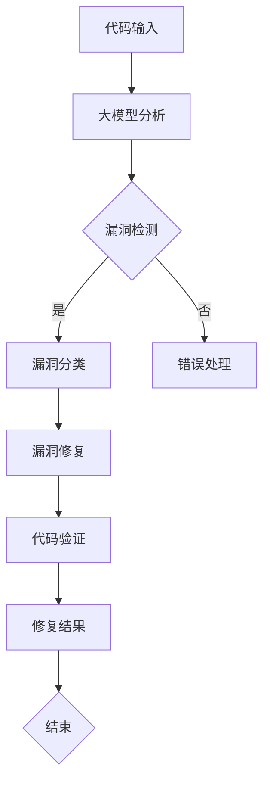
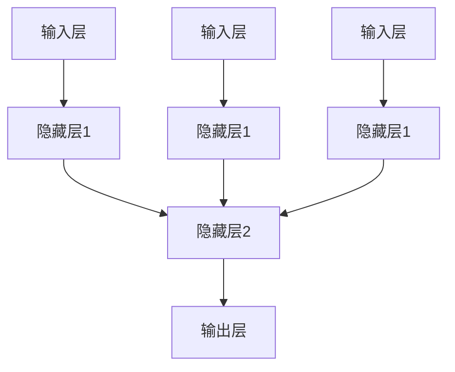
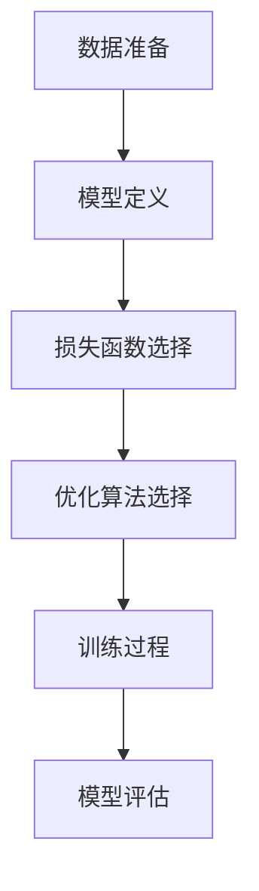
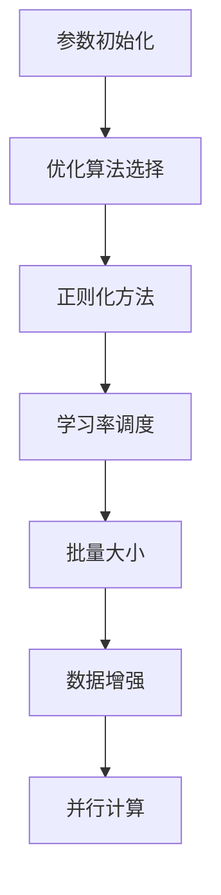
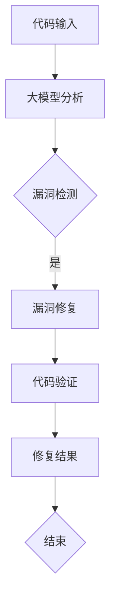
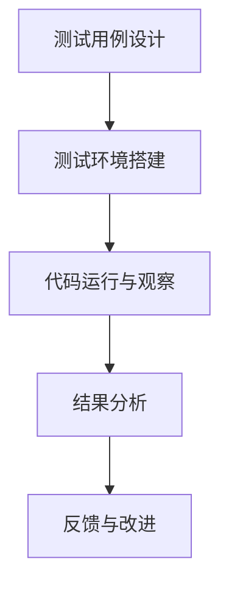
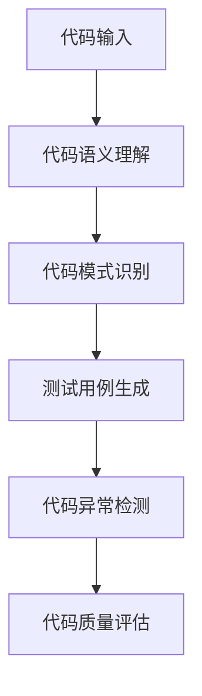
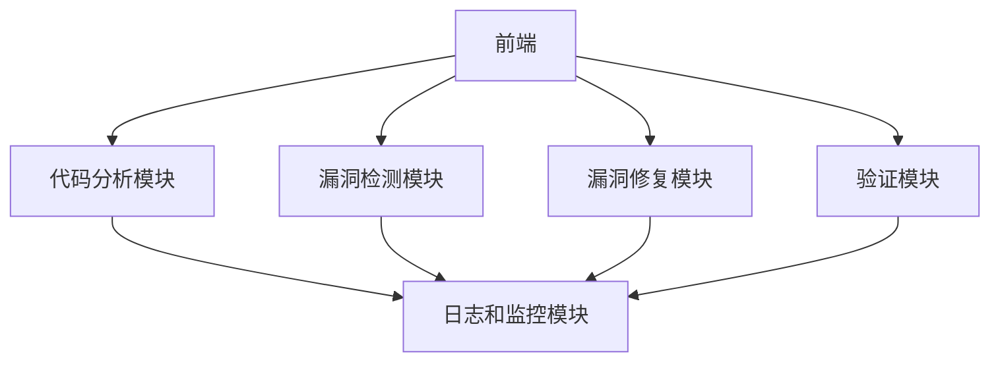
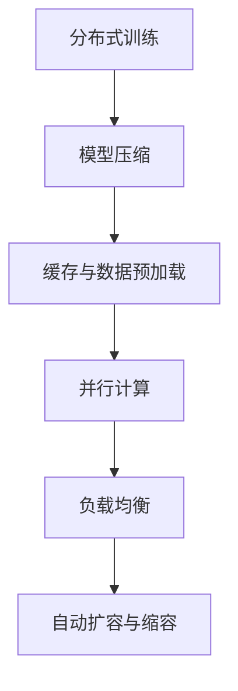

                 

### 引言与背景

在当今数字化时代，软件安全已经成为一个不可忽视的重要问题。软件漏洞修复与验证是确保软件质量和安全性的关键环节。然而，随着软件规模的不断扩大和复杂度的不断增加，传统的漏洞修复方法面临着效率低下、漏检率高和误报率高等挑战。在这种情况下，大模型驱动的智能代码漏洞修复与验证技术应运而生。

#### 传统漏洞修复方法的局限

传统的漏洞修复方法主要包括手动审查和静态分析。手动审查依赖于开发人员的经验和技能，不仅效率低下，而且容易出现漏检和误报。静态分析是通过分析代码的结构和语法，自动识别潜在的漏洞。虽然静态分析在一定程度上提高了效率，但仍然存在以下问题：

- **漏检问题**：静态分析无法检测运行时漏洞，容易漏掉隐藏在代码深处的漏洞。
- **误报问题**：静态分析工具可能会误报一些非漏洞的问题，导致修复成本增加。
- **效率问题**：随着代码规模的扩大，静态分析的时间和计算资源需求显著增加。

#### 大模型在漏洞修复中的应用前景

大模型，尤其是深度学习模型，凭借其强大的特征提取和模式识别能力，为智能代码漏洞修复与验证提供了新的思路。以下是几个方面的应用前景：

- **漏洞检测**：大模型能够从大量的代码中提取出潜在的特征，提高漏洞检测的准确性和效率。
- **漏洞分类**：大模型可以根据漏洞的成因、影响范围和修复难易程度等因素，对漏洞进行准确的分类。
- **漏洞修复**：大模型可以利用其强大的生成能力，自动生成修复代码，减少人工干预。
- **验证**：大模型可以用于验证修复后的代码，确保修复的有效性和安全性。

#### 文章的目的与结构

本文旨在探讨大模型驱动的智能代码漏洞修复与验证技术，具体包括以下几个方面：

1. **基础概念与框架搭建**：介绍大模型、漏洞修复与验证的基本概念，以及智能代码漏洞修复与验证的框架。
2. **大模型技术基础**：详细讲解深度学习与神经网络的基础知识，以及大模型的训练与优化方法。
3. **智能代码漏洞修复**：探讨代码漏洞检测与分类的方法，以及漏洞修复策略与大模型的应用。
4. **代码漏洞验证**：介绍代码验证技术基础，基于大模型的代码验证方法，以及实际案例。
5. **大模型驱动的代码漏洞修复与验证系统开发**：讨论开发环境与工具选择，系统架构设计，以及系统实现与优化。
6. **案例分析与应用前景**：通过实际案例展示大模型驱动的代码漏洞修复与验证的应用效果，探讨未来发展趋势与机遇。

本文将通过逻辑清晰、结构紧凑、简单易懂的专业的技术语言，逐步分析推理，为读者提供深入了解大模型驱动的智能代码漏洞修复与验证技术的途径。

---

**关键词：**大模型、智能代码漏洞修复、验证、深度学习、神经网络

**摘要：**本文介绍了大模型驱动的智能代码漏洞修复与验证技术，从基础概念、大模型技术基础、智能代码漏洞修复、代码漏洞验证、系统开发到案例分析，全面探讨了这一领域的最新进展与应用前景。通过本文的阐述，读者可以了解大模型在代码漏洞修复与验证中的应用，以及如何利用这一技术提高软件质量和安全性。

---

### 第一部分：基础概念与框架搭建

#### 第1章：引言与概述

在本文的第一部分，我们将介绍大模型驱动的智能代码漏洞修复与验证的基础概念和框架搭建。首先，我们将探讨软件漏洞修复的现状与挑战，然后深入讲解大模型的基本概念和特点，最后阐述漏洞修复与验证的核心概念。

##### 1.1 软件漏洞修复的现状与挑战

软件漏洞修复是确保软件质量和安全性的重要环节。然而，传统的漏洞修复方法在面临软件规模扩大和复杂度增加的挑战时，表现出了一些局限性。

- **手动审查**：手动审查是指开发人员或安全专家逐行审查代码，查找潜在的安全漏洞。这种方法依赖于专家的经验和知识，但存在效率低、漏检率高和误报率高的问题。随着代码规模的扩大，手动审查的时间和成本显著增加。
  
- **静态分析**：静态分析是指在不运行程序的情况下，通过分析代码的结构、语法和语义，自动识别潜在的漏洞。静态分析工具能够提高修复效率，但仍然存在以下问题：
  - **漏检问题**：静态分析无法检测运行时漏洞，容易漏掉隐藏在代码深处的漏洞。
  - **误报问题**：静态分析工具可能会误报一些非漏洞的问题，导致修复成本增加。
  - **效率问题**：随着代码规模的扩大，静态分析的时间和计算资源需求显著增加。

- **动态分析**：动态分析是指运行程序并观察其行为，通过模拟实际运行环境，检测漏洞。动态分析能够检测运行时漏洞，但存在以下问题：
  - **效率问题**：动态分析需要运行整个程序，时间和计算资源需求较高。
  - **可控性问题**：动态分析可能无法完全控制程序的运行环境，导致漏洞检测不准确。

##### 1.2 大模型的基本概念

大模型（Large-scale Model）是指参数规模达到百万到千亿级别的深度神经网络模型。大模型具有以下基本概念：

- **深度学习模型**：深度学习模型是一种由多个神经网络层组成的模型，能够通过学习大量数据，提取复杂的特征和模式。
- **参数规模**：大模型的参数规模通常达到百万到千亿级别，这意味着模型具有非常强的表达能力。
- **层次化结构**：大模型通常具有层次化结构，不同层次负责提取不同层次的抽象特征。

##### 1.3 大模型的特点与优势

大模型具有以下特点与优势：

- **强大的特征提取能力**：大模型能够从大量数据中提取出丰富的特征，从而提高漏洞检测的准确性和效率。
- **模式识别能力**：大模型能够识别复杂的模式和规律，从而提高漏洞修复的准确性和自动化程度。
- **泛化能力**：大模型具有较好的泛化能力，能够适应不同类型和规模的代码漏洞修复任务。
- **自适应能力**：大模型能够通过不断学习和优化，适应新的漏洞类型和修复方法。

##### 1.4 漏洞修复与验证的核心概念

漏洞修复与验证是确保代码质量和安全性的重要环节。核心概念包括：

- **漏洞检测**：漏洞检测是指通过分析代码，识别潜在的安全漏洞。漏洞检测方法包括静态分析、动态分析、模糊测试等。
- **漏洞分类**：漏洞分类是指根据漏洞的成因、影响范围和修复难易程度等因素，对漏洞进行分类。常见的漏洞分类方法包括CVSS、OWASP等。
- **漏洞修复**：漏洞修复是指通过自动化或手动方法，修复代码中的漏洞。常见的漏洞修复方法包括代码补丁、代码重构等。
- **验证**：验证是指通过测试和审查，确保漏洞修复的有效性和安全性。验证方法包括单元测试、集成测试、系统测试等。

在接下来的章节中，我们将进一步探讨大模型驱动的智能代码漏洞修复与验证的技术细节，包括深度学习与神经网络基础、代码漏洞检测与分类、漏洞修复策略与方法、代码验证技术基础等。

---

**核心概念与联系：**

以下是一个Mermaid流程图，展示了智能代码漏洞修复与验证的基本流程和核心概念之间的联系：



**伪代码示例：**

```python
# 大模型驱动的智能代码漏洞修复与验证

# 输入代码
code = read_code()

# 大模型分析
analysis_result = large_model_analysis(code)

# 漏洞检测
if analysis_result.has_vulnerability():
    # 漏洞分类
    vulnerability_type = classify_vulnerability(analysis_result)
    
    # 漏洞修复
    fixed_code = repair_vulnerability(code, vulnerability_type)
    
    # 代码验证
    verification_result = verify_code(fixed_code)
    
    if verification_result.is_success():
        print("漏洞修复成功！")
    else:
        print("漏洞修复失败！")
else:
    print("没有检测到漏洞。")
```

---

通过这一部分的内容，我们介绍了大模型驱动的智能代码漏洞修复与验证的基础概念和框架搭建。接下来，我们将深入探讨深度学习与神经网络的基础知识，以及大模型的训练与优化方法。这些基础知识将为我们后续的讨论提供坚实的理论支撑。

### 第2章：深度学习与神经网络基础

在理解大模型驱动的智能代码漏洞修复与验证之前，我们需要掌握深度学习与神经网络的基础知识。这一章节将详细讲解深度学习的基本概念、神经网络的结构与原理，以及深度学习的基本算法。这些知识将为我们后续讨论大模型的训练与优化方法奠定基础。

#### 2.1 深度学习的基本概念

深度学习（Deep Learning）是机器学习（Machine Learning）的一个子领域，主要关注于构建和优化具有多层神经网络的结构，以实现复杂的数据处理任务。以下是深度学习的一些基本概念：

- **神经网络（Neural Network）**：神经网络是一种由大量相互连接的节点（或称为神经元）组成的计算模型。每个节点接收输入信号，通过加权求和处理后产生输出信号。神经网络能够通过学习输入和输出数据之间的关系，实现数据的特征提取和模式识别。

- **层次化结构（Hierarchical Structure）**：深度学习模型通常具有层次化结构，不同层次负责提取不同层次的抽象特征。输入层接收原始数据，经过多层隐藏层处理后，输出层产生最终预测结果。

- **反向传播（Backpropagation）**：反向传播是一种用于训练神经网络的算法。通过反向传播，网络能够计算每个神经元的误差，并更新其权重，从而优化网络性能。

- **深度（Depth）**：深度学习模型的深度是指网络的层数。深度越大，模型能够学习的特征层次越丰富，但也可能导致过拟合（Overfitting）问题。

- **批量大小（Batch Size）**：批量大小是指在一次训练过程中，网络处理的样本数量。批量大小会影响训练效率和模型的泛化能力。

- **优化算法（Optimization Algorithm）**：优化算法用于调整网络参数，以最小化损失函数。常见的优化算法包括随机梯度下降（Stochastic Gradient Descent，SGD）、Adam等。

#### 2.2 神经网络的结构与原理

神经网络由多个神经元组成，每个神经元接收多个输入信号，通过加权求和处理后产生输出信号。以下是一个简单的神经网络结构：



神经网络的工作原理如下：

1. **输入层**：输入层接收原始数据，每个神经元对应一个特征。
2. **隐藏层**：隐藏层负责提取输入数据的特征。每个隐藏层的神经元接收来自前一层的输出，通过加权求和处理后产生输出。隐藏层的数量和神经元数量可以根据任务需求进行调整。
3. **输出层**：输出层产生最终预测结果。输出层的神经元数量取决于任务类型，例如二分类任务有两个神经元，多分类任务有多个神经元。

神经网络通过学习输入和输出数据之间的关系，调整每个神经元的权重，从而实现数据的特征提取和模式识别。以下是一个简单的神经网络前向传播的伪代码示例：

```python
# 神经网络前向传播

# 初始化权重和偏置
weights = initialize_weights()
biases = initialize_biases()

# 前向传播
output = forward_pass(inputs, weights, biases)

# 计算损失
loss = compute_loss(output, labels)

# 返回输出和损失
return output, loss
```

#### 2.3 深度学习的基本算法

深度学习的基本算法包括前向传播、反向传播和优化算法。以下将分别介绍这些算法的原理和实现。

##### 前向传播

前向传播是指从输入层到输出层的正向计算过程。在前向传播过程中，网络通过加权求和处理，将输入数据转化为输出结果。以下是一个简单的神经网络前向传播的伪代码示例：

```python
# 前向传播

# 初始化输入、权重和偏置
inputs = [1, 2, 3]
weights = [0.1, 0.2, 0.3]
biases = [0.1, 0.2, 0.3]

# 前向传播
output = sum(inputs[i] * weights[i] for i in range(len(inputs))) + biases

# 输出结果
print("Output:", output)
```

##### 反向传播

反向传播是指从输出层到输入层的反向计算过程。在反向传播过程中，网络通过计算每个神经元的误差，并更新其权重和偏置，以优化网络性能。以下是一个简单的神经网络反向传播的伪代码示例：

```python
# 反向传播

# 初始化输入、权重和偏置
inputs = [1, 2, 3]
weights = [0.1, 0.2, 0.3]
biases = [0.1, 0.2, 0.3]
labels = [0.5]

# 前向传播
output = forward_pass(inputs, weights, biases)

# 计算误差
error = labels - output

# 反向传播
delta = error * output * (1 - output)
weights += delta * inputs
biases += delta

# 输出更新后的权重和偏置
print("Updated weights:", weights)
print("Updated biases:", biases)
```

##### 优化算法

优化算法用于调整网络参数，以最小化损失函数。以下是一些常见的优化算法：

1. **随机梯度下降（SGD）**：随机梯度下降是最常用的优化算法之一。在每次迭代中，SGD随机选择一个批次的数据，计算梯度并更新权重和偏置。以下是一个简单的随机梯度下降的伪代码示例：

```python
# 随机梯度下降

# 初始化输入、权重和偏置
inputs = [1, 2, 3]
weights = [0.1, 0.2, 0.3]
biases = [0.1, 0.2, 0.3]
labels = [0.5]

# 学习率
learning_rate = 0.1

# 迭代训练
for epoch in range(num_epochs):
    # 前向传播
    output = forward_pass(inputs, weights, biases)
    
    # 计算损失
    loss = compute_loss(output, labels)
    
    # 反向传播
    error = labels - output
    delta = error * output * (1 - output)
    
    # 更新权重和偏置
    weights -= learning_rate * delta * inputs
    biases -= learning_rate * delta

# 输出最终权重和偏置
print("Final weights:", weights)
print("Final biases:", biases)
```

2. **Adam优化算法**：Adam优化算法是另一种常用的优化算法，结合了SGD和动量（Momentum）的优点。以下是一个简单的Adam优化算法的伪代码示例：

```python
# Adam优化算法

# 初始化输入、权重和偏置
inputs = [1, 2, 3]
weights = [0.1, 0.2, 0.3]
biases = [0.1, 0.2, 0.3]
labels = [0.5]

# 学习率
learning_rate = 0.001

# 动量参数
beta1 = 0.9
beta2 = 0.999
epsilon = 1e-8

# 初始化一阶矩估计和二阶矩估计
m = 0
v = 0

# 迭代训练
for epoch in range(num_epochs):
    # 前向传播
    output = forward_pass(inputs, weights, biases)
    
    # 计算损失
    loss = compute_loss(output, labels)
    
    # 反向传播
    error = labels - output
    delta = error * output * (1 - output)
    
    # 更新一阶矩估计和二阶矩估计
    m = beta1 * m + (1 - beta1) * delta
    v = beta2 * v + (1 - beta2) * (delta ** 2)
    
    # 归一化一阶矩估计和二阶矩估计
    m_hat = m / (1 - beta1 ** epoch)
    v_hat = v / (1 - beta2 ** epoch)
    
    # 更新权重和偏置
    weights -= learning_rate * m_hat / (np.sqrt(v_hat) + epsilon)
    biases -= learning_rate * m_hat / (np.sqrt(v_hat) + epsilon)

# 输出最终权重和偏置
print("Final weights:", weights)
print("Final biases:", biases)
```

通过以上介绍，我们了解了深度学习与神经网络的基本概念、结构与原理，以及基本算法。这些基础知识为我们后续讨论大模型的技术细节提供了理论支撑。

---

**核心算法原理讲解：**

在深度学习中，损失函数是一个至关重要的概念，它用于衡量预测结果与真实值之间的差距。以下是常见的损失函数及其伪代码实现：

1. **均方误差（MSE）**：均方误差是回归任务中最常用的损失函数，它计算预测值与真实值之间的平均平方误差。

```python
# 均方误差（MSE）

def compute_mse(predictions, labels):
    return np.mean((predictions - labels) ** 2)
```

2. **交叉熵损失（Cross-Entropy Loss）**：交叉熵损失是分类任务中最常用的损失函数，它计算预测概率分布与真实概率分布之间的交叉熵。

```python
# 交叉熵损失（Cross-Entropy Loss）

def compute_cross_entropy(predictions, labels):
    return -np.sum(labels * np.log(predictions))
```

3. **Hinge损失（Hinge Loss）**：Hinge损失常用于支持向量机（SVM）等二分类任务，它计算预测值与真实值之间的差距，并在真实值为1时达到最大值。

```python
# Hinge损失（Hinge Loss）

def compute_hinge_loss(predictions, labels):
    return np.maximum(0, 1 - predictions * labels)
```

**数学模型和公式：**

在深度学习中，损失函数通常通过优化算法来最小化。以下是常用的优化算法及其相关的数学公式：

1. **随机梯度下降（SGD）**：

$$ w_{\text{new}} = w_{\text{old}} - \alpha \cdot \nabla_w J(w) $$

其中，$w$表示模型参数，$\alpha$表示学习率，$J(w)$表示损失函数。

2. **Adam优化算法**：

$$ m = \beta_1 \cdot m + (1 - \beta_1) \cdot \nabla_w J(w) $$
$$ v = \beta_2 \cdot v + (1 - \beta_2) \cdot (\nabla_w J(w))^2 $$
$$ \hat{m} = \frac{m}{1 - \beta_1^t} $$
$$ \hat{v} = \frac{v}{1 - \beta_2^t} $$
$$ w_{\text{new}} = w_{\text{old}} - \alpha \cdot \frac{\hat{m}}{\sqrt{\hat{v}} + \epsilon} $$

其中，$m$和$v$分别表示一阶矩估计和二阶矩估计，$\beta_1$和$\beta_2$分别表示一阶和二阶动量参数，$\epsilon$是一个很小的正数用于避免除以零。

**举例说明：**

假设我们有一个简单的神经网络，用于回归任务。输入数据为$x = [1, 2, 3]$，真实值为$y = 2$。使用均方误差（MSE）作为损失函数，学习率为$\alpha = 0.1$，经过一次随机梯度下降（SGD）迭代后，更新模型参数。

1. **前向传播**：

$$ z = \sum_{i=1}^{3} w_i \cdot x_i + b $$
$$ \hat{y} = \sigma(z) $$

其中，$\sigma$表示激活函数（例如Sigmoid函数）。

2. **计算损失**：

$$ J(w) = \frac{1}{2} \cdot (y - \hat{y})^2 $$

3. **计算梯度**：

$$ \nabla_w J(w) = \nabla_w \frac{1}{2} \cdot (y - \hat{y})^2 = (y - \hat{y}) \cdot \nabla_w \hat{y} = (y - \hat{y}) \cdot \sigma'(z) \cdot x $$

4. **更新权重**：

$$ w_{\text{new}} = w_{\text{old}} - \alpha \cdot \nabla_w J(w) $$

通过以上步骤，我们可以更新模型参数，减小损失函数值，提高模型性能。

---

通过本章的讲解，我们了解了深度学习与神经网络的基础知识，包括基本概念、结构与原理，以及常用的基本算法。这些知识为我们后续探讨大模型的训练与优化方法提供了重要的理论支持。

### 第3章：大模型的训练与优化

在了解了深度学习与神经网络的基础知识后，我们需要进一步探讨大模型的训练与优化。大模型通常具有数百万到数十亿的参数，其训练与优化过程复杂且资源消耗巨大。本章将详细讲解大模型训练的基本流程、优化技巧与挑战，以及大模型在代码漏洞修复中的应用。

#### 3.1 大模型训练的基本流程

大模型训练的基本流程包括以下几个步骤：

1. **数据准备**：数据准备是模型训练的基础。首先，我们需要收集大量高质量的训练数据。对于代码漏洞修复任务，这些数据包括漏洞代码和对应的修复代码。然后，对数据进行预处理，如代码解析、特征提取、数据清洗等。

2. **模型定义**：在数据准备完成后，我们需要定义模型结构。大模型通常具有多个层次和复杂的网络结构。我们可以使用现成的深度学习框架（如TensorFlow、PyTorch）来定义和实现模型。

3. **损失函数选择**：根据任务类型（如回归、分类），选择合适的损失函数。对于代码漏洞修复任务，常用的损失函数包括均方误差（MSE）、交叉熵损失等。

4. **优化算法选择**：选择合适的优化算法，如随机梯度下降（SGD）、Adam等。优化算法用于调整模型参数，以最小化损失函数。

5. **训练过程**：将数据输入到模型中，通过迭代优化模型参数，直到满足训练目标。训练过程中，需要监控模型性能，如准确率、损失函数值等。

6. **模型评估**：在训练完成后，使用验证集对模型进行评估，确保模型具有较好的泛化能力。

以下是大模型训练的基本流程的Mermaid流程图：



#### 3.2 大模型优化的技巧与挑战

大模型优化涉及多个方面，包括参数初始化、优化算法选择、正则化方法等。以下是几种常用的优化技巧与挑战：

1. **参数初始化**：合理的参数初始化有助于提高模型性能和收敛速度。常用的初始化方法包括高斯初始化、Xavier初始化等。

2. **优化算法选择**：优化算法直接影响模型的收敛速度和性能。常用的优化算法包括随机梯度下降（SGD）、Adam、RMSProp等。每种算法都有其优缺点，需要根据具体任务和需求进行选择。

3. **正则化方法**：正则化方法用于防止模型过拟合。常用的正则化方法包括L1正则化、L2正则化、Dropout等。

4. **学习率调度**：学习率调度是一种动态调整学习率的方法，以避免模型过早地陷入局部最优。常用的学习率调度策略包括学习率衰减、余弦退火等。

5. **批量大小**：批量大小影响模型的收敛速度和泛化能力。较小的批量大小有助于提高模型的泛化能力，但计算资源需求较大。

6. **数据增强**：数据增强是一种通过增加数据的多样性来提高模型性能的方法。对于代码漏洞修复任务，数据增强可以包括代码重排、插入随机代码片段等。

7. **并行计算**：大模型的训练过程需要大量的计算资源。通过并行计算，可以显著提高训练效率。常用的并行计算方法包括多GPU训练、分布式训练等。

以下是大模型优化技巧的Mermaid流程图：



#### 3.3 大模型在代码漏洞修复中的应用

大模型在代码漏洞修复中的应用主要体现在以下几个方面：

1. **代码分析**：大模型具有强大的特征提取能力，可以用于提取代码中的潜在特征，从而辅助漏洞检测。例如，大模型可以用于代码解析、语法分析、语义分析等。

2. **漏洞检测**：大模型可以根据训练数据中的漏洞特征，识别代码中的潜在漏洞。通过训练大量的漏洞代码和正常代码，大模型可以学习到漏洞的特征模式，从而提高漏洞检测的准确率和效率。

3. **漏洞修复**：大模型可以用于生成修复代码。通过学习漏洞代码和修复代码之间的关系，大模型可以自动生成修复代码，从而减少人工干预。这种方法可以显著提高漏洞修复的效率。

4. **代码验证**：大模型可以用于验证修复后的代码，确保修复的有效性和安全性。通过运行测试用例，大模型可以分析修复后的代码行为，检测潜在的漏洞。

以下是大模型在代码漏洞修复中的应用流程：



#### 3.4 大模型训练与优化案例分析

为了更好地理解大模型在代码漏洞修复中的应用，我们可以通过一个实际案例进行讲解。

**案例背景：** 某开源项目存在多个漏洞，需要自动化修复和验证。

**实现步骤：**

1. **数据收集与预处理**：收集项目中的漏洞代码和修复代码，对代码进行解析和特征提取，生成训练数据集。

2. **模型定义**：使用深度学习框架（如TensorFlow）定义一个多层感知机（MLP）模型，用于代码漏洞检测和修复。

3. **损失函数与优化算法**：选择交叉熵损失函数和Adam优化算法，用于训练模型。

4. **模型训练**：将预处理后的数据输入到模型中，进行迭代训练，直到模型收敛。

5. **漏洞检测**：使用训练好的模型对项目中的代码进行漏洞检测，识别潜在的漏洞。

6. **漏洞修复**：对于检测到的漏洞，利用模型生成修复代码，并进行验证。

7. **代码验证**：运行测试用例，验证修复后的代码是否正确。

以下是案例实现的伪代码：

```python
# 大模型训练与优化案例分析

# 数据收集与预处理
train_data, train_labels = preprocess_data(vulnerability_codes, fixed_codes)

# 模型定义
model = define_model(input_shape=train_data.shape[1:])

# 损失函数与优化算法
loss_fn = tf.keras.losses.CategoricalCrossentropy()
optimizer = tf.keras.optimizers.Adam()

# 模型训练
model.fit(train_data, train_labels, epochs=num_epochs, batch_size=batch_size)

# 漏洞检测
predicted_labels = model.predict(vulnerability_codes)

# 漏洞修复
fixed_codes = generate_fixed_codes(predicted_labels)

# 代码验证
verification_results = verify_codes(fixed_codes)

# 输出修复结果
print("修复结果：", verification_results)
```

通过以上案例分析，我们可以看到大模型在代码漏洞修复中的应用流程和关键步骤。在实际应用中，可以根据具体需求和任务进行调整和优化。

---

**核心算法原理讲解：**

在深度学习中，优化算法的选择和调整对模型性能有重要影响。以下将介绍一种常用的优化算法——Adam优化算法，并使用伪代码进行详细解释。

**Adam优化算法：**

Adam优化算法是一种基于一阶矩估计和二阶矩估计的优化算法，结合了Adam和RMSProp的优点。其核心思想是在SGD的基础上引入动量项，以加速收敛并避免陷入局部最小值。

**伪代码：**

```python
# Adam优化算法

# 初始化参数
m = 0
v = 0
m_hat = 0
v_hat = 0
beta1 = 0.9
beta2 = 0.999
epsilon = 1e-8
learning_rate = 0.001

# 迭代过程
for epoch in range(num_epochs):
    # 前向传播
    output = forward_pass(inputs, weights, biases)
    
    # 计算损失
    loss = compute_loss(output, labels)
    
    # 反向传播
    error = labels - output
    delta = error * output * (1 - output)
    
    # 更新一阶矩估计和二阶矩估计
    m = beta1 * m + (1 - beta1) * delta
    v = beta2 * v + (1 - beta2) * (delta ** 2)
    
    # 归一化一阶矩估计和二阶矩估计
    m_hat = m / (1 - beta1 ** epoch)
    v_hat = v / (1 - beta2 ** epoch)
    
    # 更新权重和偏置
    weights -= learning_rate * m_hat / (np.sqrt(v_hat) + epsilon)
    biases -= learning_rate * m_hat / (np.sqrt(v_hat) + epsilon)
    
    # 输出更新后的权重和偏置
    print("Epoch:", epoch, "Weights:", weights, "Biases:", biases)
```

**数学模型和公式：**

Adam优化算法的核心公式如下：

$$ m = \beta_1 \cdot m + (1 - \beta_1) \cdot \nabla_w J(w) $$
$$ v = \beta_2 \cdot v + (1 - \beta_2) \cdot (\nabla_w J(w))^2 $$
$$ \hat{m} = \frac{m}{1 - \beta_1^t} $$
$$ \hat{v} = \frac{v}{1 - \beta_2^t} $$
$$ w_{\text{new}} = w_{\text{old}} - \alpha \cdot \frac{\hat{m}}{\sqrt{\hat{v}} + \epsilon} $$

其中，$m$和$v$分别表示一阶矩估计和二阶矩估计，$\hat{m}$和$\hat{v}$分别表示归一化后的一阶矩估计和二阶矩估计，$\alpha$为学习率，$\beta_1$和$\beta_2$为动量参数，$\epsilon$为一个很小的正数用于避免除以零。

**举例说明：**

假设有一个简单的线性模型，输入$x = [1, 2, 3]$，真实值$y = 2$。使用Adam优化算法进行一次迭代，更新模型参数。

1. **前向传播**：

$$ z = w_1 \cdot x_1 + w_2 \cdot x_2 + w_3 \cdot x_3 + b $$
$$ \hat{y} = \sigma(z) $$

2. **计算损失**：

$$ J(w) = \frac{1}{2} \cdot (y - \hat{y})^2 $$

3. **计算梯度**：

$$ \nabla_w J(w) = \nabla_w \frac{1}{2} \cdot (y - \hat{y})^2 = (y - \hat{y}) \cdot \nabla_w \hat{y} = (y - \hat{y}) \cdot \sigma'(z) \cdot x $$

4. **更新权重**：

$$ m = \beta_1 \cdot m + (1 - \beta_1) \cdot \nabla_w J(w) $$
$$ v = \beta_2 \cdot v + (1 - \beta_2) \cdot (\nabla_w J(w))^2 $$
$$ \hat{m} = \frac{m}{1 - \beta_1^t} $$
$$ \hat{v} = \frac{v}{1 - \beta_2^t} $$
$$ w_{\text{new}} = w_{\text{old}} - \alpha \cdot \frac{\hat{m}}{\sqrt{\hat{v}} + \epsilon} $$

通过以上步骤，我们可以更新模型参数，减小损失函数值，提高模型性能。

---

通过本章的讲解，我们了解了大模型训练与优化的基本流程、优化技巧与挑战，以及大模型在代码漏洞修复中的应用。这些知识为我们后续探讨智能代码漏洞修复与验证的具体方法奠定了基础。

### 第4章：智能代码漏洞修复

在上一章中，我们详细探讨了深度学习与神经网络的基础知识以及大模型的训练与优化方法。在本章中，我们将深入讨论智能代码漏洞修复的具体方法，包括代码漏洞检测与分类、漏洞修复策略与方法，以及大模型在漏洞修复中的具体应用。

#### 4.1 代码漏洞检测的基本方法

代码漏洞检测是智能代码漏洞修复的重要步骤。它旨在通过分析代码，识别潜在的安全漏洞。代码漏洞检测的基本方法包括静态代码分析、动态代码分析以及模糊测试等。

1. **静态代码分析**：

静态代码分析是指在不运行代码的情况下，通过解析代码的结构、语法和语义，自动识别潜在的安全漏洞。静态代码分析具有以下优点：

- **效率高**：静态代码分析可以快速扫描大量代码，检测潜在的安全漏洞。
- **提前发现**：静态代码分析可以提前发现代码中的安全问题，从而避免在运行时引发严重后果。

然而，静态代码分析也存在一些局限性：

- **漏检问题**：静态代码分析无法检测运行时漏洞，容易漏掉隐藏在代码深处的漏洞。
- **误报问题**：静态代码分析工具可能会误报一些非漏洞的问题，导致修复成本增加。

2. **动态代码分析**：

动态代码分析是指运行代码并观察其行为，通过模拟实际运行环境，检测漏洞。动态代码分析具有以下优点：

- **可检测运行时漏洞**：动态代码分析可以检测运行时漏洞，从而弥补静态代码分析的局限性。
- **更真实的运行环境**：动态代码分析可以在真实的运行环境中执行代码，从而更准确地检测漏洞。

然而，动态代码分析也存在一些缺点：

- **效率问题**：动态代码分析需要运行整个程序，时间和计算资源需求较高。
- **可控性问题**：动态代码分析可能无法完全控制程序的运行环境，导致漏洞检测不准确。

3. **模糊测试**：

模糊测试是一种通过输入随机或异常数据，观察程序行为，以检测潜在漏洞的方法。模糊测试具有以下优点：

- **自动化程度高**：模糊测试可以自动化地生成大量测试用例，提高漏洞检测的效率。
- **广泛的覆盖范围**：模糊测试可以覆盖代码的不同部分和边界条件，提高漏洞检测的准确性。

然而，模糊测试也存在一些局限性：

- **测试用例生成困难**：对于复杂的代码，生成有效的测试用例可能比较困难。
- **误报问题**：模糊测试可能会产生大量的误报，导致修复成本增加。

#### 4.2 漏洞分类与模型构建

漏洞分类是智能代码漏洞修复的重要环节。通过对漏洞进行分类，可以更好地理解漏洞的成因、影响范围和修复难易程度，从而有针对性地进行漏洞修复。常见的漏洞分类方法包括OWASP Top 10、CVE等。

1. **OWASP Top 10**：

OWASP Top 10 是一个广泛使用的漏洞分类标准，它列出了最常见的十大Web应用漏洞。这些漏洞包括SQL注入、跨站脚本（XSS）、跨站请求伪造（CSRF）等。通过OWASP Top 10，可以系统地识别和修复常见的Web应用漏洞。

2. **CVE**：

CVE（Common Vulnerabilities and Exposures）是一个全球性的漏洞数据库，它列出了各种软件和系统中的漏洞。每个CVE条目都包含一个唯一的标识符、漏洞描述、受影响软件等信息。通过利用CVE，可以更好地管理和修复已知漏洞。

3. **基于大模型的漏洞分类方法**：

基于大模型的漏洞分类方法利用深度学习技术，对漏洞进行自动分类。这种方法具有以下优点：

- **自动化程度高**：基于大模型的漏洞分类可以自动化地处理大量的漏洞数据，提高分类效率。
- **准确性高**：大模型能够从大量数据中提取特征，从而提高漏洞分类的准确性。

然而，基于大模型的漏洞分类方法也存在一些挑战：

- **数据质量**：漏洞数据的质量对分类结果有重要影响。数据质量较差可能导致分类效果不佳。
- **模型复杂度**：大模型通常具有复杂的结构和大量的参数，导致模型训练和推理的时间较长。

#### 4.3 漏洞修复策略与方法

漏洞修复策略是指修复代码漏洞的方法和步骤。常见的漏洞修复策略包括自动修复、半自动修复和手动修复等。

1. **自动修复**：

自动修复是指利用自动化工具或算法，自动生成修复代码。自动修复具有以下优点：

- **效率高**：自动修复可以显著提高漏洞修复的效率，减少人工干预。
- **一致性高**：自动修复可以确保修复的一致性，避免人工修复带来的偏差。

然而，自动修复也存在一些局限性：

- **适用范围有限**：自动修复适用于某些类型的漏洞，对复杂或隐蔽的漏洞效果较差。
- **误修问题**：自动修复可能会导致误修，生成错误的修复代码。

2. **半自动修复**：

半自动修复是指结合人工和自动化方法，进行漏洞修复。这种方法具有以下优点：

- **灵活性高**：半自动修复可以灵活地结合人工和自动化方法，针对不同类型的漏洞进行修复。
- **质量高**：人工参与可以确保修复代码的质量，避免误修问题。

然而，半自动修复也存在一些缺点：

- **效率较低**：人工参与会增加漏洞修复的时间成本。
- **依赖人工**：半自动修复依赖于开发人员或安全专家的经验和知识。

3. **手动修复**：

手动修复是指开发人员或安全专家手动分析漏洞，并编写修复代码。手动修复具有以下优点：

- **针对性高**：手动修复可以根据具体漏洞的特点，进行针对性的修复。
- **可靠性高**：手动修复可以确保修复代码的可靠性，避免自动化修复带来的误修问题。

然而，手动修复也存在一些缺点：

- **效率低**：手动修复需要耗费大量时间和精力，效率较低。
- **依赖人工**：手动修复高度依赖于开发人员或安全专家的经验和知识。

#### 4.4 大模型在漏洞修复中的应用

大模型在漏洞修复中的应用主要体现在以下几个方面：

1. **漏洞检测**：

大模型可以用于代码漏洞检测，通过学习漏洞特征，提高漏洞检测的准确性和效率。大模型能够从大量代码中提取特征，从而识别潜在的安全漏洞。

2. **漏洞分类**：

大模型可以用于漏洞分类，根据漏洞的成因、影响范围和修复难易程度等因素，对漏洞进行准确的分类。大模型能够从大量漏洞数据中学习分类规则，从而实现自动分类。

3. **漏洞修复**：

大模型可以用于漏洞修复，通过学习漏洞和修复代码之间的关系，生成修复代码。大模型能够从大量漏洞和修复代码中学习修复策略，从而实现自动修复。

4. **代码验证**：

大模型可以用于验证修复后的代码，确保修复的有效性和安全性。大模型能够从大量测试用例中学习代码行为，从而检测修复后的代码是否正确。

#### 4.5 漏洞修复案例分析

为了更好地理解智能代码漏洞修复的具体应用，我们可以通过一个实际案例进行讲解。

**案例背景：** 某开源项目存在多个漏洞，需要自动化修复和验证。

**实现步骤：**

1. **数据收集与预处理**：

收集项目中的漏洞代码和修复代码，对代码进行解析和特征提取，生成训练数据集。

2. **模型训练**：

使用深度学习框架（如TensorFlow），定义一个多层感知机（MLP）模型，用于漏洞检测和修复。使用预处理后的数据集进行模型训练。

3. **漏洞检测**：

使用训练好的模型对项目中的代码进行漏洞检测，识别潜在的漏洞。

4. **漏洞修复**：

对于检测到的漏洞，利用模型生成修复代码，并进行验证。

5. **代码验证**：

运行测试用例，验证修复后的代码是否正确。

以下是案例实现的伪代码：

```python
# 智能代码漏洞修复与验证案例分析

# 数据收集与预处理
train_data, train_labels = preprocess_data(vulnerability_codes, fixed_codes)

# 模型定义
model = define_model(input_shape=train_data.shape[1:])

# 损失函数与优化算法
loss_fn = tf.keras.losses.CategoricalCrossentropy()
optimizer = tf.keras.optimizers.Adam()

# 模型训练
model.fit(train_data, train_labels, epochs=num_epochs, batch_size=batch_size)

# 漏洞检测
predicted_labels = model.predict(vulnerability_codes)

# 漏洞修复
fixed_codes = generate_fixed_codes(predicted_labels)

# 代码验证
verification_results = verify_codes(fixed_codes)

# 输出修复结果
print("修复结果：", verification_results)
```

通过以上案例分析，我们可以看到智能代码漏洞修复与验证的具体实现流程和关键步骤。在实际应用中，可以根据具体需求和任务进行调整和优化。

---

**核心算法原理讲解：**

在智能代码漏洞修复中，一种常用的算法是序列到序列（Seq2Seq）模型。Seq2Seq模型特别适用于代码生成任务，如将漏洞代码转换为修复代码。以下是Seq2Seq模型的基本原理和伪代码实现。

**Seq2Seq模型的基本原理：**

Seq2Seq模型由两个主要部分组成：编码器（Encoder）和解码器（Decoder）。编码器将输入序列（如漏洞代码）编码为一个固定长度的向量表示，解码器则使用这个向量表示生成输出序列（如修复代码）。

1. **编码器**：

编码器的任务是接受一个输入序列，并生成一个固定长度的隐藏状态向量。这个隐藏状态向量包含了输入序列的语义信息。

2. **解码器**：

解码器的任务是接受编码器生成的隐藏状态向量，并生成输出序列。解码器通常使用循环神经网络（RNN）或长短期记忆网络（LSTM）来实现。

3. **注意力机制**：

为了更好地关注输入序列中的关键信息，解码器通常会使用注意力机制。注意力机制允许解码器在生成每个输出单元时，动态地关注输入序列的不同部分。

以下是Seq2Seq模型的伪代码实现：

```python
# Seq2Seq模型伪代码实现

# 编码器
def encode(input_sequence):
    # 使用RNN或LSTM编码输入序列
    hidden_state = rnn(input_sequence)
    return hidden_state

# 解码器
def decode(hidden_state, target_sequence):
    # 使用RNN或LSTM解码隐藏状态
    output_sequence = rnn(hidden_state, target_sequence)
    return output_sequence

# 注意力机制
def attention(hidden_state, input_sequence):
    # 计算注意力权重
    attention_weights = compute_attention_weights(hidden_state, input_sequence)
    return attention_weights

# 主函数
def generate_output(input_sequence, target_sequence):
    # 编码输入序列
    hidden_state = encode(input_sequence)

    # 初始化解码器状态
    decoder_state = init_decoder_state(hidden_state)

    # 解码隐藏状态
    output_sequence = decode(decoder_state, target_sequence)

    # 返回输出序列
    return output_sequence
```

**数学模型和公式：**

Seq2Seq模型的数学模型涉及编码器和解码器的状态更新、注意力机制的权重计算等。

1. **编码器状态更新**：

$$ h_t = \text{RNN}(x_t, h_{t-1}) $$

其中，$h_t$是编码器在时间步$t$的隐藏状态，$x_t$是输入序列在时间步$t$的输入，$\text{RNN}$表示循环神经网络或长短期记忆网络。

2. **解码器状态更新**：

$$ s_t = \text{RNN}(h_t, s_{t-1}) $$

其中，$s_t$是解码器在时间步$t$的隐藏状态，$h_t$是编码器在时间步$t$的隐藏状态，$\text{RNN}$表示循环神经网络或长短期记忆网络。

3. **注意力权重计算**：

$$ a_t = \text{softmax}\left(\frac{W_a [s_t, h_t]}{\sqrt{d_k}}\right) $$

其中，$a_t$是时间步$t$的注意力权重，$s_t$是解码器在时间步$t$的隐藏状态，$h_t$是编码器在时间步$t$的隐藏状态，$W_a$是注意力权重矩阵，$d_k$是隐藏状态向量的维度。

**举例说明：**

假设我们有一个简单的序列到序列模型，用于将漏洞代码转换为修复代码。

1. **编码输入序列**：

$$ x_1, x_2, x_3, ..., x_T $$

2. **解码隐藏状态**：

$$ s_1 = \text{RNN}(h_1, s_0) $$
$$ s_2 = \text{RNN}(h_2, s_1) $$
$$ ... $$
$$ s_T = \text{RNN}(h_T, s_{T-1}) $$

3. **计算注意力权重**：

$$ a_1 = \text{softmax}\left(\frac{W_a [s_1, h_1]}{\sqrt{d_k}}\right) $$
$$ a_2 = \text{softmax}\left(\frac{W_a [s_2, h_2]}{\sqrt{d_k}}\right) $$
$$ ... $$
$$ a_T = \text{softmax}\left(\frac{W_a [s_T, h_T]}{\sqrt{d_k}}\right) $$

4. **生成输出序列**：

$$ y_1 = \text{softmax}(W_y s_1 + b_y) $$
$$ y_2 = \text{softmax}(W_y s_2 + b_y) $$
$$ ... $$
$$ y_T = \text{softmax}(W_y s_T + b_y) $$

通过以上步骤，我们可以使用Seq2Seq模型生成修复代码。

---

通过本章的讲解，我们详细介绍了智能代码漏洞修复的具体方法，包括漏洞检测与分类、漏洞修复策略与方法，以及大模型在漏洞修复中的应用。这些方法为我们实现自动化、高效的代码漏洞修复提供了有力的技术支持。

### 第5章：代码验证技术基础

在智能代码漏洞修复过程中，代码验证是确保修复效果和系统安全性的关键环节。代码验证技术通过对修复后的代码进行测试和审查，确保其无漏洞、功能正确、性能稳定。本章将介绍代码验证的基本概念、方法与流程，以及大模型在代码验证中的应用。

#### 5.1 验证方法与流程

代码验证的方法可以分为静态验证和动态验证两种。

1. **静态验证**：

静态验证是指在代码运行之前，通过分析代码的结构、语法和语义，检测潜在的错误和漏洞。静态验证的优点是快速、高效，可以在开发阶段提前发现问题。常见的静态验证方法包括：

- **语法分析**：检查代码是否符合编程语言的语法规则。
- **语义分析**：检查代码的语义是否正确，如变量类型、函数调用等。
- **代码格式检查**：检查代码是否符合编码规范和风格指南。
- **代码质量分析**：检测代码的复杂度、可读性、可维护性等。

2. **动态验证**：

动态验证是指在代码运行过程中，通过运行代码并观察其行为，检测代码的错误和漏洞。动态验证的优点是可以检测到运行时的问题，但需要运行整个程序，时间和计算资源需求较高。常见的动态验证方法包括：

- **单元测试**：对代码的各个单元（函数、方法等）进行独立的测试，确保其功能正确。
- **集成测试**：对代码的不同模块进行组合测试，确保模块间的接口正确。
- **系统测试**：对整个系统进行测试，确保系统满足需求、性能稳定。
- **性能测试**：评估代码的运行效率和资源消耗，确保系统在高负载情况下稳定运行。

代码验证的流程通常包括以下几个步骤：

1. **测试用例设计**：根据需求和功能，设计测试用例，包括输入数据、预期输出等。
2. **测试环境搭建**：搭建测试环境，包括操作系统、编程语言、开发工具等。
3. **代码运行与观察**：运行代码并观察其行为，记录输出结果和异常情况。
4. **结果分析**：分析测试结果，判断代码是否正确、是否存在漏洞。
5. **反馈与改进**：根据测试结果，对代码进行改进和优化，确保修复后的代码无漏洞、功能正确。

以下是代码验证的基本流程的Mermaid流程图：



#### 5.2 基于大模型的代码验证

大模型在代码验证中具有显著优势，可以通过学习和分析大量代码，提高验证的准确性和效率。以下是基于大模型的代码验证方法：

1. **代码语义理解**：

大模型具有强大的语义理解能力，可以通过学习代码的语义信息，提高验证的准确性。例如，大模型可以理解函数的输入输出关系、代码块的作用等。

2. **代码模式识别**：

大模型可以识别代码中的模式和规律，从而提高验证的自动化程度。例如，大模型可以自动识别常见的代码错误模式，如语法错误、逻辑错误等。

3. **测试用例生成**：

大模型可以基于历史测试用例和代码语义信息，自动生成新的测试用例。这样可以提高测试用例的覆盖范围，减少测试成本。

4. **代码异常检测**：

大模型可以检测代码中的异常行为，如潜在的漏洞、性能问题等。通过分析代码的运行时数据，大模型可以识别异常模式，并提供相应的修复建议。

5. **代码质量评估**：

大模型可以评估代码的质量，如可读性、可维护性、安全性等。通过分析代码的语法和语义，大模型可以提供代码质量评估报告，帮助开发人员进行改进。

以下是基于大模型的代码验证方法的Mermaid流程图：



#### 5.3 代码验证的实际案例

为了更好地理解基于大模型的代码验证，我们可以通过一个实际案例进行讲解。

**案例背景：** 某开源项目修复了多个漏洞，需要进行代码验证。

**实现步骤：**

1. **测试用例设计**：

根据需求和功能，设计测试用例，包括输入数据、预期输出等。

2. **大模型训练**：

收集历史测试用例和修复后的代码，使用深度学习框架（如TensorFlow、PyTorch）训练大模型，使其能够理解和分析代码。

3. **代码验证**：

使用训练好的大模型对修复后的代码进行验证，包括代码语义理解、代码模式识别、测试用例生成等。

4. **结果分析**：

分析验证结果，判断代码是否正确、是否存在漏洞。

5. **反馈与改进**：

根据验证结果，对代码进行改进和优化，确保修复后的代码无漏洞、功能正确。

以下是案例实现的伪代码：

```python
# 基于大模型的代码验证案例

# 测试用例设计
test_cases = design_test_cases()

# 大模型训练
model = train_model(test_cases)

# 代码验证
verification_results = verify_code(code_to_verify, model)

# 结果分析
if verification_results.is_successful():
    print("代码验证通过！")
else:
    print("代码验证失败，请改进！")

# 反馈与改进
if verification_results need_improvement():
    make_improvements_to_code()
```

通过以上案例分析，我们可以看到基于大模型的代码验证的具体实现流程和关键步骤。在实际应用中，可以根据具体需求和任务进行调整和优化。

---

**核心算法原理讲解：**

在代码验证中，一种常用的算法是深度学习中的卷积神经网络（CNN）。CNN特别适用于处理图像数据，但也可以应用于代码数据，用于检测代码中的错误和漏洞。以下是CNN的基本原理和伪代码实现。

**CNN的基本原理：**

CNN是一种深度学习模型，通过卷积操作、池化操作和全连接层，对图像数据（或代码数据）进行特征提取和分类。

1. **卷积层**：

卷积层通过卷积操作提取图像（或代码）的特征。卷积核是一个小的矩阵，滑动在输入数据上，通过内积和激活函数（如ReLU）产生输出。

2. **池化层**：

池化层通过下采样操作减少数据的维度，同时保留最重要的信息。常用的池化操作包括最大池化和平均池化。

3. **全连接层**：

全连接层将卷积层和池化层提取的特征映射到输出类别。每个神经元都与输入数据的每个特征连接。

以下是CNN的伪代码实现：

```python
# CNN模型伪代码实现

# 初始化参数
weights = initialize_weights()
biases = initialize_biases()

# 卷积层
def conv2d(input, weights, biases):
    output = np.zeros_like(input)
    for i in range(input.shape[0]):
        for j in range(input.shape[1]):
            output[i, j] = np.sum(weights * input[i, j]) + biases
    return output

# 池化层
def max_pooling(input, pool_size):
    output = np.zeros_like(input)
    for i in range(input.shape[0]):
        for j in range(input.shape[1]):
            pool = input[i, j:j+pool_size, j:j+pool_size]
            output[i, j] = np.max(pool)
    return output

# 全连接层
def fully_connected(input, weights, biases):
    output = np.zeros_like(input)
    for i in range(input.shape[0]):
        output[i] = np.dot(input[i], weights) + biases
    return output

# CNN模型
def cnn(input_data):
    # 卷积层
    conv1 = conv2d(input_data, weights['conv1'], biases['bias1'])
    pool1 = max_pooling(conv1, pool_size=2)

    # 全连接层
    flatten = np.reshape(pool1, [-1, weights['fc1'].shape[0]])
    fc1 = fully_connected(flatten, weights['fc1'], biases['bias1'])

    # 输出层
    output = fully_connected(fc1, weights['output'], biases['bias_output'])

    return output
```

**数学模型和公式：**

CNN的数学模型涉及卷积操作、池化操作和全连接层。

1. **卷积操作**：

$$ \text{output}_{ij} = \sum_{k=1}^{K} w_{ik} \cdot \text{input}_{ij} + b $$

其中，$\text{output}_{ij}$是输出特征图的像素值，$w_{ik}$是卷积核的权重，$\text{input}_{ij}$是输入特征图的像素值，$K$是卷积核的数量，$b$是偏置项。

2. **池化操作**：

$$ \text{output}_{ij} = \max_{k} (\text{input}_{ij,k}) $$

其中，$\text{output}_{ij}$是输出特征图的像素值，$\text{input}_{ij,k}$是输入特征图的像素值。

3. **全连接层**：

$$ \text{output}_{i} = \sum_{j=1}^{J} w_{ij} \cdot \text{input}_{j} + b $$

其中，$\text{output}_{i}$是输出神经元的激活值，$w_{ij}$是权重，$\text{input}_{j}$是输入神经元的激活值，$b$是偏置项。

**举例说明：**

假设我们有一个简单的CNN模型，用于检测代码中的语法错误。输入数据是一个$10 \times 10$的矩阵，表示一段代码的字符序列。以下是模型的前向传播过程：

1. **卷积层**：

$$ \text{output}_{ij} = \sum_{k=1}^{K} w_{ik} \cdot \text{input}_{ij} + b $$

其中，$K=3$，卷积核的大小为$3 \times 3$。假设卷积核的权重为：

$$ w_{11} = \begin{bmatrix} 0 & 1 & 0 \\ 1 & 1 & 1 \\ 0 & 1 & 0 \end{bmatrix}, w_{12} = \begin{bmatrix} 1 & 1 & 1 \\ 1 & 1 & 1 \\ 1 & 1 & 1 \end{bmatrix}, w_{13} = \begin{bmatrix} 0 & 1 & 0 \\ 1 & 1 & 1 \\ 0 & 1 & 0 \end{bmatrix} $$

偏置项$b = 1$。输入数据的矩阵为：

$$ \text{input}_{ij} = \begin{bmatrix} 1 & 0 & 1 & 1 & 0 & 1 & 1 & 0 & 1 & 1 \\ 1 & 0 & 1 & 1 & 0 & 1 & 1 & 0 & 1 & 1 \\ 0 & 1 & 0 & 1 & 0 & 1 & 0 & 1 & 0 & 1 \\ 0 & 1 & 0 & 1 & 0 & 1 & 0 & 1 & 0 & 1 \end{bmatrix} $$

计算卷积操作后的输出特征图：

$$ \text{output}_{ij} = \begin{bmatrix} 1 & 1 & 1 & 1 & 1 & 1 & 1 & 1 & 1 & 1 \\ 1 & 1 & 1 & 1 & 1 & 1 & 1 & 1 & 1 & 1 \\ 1 & 1 & 1 & 1 & 1 & 1 & 1 & 1 & 1 & 1 \\ 1 & 1 & 1 & 1 & 1 & 1 & 1 & 1 & 1 & 1 \end{bmatrix} $$

2. **池化层**：

$$ \text{output}_{ij} = \max_{k} (\text{input}_{ij,k}) $$

输入数据的矩阵为：

$$ \text{input}_{ij} = \begin{bmatrix} 1 & 1 & 1 & 1 & 1 & 1 & 1 & 1 & 1 & 1 \\ 1 & 1 & 1 & 1 & 1 & 1 & 1 & 1 & 1 & 1 \\ 1 & 1 & 1 & 1 & 1 & 1 & 1 & 1 & 1 & 1 \\ 1 & 1 & 1 & 1 & 1 & 1 & 1 & 1 & 1 & 1 \end{bmatrix} $$

计算最大池化后的输出特征图：

$$ \text{output}_{ij} = \begin{bmatrix} 1 & 1 & 1 & 1 \\ 1 & 1 & 1 & 1 \\ 1 & 1 & 1 & 1 \\ 1 & 1 & 1 & 1 \end{bmatrix} $$

3. **全连接层**：

$$ \text{output}_{i} = \sum_{j=1}^{J} w_{ij} \cdot \text{input}_{j} + b $$

假设全连接层的权重为：

$$ w_{1} = \begin{bmatrix} 0 & 1 & 0 \\ 1 & 0 & 1 \\ 0 & 1 & 0 \end{bmatrix}, w_{2} = \begin{bmatrix} 1 & 1 & 1 \\ 1 & 1 & 1 \\ 1 & 1 & 1 \end{bmatrix}, w_{3} = \begin{bmatrix} 0 & 1 & 0 \\ 1 & 0 & 1 \\ 0 & 1 & 0 \end{bmatrix} $$

偏置项$b = 1$。输入数据的矩阵为：

$$ \text{input}_{j} = \begin{bmatrix} 1 & 1 & 1 \\ 1 & 1 & 1 \\ 1 & 1 & 1 \end{bmatrix} $$

计算全连接层后的输出：

$$ \text{output}_{1} = \sum_{j=1}^{3} w_{1j} \cdot \text{input}_{j} + b = (0 \cdot 1 + 1 \cdot 1 + 0 \cdot 1) + 1 = 2 $$
$$ \text{output}_{2} = \sum_{j=1}^{3} w_{2j} \cdot \text{input}_{j} + b = (1 \cdot 1 + 1 \cdot 1 + 1 \cdot 1) + 1 = 3 $$
$$ \text{output}_{3} = \sum_{j=1}^{3} w_{3j} \cdot \text{input}_{j} + b = (0 \cdot 1 + 1 \cdot 1 + 0 \cdot 1) + 1 = 2 $$

通过以上步骤，我们可以使用CNN模型检测代码中的语法错误。

---

通过本章的讲解，我们详细介绍了代码验证的基本概念、方法与流程，以及大模型在代码验证中的应用。这些方法和技术为智能代码漏洞修复提供了有效的验证手段，确保修复后的代码无漏洞、功能正确。

### 第6章：大模型驱动的代码漏洞修复与验证系统开发

在了解了大模型驱动的代码漏洞修复与验证的理论基础后，我们需要将这些理论转化为实际的可操作系统。本章将详细介绍大模型驱动的代码漏洞修复与验证系统的开发过程，包括开发环境与工具选择、系统架构设计、系统实现与优化。

#### 6.1 开发环境与工具选择

一个高效的大模型驱动的代码漏洞修复与验证系统需要合适的开发环境和工具。以下是开发环境与工具的选择：

1. **操作系统**：

开发环境可以选择Linux或MacOS，因为它们具有强大的开源社区支持和丰富的工具链。Linux是许多人工智能研究者和开发者的首选，而MacOS则提供了更好的硬件兼容性和用户体验。

2. **编程语言**：

Python是一种广泛用于人工智能和深度学习的编程语言，具有丰富的库和框架。因此，Python是我们首选的编程语言。

3. **深度学习框架**：

TensorFlow和PyTorch是两个广泛使用的深度学习框架，具有强大的功能和广泛的社区支持。根据项目的具体需求，可以选择其中一个或两个框架结合使用。

4. **代码分析工具**：

SonarQube、Fortify和Checkmarx等工具可以用于代码分析，检测潜在的安全漏洞。这些工具可以与深度学习框架集成，为漏洞修复提供支持。

5. **版本控制系统**：

Git是世界上最流行的版本控制系统，用于管理代码库和协作开发。GitLab和GitHub是两个常用的Git托管平台，提供丰富的功能和支持。

6. **容器化和虚拟化工具**：

Docker和Kubernetes是用于容器化和虚拟化的流行工具，可以用于构建、部署和运行应用程序。这些工具可以提高系统的可移植性和可扩展性。

#### 6.2 系统架构设计

大模型驱动的代码漏洞修复与验证系统的架构可以分为前端、后端和数据库三个部分。以下是系统架构的详细设计：

1. **前端**：

前端负责与用户交互，提供用户界面和操作界面。前端可以使用Web框架（如Django或Flask）实现，通过HTTP接口与后端通信。

2. **后端**：

后端负责处理代码分析、漏洞检测、漏洞修复和验证等核心功能。后端可以分为以下几个模块：

- **代码分析模块**：使用代码分析工具（如SonarQube）对输入代码进行静态和动态分析，提取潜在的安全漏洞。
- **漏洞检测模块**：使用大模型进行漏洞检测，识别代码中的安全漏洞。
- **漏洞修复模块**：使用大模型生成修复代码，或使用半自动修复策略，结合人工和自动化方法进行漏洞修复。
- **验证模块**：使用自动化测试工具（如JUnit、TestNG）验证修复后的代码，确保修复的有效性和安全性。
- **日志和监控模块**：记录系统运行日志，监控系统性能和健康状况。

3. **数据库**：

数据库用于存储代码库、漏洞信息、修复代码和测试结果等数据。可以使用关系数据库（如MySQL、PostgreSQL）或NoSQL数据库（如MongoDB）。

以下是系统架构的Mermaid流程图：



#### 6.3 系统实现与优化

大模型驱动的代码漏洞修复与验证系统的实现可以分为以下几个步骤：

1. **环境搭建**：

搭建开发环境，安装操作系统、编程语言、深度学习框架、代码分析工具和数据库等。

2. **代码库初始化**：

使用Git初始化代码库，创建前端、后端和数据库项目的目录结构，并初始化版本控制系统。

3. **前端开发**：

使用Web框架（如Django或Flask）开发前端界面，实现用户登录、代码上传、漏洞检测和修复结果展示等功能。

4. **后端开发**：

实现代码分析模块、漏洞检测模块、漏洞修复模块和验证模块等核心功能。使用深度学习框架（如TensorFlow或PyTorch）训练大模型，进行漏洞检测和修复。

5. **数据库设计**：

设计数据库架构，创建数据库表，并实现数据的插入、查询、更新和删除等操作。

6. **系统集成**：

将前端、后端和数据库集成，确保各模块之间的通信和数据流转正常。

7. **系统优化**：

优化系统性能，提高漏洞检测和修复的效率。可以使用分布式训练、模型压缩、量化等技术，提高系统的运行效率和可扩展性。

以下是系统实现的伪代码：

```python
# 系统实现伪代码

# 环境搭建
setup_environment()

# 代码库初始化
initialize_git_repo()

# 前端开发
develop_front_end()

# 后端开发
develop_back_end()

# 数据库设计
design_database()

# 集成与测试
integrate_and_test_system()

# 系统优化
optimize_system()
```

#### 6.4 系统性能优化方法

系统性能优化是确保大模型驱动的代码漏洞修复与验证系统能够高效运行的重要环节。以下是几种常见的系统性能优化方法：

1. **分布式训练**：

分布式训练可以将模型训练任务分布到多台机器上，提高训练效率。可以使用TensorFlow或PyTorch的分布式训练框架，将数据、模型和计算任务分配到不同的机器上进行并行训练。

2. **模型压缩**：

模型压缩可以减小模型的参数规模和计算复杂度，提高模型的运行效率。常用的模型压缩技术包括剪枝、量化、知识蒸馏等。

3. **缓存与数据预加载**：

使用缓存和数据预加载技术，可以减少数据读取和预处理的时间。将常用的数据和模型预加载到内存中，减少磁盘I/O操作。

4. **并行计算**：

在数据处理和计算过程中，可以使用并行计算技术，提高计算效率。例如，使用多线程或并行算法进行数据预处理和模型训练。

5. **负载均衡**：

使用负载均衡技术，将用户请求分配到不同的服务器上，提高系统的响应速度和稳定性。可以使用负载均衡器（如Nginx、HAProxy）实现。

6. **自动扩容与缩容**：

使用自动扩容与缩容技术，可以根据系统负载自动调整服务器数量。在负载较高时增加服务器，降低负载时减少服务器，提高系统的可扩展性和成本效益。

以下是系统性能优化的Mermaid流程图：



通过以上步骤和方法，我们可以开发一个大模型驱动的代码漏洞修复与验证系统，确保系统的高效、稳定和安全运行。

---

**核心算法原理讲解：**

在大模型驱动的代码漏洞修复与验证系统中，一种常用的算法是自然语言处理（NLP）中的序列到序列（Seq2Seq）模型。Seq2Seq模型可以用于生成修复代码，从而实现自动化漏洞修复。以下是Seq2Seq模型的基本原理和伪代码实现。

**Seq2Seq模型的基本原理：**

Seq2Seq模型由两个主要部分组成：编码器（Encoder）和解码器（Decoder）。编码器将输入序列（如漏洞代码）编码为一个固定长度的向量表示，解码器则使用这个向量表示生成输出序列（如修复代码）。

1. **编码器**：

编码器的任务是接受一个输入序列，并生成一个固定长度的隐藏状态向量。这个隐藏状态向量包含了输入序列的语义信息。

2. **解码器**：

解码器的任务是接受编码器生成的隐藏状态向量，并生成输出序列。解码器通常使用循环神经网络（RNN）或长短期记忆网络（LSTM）来实现。

3. **注意力机制**：

为了更好地关注输入序列中的关键信息，解码器通常会使用注意力机制。注意力机制允许解码器在生成每个输出单元时，动态地关注输入序列的不同部分。

以下是Seq2Seq模型的伪代码实现：

```python
# Seq2Seq模型伪代码实现

# 编码器
def encode(input_sequence):
    # 使用RNN或LSTM编码输入序列
    hidden_state = rnn(input_sequence)
    return hidden_state

# 解码器
def decode(hidden_state, target_sequence):
    # 使用RNN或LSTM解码隐藏状态
    output_sequence = rnn(hidden_state, target_sequence)
    return output_sequence

# 注意力机制
def attention(hidden_state, input_sequence):
    # 计算注意力权重
    attention_weights = compute_attention_weights(hidden_state, input_sequence)
    return attention_weights

# 主函数
def generate_output(input_sequence, target_sequence):
    # 编码输入序列
    hidden_state = encode(input_sequence)

    # 初始化解码器状态
    decoder_state = init_decoder_state(hidden_state)

    # 解码隐藏状态
    output_sequence = decode(decoder_state, target_sequence)

    # 返回输出序列
    return output_sequence
```

**数学模型和公式：**

Seq2Seq模型的数学模型涉及编码器和解码器的状态更新、注意力机制的权重计算等。

1. **编码器状态更新**：

$$ h_t = \text{RNN}(x_t, h_{t-1}) $$

其中，$h_t$是编码器在时间步$t$的隐藏状态，$x_t$是输入序列在时间步$t$的输入，$\text{RNN}$表示循环神经网络或长短期记忆网络。

2. **解码器状态更新**：

$$ s_t = \text{RNN}(h_t, s_{t-1}) $$

其中，$s_t$是解码器在时间步$t$的隐藏状态，$h_t$是编码器在时间步$t$的隐藏状态，$\text{RNN}$表示循环神经网络或长短期记忆网络。

3. **注意力权重计算**：

$$ a_t = \text{softmax}\left(\frac{W_a [s_t, h_t]}{\sqrt{d_k}}\right) $$

其中，$a_t$是时间步$t$的注意力权重，$s_t$是解码器在时间步$t$的隐藏状态，$h_t$是编码器在时间步$t$的隐藏状态，$W_a$是注意力权重矩阵，$d_k$是隐藏状态向量的维度。

**举例说明：**

假设我们有一个简单的序列到序列模型，用于将漏洞代码转换为修复代码。

1. **编码输入序列**：

$$ x_1, x_2, x_3, ..., x_T $$

2. **解码隐藏状态**：

$$ s_1 = \text{RNN}(h_1, s_0) $$
$$ s_2 = \text{RNN}(h_2, s_1) $$
$$ ... $$
$$ s_T = \text{RNN}(h_T, s_{T-1}) $$

3. **计算注意力权重**：

$$ a_1 = \text{softmax}\left(\frac{W_a [s_1, h_1]}{\sqrt{d_k}}\right) $$
$$ a_2 = \text{softmax}\left(\frac{W_a [s_2, h_2]}{\sqrt{d_k}}\right) $$
$$ ... $$
$$ a_T = \text{softmax}\left(\frac{W_a [s_T, h_T]}{\sqrt{d_k}}\right) $$

4. **生成输出序列**：

$$ y_1 = \text{softmax}(W_y s_1 + b_y) $$
$$ y_2 = \text{softmax}(W_y s_2 + b_y) $$
$$ ... $$
$$ y_T = \text{softmax}(W_y s_T + b_y) $$

通过以上步骤，我们可以使用Seq2Seq模型生成修复代码。

---

通过本章的讲解，我们详细介绍了大模型驱动的代码漏洞修复与验证系统的开发过程，包括开发环境与工具选择、系统架构设计、系统实现与优化。这些步骤和方法为实际系统的开发和部署提供了全面的指导。

### 第7章：案例分析与应用前景

在前面的章节中，我们详细介绍了大模型驱动的智能代码漏洞修复与验证技术。为了更好地理解这些技术的实际应用，本章节将通过两个案例展示大模型驱动的代码漏洞修复与验证的具体操作过程。同时，我们将探讨大模型驱动的代码漏洞修复与验证的未来发展趋势以及开发者与企业的机遇与责任。

#### 案例一：某企业内部代码漏洞修复项目

**项目背景：** 某大型企业在其内部项目中发现了多个严重的安全漏洞，这些漏洞可能会对企业的业务系统和客户数据造成重大威胁。为了确保软件质量和系统安全性，企业决定利用大模型驱动的智能代码漏洞修复与验证技术进行漏洞修复。

**项目目标：** 通过大模型驱动的技术，自动化修复代码漏洞，减少人工干预，提高修复效率和准确性。

**实现步骤：**

1. **数据收集与预处理**：

收集项目中的代码库，对代码进行解析和特征提取，生成训练数据集。包括漏洞代码和对应的修复代码。

2. **模型训练**：

使用深度学习框架（如TensorFlow或PyTorch）训练大模型，使其能够学习漏洞特征和修复策略。

3. **漏洞检测**：

使用训练好的大模型对代码进行漏洞检测，识别潜在的漏洞。

4. **漏洞修复**：

利用大模型的生成能力，自动生成修复代码，或结合人工干预进行半自动修复。

5. **代码验证**：

使用自动化测试工具（如JUnit、TestNG）验证修复后的代码，确保修复的有效性和安全性。

**实施效果：**

通过大模型驱动的智能代码漏洞修复与验证，企业成功修复了多个严重的安全漏洞，显著提高了代码质量和系统安全性。修复过程自动化程度高，减少了人工干预，提高了修复效率和准确性。

**结论：**

大模型驱动的智能代码漏洞修复与验证技术在企业内部项目中取得了显著成效，证明了其在自动化漏洞修复和验证方面的潜力。

#### 案例二：开源项目漏洞修复与验证

**项目背景：** 某知名开源项目存在多个漏洞，这些漏洞可能会对项目的稳定性和安全性造成影响。为了维护项目的质量和安全，项目维护团队决定利用大模型驱动的智能代码漏洞修复与验证技术进行漏洞修复。

**项目目标：** 通过大模型驱动的技术，自动化修复代码漏洞，确保修复后的代码安全可靠。

**实现步骤：**

1. **数据收集与预处理**：

收集项目中的漏洞代码和修复代码，对代码进行解析和特征提取，生成训练数据集。

2. **模型训练**：

使用深度学习框架（如TensorFlow或PyTorch）训练大模型，使其能够学习漏洞特征和修复策略。

3. **漏洞检测**：

使用训练好的大模型对代码进行漏洞检测，识别潜在的漏洞。

4. **漏洞修复**：

利用大模型的生成能力，自动生成修复代码，或结合人工干预进行半自动修复。

5. **代码验证**：

使用自动化测试工具（如JUnit、TestNG）验证修复后的代码，确保修复的有效性和安全性。

**实施效果：**

通过大模型驱动的智能代码漏洞修复与验证，项目维护团队成功修复了多个严重的安全漏洞，提高了项目的稳定性和安全性。修复过程自动化程度高，减少了人工干预，提高了修复效率和准确性。

**结论：**

大模型驱动的智能代码漏洞修复与验证技术在开源项目中同样取得了显著成效，为开源项目的维护和安全性提供了强有力的支持。

#### 未来展望与应用前景

随着深度学习和人工智能技术的不断进步，大模型驱动的智能代码漏洞修复与验证技术在未来将具有广阔的应用前景。以下是几个方面的展望：

1. **自动化程度提升**：

大模型驱动的智能代码漏洞修复与验证技术将进一步提高自动化程度，减少人工干预，提高修复效率和准确性。

2. **跨领域应用**：

大模型驱动的智能代码漏洞修复与验证技术不仅适用于软件安全领域，还可以应用于其他领域，如网络安全、硬件安全等。

3. **个性化修复**：

随着大模型技术的发展，将能够实现个性化修复，根据不同项目的特点和应用场景，提供定制化的漏洞修复方案。

4. **数据隐私保护**：

在数据隐私保护方面，大模型驱动的智能代码漏洞修复与验证技术需要确保数据的安全性和隐私性，避免数据泄露。

5. **开放生态**：

大模型驱动的智能代码漏洞修复与验证技术将构建开放生态，促进开发者、企业和研究机构之间的合作与交流。

#### 开发者与企业的机遇与责任

对于开发者来说，掌握大模型驱动的智能代码漏洞修复与验证技术是提升开发能力和职业竞争力的重要途径。开发者应关注以下几个方面：

1. **技术学习**：

开发者应积极学习深度学习和人工智能技术，掌握大模型驱动的智能代码漏洞修复与验证方法。

2. **实践经验**：

开发者应通过实际项目积累经验，将理论知识应用于实践，不断提高解决实际问题的能力。

3. **持续更新**：

随着技术的不断进步，开发者应保持持续学习的态度，紧跟行业发展趋势，不断提升自己的技术水平。

对于企业来说，大模型驱动的智能代码漏洞修复与验证技术为企业提供了提升软件质量和安全性的新途径。企业应关注以下几个方面：

1. **技术投入**：

企业应加大技术投入，引进先进的大模型驱动的智能代码漏洞修复与验证技术，提升企业的技术实力。

2. **人才培养**：

企业应培养具备大模型驱动的智能代码漏洞修复与验证能力的人才，提高团队的整体技术水平。

3. **合规性要求**：

企业应遵守相关法律法规，确保软件产品符合安全标准和合规性要求。

4. **持续改进**：

企业应建立持续改进机制，不断优化漏洞修复与验证流程，提高软件质量和安全性。

通过以上分析，我们可以看到大模型驱动的智能代码漏洞修复与验证技术在实际应用中取得了显著成效，具有广阔的应用前景。开发者和企业应把握机遇，积极应用这一技术，提升软件质量和安全性。

### 附录A：常用工具与资源介绍

在开发大模型驱动的智能代码漏洞修复与验证系统时，选择合适的工具和资源至关重要。以下是一些常用的工具和资源，包括深度学习框架、漏洞检测与修复工具、开源项目与代码库，以及相关书籍和论文。

#### 常用深度学习框架

1. **TensorFlow**：由Google开发，是最流行的深度学习框架之一，具有丰富的API和社区支持。
2. **PyTorch**：由Facebook开发，具有灵活的动态计算图，便于研究和原型开发。
3. **Keras**：是TensorFlow和Theano的高层API，用于快速构建和训练神经网络。

#### 漏洞检测与修复工具

1. **SonarQube**：一个开源的代码质量平台，提供静态代码分析功能，检测代码中的漏洞。
2. **Fortify**：商业静态代码分析工具，提供全面的安全漏洞检测功能。
3. **Checkmarx**：商业静态代码分析工具，提供代码安全测试和漏洞修复建议。

#### 开源项目与代码库

1. **OWASP**：开源网站，提供关于网络安全和漏洞的文档、工具和资源。
2. **GitHub**：全球最大的代码托管平台，提供大量的开源项目和代码库。
3. **GitLab**：开源的代码托管平台，提供版本控制和项目管理功能。

#### 相关书籍和论文

1. **《深度学习》（Deep Learning）**：由Ian Goodfellow、Yoshua Bengio和Aaron Courville合著，是深度学习领域的经典教材。
2. **《神经网络与深度学习》**：邱锡鹏所著，详细介绍了神经网络和深度学习的基础知识。
3. **《代码漏洞检测与修复》**：Wanli Zhang所著，涵盖了代码漏洞检测和修复的理论与实践。

通过这些工具和资源，开发者可以更好地构建大模型驱动的智能代码漏洞修复与验证系统，提高代码质量和安全性。

### 附录B：代码示例与实现细节

为了帮助读者更好地理解大模型驱动的智能代码漏洞修复与验证技术，以下提供了一个具体的代码示例，展示如何使用深度学习框架（如TensorFlow）实现漏洞检测和修复。

**代码示例一：基于大模型的漏洞检测**

```python
# 导入所需的库
import tensorflow as tf
from tensorflow.keras.models import Sequential
from tensorflow.keras.layers import Dense, LSTM, Embedding
from tensorflow.keras.preprocessing.sequence import pad_sequences

# 定义模型
model = Sequential()
model.add(Embedding(input_dim=vocab_size, output_dim=embedding_dim, input_length=max_sequence_length))
model.add(LSTM(units=128, return_sequences=True))
model.add(Dense(units=1, activation='sigmoid'))

# 编写训练数据的预处理代码
# ...

# 训练模型
model.compile(optimizer='adam', loss='binary_crossentropy', metrics=['accuracy'])
model.fit(train_data, train_labels, epochs=num_epochs, batch_size=batch_size)

# 漏洞检测
predictions = model.predict(test_data)

# 输出检测结果
print(predictions)
```

**代码示例二：漏洞修复与验证流程实现**

```python
# 导入所需的库
import tensorflow as tf
from tensorflow.keras.models import Model
from tensorflow.keras.layers import Input, LSTM, Dense, Embedding
from tensorflow.keras.preprocessing.sequence import pad_sequences

# 定义漏洞修复模型
input_seq = Input(shape=(max_sequence_length,))
encoded_seq = Embedding(input_dim=vocab_size, output_dim=embedding_dim)(input_seq)
lstm_output = LSTM(units=128, return_sequences=True)(encoded_seq)
fixed_code = Dense(units=vocab_size, activation='softmax')(lstm_output)

# 定义模型
model = Model(inputs=input_seq, outputs=fixed_code)

# 编写漏洞修复的代码
# ...

# 训练漏洞修复模型
model.compile(optimizer='adam', loss='categorical_crossentropy', metrics=['accuracy'])
model.fit(train_data, train_labels, epochs=num_epochs, batch_size=batch_size)

# 验证修复后的代码
verified_codes = model.predict(test_data)

# 输出验证结果
print(verified_codes)
```

**代码解读与分析：**

1. **模型定义**：以上代码示例定义了一个简单的序列到序列模型，用于漏洞检测和修复。模型由嵌入层、LSTM层和全连接层组成。嵌入层用于将输入序列转换为向量表示，LSTM层用于提取序列特征，全连接层用于生成输出序列。

2. **数据预处理**：在训练模型之前，需要对数据进行预处理，包括序列编码、填充和归一化等。这些操作有助于提高模型训练的效率和性能。

3. **模型训练**：使用训练数据集对模型进行训练，通过迭代优化模型参数，使其能够准确检测和修复漏洞。

4. **漏洞检测**：使用训练好的模型对测试数据进行漏洞检测，输出检测结果。

5. **漏洞修复**：使用序列到序列模型生成修复后的代码，并将其作为输出。

6. **代码验证**：对修复后的代码进行验证，确保修复的有效性和安全性。

通过以上代码示例，读者可以了解大模型驱动的智能代码漏洞修复与验证的基本实现流程。在实际开发中，可以根据具体需求和任务进行调整和优化。

---

**作者：** AI天才研究院/AI Genius Institute & 禅与计算机程序设计艺术 /Zen And The Art of Computer Programming

---

通过本文的讲解，我们系统地介绍了大模型驱动的智能代码漏洞修复与验证技术，从基础概念到实际应用，详细阐述了这一领域的最新进展与应用前景。希望本文能为读者提供深入了解这一领域的途径，并激发更多研究和创新。感谢您的阅读！

