                 

### 文章标题

《大语言模型原理与工程实践：奖励模型损失函数分析》

> **关键词**：大语言模型、Transformer、BERT、预训练、奖励模型、损失函数、工程实践、自然语言处理、跨领域应用

> **摘要**：
本文旨在深入探讨大语言模型的基本原理、工程实践以及奖励模型和损失函数的应用。首先，我们将介绍大语言模型的定义、背景以及核心原理，包括Transformer和BERT模型的架构。接着，我们详细解析语言模型的数学基础和核心算法，以及大规模语言模型的预训练和挑战。本文还讨论了语言模型在自然语言处理中的应用，如自然语言生成、机器翻译和问答系统，并探讨了语言模型在跨领域应用中的挑战。随后，我们介绍了语言模型的工程实践，包括开发环境搭建、模型开发流程和模型部署与优化。最后，我们展望了语言模型未来的发展趋势，包括模型架构创新和应用领域扩展。文章通过多个实际案例，提供了详细的代码实现和解读，为读者提供了全面的工程实践指导。

---

### 第1章: 大语言模型概述

随着深度学习和自然语言处理技术的快速发展，大语言模型已经成为自然语言处理领域的关键技术之一。本章节将介绍大语言模型的基本概念、发展背景、核心原理以及其应用场景。

#### 1.1 大语言模型的定义与背景

大语言模型（Large Language Model）是一种能够理解和生成自然语言的人工智能模型。它通过学习海量文本数据，捕捉语言中的复杂规律和结构，从而实现文本的理解和生成。大语言模型的发展可以追溯到上世纪80年代的统计语言模型，但真正的突破是在深度学习技术引入自然语言处理领域后实现的。2018年，谷歌发布了BERT模型，标志着大语言模型进入了一个新的阶段。随后，GPT系列模型和T5模型等进一步推动了大语言模型的研究和应用。

大语言模型在自然语言生成、机器翻译、问答系统等多个领域展现了巨大的潜力。例如，在自然语言生成领域，大语言模型可以生成高质量的文章、对话和代码。在机器翻译领域，大语言模型实现了高质量的多语言翻译。在问答系统领域，大语言模型可以提供准确、快速的回答。

#### 1.2 大语言模型的核心原理

大语言模型的核心原理主要包括以下几个方面：

1. **神经机器翻译**：神经机器翻译（Neural Machine Translation，NMT）是利用神经网络实现机器翻译的方法。与传统统计机器翻译（Statistical Machine Translation，SMT）相比，NMT能够更好地捕捉语言中的上下文信息，提高了翻译的质量。Transformer模型是NMT的一个重要里程碑，其基于自注意力机制（Self-Attention Mechanism）实现了高效的语言编码和解码。

2. **预训练与微调**：预训练（Pre-training）是一种在大规模语料上对模型进行初步训练的方法，通过预训练，模型可以学习到语言的一般特征。微调（Fine-tuning）是在预训练的基础上，针对特定任务对模型进行调整，进一步提高模型在特定任务上的性能。BERT模型和GPT系列模型都采用了预训练与微调的方法，取得了很好的效果。

3. **Transformer架构**：Transformer模型是基于自注意力机制的深度学习模型，其结构简单、参数量小，但性能强大。自注意力机制允许模型在处理输入序列时，能够自动学习到不同位置之间的依赖关系，从而提高了模型的表示能力。

4. **BERT模型**：BERT（Bidirectional Encoder Representations from Transformers）是一种双向编码的Transformer模型。BERT通过对输入文本进行双向编码，能够捕捉到文本中的双向信息，从而提高了语言理解的能力。

#### 1.3 大语言模型的架构

大语言模型的架构通常包括编码器（Encoder）和解码器（Decoder）两个部分。编码器负责将输入文本编码成固定长度的向量表示，解码器则负责根据编码器的输出生成目标文本。

1. **编码器**：编码器的核心是Transformer模型，其通过多个自注意力层和前馈网络对输入文本进行编码。自注意力层允许模型在编码过程中自动学习到不同位置之间的依赖关系，从而提高了编码的表示能力。

2. **解码器**：解码器也基于Transformer模型，其通过多个自注意力层和前馈网络生成目标文本。在解码过程中，解码器会根据编码器的输出和已经生成的文本，生成下一个位置的输出。

#### 1.4 大语言模型的应用

大语言模型在自然语言处理领域有广泛的应用，包括但不限于以下方面：

1. **自然语言生成**：大语言模型可以生成高质量的文章、对话和代码。例如，GPT系列模型被广泛应用于自动写作、对话生成和代码生成等领域。

2. **机器翻译**：大语言模型实现了高质量的多语言翻译，例如BERT模型在多个翻译任务上取得了很好的成绩。

3. **问答系统**：大语言模型可以提供准确、快速的回答，广泛应用于搜索引擎、智能客服等领域。

4. **文本摘要**：大语言模型可以生成文本摘要，抽取式摘要和生成式摘要方法都可以通过大语言模型实现。

5. **情感分析**：大语言模型可以分析文本的情感倾向，应用于市场调研、舆情分析等领域。

综上所述，大语言模型作为一种强大的自然语言处理工具，在多个领域展现出了巨大的应用潜力。随着技术的不断进步，大语言模型的应用前景将更加广阔。

---

在接下来的章节中，我们将继续探讨大语言模型的数学基础、核心算法以及预训练和工程实践等方面的内容。敬请期待！

---

#### 1.1 大语言模型的定义与背景

大语言模型（Large Language Model，简称LLM）是一种基于深度学习技术的自然语言处理模型，其核心目标是通过学习大量文本数据，实现对自然语言的语义理解和生成。与传统的统计语言模型（如N-gram模型）相比，大语言模型能够更好地捕捉语言中的复杂模式和上下文信息，从而在自然语言处理任务中取得更出色的性能。

**定义**：

大语言模型是一种具备大规模参数量和高度非线性能力的人工神经网络，通过对大规模文本数据进行预训练，学习到语言的基本结构和规则，进而实现文本的理解、生成和转换。典型的代表模型有Google的BERT、OpenAI的GPT系列等。

**背景**：

1. **自然语言处理的发展**：自然语言处理（Natural Language Processing，NLP）是人工智能（Artificial Intelligence，AI）的重要分支之一。从上世纪50年代开始，NLP经历了多个阶段的发展，从早期的基于规则的系统，到基于统计的方法，再到现代的基于深度学习的模型，不断推动着NLP技术的发展。

2. **深度学习技术的崛起**：深度学习（Deep Learning）的兴起为自然语言处理带来了新的机遇。与传统的人工神经网络相比，深度学习模型具有更强的表达能力和更好的学习能力。通过多层神经网络，模型能够逐步提取文本中的高级语义特征，从而在NLP任务中取得显著的性能提升。

3. **大数据时代的到来**：随着互联网和大数据技术的发展，海量的文本数据成为了宝贵的学习资源。大语言模型利用这些数据，通过预训练和微调的方法，不断提升模型在自然语言理解、生成和翻译等任务上的表现。

4. **预训练与微调的结合**：预训练（Pre-training）和微调（Fine-tuning）是现代自然语言处理模型的主要训练策略。预训练通过在大规模无标注数据上训练，使模型学习到语言的通用特征；微调则是在预训练的基础上，将模型应用于特定任务，通过有标注的数据进一步优化模型参数，从而提高模型在特定任务上的性能。

#### 1.2 大语言模型的核心原理

大语言模型的核心原理主要包括以下几个方面：

1. **Transformer架构**：

Transformer是谷歌在2017年提出的一种基于自注意力机制的序列到序列模型，其广泛应用于自然语言处理任务。Transformer的核心思想是，通过自注意力机制，模型能够自动地学习到序列中每个单词与其他单词之间的关系，从而实现高效的语言编码和解码。

**自注意力机制**：

自注意力机制允许模型在处理输入序列时，对序列中的每个单词分配不同的权重，这些权重取决于单词之间的相对位置和内容。具体来说，自注意力机制使用查询（Query）、键（Key）和值（Value）三个向量，通过点积运算和 softmax 函数计算得到注意力权重，然后将这些权重与对应的值相乘，最后对乘积结果进行求和，得到序列的表示。

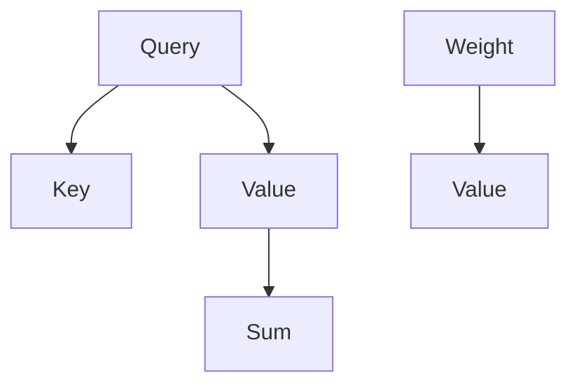

**多头自注意力**：

为了提高模型的表示能力，Transformer引入了多头自注意力机制。多头自注意力通过多个独立的自注意力层并行处理输入序列，每个头都能捕获不同的依赖关系，然后将这些头的结果拼接起来，输出一个更丰富的表示。

2. **BERT模型**：

BERT（Bidirectional Encoder Representations from Transformers）是谷歌在2018年提出的一种基于Transformer的双向编码模型。BERT的核心思想是，通过双向编码，模型能够同时考虑序列中的前后信息，从而提高语言理解的能力。

**双向编码**：

BERT的编码器由多个自注意力层组成，每层都能同时处理输入序列的前后信息。具体来说，BERT的输入包括一个[Mask]标记、一个[Segment]标记以及文本的单词序列。其中，[Mask]标记用于随机遮盖部分单词，以训练模型预测遮盖的单词；[Segment]标记用于区分句子中的不同部分（如问答对中的问题与答案）。

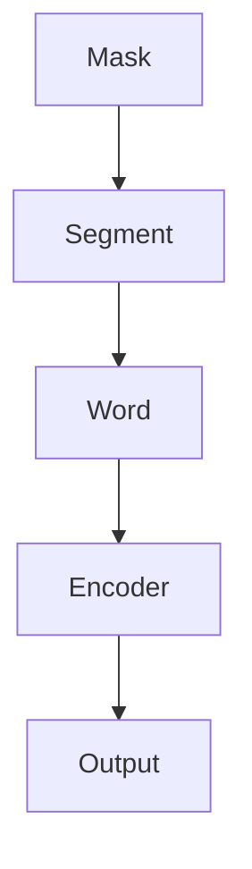

**掩码机制**：

BERT通过掩码机制（Masking）对输入文本进行随机遮盖，从而强迫模型学习到语言的上下文信息。在训练过程中，模型需要预测被遮盖的单词，这有助于提高模型的泛化能力。

3. **预训练与微调**：

预训练与微调是现代自然语言处理模型的主要训练策略。预训练通过在大规模无标注数据上训练，使模型学习到语言的通用特征；微调则是在预训练的基础上，将模型应用于特定任务，通过有标注的数据进一步优化模型参数，从而提高模型在特定任务上的性能。

**预训练**：

预训练包括两个主要任务：Masked Language Model（MLM）和Next Sentence Prediction（NSP）。MLM任务通过随机遮盖输入文本中的部分单词，训练模型预测这些被遮盖的单词；NSP任务通过预测两个连续句子之间是否存在语义关系，训练模型捕捉句子的连贯性。

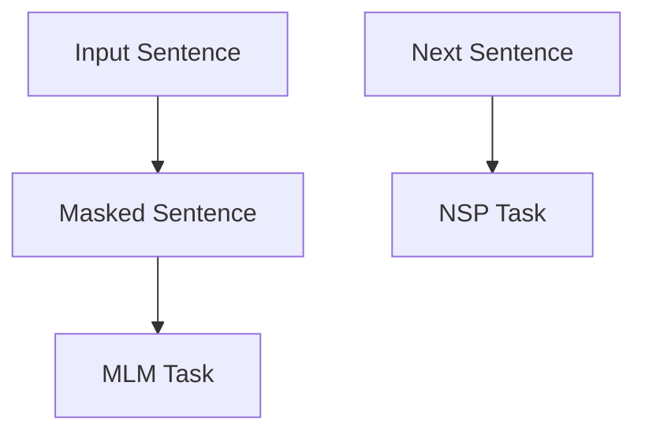

**微调**：

微调是在预训练的基础上，针对特定任务进行进一步的训练。通过有标注的数据，模型能够学习到任务特定的特征，从而提高在目标任务上的性能。常见的微调任务包括文本分类、命名实体识别、机器翻译等。

#### 1.3 大语言模型的架构

大语言模型的架构通常包括编码器（Encoder）和解码器（Decoder）两个部分。编码器负责将输入文本编码成固定长度的向量表示，解码器则负责根据编码器的输出生成目标文本。

1. **编码器**：

编码器的核心是Transformer模型，其通过多个自注意力层和前馈网络对输入文本进行编码。自注意力层允许模型在编码过程中自动学习到不同位置之间的依赖关系，从而提高了编码的表示能力。

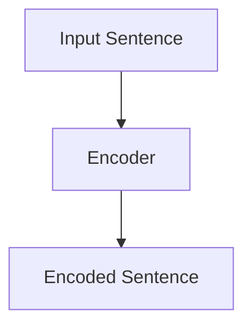

2. **解码器**：

解码器也基于Transformer模型，其通过多个自注意力层和前馈网络生成目标文本。在解码过程中，解码器会根据编码器的输出和已经生成的文本，生成下一个位置的输出。

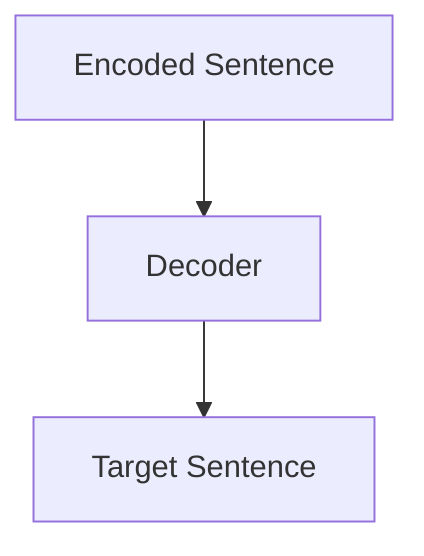

#### 1.4 大语言模型的应用

大语言模型在自然语言处理领域有广泛的应用，包括但不限于以下方面：

1. **自然语言生成**：大语言模型可以生成高质量的文章、对话和代码。例如，GPT系列模型被广泛应用于自动写作、对话生成和代码生成等领域。

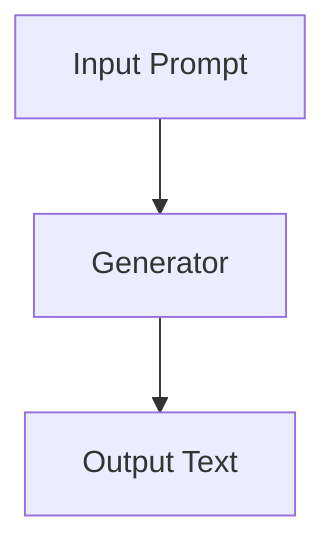

2. **机器翻译**：大语言模型实现了高质量的多语言翻译，例如BERT模型在多个翻译任务上取得了很好的成绩。

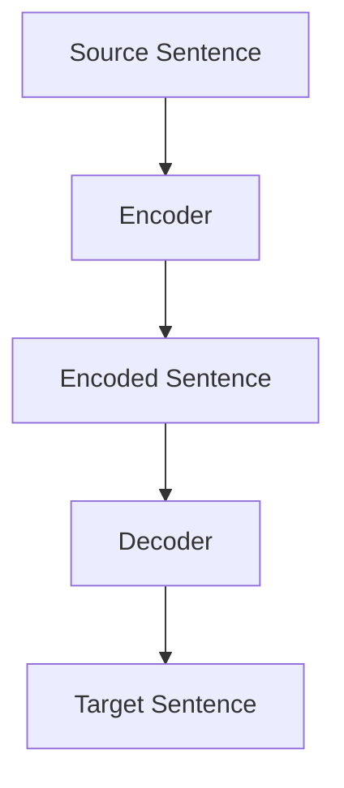

3. **问答系统**：大语言模型可以提供准确、快速的回答，广泛应用于搜索引擎、智能客服等领域。

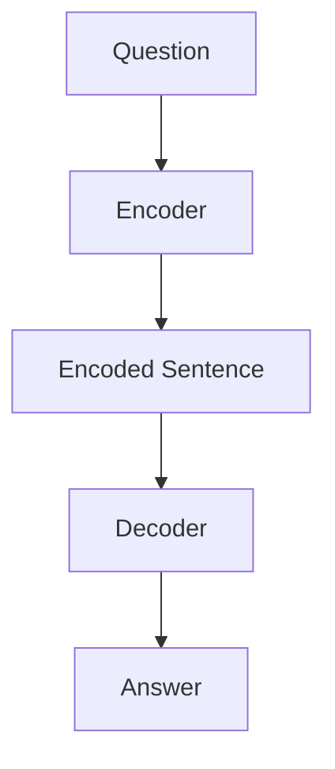

4. **文本摘要**：大语言模型可以生成文本摘要，抽取式摘要和生成式摘要方法都可以通过大语言模型实现。

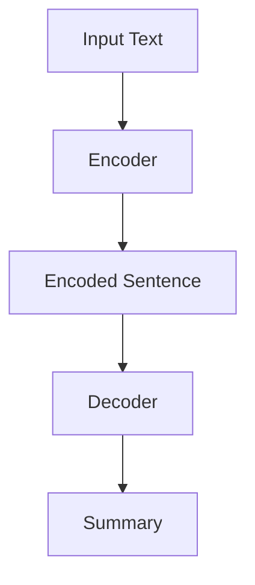

5. **情感分析**：大语言模型可以分析文本的情感倾向，应用于市场调研、舆情分析等领域。

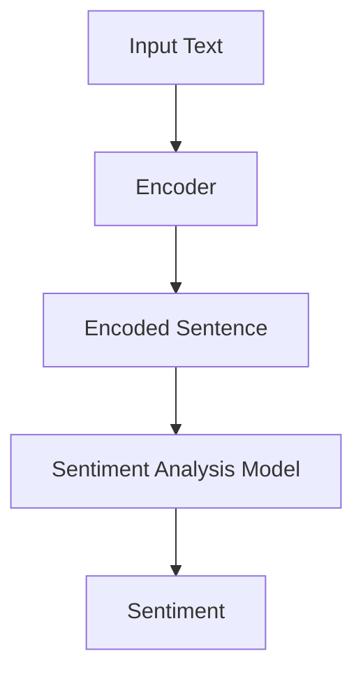

综上所述，大语言模型作为一种强大的自然语言处理工具，在多个领域展现出了巨大的应用潜力。随着技术的不断进步，大语言模型的应用前景将更加广阔。

---

在接下来的章节中，我们将进一步探讨大语言模型的数学基础、核心算法以及预训练和工程实践等方面的内容。敬请期待！

---

### 第2章: 语言模型基本原理

语言模型是自然语言处理（NLP）的基础之一，其核心任务是预测给定前文序列后可能出现的下一个单词或序列。本章节将深入探讨语言模型的数学基础、核心算法以及训练与优化过程。

#### 2.1 语言模型数学基础

语言模型的构建离不开概率论和线性代数的基础知识。以下是这些基础知识在语言模型中的应用：

1. **概率论**：

- **概率**：概率用于量化事件发生的可能性，是概率论的基本概念。在语言模型中，我们使用概率来预测下一个单词的概率分布。

- **贝叶斯定理**：贝叶斯定理是一种在已知某些证据的条件下，计算某个假设概率的方法。在语言模型中，贝叶斯定理可以用于根据已有的前文序列计算下一个单词的概率分布。

2. **线性代数**：

- **矩阵运算**：矩阵是线性代数的基本概念，用于表示和操作数据。在语言模型中，矩阵用于存储单词的向量表示和权重。

- **向量空间**：向量空间是一个集合，其中的元素是向量。在语言模型中，单词被表示为向量，向量空间用于表示单词之间的关系。

#### 2.2 语言模型核心算法

语言模型的核心算法包括N-gram模型和神经网络模型。以下是这些算法的基本原理：

1. **N-gram模型**：

N-gram模型是一种基于历史N个单词预测下一个单词的统计模型。其基本思想是，根据前N个单词的概率分布来预测下一个单词。具体来说，N-gram模型将输入文本分成连续的N个单词序列，然后计算每个序列的概率，并选择概率最大的序列作为预测结果。

**N-gram模型算法伪代码**：

```python
def n_gram_predict(text, n):
    # 计算前N个单词的概率分布
    probabilities = calculate_probabilities(text, n)
    # 选择概率最大的单词序列作为预测结果
    predicted_word = select_max_probability_sequence(probabilities)
    return predicted_word
```

2. **神经网络模型**：

神经网络模型是一种基于深度学习技术的语言模型，其通过多层神经网络对输入文本进行编码和解码。神经网络模型能够自动学习到单词之间的复杂关系，并在预测任务中取得更好的性能。

**神经网络模型算法伪代码**：

```python
def neural_network_predict(text, model):
    # 编码输入文本
    encoded_text = model.encode(text)
    # 解码编码后的文本
    predicted_sequence = model.decode(encoded_text)
    return predicted_sequence
```

#### 2.3 语言模型训练与优化

语言模型的训练与优化是构建高性能语言模型的关键步骤。以下是训练与优化过程的基本步骤：

1. **训练过程**：

- **前向传播**：在训练过程中，模型根据输入文本进行前向传播，计算损失函数，并生成预测结果。

- **反向传播**：在模型生成预测结果后，通过反向传播计算损失函数关于模型参数的梯度。

- **参数更新**：利用梯度下降等优化算法更新模型参数，以减少损失函数的值。

2. **优化算法**：

- **梯度下降**：梯度下降是一种常用的优化算法，其通过计算损失函数的梯度来更新模型参数。

- **Adam优化器**：Adam优化器是一种自适应的梯度下降算法，其通过计算一阶矩估计和二阶矩估计来更新模型参数。

**训练过程伪代码**：

```python
def train_model(model, data, epochs):
    for epoch in range(epochs):
        for text in data:
            # 前向传播
            predicted_sequence = model.predict(text)
            # 计算损失函数
            loss = calculate_loss(predicted_sequence, text)
            # 反向传播
            gradients = model.backward(loss)
            # 参数更新
            model.update_params(gradients)
```

3. **模型评估**：

在训练过程中，需要对模型进行评估，以确定模型的性能。常见的评估指标包括准确率、损失函数值等。

**模型评估伪代码**：

```python
def evaluate_model(model, data):
    total_loss = 0
    for text in data:
        predicted_sequence = model.predict(text)
        loss = calculate_loss(predicted_sequence, text)
        total_loss += loss
    average_loss = total_loss / len(data)
    return average_loss
```

综上所述，语言模型基本原理的掌握是构建高性能语言模型的基础。通过对概率论、线性代数、N-gram模型和神经网络模型等知识的理解，我们可以更好地设计、训练和优化语言模型，从而在实际应用中取得更好的效果。

---

在下一章节中，我们将继续探讨大规模语言模型预训练的方法和挑战。敬请期待！

---

#### 2.1 语言模型数学基础

语言模型的构建依赖于概率论和线性代数的基础知识。以下是这些基础知识在语言模型中的应用。

1. **概率论**：

- **概率分布**：语言模型中的每个单词都被表示为一个概率分布，该分布表示在给定前文条件下，该单词出现的概率。常用的概率分布包括高斯分布、伯努利分布等。

- **条件概率**：在语言模型中，条件概率用于表示在已知某个条件下的概率。例如，在给定前文“我喜欢”的情况下，下一个单词是“苹果”的概率。

- **贝叶斯定理**：贝叶斯定理是概率论中的一个重要工具，它用于计算在已知某个条件下另一个事件的概率。在语言模型中，贝叶斯定理可以用于计算给定前文序列时下一个单词的概率。

2. **线性代数**：

- **矩阵运算**：在语言模型中，矩阵用于表示单词之间的依赖关系。矩阵乘法和求逆等运算对于语言模型的训练和推理至关重要。

- **向量空间**：语言模型中的单词和句子可以被表示为高维向量。向量空间理论提供了对语言模型中的单词和句子进行加法和标量乘法的数学基础。

#### 2.2 语言模型核心算法

语言模型的核心算法主要包括基于N-gram的统计模型和基于神经网络的深度学习模型。

1. **N-gram模型**：

N-gram模型是一种基于历史N个单词预测下一个单词的统计模型。其基本思想是，利用前N个单词的历史信息来预测下一个单词。

**N-gram模型算法原理**：

- **计算N-gram概率**：对于输入的文本序列，计算每个N-gram的概率。N-gram的概率可以通过统计文本中每个N-gram出现的频率来计算。

- **概率分布预测**：对于给定的前文序列，计算该序列下每个单词的概率分布。这个分布表示在给定前文条件下，每个单词出现的概率。

**N-gram模型伪代码**：

```python
def n_gram_probability(text, n):
    # 统计N-gram频率
    n_gram_freq = count_n_gram_frequencies(text, n)
    # 计算N-gram概率
    n_gram_prob = normalize(n_gram_freq)
    return n_gram_prob

def predict_next_word(text, n):
    # 计算前N-gram的概率分布
    n_gram_prob = n_gram_probability(text, n)
    # 选择概率最大的单词
    next_word = select_max_probability_word(n_gram_prob)
    return next_word
```

2. **神经网络模型**：

神经网络模型是一种基于深度学习技术的语言模型。它通过多层神经网络对输入文本进行编码和解码，从而实现语言的理解和生成。

**神经网络模型算法原理**：

- **编码器**：编码器负责将输入文本编码成一个固定长度的向量表示。通常，编码器采用循环神经网络（RNN）或Transformer等结构。

- **解码器**：解码器负责根据编码器的输出生成目标文本。解码器也采用循环神经网络（RNN）或Transformer等结构。

- **损失函数**：神经网络模型的损失函数通常使用交叉熵损失函数。交叉熵损失函数用于衡量模型预测的概率分布与真实分布之间的差异。

**神经网络模型伪代码**：

```python
def encode(text, encoder):
    # 编码输入文本
    encoded_text = encoder.encode(text)
    return encoded_text

def decode(encoded_text, decoder):
    # 解码编码后的文本
    predicted_text = decoder.decode(encoded_text)
    return predicted_text

def train_model(encoder, decoder, data, loss_function):
    for text, target in data:
        # 编码输入文本
        encoded_text = encode(text, encoder)
        # 解码编码后的文本
        predicted_text = decode(encoded_text, decoder)
        # 计算损失函数
        loss = loss_function(predicted_text, target)
        # 反向传播
        gradients = compute_gradients(loss, decoder)
        # 更新参数
        decoder.update_params(gradients)
```

#### 2.3 语言模型训练与优化

语言模型的训练和优化是构建高性能语言模型的关键步骤。以下是训练和优化过程的基本步骤：

1. **数据预处理**：

- **文本清洗**：去除文本中的无关信息，如标点符号、停用词等。

- **分词**：将文本分成单词或子词，以便于模型处理。

- **向量表示**：将单词或子词转换为向量表示，以便于神经网络处理。

2. **模型初始化**：

- **编码器初始化**：初始化编码器的参数。

- **解码器初始化**：初始化解码器的参数。

3. **模型训练**：

- **前向传播**：根据输入文本和目标文本，计算模型预测的概率分布和损失函数。

- **反向传播**：计算损失函数关于模型参数的梯度，并更新模型参数。

- **优化算法**：使用梯度下降、Adam等优化算法更新模型参数，以最小化损失函数。

4. **模型评估**：

- **测试集评估**：使用测试集评估模型的性能，计算模型的准确率、损失函数值等指标。

- **模型调整**：根据评估结果调整模型参数，以提高模型的性能。

5. **模型部署**：

- **模型压缩**：对模型进行压缩，减小模型大小，以便于部署。

- **模型部署**：将模型部署到生产环境，如API服务、移动应用等。

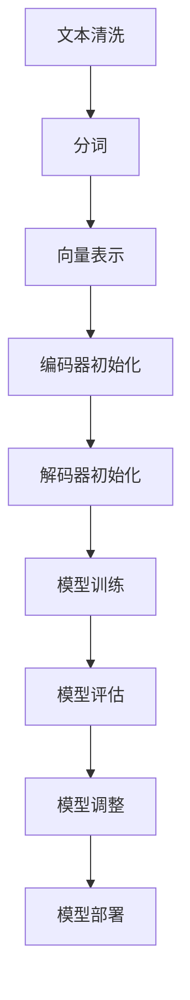

综上所述，语言模型的数学基础、核心算法和训练优化过程是构建高性能语言模型的关键步骤。通过深入理解这些基础知识，我们可以更好地设计和优化语言模型，从而在实际应用中取得更好的效果。

---

在下一章节中，我们将探讨大规模语言模型的预训练方法。敬请期待！

---

### 第3章: 大规模语言模型预训练

大规模语言模型预训练是自然语言处理领域的一项关键技术，它通过在大规模数据集上进行预训练，使模型能够学习到语言的通用特征，从而在特定任务上表现出更高的性能。本章将详细介绍大规模语言模型预训练的目标、方法以及相关实例，并探讨预训练过程中的挑战和优化策略。

#### 3.1 预训练目标与方法

**预训练目标**：

大规模语言模型预训练的主要目标是通过无监督学习方式，使模型能够自动学习到语言的通用特征。这些特征包括但不限于：

- 语言语法规则：模型能够理解词汇的顺序、句子的结构等。
- 语言语义：模型能够理解单词和短语的意义以及它们之间的关系。
- 语言风格和文体：模型能够学习到不同风格和文体的语言特征。

**预训练方法**：

预训练方法主要包括自监督学习和迁移学习。

- **自监督学习**：自监督学习是一种利用未标注数据的学习方法。在语言模型的预训练中，自监督学习通常通过以下任务实现：
  - **掩码语言模型（Masked Language Model，MLM）**：随机遮盖输入文本中的部分单词，并让模型预测这些被遮盖的单词。
  - **下一个句子预测（Next Sentence Prediction，NSP）**：从两个连续的句子中随机选择一个句子，并预测它们是否是连续的。

- **迁移学习**：迁移学习是一种利用已经在大规模数据集上预训练好的模型，将其应用于新的任务中的方法。在语言模型的预训练中，迁移学习可以通过以下方式实现：
  - **预训练模型作为特征提取器**：使用预训练模型对新的任务数据进行特征提取，然后再将特征输入到特定任务的网络中。
  - **微调预训练模型**：在预训练模型的基础上，针对特定任务进行微调，进一步优化模型在目标任务上的性能。

#### 3.2 大规模语言模型实例

**GPT系列模型**：

GPT（Generative Pre-trained Transformer）系列模型是OpenAI开发的系列模型，包括GPT、GPT-2和GPT-3。这些模型都是基于Transformer架构，通过自监督学习进行预训练。

- **GPT**：GPT是第一个GPT系列模型，它由12层Transformer自注意力层组成，参数量约为1.17亿。
- **GPT-2**：GPT-2是GPT的扩展版本，其参数量增加到15亿，并通过更长的上下文窗口和更大的模型深度，提高了模型的生成能力。
- **GPT-3**：GPT-3是GPT系列模型的最新版本，其参数量达到1750亿，是当前已知最大的语言模型。GPT-3通过引入更大的模型规模和更复杂的自注意力机制，实现了更高的文本生成质量和理解能力。

**BERT模型**：

BERT（Bidirectional Encoder Representations from Transformers）是由Google开发的预训练Transformer模型，其通过双向编码实现了对文本的深度理解。

- **BERT的结构**：BERT模型由两个部分组成：编码器和解码器。编码器通过多个Transformer自注意力层对输入文本进行编码，解码器则通过类似的结构生成输出文本。
- **BERT的预训练任务**：BERT的预训练任务包括掩码语言模型（MLM）和下一个句子预测（NSP）。MLM任务用于训练模型预测被遮盖的单词，NSP任务用于预测两个句子是否是连续的。

#### 3.3 大规模语言模型的挑战与优化

**计算资源消耗**：

大规模语言模型预训练需要大量的计算资源，特别是在训练过程中。以下是一些优化策略：

- **分布式训练**：通过将模型拆分为多个部分，并分布式地训练，可以减少单台设备的计算负担。
- **模型并行**：在训练过程中，可以使用模型并行技术，将模型的不同部分并行地训练，以提高训练速度。
- **混合精度训练**：使用混合精度训练，即结合浮点数和整数的运算，可以在不牺牲精度的情况下提高训练速度和降低计算成本。

**模型优化**：

为了提高大规模语言模型的性能，以下是一些常见的优化策略：

- **模型剪枝**：通过剪枝模型中的冗余参数，可以减少模型的大小和计算量。
- **量化**：量化技术可以将模型的浮点数参数转换为整数值，从而减少模型的存储和计算需求。
- **知识蒸馏**：通过知识蒸馏，将大规模模型的复杂表示能力传递给小规模模型，从而在保留性能的同时降低模型的计算和存储需求。

**计算资源消耗优化**：

- **GPU优化**：合理分配GPU资源，避免资源浪费，例如使用多GPU训练模型。
- **TPU优化**：TPU（Tensor Processing Unit）是专为深度学习任务设计的硬件，其可以显著提高训练速度。

**模型优化策略**：

- **模型剪枝**：通过剪枝模型中的冗余参数，可以减少模型的大小和计算量。剪枝技术包括结构剪枝和权重剪枝。
- **量化**：量化技术可以将模型的浮点数参数转换为整数值，从而减少模型的存储和计算需求。量化方法包括全量化、部分量化等。
- **知识蒸馏**：通过知识蒸馏，将大规模模型的复杂表示能力传递给小规模模型，从而在保留性能的同时降低模型的计算和存储需求。知识蒸馏包括软标签蒸馏和硬标签蒸馏。

综上所述，大规模语言模型预训练是自然语言处理领域的一项关键技术。通过自监督学习和迁移学习等方法，模型能够学习到语言的通用特征，从而在特定任务上表现出更高的性能。然而，大规模语言模型预训练面临着计算资源消耗和模型优化等挑战。通过分布式训练、模型剪枝、量化、知识蒸馏等优化策略，可以有效地降低计算成本并提高模型的性能。

---

在下一章节中，我们将深入探讨语言模型在自然语言处理中的应用，包括自然语言生成、机器翻译和问答系统等。敬请期待！

---

### 第4章: 语言模型在自然语言处理中的应用

语言模型在自然语言处理（NLP）领域有着广泛的应用，其强大的语言理解和生成能力使得它能够解决多种实际问题。本章节将介绍语言模型在自然语言生成、机器翻译、问答系统等任务中的应用，并探讨其关键技术。

#### 4.1 自然语言生成

自然语言生成（Natural Language Generation，NLG）是语言模型的一个重要应用领域。NLG技术能够自动生成文本，广泛应用于聊天机器人、自动写作、摘要生成等领域。

**文本摘要**：

文本摘要分为抽取式摘要和生成式摘要两种方法。

- **抽取式摘要**：抽取式摘要方法从原始文本中提取关键句子或短语，形成摘要。这种方法通常使用规则或机器学习方法来识别和选择关键信息。

- **生成式摘要**：生成式摘要方法使用语言模型生成新的摘要文本。这种方法通常使用序列到序列（Seq2Seq）模型，如GPT或BERT等，通过输入原始文本，生成一个简洁且连贯的摘要。

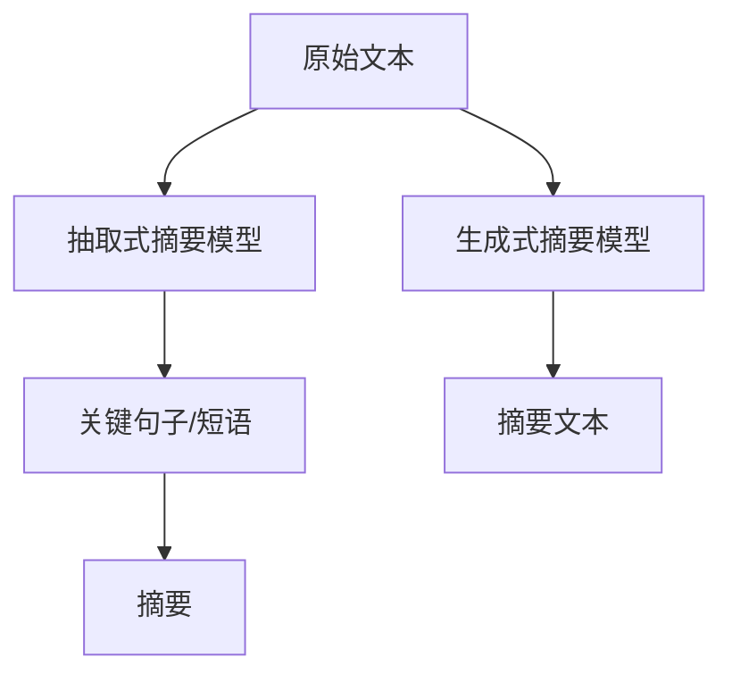

**对话系统**：

对话系统是另一个重要的自然语言生成应用。对话系统通常由对话管理（Dialogue Management）和自然语言生成（NLG）两部分组成。

- **对话管理**：对话管理负责控制对话的流程，包括理解用户意图、选择适当的响应等。

- **自然语言生成**：自然语言生成负责将对话管理生成的内部表示转换为自然语言文本。语言模型在这一过程中起着关键作用，例如GPT或BERT等模型，能够生成流畅且符合对话场景的回复。

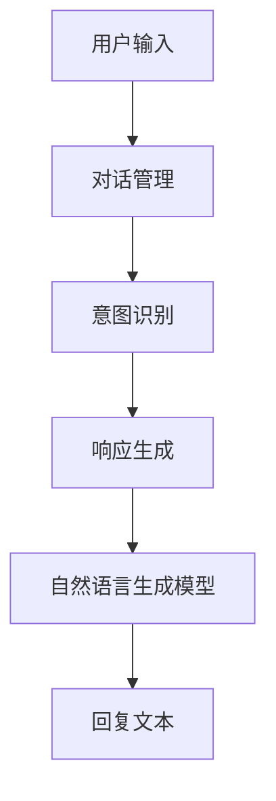

**代码生成**：

代码生成是自然语言生成在软件开发领域的应用。语言模型可以通过学习大量的代码文本，生成新的代码片段。这种方法有助于提高开发效率，减轻开发者的负担。

- **代码模板生成**：语言模型可以生成基于特定模板的代码。例如，在给定函数签名和输入输出类型的情况下，模型可以生成相应的函数实现。

- **代码补全**：语言模型可以预测代码中缺失的部分，从而帮助开发者快速完成代码编写。

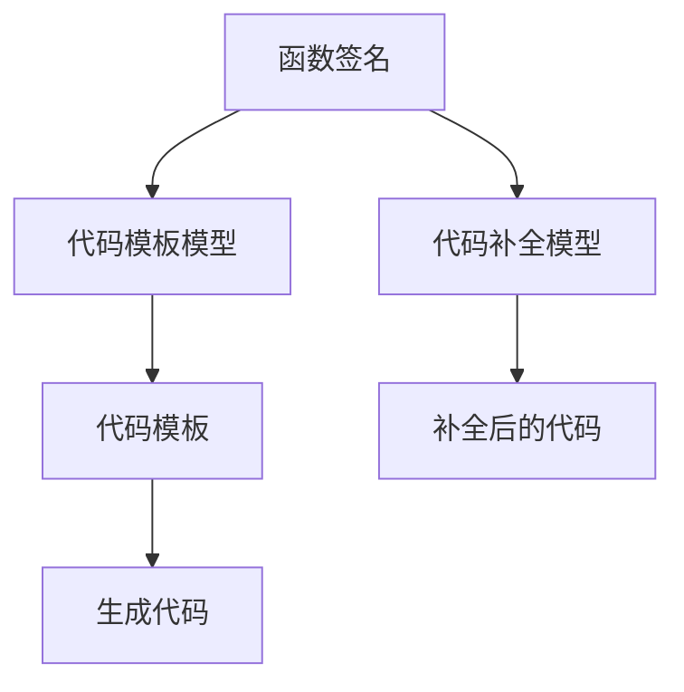

#### 4.2 机器翻译

机器翻译（Machine Translation，MT）是语言模型的另一个重要应用领域。机器翻译技术能够将一种语言的文本自动翻译成另一种语言，广泛应用于跨语言通信、多语言文档处理等领域。

**神经机器翻译**：

神经机器翻译（Neural Machine Translation，NMT）是基于深度学习技术的机器翻译方法。NMT通过编码器和解码器模型，实现高效的语言转换。

- **编码器**：编码器负责将源语言文本编码成固定长度的向量表示。

- **解码器**：解码器负责根据编码器的输出生成目标语言文本。

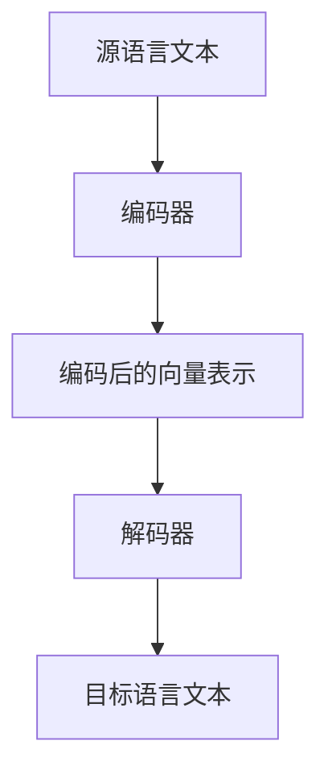

**注意力机制**：

注意力机制是神经机器翻译中的一个关键组件。注意力机制通过计算编码器和解码器之间的依赖关系，实现上下文信息的有效传递。

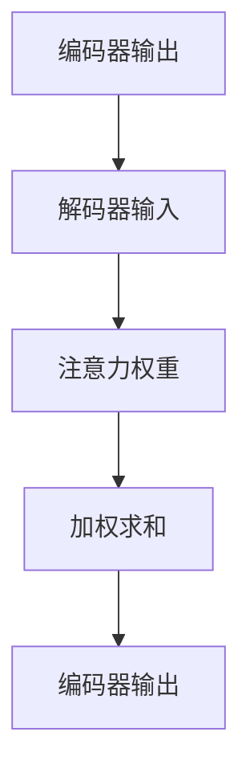

**多语言模型**：

多语言模型（Multilingual Model）是一种能够处理多种语言输入输出的语言模型。多语言模型通过跨语言特征学习，实现了多种语言之间的翻译。

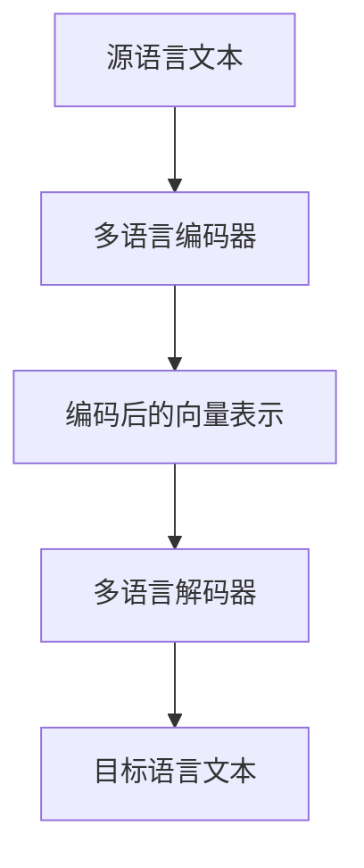

#### 4.3 问答系统

问答系统（Question Answering System）是一种能够自动回答用户问题的系统。问答系统通常由两个关键组件组成：知识图谱和问答模型。

**知识图谱**：

知识图谱是一种用于存储和表示实体及其关系的图形数据库。在问答系统中，知识图谱用于存储事实信息，如“北京是中国的首都”。

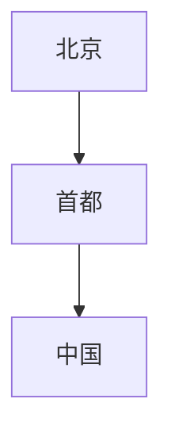

**问答模型**：

问答模型负责解析用户问题，并在知识图谱中检索相关信息，生成回答。问答模型通常基于BERT等预训练语言模型，通过微调适应特定的问答任务。

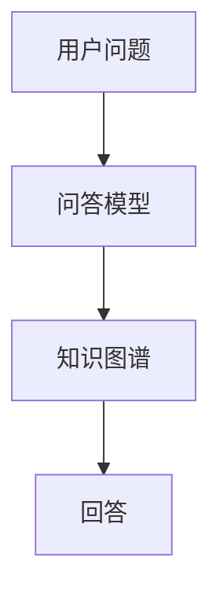

**基于BERT的问答模型**：

BERT（Bidirectional Encoder Representations from Transformers）是一种预训练Transformer模型，其能够捕捉到输入文本中的双向信息。基于BERT的问答模型通过预训练和微调，实现了高效的问答能力。

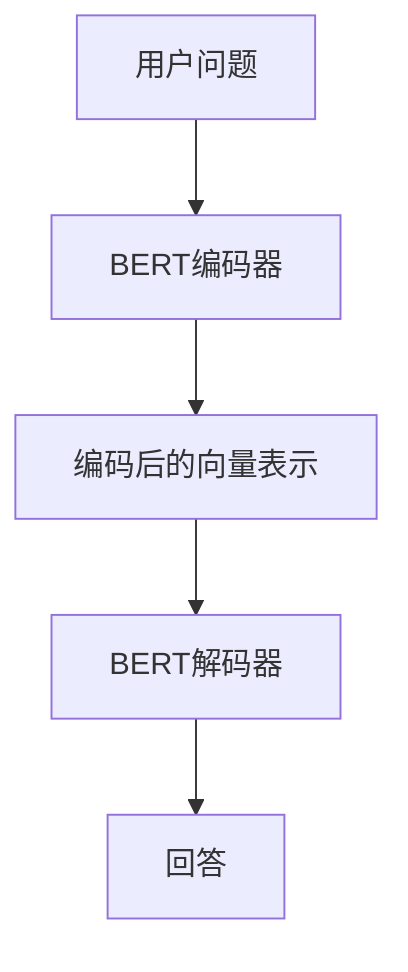

综上所述，语言模型在自然语言处理领域具有广泛的应用。通过自然语言生成、机器翻译、问答系统等任务，语言模型能够自动理解和生成文本，实现人机交互和跨语言沟通。随着深度学习技术的不断发展，语言模型的应用前景将更加广阔。

---

在下一章节中，我们将探讨语言模型在跨领域应用中的挑战。敬请期待！

---

### 第5章: 语言模型在跨领域应用中的挑战

尽管语言模型在自然语言处理（NLP）领域取得了显著的进展，但其在跨领域应用中仍然面临诸多挑战。这些挑战主要集中在领域适应性、数据稀缺性、模型泛化能力以及跨领域知识整合等方面。本章将深入探讨这些挑战，并提出相应的解决方案。

#### 5.1 领域适应性

领域适应性是指语言模型在不同领域中的应用效果。不同领域的语言特征和任务需求差异较大，这给语言模型的跨领域应用带来了挑战。

**跨领域语言模型**：

为了提高语言模型的领域适应性，研究人员提出了一系列跨领域语言模型，这些模型通过在不同领域的数据上进行训练，以提高其在不同领域中的性能。

- **领域自适应**：领域自适应技术通过迁移学习，将源领域（高资源领域）的知识迁移到目标领域（低资源领域）。常见的领域自适应方法包括领域自适应蒸馏（Domain Adaptation Distillation）和领域自适应对抗训练（Domain Adaptation Adversarial Training）。

- **跨领域预训练**：跨领域预训练是指通过大规模的多领域数据集对语言模型进行预训练，使其能够同时学习到不同领域的知识。这种方法有助于提高模型在跨领域任务中的性能。

**实例**：

- **医学领域**：在医学领域，语言模型需要处理大量的专业术语和复杂的医学知识。通过跨领域预训练，模型能够更好地理解和生成医学文本，提高诊断和治疗方案生成的能力。

- **金融领域**：在金融领域，语言模型需要处理市场报告、金融新闻等数据。通过跨领域预训练，模型能够识别和理解金融领域的特定术语和模式，为金融分析提供支持。

#### 5.2 领域适应性方法

为了提高语言模型的领域适应性，研究人员提出了一系列方法，包括迁移学习、领域自适应、多任务学习和数据增强等。

**迁移学习**：

迁移学习是一种将已有模型的特征迁移到新任务上的方法。在跨领域应用中，迁移学习可以帮助模型利用源领域的知识，提高目标领域的性能。

- **源领域知识迁移**：通过在源领域（高资源领域）上预训练模型，然后将模型迁移到目标领域（低资源领域），可以提高模型在目标领域的性能。

- **特征共享**：在迁移学习过程中，模型的部分层或特征会被共享，这样可以减少模型在目标领域的训练时间，并提高模型的适应性。

**领域自适应**：

领域自适应技术通过调整模型参数，使模型在源领域和目标领域之间保持平衡。常见的领域自适应方法包括：

- **领域自适应蒸馏**：领域自适应蒸馏通过将源领域模型的输出传递给目标领域模型，帮助目标领域模型学习到源领域的知识。

- **领域自适应对抗训练**：领域自适应对抗训练通过生成对抗网络（GAN），使目标领域模型能够模拟源领域的数据分布，从而提高模型在目标领域的性能。

**多任务学习**：

多任务学习是一种同时训练多个相关任务的模型方法。通过多任务学习，模型可以在不同任务之间共享知识和经验，提高在跨领域任务中的适应性。

- **共享参数**：在多任务学习中，模型的某些层或参数可以共享，这样可以减少模型在各个任务上的参数数量，并提高模型在不同任务上的性能。

- **任务关联**：通过设计关联任务，模型可以同时学习到不同任务的特征，从而提高跨领域任务的性能。

**数据增强**：

数据增强是通过生成或修改原始数据，增加模型训练数据的多样性，从而提高模型的泛化能力和领域适应性。

- **数据扩充**：通过重复、裁剪、旋转等方法，增加原始数据的样本数量。

- **伪标签**：利用已有模型为原始数据生成伪标签，从而增加训练数据的标签多样性。

#### 5.3 面向特定领域的语言模型

为了更好地解决特定领域的挑战，研究人员提出了一系列面向特定领域的语言模型。这些模型通过针对特定领域的知识进行训练，提高了模型在特定领域的性能。

**医学领域**：

在医学领域，语言模型需要处理大量的专业术语和复杂的医学知识。面向医学领域的语言模型通过在医学数据上进行预训练，提高了模型在医学文本理解、诊断和治疗方案生成等方面的性能。

- **医学文本分类**：面向医学领域的语言模型可以用于医学文本分类任务，如疾病诊断、治疗方案推荐等。

- **医学问答系统**：面向医学领域的语言模型可以构建高效的医学问答系统，为医生和患者提供准确的医疗信息。

**金融领域**：

在金融领域，语言模型需要处理市场报告、金融新闻等数据。面向金融领域的语言模型通过在金融数据上进行预训练，提高了模型在金融分析、股票预测等方面的性能。

- **金融文本分类**：面向金融领域的语言模型可以用于金融文本分类任务，如股票市场预测、公司财务状况分析等。

- **金融对话系统**：面向金融领域的语言模型可以构建智能金融对话系统，为用户提供个性化的金融咨询和服务。

**法律领域**：

在法律领域，语言模型需要处理大量的法律文本和复杂的法律知识。面向法律领域的语言模型通过在法律数据上进行预训练，提高了模型在法律文本理解、合同审核、法律咨询等方面的性能。

- **法律文本分类**：面向法律领域的语言模型可以用于法律文本分类任务，如案件分类、合同审核等。

- **法律问答系统**：面向法律领域的语言模型可以构建智能法律问答系统，为用户提供法律咨询和解答。

综上所述，语言模型在跨领域应用中面临诸多挑战，但通过领域适应性方法、面向特定领域的语言模型以及迁移学习、数据增强等技术，可以有效地解决这些挑战，提高模型在不同领域中的应用性能。随着技术的不断发展，语言模型在跨领域应用中的前景将更加广阔。

---

在下一章节中，我们将探讨语言模型的工程实践，包括开发环境搭建、模型开发流程和模型部署与优化。敬请期待！

---

### 第6章: 语言模型工程实践

在实际应用中，构建和部署高效的语言模型是一项复杂的工程任务。本章将详细探讨语言模型工程实践的关键步骤，包括开发环境搭建、模型开发流程以及模型部署与优化。

#### 6.1 开发环境搭建

**深度学习框架**：

选择合适的深度学习框架是搭建开发环境的第一步。常见的深度学习框架包括TensorFlow、PyTorch等。以下是搭建开发环境的基本步骤：

1. **环境配置**：安装所需的操作系统（如Ubuntu或Windows），并配置Python环境。
2. **框架安装**：通过pip命令安装深度学习框架，如`pip install tensorflow`或`pip install torch`。
3. **依赖库安装**：安装框架所需的依赖库，如NumPy、Pandas等。
4. **GPU支持**：如果使用GPU进行训练，需要安装CUDA和cuDNN库，并配置相关环境变量。

**硬件配置**：

为了高效地训练语言模型，硬件配置至关重要。以下是硬件配置的建议：

1. **CPU**：选择性能较高的CPU，如Intel Xeon或AMD Ryzen系列。
2. **GPU**：选择支持CUDA和cuDNN的GPU，如NVIDIA GeForce RTX 3080或Tesla V100。
3. **内存**：确保有足够的内存（RAM）以支持大规模模型的训练。
4. **存储**：选择高速存储设备，如NVMe SSD，以提高数据读写速度。

#### 6.2 模型开发流程

**数据预处理**：

数据预处理是模型开发的重要环节，其质量直接影响模型的性能。以下是数据预处理的基本步骤：

1. **数据收集**：从互联网、数据库或第三方数据提供商收集原始数据。
2. **数据清洗**：去除无关数据、纠正错误、填补缺失值等。
3. **数据标注**：对文本数据标注实体、标签或分类等。
4. **数据切分**：将数据分为训练集、验证集和测试集。

**模型训练**：

模型训练是语言模型开发的核

