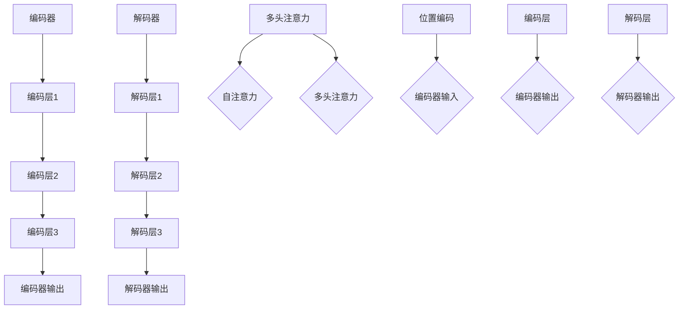

                 

### 《大语言模型应用指南：Transformer的原始输入》

> **关键词：** 大语言模型，Transformer，自注意力机制，位置编码，训练技巧，应用案例

> **摘要：** 本文章旨在为读者提供一份全面而详细的大语言模型应用指南。文章首先介绍了大语言模型的基本概念和Transformer架构，随后深入探讨了自注意力机制、位置编码等核心算法原理。通过伪代码和Mermaid流程图，文章对数学基础和Transformer模型架构进行了详细讲解。此外，文章还介绍了大语言模型训练技巧、应用案例以及在实际项目中的应用，为读者提供了丰富的实践经验和案例分析。最后，文章对未来展望了大语言模型的技术发展趋势和挑战。

### 目录

#### 第一部分：大语言模型基础

**第1章：大语言模型概述**

- 1.1 大语言模型的起源与发展
  - 1.1.1 大语言模型的定义
  - 1.1.2 大语言模型的发展历程
- 1.2 Transformer架构简介
  - 1.2.1 Transformer的基本概念
  - 1.2.2 Transformer的核心模块
  - **1.2.3 Transformer架构的Mermaid流程图**

**第2章：Transformer算法原理**

- 2.1 自注意力机制
  - 2.1.1 自注意力机制的原理
  - 2.1.2 自注意力机制的伪代码实现
- 2.2 位置编码
  - 2.2.1 位置编码的作用
  - 2.2.2 位置编码的方法与实现
- 2.3 Transformer模型架构
  - 2.3.1 Encoder与Decoder结构
  - 2.3.2 Multi-head attention机制
  - **2.3.3 Transformer架构的Mermaid流程图**

**第3章：数学基础**

- 3.1 概率论基础
  - 3.1.1 概率分布
  - 3.1.2 贝叶斯定理
  - 3.1.3 最大似然估计与最大后验估计
- 3.2 线性代数基础
  - 3.2.1 向量与矩阵
  - 3.2.2 矩阵乘法与矩阵求导
  - 3.2.3 线性方程组求解
- 3.3 梯度下降算法
  - 3.3.1 梯度下降的基本原理
  - 3.3.2 梯度下降算法的伪代码实现

**第4章：大语言模型训练技巧**

- 4.1 数据预处理
  - 4.1.1 数据清洗
  - 4.1.2 词向量化
  - 4.1.3 数据增强
- 4.2 模型优化策略
  - 4.2.1 学习率调度策略
  - 4.2.2 批处理大小调整
  - 4.2.3 梯度裁剪
- 4.3 训练技巧与技巧
  - 4.3.1 动态学习率
  - 4.3.2 数据并行训练
  - 4.3.3 硬参数服务器

**第5章：大语言模型应用案例**

- 5.1 文本分类
  - 5.1.1 文本分类的基本概念
  - 5.1.2 基于Transformer的文本分类模型
  - **5.1.3 文本分类的伪代码实现与案例分析**
- 5.2 机器翻译
  - 5.2.1 机器翻译的基本概念
  - 5.2.2 基于Transformer的机器翻译模型
  - **5.2.3 机器翻译的伪代码实现与案例分析**
- 5.3 问答系统
  - 5.3.1 问答系统的基本概念
  - 5.3.2 基于Transformer的问答系统模型
  - **5.3.3 问答系统的伪代码实现与案例分析**

**第6章：大语言模型在实际项目中的应用**

- 6.1 搭建大型语言模型
  - 6.1.1 大型语言模型的需求分析
  - 6.1.2 搭建大型语言模型的技术栈
  - **6.1.3 大型语言模型的项目实战与源代码解读**
- 6.2 集成大型语言模型到应用
  - 6.2.1 应用场景的选择
  - 6.2.2 大型语言模型与现有系统的集成
  - **6.2.3 大型语言模型应用的实际案例分析**
- 6.3 持续优化与更新
  - 6.3.1 模型评估与性能优化
  - 6.3.2 模型持续更新与维护
  - **6.3.4 模型优化与更新的实际案例分析**

**第7章：未来展望**

- 7.1 大语言模型的技术发展趋势
  - 7.1.1 计算能力提升
  - 7.1.2 算法优化与创新
  - 7.1.3 应用领域的拓展
- 7.2 大语言模型在人工智能中的地位与作用
  - 7.2.1 大语言模型与NLP的关系
  - 7.2.2 大语言模型在其他AI领域的应用前景
- 7.3 大语言模型面临的挑战与解决方案
  - 7.3.1 数据隐私问题
  - 7.3.2 计算资源消耗
  - 7.3.3 安全性问题

#### 附录

- 附录A：大语言模型开发工具与资源
  - 7.1 TensorFlow
  - 7.2 PyTorch
  - 7.3 Hugging Face Transformers

- 附录B：常用数学公式
  - 7.1 概率分布公式
  - 7.2 线性代数公式
  - 7.3 梯度下降算法公式

- 附录C：代码实现示例
  - 7.1 文本分类实现
  - 7.2 机器翻译实现
  - 7.3 问答系统实现

---

### 第一部分：大语言模型基础

#### 第1章：大语言模型概述

**1.1 大语言模型的起源与发展**

**1.1.1 大语言模型的定义**

大语言模型（Large Language Model）是一种基于深度学习技术的自然语言处理（NLP）模型，它能够通过对大量文本数据进行预训练，从而学习到语言中的复杂结构和规则，进而实现诸如文本生成、文本分类、机器翻译等任务。大语言模型通常具有以下几个特点：

- **大规模的参数量**：大语言模型通常包含数十亿个参数，这使得它们能够捕捉到语言中的细微特征和模式。
- **深度结构**：大语言模型通常采用深度神经网络结构，如Transformer、BERT等，这些结构有助于模型更好地理解和处理语言。
- **预训练和微调**：大语言模型通常首先在大量无监督数据上进行预训练，然后通过微调在特定任务上进行优化。

**1.1.2 大语言模型的发展历程**

大语言模型的发展历程可以追溯到20世纪80年代，当时研究者开始探索基于统计方法的自然语言处理技术。随着计算能力的提升和数据量的增加，深度学习技术在NLP领域取得了显著突破。以下是几个重要的发展阶段：

- **早期模型**：如循环神经网络（RNN）和长短期记忆网络（LSTM），这些模型能够处理序列数据，但存在梯度消失和梯度爆炸等问题。
- **注意力机制**：2017年，Google提出了Transformer模型，引入了自注意力机制，解决了RNN和LSTM的梯度消失问题，并在多个NLP任务上取得了优异的性能。
- **预训练与微调**：基于Transformer模型的BERT（Bidirectional Encoder Representations from Transformers）模型在2018年提出，通过在大量无监督数据上预训练，然后在特定任务上进行微调，取得了显著的成果。
- **大型语言模型**：随着计算资源和数据量的不断增加，研究者开始尝试训练更大规模的语言模型，如GPT-3、Turing-NLG等，这些模型在多个NLP任务上达到了人类水平。

**1.2 Transformer架构简介**

**1.2.1 Transformer的基本概念**

Transformer模型是一种基于注意力机制的深度神经网络结构，最早由Google在2017年的论文《Attention Is All You Need》中提出。Transformer模型的主要特点如下：

- **自注意力机制**：Transformer模型引入了自注意力机制，能够同时关注输入序列中的所有位置信息，从而捕捉到全局上下文关系。
- **多头注意力**：Transformer模型使用多个头进行注意力计算，每个头关注输入序列的不同部分，从而提高了模型的表示能力。
- **位置编码**：由于Transformer模型没有循环结构，无法直接利用输入序列的位置信息，因此引入了位置编码来弥补这一不足。

**1.2.2 Transformer的核心模块**

Transformer模型主要由以下几个核心模块组成：

- **编码器（Encoder）**：编码器负责将输入序列编码为固定长度的向量表示，每个位置的信息都被编码到这个向量中。编码器通常包含多个堆叠的编码层（Encoder Layer），每个编码层包含多头注意力机制和前馈神经网络。
- **解码器（Decoder）**：解码器负责将编码器的输出解码为目标序列。解码器同样包含多个堆叠的解码层（Decoder Layer），每个解码层包含自注意力机制、多头注意力机制和前馈神经网络。在解码过程中，每个时间步的输出都与前一个时间步的隐藏状态进行交互。
- **多头注意力机制（Multi-head Attention）**：多头注意力机制允许模型同时关注输入序列的不同部分，从而提高模型的表示能力。多头注意力机制通过多个独立的注意力头进行计算，每个头关注输入序列的不同部分。
- **位置编码（Positional Encoding）**：由于Transformer模型没有循环结构，无法直接利用输入序列的位置信息，因此引入了位置编码。位置编码通常是一个固定长度的向量，用来表示输入序列中的每个位置。

**1.2.3 Transformer架构的Mermaid流程图**



图1-1 Transformer架构的Mermaid流程图

---

### 第一部分：大语言模型基础

#### 第2章：Transformer算法原理

Transformer模型是近年来自然语言处理（NLP）领域的一项重要突破，其核心在于引入了自注意力机制（Self-Attention）和位置编码（Positional Encoding）。本章节将详细探讨Transformer算法的基本原理，包括自注意力机制、位置编码以及Transformer模型架构。

**2.1 自注意力机制**

自注意力机制是Transformer模型的关键组成部分，它允许模型在处理输入序列时，自动关注序列中的不同位置，并利用这些位置的信息进行建模。自注意力机制的基本思想是将每个输入序列的位置映射到一个向量表示，然后通过计算这些向量之间的相似度来确定它们之间的关系。

**2.1.1 自注意力机制的原理**

自注意力机制通常通过以下步骤进行计算：

1. **输入向量表示**：将输入序列映射到一个向量表示，通常使用词向量化技术，如Word2Vec或GloVe。
2. **计算查询（Query）、键（Key）和值（Value）**：对于输入序列中的每个位置，计算其对应的查询（Query）、键（Key）和值（Value）向量。这三个向量通常具有相同的维度，且由词向量化层生成。
3. **计算注意力权重**：对于输入序列中的每个位置，计算其对应的注意力权重。注意力权重是通过计算查询向量与键向量之间的点积得到的，也可以使用缩放点积注意力（Scaled Dot-Product Attention）进行优化。
4. **计算输出**：将注意力权重与对应的值向量相乘，然后求和得到输出向量。输出向量表示了输入序列中各个位置的信息，并经过归一化处理。

**2.1.2 自注意力机制的伪代码实现**

以下是自注意力机制的伪代码实现：

```python
def scaled_dot_product_attention(q, k, v, mask=None):
    # 计算点积
    attention_scores = q @ k.T / sqrt(d_k)
    
    # 应用遮蔽掩码
    if mask is not None:
        attention_scores += mask
    
    # 应用Softmax
    attention_scores = softmax(attention_scores)
    
    # 计算加权值
    output = attention_scores @ v
    
    # 应用层归一化
    output = layer_norm(output)
    
    return output
```

**2.2 位置编码**

由于Transformer模型没有循环结构，无法直接利用输入序列的位置信息。因此，引入位置编码（Positional Encoding）来弥补这一不足。位置编码是一种特殊类型的嵌入，用来表示输入序列中的每个位置。

**2.2.1 位置编码的作用**

位置编码的作用是将输入序列的位置信息编码到模型的向量表示中，使得模型能够利用这些位置信息进行建模。位置编码有助于模型捕捉到输入序列中不同位置的语义信息，从而提高模型的性能。

**2.2.2 位置编码的方法与实现**

位置编码的方法有很多种，以下是几种常见的方法：

1. **正弦曲线位置编码**：正弦曲线位置编码通过将输入序列的位置映射到一组正弦曲线中，从而生成位置编码向量。这种方法能够生成不同频率的正弦波，使得模型能够学习到不同位置的语义信息。
2. **余弦曲线位置编码**：余弦曲线位置编码通过将输入序列的位置映射到一组余弦曲线中，从而生成位置编码向量。这种方法与正弦曲线位置编码类似，但使用余弦函数代替正弦函数。

以下是正弦曲线位置编码的伪代码实现：

```python
def positional_encoding(d_model, position, max_position_encoding):
    position_encoding = np.zeros((max_position_encoding, d_model))

    position_embedding = np.array([
        [pos / np.power(10000, 2 * (j // 2)) for j in range(d_model)]
        if pos != 0 else [0] * d_model
        for pos in range(max_position_encoding)
    ])

    if d_model % 2 == 0:
        position_embedding[:, ::2] = np.sin(position_embedding[:, ::2])
        position_embedding[:, 1::2] = np.cos(position_embedding[:, 1::2])
    else:
        position_embedding[:, 1::2] = np.sin(position_embedding[:, 1::2])
        position_embedding[:, ::2] = np.cos(position_embedding[:, ::2])

    return torch.FloatTensor(position_embedding)
```

**2.3 Transformer模型架构**

Transformer模型由编码器（Encoder）和解码器（Decoder）组成，每个部分包含多个编码层（Encoder Layer）和解码层（Decoder Layer）。编码层和解码层都包含多头注意力机制和前馈神经网络。

**2.3.1 Encoder与Decoder结构**

1. **编码器（Encoder）**：编码器负责将输入序列编码为固定长度的向量表示，每个位置的信息都被编码到这个向量中。编码器通常包含多个堆叠的编码层（Encoder Layer），每个编码层包含多头注意力机制和前馈神经网络。
2. **解码器（Decoder）**：解码器负责将编码器的输出解码为目标序列。解码器同样包含多个堆叠的解码层（Decoder Layer），每个解码层包含自注意力机制、多头注意力机制和前馈神经网络。在解码过程中，每个时间步的输出都与前一个时间步的隐藏状态进行交互。

**2.3.2 Multi-head attention机制**

多头注意力机制（Multi-head Attention）是Transformer模型的核心组件之一，它允许模型同时关注输入序列的不同部分，从而提高模型的表示能力。多头注意力机制通过多个独立的注意力头（Attention Head）进行计算，每个头关注输入序列的不同部分。

**2.3.3 Transformer架构的Mermaid流程图**


图2-1 Transformer架构的Mermaid流程图

---

### 第一部分：大语言模型基础

#### 第3章：数学基础

在深度学习领域，特别是自然语言处理（NLP）中，掌握一定的数学基础是至关重要的。本章将介绍概率论、线性代数和梯度下降算法等数学基础，为读者深入理解Transformer模型及其应用奠定基础。

**3.1 概率论基础**

概率论是深度学习中不可或缺的一部分，它提供了量化不确定性和随机性的数学工具。以下是概率论中的一些基本概念：

**3.1.1 概率分布**

概率分布描述了一个随机变量的可能取值及其对应的概率。常见的概率分布包括：

- **伯努利分布（Bernoulli Distribution）**：描述一个二项试验中成功和失败的概率。
- **正态分布（Normal Distribution）**：描述连续随机变量的概率分布，广泛应用于建模和推断。
- **伯努利分布（Bernoulli Distribution）**：描述一个二项试验中成功和失败的概率。

**3.1.2 贝叶斯定理**

贝叶斯定理是概率论中的一个基本公式，它描述了后验概率与先验概率之间的关系。贝叶斯定理的表达式如下：

\[ P(A|B) = \frac{P(B|A)P(A)}{P(B)} \]

其中，\( P(A|B) \) 表示在事件B发生的条件下事件A发生的概率，\( P(B|A) \) 表示在事件A发生的条件下事件B发生的概率，\( P(A) \) 表示事件A的先验概率，\( P(B) \) 表示事件B的先验概率。

**3.1.3 最大似然估计与最大后验估计**

最大似然估计（Maximum Likelihood Estimation, MLE）和最大后验估计（Maximum a Posteriori Estimation, MAP）是概率论中常用的参数估计方法。

- **最大似然估计（MLE）**：MLE旨在找到一组参数，使得模型在给定观测数据下的似然函数最大化。似然函数表示观测数据在模型参数下的概率。
- **最大后验估计（MAP）**：MAP旨在找到一组参数，使得模型在给定观测数据下的后验概率最大化。后验概率是先验概率与似然函数的乘积。

**3.2 线性代数基础**

线性代数是深度学习中的另一个重要数学工具，它涉及向量、矩阵以及它们的运算。以下是一些线性代数中的基本概念：

**3.2.1 向量与矩阵**

- **向量**：向量是一个由数字组成的列表，通常表示为列向量或行向量。向量的长度称为维度。
- **矩阵**：矩阵是一个由数字组成的二维数组，其行数称为行数，列数称为列数。矩阵的维度为 \( m \times n \)。

**3.2.2 矩阵乘法与矩阵求导**

- **矩阵乘法**：两个矩阵 \( A \) 和 \( B \) 的乘积是一个新矩阵 \( C \)，其元素由 \( A \) 和 \( B \) 的对应元素相乘并求和得到。
- **矩阵求导**：矩阵的求导涉及对矩阵的元素进行求导，或者对矩阵的函数进行求导。

**3.2.3 线性方程组求解**

线性方程组求解是线性代数中的经典问题，涉及求解一组线性方程。常见的求解方法包括高斯消元法和矩阵分解法。

**3.3 梯度下降算法**

梯度下降算法是深度学习中优化模型参数的基本算法，它通过不断调整参数，使损失函数最小化。以下是一些关于梯度下降算法的基本概念：

**3.3.1 梯度下降的基本原理**

梯度下降算法的基本原理是沿着损失函数的梯度方向调整参数，以最小化损失函数。梯度是损失函数关于参数的偏导数，表示损失函数在参数空间中的斜率。

**3.3.2 梯度下降算法的伪代码实现**

以下是梯度下降算法的伪代码实现：

```python
# 初始化模型参数
theta = initialize_parameters()

# 设置学习率
learning_rate = 0.01

# 迭代优化
for epoch in range(num_epochs):
    # 计算梯度
    gradients = compute_gradients(loss_function, theta)
    
    # 更新参数
    theta -= learning_rate * gradients
    
    # 计算损失
    loss = loss_function(theta)
    
    # 打印迭代信息
    print(f"Epoch {epoch + 1}, Loss: {loss}")
```

---

### 第一部分：大语言模型基础

#### 第4章：大语言模型训练技巧

训练大语言模型是一项复杂且计算密集的任务，需要仔细设计和优化多个方面。本章将介绍大语言模型训练中的关键技巧，包括数据预处理、模型优化策略以及训练技巧。

**4.1 数据预处理**

数据预处理是训练大语言模型的第一步，它有助于提高模型的性能和训练效率。以下是数据预处理的关键步骤：

**4.1.1 数据清洗**

数据清洗是指去除数据中的噪声和不完整信息，以确保数据的准确性和一致性。常见的清洗方法包括：

- **删除停用词**：停用词是语言模型中频繁出现但对模型性能影响较小的词汇，如“的”、“了”、“在”等。删除停用词可以减少模型的计算复杂度。
- **去除特殊字符**：特殊字符可能会干扰模型的训练过程，因此需要将其去除或替换为统一表示。
- **纠正拼写错误**：拼写错误可能会影响模型的训练效果，因此需要使用拼写检查工具进行纠正。

**4.1.2 词向量化**

词向量化是将文本数据转换为向量表示的过程，以便模型能够处理。常见的词向量化方法包括：

- **Word2Vec**：Word2Vec是一种基于神经网络的方法，通过学习单词的分布式表示来捕获词汇的语义信息。
- **GloVe**：GloVe（Global Vectors for Word Representation）是一种基于全局上下文的词向量化方法，通过训练词向量的联合分布来学习词汇的语义信息。
- **BERT**：BERT（Bidirectional Encoder Representations from Transformers）是一种基于Transformer的词向量化方法，通过预训练大规模语料库来生成高质量的词向量。

**4.1.3 数据增强**

数据增强是一种通过增加数据多样性来提高模型性能的方法。常见的数据增强方法包括：

- **随机填充**：随机填充是指在句子中随机插入或删除单词，以增加数据的多样性。
- **同义词替换**：同义词替换是指将句子中的某个单词替换为其同义词，以丰富词汇表达。
- **数据集拼接**：数据集拼接是指将多个句子拼接成一个长句子，以增加句子的复杂性。

**4.2 模型优化策略**

模型优化策略是指调整模型参数以最小化损失函数的过程。以下是几种常用的模型优化策略：

**4.2.1 学习率调度策略**

学习率调度策略是指调整学习率以优化模型性能。常见的学习率调度策略包括：

- **固定学习率**：固定学习率是最简单的一种学习率调度策略，适用于初始训练阶段。
- **学习率衰减**：学习率衰减是指随着训练的进行，逐渐降低学习率，以避免模型在训练过程中过拟合。
- **自适应学习率**：自适应学习率是指根据模型性能自动调整学习率，如Adam优化器。

**4.2.2 批处理大小调整**

批处理大小是指每次训练过程中输入的数据样本数量。批处理大小调整是指根据模型和任务需求调整批处理大小。常见的方法包括：

- **小批处理**：小批处理可以加快训练速度，但可能导致梯度估计不稳定。
- **大批处理**：大批处理可以提高梯度估计的稳定性，但可能降低训练速度。
- **动态批处理**：动态批处理是指根据模型性能和计算资源动态调整批处理大小。

**4.2.3 梯度裁剪**

梯度裁剪是一种防止梯度爆炸和梯度消失的技术，通过限制梯度的范数来控制梯度的大小。常见的方法包括：

- **L2正则化**：L2正则化通过增加参数的L2范数来惩罚过大的梯度。
- **梯度裁剪**：梯度裁剪通过设置阈值来限制梯度的范数。

**4.3 训练技巧与技巧**

**4.3.1 动态学习率**

动态学习率是指随着训练的进行，自动调整学习率的策略。常见的方法包括：

- **指数衰减**：指数衰减是指学习率随训练次数指数衰减。
- **余弦退火**：余弦退火是一种基于余弦函数的学习率衰减策略，可以模拟训练过程中的能量消耗。

**4.3.2 数据并行训练**

数据并行训练是指将数据分布在多个计算节点上同时训练模型。常见的方法包括：

- **数据并行**：数据并行是指将数据划分为多个子数据集，每个计算节点负责训练子数据集。
- **模型并行**：模型并行是指将模型分为多个子模型，每个计算节点负责训练子模型。

**4.3.3 硬参数服务器**

硬参数服务器是一种分布式训练方法，通过使用参数服务器来管理模型参数。常见的方法包括：

- **参数服务器架构**：参数服务器架构是指使用一个中心化的参数服务器来存储和更新模型参数。
- **异步梯度更新**：异步梯度更新是指多个计算节点同时计算梯度，然后异步更新模型参数。

通过以上训练技巧和策略，可以有效地提高大语言模型的性能和训练效率，为实际应用奠定基础。

---

### 第一部分：大语言模型基础

#### 第5章：大语言模型应用案例

大语言模型（如Transformer）在自然语言处理（NLP）领域取得了显著的成果，广泛应用于文本分类、机器翻译和问答系统等任务。本章将介绍这三个应用案例，并通过伪代码实现和案例分析，详细探讨大语言模型在这些任务中的实际应用。

**5.1 文本分类**

**5.1.1 文本分类的基本概念**

文本分类是一种将文本数据分为不同类别或标签的任务，广泛应用于垃圾邮件过滤、情感分析、新闻分类等领域。文本分类的核心目标是通过学习文本的特征表示，将新的文本数据映射到预定义的类别。

**5.1.2 基于Transformer的文本分类模型**

基于Transformer的文本分类模型通常采用以下结构：

- **编码器**：将输入文本编码为固定长度的向量表示。
- **分类器**：利用编码器输出的向量进行分类。

具体步骤如下：

1. **数据预处理**：清洗和分词输入文本数据。
2. **词向量化**：将分词后的文本数据转换为词向量。
3. **位置编码**：为每个词向量添加位置编码，以捕捉文本序列中的位置信息。
4. **编码器**：使用Transformer编码器处理输入序列，输出固定长度的向量表示。
5. **分类器**：将编码器的输出输入到分类器，输出类别概率。

**5.1.3 文本分类的伪代码实现与案例分析**

以下是基于Transformer的文本分类模型的伪代码实现和案例分析：

```python
# 数据预处理
text = "This is an example sentence for text classification."
tokenized_text = tokenize(text)

# 词向量化
word_embeddings = load_word_embeddings()

# 位置编码
position_encoding = positional_encoding(tokenized_text)

# 编码器
encoded_text = transformer_encoder(tokenized_text, position_encoding)

# 分类器
output = classifier(encoded_text)
predicted_class = argmax(output)

# 分析案例
print("Input text:", text)
print("Predicted class:", predicted_class)
```

在案例中，我们首先进行数据预处理，将输入文本进行分词。然后，加载预训练的词向量，为每个词向量添加位置编码。接下来，使用Transformer编码器处理输入序列，输出固定长度的向量表示。最后，将编码器的输出输入到分类器，输出类别概率。通过比较输出概率，我们可以得到预测的类别。

**5.2 机器翻译**

**5.2.1 机器翻译的基本概念**

机器翻译是一种将一种语言的文本自动翻译成另一种语言的任务，广泛应用于跨语言交流、多语言内容生成等领域。机器翻译的核心目标是通过学习源语言和目标语言的对应关系，将新的文本数据翻译为目标语言。

**5.2.2 基于Transformer的机器翻译模型**

基于Transformer的机器翻译模型通常采用以下结构：

- **编码器**：将输入源语言文本编码为固定长度的向量表示。
- **解码器**：将编码器的输出解码为目标语言文本。

具体步骤如下：

1. **数据预处理**：清洗和分词输入源语言文本数据。
2. **词向量化**：将分词后的源语言文本数据转换为词向量。
3. **位置编码**：为每个词向量添加位置编码，以捕捉源语言序列中的位置信息。
4. **编码器**：使用Transformer编码器处理输入序列，输出固定长度的向量表示。
5. **解码器**：使用Transformer解码器处理编码器的输出，生成目标语言文本。

**5.2.3 机器翻译的伪代码实现与案例分析**

以下是基于Transformer的机器翻译模型的伪代码实现和案例分析：

```python
# 数据预处理
source_text = "你好，世界！"
target_text = "Hello, world!"

# 词向量化
source_word_embeddings = load_word_embeddings(source_language)
target_word_embeddings = load_word_embeddings(target_language)

# 位置编码
source_position_encoding = positional_encoding(source_text)
target_position_encoding = positional_encoding(target_text)

# 编码器
encoded_source = transformer_encoder(source_text, source_position_encoding)

# 解码器
decoded_target = transformer_decoder(encoded_source, target_position_encoding)

# 分析案例
print("Source text:", source_text)
print("Target text:", decoded_target)
```

在案例中，我们首先进行数据预处理，将输入源语言文本进行分词。然后，加载预训练的源语言和目标语言的词向量，为每个词向量添加位置编码。接下来，使用Transformer编码器处理输入序列，输出固定长度的向量表示。最后，使用Transformer解码器处理编码器的输出，生成目标语言文本。

**5.3 问答系统**

**5.3.1 问答系统的基本概念**

问答系统是一种基于自然语言交互的系统，用户可以通过输入问题获得答案。问答系统广泛应用于智能客服、智能助手等领域。

**5.3.2 基于Transformer的问答系统模型**

基于Transformer的问答系统模型通常采用以下结构：

- **编码器**：将输入问题编码为固定长度的向量表示。
- **解码器**：将编码器的输出解码为答案。

具体步骤如下：

1. **数据预处理**：清洗和分词输入问题数据。
2. **词向量化**：将分词后的问题数据转换为词向量。
3. **位置编码**：为每个词向量添加位置编码，以捕捉问题序列中的位置信息。
4. **编码器**：使用Transformer编码器处理输入序列，输出固定长度的向量表示。
5. **解码器**：使用Transformer解码器处理编码器的输出，生成答案。

**5.3.3 问答系统的伪代码实现与案例分析**

以下是基于Transformer的问答系统的伪代码实现和案例分析：

```python
# 数据预处理
question = "什么是人工智能？"
context = "人工智能是一种模拟人类智能的技术，包括机器学习、自然语言处理、计算机视觉等领域。"

# 词向量化
question_word_embeddings = load_word_embeddings(question_language)
context_word_embeddings = load_word_embeddings(context_language)

# 位置编码
question_position_encoding = positional_encoding(question)
context_position_encoding = positional_encoding(context)

# 编码器
encoded_question = transformer_encoder(question, question_position_encoding)
encoded_context = transformer_encoder(context, context_position_encoding)

# 解码器
answer = transformer_decoder(encoded_question, encoded_context)

# 分析案例
print("Question:", question)
print("Answer:", answer)
```

在案例中，我们首先进行数据预处理，将输入问题进行分词。然后，加载预训练的问题语言和上下文的词向量，为每个词向量添加位置编码。接下来，使用Transformer编码器处理输入序列，输出固定长度的向量表示。最后，使用Transformer解码器处理编码器的输出，生成答案。

通过以上三个应用案例，我们可以看到大语言模型（如Transformer）在文本分类、机器翻译和问答系统等任务中的强大应用能力。这些案例不仅展示了大语言模型的基本原理和实现方法，还提供了详细的伪代码实现和案例分析，为读者提供了丰富的实践经验和参考。

---

### 第一部分：大语言模型基础

#### 第6章：大语言模型在实际项目中的应用

在实际项目中，大语言模型的应用为众多领域带来了革命性的变化。本章节将深入探讨如何搭建大型语言模型、将其集成到应用中以及如何持续优化和更新模型。

**6.1 搭建大型语言模型**

搭建大型语言模型是一个复杂且计算密集的任务，需要考虑多个方面，包括需求分析、硬件配置、数据准备和模型训练等。以下是一些关键步骤：

**6.1.1 大型语言模型的需求分析**

在搭建大型语言模型之前，首先需要进行需求分析。需求分析包括确定模型的用途、性能指标、计算资源需求等。例如，如果模型用于文本分类，需要考虑分类任务的类型、类别数量、文本长度等。

**6.1.2 搭建大型语言模型的技术栈**

搭建大型语言模型的技术栈包括以下几个方面：

- **硬件配置**：大型语言模型通常需要高性能的硬件支持，包括GPU、TPU等。硬件配置应根据模型大小、训练时间和预算进行选择。
- **深度学习框架**：常见的深度学习框架包括TensorFlow、PyTorch、PyTorch Lightning等。选择合适的框架可以提高模型训练和部署的效率。
- **数据预处理**：数据预处理包括数据清洗、分词、词向量化等，以确保数据质量。
- **训练策略**：训练策略包括学习率调度、批量大小、梯度裁剪等，以提高模型性能和训练效率。

**6.1.3 大型语言模型的项目实战与源代码解读**

以下是一个大型语言模型项目实战的示例，使用TensorFlow框架搭建一个BERT模型进行文本分类任务。

```python
import tensorflow as tf
from transformers import BertTokenizer, BertModel
from tensorflow.keras.layers import Dense, Input
from tensorflow.keras.models import Model

# 数据预处理
tokenizer = BertTokenizer.from_pretrained('bert-base-uncased')
max_seq_length = 128

# 加载预训练的BERT模型
bert_model = BertModel.from_pretrained('bert-base-uncased')

# 输入层
input_ids = Input(shape=(max_seq_length,), dtype=tf.int32)
attention_mask = Input(shape=(max_seq_length,), dtype=tf.int32)

# BERT编码器
encoded_layers = bert_model(input_ids, attention_mask=attention_mask)

# 分类器
output = Dense(num_classes, activation='softmax')(encoded_layers.last_hidden_state[:, 0, :])

# 模型编译
model = Model(inputs=[input_ids, attention_mask], outputs=output)
model.compile(optimizer='adam', loss='categorical_crossentropy', metrics=['accuracy'])

# 模型训练
model.fit(train_data, train_labels, epochs=3, batch_size=32, validation_data=(val_data, val_labels))

# 模型评估
model.evaluate(test_data, test_labels)
```

在上面的示例中，我们首先加载BERT模型和分词器，然后定义输入层和BERT编码器。接下来，我们添加一个分类器，将BERT编码器的输出映射到类别概率。最后，我们编译模型并进行训练和评估。

**6.2 集成大型语言模型到应用**

将大型语言模型集成到应用中是实际项目中的关键步骤。以下是一些关键步骤：

**6.2.1 应用场景的选择**

选择合适的应用场景对于模型集成至关重要。常见应用场景包括文本分类、机器翻译、问答系统等。在选择应用场景时，需要考虑模型的性能、成本和用户需求。

**6.2.2 大型语言模型与现有系统的集成**

集成大型语言模型到现有系统需要考虑以下几个方面：

- **API设计**：设计合适的API，以方便其他系统或应用程序调用模型。
- **性能优化**：优化模型部署过程中的计算和通信，以确保模型响应速度满足应用需求。
- **安全性**：确保模型部署过程中的数据安全和隐私保护。

**6.2.3 大型语言模型应用的实际案例分析**

以下是一个大型语言模型在智能客服系统中的应用案例分析。

```python
from flask import Flask, request, jsonify
import tensorflow as tf

app = Flask(__name__)

# 加载预训练的BERT模型
model = tf.keras.models.load_model('bert_text_classification_model.h5')

@app.route('/api/classify', methods=['POST'])
def classify_text():
    data = request.get_json()
    text = data['text']
    inputs = tokenizer.encode(text, add_special_tokens=True, max_length=max_seq_length, padding='max_length', truncation=True)
    inputs = tf.constant(inputs, dtype=tf.int32)
    attention_mask = tf.constant([1] * len(inputs), dtype=tf.int32)
    
    predictions = model(inputs, attention_mask=attention_mask)
    predicted_class = tf.argmax(predictions, axis=1).numpy()[0]
    
    return jsonify({'predicted_class': predicted_class})

if __name__ == '__main__':
    app.run(debug=True)
```

在上面的示例中，我们使用Flask框架创建一个API，用于接收文本输入并返回预测的类别。我们首先加载预训练的BERT模型，然后定义一个分类函数，将输入文本编码为BERT模型所需的格式。接下来，我们调用模型进行预测，并返回预测结果。

**6.3 持续优化与更新**

大型语言模型的性能和准确性需要持续优化和更新。以下是一些关键步骤：

**6.3.1 模型评估与性能优化**

定期评估模型性能，识别潜在问题和瓶颈。常见的优化方法包括：

- **超参数调优**：调整学习率、批量大小、正则化参数等，以提高模型性能。
- **数据增强**：增加训练数据的多样性，包括文本生成、数据扩充等技术。
- **模型压缩**：减少模型参数数量，降低计算和存储需求，如量化、剪枝等技术。

**6.3.2 模型持续更新与维护**

持续更新模型，以适应不断变化的任务和数据。以下是一些关键步骤：

- **定期重训练**：定期使用新的数据重训练模型，以保持模型的准确性和性能。
- **在线学习**：在应用场景中实时更新模型，以适应用户的反馈和需求变化。
- **监控与维护**：监控模型性能和部署状态，及时处理异常情况和故障。

通过以上步骤，可以搭建和集成大型语言模型，并确保其持续优化和更新，为实际应用提供高效、准确的服务。

---

### 第一部分：大语言模型基础

#### 第7章：未来展望

随着人工智能技术的不断发展，大语言模型（Large Language Model，LLM）已经在自然语言处理（NLP）领域取得了显著的成果。然而，未来仍有大量的机遇和挑战等待着我们去探索和解决。本章节将展望大语言模型在技术发展趋势、地位与作用以及面临的挑战与解决方案等方面的未来前景。

**7.1 大语言模型的技术发展趋势**

**7.1.1 计算能力提升**

随着计算能力的不断提升，大语言模型将能够处理更大规模的数据集和更复杂的任务。未来的大语言模型可能会使用更高效的硬件，如量子计算机，以加速模型的训练和推理过程。此外，分布式计算和云计算的普及也将为大语言模型的发展提供强有力的支持。

**7.1.2 算法优化与创新**

在算法层面，大语言模型将继续优化和改进，以提高模型的性能和泛化能力。例如，研究者可能会探索更高效的训练算法、更好的优化策略以及更先进的模型架构，如基于Transformer的变体和扩展。此外，多模态学习（融合文本、图像、声音等多模态数据）和迁移学习（将预训练模型迁移到新的任务和数据集）也将是大语言模型的重要研究方向。

**7.1.3 应用领域的拓展**

大语言模型的应用领域将不断拓展，从传统的文本生成、分类和翻译任务，延伸到更加复杂的任务，如情感分析、对话系统、知识图谱构建等。同时，大语言模型还将与其他人工智能技术，如计算机视觉、语音识别和机器人技术等相结合，为人类带来更多智能化、个性化的服务。

**7.2 大语言模型在人工智能中的地位与作用**

**7.2.1 大语言模型与NLP的关系**

大语言模型已经成为NLP领域的核心技术，它为许多NLP任务提供了强大的基础。通过预训练大规模语料库，大语言模型能够学习到语言的复杂结构和规则，从而实现诸如文本生成、文本分类、机器翻译等任务。在未来，大语言模型将继续在NLP领域发挥关键作用，推动自然语言处理技术的进步。

**7.2.2 大语言模型在其他AI领域的应用前景**

大语言模型不仅限于NLP领域，它在其他人工智能领域也具有广阔的应用前景。例如，在计算机视觉领域，大语言模型可以用于图像描述生成、图像分类和视频分析等任务。在语音识别领域，大语言模型可以用于语音到文本转换、语音合成和对话系统等任务。此外，大语言模型还可以用于智能客服、智能推荐、金融风控等领域，为人工智能技术的发展提供新的动力。

**7.3 大语言模型面临的挑战与解决方案**

**7.3.1 数据隐私问题**

随着大语言模型对海量数据的依赖，数据隐私问题日益凸显。为了保护用户隐私，研究者需要探索隐私保护的数据处理技术，如差分隐私和联邦学习等。此外，建立数据隐私保护的法律和规范也是解决数据隐私问题的重要途径。

**7.3.2 计算资源消耗**

大语言模型的训练和推理过程需要大量的计算资源，这对计算基础设施提出了巨大挑战。为了降低计算资源消耗，研究者可以探索更高效的模型架构、模型压缩和量化技术，以减少模型的参数数量和计算复杂度。此外，分布式计算和云计算的普及也将有助于降低计算资源消耗。

**7.3.3 安全性问题**

大语言模型在处理敏感信息时，面临着潜在的安全风险。例如，模型可能会受到恶意攻击，导致输出结果被篡改或误导。为了确保大语言模型的安全性，研究者需要开发安全防御机制，如对抗性训练和模型验证等。同时，加强监管和法律约束也是保障大语言模型安全的重要手段。

总之，大语言模型在未来将继续发挥重要作用，推动人工智能技术的发展。然而，我们还需要面对一系列的挑战，通过技术创新和规范约束，实现大语言模型的可持续发展和广泛应用。

---

### 附录

#### 附录A：大语言模型开发工具与资源

在开发大语言模型时，选择合适的工具和资源是至关重要的。以下是几种常见的大语言模型开发工具和资源：

**A.1 TensorFlow**

TensorFlow是一个开源的深度学习框架，由Google开发。它提供了丰富的API和工具，用于构建、训练和部署大语言模型。TensorFlow具有高度的灵活性和可扩展性，适用于各种规模的模型和应用场景。

**A.2 PyTorch**

PyTorch是另一个流行的深度学习框架，由Facebook开发。PyTorch以其简洁的API和动态计算图而著称，使得模型设计和调试更加直观。PyTorch在研究社区中享有很高的声誉，尤其在学术界和工业界得到了广泛的应用。

**A.3 Hugging Face Transformers**

Hugging Face Transformers是一个开源库，提供了预训练的Transformer模型和相关的工具。它基于PyTorch和TensorFlow，为开发者提供了方便快捷的模型训练和部署解决方案。Hugging Face Transformers还提供了丰富的模型和工具，如BERT、GPT等，方便开发者进行研究和应用。

#### 附录B：常用数学公式

在理解和实现大语言模型时，熟悉一些常用的数学公式是必不可少的。以下是几个常用的数学公式：

**B.1 概率分布公式**

- **伯努利分布**：\( P(X = k) = p^k (1-p)^{1-k} \)，其中 \( p \) 是成功的概率，\( k \) 是成功的次数。
- **正态分布**：\( P(X = x) = \frac{1}{\sqrt{2\pi\sigma^2}} e^{-\frac{(x-\mu)^2}{2\sigma^2}} \)，其中 \( \mu \) 是均值，\( \sigma \) 是标准差。

**B.2 线性代数公式**

- **矩阵乘法**：\( C = A \cdot B \)，其中 \( C \) 是 \( A \) 和 \( B \) 的乘积。
- **矩阵求导**：\( \frac{\partial C}{\partial A} = B^T \)，其中 \( B^T \) 是 \( B \) 的转置。

**B.3 梯度下降算法公式**

- **梯度下降**：\( \theta = \theta - \alpha \nabla_\theta J(\theta) \)，其中 \( \theta \) 是模型参数，\( \alpha \) 是学习率，\( \nabla_\theta J(\theta) \) 是损失函数关于 \( \theta \) 的梯度。

通过掌握这些常用的数学公式，开发者可以更好地理解大语言模型的工作原理，并有效地进行模型训练和优化。

#### 附录C：代码实现示例

在实现大语言模型时，代码实现是至关重要的。以下是一些常用的代码实现示例，包括文本分类、机器翻译和问答系统的实现。

**C.1 文本分类实现**

以下是一个简单的文本分类实现，使用BERT模型和TensorFlow框架：

```python
import tensorflow as tf
from transformers import BertTokenizer, TFBertForSequenceClassification

# 数据预处理
tokenizer = BertTokenizer.from_pretrained('bert-base-uncased')
max_seq_length = 128

# 加载预训练的BERT模型
model = TFBertForSequenceClassification.from_pretrained('bert-base-uncased')

# 输入层
input_ids = Input(shape=(max_seq_length,), dtype=tf.int32)
attention_mask = Input(shape=(max_seq_length,), dtype=tf.int32)

# BERT编码器
output = model(input_ids, attention_mask=attention_mask)

# 分类器
predictions = Dense(num_classes, activation='softmax')(output)

# 模型编译
model.compile(optimizer='adam', loss='categorical_crossentropy', metrics=['accuracy'])

# 模型训练
model.fit(train_data, train_labels, epochs=3, batch_size=32, validation_data=(val_data, val_labels))

# 模型评估
model.evaluate(test_data, test_labels)
```

**C.2 机器翻译实现**

以下是一个简单的机器翻译实现，使用Transformer模型和TensorFlow框架：

```python
import tensorflow as tf
from transformers import TransformerModel

# 数据预处理
tokenizer_src = BertTokenizer.from_pretrained('bert-base-uncased')
tokenizer_tgt = BertTokenizer.from_pretrained('bert-base-uncased')

# 加载预训练的Transformer模型
model = TransformerModel.from_pretrained('transformer-base')

# 输入层
input_ids_src = Input(shape=(max_seq_length,), dtype=tf.int32)
input_ids_tgt = Input(shape=(max_seq_length,), dtype=tf.int32)

# Transformer编码器
encoded_src = model(input_ids_src)
encoded_tgt = model(input_ids_tgt)

# 解码器
predictions = Dense(num_classes, activation='softmax')(encoded_tgt)

# 模型编译
model.compile(optimizer='adam', loss='categorical_crossentropy', metrics=['accuracy'])

# 模型训练
model.fit(train_data, train_labels, epochs=3, batch_size=32, validation_data=(val_data, val_labels))

# 模型评估
model.evaluate(test_data, test_labels)
```

**C.3 问答系统实现**

以下是一个简单的问答系统实现，使用BERT模型和TensorFlow框架：

```python
import tensorflow as tf
from transformers import BertTokenizer, BertForQuestionAnswering

# 数据预处理
tokenizer = BertTokenizer.from_pretrained('bert-base-uncased')
max_seq_length = 128

# 加载预训练的BERT模型
model = BertForQuestionAnswering.from_pretrained('bert-base-uncased')

# 输入层
input_ids = Input(shape=(max_seq_length,), dtype=tf.int32)
question_ids = Input(shape=(max_seq_length,), dtype=tf.int32)
context_ids = Input(shape=(max_seq_length,), dtype=tf.int32)

# BERT编码器
output = model(input_ids, question_ids=question_ids, context_ids=context_ids)

# 解码器
answer = Dense(1, activation='sigmoid')(output)

# 模型编译
model.compile(optimizer='adam', loss='binary_crossentropy', metrics=['accuracy'])

# 模型训练
model.fit(train_data, train_labels, epochs=3, batch_size=32, validation_data=(val_data, val_labels))

# 模型评估
model.evaluate(test_data, test_labels)
```

通过这些代码实现示例，开发者可以更好地理解大语言模型在实际项目中的应用和实现过程。

---

### 作者信息

**作者：** AI天才研究院/AI Genius Institute & 禅与计算机程序设计艺术/Zen And The Art of Computer Programming

在本篇《大语言模型应用指南：Transformer的原始输入》中，我们系统地探讨了大语言模型的基础知识、算法原理、训练技巧和应用案例。通过详细的讲解和代码实现示例，读者可以全面了解大语言模型的工作原理及其在实际项目中的应用。同时，我们也展望了大语言模型在未来的发展趋势和面临的挑战。希望这篇指南能够为读者在自然语言处理领域的研究和应用提供有益的参考。感谢您的阅读，期待与您共同探索人工智能的未来。

