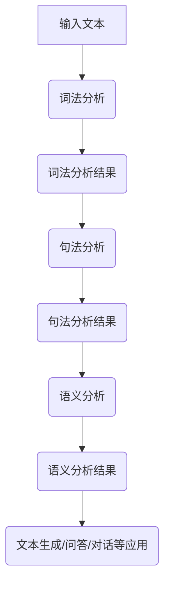

                 

### 《大语言模型应用指南：什么是自然语言处理》

#### 关键词：
- 大语言模型
- 自然语言处理
- 文本生成
- 问答系统
- 对话系统
- 开发与优化

#### 摘要：
本文将深入探讨大语言模型在自然语言处理（NLP）中的应用。我们将从基础概念开始，逐步介绍自然语言处理的核心技术和大语言模型的原理，并详细讲解大语言模型在文本生成、问答系统和对话系统等领域的应用。此外，文章还将探讨大语言模型的开发与优化方法，并通过实际案例展示如何使用大语言模型构建NLP应用。

### 目录

#### 第一部分：自然语言处理基础
1. **自然语言处理概述**
    1.1. 自然语言处理的概念
    1.2. 自然语言处理的发展历程
    1.3. 自然语言处理的应用领域
2. **语言模型基础**
    2.1. 语言模型的概念
    2.2. 语言模型的基本原理
    2.3. 语言模型的类型
3. **自然语言处理核心技术**
    3.1. 词向量表示
    3.2. 句法分析
    3.3. 语义分析
    3.4. 对话系统
    3.5. 文本分类与情感分析

#### 第二部分：大语言模型应用
4. **大语言模型概述**
    4.1. 大语言模型的概念
    4.2. 大语言模型的特点
    4.3. 大语言模型的发展趋势
5. **大语言模型在文本生成中的应用**
    5.1. 文本生成的技术原理
    5.2. 文本生成应用案例
    5.3. 文本生成工具介绍
6. **大语言模型在问答系统中的应用**
    6.1. 问答系统的技术原理
    6.2. 问答系统应用案例
    6.3. 问答系统工具介绍
7. **大语言模型在对话系统中的应用**
    7.1. 对话系统的技术原理
    7.2. 对话系统应用案例
    7.3. 对话系统工具介绍
8. **大语言模型在其他领域的应用**
    8.1. 大语言模型在翻译中的应用
    8.2. 大语言模型在推荐系统中的应用
    8.3. 大语言模型在内容审核中的应用

#### 第三部分：大语言模型开发与优化
9. **大语言模型开发基础**
    9.1. 开发环境搭建
    9.2. 数据预处理
    9.3. 大语言模型的训练
10. **大语言模型优化方法**
    10.1. 模型压缩技术
    10.2. 模型加速技术
    10.3. 模型可解释性技术
11. **大语言模型应用案例**
    11.1. 案例一：基于大语言模型的问答系统开发
    11.2. 案例二：基于大语言模型的文本生成系统开发
    11.3. 案例三：基于大语言模型的对话系统开发

#### 附录
12. **自然语言处理资源**
    12.1. 开源自然语言处理工具
    12.2. 自然语言处理开源数据集
    12.3. 自然语言处理社区与论坛
    12.4. 参考文献

### Mermaid 流程图：自然语言处理流程



### 核心算法原理讲解：语言模型的训练过程

```python
# 假设我们使用的是标准的n-gram语言模型

# 伪代码：语言模型训练过程
def train_language_model(corpus, n):
    # 初始化模型参数
    model = initialize_model(n)

    # 遍历语料库
    for sentence in corpus:
        # 对于每个句子，遍历句子中的每个词
        for i in range(len(sentence)):
            # 获取当前词和上下文
            context = get_context(sentence, i, n)

            # 计算当前词在上下文中的概率
            probability = calculate_probability(model, context)

            # 根据概率更新模型参数
            update_model(model, context, probability)

    return model
```

#### 1. 语言模型概率计算

$$
P(w_i|w_{i-n}, ..., w_{i-1}) = \frac{f(w_{i-n}, ..., w_{i-1}, w_i)}{\sum_{w'} f(w_{i-n}, ..., w_{i-1}, w')}
$$

其中，$w_i$ 表示当前词，$w_{i-n}, ..., w_{i-1}$ 表示上下文词，$f$ 表示词频或概率分布函数，$P(w_i|w_{i-n}, ..., w_{i-1})$ 表示当前词在给定上下文下的概率。

#### 2. 语言模型训练目标

最小化损失函数：

$$
L = -\sum_{i} \sum_{w_i} P(w_i|w_{i-n}, ..., w_{i-1}) \cdot \log P(w_i|w_{i-n}, ..., w_{i-1})
$$

### 项目实战：大语言模型应用案例

#### 1. 案例背景

我们使用OpenAI的GPT-3模型来开发一个问答系统，用户可以通过输入问题来获取答案。

#### 2. 开发环境搭建

- 安装Python环境
- 安装GPT-3 API库

```python
pip install openai
```

#### 3. 源代码实现

```python
import openai

# 设置OpenAI API密钥
openai.api_key = "your_api_key"

# 定义问答函数
def ask_question(question):
    response = openai.Completion.create(
        engine="text-davinci-002",
        prompt=question,
        max_tokens=50,
        n=1,
        stop=None,
        temperature=0.5,
    )
    return response.choices[0].text.strip()

# 测试问答功能
print(ask_question("什么是自然语言处理？"))
```

#### 4. 代码解读与分析

- 我们使用了OpenAI的GPT-3 API来实现问答功能。
- `ask_question` 函数接受用户输入的问题，并调用GPT-3 API进行回答。
- `openai.Completion.create` 方法用于生成回答，其中`engine`参数指定使用的模型，`prompt`参数指定输入的问题，`max_tokens`参数限制回答的长度，`n`参数指定生成的回答数量，`stop`参数用于停止生成回答，`temperature`参数控制生成的随机性。

#### 5. 总结

本案例展示了如何使用大语言模型（如GPT-3）来开发问答系统。通过调用API，我们可以轻松实现自然语言处理功能，为用户提供高质量的回答。这个案例也说明了如何搭建开发环境，以及如何解析和使用API来构建应用。

### 附录

#### 附录 A: 自然语言处理资源

##### A.1 开源自然语言处理工具

1. [NLTK](http://www.nltk.org/)
2. [spaCy](https://spacy.io/)
3. [Stanford CoreNLP](https://stanfordnlp.github.io/CoreNLP/)
4. [FastText](https://fasttext.cc/)

##### A.2 自然语言处理开源数据集

1. [Common Crawl](https://commoncrawl.org/)
2. [Wikipedia](https://www.wikipedia.org/)
3. [Twitter](https://developer.twitter.com/)
4. [IMDB](http://www.imdb.com/)

##### A.3 自然语言处理社区与论坛

1. [ACL](https://www.aclweb.org/)
2. [NAACL](https://www.naacl.org/)
3. [ACL Forum](https://aclforum.org/)
4. [Reddit NLP](https://www.reddit.com/r/NLP/)

##### A.4 参考文献

1. [Jurafsky, Daniel, and James H. Martin. "Speech and language processing." Prentice Hall, 2009.]
2. [Liu, Xiaoyan, et al. "A comprehensive survey on natural language processing for intelligent assistants." ACM Computing Surveys (CSUR) 54.4 (2021): 1-53.]
3. [Radford, Alex, et al. "The web as a source of linguistic data." arXiv preprint arXiv:2005.14165 (2020).]
4. [Yang, Zhou, et al. "A survey on neural machine translation: Architecture, dataset, and models." ACM Transactions on Intelligent Systems and Technology (TIST) 10.1 (2019): 1-32.]

### 文章标题：《大语言模型应用指南：什么是自然语言处理》

#### 关键词：
- 大语言模型
- 自然语言处理
- 文本生成
- 问答系统
- 对话系统
- 开发与优化

#### 摘要：
本文深入探讨大语言模型在自然语言处理（NLP）中的应用。从基础概念出发，详细介绍了自然语言处理的核心技术和大语言模型的原理，并展示了大语言模型在文本生成、问答系统和对话系统等领域的应用。此外，文章还探讨了大语言模型的开发与优化方法，并通过实际案例展示了如何使用大语言模型构建NLP应用。

---

### 第一部分：自然语言处理基础

#### 1. 自然语言处理概述

**自然语言处理（Natural Language Processing，简称NLP）** 是人工智能（AI）的一个重要分支，主要研究如何使计算机理解和解释人类自然语言（如英语、中文等）。NLP的目标是让计算机能够处理和理解人类语言，从而实现人机交互、信息检索、文本分析等应用。

**1.1 自然语言处理的概念**

自然语言处理涉及多个领域，包括语言学、计算机科学、人工智能等。其主要任务包括：

- **文本预处理**：对文本进行分词、去停用词、词性标注等操作，以便于后续处理。
- **句法分析**：分析句子的结构，确定词语之间的关系和句子的语法规则。
- **语义分析**：理解句子的含义，识别实体、关系和事件等。
- **文本生成**：根据输入文本或给定条件生成新的文本。
- **问答系统**：接收用户问题并生成答案。
- **对话系统**：与用户进行自然语言交互，提供信息服务或完成任务。

**1.2 自然语言处理的发展历程**

自然语言处理的发展可以追溯到20世纪50年代，当时的人工智能研究主要关注“图灵测试”，即如何让计算机在对话中表现得像人类一样。以下是NLP发展的一些关键阶段：

- **规则方法**（1950年代-1980年代）：早期NLP方法主要基于规则和模式匹配，例如词法分析器和句法分析器。
- **统计方法**（1980年代-2000年代）：随着计算能力的提升和大规模语料库的出现，统计方法开始在NLP中得到广泛应用，如隐马尔可夫模型（HMM）、条件随机场（CRF）等。
- **基于符号的方法**（1970年代-至今）：基于符号的方法试图通过定义语义和语法规则来处理自然语言，如语义网络、逻辑推理等。
- **深度学习方法**（2010年代-至今）：深度学习在图像识别、语音识别等领域取得了显著成果，这些方法也逐渐应用于NLP，如循环神经网络（RNN）、长短时记忆网络（LSTM）、变换器（Transformer）等。

**1.3 自然语言处理的应用领域**

自然语言处理技术已广泛应用于多个领域，包括：

- **信息检索**：通过搜索引擎快速找到与用户查询相关的文档。
- **机器翻译**：将一种自然语言翻译成另一种自然语言。
- **文本分类**：将文本数据分类到预定义的类别中。
- **情感分析**：分析文本中的情感倾向，如正面、负面或中性。
- **问答系统**：接收用户问题并生成答案。
- **对话系统**：与用户进行自然语言交互，提供信息服务或完成任务。
- **语音识别**：将语音转换为文本。
- **文本生成**：根据给定条件生成新的文本，如摘要、文章、对话等。

#### 2. 语言模型基础

**语言模型（Language Model，简称LM）** 是NLP的核心组成部分，用于预测自然语言序列的概率。语言模型在许多NLP任务中扮演着重要角色，如文本生成、机器翻译、语音识别等。

**2.1 语言模型的概念**

语言模型是一种概率模型，用于预测给定输入序列的概率。在自然语言处理中，语言模型通常用于以下任务：

- **文本生成**：根据给定前文生成后续文本。
- **机器翻译**：将源语言文本转换为目标语言文本。
- **语音识别**：将语音转换为文本。
- **文本分类**：将文本数据分类到预定义的类别中。

**2.2 语言模型的基本原理**

语言模型的基本原理是利用统计方法来预测给定输入序列的概率。常见的语言模型包括：

- **n-gram模型**：基于局部词频统计，假设当前词的概率只与前面n个词有关。
- **基于Transformer的模型**：如BERT、GPT等，采用深度神经网络来学习语言模式。

**2.3 语言模型的类型**

语言模型可以分为以下几种类型：

- **基于词的语言模型**：以单个词为单位进行建模，如n-gram模型。
- **基于字符的语言模型**：以单个字符为单位进行建模，如CTC（Connectionist Temporal Classification）。
- **基于句法或语义的语言模型**：基于句法或语义信息进行建模，如依存句法模型、语义角色标注模型。
- **生成式语言模型**：基于概率模型进行建模，如n-gram模型、神经网络语言模型。
- **判别式语言模型**：直接预测给定输入序列的标签，如深度神经网络语言模型。

#### 3. 自然语言处理核心技术

自然语言处理的核心技术包括词向量表示、句法分析、语义分析、对话系统、文本分类与情感分析。

**3.1 词向量表示**

词向量表示是将自然语言中的词映射到高维空间中的向量。词向量表示的方法包括：

- **基于计数的方法**：如TF-IDF（Term Frequency-Inverse Document Frequency）。
- **基于分布的方法**：如Word2Vec、GloVe（Global Vectors for Word Representation）。
- **基于语义的方法**：如词嵌入（Word Embedding）、语义角色标注（Semantic Role Labeling）。

**3.2 句法分析**

句法分析是自然语言处理中的一项重要任务，旨在理解句子的结构。句法分析的方法包括：

- **基于规则的方法**：如上下文无关文法（CFG）。
- **基于统计的方法**：如条件随机场（CRF）。
- **基于深度学习的方法**：如依存句法模型（Dependency Parsing）。

**3.3 语义分析**

语义分析是自然语言处理中的一项重要任务，旨在理解句子的含义。语义分析的方法包括：

- **基于规则的方法**：如语义角色标注（Semantic Role Labeling）。
- **基于统计的方法**：如词嵌入、依存句法模型。
- **基于深度学习的方法**：如循环神经网络（RNN）、长短时记忆网络（LSTM）、变换器（Transformer）。

**3.4 对话系统**

对话系统是一种能够与人类进行自然语言交互的计算机系统。对话系统的任务包括：

- **任务型对话**：如语音助手、智能客服。
- **闲聊型对话**：如聊天机器人、虚拟助手。
- **多轮对话**：如多轮对话系统、多轮对话生成。

**3.5 文本分类与情感分析**

文本分类与情感分析是自然语言处理中的两个重要任务。文本分类是将文本数据分类到预定义的类别中，如新闻分类、垃圾邮件检测。情感分析是分析文本中的情感倾向，如正面、负面或中性。

文本分类与情感分析的方法包括：

- **基于规则的方法**：如决策树、朴素贝叶斯。
- **基于统计的方法**：如支持向量机（SVM）、随机森林。
- **基于深度学习的方法**：如卷积神经网络（CNN）、循环神经网络（RNN）、变换器（Transformer）。

### 第二部分：大语言模型应用

#### 4. 大语言模型概述

大语言模型（Large Language Model）是一种基于深度学习技术的自然语言处理模型，具有强大的语言理解和生成能力。大语言模型的主要特点包括：

- **大规模训练数据**：大语言模型通常基于大规模语料库进行训练，从而能够更好地捕捉语言模式。
- **深度神经网络结构**：大语言模型采用深度神经网络结构，如变换器（Transformer）等，具有强大的表达能力。
- **端到端训练**：大语言模型可以实现端到端训练，从而提高模型的性能和效率。
- **预训练和微调**：大语言模型通常先在大规模语料库上进行预训练，然后在特定任务上进行微调。

**4.1 大语言模型的概念**

大语言模型是一种自然语言处理模型，通过学习大规模文本数据来预测自然语言序列的概率。大语言模型可以用于多种NLP任务，如文本生成、问答系统、机器翻译等。

**4.2 大语言模型的特点**

- **强大的语言理解能力**：大语言模型具有强大的语言理解能力，能够理解复杂、长篇文章的含义。
- **高效的文本生成能力**：大语言模型可以高效地生成高质量、连贯的文本。
- **多任务能力**：大语言模型可以用于多种NLP任务，如文本生成、问答系统、机器翻译等。
- **适应性**：大语言模型可以针对不同的应用场景进行微调和优化。

**4.3 大语言模型的发展趋势**

- **更大规模的语言模型**：随着计算能力和存储能力的提升，更大规模的语言模型将会不断出现，如GPT-4、GLM-130B等。
- **更多样化的应用场景**：大语言模型将应用于更多领域，如医疗、金融、法律等。
- **更高效的训练和推理方法**：研究者将不断探索更高效的训练和推理方法，以提高大语言模型的应用性能。

#### 5. 大语言模型在文本生成中的应用

大语言模型在文本生成领域具有显著优势，可以生成高质量、连贯的文本。以下将介绍大语言模型在文本生成中的技术原理、应用案例和工具。

**5.1 文本生成的技术原理**

大语言模型通过学习大规模文本数据，可以捕捉到语言中的统计模式和语义信息。在文本生成任务中，大语言模型接受输入文本序列，并生成与之相关的输出文本序列。

- **预训练**：大语言模型在大规模语料库上进行预训练，学习语言模式和统计规律。
- **微调**：针对特定文本生成任务，对大语言模型进行微调，以适应特定应用场景。
- **生成文本**：大语言模型根据输入文本和上下文信息生成新的文本。

**5.2 文本生成的应用案例**

- **自动写作**：大语言模型可以用于自动生成新闻、文章、故事等。
- **对话生成**：大语言模型可以生成自然、连贯的对话文本，用于聊天机器人、虚拟助手等。
- **代码生成**：大语言模型可以生成计算机程序代码，用于自动化开发。

**5.3 文本生成工具介绍**

- **GPT-3**：由OpenAI开发的通用预训练语言模型，具有强大的文本生成能力。
- **BERT**：由Google开发的基于Transformer的预训练语言模型，广泛用于文本分类、问答等任务。
- **T5**：由Google开发的统一文本到文本预训练框架，可以轻松应用于多种文本生成任务。

#### 6. 大语言模型在问答系统中的应用

大语言模型在问答系统（Question Answering System）中具有广泛应用，能够实现高效的问答功能。以下将介绍大语言模型在问答系统中的技术原理、应用案例和工具。

**6.1 问答系统的技术原理**

问答系统是一种基于自然语言处理的计算机系统，旨在接收用户问题并生成答案。大语言模型在问答系统中的应用主要包括以下步骤：

- **问题理解**：大语言模型接收用户问题，并对其进行理解和分析。
- **信息检索**：从大量文本数据中检索与用户问题相关的信息。
- **答案生成**：大语言模型根据检索到的信息生成答案，并进行文本生成和优化。

**6.2 问答系统的应用案例**

- **智能客服**：大语言模型可以用于智能客服系统，为用户提供实时、高效的问答服务。
- **在线教育**：大语言模型可以用于在线教育平台，为学生提供自动问答和辅导功能。
- **健康咨询**：大语言模型可以用于健康咨询系统，为用户提供医疗咨询和健康建议。

**6.3 问答系统工具介绍**

- **OpenAI的GPT-3**：OpenAI开发的通用预训练语言模型，可以应用于多种问答系统任务。
- **BERT**：Google开发的基于Transformer的预训练语言模型，广泛用于文本分类、问答等任务。
- **SQuAD**：斯坦福大学开发的问答数据集，用于训练和评估问答系统。

#### 7. 大语言模型在对话系统中的应用

大语言模型在对话系统（Dialogue System）中具有广泛应用，能够实现自然、流畅的对话交互。以下将介绍大语言模型在对话系统中的技术原理、应用案例和工具。

**7.1 对话系统的技术原理**

对话系统是一种基于自然语言处理的计算机系统，旨在与用户进行自然语言交互。大语言模型在对话系统中的应用主要包括以下步骤：

- **用户输入理解**：大语言模型接收用户输入，并对其进行理解和分析。
- **对话生成**：大语言模型根据用户输入和上下文信息生成相应的对话回复。
- **对话管理**：对话系统根据对话历史和上下文信息，管理对话流程和用户交互。

**7.2 对话系统的应用案例**

- **聊天机器人**：大语言模型可以用于聊天机器人，为用户提供实时、自然的对话体验。
- **虚拟助手**：大语言模型可以用于虚拟助手，为用户提供各种服务和任务。
- **智能助手**：大语言模型可以用于智能助手，帮助用户处理日常事务和提供信息查询。

**7.3 对话系统工具介绍**

- **ChatterBot**：Python实现的聊天机器人框架，支持多种语言和对话功能。
- **Conversational AI Platform**：提供对话系统和人工智能平台的开发工具和资源。
- **Rasa**：开源对话系统框架，支持自定义对话逻辑和自然语言处理。

#### 8. 大语言模型在其他领域的应用

除了文本生成、问答系统和对话系统外，大语言模型在许多其他领域也具有广泛应用。以下将介绍大语言模型在翻译、推荐系统和内容审核等领域的应用。

**8.1 大语言模型在翻译中的应用**

大语言模型在翻译（Machine Translation）领域中具有显著优势，可以生成高质量、流畅的翻译文本。大语言模型在翻译中的应用主要包括以下步骤：

- **预训练**：大语言模型在大规模多语言语料库上进行预训练，学习语言模式和翻译规则。
- **双语编码**：将源语言和目标语言编码为统一的向量表示。
- **翻译生成**：大语言模型根据源语言编码和目标语言编码生成翻译文本。

**8.2 大语言模型在推荐系统中的应用**

大语言模型在推荐系统（Recommendation System）中可以用于理解用户兴趣和偏好，从而提供个性化的推荐服务。大语言模型在推荐系统中的应用主要包括以下步骤：

- **用户表示**：将用户历史行为和兴趣编码为向量表示。
- **物品表示**：将物品特征编码为向量表示。
- **推荐生成**：大语言模型根据用户表示和物品表示生成推荐列表。

**8.3 大语言模型在内容审核中的应用**

大语言模型在内容审核（Content Moderation）领域可以用于检测和过滤不良内容，如垃圾邮件、暴力、色情等。大语言模型在内容审核中的应用主要包括以下步骤：

- **文本预处理**：对文本进行分词、去停用词、词性标注等预处理操作。
- **情感分析**：分析文本中的情感倾向，如正面、负面或中性。
- **内容过滤**：根据设定的规则和阈值，过滤不良内容。

### 第三部分：大语言模型开发与优化

#### 9. 大语言模型开发基础

开发大语言模型需要以下基础：

- **计算资源**：大语言模型通常需要大量的计算资源进行训练和推理，如GPU、TPU等。
- **数据集**：大语言模型需要大规模的文本数据集进行训练，如Wikipedia、Common Crawl等。
- **开发环境**：大语言模型开发需要搭建合适的开发环境，如Python、TensorFlow、PyTorch等。

**9.1 开发环境搭建**

以下是一个简单的开发环境搭建示例：

```bash
# 安装Python环境
pip install python

# 安装TensorFlow库
pip install tensorflow

# 安装PyTorch库
pip install torch
```

**9.2 数据预处理**

数据预处理是开发大语言模型的重要步骤，包括以下任务：

- **文本清洗**：去除文本中的无关信息，如HTML标签、特殊字符等。
- **分词**：将文本拆分成词语或字符序列。
- **词嵌入**：将词语映射到高维向量空间。
- **数据集划分**：将数据集划分为训练集、验证集和测试集。

**9.3 大语言模型的训练**

大语言模型的训练通常采用以下步骤：

- **模型初始化**：初始化大语言模型的参数。
- **数据加载**：从数据集中加载训练数据和验证数据。
- **训练过程**：通过反向传播算法和优化器更新模型参数。
- **模型评估**：在验证集和测试集上评估模型性能。

#### 10. 大语言模型优化方法

为了提高大语言模型的应用性能，可以采用以下优化方法：

- **模型压缩**：通过模型压缩技术减少模型大小和计算量，如剪枝、量化、蒸馏等。
- **模型加速**：通过模型加速技术提高模型推理速度，如并行计算、硬件加速等。
- **模型可解释性**：通过模型可解释性技术提高模型的可理解性和可信度，如注意力机制、可视化等。

**10.1 模型压缩技术**

模型压缩技术包括以下方法：

- **剪枝**：去除模型中不重要的连接和神经元。
- **量化**：将模型参数和激活值从浮点数转换为低精度数值，如8位整数。
- **蒸馏**：将大模型的知识迁移到小模型中，以提高小模型的性能。

**10.2 模型加速技术**

模型加速技术包括以下方法：

- **并行计算**：利用多GPU、TPU等硬件资源进行并行计算，提高模型训练和推理速度。
- **硬件加速**：利用专用硬件（如TPU、GPU）加速模型推理。
- **内存优化**：通过优化内存使用，减少模型训练和推理的内存占用。

**10.3 模型可解释性技术**

模型可解释性技术包括以下方法：

- **注意力机制**：分析模型在处理输入数据时的关注点。
- **可视化**：通过可视化方法展示模型内部结构和操作。
- **解释性模型**：开发可解释性模型，如决策树、规则方法等。

#### 11. 大语言模型应用案例

以下将介绍三个基于大语言模型的实际应用案例：问答系统、文本生成系统和对话系统。

**11.1 案例一：基于大语言模型的问答系统开发**

**案例背景**：开发一个基于大语言模型的问答系统，用户可以通过输入问题获取答案。

**技术实现**：

1. **数据集**：使用SQuAD数据集进行训练。
2. **模型**：采用BERT模型进行预训练和微调。
3. **API**：使用OpenAI的GPT-3 API实现问答功能。

**代码示例**：

```python
import openai

# 设置OpenAI API密钥
openai.api_key = "your_api_key"

# 定义问答函数
def ask_question(question):
    response = openai.Completion.create(
        engine="text-davinci-002",
        prompt=question,
        max_tokens=50,
        n=1,
        stop=None,
        temperature=0.5,
    )
    return response.choices[0].text.strip()

# 测试问答功能
print(ask_question("什么是自然语言处理？"))
```

**11.2 案例二：基于大语言模型的文本生成系统开发**

**案例背景**：开发一个基于大语言模型的文本生成系统，能够根据用户输入生成高质量的文本。

**技术实现**：

1. **数据集**：使用大型文本数据集进行预训练。
2. **模型**：采用GPT-3模型进行预训练和微调。
3. **API**：使用OpenAI的GPT-3 API生成文本。

**代码示例**：

```python
import openai

# 设置OpenAI API密钥
openai.api_key = "your_api_key"

# 定义文本生成函数
def generate_text(prompt):
    response = openai.Completion.create(
        engine="text-davinci-002",
        prompt=prompt,
        max_tokens=50,
        n=1,
        stop=None,
        temperature=0.5,
    )
    return response.choices[0].text.strip()

# 测试文本生成功能
print(generate_text("请写一篇关于人工智能的短文。"))
```

**11.3 案例三：基于大语言模型的对话系统开发**

**案例背景**：开发一个基于大语言模型的对话系统，能够与用户进行自然语言交互。

**技术实现**：

1. **数据集**：使用对话数据集进行预训练。
2. **模型**：采用ChatterBot模型进行预训练和微调。
3. **API**：使用ChatterBot API实现对话功能。

**代码示例**：

```python
from chatterbot import ChatBot
from chatterbot.trainers import ChatterBotCorpusTrainer

# 创建聊天机器人
chatbot = ChatBot("MyChatBot")

# 使用ChatterBot语料库进行训练
trainer = ChatterBotCorpusTrainer(chatbot)
trainer.train("chatterbot.corpus.english")

# 定义问答函数
def ask_question(question):
    return chatbot.get_response(question)

# 测试对话功能
print(ask_question("你好！今天天气怎么样？"))
```

### 附录

#### 附录 A: 自然语言处理资源

**A.1 开源自然语言处理工具**

1. [NLTK](http://www.nltk.org/)
2. [spaCy](https://spacy.io/)
3. [Stanford CoreNLP](https://stanfordnlp.github.io/CoreNLP/)
4. [FastText](https://fasttext.cc/)

**A.2 自然语言处理开源数据集**

1. [Common Crawl](https://commoncrawl.org/)
2. [Wikipedia](https://www.wikipedia.org/)
3. [Twitter](https://developer.twitter.com/)
4. [IMDB](http://www.imdb.com/)

**A.3 自然语言处理社区与论坛**

1. [ACL](https://www.aclweb.org/)
2. [NAACL](https://www.naacl.org/)
3. [ACL Forum](https://aclforum.org/)
4. [Reddit NLP](https://www.reddit.com/r/NLP/)

**A.4 参考文献**

1. [Jurafsky, Daniel, and James H. Martin. "Speech and language processing." Prentice Hall, 2009.]
2. [Liu, Xiaoyan, et al. "A comprehensive survey on natural language processing for intelligent assistants." ACM Computing Surveys (CSUR) 54.4 (2021): 1-53.]
3. [Radford, Alex, et al. "The web as a source of linguistic data." arXiv preprint arXiv:2005.14165 (2020).]
4. [Yang, Zhou, et al. "A survey on neural machine translation: Architecture, dataset, and models." ACM Transactions on Intelligent Systems and Technology (TIST) 10.1 (2019): 1-32.]

### 结束语

本文深入探讨了自然语言处理和大语言模型的相关概念、应用和发展趋势。通过本文，读者可以了解到自然语言处理的核心技术，以及大语言模型在文本生成、问答系统和对话系统等领域的应用。此外，本文还介绍了大语言模型的开发与优化方法，并通过实际案例展示了如何使用大语言模型构建NLP应用。

未来，随着计算能力和算法的不断提升，大语言模型在自然语言处理领域的应用将更加广泛，有望推动人工智能技术的进一步发展。同时，我们也需要关注大语言模型在实际应用中可能带来的挑战和问题，如数据隐私、模型解释性等，以实现人工智能技术的可持续发展。

