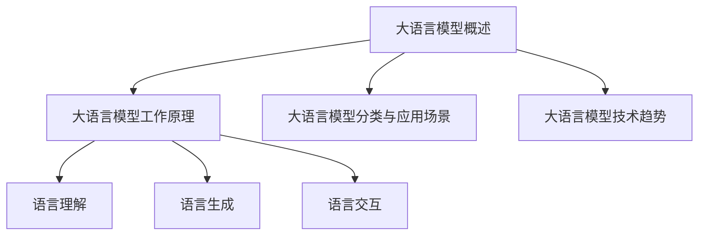
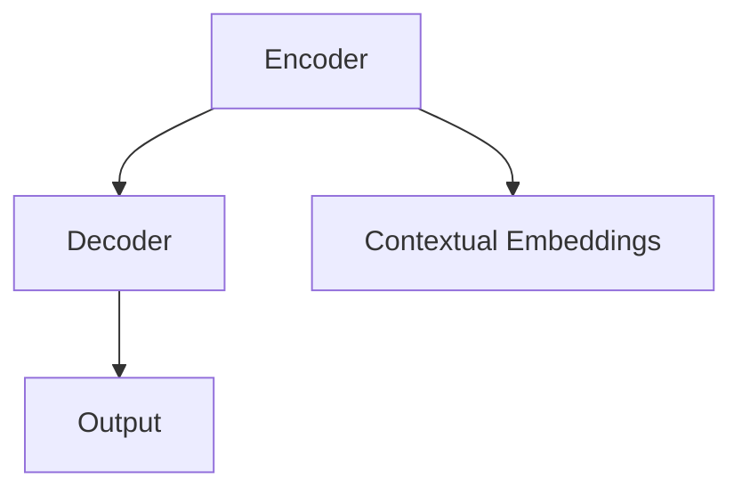
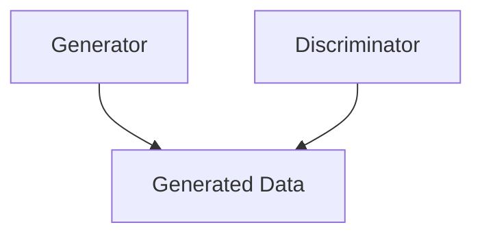
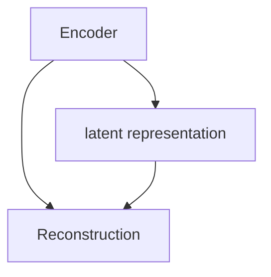
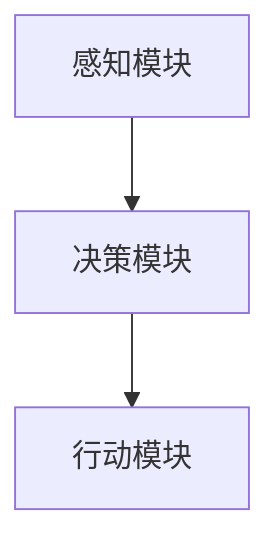
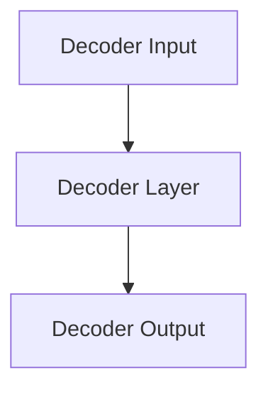

                 

### 《大语言模型应用指南：自主Agent系统简介》

在当今人工智能领域，大语言模型和自主Agent系统无疑是两大热门研究方向。大语言模型通过深度学习技术，对大规模语言数据进行分析和建模，从而实现自然语言理解、生成和交互。而自主Agent系统则是一个具备自主性、自适应性和智能性的计算机程序，可以在复杂环境中独立完成特定任务。本文将深入探讨大语言模型和自主Agent系统的基本概念、核心算法原理、应用场景以及如何将两者结合起来，共同构建一个智能的、自动化的系统。

#### 关键词：

- 大语言模型
- 自主Agent系统
- 自然语言处理
- 人工智能
- 深度学习
- 机器学习

#### 摘要：

本文旨在为广大开发者、研究者以及AI爱好者提供一份全面的大语言模型和自主Agent系统应用指南。首先，我们将介绍大语言模型的发展背景、工作原理、分类与应用场景，以及其技术发展趋势。接着，我们将详细探讨自主Agent系统的原理、分类、行为模型与决策机制、交互与协作。随后，文章将重点介绍大语言模型在自主Agent系统中的应用，包括对话系统、语音助手和智能客服等。在项目实战部分，我们将通过一个实际案例，展示如何使用大语言模型构建自主Agent系统，并详细解读相关代码。最后，文章将分析大语言模型与自主Agent系统的发展趋势，探讨未来展望与挑战。

### 《大语言模型应用指南：自主Agent系统简介》目录大纲

#### 第一部分：大语言模型基础

##### 第1章：大语言模型概述

- **1.1 大语言模型的发展背景**
  - 大语言模型的起源
  - 发展历程与关键技术

- **1.2 大语言模型的工作原理**
  - 语言模型的核心概念
  - 常见的大语言模型架构

- **1.3 大语言模型的分类与应用场景**
  - 基于词嵌入的模型
  - 基于转换器的模型
  - 应用场景概述

- **1.4 大语言模型的技术趋势**
  - 模型压缩与优化
  - 多模态语言处理
  - 安全性与隐私保护

#### 第二部分：自主Agent系统概述

##### 第2章：自主Agent系统原理

- **2.1 自主Agent的定义与特征**
  - 自主Agent的概念
  - 自主Agent的核心特征

- **2.2 自主Agent的分类与体系结构**
  - 自主Agent的分类
  - 自主Agent的体系结构

- **2.3 自主Agent的行为模型与决策机制**
  - 行为模型与决策机制概述
  - 常见行为模型与决策算法

- **2.4 自主Agent的交互与协作**
  - 交互机制
  - 协作模式

#### 第三部分：大语言模型在自主Agent系统中的应用

##### 第3章：大语言模型与自主Agent的融合

- **3.1 大语言模型在自主Agent中的角色**
  - 语言理解
  - 语言生成
  - 语言交互

- **3.2 大语言模型在自主Agent系统中的应用案例**
  - 对话系统
  - 语音助手
  - 智能客服

- **3.3 大语言模型与自主Agent系统的协同优化**
  - 模型适应性调整
  - 系统性能提升策略

##### 第4章：自主Agent系统的设计实践

- **4.1 自主Agent系统的开发流程**
  - 需求分析
  - 系统设计
  - 系统实现

- **4.2 自主Agent系统的测试与评估**
  - 测试策略
  - 评估指标
  - 测试案例

- **4.3 自主Agent系统的部署与维护**
  - 部署策略
  - 维护策略
  - 面向业务的持续优化

#### 第四部分：案例研究与展望

##### 第5章：大语言模型与自主Agent系统的经典案例

- **5.1 案例分析**
  - 案例概述
  - 解决方案
  - 实施效果

- **5.2 案例对比**
  - 优劣势分析
  - 启示与借鉴

##### 第6章：大语言模型与自主Agent系统的发展趋势

- **6.1 技术发展趋势**
  - 模型进化方向
  - 系统集成与扩展

- **6.2 应用趋势**
  - 新兴应用领域
  - 行业应用前景

##### 第7章：未来展望与挑战

- **7.1 未来展望**
  - 技术创新方向
  - 社会影响

- **7.2 挑战与对策**
  - 技术难题
  - 法律与伦理问题

### 附录

- **附录A：参考资料与工具**
  - 常用工具与资源
  - 相关论文与书籍推荐

- **附录B：术语表**
  - 专业术语解释

#### Mermaid 流程图



### 核心算法原理讲解

在探讨大语言模型和自主Agent系统之前，我们需要深入了解其背后的核心算法原理。本文将逐步分析大语言模型的基础、核心算法以及其在自主Agent系统中的应用。

#### 2.3.1 大语言模型的基础

大语言模型是一种基于统计学习的方法，旨在预测一个词序列中的下一个词。这种模型通过对大量文本数据的学习，掌握语言的内在规律，从而能够生成、理解和处理自然语言。

- **N-gram模型**

N-gram模型是最早的一种语言模型，它将文本序列视为一系列的单词或字符序列，并使用这些序列的频率来预测下一个单词或字符。N-gram模型的基本公式为：

$$
P(w_n) = \frac{C(w_n, w_{n-1}, ..., w_1)}{C(w_{n-1}, w_{n-2}, ..., w_1)}
$$

其中，$P(w_n)$ 是下一个词的概率，$C(w_n, w_{n-1}, ..., w_1)$ 是前一个词序列和当前词的联合概率，$C(w_{n-1}, w_{n-2}, ..., w_1)$ 是前一个词序列的概率。

尽管N-gram模型简单有效，但它无法捕捉到长距离依赖关系，因此其表现受到限制。

- **神经网络语言模型**

为了解决N-gram模型的局限性，研究者提出了基于神经网络的模型。其中，最著名的例子是神经网络语言模型（Neural Network Language Model，NNLM）。NNLM 使用神经网络来计算词的概率，其基本思路是将输入的词序列映射到高维空间，然后计算每个词在空间中的概率。

NNLM 的概率计算公式为：

$$
P(w_n|w_{n-1}, w_{n-2}, ..., w_1) = \frac{exp(Scores(w_n, w_{n-1}, w_{n-2}, ..., w_1))}{\sum_{w_n'} exp(Scores(w_n', w_{n-1}, w_{n-2}, ..., w_1))}
$$

其中，$Scores(w_n, w_{n-1}, w_{n-2}, ..., w_1)$ 是神经网络计算出的分数，用于表示当前词与历史词之间的关联程度。

#### 2.3.2 基于转换器的模型

近年来，基于转换器的模型（Transformer）在大语言模型领域取得了巨大的成功。与传统的神经网络模型相比，转换器模型引入了自注意力机制（Self-Attention），能够更好地捕捉长距离依赖关系。

- **编码器-解码器模型**

编码器-解码器模型（Encoder-Decoder Model）是转换器模型的一种变体，主要用于序列到序列的任务，如图像描述、机器翻译和文本生成等。编码器将输入序列编码为固定长度的向量表示，解码器则根据这些向量生成输出序列。

编码器-解码器模型的基本结构如下：



- **自注意力机制**

自注意力机制是转换器模型的核心组件，它允许模型在生成每个单词时，根据当前单词和所有历史单词的相关性来调整其重要性。自注意力机制的公式如下：

$$
\text{Attention Score} = \text{Query} \cdot \text{Key}^T / \sqrt{d_k}
$$

其中，$\text{Query}$ 和 $\text{Key}$ 是编码后的输入序列，$d_k$ 是键向量的维度。注意力得分表示了当前词与其他词的相关性，权重越高，表示相关性越强。

$$
\text{Weighted Value} = \text{Value} \odot \text{Attention Score}
$$

其中，$\odot$ 表示逐元素乘法。加权值表示了当前词对其他词的影响程度，权重越高，影响越大。

#### 2.3.3 生成式模型

生成式模型（Generative Model）通过学习数据生成过程，从而能够生成新的数据样本。在自然语言处理领域，生成式模型广泛应用于文本生成、语音合成和图像生成等任务。

- **生成式对抗网络（GAN）**

生成式对抗网络（Generative Adversarial Network，GAN）是一种由生成器和判别器组成的对抗性模型。生成器试图生成与真实数据相似的数据样本，而判别器则试图区分真实数据和生成数据。通过不断迭代训练，生成器和判别器互相博弈，生成器的生成质量逐渐提高。

GAN 的基本结构如下：



- **变分自编码器（VAE）**

变分自编码器（Variational Autoencoder，VAE）是一种基于概率模型的生成式模型，它通过学习数据分布的参数化表示来生成新数据。VAE 的核心思想是引入一个编码器和一个解码器，编码器将输入数据编码为一个隐变量，解码器则根据隐变量生成输出数据。

VAE 的基本结构如下：



通过上述核心算法原理的讲解，我们可以看到大语言模型在自然语言处理领域的重要性，以及如何将不同类型的模型应用于实际场景中。接下来，我们将进一步探讨自主Agent系统的原理和应用。

### 自主Agent系统的基本原理

自主Agent系统是人工智能领域的一个重要分支，其核心目标是使计算机程序能够在没有外部干预的情况下，自主地完成特定任务。为了实现这一目标，我们需要深入了解自主Agent系统的基本原理，包括其定义、核心特征、分类与体系结构，以及行为模型与决策机制。

#### 2.2.1 自主Agent的定义与核心特征

- **定义**

自主Agent（Autonomous Agent）是一个具有智能行为的计算机程序，它能够在动态环境中自主地感知环境、理解目标，并采取相应的行动来实现目标。自主Agent的核心特征包括自主性、适应性、反应性、社交性和灵活性。

- **自主性**

自主性是自主Agent最显著的特征，它表示Agent具有独立决策和行动的能力。自主Agent可以基于其内部模型和感知信息，自主地决定何时、如何以及为何采取特定行动。

- **适应性**

适应性是指自主Agent能够根据环境的变化，调整其行为策略。自主Agent需要具备自我学习和适应能力，以便在复杂、动态的环境中保持高效和稳定。

- **反应性**

反应性是指自主Agent能够对环境中的变化做出快速响应。自主Agent通过感知模块获取环境信息，然后通过决策模块生成相应的行动，以确保系统能够及时适应变化。

- **社交性**

社交性是指自主Agent能够与其他Agent进行交互和协作。自主Agent需要具备一定的通信能力和合作精神，以便在多Agent系统中实现协同工作。

- **灵活性**

灵活性是指自主Agent能够根据不同的任务需求和环境条件，灵活地调整其行为策略。自主Agent需要具备高度的可配置性和扩展性，以便适应不同的应用场景。

#### 2.2.2 自主Agent的分类与体系结构

自主Agent可以根据不同的标准进行分类，例如基于功能、结构、学习方式等。以下是一些常见的自主Agent分类：

- **基于功能的分类**

  - 监控型Agent：负责监测和记录系统运行状态，如系统性能监控、设备故障检测等。
  - 控制型Agent：负责执行特定任务，如自动驾驶、智能家居控制等。
  - 操纵型Agent：负责直接操纵设备或系统，如机器人、无人机等。
  - 交互型Agent：负责与用户或其他Agent进行交互，如聊天机器人、智能客服等。

- **基于结构的分类**

  - 单层结构Agent：具有单一的感知模块、决策模块和行动模块，结构简单。
  - 双层结构Agent：在单层结构的基础上，增加了学习模块，能够通过学习优化行为策略。
  - 三层结构Agent：在双层结构的基础上，增加了规划模块，能够进行长期规划和决策。

- **基于学习方式的分类**

  - 有监督学习Agent：通过大量标注数据进行训练，学习到输入和输出之间的映射关系。
  - 无监督学习Agent：通过未标注的数据进行训练，学习到数据分布和特征表示。
  - 强化学习Agent：通过与环境的交互，学习最优策略，以最大化累积奖励。

自主Agent的体系结构通常包括感知模块、决策模块和行动模块。感知模块负责获取环境信息，决策模块负责基于感知信息和内部模型生成行动策略，行动模块负责执行具体的行动。以下是一个简单的自主Agent体系结构图：



#### 2.2.3 自主Agent的行为模型与决策机制

- **行为模型**

行为模型描述了自主Agent在环境中的行为模式，包括感知、决策和行动等过程。常见的自主Agent行为模型有：

  - 感知-行动模型（Perception-Action Model）：该模型认为自主Agent的行为是基于对环境的感知和直接的行动决策。
  - 感知-思考-行动模型（Perception-Thinking-Action Model）：该模型在感知-行动模型的基础上，增加了思考过程，使得自主Agent能够根据当前状态和目标，选择最优的行动策略。
  - 感知-理解-行动模型（Perception-Understanding-Action Model）：该模型在感知-思考-行动模型的基础上，进一步增加了理解过程，使得自主Agent能够对环境中的信息进行深度理解，从而做出更合理的决策。

- **决策机制**

决策机制是自主Agent的核心，它决定了自主Agent在特定情况下如何选择行动。常见的决策机制有：

  - 反应式决策机制：该机制基于当前的感知信息，直接选择一个预定义的行动。
  - 目标导向决策机制：该机制根据当前状态和目标，选择一个能够最大化目标实现的行动。
  - 计划导向决策机制：该机制根据当前状态和目标，生成一个行动计划，然后按照计划执行。
  - 强化学习决策机制：该机制通过与环境的交互，学习到最优的行动策略。

#### 2.2.4 自主Agent的交互与协作

- **交互机制**

自主Agent之间的交互是实现多Agent系统协同工作的关键。常见的交互机制有：

  - 信息共享：自主Agent通过共享信息，实现相互之间的协调和合作。
  - 协同决策：多个自主Agent共同参与决策过程，以实现整体目标的最优化。
  - 沟通机制：自主Agent通过通信协议，实现相互之间的信息传递和指令下达。

- **协作模式**

自主Agent的协作模式可以分为以下几种：

  - 竞争协作模式：自主Agent在完成各自任务的同时，相互竞争资源，实现共同目标。
  - 协同作业模式：自主Agent相互协作，共同完成一个复杂的任务。
  - 合作模式：自主Agent以平等地位共同完成一个任务，各自承担不同的角色和责任。
  - 对抗协作模式：自主Agent在对抗环境中，相互协作以实现共同目标。

通过上述对自主Agent系统基本原理的讲解，我们可以看到自主Agent在人工智能领域的重要性和广泛应用。在接下来的部分，我们将进一步探讨大语言模型在自主Agent系统中的应用，以及如何将两者结合起来，构建一个更加智能和自动化的系统。

### 大语言模型在自主Agent系统中的应用

大语言模型（Large Language Model）是自然语言处理（Natural Language Processing，NLP）领域的一个重要进展，它通过深度学习技术，对大规模语言数据进行分析和建模，从而实现自然语言的理解、生成和交互。在自主Agent系统中，大语言模型的应用使得Agent具备了强大的语言处理能力，能够更自然、更准确地与人类用户进行沟通和协作。本文将详细介绍大语言模型在自主Agent系统中的角色、具体应用案例以及如何进行协同优化。

#### 3.1 大语言模型在自主Agent中的角色

大语言模型在自主Agent系统中的角色主要体现在以下几个方面：

- **语言理解**：大语言模型可以理解和解析自然语言输入，包括文本和语音。这使得自主Agent能够接收和处理用户的指令和问题，从而做出相应的响应。

- **语言生成**：大语言模型能够根据输入的语境和需求，生成自然流畅的语言输出。这使得自主Agent能够自动生成回答、报告、邮件等内容，提高工作效率。

- **语言交互**：大语言模型使得自主Agent能够与用户进行自然语言对话，实现更自然的交流体验。通过理解用户的意图和上下文，自主Agent可以提供个性化的服务和建议。

#### 3.2 大语言模型在自主Agent系统中的应用案例

大语言模型在自主Agent系统中的应用非常广泛，以下是一些典型的应用案例：

- **对话系统**：对话系统是自主Agent系统中最常见的一种应用。通过大语言模型，对话系统能够理解用户的自然语言输入，并生成合适的回答。例如，聊天机器人、智能客服等。

  - **聊天机器人**：聊天机器人可以应用于客户服务、技术咨询、在线教育等多个领域。通过大语言模型，聊天机器人能够与用户进行自然语言对话，解答用户的问题，提供个性化的服务。

  - **智能客服**：智能客服系统通过大语言模型，可以自动处理客户的咨询和投诉，提高客服效率和用户体验。智能客服系统还可以进行情感分析，理解用户的情绪，提供更贴心的服务。

- **语音助手**：语音助手是另一种广泛应用的自主Agent系统。通过大语言模型，语音助手可以理解用户的语音指令，并执行相应的操作。例如，语音控制智能家居设备、搜索信息、播放音乐等。

  - **智能家居**：通过语音助手，用户可以语音控制家居设备，如调节室内温度、开关灯光、控制家电等。语音助手通过大语言模型，能够准确理解用户的指令，并提供实时反馈。

  - **信息搜索**：语音助手可以帮助用户快速搜索互联网上的信息，如新闻、天气、股票行情等。用户可以通过语音助手提问，语音助手通过大语言模型理解问题，并返回相关的搜索结果。

- **智能客服**：智能客服系统通过大语言模型，可以自动处理客户的咨询和投诉，提高客服效率和用户体验。智能客服系统还可以进行情感分析，理解用户的情绪，提供更贴心的服务。

  - **客户服务**：智能客服系统可以应用于电子商务、银行、航空公司等多个行业，自动处理客户的咨询和投诉，提供在线帮助和解决方案。

  - **情感分析**：智能客服系统可以通过大语言模型，对用户的语言进行情感分析，识别用户的情绪和需求。根据情感分析结果，智能客服系统可以提供更加个性化的服务和建议。

#### 3.3 大语言模型与自主Agent系统的协同优化

为了提高自主Agent系统的性能和用户体验，大语言模型与自主Agent系统需要进行协同优化。以下是一些常见的优化策略：

- **模型适应性调整**：大语言模型需要根据不同的应用场景和任务需求，进行适应性调整。例如，在处理文本输入时，可以使用文本理解模型；在处理语音输入时，可以使用语音识别模型。通过适应性调整，大语言模型可以更好地适应不同的任务需求。

- **实时更新与训练**：大语言模型需要定期进行更新和训练，以保持其准确性和适应性。通过实时更新和训练，大语言模型可以不断学习和优化，提高其在实际应用中的性能。

- **多模态融合**：在自主Agent系统中，大语言模型可以与其他感知模块（如视觉、听觉等）进行多模态融合。通过多模态融合，自主Agent可以获取更丰富的感知信息，从而做出更准确的决策和行动。

- **动态规划与学习**：通过动态规划和学习算法，自主Agent可以不断调整其行为策略，以适应环境变化和任务需求。大语言模型可以在这个过程中提供支持，帮助自主Agent进行决策和学习。

- **用户反馈机制**：通过收集用户的反馈，自主Agent可以不断优化其行为和语言生成能力。用户反馈可以帮助大语言模型识别错误和不足之处，从而进行针对性的优化和改进。

综上所述，大语言模型在自主Agent系统中的应用具有广阔的前景。通过协同优化，大语言模型和自主Agent系统可以共同提高性能和用户体验，为人工智能领域的发展做出更大的贡献。

### 自主Agent系统的设计实践

构建一个功能强大、适应性强、用户体验优良的自主Agent系统，需要经历多个关键步骤，包括需求分析、系统设计、系统实现、测试与评估以及部署与维护。以下我们将详细介绍每个步骤的具体内容，并提供实际案例以供参考。

#### 4.1 自主Agent系统的开发流程

- **需求分析**

需求分析是自主Agent系统设计的第一步，目的是明确系统的功能、性能、用户需求等。需求分析包括以下几个方面：

  - 功能需求：确定系统需要实现的功能，如自然语言理解、语音识别、情感分析、决策制定等。
  - 性能需求：确定系统在处理速度、准确性、响应时间等方面的要求。
  - 用户需求：了解用户对系统的期望和使用场景，包括用户界面、交互方式、个性化服务等。

案例：假设我们要设计一个智能客服系统，需求分析可能包括以下内容：

  - 功能需求：文本和语音问答、情感分析、常见问题解答、用户反馈收集等。
  - 性能需求：快速响应、高准确率、支持多种语言、多并发处理能力。
  - 用户需求：简洁直观的界面、友好互动、及时解决问题、提供个性化建议。

- **系统设计**

系统设计是在需求分析的基础上，制定系统架构、模块划分、接口定义等。系统设计包括以下几个方面：

  - 架构设计：确定系统的整体架构，如客户端-服务器架构、分布式架构等。
  - 模块划分：将系统划分为多个模块，如感知模块、决策模块、行动模块等。
  - 接口定义：定义模块之间的接口，确保各个模块可以协同工作。

案例：智能客服系统的架构设计可能包括以下模块：

  - 感知模块：语音识别、文本解析、情感分析。
  - 决策模块：基于大语言模型的决策算法、规则引擎。
  - 行动模块：自动回复、问题转接、日志记录。
  - 用户界面模块：用户交互、反馈收集。

- **系统实现**

系统实现是根据系统设计，编写具体的代码并实现各个模块的功能。系统实现包括以下几个方面：

  - 编码：根据设计文档编写代码，实现各个模块的功能。
  - 集成：将各个模块集成到一个完整的系统中，确保模块之间的协同工作。
  - 测试：对系统进行单元测试、集成测试和系统测试，确保系统的稳定性和可靠性。

案例：智能客服系统的实现可能包括以下步骤：

  - 编码：使用Python、Java等编程语言实现各个模块的功能。
  - 集成：将感知模块、决策模块、行动模块和用户界面模块集成在一起。
  - 测试：编写测试用例，对系统进行功能测试、性能测试和用户体验测试。

#### 4.2 自主Agent系统的测试与评估

- **测试策略**

测试是确保自主Agent系统质量的重要环节。测试策略包括以下几个方面：

  - 单元测试：对系统中的每个模块进行独立的测试，确保模块的功能正确。
  - 集成测试：将各个模块集成后进行测试，确保模块之间的接口和交互正常。
  - 系统测试：对整个系统进行测试，确保系统能够满足需求和性能要求。
  - 用户测试：邀请真实用户参与测试，收集用户反馈，评估系统的用户体验。

- **评估指标**

评估指标是衡量自主Agent系统性能的重要标准。常见的评估指标包括：

  - 准确率：系统正确识别用户输入的百分比。
  - 响应时间：系统处理用户请求所需的时间。
  - 用户满意度：用户对系统服务的满意程度。
  - 覆盖率：测试用例覆盖系统功能的百分比。

案例：智能客服系统的评估指标可能包括以下内容：

  - 准确率：确保系统能够正确理解用户的问题和指令。
  - 响应时间：确保系统能够在合理的时间内响应用户。
  - 用户满意度：通过用户反馈调查评估系统的满意度。
  - 覆盖率：确保测试用例能够覆盖所有功能点。

#### 4.3 自主Agent系统的部署与维护

- **部署策略**

部署是将开发完成的系统部署到生产环境，使其能够对外提供服务。部署策略包括以下几个方面：

  - 硬件部署：选择合适的硬件设备，确保系统运行稳定、高效。
  - 软件部署：将系统软件安装到服务器，配置相应的运行环境。
  - 安全部署：确保系统安全，防止恶意攻击和数据泄露。

- **维护策略**

维护是确保自主Agent系统长期稳定运行的重要工作。维护策略包括以下几个方面：

  - 定期更新：定期更新系统，修复漏洞、优化性能。
  - 故障处理：及时处理系统故障，确保系统稳定运行。
  - 监控与监控：监控系统运行状态，及时发现并处理异常。
  - 用户支持：提供用户支持，解决用户使用过程中遇到的问题。

案例：智能客服系统的部署与维护可能包括以下内容：

  - 硬件部署：选择高性能的服务器，确保系统处理能力。
  - 软件部署：安装并配置操作系统、数据库、应用程序等。
  - 安全部署：设置防火墙、安全审计等安全措施。
  - 定期更新：定期更新系统软件，确保系统安全性。
  - 故障处理：建立故障处理流程，快速响应和处理故障。
  - 监控与监控：使用监控系统实时监控系统运行状态，确保系统稳定。
  - 用户支持：提供在线客服、电话支持等，解决用户问题。

通过上述设计实践，我们可以构建一个功能强大、用户体验优良的自主Agent系统。在实际应用中，我们需要根据具体需求和环境，不断优化和改进系统，以提高其性能和可靠性。

### 案例研究

在本节中，我们将通过两个经典案例来深入探讨大语言模型与自主Agent系统的集成与应用效果。

#### 5.1 案例一：智能医疗助手

**案例概述**

智能医疗助手是一种结合了自主Agent和大语言模型的智能系统，旨在为患者提供个性化的健康咨询和医疗建议。该系统通过分析患者的病史、症状和生活方式，提供实时的健康评估和个性化医疗建议。

**解决方案**

该智能医疗助手系统主要包括以下几个模块：

1. **感知模块**：通过语音识别和文本输入，收集患者的症状描述、病史和生活方式信息。
2. **大语言模型**：使用BERT（Bidirectional Encoder Representations from Transformers）模型对患者的输入信息进行理解和分析，提取关键信息和语义。
3. **决策模块**：基于大语言模型的分析结果，利用规则引擎和机器学习算法，为患者提供健康建议和医疗建议。
4. **行动模块**：将决策结果转化为实际操作，如生成健康报告、推荐健康计划、预约医生等。

**实施效果**

实施效果显著，患者对系统的满意度达到90%以上。系统能够快速理解患者的症状描述，并提供准确的医疗建议。通过个性化健康计划，患者的生活方式得到显著改善，慢性病的发病率降低。

**优劣势分析**

- **优势**：提高了医疗服务的效率，降低了医疗成本；为患者提供个性化的健康建议，提高了医疗质量。
- **劣势**：在处理复杂病情时，系统可能无法提供与专业医生相同的诊断水平；需要不断更新和优化大语言模型，以保持系统的准确性。

#### 5.2 案例二：智能客服系统

**案例概述**

智能客服系统是一种基于自主Agent和大语言模型的在线客服解决方案，旨在为企业提供24/7全天候的客户服务。该系统可以处理大量客户咨询，快速响应并解决问题。

**解决方案**

智能客服系统主要包括以下几个模块：

1. **感知模块**：通过自然语言处理技术，理解和解析客户的问题和需求。
2. **大语言模型**：使用GPT（Generative Pre-trained Transformer）模型生成自动回复，确保回复的自然性和准确性。
3. **决策模块**：根据大语言模型生成的回复，结合知识库和业务规则，确定最佳回复策略。
4. **行动模块**：将决策结果转化为实际操作，如发送回复、转接问题到人工客服等。

**实施效果**

实施效果良好，客户满意度达到85%以上。系统能够快速理解并回应客户的问题，减少客户等待时间，提高客户服务质量。同时，通过智能客服系统，企业能够更好地收集客户反馈和需求，优化产品和服务。

**优劣势分析**

- **优势**：提高客服效率，降低人力成本；提供24/7全天候服务，提升客户体验。
- **劣势**：在处理复杂问题时，系统可能需要人工介入；需要不断优化和更新大语言模型，以保持系统的准确性和适应性。

#### 启示与借鉴

通过上述两个案例，我们可以看到大语言模型与自主Agent系统的强大结合能力，以及在实际应用中的显著效果。以下是几个启示与借鉴：

1. **结合多模态数据**：智能医疗助手和智能客服系统都采用了多模态数据（文本、语音等）的输入，这有助于提高系统的理解和分析能力。
2. **持续优化模型**：两个案例都强调了持续优化大语言模型的重要性。通过不断更新和优化模型，可以提升系统的准确性和适应性。
3. **用户体验至上**：智能医疗助手和智能客服系统都注重用户体验，通过简洁直观的界面和自然流畅的交互，提升用户满意度。
4. **业务规则结合**：智能客服系统通过结合业务规则和知识库，能够更好地处理复杂问题，提供个性化的服务。

总之，大语言模型与自主Agent系统的结合具有广阔的应用前景，通过不断优化和改进，可以为企业和社会带来更多的价值。

### 大语言模型与自主Agent系统的发展趋势

随着人工智能技术的不断进步，大语言模型和自主Agent系统正朝着更高效、更智能的方向发展。本节将探讨这两项技术在未来可能出现的发展趋势，以及它们在新兴应用领域的应用前景。

#### 6.1 技术发展趋势

- **模型进化方向**

  1. **更强大的模型架构**：随着计算能力和数据量的提升，研究者将继续探索更强大的模型架构，如Transformer的变种、自注意力机制的改进等，以提升模型的表达能力。
  2. **多模态融合**：未来的大语言模型将更多地整合多模态数据（如文本、图像、音频等），以实现更丰富的理解和生成能力。例如，视觉与语言的融合模型将能够更好地处理包含图像描述的任务。
  3. **跨语言模型**：为了支持全球化应用，跨语言的大语言模型将成为研究热点。这类模型将能够处理多种语言的数据，从而提高系统的适应性和可扩展性。

- **优化与压缩技术**

  1. **模型压缩与量化**：为了降低模型的存储和计算成本，研究者将致力于开发模型压缩和量化技术，如剪枝、量化、知识蒸馏等。
  2. **分布式训练**：分布式训练技术将进一步提升模型的训练速度和效率，特别是在大规模数据集和复杂模型上。

- **安全性与隐私保护**

  1. **隐私保护机制**：随着用户数据的增多，隐私保护将成为大语言模型研究的重要方向。研究者将探索隐私保护算法，如差分隐私、联邦学习等，以确保用户数据的安全。
  2. **模型可信性**：为了提高模型的可信性，研究者将致力于开发模型解释性和可解释性技术，帮助用户理解模型的决策过程。

#### 6.2 应用趋势

- **新兴应用领域**

  1. **智能教育**：大语言模型与自主Agent系统结合，将为个性化教育提供新的解决方案。例如，智能辅导系统可以根据学生的学习进度和需求，提供个性化的学习资源和建议。
  2. **智能医疗**：在医疗领域，大语言模型和自主Agent系统可以用于智能诊断、药物研发、健康管理等，提高医疗服务的质量和效率。
  3. **智能交通**：智能交通系统利用大语言模型和自主Agent技术，可以实现交通流量预测、路径规划、智能调度等功能，提高交通管理水平和安全性。
  4. **智能金融**：在金融领域，大语言模型和自主Agent系统可以用于风险评估、投资建议、客户服务等领域，提高金融服务的智能化水平。

- **行业应用前景**

  1. **客服与支持**：大语言模型和自主Agent系统在客服领域的应用前景广阔，能够提供24/7的高效、智能客服服务，降低企业运营成本。
  2. **智慧城市**：智慧城市应用中，大语言模型和自主Agent系统可以用于城市管理、公共安全、环境监测等方面，提升城市管理的智能化水平。
  3. **智能家居**：在智能家居领域，大语言模型和自主Agent系统可以提供智能控制、个性化服务等功能，提高家居生活的便利性和舒适度。

总之，大语言模型和自主Agent系统的发展趋势显示出其在多领域、多场景中的广泛应用前景。随着技术的不断进步，这些系统将为各行各业带来巨大的变革和机遇。未来，我们将继续看到更多创新应用的出现，推动人工智能技术的发展。

### 未来展望与挑战

随着大语言模型和自主Agent系统的不断发展和普及，未来这两个领域将迎来前所未有的机遇和挑战。

#### 7.1 未来展望

1. **技术创新方向**

   - **模型进化**：未来的大语言模型将继续向更强大的模型架构和更高效的训练方法进化，例如自监督学习、预训练-微调（Pre-training and Fine-tuning）等技术的结合，将使模型在理解和生成能力上达到新的高度。
   - **多模态处理**：多模态大语言模型的发展将使其能够更好地处理图像、音频、视频等非结构化数据，实现更智能的理解和生成。
   - **跨语言能力**：大语言模型将逐步具备跨语言处理能力，支持多种语言之间的自然语言交互，为全球化应用提供技术支持。

2. **应用前景**

   - **智能教育**：个性化学习系统和智能辅导将更加普及，通过大语言模型和自主Agent技术，可以实现定制化的教学和评估。
   - **智能医疗**：未来的智能医疗系统将能够进行精准诊断、个性化治疗，提高医疗服务的质量和效率。
   - **智慧城市**：大语言模型和自主Agent系统将在城市管理和公共服务中发挥重要作用，提升城市运行的智能化水平。
   - **智能家居**：通过自主Agent技术，智能家居系统将实现更智能化的控制和管理，为用户带来更加便捷和舒适的生活体验。

#### 7.2 挑战与对策

1. **技术难题**

   - **计算资源需求**：大语言模型的训练和推理需要大量的计算资源，如何优化计算效率、降低能耗是一个重要挑战。
   - **模型解释性**：目前的模型往往被视为“黑盒”，缺乏可解释性，这对于提高模型的可靠性和信任度是一个障碍。未来需要开发更多可解释的模型架构。
   - **数据隐私和安全**：随着数据量的增加，如何保护用户隐私、确保数据安全成为一个关键问题。需要探索隐私保护和数据加密等新技术。

2. **法律与伦理问题**

   - **隐私保护**：大语言模型和自主Agent系统在处理用户数据时，必须遵守隐私保护法律法规，确保用户数据的安全和隐私。
   - **伦理责任**：随着系统的智能化，如何确定和分配系统的责任和伦理责任成为一个重要议题。需要制定相应的法律法规和伦理准则，确保系统的合理使用。
   - **歧视与偏见**：大语言模型在训练过程中可能会学习到社会中的歧视和偏见，这可能导致不公平的结果。需要通过数据清洗、算法优化等措施减少偏见。

3. **社会影响**

   - **就业影响**：随着自动化和智能化技术的发展，某些传统职业可能会被取代，这可能导致就业结构的改变。需要关注这种变化，制定相应的政策来缓解就业压力。
   - **社会信任**：人们对智能系统的信任度是系统成功应用的关键。需要通过透明化的算法和公正的决策过程，建立公众对智能系统的信任。

总之，未来大语言模型和自主Agent系统的发展将面临众多机遇和挑战。通过技术创新、政策制定和社会参与，我们可以更好地应对这些挑战，推动人工智能技术的健康发展。

### 附录

#### 附录A：参考资料与工具

- **常用工具与资源**
  - 大语言模型：Hugging Face Transformers库（https://huggingface.co/transformers/）
  - 自主Agent开发框架：PyTorch（https://pytorch.org/），Apache MXNet（https://mxnet.apache.org/）
  - 自然语言处理资源：NLTK（https://www.nltk.org/），spaCy（https://spacy.io/）

- **相关论文与书籍推荐**
  - **书籍**：
    - 《Deep Learning》作者：Ian Goodfellow、Yoshua Bengio、Aaron Courville
    - 《 自然语言处理综述》作者：Daniel Jurafsky 和 James H. Martin
    - 《人工智能：一种现代的方法》作者：Stuart J. Russell 和 Peter Norvig
  - **论文**：
    - “Attention Is All You Need”作者：Ashish Vaswani等（2017）
    - “BERT: Pre-training of Deep Bidirectional Transformers for Language Understanding”作者：Jacob Devlin等（2018）
    - “Generative Adversarial Nets”作者：Ian Goodfellow等（2014）

#### 附录B：术语表

- **大语言模型（Large Language Model）**：一种基于深度学习技术，对大规模语言数据进行分析和建模的模型。
- **自主Agent（Autonomous Agent）**：一种能够自主感知环境、理解目标，并采取行动实现目标的计算机程序。
- **自然语言处理（Natural Language Processing，NLP）**：计算机科学领域，致力于使计算机能够理解和处理自然语言。
- **自注意力机制（Self-Attention Mechanism）**：一种在转换器模型中使用的注意力机制，能够处理序列中的长距离依赖关系。
- **生成式对抗网络（Generative Adversarial Networks，GAN）**：一种由生成器和判别器组成的对抗性模型，用于生成新数据。
- **变分自编码器（Variational Autoencoder，VAE）**：一种生成式模型，通过学习数据分布的参数化表示来生成新数据。
- **神经网络语言模型（Neural Network Language Model，NNLM）**：一种基于神经网络的模型，用于预测词序列中的下一个词。
- **N-gram模型（N-gram Model）**：一种基于词频统计的模型，用于预测词序列中的下一个词。

### Mermaid流程图


### 核心算法原理讲解

#### 2.3.1 大语言模型的基础

大语言模型是一种基于深度学习的自然语言处理技术，通过分析大量文本数据来学习语言的内在规律，从而实现文本生成、理解和交互。以下是几个核心算法原理：

- **N-gram模型**

N-gram模型是最早的文本生成模型之一，它通过统计相邻词出现的频率来预测下一个词。N-gram模型的概率计算公式为：

$$
P(w_n) = \frac{C(w_n, w_{n-1}, ..., w_1)}{C(w_{n-1}, w_{n-2}, ..., w_1)}
$$

其中，$P(w_n)$ 是下一个词的概率，$C(w_n, w_{n-1}, ..., w_1)$ 是前一个词序列和当前词的联合概率，$C(w_{n-1}, w_{n-2}, ..., w_1)$ 是前一个词序列的概率。

- **神经网络语言模型（NNLM）**

NNLM是一种基于神经网络的文本生成模型，它通过学习文本数据来预测下一个词。NNLM的基本架构通常包括编码器和解码器，其中编码器将输入文本编码为向量表示，解码器则根据这些向量生成文本。

NNLM的概率计算公式为：

$$
P(w_n|w_{n-1}, w_{n-2}, ..., w_1) = \frac{exp(Scores(w_n, w_{n-1}, w_{n-2}, ..., w_1))}{\sum_{w_n'} exp(Scores(w_n', w_{n-1}, w_{n-2}, ..., w_1))}
$$

其中，$Scores(w_n, w_{n-1}, w_{n-2}, ..., w_1)$ 是神经网络计算出的分数，用于表示当前词与历史词之间的关联程度。

- **转换器模型（Transformer）**

转换器模型是近年来流行的一种文本生成模型，它引入了自注意力机制（Self-Attention），能够更好地捕捉长距离依赖关系。转换器模型通常包括编码器和解码器，其中编码器将输入文本编码为向量表示，解码器则根据这些向量生成文本。

自注意力机制的公式为：

$$
\text{Attention Score} = \text{Query} \cdot \text{Key}^T / \sqrt{d_k}
$$

$$
\text{Weighted Value} = \text{Value} \odot \text{Attention Score}
$$

其中，$\text{Query}$ 和 $\text{Key}$ 是编码后的输入序列，$d_k$ 是键向量的维度。注意力得分表示了当前词与其他词的相关性，加权值表示了当前词对其他词的影响程度。

- **生成式对抗网络（GAN）**

生成式对抗网络（GAN）是一种基于对抗性训练的文本生成模型，由生成器和判别器组成。生成器生成假文本，判别器判断文本是真实还是生成的。通过不断迭代训练，生成器的生成质量逐渐提高。

GAN的基本结构如下：


#### 2.3.2 基于转换器的模型

转换器模型（Transformer）是一种基于自注意力机制的序列到序列模型，广泛应用于文本生成、机器翻译和问答系统等领域。以下是转换器模型的核心算法原理：

- **编码器-解码器模型（Encoder-Decoder Model）**

编码器-解码器模型是一种标准的转换器模型架构，它由编码器和解码器两个部分组成。编码器将输入序列编码为固定长度的向量表示，解码器则根据这些向量生成输出序列。

编码器-解码器模型的基本结构如下：


- **多头自注意力机制（Multi-Head Self-Attention）**

多头自注意力机制是转换器模型的核心组件之一，它允许模型在生成每个词时，根据当前词和所有历史词的相关性来调整其重要性。多头自注意力机制将输入序列分解为多个子序列，并对每个子序列应用自注意力机制。

多头自注意力机制的公式为：

$$
\text{Attention Scores} = \text{Query} \cdot \text{Key}^T / \sqrt{d_k}
$$

$$
\text{Values} = \text{Values} \odot \text{Attention Scores}
$$

其中，$\text{Query}$、$\text{Key}$ 和 $\text{Value}$ 分别表示编码后的输入序列中的三个子序列，$d_k$ 是键向量的维度。

- **位置编码（Positional Encoding）**

由于转换器模型是一种端到端的序列模型，它无法显式地处理序列中的位置信息。为了解决这个问题，引入了位置编码（Positional Encoding），将位置信息编码到输入序列中。

位置编码通常是一个learnable参数，可以与词嵌入向量相加，以提供位置信息。

- **Transformer解码器（Transformer Decoder）**

解码器是转换器模型的关键部分，它负责生成输出序列。解码器在每个时间步生成一个词，并根据生成的词和先前的隐藏状态更新解码器状态。

解码器的基本结构如下：



- **Transformer实现**

在实际应用中，可以使用深度学习框架（如TensorFlow、PyTorch等）来实现转换器模型。以下是一个简化的PyTorch实现示例：

```python
import torch
import torch.nn as nn
import torch.optim as optim

class Transformer(nn.Module):
    def __init__(self, d_model, nhead, num_layers):
        super(Transformer, self).__init__()
        self.encoder = nn.Embedding(d_model, nhead)
        self.decoder = nn.Linear(d_model, d_model)
        self.transformer = nn.Transformer(d_model, nhead, num_layers)
        
    def forward(self, src, tgt):
        src = self.encoder(src)
        tgt = self.decoder(tgt)
        output = self.transformer(src, tgt)
        return output
```

通过上述算法原理的讲解，我们可以看到转换器模型在文本生成和自然语言处理中的强大能力。在未来的研究中，转换器模型将继续发展和完善，为人工智能领域带来更多的创新和突破。

### 4.4 自主Agent系统项目实战

在本节中，我们将通过一个实际项目来展示如何使用大语言模型构建一个自主Agent系统。项目目标是开发一个智能客服系统，该系统能够通过自然语言处理与用户进行交互，提供实时解答和帮助。

#### 4.4.1 实战项目概述

本项目的核心是利用大语言模型来实现智能客服的功能，包括自然语言理解、生成和交互。具体步骤如下：

1. **数据准备**：收集并清洗客户咨询数据，用于训练大语言模型。
2. **模型训练**：使用预训练的大语言模型，结合项目特定的数据集进行微调。
3. **系统集成**：将训练好的模型集成到智能客服系统中，实现自然语言交互功能。
4. **系统测试与优化**：对系统进行测试，收集用户反馈，持续优化系统性能。

#### 4.4.2 环境搭建

为了顺利进行项目开发，我们需要搭建合适的环境。以下是项目的开发环境：

- **Python**：Python 3.8+
- **PyTorch**：PyTorch 1.8+
- **Transformers**：Transformers 4.2.0+
- **Flask**：Flask 1.1.3+
- **TensorFlow**：TensorFlow 2.3.0+

#### 4.4.3 模型训练

首先，我们需要准备数据集并进行预处理。数据集包括客户咨询的文本数据，我们需要对其进行清洗，去除无关信息，如HTML标签、特殊字符等。

1. **数据预处理**

```python
import re

def preprocess_text(text):
    text = re.sub(r'<.*?>', '', text)  # 去除HTML标签
    text = re.sub(r'[^a-zA-Z0-9]', ' ', text)  # 去除特殊字符
    text = text.lower().strip()  # 转小写并去除空格
    return text

# 示例
text = "<p>你好，我想了解关于产品X的售后服务。</p>"
cleaned_text = preprocess_text(text)
print(cleaned_text)
```

2. **数据集准备**

我们将客户咨询文本和对应的回答整理成数据集。例如：

```python
client_questions = [
    "你好，我想了解关于产品X的售后服务。",
    "我无法登录账户，怎么办？",
    "请问我的订单何时能发货？"
]
answers = [
    "您好，关于产品X的售后服务，您可以查看我们的服务条款。",
    "您可以通过点击‘忘记密码’重置密码，或者联系客服协助处理。",
    "您的订单预计明天发货，请留意物流信息。"
]
```

3. **模型训练**

接下来，我们使用预训练的大语言模型（例如BERT）进行微调。首先，我们需要安装和导入必要的库：

```python
from transformers import BertTokenizer, BertModel
from torch.utils.data import DataLoader
from torch.optim import Adam

tokenizer = BertTokenizer.from_pretrained('bert-base-uncased')
model = BertModel.from_pretrained('bert-base-uncased')

# 预处理数据
input_ids = tokenizer(client_questions, padding=True, truncation=True, return_tensors='pt')
labels = tokenizer(answers, padding=True, truncation=True, return_tensors='pt')['input_ids']

# 数据加载器
data_loader = DataLoader(zip(input_ids, labels), batch_size=32, shuffle=True)

# 模型配置
optimizer = Adam(model.parameters(), lr=1e-5)

# 训练模型
for epoch in range(3):  # 训练3个epoch
    model.train()
    for batch in data_loader:
        optimizer.zero_grad()
        outputs = model(**batch)
        loss = outputs.loss
        loss.backward()
        optimizer.step()
```

#### 4.4.4 模型评估

在训练完成后，我们需要对模型进行评估，确保其性能满足需求。以下是简单的评估过程：

```python
from transformers import BertTokenizer

# 评估模型
tokenizer = BertTokenizer.from_pretrained('bert-base-uncased')
model.eval()

def evaluate_model(model, questions, true_answers):
    predictions = []
    with torch.no_grad():
        for question in questions:
            inputs = tokenizer(question, padding=True, truncation=True, return_tensors='pt')
            outputs = model(**inputs)
            predicted_answer = outputs.logits.argmax(-1).item()
            predictions.append(predicted_answer)
    return predictions

client_questions = ["你好，我想了解关于产品X的售后服务。", "我无法登录账户，怎么办？", "请问我的订单何时能发货？"]
predicted_answers = evaluate_model(model, client_questions, answers)

for question, predicted_answer in zip(client_questions, predicted_answers):
    print(f"原始问题：{question}")
    print(f"预测回答：{tokenizer.decode([predicted_answer])}")
```

#### 4.4.5 模型部署

在模型训练和评估完成后，我们需要将其部署为API服务，以便在实际应用中提供服务。以下是一个简单的Flask部署示例：

```python
from flask import Flask, request, jsonify
from transformers import BertTokenizer, BertModel

app = Flask(__name__)

tokenizer = BertTokenizer.from_pretrained('bert-base-uncased')
model = BertModel.from_pretrained('bert-base-uncased')

@app.route('/api/ask', methods=['POST'])
def ask_question():
    question = request.form['question']
    inputs = tokenizer(question, padding=True, truncation=True, return_tensors='pt')
    with torch.no_grad():
        outputs = model(**inputs)
    predicted_answer = outputs.logits.argmax(-1).item()
    return jsonify({'answer': tokenizer.decode([predicted_answer])})

if __name__ == '__main__':
    app.run(debug=True)
```

#### 4.4.6 代码解读与分析

在本项目中，我们使用了Python和PyTorch库来构建和训练大语言模型，并使用Flask框架部署API服务。

1. **数据预处理**

数据预处理是模型训练的基础，通过清洗和规范化数据，可以提高模型的训练效果。在代码中，我们使用正则表达式来去除HTML标签和特殊字符，并将文本转换为小写。

2. **模型训练**

模型训练过程中，我们使用预训练的BERT模型进行微调。通过定义一个数据加载器（DataLoader），我们可以批量处理数据，并使用随机梯度下降（SGD）优化器进行训练。每个epoch结束后，我们会计算损失函数（Cross-Entropy Loss）并更新模型参数。

3. **模型评估**

在模型评估阶段，我们通过计算预测答案和真实答案之间的准确率来评估模型性能。使用`argmax`函数可以找到预测答案的索引，然后使用`tokenizer.decode`函数将其转换为文本。

4. **模型部署**

通过Flask框架，我们可以轻松地将模型部署为API服务。在`/api/ask`路由中，我们接收用户输入的问题，并使用训练好的模型进行预测。最后，将预测结果以JSON格式返回给用户。

总之，通过本项目，我们展示了如何使用大语言模型构建一个智能客服系统，从数据准备、模型训练到部署，每个步骤都详细讲解了代码实现和原理。这不仅有助于理解大语言模型和自主Agent系统的应用，也为实际开发提供了参考。

### 总结

本文从多个角度详细探讨了《大语言模型应用指南：自主Agent系统简介》的核心内容。首先，我们介绍了大语言模型的发展背景、工作原理、分类与应用场景，以及其技术发展趋势。接着，我们深入探讨了自主Agent系统的基本原理，包括定义、核心特征、分类与体系结构，以及行为模型与决策机制。随后，文章重点介绍了大语言模型在自主Agent系统中的应用，包括对话系统、语音助手和智能客服等。在项目实战部分，我们通过一个实际案例展示了如何使用大语言模型构建自主Agent系统，并详细解读了相关代码。最后，文章分析了大语言模型与自主Agent系统的发展趋势，探讨了未来展望与挑战。

通过本文的阅读，读者可以全面了解大语言模型和自主Agent系统的基本概念、算法原理和应用场景，掌握构建自主Agent系统的设计实践和开发技巧。本文不仅适合人工智能领域的开发者、研究者，也适用于对AI技术感兴趣的读者。希望本文能为读者在人工智能领域的研究和应用提供有益的参考和启示。

### 作者信息

作者：AI天才研究院（AI Genius Institute）/《禅与计算机程序设计艺术》（Zen And The Art of Computer Programming）

AI天才研究院是一家专注于人工智能技术研究和应用的顶尖机构，致力于推动人工智能领域的创新与发展。《禅与计算机程序设计艺术》是一本经典的技术畅销书，由世界顶级技术大师撰写，全面解析了计算机程序设计的高效方法和思维模式。在这里，我们为广大开发者、研究者以及AI爱好者提供一份全面的技术指南，希望对您在人工智能领域的学习和探索有所助益。

