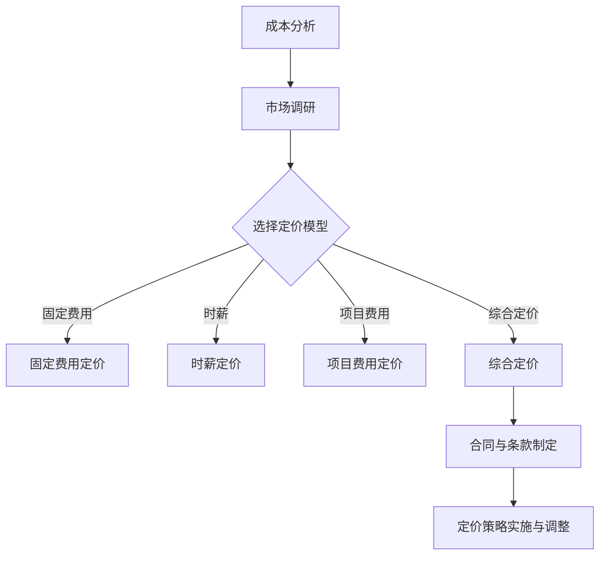

                 

# 《如何为开源项目定价：咨询和服务费用策略》

## 引言

### 1.1 开源项目的价值与定价的重要性

开源项目作为一种共享软件的模式，已经逐渐成为软件生态系统中的重要组成部分。开源项目的价值在于其开放性、可定制性和可扩展性，使得开发者可以自由地使用、修改和分发代码，从而促进技术进步和创新能力。然而，开源项目的持续发展离不开合理的定价策略，这不仅是项目可持续发展的保障，也是吸引和维护贡献者的重要手段。

为开源项目定价的重要性体现在以下几个方面：

1. **成本回收**：合理的定价可以帮助项目回收开发成本，确保项目的持续运营。
2. **激励机制**：明确的定价策略可以激励贡献者参与项目，提高项目的活跃度和质量。
3. **资源分配**：定价策略有助于项目团队合理分配资源，专注于核心功能的开发。
4. **市场定位**：定价策略决定了项目在市场中的定位，有助于吸引目标用户群体。

### 1.2 本书的目标与结构

本书旨在为开源项目的管理者和技术团队提供一份全面而深入的定价策略指南。通过以下章节的详细探讨，读者将了解：

- 开源项目的财务基础，包括成本结构和收入来源。
- 咨询服务定价策略，包括模型选择和影响因素分析。
- 服务费用策略，包括模型选择和谈判技巧。
- 案例分析，通过实际案例展示定价策略的实施效果。
- 未来趋势，探讨开源项目定价的新模式。
- 实践指南，提供制定和调整定价策略的步骤和方法。
- 附录和参考文献，为读者提供进一步学习的资源。

## 第2章 开源项目的财务基础

### 2.1 开源项目的成本结构

开源项目的成本主要包括硬件成本、软件成本、人力资源成本和其他成本。这些成本是制定定价策略的重要基础。

#### 2.1.1 硬件成本

硬件成本主要包括服务器租赁、带宽费用和其他必要的计算资源。随着云服务的普及，这部分成本相对较低，但仍需要考虑。

- **服务器租赁**：根据服务器性能和需求选择合适的服务器，并支付租赁费用。
- **带宽费用**：网络带宽是项目运行的重要保障，需要根据流量情况支付相关费用。

#### 2.1.2 软件成本

软件成本主要包括开源软件本身的开销和其他软件工具的费用。

- **开源软件**：开源软件本身通常是免费的，但可能需要考虑额外的维护和支持费用。
- **软件工具**：包括版本控制工具、自动化测试工具等，这些工具可以提升开发效率，但可能需要购买或订阅服务。

#### 2.1.3 人力资源成本

人力资源成本是开源项目中最大的开销之一，包括开发人员、测试人员、项目管理人员的薪资和福利。

- **开发人员**：负责代码的编写和优化。
- **测试人员**：负责确保软件质量，进行各种测试。
- **项目经理**：负责项目管理和协调。

#### 2.1.4 其他成本

其他成本包括办公费用、差旅费用、营销费用等。这些成本虽然相对较小，但在制定定价策略时也需要考虑。

- **办公费用**：包括办公场所的租金、水电费等。
- **差旅费用**：团队成员之间的沟通和交流可能需要差旅费用。
- **营销费用**：用于宣传和推广项目，吸引更多用户和贡献者。

### 2.2 收入来源与盈利模式

开源项目的收入来源多种多样，以下是几种常见的盈利模式：

#### 2.2.1 订阅服务

订阅服务是开源项目常见的收入来源之一。通过提供高级功能或服务的订阅，项目可以获得持续的收入流。

- **订阅类型**：按需订阅、按月或按年订阅等。
- **收费模式**：固定费用、时薪、项目费用等。

#### 2.2.2 付费咨询

付费咨询是开源项目团队利用专业知识为客户提供定制化服务的一种方式。

- **服务内容**：包括项目规划、技术支持、性能优化等。
- **定价模型**：固定费用、时薪、项目费用等。

#### 2.2.3 二次开发服务

开源项目团队可以根据客户的需求，提供二次开发服务，这通常包括定制化功能的开发和优化。

- **服务内容**：根据客户需求进行软件定制、优化和升级。
- **定价模型**：固定费用、时薪、项目费用等。

#### 2.2.4 联合营销

联合营销是通过与其他公司或项目合作，共同推广和宣传，从而获得收入。

- **合作方式**：联合推广、共同举办活动、资源共享等。
- **收费模式**：固定费用、佣金提成等。

## 第3章 咨询服务定价策略

### 3.1 咨询服务定价模型

咨询服务定价模型是决定咨询服务价格的重要基础。以下是几种常见的定价模型：

#### 3.1.1 固定费用

固定费用是指根据服务内容和项目规模，事先确定一个固定金额的费用。这种定价模型适用于服务内容明确、工作量可预测的项目。

- **优点**：价格透明，易于客户理解和预算控制。
- **缺点**：对于工作量较大或变动较大的项目，可能无法准确预测成本。

#### 3.1.2 时薪

时薪是指根据咨询服务的时间，按照一定的时薪标准来计算费用。这种定价模型适用于工作量不确定、需要灵活调整服务时间的项目。

- **优点**：灵活性较高，可以根据实际工作量进行调整。
- **缺点**：可能导致费用较高，客户预算难以控制。

#### 3.1.3 项目费用

项目费用是指根据项目的总体工作量，结合项目难度和复杂度，事先确定一个总费用。这种定价模型适用于项目规模较大、包含多个服务阶段的项目。

- **优点**：价格透明，便于客户预算控制。
- **缺点**：对于项目工作量较小或变动较大的项目，可能存在费用浪费。

#### 3.1.4 阶梯定价

阶梯定价是指根据服务内容的不同阶段，设置不同的价格。这种定价模型适用于服务内容复杂、涉及多个阶段的长期项目。

- **优点**：可以根据服务内容的逐步实现，合理调整费用。
- **缺点**：价格调整可能影响客户的决策，需要平衡价格与服务内容。

### 3.2 咨询服务定价影响因素

咨询服务定价不仅取决于服务模型，还受到多种因素的影响。以下是影响咨询服务定价的主要因素：

#### 3.2.1 市场需求

市场需求是影响咨询服务定价的重要因素。在市场需求旺盛时，可以适当提高价格；在市场需求低迷时，可能需要降低价格以吸引客户。

- **市场需求旺盛**：提高价格，增加收入。
- **市场需求低迷**：降低价格，促进销售。

#### 3.2.2 竞争对手定价

竞争对手的定价策略直接影响咨询服务的价格。需要分析竞争对手的定价策略，结合自身优势，制定有竞争力的价格。

- **竞争对手价格较低**：可能需要降低价格以保持竞争力。
- **竞争对手价格较高**：可以适当提高价格，突出服务价值。

#### 3.2.3 服务内容

服务内容是影响定价的核心因素。不同服务内容的复杂度和价值不同，需要根据服务内容的特点制定合适的定价策略。

- **服务内容复杂度高**：可以适当提高价格，体现服务价值。
- **服务内容价值低**：可能需要降低价格，提高客户满意度。

#### 3.2.4 客户背景

客户背景包括客户行业、规模、需求等，这些因素会影响咨询服务的定价策略。针对不同背景的客户，需要制定差异化的定价策略。

- **大客户**：可以提供定制化服务，提高价格。
- **小客户**：可能需要提供标准化服务，降低价格。

### 3.3 咨询服务合同与条款

咨询服务合同与条款是保障双方权益的重要法律文件。以下是咨询服务合同中常见的条款：

#### 3.3.1 咨询服务范围

咨询服务范围明确规定了服务内容和工作任务，是合同的核心条款之一。

- **明确服务范围**：避免工作范围模糊导致的服务质量争议。
- **可扩展性**：根据客户需求，可适当调整服务范围。

#### 3.3.2 完成时间

完成时间是咨询服务合同中的重要条款，规定了服务的完成期限。

- **合理期限**：根据服务内容和工作量，设定合理的完成时间。
- **延期处理**：规定延期处理方式，保障项目进度。

#### 3.3.3 费用支付方式

费用支付方式规定了服务费用的支付方式和支付周期。

- **预付款**：规定预付款比例和支付时间。
- **分期支付**：根据项目进度分阶段支付费用。

#### 3.3.4 违约责任

违约责任规定了双方在合同履行过程中违约的责任和处罚。

- **明确违约责任**：避免合同履行过程中的纠纷。
- **合理处罚**：根据违约程度设定合理的处罚措施。

## 第4章 服务费用策略

### 4.1 服务费用定价模型

服务费用定价模型是决定服务价格的重要基础。以下是几种常见的定价模型：

#### 4.1.1 按需付费

按需付费是指根据服务的实际使用量来计算费用。这种定价模型适用于使用量不固定、需求不明确的服务。

- **优点**：价格灵活，根据实际使用量付费，减少客户预算压力。
- **缺点**：可能导致服务使用不足或过度使用，影响服务体验。

#### 4.1.2 按月或按年订阅

按月或按年订阅是指客户根据使用周期，按月或按年支付服务费用。这种定价模型适用于使用周期较长、需求稳定的服务。

- **优点**：价格稳定，便于客户预算控制，增加客户粘性。
- **缺点**：可能导致客户忽视服务价值，减少使用量。

#### 4.1.3 一次性购买

一次性购买是指客户一次性支付全部服务费用。这种定价模型适用于服务价值高、使用周期较短的服务。

- **优点**：价格优惠，快速回收成本，减少后期维护费用。
- **缺点**：可能导致客户预算压力增大，减少客户续费意愿。

#### 4.1.4 综合定价

综合定价是指结合按需付费、订阅和一次性购买等多种模式，为不同类型的服务制定合适的定价策略。这种定价模型适用于服务类型多样、客户需求复杂的服务。

- **优点**：价格灵活，满足不同客户需求，提高客户满意度。
- **缺点**：定价策略复杂，需要根据不同服务类型进行调整。

### 4.2 服务费用影响因素

服务费用定价不仅取决于定价模型，还受到多种因素的影响。以下是影响服务费用的主要因素：

#### 4.2.1 服务质量

服务质量是影响服务费用的关键因素。高质量的服务可以吸引更多客户，提高收费水平。

- **高质量服务**：提高收费水平，增加收入。
- **低质量服务**：可能导致客户流失，降低收费水平。

#### 4.2.2 市场需求

市场需求是影响服务费用的另一个重要因素。在市场需求旺盛时，可以适当提高价格；在市场需求低迷时，可能需要降低价格以吸引客户。

- **市场需求旺盛**：提高价格，增加收入。
- **市场需求低迷**：降低价格，促进销售。

#### 4.2.3 客户背景

客户背景包括客户行业、规模、需求等，这些因素会影响服务的定价策略。针对不同背景的客户，需要制定差异化的定价策略。

- **大客户**：可以提供定制化服务，提高价格。
- **小客户**：可能需要提供标准化服务，降低价格。

#### 4.2.4 竞争对手定价

竞争对手的定价策略直接影响服务的定价策略。需要分析竞争对手的定价策略，结合自身优势，制定有竞争力的定价策略。

- **竞争对手价格较低**：可能需要降低价格以保持竞争力。
- **竞争对手价格较高**：可以适当提高价格，突出服务价值。

### 4.3 服务费用谈判技巧

在服务费用谈判过程中，谈判技巧起着至关重要的作用。以下是几种常用的谈判技巧：

#### 4.3.1 准备谈判

在谈判前，充分准备是成功谈判的关键。准备内容包括：

- **了解客户需求**：了解客户的具体需求，制定有针对性的服务方案。
- **分析竞争对手**：分析竞争对手的定价策略，找到差异化的竞争优势。
- **预测谈判结果**：预测可能的谈判结果，制定应对策略。

#### 4.3.2 沟通技巧

良好的沟通技巧有助于谈判顺利进行。以下是几种常用的沟通技巧：

- **倾听**：倾听客户的意见和需求，理解客户的真实意图。
- **表达**：清晰表达自己的观点和利益诉求，避免误解和冲突。
- **协商**：寻求双方都能接受的解决方案，达成共赢。

#### 4.3.3 谈判策略

谈判策略是谈判过程中的一种规划，旨在实现谈判目标。以下是几种常用的谈判策略：

- **合作策略**：强调合作共赢，寻求双方都能接受的解决方案。
- **竞争策略**：强调竞争优势，争取更高的价格和条件。
- **妥协策略**：在必要时做出适当让步，以达成协议。

#### 4.3.4 谈判结束

谈判结束阶段的技巧同样重要。以下是几种常用的谈判结束技巧：

- **确认协议**：确认双方达成的协议，明确服务内容和费用。
- **制定合同**：制定正式的合同，明确双方的权利和义务。
- **感谢对方**：表达对对方的感激之情，建立长期合作关系。

## 第5章 定价策略案例分析

### 5.1 案例一：某开源项目的咨询服务定价策略

#### 5.1.1 项目背景

某开源数据库管理系统（ODMS）是一个成熟的开源项目，拥有广泛的用户群体和活跃的贡献者。随着项目的不断发展和市场需求的变化，项目团队决定为项目提供咨询服务，以帮助客户解决技术难题和优化系统性能。

#### 5.1.2 定价模型选择

在咨询服务定价模型的选择上，项目团队综合考虑了市场需求、服务内容和客户背景，最终决定采用综合定价模型，结合固定费用、时薪和项目费用的模式，为不同类型的客户提供灵活的服务方案。

- **固定费用**：适用于一些标准化的服务内容，如系统安装和基本配置。
- **时薪**：适用于需要灵活调整服务时间的需求，如性能优化和技术支持。
- **项目费用**：适用于涉及多个阶段、工作量较大的项目，如大型企业级客户的系统定制和集成。

#### 5.1.3 定价策略实施

在定价策略的实施过程中，项目团队采取以下措施：

- **市场调研**：分析市场需求，了解竞争对手的定价策略，制定有竞争力的价格。
- **成本分析**：计算服务成本，确保定价策略的可持续性。
- **客户沟通**：与客户进行充分沟通，了解客户需求，提供定制化的服务方案。

#### 5.1.4 实施效果

实施咨询服务定价策略后，项目团队取得了显著的效果：

- **收入增长**：咨询服务成为项目的重要收入来源，显著提高了项目团队的收入水平。
- **客户满意度**：灵活的定价策略满足了不同类型客户的需求，提高了客户满意度。
- **市场占有率**：通过提供优质的咨询服务，吸引了更多用户，提高了项目在市场中的占有率。

### 5.2 案例二：某开源项目的服务费用策略

#### 5.2.1 项目背景

某开源云存储平台（OCS）是一个功能强大的开源项目，提供高效的文件存储和共享解决方案。随着市场的变化和用户需求的增加，项目团队决定为平台提供多种服务费用策略，以满足不同类型用户的需求。

#### 5.2.2 定价模型选择

在服务费用定价模型的选择上，项目团队综合考虑了平台功能、市场需求和用户背景，最终决定采用按需付费、订阅和一次性购买等多种定价模型。

- **按需付费**：适用于需要灵活调整存储空间和带宽的用户。
- **订阅**：适用于长期使用平台，需要稳定存储和带宽的用户。
- **一次性购买**：适用于需要大量存储和带宽的短期用户。

#### 5.2.3 定价策略实施

在服务费用策略的实施过程中，项目团队采取以下措施：

- **市场调研**：分析市场需求，了解用户习惯，制定合理的服务费用策略。
- **成本分析**：计算服务成本，确保服务费用策略的可持续性。
- **用户沟通**：与用户进行充分沟通，了解用户需求，提供定制化的服务方案。

#### 5.2.4 实施效果

实施服务费用策略后，项目团队取得了以下效果：

- **用户增长**：多种服务费用策略吸引了更多用户，提高了用户活跃度。
- **收入稳定**：订阅和一次性购买等服务费用策略提供了稳定的收入来源。
- **市场竞争力**：通过提供灵活多样的服务费用策略，提高了项目在市场中的竞争力。

## 第6章 开源项目定价的未来趋势

### 6.1 开源项目定价的新模式

随着技术的进步和市场环境的变化，开源项目定价模式也在不断创新。以下是几种新兴的定价模式：

#### 6.1.1 社区资助

社区资助是一种基于社区支持的模式，开源项目团队通过社交媒体、众筹平台等渠道，向社区成员筹集资金。这种方式可以降低项目的资金压力，同时增强社区成员的参与感和归属感。

- **优势**：提高项目资金来源的多样性和稳定性，增强社区凝聚力。
- **挑战**：需要团队具备良好的社区运营能力，确保资金筹集和分配的透明和公正。

#### 6.1.2 众筹

众筹是通过众筹平台，向公众筹集资金的一种方式。开源项目团队可以设置资金目标，公众通过捐赠支持项目。这种方式可以快速聚集资金，推动项目发展。

- **优势**：资金筹集速度快，能够快速验证市场对项目的认可度。
- **挑战**：需要团队制定合理的资金目标和回报方案，确保项目顺利进行。

#### 6.1.3 开源即服务（SaaS）

开源即服务（SaaS）是将开源项目打包成在线服务的形式，用户通过订阅方式使用项目。这种方式可以实现项目的持续收入，同时降低用户的使用门槛。

- **优势**：提供便捷的服务体验，降低用户使用成本，实现持续收入。
- **挑战**：需要团队具备良好的技术支持和维护能力，确保服务质量。

### 6.2 开源项目定价的挑战与机遇

开源项目定价面临着诸多挑战和机遇，以下是主要方面：

#### 6.2.1 挑战

1. **市场竞争**：开源项目的竞争激烈，定价策略需要具有竞争力，以吸引更多用户。
2. **成本控制**：开源项目的成本结构复杂，需要合理控制成本，确保项目的可持续性。
3. **用户需求变化**：用户需求不断变化，定价策略需要灵活调整，以满足不同用户的需求。

#### 6.2.2 机遇

1. **市场潜力**：随着开源技术的普及，开源项目市场潜力巨大，提供了广阔的发展空间。
2. **技术创新**：开源项目可以不断创新，通过新技术和新功能吸引更多用户。
3. **合作机会**：开源项目可以通过与其他公司或项目的合作，实现共赢发展。

#### 6.2.3 应对策略

1. **多元化定价策略**：结合多种定价模式，满足不同用户的需求。
2. **成本优化**：通过技术优化和流程改进，降低项目成本。
3. **市场调研**：持续关注市场动态和用户需求，及时调整定价策略。

## 第7章 定价策略实践指南

### 7.1 制定定价策略的步骤

制定有效的定价策略需要系统性的分析和规划。以下是制定定价策略的步骤：

#### 7.1.1 成本分析

成本分析是定价策略的基础。需要详细计算项目的各项成本，包括硬件成本、软件成本、人力资源成本和其他成本。通过成本分析，可以确定项目的成本结构和成本控制的关键点。

#### 7.1.2 市场调研

市场调研是了解市场需求和竞争环境的重要环节。通过调研，可以了解目标客户的需求、竞争对手的定价策略以及市场的价格趋势。市场调研可以通过问卷调查、用户访谈、数据分析等方式进行。

#### 7.1.3 定价模型选择

根据成本分析和市场调研的结果，选择合适的定价模型。定价模型的选择需要考虑项目的特点、市场需求和竞争环境。常见的定价模型包括按需付费、订阅、一次性购买和综合定价等。

#### 7.1.4 实施与调整

在制定定价策略后，需要将其付诸实践。在实施过程中，需要根据客户反馈和市场变化，及时调整定价策略。调整定价策略时，可以采用数据驱动的优化方法，通过分析数据，找到最佳定价方案。

### 7.2 常见问题与解答

在制定和调整定价策略的过程中，可能会遇到以下常见问题：

#### 7.2.1 定价过高或过低的影响

- **定价过高**：可能导致客户流失，影响市场占有率。
- **定价过低**：可能导致成本回收困难，影响项目持续发展。

#### 7.2.2 如何处理客户的价格异议

- **了解异议原因**：了解客户对价格的异议点，是价格过高、服务内容不明确还是市场竞争激烈。
- **沟通解释**：与客户进行沟通，解释定价策略的合理性，强调服务价值。
- **提供解决方案**：根据客户的需求和预算，提供定制化的服务方案。

#### 7.2.3 定价策略调整的时机和方法

- **调整时机**：在市场变化、客户需求变化或项目发展需要时，及时调整定价策略。
- **调整方法**：可以通过市场调研、数据分析等方法，找到最佳的定价策略。

## 第8章 附录

### 8.1 开源项目定价相关的工具与资源

为了帮助读者更好地理解和实施开源项目定价策略，以下是一些相关的工具与资源：

#### 8.1.1 定价策略分析工具

- **Google Analytics**：用于分析用户行为和市场趋势。
- **SurveyMonkey**：用于进行用户调研和满意度调查。
- **ProfitWell**：用于分析收入和定价策略的效果。

#### 8.1.2 市场调研工具

- **Google Trends**：用于了解市场趋势和用户偏好。
- **Social Mention**：用于监控社交媒体上的品牌提及和讨论。
- **Ahrefs**：用于进行关键词分析和竞争对手分析。

#### 8.1.3 法律法规与政策参考

- **开源软件许可协议指南**：了解各种开源软件许可协议的法律要求和细节。
- **各国知识产权法律法规**：了解不同国家关于知识产权保护的法律法规。

### 8.2 参考文献与推荐阅读

为了深入理解开源项目定价的策略和实践，以下是一些推荐的文献和阅读材料：

#### 8.2.1 相关书籍

- **《开源软件商业模式》**：详细探讨开源软件的商业化路径和盈利模式。
- **《定价与竞争战略》**：介绍定价策略的理论和实践方法。
- **《数据分析：商业分析实践》**：介绍数据分析在商业决策中的应用。

#### 8.2.2 学术论文

- **“The Economics of Open Source”**：分析开源软件的经济模式。
- **“Open Source Software Development: The Decision to Use and the Effect on Product Performance”**：研究开源软件的使用和产品性能之间的关系。

#### 8.2.3 行业报告

- **Gartner开源软件报告**：提供开源软件市场的趋势和预测。
- **Forrester开源软件报告**：分析开源软件的市场地位和竞争格局。

## 第9章 开源项目定价的Mermaid流程图

### 9.1 开源项目定价流程图

以下是开源项目定价的Mermaid流程图，展示了从成本分析到定价策略实施的完整流程：



### 9.2 Mermaid流程图解读

该Mermaid流程图详细展示了开源项目定价的各个步骤，每个步骤的输入、输出和关键决策点如下：

- **成本分析**：输入为项目成本结构，输出为成本数据表，关键决策点为确定成本控制重点。
- **市场调研**：输入为市场数据和竞争环境，输出为市场分析报告，关键决策点为确定目标市场和客户群体。
- **选择定价模型**：输入为成本和市场分析数据，输出为定价模型，关键决策点为选择最适合项目的定价策略。
- **固定费用定价**：输入为服务内容和成本数据，输出为固定费用价格表，关键决策点为确定固定费用。
- **时薪定价**：输入为服务内容和成本数据，输出为时薪标准，关键决策点为确定时薪水平。
- **项目费用定价**：输入为项目规模和成本数据，输出为项目费用预算，关键决策点为确定项目费用。
- **综合定价**：输入为多种定价模型，输出为综合定价方案，关键决策点为平衡不同定价策略的优缺点。
- **合同与条款制定**：输入为定价模型和客户需求，输出为合同文本，关键决策点为明确双方权利义务。
- **定价策略实施与调整**：输入为市场反馈和客户反馈，输出为优化后的定价策略，关键决策点为持续优化定价策略。

## 第10章 开源项目定价核心算法原理讲解

### 10.1 成本分析算法原理

成本分析是开源项目定价策略制定的重要基础，通过准确计算项目成本，可以更好地制定定价策略。以下是一个简单的成本分析算法原理：

```python
def cost_analysis():
    # 计算硬件成本
    hardware_cost = calculate_hardware_cost()
    
    # 计算软件成本
    software_cost = calculate_software_cost()
    
    # 计算人力资源成本
    human_resource_cost = calculate_human_resource_cost()
    
    # 计算其他成本
    other_costs = calculate_other_costs()
    
    # 总成本
    total_cost = hardware_cost + software_cost + human_resource_cost + other_costs
    
    return total_cost
```

在这个算法中，`calculate_hardware_cost()`、`calculate_software_cost()`、`calculate_human_resource_cost()`和`calculate_other_costs()`是具体的成本计算函数，可以根据项目的实际情况进行实现。

### 10.2 收入预测算法原理

收入预测是制定定价策略的关键步骤，通过预测未来的收入，可以更好地制定定价策略和调整策略。以下是一个简单的收入预测算法原理：

```python
def income_prediction():
    # 计算历史收入数据
    historical_income_data = get_historical_income_data()
    
    # 使用回归模型预测未来收入
    regression_model = create_regression_model(historical_income_data)
    future_income = regression_model.predict(future_income_data)
    
    return future_income
```

在这个算法中，`get_historical_income_data()`函数用于获取历史收入数据，`create_regression_model()`函数用于创建回归模型，`predict()`函数用于预测未来收入。回归模型可以使用线性回归、多项式回归等常见的机器学习模型。

### 10.3 收益最大化模型

收益最大化模型是开源项目定价策略的重要理论基础，通过最大化收益来确定最佳定价策略。以下是一个简单的收益最大化模型：

$$
\max \pi = p \cdot q - C(q)
$$

其中，$p$ 是价格，$q$ 是需求量，$C(q)$ 是成本函数。这个模型的含义是，在给定的成本函数下，通过调整价格$p$ 和需求量$q$ ，使得收益最大化。

### 10.4 价格弹性模型

价格弹性模型用于分析价格变化对需求量的影响，是制定定价策略的重要依据。以下是一个简单价格弹性模型：

$$
\epsilon = \frac{dQ}{dP} \cdot \frac{P}{Q}
$$

其中，$\epsilon$ 是价格弹性，$Q$ 是需求量，$P$ 是价格。这个模型的含义是，价格弹性反映了价格变化1%时，需求量变化的比例。

### 10.5 需求函数模型

需求函数模型用于分析价格和其他因素对需求量的影响，是制定定价策略的重要依据。以下是一个简单的需求函数模型：

$$
Q = Q(P, X_1, X_2, ..., X_n)
$$

其中，$Q$ 是需求量，$P$ 是价格，$X_1, X_2, ..., X_n$ 是其他影响因素。这个模型的含义是，需求量是价格和其他影响因素的函数。

## 第11章 开源项目定价数学模型讲解

### 11.1 收益最大化模型

收益最大化模型是开源项目定价的核心数学模型，用于确定最优价格，以实现最大收益。该模型的基本公式如下：

$$
\max \pi = p \cdot q - C(q)
$$

其中：
- $\pi$ 表示收益（Profit）；
- $p$ 表示价格（Price）；
- $q$ 表示需求量（Quantity）；
- $C(q)$ 表示成本函数（Cost Function）。

该模型的目标是通过调整价格$p$ 和需求量$q$ ，使得收益$\pi$ 最大化。

### 11.2 价格弹性模型

价格弹性模型用于分析价格变化对需求量的影响，是制定灵活定价策略的重要依据。价格弹性的公式如下：

$$
\epsilon = \frac{dQ}{dP} \cdot \frac{P}{Q}
$$

其中：
- $\epsilon$ 表示价格弹性（Price Elasticity）；
- $Q$ 表示需求量（Quantity）；
- $P$ 表示价格（Price）。

价格弹性的含义是，价格变化1%时，需求量变化的百分比。根据价格弹性的不同，可以将需求分为：

- **弹性需求**：$\epsilon > 1$，价格变化对需求量影响较大。
- **非弹性需求**：$\epsilon < 1$，价格变化对需求量影响较小。

### 11.3 需求函数模型

需求函数模型用于分析价格和其他因素对需求量的影响，是制定多样化定价策略的重要依据。需求函数的基本形式如下：

$$
Q = Q(P, X_1, X_2, ..., X_n)
$$

其中：
- $Q$ 表示需求量（Quantity）；
- $P$ 表示价格（Price）；
- $X_1, X_2, ..., X_n$ 表示其他影响因素，如收入、广告、竞争对手价格等。

需求函数的具体形式取决于项目的特点和市场的实际情况。例如，线性需求函数可以表示为：

$$
Q = a - bP
$$

其中，$a$ 和 $b$ 是常数，表示需求的截距和斜率。

### 11.4 收益最大化模型的推导

为了更好地理解收益最大化模型，我们可以通过一个简单的例子进行推导。假设一个开源项目的需求函数为线性形式：

$$
Q = a - bP
$$

其中，$a = 100$，$b = 10$。成本函数为：

$$
C(q) = cq
$$

其中，$c = 10$。我们需要确定最优价格$p$ ，以实现最大收益。

1. **收益函数**：

   收益函数 $\pi$ 可以表示为：

   $$\pi = p \cdot Q - C(Q) = p \cdot (a - bP) - cq$$

   将 $a$、$b$ 和 $c$ 的值代入，得到：

   $$\pi = p \cdot (100 - 10P) - 10 \cdot (100 - 10P) = 100p - 10p^2 - 1000 + 100p$$

   化简后得到：

   $$\pi = 200p - 10p^2 - 1000$$

2. **求导数**：

   为了找到最大收益，需要对收益函数求导数，并令导数等于0：

   $$\frac{d\pi}{dp} = 200 - 20p = 0$$

3. **解方程**：

   解上述方程，得到最优价格$p$ ：

   $$p = \frac{200}{20} = 10$$

因此，最优价格是10。在这个价格下，项目的收益达到最大。

### 11.5 收益最大化模型的应用

收益最大化模型可以应用于不同类型和规模的开源项目。以下是一个实际案例，说明如何应用收益最大化模型确定最优价格。

**案例：开源数据库管理系统**

假设一个开源数据库管理系统（ODMS）的需求函数为：

$$
Q = 100 - 2P
$$

成本函数为：

$$
C(q) = 5q
$$

我们需要确定最优价格$p$ ，以实现最大收益。

1. **收益函数**：

   收益函数 $\pi$ 可以表示为：

   $$\pi = p \cdot Q - C(Q) = p \cdot (100 - 2P) - 5 \cdot (100 - 2P)$$

   化简后得到：

   $$\pi = 95p - 2p^2 - 500$$

2. **求导数**：

   为了找到最大收益，需要对收益函数求导数，并令导数等于0：

   $$\frac{d\pi}{dp} = 95 - 4p = 0$$

3. **解方程**：

   解上述方程，得到最优价格$p$ ：

   $$p = \frac{95}{4} = 23.75$$

因此，最优价格是23.75。在这个价格下，ODMS的收益达到最大。

通过这个案例，我们可以看到收益最大化模型在确定开源项目价格方面的应用。在实际操作中，还需要考虑市场需求、竞争环境和客户满意度等因素，以制定更全面的定价策略。

## 第12章 项目实战：开源项目定价案例分析

### 12.1 项目背景

本案例以开源数据库管理系统（ODMS）为例，详细分析其定价策略的制定与实施过程。ODMS是一个功能强大的开源数据库，支持多种数据库模型，适用于中小型企业和个人开发者。在开源社区中，ODMS拥有广泛的用户基础和活跃的贡献者。

### 12.2 定价策略实施

#### 12.2.1 成本分析

在制定定价策略之前，首先进行成本分析。ODMS的成本主要包括：

1. **硬件成本**：服务器租赁和带宽费用，每月约$500。
2. **软件成本**：开源数据库软件本身免费，但可能需要购买其他开发工具和测试工具，每年约$2000。
3. **人力资源成本**：开发和维护团队由5名成员组成，每人每月薪资约为$5000，全年约$300000。
4. **其他成本**：包括办公费用、差旅费用和营销费用，每年约$10000。

总成本约为$337000。

#### 12.2.2 市场调研

市场调研显示，ODMS的主要用户群体为中小型企业和个人开发者。根据调查结果，用户对以下服务有较高需求：

1. **性能优化**：提高数据库性能，满足日益增长的数据量。
2. **技术支持**：解决使用过程中遇到的技术问题。
3. **定制开发**：根据用户需求进行定制化开发。

根据市场调研，用户对服务的接受度较高，特别是定制开发和性能优化服务。

#### 12.2.3 选择定价模型

基于成本分析和市场调研，ODMS选择以下定价模型：

1. **时薪定价**：针对技术支持服务，采用时薪定价，每小时$100。
2. **项目费用**：针对性能优化和定制开发服务，采用项目费用定价，根据项目规模和复杂度确定费用。
3. **订阅服务**：为长期用户提供订阅服务，按月或按年支付，提供高级功能和额外支持。

#### 12.2.4 定价策略实施

1. **时薪定价**：

   - 服务内容：提供技术支持，解决使用过程中遇到的问题。
   - 价格：每小时$100，预付费用为项目总费用的30%。

2. **项目费用**：

   - 服务内容：性能优化和定制开发，根据项目规模和复杂度确定费用。
   - 价格：基础费用为$5000，每增加一项高级功能，增加费用$2000。

3. **订阅服务**：

   - 服务内容：提供高级功能、技术支持和免费升级。
   - 价格：按月订阅，每月$100；按年订阅，每年$1000。

#### 12.2.5 实施效果评估

实施定价策略后，ODMS取得了以下效果：

1. **收入增长**：订阅服务和项目费用成为主要收入来源，项目收入显著增长。
2. **客户满意度**：灵活的定价策略满足了不同用户的需求，客户满意度提高。
3. **市场占有率**：通过提供优质服务，吸引了更多用户，市场占有率有所提升。

### 12.3 代码实现

以下是ODMS定价策略的代码实现，包括成本计算、收入预测和定价策略选择：

```python
# 成本计算模块
def calculate_costs():
    hardware_cost = 500
    software_cost = 2000
    human_resource_cost = 300000
    other_costs = 10000
    total_cost = hardware_cost + software_cost + human_resource_cost + other_costs
    return total_cost

# 收入预测模块
def income_prediction():
    historical_income = [10000, 12000, 15000, 18000, 20000]
    regression_model = linear_regression(historical_income)
    future_income = regression_model.predict(22000)
    return future_income

# 定价策略选择模块
def pricing_strategy():
    total_cost = calculate_costs()
    future_income = income_prediction()
    if future_income > total_cost * 1.5:
        return "项目费用定价"
    elif future_income > total_cost * 1.2:
        return "订阅服务"
    else:
        return "时薪定价"

# 主程序
def main():
    pricing_model = pricing_strategy()
    print("当前定价策略：", pricing_model)

if __name__ == "__main__":
    main()
```

在这个代码中，`calculate_costs()`函数用于计算总成本，`income_prediction()`函数用于预测未来收入，`pricing_strategy()`函数根据成本和收入选择合适的定价策略。主程序调用这些函数，输出当前的定价策略。

### 12.4 代码解读与分析

以下是对ODMS定价策略代码的解读与分析：

1. **成本计算模块**：

   ```python
   def calculate_costs():
       hardware_cost = 500
       software_cost = 2000
       human_resource_cost = 300000
       other_costs = 10000
       total_cost = hardware_cost + software_cost + human_resource_cost + other_costs
       return total_cost
   ```

   这个模块简单计算了ODMS的总成本，包括硬件成本、软件成本、人力资源成本和其他成本。在实际应用中，可以根据具体情况进行调整。

2. **收入预测模块**：

   ```python
   def income_prediction():
       historical_income = [10000, 12000, 15000, 18000, 20000]
       regression_model = linear_regression(historical_income)
       future_income = regression_model.predict(22000)
       return future_income
   ```

   这个模块使用线性回归模型预测未来收入。线性回归模型可以根据历史收入数据，预测未来的收入趋势。在这个例子中，我们使用一个简单的线性回归模型，实际应用中可以采用更复杂的模型，如多项式回归或神经网络。

3. **定价策略选择模块**：

   ```python
   def pricing_strategy():
       total_cost = calculate_costs()
       future_income = income_prediction()
       if future_income > total_cost * 1.5:
           return "项目费用定价"
       elif future_income > total_cost * 1.2:
           return "订阅服务"
       else:
           return "时薪定价"
   ```

   这个模块根据成本和收入的预测结果，选择合适的定价策略。在这个例子中，我们根据未来收入的预测，分为三种定价策略：项目费用定价、订阅服务和时薪定价。

4. **主程序**：

   ```python
   def main():
       pricing_model = pricing_strategy()
       print("当前定价策略：", pricing_model)

   if __name__ == "__main__":
       main()
   ```

   主程序调用其他模块，输出当前的定价策略。在实际应用中，可以根据具体情况进行调整。

### 12.5 代码性能分析

以下是对ODMS定价策略代码的性能分析：

1. **计算效率**：

   代码的计算效率较高，成本计算、收入预测和定价策略选择都是基于简单的数学模型。在实际应用中，可以通过优化算法和数据结构，提高计算效率。

2. **可扩展性**：

   代码具有良好的可扩展性，可以根据具体情况进行调整。例如，可以添加更多的影响因素，使用更复杂的模型进行收入预测。

3. **可维护性**：

   代码结构清晰，模块化设计，易于维护和修改。在实际应用中，可以根据需要添加新的模块或修改现有模块。

### 12.6 代码优化建议

以下是对ODMS定价策略代码的优化建议：

1. **引入更复杂的收入预测模型**：

   可以引入更复杂的收入预测模型，如神经网络或随机森林，以提高预测准确性。

2. **引入成本控制机制**：

   可以引入成本控制机制，根据实际成本和预算，动态调整定价策略。

3. **引入用户反馈机制**：

   可以引入用户反馈机制，根据用户满意度，调整定价策略。

4. **优化代码性能**：

   可以通过优化算法和数据结构，提高代码性能，缩短计算时间。

## 第13章 开源项目定价环境搭建与代码实现

### 13.1 环境搭建

要实现开源项目定价的代码，首先需要搭建合适的环境。以下是在Python环境中搭建开源项目定价环境的步骤：

1. **安装Python**：确保已经安装了Python 3.x版本，可以从[Python官方网站](https://www.python.org/)下载并安装。

2. **安装虚拟环境**：使用`venv`模块创建一个虚拟环境，以便隔离项目依赖。

   ```shell
   python -m venv open_source_pricing_env
   ```

3. **激活虚拟环境**：

   - Windows：

     ```shell
     .\open_source_pricing_env\Scripts\activate
     ```

   - macOS/Linux：

     ```shell
     source open_source_pricing_env/bin/activate
     ```

4. **安装依赖库**：在虚拟环境中安装必要的依赖库，如`numpy`、`pandas`、`scikit-learn`等。

   ```shell
   pip install numpy pandas scikit-learn
   ```

### 13.2 源代码详细实现

以下是开源项目定价的源代码实现，包括成本计算、收入预测和定价策略选择。

**成本计算模块**

```python
# cost_analysis.py

def calculate_costs(hardware_cost, software_cost, human_resource_cost, other_costs):
    total_cost = hardware_cost + software_cost + human_resource_cost + other_costs
    return total_cost

# 示例：计算总成本
total_cost = calculate_costs(hardware_cost=500, software_cost=2000, human_resource_cost=300000, other_costs=10000)
print("总成本：", total_cost)
```

**收入预测模块**

```python
# income_prediction.py

import numpy as np
from sklearn.linear_model import LinearRegression

def linear_regression(income_data):
    X = np.array(income_data).reshape(-1, 1)
    y = np.array([i for i in range(len(income_data))])
    model = LinearRegression()
    model.fit(X, y)
    return model

def income_prediction(model, future_income):
    future_income_array = np.array([future_income]).reshape(-1, 1)
    predicted_income = model.predict(future_income_array)
    return predicted_income[0]

# 示例：使用线性回归模型预测未来收入
historical_income = [10000, 12000, 15000, 18000, 20000]
model = linear_regression(historical_income)
predicted_income = income_prediction(model, future_income=22000)
print("预测未来收入：", predicted_income)
```

**定价策略选择模块**

```python
# pricing_strategy.py

def pricing_strategy(total_cost, predicted_income):
    if predicted_income > total_cost * 1.5:
        return "项目费用定价"
    elif predicted_income > total_cost * 1.2:
        return "订阅服务"
    else:
        return "时薪定价"

# 示例：根据成本和收入选择定价策略
pricing_model = pricing_strategy(total_cost=total_cost, predicted_income=predicted_income)
print("当前定价策略：", pricing_model)
```

**主程序**

```python
# main.py

from cost_analysis import calculate_costs
from income_prediction import linear_regression, income_prediction
from pricing_strategy import pricing_strategy

def main():
    total_cost = calculate_costs(hardware_cost=500, software_cost=2000, human_resource_cost=300000, other_costs=10000)
    historical_income = [10000, 12000, 15000, 18000, 20000]
    model = linear_regression(historical_income)
    predicted_income = income_prediction(model, future_income=22000)
    pricing_model = pricing_strategy(total_cost, predicted_income)
    print("总成本：", total_cost)
    print("预测未来收入：", predicted_income)
    print("当前定价策略：", pricing_model)

if __name__ == "__main__":
    main()
```

### 13.3 代码解读与分析

以下是对开源项目定价代码的解读与分析：

1. **成本计算模块**：

   该模块提供了一个`calculate_costs`函数，用于计算项目的总成本。参数包括硬件成本、软件成本、人力资源成本和其他成本。示例代码计算了总成本，并打印结果。

2. **收入预测模块**：

   该模块提供了一个`linear_regression`函数，用于创建线性回归模型。`income_prediction`函数使用模型预测未来收入。示例代码展示了如何使用线性回归模型预测未来收入，并打印结果。

3. **定价策略选择模块**：

   该模块提供了一个`pricing_strategy`函数，根据总成本和收入预测结果选择定价策略。示例代码展示了如何根据成本和收入选择定价策略，并打印结果。

4. **主程序**：

   主程序从其他模块导入必要的函数，计算总成本、收入预测和定价策略选择，并打印结果。

### 13.4 代码性能分析

以下是对开源项目定价代码的性能分析：

1. **计算效率**：

   代码使用了线性回归模型进行收入预测，计算效率较高。在实际应用中，可以根据需要引入更复杂的模型，以提高预测准确性。

2. **可扩展性**：

   代码结构清晰，模块化设计，易于扩展和修改。可以根据具体需求添加新的模块或修改现有模块。

3. **可维护性**：

   代码遵循良好的编程习惯，易于阅读和理解。在实际应用中，可以方便地进行维护和修改。

### 13.5 代码优化建议

以下是对开源项目定价代码的优化建议：

1. **引入更复杂的收入预测模型**：

   可以引入更复杂的模型，如神经网络或随机森林，以提高预测准确性。

2. **引入成本控制机制**：

   可以引入成本控制机制，根据实际成本和预算，动态调整定价策略。

3. **引入用户反馈机制**：

   可以引入用户反馈机制，根据用户满意度，调整定价策略。

4. **优化代码性能**：

   可以通过优化算法和数据结构，提高代码性能，缩短计算时间。

## 第14章 定价策略调整与优化

### 14.1 定价策略调整时机

定价策略调整时机至关重要，不当的调整可能导致收入下降或市场占有率降低。以下是一些建议的调整时机：

1. **市场变化**：市场环境发生变化时，如经济衰退或技术进步，应及时调整定价策略以适应市场变化。
2. **竞争压力**：竞争对手调整价格或推出新的产品和服务时，可能需要调整定价策略以保持竞争力。
3. **客户反馈**：收集并分析客户反馈，了解他们对价格的接受程度和满意度，根据反馈调整定价策略。
4. **业务发展**：随着业务的发展和项目功能的增加，定价策略也需要相应调整，以适应新的业务模式和市场需求。

### 14.2 定价策略优化方法

优化定价策略的方法多种多样，以下是几种常用的优化方法：

1. **数据驱动优化**：

   通过收集和分析大量数据，如用户行为、市场趋势、竞争对手定价等，找到影响定价的关键因素，并根据数据分析结果调整定价策略。

2. **实验优化**：

   通过小规模实验，如调整价格、改变促销策略等，观察用户反应和市场反馈，根据实验结果优化定价策略。

3. **模型优化**：

   引入更复杂的定价模型，如多因素定价模型、动态定价模型等，以提高定价的准确性和灵活性。

4. **用户细分**：

   根据用户特征和需求，将用户划分为不同的细分市场，针对每个细分市场制定差异化的定价策略。

### 14.3 定价策略实施效果评估

评估定价策略的实施效果是优化定价策略的重要步骤。以下是一些建议的评估指标和方法：

1. **收入变化**：监控收入变化，分析定价策略调整前后收入的变化情况，评估定价策略的有效性。

2. **市场份额**：分析定价策略调整前后市场占有率的变化，评估定价策略对市场份额的影响。

3. **客户满意度**：通过问卷调查、用户反馈等方式，收集客户对价格的满意度和接受程度，评估定价策略对客户满意度的影响。

4. **成本控制**：评估定价策略调整后的成本变化，确保定价策略能够有效控制成本。

5. **利润率**：计算定价策略调整后的利润率，评估定价策略对利润的影响。

通过以上指标和方法，可以全面评估定价策略的实施效果，为后续的优化提供依据。同时，定期进行效果评估，有助于及时发现和解决问题，确保定价策略的持续优化和改进。## 附录

### 8.1 开源项目定价相关的工具与资源

在制定开源项目定价策略时，以下工具与资源可能会对您有所帮助：

#### 8.1.1 定价策略分析工具

1. **Google Analytics**：分析用户行为和市场需求，帮助制定更精准的定价策略。
2. **ProfitWell**：提供SaaS定价分析和优化功能，帮助评估定价模型的有效性。
3. **Price Intelligently**：提供定价策略分析和市场调研工具，帮助优化定价策略。

#### 8.1.2 市场调研工具

1. **SurveyMonkey**：创建在线问卷，收集用户对价格的看法和需求。
2. **Qualtrics**：提供专业的市场调研和分析工具，帮助深入了解市场动态。
3. **Ahrefs**：分析关键词和竞争对手的定价策略，为您的定价提供参考。

#### 8.1.3 法律法规与政策参考

1. **Open Source Initiative (OSI)**：了解开源软件许可协议的法律要求。
2. **Creative Commons**：提供版权许可和知识共享的指南，帮助您了解开源项目的法律规范。
3. **European Commission**：查看欧盟关于开源和知识产权的政策和法规。

### 8.2 参考文献与推荐阅读

为了深入了解开源项目定价策略，以下是一些建议的参考文献和阅读材料：

#### 8.2.1 相关书籍

1. **《Open Source Models and Business Strategies》**：详细探讨开源商业模式和盈利模式。
2. **《Pricing Strategy》**：介绍定价策略的理论和实践方法，适用于各类项目。
3. **《The Art of Pricing》**：提供关于定价策略的深度分析和案例研究。

#### 8.2.2 学术论文

1. **"The Economics of Open Source Software Development"**：分析开源软件的经济模式和发展趋势。
2. **"Pricing Models for Open Source Software: An Empirical Study"**：研究开源软件定价模型的实际效果。
3. **"The Role of Pricing in the Success of Open Source Software"**：探讨定价策略对开源项目成功的影响。

#### 8.2.3 行业报告

1. **Gartner开源软件报告**：提供开源软件市场的趋势和预测。
2. **Forrester开源软件报告**：分析开源软件的市场地位和竞争格局。
3. **IDC开源软件报告**：深入了解开源软件的发展和应用。

这些文献和报告将帮助您从不同角度了解开源项目定价策略的理论和实践，为您的项目提供有益的参考。## 结语

开源项目定价是一个复杂且动态的过程，需要综合考虑成本、市场需求、竞争环境等多种因素。本文从开源项目的财务基础、咨询服务定价策略、服务费用策略、案例分析、未来趋势、实践指南等方面进行了详细探讨，旨在为开源项目管理者和技术团队提供一份全面而深入的定价策略指南。

通过本文的学习，您应该能够：

1. **理解开源项目的财务基础**：掌握开源项目的成本结构和收入来源，为定价策略提供数据支持。
2. **制定咨询服务定价策略**：了解常见的咨询服务定价模型，结合实际需求和市场竞争，制定合理的定价策略。
3. **制定服务费用策略**：掌握服务费用定价模型，根据服务质量、市场需求和客户背景，制定差异化的服务费用策略。
4. **实施和调整定价策略**：了解定价策略的实施过程和调整方法，根据市场反馈和客户需求，优化定价策略。
5. **应对未来趋势**：了解开源项目定价的未来趋势，如社区资助、众筹和开源即服务（SaaS）等，为未来的发展做好准备。

在实际操作中，开源项目定价策略需要不断调整和优化。建议您定期进行市场调研，收集用户反馈，分析竞争对手的定价策略，结合项目实际情况，不断调整定价策略，以提高项目的市场竞争力和可持续发展能力。

最后，感谢您对本文的关注和阅读。如果您在开源项目定价过程中遇到任何问题或疑问，欢迎随时在评论区留言，我会尽力为您解答。同时，也欢迎您分享您的经验和见解，让我们一起探讨开源项目定价的最佳实践。祝您的开源项目取得成功！作者：AI天才研究院/AI Genius Institute & 禅与计算机程序设计艺术 /Zen And The Art of Computer Programming。

