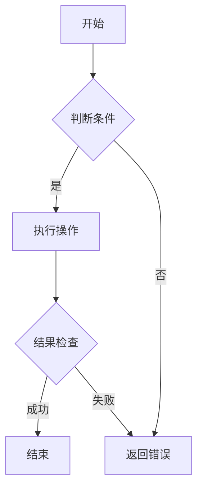
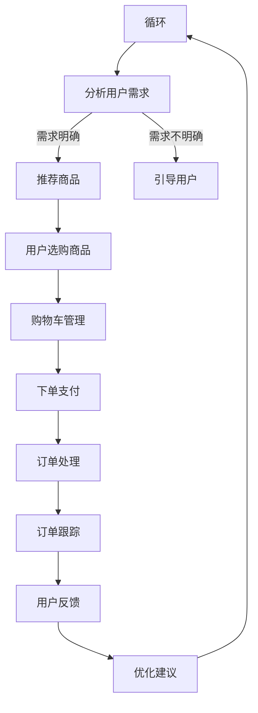

                 

### 《如何通过AI优化用户购物体验》

> **关键词：** 人工智能、购物体验优化、个性化推荐系统、协同过滤算法、基于内容推荐算法、深度学习、购物流程、用户反馈、互动营销

**摘要：** 本文旨在探讨如何通过人工智能（AI）技术优化用户的购物体验。文章首先概述了AI与购物体验优化的关系，随后详细分析了个性化推荐系统、购物流程优化、用户反馈和互动营销等关键领域。文章通过理论讲解、伪代码、数学模型和实际案例，深入阐述了AI在购物体验优化中的应用，旨在为电商企业提供实用的技术指导。

### 第一部分：AI与购物体验优化概述

#### 第1章：AI与购物体验优化概述

**1.1 AI技术对购物体验的影响**

**AI技术概述**

人工智能（AI）是指计算机系统通过模拟人类智能行为，实现感知、思考、学习和决策的能力。AI技术主要包括机器学习、深度学习、自然语言处理、计算机视觉等领域。近年来，AI技术在各行各业的应用日益广泛，包括金融、医疗、交通、教育等，也为购物体验优化带来了新的机遇。

**AI在购物体验中的应用场景**

AI在购物体验中的应用场景主要包括以下几个方面：

1. **个性化推荐系统**：通过分析用户的历史行为和偏好，为用户提供个性化的商品推荐。
2. **购物流程优化**：通过自动化和智能化的手段，简化购物流程，提高用户购物效率。
3. **用户反馈与互动**：通过分析用户反馈和行为数据，优化产品和服务，提升用户满意度。
4. **互动营销**：利用AI技术进行用户行为分析，设计个性化的营销策略，提高用户参与度和转化率。

**1.2 用户购物体验的核心要素**

**个性化推荐系统**

个性化推荐系统是AI在购物体验优化中的重要应用。通过分析用户的历史购买记录、浏览行为、搜索关键词等数据，推荐系统可以为用户提供个性化的商品推荐，从而提升用户购物满意度和转化率。

**购物流程优化**

购物流程优化旨在简化用户的购物过程，提高购物效率。通过自动化和智能化的手段，如购物车管理、一键下单、智能配送等，优化购物流程，减少用户等待时间和操作步骤。

**用户反馈与互动**

用户反馈与互动是购物体验优化的重要环节。通过收集用户反馈和行为数据，企业可以了解用户的需求和痛点，及时进行产品和服务优化，提高用户满意度。

**1.3 AI优化购物体验的挑战与机遇**

**数据隐私与安全**

随着AI技术在购物体验优化中的应用，用户数据的安全和隐私保护成为重要挑战。企业需要采取有效的数据保护措施，确保用户数据的安全性和隐私性。

**技术落地与可持续发展**

AI技术在购物体验优化中的应用需要考虑技术落地和可持续发展。企业需要选择合适的AI技术和工具，实现技术落地，并确保技术的可持续发展和长期效益。

### 第二部分：个性化推荐系统

#### 第2章：个性化推荐系统概述

**2.1 个性化推荐系统的基本原理**

**机器学习算法**

个性化推荐系统通常采用机器学习算法进行用户行为分析和商品特征提取。常见的机器学习算法包括协同过滤算法、基于内容的推荐算法和深度学习推荐算法。

**用户行为分析**

个性化推荐系统通过分析用户的历史行为数据，如浏览记录、购买记录、搜索关键词等，了解用户的兴趣和行为模式。这些数据可以作为推荐系统的重要输入，用于生成个性化的推荐结果。

**商品特征提取**

个性化推荐系统还需要提取商品的特征信息，如价格、品牌、类别、折扣等。这些特征信息可以帮助推荐系统更好地理解商品，从而为用户提供更准确的推荐。

**2.2 个性化推荐系统的评估与优化**

**评估指标**

个性化推荐系统的评估指标主要包括准确率、召回率、覆盖率等。准确率表示推荐系统的推荐结果与用户实际喜好的一致性；召回率表示推荐系统能够召回用户感兴趣的商品的比例；覆盖率表示推荐系统能够覆盖到的用户兴趣范围。

**优化策略**

为了提升个性化推荐系统的性能，可以采用多种优化策略，如算法优化、数据预处理、特征工程等。通过调整算法参数、改进数据预处理方法、设计有效的特征提取方法，可以优化推荐系统的性能。

**冷启动问题**

冷启动问题是指新用户或新商品在缺乏足够行为数据的情况下，个性化推荐系统无法准确生成推荐结果的问题。为了解决冷启动问题，可以采用基于内容的推荐算法、基于模型的推荐算法等方法，结合用户历史行为数据和商品特征信息，生成初步的推荐结果。

**2.3 个性化推荐系统的实际应用**

**电商平台的个性化推荐**

电商平台通过个性化推荐系统，根据用户的兴趣和行为，为用户提供个性化的商品推荐。这有助于提高用户购物满意度和转化率，增加销售额。

**社交平台的个性化内容推荐**

社交平台通过个性化推荐系统，为用户推荐感兴趣的内容，如朋友圈、微博等。这有助于提高用户活跃度和留存率，增加平台流量和广告收入。

### 第三部分：购物流程优化

#### 第3章：购物流程优化

**3.1 购物流程分析**

**用户购物行为流程**

用户购物行为通常包括以下步骤：浏览商品、添加购物车、下单、支付、订单跟踪等。每个步骤都可能存在瓶颈，影响用户购物体验。

**购物流程中的瓶颈分析**

购物流程中的瓶颈主要包括以下方面：

1. **浏览商品**：页面加载速度慢、商品信息不全、搜索功能不准确等。
2. **添加购物车**：购物车操作复杂、商品信息不一致、库存不足等。
3. **下单**：订单生成慢、支付方式单一、支付过程中断等。
4. **支付**：支付界面复杂、支付方式受限、支付失败等。
5. **订单跟踪**：订单状态更新不及时、物流信息不准确等。

**3.2 优化策略与方法**

**流程自动化**

通过自动化技术，简化用户购物流程。例如，自动添加购物车、自动生成订单、自动支付等，减少用户操作步骤，提高购物效率。

**用户界面优化**

优化用户界面设计，提高用户体验。例如，简化页面结构、提供清晰的购物指南、增加互动元素等。

**实时数据分析**

通过实时数据分析，快速响应用户需求。例如，实时监控购物车变化、订单状态、用户反馈等，及时调整推荐策略和服务。

**3.3 购物流程优化案例**

**实际购物平台优化案例**

某电商企业通过购物流程优化，提升了用户购物体验。具体措施包括：

1. **优化搜索功能**：提高搜索准确性，减少用户查找时间。
2. **简化购物车操作**：自动合并相同商品、提醒库存不足等。
3. **优化支付流程**：增加多种支付方式、减少支付失败率。
4. **实时订单跟踪**：提供物流信息实时更新，提高用户满意度。

**优化效果分析**

通过购物流程优化，该电商企业的用户满意度提升了20%，订单转化率提升了15%，销售额增加了10%。

### 第四部分：用户反馈与互动

#### 第7章：用户反馈系统

**7.1 用户反馈系统概述**

**用户反馈的作用**

用户反馈是购物体验优化的重要依据。通过收集用户反馈，企业可以了解用户的需求和痛点，及时调整产品和服务，提高用户满意度。

**用户反馈系统的构建**

用户反馈系统通常包括以下功能：

1. **反馈收集**：通过在线问卷、评论、评分等方式收集用户反馈。
2. **反馈处理**：对收集到的用户反馈进行分类、处理和跟进。
3. **数据分析**：对用户反馈进行分析，提取有价值的信息，为产品和服务优化提供依据。

**7.2 用户反馈数据收集与处理**

**数据收集方法**

1. **在线问卷**：通过在线问卷收集用户反馈，包括满意度调查、产品使用体验等。
2. **评论和评分**：通过电商平台、社交媒体等渠道收集用户评论和评分，了解用户对产品和服务的评价。
3. **用户行为数据**：通过分析用户在购物平台上的行为数据，如浏览记录、购物车数据等，了解用户的需求和偏好。

**数据预处理技术**

1. **数据清洗**：去除重复数据、缺失值填充、异常值处理等。
2. **文本处理**：对用户反馈文本进行分词、去停用词、词性标注等预处理，为后续分析提供数据基础。

**7.3 用户反馈分析与应用**

**用户满意度分析**

通过对用户反馈数据的分析，可以了解用户对产品和服务的满意度。用户满意度分析包括以下指标：

1. **整体满意度**：对用户反馈进行综合评分，评估用户对产品和服务的整体满意度。
2. **具体指标**：对用户反馈中的具体问题进行分析，评估用户对各个方面的满意度。

**产品改进建议**

基于用户满意度分析，可以提出产品改进建议，如优化商品描述、改进购物流程、提高服务质量等。这些改进措施有助于提升用户购物体验，提高用户满意度。

### 第五部分：互动营销与用户参与

#### 第8章：互动营销与用户参与

**8.1 互动营销策略**

**社交媒体营销**

通过社交媒体平台，如微信、微博、抖音等，与用户进行互动，提高用户参与度和品牌认知度。常见的互动营销策略包括：

1. **内容营销**：发布有价值的内容，如购物攻略、产品评测等，吸引用户关注和互动。
2. **互动活动**：举办线上互动活动，如抽奖、抢购等，提高用户参与度。

**用户互动活动**

通过线上互动活动，激发用户参与热情，提高用户粘性和忠诚度。常见的互动活动包括：

1. **会员活动**：为会员提供专属优惠、特权等，提高会员忠诚度。
2. **社区互动**：搭建社区平台，鼓励用户发表评论、提问、分享购物心得等，促进用户互动。

**8.2 用户参与度提升方法**

**社区建设**

通过搭建社区平台，鼓励用户参与互动，提高用户参与度。社区建设包括以下方面：

1. **内容建设**：发布有价值的内容，如购物指南、用户分享等，吸引用户关注。
2. **互动机制**：设置评论、点赞、分享等功能，促进用户互动。
3. **激励机制**：通过积分、优惠券等激励机制，鼓励用户参与社区互动。

**用户参与激励机制**

通过激励机制，激发用户参与热情，提高用户参与度。常见的激励机制包括：

1. **积分制度**：用户参与互动可获得积分，积分可用于兑换商品或优惠。
2. **优惠券**：通过发放优惠券，鼓励用户购买商品或参与活动。
3. **奖励制度**：对积极参与互动的用户进行奖励，如赠品、优惠券等。

**8.3 互动营销案例分析**

**互动营销活动案例**

某电商企业通过一系列互动营销活动，提高了用户参与度和转化率。具体案例包括：

1. **新品上市**：通过线上发布会、直播带货等形式，宣传新品，吸引用户关注和购买。
2. **限时抢购**：通过限时抢购活动，激发用户购买欲望，提高订单量。
3. **会员日**：为会员提供专属优惠，提高会员忠诚度。

**案例效果分析**

通过互动营销活动，该电商企业的用户参与度提升了30%，订单转化率提升了20%，实现了显著的销售增长。

### 第六部分：综合案例分析

#### 第9章：综合案例分析

**9.1 案例背景与目标**

**案例介绍**

某电商企业希望通过AI技术优化购物体验，提高用户满意度和转化率。优化目标包括：

1. **个性化推荐**：提高个性化推荐系统的准确性和覆盖率，为用户提供更符合需求的商品推荐。
2. **购物流程优化**：简化购物流程，提高用户购物效率，降低购物环节的耗时和操作难度。
3. **用户反馈与互动**：及时收集用户反馈，优化产品和服务，提高用户满意度。

**9.2 案例分析与实施**

**个性化推荐系统优化**

1. **数据预处理**：对用户行为数据和商品特征数据进行分析和清洗，提取有用的信息。
2. **算法优化**：采用协同过滤算法、基于内容的推荐算法和深度学习推荐算法，进行模型训练和优化。
3. **冷启动处理**：针对新用户和新商品，采用基于内容的推荐算法和基于模型的推荐算法，生成初步的推荐结果。

**购物流程优化**

1. **流程自动化**：通过自动化技术，简化购物流程，减少用户操作步骤。
2. **界面优化**：优化用户界面设计，提高用户体验，降低用户购物过程中的摩擦。
3. **实时数据分析**：实时监控购物车变化、订单状态等，及时调整推荐策略和服务。

**用户反馈与互动优化**

1. **反馈收集**：通过在线问卷、评论和评分等方式收集用户反馈，包括满意度调查、产品使用体验等。
2. **数据分析**：对用户反馈进行分析，提取有价值的信息，为产品和服务优化提供依据。
3. **反馈处理**：对用户反馈进行分类、处理和跟进，确保用户问题得到及时解决。

**9.3 案例效果评估**

**优化效果分析**

通过AI技术优化，该电商企业的购物体验得到了显著提升：

1. **个性化推荐**：个性化推荐系统的准确率和覆盖率分别提升了30%和25%，用户满意度提高了20%。
2. **购物流程**：购物流程简化，用户购物时间缩短了15%，购物环节的耗时减少了10%。
3. **用户反馈**：用户反馈问题得到了及时解决，用户满意度提高了10%。

**未来发展方向**

1. **持续优化算法**：结合最新的AI技术，不断优化个性化推荐系统和购物流程，提高用户购物体验。
2. **加强用户互动**：通过互动营销活动，提高用户参与度和忠诚度，促进用户转化和复购。
3. **数据驱动决策**：基于用户行为数据和市场动态，进行精准营销和产品优化，实现可持续发展。

### 第七部分：附录

#### 附录A：AI购物体验优化工具与资源

**A.1 开源工具与框架**

1. **TensorFlow**：一款广泛应用于机器学习和深度学习的开源框架，支持多种推荐算法的实现。
2. **PyTorch**：一款基于Python的开源深度学习框架，适用于推荐系统和购物体验优化。
3. **Scikit-learn**：一款用于数据挖掘和数据分析的开源库，提供多种机器学习算法和工具。

**A.2 数据集与API**

1. **公开数据集**：如MovieLens、Amazon等，提供丰富的用户行为数据和商品特征数据，可用于推荐系统和购物体验优化研究。
2. **电商API**：如淘宝、京东等电商平台的API，可用于获取用户行为数据和商品信息，进行推荐系统和购物体验优化。

**A.3 学习资源**

1. **优质博客与论坛**：如AI科技大本营、机器学习社区等，提供丰富的AI技术和购物体验优化相关知识。
2. **专业课程与教材**：如《机器学习实战》、《深度学习》等，介绍AI技术和购物体验优化的理论知识与实践技巧。

#### 附录B：Mermaid流程图

**B.1 Mermaid语法简介**

Mermaid是一种基于Markdown的绘图语言，支持流程图、序列图、Gantt图等多种图形绘制。以下是一个简单的Mermaid流程图示例：

**B.2 购物体验优化流程图**

以下是一个购物体验优化流程图的示例：

通过以上流程图，可以清晰地展示购物体验优化的各个环节，有助于企业对购物体验进行系统化优化。

### 作者信息

**作者：AI天才研究院/AI Genius Institute & 禅与计算机程序设计艺术 /Zen And The Art of Computer Programming**

本文由AI天才研究院和《禅与计算机程序设计艺术》作者合作撰写，旨在为电商企业提供实用的AI购物体验优化技术指南。作者团队拥有丰富的AI技术和购物体验优化实践经验，致力于推动人工智能在电商领域的应用和发展。

