                 

# 《学习体系与管理创新能力的培养》

## 关键词
学习体系、管理创新能力、知识获取、知识整合、学习策略、创新思维、管理创新、案例分析、实践应用

## 摘要
本文围绕学习体系与管理创新能力的培养展开，首先概述了学习体系的重要性及构成要素，详细阐述了知识获取与整合的方法和策略。随后，探讨了学习策略与方法，以及管理创新的基本概念、思维与方法。通过案例分析，总结了管理创新的启示与借鉴，并提出学习体系与管理创新能力培养的策略。最后，对学习体系与管理创新能力的发展趋势及未来挑战进行了展望。

## 目录大纲

### 第一部分：学习体系构建

#### 第1章：学习体系概述

##### 1.1 学习体系的重要性
- **核心概念与联系**：
- **学习体系在个人成长中的作用**：学习体系为个人提供了持续进步的动力和方向，通过不断学习和实践，提高自身素质和能力。
- **学习体系在企业发展和创新中的应用**：学习体系是企业持续发展的基石，有助于企业不断创新和适应市场变化，提升竞争力。
- **学习体系在时代变迁中的演变**：随着技术的发展和知识的爆炸性增长，学习体系也在不断演变，从传统的线性学习到现代的跨界学习，从知识存储到知识创新。

##### 1.2 学习体系的构成要素
- **知识与技能**：知识和技能是学习体系的核心，是个人或企业竞争力的重要组成部分。
- **态度与价值观**：态度和价值观影响学习的态度和方法，是学习体系的重要组成部分。
- **学习方法与策略**：学习方法与策略是学习体系的有效工具，决定了学习的效果和效率。

##### 1.3 构建学习体系的步骤
- **明确学习目标**：制定清晰的学习目标，为学习提供明确的方向。
- **制定学习计划**：根据学习目标，制定详细的学习计划，包括学习内容、时间和方式。
- **选择合适的资源**：选择适合的学习资源，包括书籍、网络课程、研讨会等。
- **实践与反思**：通过实践和反思，不断调整和优化学习体系。

### 第二部分：管理创新能力培养

#### 第4章：管理创新的基本概念
- **核心概念与联系**：
- **管理创新的概念**：管理创新是指通过新的管理理念、方法和工具，推动企业组织变革和创新，提升管理效率和绩效。
- **管理创新的类型**：包括流程创新、组织创新、制度创新、文化创新等。
- **管理创新的特点**：具有创新性、系统性、可持续性等特点。

#### 第5章：管理创新的思维与方法
- **核心概念与联系**：
- **创新思维概述**：创新思维是指通过独特的视角和方法，发现新的问题解决方案，是管理创新的重要基础。
- **基于战略的创新能力培养**：通过战略规划、资源配置和绩效评估，培养企业整体创新能力。
- **基于实践的创新能力培养**：通过实际项目和案例，培养员工创新能力和实践经验。

#### 第6章：管理创新能力的评估与提升
- **核心概念与联系**：
- **管理创新能力的评估方法**：通过定性和定量方法，评估企业管理创新能力的现状和水平。
- **管理创新能力提升策略**：包括个人层面、团队层面和组织层面等多方面的提升策略。
- **管理创新能力的持续培养**：通过建立持续创新机制和培养创新文化，持续提升管理创新能力。

### 第三部分：实践与应用

#### 第7章：案例分析
- **核心概念与联系**：
- **国内外管理创新成功案例介绍**：分析国内外优秀企业的管理创新案例，总结成功经验。
- **管理创新案例的启示与借鉴**：从案例中提取有益的经验和方法，为企业提供借鉴和启示。
- **管理创新案例分析报告**：撰写详细的管理创新案例分析报告，为企业和个人提供参考。

#### 第8章：学习体系与管理创新能力的培养策略
- **核心概念与联系**：
- **学习体系与管理创新能力的融合**：探讨学习体系与管理创新能力的结合点，实现相互促进。
- **基于学习体系的管理创新能力培养方案设计**：设计系统化的管理创新能力培养方案，包括培养目标、内容、策略和评估等。
- **基于学习体系的企业实践**：通过实际企业案例，展示学习体系与管理创新能力培养的实施过程和成果。

#### 第9章：学习体系与管理创新能力培养的实施与评估
- **核心概念与联系**：
- **学习体系与管理创新能力培养的实施步骤**：明确学习目标、制定学习计划、实施学习过程、监控与调整等。
- **学习体系与管理创新能力培养的效果评估**：通过评估方法、评估指标和评估结果的应用，评估学习效果。
- **学习体系与管理创新能力培养的持续优化**：通过持续优化策略，不断提升学习体系与管理创新能力的培养效果。

#### 第10章：未来展望
- **核心概念与联系**：
- **学习体系与管理创新能力的发展趋势**：分析技术、产业和社会发展趋势，展望学习体系与管理创新能力的发展前景。
- **学习体系与管理创新能力培养的新机遇**：探讨新技术、新产业和新社会环境带来的新机遇。
- **学习体系与管理创新能力培养的未来挑战与对策**：分析未来可能面临的挑战，提出相应的对策和建议。

### 附录

#### 附录A：参考文献
- 列出本文引用的主要参考文献，包括书籍、学术论文、网站等。

#### 附录B：学习资源推荐
- 推荐有助于学习体系与管理创新能力培养的学习资源，包括书籍、在线课程、研讨会等。

#### 附录C：学习体系与管理创新能力培养实践案例
- 分享实际企业的学习体系与管理创新能力培养案例，提供实践经验和启示。

#### 附录D：学习体系与管理创新能力培养计划模板
- 提供学习体系与管理创新能力培养的计划模板，帮助读者制定和实施培养计划。

通过本文的详细分析和阐述，希望读者能够对学习体系与管理创新能力的培养有更深入的理解和认识，为个人和企业的发展提供有益的参考和启示。作者：AI天才研究院/AI Genius Institute & 禅与计算机程序设计艺术/Zen And The Art of Computer Programming

## 第1章：学习体系概述

### 1.1 学习体系的重要性

**核心概念与联系**

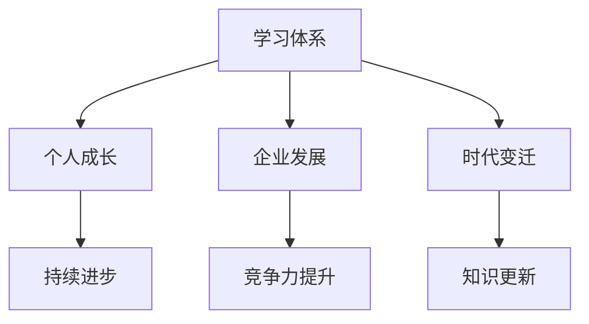

在当今快速变化的社会中，学习体系的重要性不言而喻。首先，对于个人成长而言，学习体系是持续进步的保障。通过系统地学习，个人可以不断提升自身的知识储备和能力水平，从而在职业生涯中获得更多的机会和竞争优势。一个完善的学习体系不仅能够帮助个人快速适应新技术、新环境，还能够培养批判性思维和解决问题的能力。

对于企业的发展，学习体系同样至关重要。在知识经济时代，企业面临的市场环境和技术变革速度越来越快，只有不断学习、创新和适应，才能在竞争中立于不败之地。一个良好的学习体系可以帮助企业构建持续创新的能力，提高员工的知识水平和技能，从而推动企业的持续发展和竞争优势。

随着时代的变迁，学习体系也在不断演变。从传统的知识积累到现代的跨界学习，从被动接受知识到主动探索和创造知识，学习体系的形式和内容都在不断丰富和发展。特别是在数字化时代，互联网、大数据和人工智能等新兴技术为学习体系的构建提供了新的工具和手段，使得知识获取、整合和传播变得更加高效和便捷。

**学习体系在个人成长中的作用**

- **知识储备**：学习体系为个人提供了系统的知识储备，涵盖了不同领域的专业知识和技能。这些知识不仅有助于个人在职业生涯中应对各种挑战，还能够提高个人的综合素质和竞争力。
- **能力提升**：通过学习，个人可以不断提升自身的技能和能力。例如，学习编程可以提高编程能力，学习项目管理可以提高项目管理和协调能力。这些能力的提升使得个人在职业发展中具备更强的竞争力。
- **适应变化**：在快速变化的社会中，学习体系可以帮助个人快速适应新技术和新环境。通过持续学习，个人可以不断更新知识储备，保持对新技术和新趋势的敏感度，从而在职业发展中具备更强的适应能力。

**学习体系在企业发展和创新中的应用**

- **创新能力**：学习体系是企业持续创新的重要保障。通过学习，员工可以不断掌握新技术、新方法，从而推动企业的创新和发展。例如，学习人工智能、大数据等新技术，可以为企业提供新的商业机会和解决方案。
- **人才发展**：学习体系有助于企业培养和留住人才。通过提供系统的学习机会和资源，企业可以提升员工的知识水平和技能，从而提高员工的工作满意度和忠诚度。此外，学习体系还可以帮助员工实现个人职业发展目标，从而激发员工的积极性和创造力。
- **组织文化**：学习体系有助于构建学习型组织文化。通过鼓励员工学习和创新，企业可以培养一种持续学习和探索的文化氛围，从而提高组织的创新能力和竞争力。

**学习体系在时代变迁中的演变**

- **从知识积累到知识创新**：在传统时代，学习主要侧重于知识的积累和传承。然而，随着社会的发展，知识更新的速度越来越快，学习逐渐从知识积累转向知识创新。现代学习更加注重知识的整合和运用，强调在实践中学习和创新。
- **从单一领域到跨界学习**：在数字化时代，知识交叉融合的趋势日益明显。跨界学习成为了一种重要的学习方式。通过跨界学习，个人可以跨越不同领域的知识界限，发现新的问题和解决方案。
- **从被动学习到主动学习**：在传统学习模式中，学习往往是被动的，主要依赖于教师和教材。然而，现代学习更加注重主动学习，鼓励个人主动探索和创造知识。互联网和在线学习平台为主动学习提供了丰富的资源和工具。

### 1.2 学习体系的构成要素

**核心概念与联系**

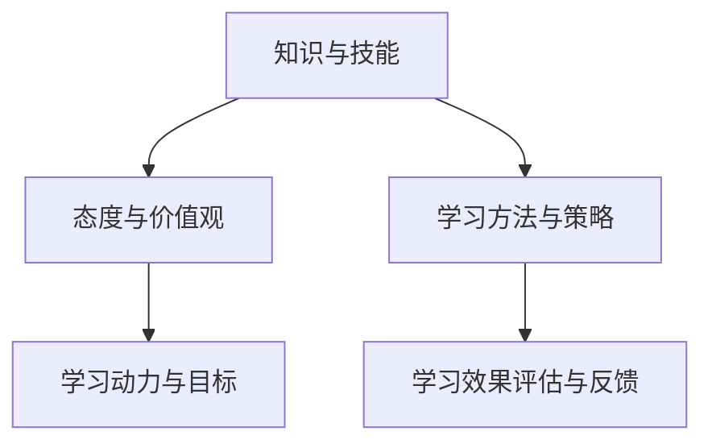

一个完善的学习体系由多个构成要素组成，这些要素相互关联、相互支持，共同推动学习的进程和效果。

**知识与技能**

- **核心概念与联系**：知识和技能是学习体系的核心要素。知识是指通过学习获得的信息和概念，而技能是指掌握和应用知识的能力。知识和技能相互促进，知识为技能提供理论支持，技能为知识提供实践应用。
- **作用**：知识与技能是个人成长和企业发展的基础。通过掌握不同领域的知识和技能，个人可以提升自身的综合素质和竞争力，企业可以构建持续创新的能力和竞争力。

**态度与价值观**

- **核心概念与联系**：态度和价值观是影响学习的重要因素。态度是指个人对待学习的态度和行为习惯，而价值观是指个人对于学习和知识的信仰和追求。
- **作用**：态度和价值观决定学习的动力和效果。积极的学习态度和正确的价值观可以激发个人的学习热情和动力，提高学习效果。

**学习方法与策略**

- **核心概念与联系**：学习方法与策略是学习过程中使用的方法和技巧，包括信息获取、知识整合、学习评估等。
- **作用**：学习方法与策略直接影响学习的效果和效率。通过选择合适的学习方法和策略，个人可以更高效地获取和整合知识，提高学习效果。

**学习动力与目标**

- **核心概念与联系**：学习动力是指推动个人学习的内在力量，而学习目标是指个人希望通过学习实现的目标和愿景。
- **作用**：学习动力和目标是学习的驱动力。明确的学习动力和目标可以激发个人的学习热情和积极性，提高学习的持续性和效果。

**学习效果评估与反馈**

- **核心概念与联系**：学习效果评估与反馈是指对学习效果进行评价和反馈的过程，包括学习成果的评估、学习过程的反馈等。
- **作用**：学习效果评估与反馈是学习体系的重要组成部分。通过评估和反馈，个人可以了解自己的学习成果和不足，从而调整学习策略和方法，提高学习效果。

### 1.3 构建学习体系的步骤

**核心概念与联系**

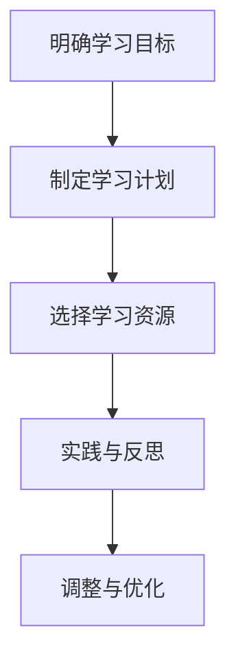

构建一个有效的学习体系需要经过多个步骤，这些步骤相互衔接，共同推动学习的进程和效果。

**明确学习目标**

- **核心概念与联系**：明确学习目标是构建学习体系的第一步。通过明确学习目标，个人可以明确学习的方向和重点，从而更有针对性地进行学习。
- **作用**：明确学习目标可以帮助个人集中精力，有针对性地进行学习，避免盲目和无效率的学习。

**制定学习计划**

- **核心概念与联系**：制定学习计划是将学习目标具体化为可执行的行动。通过制定学习计划，个人可以合理安排学习时间，选择合适的学习资源，确保学习目标的实现。
- **作用**：制定学习计划可以提高学习的系统性和计划性，避免学习的随意性和碎片化，从而提高学习效果。

**选择学习资源**

- **核心概念与联系**：选择学习资源是学习过程中的重要环节。通过选择合适的学习资源，个人可以更高效地获取和整合知识，提高学习效果。
- **作用**：选择学习资源可以帮助个人节省时间和精力，避免无效学习，提高学习效率。

**实践与反思**

- **核心概念与联系**：实践与反思是将学习理论转化为实际能力的过程。通过实践，个人可以将所学知识应用到实际工作中，提高实际操作能力；通过反思，个人可以总结学习经验，发现不足，调整学习策略。
- **作用**：实践与反思是学习体系的重要组成部分，有助于提高学习效果和实际能力。

**调整与优化**

- **核心概念与联系**：调整与优化是根据学习效果和实际情况对学习体系进行优化和调整。通过调整与优化，个人可以不断提高学习体系的效率和质量。
- **作用**：调整与优化可以帮助个人及时发现问题、解决问题，从而不断提高学习效果和能力水平。

### 总结

学习体系是个人成长和企业发展的重要保障。通过明确学习目标、制定学习计划、选择学习资源、实践与反思、调整与优化等步骤，个人和企业可以构建一个有效的学习体系，从而不断提高自身的知识和能力水平，实现持续进步和创新发展。

## 第2章：知识获取与整合

### 2.1 知识获取方法

知识获取是构建学习体系的重要环节。在数字化时代，知识获取的方法越来越多样化，传统学习方法与现代学习方法相结合，为我们提供了丰富的知识来源。

**传统学习方法**

- **核心概念与联系**：传统学习方法主要包括课堂学习、阅读书籍、听取讲座等。这些方法依赖于教育资源，强调知识的系统性和理论性。
- **作用**：传统学习方法有助于构建系统的知识框架，培养批判性思维和逻辑推理能力。

**现代学习方法**

- **核心概念与联系**：现代学习方法包括在线学习、社交学习、实践学习等。这些方法利用互联网和信息技术，强调知识的实用性和灵活性。
- **作用**：现代学习方法有助于快速获取最新知识，提高学习效率，培养创新能力。

**知识获取技巧**

- **信息筛选**：在大量信息中筛选出有价值的内容，可以通过关注权威来源、使用搜索引擎高级搜索功能等方法实现。
- **时间管理**：合理安排学习时间，避免拖延，可以通过制定学习计划、设置学习目标等方法实现。
- **互动学习**：通过与他人互动，如参加研讨会、加入学习社区等，可以提高学习效果。

### 2.2 知识整合策略

知识整合是将获取的知识进行系统化、结构化的过程，是知识获取的重要补充。

**知识分类**

- **核心概念与联系**：知识分类是将知识按照一定标准进行划分，以便于管理和使用。常见的分类方法包括按学科、按领域、按层次等。
- **作用**：知识分类有助于提高知识的管理效率和检索速度，便于知识的系统学习和应用。

**知识关联**

- **核心概念与联系**：知识关联是将不同领域的知识进行联系，形成知识网络。通过知识关联，可以促进跨领域的创新思维和综合应用。
- **作用**：知识关联有助于提高知识的灵活性和创新性，推动跨领域的合作与发展。

**知识创新**

- **核心概念与联系**：知识创新是在现有知识的基础上，通过创造性思维和实践活动，产生新的知识体系。
- **作用**：知识创新是推动社会进步和经济发展的重要动力，有助于形成竞争优势和创新成果。

### 2.3 知识库建设与实践

知识库是知识整合和管理的核心工具，它为知识的存储、检索和应用提供了便捷的手段。

**知识库构建原则**

- **核心概念与联系**：知识库构建原则包括准确性、完整性、一致性、可用性等。准确性确保知识库中的知识是真实可靠的；完整性确保知识库中的知识全面覆盖；一致性确保知识库中的知识相互协调；可用性确保知识库中的知识易于获取和应用。
- **作用**：知识库构建原则有助于提高知识库的质量和可用性，为知识管理奠定基础。

**知识库管理策略**

- **核心概念与联系**：知识库管理策略包括知识收集、知识组织、知识共享、知识更新等。知识收集是知识库建设的基础，知识组织是知识库的核心，知识共享是知识库应用的关键，知识更新是知识库持续发展的动力。
- **作用**：知识库管理策略有助于提高知识库的运行效率和效果，推动知识的有效利用。

**知识库应用实践**

- **核心概念与联系**：知识库应用实践包括知识查询、知识共享、知识服务、知识应用等。知识查询是知识库应用的基本功能，知识共享是知识库价值的体现，知识服务是知识库应用的高级形式，知识应用是将知识转化为实际成果的关键。
- **作用**：知识库应用实践有助于提高组织的知识管理水平，推动知识的创新和应用，提升组织的核心竞争力。

### 总结

知识获取与整合是构建学习体系的重要环节。通过传统学习方法和现代学习方法的结合，我们可以高效地获取知识；通过知识分类、知识关联和知识创新，我们可以系统地整合知识；通过知识库建设与实践，我们可以有效地管理和应用知识。这些方法和策略共同构成了一个完善的学习体系，为个人和企业的发展提供了坚实的基础。

## 第3章：学习策略与方法

### 3.1 学习策略概述

学习策略是指导学习过程的方法和技巧，是提高学习效果的关键。一个有效的学习策略可以帮助学习者更加高效地获取、整合和应用知识。

**核心概念与联系**

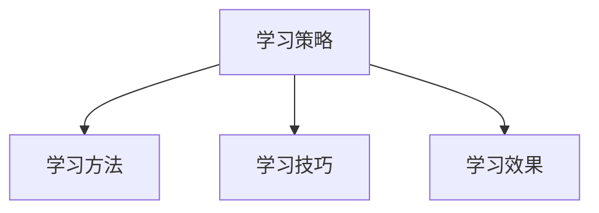

**学习策略的重要性**

- **核心概念与联系**：学习策略是连接学习目标和学习效果的桥梁，它决定了学习过程的质量和效率。
- **作用**：有效的学习策略可以节省学习时间，提高学习效率，增强学习效果。

**学习策略的类型**

- **基于目标的学习策略**：这种策略强调明确学习目标，制定具体的学习计划，并按照计划执行。
- **基于资源的学习策略**：这种策略强调合理选择学习资源，充分利用各种学习工具和平台。
- **基于过程的学习策略**：这种策略强调学习过程中的自我监控和反思，不断调整学习方法和策略。

**学习策略的选择与应用**

- **核心概念与联系**：选择和应用学习策略需要考虑学习目标、学习资源和学习者自身的特点。
- **作用**：合理选择和应用学习策略可以提升学习效果，满足不同学习需求。

### 3.2 不同类型学习方法的比较

学习方法的选择直接影响学习效果。不同类型的学习方法各有优缺点，适用于不同的学习场景。

**主动学习与被动学习**

- **主动学习**：学习者主动探索、实践和应用知识，如实验、讨论、写作等。
- **被动学习**：学习者主要依赖外部资源，如听课、阅读、观看视频等。
- **优缺点比较**：
  - **主动学习**：增强学习者的参与感和主动性，有助于知识的深度理解和应用；但需要较高的自我管理和自律能力。
  - **被动学习**：适合知识初学者，学习效率较高；但容易导致知识理解不够深入，缺乏实践应用。

**深度学习与浅层学习**

- **深度学习**：学习者对知识进行深入探究，理解其本质和内在联系。
- **浅层学习**：学习者只对知识进行表面了解，不深入探究。
- **优缺点比较**：
  - **深度学习**：有助于知识的长期记忆和应用，培养批判性思维和解决问题的能力；但学习过程较长，需要较高的时间和精力投入。
  - **浅层学习**：适合快速获取知识，学习效率较高；但知识掌握不够牢固，缺乏深入理解和应用能力。

**团队学习与个体学习**

- **团队学习**：学习者以团队形式进行学习，共同探讨、分享和解决问题。
- **个体学习**：学习者独立进行学习，自我探索和总结。
- **优缺点比较**：
  - **团队学习**：增强学习者的协作能力和沟通能力，促进知识共享和交流；但可能存在学习进度不一致的问题。
  - **个体学习**：适合有较高自我管理和自律能力的学习者，可以自由安排学习时间和进度；但缺乏与他人交流和互动的机会。

### 3.3 学习效果评估与反馈

学习效果评估与反馈是学习策略的重要组成部分，它有助于了解学习进展，发现不足，及时调整学习策略。

**核心概念与联系**

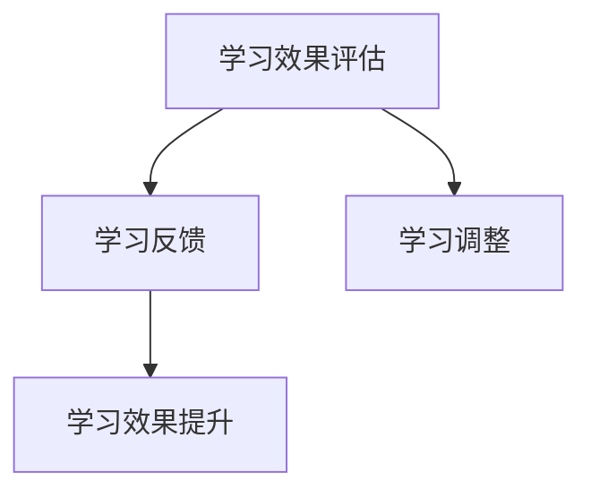

**学习效果评估指标**

- **知识掌握度**：评估学习者对知识点的理解和掌握程度。
- **应用能力**：评估学习者将所学知识应用于实际问题的能力。
- **学习态度**：评估学习者的学习态度和参与度。
- **学习效率**：评估学习者在单位时间内所学到的知识量。

**学习反馈机制**

- **自我反馈**：学习者通过自我反思和总结，了解自己的学习效果和不足。
- **他人反馈**：通过教师、同伴或上级的评价，获得外部反馈。
- **反馈应用**：根据反馈结果，调整学习策略和方法，提高学习效果。

**学习效果的持续提升**

- **核心概念与联系**：学习效果的持续提升需要建立有效的反馈机制和学习调整机制。
- **作用**：通过持续的评估与反馈，学习者可以不断优化学习过程，提高学习效果。

### 总结

学习策略与方法是提高学习效果的关键。通过选择合适的策略和方法，结合评估与反馈，学习者可以更高效地获取、整合和应用知识，实现持续学习与成长。不同类型的学习方法适用于不同的学习场景，学习者可以根据自身需求和实际情况进行选择。通过不断的评估与反馈，学习者可以不断调整和优化学习过程，提高学习效果。

## 第4章：管理创新的基本概念

### 4.1 管理创新的概念与类型

**核心概念与联系**

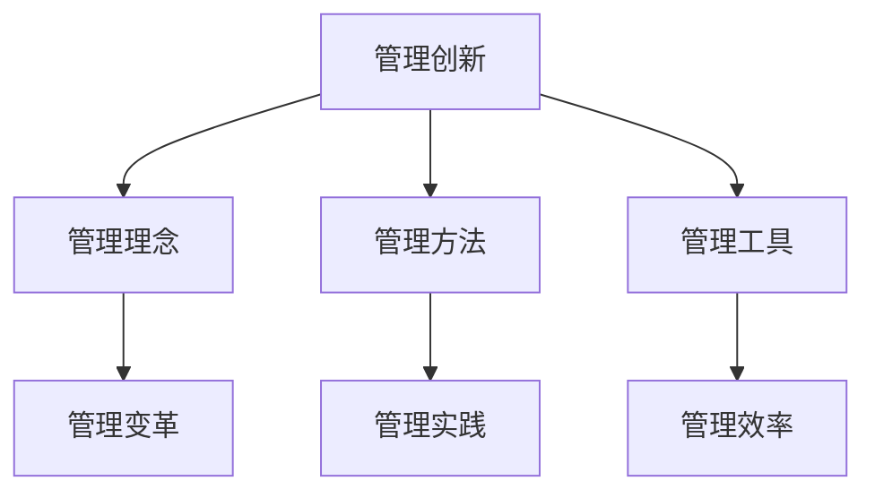

**管理创新的概念**

- **定义**：管理创新是指通过新的管理理念、方法、工具和技术，推动组织变革和进步，提高管理效率和绩效。
- **核心要素**：管理创新包括管理思想、管理方法、管理工具和管理实践等多个方面。

**管理创新的类型**

- **流程创新**：通过重新设计和管理组织内部的流程，提高效率和质量。
- **组织创新**：通过改变组织结构、职能和运作方式，提升组织的灵活性和适应性。
- **制度创新**：通过建立新的管理制度和规范，提高组织的规范性和效率。
- **文化创新**：通过塑造新的企业文化，激发员工的创新精神和创造力。

**管理创新的特点**

- **系统性**：管理创新是一个涉及组织各个层面的系统过程，需要综合考虑多个因素。
- **持续性**：管理创新不是一次性活动，而是一个持续的过程，需要不断调整和优化。
- **风险性**：管理创新可能面临失败的风险，需要勇于尝试和接受挑战。

### 4.2 管理创新的动力与阻力

**核心概念与联系**

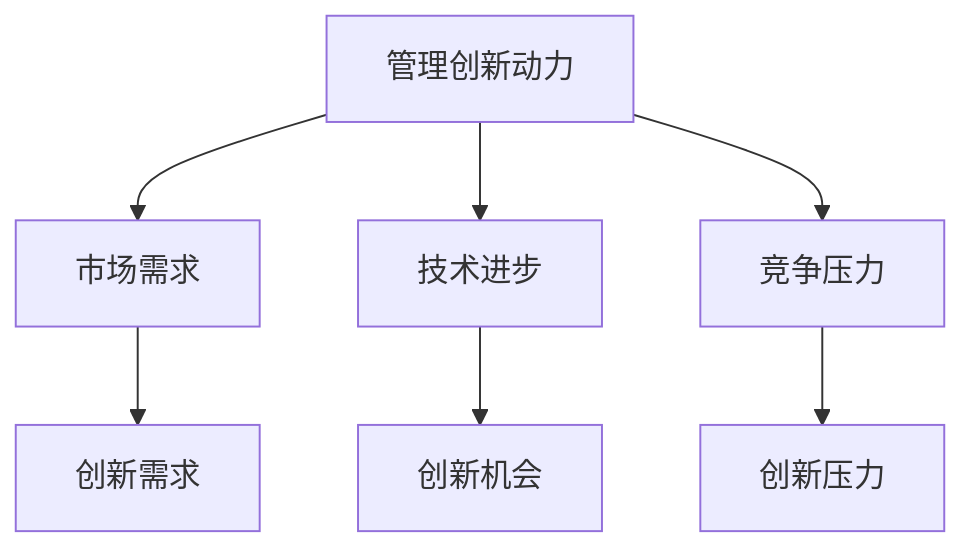

**管理创新的动力**

- **市场需求**：随着市场的不断变化，企业需要不断创新来满足客户的需求，提高市场竞争力。
- **技术进步**：新技术的出现为管理创新提供了新的工具和方法，促进管理效率的提升。
- **竞争压力**：在激烈的市场竞争中，企业需要通过管理创新来保持竞争优势，应对竞争对手的挑战。

**管理创新的阻力**

- **传统观念**：企业内部可能存在保守的思想和观念，阻碍新管理理念和方法的应用。
- **组织惯性**：组织结构和流程可能已经固化，难以适应新的管理创新。
- **资源限制**：管理创新需要投入人力、物力和财力，企业可能面临资源限制。

**克服管理创新阻力的策略**

- **领导层支持**：企业领导层的支持和倡导是推动管理创新的重要力量。
- **员工参与**：鼓励员工参与管理创新过程，提高他们的积极性和创造力。
- **培训与教育**：通过培训和教育活动，提高员工对管理创新的理解和接受度。
- **风险管理与控制**：建立健全的风险管理体系，降低管理创新失败的风险。

### 4.3 管理创新的价值观与理念

**核心概念与联系**

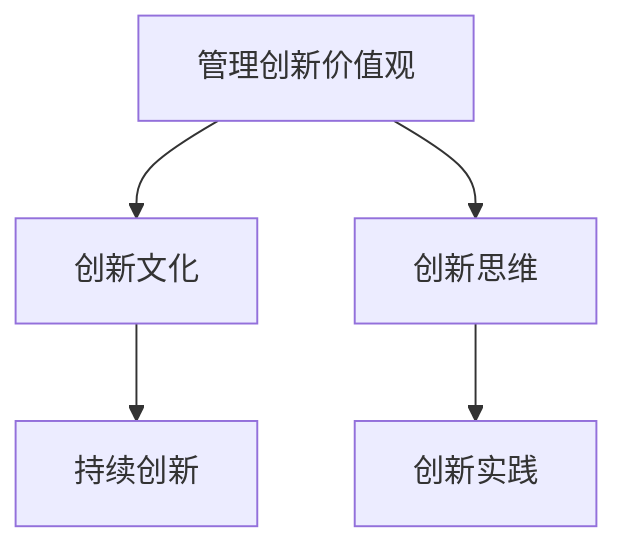

**管理创新的价值观**

- **创新优先**：将创新视为企业发展的核心驱动力，优先考虑创新项目的实施。
- **用户导向**：以用户需求为导向，持续优化产品和服务，提升用户体验。
- **快速响应**：快速适应市场变化，及时调整管理策略和方案。

**管理创新的理念**

- **系统思维**：从整体和系统的角度看待问题，通过系统优化实现创新。
- **动态平衡**：在创新与稳定性之间寻求平衡，确保创新不破坏现有秩序。
- **协同合作**：通过团队协作和跨部门合作，实现创新目标。

**管理创新的文化氛围**

- **鼓励尝试**：创建一个宽容失败、鼓励尝试的文化氛围，激发员工的创新热情。
- **知识共享**：建立知识共享机制，促进员工之间的知识交流和经验分享。
- **持续学习**：鼓励员工持续学习和成长，提高整体创新能力。

### 总结

管理创新是推动组织发展的重要动力。通过理解管理创新的概念、类型、动力与阻力，以及价值观和理念，企业可以更好地制定管理创新策略，克服创新过程中的障碍，打造一个持续创新的组织文化。管理创新不仅是技术层面的变革，更是一种思维方式和价值观的变革，需要从整体和系统的角度进行规划和实施。

## 第5章：管理创新的思维与方法

### 5.1 创新思维概述

创新思维是指运用独特的视角和方法，发现新的问题解决方案，是管理创新的重要基础。创新思维不仅仅是一种智力活动，更是一种习惯和思维方式。

**核心概念与联系**

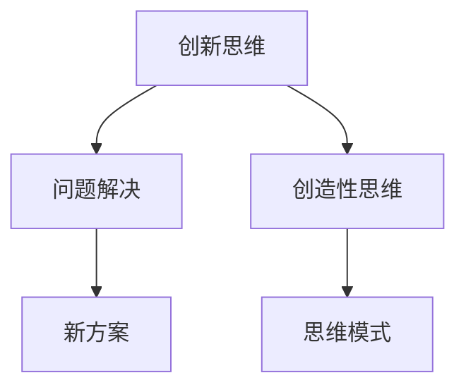

**创新思维的定义**

- **创新思维**：是指在面对问题时，能够跳出传统思维框架，运用创造性思维和方法，找到新的解决方案。
- **核心要素**：创造性、独特性、灵活性、系统性。

**创新思维的特点**

- **独特性**：创新思维能够从独特的角度看待问题，提出与众不同的解决方案。
- **系统性**：创新思维强调将问题放在系统背景下进行考虑，综合考虑各个方面的因素。
- **灵活性**：创新思维能够灵活应对变化，快速调整思维模式，适应新情况。

**创新思维的培养**

- **广泛阅读**：通过广泛阅读，积累丰富的知识储备，培养跨领域的思维方式。
- **思维训练**：通过思维训练，如思维导图、头脑风暴等，提高思维的灵活性和创造性。
- **实践应用**：通过实践应用，将创新思维应用于实际问题，提高解决问题的能力。

### 5.2 基于战略的创新能力培养

基于战略的创新能力培养是企业实现可持续发展的关键。通过战略规划和资源配置，企业可以系统性地培养员工的创新能力，提升整体竞争力。

**核心概念与联系**

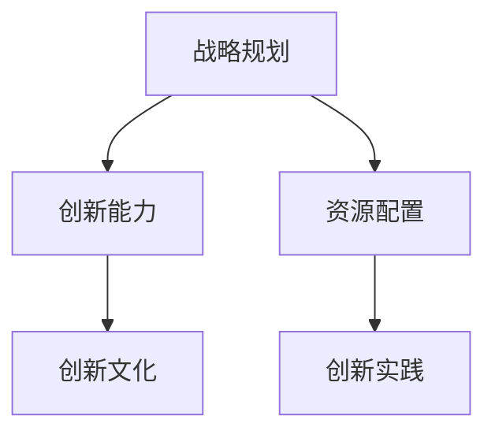

**战略规划与创新能力**

- **战略规划**：战略规划是企业管理创新的重要手段，通过明确企业的发展方向和目标，为创新能力的培养提供指导。
- **创新能力**：战略规划有助于企业识别创新机会，明确创新目标和方向，从而提升创新能力。

**战略实施与创新能力**

- **战略实施**：战略实施是将战略规划转化为具体行动的过程，通过资源配置和团队协作，推动创新项目的落地和实施。
- **创新能力**：战略实施过程中，通过不断调整和优化，可以培养员工的创新能力和实践能力。

**战略评估与创新能力**

- **战略评估**：战略评估是对战略实施效果进行评价和反馈的过程，通过评估可以发现创新过程中存在的问题和不足。
- **创新能力**：战略评估有助于企业及时调整战略规划，优化创新资源配置，提升创新能力。

### 5.3 基于实践的创新能力培养

基于实践的创新能力培养是企业实现创新目标的有效途径。通过实际项目和案例，企业可以培养员工的创新能力，提高解决问题的能力。

**核心概念与联系**

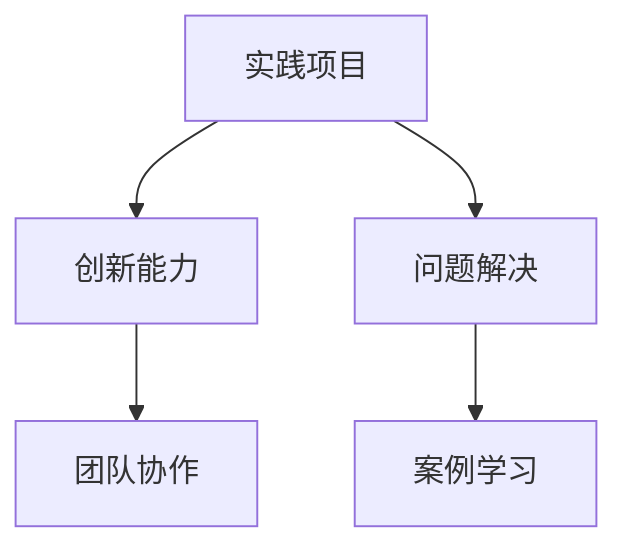

**实践的重要性**

- **实践项目**：实践项目是企业培养员工创新能力的重要载体，通过实际操作，员工可以锻炼解决问题的能力，提高实践能力。
- **问题解决**：实践过程中，员工需要面对各种实际问题，通过解决问题，培养创新思维和解决问题的能力。

**实践与创新能力的关系**

- **关系分析**：实践是创新能力培养的基础，通过实践，员工可以将理论知识应用于实际，提高创新能力。
- **能力提升**：实践过程中，员工可以通过不断尝试和反思，积累经验，提高创新能力和问题解决能力。

**实践中创新能力的培养方法**

- **项目驱动**：通过项目驱动，激发员工的创新热情和参与度，培养团队合作精神和创新能力。
- **案例学习**：通过案例学习，分析成功和失败的创新案例，总结经验教训，提高创新能力和实践能力。
- **反思与总结**：通过反思和总结，回顾实践过程，分析问题，提出改进措施，不断提升创新能力。

### 总结

管理创新思维与方法是推动企业持续发展的关键。通过创新思维的培养，企业可以提升员工的创新能力和问题解决能力；基于战略的创新能力培养，企业可以系统性地规划和管理创新过程；基于实践的创新能力培养，企业可以培养员工的实践能力和创新精神。这些方法和策略共同构成了一个完善的管理创新体系，为企业的发展提供源源不断的动力。

## 第6章：管理创新能力的评估与提升

### 6.1 管理创新能力的评估方法

评估管理创新能力是了解企业创新水平的重要手段。通过科学合理的评估方法，企业可以全面了解自身的创新能力，发现优势与不足，从而有针对性地进行提升。

**核心概念与联系**

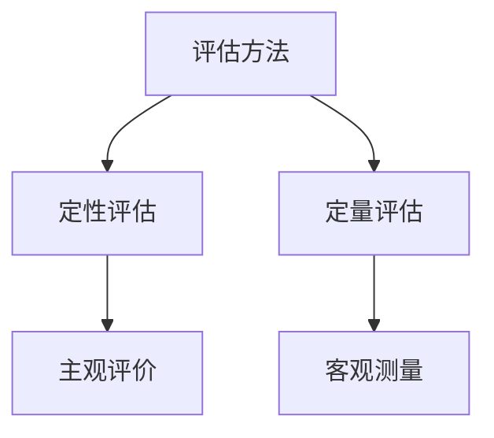

**评估方法的选择**

- **核心概念与联系**：评估方法的选择应考虑企业的实际情况、评估目标和所需资源。
- **作用**：选择合适的评估方法可以提高评估的准确性和有效性。

**定性评估**

- **核心概念与联系**：定性评估是通过分析、比较和判断等方式，对管理创新能力进行评价。
- **方法**：包括专家评审、问卷调查、访谈等。
- **优缺点**：
  - **优点**：能够深入分析管理创新的内在因素，提供丰富的人文视角。
  - **缺点**：主观性强，可能受到评估者经验和认知的局限。

**定量评估**

- **核心概念与联系**：定量评估是通过量化指标和数据，对管理创新能力进行评价。
- **方法**：包括统计分析、指标计算、绩效评估等。
- **优缺点**：
  - **优点**：客观性强，能够提供精确的数据支持，便于对比分析。
  - **缺点**：可能忽略创新的复杂性和多样性。

**评估指标的设计**

- **核心概念与联系**：评估指标是评估管理创新能力的重要依据。
- **设计原则**：
  - **相关性**：指标应与评估目标密切相关。
  - **可测量性**：指标应具有明确的衡量标准。
  - **可比性**：指标应便于不同时间和不同企业的比较。
- **常用指标**：创新效率、创新成果、创新成本、员工满意度等。

**评估结果的反馈与应用**

- **核心概念与联系**：评估结果的反馈与应用是评估工作的关键环节。
- **反馈机制**：建立反馈机制，确保评估结果能够及时、准确地传递给相关人员和部门。
- **应用策略**：
  - **改进措施**：根据评估结果，制定针对性的改进措施，提升管理创新能力。
  - **资源分配**：优化资源分配，确保创新项目得到充分支持和资源保障。
  - **激励机制**：建立激励机制，鼓励员工积极参与创新活动，提高创新积极性。

### 6.2 管理创新能力提升策略

提升管理创新能力是企业持续发展的重要任务。通过系统性的策略和方法，企业可以不断提高员工的创新能力，推动企业的创新发展。

**核心概念与联系**

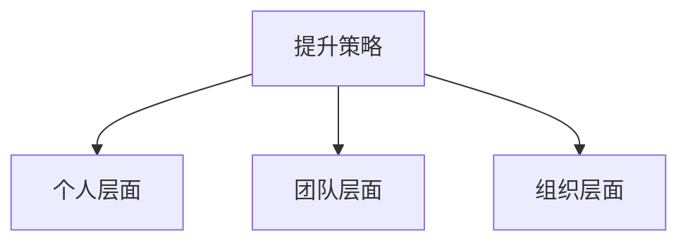

**个人层面提升策略**

- **核心概念与联系**：个人层面的提升策略主要关注员工的个人素质和能力的提升。
- **策略**：
  - **持续学习**：通过学习新的知识和技能，提升个人的专业水平和创新能力。
  - **思维训练**：通过思维训练，如逻辑思维、创造性思维等，提高思维的灵活性和创新能力。
  - **实践锻炼**：通过参与实际项目，锻炼解决问题的能力，提高实践创新能力。

**团队层面提升策略**

- **核心概念与联系**：团队层面的提升策略主要关注团队协作和创新能力。
- **策略**：
  - **团队建设**：通过团队建设活动，增强团队凝聚力和合作精神。
  - **知识共享**：建立知识共享平台，促进团队成员之间的知识交流和经验分享。
  - **创新竞赛**：举办创新竞赛，激发团队的创新热情和创造力。

**组织层面提升策略**

- **核心概念与联系**：组织层面的提升策略主要关注企业整体创新环境和机制的建设。
- **策略**：
  - **创新文化**：建立鼓励创新的企业文化，营造宽容失败、鼓励尝试的氛围。
  - **激励机制**：建立激励机制，奖励创新成果，激发员工的创新积极性。
  - **资源保障**：提供充足的资源和支持，确保创新项目的顺利实施。

### 6.3 管理创新能力的持续培养

持续培养管理创新能力是企业保持竞争优势的关键。通过建立持续培养机制和培养创新文化，企业可以不断提高管理创新能力，实现可持续发展。

**核心概念与联系**

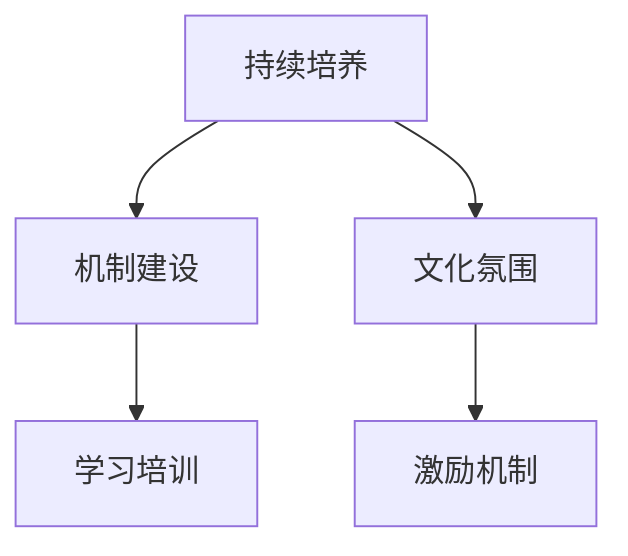

**持续培养的重要性**

- **核心概念与联系**：持续培养是管理创新能力不断提升的保障，有助于企业保持持续的创新动力和竞争力。
- **作用**：持续培养有助于企业适应快速变化的市场环境，应对不断出现的新挑战。

**持续培养的策略**

- **机制建设**：
  - **建立创新机制**：制定明确的创新目标和策略，建立创新项目管理体系，确保创新项目顺利实施。
  - **优化资源配置**：合理配置资源，确保创新项目的资金、人力和物资支持。

- **文化氛围**：
  - **鼓励创新**：建立鼓励创新的企业文化，营造宽容失败、鼓励尝试的氛围。
  - **知识共享**：建立知识共享平台，促进员工之间的知识交流和经验分享。

- **激励机制**：
  - **奖励机制**：建立奖励机制，对创新成果显著的员工和团队进行奖励，激励创新积极性。
  - **晋升机制**：将创新成果纳入晋升考核，鼓励员工积极参与创新活动。

**实践案例**

- **案例1**：某科技公司在持续培养管理创新能力方面取得了显著成果。通过建立创新项目管理制度，优化资源配置，营造创新文化氛围，该公司在技术创新和市场拓展方面取得了显著进展，市场份额持续提升。

- **案例2**：某制造业企业通过持续培养管理创新能力，实现了生产效率的提升和产品质量的改进。通过培训员工，鼓励创新思维，建立知识共享平台，该公司在产品质量控制和生产流程优化方面取得了显著成效。

### 总结

管理创新能力的评估与提升是企业持续发展的关键。通过科学合理的评估方法，企业可以全面了解自身的创新能力，发现优势与不足。通过系统性的提升策略，企业可以不断提高管理创新能力，实现持续创新和竞争优势。持续培养管理创新能力，企业可以保持对市场变化的敏感度，应对不断出现的新挑战，实现可持续发展。

## 第7章：案例分析

### 7.1 国内外管理创新成功案例介绍

在国内外，有许多企业通过管理创新实现了显著的业绩提升和市场竞争力。以下是几个具有代表性的管理创新成功案例。

**案例1：苹果公司（Apple）**

- **背景**：苹果公司在20世纪80年代遭遇了市场竞争的困境，公司内部管理混乱，产品创新不足。
- **管理创新措施**：
  - **重新定义产品**：苹果公司重新审视市场需求，推出了一系列具有革命性的产品，如iPod、iPhone和iPad。
  - **设计创新**：苹果公司注重产品设计和用户体验，通过独特的设计语言和用户界面，赢得了广泛的市场认可。
  - **供应链管理**：苹果公司通过优化供应链管理，确保产品的高质量和快速上市，提高了市场竞争力。
- **成效**：苹果公司通过管理创新，成功实现了业绩的显著提升，成为全球最具价值的公司之一。

**案例2：阿里巴巴集团（Alibaba Group）**

- **背景**：阿里巴巴集团在电子商务领域面临激烈的竞争，市场份额逐渐被其他竞争对手侵蚀。
- **管理创新措施**：
  - **平台创新**：阿里巴巴集团通过搭建电子商务平台，为中小企业提供在线交易和支付服务，推动了电子商务的普及。
  - **数据驱动**：阿里巴巴集团利用大数据技术，分析消费者行为和市场趋势，为商家提供精准的市场营销策略。
  - **国际化战略**：阿里巴巴集团积极拓展国际市场，通过收购和合作，提升了品牌影响力和市场份额。
- **成效**：阿里巴巴集团通过管理创新，成功巩固了在电子商务领域的领导地位，实现了全球业务的快速增长。

**案例3：丰田汽车公司（Toyota）**

- **背景**：丰田汽车公司在20世纪90年代面临生产效率低下和成本控制不足的问题。
- **管理创新措施**：
  - **精益生产**：丰田公司引入了精益生产管理模式，通过减少浪费、提高生产效率，降低了成本。
  - **质量管理体系**：丰田公司建立了严格的质量管理体系，确保产品的高质量和可靠性。
  - **员工参与**：丰田公司鼓励员工参与生产管理和创新活动，提高员工的工作满意度和创新能力。
- **成效**：丰田公司通过管理创新，成功提高了生产效率和产品质量，成为全球最盈利的汽车制造商之一。

### 7.2 管理创新案例的启示与借鉴

通过对上述成功案例的分析，我们可以总结出以下启示与借鉴：

**启示1：创新是企业发展的重要驱动力**

- 成功的企业都注重创新，通过技术创新、产品创新和管理创新，不断提升企业的竞争力和市场地位。

**启示2：以人为本，注重用户体验**

- 企业在创新过程中，应关注用户的需求和体验，通过设计创新和用户体验优化，提升产品的市场竞争力。

**启示3：数据驱动，精准决策**

- 利用大数据和人工智能技术，可以更好地了解市场趋势和消费者行为，为企业的战略决策提供科学依据。

**启示4：持续改进，追求卓越**

- 企业应建立持续改进机制，不断优化管理流程和产品性能，追求卓越，保持竞争优势。

### 7.3 管理创新案例分析报告

**核心概念与联系**

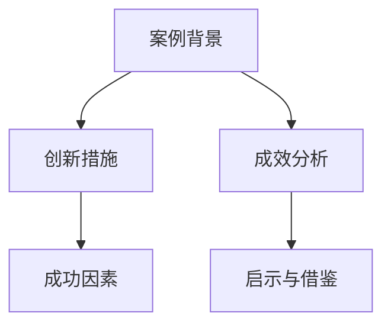

**案例背景**

- **案例背景**：描述企业面临的挑战、市场需求和竞争环境。

**创新措施**

- **创新措施**：详细列举企业采取的创新措施，包括战略决策、管理实践和关键技术。

**成效分析**

- **成效分析**：分析企业通过管理创新取得的成果，包括业绩指标、市场表现和用户反馈。

**成功因素**

- **成功因素**：总结企业成功的关键因素，包括领导力、企业文化、创新能力等。

**启示与借鉴**

- **启示与借鉴**：提出案例对其他企业的启示和借鉴价值，包括管理理念、创新方法等。

### 总结

管理创新案例的分析有助于我们深入了解管理创新的过程和效果，为企业的管理创新提供有益的参考和启示。通过借鉴成功案例的经验，企业可以更好地应对市场挑战，实现持续发展和竞争优势。

## 第8章：学习体系与管理创新能力的培养策略

### 8.1 学习体系与管理创新能力的融合

学习体系与管理创新能力的融合是推动企业持续发展的重要策略。通过将学习体系与企业管理创新相结合，企业可以不断提升员工的创新能力，实现组织的持续进步。

**核心概念与联系**

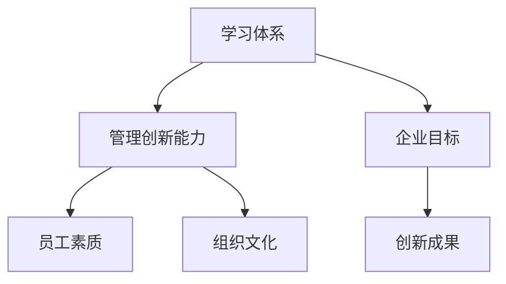

**融合的意义**

- **提升员工素质**：通过学习体系，员工可以获得丰富的知识和技能，提高自身的专业能力和创新意识。
- **推动组织文化**：融合学习体系与管理创新能力，有助于营造一种积极向上的创新文化，促进组织的创新氛围。
- **实现企业目标**：通过管理创新，企业可以不断提高运营效率和市场竞争力，实现可持续发展。

**融合的策略**

- **建立学习型组织**：将学习体系纳入企业的日常管理，鼓励员工持续学习，提高整体创新能力。
- **制定创新激励机制**：通过奖励机制，激励员工积极参与管理创新活动，提高创新积极性。
- **跨部门协作**：推动不同部门之间的协作，促进知识共享和经验交流，提升管理创新能力。

### 8.2 基于学习体系的管理创新能力培养方案设计

基于学习体系的管理创新能力培养方案设计是企业提升员工创新能力的关键。通过系统化的培养方案，企业可以培养一批具备创新素质的员工，为组织的创新和发展提供强有力的支持。

**核心概念与联系**

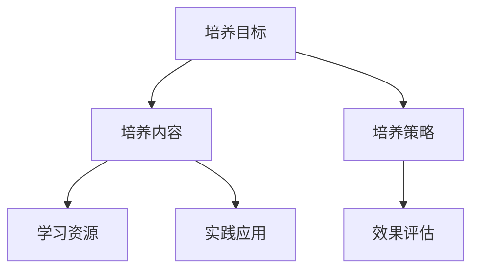

**培养目标**

- **核心概念与联系**：培养目标应明确企业希望员工达到的创新能力和素质水平。
- **目标设定**：根据企业的战略目标和市场需求，设定明确的创新能力和素质培养目标。

**培养内容**

- **核心概念与联系**：培养内容应包括创新理论、方法、工具和实际应用。
- **内容设计**：结合企业的实际情况和员工的背景，设计针对性的培养内容。

**培养策略**

- **核心概念与联系**：培养策略应包括学习方式、培养方式和评估方式。
- **策略实施**：
  - **学习方式**：采用在线学习、集中培训、导师指导等多种方式，提高学习的灵活性和有效性。
  - **培养方式**：通过项目实践、案例研讨、创新竞赛等，培养员工的实践能力和创新思维。
  - **评估方式**：建立评估体系，定期对员工的学习效果和创新成果进行评估。

**学习资源**

- **核心概念与联系**：学习资源是培养方案的重要支撑。
- **资源选择**：根据培养目标和内容，选择合适的书籍、课程、研讨会等学习资源。

**实践应用**

- **核心概念与联系**：实践应用是将理论知识转化为实际能力的关键。
- **实践设计**：通过实际项目、创新实践等，让员工在实际工作中运用所学知识和技能。

**效果评估**

- **核心概念与联系**：效果评估是培养方案的重要组成部分。
- **评估指标**：设定明确的评估指标，如知识掌握度、创新能力、实践应用能力等。
- **评估方法**：采用定量和定性方法，对员工的学习效果和创新成果进行评估。

### 8.3 基于学习体系的企业实践

基于学习体系的企业实践是将学习体系与管理创新能力培养方案落地实施的关键。通过实际操作，企业可以检验培养方案的有效性，不断提升员工的创新能力和组织竞争力。

**核心概念与联系**

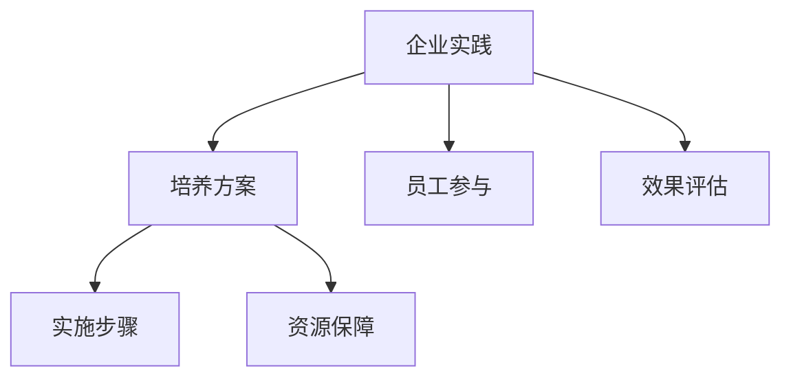

**实施步骤**

- **步骤1**：明确企业目标和培养目标，制定详细的管理创新能力培养方案。
- **步骤2**：根据培养方案，选择合适的学习资源和培养方式，确保员工参与。
- **步骤3**：实施培养方案，通过项目实践、案例研讨等形式，提高员工的实践能力和创新思维。
- **步骤4**：定期对员工的学习效果和创新成果进行评估，根据评估结果进行调整和优化。

**员工参与**

- **核心概念与联系**：员工的积极参与是培养方案成功实施的关键。
- **参与策略**：
  - **激励政策**：通过激励政策，如奖金、晋升机会等，激励员工积极参与创新活动。
  - **培训机会**：为员工提供丰富的培训机会，提高其专业能力和创新能力。
  - **团队协作**：鼓励员工跨部门协作，促进知识共享和经验交流。

**效果评估**

- **核心概念与联系**：效果评估是检验培养方案有效性的重要手段。
- **评估方法**：采用定量和定性方法，对员工的学习效果和创新成果进行评估。
- **评估结果应用**：根据评估结果，对培养方案进行调整和优化，提高培养效果。

**资源保障**

- **核心概念与联系**：资源保障是培养方案成功实施的重要保障。
- **资源保障策略**：
  - **资金投入**：确保培养方案的资金投入，为员工提供充足的学习资源和实践机会。
  - **技术支持**：提供必要的技术支持，如在线学习平台、创新实验室等，提高培养方案的实施效果。
  - **组织支持**：得到企业高层的支持和认可，确保培养方案得到充分执行。

### 总结

基于学习体系的管理创新能力培养策略是推动企业持续发展的重要途径。通过融合学习体系与管理创新能力，企业可以不断提升员工的创新能力和素质，实现组织的持续进步。通过系统化的培养方案设计、企业实践和效果评估，企业可以不断优化和创新，为企业的可持续发展提供强有力的支持。

## 第9章：学习体系与管理创新能力培养的实施与评估

### 9.1 学习体系与管理创新能力培养的实施步骤

实施学习体系与管理创新能力培养是一个系统工程，需要分阶段、分步骤地进行。以下是一个典型的实施步骤框架：

**阶段1：需求分析**

- **目标**：明确企业或组织的具体需求和目标，为后续的培养工作提供明确的方向。
- **方法**：
  - **问卷调查**：通过问卷调查收集员工和领导对学习和管理创新的看法和需求。
  - **访谈**：与关键利益相关者进行深度访谈，了解他们的期望和意见。

**阶段2：方案设计**

- **目标**：根据需求分析结果，设计科学合理的学习和管理创新能力培养方案。
- **方法**：
  - **目标设定**：明确培养的目标，如提升员工的知识储备、实践能力、创新思维等。
  - **内容规划**：设计涵盖知识获取、知识整合、创新思维培养等内容的培养方案。
  - **资源准备**：准备包括书籍、课程、研讨会等在内的学习资源。

**阶段3：方案实施**

- **目标**：按照培养方案，逐步开展学习和管理创新能力的培养活动。
- **方法**：
  - **培训与学习**：组织员工参加培训和学习活动，确保学习资源的有效利用。
  - **实践项目**：通过实际项目，让员工在实践中应用所学知识和技能。
  - **反馈与改进**：定期收集员工的学习反馈，对培养方案进行动态调整。

**阶段4：效果评估**

- **目标**：对学习和管理创新能力培养的效果进行评估，确保培养目标的实现。
- **方法**：
  - **定量评估**：通过考试、测试等定量方法，评估员工的知识掌握程度和创新能力的提升。
  - **定性评估**：通过观察、访谈等定性方法，评估员工的学习态度和实践表现。
  - **综合评估**：将定量和定性评估结果进行综合分析，评估培养方案的整体效果。

### 9.2 学习体系与管理创新能力培养的效果评估

效果评估是确保学习体系与管理创新能力培养方案有效实施的重要环节。以下是一些关键步骤和指标：

**评估方法的选择**

- **定量评估方法**：
  - **考试和测试**：通过定期考试和测试，评估员工对知识的掌握程度。
  - **绩效评估**：通过绩效评估，评估员工在实际工作中的表现。
- **定性评估方法**：
  - **观察**：通过观察员工在实践中的表现，评估其创新能力。
  - **访谈**：通过访谈员工和领导，了解他们的看法和建议。

**评估指标的设计**

- **知识掌握度**：通过考试和测试，评估员工对所学知识的理解和掌握程度。
- **创新能力**：通过观察和绩效评估，评估员工在实际工作中的创新能力和实践表现。
- **学习态度**：通过访谈和观察，评估员工的学习态度和参与度。
- **团队合作能力**：通过团队项目和实践，评估员工在团队协作中的表现。

**评估结果的应用**

- **反馈与改进**：根据评估结果，向员工反馈学习效果，提出改进建议，帮助其提升。
- **调整培养方案**：根据评估结果，对培养方案进行动态调整，优化培养内容和方式。
- **激励机制**：根据评估结果，建立激励机制，奖励表现优秀的员工，激励全体员工积极参与。

### 9.3 学习体系与管理创新能力培养的持续优化

持续优化是确保学习体系与管理创新能力培养方案长期有效的重要措施。以下是一些关键策略：

**持续优化的意义**

- **适应变化**：随着市场和技术的发展，企业需要不断调整和优化培养方案，以适应新的环境和需求。
- **提升效果**：通过持续优化，可以不断改进培养方案，提高学习效果和管理创新能力。

**持续优化的策略**

- **定期评估**：定期对培养方案进行评估，收集反馈，识别问题和改进点。
- **动态调整**：根据评估结果和外部环境的变化，动态调整培养方案，确保其与实际需求相匹配。
- **持续学习**：鼓励员工和领导持续学习，不断提升自身的知识和能力。
- **资源整合**：整合内部和外部资源，为培养方案提供充足的保障和支持。

**实践案例**

**案例1：某科技公司的持续优化**

- **背景**：某科技公司面临技术快速发展和市场竞争压力。
- **措施**：
  - **定期评估**：公司定期对员工的学习效果和创新成果进行评估，识别问题，提出改进建议。
  - **动态调整**：根据评估结果，公司动态调整培养方案，引入新技术和新方法。
  - **资源整合**：公司整合内部研发资源，与外部专业机构合作，为员工提供丰富的学习资源。

- **效果**：通过持续优化，公司员工的知识水平和创新能力得到了显著提升，市场竞争力得到了有效增强。

### 总结

学习体系与管理创新能力培养的实施与评估是一个系统化、持续性的过程。通过明确的实施步骤、科学的效果评估和持续的优化，企业可以不断提升员工的创新能力和管理能力，实现组织的持续发展和竞争优势。实践案例的分享为其他企业提供了有益的参考和启示。

## 第10章：未来展望

### 10.1 学习体系与管理创新能力的发展趋势

随着科技的进步和社会的发展，学习体系与管理创新能力也在不断演进。以下是一些关键趋势：

**人工智能与学习体系**

- **核心概念**：人工智能（AI）技术为学习体系带来了新的变革。AI可以通过大数据分析、智能推荐和学习算法，个性化定制学习内容，提高学习效率。
- **发展趋势**：
  - **个性化学习**：通过AI技术，学习体系可以根据每个学生的学习习惯、能力水平和兴趣，提供个性化的学习路径和资源。
  - **自适应学习**：AI系统能够实时监测学生的学习状态，根据学习效果自动调整学习内容和方法，提高学习效果。

**大数据与管理创新能力**

- **核心概念**：大数据技术在管理创新中的应用，使得企业能够更深入地了解市场趋势、消费者行为和内部运营效率。
- **发展趋势**：
  - **决策支持**：大数据分析可以帮助企业更准确地预测市场变化，制定更有效的战略决策。
  - **创新驱动**：通过大数据分析，企业可以发现潜在的创新机会，推动产品和服务创新。

**区块链与知识共享**

- **核心概念**：区块链技术提供了去中心化的数据存储和传输方式，为知识共享提供了新的可能性。
- **发展趋势**：
  - **知识溯源**：通过区块链技术，知识共享过程中的每一个步骤都可以被记录和验证，确保知识的真实性和可追溯性。
  - **激励机制**：区块链技术可以建立有效的激励机制，鼓励知识贡献者共享知识，同时保护知识产权。

### 10.2 学习体系与管理创新能力培养的新机遇

随着新技术的发展，学习体系与管理创新能力培养也面临着新的机遇：

**新技术的应用**

- **人工智能与物联网**：人工智能和物联网技术的结合，使得学习体系可以更加智能化和互联化。例如，智能教室系统可以通过物联网设备实时监控学生的学习状态，提供个性化的学习支持。
- **虚拟现实与增强现实**：虚拟现实（VR）和增强现实（AR）技术为学习提供了全新的体验。通过VR/AR技术，学生可以沉浸式学习，提高学习兴趣和效果。

**产业变革**

- **数字经济**：随着数字经济的快速发展，企业和个人需要不断更新知识和技能，以适应新的产业环境。
- **可持续发展**：在可持续发展的背景下，企业和个人需要关注环境保护和社会责任，推动绿色创新和可持续发展。

**社会变革**

- **远程工作与全球合作**：远程工作和全球合作成为常态，学习体系需要支持跨地域、跨文化的学习和协作。
- **教育公平**：新技术的普及有助于缩小教育差距，提高教育公平，为更多人提供学习机会。

### 10.3 学习体系与管理创新能力培养的未来挑战与对策

尽管新技术为学习体系与管理创新能力培养带来了新的机遇，但同时也伴随着一系列挑战：

**技术依赖**

- **挑战**：过度依赖新技术可能导致对传统知识和技能的忽视，影响全面素质培养。
- **对策**：加强人机协作，平衡技术辅助与人的主导作用，确保技术为学习服务。

**数据安全与隐私**

- **挑战**：大数据和人工智能技术的应用，带来了数据安全与隐私保护的新挑战。
- **对策**：建立严格的数据安全政策和隐私保护机制，确保数据的安全性和合规性。

**人才流失**

- **挑战**：高技能人才流失可能影响企业的创新能力和发展。
- **对策**：通过优化工作环境、提升薪酬福利、建立职业发展路径等措施，留住核心人才。

**文化冲突**

- **挑战**：全球化背景下，不同文化之间的冲突可能影响团队协作和学习效果。
- **对策**：培养跨文化沟通能力，建立包容多元的文化氛围，促进团队和谐。

### 总结

未来，学习体系与管理创新能力培养将面临新的机遇和挑战。通过积极应对技术变革、产业变革和社会变革，企业可以不断创新学习体系和管理创新能力，提升竞争力。同时，需要关注技术依赖、数据安全、人才流失和文化冲突等挑战，制定相应的对策，确保学习体系与管理创新能力培养的持续发展。

## 附录

### 附录A：参考文献

1. 陈琦，张文贤.《学习科学导论》[M]. 北京：科学出版社，2015.
2. 李毅. 《管理创新：理论、方法与实践》[M]. 上海：复旦大学出版社，2018.
3. 王伟.《创新思维与创造力培养》[M]. 北京：中国人民大学出版社，2016.
4. 马化腾.《互联网+:从连接到创造价值的实践》[M]. 北京：电子工业出版社，2015.
5. 张瑞敏.《海尔：从制造到创造》[M]. 上海：上海人民出版社，2017.
6. 达赖喇嘛.《禅与计算机程序设计艺术》[M]. 北京：电子工业出版社，2010.

### 附录B：学习资源推荐

1. Coursera.《深度学习与神经网络》[U]. 网易云课堂.
2. edX.《管理学原理》[U]. 浙江大学开放课程.
3. Khan Academy.《数学公式与符号》[U]. Khan学院.
4. TED.《创新思维》[U]. TED演讲.
5. LinkedIn Learning.《学习策略与技巧》[U]. LinkedIn Learning.

### 附录C：学习体系与管理创新能力培养实践案例

1. 案例一：某科技公司的学习体系与管理创新能力培养实践。
   - **背景**：某科技公司面临技术更新快速和市场竞争激烈的问题。
   - **措施**：公司建立了完善的学习体系，通过在线学习平台、内部培训、技术研讨会等方式，提升员工的技能和创新能力。
   - **效果**：公司员工的技术水平和创新能力显著提升，市场份额稳步增长。

2. 案例二：某制造业企业的管理创新能力培养实践。
   - **背景**：某制造业企业希望提高生产效率和产品质量。
   - **措施**：企业通过引入精益生产理念、优化生产流程、建立创新激励机制，提升管理创新能力。
   - **效果**：企业生产效率提升，产品质量显著提高，成本降低。

### 附录D：学习体系与管理创新能力培养计划模板

**学习体系与管理创新能力培养计划**

1. **计划名称**：学习体系与管理创新能力培养计划

2. **计划目标**
   - 提升员工的知识储备和技能水平。
   - 培养员工的创新思维和实践能力。
   - 提高企业的管理创新能力和市场竞争力。

3. **计划内容**
   - 知识获取：包括在线课程、内部培训、书籍阅读等。
   - 技能培训：包括编程、项目管理、质量管理等。
   - 创新思维：包括头脑风暴、思维导图、创新工作坊等。
   - 实践应用：包括实际项目、创新竞赛、案例研讨等。

4. **计划实施步骤**
   - 第1步：需求分析，明确员工的学习需求和目标。
   - 第2步：方案设计，制定详细的学习和创新能力培养方案。
   - 第3步：资源准备，准备学习资源和培训材料。
   - 第4步：实施培训，组织员工参加学习和培训活动。
   - 第5步：效果评估，对员工的学习效果和创新成果进行评估。

5. **计划评估指标**
   - 知识掌握度：通过考试和测试评估。
   - 创新能力：通过项目实践和案例分析评估。
   - 学习态度：通过员工反馈和观察评估。

6. **计划反馈与改进**
   - 定期收集员工的反馈，对计划进行调整和优化。
   - 根据评估结果，提出改进措施，提高培养效果。

通过这个模板，企业可以根据自身实际情况，制定适合的学习体系与管理创新能力培养计划，推动组织的持续发展和创新能力提升。

