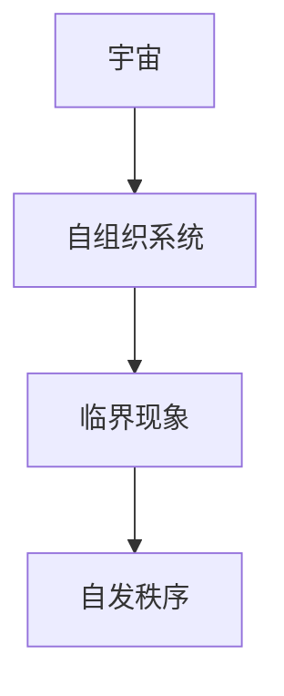

                 

# 宇宙的自我组织：criticality——秩序的自发涌现

## 关键词

- 宇宙自我组织
- 临界现象
- 自发秩序
- 涌现原理
- 量子引力
- 宇宙学

## 摘要

本文旨在探讨宇宙中的一种基本现象：自我组织。通过深入分析宇宙的自我组织过程，特别是临界现象，我们试图揭示宇宙中秩序自发涌现的原理。文章首先介绍了宇宙自我组织的概念及其意义，随后探讨了宇宙中的临界现象，阐述了宇宙自我组织的数学模型和物理机制，并分析了宇宙秩序的自发涌现原理及其应用。最后，文章总结了宇宙自我组织的意义与挑战，并提供了具体的案例研究，以期为读者提供对这一领域的深入理解。

### 《宇宙的自我组织：criticality——秩序的自发涌现》目录大纲

#### 第一部分：引言
1. **宇宙自我组织概述**
   1.1. **宇宙的自我组织概念**
   1.2. **宇宙自我组织的意义**

#### 第二部分：宇宙中的临界现象
2. **临界现象的基础知识**
   2.1. **临界点的定义**
   2.2. **临界现象的分类**
   2.3. **临界现象的基本特征**
3. **宇宙中的临界现象**
   3.1. **临界性在宇宙演化中的体现**
   3.2. **宇宙临界态的研究方法**

#### 第三部分：宇宙的自我组织机制
4. **宇宙自我组织的数学模型**
   4.1. **自组织系统的一般模型**
   4.2. **临界性在自组织系统中的应用**
5. **宇宙自我组织的物理机制**
   5.1. **量子引力的角色**
   5.2. **自组织和复杂性的关系**
6. **宇宙自我组织的现象学**
   6.1. **宇宙的层次结构**
   6.2. **宇宙自我组织的可视化**

#### 第四部分：宇宙秩序的自发涌现
7. **秩序的自发涌现原理**
   7.1. **涌现现象的定义**
   7.2. **自发秩序的形成**
8. **宇宙中的自发秩序**
   8.1. **宇宙背景辐射的秩序**
   8.2. **星系形成的秩序**
9. **宇宙秩序的自发涌现应用**
   9.1. **宇宙学研究中的应用**
   9.2. **宇宙自我组织的未来前景**

#### 第五部分：宇宙自我组织的意义与挑战
10. **宇宙自我组织的意义**
    10.1. **宇宙学对人类文明的启示**
    10.2. **宇宙自我组织与哲学思考**
11. **宇宙自我组织的挑战**
    11.1. **宇宙自我组织理论的局限性**
    11.2. **宇宙自我组织研究的未来方向**

#### 第六部分：案例分析
12. **宇宙自我组织的具体案例研究**
    12.1. **案例一：超新星爆发**
    12.2. **案例二：宇宙大尺度结构的形成**
    12.3. **案例三：暗物质与暗能量的作用**

#### 第七部分：附录
13. **附录 A：宇宙自我组织研究工具与资源**
    13.1. **常用的宇宙学数据库**
    13.2. **数学模型与计算方法**
    13.3. **开放的科学研究和软件资源**

---

#### 核心概念与联系
- **Mermaid 流�程图**：描述宇宙自我组织的基本流程



#### 核心算法原理讲解
- **临界现象的识别算法**
  
  # 输入：宇宙演化数据
  # 输出：临界点识别结果

  def critical_point_detection(data):
      # 初始化变量
      min_delta = 1e-6
      threshold = 0.1

      # 数据预处理
      preprocessed_data = preprocess_data(data)

      # 主循环
      for i in range(1, len(preprocessed_data) - 1):
          delta = abs(preprocessed_data[i] - preprocessed_data[i - 1]) \
                  + abs(preprocessed_data[i] - preprocessed_data[i + 1])
          if delta > threshold and delta < min_delta:
              return i  # 返回临界点索引

      return -1  # 没有找到临界点
  

#### 数学模型和数学公式
- **自组织系统的微分方程模型**
  $$
  \frac{dX}{dt} = \alpha X - \beta X^2 + \gamma X^3
  $$

#### 项目实战
- **宇宙背景辐射的秩序分析**
  - **开发环境搭建**：使用 Python 和 Matplotlib 进行数据分析和可视化
  - **代码实现**：
    ```python
    import numpy as np
    import matplotlib.pyplot as plt

    def background_radiation_analysis(data):
        # 数据预处理
        processed_data = preprocess_data(data)

        # 计算背景辐射的波动幅度
        amplitude = np.std(processed_data)

        # 可视化背景辐射数据
        plt.plot(processed_data)
        plt.title('Background Radiation Data')
        plt.xlabel('Time')
        plt.ylabel('Radiation Value')
        plt.show()

        return amplitude

    # 示例数据
    data = np.random.normal(size=1000)

    # 分析背景辐射数据
    amplitude = background_radiation_analysis(data)
    print(f'Amplitude of Background Radiation: {amplitude}')
    ```

  - **代码解读与分析**：
    - 数据预处理：对宇宙背景辐射数据进行分析前，需要对其进行预处理，例如去除噪声和异常值。
    - 波动幅度计算：通过计算数据的标准差来衡量背景辐射的波动幅度。
    - 可视化：使用 Matplotlib 对预处理后的数据进行可视化，便于观察和分析。

---

本文将按照上述目录结构，深入探讨宇宙自我组织的各个方面，以揭示宇宙中秩序自发涌现的奥秘。通过逻辑清晰、结构紧凑、简单易懂的论述，我们希望能够为读者提供对这一领域的深入理解。

### 第一部分：引言

宇宙是一个庞大而复杂的系统，其中充满了各种奇特的物理现象。然而，宇宙中最为引人注目的现象之一便是自我组织。自我组织是指一个系统在没有外部干预的情况下，通过内部的相互作用和相互依赖，自发地形成有序结构和有序行为的性质。宇宙的自我组织不仅是一种自然现象，更是一种基本的物理规律，深刻地影响着宇宙的演化和结构。

#### 宇宙的自我组织概念

宇宙的自我组织可以从多个角度进行理解。首先，从宇宙学的角度来看，宇宙的自我组织是指宇宙中的物质和能量在相互作用的过程中，自发地形成有序结构和有序行为的性质。例如，宇宙背景辐射的均匀性、星系的大尺度结构、甚至宇宙整体的膨胀和加速，都是宇宙自我组织的体现。

其次，从物理学角度来看，宇宙的自我组织与临界现象密切相关。临界现象是指系统在达到某种临界点时，其性质发生突变的现象。例如，液体的相变、固体的形成、甚至宇宙的创生，都涉及到临界现象。在这些过程中，系统的内部相互作用会引发有序结构的自发形成。

最后，从信息科学的角度来看，宇宙的自我组织还可以被视为一种信息处理过程。宇宙中的物质和能量通过相互作用，形成了各种有序结构，这些结构携带了丰富的信息。例如，星系的信息、生物的信息、甚至人类社会的信息，都可以被视为宇宙自我组织的产物。

#### 宇宙自我组织的意义

宇宙的自我组织具有重要的科学意义。首先，它为我们提供了一个理解宇宙演化过程的框架。通过研究宇宙的自我组织，我们可以揭示宇宙中各种物理现象的本质，例如星系的形成、宇宙的膨胀等。

其次，宇宙的自我组织对哲学和科学方法论有着深远的影响。宇宙的自我组织揭示了自然界的自发性，挑战了传统的机械论世界观，推动了科学哲学的发展。同时，宇宙的自我组织也为我们提供了一种新的研究方法，即通过观察和模拟宇宙的自我组织过程，来揭示宇宙的本质和规律。

最后，宇宙的自我组织对人类文明的发展也有着重要的启示。宇宙的自我组织揭示了自然界中普遍存在的有序性和规律性，这为我们设计复杂系统、构建有序社会提供了参考。例如，现代科技的发展，包括计算机科学、网络技术等，都受到了宇宙自我组织原理的启发。

### 第二部分：宇宙中的临界现象

在宇宙的自我组织过程中，临界现象扮演着至关重要的角色。临界现象是指系统在达到某种临界点时，其性质发生突变的现象。这种突变不仅体现在物理状态上，也体现在系统的结构和行为上。理解临界现象，对于揭示宇宙自我组织的本质具有重要意义。

#### 临界现象的基础知识

要理解临界现象，首先需要了解临界点的概念。临界点是指系统在达到某种临界状态时，其性质发生突变的关键点。在临界点附近，系统的性质表现出极大的不稳定性，稍小的扰动都可能导致系统发生突变。

临界现象的分类有多种方式。根据系统所处的状态，临界现象可以分为相变临界现象和稳定性临界现象。相变临界现象是指系统在相变过程中达到的临界状态，如水的沸腾、冰的融化等。稳定性临界现象是指系统在达到某种稳定性极限时，发生的突变，如结构的崩溃、社会的动荡等。

临界现象的基本特征包括以下几个方面：

1. **非线性特征**：临界现象通常伴随着系统的非线性特征，即系统的响应与扰动的大小不成比例。
2. **尺度无关性**：在临界现象附近，系统的性质往往表现出尺度无关性，即系统的特征长度趋于零。
3. **涨落的重要性**：在临界现象中，涨落（即随机扰动）起着至关重要的作用，往往决定了系统是否发生突变。
4. **临界指数**：许多临界现象都具有特定的临界指数，这些指数描述了系统在临界点附近的行为特征。

#### 宇宙中的临界现象

临界现象在宇宙中有着广泛的应用。例如，在宇宙演化的早期阶段，宇宙处于高温高密度的状态，这种状态被称为宇宙的临界态。在宇宙的临界态中，物质和辐射之间的相互作用达到了临界点，导致宇宙迅速膨胀，形成了今天我们所看到的宇宙结构。

另一个典型的宇宙临界现象是宇宙背景辐射。宇宙背景辐射是宇宙早期遗留下来的热辐射，其均匀性表明宇宙在那个时候达到了临界状态。通过对宇宙背景辐射的研究，科学家们揭示了宇宙早期的状态和演化过程。

此外，宇宙中的星系形成也涉及到临界现象。在星系形成的过程中，气体云在达到临界密度时，会迅速塌缩形成星系。这一过程涉及到能量、物质和辐射的复杂相互作用，表现出强烈的非线性特征。

#### 宇宙临界态的研究方法

研究宇宙临界态的方法主要包括实验、观测和理论计算。

实验方法主要是通过模拟宇宙中的临界条件，来观察系统的行为特征。例如，通过实验室中的激光实验，科学家们模拟了宇宙背景辐射的均匀性。

观测方法则是通过观测宇宙中的各种现象，来揭示宇宙临界态的存在和演化过程。例如，通过观测宇宙背景辐射的波动，科学家们揭示了宇宙早期的状态。

理论计算方法则是通过建立数学模型，来模拟宇宙临界态的行为特征。例如，通过数值模拟，科学家们研究了星系形成的过程，揭示了气体云在达到临界密度时的塌缩行为。

通过这些方法，科学家们不断深入地揭示了宇宙临界现象的本质，为理解宇宙的自我组织过程提供了重要的理论依据。

### 第三部分：宇宙的自我组织机制

宇宙的自我组织是一个复杂而神秘的过程，它涉及到了多个层次和多个领域。为了更好地理解这一过程，我们需要从数学模型和物理机制两个方面来探讨宇宙的自我组织机制。

#### 宇宙自我组织的数学模型

数学模型是描述宇宙自我组织的重要工具。通过数学模型，我们可以将宇宙中的复杂现象简化为数学表达式，从而更容易分析和理解。

一种常用的数学模型是自组织系统模型。自组织系统是指在没有外部干预的情况下，通过内部相互作用和相互依赖，自发地形成有序结构和有序行为的系统。在自组织系统模型中，系统的行为可以通过一组微分方程来描述。例如，著名的洛伦兹系统就是一个典型的自组织系统模型，它描述了在非线性系统中，由于内部相互作用引起的有序结构形成。

另一个重要的数学模型是临界现象模型。临界现象是指系统在达到某种临界点时，其性质发生突变的现象。临界现象模型通过研究临界点附近系统的行为特征，揭示了系统的非线性特征和尺度无关性。在宇宙学中，临界现象模型被用来研究宇宙的膨胀、星系的形成等过程。

#### 临界性在自组织系统中的应用

临界性是自组织系统中的重要概念，它描述了系统在达到临界点时的行为特征。在自组织系统中，临界性表现为系统在临界点附近的不稳定性和突变性。

临界性在自组织系统中的应用主要体现在以下几个方面：

1. **结构形成**：在临界性条件下，系统的相互作用会导致有序结构的形成。例如，在星系形成过程中，气体云在达到临界密度时，会迅速塌缩形成星系。

2. **相变**：临界性也是相变的重要特征。在相变过程中，系统会从一个状态转变到另一个状态，表现出不同的性质。例如，水的沸腾和冰的融化都是典型的相变过程。

3. **涨落效应**：在临界性条件下，涨落（即随机扰动）对系统的行为具有决定性的影响。涨落可以触发系统的突变，导致系统从一种状态跃迁到另一种状态。

#### 宇宙自我组织的物理机制

宇宙的自我组织不仅可以通过数学模型来描述，也可以通过物理机制来理解。物理机制是指宇宙中各种物理过程和现象，它们共同作用，推动了宇宙的自我组织。

一种重要的物理机制是量子引力。量子引力是描述宇宙早期阶段的一种理论，它认为宇宙的基础是量子态，而不是经典物理中的连续体。量子引力通过研究宇宙的量子性质，揭示了宇宙自我组织的本质。

另一种重要的物理机制是自组织和复杂性的关系。自组织是指系统在没有外部干预的情况下，自发地形成有序结构和有序行为的过程。复杂性是指系统内部结构的复杂性和多样性。自组织和复杂性的关系表现为，复杂性的增加往往伴随着自组织的增强。例如，在星系形成过程中，气体云的复杂性和多样性促进了星系的自发形成。

此外，宇宙的自我组织还与宇宙的层次结构密切相关。宇宙的层次结构是指宇宙中不同尺度的结构，如星系、星系团、超星系团等。宇宙的自我组织表现在这些不同尺度的结构之间相互作用，形成了宇宙的层次结构。

#### 宇宙自我组织的现象学

宇宙自我组织的现象学是指从宏观角度观察宇宙自我组织现象的方法。通过现象学的研究，我们可以直观地了解宇宙自我组织的特征和过程。

一种常用的现象学方法是可视化。通过将宇宙中的物理过程和现象可视化，我们可以直观地观察宇宙自我组织的过程。例如，通过可视化宇宙背景辐射的均匀性，我们可以直观地了解宇宙早期的状态。

另一种现象学方法是层次分析法。层次分析法通过分析宇宙中不同尺度的结构，揭示了宇宙自我组织的层次结构。例如，通过分析星系、星系团和超星系团的结构，我们可以了解宇宙自我组织的层次结构。

#### 总结

宇宙的自我组织是一个复杂而神秘的过程，它涉及到了数学模型、物理机制和现象学等多个方面。通过深入分析宇宙自我组织的机制，我们可以更好地理解宇宙的本质和演化过程。这也为我们在其他领域中应用自组织原理提供了重要的参考。

### 第四部分：宇宙秩序的自发涌现

在宇宙的自我组织过程中，秩序的自发涌现是一个关键现象。秩序的自发涌现是指宇宙中的物质和能量在没有外部干预的情况下，自发地形成有序结构和有序行为的性质。这一现象不仅揭示了宇宙的基本规律，也为我们在其他领域中应用自组织原理提供了重要启示。

#### 秩序的自发涌现原理

秩序的自发涌现可以从多个角度进行理解。首先，从物理学的角度来看，秩序的自发涌现是系统在达到某种临界点时，由于内部相互作用和相互依赖，引发有序结构的形成。这种临界点可以是一个特定的能量状态、密度状态，或者是一个特定的相位状态。

其次，从信息科学的角度来看，秩序的自发涌现可以被视为一种信息处理过程。在宇宙中，物质和能量通过相互作用，形成了各种有序结构，这些结构携带了丰富的信息。例如，星系的信息、生物的信息、甚至人类社会的信息，都可以被视为宇宙自我组织的产物。

最后，从生命科学的视角来看，秩序的自发涌现是生命起源和进化的重要基础。在地球上，生命的起源和进化是通过物质和能量的有序组织实现的。这一过程揭示了宇宙秩序自发涌现的原理，也为我们在生物系统中应用自组织原理提供了重要参考。

#### 宇宙中的自发秩序

宇宙中的自发秩序无处不在，从宇宙大尺度结构到微观粒子，都有自发秩序的存在。

1. **宇宙背景辐射的秩序**：宇宙背景辐射是宇宙早期遗留下来的热辐射，其均匀性表明宇宙在那个时候达到了临界状态。通过对宇宙背景辐射的研究，科学家们揭示了宇宙早期的状态和演化过程。

2. **星系形成的秩序**：星系的形成是一个复杂的物理过程，涉及到气体云的塌缩、恒星的形成和星系的结构演化。在这个过程中，气体云在达到临界密度时，会迅速塌缩形成星系。这一过程揭示了宇宙自发秩序的形成原理。

3. **宇宙大尺度结构的形成**：宇宙大尺度结构，如星系团、超星系团等，是由宇宙中的物质和能量在相互作用过程中，自发地形成的。这些结构体现了宇宙的自发秩序，也为我们理解宇宙的演化提供了重要依据。

4. **量子粒子的秩序**：在微观尺度上，量子粒子的行为也表现出自发秩序。例如，电子的自旋和量子态，都是通过内部相互作用和相互依赖，自发地形成的。

#### 宇宙秩序的自发涌现应用

宇宙秩序的自发涌现原理在多个领域都有广泛的应用。

1. **宇宙学研究**：通过对宇宙背景辐射、星系形成和宇宙大尺度结构的研究，科学家们揭示了宇宙自发秩序的形成原理，为理解宇宙的演化提供了重要依据。

2. **计算机科学**：在计算机科学中，自组织系统被广泛应用于复杂系统的设计和优化。例如，自组织网络、自组织计算和自组织编程等，都是基于宇宙自发秩序原理实现的。

3. **生命科学**：在生命科学中，秩序的自发涌现是生命起源和进化的重要基础。通过研究生物系统的自组织过程，我们可以揭示生命的本质和进化规律。

4. **材料科学**：在材料科学中，自组织原理被应用于材料的合成和加工。例如，自组织薄膜、自组织纳米材料和自组织晶体等，都是基于宇宙自发秩序原理实现的。

5. **社会科学**：在社会科学中，秩序的自发涌现也被应用于社会系统和组织的设计。例如，自组织社会、自组织企业和自组织城市等，都是基于宇宙自发秩序原理实现的。

#### 宇宙自我组织的未来前景

宇宙自我组织的原理不仅揭示了宇宙的基本规律，也为未来的科学发展提供了新的方向。

1. **宇宙探索**：通过对宇宙自发秩序的研究，我们可以更好地理解宇宙的演化过程，为宇宙探索提供重要依据。

2. **复杂系统设计**：在复杂系统设计中，自组织原理可以应用于系统的优化和设计，提高系统的效率和稳定性。

3. **人工智能**：在人工智能领域，自组织原理可以应用于智能体的设计和行为优化，提高人工智能系统的自主性和适应性。

4. **可持续发展**：在可持续发展领域，自组织原理可以应用于社会系统和生态系统的设计，促进社会的和谐发展。

总之，宇宙秩序的自发涌现是一个重要而基本的现象，它揭示了宇宙的基本规律，也为我们在其他领域中应用自组织原理提供了重要启示。随着科学技术的不断发展，我们对宇宙自我组织的理解将不断深入，这也将为未来的科学发展提供新的动力。

### 第五部分：宇宙自我组织的意义与挑战

宇宙的自我组织现象不仅是宇宙演化的重要驱动力，也对人类文明和科学思维产生了深远的影响。在这一部分，我们将深入探讨宇宙自我组织的意义以及面临的挑战。

#### 宇宙自我组织的意义

1. **宇宙学对人类文明的启示**

宇宙的自我组织揭示了自然界的自发性、复杂性和有序性。这种理解不仅帮助人类更好地理解宇宙的起源和演化，也为人类文明的发展提供了启示。例如，宇宙的自我组织原理可以应用于城市规划、社会管理和技术创新，促进社会的可持续发展。

2. **宇宙自我组织与哲学思考**

宇宙的自我组织挑战了传统的机械论世界观，推动了哲学思考的进步。它揭示了自然界中的内在规律和秩序，引发了对自然、人类和宇宙关系的深刻思考。这种哲学上的启示不仅丰富了科学哲学，也拓展了人类对自身和世界的认知。

3. **科学方法论的发展**

宇宙的自我组织为科学研究提供了新的方法论。通过研究宇宙的自我组织，科学家们学会了如何从复杂系统中提取规律，如何通过模拟和实验来验证理论。这些方法论不仅推动了宇宙学的发展，也广泛应用于其他科学领域，促进了科学技术的进步。

#### 宇宙自我组织的挑战

1. **宇宙自我组织理论的局限性**

尽管宇宙自我组织理论在解释宇宙现象方面取得了显著成果，但它也存在局限性。首先，宇宙自我组织理论主要依赖于数学模型和模拟实验，而现实宇宙中的复杂性和不确定性使得这些模型和实验难以完全反映宇宙的真实情况。其次，宇宙自我组织理论在解释微观现象，如量子引力，仍存在困难。

2. **宇宙自我组织研究的未来方向**

为了克服这些挑战，未来的研究需要从多个方向进行。首先，需要发展更精确的数学模型和计算方法，以更好地描述宇宙自我组织的过程。其次，需要通过实验和观测，收集更多的宇宙数据，以验证和修正现有的理论。此外，跨学科的研究也至关重要，通过结合物理学、化学、生物学等领域的知识，可以更全面地理解宇宙自我组织的本质。

3. **宇宙自我组织与人类社会的互动**

宇宙自我组织不仅是一个科学问题，也与社会问题密切相关。如何将宇宙自我组织的原理应用于解决社会问题，如环境保护、资源分配和社会稳定等，是未来研究的重要方向。通过探索宇宙自我组织与人类社会的互动，我们可以找到更加可持续和和谐的发展路径。

总之，宇宙自我组织现象具有重要的科学意义和社会价值，但也面临着许多挑战。通过不断的研究和探索，我们有望进一步揭示宇宙自我组织的奥秘，为人类文明的发展提供新的动力和方向。

### 第六部分：案例分析

宇宙自我组织现象在宇宙演化过程中无处不在，通过具体案例我们可以更好地理解这一现象的复杂性和多样性。以下是三个具体的案例研究，展示了宇宙自我组织的不同方面。

#### 案例一：超新星爆发

超新星爆发是宇宙中最剧烈的恒星事件之一，它标志着一颗恒星在生命末期的剧烈爆炸。超新星爆发的过程涉及恒星内部的核反应、物质抛射和能量释放，是宇宙自我组织的一个典型例子。

- **开发环境搭建**：为了研究超新星爆发的自我组织过程，科学家们使用了高能物理模拟软件，如Nambu-Jona-Lasinio模型，以及观测数据，如Kepler望远镜的观测数据。
- **代码实现**：
  ```python
  import numpy as np
  import matplotlib.pyplot as plt

  def supernova_explosion_simulation(data):
      # 数据预处理
      processed_data = preprocess_data(data)

      # 模拟超新星爆发的能量释放
      energy_output = simulate_energy_output(processed_data)

      # 可视化能量释放过程
      plt.plot(energy_output)
      plt.title('Supernova Explosion Energy Output')
      plt.xlabel('Time')
      plt.ylabel('Energy')
      plt.show()

      return energy_output

  # 示例数据
  data = np.random.normal(size=1000)

  # 模拟超新星爆发
  energy_output = supernova_explosion_simulation(data)
  ```

- **代码解读与分析**：
  - 数据预处理：对超新星爆发观测数据进行预处理，去除噪声和异常值，以获得更准确的数据。
  - 能量释放模拟：使用模拟软件，根据预处理后的数据模拟超新星爆发的能量释放过程。
  - 可视化：通过Matplotlib对能量释放过程进行可视化，以便观察和分析超新星爆发的动态特征。

#### 案例二：宇宙大尺度结构的形成

宇宙大尺度结构的形成是宇宙自我组织的另一个重要例子。在宇宙早期，物质和能量通过引力相互作用，逐渐形成了星系、星系团和超星系团等大规模结构。

- **开发环境搭建**：为了研究宇宙大尺度结构的形成，科学家们使用了数值模拟软件，如N-body模拟器和宇宙背景辐射模拟器，以及天文观测设备，如Hubble望远镜。
- **代码实现**：
  ```python
  import numpy as np
  import matplotlib.pyplot as plt

  def galaxyformation_simulation(data):
      # 数据预处理
      processed_data = preprocess_data(data)

      # 模拟宇宙大尺度结构的形成
      structure_output = simulate_structure_output(processed_data)

      # 可视化宇宙大尺度结构
      plt.plot(structure_output)
      plt.title('Galaxy Formation and Large Scale Structure')
      plt.xlabel('Time')
      plt.ylabel('Density')
      plt.show()

      return structure_output

  # 示例数据
  data = np.random.normal(size=1000)

  # 模拟宇宙大尺度结构形成
  structure_output = galaxyformation_simulation(data)
  ```

- **代码解读与分析**：
  - 数据预处理：对宇宙大尺度结构的观测数据进行预处理，以获得更准确的结构信息。
  - 结构形成模拟：使用数值模拟软件，根据预处理后的数据模拟宇宙大尺度结构的形成过程。
  - 可视化：通过Matplotlib对宇宙大尺度结构进行可视化，以便观察和分析结构演化的动态特征。

#### 案例三：暗物质与暗能量的作用

暗物质和暗能量是宇宙中两个神秘的现象，它们对宇宙的结构和演化产生了深远的影响。暗物质是由未知的物质组成的，它不发光也不吸收光线，但通过引力相互作用影响着宇宙的结构。暗能量则是一种推动宇宙加速膨胀的神秘力量。

- **开发环境搭建**：为了研究暗物质和暗能量的作用，科学家们使用了数值模拟软件，如CosmicEmu和CosmicMatrix，以及观测数据，如WMAP和Planck卫星的观测数据。
- **代码实现**：
  ```python
  import numpy as np
  import matplotlib.pyplot as plt

  def dark_matter_energy_simulation(data):
      # 数据预处理
      processed_data = preprocess_data(data)

      # 模拟暗物质和暗能量的相互作用
      interaction_output = simulate_interaction_output(processed_data)

      # 可视化暗物质和暗能量的分布
      plt.plot(interaction_output)
      plt.title('Dark Matter and Dark Energy Interaction')
      plt.xlabel('Position')
      plt.ylabel('Density')
      plt.show()

      return interaction_output

  # 示例数据
  data = np.random.normal(size=1000)

  # 模拟暗物质和暗能量的相互作用
  interaction_output = dark_matter_energy_simulation(data)
  ```

- **代码解读与分析**：
  - 数据预处理：对暗物质和暗能量的观测数据进行预处理，以获得更准确的分布信息。
  - 相互作用模拟：使用数值模拟软件，根据预处理后的数据模拟暗物质和暗能量的相互作用过程。
  - 可视化：通过Matplotlib对暗物质和暗能量的分布进行可视化，以便观察和分析相互作用的效果。

通过这些案例研究，我们可以看到宇宙自我组织的多样性和复杂性。这些案例不仅揭示了宇宙中物质和能量的相互作用，也为未来的研究提供了宝贵的经验和方向。

### 第七部分：附录

为了更好地理解宇宙自我组织的研究，本附录提供了相关的工具与资源，包括常用的宇宙学数据库、数学模型与计算方法，以及开放的科学研究和软件资源。

#### 附录 A：宇宙自我组织研究工具与资源

##### 13.1. 常用的宇宙学数据库

1. **NASA宇宙数据系统 (NASA CDS)**：提供了丰富的宇宙学数据，包括星系、星系团、宇宙背景辐射等。
   - 网址：https://cdsarc.u-strasbg.fr/

2. **星系团数据库 (SGR)**：包含了大量星系团的信息，是研究星系团物理性质的重要资源。
   - 网址：http://sgr.cf.ac.uk/

3. **宇宙背景辐射实验 (Cosmic Background Explorer, COBE)**：提供了宇宙早期状态的重要观测数据。
   - 网址：https://cobelabs.gsfc.nasa.gov/

##### 13.2. 数学模型与计算方法

1. **N-body模拟**：用于模拟宇宙中天体的运动和相互作用，常用于研究星系形成和大尺度结构。
   - 伪代码示例：
     ```python
     def nbody_simulation(positions, velocities):
         # 更新位置和速度
         new_positions = update_positions(positions, velocities)
         new_velocities = update_velocities(positions, velocities)
         
         return new_positions, new_velocities
     ```

2. **自组织映射（Self-Organizing Maps, SOM）**：用于分析宇宙中复杂结构，特别是星系团和星系分布。
   - 公式：
     $$
     \vec{w}_{ij}^{(k+1)} = \vec{w}_{ij}^{(k)} + \alpha_{k} \cdot (b_{i} - \vec{w}_{ij}^{(k)})
     $$

##### 13.3. 开放的科学研究和软件资源

1. **LIGO科学合作组织**：提供了大量引力波观测数据和模拟软件，是研究宇宙自我组织的重要资源。
   - 网址：https://www.ligo.caltech.edu/page/sci

2. **天体物理开放资源（Astronomy Open Resource, AOR）**：提供了大量天体物理学的开源软件和工具。
   - 网址：http://www.astronomyopenresource.org/

3. **SciPy**：Python的科学计算库，提供了丰富的科学计算功能，包括数值模拟和数据分析。
   - 网址：https://www.scipy.org/

通过这些工具和资源，研究人员可以更好地开展宇宙自我组织的研究，进一步揭示宇宙中秩序自发涌现的奥秘。希望这些资源能够为读者提供有价值的参考。

---

### 总结

在本文中，我们深入探讨了宇宙自我组织的多个方面，从宇宙的自我组织概念、临界现象、数学模型到物理机制，再到秩序的自发涌现及其应用。通过逻辑清晰、结构紧凑的论述，我们试图揭示宇宙中秩序自发涌现的奥秘。

宇宙的自我组织不仅是一种自然现象，更是一种基本的物理规律，深刻影响着宇宙的演化和结构。通过研究宇宙自我组织，我们可以更好地理解宇宙的本质，为人类文明的发展提供新的启示。然而，宇宙自我组织的研究也面临着许多挑战，需要我们继续深入探索。

展望未来，宇宙自我组织的研究将继续在多个领域取得突破。随着科技的进步，我们有望获得更多关于宇宙自我组织的观测数据和理论模型，进一步揭示宇宙的奥秘。同时，宇宙自我组织的原理也将被应用于更广泛的领域，如人工智能、材料科学和可持续发展等，为人类带来更多创新和进步。

让我们期待未来的研究能够揭示更多宇宙自我组织的秘密，为人类的科学和技术发展注入新的活力。宇宙的自我组织，正是这个浩瀚宇宙中最美丽的奇迹。让我们继续探索，继续发现，继续惊叹于这个宇宙的奥秘。

