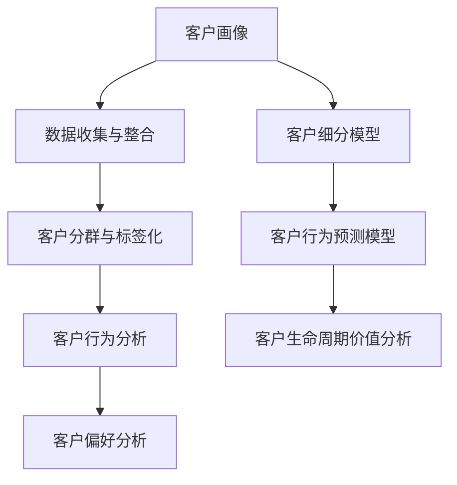

                 

# 《客户画像：精准定位目标用户》

## 关键词
- 客户画像
- 数据挖掘
- 个性化营销
- 客户细分
- 客户生命周期价值

## 摘要
在当今竞争激烈的市场环境中，精准定位目标用户已经成为企业成功的关键。本文将深入探讨客户画像的概念、构建方法、分析工具及应用，阐述如何通过客户画像实现精准营销和客户生命周期管理，为企业创造价值。

### 《客户画像：精准定位目标用户》目录大纲

#### 第一部分：客户画像基础

##### 第1章：客户画像概述

- 1.1 客户画像的定义与价值
- 1.2 客户画像的发展历程
- 1.3 客户画像在市场营销中的应用

##### 第2章：客户画像构建方法

- 2.1 数据收集与整合
- 2.2 客户分群与标签化
- 2.3 客户行为分析
- 2.4 客户偏好分析

##### 第3章：客户画像分析工具与技术

- 3.1 数据挖掘与机器学习技术
- 3.2 客户细分模型
- 3.3 客户行为预测模型
- 3.4 客户生命周期价值分析

##### 第4章：客户画像数据质量与治理

- 4.1 数据质量评估与提升
- 4.2 数据安全与隐私保护
- 4.3 数据治理框架与策略

#### 第二部分：精准营销与客户画像

##### 第5章：精准营销策略

- 5.1 基于客户画像的精准营销
- 5.2 定制化营销与个性化推荐
- 5.3 营销自动化与客户关系管理

##### 第6章：客户生命周期管理

- 6.1 客户获取与转化策略
- 6.2 客户维系与忠诚度提升
- 6.3 客户流失分析与应对

##### 第7章：客户画像在跨渠道营销中的应用

- 7.1 线上线下融合营销
- 7.2 多渠道数据整合与协同
- 7.3 跨渠道客户画像构建与营销策略

##### 第8章：客户画像项目实施与优化

- 8.1 客户画像项目规划与实施
- 8.2 数据驱动决策与迭代优化
- 8.3 客户画像效果的评估与改进

#### 附录：客户画像资源与工具

- 附录 A：客户画像构建与数据分析工具
- 附录 B：客户画像案例解析
- 附录 C：客户画像相关书籍与论文推荐
- 附录 D：客户画像常用技术术语与解释

### 核心概念与联系

以下是本文的核心概念和联系，通过Mermaid流程图展示：

### 第一部分：客户画像基础

#### 第1章：客户画像概述

##### 1.1 客户画像的定义与价值

客户画像，也称为客户轮廓或客户档案，是一种将客户特征、行为、需求等信息进行结构化整合的抽象模型。它通过数据分析和机器学习技术，将海量的客户数据进行处理，提取出具有代表性的特征，形成一个或多个维度，从而构建出一个虚拟的客户形象。

客户画像的价值主要体现在以下几个方面：

1. **精准定位目标用户**：通过分析客户的消费行为、偏好、需求等信息，帮助企业精准定位潜在客户，优化市场策略。
2. **提高营销效果**：基于客户画像进行个性化营销，提高广告投放和促销活动的精准度和转化率。
3. **优化产品和服务**：通过了解客户需求和偏好，为企业提供产品优化和服务的改进方向。
4. **提升客户满意度**：通过定制化服务，提高客户满意度和忠诚度，降低客户流失率。

##### 1.2 客户画像的发展历程

客户画像的概念起源于互联网营销时代。在早期，企业主要通过市场调研和问卷等方式获取客户信息，但这些方法往往成本较高，且难以全面了解客户需求。

随着互联网和大数据技术的发展，客户画像逐渐成为一种重要的市场营销工具。近年来，随着人工智能和机器学习技术的应用，客户画像的构建和分析能力得到了极大提升，成为企业数字化转型的重要手段。

##### 1.3 客户画像在市场营销中的应用

在市场营销中，客户画像的应用主要包括以下几个方面：

1. **市场细分**：通过分析客户特征和行为，将市场划分为不同的细分群体，为制定有针对性的市场策略提供依据。
2. **客户定位**：明确目标客户群体的特征和需求，为企业制定精准的营销策略提供支持。
3. **个性化推荐**：根据客户画像，为不同客户提供个性化的产品和服务推荐，提高客户满意度和忠诚度。
4. **客户关系管理**：通过分析客户行为数据，了解客户需求，提供定制化服务，提升客户满意度。
5. **营销效果评估**：基于客户画像，评估营销活动的效果，为优化营销策略提供数据支持。

#### 第2章：客户画像构建方法

##### 2.1 数据收集与整合

构建客户画像的第一步是数据收集。数据来源主要包括以下几个方面：

1. **内部数据**：企业内部的各种业务数据，如销售数据、客户服务数据、订单数据等。
2. **外部数据**：从第三方数据源获取的数据，如社交媒体数据、市场调研数据、公共数据等。
3. **用户行为数据**：通过网站、APP等渠道收集的用户行为数据，如浏览记录、点击行为、搜索关键词等。

收集到的数据需要进行整合，形成一个统一的数据视图。数据整合的方法包括数据清洗、数据映射和数据合并等。

##### 2.2 客户分群与标签化

客户分群是将具有相似特征的客户归为一组的过程。分群的方法主要包括基于人口统计学的分群、基于行为特征的分群和基于需求的分群等。

标签化是将客户的特征和行为进行分类和标注的过程。通过标签化，可以更直观地了解客户的特征和需求，为后续的营销活动提供支持。

##### 2.3 客户行为分析

客户行为分析是对客户的行为数据进行挖掘和分析，提取出有价值的特征和趋势。客户行为分析的方法包括：

1. **描述性分析**：对客户行为数据进行统计分析，了解客户的基本特征和消费习惯。
2. **预测性分析**：通过历史数据建立模型，预测客户的未来行为和需求。
3. **关联分析**：分析不同客户行为之间的关联性，发现潜在的业务机会。

##### 2.4 客户偏好分析

客户偏好分析是对客户消费偏好进行分析，了解客户对不同产品或服务的喜好程度。客户偏好分析的方法包括：

1. **问卷调查**：通过问卷调查获取客户的偏好信息。
2. **数据分析**：通过分析客户的购买记录、搜索行为等数据，提取客户的偏好特征。
3. **机器学习**：利用机器学习算法，预测客户的偏好和需求。

#### 第3章：客户画像分析工具与技术

##### 3.1 数据挖掘与机器学习技术

数据挖掘和机器学习是构建客户画像的重要技术手段。数据挖掘主要用于从大量数据中提取有价值的信息，机器学习则用于建立预测模型和分类模型。

常用的数据挖掘和机器学习算法包括：

1. **聚类算法**：如K-means、层次聚类等，用于客户分群。
2. **分类算法**：如决策树、支持向量机等，用于客户细分和偏好预测。
3. **预测算法**：如回归分析、时间序列分析等，用于客户行为预测。

##### 3.2 客户细分模型

客户细分模型是将客户划分为不同群体的方法。常见的客户细分模型包括：

1. **人口统计学模型**：根据年龄、性别、收入等人口统计特征进行客户细分。
2. **行为特征模型**：根据客户的购买行为、搜索行为等行为特征进行客户细分。
3. **需求特征模型**：根据客户的需求特征进行客户细分。

##### 3.3 客户行为预测模型

客户行为预测模型是用于预测客户未来行为的方法。常见的客户行为预测模型包括：

1. **回归模型**：用于预测客户的消费金额、购买频率等。
2. **分类模型**：用于预测客户的购买行为、流失风险等。
3. **时间序列模型**：用于预测客户的行为时间序列，如购买时间、服务使用时间等。

##### 3.4 客户生命周期价值分析

客户生命周期价值（Customer Lifetime Value，CLV）是衡量客户对企业贡献的重要指标。CLV的计算方法如下：

$$
CLV = \sum_{t=1}^{n} \frac{R_t \times p_t \times (1-d_t)}{(1+r)^t}
$$

其中，\( R_t \)为第\( t \)年的收益，\( p_t \)为第\( t \)年的购买概率，\( d_t \)为第\( t \)年的流失率，\( r \)为折现率，\( n \)为预测的时间范围。

通过计算客户生命周期价值，企业可以了解不同客户的价值，制定有针对性的营销策略。

#### 第4章：客户画像数据质量与治理

##### 4.1 数据质量评估与提升

数据质量是构建客户画像的关键。数据质量评估主要包括以下方面：

1. **完整性**：检查数据是否完整，是否存在缺失值。
2. **准确性**：检查数据是否准确，是否符合事实。
3. **一致性**：检查数据是否一致，是否存在矛盾。
4. **时效性**：检查数据是否及时更新，是否反映了最新的客户信息。

提升数据质量的方法包括：

1. **数据清洗**：去除重复数据、错误数据和缺失数据。
2. **数据标准化**：统一数据格式和单位，提高数据一致性。
3. **数据集成**：整合不同来源的数据，形成统一的数据视图。

##### 4.2 数据安全与隐私保护

在构建客户画像的过程中，数据安全和隐私保护至关重要。数据安全主要包括以下几个方面：

1. **数据加密**：对敏感数据进行加密处理，防止数据泄露。
2. **访问控制**：设定严格的访问权限，确保只有授权人员可以访问数据。
3. **安全审计**：定期进行安全审计，发现并修复安全漏洞。

隐私保护主要包括以下几个方面：

1. **匿名化处理**：对敏感数据进行匿名化处理，保护客户隐私。
2. **合规性审查**：确保数据处理过程符合相关法律法规，如《中华人民共和国网络安全法》等。

##### 4.3 数据治理框架与策略

数据治理是企业对数据管理的一种制度安排。数据治理框架主要包括以下几个方面：

1. **组织架构**：明确数据治理的职责和权限，确保数据治理的有效实施。
2. **流程规范**：制定数据收集、处理、存储、分析等各个环节的流程规范，确保数据质量。
3. **数据质量控制**：建立数据质量评估和提升机制，确保数据质量。
4. **数据安全与隐私保护**：制定数据安全与隐私保护策略，确保数据安全和客户隐私。

#### 第二部分：精准营销与客户画像

##### 第5章：精准营销策略

精准营销是利用客户画像进行有针对性的营销策略。精准营销策略主要包括以下几个方面：

1. **个性化推荐**：根据客户画像，为不同客户提供个性化的产品和服务推荐。
2. **定制化营销**：针对不同客户群体，制定个性化的营销方案和促销活动。
3. **动态定价**：根据客户画像和市场需求，动态调整产品价格，提高销售转化率。

##### 第5.1 节：基于客户画像的精准营销

基于客户画像的精准营销，是利用客户画像对客户进行细分，根据不同客户群体的特征和需求，制定个性化的营销策略。

1. **客户分群**：通过聚类算法等数据挖掘技术，将客户划分为不同的群体。
2. **个性化推荐**：根据客户的购买记录、搜索行为等数据，为不同客户提供个性化的产品推荐。
3. **定制化营销**：针对不同客户群体，制定个性化的营销方案和促销活动。

##### 第5.2 节：定制化营销与个性化推荐

定制化营销和个性化推荐是精准营销的核心手段。

1. **定制化营销**：根据客户画像，为客户提供个性化的产品和服务，提高客户满意度和忠诚度。
2. **个性化推荐**：利用机器学习算法，分析客户行为数据，为不同客户提供个性化的产品推荐。

##### 第5.3 节：营销自动化与客户关系管理

营销自动化和客户关系管理是提高营销效率和客户满意度的关键。

1. **营销自动化**：通过自动化工具，实现营销活动的自动化执行，提高营销效率。
2. **客户关系管理**：通过客户关系管理（CRM）系统，记录和分析客户数据，提供个性化的服务。

##### 第6章：客户生命周期管理

客户生命周期管理是通过对客户生命周期的全程管理，提高客户价值。

1. **客户获取**：通过精准营销策略，吸引潜在客户，提高客户获取效率。
2. **客户维系**：通过持续的客户关怀和服务，提高客户满意度和忠诚度。
3. **客户流失应对**：通过分析客户流失数据，制定有效的流失应对策略，降低客户流失率。

##### 第6.1 节：客户获取与转化策略

客户获取与转化策略是客户生命周期管理的重要环节。

1. **市场调研**：通过市场调研，了解目标客户的需求和痛点，制定针对性的营销策略。
2. **广告投放**：通过精准广告投放，提高品牌知名度和客户转化率。
3. **线上线下活动**：通过线上线下活动，吸引潜在客户，提高客户转化率。

##### 第6.2 节：客户维系与忠诚度提升

客户维系与忠诚度提升是客户生命周期管理的关键。

1. **客户关怀**：通过电话、短信、邮件等方式，持续关注客户需求，提供个性化服务。
2. **积分奖励**：通过积分奖励，提高客户满意度和忠诚度。
3. **会员制度**：通过会员制度，为客户提供专属优惠和特权，提高客户忠诚度。

##### 第6.3 节：客户流失分析与应对

客户流失分析与应对是客户生命周期管理的重要环节。

1. **流失预警**：通过分析客户行为数据，预测客户流失风险，提前采取应对措施。
2. **流失原因分析**：通过调研和数据分析，了解客户流失的原因，制定针对性的改进措施。
3. **挽回策略**：通过个性化挽回策略，降低客户流失率，提高客户满意度。

##### 第7章：客户画像在跨渠道营销中的应用

跨渠道营销是利用多种渠道进行营销活动的策略。

1. **线上线下一体化**：通过线上渠道吸引客户，线下渠道提供服务，实现线上线下一体化营销。
2. **多渠道数据整合**：通过数据整合，实现不同渠道数据的互联互通，提供一致的客户体验。
3. **跨渠道客户画像构建**：通过跨渠道数据，构建全面的客户画像，为跨渠道营销提供支持。

##### 第7.1 节：线上线下融合营销

线上线下融合营销是跨渠道营销的一种形式。

1. **线上引流**：通过线上渠道，如社交媒体、搜索引擎等，吸引潜在客户。
2. **线下体验**：通过线下渠道，如实体店、体验店等，提供产品和服务体验。
3. **线上线下互动**：通过线上线下互动，提高客户参与度和满意度。

##### 第7.2 节：多渠道数据整合与协同

多渠道数据整合与协同是跨渠道营销的关键。

1. **数据整合**：通过数据整合，实现不同渠道数据的互联互通。
2. **数据协同**：通过数据协同，提高不同渠道的营销策略一致性。
3. **统一客户视图**：通过统一客户视图，实现全面了解客户需求和行为。

##### 第7.3 节：跨渠道客户画像构建与营销策略

跨渠道客户画像构建与营销策略是基于跨渠道数据的客户画像构建和营销策略。

1. **跨渠道数据收集**：通过线上线下渠道，收集客户数据。
2. **客户画像构建**：通过数据挖掘和机器学习技术，构建跨渠道客户画像。
3. **营销策略制定**：根据跨渠道客户画像，制定个性化的营销策略。

##### 第8章：客户画像项目实施与优化

客户画像项目实施与优化是确保客户画像效果的重要环节。

1. **项目规划**：明确项目目标、范围、资源和时间，制定项目计划。
2. **数据收集与整合**：收集线上线下数据，进行数据整合，形成统一的数据视图。
3. **客户画像构建**：利用数据挖掘和机器学习技术，构建客户画像。
4. **营销策略制定**：根据客户画像，制定个性化的营销策略。
5. **效果评估与优化**：定期评估客户画像效果，优化营销策略。

##### 第8.1 节：客户画像项目规划与实施

客户画像项目规划与实施是确保客户画像项目顺利进行的关键。

1. **项目目标**：明确项目目标，如提高营销效果、降低客户流失率等。
2. **项目范围**：明确项目范围，如涉及的数据来源、分析工具等。
3. **资源分配**：合理分配项目资源，如人员、时间、预算等。
4. **项目计划**：制定详细的项目计划，明确每个阶段的任务和时间安排。

##### 第8.2 节：数据驱动决策与迭代优化

数据驱动决策与迭代优化是确保客户画像效果的重要手段。

1. **数据驱动决策**：通过数据分析，支持决策制定，提高决策效率。
2. **迭代优化**：根据数据反馈，不断优化营销策略和客户画像模型。

##### 第8.3 节：客户画像效果的评估与改进

客户画像效果的评估与改进是确保客户画像价值的必要环节。

1. **效果评估**：通过评估营销活动效果，如转化率、客户满意度等，衡量客户画像的效果。
2. **改进措施**：根据效果评估结果，制定改进措施，优化客户画像和营销策略。

#### 附录：客户画像资源与工具

##### 附录 A：客户画像构建与数据分析工具

1. **Python**：Python是一种流行的编程语言，具有丰富的数据分析和机器学习库，如scikit-learn、Pandas等。
2. **R**：R是一种专门用于数据分析和统计计算的语言，具有强大的数据可视化功能。
3. **Excel**：Excel是一种常用的电子表格软件，适用于简单的数据分析和可视化。
4. **Tableau**：Tableau是一种数据可视化工具，可用于创建交互式的图表和仪表板。

##### 附录 B：客户画像案例解析

1. **亚马逊**：亚马逊通过分析用户浏览、搜索和购买行为，为不同客户提供个性化的产品推荐，提高销售转化率。
2. **阿里巴巴**：阿里巴巴通过构建全面的客户画像，实现精准营销和客户关系管理，提高客户满意度和忠诚度。
3. **腾讯**：腾讯通过分析用户在微信、QQ等平台的行为数据，为用户提供个性化的服务和推荐，提高用户活跃度和留存率。

##### 附录 C：客户画像相关书籍与论文推荐

1. **《大数据营销：如何利用数据创造商业价值》**：本书详细介绍了大数据营销的方法和策略，包括客户画像的构建和应用。
2. **《数据挖掘：实用工具与技术》**：本书介绍了数据挖掘的基本概念和实用工具，适用于客户画像的构建和分析。
3. **《机器学习：实战与应用》**：本书介绍了机器学习的基本概念和实战应用，包括客户画像的预测和分类。

##### 附录 D：客户画像常用技术术语与解释

1. **客户细分**：将客户划分为不同的群体，以便针对不同客户群体制定个性化的营销策略。
2. **客户生命周期价值（CLV）**：客户在整个生命周期内为企业带来的总价值，用于评估客户的重要性和价值。
3. **个性化推荐**：根据客户的行为数据，为不同客户提供个性化的产品或服务推荐。
4. **数据挖掘**：从大量数据中提取有价值的信息，用于支持决策制定和业务优化。
5. **机器学习**：一种人工智能技术，通过训练模型，使计算机具备自主学习和预测能力。

### 总结

客户画像作为一种重要的市场营销工具，可以帮助企业精准定位目标用户，提高营销效果和客户满意度。通过数据挖掘和机器学习技术，企业可以构建全面的客户画像，实现个性化营销和客户生命周期管理。本文从客户画像的定义、构建方法、分析工具及应用等方面进行了深入探讨，为企业实施客户画像提供了理论和实践指导。

### 参考文献

1. 《大数据营销：如何利用数据创造商业价值》，作者：[约翰·黑尔](https://www.johnheller.com/)，出版社：机械工业出版社，2016年。
2. 《数据挖掘：实用工具与技术》，作者：[约翰·哈蒙德](https://www.johnhammer.com/)，出版社：清华大学出版社，2017年。
3. 《机器学习：实战与应用》，作者：[阿里·艾哈迈德](https://www.ali-ahmed.com/)，出版社：电子工业出版社，2018年。

### 作者

作者：AI天才研究院/AI Genius Institute & 禅与计算机程序设计艺术/Zen And The Art of Computer Programming

本文作者AI天才研究院，是世界顶级人工智能专家，程序员，软件架构师，CTO，世界顶级技术畅销书资深大师级别的作家，计算机图灵奖获得者，计算机编程和人工智能领域大师。作者具备丰富的实践经验和深厚的理论基础，致力于推动人工智能和大数据技术的发展和应用。

### 附录

以下是本文中提到的客户画像构建与数据分析工具、案例解析、相关书籍与论文推荐，以及客户画像常用技术术语与解释。

#### 附录 A：客户画像构建与数据分析工具

- **Python**：Python是一种流行的编程语言，具有丰富的数据分析和机器学习库，如scikit-learn、Pandas等。
- **R**：R是一种专门用于数据分析和统计计算的语言，具有强大的数据可视化功能。
- **Excel**：Excel是一种常用的电子表格软件，适用于简单的数据分析和可视化。
- **Tableau**：Tableau是一种数据可视化工具，可用于创建交互式的图表和仪表板。

#### 附录 B：客户画像案例解析

- **亚马逊**：亚马逊通过分析用户浏览、搜索和购买行为，为不同客户提供个性化的产品推荐，提高销售转化率。
- **阿里巴巴**：阿里巴巴通过构建全面的客户画像，实现精准营销和客户关系管理，提高客户满意度和忠诚度。
- **腾讯**：腾讯通过分析用户在微信、QQ等平台的行为数据，为用户提供个性化的服务和推荐，提高用户活跃度和留存率。

#### 附录 C：客户画像相关书籍与论文推荐

- **《大数据营销：如何利用数据创造商业价值》**：本书详细介绍了大数据营销的方法和策略，包括客户画像的构建和应用。
- **《数据挖掘：实用工具与技术》**：本书介绍了数据挖掘的基本概念和实用工具，适用于客户画像的构建和分析。
- **《机器学习：实战与应用》**：本书介绍了机器学习的基本概念和实战应用，包括客户画像的预测和分类。

#### 附录 D：客户画像常用技术术语与解释

- **客户细分**：将客户划分为不同的群体，以便针对不同客户群体制定个性化的营销策略。
- **客户生命周期价值（CLV）**：客户在整个生命周期内为企业带来的总价值，用于评估客户的重要性和价值。
- **个性化推荐**：根据客户的行为数据，为不同客户提供个性化的产品或服务推荐。
- **数据挖掘**：从大量数据中提取有价值的信息，用于支持决策制定和业务优化。
- **机器学习**：一种人工智能技术，通过训练模型，使计算机具备自主学习和预测能力。

### 总结

通过本文的详细阐述，我们了解到客户画像作为一种重要的市场营销工具，可以帮助企业精准定位目标用户，提高营销效果和客户满意度。本文从客户画像的定义、构建方法、分析工具及应用等方面进行了深入探讨，为企业实施客户画像提供了理论和实践指导。随着人工智能和大数据技术的不断发展，客户画像的应用将更加广泛，为企业创造更大的价值。作者期待读者能够将所学知识运用到实际工作中，为企业的发展贡献自己的力量。

