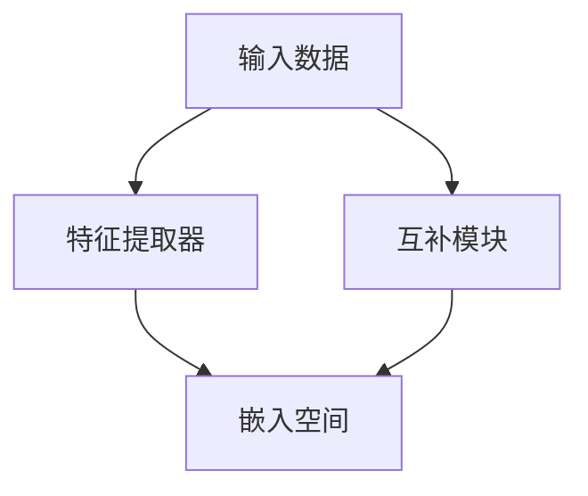

                 

# 对比学习Contrastive Learning原理与代码实例讲解

## 关键词

- 对比学习
- Contrastive Learning
- 损失函数
- 特征提取
- 伪代码
- 项目实战

## 摘要

本文将深入探讨对比学习（Contrastive Learning）的原理和应用。对比学习是一种重要的机器学习技术，通过区分相似和不同样本来学习特征表示。本文将首先介绍对比学习的基本概念和架构，然后详细讲解其核心算法原理，包括损失函数和优化算法。通过具体的数学模型和伪代码，我们将帮助读者理解对比学习的内部工作机制。此外，本文还将分析对比学习在图像和自然语言处理等领域的应用，并提供实际项目的代码实例和详细解析。最后，我们将展望对比学习的未来发展趋势，探讨其面临的挑战和机遇。通过本文的阅读，读者将能够全面掌握对比学习的基本原理和实践技巧。

## 目录大纲

### 第一部分：对比学习基础

### 第1章：对比学习的概述

### 1.1 对比学习的基本概念

对比学习（Contrastive Learning）是一种基于区分相似和不同样本来学习有用特征表示的机器学习方法。其核心思想是通过最大化正样本之间的相似性，同时最小化负样本之间的相似性，从而学习到具有区分力的特征表示。

#### 对比学习的定义

对比学习可以定义为一种学习任务，其目的是通过比较不同样本对来学习有效的特征表示。这些样本对包括正样本对和负样本对。正样本对指的是具有相同标签或相似属性的样本对，而负样本对则是指具有不同标签或属性不相似的样本对。

#### 对比学习与其他学习的比较

对比学习与其他机器学习方法，如监督学习、无监督学习和半监督学习等，有显著的区别。监督学习依赖于标注数据来训练模型，而无监督学习则从未标记的数据中学习特征表示。半监督学习结合了标注和未标注的数据进行训练。而对比学习则不依赖于标注数据，而是通过比较样本对来学习特征表示。

#### 对比学习的历史与发展

对比学习的历史可以追溯到20世纪80年代，当时基于反向传播的神经网络刚刚开始兴起。早期的对比学习方法，如自动联想记忆（Auto-Associative Memory）和反向传播（Backpropagation），主要用于学习数据的低维表示。随着深度学习的发展，对比学习在图像、自然语言处理等领域得到了广泛应用。

### 1.2 对比学习的目标

对比学习的目标是通过学习特征表示来实现以下目标：

1. **正例匹配**：最大化正样本对之间的相似性。这意味着模型需要学会将具有相似标签或属性的样本映射到特征空间中的相似区域。

2. **负例匹配**：最小化负样本对之间的相似性。这意味着模型需要学会将具有不同标签或属性不相似的样本映射到特征空间中的不同区域。

#### 对比损失函数

为了实现上述目标，对比学习引入了对比损失函数。对比损失函数的主要作用是衡量特征表示中正负样本对之间的相似性。常见的对比损失函数包括InfoNCE损失、N-pair loss和Triplet loss等。

### 1.3 对比学习的基本架构

对比学习的基本架构通常包括以下几个部分：

1. **特征提取器**：特征提取器负责从输入数据中提取有用的特征表示。在深度学习框架中，这通常由一个神经网络实现。

2. **互补模块**：互补模块负责生成负样本对。在训练过程中，互补模块需要能够高效地生成与正样本具有相似属性但不完全相同的负样本。

3. **嵌入空间**：嵌入空间是一个高维空间，用于表示训练数据中的每个样本。在嵌入空间中，正样本对应该被映射到接近的位置，而负样本对则应该被映射到远离的位置。

## 第一部分：对比学习基础

### 第1章：对比学习的概述

#### 1.1 对比学习的基本概念

#### 1.1.1 对比学习的定义

对比学习是一种通过区分相似和不同样本来学习有用特征表示的机器学习方法。其核心思想是通过最大化正样本之间的相似性，同时最小化负样本之间的相似性，从而学习到具有区分力的特征表示。

在对比学习中，每个样本对都可以被视为一个正样本对或负样本对。正样本对通常具有相同的标签或相似的属性，而负样本对则具有不同的标签或不相似的属性。通过比较这些样本对，模型可以学习到能够在特征空间中区分不同类别的特征表示。

#### 1.1.2 对比学习与其他学习的比较

对比学习与传统的监督学习、无监督学习和半监督学习等方法有显著的不同：

1. **监督学习**：监督学习依赖于标注数据来训练模型。每个样本都有一个明确的标签，模型通过学习这些标签来预测未知样本的标签。

2. **无监督学习**：无监督学习从未标记的数据中学习特征表示。模型的目标是发现数据中的潜在结构，而不是直接预测标签。

3. **半监督学习**：半监督学习结合了标注和未标注的数据进行训练。标注数据用于指导模型的训练，而未标注数据则用于提供额外的信息。

对比学习则不依赖于标注数据，而是通过比较不同样本对来学习特征表示。这种无监督学习的方法使得对比学习在许多应用场景中具有独特的优势。

#### 1.1.3 对比学习的历史与发展

对比学习的历史可以追溯到20世纪80年代，当时基于反向传播的神经网络刚刚开始兴起。早期的研究主要集中在如何通过对比学习来提高神经网络的性能。

1. **自动联想记忆（Auto-Associative Memory）**：自动联想记忆是一种早期的对比学习方法，通过学习数据点的低维表示，使得具有相似属性的数据点在特征空间中接近，而具有不同属性的数据点则相隔较远。

2. **反向传播（Backpropagation）**：反向传播是一种用于训练神经网络的算法，它通过比较网络输出和实际标签来计算损失，并利用损失函数的梯度来更新网络权重。

随着深度学习的发展，对比学习在图像、自然语言处理等领域得到了广泛应用。代表性的工作包括Deep Contrastive Learning（DCL）、SimCLR（Simple Contrastive Learning Representation Learning）和MoCo（Memory-augmented Contrastive Learning）等。

#### 1.2 对比学习的目标

对比学习的目标是通过学习特征表示来实现以下两个主要目标：

1. **正例匹配**：最大化正样本对之间的相似性。这意味着模型需要学会将具有相似标签或属性的样本映射到特征空间中的相似区域。

2. **负例匹配**：最小化负样本对之间的相似性。这意味着模型需要学会将具有不同标签或属性不相似的样本映射到特征空间中的不同区域。

通过实现这两个目标，对比学习可以提高模型的分类准确性和泛化能力。在实际应用中，对比学习通常用于特征提取、图像分类、文本分类、图像检索等任务。

#### 1.3 对比学习的基本架构

对比学习的基本架构通常包括以下几个主要组件：

1. **特征提取器**：特征提取器负责从输入数据中提取有用的特征表示。在深度学习框架中，这通常由一个神经网络实现。特征提取器可以是卷积神经网络（CNN）、循环神经网络（RNN）或其他类型的神经网络。

2. **互补模块**：互补模块负责生成负样本对。在训练过程中，互补模块需要能够高效地生成与正样本具有相似属性但不完全相同的负样本。常见的互补模块包括负采样器和基于记忆的互补模块。

3. **嵌入空间**：嵌入空间是一个高维空间，用于表示训练数据中的每个样本。在嵌入空间中，正样本对应该被映射到接近的位置，而负样本对则应该被映射到远离的位置。通过最大化正样本之间的相似性和最小化负样本之间的相似性，模型可以学习到具有区分力的特征表示。

图1展示了对比学习的基本架构。



#### 1.3.1 特征提取器

特征提取器是对比学习架构的核心组件。它的主要作用是从输入数据中提取有用的特征表示。在图像分类任务中，特征提取器通常是卷积神经网络（CNN），它可以提取图像中的局部特征和全局特征。在自然语言处理任务中，特征提取器可以是循环神经网络（RNN）或Transformer等，它们可以提取文本序列中的语义信息。

以下是一个简化的特征提取器的伪代码：

```python
# 特征提取器伪代码
def extract_features(inputs):
    # 应用卷积层、池化层和激活函数来提取特征
    features = convolutional_layers(inputs)
    features = pooling_layer(features)
    features = activation_function(features)
    return features
```

#### 1.3.2 互补模块

互补模块的目的是生成负样本对，以便在训练过程中最大化正样本之间的相似性和最小化负样本之间的相似性。负样本的生成方法有很多种，以下是一些常见的方法：

1. **负采样器**：负采样器从数据集中随机选择与正样本不相关的样本作为负样本。这种方法简单且易于实现，但可能会生成一些与正样本具有相似属性的负样本。

2. **基于记忆的互补模块**：基于记忆的互补模块利用一个内存来存储训练过程中生成的负样本。在每次生成负样本时，模块会从内存中选择与正样本最不相关的样本作为负样本。这种方法可以更好地保证负样本的多样性，但实现起来较为复杂。

以下是一个简化的互补模块的伪代码：

```python
# 互补模块伪代码
def generate_negative_samples(input_data, memory):
    # 从内存中选择与输入数据最不相关的负样本
    negative_samples = select_unrelated_samples(input_data, memory)
    return negative_samples
```

#### 1.3.3 嵌入空间

嵌入空间是一个高维空间，用于表示训练数据中的每个样本。在嵌入空间中，正样本对应该被映射到接近的位置，而负样本对则应该被映射到远离的位置。通过最大化正样本之间的相似性和最小化负样本之间的相似性，模型可以学习到具有区分力的特征表示。

在嵌入空间中，常用的相似性度量方法包括余弦相似度和欧氏距离。余弦相似度可以衡量两个特征向量之间的夹角，而欧氏距离可以衡量两个特征向量之间的距离。以下是一个简化的嵌入空间的伪代码：

```python
# 嵌入空间伪代码
def calculate_similarity(embeddings1, embeddings2, similarity_measure):
    if similarity_measure == "cosine":
        similarity = cosine_similarity(embeddings1, embeddings2)
    elif similarity_measure == "euclidean":
        similarity = euclidean_distance(embeddings1, embeddings2)
    return similarity
```

#### 1.4 对比学习的损失函数

对比学习的损失函数是衡量模型性能的重要指标。常见的对比损失函数包括InfoNCE损失、N-pair loss和Triplet loss等。

1. **InfoNCE损失**：InfoNCE损失是最常用的对比损失函数之一，它通过最大化正样本之间的相似性和最小化负样本之间的相似性来训练模型。以下是一个简化的InfoNCE损失的伪代码：

    ```python
    # InfoNCE损失伪代码
    def info_nce_loss(embeddings, labels, temperature):
        logits = []
        for i in range(len(embeddings)):
            for j in range(len(embeddings)):
                if i == j and labels[i] == labels[j]:
                    # 正样本
                    logits.append(-log(temperature))
                elif labels[i] != labels[j]:
                    # 负样本
                    logits.append(-log(temperature / (1 - temperature)))
                else:
                    # 非样本
                    logits.append(0)
        loss = -sum(logits) / len(logits)
        return loss
    ```

2. **N-pair loss**：N-pair loss是一种扩展InfoNCE损失的损失函数，它允许在每个样本上生成多个负样本对。以下是一个简化的N-pair loss的伪代码：

    ```python
    # N-pair loss伪代码
    def n_pair_loss(embeddings, labels, n, temperature):
        logits = []
        for i in range(len(embeddings)):
            for j in range(n):
                for k in range(len(embeddings)):
                    if i == k and labels[i] == labels[k]:
                        # 正样本
                        logits.append(-log(temperature))
                    elif labels[i] != labels[k]:
                        # 负样本
                        logits.append(-log(temperature / (1 - temperature)))
                    else:
                        # 非样本
                        logits.append(0)
        loss = -sum(logits) / len(logits)
        return loss
    ```

3. **Triplet loss**：Triplet loss是一种用于分类任务的对比损失函数，它通过最小化正样本和负样本之间的距离差来训练模型。以下是一个简化的Triplet loss的伪代码：

    ```python
    # Triplet loss伪代码
    def triplet_loss(embeddings, labels, margin):
        triplet_losses = []
        for i in range(len(embeddings)):
            for j in range(len(embeddings)):
                if i == j and labels[i] == labels[j]:
                    # 正样本
                    positive_distance = 0
                else:
                    # 负样本
                    positive_distance = embeddings[i] - embeddings[j]
                for k in range(len(embeddings)):
                    if i == k and labels[i] != labels[k]:
                        # 正样本
                        negative_distance = 0
                    else:
                        # 负样本
                        negative_distance = embeddings[i] - embeddings[k]
                triplet_losses.append(0.5 * (positive_distance ** 2 - negative_distance ** 2 + margin))
        loss = sum(triplet_losses) / len(triplet_losses)
        return loss
    ```

#### 1.5 对比学习的优化算法

对比学习的优化算法主要用于更新模型参数，以最小化对比损失函数。常见的优化算法包括随机梯度下降（SGD）、Adam优化器等。

以下是一个简化的优化算法的伪代码：

```python
# 优化算法伪代码
def optimize_model(model, optimizer, loss):
    optimizer.zero_grad()
    output = model(input_data)
    loss.backward()
    optimizer.step()
    return output
```

## 第二部分：对比学习的核心算法原理

### 第2章：对比学习的核心算法原理

对比学习作为一种无监督学习技术，通过比较不同样本对来学习有用的特征表示。本章将详细讲解对比学习的核心算法原理，包括对比损失函数、数据预处理、模型训练和评估等。

#### 2.1 对比损失函数

对比损失函数是对比学习的核心组成部分，其目的是通过优化损失函数来学习具有区分力的特征表示。常见的对比损失函数包括InfoNCE损失、N-pair loss和Triplet loss等。

##### InfoNCE损失

InfoNCE损失函数是最常用的对比损失函数之一，它通过最大化正样本之间的相似性和最小化负样本之间的相似性来训练模型。以下是一个简化的InfoNCE损失的数学模型：

$$
L = -\frac{1}{N} \sum_{i=1}^N \sum_{j \in \{-1, +1\}} -\log \frac{e^{a_{ij}}}{e^{a_{ij}} + e^{a_{kij}}}
$$

其中，$a_{ij} = \cos(\theta_{ij})$，$\theta_{ij}$ 是特征向量 $z_i$ 和 $z_j$ 的余弦相似度。$N$ 是训练数据中的样本数量，$i$ 和 $j$ 分别代表样本索引，$k$ 是负样本索引。

为了更好地理解InfoNCE损失，我们可以将其分解为正样本损失和负样本损失：

- **正样本损失**：表示正样本对之间的相似性，公式为：

  $$
  L_{+} = -\log \frac{e^{a_{ij}}}{e^{a_{ij}}}
  $$

  其中，$a_{ij} = \cos(\theta_{ij})$，$\theta_{ij}$ 是正样本对的特征向量余弦相似度。

- **负样本损失**：表示负样本对之间的相似性，公式为：

  $$
  L_{-} = -\log \frac{e^{a_{ij}}}{e^{a_{kij}}}
  $$

  其中，$a_{ij} = \cos(\theta_{ij})$，$a_{kij} = \cos(\theta_{ki

