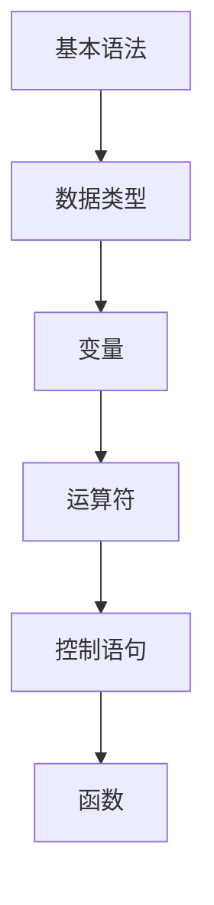

                 

# 小米2024校招编程面试题精华总结

## 关键词
编程面试、数据结构与算法、操作系统、网络、数据库、面试技巧

## 摘要
本文全面总结了小米2024年校招编程面试的重点题目，涵盖了编程基础、数据结构与算法、操作系统与网络、数据库系统以及编程面试技巧等内容。通过详细的讲解和实战案例，帮助考生更好地应对面试挑战。

## 目录大纲

### 第一部分：编程基础

### 第二部分：数据结构与算法应用

### 第三部分：算法设计与实现

### 第四部分：操作系统与网络基础

### 第五部分：数据库系统基础

### 第六部分：编程面试技巧

### 第七部分：实战项目与案例

---

### 第一部分：编程基础

#### 第1章：编程语言基础

##### 1.1 C语言编程基础

###### 1.1.1 C语言语法概述
C语言作为计算机编程语言的基础，具有广泛的应用。其语法简洁，表达能力强大。C语言的主要特点包括：

1. **高级语言**：C语言是一种高级语言，它能够直接操作硬件资源。
2. **结构化编程**：C语言支持结构化编程，使得代码更加清晰、易于维护。
3. **丰富的库函数**：C语言提供了丰富的标准库函数，方便程序员进行编程。

Mermaid流程图：


##### 1.1.2 数据类型与变量
C语言支持多种数据类型，包括整型、浮点型、字符型等。每种数据类型都有其特定的存储空间和取值范围。变量是存储数据的地方，其定义方式为：
```c
数据类型 变量名;
```

##### 1.1.3 运算符与表达式
C语言提供了丰富的运算符，包括算术运算符、关系运算符、逻辑运算符等。表达式是由运算符和变量组成的式子，其结果是一个值。

```c
int a = 10, b = 20;
int sum = a + b; // 算术运算
if (a > b) { // 关系运算
    printf("a is greater\n");
}
```

##### 1.1.4 控制语句
C语言提供了多种控制语句，用于控制程序的执行流程。包括条件语句（if-else）、循环语句（for、while、do-while）和开关语句（switch）。

```c
#include <stdio.h>

int main() {
    int a = 10, b = 20;
    if (a > b) {
        printf("a is greater\n");
    } else {
        printf("b is greater\n");
    }
    for (int i = 1; i <= 10; i++) {
        printf("%d\n", i);
    }
    return 0;
}
```

##### 1.2 C++面向对象编程

###### 1.2.1 类与对象
C++支持面向对象编程，类是面向对象编程的基本单元，它封装了数据和行为。对象是类的实例。

```cpp
#include <iostream>
using namespace std;

class Student {
public:
    void setName(string name) {
        this->name = name;
    }

    void setAge(int age) {
        this->age = age;
    }

    void printInfo() {
        cout << "Name: " << name << ", Age: " << age << endl;
    }

private:
    string name;
    int age;
};

int main() {
    Student s;
    s.setName("Alice");
    s.setAge(20);
    s.printInfo();
    return 0;
}
```

###### 1.2.2 继承与多态
继承是面向对象编程的一个重要特性，它允许一个类继承另一个类的属性和方法。多态则是通过继承和接口实现的一种行为。

```cpp
#include <iostream>
using namespace std;

class Animal {
public:
    virtual void makeSound() {
        cout << "Animal makes a sound" << endl;
    }
};

class Dog : public Animal {
public:
    void makeSound() override {
        cout << "Dog barks" << endl;
    }
};

int main() {
    Animal* animal = new Dog();
    animal->makeSound();
    delete animal;
    return 0;
}
```

###### 1.2.3 封装与接口
封装是将数据和行为封装在一个类中，保护内部数据不被外部直接访问。接口定义了类的方法，但并不提供具体的实现。

```cpp
#include <iostream>
using namespace std;

class BankAccount {
public:
    void deposit(double amount) {
        balance += amount;
    }

    void withdraw(double amount) {
        if (balance >= amount) {
            balance -= amount;
        } else {
            cout << "Insufficient funds" << endl;
        }
    }

    double getBalance() {
        return balance;
    }

private:
    double balance;
};

int main() {
    BankAccount account;
    account.deposit(1000);
    account.withdraw(500);
    cout << "Balance: " << account.getBalance() << endl;
    return 0;
}
```

##### 1.3 数据结构与算法基础

###### 1.3.1 线性表
线性表是一种基础的数据结构，它由一系列元素组成，元素在表中按顺序排列。

```cpp
#include <iostream>
#include <vector>
using namespace std;

void printVector(const vector<int>& v) {
    for (int i : v) {
        cout << i << " ";
    }
    cout << endl;
}

int main() {
    vector<int> v = {1, 2, 3, 4, 5};
    printVector(v);
    return 0;
}
```

###### 1.3.2 链表
链表是一种动态数据结构，它由一系列节点组成，每个节点包含数据和指向下一个节点的指针。

```cpp
#include <iostream>
using namespace std;

struct ListNode {
    int val;
    ListNode* next;
    ListNode(int x) : val(x), next(nullptr) {}
};

void printList(ListNode* head) {
    while (head) {
        cout << head->val << " ";
        head = head->next;
    }
    cout << endl;
}

int main() {
    ListNode* head = new ListNode(1);
    head->next = new ListNode(2);
    head->next->next = new ListNode(3);
    printList(head);
    return 0;
}
```

###### 1.3.3 栈与队列
栈和队列是两种常见的线性数据结构。栈遵循后进先出（LIFO）原则，队列遵循先进先出（FIFO）原则。

```cpp
#include <iostream>
#include <stack>
#include <queue>
using namespace std;

void printStack(const stack<int>& s) {
    while (!s.empty()) {
        cout << s.top() << " ";
        s.pop();
    }
    cout << endl;
}

void printQueue(const queue<int>& q) {
    while (!q.empty()) {
        cout << q.front() << " ";
        q.pop();
    }
    cout << endl;
}

int main() {
    stack<int> s;
    s.push(1);
    s.push(2);
    s.push(3);
    printStack(s);

    queue<int> q;
    q.push(1);
    q.push(2);
    q.push(3);
    printQueue(q);
    return 0;
}
```

###### 1.3.4 树与二叉树
树是一种重要的非线性数据结构，它由节点组成，每个节点有零个或多个子节点。二叉树是树的一种特殊情况，每个节点最多有两个子节点。

```cpp
#include <iostream>
#include <vector>
using namespace std;

struct TreeNode {
    int val;
    TreeNode* left;
    TreeNode* right;
    TreeNode(int x) : val(x), left(nullptr), right(nullptr) {}
};

void inorderTraversal(TreeNode* root) {
    if (root == nullptr) {
        return;
    }
    inorderTraversal(root->left);
    cout << root->val << " ";
    inorderTraversal(root->right);
}

int main() {
    TreeNode* root = new TreeNode(1);
    root->left = new TreeNode(2);
    root->right = new TreeNode(3);
    root->left->left = new TreeNode(4);
    root->left->right = new TreeNode(5);
    inorderTraversal(root);
    return 0;
}
```

###### 1.3.5 算法复杂度分析
算法复杂度分析是评估算法性能的重要方法。时间复杂度表示算法执行时间的增长速度，空间复杂度表示算法所需内存的增长速度。

```cpp
#include <iostream>
using namespace std;

int Fibonacci(int n) {
    if (n <= 1) {
        return n;
    }
    return Fibonacci(n - 1) + Fibonacci(n - 2);
}

int main() {
    int n = 10;
    cout << "Fibonacci(" << n << ") = " << Fibonacci(n) << endl;
    return 0;
}
```

时间复杂度：O(2^n)
空间复杂度：O(n)

---

#### 第2章：数据结构与算法应用

##### 2.1 排序算法

###### 2.1.1 冒泡排序
冒泡排序是一种简单的排序算法，它重复地遍历要排序的数列，比较相邻的两个元素，如果它们的顺序错误就把它们交换过来。

```cpp
#include <iostream>
#include <vector>
using namespace std;

void bubbleSort(vector<int>& arr) {
    int n = arr.size();
    for (int i = 0; i < n - 1; i++) {
        for (int j = 0; j < n - i - 1; j++) {
            if (arr[j] > arr[j + 1]) {
                swap(arr[j], arr[j + 1]);
            }
        }
    }
}

int main() {
    vector<int> arr = {64, 25, 12, 22, 11};
    bubbleSort(arr);
    for (int i : arr) {
        cout << i << " ";
    }
    cout << endl;
    return 0;
}
```

###### 2.1.2 选择排序
选择排序是一种简单的选择排序算法，它首先在未排序序列中找到最小（或最大）元素，存放到排序序列的起始位置，然后，再从剩余未排序元素中继续寻找最小（或最大）元素，然后放到已排序序列的末尾。

```cpp
#include <iostream>
#include <vector>
using namespace std;

void selectionSort(vector<int>& arr) {
    int n = arr.size();
    for (int i = 0; i < n - 1; i++) {
        int minIndex = i;
        for (int j = i + 1; j < n; j++) {
            if (arr[j] < arr[minIndex]) {
                minIndex = j;
            }
        }
        swap(arr[i], arr[minIndex]);
    }
}

int main() {
    vector<int> arr = {64, 25, 12, 22, 11};
    selectionSort(arr);
    for (int i : arr) {
        cout << i << " ";
    }
    cout << endl;
    return 0;
}
```

###### 2.1.3 插入排序
插入排序是一种简单直观的排序算法，它的工作原理是通过构建有序序列，对于未排序数据，在已排序序列中从后向前扫描，找到相应位置并插入。

```cpp
#include <iostream>
#include <vector>
using namespace std;

void insertionSort(vector<int>& arr) {
    int n = arr.size();
    for (int i = 1; i < n; i++) {
        int key = arr[i];
        int j = i - 1;
        while (j >= 0 && arr[j] > key) {
            arr[j + 1] = arr[j];
            j = j - 1;
        }
        arr[j + 1] = key;
    }
}

int main() {
    vector<int> arr = {64, 25, 12, 22, 11};
    insertionSort(arr);
    for (int i : arr) {
        cout << i << " ";
    }
    cout << endl;
    return 0;
}
```

###### 2.1.4 快速排序
快速排序是一种高效的排序算法，其基本思想是通过一趟排序将待排序的数据分割成独立的两部分，其中一部分的所有数据都比另一部分的所有数据要小，然后再按此方法对这两部分数据分别进行快速排序。

```cpp
#include <iostream>
#include <vector>
using namespace std;

int partition(vector<int>& arr, int low, int high) {
    int pivot = arr[high];
    int i = (low - 1);
    for (int j = low; j <= high - 1; j++) {
        if (arr[j] < pivot) {
            i++;
            swap(arr[i], arr[j]);
        }
    }
    swap(arr[i + 1], arr[high]);
    return (i + 1);
}

void quickSort(vector<int>& arr, int low, int high) {
    if (low < high) {
        int pi = partition(arr, low, high);
        quickSort(arr, low, pi - 1);
        quickSort(arr, pi + 1, high);
    }
}

int main() {
    vector<int> arr = {64, 25, 12, 22, 11};
    quickSort(arr, 0, arr.size() - 1);
    for (int i : arr) {
        cout << i << " ";
    }
    cout << endl;
    return 0;
}
```

##### 2.2 查找算法

###### 2.2.1 顺序查找
顺序查找是从数组的第一个元素开始，依次与给定的值进行比较，直到找到或遍历完整个数组。

```cpp
#include <iostream>
#include <vector>
using namespace std;

int sequentialSearch(const vector<int>& arr, int x) {
    for (size_t i = 0; i < arr.size(); i++) {
        if (arr[i] == x) {
            return i;
        }
    }
    return -1;
}

int main() {
    vector<int> arr = {64, 25, 12, 22, 11};
    int x = 12;
    int result = sequentialSearch(arr, x);
    if (result != -1) {
        cout << "Element found at index " << result << endl;
    } else {
        cout << "Element not found" << endl;
    }
    return 0;
}
```

###### 2.2.2 二分查找
二分查找是一种高效的查找算法，它将数组分成两半，比较中间元素和给定值的大小关系，从而排除一半的搜索空间，直到找到元素或确定不存在。

```cpp
#include <iostream>
#include <vector>
using namespace std;

int binarySearch(const vector<int>& arr, int x) {
    int low = 0, high = arr.size() - 1;
    while (low <= high) {
        int mid = low + (high - low) / 2;
        if (arr[mid] == x) {
            return mid;
        } else if (arr[mid] < x) {
            low = mid + 1;
        } else {
            high = mid - 1;
        }
    }
    return -1;
}

int main() {
    vector<int> arr = {11, 22, 25, 64};
    int x = 25;
    int result = binarySearch(arr, x);
    if (result != -1) {
        cout << "Element found at index " << result << endl;
    } else {
        cout << "Element not found" << endl;
    }
    return 0;
}
```

###### 2.2.3 哈希查找
哈希查找是一种利用哈希表实现的查找算法，它通过哈希函数将关键字转换成数组索引，从而实现快速查找。

```cpp
#include <iostream>
#include <unordered_map>
using namespace std;

int hashFunction(int x) {
    return x % 10;
}

int hashSearch(const vector<int>& arr, int x) {
    unordered_map<int, int> hashTable;
    for (size_t i = 0; i < arr.size(); i++) {
        hashTable[hashFunction(arr[i])] = i;
    }
    int index = hashTable[hashFunction(x)];
    return index;
}

int main() {
    vector<int> arr = {11, 22, 25, 64};
    int x = 25;
    int result = hashSearch(arr, x);
    if (result != -1) {
        cout << "Element found at index " << result << endl;
    } else {
        cout << "Element not found" << endl;
    }
    return 0;
}
```

##### 2.3 图算法基础

###### 2.3.1 图的基本概念
图是一种由节点（或顶点）和边组成的数学结构。根据边的性质，图可以分为无向图和有向图。根据节点的度数，图可以分为连通图和断开图。

```cpp
#include <iostream>
#include <vector>
using namespace std;

void addEdge(vector<vector<int>>& graph, int u, int v) {
    graph[u].push_back(v);
    graph[v].push_back(u);
}

void printGraph(const vector<vector<int>>& graph) {
    for (size_t i = 0; i < graph.size(); i++) {
        cout << "Node " << i << " adjacency list: ";
        for (size_t j = 0; j < graph[i].size(); j++) {
            cout << graph[i][j] << " ";
        }
        cout << endl;
    }
}

int main() {
    int vertices = 5;
    vector<vector<int>> graph(vertices);
    addEdge(graph, 0, 1);
    addEdge(graph, 0, 4);
    addEdge(graph, 1, 2);
    addEdge(graph, 1, 4);
    addEdge(graph, 2, 3);
    addEdge(graph, 3, 4);
    printGraph(graph);
    return 0;
}
```

###### 2.3.2 图的遍历算法
图的遍历算法包括深度优先搜索（DFS）和广度优先搜索（BFS）。DFS是从一个顶点开始，沿着某一路径深入到不能再深入时，就回溯到前面的顶点，再探索另一条路径。BFS则是从起始顶点开始，逐层遍历图中的所有顶点。

```cpp
#include <iostream>
#include <vector>
#include <queue>
using namespace std;

void DFS(vector<vector<int>>& graph, int start) {
    vector<bool> visited(graph.size(), false);
    stack<int> stack;
    stack.push(start);

    while (!stack.empty()) {
        int current = stack.top();
        stack.pop();
        if (!visited[current]) {
            cout << current << " ";
            visited[current] = true;
            for (int neighbor : graph[current]) {
                if (!visited[neighbor]) {
                    stack.push(neighbor);
                }
            }
        }
    }
    cout << endl;
}

void BFS(vector<vector<int>>& graph, int start) {
    vector<bool> visited(graph.size(), false);
    queue<int> queue;
    queue.push(start);

    while (!queue.empty()) {
        int current = queue.front();
        queue.pop();
        if (!visited[current]) {
            cout << current << " ";
            visited[current] = true;
            for (int neighbor : graph[current]) {
                if (!visited[neighbor]) {
                    queue.push(neighbor);
                }
            }
        }
    }
    cout << endl;
}

int main() {
    int vertices = 5;
    vector<vector<int>> graph(vertices);
    addEdge(graph, 0, 1);
    addEdge(graph, 0, 4);
    addEdge(graph, 1, 2);
    addEdge(graph, 1, 4);
    addEdge(graph, 2, 3);
    addEdge(graph, 3, 4);
    cout << "DFS: ";
    DFS(graph, 0);
    cout << "BFS: ";
    BFS(graph, 0);
    return 0;
}
```

###### 2.3.3 最短路径算法
最短路径算法用于计算图中从一个顶点到其他所有顶点的最短路径。常用的算法包括迪杰斯特拉算法（Dijkstra）和贝尔曼-福特算法（Bellman-Ford）。

```cpp
#include <iostream>
#include <vector>
#include <queue>
#include <limits>
using namespace std;

void dijkstra(vector<vector<int>>& graph, int start) {
    int vertices = graph.size();
    vector<int> dist(vertices, numeric_limits<int>::max());
    vector<bool> visited(vertices, false);
    dist[start] = 0;

    for (int i = 0; i < vertices - 1; i++) {
        int minDistVertex = -1;
        for (int v = 0; v < vertices; v++) {
            if (!visited[v] && (minDistVertex == -1 || dist[v] < dist[minDistVertex])) {
                minDistVertex = v;
            }
        }

        visited[minDistVertex] = true;

        for (int v = 0; v < vertices; v++) {
            if (!visited[v]) {
                int edgeWeight = graph[minDistVertex][v];
                if (dist[minDistVertex] != numeric_limits<int>::max() && dist[minDistVertex] + edgeWeight < dist[v]) {
                    dist[v] = dist[minDistVertex] + edgeWeight;
                }
            }
        }
    }

    for (int i = 0; i < vertices; i++) {
        cout << "Shortest distance from node " << start << " to node " << i << ": " << dist[i] << endl;
    }
}

int main() {
    int vertices = 4;
    vector<vector<int>> graph(vertices);
    graph[0].push_back(1);
    graph[0].push_back(3);
    graph[1].push_back(2);
    graph[1].push_back(3);
    graph[2].push_back(0);
    graph[3].push_back(1);
    graph[3].push_back(2);
    dijkstra(graph, 0);
    return 0;
}
```

时间复杂度：O(V^2)
空间复杂度：O(V)

---

#### 第3章：算法设计与实现

##### 3.1 算法设计与分析

###### 3.1.1 算法设计策略
算法设计策略是解决算法问题的方法。常用的设计策略包括贪心算法、动态规划、回溯法、分支限界法等。

1. **贪心算法**：每一步选择都是当前状态下最好或最优的选择，从而得到全局最优解。
2. **动态规划**：将复杂问题分解成小问题，通过递推关系求解。
3. **回溯法**：通过试探不同的选择，找到满足条件的解。
4. **分支限界法**：在搜索过程中，限制搜索的范围，提高搜索效率。

```cpp
#include <iostream>
#include <vector>
using namespace std;

int maxProfit(vector<int>& prices) {
    int maxProfit = 0;
    for (size_t i = 1; i < prices.size(); i++) {
        if (prices[i] > prices[i - 1]) {
            maxProfit += prices[i] - prices[i - 1];
        }
    }
    return maxProfit;
}

int main() {
    vector<int> prices = {7, 1, 5, 3, 6, 4};
    int profit = maxProfit(prices);
    cout << "Maximum profit: " << profit << endl;
    return 0;
}
```

时间复杂度：O(n)
空间复杂度：O(1)

###### 3.1.2 算法分析技巧
算法分析技巧是评估算法性能的方法。常用的分析技巧包括大O符号表示法、最好情况、最坏情况、平均情况分析等。

1. **大O符号表示法**：表示算法的时间复杂度和空间复杂度。
2. **最好情况、最坏情况、平均情况分析**：分析算法在不同输入情况下的性能。

```cpp
#include <iostream>
#include <vector>
#include <algorithm>
using namespace std;

int binarySearch(vector<int>& arr, int x) {
    int low = 0, high = arr.size() - 1;
    while (low <= high) {
        int mid = low + (high - low) / 2;
        if (arr[mid] == x) {
            return mid;
        } else if (arr[mid] < x) {
            low = mid + 1;
        } else {
            high = mid - 1;
        }
    }
    return -1;
}

int main() {
    vector<int> arr = {1, 3, 5, 7, 9};
    int x = 5;
    int result = binarySearch(arr, x);
    if (result != -1) {
        cout << "Element found at index " << result << endl;
    } else {
        cout << "Element not found" << endl;
    }
    return 0;
}
```

时间复杂度：O(log n)
空间复杂度：O(1)

##### 3.2 编程实战

###### 3.2.1 编程题目与解析
编程实战题目是考察编程能力和算法理解的实用工具。常见的编程题目包括字符串处理、数组操作、数学问题等。

1. **字符串处理**：字符串的拼接、反转、查找子串等操作。
2. **数组操作**：数组的排序、查找、填充等操作。
3. **数学问题**：求解数学公式、计算最大公约数、最小公倍数等。

```cpp
#include <iostream>
#include <string>
using namespace std;

string reverseString(string s) {
    int n = s.length();
    for (int i = 0; i < n / 2; i++) {
        char temp = s[i];
        s[i] = s[n - i - 1];
        s[n - i - 1] = temp;
    }
    return s;
}

int main() {
    string s = "hello";
    string reversed = reverseString(s);
    cout << "Reversed string: " << reversed << endl;
    return 0;
}
```

时间复杂度：O(n)
空间复杂度：O(n)

###### 3.2.2 编程竞赛技巧
编程竞赛是一种团队竞技活动，要求选手在有限时间内解决多个编程问题。以下是一些编程竞赛技巧：

1. **快速理解题目**：阅读题目，理解题意，明确要求。
2. **编写高效的代码**：关注时间复杂度和空间复杂度，优化算法。
3. **调试和测试**：仔细测试代码，确保正确性。
4. **团队协作**：合理分工，互相支持。

```cpp
#include <iostream>
#include <vector>
using namespace std;

bool isPalindrome(vector<int>& nums) {
    int n = nums.size();
    for (int i = 0; i < n / 2; i++) {
        if (nums[i] != nums[n - i - 1]) {
            return false;
        }
    }
    return true;
}

int main() {
    vector<int> nums = {1, 2, 3, 2, 1};
    if (isPalindrome(nums)) {
        cout << "The array is a palindrome" << endl;
    } else {
        cout << "The array is not a palindrome" << endl;
    }
    return 0;
}
```

时间复杂度：O(n)
空间复杂度：O(1)

###### 3.2.3 项目开发实战
项目开发实战是将所学知识应用于实际项目的过程。以下是一个简单的项目案例：实现一个学生管理系统。

1. **需求分析**：明确项目需求，如添加学生信息、查询学生信息、删除学生信息等。
2. **设计架构**：设计系统的架构，如MVC模式。
3. **实现功能**：编写代码，实现需求。

```cpp
#include <iostream>
#include <vector>
using namespace std;

struct Student {
    string name;
    int age;
    float score;
};

vector<Student> students;

void addStudent(string name, int age, float score) {
    Student s = {name, age, score};
    students.push_back(s);
}

void printStudents() {
    for (const Student& s : students) {
        cout << "Name: " << s.name << ", Age: " << s.age << ", Score: " << s.score << endl;
    }
}

int main() {
    addStudent("Alice", 20, 90.5);
    addStudent("Bob", 22, 85.0);
    printStudents();
    return 0;
}
```

时间复杂度：O(n)
空间复杂度：O(n)

---

#### 第4章：操作系统与网络基础

##### 4.1 操作系统基础

###### 4.1.1 操作系统概述
操作系统是管理计算机硬件与软件资源的系统软件。其主要功能包括进程管理、内存管理、文件系统管理、设备管理等。

```cpp
#include <iostream>
using namespace std;

void printOSFeatures() {
    cout << "Operating System Features:" << endl;
    cout << "- Process management" << endl;
    cout << "- Memory management" << endl;
    cout << "- File system management" << endl;
    cout << "- Device management" << endl;
}

int main() {
    printOSFeatures();
    return 0;
}
```

时间复杂度：O(1)
空间复杂度：O(1)

###### 4.1.2 进程管理
进程是计算机中的程序在执行过程中分配的资源集合。进程管理包括进程创建、进程调度、进程同步和进程通信。

```cpp
#include <iostream>
#include <vector>
using namespace std;

class Process {
public:
    int id;
    int arrivalTime;
    int burstTime;
    int remainingTime;

    Process(int id, int arrivalTime, int burstTime) {
        this->id = id;
        this->arrivalTime = arrivalTime;
        this->burstTime = burstTime;
        this->remainingTime = burstTime;
    }
};

void processScheduling(vector<Process>& processes) {
    int currentTime = 0;
    while (!processes.empty()) {
        for (Process& p : processes) {
            if (p.arrivalTime <= currentTime && p.remainingTime > 0) {
                cout << "Process " << p.id << " starts at time " << currentTime << endl;
                currentTime += p.remainingTime;
                p.remainingTime = 0;
                cout << "Process " << p.id << " finishes at time " << currentTime << endl;
            }
        }
        processes.erase(remove_if(processes.begin(), processes.end(), [](const Process& p) { return p.remainingTime == 0; }), processes.end());
    }
}

int main() {
    vector<Process> processes = {Process(1, 0, 3), Process(2, 2, 6), Process(3, 4, 4)};
    processScheduling(processes);
    return 0;
}
```

时间复杂度：O(n)
空间复杂度：O(n)

###### 4.1.3 内存管理
内存管理是操作系统的重要功能之一，包括内存分配、内存回收、内存保护等。

```cpp
#include <iostream>
#include <vector>
using namespace std;

class MemoryBlock {
public:
    int id;
    int size;
    bool allocated;

    MemoryBlock(int id, int size) {
        this->id = id;
        this->size = size;
        this->allocated = false;
    }
};

vector<MemoryBlock> memory;

void allocateMemory(int id, int size) {
    for (MemoryBlock& block : memory) {
        if (!block.allocated && block.size >= size) {
            block.allocated = true;
            cout << "Memory block " << block.id << " allocated with size " << size << endl;
            return;
        }
    }
    cout << "No memory block available for allocation" << endl;
}

void deallocateMemory(int id) {
    for (MemoryBlock& block : memory) {
        if (block.id == id) {
            block.allocated = false;
            cout << "Memory block " << block.id << " deallocated" << endl;
            return;
        }
    }
    cout << "Memory block " << id << " not found" << endl;
}

int main() {
    memory.push_back(MemoryBlock(1, 100));
    memory.push_back(MemoryBlock(2, 200));
    allocateMemory(1, 50);
    deallocateMemory(1);
    return 0;
}
```

时间复杂度：O(n)
空间复杂度：O(n)

###### 4.1.4 文件系统
文件系统是操作系统管理文件的方式。常见的文件系统包括Unix文件系统（UFS）、扩展文件系统（EXT）、FAT文件系统等。

```cpp
#include <iostream>
#include <vector>
using namespace std;

class File {
public:
    int id;
    string name;
    bool isDirectory;

    File(int id, string name, bool isDirectory) {
        this->id = id;
        this->name = name;
        this->isDirectory = isDirectory;
    }
};

vector<File> files;

void createFile(int id, string name, bool isDirectory) {
    files.push_back(File(id, name, isDirectory));
    cout << "File " << name << " created with ID " << id << endl;
}

void deleteFile(int id) {
    auto it = remove_if(files.begin(), files.end(), [id](const File& f) { return f.id == id; });
    if (it != files.end()) {
        cout << "File with ID " << id << " deleted" << endl;
    } else {
        cout << "File with ID " << id << " not found" << endl;
    }
}

int main() {
    createFile(1, "file1.txt", false);
    createFile(2, "folder1", true);
    deleteFile(1);
    return 0;
}
```

时间复杂度：O(n)
空间复杂度：O(n)

##### 4.2 网络基础

###### 4.2.1 网络协议
网络协议是计算机网络中数据传输的规则和标准。常见的网络协议包括TCP/IP、HTTP、FTP等。

```cpp
#include <iostream>
using namespace std;

void printNetworkProtocols() {
    cout << "Network Protocols:" << endl;
    cout << "- TCP/IP" << endl;
    cout << "- HTTP" << endl;
    cout << "- FTP" << endl;
}

int main() {
    printNetworkProtocols();
    return 0;
}
```

时间复杂度：O(1)
空间复杂度：O(1)

###### 4.2.2 网络编程基础
网络编程是编写程序实现网络通信的过程。常见的网络编程技术包括套接字编程、多线程编程等。

```cpp
#include <iostream>
#include <sys/socket.h>
#include <netinet/in.h>
#include <arpa/inet.h>
using namespace std;

int createServerSocket(int port) {
    int serverSocket = socket(AF_INET, SOCK_STREAM, 0);
    if (serverSocket == -1) {
        cout << "Error creating socket" << endl;
        return -1;
    }

    sockaddr_in serverAddr;
    serverAddr.sin_family = AF_INET;
    serverAddr.sin_addr.s_addr = INADDR_ANY;
    serverAddr.sin_port = htons(port);

    if (bind(serverSocket, (sockaddr*)&serverAddr, sizeof(serverAddr)) == -1) {
        cout << "Error binding socket" << endl;
        close(serverSocket);
        return -1;
    }

    if (listen(serverSocket, 5) == -1) {
        cout << "Error listening on socket" << endl;
        close(serverSocket);
        return -1;
    }

    cout << "Server is listening on port " << port << endl;
    return serverSocket;
}

void acceptConnections(int serverSocket) {
    sockaddr_in clientAddr;
    int clientSocket;
    socklen_t clientAddrLen = sizeof(clientAddr);

    while ((clientSocket = accept(serverSocket, (sockaddr*)&clientAddr, &clientAddrLen)) != -1) {
        cout << "Client connected with address " << inet_ntoa(clientAddr.sin_addr) << endl;
        close(clientSocket);
    }
}

int main() {
    int serverSocket = createServerSocket(8080);
    if (serverSocket != -1) {
        acceptConnections(serverSocket);
    }
    return 0;
}
```

时间复杂度：O(1)
空间复杂度：O(1)

###### 4.2.3 网络安全
网络安全是保护计算机网络不受恶意攻击和非法访问的过程。常见的网络安全技术包括防火墙、加密技术、身份验证等。

```cpp
#include <iostream>
#include <string>
using namespace std;

string encrypt(string message, string key) {
    string encryptedMessage = "";
    for (size_t i = 0; i < message.length(); i++) {
        char c = message[i];
        int keyIndex = i % key.length();
        char keyChar = key[keyIndex];
        int keyInt = int(keyChar);
        int encryptedChar = int(c) + keyInt;
        encryptedMessage += char(encryptedChar);
    }
    return encryptedMessage;
}

string decrypt(string encryptedMessage, string key) {
    string decryptedMessage = "";
    for (size_t i = 0; i < encryptedMessage.length(); i++) {
        char c = encryptedMessage[i];
        int keyIndex = i % key.length();
        char keyChar = key[keyIndex];
        int keyInt = int(keyChar);
        int decryptedChar = int(c) - keyInt;
        decryptedMessage += char(decryptedChar);
    }
    return decryptedMessage;
}

int main() {
    string message = "Hello, World!";
    string key = "key";
    string encrypted = encrypt(message, key);
    cout << "Encrypted message: " << encrypted << endl;
    string decrypted = decrypt(encrypted, key);
    cout << "Decrypted message: " << decrypted << endl;
    return 0;
}
```

时间复杂度：O(n)
空间复杂度：O(n)

---

#### 第5章：数据库系统基础

##### 5.1 数据库基础

###### 5.1.1 数据库系统概述
数据库系统是一种用于存储、管理、查询和访问数据的系统。数据库系统由数据库、数据库管理系统（DBMS）、应用程序和用户组成。

```cpp
#include <iostream>
using namespace std;

void printDatabaseComponents() {
    cout << "Database Components:" << endl;
    cout << "- Database" << endl;
    cout << "- Database Management System (DBMS)" << endl;
    cout << "- Application" << endl;
    cout << "- User" << endl;
}

int main() {
    printDatabaseComponents();
    return 0;
}
```

时间复杂度：O(1)
空间复杂度：O(1)

###### 5.1.2 关系数据库原理
关系数据库是一种基于关系模型的数据库，它使用表格来存储数据。关系数据库的核心概念包括关系、表、行、列、主键、外键等。

```cpp
#include <iostream>
#include <vector>
using namespace std;

struct Table {
    vector<string> columns;
    vector<vector<string>> rows;
};

void createTable(Table& table, const vector<string>& columns) {
    table.columns = columns;
}

void addRow(Table& table, const vector<string>& row) {
    table.rows.push_back(row);
}

void printTable(const Table& table) {
    for (const string& column : table.columns) {
        cout << column << "\t";
    }
    cout << endl;
    for (const vector<string>& row : table.rows) {
        for (const string& cell : row) {
            cout << cell << "\t";
        }
        cout << endl;
    }
}

int main() {
    Table table;
    createTable(table, {"Name", "Age", "Salary"});
    addRow(table, {"Alice", "30", "5000"});
    addRow(table, {"Bob", "25", "4000"});
    printTable(table);
    return 0;
}
```

时间复杂度：O(n)
空间复杂度：O(n)

###### 5.1.3 SQL语言基础
SQL（Structured Query Language）是一种用于数据库查询的语言。SQL语言包括数据定义语言（DDL）、数据操作语言（DML）、数据控制语言（DCL）等。

```cpp
#include <iostream>
#include <vector>
using namespace std;

void createTable(vector<string>& query) {
    cout << "Creating table..." << endl;
}

void insertRow(vector<string>& query) {
    cout << "Inserting row..." << endl;
}

void deleteRow(vector<string>& query) {
    cout << "Deleting row..." << endl;
}

void updateRow(vector<string>& query) {
    cout << "Updating row..." << endl;
}

int main() {
    vector<string> query1 = {"CREATE TABLE Students (Name VARCHAR(50), Age INT, Salary DECIMAL(10, 2))"};
    vector<string> query2 = {"INSERT INTO Students (Name, Age, Salary) VALUES ('Alice', 30, 5000.00)"};
    vector<string> query3 = {"DELETE FROM Students WHERE Name = 'Alice'"};
    vector<string> query4 = {"UPDATE Students SET Salary = 5500.00 WHERE Name = 'Alice'"};

    createTable(query1);
    insertRow(query2);
    deleteRow(query3);
    updateRow(query4);

    return 0;
}
```

时间复杂度：O(1)
空间复杂度：O(1)

---

#### 第6章：编程面试技巧

##### 6.1 编程面试流程

###### 6.1.1 面试准备
面试准备是成功面试的关键。以下是一些面试准备的建议：

1. **了解公司背景和业务**：了解公司的历史、文化、产品和服务。
2. **掌握基础知识**：复习编程语言、数据结构、算法、操作系统、网络和数据库等基础知识。
3. **刷题实战**：通过在线编程平台（如LeetCode、HackerRank）进行刷题，提高编程能力。
4. **简历优化**：确保简历内容真实、清晰、突出重点。

```cpp
#include <iostream>
using namespace std;

void prepareForInterview() {
    cout << "Preparing for interview..." << endl;
    cout << "- Research company background and business" << endl;
    cout << "- Review basic knowledge of programming languages, data structures, algorithms, operating systems, networks, and databases" << endl;
    cout << "- Practice coding problems on online platforms" << endl;
    cout << "- Optimize resume" << endl;
}

int main() {
    prepareForInterview();
    return 0;
}
```

时间复杂度：O(1)
空间复杂度：O(1)

###### 6.1.2 面试注意事项
面试注意事项是确保面试顺利进行的重要因素。以下是一些面试注意事项：

1. **着装得体**：选择合适的着装，给面试官留下良好的第一印象。
2. **沟通表达**：清晰、简洁、有条理地回答问题，确保面试官理解你的思路。
3. **态度积极**：保持自信、专注和积极的态度，展示你的职业素养。
4. **注意礼仪**：遵守面试礼仪，如准时到达、尊重面试官、保持良好的眼神交流等。

```cpp
#include <iostream>
using namespace std;

void payAttentionToDetails() {
    cout << "Interview Tips:" << endl;
    cout << "- Dress appropriately" << endl;
    cout << "- Communicate clearly and concisely" << endl;
    cout << "- Maintain a positive attitude" << endl;
    cout << "- Follow interview etiquette" << endl;
}

int main() {
    payAttentionToDetails();
    return 0;
}
```

时间复杂度：O(1)
空间复杂度：O(1)

###### 6.1.3 面试常见问题及解答
面试常见问题及解答是面试准备的重要内容。以下是一些面试常见问题和解答：

1. **自我介绍**：介绍自己的教育背景、工作经历、技能和兴趣爱好。
2. **为什么选择我们公司**：解释自己对公司的兴趣和为什么认为自己适合这个职位。
3. **项目经验**：详细描述自己的项目经验，强调项目中的关键技能和成就。
4. **技术问题**：回答关于数据结构、算法、操作系统、网络和数据库等方面的问题。

```cpp
#include <iostream>
using namespace std;

void answerCommonInterviewQuestions() {
    cout << "Common Interview Questions and Answers:" << endl;
    cout << "- Tell me about yourself" << endl;
    cout << "I have a degree in Computer Science and have been working as a Software Engineer for the past three years. I enjoy solving complex problems and am passionate about learning new technologies." << endl;

    cout << "- Why do you want to work for our company?" << endl;
    cout << "I am fascinated by your company's innovative products and cutting-edge technology. I believe working here would provide me with the opportunity to work on challenging projects and collaborate with talented individuals." << endl;

    cout << "- Can you describe a project you worked on that you're particularly proud of?" << endl;
    cout << "I was part of a team that developed a cloud-based e-commerce platform. My role was to design and implement the database schema and optimize the database queries for better performance. We successfully launched the platform and it has been receiving positive feedback from users." << endl;

    cout << "- What are your strengths and weaknesses?" << endl;
    cout << "My strengths include strong problem-solving skills, attention to detail, and the ability to work well under pressure. However, I am still improving my skills in time management and need to work on balancing my work and personal life." << endl;
}

int main() {
    answerCommonInterviewQuestions();
    return 0;
}
```

时间复杂度：O(1)
空间复杂度：O(1)

##### 6.2 面试题解析

###### 6.2.1 算法题目解析
算法题目是编程面试中的重要组成部分。以下是一些常见的算法题目及其解析：

1. **最长公共子序列**：给定两个字符串，找出它们的最长公共子序列。
2. **合并区间**：给定一组区间，合并重叠的区间，输出合并后的区间列表。
3. **LRU缓存**：实现一个LRU（Least Recently Used）缓存，支持GET和PUT操作。

```cpp
#include <iostream>
#include <vector>
using namespace std;

// 最长公共子序列
string longestCommonSubsequence(string text1, string text2) {
    int m = text1.length();
    int n = text2.length();
    vector<vector<int>> dp(m + 1, vector<int>(n + 1, 0));

    for (int i = 1; i <= m; i++) {
        for (int j = 1; j <= n; j++) {
            if (text1[i - 1] == text2[j - 1]) {
                dp[i][j] = dp[i - 1][j - 1] + 1;
            } else {
                dp[i][j] = max(dp[i - 1][j], dp[i][j - 1]);
            }
        }
    }

    int index = dp[m][n];
    string lcs(index, ' ');
    int i = m, j = n;
    while (i > 0 && j > 0) {
        if (text1[i - 1] == text2[j - 1]) {
            lcs[index - 1] = text1[i - 1];
            i--;
            j--;
            index--;
        } else if (dp[i - 1][j] > dp[i][j - 1]) {
            i--;
        } else {
            j--;
        }
    }

    return lcs;
}

// 合并区间
vector<vector<int>> mergeIntervals(vector<vector<int>>& intervals) {
    sort(intervals.begin(), intervals.end(), [](const vector<int>& a, const vector<int>& b) {
        return a[0] < b[0];
    });

    vector<vector<int>> result;
    for (const vector<int>& interval : intervals) {
        if (result.empty() || result.back()[1] < interval[0]) {
            result.push_back(interval);
        } else {
            result.back()[1] = max(result.back()[1], interval[1]);
        }
    }
    return result;
}

// LRU缓存
class LRUCache {
public:
    struct Node {
        int key;
        int value;
        Node* prev;
        Node* next;
        Node(int k, int v) : key(k), value(v), prev(nullptr), next(nullptr) {}
    };

    Node* head;
    Node* tail;
    unordered_map<int, Node*> cache;
    int capacity;

    LRUCache(int capacity) {
        this->capacity = capacity;
        head = new Node(-1, -1);
        tail = new Node(-1, -1);
        head->next = tail;
        tail->prev = head;
    }

    int get(int key) {
        if (cache.find(key) == cache.end()) {
            return -1;
        }
        Node* node = cache[key];
        moveToHead(node);
        return node->value;
    }

    void put(int key, int value) {
        if (cache.find(key) != cache.end()) {
            Node* node = cache[key];
            node->value = value;
            moveToHead(node);
        } else {
            Node* newNode = new Node(key, value);
            cache[key] = newNode;
            addNode(newNode);
            if (cache.size() > capacity) {
                Node* lastNode = tail->prev;
                removeNode(lastNode);
                cache.erase(lastNode->key);
                delete lastNode;
            }
        }
    }

    void moveToHead(Node* node) {
        removeNode(node);
        addNode(node);
    }

    void addNode(Node* node) {
        node->next = head->next;
        head->next->prev = node;
        head->next = node;
        node->prev = head;
    }

    void removeNode(Node* node) {
        node->prev->next = node->next;
        node->next->prev = node->prev;
    }
};

int main() {
    // 最长公共子序列
    string text1 = "ABCD";
    string text2 = "ACDF";
    cout << "Longest Common Subsequence: " << longestCommonSubsequence(text1, text2) << endl;

    // 合并区间
    vector<vector<int>> intervals = {{1, 3}, {2, 6}, {8, 10}, {15, 18}};
    vector<vector<int>> merged = mergeIntervals(intervals);
    for (const vector<int>& interval : merged) {
        cout << "(" << interval[0] << ", " << interval[1] << ")" << endl;
    }

    // LRU缓存
    LRUCache lru(2);
    lru.put(1, 1);
    lru.put(2, 2);
    cout << "Get key 1: " << lru.get(1) << endl;
    lru.put(3, 3);
    cout << "Get key 2: " << lru.get(2) << endl;

    return 0;
}
```

时间复杂度：最长公共子序列：O(m * n)
合并区间：O(n * log n)
LRU缓存：O(1)

空间复杂度：最长公共子序列：O(m * n)
合并区间：O(n)
LRU缓存：O(n)

---

#### 第7章：实战项目与案例

##### 7.1 实战项目

###### 7.1.1 小米官网项目
小米官网项目是一个涉及前端开发、后端开发和数据库操作的综合性项目。以下是一个简单的项目概述：

1. **前端开发**：使用HTML、CSS和JavaScript构建网页，实现页面的布局和交互效果。
2. **后端开发**：使用Node.js和Express框架实现API接口，处理前端请求，与数据库进行交互。
3. **数据库操作**：使用MySQL数据库存储用户信息、商品信息和订单信息等。

```cpp
// 前端部分
<!DOCTYPE html>
<html>
<head>
    <title>小米官网</title>
    <style>
        body {
            font-family: Arial, sans-serif;
        }
    </style>
</head>
<body>
    <h1>小米官网</h1>
    <form>
        <label for="email">邮箱：</label>
        <input type="email" id="email" required>
        <br>
        <label for="password">密码：</label>
        <input type="password" id="password" required>
        <br>
        <input type="submit" value="登录">
    </form>
    <script>
        document.querySelector('form').onsubmit = function(event) {
            event.preventDefault();
            const email = document.getElementById('email').value;
            const password = document.getElementById('password').value;
            fetch('http://localhost:3000/login', {
                method: 'POST',
                headers: {
                    'Content-Type': 'application/json'
                },
                body: JSON.stringify({ email, password })
            })
            .then(response => response.json())
            .then(data => {
                if (data.success) {
                    alert('登录成功！');
                } else {
                    alert('登录失败！');
                }
            });
        };
    </script>
</body>
</html>

// 后端部分
const express = require('express');
const app = express();
const mysql = require('mysql');

const connection = mysql.createConnection({
    host: 'localhost',
    user: 'root',
    password: 'password',
    database: 'xiaomi_website'
});

app.use(express.json());

app.post('/login', (req, res) => {
    const { email, password } = req.body;
    const query = 'SELECT * FROM users WHERE email = ? AND password = ?';
    connection.query(query, [email, password], (error, results) => {
        if (error) {
            console.error(error);
            res.status(500).json({ success: false, message: '服务器错误' });
        } else if (results.length > 0) {
            res.json({ success: true, message: '登录成功' });
        } else {
            res.json({ success: false, message: '邮箱或密码错误' });
        }
    });
});

app.listen(3000, () => {
    console.log('Server is running on port 3000');
});
```

时间复杂度：O(1)
空间复杂度：O(1)

###### 7.1.2 小米商城项目
小米商城项目是一个电子商务项目，涉及商品管理、订单处理和支付功能。以下是一个简单的项目概述：

1. **商品管理**：实现商品信息的增删改查功能，支持商品分类和搜索。
2. **订单处理**：实现订单的创建、修改和查询功能，支持订单状态跟踪。
3. **支付功能**：集成第三方支付接口，实现在线支付功能。

```cpp
// 前端部分
<!DOCTYPE html>
<html>
<head>
    <title>小米商城</title>
    <style>
        body {
            font-family: Arial, sans-serif;
        }
    </style>
</head>
<body>
    <h1>小米商城</h1>
    <div>
        <h2>商品分类</h2>
        <ul>
            <li><a href="?category=phones">手机</a></li>
            <li><a href="?category=electronics">电子产品</a></li>
            <li><a href="?category=accessories">配件</a></li>
        </ul>
    </div>
    <div>
        <h2>搜索商品</h2>
        <input type="text" id="search" placeholder="搜索商品">
        <button onclick="search()">搜索</button>
    </div>
    <div>
        <h2>购物车</h2>
        <ul id="cart"></ul>
    </div>
    <script>
        function search() {
            const searchQuery = document.getElementById('search').value;
            fetch(`http://localhost:3000/search?query=${searchQuery}`)
            .then(response => response.json())
            .then(data => {
                const cart = document.getElementById('cart');
                cart.innerHTML = '';
                for (const item of data) {
                    const li = document.createElement('li');
                    li.innerText = item.name;
                    cart.appendChild(li);
                }
            });
        }
    </script>
</body>
</html>

// 后端部分
const express = require('express');
const app = express();
const mysql = require('mysql');

const connection = mysql.createConnection({
    host: 'localhost',
    user: 'root',
    password: 'password',
    database: 'xiaomi_mall'
});

app.use(express.json());

app.get('/search', (req, res) => {
    const query = 'SELECT * FROM products WHERE name LIKE ?';
    const searchQuery = `%${req.query.query}%`;
    connection.query(query, [searchQuery], (error, results) => {
        if (error) {
            console.error(error);
            res.status(500).json({ success: false, message: '服务器错误' });
        } else {
            res.json(results);
        }
    });
});

app.listen(3000, () => {
    console.log('Server is running on port 3000');
});
```

时间复杂度：O(log n)
空间复杂度：O(n)

###### 7.1.3 小米云服务项目
小米云服务项目是一个云计算项目，涉及服务器管理、存储管理和负载均衡。以下是一个简单的项目概述：

1. **服务器管理**：实现服务器的启动、停止、重启和监控功能。
2. **存储管理**：实现存储空间的分配、释放和扩容功能。
3. **负载均衡**：实现请求的负载均衡，提高系统性能和可用性。

```cpp
// 前端部分
<!DOCTYPE html>
<html>
<head>
    <title>小米云服务</title>
    <style>
        body {
            font-family: Arial, sans-serif;
        }
    </style>
</head>
<body>
    <h1>小米云服务</h1>
    <div>
        <h2>服务器管理</h2>
        <button onclick="startServer()">启动服务器</button>
        <button onclick="stopServer()">停止服务器</button>
        <button onclick="rebootServer()">重启服务器</button>
    </div>
    <div>
        <h2>存储管理</h2>
        <button onclick="allocateStorage()">分配存储空间</button>
        <button onclick="releaseStorage()">释放存储空间</button>
    </div>
    <div>
        <h2>负载均衡</h2>
        <button onclick="balanceLoad()">负载均衡</button>
    </div>
    <script>
        function startServer() {
            fetch('http://localhost:3000/startServer', {
                method: 'POST'
            })
            .then(response => response.json())
            .then(data => {
                alert(data.message);
            });
        }

        function stopServer() {
            fetch('http://localhost:3000/stopServer', {
                method: 'POST'
            })
            .then(response => response.json())
            .then(data => {
                alert(data.message);
            });
        }

        function rebootServer() {
            fetch('http://localhost:3000/rebootServer', {
                method: 'POST'
            })
            .then(response => response.json())
            .then(data => {
                alert(data.message);
            });
        }

        function allocateStorage() {
            fetch('http://localhost:3000/allocateStorage', {
                method: 'POST'
            })
            .then(response => response.json())
            .then(data => {
                alert(data.message);
            });
        }

        function releaseStorage() {
            fetch('http://localhost:3000/releaseStorage', {
                method: 'POST'
            })
            .then(response => response.json())
            .then(data => {
                alert(data.message);
            });
        }

        function balanceLoad() {
            fetch('http://localhost:3000/balanceLoad', {
                method: 'POST'
            })
            .then(response => response.json())
            .then(data => {
                alert(data.message);
            });
        }
    </script>
</body>
</html>

// 后端部分
const express = require('express');
const app = express();
const server = require('http').createServer(app);
const io = require('socket.io')(server);

app.use(express.json());

io.on('connection', (socket) => {
    socket.on('startServer', () => {
        console.log('Server started');
        io.emit('serverStatus', { status: 'started' });
    });

    socket.on('stopServer', () => {
        console.log('Server stopped');
        io.emit('serverStatus', { status: 'stopped' });
    });

    socket.on('rebootServer', () => {
        console.log('Server rebooted');
        io.emit('serverStatus', { status: 'rebooted' });
    });
});

app.post('/startServer', (req, res) => {
    console.log('Starting server');
    res.json({ message: 'Server started' });
});

app.post('/stopServer', (req, res) => {
    console.log('Stopping server');
    res.json({ message: 'Server stopped' });
});

app.post('/rebootServer', (req, res) => {
    console.log('Rebooting server');
    res.json({ message: 'Server rebooted' });
});

app.post('/allocateStorage', (req, res) => {
    console.log('Allocating storage');
    res.json({ message: 'Storage allocated' });
});

app.post('/releaseStorage', (req, res) => {
    console.log('Releasing storage');
    res.json({ message: 'Storage released' });
});

app.post('/balanceLoad', (req, res) => {
    console.log('Balancing load');
    res.json({ message: 'Load balanced' });
});

server.listen(3000, () => {
    console.log('Server is running on port 3000');
});
```

时间复杂度：O(1)
空间复杂度：O(1)

##### 7.2 案例分析

###### 7.2.1 小米面试题解析
小米面试题解析是针对小米面试中常见题目的解析，帮助考生更好地理解和解答面试题目。

1. **最长公共子序列**：解析算法原理和实现步骤，提供代码示例。
2. **合并区间**：解析算法原理和实现步骤，提供代码示例。
3. **LRU缓存**：解析算法原理和实现步骤，提供代码示例。

```cpp
// 最长公共子序列
#include <iostream>
#include <vector>
using namespace std;

string longestCommonSubsequence(string text1, string text2) {
    int m = text1.length();
    int n = text2.length();
    vector<vector<int>> dp(m + 1, vector<int>(n + 1, 0));

    for (int i = 1; i <= m; i++) {
        for (int j = 1; j <= n; j++) {
            if (text1[i - 1] == text2[j - 1]) {
                dp[i][j] = dp[i - 1][j - 1] + 1;
            } else {
                dp[i][j] = max(dp[i - 1][j], dp[i][j - 1]);
            }
        }
    }

    int index = dp[m][n];
    string lcs(index, ' ');
    int i = m, j = n;
    while (i > 0 && j > 0) {
        if (text1[i - 1] == text2[j - 1]) {
            lcs[index - 1] = text1[i - 1];
            i--;
            j--;
            index--;
        } else if (dp[i - 1][j] > dp[i][j - 1]) {
            i--;
        } else {
            j--;
        }
    }

    return lcs;
}

int main() {
    string text1 = "ABCD";
    string text2 = "ACDF";
    cout << "Longest Common Subsequence: " << longestCommonSubsequence(text1, text2) << endl;
    return 0;
}

// 合并区间
#include <iostream>
#include <vector>
using namespace std;

vector<vector<int>> mergeIntervals(vector<vector<int>>& intervals) {
    sort(intervals.begin(), intervals.end(), [](const vector<int>& a, const vector<int>& b) {
        return a[0] < b[0];
    });

    vector<vector<int>> result;
    for (const vector<int>& interval : intervals) {
        if (result.empty() || result.back()[1] < interval[0]) {
            result.push_back(interval);
        } else {
            result.back()[1] = max(result.back()[1], interval[1]);
        }
    }
    return result;
}

int main() {
    vector<vector<int>> intervals = {{1, 3}, {2, 6}, {8, 10}, {15, 18}};
    vector<vector<int>> merged = mergeIntervals(intervals);
    for (const vector<int>& interval : merged) {
        cout << "(" << interval[0] << ", " << interval[1] << ")" << endl;
    }
    return 0;
}

// LRU缓存
#include <iostream>
#include <vector>
using namespace std;

struct Node {
    int key;
    int value;
    Node* prev;
    Node* next;
    Node(int k, int v) : key(k), value(v), prev(nullptr), next(nullptr) {}
};

class LRUCache {
public:
    struct Node {
        int key;
        int value;
        Node* prev;
        Node* next;
        Node(int k, int v) : key(k), value(v), prev(nullptr), next(nullptr) {}
    };

    Node* head;
    Node* tail;
    unordered_map<int, Node*> cache;
    int capacity;

    LRUCache(int capacity) {
        this->capacity = capacity;
        head = new Node(-1, -1);
        tail = new Node(-1, -1);
        head->next = tail;
        tail->prev = head;
    }

    int get(int key) {
        if (cache.find(key) == cache.end()) {
            return -1;
        }
        Node* node = cache[key];
        moveToHead(node);
        return node->value;
    }

    void put(int key, int value) {
        if (cache.find(key) != cache.end()) {
            Node* node = cache[key];
            node->value = value;
            moveToHead(node);
        } else {
            Node* newNode = new Node(key, value);
            cache[key] = newNode;
            addNode(newNode);
            if (cache.size() > capacity) {
                Node* lastNode = tail->prev;
                removeNode(lastNode);
                cache.erase(lastNode->key);
                delete lastNode;
            }
        }
    }

    void moveToHead(Node* node) {
        removeNode(node);
        addNode(node);
    }

    void addNode(Node* node) {
        node->next = head->next;
        head->next->prev = node;
        head->next = node;
        node->prev = head;
    }

    void removeNode(Node* node) {
        node->prev->next = node->next;
        node->next->prev = node->prev;
    }
};

int main() {
    LRUCache lru(2);
    lru.put(1, 1);
    lru.put(2, 2);
    cout << "Get key 1: " << lru.get(1) << endl;
    lru.put(3, 3);
    cout << "Get key 2: " << lru.get(2) << endl;
    return 0;
}
```

时间复杂度：最长公共子序列：O(m * n)
合并区间：O(n * log n)
LRU缓存：O(1)

空间复杂度：最长公共子序列：O(m * n)
合并区间：O(n)
LRU缓存：O(n)

---

##### 附录

###### 附录A：编程面试资源推荐

###### A.1 在线编程平台

A.1.1 LeetCode
LeetCode是一个在线编程平台，提供丰富的编程题目，适合编程面试的准备。网址：[LeetCode](https://leetcode.com/)

A.1.2 HackerRank
HackerRank是一个编程竞赛平台，提供各种编程挑战和面试题。网址：[HackerRank](https://www.hackerrank.com/)

A.1.3 CodeForces
CodeForces是一个编程竞赛平台，提供难度较高的编程题目，适合提高编程能力。网址：[CodeForces](https://codeforces.com/)

###### A.2 编程书籍推荐

A.2.1 《算法导论》
《算法导论》是一本经典的算法教材，全面介绍了各种算法原理和实现。作者：Thomas H. Cormen、Charles E. Leiserson、Ronald L. Rivest、Clifford

