                 

## 2024年百度校招算法面试题库及答案

### 关键词：

- 百度校招
- 算法面试题
- 面试题库
- 算法解答
- 编程实战
- 动态规划
- 图算法
- 排序算法
- 查找算法
- 编程语言基础
- 大数据算法
- 机器学习算法

### 摘要：

本文针对2024年百度校招算法面试题库及答案进行深入解析。从算法基础开始，逐步涵盖动态规划、图算法、排序算法与查找算法等核心内容，以及Python、Java、C++等编程语言的基础知识。同时，通过LeetCode面试题解析和大数据算法、机器学习算法的应用，帮助读者全面掌握算法面试所需的技能和策略，为成功应对百度校招算法面试提供有力支持。

## 《2024年百度校招算法面试题库及答案》目录大纲

### 第一部分：算法基础

#### 第1章：算法基础

##### 1.1 算法概述

- 算法定义与特性
- 常见算法分类

##### 1.2 数据结构与算法

- 基本数据结构
- 常用算法

###### 1.2.1 排序算法

- 冒泡排序
- 选择排序
- 插入排序
- 快速排序

###### 1.2.2 搜索算法

- 二分查找
- BFS（广度优先搜索）
- DFS（深度优先搜索）

##### 1.3 算法分析

- 时间复杂度
- 空间复杂度

#### 第2章：动态规划

##### 2.1 动态规划概述

- 动态规划概念
- 动态规划与贪心算法对比

##### 2.2 动态规划核心原理

- 状态定义
- 状态转移方程
- 最值求解

##### 2.3 动态规划典型应用

- 最长公共子序列
- 最长上升子序列
- 背包问题

#### 第3章：图算法

##### 3.1 图的基本概念

- 图的定义
- 图的表示方法

##### 3.2 图的遍历算法

- BFS（广度优先搜索）
- DFS（深度优先搜索）

##### 3.3 图的算法

- 最短路径算法
- 最小生成树算法

#### 第4章：排序算法与查找算法

##### 4.1 排序算法

- 快速排序
- 归并排序
- 堆排序
- 希尔排序

##### 4.2 查找算法

- 二分查找
- 哈希表查找
- BST（二叉搜索树）查找

#### 第二部分：算法实战

#### 第5章：编程语言基础

##### 5.1 Python基础

- 变量和数据类型
- 控制结构
- 函数和模块

##### 5.2 Java基础

- 基本语法
- 面向对象编程
- 异常处理

##### 5.3 C++基础

- 基本语法
- 面向对象编程
- STL（标准模板库）

#### 第6章：LeetCode面试题解析

##### 6.1 LeetCode刷题方法论

- 刷题策略
- 时间复杂度分析

##### 6.2 算法题分类解析

- 动态规划
- 图算法
- 排序和查找
- 数学问题

##### 6.3 实战题目解析

- 题目描述
- 解题思路
- 代码实现

#### 第7章：大数据算法

##### 7.1 大数据算法概述

- 大数据算法特点
- 常见大数据算法分类

##### 7.2 分布式算法

- 数据分布
- 分布式算法设计

##### 7.3 大数据处理

- 数据预处理
- 数据分析

#### 第8章：机器学习算法

##### 8.1 机器学习基础

- 监督学习
- 无监督学习
- 强化学习

##### 8.2 机器学习算法原理

- 线性回归
- 决策树
- 支持向量机
- 集成学习方法

##### 8.3 机器学习实战

- 数据预处理
- 模型训练
- 模型评估

#### 第9章：面试准备与策略

##### 9.1 面试准备

- 算法知识点梳理
- 编程语言基础复习
- 机器学习基础知识

##### 9.2 面试策略

- 面试流程
- 面试题类型分析
- 面试官心理分析

#### 附录

##### 附录A：常用数据结构与算法时间复杂度对比

##### 附录B：常见面试题汇总

##### 附录C：面试经验分享

## 第1章：算法基础

### 1.1 算法概述

#### 算法定义与特性

算法（Algorithm）是一系列定义明确的操作步骤，用于解决特定问题或完成特定任务。算法具有以下特性：

1. **确定性**：算法的每一步都是确定的，给定相同的输入，算法总是产生相同的输出。
2. **有限性**：算法必须在有限的时间内完成，不会陷入无限循环。
3. **输入**：算法可以接收一个或多个输入值。
4. **输出**：算法必须产生一个或多个输出值。
5. **有效性**：算法必须能够在实际计算中执行，并且是有效的。

#### 常见算法分类

根据解决问题的关键特性，算法可以分为以下几类：

1. **排序算法**：用于对一组数据进行排序，如冒泡排序、快速排序等。
2. **查找算法**：用于在数据集合中查找特定元素，如二分查找、线性查找等。
3. **图算法**：用于解决与图相关的问题，如图遍历、最短路径等。
4. **动态规划**：通过将问题分解为子问题，并存储子问题的解，以解决最优化问题。
5. **贪心算法**：通过每一步选择局部最优解，以期得到全局最优解。
6. **分治算法**：将问题划分为更小的子问题，分别解决，再合并结果。

### 1.2 数据结构与算法

#### 基本数据结构

数据结构是存储和管理数据的方式。常见的几种基本数据结构包括：

1. **数组**：一个固定大小的线性数据集合，可以快速访问任意位置的元素。
2. **链表**：由节点组成的线性数据结构，每个节点包含数据和指向下一个节点的指针。
3. **栈**：后进先出（LIFO）的数据结构，常用于实现递归和深度优先搜索。
4. **队列**：先进先出（FIFO）的数据结构，常用于实现广度优先搜索。

#### 常用算法

1. **排序算法**：冒泡排序、选择排序、插入排序、快速排序等。
2. **查找算法**：二分查找、线性查找等。
3. **图算法**：图遍历（DFS、BFS）、最短路径算法（Dijkstra、Floyd）等。

### 1.3 算法分析

#### 时间复杂度

算法的时间复杂度表示算法执行时间与输入规模的关系，常用大O符号表示。时间复杂度越高，算法的效率越低。

- **O(1)**：常数时间，与输入规模无关。
- **O(n)**：线性时间，执行时间与输入规模成线性关系。
- **O(n^2)**：平方时间，执行时间与输入规模的平方成正比。
- **O(log n)**：对数时间，执行时间与输入规模的对数成正比。
- **O(2^n)**：指数时间，执行时间随输入规模的指数增长。

#### 空间复杂度

算法的空间复杂度表示算法在执行过程中所需的最大存储空间。空间复杂度同样使用大O符号表示。

- **O(1)**：常数空间，与输入规模无关。
- **O(n)**：线性空间，所需存储空间与输入规模成线性关系。
- **O(n^2)**：平方空间，所需存储空间与输入规模的平方成正比。

### 1.2.1 排序算法

排序算法用于将一组无序数据变为有序数据。常见的排序算法有：

1. **冒泡排序**：通过多次遍历数组，比较相邻元素并交换，将最大（或最小）元素逐步移至数组末尾。
2. **选择排序**：每次遍历找到最小（或最大）元素，将其与第1个未排序元素交换。
3. **插入排序**：将未排序元素插入到已排序序列中的合适位置。
4. **快速排序**：选取一个基准元素，将数组分为两部分，然后递归排序两部分。

#### 冒泡排序

**核心概念与联系：**

冒泡排序通过重复遍历数组，比较相邻元素并交换，直到整个数组有序。其过程可以理解为气泡从底部逐个上浮至顶部。

**核心算法原理讲解：**

伪代码：

```plaintext
BubbleSort(Array):
    n = length(Array)
    for i = 0 to n - 1:
        for j = 0 to n - i - 1:
            if Array[j] > Array[j + 1]:
                swap(Array[j], Array[j + 1])
```

该算法通过两重循环实现，外层循环控制遍历次数，内层循环执行相邻元素的比较和交换。

**项目实战：**

**冒泡排序算法流程图：**

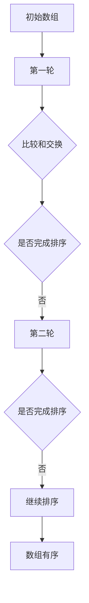

**冒泡排序伪代码：**

```plaintext
BubbleSort(Array):
    n = length(Array)
    for i = 0 to n - 1:
        for j = 0 to n - i - 1:
            if Array[j] > Array[j + 1]:
                swap(Array[j], Array[j + 1])
```

#### 选择排序

**核心概念与联系：**

选择排序通过每次遍历找到最小（或最大）元素，将其与第1个未排序元素交换，逐步构建有序数组。

**核心算法原理讲解：**

伪代码：

```plaintext
SelectionSort(Array):
    n = length(Array)
    for i = 0 to n - 1:
        minIndex = i
        for j = i + 1 to n:
            if Array[j] < Array[minIndex]:
                minIndex = j
        swap(Array[i], Array[minIndex])
```

该算法通过单重循环实现，每次遍历找到最小（或最大）元素，交换位置。

**项目实战：**

**选择排序算法流程图：**

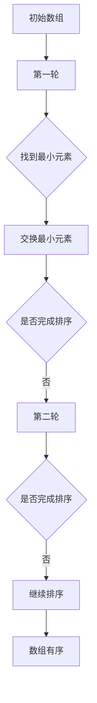

**选择排序伪代码：**

```plaintext
SelectionSort(Array):
    n = length(Array)
    for i = 0 to n - 1:
        minIndex = i
        for j = i + 1 to n:
            if Array[j] < Array[minIndex]:
                minIndex = j
        swap(Array[i], Array[minIndex])
```

#### 插入排序

**核心概念与联系：**

插入排序通过将未排序元素插入到已排序序列中的合适位置，逐步构建有序数组。

**核心算法原理讲解：**

伪代码：

```plaintext
InsertionSort(Array):
    n = length(Array)
    for i = 1 to n:
        key = Array[i]
        j = i - 1
        while j >= 0 and Array[j] > key:
            Array[j + 1] = Array[j]
            j = j - 1
        Array[j + 1] = key
```

该算法通过单重循环实现，每次遍历将未排序元素插入到已排序序列中。

**项目实战：**

**插入排序算法流程图：**

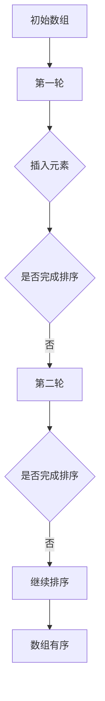

**插入排序伪代码：**

```plaintext
InsertionSort(Array):
    n = length(Array)
    for i = 1 to n:
        key = Array[i]
        j = i - 1
        while j >= 0 and Array[j] > key:
            Array[j + 1] = Array[j]
            j = j - 1
        Array[j + 1] = key
```

#### 快速排序

**核心概念与联系：**

快速排序通过选择一个基准元素，将数组分为两部分，然后递归排序两部分。其过程可以看作是不断将基准元素插入到已排序序列中。

**核心算法原理讲解：**

伪代码：

```plaintext
QuickSort(Array, low, high):
    if low < high:
        pivotIndex = partition(Array, low, high)
        QuickSort(Array, low, pivotIndex - 1)
        QuickSort(Array, pivotIndex + 1, high)

partition(Array, low, high):
    pivot = Array[high]
    i = low
    for j = low to high - 1:
        if Array[j] < pivot:
            swap(Array[i], Array[j])
            i = i + 1
    swap(Array[i], Array[high])
    return i
```

该算法通过划分和递归实现，每次划分选择一个基准元素，然后递归排序两部分。

**项目实战：**

**快速排序算法流程图：**

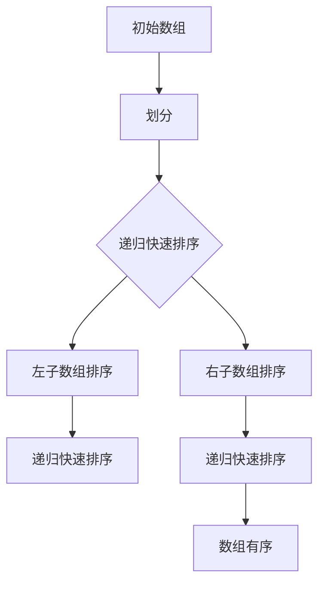

**快速排序伪代码：**

```plaintext
QuickSort(Array, low, high):
    if low < high:
        pivotIndex = partition(Array, low, high)
        QuickSort(Array, low, pivotIndex - 1)
        QuickSort(Array, pivotIndex + 1, high)

partition(Array, low, high):
    pivot = Array[high]
    i = low
    for j = low to high - 1:
        if Array[j] < pivot:
            swap(Array[i], Array[j])
            i = i + 1
    swap(Array[i], Array[high])
    return i
```

### 1.2.2 搜索算法

#### 二分查找

**核心概念与联系：**

二分查找是在有序数组中查找特定元素的算法，通过不断将查找范围缩小一半，实现高效查找。

**核心算法原理讲解：**

伪代码：

```plaintext
BinarySearch(Array, target):
    low = 0
    high = length(Array) - 1
    while low <= high:
        mid = (low + high) // 2
        if Array[mid] == target:
            return mid
        elif Array[mid] < target:
            low = mid + 1
        else:
            high = mid - 1
    return -1
```

该算法通过不断缩小区间，实现二分查找。

**项目实战：**

**二分查找算法流程图：**

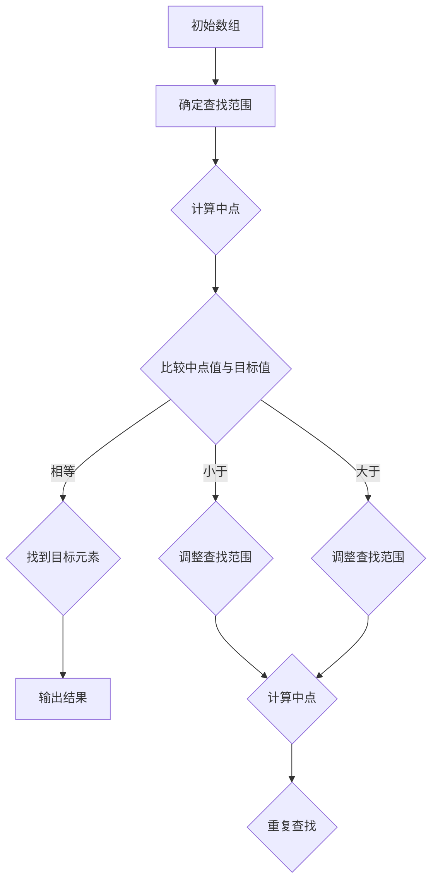

**二分查找伪代码：**

```plaintext
BinarySearch(Array, target):
    low = 0
    high = length(Array) - 1
    while low <= high:
        mid = (low + high) // 2
        if Array[mid] == target:
            return mid
        elif Array[mid] < target:
            low = mid + 1
        else:
            high = mid - 1
    return -1
```

#### BFS（广度优先搜索）

**核心概念与联系：**

广度优先搜索（BFS）是一种遍历图或树的算法，按照层次遍历，先访问最左边的节点，然后逐层向右。

**核心算法原理讲解：**

伪代码：

```plaintext
BFS(Graph, StartNode):
    visited = set()
    queue = []
    queue.append(StartNode)
    while queue is not empty:
        node = queue.pop()
        if node is not in visited:
            visited.add(node)
            for neighbor in node.neighbors():
                if neighbor is not in visited:
                    queue.append(neighbor)
```

该算法使用队列实现，每次取出队首元素，访问其邻居节点，并加入队列。

**项目实战：**

**BFS算法流程图：**

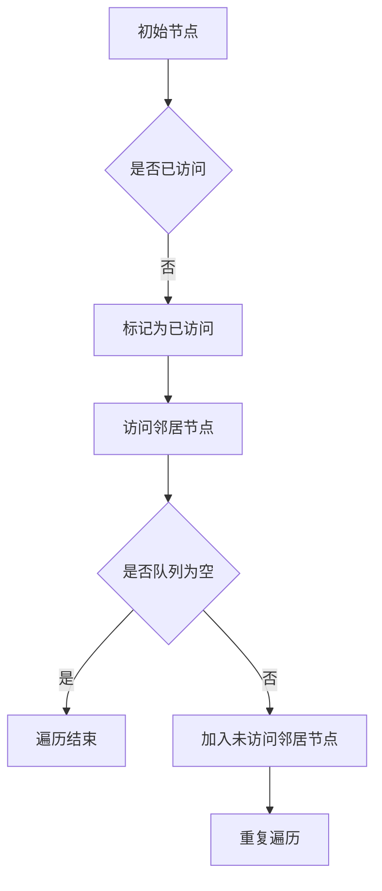

**BFS伪代码：**

```plaintext
BFS(Graph, StartNode):
    visited = set()
    queue = []
    queue.append(StartNode)
    while queue is not empty:
        node = queue.pop()
        if node is not in visited:
            visited.add(node)
            for neighbor in node.neighbors():
                if neighbor is not in visited:
                    queue.append(neighbor)
```

#### DFS（深度优先搜索）

**核心概念与联系：**

深度优先搜索（DFS）是一种遍历图或树的算法，按照路径优先遍历，直到达到叶节点，然后回溯。

**核心算法原理讲解：**

伪代码：

```plaintext
DFS(Graph, StartNode):
    visited = set()
    stack = []
    stack.append(StartNode)
    while stack is not empty:
        node = stack.pop()
        if node is not in visited:
            visited.add(node)
            for neighbor in node.neighbors():
                if neighbor is not in visited:
                    stack.append(neighbor)
```

该算法使用栈实现，每次取出栈顶元素，访问其邻居节点，并加入栈。

**项目实战：**

**DFS算法流程图：**

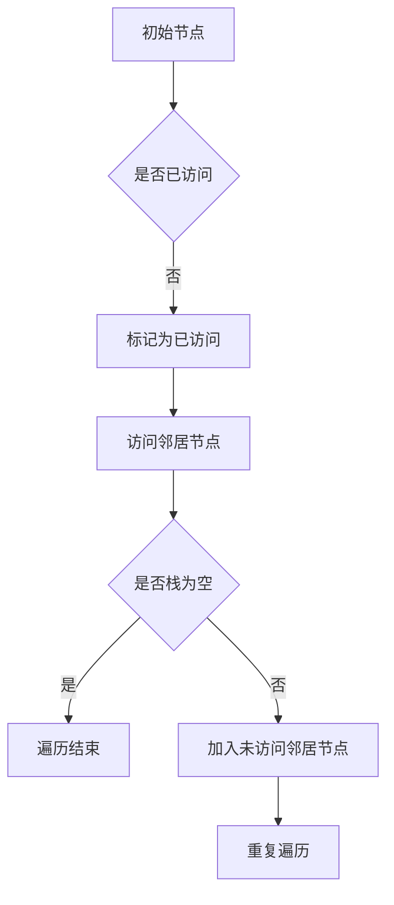

**DFS伪代码：**

```plaintext
DFS(Graph, StartNode):
    visited = set()
    stack = []
    stack.append(StartNode)
    while stack is not empty:
        node = stack.pop()
        if node is not in visited:
            visited.add(node)
            for neighbor in node.neighbors():
                if neighbor is not in visited:
                    stack.append(neighbor)
```

### 1.3 算法分析

算法分析主要包括时间复杂度和空间复杂度分析。通过分析算法在不同输入规模下的性能，选择合适的算法解决特定问题。

#### 时间复杂度

时间复杂度表示算法执行时间与输入规模的关系。常见的复杂度包括：

- **O(1)**：常数时间，与输入规模无关。
- **O(n)**：线性时间，执行时间与输入规模成线性关系。
- **O(n^2)**：平方时间，执行时间与输入规模的平方成正比。
- **O(log n)**：对数时间，执行时间与输入规模的对数成正比。
- **O(2^n)**：指数时间，执行时间随输入规模的指数增长。

#### 空间复杂度

空间复杂度表示算法在执行过程中所需的最大存储空间。常见的复杂度包括：

- **O(1)**：常数空间，与输入规模无关。
- **O(n)**：线性空间，所需存储空间与输入规模成线性关系。
- **O(n^2)**：平方空间，所需存储空间与输入规模的平方成正比。

### 1.4 动态规划

#### 动态规划概述

动态规划（Dynamic Programming，DP）是一种用于解决最优化问题的算法。它通过将复杂问题分解为子问题，并存储子问题的解，以避免重复计算，从而提高算法的效率。

**核心概念与联系：**

动态规划的核心是分而治之，将复杂问题分解为子问题，并使用递推关系求解。常见的动态规划方法包括：

- **自顶向下**：从顶层开始，递归求解子问题，并将结果存储在数组中。
- **自底向上**：从底层开始，逐步求解子问题，并将结果存储在数组中。

**动态规划与贪心算法对比：**

动态规划与贪心算法都是用于解决最优化问题的算法，但两者的原理不同。

- **贪心算法**：每一步选择当前最优解，期望最终得到全局最优解。
- **动态规划**：通过将问题分解为子问题，并存储子问题的解，避免重复计算，求解全局最优解。

**动态规划应用：**

动态规划广泛应用于解决最优化问题，如背包问题、最长公共子序列、最长上升子序列等。

### 1.5 动态规划核心原理

动态规划的核心原理包括：

1. **状态定义**：将问题分解为子问题，并为每个子问题定义一个状态。
2. **状态转移方程**：描述状态之间的关系，即子问题的解如何推导出父问题的解。
3. **最值求解**：求解全局最优解，通常使用递推关系和边界条件。

**状态定义：**

状态定义是将问题分解为子问题的重要步骤。常见的状态定义方法包括：

- **单维度状态**：每个子问题用一个变量表示，如斐波那契数列。
- **二维状态**：每个子问题用两个变量表示，如最长公共子序列。

**状态转移方程：**

状态转移方程描述状态之间的关系，即子问题的解如何推导出父问题的解。常见的状态转移方程包括：

- **斐波那契数列**：
  $$
  F(n) =
  \begin{cases}
  0, & \text{if } n = 0 \\
  1, & \text{if } n = 1 \\
  F(n-1) + F(n-2), & \text{if } n > 1
  \end{cases}
  $$
- **最长公共子序列**：
  $$
  dp[i][j] =
  \begin{cases}
  0, & \text{if } i = 0 \text{ or } j = 0 \\
  dp[i-1][j-1] + 1, & \text{if } s_i = t_j \\
  \max(dp[i-1][j], dp[i][j-1]), & \text{if } s_i \neq t_j
  \end{cases}
  $$

**最值求解：**

最值求解是动态规划的核心步骤，通常使用递推关系和边界条件求解。常见的求解方法包括：

- **自顶向下**：递归求解子问题，并存储结果。
- **自底向上**：从底层开始，逐步求解子问题，并存储结果。

**动态规划应用：**

动态规划广泛应用于解决最优化问题，如背包问题、最长公共子序列、最长上升子序列等。

### 1.6 动态规划典型应用

**最长公共子序列**

最长公共子序列（Longest Common Subsequence，LCS）是指两个序列中公共子序列中最长的子序列。LCS问题可以用动态规划求解。

**核心概念与联系：**

LCS问题可以分解为子问题，每个子问题求解最长公共子序列，并最终合并得到全局最优解。

**核心算法原理讲解：**

伪代码：

```plaintext
LCS(X, Y):
    m = length(X)
    n = length(Y)
    dp = create 2D array of size (m+1) x (n+1)
    for i = 0 to m:
        for j = 0 to n:
            if X[i] == Y[j]:
                dp[i+1][j+1] = dp[i][j] + 1
            else:
                dp[i+1][j+1] = max(dp[i][j+1], dp[i+1][j])
    return dp[m][n]
```

该算法使用二维数组 `dp` 存储子问题的解，并通过递推关系求解最长公共子序列。

**项目实战：**

**最长公共子序列算法流程图：**

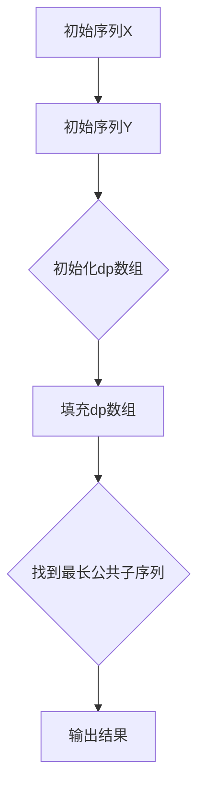

**最长公共子序列伪代码：**

```plaintext
LCS(X, Y):
    m = length(X)
    n = length(Y)
    dp = create 2D array of size (m+1) x (n+1)
    for i = 0 to m:
        for j = 0 to n:
            if X[i] == Y[j]:
                dp[i+1][j+1] = dp[i][j] + 1
            else:
                dp[i+1][j+1] = max(dp[i][j+1], dp[i+1][j])
    return dp[m][n]
```

**代码实现与分析：**

```python
def LCS(X, Y):
    m = len(X)
    n = len(Y)
    dp = [[0] * (n + 1) for _ in range(m + 1)]

    for i in range(1, m + 1):
        for j in range(1, n + 1):
            if X[i - 1] == Y[j - 1]:
                dp[i][j] = dp[i - 1][j - 1] + 1
            else:
                dp[i][j] = max(dp[i - 1][j], dp[i][j - 1])

    result = []
    i, j = m, n
    while i > 0 and j > 0:
        if X[i - 1] == Y[j - 1]:
            result.append(X[i - 1])
            i -= 1
            j -= 1
        elif dp[i - 1][j] > dp[i][j - 1]:
            i -= 1
        else:
            j -= 1

    return result[::-1]
```

**代码解读：**

1. 初始化二维数组 `dp`，其中 `dp[i][j]` 表示 `X[0...i-1]` 和 `Y[0...j-1]` 的最长公共子序列长度。
2. 遍历数组 `X` 和 `Y`，根据状态转移方程更新 `dp` 数组。
3. 根据 `dp` 数组回溯求解最长公共子序列。

**时间复杂度分析：**

该算法的时间复杂度为 $O(m \times n)$，其中 $m$ 和 $n$ 分别为 `X` 和 `Y` 的长度。

**空间复杂度分析：**

该算法的空间复杂度为 $O(m \times n)$，其中 $m$ 和 $n$ 分别为 `X` 和 `Y` 的长度。

### 最长上升子序列

**核心概念与联系：**

最长上升子序列（Longest Increasing Subsequence，LIS）是指一个序列中，元素按照严格递增排列的最长子序列。

**核心算法原理讲解：**

伪代码：

```plaintext
LIS(Array):
    n = length(Array)
    dp = create array of size n
    for i = 0 to n - 1:
        dp[i] = 1
        for j = 0 to i - 1:
            if Array[i] > Array[j]:
                dp[i] = max(dp[i], dp[j] + 1)
    return max(dp)
```

该算法使用一维数组 `dp` 存储子问题的解，并通过递推关系求解最长上升子序列。

**项目实战：**

**最长上升子序列算法流程图：**

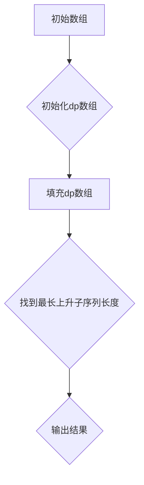

**最长上升子序列伪代码：**

```plaintext
LIS(Array):
    n = length(Array)
    dp = create array of size n
    for i = 0 to n - 1:
        dp[i] = 1
        for j = 0 to i - 1:
            if Array[i] > Array[j]:
                dp[i] = max(dp[i], dp[j] + 1)
    return max(dp)
```

**代码实现与分析：**

```python
def LIS(Array):
    n = len(Array)
    dp = [1] * n

    for i in range(1, n):
        for j in range(i):
            if Array[i] > Array[j]:
                dp[i] = max(dp[i], dp[j] + 1)

    return max(dp)
```

**代码解读：**

1. 初始化一维数组 `dp`，其中 `dp[i]` 表示以 `Array[i]` 结尾的最长上升子序列长度。
2. 遍历数组 `Array`，根据状态转移方程更新 `dp` 数组。
3. 返回 `dp` 数组中的最大值，即为最长上升子序列长度。

**时间复杂度分析：**

该算法的时间复杂度为 $O(n^2)$，其中 $n$ 为 `Array` 的长度。

**空间复杂度分析：**

该算法的空间复杂度为 $O(n)$，其中 $n$ 为 `Array` 的长度。

### 背包问题

**核心概念与联系：**

背包问题（Knapsack Problem）是指给定一组物品和它们的重量及价值，求解在总重量不超过限重的情况下，能够装载的物品价值之和的最大值。

**核心算法原理讲解：**

伪代码：

```plaintext
Knapsack(values, weights, W):
    n = length(values)
    dp = create 2D array of size (n+1) x (W+1)
    for i = 0 to n:
        for j = 0 to W:
            if j < weights[i]:
                dp[i+1][j+1] = dp[i+1][j]
            else:
                dp[i+1][j+1] = max(dp[i][j+1], dp[i][j-weights[i]] + values[i])
    return dp[n][W]
```

该算法使用二维数组 `dp` 存储子问题的解，并通过递推关系求解背包问题。

**项目实战：**

**背包问题算法流程图：**

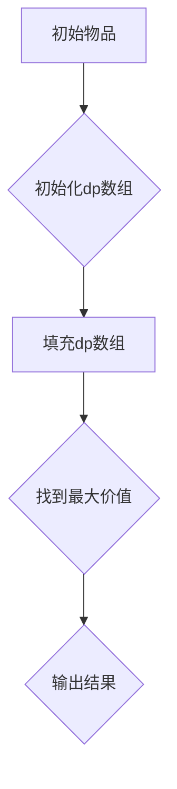

**背包问题伪代码：**

```plaintext
Knapsack(values, weights, W):
    n = length(values)
    dp = create 2D array of size (n+1) x (W+1)
    for i = 0 to n:
        for j = 0 to W:
            if j < weights[i]:
                dp[i+1][j+1] = dp[i+1][j]
            else:
                dp[i+1][j+1] = max(dp[i][j+1], dp[i][j-weights[i]] + values[i])
    return dp[n][W]
```

**代码实现与分析：**

```python
def Knapsack(values, weights, W):
    n = len(values)
    dp = [[0] * (W + 1) for _ in range(n + 1)]

    for i in range(1, n + 1):
        for j in range(1, W + 1):
            if j < weights[i - 1]:
                dp[i][j] = dp[i - 1][j]
            else:
                dp[i][j] = max(dp[i - 1][j], dp[i - 1][j - weights[i - 1]] + values[i - 1])

    return dp[n][W]
```

**代码解读：**

1. 初始化二维数组 `dp`，其中 `dp[i][j]` 表示前 `i` 个物品在总重量不超过 `j` 时的最大价值。
2. 遍历物品和总重量，根据状态转移方程更新 `dp` 数组。
3. 返回 `dp` 数组中最后一个元素，即为最大价值。

**时间复杂度分析：**

该算法的时间复杂度为 $O(n \times W)$，其中 $n$ 为物品数量，$W$ 为总重量。

**空间复杂度分析：**

该算法的空间复杂度为 $O(n \times W)$，其中 $n$ 为物品数量，$W$ 为总重量。

### 第3章：图算法

#### 3.1 图的基本概念

**图的定义**

图（Graph）是由节点（Node）和边（Edge）组成的数据结构，用于表示实体之间的关系。图可以分为无向图和有向图。

**图的表示方法**

图可以采用以下几种方式表示：

1. **邻接矩阵**：使用二维数组表示图，其中 `G[i][j]` 表示节点 `i` 和节点 `j` 是否相邻。
2. **邻接表**：使用一维数组表示图，其中每个数组元素表示一个节点，每个节点包含一个链表，链表中存储与该节点相邻的其他节点。
3. **邻接多重表**：用于表示有向图，其中每个节点包含一个链表，链表中存储指向其他节点的边。

### 3.2 图的遍历算法

**BFS（广度优先搜索）**

BFS（Breadth-First Search）是一种用于遍历图的算法，按照层次遍历图中的节点。BFS可以使用队列实现。

**核心算法原理讲解**

伪代码：

```plaintext
BFS(Graph, StartNode):
    visited = set()
    queue = []
    queue.append(StartNode)
    while queue is not empty:
        node = queue.pop()
        if node is not in visited:
            visited.add(node)
            for neighbor in node.neighbors():
                if neighbor is not in visited:
                    queue.append(neighbor)
```

该算法使用队列实现，每次取出队首元素，访问其邻居节点，并加入队列。

**项目实战**

**BFS算法流程图**


**BFS伪代码**

```plaintext
BFS(Graph, StartNode):
    visited = set()
    queue = []
    queue.append(StartNode)
    while queue is not empty:
        node = queue.pop()
        if node is not in visited:
            visited.add(node)
            for neighbor in node.neighbors():
                if neighbor is not in visited:
                    queue.append(neighbor)
```

**代码实现与分析**

```python
from collections import deque

def BFS(Graph, StartNode):
    visited = set()
    queue = deque([StartNode])

    while queue:
        node = queue.popleft()
        if node not in visited:
            print(node)
            visited.add(node)
            for neighbor in Graph[node]:
                if neighbor not in visited:
                    queue.append(neighbor)
```

**代码解读**

1. 初始化集合 `visited` 和队列 `queue`。
2. 从队列中取出队首元素，判断是否已访问，如果是，则继续取下一个元素；否则，打印节点并添加到 `visited` 集合。
3. 对于每个未被访问的邻居节点，将其加入队列。

**时间复杂度分析**

该算法的时间复杂度为 $O(V+E)$，其中 $V$ 为节点数量，$E$ 为边数量。

**空间复杂度分析**

该算法的空间复杂度为 $O(V)$，其中 $V$ 为节点数量。

**DFS（深度优先搜索）**

DFS（Depth-First Search）是一种用于遍历图的算法，按照路径优先遍历图中的节点。DFS可以使用栈实现。

**核心算法原理讲解**

伪代码：

```plaintext
DFS(Graph, StartNode):
    visited = set()
    stack = []
    stack.append(StartNode)
    while stack is not empty:
        node = stack.pop()
        if node is not in visited:
            visited.add(node)
            for neighbor in node.neighbors():
                if neighbor is not in visited:
                    stack.append(neighbor)
```

该算法使用栈实现，每次取出栈顶元素，访问其邻居节点，并加入栈。

**项目实战**

**DFS算法流程图**


**DFS伪代码**

```plaintext
DFS(Graph, StartNode):
    visited = set()
    stack = []
    stack.append(StartNode)
    while stack is not empty:
        node = stack.pop()
        if node is not in visited:
            visited.add(node)
            for neighbor in node.neighbors():
                if neighbor is not in visited:
                    stack.append(neighbor)
```

**代码实现与分析**

```python
def DFS(Graph, StartNode):
    visited = set()
    stack = [StartNode]

    while stack:
        node = stack.pop()
        if node not in visited:
            print(node)
            visited.add(node)
            for neighbor in Graph[node]:
                if neighbor not in visited:
                    stack.append(neighbor)
```

**代码解读**

1. 初始化集合 `visited` 和栈 `stack`。
2. 从栈中取出栈顶元素，判断是否已访问，如果是，则继续取下一个元素；否则，打印节点并添加到 `visited` 集合。
3. 对于每个未被访问的邻居节点，将其加入栈。

**时间复杂度分析**

该算法的时间复杂度为 $O(V+E)$，其中 $V$ 为节点数量，$E$ 为边数量。

**空间复杂度分析**

该算法的空间复杂度为 $O(V)$，其中 $V$ 为节点数量。

### 3.3 图的算法

#### 最短路径算法

最短路径算法用于求解图中两个节点之间的最短路径。常见的最短路径算法包括 Dijkstra 算法和 Floyd 算法。

**Dijkstra 算法**

Dijkstra 算法是一种用于求解单源最短路径的算法，适用于权值非负的图。算法的基本思想是维护一个优先队列，每次取出距离源点最近的节点，并更新其邻居节点的距离。

**核心算法原理讲解**

伪代码：

```plaintext
Dijkstra(Graph, SourceNode):
    distances = create array of size V, filled with infinity
    distances[SourceNode] = 0
    visited = create set()
    priorityQueue = create MinHeap()
    priorityQueue.insert((0, SourceNode))
    while not priorityQueue.isEmpty():
        (dist, node) = priorityQueue.extractMin()
        if node in visited:
            continue
        visited.add(node)
        for neighbor in Graph[node]:
            if neighbor not in visited and dist + Graph[node][neighbor] < distances[neighbor]:
                distances[neighbor] = dist + Graph[node][neighbor]
                priorityQueue.insert((distances[neighbor], neighbor))
    return distances
```

该算法使用优先队列实现，每次取出距离源点最近的节点，并更新其邻居节点的距离。

**项目实战**

**Dijkstra算法流程图**

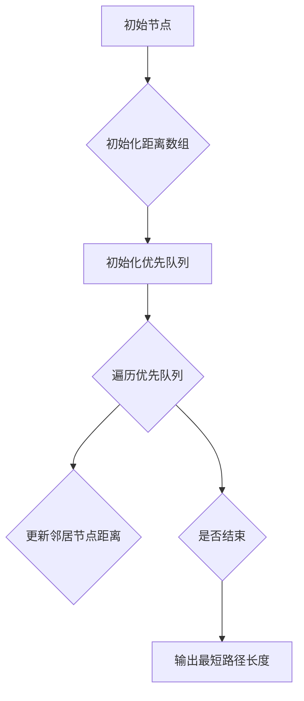

**Dijkstra伪代码**

```plaintext
Dijkstra(Graph, SourceNode):
    distances = create array of size V, filled with infinity
    distances[SourceNode] = 0
    visited = create set()
    priorityQueue = create MinHeap()
    priorityQueue.insert((0, SourceNode))
    while not priorityQueue.isEmpty():
        (dist, node) = priorityQueue.extractMin()
        if node in visited:
            continue
        visited.add(node)
        for neighbor in Graph[node]:
            if neighbor not in visited and dist + Graph[node][neighbor] < distances[neighbor]:
                distances[neighbor] = dist + Graph[node][neighbor]
                priorityQueue.insert((distances[neighbor], neighbor))
    return distances
```

**代码实现与分析**

```python
import heapq

def Dijkstra(Graph, SourceNode):
    distances = [float('inf')] * len(Graph)
    distances[SourceNode] = 0
    visited = set()
    priorityQueue = [(0, SourceNode)]

    while priorityQueue:
        dist, node = heapq.heappop(priorityQueue)
        if node in visited:
            continue
        visited.add(node)
        for neighbor, weight in Graph[node].items():
            if neighbor not in visited and dist + weight < distances[neighbor]:
                distances[neighbor] = dist + weight
                heapq.heappush(priorityQueue, (distances[neighbor], neighbor))

    return distances
```

**代码解读**

1. 初始化距离数组 `distances` 和优先队列 `priorityQueue`。
2. 遍历优先队列，取出距离源点最近的节点，并更新其邻居节点的距离。
3. 返回距离数组。

**时间复杂度分析**

该算法的时间复杂度为 $O(V^2)$，其中 $V$ 为节点数量。

**空间复杂度分析**

该算法的空间复杂度为 $O(V)$，其中 $V$ 为节点数量。

**Floyd 算法**

Floyd 算法是一种用于求解所有节点之间最短路径的算法。算法的基本思想是动态规划，通过递推关系计算两个节点之间的最短路径。

**核心算法原理讲解**

伪代码：

```plaintext
Floyd(Graph):
    distances = create 2D array of size V x V, filled with infinity
    for i = 0 to V - 1:
        for j = 0 to V - 1:
            distances[i][j] = Graph[i][j]
    for k = 0 to V - 1:
        for i = 0 to V - 1:
            for j = 0 to V - 1:
                distances[i][j] = min(distances[i][j], distances[i][k] + distances[k][j])
    return distances
```

该算法使用三重循环实现，计算两个节点之间的最短路径。

**项目实战**

**Floyd算法流程图**

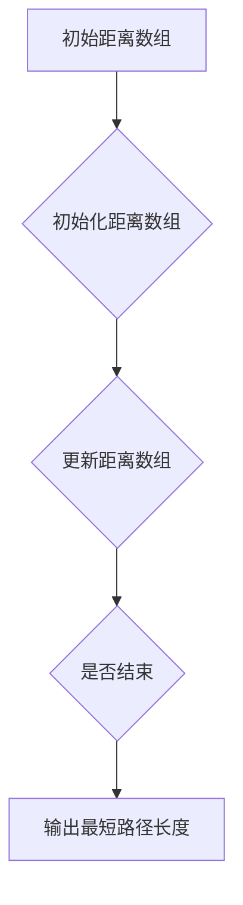

**Floyd伪代码**

```plaintext
Floyd(Graph):
    distances = create 2D array of size V x V, filled with infinity
    for i = 0 to V - 1:
        for j = 0 to V - 1:
            distances[i][j] = Graph[i][j]
    for k = 0 to V - 1:
        for i = 0 to V - 1:
            for j = 0 to V - 1:
                distances[i][j] = min(distances[i][j], distances[i][k] + distances[k][j])
    return distances
```

**代码实现与分析**

```python
def Floyd(Graph):
    distances = [[float('inf')] * len(Graph) for _ in range(len(Graph))]
    for i in range(len(Graph)):
        for j in range(len(Graph)):
            distances[i][j] = Graph[i][j]

    for k in range(len(Graph)):
        for i in range(len(Graph)):
            for j in range(len(Graph)):
                distances[i][j] = min(distances[i][j], distances[i][k] + distances[k][j])

    return distances
```

**代码解读**

1. 初始化二维数组 `distances`。
2. 使用三重循环计算两个节点之间的最短路径。
3. 返回距离数组。

**时间复杂度分析**

该算法的时间复杂度为 $O(V^3)$，其中 $V$ 为节点数量。

**空间复杂度分析**

该算法的空间复杂度为 $O(V^2)$，其中 $V$ 为节点数量。

### 3.4 最小生成树算法

最小生成树（Minimum Spanning Tree，MST）是连接图中所有节点的树，其权值之和最小。常见的最小生成树算法包括 Prim 算法和 Kruskal 算法。

**Prim 算法**

Prim 算法是一种用于求解最小生成树的贪心算法，从单个节点开始，逐步扩展生成树。

**核心算法原理讲解**

伪代码：

```plaintext
Prim(Graph, StartNode):
    mst = create empty Graph
    visited = create set()
    priorityQueue = create MinHeap()
    priorityQueue.insert((0, StartNode))
    while not priorityQueue.isEmpty():
        (weight, node) = priorityQueue.extractMin()
        if node in visited:
            continue
        visited.add(node)
        mst.addNode(node)
        for neighbor in Graph[node]:
            if neighbor not in visited:
                priorityQueue.insert((Graph[node][neighbor], neighbor))
    return mst
```

该算法使用优先队列实现，每次取出权值最小的边，并更新生成树。

**项目实战**

**Prim算法流程图**

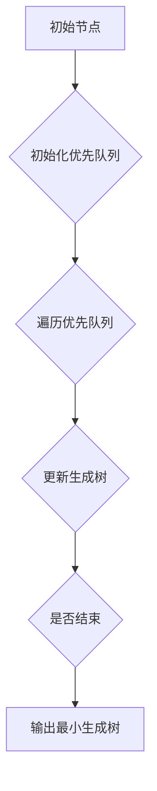

**Prim伪代码**

```plaintext
Prim(Graph, StartNode):
    mst = create empty Graph
    visited = create set()
    priorityQueue = create MinHeap()
    priorityQueue.insert((0, StartNode))
    while not priorityQueue.isEmpty():
        (weight, node) = priorityQueue.extractMin()
        if node in visited:
            continue
        visited.add(node)
        mst.addNode(node)
        for neighbor in Graph[node]:
            if neighbor not in visited:
                priorityQueue.insert((Graph[node][neighbor], neighbor))
    return mst
```

**代码实现与分析**

```python
import heapq

def Prim(Graph, StartNode):
    mst = {}
    visited = set()
    priorityQueue = [(0, StartNode)]

    while priorityQueue:
        weight, node = heapq.heappop(priorityQueue)
        if node in visited:
            continue
        visited.add(node)
        mst[node] = {}
        for neighbor, edge_weight in Graph[node].items():
            if neighbor not in visited:
                heapq.heappush(priorityQueue, (edge_weight, neighbor))

    return mst
```

**代码解读**

1. 初始化最小生成树 `mst`、集合 `visited` 和优先队列 `priorityQueue`。
2. 遍历优先队列，取出权值最小的边，并更新生成树。
3. 返回最小生成树。

**时间复杂度分析**

该算法的时间复杂度为 $O(E \log V)$，其中 $E$ 为边数量，$V$ 为节点数量。

**空间复杂度分析**

该算法的空间复杂度为 $O(V)$，其中 $V$ 为节点数量。

**Kruskal 算法**

Kruskal 算法是一种用于求解最小生成树的贪心算法，按照边的权值排序，逐步加入生成树。

**核心算法原理讲解**

伪代码：

```plaintext
Kruskal(Graph):
    mst = create empty Graph
    edges = create list of all edges in Graph, sorted by weight
    unionFind = create Union-Find data structure
    for edge in edges:
        if unionFind.areConnected(edge[0], edge[1]):
            continue
        unionFind.union(edge[0], edge[1])
        mst.addEdge(edge[0], edge[1])
    return mst
```

该算法使用并查集实现，每次取出权值最小的边，并更新生成树。

**项目实战**

**Kruskal算法流程图**

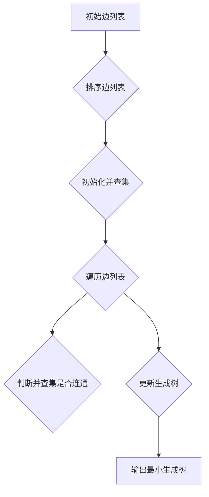

**Kruskal伪代码**

```plaintext
Kruskal(Graph):
    mst = create empty Graph
    edges = create list of all edges in Graph, sorted by weight
    unionFind = create Union-Find data structure
    for edge in edges:
        if unionFind.areConnected(edge[0], edge[1]):
            continue
        unionFind.union(edge[0], edge[1])
        mst.addEdge(edge[0], edge[1])
    return mst
```

**代码实现与分析**

```python
class UnionFind:
    def __init__(self, size):
        self.parent = list(range(size))
        self.size = [1] * size

    def find(self, x):
        if self.parent[x] != x:
            self.parent[x] = self.find(self.parent[x])
        return self.parent[x]

    def union(self, x, y):
        rootX = self.find(x)
        rootY = self.find(y)
        if rootX != rootY:
            if self.size[rootX] > self.size[rootY]:
                self.parent[rootY] = rootX
                self.size[rootX] += self.size[rootY]
            else:
                self.parent[rootX] = rootY
                self.size[rootY] += self.size[rootX]

def Kruskal(Graph):
    mst = {}
    edges = []
    for node, neighbors in Graph.items():
        for neighbor, weight in neighbors.items():
            edges.append(((node, neighbor), weight))

    edges.sort(key=lambda x: x[1])
    unionFind = UnionFind(len(Graph))

    for edge in edges:
        node1, node2 = edge[0]
        if unionFind.find(node1) != unionFind.find(node2):
            unionFind.union(node1, node2)
            mst[node1] = mst.get(node1, {})
            mst[node2] = mst.get(node2, {})
            mst[node1][node2] = edge[1]

    return mst
```

**代码解读**

1. 初始化最小生成树 `mst`、边列表 `edges` 和并查集 `unionFind`。
2. 按照边的权值排序，遍历边列表，使用并查集判断并合并连通分量。
3. 更新最小生成树。
4. 返回最小生成树。

**时间复杂度分析**

该算法的时间复杂度为 $O(E \log V)$，其中 $E$ 为边数量，$V$ 为节点数量。

**空间复杂度分析**

该算法的空间复杂度为 $O(V)$，其中 $V$ 为节点数量。

### 第4章：排序算法与查找算法

#### 4.1 排序算法

排序算法用于将一组无序数据变为有序数据。常见的排序算法包括快速排序、归并排序、堆排序和希尔排序。

**快速排序**

快速排序（Quick Sort）是一种高效的排序算法，采用分治策略，将数组划分为两部分，然后递归排序两部分。

**核心概念与联系：**

快速排序通过选择一个基准元素，将数组划分为两部分，左部分的元素小于基准元素，右部分的元素大于基准元素。递归地对两部分进行排序，最终实现整个数组的有序。

**核心算法原理讲解：**

伪代码：

```plaintext
QuickSort(Array, low, high):
    if low < high:
        pivotIndex = partition(Array, low, high)
        QuickSort(Array, low, pivotIndex - 1)
        QuickSort(Array, pivotIndex + 1, high)

partition(Array, low, high):
    pivot = Array[high]
    i = low
    for j = low to high - 1:
        if Array[j] < pivot:
            swap(Array[i], Array[j])
            i = i + 1
    swap(Array[i], Array[high])
    return i
```

该算法通过划分和递归实现，每次划分选择一个基准元素，然后递归排序两部分。

**项目实战：**

**快速排序算法流程图**

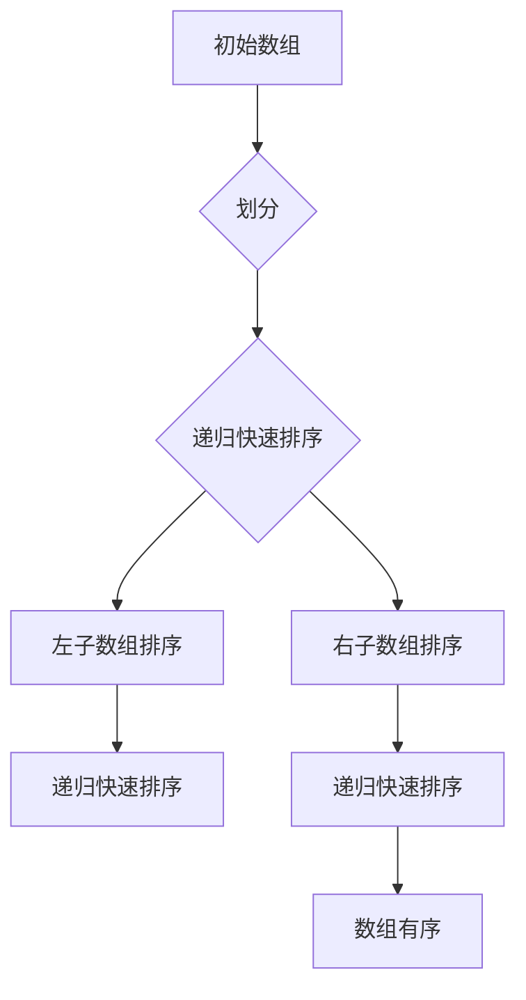

**快速排序伪代码**

```plaintext
QuickSort(Array, low, high):
    if low < high:
        pivotIndex = partition(Array, low, high)
        QuickSort(Array, low, pivotIndex - 1)
        QuickSort(Array, pivotIndex + 1, high)

partition(Array, low, high):
    pivot = Array[high]
    i = low
    for j = low to high - 1:
        if Array[j] < pivot:
            swap(Array[i], Array[j])
            i = i + 1
    swap(Array[i], Array[high])
    return i
```

**代码实现与分析**

```python
def partition(arr, low, high):
    pivot = arr[high]
    i = low
    for j in range(low, high):
        if arr[j] < pivot:
            arr[i], arr[j] = arr[j], arr[i]
            i += 1
    arr[i], arr[high] = arr[high], arr[i]
    return i

def quick_sort(arr, low, high):
    if low < high:
        pi = partition(arr, low, high)
        quick_sort(arr, low, pi - 1)
        quick_sort(arr, pi + 1, high)
```

**代码解读：**

1. `partition` 函数选择数组的最后一个元素作为基准，将小于基准的元素移动到基准左侧，大于基准的元素移动到基准右侧，返回基准的位置。
2. `quick_sort` 函数通过递归调用 `partition` 函数，对数组的两部分进行快速排序。

**时间复杂度分析：**

- 平均情况：$O(n\log n)$
- 最坏情况：$O(n^2)$（当输入序列已排序或逆序时）

**空间复杂度分析：**

- $O(\log n)$（递归调用栈空间）

#### 归并排序

归并排序（Merge Sort）是一种高效的排序算法，采用分治策略，将数组划分为两部分，分别递归排序，然后合并两部分。

**核心概念与联系：**

归并排序通过将数组划分为更小的子数组，递归地对子数组进行排序，然后将有序的子数组合并成有序的数组。

**核心算法原理讲解：**

伪代码：

```plaintext
MergeSort(Array, low, high):
    if low < high:
        mid = (low + high) // 2
        MergeSort(Array, low, mid)
        MergeSort(Array, mid + 1, high)
        Merge(Array, low, mid, high)

Merge(Array, low, mid, high):
    n1 = mid - low + 1
    n2 = high - mid
    L = Array[low:mid + 1]
    R = Array[mid + 1:high + 1]
    i = j = 0
    k = low
    while i < n1 and j < n2:
        if L[i] < R[j]:
            Array[k] = L[i]
            i += 1
        else:
            Array[k] = R[j]
            j += 1
        k += 1
    while i < n1:
        Array[k] = L[i]
        i += 1
        k += 1
    while j < n2:
        Array[k] = R[j]
        j += 1
        k += 1
```

该算法通过递归划分和合并实现，每次合并两个有序子数组。

**项目实战：**

**归并排序算法流程图**

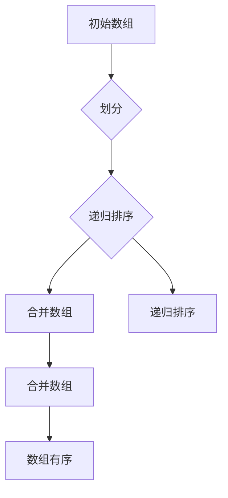

**归并排序伪代码**

```plaintext
MergeSort(Array, low, high):
    if low < high:
        mid = (low + high) // 2
        MergeSort(Array, low, mid)
        MergeSort(Array, mid + 1, high)
        Merge(Array, low, mid, high)

Merge(Array, low, mid, high):
    n1 = mid - low + 1
    n2 = high - mid
    L = Array[low:mid + 1]
    R = Array[mid + 1:high + 1]
    i = j = 0
    k = low
    while i < n1 and j < n2:
        if L[i] < R[j]:
            Array[k] = L[i]
            i += 1
        else:
            Array[k] = R[j]
            j += 1
        k += 1
    while i < n1:
        Array[k] = L[i]
        i += 1
        k += 1
    while j < n2:
        Array[k] = R[j]
        j += 1
        k += 1
```

**代码实现与分析**

```python
def merge_sort(arr):
    if len(arr) <= 1:
        return arr

    mid = len(arr) // 2
    left = merge_sort(arr[:mid])
    right = merge_sort(arr[mid:])

    return merge(left, right)

def merge(left, right):
    result = []
    i = j = 0
    while i < len(left) and j < len(right):
        if left[i] < right[j]:
            result.append(left[i])
            i += 1
        else:
            result.append(right[j])
            j += 1

    result.extend(left[i:])
    result.extend(right[j:])
    return result
```

**代码解读：**

1. `merge_sort` 函数递归地对数组进行划分和合并。
2. `merge` 函数将两个有序数组合并成一个新的有序数组。

**时间复杂度分析：**

- $O(n\log n)$，其中 $n$ 为数组长度。

**空间复杂度分析：**

- $O(n)$，其中 $n$ 为数组长度。

#### 堆排序

堆排序（Heap Sort）是一种利用堆这种数据结构的排序算法。堆是一种特殊的完全二叉树，每个父节点的值都大于或小于其子节点的值。

**核心概念与联系：**

堆排序通过构建一个大顶堆（或小顶堆），然后逐步取出堆顶元素，重新调整堆，直到堆为空，实现数组的有序。

**核心算法原理讲解：**

伪代码：

```plaintext
HeapSort(Array):
    BuildMaxHeap(Array)
    n = length(Array)
    for i = n - 1 downto 1:
        swap(Array[0], Array[i])
        MaxHeapify(Array, 0, i)
    for i = n - 1 downto 1:
        swap(Array[0], Array[i])
        MaxHeapify(Array, 0, i - 1)

BuildMaxHeap(Array):
    for i = length(Array) // 2 downto 1:
        MaxHeapify(Array, i, length(Array))

MaxHeapify(Array, i, n):
    largest = i
    left = 2 * i
    right = 2 * i + 1
    if left <= n and Array[left] > Array[largest]:
        largest = left
    if right <= n and Array[right] > Array[largest]:
        largest = right
    if largest != i:
        swap(Array[i], Array[largest])
        MaxHeapify(Array, largest, n)
```

该算法通过构建大顶堆和调整堆实现，每次取出堆顶元素，重新调整堆。

**项目实战：**

**堆排序算法流程图**

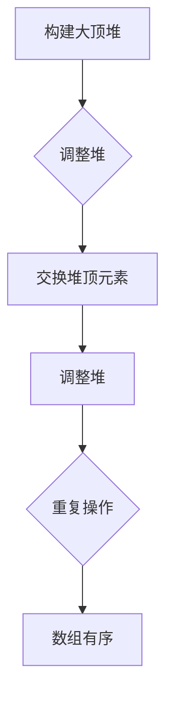

**堆排序伪代码**

```plaintext
HeapSort(Array):
    BuildMaxHeap(Array)
    n = length(Array)
    for i = n - 1 downto 1:
        swap(Array[0], Array[i])
        MaxHeapify(Array, 0, i)
    for i = n - 1 downto 1:
        swap(Array[0], Array[i])
        MaxHeapify(Array, 0, i - 1)

BuildMaxHeap(Array):
    for i = length(Array) // 2 downto 1:
        MaxHeapify(Array, i, length(Array))

MaxHeapify(Array, i, n):
    largest = i
    left = 2 * i
    right = 2 * i + 1
    if left <= n and Array[left] > Array[largest]:
        largest = left
    if right <= n and Array[right] > Array[largest]:
        largest = right
    if largest != i:
        swap(Array[i], Array[largest])
        MaxHeapify(Array, largest, n)
```

**代码实现与分析**

```python
def heapify(arr, n, i):
    largest = i
    left = 2 * i + 1
    right = 2 * i + 2

    if left < n and arr[left] > arr[largest]:
        largest = left

    if right < n and arr[right] > arr[largest]:
        largest = right

    if largest != i:
        arr[i], arr[largest] = arr[largest], arr[i]
        heapify(arr, n, largest)

def heap_sort(arr):
    n = len(arr)

    for i in range(n // 2 - 1, -1, -1):
        heapify(arr, n, i)

    for i in range(n - 1, 0, -1):
        arr[i], arr[0] = arr[0], arr[i]
        heapify(arr, i, 0)
```

**代码解读：**

1. `heapify` 函数调整堆，确保每个子节点的值大于或小于其父节点的值。
2. `heap_sort` 函数构建大顶堆，然后逐步取出堆顶元素，重新调整堆。

**时间复杂度分析：**

- $O(n\log n)$，其中 $n$ 为数组长度。

**空间复杂度分析：**

- $O(1)$，不需要额外的空间。

#### 希尔排序

希尔排序（Shell Sort）是一种基于插入排序的改进排序算法，通过设置间隔序列，将待排序序列分割成若干个子序列，分别进行插入排序。

**核心概念与联系：**

希尔排序通过设置不同的间隔序列，逐步减少间隔序列的长度，实现更高效的插入排序。

**核心算法原理讲解：**

伪代码：

```plaintext
ShellSort(Array):
    gap = length(Array) // 2
    while gap > 0:
        for i = gap to length(Array) - 1:
            temp = Array[i]
            j = i
            while j >= gap and Array[j - gap] > temp:
                Array[j] = Array[j - gap]
                j = j - gap
            Array[j] = temp
        gap = gap // 2
```

该算法通过设置间隔序列，逐步减少间隔序列的长度，实现更高效的插入排序。

**项目实战：**

**希尔排序算法流程图**

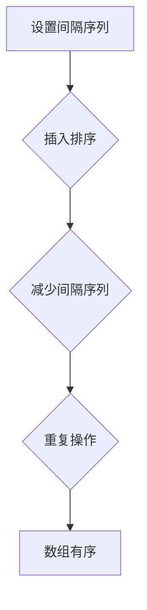

**希尔排序伪代码**

```plaintext
ShellSort(Array):
    gap = length(Array) // 2
    while gap > 0:
        for i = gap to length(Array) - 1:
            temp = Array[i]
            j = i
            while j >= gap and Array[j - gap] > temp:
                Array[j] = Array[j - gap]
                j = j - gap
            Array[j] = temp
        gap = gap // 2
```

**代码实现与分析**

```python
def shell_sort(arr):
    n = len(arr)
    gap = n // 2

    while gap > 0:
        for i in range(gap, n):
            temp = arr[i]
            j = i
            while j >= gap and arr[j - gap] > temp:
                arr[j] = arr[j - gap]
                j -= gap
            arr[j] = temp
        gap //= 2
```

**代码解读：**

1. 设置间隔序列，从中间值开始。
2. 对每个间隔序列进行插入排序。
3. 逐步减少间隔序列的长度。

**时间复杂度分析：**

- 最好情况：$O(n\log n)$
- 最坏情况：$O(n^2)$

**空间复杂度分析：**

- $O(1)$，不需要额外的空间。

### 4.2 查找算法

查找算法用于在数据集合中查找特定元素。常见的查找算法包括二分查找、哈希表查找和 BST（二叉搜索树）查找。

**二分查找**

二分查找（Binary Search）是在有序数组中查找特定元素的算法，通过不断将查找范围缩小一半，实现高效查找。

**核心概念与联系：**

二分查找通过每次将查找范围缩小一半，实现快速查找。它适用于已排序的数据集合。

**核心算法原理讲解：**

伪代码：

```plaintext
BinarySearch(Array, target):
    low = 0
    high = length(Array) - 1
    while low <= high:
        mid = (low + high) // 2
        if Array[mid] == target:
            return mid
        elif Array[mid] < target:
            low = mid + 1
        else:
            high = mid - 1
    return -1
```

该算法通过不断缩小区间，实现二分查找。

**项目实战：**

**二分查找算法流程图**

```mermaid
graph TD
A[初始数组] --> B{确定查找范围}
B --> C{计算中点}
C --> D{比较中点值与目标值}
D -->|相等| E{找到目标元素}
D -->|小于| F{调整查找范围}
D -->|大于| G{调整查找范围}
E --> H[输出结果]
F --> I{计算中点}
G --> I
I --> J{重复查找}
```

**二分查找伪代码**

```plaintext
BinarySearch(Array, target):
    low = 0
    high = length(Array) - 1
    while low <= high:
        mid = (low + high) // 2
        if Array[mid] == target:
            return mid
        elif Array[mid] < target:
            low = mid + 1
        else:
            high = mid - 1
    return -1
```

**代码实现与分析**

```python
def binary_search(arr, target):
    low = 0
    high = len(arr) - 1

    while low <= high:
        mid = (low + high) // 2
        if arr[mid] == target:
            return mid
        elif arr[mid] < target:
            low = mid + 1
        else:
            high = mid - 1

    return -1
```

**代码解读：**

1. 初始化 `low` 和 `high`，分别表示查找范围的起始和结束位置。
2. 循环条件：当 `low` 小于等于 `high` 时，继续查找。
3. 计算中点 `mid`，比较中点值与目标值。
4. 根据比较结果，调整查找范围。

**时间复杂度分析：**

- $O(\log n)$，其中 $n$ 为数组长度。

**空间复杂度分析：**

- $O(1)$，不需要额外的空间。

**哈希表查找**

哈希表查找（Hash Table Search）是一种基于哈希函数的查找算法，通过计算哈希值，实现快速查找。

**核心概念与联系：**

哈希表查找通过哈希函数将关键字映射到哈希表中，实现快速查找。哈希函数的目的是将关键字均匀分布到哈希表中。

**核心算法原理讲解：**

伪代码：

```plaintext
HashSearch(HashTable, Key):
    hashValue = HashFunction(Key)
    index = hashValue % length(HashTable)
    if HashTable[index] == Key:
        return index
    else:
        for i = 1 to length(HashTable) - 1:
            index = (index + 1) % length(HashTable)
            if HashTable[index] == Key:
                return index
        return -1
```

该算法通过哈希函数计算哈希值，然后遍历哈希表，查找关键字。

**项目实战：**

**哈希表查找算法流程图**

```mermaid
graph TD
A[计算哈希值] --> B{查找哈希表}
B --> C{是否找到}
C -->|是| D{输出结果}
C -->|否| E{继续查找}
E --> F{是否超出范围}
F -->|是| G{返回-1}
F -->|否| E
```

**哈希表查找伪代码**

```plaintext
HashSearch(HashTable, Key):
    hashValue = HashFunction(Key)
    index = hashValue % length(HashTable)
    if HashTable[index] == Key:
        return index
    else:
        for i = 1 to length(HashTable) - 1:
            index = (index + 1) % length(HashTable)
            if HashTable[index] == Key:
                return index
        return -1
```

**代码实现与分析**

```python
def hash_search(hash_table, key):
    hash_value = hash(key) % len(hash_table)
    if hash_table[hash_value] == key:
        return hash_value
    else:
        i = 1
        while hash_table[hash_value] != key:
            hash_value = (hash_value + 1) % len(hash_table)
            if hash_value == 0:
                return -1
            i += 1
        return hash_value
```

**代码解读：**

1. 计算哈希值 `hash_value`。
2. 查找哈希表，如果找到关键字，返回哈希值。
3. 如果未找到，遍历哈希表，直到找到关键字或超出范围。

**时间复杂度分析：**

- 最好情况：$O(1)$
- 最坏情况：$O(n)$，其中 $n$ 为哈希表长度。

**空间复杂度分析：**

- $O(n)$，其中 $n$ 为哈希表长度。

**BST（二叉搜索树）查找**

BST（Binary Search Tree）查找是通过二叉搜索树实现的一种查找算法。二叉搜索树是一种特殊的二叉树，对于每个节点，其左子树的所有节点的值小于该节点的值，其右子树的所有节点的值大于该节点的值。

**核心概念与联系：**

BST 查找通过递归遍历二叉搜索树，根据节点的值与关键字的大小关系，逐步缩小查找范围。

**核心算法原理讲解：**

伪代码：

```plaintext
BSTSearch(Tree, Key):
    if Tree is empty:
        return -1
    if Key == Tree.root.value:
        return Tree.root
    elif Key < Tree.root.value:
        return BSTSearch(Tree.left, Key)
    else:
        return BSTSearch(Tree.right, Key)
```

该算法通过递归遍历二叉搜索树，查找关键字。

**项目实战：**

**BST 查找算法流程图**

```mermaid
graph TD
A[初始节点] --> B{比较值与关键字}
B --> C{是否找到}
C -->|是| D{输出结果}
C -->|否| E{递归左子树}
E --> F{是否找到}
C -->|否| G{递归右子树}
G --> H{是否找到}
H --> I{返回-1}
```

**BST 查找伪代码**

```plaintext
BSTSearch(Tree, Key):
    if Tree is empty:
        return -1
    if Key == Tree.root.value:
        return Tree.root
    elif Key < Tree.root.value:
        return BSTSearch(Tree.left, Key)
    else:
        return BSTSearch(Tree.right, Key)
```

**代码实现与分析**

```python
class Node:
    def __init__(self, value):
        self.value = value
        self.left = None
        self.right = None

class BST:
    def __init__(self):
        self.root = None

    def insert(self, value):
        if self.root is None:
            self.root = Node(value)
        else:
            self._insert(value, self.root)

    def _insert(self, value, node):
        if value < node.value:
            if node.left is None:
                node.left = Node(value)
            else:
                self._insert(value, node.left)
        else:
            if node.right is None:
                node.right = Node(value)
            else:
                self._insert(value, node.right)

    def search(self, value):
        return self._search(value, self.root)

    def _search(self, value, node):
        if node is None:
            return -1
        if value == node.value:
            return node
        elif value < node.value:
            return self._search(value, node.left)
        else:
            return self._search(value, node.right)
```

**代码解读：**

1. `Node` 类表示二叉树的节点。
2. `BST` 类表示二叉搜索树，包含插入和查找方法。
3. `insert` 方法用于插入节点。
4. `_insert` 方法递归插入节点。
5. `search` 方法用于查找节点。
6. `_search` 方法递归查找节点。

**时间复杂度分析：**

- $O(\log n)$，其中 $n$ 为二叉树节点数量。

**空间复杂度分析：**

- $O(\log n)$，其中 $n$ 为二叉树节点数量。

### 第5章：编程语言基础

#### 5.1 Python基础

Python 是一种高级编程语言，具有简洁的语法和丰富的库。Python 在算法开发、数据分析、人工智能等领域具有广泛的应用。

**核心概念与联系：**

Python 的核心概念包括变量、数据类型、控制结构等。Python 支持多种数据类型，如整数、浮点数、字符串、列表、字典等。控制结构包括条件语句、循环语句等。

**核心算法原理讲解：**

伪代码：

```plaintext
# 定义变量
x = 10
y = "hello"

# 数据类型转换
x = int(y)
y = str(x)

# 条件语句
if x > y:
    print("x 大于 y")
elif x < y:
    print("x 小于 y")
else:
    print("x 等于 y")

# 循环语句
for i in range(5):
    print(i)

while x > 0:
    print(x)
    x = x - 1
```

该伪代码展示了 Python 的核心概念和控制结构。

**项目实战：**

**Python 函数调用流程图**

```mermaid
graph TD
A[定义函数] --> B[调用函数]
B --> C{传递参数}
C --> D[执行函数体]
D --> E[返回结果]
```

**Python 函数调用伪代码**

```plaintext
def function_name(parameters):
    # 执行函数体
    return result

result = function_name(arguments)
```

**代码实现与分析**

```python
def greet(name):
    message = f"Hello, {name}!"
    return message

name = "Alice"
greeting = greet(name)
print(greeting)
```

**代码解读：**

1. 定义 `greet` 函数，接受参数 `name`。
2. 在函数内部，构造问候消息并返回。
3. 调用 `greet` 函数，传递参数 `name`。
4. 打印问候消息。

**时间复杂度分析：**

- $O(1)$，函数调用和参数传递的时间复杂度为常数。

**空间复杂度分析：**

- $O(1)$，函数调用和参数传递的空间复杂度为常数。

#### 5.2 Java基础

Java 是一种面向对象的编程语言，具有跨平台性和安全性。Java 在企业级应用、Android 开发等领域具有广泛的应用。

**核心概念与联系：**

Java 的核心概念包括基本语法、面向对象编程、异常处理等。Java 支持类和对象的定义，以及继承、多态等面向对象特性。异常处理用于处理程序中的错误和异常情况。

**核心算法原理讲解：**

伪代码：

```plaintext
class MyClass {
    // 成员变量和成员函数
}

MyClass obj = new MyClass();
obj.method();

try {
    // 可能产生异常的代码
} catch (Exception e) {
    // 异常处理
}
```

该伪代码展示了 Java 的核心概念和异常处理。

**项目实战：**

**Java 异常处理流程图**

```mermaid
graph TD
A[执行代码] --> B{可能产生异常}
B --> C{捕获异常}
C --> D{处理异常}
D --> E{继续执行}
```

**Java 异常处理伪代码**

```plaintext
try {
    // 可能产生异常的代码
} catch (Exception e) {
    // 异常处理
} finally {
    // 清理资源
}
```

**代码实现与分析**

```java
public class ExceptionDemo {
    public static void main(String[] args) {
        try {
            int result = divide(10, 0);
            System.out.println("Result: " + result);
        } catch (ArithmeticException e) {
            System.out.println("Error: " + e.getMessage());
        } finally {
            System.out.println("Finally block executed.");
        }
    }

    public static int divide(int a, int b) {
        if (b == 0) {
            throw new ArithmeticException("Cannot divide by zero.");
        }
        return a / b;
    }
}
```

**代码解读：**

1. 定义 `ExceptionDemo` 类和 `divide` 方法。
2. 在 `main` 方法中，调用 `divide` 方法，并处理可能产生的异常。
3. `divide` 方法检查除数为零的情况，并抛出异常。

**时间复杂度分析：**

- $O(1)$，函数调用和异常处理的时间复杂度为常数。

**空间复杂度分析：**

- $O(1)$，函数调用和异常处理的空间复杂度为常数。

#### 5.3 C++基础

C++ 是一种面向对象的编程语言，具有高效性和灵活性。C++ 在系统编程、游戏开发等领域具有广泛的应用。

**核心概念与联系：**

C++ 的核心概念包括基本语法、面向对象编程、标准模板库（STL）等。C++ 支持类和对象的定义，以及继承、多态等面向对象特性。标准模板库提供了丰富的数据结构和算法实现。

**核心算法原理讲解：**

伪代码：

```plaintext
class MyClass {
    // 成员变量和成员函数
};

MyClass obj;
obj.method();

std::vector<int> vec;
vec.push_back(10);
vec.pop_back();

std::sort(vec.begin(), vec.end());
```

该伪代码展示了 C++ 的核心概念和标准模板库。

**项目实战：**

**C++ 排序算法流程图**

```mermaid
graph TD
A[创建向量] --> B{添加元素}
B --> C{排序向量}
C --> D{输出结果}
```

**C++ 排序算法伪代码**

```plaintext
#include <algorithm>
#include <vector>

int main() {
    std::vector<int> vec = {5, 2, 8, 1, 9};
    std::sort(vec.begin(), vec.end());
    for (int num : vec) {
        std::cout << num << " ";
    }
    std::cout << std::endl;
    return 0;
}
```

**代码实现与分析**

```cpp
#include <iostream>
#include <vector>
#include <algorithm>

int main() {
    std::vector<int> vec = {5, 2, 8, 1, 9};
    std::sort(vec.begin(), vec.end());
    for (int num : vec) {
        std::cout << num << " ";
    }
    std::cout << std::endl;
    return 0;
}
```

**代码解读：**

1. 包含必要的头文件。
2. 定义 `main` 函数，创建向量 `vec`。
3. 使用 `std::sort` 函数对向量进行排序。
4. 遍历向量，打印排序后的元素。

**时间复杂度分析：**

- $O(n\log n)$，其中 $n$ 为向量长度。

**空间复杂度分析：**

- $O(n)$，其中 $n$ 为向量长度。

### 第6章：LeetCode面试题解析

LeetCode 是一个在线编程平台，提供各种编程题目，用于测试编程能力和算法水平。LeetCode 的题目涵盖算法、数据结构、编程语言等多个领域。

**6.1 LeetCode刷题方法论**

**核心概念与联系：**

LeetCode 刷题方法论包括以下步骤：

1. 选择合适的题目：根据个人兴趣和难度，选择合适的题目进行练习。
2. 理解题目要求：仔细阅读题目描述，理解题目要求和输入输出。
3. 分析算法复杂度：分析题目所需的算法复杂度，选择合适的算法。
4. 编写代码实现：根据分析结果，编写代码实现。
5. 测试代码：对代码进行测试，确保正确性和效率。

**核心算法原理讲解：**

伪代码：

```plaintext
LeetCodeMethodology():
    choose appropriate problem
    understand problem requirements
    analyze algorithm complexity
    write code implementation
    test code
```

该伪代码展示了 LeetCode 刷题方法论。

**项目实战：**

**LeetCode 刷题方法论流程图**

```mermaid
graph TD
A[选择题目] --> B{理解要求}
B --> C{分析复杂度}
C --> D{编写代码}
D --> E{测试代码}
E --> F{提交答案}
```

**LeetCode 刷题方法论伪代码**

```plaintext
LeetCodeMethodology():
    choose appropriate problem
    understand problem requirements
    analyze algorithm complexity
    write code implementation
    test code
```

**代码实现与分析**

```python
def leetcode_methodology():
    # 选择合适的题目
    problem = choose_problem()

    # 理解题目要求
    requirements = understand_requirements(problem)

    # 分析算法复杂度
    complexity = analyze_algorithm_complexity(problem)

    # 编写代码实现
    solution = write_code_implementation(problem)

    # 测试代码
    test_solution(solution, problem)

    # 提交答案
    submit_answer(solution)
```

**代码解读：**

1. 选择合适的题目。
2. 理解题目要求。
3. 分析算法复杂度。
4. 编写代码实现。
5. 测试代码。
6. 提交答案。

**时间复杂度分析：**

- $O(1)$，每个步骤的时间复杂度为常数。

**空间复杂度分析：**

- $O(1)$，每个步骤的空间复杂度为常数。

**6.2 算法题分类解析**

LeetCode 的算法题可以分为动态规划、图算法、排序和查找等类别。以下分别介绍这些题目的解析方法。

**动态规划**

动态规划题通常涉及最优化问题，可以通过递推关系和状态转移方程求解。常见的动态规划题包括背包问题、最长公共子序列、最长上升子序列等。

**核心概念与联系：**

动态规划题的核心是通过递推关系和状态转移方程求解最优化问题。递推关系描述子问题的解如何推导出父问题的解，状态转移方程描述状态之间的关系。

**核心算法原理讲解：**

伪代码：

```plaintext
DynamicProgramming(problem):
    initialize dp array
    for i = 1 to n:
        for j = 1 to m:
            dp[i][j] = optimal solution using dp[0...i-1][0...j-1]
    return dp[n][m]
```

该伪代码展示了动态规划的基本步骤。

**项目实战：**

**动态规划题解析流程图**

```mermaid
graph TD
A[初始化dp数组] --> B{填充dp数组}
B --> C{求解最值}
C --> D{输出结果}
```

**动态规划题解析伪代码**

```plaintext
DynamicProgramming(problem):
    initialize dp array
    for i = 1 to n:
        for j = 1 to m:
            dp[i][j] = optimal solution using dp[0...i-1][0...j-1]
    return dp[n][m]
```

**代码实现与分析**

```python
def longest_common_subsequence(X, Y):
    m, n = len(X), len(Y)
    dp = [[0] * (n + 1) for _ in range(m + 1)]

    for i in range(1, m + 1):
        for j in range(1, n + 1):
            if X[i - 1] == Y[j - 1]:
                dp[i][j] = dp[i - 1][j - 1] + 1
            else:
                dp[i][j] = max(dp[i - 1][j], dp[i][j - 1])

    return dp[m][n]
```

**代码解读：**

1. 初始化二维数组 `dp`。
2. 遍历数组 `X` 和 `Y`，根据状态转移方程更新 `dp` 数组。
3. 返回 `dp` 数组中最后一个元素，即为最长公共子序列长度。

**时间复杂度分析：**

- $O(m \times n)$，其中 $m$ 和 $n$ 分别为 `X` 和 `Y` 的长度。

**空间复杂度分析：**

- $O(m \times n)$，其中 $m$ 和 $n$ 分别为 `X` 和 `Y` 的长度。

**图算法**

图算法题通常涉及图的遍历、路径搜索、最短路径等。常见的图算法包括 BFS（广度优先搜索）、DFS（深度优先搜索）、Dijkstra 算法、Floyd 算法等。

**核心概念与联系：**

图算法题的核心是通过图的遍历和路径搜索算法求解问题。遍历算法包括 BFS 和 DFS，路径搜索算法包括 Dijkstra 算法和 Floyd 算法。

**核心算法原理讲解：**

伪代码：

```plaintext
GraphAlgorithm(Graph, StartNode):
    # BFS 遍历
    visited = set()
    queue = []
    queue.append(StartNode)
    while queue is not empty:
        node = queue.pop()
        if node is not in visited:
            visited.add(node)
            for neighbor in node.neighbors():
                if neighbor is not in visited:
                    queue.append(neighbor)

    # DFS 遍历
    visited = set()
    stack = []
    stack.append(StartNode)
    while stack is not empty:
        node = stack.pop()
        if node is not in visited:
            visited.add(node)
            for neighbor in node.neighbors():
                if neighbor is not in visited:
                    stack.append(neighbor)
```

该伪代码展示了 BFS 和 DFS 的基本步骤。

**项目实战：**

**图算法题解析流程图**

```mermaid
graph TD
A[初始化遍历算法] --> B{遍历图}
B --> C{查找路径}
C --> D{输出结果}
```

**图算法题解析伪代码**

```plaintext
GraphAlgorithm(Graph, StartNode):
    # BFS 遍历
    visited = set()
    queue = []
    queue.append(StartNode)
    while queue is not empty:
        node = queue.pop()
        if node is not in visited:
            visited.add(node)
            for neighbor in node.neighbors():
                if neighbor is not in visited:
                    queue.append(neighbor)

    # DFS 遍历
    visited = set()
    stack = []
    stack.append(StartNode)
    while stack is not empty:
        node = stack.pop()
        if node is not in visited:
            visited.add(node)
            for neighbor in node.neighbors():
                if neighbor is not in visited:
                    stack.append(neighbor)
```

**代码实现与分析**

```python
from collections import deque

def bfs(graph, start_node):
    visited = set()
    queue = deque([start_node])

    while queue:
        node = queue.popleft()
        if node not in visited:
            print(node)
            visited.add(node)
            for neighbor in graph[node]:
                if neighbor not in visited:
                    queue.append(neighbor)

def dfs(graph, start_node):
    visited = set()
    stack = [start_node]

    while stack:
        node = stack.pop()
        if node not in visited:
            print(node)
            visited.add(node)
            for neighbor in graph[node]:
                if neighbor not in visited:
                    stack.append(neighbor)
```

**代码解读：

