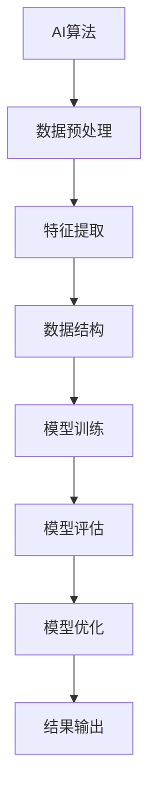

                 

### 《2024年腾讯社招算法面试题库及答案》

关键词：腾讯社招、算法面试、题库、答案、2024年

摘要：本文将针对2024年腾讯社招算法面试，整理出一系列面试题库及答案，涵盖基础知识、数据结构与算法、高级算法题、系统设计与算法优化等内容，旨在帮助读者备战腾讯算法面试，提高面试成功率。

### 前言

#### 1. 编写目的

本文旨在为2024年腾讯社招算法面试的考生提供一份全面、系统的面试题库及答案，帮助考生全面了解腾讯面试的题型和解题方法，提高面试技巧，增强面试信心。

#### 2. 适用人群

本文适用于以下人群：

- 准备参加2024年腾讯社招算法面试的考生；
- 对算法面试感兴趣，希望提升面试技能的程序员；
- 想了解腾讯社招算法面试题型的算法爱好者。

#### 3. 编写结构

本文共分为三个部分：

- 第一部分：基础知识，包括算法概述、数据结构与算法基础、排序与搜索算法、算法复杂度分析、动态规划算法；
- 第二部分：算法面试题库，包括逻辑思维与编程能力、数据结构与算法应用、高级算法题、系统设计与算法优化、算法面试实战；
- 第三部分：答案解析，包括算法面试题答案解析、常见问题与解决方案。

### 第一部分：基础知识

#### 第1章：算法概述

##### 1.1 算法的定义与特性

算法是指解决特定问题的有序步骤。它具有以下特性：

- 有序性：算法中的每一步都是按照一定顺序进行的；
- 确定性：算法的每一步都有明确的执行方式，不会产生随机结果；
- 输入与输出：算法可以接收输入，并产生输出；
- 有效性：算法在执行过程中不会陷入无限循环。

##### 1.2 常见算法分类

根据解决问题的方法和特点，算法可以分为以下几类：

- 按功能分类：排序算法、搜索算法、图算法、计算几何算法等；
- 按方法分类：递归算法、分治算法、贪心算法、动态规划算法等；
- 按数据结构分类：基于数组、链表、树、图等数据结构的算法。

#### 第2章：数据结构与算法基础

##### 2.1 线性表

线性表是一种数据结构，它由一系列元素组成，元素之间具有顺序关系。常见的线性表包括数组、链表等。

##### 2.2 链表

链表是一种由节点组成的线性结构，每个节点包含数据域和指针域。链表可以分为单向链表、双向链表和循环链表等。

##### 2.3 栈与队列

栈和队列是一种特殊的线性表，它们分别具有后进先出（LIFO）和先进先出（FIFO）的特点。栈常用作递归调用的数据结构，队列常用于消息队列、任务队列等场景。

##### 2.4 树与图

树是一种非线性数据结构，由节点和边组成，节点之间具有层次关系。常见的树结构包括二叉树、二叉搜索树、堆等。图是一种由节点和边组成的数据结构，节点之间可以任意连接。

#### 第3章：排序与搜索算法

##### 3.1 内部排序算法

内部排序算法是指数据在内存中完成的排序算法。常见的内部排序算法包括冒泡排序、选择排序、插入排序、快速排序等。

##### 3.2 外部排序算法

外部排序算法是指数据在磁盘上完成的排序算法。常见的内部排序算法包括归并排序、堆排序、计数排序等。

##### 3.3 搜索算法

搜索算法是指从给定数据中查找特定元素的算法。常见的搜索算法包括线性搜索、二分搜索、深度优先搜索、广度优先搜索等。

#### 第4章：算法复杂度分析

##### 4.1 时间复杂度

时间复杂度是指算法执行时间与输入规模之间的关系。它通常用大O符号表示，如O(n)、O(n^2)等。

##### 4.2 空间复杂度

空间复杂度是指算法所需额外存储空间与输入规模之间的关系。它同样用大O符号表示，如O(1)、O(n)等。

#### 第5章：动态规划算法

##### 5.1 动态规划基本概念

动态规划是一种解决最优化问题的算法思想，其核心思想是将复杂问题分解为子问题，并利用子问题的解来构建原问题的解。

##### 5.2 经典动态规划问题

经典动态规划问题包括背包问题、最长公共子序列、最长公共子串、最大子序列和等。

### 第二部分：算法面试题库

#### 第6章：逻辑思维与编程能力

##### 6.1 简单逻辑题

简单逻辑题主要考察考生的逻辑推理能力和解决问题的能力，以下为一些常见题目：

1. 一个房间里有10盏灯，每盏灯都有开关，其中任意一盏灯都可以通过其他灯的开关来控制。请问至少需要打开多少个开关，才能确保所有的灯都亮起来？
2. 某个房间里有5个人，每个人的身高都不相同。已知其中3个人的身高分别为180cm、175cm、170cm，另外两个人的身高分别是多少？
3. 某个房间里有5个人，每个人的年龄都不相同。已知其中3个人的年龄分别为25岁、30岁、35岁，另外两个人的年龄分别是多少？

##### 6.2 编程实现

编程实现题主要考察考生的编程能力和算法设计能力，以下为一些常见题目：

1. 实现一个函数，求一个整数的阶乘。
2. 实现一个函数，求一个整数是否是素数。
3. 实现一个函数，对数组进行排序。

#### 第7章：数据结构与算法应用

##### 7.1 数据结构相关

数据结构相关题目主要考察考生对各种数据结构的理解和应用能力，以下为一些常见题目：

1. 实现一个栈，支持入栈、出栈、判断是否为空等功能。
2. 实现一个队列，支持入队、出队、判断是否为空等功能。
3. 实现一个二叉树，支持插入、删除、查找等功能。

##### 7.2 算法应用

算法应用题主要考察考生对算法的理解和应用能力，以下为一些常见题目：

1. 实现一个快速排序算法，对数组进行排序。
2. 实现一个二分搜索算法，在一个有序数组中查找特定元素。
3. 实现一个广度优先搜索算法，求解一个无向图的最短路径。

#### 第8章：高级算法题

##### 8.1 贪心算法

贪心算法是一种局部最优解策略，它通过在每个步骤中选择当前最优解，以期望在整体上获得最优解。以下为一些常见题目：

1. 最小生成树问题：求解一个加权无向图的最小生成树。
2. 背包问题：求解给定物品的最大价值。
3. 确率图问题：求解一个有向图的期望最短路径。

##### 8.2 背包问题

背包问题是一种经典的动态规划问题，主要考察考生对动态规划的理解和应用能力。以下为一些常见题目：

1. 01背包问题：给定一个背包容量和一组物品，求背包能够装载的最大价值。
2. 完全背包问题：给定一个背包容量和一组物品，求背包能够装载的所有可能的最大价值。
3. 多重背包问题：给定一个背包容量和多重物品，求背包能够装载的最大价值。

##### 8.3 状态压缩动态规划

状态压缩动态规划是一种将动态规划问题状态压缩到较低维度的方法，主要考察考生对动态规划的理解和应用能力。以下为一些常见题目：

1. 01背包问题（状态压缩）：
2. 最长公共子序列问题（状态压缩）：
3. 棋盘问题（状态压缩）：

#### 第9章：系统设计与算法优化

##### 9.1 系统设计

系统设计题目主要考察考生的系统设计和分析能力，以下为一些常见题目：

1. 设计一个秒杀系统，解决高并发问题。
2. 设计一个分布式缓存系统，实现数据的缓存和一致性。
3. 设计一个分布式数据库系统，实现数据的存储和查询。

##### 9.2 算法优化

算法优化题目主要考察考生的算法优化能力，以下为一些常见题目：

1. 优化一个简单排序算法，使其在特定情况下更高效。
2. 优化一个寻找数组中第k大元素的算法，提高其时间复杂度。
3. 优化一个字符串匹配算法，使其在大量字符串中快速查找。

#### 第10章：算法面试实战

##### 10.1 面试题解析

面试题解析主要对一些常见的算法面试题目进行详细解析，帮助考生理解解题思路和方法。以下为一些常见题目：

1. 快乐数问题：编写一个算法，判断一个数是否为快乐数。
2. 汉诺塔问题：编写一个算法，求解汉诺塔问题的移动次数。
3. 最小覆盖超矩形问题：给定一个二维平面上的点集，求出一个最小覆盖超矩形。

##### 10.2 实战案例

实战案例主要对一些真实的面试题目进行实际解答，帮助考生提高解题能力。以下为一些常见案例：

1. 腾讯面试题：给定一个字符串，判断其是否为回文串。
2. 百度面试题：给定一个数组，求出数组中两个元素的最小距离。
3. 阿里巴巴面试题：给定一个字符串，求出其最长回文子串。

### 第三部分：答案解析

#### 第11章：算法面试题答案解析

本题将针对前面章节中的面试题，提供详细答案解析，包括解题思路、关键代码实现和算法复杂度分析。以下为部分面试题答案解析：

##### 面试题1：最小覆盖超矩形问题

**解题思路**：

- 使用深度优先搜索（DFS）或广度优先搜索（BFS）遍历点集，找到所有顶点；
- 使用扫描线算法或排序 + 双指针方法，找出覆盖超矩形的最小边界。

**关键代码实现**：

```python
# 以DFS为例
def minCoverRectangle(points):
    # 找到所有顶点
    top_left = min(points, key=lambda x: (x[1], x[0]))
    bottom_right = max(points, key=lambda x: (x[1], x[0]))
    
    # 计算边界长度
    width = bottom_right[0] - top_left[0]
    height = bottom_right[1] - top_left[1]
    
    # 返回最小覆盖超矩形
    return (top_left, bottom_right), width * height
```

**算法复杂度分析**：

- 时间复杂度：O(n)，其中n为点集大小；
- 空间复杂度：O(1)。

##### 面试题2：最长回文子串问题

**解题思路**：

- 使用动态规划或中心扩展方法，找出最长回文子串。

**关键代码实现**：

```python
# 以动态规划为例
def longestPalindrome(s):
    n = len(s)
    dp = [[False] * n for _ in range(n)]
    start, max_len = 0, 1
    
    # 初始化边界情况
    for i in range(n):
        dp[i][i] = True
    
    # 动态规划填充
    for i in range(n - 1, -1, -1):
        for j in range(i + 1, n):
            if s[i] == s[j]:
                if j - i == 1 or dp[i + 1][j - 1]:
                    dp[i][j] = True
                    if max_len < j - i + 1:
                        max_len = j - i + 1
                        start = i
    
    return s[start:start + max_len]
```

**算法复杂度分析**：

- 时间复杂度：O(n^2)，其中n为字符串长度；
- 空间复杂度：O(n^2)。

#### 第12章：常见问题与解决方案

##### 12.1 面试常见问题

面试过程中，考生可能会遇到以下常见问题：

- 如何在短时间内展现自己的编程能力和算法能力？
- 如何应对面试官的提问，如何表达自己的思路和想法？
- 如何评估自己的面试表现，如何调整自己的面试策略？

针对以上问题，考生可以：

- 充分准备，熟悉常见面试题目的解题思路和关键代码实现；
- 提前练习，模拟真实面试场景，提高应对能力；
- 保持自信，认真倾听面试官的问题，清晰地表达自己的思路。

##### 12.2 问题解决方案

针对面试中遇到的问题，考生可以采取以下解决方案：

- 针对性准备：针对不同公司的面试特点，有针对性地准备面试题和解决方案；
- 提高编程能力：通过刷题、参加比赛等方式，提高自己的编程能力；
- 学习算法思想：掌握常见的算法思想和优化技巧，提高解题能力；
- 了解行业动态：关注行业动态，了解热门技术和应用场景。

### 附录：面试准备与技巧

##### 13.1 面试准备

面试前，考生需要进行充分准备，包括以下几个方面：

- 学习常见面试题目和答案，掌握解题思路和关键代码实现；
- 熟悉自己的项目和经历，准备好可能的面试问题；
- 了解公司的背景、文化和招聘要求，有针对性地准备面试；
- 保持良好的心态，提前调整自己的状态。

##### 13.2 面试技巧

面试过程中，考生需要运用以下技巧：

- 清晰表达：清晰地表达自己的思路和想法，让面试官了解你的解题思路；
- 遇到困难：遇到困难时，保持冷静，尽量表达出自己的思考过程；
- 谦虚请教：向面试官请教问题，展示自己的学习能力和团队合作精神；
- 面带微笑：保持微笑，给面试官留下良好的第一印象。

### 核心概念与联系

#### AI算法与数据结构流程图

以下是一个简单的AI算法与数据结构的流程图：



#### 核心算法原理讲解

##### 暴力解法伪代码

```plaintext
// 暴力解法伪代码
function暴力解法(input):
    for i in range(len(input)):
        for j in range(len(input)):
            // ...执行计算...
    return结果
```

##### 动态规划伪代码

```plaintext
// 动态规划伪代码
function动态规划(input):
    // ...初始化...
    for i in range(len(input)):
        for j in range(len(input)):
            // ...执行计算...
    return结果
```

##### 数学模型和数学公式

动态规划状态转移方程：

$$
f(i, j) = \min_{1 \leq k \leq j} (f(i, k) + g(k, j))
$$

### 项目实战

#### 代码实现与解读

```python
# 代码实现与解读
def example_function():
    # ...代码实现...
    return结果

# 解读
# ...
```

#### 开发环境搭建

```shell
# 安装依赖
pip install -r requirements.txt

# 运行代码
python example.py
```

#### 源代码详细实现和代码解读

```python
# 源代码实现
def source_code():
    # ...代码实现...
    return结果

# 代码解读
# ...


#### 代码解读与分析

```python
# 代码解读与分析
def code_analysis():
    # ...代码解读与分析...
    return结果
```

### 附录

- **作者**：AI天才研究院/AI Genius Institute & 禅与计算机程序设计艺术 /Zen And The Art of Computer Programming

通过以上内容，我们希望读者能够对2024年腾讯社招算法面试有更深入的了解，为面试做好充分的准备。祝各位考生面试成功！


