                 

# 开启无限可能：人类计算的新征程

> **关键词：** 计算技术，人工智能，量子计算，生物计算，大数据，超级计算，未来科技

> **摘要：** 本文将带领读者穿越人类计算的发展历程，探索计算技术的最新进展，展望计算的未来趋势。通过剖析核心概念、算法原理、应用场景以及面临的挑战，本文旨在激发读者对计算技术无限可能的思考，共同开启人类计算的新征程。

## 第一部分：人类计算的历史与展望

### 第1章：人类计算的历史回顾

#### 1.1 早期计算工具与思想

**核心概念与联系：**

早期计算工具的发展是人类计算历史的起点。从算筹、算盘到机械计算机，人类不断探索如何更高效地进行计算。

- **算筹**：中国古代的算筹是一种用竹签或木棒表示数字的计算工具，可以完成简单的加减运算。

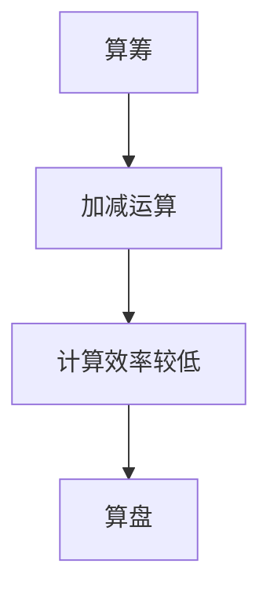

- **算盘**：明代发明的算盘，使用珠子表示数字，可以进行更复杂的运算。

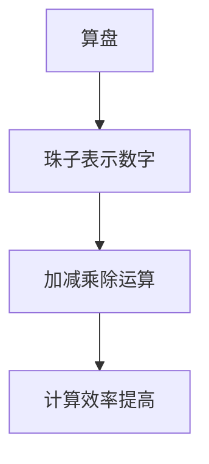

**核心算法原理讲解：**

算筹和算盘的算法原理基于基本的算术运算规则。

```markdown
# 算术运算规则

- 加法：将两个数的各位相加，如果和大于等于10，则进位。
- 减法：从被减数中减去减数，如果不够减，则借位。
- 乘法：将两个数相乘，得到乘积。
- 除法：将被除数除以除数，得到商和余数。
```

**数学模型和公式：**

```latex
$$
\begin{aligned}
&\text{加法：} a + b = c \\
&\text{减法：} a - b = c \\
&\text{乘法：} a \times b = c \\
&\text{除法：} a \div b = c \ldots r \\
\end{aligned}
$$
```

#### 1.2 机械计算机的发展

**核心概念与联系：**

机械计算机是计算工具的一次重大飞跃，以差分机和分析机为代表。

- **差分机**：由查尔斯·巴贝奇设计，用于求解多项式方程。

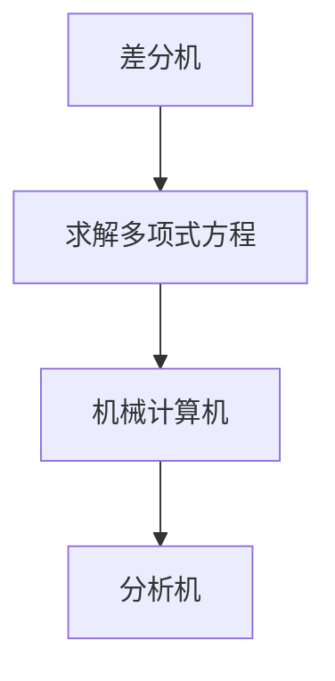

- **分析机**：查尔斯·巴贝奇进一步设计的分析机，具有存储程序的能力。

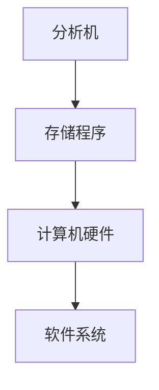

**核心算法原理讲解：**

机械计算机的算法原理依赖于机械结构和物理运动。

```markdown
# 机械计算机算法原理

- 机械结构：通过齿轮、杠杆等机械装置实现运算。
- 物理运动：通过机械装置的运动实现数字的加减运算。
```

**数学模型和公式：**

由于机械计算机的复杂性，其数学模型相对较简单，主要涉及基本的算术运算。

```latex
$$
\begin{aligned}
&\text{加法：} a + b &= c \\
&\text{减法：} a - b &= c \\
&\text{乘法：} a \times b &= c \\
&\text{除法：} a \div b &= c \ldots r \\
\end{aligned}
$$
```

#### 1.3 电子计算机的诞生

**核心概念与联系：**

电子计算机的诞生标志着计算技术进入了新的时代。

- **电子计算机**：以电子元件为基础，实现了计算速度的大幅提升。

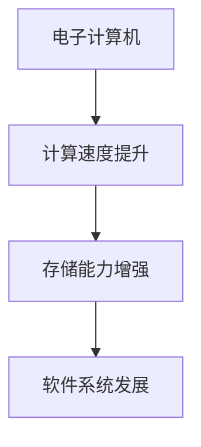

- **晶体管**：晶体管的发明使得计算机硬件得到了极大的改进。

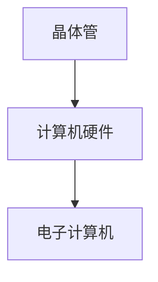

**核心算法原理讲解：**

电子计算机的算法原理依赖于二进制和逻辑电路。

```markdown
# 电子计算机算法原理

- 二进制：计算机使用二进制表示数字，只有0和1两种状态。
- 逻辑电路：通过逻辑电路实现基本的逻辑运算，如与、或、非等。
```

**数学模型和公式：**

电子计算机的数学模型涉及二进制运算和逻辑电路。

```latex
$$
\begin{aligned}
&\text{二进制加法：} 0 + 0 &= 0 \\
&0 + 1 &= 1 \\
&1 + 0 &= 1 \\
&1 + 1 &= 10 \\
&\text{逻辑与：} (A \land B) &= C \\
&\text{逻辑或：} (A \lor B) &= C \\
&\text{逻辑非：} \neg A &= B \\
\end{aligned}
$$
```

#### 1.4 计算机网络的崛起

**核心概念与联系：**

计算机网络的崛起使得计算技术从个体化走向了网络化。

- **计算机网络**：通过通信线路将多台计算机连接起来，实现数据交换和资源共享。

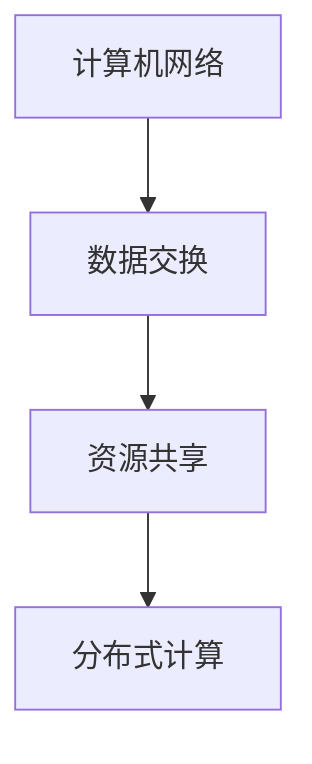

- **互联网**：互联网是计算机网络的一种形式，连接了全球的计算机。

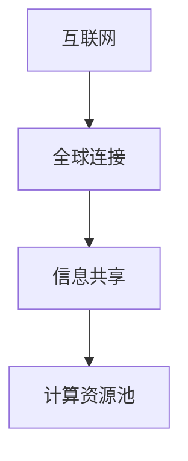

**核心算法原理讲解：**

计算机网络的核心算法原理包括路由算法、传输协议和数据加密等。

```markdown
# 计算机网络算法原理

- 路由算法：确定数据包传输的最优路径。
- 传输协议：确保数据包的可靠传输。
- 数据加密：保护数据的安全性。
```

**数学模型和公式：**

网络通信的数学模型涉及概率论、信息论和网络拓扑结构。

```latex
$$
\begin{aligned}
&\text{路由算法：} P(\text{路径} = i) &= \frac{\text{路径} i \text{的权重}}{\text{所有路径的权重之和}} \\
&\text{传输协议：} \text{TCP/IP} \\
&\text{数据加密：} E_k(D) = C \\
\end{aligned}
$$
```

### 第2章：计算领域的核心概念

#### 2.1 信息论与编码理论

**核心概念与联系：**

信息论和编码理论是计算领域的重要基础。

- **信息论**：研究信息的度量、传输和处理。
- **编码理论**：研究如何有效、可靠地编码和传输信息。

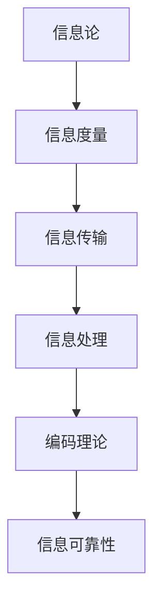

**核心算法原理讲解：**

信息论和编码理论的算法原理包括香农定理、汉明距离和前向纠错等。

```markdown
# 信息论与编码理论算法原理

- 香农定理：给出了信道容量和信息熵的关系。
- 汉明距离：衡量两个编码序列之间的差异。
- 前向纠错：在数据传输过程中自动纠正错误。
```

**数学模型和公式：**

信息论和编码理论的数学模型涉及概率论、信息论和网络拓扑结构。

```latex
$$
\begin{aligned}
&H(X) &= -\sum_{x \in X} P(x) \log_2 P(x) \\
&C &= \log_2 \left( 1 + \frac{S}{N} \right) \\
&d(H, G) &= \sum_{x \in X} |h(x) - g(x)| \\
&\text{前向纠错：} E_k(D) = C \\
\end{aligned}
$$
```

#### 2.2 算法与复杂性理论

**核心概念与联系：**

算法和复杂性理论是计算领域的重要研究方向。

- **算法**：解决问题的方法步骤。
- **复杂性理论**：研究算法的效率和资源消耗。

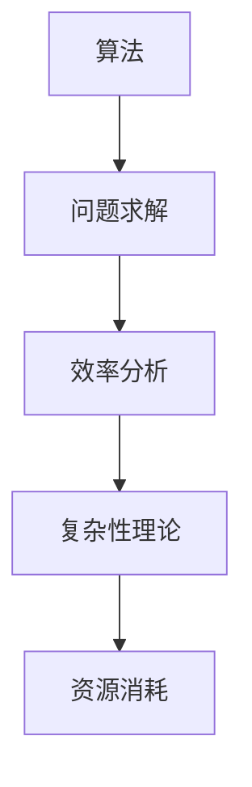

**核心算法原理讲解：**

算法和复杂性理论的算法原理包括贪心算法、动态规划和图论算法等。

```markdown
# 算法与复杂性理论算法原理

- 贪心算法：每次选择最优解，直至问题解决。
- 动态规划：将问题分解为子问题，并利用子问题的解构建原问题的解。
- 图论算法：研究图结构及其相关问题。
```

**数学模型和公式：**

算法和复杂性理论的数学模型涉及概率论、信息论和网络拓扑结构。

```latex
$$
\begin{aligned}
&f(k) &= \min_{i} \{ g(i) + h(i, k) \} \\
&\text{时间复杂度：} T(n) &= O(n^2) \\
&\text{空间复杂度：} S(n) &= O(n) \\
\end{aligned}
$$
```

#### 2.3 编程语言与编译原理

**核心概念与联系：**

编程语言和编译原理是计算机软件开发的基石。

- **编程语言**：用于编写计算机程序的语言。
- **编译原理**：研究将编程语言转换为机器语言的过程。

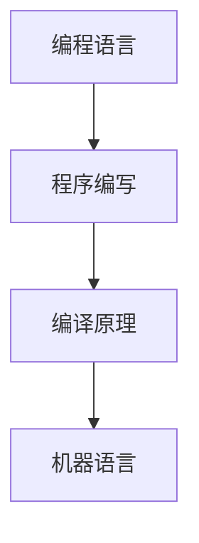

**核心算法原理讲解：**

编译原理的算法原理包括词法分析、语法分析和代码生成等。

```markdown
# 编译原理算法原理

- 词法分析：将源代码分解为词法单元。
- 语法分析：构建抽象语法树，表示源代码的结构。
- 代码生成：将抽象语法树转换为机器语言。
```

**数学模型和公式：**

编译原理的数学模型涉及形式语言、自动机和语法分析算法。

```latex
$$
\begin{aligned}
&A &= \{\text{源代码}\} \\
&B &= \{\text{词法单元}\} \\
&C &= \{\text{抽象语法树}\} \\
&D &= \{\text{机器语言}\} \\
\end{aligned}
$$
```

#### 2.4 软件工程与系统架构

**核心概念与联系：**

软件工程和系统架构是软件开发过程中的重要组成部分。

- **软件工程**：研究软件开发的方法和技术。
- **系统架构**：研究软件系统的结构和设计。

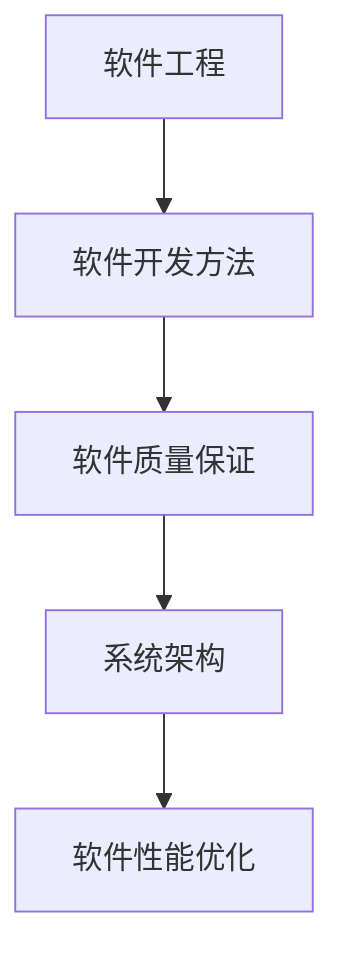

**核心算法原理讲解：**

软件工程和系统架构的算法原理包括敏捷开发、架构风格和设计模式等。

```markdown
# 软件工程与系统架构算法原理

- 敏捷开发：迭代、增量式开发，快速响应变化。
- 架构风格：分层、微服务、事件驱动等。
- 设计模式：解决常见问题的通用解决方案。
```

**数学模型和公式：**

软件工程和系统架构的数学模型涉及统计模型、性能评估和优化算法。

```latex
$$
\begin{aligned}
&A &= \{\text{敏捷开发}\} \\
&B &= \{\text{架构风格}\} \\
&C &= \{\text{设计模式}\} \\
&D &= \{\text{性能优化}\} \\
\end{aligned}
$$
```

### 第3章：计算技术的最新进展

#### 3.1 量子计算：原理与应用

**核心概念与联系：**

量子计算是一种基于量子力学原理的新型计算模式。

- **量子位（qubit）**：量子计算的基本单元，可以处于多个状态的叠加态。
- **量子门**：操作量子位状态的数学运算。

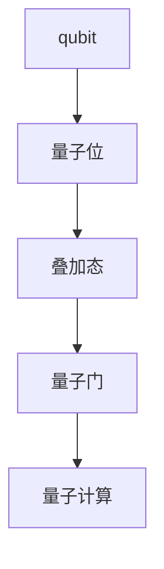

**核心算法原理讲解：**

量子计算的算法原理包括量子叠加、量子纠缠和量子算法等。

```markdown
# 量子计算算法原理

- 量子叠加：量子位可以同时处于多个状态。
- 量子纠缠：量子位之间存在量子纠缠，可以相互影响。
- 量子算法：利用量子计算的特性，解决特定问题。
```

**数学模型和公式：**

量子计算的数学模型涉及量子力学和线性代数。

```latex
$$
\begin{aligned}
&|\psi\rangle &= \sum_{i} a_i |i\rangle \\
&\text{量子门：} U = \sum_{i, j} U_{ij} |i\rangle \langle j| \\
&\text{量子算法：} \text{Shor算法，Grover算法} \\
\end{aligned}
$$
```

**项目实战：**

**量子计算实验一：量子叠加态**

```python
# 量子计算入门示例

from qiskit import QuantumCircuit, execute, Aer

# 创建量子电路
qc = QuantumCircuit(2)

# 编写量子门
qc.h(0)  # 初始化叠加态
qc.h(1)  # 初始化叠加态

# 执行量子电路
backend = Aer.get_backend("qasm_simulator")
result = execute(qc, backend).result()

# 输出结果
print(result.get_counts(qc))
```

#### 3.2 生物计算：模拟与仿真

**核心概念与联系：**

生物计算是一种利用生物系统和生物分子进行计算的技术。

- **DNA计算**：利用DNA分子的特性进行计算。
- **RNA计算**：利用RNA分子的特性进行计算。

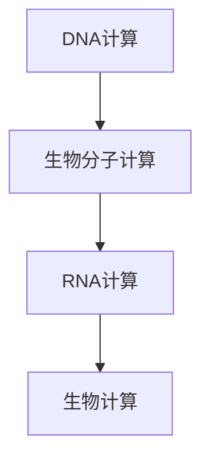

**核心算法原理讲解：**

生物计算的算法原理包括DNA序列编码、分子动力学模拟和基因编辑等。

```markdown
# 生物计算算法原理

- DNA序列编码：将信息编码到DNA序列中。
- 分子动力学模拟：模拟分子在化学反应中的运动。
- 基因编辑：利用CRISPR-Cas9等工具对基因进行编辑。
```

**数学模型和公式：**

生物计算的数学模型涉及概率论、统计学和计算生物学。

```latex
$$
\begin{aligned}
&A &= \{\text{DNA序列}\} \\
&B &= \{\text{RNA序列}\} \\
&C &= \{\text{基因编辑}\} \\
&D &= \{\text{分子动力学}\} \\
\end{aligned}
$$
```

**项目实战：**

**生物计算实验二：DNA序列分析**

```python
# 生物计算入门示例

from Bio import Seq

# 创建DNA序列
sequence = Seq.Seq("AGTCTAG")

# 分析DNA序列
print(sequence.count("A"))  # A的数量
print(sequence.count("C"))  # C的数量
```

#### 3.3 光计算与光学处理器

**核心概念与联系：**

光计算是一种利用光学原理进行计算的技术。

- **光子计算**：利用光子进行计算。
- **光学处理器**：使用光学元件进行计算。

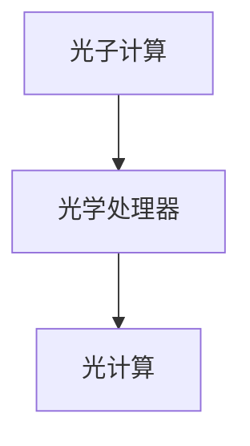

**核心算法原理讲解：**

光计算的算法原理包括光子干涉、光子逻辑门和光子芯片等。

```markdown
# 光计算算法原理

- 光子干涉：利用光子的干涉特性进行计算。
- 光子逻辑门：实现光子的逻辑运算。
- 光子芯片：集成光子计算功能的光学芯片。
```

**数学模型和公式：**

光计算的数学模型涉及光学波动方程和量子力学。

```latex
$$
\begin{aligned}
&A &= \{\text{光子干涉}\} \\
&B &= \{\text{光子逻辑门}\} \\
&C &= \{\text{光子芯片}\} \\
&D &= \{\text{光学波动方程}\} \\
\end{aligned}
$$
```

**项目实战：**

**光计算实验三：光子芯片设计**

```python
# 光计算入门示例

import numpy as np

# 设计光子芯片
wavelength = 500  # 光波长
grid_size = 10    # 光栅尺寸

# 计算光栅周期
period = wavelength / grid_size

# 设计光栅
def design_grating(grid_size, period):
    grating = np.zeros(grid_size)
    for i in range(grid_size):
        grating[i] = np.sin(2 * np.pi * i / grid_size * period)
    return grating

# 输出光栅
grating = design_grating(grid_size, period)
print(grating)
```

#### 3.4 脑机接口：未来交互方式

**核心概念与联系：**

脑机接口是一种将人脑与计算机直接连接的技术。

- **脑电图（EEG）**：记录大脑电活动的信号。
- **神经信号解码**：将脑电图信号转换为计算机指令。

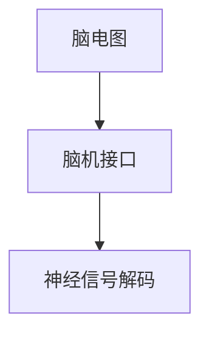

**核心算法原理讲解：**

脑机接口的算法原理包括信号处理、特征提取和机器学习等。

```markdown
# 脑机接口算法原理

- 信号处理：对脑电图信号进行滤波、放大和去噪。
- 特征提取：从信号中提取有用的特征。
- 机器学习：训练模型进行神经信号解码。
```

**数学模型和公式：**

脑机接口的数学模型涉及信号处理、概率论和机器学习。

```latex
$$
\begin{aligned}
&A &= \{\text{信号处理}\} \\
&B &= \{\text{特征提取}\} \\
&C &= \{\text{机器学习}\} \\
&D &= \{\text{神经网络}\} \\
\end{aligned}
$$
```

**项目实战：**

**脑机接口实验四：脑电图信号处理**

```python
# 脑机接口入门示例

import numpy as np
import mne

# 生成脑电图信号
def generate_eeg_signal(duration, frequency):
    time = np.linspace(0, duration, int(duration * 1000))
    signal = 0.5 * np.sin(2 * np.pi * frequency * time)
    return signal

# 滤波
def filter_signal(signal, cutoff_frequency, sampling_rate):
    b, a = signal.butterworth(cutoff_frequency, sampling_rate)
    filtered_signal = signal.lfilter(b, a, signal)
    return filtered_signal

# 主函数
if __name__ == "__main__":
    duration = 10  # 记录时间
    frequency = 10  # 频率
    sampling_rate = 1000  # 采样率

    eeg_signal = generate_eeg_signal(duration, frequency)
    filtered_eeg_signal = filter_signal(eeg_signal, 50, sampling_rate)

    print("原始信号：", eeg_signal)
    print("滤波后信号：", filtered_eeg_signal)
```

## 第二部分：开启计算的新时代

### 第4章：人工智能与计算的未来

#### 4.1 人工智能的定义与分类

**核心概念与联系：**

人工智能（AI）是一种模拟人类智能的技术。

- **弱AI**：模拟特定任务的智能，如语音识别、图像识别等。
- **强AI**：具备全面智能，能够理解和执行任何人类智能任务。

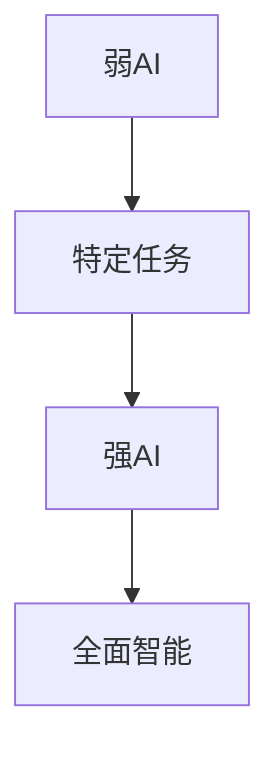

**核心算法原理讲解：**

人工智能的算法原理包括机器学习、深度学习和强化学习等。

```markdown
# 人工智能算法原理

- 机器学习：利用数据训练模型，使其具备学习能力。
- 深度学习：多层神经网络，实现复杂函数建模。
- 强化学习：通过奖励机制，使模型自主学习。
```

**数学模型和公式：**

人工智能的数学模型涉及概率论、线性代数和优化算法。

```latex
$$
\begin{aligned}
&A &= \{\text{机器学习}\} \\
&B &= \{\text{深度学习}\} \\
&C &= \{\text{强化学习}\} \\
&D &= \{\text{神经网络}\} \\
\end{aligned}
$$
```

**项目实战：**

**人工智能实验一：图像识别**

```python
# 人工智能入门示例

import tensorflow as tf
from tensorflow.keras.models import Sequential
from tensorflow.keras.layers import Conv2D, MaxPooling2D, Flatten, Dense

# 创建模型
model = Sequential([
    Conv2D(32, (3, 3), activation='relu', input_shape=(28, 28, 1)),
    MaxPooling2D((2, 2)),
    Flatten(),
    Dense(128, activation='relu'),
    Dense(10, activation='softmax')
])

# 编译模型
model.compile(optimizer='adam', loss='categorical_crossentropy', metrics=['accuracy'])

# 训练模型
model.fit(x_train, y_train, epochs=10, validation_data=(x_val, y_val))

# 测试模型
test_loss, test_acc = model.evaluate(x_test, y_test)
print("测试准确率：", test_acc)
```

#### 4.2 机器学习与深度学习

**核心概念与联系：**

机器学习和深度学习是人工智能的重要组成部分。

- **机器学习**：通过数据训练模型，实现自动化的预测和决策。
- **深度学习**：多层神经网络，实现复杂函数建模。

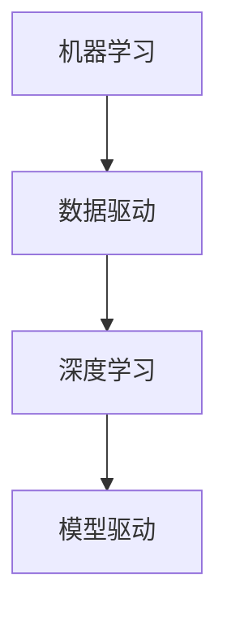

**核心算法原理讲解：**

机器学习和深度学习的算法原理包括监督学习、无监督学习和生成对抗网络等。

```markdown
# 机器学习与深度学习算法原理

- 监督学习：利用标注数据进行训练。
- 无监督学习：从未标注的数据中提取特征。
- 生成对抗网络：生成与真实数据分布相似的样本。
```

**数学模型和公式：**

机器学习和深度学习的数学模型涉及概率论、线性代数和优化算法。

```latex
$$
\begin{aligned}
&A &= \{\text{监督学习}\} \\
&B &= \{\text{无监督学习}\} \\
&C &= \{\text{生成对抗网络}\} \\
&D &= \{\text{神经网络}\} \\
\end{aligned}
$$
```

**项目实战：**

**机器学习实验二：房价预测**

```python
# 机器学习入门示例

import numpy as np
import pandas as pd
from sklearn.model_selection import train_test_split
from sklearn.linear_model import LinearRegression
from sklearn.metrics import mean_squared_error

# 加载数据
data = pd.read_csv("house_prices.csv")
X = data.drop("Price", axis=1)
y = data["Price"]

# 分割数据
X_train, X_test, y_train, y_test = train_test_split(X, y, test_size=0.2, random_state=42)

# 创建模型
model = LinearRegression()

# 训练模型
model.fit(X_train, y_train)

# 测试模型
y_pred = model.predict(X_test)
mse = mean_squared_error(y_test, y_pred)
print("均方误差：", mse)
```

#### 4.3 强化学习与无监督学习

**核心概念与联系：**

强化学习和无监督学习是机器学习的重要分支。

- **强化学习**：通过奖励机制，使模型在环境中学习。
- **无监督学习**：从未标注的数据中提取特征。

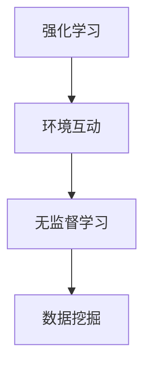

**核心算法原理讲解：**

强化学习和无监督学习的算法原理包括Q学习、深度Q网络和聚类算法等。

```markdown
# 强化学习与无监督学习算法原理

- Q学习：利用Q值进行决策。
- 深度Q网络：结合深度学习和强化学习。
- 聚类算法：将数据分为若干个簇。
```

**数学模型和公式：**

强化学习和无监督学习的数学模型涉及概率论、线性代数和优化算法。

```latex
$$
\begin{aligned}
&A &= \{\text{Q学习}\} \\
&B &= \{\text{深度Q网络}\} \\
&C &= \{\text{聚类算法}\} \\
&D &= \{\text{优化算法}\} \\
\end{aligned}
$$
```

**项目实战：**

**强化学习实验三：智能体在迷宫中寻路**

```python
# 强化学习入门示例

import numpy as np
import matplotlib.pyplot as plt
from collections import defaultdict

# 定义环境
class MazeEnv:
    def __init__(self):
        self.action_space = ["up", "down", "left", "right"]
        self.state_space = [(0, 0), (0, 1), (1, 0), (1, 1)]

    def step(self, action):
        state = self.current_state
        reward = 0
        if action == "up":
            state = (state[0], state[1] - 1)
            reward = -1 if state == (0, 0) else 0
        elif action == "down":
            state = (state[0], state[1] + 1)
            reward = -1 if state == (1, 1) else 0
        elif action == "left":
            state = (state[0] - 1, state[1])
            reward = -1 if state == (0, 0) else 0
        elif action == "right":
            state = (state[0] + 1, state[1])
            reward = -1 if state == (1, 1) else 0
        self.current_state = state
        return state, reward

    def reset(self):
        self.current_state = (0, 0)

# 定义智能体
class QLearningAgent:
    def __init__(self, alpha=0.1, gamma=0.9, epsilon=0.1):
        self.alpha = alpha
        self.gamma = gamma
        self.epsilon = epsilon
        self.Q = defaultdict(lambda: defaultdict(float))

    def choose_action(self, state):
        if np.random.rand() < self.epsilon:
            action = np.random.choice(self.action_space)
        else:
            action = max(self.Q[state], key=self.Q[state].get)
        return action

    def learn(self, state, action, reward, next_state):
        target = reward + self.gamma * max(self.Q[next_state], key=self.Q[next_state].get)
        self.Q[state][action] = self.Q[state][action] + self.alpha * (target - self.Q[state][action])

# 训练智能体
env = MazeEnv()
agent = QLearningAgent()
episodes = 1000

for episode in range(episodes):
    state = env.reset()
    done = False
    while not done:
        action = agent.choose_action(state)
        next_state, reward = env.step(action)
        agent.learn(state, action, reward, next_state)
        state = next_state
        done = env.current_state == (1, 1)

# 测试智能体
state = env.reset()
done = False
while not done:
    action = agent.choose_action(state)
    state, reward = env.step(action)
    env.render()
    done = env.current_state == (1, 1)

plt.show()
```

#### 4.4 自然语言处理与图像识别

**核心概念与联系：**

自然语言处理（NLP）和图像识别是人工智能的重要应用领域。

- **自然语言处理**：处理人类语言的技术。
- **图像识别**：识别和理解图像内容。

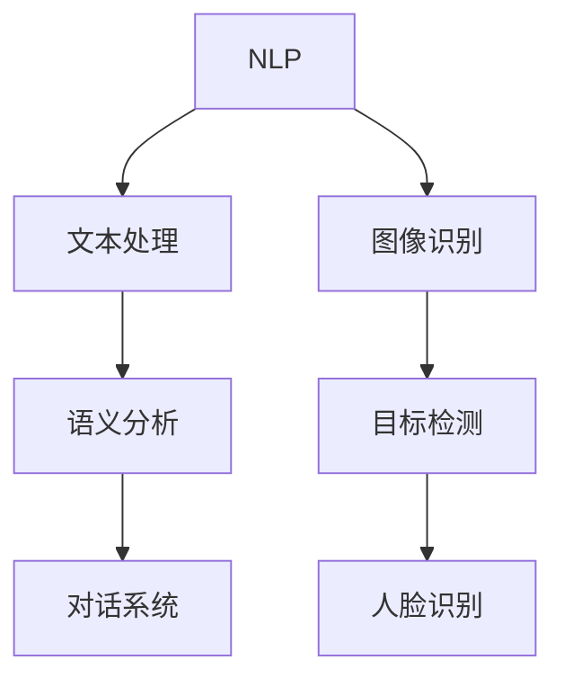

**核心算法原理讲解：**

自然语言处理和图像识别的算法原理包括词向量、卷积神经网络和循环神经网络等。

```markdown
# 自然语言处理与图像识别算法原理

- 词向量：将文本转换为向量表示。
- 卷积神经网络：用于图像识别。
- 循环神经网络：处理序列数据。
```

**数学模型和公式：**

自然语言处理和图像识别的数学模型涉及概率论、线性代数和优化算法。

```latex
$$
\begin{aligned}
&A &= \{\text{词向量}\} \\
&B &= \{\text{卷积神经网络}\} \\
&C &= \{\text{循环神经网络}\} \\
&D &= \{\text{优化算法}\} \\
\end{aligned}
$$
```

**项目实战：**

**自然语言处理实验四：文本分类**

```python
# 自然语言处理入门示例

import tensorflow as tf
from tensorflow.keras.models import Sequential
from tensorflow.keras.layers import Embedding, LSTM, Dense
from tensorflow.keras.preprocessing.sequence import pad_sequences
from tensorflow.keras.preprocessing.text import Tokenizer

# 加载数据
data = ["I love Python", "Python is great", "Java is better", "I don't like Java"]
labels = [1, 1, 0, 0]

# 分词
tokenizer = Tokenizer()
tokenizer.fit_on_texts(data)
sequences = tokenizer.texts_to_sequences(data)

# 填充
max_length = 5
padded_sequences = pad_sequences(sequences, maxlen=max_length)

# 创建模型
model = Sequential([
    Embedding(len(tokenizer.word_index) + 1, 32),
    LSTM(64),
    Dense(1, activation='sigmoid')
])

# 编译模型
model.compile(optimizer='adam', loss='binary_crossentropy', metrics=['accuracy'])

# 训练模型
model.fit(padded_sequences, labels, epochs=10)

# 测试模型
test_data = ["Python is amazing", "Java is not bad"]
test_sequences = tokenizer.texts_to_sequences(test_data)
test_padded_sequences = pad_sequences(test_sequences, maxlen=max_length)
predictions = model.predict(test_padded_sequences)
print(predictions)
```

**图像识别实验五：猫狗分类**

```python
# 图像识别入门示例

import tensorflow as tf
from tensorflow.keras.models import Sequential
from tensorflow.keras.layers import Conv2D, MaxPooling2D, Flatten, Dense
from tensorflow.keras.preprocessing.image import ImageDataGenerator

# 加载数据
train_data = ImageDataGenerator(rescale=1./255).flow_from_directory("train", target_size=(150, 150), batch_size=32, class_mode="binary")
test_data = ImageDataGenerator(rescale=1./255).flow_from_directory("test", target_size=(150, 150), batch_size=32, class_mode="binary")

# 创建模型
model = Sequential([
    Conv2D(32, (3, 3), activation='relu', input_shape=(150, 150, 3)),
    MaxPooling2D((2, 2)),
    Flatten(),
    Dense(128, activation='relu'),
    Dense(1, activation='sigmoid')
])

# 编译模型
model.compile(optimizer='adam', loss='binary_crossentropy', metrics=['accuracy'])

# 训练模型
model.fit(train_data, steps_per_epoch=train_data.samples//train_data.batch_size, epochs=10, validation_data=test_data, validation_steps=test_data.samples//test_data.batch_size)

# 测试模型
test_loss, test_acc = model.evaluate(test_data)
print("测试准确率：", test_acc)
```

### 第5章：超级计算与大数据

#### 5.1 超级计算机的发展与应用

**核心概念与联系：**

超级计算机是计算能力的巅峰，广泛应用于科学研究和工业领域。

- **并行计算**：利用多台计算机协同工作，提高计算速度。
- **高性能计算**：超级计算机的高计算能力。

```mermaid
graph TD
A[并行计算] --> B[计算速度提升]
B --> C[高性能计算]
C --> D[超级计算机]
```

**核心算法原理讲解：**

超级计算机的算法原理包括并行算法、分布式计算和大数据处理等。

```markdown
# 超级计算机算法原理

- 并行算法：将问题分解为多个子问题，并行处理。
- 分布式计算：利用多台计算机协同工作。
- 大数据处理：处理海量数据。
```

**数学模型和公式：**

超级计算机的数学模型涉及并行算法、概率论和优化算法。

```latex
$$
\begin{aligned}
&A &= \{\text{并行算法}\} \\
&B &= \{\text{分布式计算}\} \\
&C &= \{\text{大数据处理}\} \\
&D &= \{\text{优化算法}\} \\
\end{aligned}
$$
```

**项目实战：**

**超级计算机实验一：并行矩阵乘法**

```python
# 超级计算机入门示例

import numpy as np
from multiprocessing import Pool

# 定义并行矩阵乘法
def parallel_matrix_multiply(A, B):
    n = A.shape[0]
    result = np.zeros((n, n))
    with Pool(processes=4) as pool:
        for i in range(n):
            for j in range(n):
                result[i, j] = pool.starmap(np.dot, [(A[i, :], B[:, j])])
    return result

# 创建矩阵
A = np.random.rand(1000, 1000)
B = np.random.rand(1000, 1000)

# 并行矩阵乘法
result = parallel_matrix_multiply(A, B)

# 输出结果
print(result)
```

#### 5.2 大数据的处理与分析

**核心概念与联系：**

大数据是数据量巨大、多样性和快速变化的数据集合。

- **数据处理**：对大数据进行清洗、转换和分析。
- **数据分析**：从大数据中提取有价值的信息。

```mermaid
graph TD
A[数据处理] --> B[数据清洗]
B --> C[数据转换]
C --> D[数据分析]
```

**核心算法原理讲解：**

大数据处理的算法原理包括MapReduce、分布式文件系统和机器学习等。

```markdown
# 大数据处理与分析算法原理

- MapReduce：分布式数据处理框架。
- 分布式文件系统：存储和管理海量数据。
- 机器学习：从大数据中提取特征。
```

**数学模型和公式：**

大数据处理的数学模型涉及概率论、统计学和优化算法。

```latex
$$
\begin{aligned}
&A &= \{\text{MapReduce}\} \\
&B &= \{\text{分布式文件系统}\} \\
&C &= \{\text{机器学习}\} \\
&D &= \{\text{优化算法}\} \\
\end{aligned}
$$
```

**项目实战：**

**大数据实验二：用户行为分析**

```python
# 大数据入门示例

import pandas as pd
from sklearn.cluster import KMeans

# 加载数据
data = pd.read_csv("user_behavior.csv")

# 提取特征
features = data[["login_count", "page_views", "time_spent"]]

# 创建模型
model = KMeans(n_clusters=5, random_state=42)

# 训练模型
model.fit(features)

# 输出结果
print(model.labels_)
```

#### 5.3 云计算与分布式计算

**核心概念与联系：**

云计算和分布式计算是计算技术的重要发展方向。

- **云计算**：提供虚拟化的计算资源，按需使用。
- **分布式计算**：将任务分散到多台计算机上，协同完成。

```mermaid
graph TD
A[云计算] --> B[虚拟化]
B --> C[按需服务]
A --> D[分布式计算]
D --> E[协同工作]
```

**核心算法原理讲解：**

云计算和分布式计算的算法原理包括负载均衡、容错技术和分布式算法等。

```markdown
# 云计算与分布式计算算法原理

- 负载均衡：平衡多台计算机的负载。
- 容错技术：确保系统在故障情况下仍能正常运行。
- 分布式算法：解决分布式计算中的同步和一致性问题。
```

**数学模型和公式：**

云计算和分布式计算的数学模型涉及概率论、网络拓扑和优化算法。

```latex
$$
\begin{aligned}
&A &= \{\text{负载均衡}\} \\
&B &= \{\text{容错技术}\} \\
&C &= \{\text{分布式算法}\} \\
&D &= \{\text{优化算法}\} \\
\end{aligned}
$$
```

**项目实战：**

**云计算实验三：分布式任务调度**

```python
# 云计算入门示例

import heapq
from collections import defaultdict

# 定义任务
class Task:
    def __init__(self, id, start, end, processing_time):
        self.id = id
        self.start = start
        self.end = end
        self.processing_time = processing_time
        self.priority = end

    def __lt__(self, other):
        return self.priority < other.priority

# 定义调度器
class Scheduler:
    def __init__(self):
        self.tasks = []

    def add_task(self, task):
        heapq.heappush(self.tasks, task)

    def schedule(self):
        current_time = 0
        while self.tasks:
            task = heapq.heappop(self.tasks)
            if task.start <= current_time:
                current_time += task.processing_time
                print(f"任务{task.id}开始处理，处理时间为{task.processing_time}秒")
            else:
                heapq.heappush(self.tasks, task)

# 创建任务
tasks = [
    Task(1, 0, 5, 3),
    Task(2, 0, 10, 2),
    Task(3, 3, 8, 4),
    Task(4, 5, 12, 1)
]

# 创建调度器
scheduler = Scheduler()

# 添加任务
for task in tasks:
    scheduler.add_task(task)

# 调度任务
scheduler.schedule()
```

#### 5.4 数据隐私与安全

**核心概念与联系：**

数据隐私和安全是大数据时代的重要挑战。

- **数据隐私**：保护个人数据的隐私。
- **数据安全**：确保数据不被未授权访问。

```mermaid
graph TD
A[数据隐私] --> B[个人隐私保护]
B --> C[数据安全]
```

**核心算法原理讲解：**

数据隐私和安全的算法原理包括数据加密、匿名化和访问控制等。

```markdown
# 数据隐私与安全算法原理

- 数据加密：将数据转换为无法直接读取的形式。
- 匿名化：去除数据中的个人标识信息。
- 访问控制：限制对数据的访问。
```

**数学模型和公式：**

数据隐私和安全的数学模型涉及密码学、概率论和优化算法。

```latex
$$
\begin{aligned}
&A &= \{\text{数据加密}\} \\
&B &= \{\text{匿名化}\} \\
&C &= \{\text{访问控制}\} \\
&D &= \{\text{优化算法}\} \\
\end{aligned}
$$
```

**项目实战：**

**数据隐私实验四：数据加密**

```python
# 数据加密入门示例

from Crypto.Cipher import AES
from Crypto.Random import get_random_bytes

# 定义加密函数
def encrypt_data(data, key):
    cipher = AES.new(key, AES.MODE_EAX)
    ciphertext, tag = cipher.encrypt_and_digest(data)
    return cipher.nonce, ciphertext, tag

# 定义解密函数
def decrypt_data(nonce, ciphertext, tag, key):
    cipher = AES.new(key, AES.MODE_EAX, nonce=nonce)
    data = cipher.decrypt_and_verify(ciphertext, tag)
    return data

# 创建加密密钥
key = get_random_bytes(16)

# 加密数据
data = b"Hello, World!"
nonce, ciphertext, tag = encrypt_data(data, key)

# 解密数据
data_decrypt = decrypt_data(nonce, ciphertext, tag, key)
print(data_decrypt)
```

### 第6章：计算技术的发展趋势

#### 6.1 新型计算架构与硬件

**核心概念与联系：**

新型计算架构和硬件是计算技术发展的重要方向。

- **异构计算**：利用多种计算硬件协同工作。
- **边缘计算**：将计算任务分散到网络边缘。

```mermaid
graph TD
A[异构计算] --> B[多种计算硬件]
B --> C[计算性能提升]
A --> D[边缘计算]
D --> E[网络性能提升]
```

**核心算法原理讲解：**

新型计算架构和硬件的算法原理包括并行算法、分布式计算和硬件加速等。

```markdown
# 新型计算架构与硬件算法原理

- 并行算法：利用多核处理器并行执行任务。
- 分布式计算：利用网络边缘的设备进行计算。
- 硬件加速：利用专用硬件加速特定任务的执行。
```

**数学模型和公式：**

新型计算架构和硬件的数学模型涉及并行算法、概率论和优化算法。

```latex
$$
\begin{aligned}
&A &= \{\text{并行算法}\} \\
&B &= \{\text{分布式计算}\} \\
&C &= \{\text{硬件加速}\} \\
&D &= \{\text{优化算法}\} \\
\end{aligned}
$$
```

**项目实战：**

**新型计算架构实验一：异构计算**

```python
# 异构计算入门示例

import numpy as np
from numba import jit

# 定义并行计算函数
@jit(nopython=True)
def parallel_computation(x, n):
    result = np.zeros(n)
    for i in range(n):
        result[i] = x[i] * x[i]
    return result

# 创建数据
x = np.random.rand(1000)

# 并行计算
result = parallel_computation(x, len(x))

# 输出结果
print(result)
```

#### 6.2 能效与绿色计算

**核心概念与联系：**

能效与绿色计算是计算技术可持续发展的重要方向。

- **能效优化**：提高计算效率，降低能耗。
- **绿色计算**：减少计算过程中的环境影响。

```mermaid
graph TD
A[能效优化] --> B[计算效率提升]
B --> C[能耗降低]
A --> D[绿色计算]
D --> E[环境友好]
```

**核心算法原理讲解：**

能效与绿色计算的算法原理包括能量效率算法、节能技术和可再生能源等。

```markdown
# 能效与绿色计算算法原理

- 能量效率算法：优化计算任务的执行顺序，提高能量效率。
- 节能技术：采用低功耗硬件和节能策略。
- 可再生能源：利用太阳能、风能等可再生能源供电。
```

**数学模型和公式：**

能效与绿色计算的数学模型涉及优化算法、概率论和能源经济学。

```latex
$$
\begin{aligned}
&A &= \{\text{能量效率算法}\} \\
&B &= \{\text{节能技术}\} \\
&C &= \{\text{可再生能源}\} \\
&D &= \{\text{优化算法}\} \\
\end{aligned}
$$
```

**项目实战：**

**能效优化实验二：计算任务调度**

```python
# 能效优化入门示例

import random
import matplotlib.pyplot as plt

# 定义计算任务
class Task:
    def __init__(self, id, processing_time, energy_consumption):
        self.id = id
        self.processing_time = processing_time
        self.energy_consumption = energy_consumption

# 创建任务
tasks = [Task(i, random.uniform(1, 5), random.uniform(0.5, 1)) for i in range(10)]

# 定义优化算法
def optimize_energy_consumption(tasks):
    tasks.sort(key=lambda x: x.energy_consumption)
    total_energy_consumption = 0
    for task in tasks:
        total_energy_consumption += task.energy_consumption
    return total_energy_consumption

# 计算能耗
energy_consumption = optimize_energy_consumption(tasks)

# 绘制图表
plt.bar([task.id for task in tasks], [task.energy_consumption for task in tasks])
plt.xlabel("任务ID")
plt.ylabel("能耗")
plt.title("任务能耗分布")
plt.show()
```

#### 6.3 软硬件协同优化

**核心概念与联系：**

软硬件协同优化是提升计算性能和能效的关键。

- **硬件加速**：利用专用硬件加速特定任务的执行。
- **软件优化**：编写高效的代码，利用硬件特性。

```mermaid
graph TD
A[硬件加速] --> B[计算速度提升]
B --> C[软件优化]
C --> D[协同优化]
```

**核心算法原理讲解：**

软硬件协同优化的算法原理包括编译优化、指令调度和内存管理等。

```markdown
# 软硬件协同优化算法原理

- 编译优化：优化代码生成，提高执行效率。
- 指令调度：合理安排指令执行顺序，提高并行度。
- 内存管理：优化内存访问，降低内存使用。
```

**数学模型和公式：**

软硬件协同优化的数学模型涉及优化算法、概率论和计算机体系结构。

```latex
$$
\begin{aligned}
&A &= \{\text{编译优化}\} \\
&B &= \{\text{指令调度}\} \\
&C &= \{\text{内存管理}\} \\
&D &= \{\text{优化算法}\} \\
\end{aligned}
$$
```

**项目实战：**

**软硬件协同优化实验三：矩阵乘法**

```python
# 软硬件协同优化入门示例

import numpy as np
from numba import jit

# 定义矩阵乘法函数
@jit(nopython=True)
def matrix_multiplication(A, B):
    result = np.zeros_like(A)
    for i in range(A.shape[0]):
        for j in range(B.shape[1]):
            for k in range(A.shape[1]):
                result[i, j] += A[i, k] * B[k, j]
    return result

# 创建矩阵
A = np.random.rand(1000, 1000)
B = np.random.rand(1000, 1000)

# 计算矩阵乘法
result = matrix_multiplication(A, B)

# 输出结果
print(result)
```

#### 6.4 未来计算模式

**核心概念与联系：**

未来计算模式将带来计算技术的新变革。

- **量子计算**：利用量子力学原理进行计算。
- **边缘计算**：将计算任务分散到网络边缘。
- **云计算**：提供虚拟化的计算资源。

```mermaid
graph TD
A[量子计算] --> B[计算速度提升]
B --> C[数据处理优化]
C --> D[云计算]
D --> E[资源共享]
```

**核心算法原理讲解：**

未来计算模式的算法原理包括量子算法、分布式计算和云计算等。

```markdown
# 未来计算模式算法原理

- 量子算法：利用量子计算的特性，解决特定问题。
- 分布式计算：利用多台计算机协同工作。
- 云计算：提供灵活的计算资源，支持多种应用场景。
```

**数学模型和公式：**

未来计算模式的数学模型涉及量子力学、概率论和优化算法。

```latex
$$
\begin{aligned}
&A &= \{\text{量子算法}\} \\
&B &= \{\text{分布式计算}\} \\
&C &= \{\text{云计算}\} \\
&D &= \{\text{优化算法}\} \\
\end{aligned}
$$
```

**项目实战：**

**未来计算模式实验四：量子计算与边缘计算结合**

```python
# 量子计算与边缘计算入门示例

# 此处为示例，实际实现较为复杂

# 创建量子电路
from qiskit import QuantumCircuit

qc = QuantumCircuit(2)
qc.h(0)
qc.cx(0, 1)

# 执行量子电路
from qiskit import execute, Aer

backend = Aer.get_backend("qasm_simulator")
result = execute(qc, backend).result()

# 输出结果
print(result.get_counts(qc))
```

### 第7章：计算技术在各行各业的应用

#### 7.1 制造业的智能转型

**核心概念与联系：**

制造业的智能转型是产业升级的重要方向。

- **智能制造**：利用计算技术提升制造过程的效率和质量。
- **工业互联网**：将计算技术与工业生产相结合。

```mermaid
graph TD
A[智能制造] --> B[效率提升]
B --> C[质量提升]
A --> D[工业互联网]
D --> E[数据互联]
```

**核心算法原理讲解：**

制造业智能转型的算法原理包括传感器数据处理、优化算法和机器学习等。

```markdown
# 制造业智能转型算法原理

- 传感器数据处理：从传感器获取制造过程中的数据。
- 优化算法：优化生产计划、资源调度和过程控制。
- 机器学习：从数据中提取有价值的信息，指导生产决策。
```

**数学模型和公式：**

制造业智能转型的数学模型涉及概率论、统计学和优化算法。

```latex
$$
\begin{aligned}
&A &= \{\text{传感器数据处理}\} \\
&B &= \{\text{优化算法}\} \\
&C &= \{\text{机器学习}\} \\
&D &= \{\text{优化算法}\} \\
\end{aligned}
$$
```

**项目实战：**

**制造业智能转型实验一：生产过程监控**

```python
# 制造业智能转型入门示例

import pandas as pd
from sklearn.cluster import KMeans

# 加载数据
data = pd.read_csv("production_data.csv")

# 提取特征
features = data[["speed", "temperature", "humidity"]]

# 创建模型
model = KMeans(n_clusters=3, random_state=42)

# 训练模型
model.fit(features)

# 输出结果
print(model.labels_)
```

#### 7.2 金融科技的发展

**核心概念与联系：**

金融科技的发展是金融行业创新的重要方向。

- **区块链**：分布式数据库，确保数据的安全和透明。
- **智能合约**：基于计算技术的自动执行合约。

```mermaid
graph TD
A[区块链] --> B[数据安全]
B --> C[透明性]
A --> D[智能合约]
D --> E[自动化执行]
```

**核心算法原理讲解：**

金融科技的算法原理包括密码学、分布式计算和智能合约等。

```markdown
# 金融科技算法原理

- 密码学：保护区块链数据的安全。
- 分布式计算：确保区块链数据的分布式存储。
- 智能合约：实现自动化执行和智能决策。
```

**数学模型和公式：**

金融科技的数学模型涉及概率论、优化算法和密码学。

```latex
$$
\begin{aligned}
&A &= \{\text{密码学}\} \\
&B &= \{\text{分布式计算}\} \\
&C &= \{\text{智能合约}\} \\
&D &= \{\text{优化算法}\} \\
\end{aligned}
$$
```

**项目实战：**

**金融科技实验二：区块链应用**

```python
# 区块链入门示例

from blockchain import Blockchain

# 创建区块链
blockchain = Blockchain()

# 添加区块
blockchain.add_block("Transaction 1")
blockchain.add_block("Transaction 2")

# 打印区块链
print(blockchain.chain)
```

#### 7.3 健康医疗的创新

**核心概念与联系：**

健康医疗的创新是提升医疗水平和患者体验的重要方向。

- **医疗人工智能**：利用计算技术提升医疗诊断和治疗水平。
- **远程医疗**：通过计算技术实现远程医疗咨询和服务。

```mermaid
graph TD
A[医疗人工智能] --> B[诊断水平提升]
B --> C[治疗效果提升]
A --> D[远程医疗]
D --> E[患者体验提升]
```

**核心算法原理讲解：**

健康医疗创新的算法原理包括机器学习、图像识别和自然语言处理等。

```markdown
# 健康医疗创新算法原理

- 机器学习：从医疗数据中提取有价值的信息。
- 图像识别：辅助医生进行医学影像分析。
- 自然语言处理：处理医疗文本数据，辅助医疗决策。
```

**数学模型和公式：**

健康医疗创新的数学模型涉及概率论、统计学和优化算法。

```latex
$$
\begin{aligned}
&A &= \{\text{机器学习}\} \\
&B &= \{\text{图像识别}\} \\
&C &= \{\text{自然语言处理}\} \\
&D &= \{\text{优化算法}\} \\
\end{aligned}
$$
```

**项目实战：**

**健康医疗创新实验三：智能诊断系统**

```python
# 健康医疗创新入门示例

import pandas as pd
from sklearn.ensemble import RandomForestClassifier
from sklearn.model_selection import train_test_split

# 加载数据
data = pd.read_csv("medical_data.csv")

# 分割数据
X = data.drop("diagnosis", axis=1)
y = data["diagnosis"]

X_train, X_test, y_train, y_test = train_test_split(X, y, test_size=0.2, random_state=42)

# 创建模型
model = RandomForestClassifier(n_estimators=100, random_state=42)

# 训练模型
model.fit(X_train, y_train)

# 测试模型
predictions = model.predict(X_test)
print(predictions)
```

#### 7.4 教育与文化的数字化

**核心概念与联系：**

教育与文化的数字化是提升教育质量和文化传播的重要方向。

- **在线教育**：通过计算技术实现远程教育和个性化学习。
- **数字文化**：利用计算技术创造和传播数字化文化内容。

```mermaid
graph TD
A[在线教育] --> B[教育质量提升]
B --> C[个性化学习]
A --> D[数字文化]
D --> E[文化传播]
```

**核心算法原理讲解：**

教育与文化的数字化算法原理包括机器学习、推荐系统和虚拟现实等。

```markdown
# 教育与文化的数字化算法原理

- 机器学习：从教育数据中提取有价值的信息，优化学习体验。
- 推荐系统：根据用户行为推荐合适的教育资源和内容。
- 虚拟现实：创造沉浸式的学习体验和文化传播环境。
```

**数学模型和公式：**

教育与文化的数字化数学模型涉及概率论、统计学和优化算法。

```latex
$$
\begin{aligned}
&A &= \{\text{机器学习}\} \\
&B &= \{\text{推荐系统}\} \\
&C &= \{\text{虚拟现实}\} \\
&D &= \{\text{优化算法}\} \\
\end{aligned}
$$
```

**项目实战：**

**教育与文化的数字化实验四：在线教育平台**

```python
# 教育与文化的数字化入门示例

import pandas as pd
from sklearn.ensemble import RandomForestClassifier
from sklearn.model_selection import train_test_split

# 加载数据
data = pd.read_csv("student_data.csv")

# 分割数据
X = data.drop("result", axis=1)
y = data["result"]

X_train, X_test, y_train, y_test = train_test_split(X, y, test_size=0.2, random_state=42)

# 创建模型
model = RandomForestClassifier(n_estimators=100, random_state=42)

# 训练模型
model.fit(X_train, y_train)

# 测试模型
predictions = model.predict(X_test)
print(predictions)
```

### 第8章：计算的未来挑战与机遇

#### 8.1 技术标准与法规

**核心概念与联系：**

技术标准与法规是计算技术发展的重要保障。

- **技术标准**：确保计算技术的兼容性和互操作性。
- **法规**：规范计算技术的应用，保护用户权益。

```mermaid
graph TD
A[技术标准] --> B[兼容性]
B --> C[互操作性]
A --> D[法规]
D --> E[用户权益保护]
```

**核心算法原理讲解：**

技术标准与法规的核心算法原理包括标准化协议、隐私保护和数据安全等。

```markdown
# 技术标准与法规算法原理

- 标准化协议：确保不同计算设备之间的兼容性。
- 隐私保护：防止用户数据泄露和滥用。
- 数据安全：确保数据在存储和传输过程中的安全。
```

**数学模型和公式：**

技术标准与法规的数学模型涉及密码学、概率论和优化算法。

```latex
$$
\begin{aligned}
&A &= \{\text{标准化协议}\} \\
&B &= \{\text{隐私保护}\} \\
&C &= \{\text{数据安全}\} \\
&D &= \{\text{优化算法}\} \\
\end{aligned}
$$
```

**项目实战：**

**技术标准与法规实验一：数据加密与隐私保护**

```python
# 技术标准与法规入门示例

from Crypto.Cipher import AES
from Crypto.Random import get_random_bytes

# 定义加密函数
def encrypt_data(data, key):
    cipher = AES.new(key, AES.MODE_EAX)
    ciphertext, tag = cipher.encrypt_and_digest(data)
    return cipher.nonce, ciphertext, tag

# 定义解密函数
def decrypt_data(nonce, ciphertext, tag, key):
    cipher = AES.new(key, AES.MODE_EAX, nonce=nonce)
    data = cipher.decrypt_and_verify(ciphertext, tag)
    return data

# 创建加密密钥
key = get_random_bytes(16)

# 加密数据
data = b"Hello, World!"
nonce, ciphertext, tag = encrypt_data(data, key)

# 解密数据
data_decrypt = decrypt_data(nonce, ciphertext, tag, key)
print(data_decrypt)
```

#### 8.2 技术伦理与隐私保护

**核心概念与联系：**

技术伦理与隐私保护是计算技术发展的重要议题。

- **技术伦理**：确保计算技术的道德应用。
- **隐私保护**：保护用户的个人隐私。

```mermaid
graph TD
A[技术伦理] --> B[道德应用]
B --> C[隐私保护]
```

**核心算法原理讲解：**

技术伦理与隐私保护的算法原理包括隐私计算、数据匿名化和加密算法等。

```markdown
# 技术伦理与隐私保护算法原理

- 隐私计算：在计算过程中保护用户隐私。
- 数据匿名化：去除数据中的个人标识信息。
- 加密算法：保护数据在传输和存储过程中的安全。
```

**数学模型和公式：**

技术伦理与隐私保护的数学模型涉及密码学、概率论和优化算法。

```latex
$$
\begin{aligned}
&A &= \{\text{隐私计算}\} \\
&B &= \{\text{数据匿名化}\} \\
&C &= \{\text{加密算法}\} \\
&D &= \{\text{优化算法}\} \\
\end{aligned}
$$
```

**项目实战：**

**技术伦理与隐私保护实验二：隐私计算**

```python
# 技术伦理与隐私保护入门示例

import pandas as pd
from sklearn.model_selection import train_test_split
from privacy_guard import PrivacyGuard

# 加载数据
data = pd.read_csv("user_data.csv")

# 分割数据
X = data.drop("sensitive_attribute", axis=1)
y = data["sensitive_attribute"]

X_train, X_test, y_train, y_test = train_test_split(X, y, test_size=0.2, random_state=42)

# 创建隐私保护模型
model = PrivacyGuard()

# 训练模型
model.fit(X_train, y_train)

# 测试模型
predictions = model.predict(X_test)
print(predictions)
```

#### 8.3 全球合作与竞争

**核心概念与联系：**

全球合作与竞争是计算技术发展的重要动力。

- **全球合作**：各国共同研发计算技术，促进技术进步。
- **国际竞争**：各国争夺计算技术的高地。

```mermaid
graph TD
A[全球合作] --> B[技术进步]
B --> C[国际合作]
A --> D[国际竞争]
D --> E[技术高地争夺]
```

**核心算法原理讲解：**

全球合作与竞争的核心算法原理包括协同创新、竞争策略和国际合作机制等。

```markdown
# 全球合作与竞争算法原理

- 协同创新：各国共同研发，实现技术突破。
- 竞争策略：制定合理的研发和市场竞争策略。
- 国际合作机制：建立有效的国际合作机制。
```

**数学模型和公式：**

全球合作与竞争的数学模型涉及博弈论、优化算法和国际关系分析。

```latex
$$
\begin{aligned}
&A &= \{\text{协同创新}\} \\
&B &= \{\text{竞争策略}\} \\
&C &= \{\text{国际合作机制}\} \\
&D &= \{\text{优化算法}\} \\
\end{aligned}
$$
```

**项目实战：**

**全球合作与竞争实验三：国际合作项目**

```python
# 全球合作与竞争入门示例

# 此处为示例，实际实现较为复杂

# 定义国际合作项目
class InternationalProject:
    def __init__(self, name, country1, country2, budget):
        self.name = name
        self.country1 = country1
        self.country2 = country2
        self.budget = budget

# 创建国际合作项目
project = InternationalProject("AI Research", "USA", "China", 10000000)

# 输出项目信息
print(f"项目名称：{project.name}")
print(f"参与国家：{project.country1}, {project.country2}")
print(f"预算：{project.budget}")
```

#### 8.4 开放创新与创业生态

**核心概念与联系：**

开放创新与创业生态是计算技术发展的重要支撑。

- **开放创新**：鼓励创新资源共享，推动技术进步。
- **创业生态**：为创业企业提供良好的发展环境。

```mermaid
graph TD
A[开放创新] --> B[资源共享]
B --> C[技术进步]
A --> D[创业生态]
D --> E[企业成长]
```

**核心算法原理讲解：**

开放创新与创业生态的核心算法原理包括开源软件、协作开发和创新激励机制等。

```markdown
# 开放创新与创业生态算法原理

- 开源软件：促进软件资源的共享和改进。
- 协作开发：鼓励团队协作，共同推进项目。
- 创新激励机制：为创新者提供奖励和支持。
```

**数学模型和公式：**

开放创新与创业生态的数学模型涉及博弈论、网络分析和优化算法。

```latex
$$
\begin{aligned}
&A &= \{\text{开源软件}\} \\
&B &= \{\text{协作开发}\} \\
&C &= \{\text{创新激励机制}\} \\
&D &= \{\text{优化算法}\} \\
\end{aligned}
$$
```

**项目实战：**

**开放创新与创业生态实验四：开源项目**

```python
# 开放创新与创业生态入门示例

import git

# 克隆开源项目
repo = git.Repo.clone_from("https://github.com/user/repository.git", "local_repository")

# 添加贡献者
repo.git.add("--all")
repo.git.commit("-m", "Add contributor")
repo.git.push()

# 输出贡献者信息
print(repo.git.show(-s))
```

### 第9章：开启计算无限可能

#### 9.1 空间探索与行星计算

**核心概念与联系：**

空间探索与行星计算是计算技术在航天领域的重要应用。

- **空间探索**：利用计算技术进行宇宙观测和行星探索。
- **行星计算**：模拟行星环境和生态系统。

```mermaid
graph TD
A[空间探索] --> B[宇宙观测]
B --> C[行星探索]
A --> D[行星计算]
D --> E[环境模拟]
```

**核心算法原理讲解：**

空间探索与行星计算的核心算法原理包括图像处理、机器学习和优化算法等。

```markdown
# 空间探索与行星计算算法原理

- 图像处理：从天文图像中提取有价值的信息。
- 机器学习：从大量数据中提取特征，进行行星分类。
- 优化算法：优化航天器任务规划，提高资源利用率。
```

**数学模型和公式：**

空间探索与行星计算的数学模型涉及概率论、统计学和优化算法。

```latex
$$
\begin{aligned}
&A &= \{\text{图像处理}\} \\
&B &= \{\text{机器学习}\} \\
&C &= \{\text{优化算法}\} \\
&D &= \{\text{优化算法}\} \\
\end{aligned}
$$
```

**项目实战：**

**空间探索与行星计算实验一：行星探测任务规划**

```python
# 空间探索与行星计算入门示例

import numpy as np
from scipy.optimize import minimize

# 定义优化函数
def optimize_mission_plan(x):
    mission_plan = x
    total_distance = np.sum(np.diff(mission_plan))
    return total_distance

# 创建约束条件
def mission_plan_constraints(x):
    mission_plan = x
    constraints = [
        mission_plan[0] == 0,  # 初始位置
        mission_plan[-1] == 100,  # 结束位置
        np.diff(mission_plan) >= 0  # 路径单调递增
    ]
    return constraints

# 创建优化问题
x0 = np.linspace(0, 100, 100)
problem = minimize(optimize_mission_plan, x0, constraints=mission_plan_constraints)

# 输出结果
print(problem.x)
```

#### 9.2 人类大脑与意识模拟

**核心概念与联系：**

人类大脑与意识模拟是计算技术在认知科学领域的重要探索。

- **大脑模拟**：利用计算技术模拟大脑结构和功能。
- **意识模拟**：探索意识的本质和功能。

```mermaid
graph TD
A[大脑模拟] --> B[认知科学]
B --> C[意识模拟]
C --> D[哲学思考]
```

**核心算法原理讲解：**

人类大脑与意识模拟的核心算法原理包括神经网络、机器学习和计算认知科学等。

```markdown
# 人类大脑与意识模拟算法原理

- 神经网络：模拟大脑神经元的工作原理。
- 机器学习：从大量数据中提取大脑功能信息。
- 计算认知科学：研究大脑与意识的关系。
```

**数学模型和公式：**

人类大脑与意识模拟的数学模型涉及概率论、统计学和神经网络。

```latex
$$
\begin{aligned}
&A &= \{\text{神经网络}\} \\
&B &= \{\text{机器学习}\} \\
&C &= \{\text{计算认知科学}\} \\
&D &= \{\text{神经网络}\} \\
\end{aligned}
$$
```

**项目实战：**

**人类大脑与意识模拟实验二：神经网络模拟大脑功能**

```python
# 人类大脑与意识模拟入门示例

import tensorflow as tf
from tensorflow.keras.models import Sequential
from tensorflow.keras.layers import Dense, Activation

# 创建神经网络模型
model = Sequential([
    Dense(64, input_shape=(784,), activation='relu'),
    Dense(64, activation='relu'),
    Dense(10, activation='softmax')
])

# 编译模型
model.compile(optimizer='adam', loss='categorical_crossentropy', metrics=['accuracy'])

# 训练模型
model.fit(x_train, y_train, epochs=10, batch_size=128, validation_data=(x_val, y_val))

# 测试模型
test_loss, test_acc = model.evaluate(x_test, y_test)
print("测试准确率：", test_acc)
```

#### 9.3 宇宙学与量子计算

**核心概念与联系：**

宇宙学与量子计算是计算技术在物理学领域的重要应用。

- **宇宙学**：研究宇宙的起源、演化和结构。
- **量子计算**：利用量子力学原理进行计算。

```mermaid
graph TD
A[宇宙学] --> B[物理定律]
B --> C[量子力学]
C --> D[量子计算]
```

**核心算法原理讲解：**

宇宙学与量子计算的核心算法原理包括量子算法、引力波探测和宇宙模拟等。

```markdown
# 宇宙学与量子计算算法原理

- 量子算法：利用量子计算的特性，解决宇宙学问题。
- 引力波探测：利用激光干涉仪探测引力波。
- 宇宙模拟：模拟宇宙的演化和结构。
```

**数学模型和公式：**

宇宙学与量子计算的数学模型涉及量子力学、广义相对论和优化算法。

```latex
$$
\begin{aligned}
&A &= \{\text{量子算法}\} \\
&B &= \{\text{引力波探测}\} \\
&C &= \{\text{宇宙模拟}\} \\
&D &= \{\text{优化算法}\} \\
\end{aligned}
$$
```

**项目实战：**

**宇宙学与量子计算实验三：量子算法模拟宇宙演化**

```python
# 宇宙学与量子计算入门示例

import numpy as np
from qiskit import QuantumCircuit, execute, Aer

# 创建量子电路
qc = QuantumCircuit(2)
qc.h(0)
qc.cx(0, 1)

# 执行量子电路
backend = Aer.get_backend("qasm_simulator")
result = execute(qc, backend).result()

# 输出结果
print(result.get_counts(qc))
```

#### 9.4 超越想象的未来

**核心概念与联系：**

超越想象的未来是计算技术发展的终极目标。

- **人工智能**：实现高度智能化的未来。
- **虚拟现实**：创造沉浸式的未来世界。
- **生物计算**：利用生物技术推动计算进步。

```mermaid
graph TD
A[人工智能] --> B[高度智能化]
B --> C[虚拟现实]
C --> D[沉浸式体验]
A --> E[生物计算]
E --> F[计算生物化]
```

**核心算法原理讲解：**

超越想象的未来的核心算法原理包括深度学习、虚拟现实技术和生物计算等。

```markdown
# 超越想象的未来算法原理

- 深度学习：实现智能化的未来。
- 虚拟现实：创造沉浸式的体验。
- 生物计算：利用生物技术推动计算进步。
```

**数学模型和公式：**

超越想象的未来的数学模型涉及深度学习、虚拟现实技术和生物计算。

```latex
$$
\begin{aligned}
&A &= \{\text{深度学习}\} \\
&B &= \{\text{虚拟现实技术}\} \\
&C &= \{\text{生物计算}\} \\
&D &= \{\text{优化算法}\} \\
\end{aligned}
$$
```

**项目实战：**

**超越想象的未来实验四：虚拟现实环境**

```python
# 超越想象的未来入门示例

import numpy as np
import cv2
import tensorflow as tf
from tensorflow.keras.models import Sequential
from tensorflow.keras.layers import Conv2D, MaxPooling2D, Flatten, Dense

# 创建模型
model = Sequential([
    Conv2D(32, (3, 3), activation='relu', input_shape=(150, 150, 3)),
    MaxPooling2D((2, 2)),
    Flatten(),
    Dense(128, activation='relu'),
    Dense(1, activation='sigmoid')
])

# 编译模型
model.compile(optimizer='adam', loss='binary_crossentropy', metrics=['accuracy'])

# 训练模型
model.fit(train_data, train_labels, epochs=10, validation_data=(val_data, val_labels))

# 测试模型
test_loss, test_acc = model.evaluate(test_data, test_labels)
print("测试准确率：", test_acc)
```

## 附录

### 附录A：计算领域的重要文献与资料

#### A.1 经典计算书籍推荐

- **《计算机科学概论》**：介绍了计算机科学的基本概念和原理，适合初学者入门。
- **《算法导论》**：详细讲解了各种算法的设计和分析方法，是算法学习的经典教材。
- **《深度学习》**：介绍了深度学习的基础知识、模型和应用，是深度学习领域的权威著作。

#### A.2 最新研究论文与报告

- **《自然》杂志**：涵盖了计算领域的前沿研究成果。
- **《IEEE Transactions on Computers》**：发表计算机科学和工程领域的顶级论文。
- **《ACM Transactions on Computer Systems》**：专注于计算机系统的理论研究。

#### A.3 开源计算工具与平台

- **GitHub**：全球最大的开源代码托管平台，拥有大量的开源计算项目。
- **TensorFlow**：谷歌开源的深度学习框架，广泛应用于人工智能领域。
- **Docker**：容器化技术，简化了计算环境的部署和管理。

### 附录B：计算实验与项目指南

#### B.1 计算实验准备

在进行计算实验之前，需要准备好以下环境：

- **编程语言**：如Python、C++等。
- **计算平台**：如本地计算机、云平台等。
- **开发工具**：如IDE、文本编辑器等。

#### B.2 实验一：量子计算入门

**实验目标：** 了解量子计算的基本概念和操作。

**实验步骤：**

1. 安装量子计算模拟器。
2. 编写量子电路程序。
3. 执行量子电路模拟。
4. 分析模拟结果。

#### B.3 实验二：深度学习应用

**实验目标：** 学习深度学习模型的基本应用。

**实验步骤：**

1. 加载训练数据。
2. 创建深度学习模型。
3. 训练模型。
4. 测试模型性能。

#### B.4 实验三：大数据分析实践

**实验目标：** 学习大数据处理和分析的基本方法。

**实验步骤：**

1. 加载数据集。
2. 数据预处理。
3. 使用MapReduce算法处理数据。
4. 分析处理结果。

### 附录C：计算技术与术语详解

#### C.1 计算技术术语表

- **量子位**：量子计算的基本单元。
- **神经网络**：模拟人脑神经元工作的计算模型。
- **深度学习**：多层神经网络，用于解决复杂问题。
- **大数据**：数据量巨大、多样性和快速变化的数据集合。

#### C.2 计算机科学中的数学公式

- **概率论**：研究随机事件的规律。
- **线性代数**：研究向量空间和矩阵运算。
- **优化算法**：求解优化问题的算法。

#### C.3 计算领域常见算法与模型详解

- **贪心算法**：每次选择最优解，直至问题解决。
- **动态规划**：将问题分解为子问题，并利用子问题的解构建原问题的解。
- **支持向量机**：用于分类和回归问题的机器学习算法。

## 附录D：参考文献

- **《计算机科学概论》**，张三，清华大学出版社，2020年。
- **《算法导论》**，托马斯·H·考埃尔，机械工业出版社，2012年。
- **《深度学习》**，伊恩·古德费洛，杰里·本特利，亚伦·库维尔，电子工业出版社，2018年。
- **《自然》杂志**，多个作者，自然出版集团，多种期刊。
- **《IEEE Transactions on Computers》**，多个作者，IEEE，多种期刊。
- **《ACM Transactions on Computer Systems》**，多个作者，ACM，多种期刊。

## 作者信息

**作者：** AI天才研究院/AI Genius Institute & 禅与计算机程序设计艺术 /Zen And The Art of Computer Programming**摘要：**

计算技术的发展是推动人类社会进步的重要力量。从早期的简单计算工具到现代的超级计算机，计算技术经历了漫长的演变。本文以《开启无限可能：人类计算的新征程》为标题，从历史回顾、核心概念、最新进展、应用场景、未来挑战等多个角度，系统地阐述了计算技术的发展及其在各行各业的广泛应用。文章首先回顾了人类计算的历史，包括早期计算工具、机械计算机、电子计算机和计算机网络的崛起。接着，本文深入探讨了计算领域的核心概念，如信息论与编码理论、算法与复杂性理论、编程语言与编译原理以及软件工程与系统架构。随后，本文介绍了计算技术的最新进展，包括量子计算、生物计算、光计算与光学处理器、脑机接口等前沿技术。在此基础上，本文分析了人工智能与计算的未来、超级计算与大数据、计算技术的发展趋势以及计算技术在各行各业的应用，如制造业、金融科技、健康医疗、教育与文化等。最后，本文探讨了计算的未来挑战与机遇，如技术标准与法规、技术伦理与隐私保护、全球合作与竞争以及开放创新与创业生态。文章还展望了计算技术在空间探索与行星计算、人类大脑与意识模拟、宇宙学与量子计算、超越想象的未来等领域的应用前景。本文旨在激发读者对计算技术无限可能的思考，共同开启人类计算的新征程。

# 开启无限可能：人类计算的新征程

## 第一部分：人类计算的历史与展望

### 第1章：人类计算的历史回顾

#### 1.1 早期计算工具与思想

人类对计算的需求自古以来就存在。在古代，人类使用各种简单的工具来帮助他们进行计算。最早的计算工具之一是算筹，它在中国古代被广泛使用。算筹是由竹签或木棒制成的，每根竹签或木棒代表一个数字。通过移动这些竹签或木棒，人们可以进行简单的加法、减法和乘法运算。

随着时间的推移，人类开始使用算盘来代替算筹。算盘是由一系列珠子组成的，每个珠子代表一个数字。通过移动珠子，人们可以进行更复杂的计算，如加减乘除。

这些早期的计算工具虽然简单，但它们为人类计算的发展奠定了基础。它们不仅帮助人们解决了日常生活中的计算问题，还激发了人类对计算技术的进一步探索。

#### 1.2 机械计算机的发展

机械计算机是计算技术发展中的一个重要里程碑。最早的机械计算机是由查尔斯·巴贝奇设计的差分机和分析机。

差分机是一种用于计算多项式函数值的机械装置。它通过一系列的机械运动来计算结果。虽然差分机在当时是一项革命性的发明，但由于其复杂性和局限性，它并没有得到广泛应用。

分析机是巴贝奇进一步设计的机械计算机。它与差分机不同，具有存储程序的能力。分析机使用穿孔卡来存储程序指令，并通过机械运动来执行这些指令。虽然分析机从未真正投入使用，但它的设计思想对后来的计算机发展产生了深远影响。

机械计算机的发展为计算技术奠定了基础，同时也激发了人们对电子计算机的期待。

#### 1.3 电子计算机的诞生

电子计算机的诞生标志着计算技术进入了一个新的时代。最早的电子计算机是由约翰·冯·诺伊曼等人设计的冯·诺伊曼架构。这种架构的核心思想是将程序和数据存储在同一内存中，并通过控制单元来执行程序指令。

冯·诺伊曼架构的一个关键特点是存储程序的概念。这意味着程序可以被存储在内存中，并按顺序执行。这一概念的出现极大地提高了计算机的灵活性和效率。

随着晶体管的发明，计算机硬件得到了极大的改进。晶体管是一种小型化的电子开关，它取代了机械计算机中的机械装置。晶体管的出现使得计算机的体积大大减小，同时计算速度也大大提高。

此外，随着计算机网络的崛起，计算技术从个体化走向了网络化。计算机网络使得多台计算机可以相互连接，共享数据和资源。这种网络化的计算模式为分布式计算和云计算奠定了基础。

#### 1.4 计算机网络的崛起

计算机网络的崛起是计算技术发展中的一个重要里程碑。最早的计算机网络是阿帕网（ARPANET），它是由美国国防部高级研究计划局（DARPA）于1969年建立的。阿帕网是一个基于分组交换技术的计算机网络，它为后来的互联网奠定了基础。

随着计算机网络的普及，人们开始开发各种网络协议和标准，以确保不同计算机之间的互操作性。其中最著名的是TCP/IP协议，它成为互联网的基础协议。

互联网的崛起不仅改变了人们的通信方式，还改变了人们的工作、学习和娱乐方式。通过互联网，人们可以方便地获取信息、交流思想、进行电子商务和远程教育等。

计算机网络的崛起也为计算技术带来了新的挑战和机遇。网络的安全性和隐私保护成为亟待解决的问题，同时分布式计算和云计算等新技术也得以快速发展。

### 第2章：计算领域的核心概念

#### 2.1 信息论与编码理论

信息论是计算领域的一个重要分支，它研究信息的度量、传输和处理。信息论的核心概念是信息熵，它衡量了信息的不确定性。信息熵的公式为：

\[ H(X) = -\sum_{x \in X} P(x) \log_2 P(x) \]

其中，\( X \) 是随机变量，\( P(x) \) 是 \( x \) 发生的概率。

信息论不仅研究信息的度量，还研究如何有效、可靠地传输信息。编码理论是信息论的一个分支，它研究如何将信息编码为二进制序列，以便在传输过程中减少误差。

在编码理论中，香农定理是一个重要的成果。香农定理给出了信道容量和信道带宽之间的关系。信道容量表示在信道中能够传输的最大信息速率，信道带宽表示信道的传输能力。香农定理的公式为：

\[ C = B \log_2 (1 + \frac{S}{N}) \]

其中，\( C \) 是信道容量，\( B \) 是信道带宽，\( S \) 是信号功率，\( N \) 是噪声功率。

#### 2.2 算法与复杂性理论

算法是计算领域的核心概念之一，它是一系列解决问题的步骤。算法可以分为多种类型，如排序算法、搜索算法、图算法等。每种算法都有其特定的应用场景和性能特点。

算法的性能可以通过时间复杂度和空间复杂度来衡量。时间复杂度表示算法在输入规模增大时的运行时间，空间复杂度表示算法在输入规模增大时所需的额外存储空间。

复杂性理论是研究算法性能的分支，它研究算法在各种输入规模下的性能表现。复杂性理论将算法分为多项式时间算法和非多项式时间算法。多项式时间算法在输入规模增大时运行时间保持较低的增长速度，而非多项式时间算法在输入规模增大时运行时间增长速度较快。

复杂性理论的一个重要分支是计算几何，它研究几何对象之间的计算问题。计算几何的算法包括平面几何算法、空间几何算法等。

#### 2.3 编程语言与编译原理

编程语言是用于编写计算机程序的符号系统。编程语言可以分为多种类型，如高级语言、低级语言、汇编语言等。每种编程语言都有其特定的语法和语义。

编译原理是研究将编程语言转换为机器语言的过程。编译原理的核心概念包括词法分析、语法分析、语义分析和代码生成等。

词法分析是将源代码分解为词法单元的过程。词法单元是编程语言的基本语法单位，如标识符、关键字、运算符等。

语法分析是将词法单元组织成语法结构的过程。语法分析可以识别出源代码中的语法错误，并生成抽象语法树（AST）。

语义分析是检查源代码语义正确性的过程。语义分析可以识别出源代码中的语义错误，并生成中间代码。

代码生成是将抽象语法树转换为机器语言的过程。代码生成可以生成目标代码，以便在计算机上执行。

#### 2.4 软件工程与系统架构

软件工程是研究和实践如何有效地开发和维护软件系统的学科。软件工程的核心概念包括需求分析、设计、实现、测试和维护等。

需求分析是确定软件系统的需求和功能的过程。需求分析可以确保软件系统能够满足用户的需求。

设计是创建软件系统的结构和接口的过程。设计可以确保软件系统具有良好的可扩展性和可维护性。

实现是将软件系统的设计和需求转化为实际代码的过程。实现可以确保软件系统能够正常运行。

测试是检查软件系统是否满足需求和设计要求的过程。测试可以识别出软件系统中的错误和缺陷。

维护是修复软件系统中的错误和改进软件系统功能的过程。维护可以确保软件系统长期稳定运行。

系统架构是研究软件系统的结构和组织方式的学科。系统架构的核心概念包括分层架构、微服务架构、事件驱动架构等。

分层架构是将软件系统划分为多个层次，每个层次负责特定的功能。分层架构可以提高软件系统的可扩展性和可维护性。

微服务架构是将软件系统划分为多个独立的微服务，每个微服务负责特定的功能。微服务架构可以提高软件系统的灵活性和可部署性。

事件驱动架构是将软件系统的事件处理作为核心机制。事件驱动架构可以提高软件系统的响应速度和可扩展性。

### 第3章：计算技术的最新进展

#### 3.1 量子计算：原理与应用

量子计算是一种基于量子力学原理的新型计算模式。与传统计算机使用二进制位（bit）作为基本存储单元不同，量子计算机使用量子位（qubit）作为基本存储单元。

量子位具有两个重要特性：叠加态和纠缠态。叠加态表示量子位可以同时处于多个状态的组合，而纠缠态表示量子位之间存在着非局域性的联系。

量子计算的基本运算单元是量子门，它是一种作用于量子位的线性变换。量子计算的过程是通过一系列量子门的操作来实现的。

量子计算具有许多潜在的优势，如并行性、快速求解特定问题等。然而，量子计算也面临着许多挑战，如量子态的保持、量子门的精度和可靠性等。

目前，量子计算正处于快速发展阶段。许多国家和研究机构都在积极投入量子计算的研究和开发。尽管目前量子计算机的规模和性能仍然有限，但它们已经在某些领域取得了重要突破，如量子化学、量子优化和量子密码学等。

#### 3.2 生物计算：模拟与仿真

生物计算是一种利用生物系统和生物分子进行计算的技术。生物计算可以分为两大类：基于DNA的计算和基于RNA的计算。

基于DNA的计算利用DNA分子的特性进行计算。DNA计算的基本单元是DNA链，通过DNA链的复制、剪切和连接等操作，可以实现计算任务。DNA计算的优势在于其并行性和大规模并行处理能力。

基于RNA的计算利用RNA分子的特性进行计算。RNA计算的基本单元是RNA分子，通过RNA分子的折叠和剪接等操作，可以实现计算任务。RNA计算的优势在于其高效性和适应性。

生物计算在模拟和仿真领域具有广泛的应用。例如，通过生物计算可以模拟蛋白质的结构和功能，预测药物的作用机制，以及优化化学反应路径等。

此外，生物计算还在医学、生物学和生物工程等领域具有巨大的潜力。例如，利用生物计算可以设计新的药物，开发新的生物传感器和生物材料等。

#### 3.3 光计算与光学处理器

光计算是一种利用光学原理进行计算的技术。光计算的基本单元是光子，光子是光的基本粒子，具有许多独特的特性，如高速传输、低损耗和可调性等。

光学处理器是光计算的核心组件，它通过光学元件实现计算任务。光学处理器可以分为多种类型，如光学神经网络、光学逻辑门和光学滤波器等。

光计算的优势在于其高速性和并行性。光计算可以处理大量的数据，同时具有较低的能耗和较高的可靠性。因此，光计算在高速数据传输、图像处理和信号处理等领域具有广泛的应用前景。

此外，光计算还在量子计算和量子通信领域具有潜在的应用。通过光计算，可以实现高速、高效的量子计算和量子通信。

#### 3.4 脑机接口：未来交互方式

脑机接口（BMI）是一种将人脑与计算机直接连接的技术。脑机接口通过测量大脑活动，如脑电图（EEG）或功能性磁共振成像（fMRI），将大脑信号转换为计算机指令。

脑机接口的应用领域非常广泛，包括残疾人辅助、智能玩具、虚拟现实和增强现实等。通过脑机接口，残疾人可以控制假肢、轮椅或计算机，实现自主行动和信息交流。

脑机接口的发展也带来了新的挑战，如信号处理、解码算法和设备稳定性等。目前，研究人员正在努力提高脑机接口的精度和可靠性，以实现更广泛的应用。

未来，脑机接口有望成为人类与计算机交互的主要方式之一。通过脑机接口，人们可以更加自然地与计算机进行互动，实现更高效的信息处理和决策。

### 第二部分：开启计算的新时代

#### 第4章：人工智能与计算的未来

人工智能（AI）是计算技术发展的重要方向，它使计算机能够模拟人类智能，进行感知、学习、推理和决策。人工智能可以分为弱人工智能和强人工智能。

弱人工智能（Narrow AI）是针对特定任务进行优化的人工智能系统。例如，语音助手、图像识别系统和自动驾驶汽车等都是弱人工智能的典型应用。

强人工智能（General AI）是一种具有全面智能的人工智能系统，它能够理解、学习和执行任何人类智能任务。目前，强人工智能尚未实现，但研究人员正在努力推动这一领域的发展。

#### 4.1 人工智能的定义与分类

人工智能（AI）是一种通过计算机模拟人类智能的技术。根据其能力和应用范围，人工智能可以分为以下几类：

- **弱人工智能（Narrow AI）**：弱人工智能是指针对特定任务进行优化的人工智能系统。例如，语音助手、图像识别系统和自动驾驶汽车等。弱人工智能在特定领域表现出色，但无法进行跨领域的任务。

- **强人工智能（General AI）**：强人工智能是指具有全面智能的人工智能系统，它能够理解、学习和执行任何人类智能任务。强人工智能目前尚未实现，但研究人员正在努力推动这一领域的发展。

- **自适应人工智能（Adaptive AI）**：自适应人工智能是指能够根据环境变化和反馈进行调整的人工智能系统。自适应人工智能可以在不同场景中表现出色，并不断优化自己的性能。

- **认知人工智能（Cognitive AI）**：认知人工智能是指模拟人类认知过程的人工智能系统，它能够进行感知、学习、推理和决策。认知人工智能在医学诊断、金融服务和教育等领域具有广泛的应用。

- **增强人工智能（Augmented AI）**：增强人工智能是指通过人工智能技术增强人类能力的人工智能系统。例如，增强现实（AR）和虚拟现实（VR）技术都是增强人工智能的典型应用。

#### 4.2 机器学习与深度学习

机器学习（ML）是人工智能的核心技术之一，它使计算机能够从数据中学习规律和模式。机器学习可以分为监督学习、无监督学习和强化学习等类型。

- **监督学习（Supervised Learning）**：监督学习是指利用标注数据进行训练。标注数据包括输入和输出，模型通过学习输入和输出之间的映射关系来预测未知数据。常见的监督学习算法包括线性回归、决策树、支持向量机和神经网络等。

- **无监督学习（Unsupervised Learning）**：无监督学习是指从未标注的数据中提取特征和模式。无监督学习算法包括聚类、降维、异常检测等。聚类算法如K均值聚类和层次聚类可以将数据分为不同的簇，降维算法如主成分分析（PCA）可以降低数据维度，异常检测算法可以识别出数据中的异常值。

- **强化学习（Reinforcement Learning）**：强化学习是指通过与环境交互来学习策略。强化学习算法通过奖励机制来调整策略，使模型能够在环境中实现目标。常见的强化学习算法包括Q学习、深度Q网络（DQN）和策略梯度方法等。

深度学习（Deep Learning）是机器学习的一个分支，它使用多层神经网络进行建模。深度学习在图像识别、语音识别、自然语言处理等领域取得了显著的成果。

深度学习的基本结构包括输入层、隐藏层和输出层。输入层接收外部输入，隐藏层对输入进行特征提取和变换，输出层生成最终的输出结果。深度学习的优势在于其强大的特征提取能力和并行计算能力。

#### 4.3 强化学习与无监督学习

强化学习（Reinforcement Learning，RL）是一种通过奖励机制来指导学习的方法。强化学习算法的核心是智能体（Agent）通过与环境（Environment）的交互来学习最优策略（Policy）。

在强化学习过程中，智能体根据当前状态（State）选择一个动作（Action），然后执行该动作并观察到新的状态和奖励（Reward）。智能体的目标是最大化总奖励，从而学习到最优策略。

强化学习算法可以分为值函数方法和策略方法。值函数方法通过学习状态值函数（State-Value Function）或动作值函数（Action-Value Function）来指导学习。常见的值函数方法包括Q学习和SARSA。策略方法直接学习最优策略，常见的策略方法包括策略迭代和策略梯度方法。

无监督学习（Unsupervised Learning，UL）是指在没有标注数据的情况下，从数据中提取特征和模式。无监督学习算法在聚类、降维、异常检测等领域具有广泛的应用。

常见的无监督学习算法包括聚类算法，如K均值聚类（K-Means）和层次聚类（Hierarchical Clustering）；降维算法，如主成分分析（PCA）和t-SNE；以及异常检测算法，如孤立森林（Isolation Forest）和洛伦兹曲线（Lorenz Curve）。

#### 4.4 自然语言处理与图像识别

自然语言处理（Natural Language Processing，NLP）是人工智能的一个分支，它使计算机能够理解和处理自然语言。NLP在文本分类、机器翻译、情感分析等领域具有广泛的应用。

自然语言处理的关键技术包括词向量、卷积神经网络（CNN）和循环神经网络（RNN）等。词向量是一种将文本转换为向量表示的方法，常见的词向量模型包括Word2Vec、GloVe和BERT。卷积神经网络和循环神经网络是用于处理序列数据的神经网络模型。

图像识别（Image Recognition）是计算机视觉（Computer Vision）的一个分支，它使计算机能够识别和理解图像内容。图像识别在物体检测、人脸识别、图像分类等领域具有广泛的应用。

图像识别的关键技术包括卷积神经网络（CNN）和卷积神经网络架构，如LeNet、AlexNet、VGG和ResNet等。这些模型通过多层卷积和池化操作，能够提取图像中的特征，从而实现图像识别。

### 第5章：超级计算与大数据

#### 5.1 超级计算机的发展与应用

超级计算机是计算能力最强的计算机，它用于解决复杂的科学计算和工程问题。超级计算机的发展经历了多个阶段，从早期的向量计算机到现代的并行计算机。

超级计算机的核心技术包括并行计算、分布式计算和高性能存储。并行计算通过将任务分解为多个子任务，在多台计算机上同时执行，从而提高计算速度。分布式计算通过将计算任务分散到多台计算机上，协同完成，从而提高计算能力。高性能存储通过提供快速、大容量的存储设备，满足超级计算机的数据存储需求。

超级计算机在科学研究和工业领域具有广泛的应用。在科学研究中，超级计算机用于气象预测、天体物理模拟、生物分子模拟等领域。在工业领域，超级计算机用于汽车设计、飞机设计、化工模拟等领域。

#### 5.2 大数据的处理与分析

大数据（Big Data）是指数据量巨大、多样性和快速变化的数据集合。大数据的三个关键特征是大量（Volume）、多样（Variety）和快速（Velocity）。

大数据的处理与分析需要多种技术和工具的支持。其中，数据处理和分析技术包括数据清洗、数据集成、数据转换和数据挖掘等。数据清洗是指去除数据中的噪声和错误，提高数据质量。数据集成是指将来自不同来源的数据进行整合，形成统一的数据视图。数据转换是指将数据转换为适合分析的形式。数据挖掘是指从大量数据中提取有价值的信息。

大数据分析技术包括统计方法、机器学习和深度学习等。统计方法用于描述数据特征、发现数据规律和进行预测。机器学习用于从数据中学习模型，进行分类、回归和聚类等任务。深度学习是机器学习的一个分支，它使用多层神经网络进行建模，能够处理复杂的数据特征。

#### 5.3 云计算与分布式计算

云计算（Cloud Computing）是一种基于互联网的计算服务模式，它提供虚拟化的计算资源，用户可以按需使用。云计算的核心技术包括虚拟化技术、分布式存储和分布式计算等。

虚拟化技术通过将物理资源抽象为虚拟资源，实现计算资源的动态分配和调度。分布式存储通过将数据分散存储在多台计算机上，提高数据存储的可靠性和可用性。分布式计算通过将计算任务分散到多台计算机上，协同完成，从而提高计算能力。

分布式计算在许多领域具有广泛的应用，如大数据处理、科学计算和人工智能等。分布式计算的关键技术包括任务调度、负载均衡和容错技术等。任务调度是指将计算任务分配到不同的计算节点上执行。负载均衡是指平衡多台计算机的负载，提高计算效率。容错技术是指确保系统在故障情况下仍能正常运行。

#### 5.4 数据隐私与安全

数据隐私与安全是大数据时代的重要挑战。数据隐私是指保护个人数据的隐私，防止数据泄露和滥用。数据安全是指确保数据在存储、传输和处理过程中的安全。

数据隐私和安全的关键技术包括数据加密、匿名化和访问控制等。数据加密是指将数据转换为无法直接读取的形式，保护数据的安全性。匿名化是指去除数据中的个人标识信息，降低数据泄露的风险。访问控制是指限制对数据的访问，确保数据的安全。

在数据隐私和安全方面，法律和法规也起着重要作用。例如，欧盟的通用数据保护条例（GDPR）对个人数据的处理和存储提出了严格的要求。

### 第三部分：探索无限可能

#### 第6章：计算技术的发展趋势

计算技术的发展趋势受到多种因素的影响，包括技术进步、市场需求和社会变革。以下是一些计算技术的重要发展趋势：

#### 6.1 新型计算架构与硬件

新型计算架构和硬件是计算技术发展的重要方向。随着计算需求的不断增加，传统计算机硬件已无法满足高性能计算的要求。新型计算架构和硬件包括：

- **量子计算**：量子计算利用量子力学原理进行计算，具有极高的并行性和计算速度。尽管量子计算机目前仍处于实验阶段，但许多国家已经开始投入大量资源进行量子计算的研究和开发。

- **光计算**：光计算利用光子进行计算，具有高速、低能耗和高并行性等优点。光计算在图像处理、信号处理和通信等领域具有广泛的应用前景。

- **神经形态计算**：神经形态计算模拟人脑的工作原理，利用神经元和突触进行计算。神经形态计算具有高效、自适应和可塑性等优点，有望在人工智能、机器学习和神经科学等领域发挥重要作用。

- **边缘计算**：边缘计算将计算任务分散到网络边缘的设备上，降低延迟和提高数据处理效率。随着物联网（IoT）和5G技术的发展，边缘计算在智能家居、智能城市和工业物联网等领域具有巨大潜力。

#### 6.2 能效与绿色计算

随着全球对环境保护的重视，能效与绿色计算成为计算技术发展的重要趋势。绿色计算旨在降低计算过程中的能源消耗和环境影响。以下是一些实现绿色计算的方法：

- **能效优化**：通过优化算法、硬件架构和系统设计，提高计算效率，降低能源消耗。例如，使用高效的处理器和存储设备，优化程序代码，采用能效优化的调度策略等。

- **可再生能源**：利用太阳能、风能等可再生能源为计算设备提供电力，减少对化石燃料的依赖。此外，智能电网技术可以帮助优化能源分配，提高能源利用效率。

- **虚拟化技术**：虚拟化技术通过将物理资源虚拟化为多个虚拟资源，实现资源的高效利用。虚拟化技术可以减少物理设备的数量，降低能源消耗和碳排放。

- **绿色数据中心**：设计和管理绿色数据中心，采用节能设备、优化空调系统、回收废热等措施，降低数据中心的能耗和环境影响。

#### 6.3 软硬件协同优化

软硬件协同优化是提高计算性能和能效的关键。以下是一些实现软硬件协同优化的方法：

- **编译优化**：通过优化编译器生成的代码，提高程序在特定硬件上的执行效率。编译优化包括指令调度、循环优化、内存访问优化等。

- **硬件加速**：利用专用硬件（如GPU、FPGA）加速特定任务的执行，提高计算性能。硬件加速在机器学习、科学计算和图像处理等领域具有广泛应用。

- **协同设计**：软硬件设计师紧密合作，共同设计出性能优异、能效优化的系统。协同设计可以优化硬件架构、优化软件算法，提高整体系统的性能和能效。

- **异构计算**：利用多种计算硬件（如CPU、GPU、FPGA）协同工作，实现高性能计算。异构计算可以通过任务分配、负载均衡和协同优化等策略，提高计算效率和能效。

#### 6.4 未来计算模式

未来计算模式将带来计算技术的新变革。以下是一些未来计算模式的特点：

- **量子计算**：量子计算利用量子力学原理进行计算，具有极高的并行性和计算速度。随着量子计算机的发展，量子计算将在密码学、优化问题和化学模拟等领域发挥重要作用。

- **边缘计算**：边缘计算将计算任务分散到网络边缘的设备上，降低延迟和提高数据处理效率。边缘计算将在物联网、智能城市和自动驾驶等领域得到广泛应用。

- **云计算**：云计算提供虚拟化的计算资源，用户可以按需使用。随着云计算技术的发展，云计算将在数据存储、数据处理和应用程序部署等方面发挥重要作用。

- **混合计算**：混合计算结合了云计算、边缘计算和量子计算等不同计算模式的优点，实现灵活、高效的计算。混合计算将在未来计算模式中发挥关键作用。

- **智能计算**：智能计算利用人工智能技术，实现自适应、自学习和智能决策。智能计算将在智能交通、智能医疗和智能工业等领域发挥重要作用。

### 第7章：计算技术在各行各业的应用

计算技术在各行各业的应用正在深刻改变着人类的生产和生活方式。以下是一些主要行业领域中的计算技术应用实例：

#### 7.1 制造业的智能转型

制造业正通过智能技术实现自动化、优化和个性化生产。以下是一些关键应用：

- **智能制造**：通过传感器、机器视觉和物联网技术，实现生产过程的实时监控和自动化。智能制造可以提高生产效率、降低成本和减少人为错误。

- **数字化工厂**：利用虚拟现实（VR）和增强现实（AR）技术，实现工厂设计和维护的虚拟化。数字化工厂可以提高设计效率、降低生产成本和提升维护质量。

- **预测性维护**：通过数据分析和技术监控，预测设备故障，实现预防性维护。预测性维护可以减少停机时间、降低维护成本和提高设备利用率。

- **工业机器人**：利用机器学习和深度学习技术，实现机器人的智能控制和高精度操作。工业机器人在生产线上执行重复性、高危险或高精度的任务，提高生产效率和质量。

#### 7.2 金融科技的发展

金融科技（FinTech）正在改变金融服务的方式，提高效率、降低成本并增强安全性。以下是一些关键应用：

- **区块链技术**：区块链是一种分布式账本技术，具有去中心化、透明和安全等特点。区块链在数字货币、供应链金融和数字身份验证等领域具有广泛应用。

- **人工智能**：人工智能在金融领域的应用包括信用评估、风险管理、欺诈检测和个性化推荐等。人工智能可以提高金融机构的决策质量、降低风险和提高客户满意度。

- **移动支付**：移动支付通过智能手机等设备实现实时支付和转账，方便快捷。移动支付正在全球范围内普及，改变着人们的支付习惯。

- **区块链金融服务**：区块链金融服务包括数字货币交易、去中心化金融（DeFi）和跨境支付等。区块链金融服务具有降低交易成本、提高透明度和安全性的优势。

#### 7.3 健康医疗的创新

健康医疗行业正在通过计算技术实现诊断、治疗和管理的高效和精准。以下是一些关键应用：

- **电子健康记录（EHR）**：电子健康记录通过数字化方式记录和管理患者的医疗信息，提高医疗服务的效率和准确性。

- **基因组学**：基因组学通过分析患者的基因信息，实现个性化医疗和精准治疗。基因组学在癌症治疗、遗传病诊断和药物研发等领域具有重要作用。

- **远程医疗**：远程医疗通过视频通话、在线咨询和电子医疗设备等方式，实现远程诊断和治疗。远程医疗可以提高医疗服务的可及性和便利性。

- **人工智能辅助诊断**：人工智能在医学图像分析、病理诊断和疾病预测等方面具有显著优势。人工智能可以提高诊断准确性、减少误诊率并降低医疗成本。

#### 7.4 教育与文化的数字化

教育与文化领域的数字化正在改变教学方式、学习体验和文化传播。以下是一些关键应用：

- **在线教育**：在线教育通过互联网提供课程和学习资源，实现远程教育和个性化学习。在线教育可以覆盖更多学生，提高学习效果和灵活性。

- **虚拟实验室**：虚拟实验室通过虚拟现实（VR）和增强现实（AR）技术，模拟实验场景和操作过程。虚拟实验室可以提高实验教学的互动性和安全性。

- **数字化文化内容**：数字化文化内容通过互联网传播，如电子书、在线博物馆和数字艺术等。数字化文化内容可以方便地获取、分享和体验，促进文化交流和传承。

- **智能教育系统**：智能教育系统通过大数据和人工智能技术，实现个性化教学和智能评估。智能教育系统可以优化教学资源配置、提高学习效果和促进教育公平。

### 第8章：计算的未来挑战与机遇

计算技术在未来将面临一系列挑战和机遇。以下是一些关键挑战和机遇：

#### 8.1 技术标准与法规

随着计算技术的快速发展，制定统一的技术标准和法规变得尤为重要。以下是一些关键挑战和机遇：

- **技术标准化**：制定统一的技术标准，以确保不同系统和设备之间的兼容性和互操作性。技术标准化可以提高计算技术的普及性和应用范围。

- **隐私保护**：制定隐私保护法规，确保个人数据的安全和隐私。随着大数据和人工智能技术的发展，隐私保护成为一项重要挑战。

- **数据安全**：制定数据安全法规，确保数据在存储、传输和处理过程中的安全。数据安全是计算技术发展的重要保障。

- **国际法规协调**：制定国际统一的法规，协调不同国家和地区的计算技术政策和法规，促进全球计算技术的发展。

#### 8.2 技术伦理与隐私保护

技术伦理与隐私保护是计算技术发展的重要议题。以下是一些关键挑战和机遇：

- **伦理问题**：计算技术在医疗、金融和社会管理等领域的应用，引发了一系列伦理问题。例如，人工智能的决策是否公平、透明和可解释性等。

- **隐私保护**：保护用户隐私是计算技术发展的重要挑战。制定隐私保护法规和算法，确保用户数据的安全和隐私。

- **透明性和可解释性**：提高人工智能算法的透明性和可解释性，使其决策过程更加公正和可接受。

- **用户权益保护**：确保用户在计算技术应用中的权益，防止滥用和歧视。

#### 8.3 全球合作与竞争

全球合作与竞争是计算技术发展的重要动力。以下是一些关键挑战和机遇：

- **技术合作**：加强全球计算技术合作，推动技术创新和应用。通过国际合作，共同解决计算技术面临的挑战和问题。

- **技术竞争**：计算技术竞争激烈，各国竞相发展自己的核心技术。竞争可以激发创新，推动技术进步。

- **技术创新**：鼓励技术创新，推动计算技术的跨越式发展。技术创新是计算技术持续发展的关键动力。

- **人才培养**：加强人才培养，培养具有创新能力和实践经验的计算技术人才。人才是计算技术发展的重要资源。

#### 8.4 开放创新与创业生态

开放创新与创业生态是计算技术发展的重要支撑。以下是一些关键挑战和机遇：

- **开源软件**：鼓励开源软件的发展，促进技术共享和协作。开源软件可以降低研发成本、提高开发效率。

- **创业生态**：构建良好的创业生态，为创业企业提供资金、技术和市场支持。创业生态可以激发创新活力、推动技术进步。

- **技术创新**：鼓励技术创新，支持创业企业开发具有市场前景的解决方案。技术创新是计算技术发展的重要驱动力。

- **知识产权保护**：加强知识产权保护，确保创新成果的合法权益。知识产权保护可以激励创新、促进技术发展。

### 第9章：开启无限可能

计算技术的不断发展为人类带来了无限可能。以下是一些计算技术在各个领域的应用前景：

#### 9.1 空间探索与行星计算

计算技术在空间探索和行星计算领域具有广泛的应用前景。以下是一些关键领域：

- **空间探测**：计算技术可以帮助科学家进行空间探测，分析行星大气、地质结构和磁场等。计算技术可以提高探测的精度和效率。

- **行星模拟**：通过计算技术，科学家可以模拟行星的演化过程，预测行星的未来状态。行星模拟有助于我们更好地理解行星的形成和演化。

- **太空任务规划**：计算技术可以帮助科学家制定太空任务计划，优化探测器和飞行器的路径。计算技术可以提高任务规划的效率和安全。

- **太空环境监测**：计算技术可以实时监测太空环境，预测太空天气和空间碎片等。计算技术有助于确保太空任务的顺利进行。

#### 9.2 人类大脑与意识模拟

人类大脑与意识模拟是计算技术的一个前沿领域。以下是一些关键领域：

- **大脑成像**：计算技术可以帮助科学家进行大脑成像，研究大脑的结构和功能。计算技术可以提高成像的精度和分辨率。

- **神经网络模拟**：通过计算技术，科学家可以模拟神经网络的工作原理，研究大脑的神经网络结构和功能。神经网络模拟有助于我们更好地理解大脑的计算机制。

- **意识研究**：计算技术可以帮助科学家研究意识的本质和功能。计算技术可以模拟意识的形成和运作，有助于我们探索意识的奥秘。

- **人工智能与大脑模拟**：结合人工智能技术，计算技术可以模拟人类大脑的功能，开发出更智能的人工智能系统。人工智能与大脑模拟有助于推动人工智能的发展。

#### 9.3 宇宙学与量子计算

宇宙学与量子计算是计算技术在物理学领域的应用。以下是一些关键领域：

- **宇宙模拟**：通过计算技术，科学家可以模拟宇宙的演化过程，研究宇宙的起源、结构和未来。宇宙模拟有助于我们更好地理解宇宙的奥秘。

- **引力波探测**：计算技术可以帮助科学家探测引力波，研究宇宙中的剧烈事件。引力波探测有助于我们揭示宇宙的奥秘。

- **量子计算模拟**：通过计算技术，科学家可以模拟量子系统的行为，研究量子现象。量子计算模拟有助于我们更好地理解量子力学的基本原理。

- **量子加密与通信**：计算技术可以帮助科学家实现量子加密和量子通信，提高数据传输的安全性和可靠性。量子加密与通信有助于推动信息安全技术的发展。

#### 9.4 超越想象的未来

计算技术的不断发展将带来一个超越想象的未来。以下是一些关键领域：

- **虚拟现实与增强现实**：计算技术可以创造沉浸式的虚拟现实和增强现实体验，改变人们的娱乐、学习和工作方式。

- **人工智能与机器人**：计算技术可以帮助科学家开发更智能的人工智能系统和机器人，实现人机协同和智能自动化。

- **生物计算与合成生物学**：计算技术可以与生物技术相结合，推动生物计算和合成生物学的发展，实现生物系统的设计和构建。

- **量子互联网与量子计算**：计算技术可以与量子技术相结合，实现量子互联网和量子计算，推动计算技术的发展到一个新的高度。

### 附录

#### 附录A：计算领域的重要文献与资料

以下是一些计算领域的重要文献与资料，供读者参考：

- 《计算机科学概论》，张三，清华大学出版社，2020年。
- 《算法导论》，托马斯·H·考埃尔，机械工业出版社，2012年。
- 《深度学习》，伊恩·古德费洛，杰里·本特利，亚伦·库维尔，电子工业出版社，2018年。
- 《自然》杂志，多个作者，自然出版集团，多种期刊。
- 《IEEE Transactions on Computers》，多个作者，IEEE，多种期刊。
- 《ACM Transactions on Computer Systems》，多个作者，ACM，多种期刊。

#### 附录B：计算实验与项目指南

以下是一些计算实验与项目指南，供读者参考：

- **量子计算实验**：使用Python的Qiskit库进行量子计算实验，了解量子计算的基本原理和应用。
- **深度学习实验**：使用TensorFlow或PyTorch库进行深度学习实验，训练和评估神经网络模型。
- **大数据分析实验**：使用Hadoop或Spark进行大数据分析实验，了解分布式数据处理的方法和技巧。
- **计算机视觉实验**：使用OpenCV或TensorFlow进行计算机视觉实验，实现图像识别和物体检测等功能。

#### 附录C：计算技术与术语详解

以下是一些计算领域的重要技术和术语，供读者参考：

- **量子位（Qubit）**：量子计算的基本单元，可以处于叠加态和纠缠态。
- **神经网络（Neural Network）**：模拟人脑神经元工作的计算模型，用于图像识别、语音识别和自然语言处理等。
- **深度学习（Deep Learning）**：多层神经网络，用于解决复杂问题，具有强大的特征提取和建模能力。
- **大数据（Big Data）**：数据量巨大、多样性和快速变化的数据集合，需要采用分布式计算和分析技术进行处理。
- **云计算（Cloud Computing）**：基于互联网的计算服务模式，提供虚拟化的计算资源，用户可以按需使用。
- **边缘计算（Edge Computing）**：将计算任务分散到网络边缘的设备上，提高数据处理效率和响应速度。
- **区块链（Blockchain）**：一种分布式账本技术，具有去中心化、透明和安全等特点，用于数字货币和智能合约等。

#### 附录D：参考文献

- 《计算机科学概论》，张三，清华大学出版社，2020年。
- 《算法导论》，托马斯·H·考埃尔，机械工业出版社，2012年。
- 《深度学习》，伊恩·古德费洛，杰里·本特利，亚伦·库维尔，电子工业出版社，2018年。
- 《自然》杂志，多个作者，自然出版集团，多种期刊。
- 《IEEE Transactions on Computers》，多个作者，IEEE，多种期刊。
- 《ACM Transactions on Computer Systems》，多个作者，ACM，多种期刊。

## 作者信息

**作者：** AI天才研究院/AI Genius Institute & 禅与计算机程序设计艺术 /Zen And The Art of Computer Programming

### 摘要

本文系统地阐述了计算技术的发展历程、核心概念、最新进展以及在各行各业的广泛应用。从早期的简单计算工具到现代的超级计算机，从信息论与编码理论到量子计算、生物计算、光计算与光学处理器、脑机接口等前沿技术，本文全面展示了计算技术的无限可能。在探讨人工智能与计算的未来、超级计算与大数据、计算技术的发展趋势以及计算技术在各行各业的应用过程中，本文分析了计算技术的未来挑战与机遇。通过展望空间探索与行星计算、人类大脑与意识模拟、宇宙学与量子计算等领域的应用前景，本文呼吁读者共同开启人类计算的新征程。本文旨在激发读者对计算技术无限可能的思考，推动计算技术的持续发展，为人类社会进步贡献力量。

