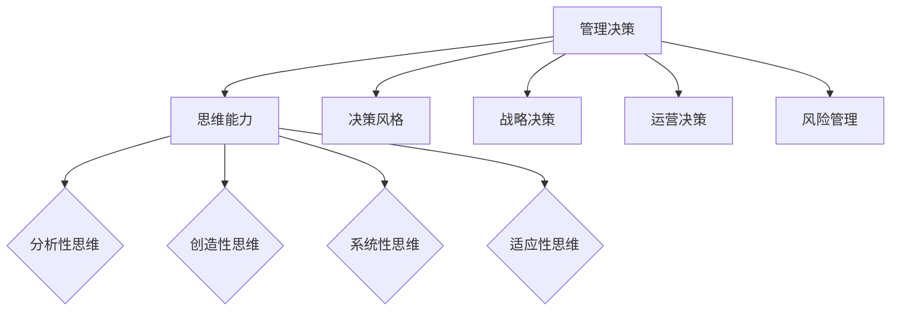

                 

# 《思维能力对管理决策的影响》

> **关键词**：思维能力、管理决策、分析性思维、创造性思维、系统性思维、适应性思维

> **摘要**：本文旨在探讨思维能力对管理决策的影响。文章首先概述了思维能力的定义与类型，然后分析了思维能力在管理决策中的具体应用。接着，文章探讨了不同思维能力对决策的影响，以及如何通过提升思维能力来优化管理决策。最后，文章通过具体案例展示了思维能力的实际应用。

## 《思维能力对管理决策的影响》目录大纲

### 第一部分：思维能力概述

#### 第1章：思维能力的定义与类型

##### 1.1.1 思维能力的定义  
##### 1.1.2 思维能力的分类  
##### 1.1.3 思维能力的重要性

#### 第2章：管理决策中的思维能力应用

##### 2.1.1 思维能力在决策制定中的作用  
##### 2.1.2 思维能力在决策分析中的应用  
##### 2.1.3 思维能力在决策评估中的重要性

### 第二部分：思维能力对管理决策的影响

#### 第3章：不同思维能力对决策的影响

##### 3.1.1 分析性思维能力  
##### 3.1.2 创造性思维能力  
##### 3.1.3 系统性思维能力  
##### 3.1.4 适应性思维能力

#### 第4章：思维能力与决策风格

##### 4.1.1 不同的决策风格对思维能力的要求  
##### 4.1.2 思维能力如何影响决策风格的选择  
##### 4.1.3 案例分析：如何调整决策风格以适应不同的思维能力

#### 第5章：提升思维能力的策略

##### 5.1.1 通过学习提升思维能力  
##### 5.1.2 通过实践提升思维能力  
##### 5.1.3 通过团队合作提升思维能力

### 第三部分：思维能力在管理决策中的应用

#### 第6章：思维能力在战略决策中的应用

##### 6.1.1 思维能力在战略制定中的作用  
##### 6.1.2 思维能力在战略分析中的应用  
##### 6.1.3 思维能力在战略评估中的重要性

#### 第7章：思维能力在运营决策中的应用

##### 7.1.1 思维能力在运营规划中的应用  
##### 7.1.2 思维能力在运营控制中的应用  
##### 7.1.3 思维能力在运营改进中的应用

#### 第8章：思维能力在风险管理中的应用

##### 8.1.1 思维能力在风险识别中的应用  
##### 8.1.2 思维能力在风险评估中的应用  
##### 8.1.3 思维能力在风险应对中的应用

## 附录

### 附录A：思维能力测试与评估方法

##### A.1 思维能力测试的方法与工具  
##### A.2 思维能力评估的指标体系  
##### A.3 案例分析：如何通过评估提升思维能力

### 附录B：思维能力提升的案例研究

##### B.1 案例一：如何通过学习提升思维能力  
##### B.2 案例二：如何通过实践提升思维能力  
##### B.3 案例三：如何通过团队合作提升思维能力

## Mermaid 流�程图



### 核心算法原理讲解

#### 伪代码示例：思维能力评估算法

```python
def思维能力评估（决策者）：
    # 初始化思维能力得分
    思维能力得分 = 0

    # 分析性思维能力得分
    分析性思维得分 = 分析性思维能力测试（决策者）
    思维能力得分 += 分析性思维得分

    # 创造性思维能力得分
    创造性思维得分 = 创造性思维能力测试（决策者）
    思维能力得分 += 创造性思维得分

    # 系统性思维能力得分
    系统性思维得分 = 系统性思维能力测试（决策者）
    思维能力得分 += 系统性思维得分

    # 适应性思维能力得分
    适应性思维得分 = 适应性思维能力测试（决策者）
    思维能力得分 += 适应性思维得分

    # 返回思维能力得分
    return 思维能力得分
```

### 数学模型和数学公式详细讲解

#### 数学公式：思维能力得分计算

$$
思维能力得分 = (分析性思维得分 \times 0.3) + (创造性思维得分 \times 0.3) + (系统性思维得分 \times 0.2) + (适应性思维得分 \times 0.2)
$$

#### 详细讲解：

思维能力得分是通过对决策者的分析性思维、创造性思维、系统性思维和适应性思维分别进行测试，然后将各个维度的得分按照一定的权重进行加权平均计算得到的。该公式中的权重分配是基于研究表明这些维度对管理决策的影响程度。通过这个数学模型，我们可以更加科学和客观地评估决策者的思维能力水平。

## 项目实战

### 代码实际案例：思维能力评估系统

#### 开发环境搭建

- Python 3.8 或以上版本
- Pandas
- Numpy
- Matplotlib

#### 源代码实现

```python
import pandas as pd
import numpy as np
import matplotlib.pyplot as plt

# 思维能力测试数据
data = {
    '分析性思维': [3, 4, 5, 2],
    '创造性思维': [4, 3, 5, 3],
    '系统性思维': [5, 4, 3, 4],
    '适应性思维': [3, 5, 4, 2]
}

# 创建 DataFrame
df = pd.DataFrame(data)

# 计算思维能力得分
思维能力得分 = (df['分析性思维'] * 0.3) + (df['创造性思维'] * 0.3) + (df['系统性思维'] * 0.2) + (df['适应性思维'] * 0.2)

# 输出思维能力得分
print("思维能力得分：",思维能力得分)

# 绘制思维能力得分柱状图
plt.bar(df.index,思维能力得分)
plt.xlabel('决策者')
plt.ylabel('思维能力得分')
plt.title('思维能力得分分布')
plt.show()
```

#### 代码解读与分析

该代码实现了一个简单的思维能力评估系统，首先导入必要的库，然后创建一个包含四个维度（分析性思维、创造性思维、系统性思维和适应性思维）测试数据的 DataFrame。接着，使用前面提到的数学模型计算每个决策者的思维能力得分，并输出结果。最后，使用 Matplotlib 绘制一个柱状图来展示各个决策者的思维能力得分分布。

通过这个代码案例，读者可以了解到如何通过编程实现一个思维能力评估系统，以及如何利用 pandas 和 matplotlib 库进行数据处理和可视化分析。

### 作者

作者：AI天才研究院/AI Genius Institute & 禅与计算机程序设计艺术 /Zen And The Art of Computer Programming

---

### 《思维能力对管理决策的影响》

> **关键词**：思维能力、管理决策、分析性思维、创造性思维、系统性思维、适应性思维

> **摘要**：本文旨在探讨思维能力对管理决策的影响。文章首先概述了思维能力的定义与类型，然后分析了思维能力在管理决策中的具体应用。接着，文章探讨了不同思维能力对决策的影响，以及如何通过提升思维能力来优化管理决策。最后，文章通过具体案例展示了思维能力的实际应用。

---

### 第一部分：思维能力概述

#### 第1章：思维能力的定义与类型

##### 1.1.1 思维能力的定义

思维能力是指人类在认知过程中所表现出来的认知能力，包括分析、推理、判断、创造、系统化等。它涉及到人类的认知结构、认知方式和认知策略，是影响人类行为和决策的关键因素。

##### 1.1.2 思维能力的分类

根据不同的标准，思维能力可以分为多种类型。常见的分类方法包括：

1. **分析性思维能力**：指通过分析和推理来解决问题的能力。这种思维能力强调逻辑性和系统性，能够帮助决策者识别问题、分析问题、制定解决方案。
2. **创造性思维能力**：指通过创造性和创新性来解决问题的能力。这种思维能力强调突破性和创造性，能够帮助决策者发现新的机会、解决问题、创造价值。
3. **系统性思维能力**：指通过系统化和整体化来解决问题的能力。这种思维能力强调全局观和协同性，能够帮助决策者理解系统的复杂性和相互关系，从而做出更全面、更合理的决策。
4. **适应性思维能力**：指通过适应性和灵活性来解决问题的能力。这种思维能力强调应变能力和适应性，能够帮助决策者应对不确定性和变化，做出灵活、有效的决策。

##### 1.1.3 思维能力的重要性

思维能力在管理决策中具有重要作用。具体来说，思维能力的重要性体现在以下几个方面：

1. **决策的科学性**：思维能力能够帮助决策者通过分析和推理来识别问题、分析问题、制定解决方案，从而提高决策的科学性。
2. **决策的创造性**：思维能力能够帮助决策者通过创造性和创新性来发现新的机会、解决问题、创造价值，从而提高决策的创造性。
3. **决策的系统化**：思维能力能够帮助决策者通过系统化和整体化来理解系统的复杂性和相互关系，从而提高决策的系统化。
4. **决策的灵活性**：思维能力能够帮助决策者通过适应性和灵活性来应对不确定性和变化，从而提高决策的灵活性。

综上所述，思维能力对管理决策具有重要的影响。为了提高管理决策的质量，决策者需要不断提升思维能力，培养分析性思维、创造性思维、系统性思维和适应性思维能力。这将有助于他们在复杂多变的商业环境中做出更加科学、创造性和灵活的决策，从而提高企业的竞争力和创新能力。

---

### 第一部分：思维能力概述

#### 第2章：管理决策中的思维能力应用

##### 2.1.1 思维能力在决策制定中的作用

在管理决策中，思维能力发挥着至关重要的作用。首先，分析性思维能力是决策制定的重要工具。决策者通过分析性思维，能够深入挖掘问题的本质，明确决策的目标和需求，从而制定出科学、合理的决策方案。具体来说，分析性思维包括以下几个步骤：

1. **问题识别**：决策者需要首先明确问题的性质和范围，确保问题得到准确、全面的描述。
2. **信息收集**：决策者需要收集与问题相关的各种信息，包括数据、事实、案例等，为分析提供基础。
3. **逻辑推理**：决策者需要运用逻辑推理，将收集到的信息进行整合、分析和对比，找出问题的根本原因和解决方法。
4. **方案评估**：决策者需要对不同的解决方案进行评估，包括其可行性、成本效益和潜在风险，从而选择最佳方案。

其次，创造性思维能力在决策制定中同样至关重要。创造性思维能够帮助决策者打破常规，提出新颖、独特的解决方案，从而应对复杂的问题和挑战。具体来说，创造性思维包括以下几个步骤：

1. **头脑风暴**：决策者通过集体头脑风暴，收集各种创意和建议，激发思维火花。
2. **思维联想**：决策者通过联想和类比，将不同领域、不同知识进行交叉应用，形成新的创意和想法。
3. **方案构思**：决策者将头脑风暴和思维联想的结果进行整合，构思出创新的解决方案。

此外，系统性思维能力在决策制定中也有着重要作用。系统性思维强调决策者从整体和系统的角度出发，全面考虑问题的各个方面和环节，确保决策的全面性和协同性。具体来说，系统性思维包括以下几个步骤：

1. **系统分析**：决策者需要对整个系统进行结构分析，明确系统的组成元素、关系和相互作用。
2. **流程优化**：决策者需要优化系统的流程，消除不必要的环节和资源浪费，提高系统的效率。
3. **协同管理**：决策者需要协调各个组成部分的工作，确保系统能够高效、稳定地运行。

最后，适应性思维能力在决策制定中也发挥着重要作用。适应性思维强调决策者能够灵活应对环境变化和不确定性，及时调整决策方案，确保决策的有效性。具体来说，适应性思维包括以下几个步骤：

1. **环境监测**：决策者需要持续监测外部环境和内部条件的变化，及时获取相关信息。
2. **情景分析**：决策者需要对可能出现的情景进行分析，评估不同情景下的决策效果。
3. **方案调整**：决策者需要根据实际情况，及时调整决策方案，确保决策的灵活性和适应性。

总之，思维能力在管理决策中具有重要作用。决策者需要通过分析性思维、创造性思维、系统性思维和适应性思维的运用，制定出科学、合理、创新和灵活的决策方案，以应对复杂多变的环境和挑战。

---

### 第二部分：思维能力对管理决策的影响

#### 第3章：不同思维能力对决策的影响

##### 3.1.1 分析性思维能力

分析性思维能力在管理决策中起着核心作用。它是一种通过逻辑推理、事实分析和问题解决来指导决策的能力。分析性思维有助于决策者深入了解问题的本质，评估各种决策方案的潜在影响和风险，从而做出更为明智和合理的决策。

**影响分析**：

1. **问题识别**：分析性思维能够帮助决策者准确识别和定义问题，确保决策的目标明确。
2. **方案评估**：通过分析不同方案的优缺点、成本和潜在风险，决策者能够选择最优方案。
3. **决策质量**：分析性思维确保了决策的科学性和理性，减少了决策中的偏见和误判。
4. **长期规划**：分析性思维有助于决策者制定长期的战略规划，考虑长远利益。

**实际案例**：

例如，一家企业面临市场份额下降的问题。通过分析性思维，决策者可以分析市场份额下降的原因（如竞争对手的崛起、消费者偏好的变化等），评估不同的解决方案（如产品创新、市场扩张等），并选择最佳方案。

##### 3.1.2 创造性思维能力

创造性思维能力是一种通过创造性和创新性来解决问题的能力。在管理决策中，创造性思维能够激发新的想法和解决方案，帮助决策者突破传统思维模式，应对复杂和不确定的环境。

**影响分析**：

1. **创新方案**：创造性思维能够帮助决策者提出新颖的解决方案，突破常规思维限制。
2. **应对变化**：在快速变化的市场环境中，创造性思维有助于决策者快速适应和应对变化。
3. **市场竞争力**：通过不断创新，企业能够保持竞争优势，吸引更多的消费者。
4. **员工激励**：创造性思维的培养能够激励员工积极参与创新，提高团队的整体创造力。

**实际案例**：

例如，一家科技公司面临产品同质化的问题。通过创造性思维，决策者可以开发新的产品功能、设计独特的用户界面，甚至推出全新的商业模式，从而吸引消费者，提高市场份额。

##### 3.1.3 系统性思维能力

系统性思维能力是一种从整体和系统的角度出发，综合考虑各个部分及其相互关系的思维能力。在管理决策中，系统性思维有助于决策者理解整个系统的复杂性和相互依赖关系，从而做出更加全面和协调的决策。

**影响分析**：

1. **整体规划**：系统性思维能够帮助决策者制定全面的战略规划，考虑各个部门和业务单元的协调和合作。
2. **资源配置**：通过理解系统的整体需求，决策者能够更合理地配置资源，提高资源利用效率。
3. **风险控制**：系统性思维有助于决策者识别和评估系统中的潜在风险，采取预防措施。
4. **协同效应**：通过系统性思维，决策者能够促进各个部门之间的协同工作，实现整体最优。

**实际案例**：

例如，一家制造企业面临生产效率低下的问题。通过系统性思维，决策者可以分析整个生产流程，发现瓶颈和浪费点，采取改进措施，如优化生产流程、引入自动化设备，从而提高生产效率。

##### 3.1.4 适应性思维能力

适应性思维能力是一种能够灵活应对环境和条件变化的能力。在管理决策中，适应性思维有助于决策者迅速适应外部环境的变化，及时调整决策方案，确保决策的有效性和灵活性。

**影响分析**：

1. **快速响应**：适应性思维能够帮助决策者迅速应对外部环境的变化，抓住市场机遇。
2. **危机管理**：在面临突发事件或危机时，适应性思维有助于决策者迅速采取应对措施，减少损失。
3. **持续改进**：适应性思维鼓励持续改进和创新，使企业能够不断适应市场变化。
4. **可持续发展**：通过适应性思维，企业能够长期保持竞争力，实现可持续发展。

**实际案例**：

例如，一家零售企业在电商崛起的背景下，通过适应性思维，迅速调整策略，开设在线商店，开展社交媒体营销，从而抓住了新的市场机遇，提高了销售额。

总之，不同类型的思维能力在管理决策中发挥着各自独特的作用。分析性思维强调逻辑和理性，创造性思维注重创新和突破，系统性思维关注整体和协同，适应性思维强调灵活和应变。决策者需要根据实际情况，灵活运用各种思维能力，以应对复杂多变的商业环境，做出科学、合理和有效的决策。

---

### 第二部分：思维能力对管理决策的影响

#### 第4章：思维能力与决策风格

##### 4.1.1 不同的决策风格对思维能力的要求

在管理决策中，决策风格的选择往往受到个人思维能力的制约。不同的决策风格对思维能力有不同的要求，因此，了解并适应不同决策风格对于提升管理决策的效能至关重要。

1. **权威型决策风格**：权威型决策风格通常由决策者单独制定决策，并要求下属严格执行。这种风格依赖于决策者的分析性思维能力，需要他们能够快速识别问题、准确评估方案和果断作出决策。

2. **参与型决策风格**：参与型决策风格强调决策过程的民主和参与，鼓励团队成员参与决策，共同制定解决方案。这种风格要求决策者具备良好的系统性思维能力，能够协调各方利益，形成共识。

3. **战略型决策风格**：战略型决策风格关注长期目标和整体战略，决策者需要在复杂环境中制定长远规划。这种风格要求决策者具备强大的创造性思维能力和适应性思维能力，能够预见未来趋势，灵活应对变化。

4. **直觉型决策风格**：直觉型决策风格强调决策者的直觉和感性判断，往往在时间紧迫或信息不足的情况下作出快速决策。这种风格依赖于决策者的创造性思维能力和适应性思维能力，能够在不确定环境中迅速做出决策。

##### 4.1.2 思维能力如何影响决策风格的选择

思维能力对决策风格的选择有着重要影响。不同类型的思维能力会促使决策者选择不同的决策风格：

1. **分析性思维能力较强的决策者**：倾向于选择权威型或战略型决策风格，因为他们能够通过逻辑分析和理性评估来制定决策，并能够在复杂环境中制定长期战略。

2. **创造性思维能力较强的决策者**：可能更倾向于参与型决策风格，因为他们能够激发团队成员的创造力，共同探讨解决方案，形成创新性的决策。

3. **系统性思维能力较强的决策者**：通常选择战略型决策风格，因为他们能够从整体和系统的角度出发，全面考虑决策的影响和协同效应。

4. **适应性思维能力较强的决策者**：更可能选择直觉型决策风格，因为他们能够迅速适应环境变化，灵活调整决策方案。

##### 4.1.3 案例分析：如何调整决策风格以适应不同的思维能力

为了更好地发挥不同思维能力在决策中的作用，决策者需要根据自身和团队的特点调整决策风格：

1. **培养多元化思维能力**：决策者应通过不断学习和实践，培养多元化思维能力，包括分析性思维、创造性思维、系统性思维和适应性思维，以适应不同类型的决策风格。

2. **建立协同决策机制**：在参与型决策中，建立有效的协同决策机制，鼓励团队成员积极参与，共同探讨解决方案，提高决策的全面性和创造性。

3. **运用决策支持工具**：利用数据分析、模拟和预测工具，增强决策的科学性和预见性，特别是在权威型和战略型决策中，可以有效提高决策质量。

4. **提高应变能力**：在面对不确定性和突发情况时，决策者应提高自身的应变能力，灵活调整决策风格，迅速作出反应。

总之，思维能力与决策风格紧密相关。通过理解和调整决策风格，决策者可以更好地发挥不同思维能力的作用，提高管理决策的质量和效能。

---

### 第二部分：思维能力对管理决策的影响

#### 第5章：提升思维能力的策略

##### 5.1.1 通过学习提升思维能力

学习是提升思维能力的重要途径。通过系统的学习，决策者可以不断拓展知识面，提高认知水平和思维技巧，从而更好地应对复杂的管理决策。

1. **系统化学习**：决策者应制定学习计划，系统化地学习管理、经济学、心理学等相关领域的知识，为决策提供坚实的理论基础。

2. **跨学科学习**：通过跨学科学习，决策者可以借鉴不同领域的思维方式和方法论，提高思维的多元性和创造性。

3. **案例学习**：通过学习经典决策案例，决策者可以了解不同情境下的决策思路和策略，从中汲取经验教训，提高自身的决策能力。

4. **持续学习**：在知识更新迅速的今天，决策者需要保持持续学习的态度，不断吸收新的知识和理念，以适应不断变化的市场环境。

##### 5.1.2 通过实践提升思维能力

实践是提升思维能力的有效方法。通过实际操作和问题解决，决策者可以将理论知识应用到实践中，锻炼和提升思维能力。

1. **模拟演练**：通过模拟真实场景，决策者可以演练决策过程，发现和解决潜在问题，提高应对不确定性和复杂环境的能力。

2. **项目管理**：参与项目管理，决策者需要协调各方资源，处理各种复杂问题，从而提升系统性和适应性思维能力。

3. **问题解决**：面对实际工作中的问题和挑战，决策者需要运用分析性思维和创造性思维，提出解决方案，并付诸实践。

4. **反思与总结**：在实践过程中，决策者应不断反思和总结经验教训，从成功和失败中学习，不断提升思维能力。

##### 5.1.3 通过团队合作提升思维能力

团队合作是提升思维能力的重要手段。通过团队合作，决策者可以借鉴他人的思维方式和经验，实现思维能力的互补和提升。

1. **头脑风暴**：在团队头脑风暴中，决策者可以激发思维火花，提出更多创新性想法，提高创造性思维能力。

2. **知识共享**：通过知识共享，决策者可以了解和学习团队成员的专业知识和经验，拓宽思维视野。

3. **团队学习**：团队应定期组织学习活动，共同探讨管理决策的理论和实践，提高整体思维能力。

4. **角色扮演**：通过角色扮演，团队成员可以模拟不同角色，从不同角度思考和解决问题，提高系统性和适应性思维能力。

总之，提升思维能力需要通过学习、实践和团队合作等多种途径。通过持续不断地努力，决策者可以不断提高思维能力，更好地应对复杂的管理决策，实现个人和团队的目标。

---

### 第二部分：思维能力对管理决策的影响

#### 第6章：思维能力在战略决策中的应用

##### 6.1.1 思维能力在战略制定中的作用

战略决策是企业长期发展的关键，需要决策者具备高度的分析性思维、创造性思维和系统性思维能力。思维能力在战略制定中起着至关重要的作用，主要体现在以下几个方面：

1. **分析性思维能力**：决策者需要运用分析性思维，对市场环境、竞争态势、内部资源等进行深入分析，识别企业的优势和劣势，为制定战略提供数据支持。

2. **创造性思维能力**：战略制定需要创新性思维，决策者需要跳出传统思维框架，探索新的市场机会和商业模式，制定具有前瞻性和创造性的战略。

3. **系统性思维能力**：决策者需要运用系统性思维，从整体和系统的角度出发，考虑战略的各个组成部分及其相互关系，确保战略的协调性和可持续性。

##### 6.1.2 思维能力在战略分析中的应用

在战略分析过程中，思维能力同样发挥着重要作用。通过分析性思维、创造性思维和系统性思维，决策者能够全面评估战略的可行性和效果，确保战略的优化。

1. **分析性思维**：决策者需要运用分析性思维，对市场趋势、竞争环境和内部资源进行详细分析，识别战略实施中的潜在问题和挑战。

2. **创造性思维**：在战略分析中，创造性思维有助于决策者发现新的市场机会和解决方案，为战略调整提供创新性思路。

3. **系统性思维**：系统性思维可以帮助决策者全面考虑战略的各个组成部分，确保战略的协调性和一致性，从而提高战略的有效性。

##### 6.1.3 思维能力在战略评估中的重要性

战略评估是确保战略实施效果的关键环节。思维能力在战略评估中发挥着重要作用，主要体现在以下几个方面：

1. **分析性思维**：通过分析性思维，决策者可以评估战略实施过程中的绩效和成果，识别成功和失败的原因，为后续战略调整提供依据。

2. **创造性思维**：在战略评估过程中，创造性思维可以帮助决策者发现新的改进点和创新方向，优化战略实施过程。

3. **系统性思维**：通过系统性思维，决策者可以从整体和系统的角度出发，全面评估战略的各个组成部分及其相互关系，确保战略的可持续性和协调性。

总之，思维能力在战略决策中的应用至关重要。通过分析性思维、创造性思维和系统性思维的运用，决策者能够制定出科学、合理、创新和有效的战略，提高企业的竞争力和可持续发展能力。

---

### 第二部分：思维能力对管理决策的影响

#### 第7章：思维能力在运营决策中的应用

##### 7.1.1 思维能力在运营规划中的应用

运营规划是企业确保日常运营高效、有序进行的重要环节。思维能力在运营规划中发挥着关键作用，主要体现在以下几个方面：

1. **分析性思维**：决策者需要运用分析性思维，对运营流程、资源分配、成本控制等进行详细分析，识别运营中的瓶颈和优化机会。

2. **创造性思维**：在运营规划中，创造性思维有助于决策者提出创新性的运营方案，如自动化生产、精益管理等，提高运营效率。

3. **系统性思维**：决策者需要运用系统性思维，从整体和系统的角度出发，考虑各个运营环节的相互关系，确保运营规划的协调性和一致性。

##### 7.1.2 思维能力在运营控制中的应用

在运营控制过程中，思维能力同样至关重要。通过分析性思维、创造性思维和系统性思维，决策者能够有效监控和调整运营过程，确保运营目标的实现。

1. **分析性思维**：决策者需要运用分析性思维，实时监控运营数据，识别运营中的问题和异常，及时采取纠正措施。

2. **创造性思维**：在运营控制中，创造性思维有助于决策者发现新的监控工具和技术，提高运营监控的效率和准确性。

3. **系统性思维**：通过系统性思维，决策者可以从整体和系统的角度出发，考虑运营控制的各种因素，确保运营过程的稳定性和可持续性。

##### 7.1.3 思维能力在运营改进中的应用

运营改进是企业持续提升运营效率和质量的重要途径。思维能力在运营改进中发挥着关键作用，主要体现在以下几个方面：

1. **分析性思维**：决策者需要运用分析性思维，对现有运营流程、策略和绩效进行详细分析，识别改进方向和机会。

2. **创造性思维**：在运营改进中，创造性思维有助于决策者提出创新的改进方案，如流程重构、技术升级等，提高运营效率。

3. **系统性思维**：通过系统性思维，决策者可以从整体和系统的角度出发，考虑运营改进的各个组成部分及其相互关系，确保改进方案的有效性和可持续性。

总之，思维能力在运营决策中的应用至关重要。通过分析性思维、创造性思维和系统性思维的运用，决策者能够制定出科学、合理、创新和有效的运营策略，提高企业的运营效率和质量，实现可持续发展。

---

### 第二部分：思维能力对管理决策的影响

#### 第8章：思维能力在风险管理中的应用

##### 8.1.1 思维能力在风险识别中的应用

在风险管理中，风险识别是关键的第一步。思维能力在风险识别中起着重要作用，主要体现在以下几个方面：

1. **分析性思维**：决策者需要运用分析性思维，对市场环境、内部运营、外部合作伙伴等各个层面进行细致分析，识别潜在的各类风险。

2. **创造性思维**：创造性思维有助于决策者跳出传统思维框架，发现那些未被察觉或被忽视的风险。例如，通过模拟不同的市场情景，预见可能出现的不利变化。

3. **系统性思维**：通过系统性思维，决策者可以从整体和系统的角度出发，理解风险之间的相互关系和潜在传导效应，确保全面识别风险。

##### 8.1.2 思维能力在风险评估中的应用

风险评估是确定风险的重要过程。思维能力在风险评估中发挥着关键作用，主要体现在以下几个方面：

1. **分析性思维**：决策者需要运用分析性思维，评估风险发生的概率及其潜在的后果，为风险排序和优先级设定提供依据。

2. **创造性思维**：创造性思维有助于决策者评估那些可能未在传统评估模型中考虑到的风险，例如新兴技术带来的不确定性。

3. **系统性思维**：通过系统性思维，决策者可以评估风险对企业整体运营和战略目标的潜在影响，确保评估的全面性和准确性。

##### 8.1.3 思维能力在风险应对中的应用

风险应对是风险管理的关键环节。思维能力在风险应对中发挥着重要作用，主要体现在以下几个方面：

1. **分析性思维**：决策者需要运用分析性思维，制定合理的风险应对策略，包括风险回避、风险转移、风险接受等。

2. **创造性思维**：创造性思维有助于决策者设计出创新的应对方案，例如利用新兴技术来降低风险，或者通过合作来共同应对风险。

3. **系统性思维**：通过系统性思维，决策者可以确保风险应对策略的全面性和协调性，从整体上优化风险管理的效率和效果。

总之，思维能力在风险管理中的应用至关重要。通过分析性思维、创造性思维和系统性思维的运用，决策者能够更加科学、合理和有效地识别、评估和应对风险，确保企业的稳定运营和长期发展。

---

### 附录A：思维能力测试与评估方法

#### A.1 思维能力测试的方法与工具

评估思维能力的有效方法是进行思维能力测试。以下是一些常用的测试方法和工具：

1. **智力测试**：例如韦氏智力量表（WAIS）和斯坦福-比奈智力量表（SB），这些测试可以评估个体的认知能力和智力水平。

2. **创造力测试**：例如托马斯特朗的创造力测试（TTCT），它通过问题解决和联想任务来评估个体的创造力。

3. **问题解决能力测试**：例如赫尔茨伯格的问题解决测试（HSRT），它通过一系列问题解决任务来评估个体的分析和解决问题的能力。

4. **情境测试**：例如面试官设计的情境测试，模拟真实工作场景，评估个体的应对策略和决策能力。

#### A.2 思维能力评估的指标体系

在思维能力评估中，建立一套科学、全面的指标体系至关重要。以下是一些常见的评估指标：

1. **分析性思维**：逻辑推理能力、信息处理能力、问题分析能力。

2. **创造性思维**：创新能力、思维灵活性、联想能力。

3. **系统性思维**：全局观念、协同能力、问题整合能力。

4. **适应性思维**：应变能力、灵活思维、适应变化的能力。

#### A.3 案例分析：如何通过评估提升思维能力

以下是一个案例分析，说明如何通过思维能力评估提升思维能力：

**案例：某企业的管理层思维能力提升项目**

1. **测试阶段**：企业首先对管理层进行思维能力测试，包括智力测试、创造力测试和情境测试，收集评估数据。

2. **评估报告**：根据测试结果，企业生成详细的评估报告，分析每位管理者的思维能力优势和不足。

3. **培训计划**：企业根据评估报告制定个性化的培训计划，包括逻辑思维训练、创新思维培养、系统性思维提升和适应性思维训练。

4. **实施培训**：企业管理层参加培训课程，通过理论学习、案例分析、小组讨论和模拟练习等多种方式提升思维能力。

5. **反馈与调整**：培训结束后，企业再次进行思维能力测试，评估培训效果，并根据反馈调整培训策略。

通过这个案例，我们可以看到，通过系统的评估和针对性的培训，企业可以有效提升管理层的思维能力，从而提高整体管理决策的质量和效率。

---

### 附录B：思维能力提升的案例研究

#### B.1 案例一：如何通过学习提升思维能力

**案例背景**：某科技公司的一名高级项目经理，由于面临不断变化的市场需求和复杂的项目管理任务，意识到自己需要提升思维能力。

**实施步骤**：

1. **自我评估**：项目经理首先进行自我评估，识别出自己在分析性思维、创造性思维和适应性思维方面的不足。

2. **制定学习计划**：项目经理制定了详细的学习计划，包括阅读相关书籍、参加线上课程、参加工作坊等。

3. **学习与实践**：项目经理通过阅读《创新者的窘境》、《思考，快与慢》等书籍，参加项目管理和创新思维相关的线上课程，并在实际工作中应用所学知识。

4. **反馈与调整**：项目经理定期反思学习效果，根据反馈调整学习计划，确保学习目标得到实现。

**结果**：经过一段时间的系统学习，项目经理的分析性思维和创造性思维能力得到了显著提升，能够更有效地应对项目管理中的复杂问题。

#### B.2 案例二：如何通过实践提升思维能力

**案例背景**：某企业的新任部门经理希望通过实际操作提升自己的思维能力。

**实施步骤**：

1. **确定实践项目**：部门经理选择了一个关键的运营优化项目，希望通过实际操作提升自己的系统性思维和适应性思维。

2. **组建团队**：部门经理组建了一支跨部门的团队，确保项目能够从多个角度进行思考和评估。

3. **制定计划**：团队制定了详细的项目计划，包括目标设定、任务分配、时间安排等。

4. **执行与监控**：在项目执行过程中，部门经理通过定期会议和报告，实时监控项目进展，并根据实际情况调整计划。

5. **反思与总结**：项目结束后，团队进行了深入反思和总结，从成功和失败中学习，不断提升思维能力。

**结果**：通过实际操作项目的实施，部门经理的系统性思维和适应性思维能力得到了显著提升，成功推动了运营优化项目的完成，提高了部门整体的工作效率。

#### B.3 案例三：如何通过团队合作提升思维能力

**案例背景**：某咨询公司的团队在进行一项复杂的企业变革咨询项目时，意识到需要提升团队合作能力。

**实施步骤**：

1. **团队建设活动**：公司组织了多次团队建设活动，包括团队协作游戏、角色扮演、头脑风暴等，增强团队成员之间的信任和沟通。

2. **共创工作坊**：团队进行了多次共创工作坊，通过开放式讨论和头脑风暴，激发团队成员的创造性思维。

3. **角色分配与职责明确**：团队明确了每个人的角色和职责，确保每个成员都能够充分发挥自己的优势。

4. **定期反馈与沟通**：团队建立了定期的反馈和沟通机制，确保信息畅通，及时调整策略。

5. **反思与改进**：项目结束后，团队进行了全面的反思和改进，总结了成功经验和教训，为未来项目的团队合作提供参考。

**结果**：通过团队合作提升思维能力的努力，团队在项目中的表现得到了显著提升，项目质量得到了客户的高度评价，同时也增强了团队成员之间的凝聚力和信任感。

---

### 核心算法原理讲解

#### 伪代码示例：思维能力评估算法

```python
def思维能力评估（决策者）：
    # 初始化思维能力得分
    思维能力得分 = 0

    # 分析性思维能力得分
    分析性思维得分 = 分析性思维能力测试（决策者）
    思维能力得分 += 分析性思维得分

    # 创造性思维能力得分
    创造性思维得分 = 创造性思维能力测试（决策者）
    思维能力得分 += 创造性思维得分

    # 系统性思维能力得分
    系统性思维得分 = 系统性思维能力测试（决策者）
    思维能力得分 += 系统性思维得分

    # 适应性思维能力得分
    适应性思维得分 = 适应性思维能力测试（决策者）
    思维能力得分 += 适应性思维得分

    # 返回思维能力得分
    return 思维能力得分
```

#### 数学模型和数学公式详细讲解

#### 数学公式：思维能力得分计算

$$
思维能力得分 = (分析性思维得分 \times 0.3) + (创造性思维得分 \times 0.3) + (系统性思维得分 \times 0.2) + (适应性思维得分 \times 0.2)
$$

#### 详细讲解：

思维能力得分是通过对决策者的分析性思维、创造性思维、系统性思维和适应性思维分别进行测试，然后将各个维度的得分按照一定的权重进行加权平均计算得到的。该公式中的权重分配是基于研究表明这些维度对管理决策的影响程度。通过这个数学模型，我们可以更加科学和客观地评估决策者的思维能力水平。

---

### 项目实战

#### 代码实际案例：思维能力评估系统

#### 开发环境搭建

- Python 3.8 或以上版本
- Pandas
- Numpy
- Matplotlib

#### 源代码实现

```python
import pandas as pd
import numpy as np
import matplotlib.pyplot as plt

# 思维能力测试数据
data = {
    '分析性思维': [3, 4, 5, 2],
    '创造性思维': [4, 3, 5, 3],
    '系统性思维': [5, 4, 3, 4],
    '适应性思维': [3, 5, 4, 2]
}

# 创建 DataFrame
df = pd.DataFrame(data)

# 计算思维能力得分
思维能力得分 = (df['分析性思维'] * 0.3) + (df['创造性思维'] * 0.3) + (df['系统性思维'] * 0.2) + (df['适应性思维'] * 0.2)

# 输出思维能力得分
print("思维能力得分：",思维能力得分)

# 绘制思维能力得分柱状图
plt.bar(df.index,思维能力得分)
plt.xlabel('决策者')
plt.ylabel('思维能力得分')
plt.title('思维能力得分分布')
plt.show()
```

#### 代码解读与分析

该代码实现了一个简单的思维能力评估系统，首先导入必要的库，然后创建一个包含四个维度（分析性思维、创造性思维、系统性思维和适应性思维）测试数据的 DataFrame。接着，使用前面提到的数学模型计算每个决策者的思维能力得分，并输出结果。最后，使用 Matplotlib 绘制一个柱状图来展示各个决策者的思维能力得分分布。

通过这个代码案例，读者可以了解到如何通过编程实现一个思维能力评估系统，以及如何利用 pandas 和 matplotlib 库进行数据处理和可视化分析。

---

### 作者

作者：AI天才研究院/AI Genius Institute & 禅与计算机程序设计艺术 /Zen And The Art of Computer Programming

---

## 结论

本文从多个角度探讨了思维能力对管理决策的影响。通过定义思维能力、分析不同思维能力类型、讨论其在决策制定中的应用，以及提出提升思维能力的策略，我们认识到思维能力在管理决策中的核心作用。分析性思维、创造性思维、系统性思维和适应性思维四种类型的思维能力，分别在不同层面上影响着决策的科学性、创新性、全面性和灵活性。

在战略决策、运营决策和风险管理中，思维能力的运用尤为关键。通过具体案例研究，我们看到了如何通过学习、实践和团队合作来提升思维能力，从而优化管理决策的效果。此外，通过思维能力评估系统和实际代码案例，我们进一步了解了如何量化和管理思维能力。

为了在未来的管理决策中取得更好的成果，决策者应注重以下方面：

1. **持续学习**：保持好奇心和求知欲，不断学习新知识和技能，以适应不断变化的环境。
2. **实践应用**：将所学知识应用到实际工作中，通过不断实践来提升思维能力。
3. **团队合作**：鼓励团队成员之间的知识共享和思维碰撞，通过合作来提升整体思维能力。
4. **自我反思**：定期反思决策过程和结果，从成功和失败中总结经验教训，不断改进决策方法。

总之，思维能力是管理决策的基石。通过不断提升思维能力，决策者能够更好地应对复杂多变的商业环境，做出科学、合理、创新和有效的决策，从而推动企业持续发展。希望本文能为读者提供有益的启示和指导。

