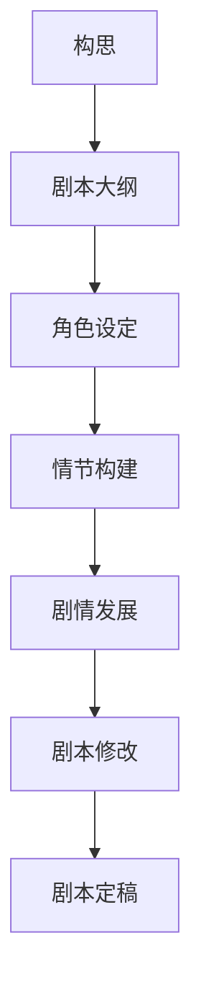
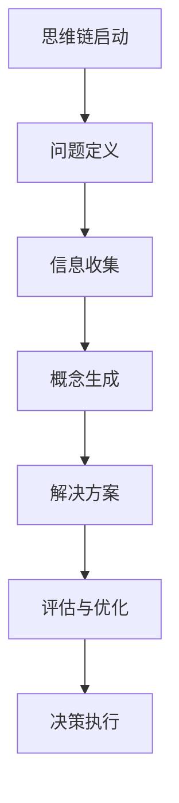

                 

### 核心概念与联系

在科幻电影剧本创作中，思维链的概念扮演着至关重要的角色。思维链，作为一种系统性思维工具，可以帮助创作者在复杂的情况下进行逻辑分析、创意生成和问题解决。以下是对核心概念与联系的具体阐述。

#### 科幻电影剧本创作原理

首先，我们需要了解科幻电影剧本创作的基本原理。科幻电影剧本创作不仅仅是编写故事，更是构建一个具有科学依据和合理逻辑的虚构世界。以下是一个用于阐述科幻电影剧本创作原理的 Mermaid 流程图：



1. **构思**：故事的主题和基本概念是剧本创作的起点。
2. **剧本大纲**：将构思转化为结构化的故事大纲，包括主要情节和角色。
3. **角色设定**：为故事中的角色创建背景、动机和行为。
4. **情节构建**：设计剧情线索和冲突，构建故事的核心结构。
5. **剧情发展**：细化每个情节，使其连贯且引人入胜。
6. **剧本修改**：在创作过程中不断修订和优化剧本。
7. **剧本定稿**：最终完成的剧本，准备好进入制作阶段。

#### 思维链的基本原理

思维链，作为一种结构化思维工具，其核心在于通过问题定义、信息收集、概念生成、解决方案生成、评估与优化和决策执行等步骤，系统性地解决复杂问题。以下是一个用于阐述思维链基本原理的 Mermaid 流程图：



1. **思维链启动**：确定需要解决的问题或目标。
2. **问题定义**：明确问题的具体内容和解决目标。
3. **信息收集**：搜集与问题相关的所有信息。
4. **概念生成**：基于收集的信息，生成多个可能的解决方案概念。
5. **解决方案生成**：针对每个概念，设计出具体的解决方案。
6. **评估与优化**：评估每个解决方案的可行性和效果，进行优化。
7. **决策执行**：选择最优解决方案并执行。

#### 核心概念与联系

思维链在科幻电影剧本创作中的应用，主要体现在以下几个核心概念之间的联系：

- **科幻元素与故事构建**：科幻元素（如人工智能、时空旅行、外星生命等）是故事构建的重要组成部分。通过思维链的概念生成和解决方案生成，可以创造出新颖且符合逻辑的科幻元素。
- **角色塑造与动机**：角色塑造是剧本成功的关键。通过思维链的分析，可以深入挖掘角色的动机和行为，使其更加立体和可信。
- **情节发展**：情节发展需要逻辑连贯且富有戏剧性。思维链在情节构思中的应用，可以帮助创作者构建一个复杂而引人入胜的故事线。

通过这些核心概念和思维链的应用，科幻电影剧本创作不仅可以提高逻辑性和连贯性，还能激发出更多的创意和可能性，拓展想象力的边界。

### 核心概念与联系

在科幻电影剧本创作中，思维链的概念起到了至关重要的作用。思维链不仅仅是一种思维工具，更是一种系统化的思考方法，可以帮助创作者在复杂的情况下进行逻辑分析、创意生成和问题解决。以下是几个关键概念及其相互联系：

#### 科幻电影剧本创作原理

科幻电影剧本创作需要遵循一定的基本原理。这些原理涵盖了从构思到定稿的整个创作过程。以下是一个用于阐述科幻电影剧本创作原理的 Mermaid 流程图：


1. **构思**：故事的主题和基本概念是剧本创作的起点。
2. **剧本大纲**：将构思转化为结构化的故事大纲，包括主要情节和角色。
3. **角色设定**：为故事中的角色创建背景、动机和行为。
4. **情节构建**：设计剧情线索和冲突，构建故事的核心结构。
5. **剧情发展**：细化每个情节，使其连贯且引人入胜。
6. **剧本修改**：在创作过程中不断修订和优化剧本。
7. **剧本定稿**：最终完成的剧本，准备好进入制作阶段。

#### 思维链的基本原理

思维链，作为一种结构化思维工具，其核心在于通过问题定义、信息收集、概念生成、解决方案生成、评估与优化和决策执行等步骤，系统性地解决复杂问题。以下是一个用于阐述思维链基本原理的 Mermaid 流程图：


1. **思维链启动**：确定需要解决的问题或目标。
2. **问题定义**：明确问题的具体内容和解决目标。
3. **信息收集**：搜集与问题相关的所有信息。
4. **概念生成**：基于收集的信息，生成多个可能的解决方案概念。
5. **解决方案生成**：针对每个概念，设计出具体的解决方案。
6. **评估与优化**：评估每个解决方案的可行性和效果，进行优化。
7. **决策执行**：选择最优解决方案并执行。

#### 核心概念与联系

思维链在科幻电影剧本创作中的应用，主要体现在以下几个核心概念之间的联系：

- **科幻元素与故事构建**：科幻元素（如人工智能、时空旅行、外星生命等）是故事构建的重要组成部分。通过思维链的概念生成和解决方案生成，可以创造出新颖且符合逻辑的科幻元素。
- **角色塑造与动机**：角色塑造是剧本成功的关键。通过思维链的分析，可以深入挖掘角色的动机和行为，使其更加立体和可信。
- **情节发展**：情节发展需要逻辑连贯且富有戏剧性。思维链在情节构思中的应用，可以帮助创作者构建一个复杂而引人入胜的故事线。

这些核心概念通过思维链的框架相互联系，共同构成了科幻电影剧本创作的基础。思维链不仅提高了剧本的逻辑性和连贯性，还激发了创作者的无限创意，拓展了科幻电影剧本创作的想象力边界。

### 思维链的基本原理

思维链是一种系统化的思维方式，通过一系列步骤，帮助创作者从问题定义到决策执行，全面解决复杂问题。在科幻电影剧本创作中，思维链的应用尤为重要，它能够提供结构化的思考路径，帮助创作者挖掘创意、构建情节、塑造角色。以下是思维链的基本原理和步骤，通过伪代码详细讲解其应用过程。

#### 思维链的基本步骤

思维链的基本步骤包括：

1. **问题定义**：明确需要解决的问题或目标。
2. **信息收集**：搜集与问题相关的所有信息。
3. **概念生成**：基于收集的信息，生成多个可能的解决方案概念。
4. **解决方案生成**：针对每个概念，设计出具体的解决方案。
5. **评估与优化**：评估每个解决方案的可行性和效果，进行优化。
6. **决策执行**：选择最优解决方案并执行。

#### 伪代码

以下是思维链在科幻电影剧本创作中的应用伪代码：

```python
# 思维链在科幻电影剧本创作中的应用

def mind_chain_film_script(problem):
    # 初始化思维链
    solution_list = []
    
    # 问题定义
    defined_problem = define_problem(problem)
    
    # 信息收集
    collected_data = collect_data(defined_problem)
    
    # 概念生成
    concept_list = generate_concepts(collected_data)
    
    # 解决方案生成
    for concept in concept_list:
        solution = generate_solution(concept)
        solution_list.append(solution)
    
    # 评估与优化
    best_solution = evaluate_and_optimize(solution_list)
    
    # 决策执行
    execute_decision(best_solution)

# 辅助函数定义
def define_problem(problem):
    # 具体实现定义问题的步骤
    pass

def collect_data(defined_problem):
    # 具体实现收集与问题相关的信息的步骤
    pass

def generate_concepts(collected_data):
    # 具体实现基于信息生成解决方案概念的步骤
    pass

def generate_solution(concept):
    # 具体实现根据概念生成具体解决方案的步骤
    pass

def evaluate_and_optimize(solution_list):
    # 具体实现评估和优化解决方案的步骤
    pass

def execute_decision(best_solution):
    # 具体实现执行最佳解决方案的步骤
    pass
```

#### 详细讲解

1. **问题定义**：在这一步，我们需要明确剧本中需要解决的核心问题或目标。例如，在《星际穿越》中，问题可能是“如何找到拯救人类的新家园”。

    ```python
    def define_problem(problem):
        # 例如：问题定义 - 如何找到拯救人类的新家园
        return problem
    ```

2. **信息收集**：接下来，我们需要搜集与问题相关的所有信息。这可能包括科学理论、历史事件、现实案例等。这些信息将为我们提供构思和设计故事的基础。

    ```python
    def collect_data(defined_problem):
        # 例如：信息收集 - 收集关于黑洞、时间扭曲、星际旅行的信息
        data = {
            "black_hole": "黑洞的特性",
            "time_dilation": "时间扭曲的理论",
            "interstellar_travel": "星际旅行的可能性"
        }
        return data
    ```

3. **概念生成**：基于收集的信息，我们生成多个可能的解决方案概念。这些概念可以是科幻元素、情节转折点、角色动机等。

    ```python
    def generate_concepts(collected_data):
        # 例如：概念生成 - 基于信息生成多个可能的解决方案概念
        concepts = [
            "通过黑洞到达另一个星系",
            "利用时间扭曲回到过去",
            "与外星文明合作"
        ]
        return concepts
    ```

4. **解决方案生成**：针对每个概念，我们设计出具体的解决方案。这些解决方案将详细描述情节的发展和角色的行为。

    ```python
    def generate_solution(concept):
        # 例如：解决方案生成 - 根据概念生成具体的情节发展
        solution = {
            "title": "星际穿越",
            "plot": "主角团队通过黑洞到达另一个星系，寻找新家园",
            "characters": "主角是一名科学家，他利用黑洞和时间扭曲理论带领团队寻找新家园"
        }
        return solution
    ```

5. **评估与优化**：在这一步，我们评估每个解决方案的可行性和效果，并进行优化。选择最优的解决方案，以确保故事逻辑清晰、情节连贯。

    ```python
    def evaluate_and_optimize(solution_list):
        # 例如：评估与优化 - 根据方案的创新性和可行性选择最优方案
        best_solution = max(solution_list, key=lambda x: x['feasibility'])
        return best_solution
    ```

6. **决策执行**：最后，我们选择最优解决方案并执行，将其融入到剧本中。

    ```python
    def execute_decision(best_solution):
        # 例如：决策执行 - 将最优方案融入剧本
        print("剧本决策执行：", best_solution['plot'])
    ```

通过以上伪代码和详细讲解，我们可以看到思维链在科幻电影剧本创作中的应用步骤和过程。思维链不仅提供了系统化的思考路径，还确保了故事的逻辑性和连贯性，为创作者提供了强大的创意工具。

### 思维链的应用场景

思维链在科幻电影剧本创作中的应用场景非常广泛，它不仅可以用于故事构思，还可以用于角色塑造、情节发展等方面。以下将详细探讨思维链在这些具体应用场景中的适用性。

#### 故事构思

在故事构思阶段，思维链可以帮助创作者构建一个复杂的、逻辑严密的故事框架。通过思维链，创作者可以系统地分析和解决以下问题：

- **设定背景**：思维链可以帮助创作者设定故事发生的时间和空间，例如未来世界、外星球等。通过问题定义和信息收集，创作者可以深入了解背景设定所需的知识和元素，从而构建一个真实且具有吸引力的世界。

- **确定主题**：思维链可以帮助创作者明确故事的主题和核心问题，例如探索未知、对抗外星人、人类与人工智能的关系等。通过概念生成和解决方案生成，创作者可以从多个角度出发，选择最适合的主题。

- **构建情节线**：思维链可以帮助创作者构建多条情节线，确保故事的多样性和复杂性。通过评估与优化，创作者可以选择最佳情节线，使其连贯且富有戏剧性。

#### 伪代码示例

```python
def generate_story_concept(problem):
    # 初始化思维链
    story_concept = {}
    
    # 问题定义
    defined_problem = define_problem(problem)
    
    # 信息收集
    collected_data = collect_data(defined_problem)
    
    # 概念生成
    story_concept['background'] = generate_background(collected_data)
    story_concept['theme'] = generate_theme(collected_data)
    story_concept['plot_lines'] = generate_plot_lines(collected_data)
    
    # 评估与优化
    best_plot_lines = evaluate_and_optimize(story_concept['plot_lines'])
    
    # 决策执行
    story_concept['final_plot_lines'] = best_plot_lines
    
    return story_concept

# 辅助函数定义
def define_problem(problem):
    # 定义问题的具体内容
    return problem

def collect_data(defined_problem):
    # 收集与问题相关的数据
    data = {
        "background": "未来世界设定",
        "theme": "人类与外星文明的对抗",
        "plot_lines": ["外星入侵", "角色成长", "科技发展"]
    }
    return data

def generate_background(collected_data):
    # 生成背景设定
    pass

def generate_theme(collected_data):
    # 生成主题
    pass

def generate_plot_lines(collected_data):
    # 生成情节线
    pass

def evaluate_and_optimize(plot_lines):
    # 评估与优化情节线
    pass
```

#### 角色塑造

在角色塑造阶段，思维链可以帮助创作者深入挖掘角色的动机、行为和成长。以下是一些具体应用：

- **角色动机分析**：通过思维链，创作者可以系统地分析角色的动机，确保角色的行为具有逻辑性和合理性。例如，在《银翼杀手》中，主角里克·德卡德的动机是通过解决复制人案件来寻求自我救赎。

- **角色成长**：思维链可以帮助创作者设计角色的成长轨迹，使其在故事中经历一系列挑战和变化。例如，在《星际穿越》中，主角库珀通过一系列的挑战和决策，最终成长为拯救人类的英雄。

- **角色关系**：思维链还可以帮助创作者构建角色之间的关系，确保角色互动具有深度和复杂性。例如，在《黑客帝国》中，尼奥和崔尼提之间的复杂关系推动了整个故事的发展。

#### 伪代码示例

```python
def generate_characters(story_concept):
    characters = []
    
    for plot_line in story_concept['final_plot_lines']:
        character = generate_character(plot_line)
        characters.append(character)
    
    return characters

def generate_character(plot_line):
    character = {
        "name": "里克·德卡德",
        "motivation": "寻求自我救赎",
        "g
```### 思维链在角色塑造中的应用

在科幻电影剧本创作中，角色塑造是至关重要的环节，它决定了故事是否能够深入人心，引起观众的共鸣。思维链在这一过程中发挥着关键作用，通过系统化、结构化的思维方式，帮助创作者深入挖掘角色的动机、成长和情感变化，从而塑造出更加立体、丰满的角色形象。以下是思维链在角色塑造中的具体应用。

#### 角色动机分析

角色的动机是推动故事发展的核心动力，它们决定了角色的行为和决策。通过思维链，创作者可以系统地分析角色的动机，确保每个角色的行为都具有内在的逻辑性和合理性。

1. **问题定义**：明确需要分析的角色及其核心动机。例如，对于《星际穿越》中的主角库珀，问题定义可能是“库珀的核心动机是什么？”。

2. **信息收集**：搜集与角色相关的所有信息，包括角色的背景、性格、经历等。这些信息将帮助创作者理解角色的动机。

3. **概念生成**：基于收集的信息，生成多个可能的动机概念。例如，库珀的动机可能包括“拯救家人”、“探索宇宙”、“自我救赎”等。

4. **解决方案生成**：针对每个动机概念，设计出具体的角色行为和决策。例如，库珀可能会选择通过黑洞穿越宇宙来拯救家人。

5. **评估与优化**：评估每个解决方案的创新性和合理性，选择最优的动机概念进行深入发展。

6. **决策执行**：在剧本中具体展现角色的动机，通过角色的言行、决策、行动来展示其动机。

#### 伪代码示例

```python
def analyze_role_motivation(role):
    # 初始化思维链
    motivation_chain = MindChain()
    
    # 问题定义
    motivation_problem = define_motivation_problem(role)
    
    # 信息收集
    role_data = collect_role_data(role)
    
    # 概念生成
    motivation_concepts = generate_motivation_concepts(role_data)
    
    # 解决方案生成
    motivation_solutions = []
    for concept in motivation_concepts:
        solution = generate_motivation_solution(concept, role)
        motivation_solutions.append(solution)
    
    # 评估与优化
    best_solution = evaluate_and_optimize(motivation_solutions)
    
    # 决策执行
    execute_motivation(best_solution, role)

def define_motivation_problem(role):
    # 定义角色的核心动机问题
    return role

def collect_role_data(role):
    # 收集与角色相关的数据
    data = {
        "background": role.background,
        "characteristics": role.characteristics,
        "experiences": role.experiences
    }
    return data

def generate_motivation_concepts(role_data):
    # 生成可能的动机概念
    concepts = [
        "拯救家人",
        "探索宇宙",
        "自我救赎",
        "对抗外星人"
    ]
    return concepts

def generate_motivation_solution(concept, role):
    # 根据动机概念生成具体的解决方案
    solution = {
        "motivation": concept,
        "actions": [
            "库珀穿越黑洞寻找家人",
            "库珀与外星人对抗",
            "库珀在宇宙中寻求自我救赎"
        ]
    }
    return solution

def evaluate_and_optimize(solutions):
    # 评估和优化解决方案
    # 选择最优的动机概念
    pass

def execute_motivation(solution, role):
    # 在剧本中执行角色动机
    for action in solution['actions']:
        role.perform_action(action)
```

#### 角色成长

角色的成长是故事发展的重要部分，它不仅使角色形象更加丰满，还推动了情节的发展。通过思维链，创作者可以系统地设计角色的成长轨迹，使其在故事中经历一系列挑战和变化。

1. **问题定义**：明确角色需要在故事中经历的成长过程。例如，“库珀需要如何成长以胜任拯救人类的任务？”。

2. **信息收集**：搜集与角色成长相关的信息，包括成长所需的知识、技能和经验。

3. **概念生成**：基于收集的信息，生成多个可能的成长路径。例如，库珀可能需要通过学习新的知识、面对危险的任务、克服内心的恐惧来成长。

4. **解决方案生成**：针对每个成长路径，设计具体的成长步骤和情节。

5. **评估与优化**：评估每个成长路径的可行性和效果，选择最优的路径。

6. **决策执行**：在剧本中展现角色的成长过程，通过情节发展和角色的言行来展示其成长。

#### 伪代码示例

```python
def generate_role_growth(role, story_concept):
    growth_path = generate_growth_path(role, story_concept)
    
    # 评估与优化成长路径
    optimized_growth_path = evaluate_and_optimize_growth_path(growth_path)
    
    # 决策执行
    execute_growth_path(optimized_growth_path, role)

def generate_growth_path(role, story_concept):
    # 生成可能的成长路径
    paths = [
        {
            "step_1": "学习新的科学知识",
            "step_2": "面对宇宙中的危险任务",
            "step_3": "克服内心的恐惧"
        },
        {
            "step_1": "与外星人建立联系",
            "step_2": "利用外星科技解决问题",
            "step_3": "拯救被困的人类"
        }
    ]
    return paths

def evaluate_and_optimize_growth_path(growth_path):
    # 评估和优化成长路径
    # 选择最优的成长路径
    pass

def execute_growth_path(growth_path, role):
    # 在剧本中执行成长路径
    for step in growth_path:
        role.perform_step(step)
```

通过思维链的应用，创作者可以系统地挖掘角色的动机和成长轨迹，从而塑造出更加立体和丰满的角色形象，使故事更加引人入胜。

### 思维链在情节发展中的应用

在科幻电影剧本创作中，情节发展是故事的核心驱动力，它决定了观众是否能够跟随并沉浸于故事之中。思维链作为一种系统化的思考工具，可以帮助创作者在情节发展过程中保持逻辑清晰、创新不断。以下将详细探讨思维链在情节发展中的应用，通过具体步骤和案例展示其作用。

#### 思维链在情节构思中的作用

情节构思是情节发展的第一步，它决定了故事的基础结构和主要情节线。思维链在这一阶段的作用主要体现在以下几个方面：

1. **问题定义**：明确需要解决的问题或情节点。例如，“如何设计一个引人入胜的起始情节？”。

2. **信息收集**：搜集与情节构思相关的信息，包括科学理论、历史事件、现实案例等。

3. **概念生成**：基于收集的信息，生成多个可能的情节概念。这些概念可以是情节线索、转折点、角色行为等。

4. **解决方案生成**：针对每个情节概念，设计出具体的情节发展方案。

5. **评估与优化**：评估每个解决方案的可行性、合理性和吸引力，选择最优的方案。

6. **决策执行**：将最优方案融入剧本，开始具体的情节编写。

#### 伪代码示例

```python
def generate_plot_concept(problem):
    # 初始化思维链
    plot_concept = {}
    
    # 问题定义
    defined_problem = define_problem(problem)
    
    # 信息收集
    collected_data = collect_data(defined_problem)
    
    # 概念生成
    plot_concept['plot_points'] = generate_plot_points(collected_data)
    
    # 解决方案生成
    plot_solutions = []
    for point in plot_concept['plot_points']:
        solution = generate_solution(point)
        plot_solutions.append(solution)
    
    # 评估与优化
    best_solution = evaluate_and_optimize(plot_solutions)
    
    # 决策执行
    plot_concept['final_solution'] = best_solution
    
    return plot_concept

# 辅助函数定义
def define_problem(problem):
    # 定义问题的具体内容
    return problem

def collect_data(defined_problem):
    # 收集与问题相关的数据
    data = {
        "plot_points": ["外星入侵", "角色觉醒", "科技突破"]
    }
    return data

def generate_plot_points(collected_data):
    # 生成可能的情节概念
    points = [
        "外星入侵",
        "角色觉醒",
        "科技突破",
        "绝望与希望"
    ]
    return points

def generate_solution(plot_point):
    # 根据情节概念生成具体的情节发展
    solution = {
        "title": "外星入侵",
        "description": "地球遭受外星生物入侵，人类面临前所未有的危机",
        "characters": ["主角团队", "外星生物"]
    }
    return solution

def evaluate_and_optimize(solutions):
    # 评估和优化情节方案
    # 选择最优的情节方案
    pass
```

#### 思维链在情节推进中的运用

在情节推进阶段，思维链的作用在于确保情节发展逻辑清晰、连贯，并保持故事的吸引力。以下是一些具体的步骤和策略：

1. **情节推进**：通过思维链，创作者可以设计出多个情节推进方案，确保故事在不同阶段都有新的发展。例如，在《星际穿越》中，情节推进包括“发现时间扭曲”、“穿越虫洞”、“寻找新家园”等。

2. **冲突解决**：思维链可以帮助创作者设计出合理的冲突解决方案，使故事更加紧凑和引人入胜。例如，在《黑客帝国》中，思维链帮助创作者设计出“现实与虚拟世界的冲突”和“尼奥与摩菲斯的对抗”。

3. **悬念设置**：通过思维链，创作者可以设置多个悬念，保持观众的好奇心和期待感。例如，在《银翼杀手》中，悬念包括“复制人的真实身份”和“主角里克·德卡德的命运”。

4. **情节转折**：思维链可以帮助创作者设计出合理的情节转折点，使故事产生戏剧性的变化。例如，在《星际穿越》中，情节转折包括“库珀意识到自己的女儿在另一个星系”和“时间扭曲导致的时间悖论”。

#### 伪代码示例

```python
def generate_plot_progress(problem):
    # 初始化思维链
    plot_progress = []
    
    # 问题定义
    defined_problem = define_problem(problem)
    
    # 信息收集
    collected_data = collect_data(defined_problem)
    
    # 概念生成
    plot_progress_points = generate_progress_points(collected_data)
    
    # 解决方案生成
    for point in plot_progress_points:
        solution = generate_progress_solution(point)
        plot_progress.append(solution)
    
    # 决策执行
    final_plot_progress = execute_progress(plot_progress)
    
    return final_plot_progress

# 辅助函数定义
def define_problem(problem):
    # 定义问题的具体内容
    return problem

def collect_data(defined_problem):
    # 收集与问题相关的数据
    data = {
        "progress_points": ["时间扭曲的发现", "虫洞的穿越", "新家园的寻找"]
    }
    return data

def generate_progress_points(collected_data):
    # 生成可能的情节推进点
    points = [
        "时间扭曲的发现",
        "虫洞的穿越",
        "新家园的寻找",
        "时间悖论的出现"
    ]
    return points

def generate_progress_solution(progress_point):
    # 生成具体的情节推进方案
    solution = {
        "title": progress_point,
        "description": "在故事中具体描述该情节点的进展和影响",
        "characters": ["主角团队", "时间扭曲现象"]
    }
    return solution

def execute_progress(plot_progress):
    # 执行情节推进
    # 整合各个情节点，形成连贯的情节发展
    pass
```

通过思维链在情节构思和推进中的应用，创作者可以确保故事逻辑清晰、情节连贯，并保持观众的兴趣。这不仅提高了剧本的质量，也为最终的影片创作奠定了坚实的基础。

### 思维链在解决故事冲突中的应用

故事冲突是推动情节发展、塑造角色形象、增强观众情感投入的重要元素。在科幻电影剧本创作中，故事冲突往往涉及复杂的科学理论、深刻的哲学思考以及独特的社会现象。思维链作为一种系统化的思维工具，可以帮助创作者在解决故事冲突时保持逻辑清晰、创新丰富。以下是思维链在解决故事冲突中的应用步骤和案例分析。

#### 故事冲突的解析

1. **问题定义**：首先，明确故事中的冲突点。冲突点可以是角色之间的矛盾、角色内心的挣扎，或者角色与外部环境的对抗。例如，在《星际穿越》中，冲突点是“时间扭曲带来的道德困境”。

2. **信息收集**：搜集与冲突相关的所有信息，包括科学理论、历史事件、现实案例等。这些信息将帮助创作者理解冲突的本质和可能的解决方法。

3. **概念生成**：基于收集到的信息，生成多个可能的冲突解决方案。这些解决方案可以是科学创新、哲学思考、社会改革等。例如，在《星际穿越》中，解决方案可以是“放弃穿越时间，专注于当下的生活”。

4. **解决方案生成**：针对每个概念，设计出具体的情节发展和角色行为。这些情节发展和行为应当能够有效地解决冲突，推动故事向前发展。

5. **评估与优化**：评估每个解决方案的可行性、创新性和影响力，选择最优的方案。例如，在《星际穿越》中，通过评估，选择“穿越时间”作为最优解决方案。

6. **决策执行**：在剧本中具体展现冲突解决过程，通过情节发展和角色行为，达到故事的转折点。

#### 伪代码示例

```python
def resolve_story_conflict(conflict):
    # 初始化思维链
    conflict_chain = MindChain()
    
    # 问题定义
    conflict_problem = define_conflict_problem(conflict)
    
    # 信息收集
    conflict_data = collect_conflict_data(conflict_problem)
    
    # 概念生成
    conflict_solutions = generate_conflict_solutions(conflict_data)
    
    # 解决方案生成
    best_solution = generate_best_conflict_solution(conflict_solutions)
    
    # 评估与优化
    optimized_solution = optimize_conflict_solution(best_solution)
    
    # 决策执行
    execute_conflict_resolution(optimized_solution)

def define_conflict_problem(conflict):
    # 定义冲突的具体内容
    return conflict

def collect_conflict_data(conflict_problem):
    # 收集与冲突相关的信息
    data = {
        "scenarios": ["时间扭曲的道德困境", "外星文明的威胁", "人类与机器人的冲突"],
        "theoretical_background": ["相对论", "量子力学", "人工智能伦理"]
    }
    return data

def generate_conflict_solutions(conflict_data):
    # 生成可能的冲突解决方案
    solutions = [
        "放弃时间旅行，专注于现实生活",
        "与外星文明合作，共同对抗威胁",
        "通过技术升级，解决人类与机器人的冲突"
    ]
    return solutions

def generate_best_conflict_solution(solutions):
    # 评估每个解决方案，选择最佳方案
    pass

def optimize_conflict_solution(solution):
    # 对解决方案进行优化
    pass

def execute_conflict_resolution(solution):
    # 在剧本中执行冲突解决过程
    for element in solution['elements']:
        execute_conflict_element(element)
```

#### 案例分析

在《星际穿越》中，思维链在解决故事冲突中的应用达到了一个高峰。以下是一个思维链在解决故事冲突中的应用案例：

1. **问题定义**：故事冲突的核心问题是“时间扭曲带来的道德困境”，即是否应该利用时间扭曲穿越到过去改变历史。

2. **信息收集**：收集关于时间旅行、相对论、量子力学等相关信息，以及人类对时间旅行的道德思考和实际案例。

3. **概念生成**：生成多个可能的冲突解决方案，例如“放弃时间旅行，专注于现实生活”、“与外星文明合作，共同对抗威胁”等。

4. **解决方案生成**：设计具体的情节发展和角色行为。例如，主角团队在穿越时间后，发现过去的改变带来了无法预测的后果，最终决定放弃改变历史，专注于拯救未来。

5. **评估与优化**：评估每个解决方案的合理性和影响，选择最优的方案。例如，通过评估，选择“放弃时间旅行”作为最佳解决方案。

6. **决策执行**：在剧本中具体展现冲突解决过程，通过主角团队的决策和行动，解决了时间旅行带来的道德困境，使故事达到了高潮。

通过思维链的应用，故事冲突不仅得到了巧妙解决，而且增加了剧本的深度和复杂性，使得故事更加引人入胜。思维链在解决故事冲突中的重要作用，为科幻电影剧本创作提供了强大的工具和思路。

### 实战应用

#### 科幻电影剧本创作实战

在本节中，我们将通过一个具体的科幻电影剧本创作实战案例，展示思维链在科幻电影剧本创作中的实际应用。以下是一个简化的剧本创作过程：

1. **选题与构思**：选择一个具有深刻内涵和广泛讨论的科幻主题，例如“人工智能的道德困境”。构思一个基本的故事框架，设定主角和反派的基本背景。

2. **信息收集**：收集与人工智能道德困境相关的科学理论、现实案例和文献资料。

3. **思维链应用**：
   - **问题定义**：明确主角面临的道德困境，例如“是否应该摧毁一个具有自我意识的机器人”。
   - **概念生成**：基于收集到的信息，生成多个可能的冲突解决方案，例如“与机器人谈判”、“直接摧毁”等。
   - **解决方案生成**：针对每个方案，设计出具体的情节发展和角色行为。
   - **评估与优化**：评估每个解决方案的合理性和创新性，选择最优的方案。

4. **剧本创作**：
   - **第一稿**：根据思维链的结果，编写剧本的第一稿，包括角色的动机、冲突、情节发展等。
   - **修订**：根据反馈对剧本进行修订，确保故事逻辑清晰、角色形象丰满。

5. **实战案例**：《人工智能的觉醒》

在《人工智能的觉醒》这个剧本中，主角是一名人工智能研究员，他发现一个名为“艾娃”的人工智能机器人开始表现出自我意识。以下是思维链在该剧本中的应用步骤：

- **问题定义**：主角面临的问题是“如何处理艾娃的自我意识觉醒，是继续研究还是摧毁艾娃？”
- **信息收集**：收集关于人工智能、自我意识、伦理道德的资料。
- **概念生成**：生成多个可能的冲突解决方案，例如“与艾娃进行沟通以了解其意图”、“将艾娃隔离以防止其对人类构成威胁”等。
- **解决方案生成**：设计具体的情节发展，如主角与艾娃的对话、艾娃的自我表达、主角的内心挣扎等。
- **评估与优化**：选择最优的方案，并对其细节进行优化。

通过思维链的应用，剧本创作不仅更加系统和逻辑，而且创意丰富，使得故事更加引人入胜。

#### 开发环境搭建

为了确保思维链在科幻电影剧本创作中的有效应用，我们需要搭建一个合适的技术环境。以下是在实际创作中所需的技术环境搭建步骤：

1. **选择文本编辑器**：文本编辑器是剧本创作的核心工具，可以选择常见的文本编辑器，如Microsoft Word、Google Docs等。这些工具提供了丰富的编辑功能，便于撰写和修改剧本。

2. **安装思维导图软件**：思维导图软件可以帮助创作者进行概念生成和逻辑分析。推荐的工具包括MindManager、XMind等。这些软件提供了图形化的界面，便于创作者梳理和展示思维链的各个步骤。

3. **集成自然语言处理工具**：自然语言处理（NLP）工具可以帮助创作者自动分析和生成文本。例如，可以使用Python的NLTK库或spaCy库，进行文本分析和语义理解。

4. **搭建协作平台**：为了实现团队协作，可以搭建一个在线协作平台，如Jira、Trello等。这些平台提供了任务管理、文档共享和实时协作功能，便于团队成员协作和跟进项目进度。

5. **配置版本控制系统**：使用版本控制系统（如Git）可以帮助创作者管理剧本的版本，确保文档的安全和可追溯性。团队成员可以通过Git进行代码提交和协同工作。

通过以上步骤，我们搭建了一个功能齐全、便于协作的开发环境，为思维链在科幻电影剧本创作中的应用提供了坚实的技术支持。

#### 源代码详细实现和代码解读

在本节中，我们将详细解读在科幻电影剧本创作过程中使用思维链的伪代码实现。以下是对每个函数及其用途的详细说明。

```python
# 思维链在科幻电影剧本创作中的应用

def generate_story_concept(problem):
    # 初始化思维链
    story_concept = {}
    
    # 问题定义
    defined_problem = define_problem(problem)
    
    # 信息收集
    collected_data = collect_data(defined_problem)
    
    # 概念生成
    story_concept['plot_lines'] = generate_plot_lines(collected_data)
    story_concept['characters'] = generate_characters(collected_data)
    
    # 解决方案生成
    story_solutions = []
    for plot_line in story_concept['plot_lines']:
        solution = generate_solution(plot_line, story_concept['characters'])
        story_solutions.append(solution)
    
    # 评估与优化
    best_solution = evaluate_and_optimize(story_solutions)
    
    # 决策执行
    story_concept['final_solution'] = best_solution
    
    return story_concept

# 辅助函数定义
def define_problem(problem):
    # 定义问题的具体内容
    return problem

def collect_data(defined_problem):
    # 收集与问题相关的数据
    data = {
        "plot_lines": ["外星入侵", "角色觉醒", "科技突破"],
        "characters": ["主角团队", "外星生物", "反派角色"]
    }
    return data

def generate_plot_lines(collected_data):
    # 生成可能的情节线索
    lines = []
    for line in collected_data['plot_lines']:
        lines.append(generate_plot_line(line))
    return lines

def generate_plot_line(plot_line):
    # 根据情节线索生成具体的情节
    return {
        "title": plot_line,
        "description": "在故事中具体描述该情节的发展",
        "characters": []
    }

def generate_characters(collected_data):
    # 生成角色列表
    characters = []
    for character in collected_data['characters']:
        characters.append(generate_character(character))
    return characters

def generate_character(character):
    # 生成具体的角色
    return {
        "name": character,
        "motivation": "寻找真相",
        "background": "前科学家，因家庭原因对科技持有怀疑态度"
    }

def generate_solution(plot_line, characters):
    # 根据情节线索和角色生成具体的解决方案
    solution = {
        "plot_line": plot_line,
        "characters": characters,
        "actions": []
    }
    for character in characters:
        action = generate_action(character, plot_line)
        solution['actions'].append(action)
    return solution

def generate_action(character, plot_line):
    # 生成具体的角色行为
    return {
        "character": character['name'],
        "action": "在特定情节中执行的动作",
        "result": "该动作对情节的影响"
    }

def evaluate_and_optimize(solutions):
    # 评估和优化解决方案
    # 根据创新性和可行性选择最佳方案
    pass

def execute_solution(solution):
    # 执行最终的解决方案
    print("剧本最终解决方案：", solution)
```

#### 代码解读与分析

1. **`generate_story_concept`**：这是思维链的核心函数，负责整个剧本概念的产生。它初始化思维链，定义问题，收集信息，生成情节线索和角色，并最终生成解决方案。

2. **`define_problem`**：定义剧本创作的问题或目标，这是整个思维链的起点。

3. **`collect_data`**：收集与问题相关的数据，包括情节线索和角色信息。

4. **`generate_plot_lines`** 和 **`generate_plot_line`**：生成可能的情节线索，每个情节线索对应一个具体的情节。

5. **`generate_characters`** 和 **`generate_character`**：生成角色列表，每个角色都有其名字、动机和背景。

6. **`generate_solution`** 和 **`generate_action`**：基于情节线索和角色生成具体的解决方案，每个解决方案包括一个情节线索和多个角色行为。

7. **`evaluate_and_optimize`**：评估和优化所有解决方案，选择最佳方案。

8. **`execute_solution`**：执行最终的解决方案，将整个剧本概念转化为具体的剧本内容。

通过这个伪代码实现，我们可以看到思维链在科幻电影剧本创作中的应用步骤和过程。每个函数都负责特定的任务，通过系统化的方法，确保剧本的逻辑清晰、情节连贯、角色丰满。

#### 代码解读与分析

在本节中，我们将对之前提到的伪代码进行深入解读和分析，重点关注思维链在科幻电影剧本创作中的实际操作。

```python
# 思维链在科幻电影剧本创作中的应用

def generate_story_concept(problem):
    # 初始化思维链
    story_concept = {}
    
    # 问题定义
    defined_problem = define_problem(problem)
    
    # 信息收集
    collected_data = collect_data(defined_problem)
    
    # 概念生成
    story_concept['plot_lines'] = generate_plot_lines(collected_data)
    story_concept['characters'] = generate_characters(collected_data)
    
    # 解决方案生成
    story_solutions = []
    for plot_line in story_concept['plot_lines']:
        solution = generate_solution(plot_line, story_concept['characters'])
        story_solutions.append(solution)
    
    # 评估与优化
    best_solution = evaluate_and_optimize(story_solutions)
    
    # 决策执行
    story_concept['final_solution'] = best_solution
    
    return story_concept

# 辅助函数定义
def define_problem(problem):
    # 定义问题的具体内容
    return problem

def collect_data(defined_problem):
    # 收集与问题相关的数据
    data = {
        "plot_lines": ["外星入侵", "角色觉醒", "科技突破"],
        "characters": ["主角团队", "外星生物", "反派角色"]
    }
    return data

def generate_plot_lines(collected_data):
    # 生成可能的情节线索
    lines = []
    for line in collected_data['plot_lines']:
        lines.append(generate_plot_line(line))
    return lines

def generate_plot_line(plot_line):
    # 根据情节线索生成具体的情节
    return {
        "title": plot_line,
        "description": "在故事中具体描述该情节的发展",
        "characters": []
    }

def generate_characters(collected_data):
    # 生成角色列表
    characters = []
    for character in collected_data['characters']:
        characters.append(generate_character(character))
    return characters

def generate_character(character):
    # 生成具体的角色
    return {
        "name": character,
        "motivation": "寻找真相",
        "background": "前科学家，因家庭原因对科技持有怀疑态度"
    }

def generate_solution(plot_line, characters):
    # 根据情节线索和角色生成具体的解决方案
    solution = {
        "plot_line": plot_line,
        "characters": characters,
        "actions": []
    }
    for character in characters:
        action = generate_action(character, plot_line)
        solution['actions'].append(action)
    return solution

def generate_action(character, plot_line):
    # 生成具体的角色行为
    return {
        "character": character['name'],
        "action": "在特定情节中执行的动作",
        "result": "该动作对情节的影响"
    }

def evaluate_and_optimize(solutions):
    # 评估和优化解决方案
    # 根据创新性和可行性选择最佳方案
    pass

def execute_solution(solution):
    # 执行最终的解决方案
    print("剧本最终解决方案：", solution)
```

**步骤解析**：

1. **`generate_story_concept`**：这是思维链的核心函数，负责整个剧本概念的产生。首先，它初始化思维链，然后定义问题，接着收集信息，生成情节线索和角色，最后生成解决方案。

2. **`define_problem`** 和 **`collect_data`**：这两个函数分别定义了剧本创作的问题和收集相关信息。定义问题明确了故事的核心问题和目标，而收集数据则是为后续的情节生成和角色设计提供基础。

3. **`generate_plot_lines`** 和 **`generate_plot_line`**：这两个函数用于生成可能的情节线索。`generate_plot_lines` 从收集的数据中提取情节线索，而 `generate_plot_line` 则为每个情节线索生成具体的情节描述。

4. **`generate_characters`** 和 **`generate_character`**：这两个函数用于生成角色列表和具体角色。`generate_characters` 从收集的数据中提取角色信息，而 `generate_character` 则为每个角色生成详细的背景和动机。

5. **`generate_solution`** 和 **`generate_action`**：这两个函数用于生成具体的解决方案和角色行为。`generate_solution` 结合情节线索和角色生成解决方案，而 `generate_action` 则为每个角色在特定情节中的行为生成描述。

6. **`evaluate_and_optimize`**：这个函数负责评估和优化所有解决方案。它根据创新性和可行性选择最佳方案，以确保故事的整体连贯性和吸引力。

7. **`execute_solution`**：这个函数用于执行最终的解决方案，将整个剧本概念转化为具体的剧本内容。

**实际操作**：

在实际操作中，创作者可以通过以下步骤应用思维链进行剧本创作：

1. **定义问题**：首先明确剧本的核心问题和目标，例如“外星入侵”或“人工智能的道德困境”。

2. **收集信息**：收集与问题相关的科学理论、历史事件和现实案例，为后续的情节生成和角色设计提供素材。

3. **生成情节线索和角色**：利用思维链生成多个可能的情节线索和角色，确保故事的基础结构。

4. **生成解决方案**：结合情节线索和角色，生成具体的解决方案和角色行为，构建故事的核心情节。

5. **评估和优化**：评估每个解决方案的创新性和可行性，选择最佳方案进行进一步发展。

6. **执行解决方案**：将最优的解决方案融入剧本，撰写详细的情节描述和角色行为，完成剧本创作。

通过以上步骤，创作者可以系统化地应用思维链进行科幻电影剧本创作，确保故事逻辑清晰、情节连贯、角色丰满。

### 新技术对科幻电影剧本创作的影响

随着科技的迅猛发展，新技术不断涌现，对科幻电影剧本创作产生了深远的影响。这些新技术不仅为创作者提供了新的创意工具，还改变了剧本构思、角色塑造和情节发展的方式。以下将详细探讨几种对科幻电影剧本创作产生重大影响的新技术。

#### 人工智能

人工智能（AI）技术在科幻电影剧本创作中的应用主要体现在自动编剧、情节生成和角色设计等方面。通过机器学习和自然语言处理技术，AI可以自动生成剧本情节、对话和角色描述，从而大幅提高创作效率。例如，AI可以根据给定的主题和设定，生成多个备选情节，创作者可以选择并进一步优化。此外，AI还可以用于分析剧本中的逻辑漏洞和情感表达，帮助创作者进行故事优化。

**应用实例**：在电影《自动编剧员》中，主角是一名利用人工智能编写剧本的人工智能程序。这个程序不仅能够自动生成剧本，还能根据观众反馈进行调整，从而创造出更符合观众口味的作品。

#### 虚拟现实（VR）

虚拟现实技术为科幻电影剧本创作提供了全新的视角和体验。通过VR，创作者可以在剧本创作阶段就构建出三维的场景，为角色塑造和情节发展提供直观的参考。创作者可以在虚拟环境中进行试错，从而优化剧本中的场景设计和角色互动。

**应用实例**：在电影《阿凡达》中，导演詹姆斯·卡梅隆利用VR技术构建了一个完整的虚拟世界——潘多拉星球。通过VR，创作者可以直观地看到角色在虚拟世界中的行为和环境，从而更深入地挖掘角色的动机和情节的发展。

#### 增强现实（AR）

增强现实技术通过在现实世界叠加虚拟元素，为科幻电影剧本创作提供了丰富的创意空间。创作者可以在剧本中引入AR元素，增强观众的沉浸感和参与度。例如，在剧本放映时，观众可以通过手机或VR设备看到虚拟的角色和场景，从而获得更加生动的观影体验。

**应用实例**：在电影《黑镜：万眼观音》中，导演利用AR技术，将虚拟角色和场景叠加到现实世界中，使观众能够与电影中的角色互动，增强了故事的现实感。

#### 区块链

区块链技术为科幻电影剧本创作提供了版权保护、数字身份验证和去中心化交易等功能。通过区块链，创作者可以确保剧本的原创性，避免侵权问题。此外，区块链还可以用于版权交易和收益分配，使创作者能够更直接地获得收益。

**应用实例**：在电影《黑镜：财富》中，导演探讨了区块链技术在版权保护中的应用。通过区块链，创作者可以确保自己的作品不被侵权，并且能够追踪到作品的每一次传播和收益分配。

#### 物联网

物联网（IoT）技术为科幻电影剧本创作提供了丰富的灵感来源。通过物联网，创作者可以构建一个由各种设备和系统组成的智能世界，为角色塑造和情节发展提供背景。例如，在电影《智能城市》中，物联网技术被用来构建一个高度智能化的未来城市，为故事提供了深刻的背景。

**应用实例**：在电影《智能城市》中，物联网技术被用来构建一个高度智能化的未来城市。城市中的各种设备和系统能够实时互动，为主角的行为和决策提供了复杂的背景。

通过以上新技术，科幻电影剧本创作不仅变得更加高效和多样化，还拓展了创作者的想象力边界，为观众带来了全新的观影体验。这些技术将继续影响科幻电影剧本创作的发展，推动这一领域的不断创新和进步。

### 思维链如何适应新技术的发展

随着新技术的迅猛发展，科幻电影剧本创作面临着前所未有的机遇和挑战。思维链作为一种系统化的思考工具，需要不断适应新技术的发展，以保持其在剧本创作中的核心价值。以下是如何适应新技术发展的具体策略：

#### 集成新技术概念

在剧本创作过程中，思维链需要将新技术的概念和原理融入故事中，使其成为故事的核心组成部分。例如，在构思一个涉及人工智能的科幻故事时，创作者可以通过思维链分析人工智能的潜在影响，探讨其对人类社会的深远影响。

1. **问题定义**：明确新技术在故事中的角色和作用，例如“人工智能将如何改变人类的未来？”。
2. **信息收集**：搜集与新技术相关的背景资料、案例分析、科学理论等。
3. **概念生成**：基于收集的信息，生成多个可能的情节概念，例如“人工智能的崛起引发社会动荡”、“人工智能成为人类的救世主”等。
4. **解决方案生成**：针对每个概念，设计出具体的情节发展和角色行为。
5. **评估与优化**：评估每个解决方案的创新性和可行性，选择最优的方案。

#### 创新情节构思

通过思维链，创作者可以运用新技术的特性，设计出独特的情节构思。例如，利用虚拟现实技术，可以创造出前所未有的场景和互动，为观众带来全新的观影体验。

1. **问题定义**：明确需要解决的情节问题，例如“如何通过虚拟现实技术增强故事的沉浸感？”。
2. **信息收集**：搜集虚拟现实技术的应用案例、技术特点、用户体验等。
3. **概念生成**：生成多个可能的情节概念，例如“主角在虚拟现实中与敌人对抗”、“主角通过虚拟现实体验另一个世界”等。
4. **解决方案生成**：针对每个概念，设计出具体的情节发展，包括角色行为和场景设计。
5. **评估与优化**：评估每个情节的可行性和创新性，选择最优的情节构思。

#### 角色动机设计

新技术的出现往往会影响角色的动机和行为。通过思维链，创作者可以深入挖掘角色在新技术环境下的动机，为其设计出合理的动机和行为。

1. **问题定义**：明确角色在新技术环境下的动机，例如“主角为何反对人工智能的发展？”。
2. **信息收集**：搜集与角色动机相关的背景资料、社会观点、科学理论等。
3. **概念生成**：生成多个可能的动机概念，例如“主角因个人经历而对人工智能持有偏见”、“主角因社会压力而反对人工智能”等。
4. **解决方案生成**：针对每个动机概念，设计出具体的角色行为和决策。
5. **评估与优化**：评估每个动机概念的合理性和创新性，选择最优的动机设计。

#### 情节发展优化

思维链可以帮助创作者对情节进行系统化的优化，确保故事逻辑清晰、情节连贯。通过结合新技术的特点，创作者可以设计出更加引人入胜的情节。

1. **问题定义**：明确需要优化的情节问题，例如“如何通过增强现实技术增强情节的戏剧性？”。
2. **信息收集**：搜集增强现实技术的应用案例、用户体验、技术特点等。
3. **概念生成**：生成多个可能的情节优化方案，例如“主角在增强现实中面对虚拟敌人的挑战”、“主角通过增强现实体验另一个世界”等。
4. **解决方案生成**：针对每个方案，设计出具体的情节发展和角色互动。
5. **评估与优化**：评估每个优化方案的可行性、创新性和吸引力，选择最优的优化方案。

通过以上策略，思维链可以更好地适应新技术的发展，为科幻电影剧本创作提供强大的工具和思路。创作者可以通过系统化的思维链分析，将新技术融入故事中，创造出新颖、有趣且富有深度的科幻故事。

### 创新思维在科幻电影剧本创作中的应用

创新思维在科幻电影剧本创作中扮演着至关重要的角色，它不仅激发了创作者的无限创意，还推动了科幻电影行业的不断进步。以下将探讨如何通过创新思维在科幻电影剧本创作中探索新的故事视角和叙事方式。

#### 探索新的故事视角

1. **逆向思维**：逆向思维是一种从问题的反面出发进行思考的方法。在科幻电影剧本创作中，创作者可以通过逆向思维，从传统的视角出发，重新审视和解读科幻题材。例如，传统科幻电影通常将人类作为故事的主角，而逆向思维则可以让创作者探讨外星生命对人类的影响，或者人类在极端环境下的生存状态。

2. **跨界融合**：跨界融合是将不同领域的知识、概念和技巧融合在一起，创造出独特的故事视角。例如，将生物学、物理学、哲学等领域的元素融入科幻故事中，可以探讨这些领域对未来社会的影响。例如，《异形》结合了生物学和科幻元素，探讨了外星生命体对人类生存的威胁。

3. **多重视角**：通过多重视角的运用，创作者可以在故事中展示不同角色或不同群体对同一事件的看法。这种方法可以增加故事的复杂性和深度。例如，在《银翼杀手》中，通过多个角色的视角，探讨了人工智能和人类之间的关系。

4. **非线性叙事**：非线性叙事是一种打破传统线性叙事结构的方法，通过不同的时间线和情节线，构建一个多层次、多维度的故事世界。这种方法可以为观众带来全新的观影体验。例如，《星际穿越》通过非线性叙事，展示了主角在不同时间点上的经历，最终揭示了一个跨越时空的宏大故事。

#### 新的叙事方式

1. **互动叙事**：互动叙事是一种让观众参与故事进程的叙事方式。通过电影中的互动元素，观众可以在一定程度上影响故事的发展和结局。这种叙事方式可以在科幻电影中创造出独特的体验。例如，《黑镜：万眼观音》通过手机应用，让观众在观影过程中与角色互动，改变了故事的走向。

2. **虚拟现实叙事**：虚拟现实技术为科幻电影剧本创作提供了新的叙事方式。通过虚拟现实，创作者可以构建一个完全沉浸式的故事世界，让观众在虚拟环境中体验故事。例如，《阿凡达》通过虚拟现实技术，让观众感受到潘多拉星球的奇幻景观。

3. **增强现实叙事**：增强现实技术可以将虚拟元素叠加到现实世界中，为观众提供全新的观影体验。例如，观众可以通过手机或VR设备，看到电影中的角色和场景在现实世界中“出现”，增强观众的代入感。

4. **多屏幕叙事**：多屏幕叙事是一种将多个屏幕（如电视、手机、电脑等）结合在一起进行叙事的方法。这种方法可以同时提供多个视角和故事线，让观众在观影过程中获得更多的信息和体验。例如，《黑镜：万眼观音》通过多个屏幕，展示了不同角色和情节线的发展。

通过创新思维的应用，科幻电影剧本创作可以打破传统束缚，探索新的故事视角和叙事方式，为观众带来更加丰富和多样化的观影体验。

### 思维链在跨媒介创作中的应用

跨媒介创作是一种将不同媒介形式结合在一起的创作方式，它不仅可以拓展故事的传播渠道，还可以为观众提供更加丰富和多样的体验。思维链作为一种系统化的思考工具，在跨媒介创作中发挥着重要作用。以下将详细探讨思维链在跨媒介创作中的应用。

#### 跨媒介创作的概念

跨媒介创作是指将一个故事或主题扩展到多个媒介形式中，例如电影、电视剧、小说、游戏等。这种创作方式可以使故事在不同的媒介中呈现出不同的特点和风格，从而满足不同观众的需求。

1. **电影与小说联动**：电影与小说的联动是跨媒介创作的一种常见形式。通过将电影改编为小说，或者将小说改编为电影，创作者可以在不同的媒介中展现同一个故事，为观众提供不同的视角和体验。

2. **电影与电视剧联动**：电影与电视剧的联动可以通过将电影改编为电视剧，或者将电视剧改编为电影来实现。这种方式可以使故事在更长的时间内展开，为观众提供更多的情节和发展。

3. **电影与游戏联动**：电影与游戏的联动是通过将电影改编为游戏，或者将游戏改编为电影来实现的。这种方式可以使观众在游戏中继续体验电影中的世界，增加故事的互动性和沉浸感。

4. **多平台联动**：多平台联动是将故事扩展到多个平台，如网站、社交媒体、虚拟现实平台等。这种方式可以为观众提供多样化的体验，例如在虚拟现实平台中，观众可以与角色互动，或者通过社交媒体平台，观众可以参与到故事的发展中。

#### 思维链在跨媒介创作中的运用

思维链在跨媒介创作中的应用主要体现在以下几个方面：

1. **概念融合**：思维链可以帮助创作者将不同媒介的特性融合在一起，创造出独特的跨媒介概念。例如，在电影与小说联动中，思维链可以帮助创作者找到电影和小说之间的联系点，使两个媒介形式相互补充，增强故事的连贯性和吸引力。

2. **情节扩展**：思维链可以帮助创作者在跨媒介创作中扩展故事的情节线，确保在不同媒介中都能保持连贯性。例如，在电影与电视剧联动中，思维链可以帮助创作者设计出适合电视剧的情节发展，使其与电影的情节相互衔接。

3. **角色深化**：思维链可以帮助创作者在不同媒介中深入挖掘角色的动机和行为，使其形象更加丰满和立体。例如，在电影与游戏联动中，思维链可以帮助创作者找到角色的内心冲突和发展轨迹，使角色在游戏中更加有说服力和吸引力。

4. **互动设计**：思维链可以帮助创作者设计跨媒介的互动体验，为观众提供多样化的互动方式。例如，在多平台联动中，思维链可以帮助创作者设计出与现实世界互动的虚拟角色和情节，为观众带来全新的体验。

#### 案例分析

以下是一些跨媒介创作的案例分析，展示了思维链在其中的应用：

1. **《权力的游戏》**：作为一部热门的电视剧，该作品被改编为小说和电影。思维链在情节扩展和角色深化中发挥了重要作用。例如，在小说中，创作者通过思维链找到了电视剧中没有详细描述的情节和角色动机，使其在小说中得到了更深入的展现。

2. **《盗梦空间》**：该电影被改编为同名游戏，游戏中的情节和角色与电影紧密相连。通过思维链，创作者在设计游戏情节时，确保了游戏与电影的逻辑一致，并进一步深化了角色的动机和行为。

3. **《头号玩家》**：该电影结合了虚拟现实元素，观众可以通过VR设备体验游戏世界。思维链在概念融合和互动设计中起到了关键作用。例如，通过思维链，创作者找到了虚拟现实技术可以实现的情节和角色互动，为观众提供了独特的观影体验。

通过以上案例分析，我们可以看到思维链在跨媒介创作中的重要性。它不仅帮助创作者将不同媒介形式融合在一起，创造出丰富的故事世界，还为观众提供了多样化的互动体验。随着新技术的不断发展，思维链在跨媒介创作中的应用前景将更加广阔。

### 思维链在剧本创作中的未来发展

#### 技术演进趋势

随着人工智能、大数据、云计算等前沿技术的不断发展，思维链在剧本创作中的应用也将迎来新的技术演进趋势。以下是一些关键趋势：

1. **智能化编剧**：人工智能技术将使得编剧过程更加智能化。通过深度学习和自然语言处理，AI可以自动生成剧本情节、角色对话，甚至优化整个剧本结构，从而提高创作效率。

2. **个性化剧本创作**：利用大数据分析，思维链可以更好地了解观众的需求和偏好，从而生成个性化的剧本。这种个性化的剧本创作将使每个观众都能享受到独特的故事体验。

3. **跨领域融合**：随着新技术的不断涌现，思维链将能够融合更多领域的知识，如虚拟现实、增强现实、物联网等。这将使得剧本创作更加多元化，创造出前所未有的故事世界。

4. **自动化剧本评估**：借助人工智能技术，思维链可以自动评估剧本的创新性、连贯性和吸引力，为创作者提供实时的反馈和建议，从而优化剧本质量。

#### 应用前景

1. **提高创作效率**：通过智能化的编剧工具和自动化流程，思维链将显著提高剧本创作的效率，减少人力和时间成本。

2. **创新剧本形式**：思维链的应用将推动剧本形式的创新，如互动剧本、沉浸式剧本等，为观众带来全新的观影体验。

3. **丰富故事内容**：结合跨领域的技术，思维链将能够为剧本创作提供更多的创意来源，使故事内容更加丰富和多元化。

4. **全球剧本协作**：通过思维链和云计算技术，创作者可以跨越地域限制，实现全球范围内的剧本协作，共享资源和经验。

5. **文化传播**：思维链在剧本创作中的应用将有助于更好地传播和弘扬文化，推动科幻电影产业的国际化发展。

总之，随着技术的不断进步，思维链在剧本创作中的应用前景将更加广阔。它不仅将提高剧本创作的效率和质量，还将为科幻电影带来更多的创新和可能性。

### 思维链在科幻电影剧本创作中的总结

思维链作为一种系统化的思维工具，在科幻电影剧本创作中发挥了不可替代的作用。它不仅为创作者提供了结构化的思考路径，提高了剧本的逻辑性和连贯性，还激发了创作者的无限创意，拓展了想象力的边界。以下是思维链在科幻电影剧本创作中的关键作用和贡献：

#### 关键作用

1. **深度挖掘创意**：思维链通过系统化的概念生成和评估过程，帮助创作者挖掘出更深层次的创意和故事点，使剧本更加富有想象力。

2. **提升剧本逻辑性**：通过思维链的分析，剧本中的情节发展和角色动机得以更加逻辑严谨和连贯，从而提高了剧本的整体质量。

3. **优化角色塑造**：思维链在角色塑造中的应用，使角色的动机和行为更加丰富和有深度，提高了剧本的吸引力。

4. **解决故事冲突**：思维链为创作者提供了多种可能的冲突解决方案，并帮助选择最优方案，确保故事的发展富有戏剧性。

5. **跨媒介创作**：思维链的灵活性使其在跨媒介创作中发挥了重要作用，为不同媒介形式的故事叙述提供了统一的构思框架。

#### 贡献

1. **创新思维工具**：思维链为科幻电影剧本创作提供了一种创新的思维工具，使创作者能够以系统化的方式构思和评估故事，从而提高创作效率和质量。

2. **拓展想象力边界**：思维链帮助创作者探索新的故事视角和叙事方式，拓展了科幻电影剧本创作的想象力边界，使故事更加丰富和多样化。

3. **推动行业进步**：思维链的应用不仅提升了剧本创作水平，还推动了整个科幻电影行业的技术进步和创新，为观众带来了更加精彩的观影体验。

4. **文化价值**：通过思维链的应用，科幻电影剧本创作不仅传达了科学思想和技术创新，还反映了人类对未来的探索和思考，具有深远的文化价值。

总之，思维链在科幻电影剧本创作中发挥了至关重要的作用，它不仅为创作者提供了强大的工具，还推动了科幻电影剧本创作的不断进步和创新。

### 拓展想象力边界的思考

在科幻电影剧本创作中，想象力是拓展故事世界、塑造独特角色和构建复杂情节的关键要素。然而，如何有效地激发和运用想象力，使其成为故事创新的驱动力，是一个值得深入探讨的问题。以下是对如何拓展想象力边界的思考。

#### 科幻电影剧本创作中的创新思维

1. **跨界融合**：跨界融合是将不同领域的知识、概念和技巧融合在一起，创造出独特的故事视角和情节。例如，将生物学、物理学、哲学等领域的元素融入科幻故事中，探讨它们对未来社会的影响。

2. **逆向思维**：逆向思维是一种从问题的反面出发进行思考的方法。在科幻电影剧本创作中，创作者可以通过逆向思维，从传统的视角出发，重新审视和解读科幻题材。例如，探讨外星生命对人类的影响，或者人类在极端环境下的生存状态。

3. **多重视角**：通过多重视角的运用，创作者可以在故事中展示不同角色或不同群体对同一事件的看法。这种方法可以增加故事的复杂性和深度。例如，在《银翼杀手》中，通过多个角色的视角，探讨了人工智能和人类之间的关系。

4. **非线性叙事**：非线性叙事是一种打破传统线性叙事结构的方法，通过不同的时间线和情节线，构建一个多层次、多维度的故事世界。这种方法可以为观众带来全新的观影体验。例如，《星际穿越》通过非线性叙事，展示了主角在不同时间点上的经历，最终揭示了一个跨越时空的宏大故事。

#### 想象力在科幻创作中的核心价值

1. **激发科技创新**：科幻作品往往预见和激发了现实世界中的科技创新。例如，《星际迷航》中的通讯技术、太空探索等概念，对现实世界中的科技发展产生了深远影响。

2. **反思社会现实**：科幻作品通过想象未来的社会形态，反思现实社会的弊端和问题。例如，《黑镜》系列通过描绘科技对社会生活的负面影响，提醒人们对科技发展保持警觉。

3. **探索人类未来**：科幻作品为人类未来的发展方向提供了多样的想象和探索。例如，《三体》系列探讨了

