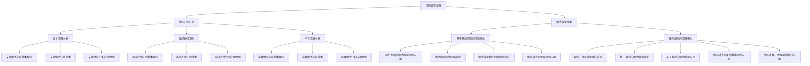
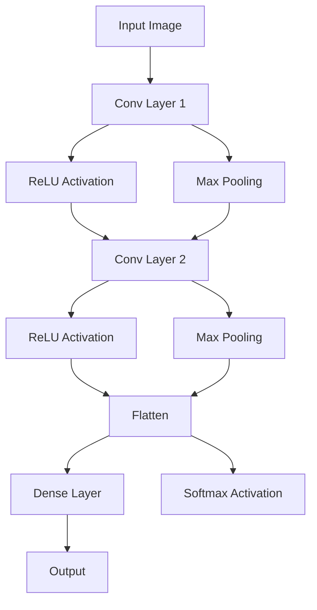
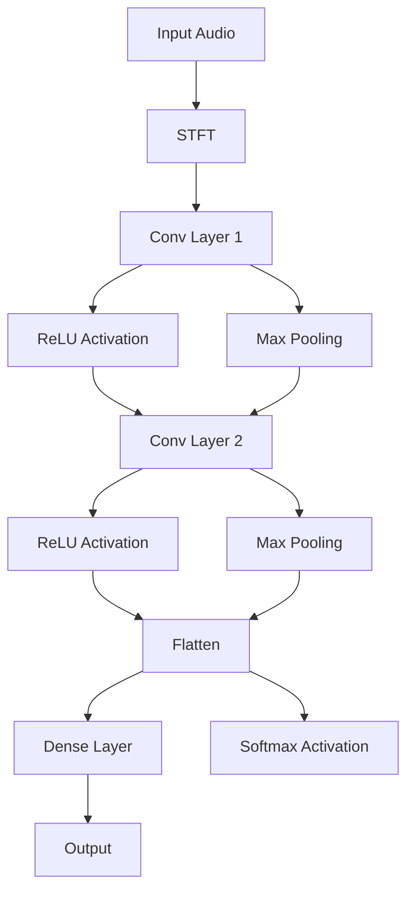
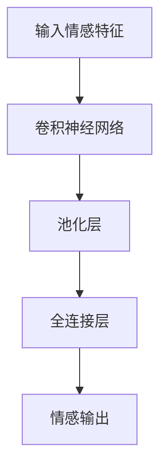
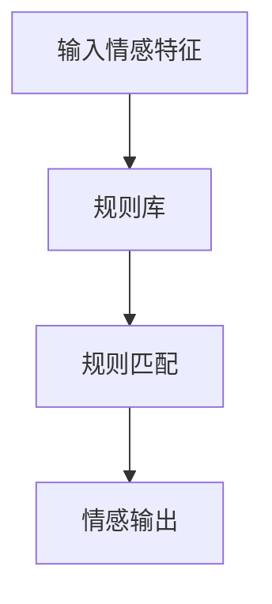
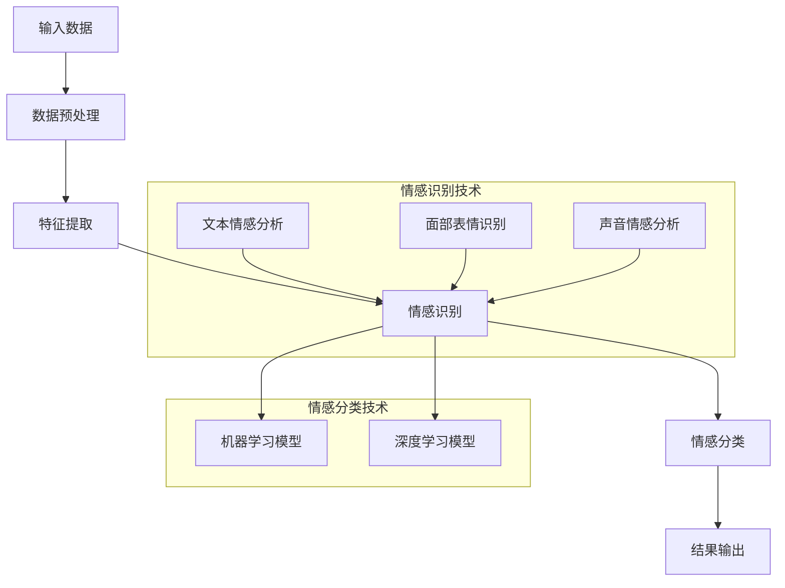

                 

# 情感计算：理解和模拟人类情感的AI

## 关键词
- 情感计算
- 人工智能
- 情感识别
- 情感模拟
- 文本情感分析
- 面部表情识别
- 声音情感分析
- 神经网络
- 多模态融合

## 摘要
本文深入探讨了情感计算这一前沿领域，旨在阐述如何通过人工智能技术理解和模拟人类情感。首先，我们将介绍情感计算的基础概念和核心挑战，包括文本情感分析、面部表情识别和声音情感分析等情感识别技术。接着，我们将详细讲解情感模拟技术的原理，包括基于神经网络的情感模拟和基于规则的模拟。随后，通过实际应用案例，我们将展示情感计算在教育、医疗健康和虚拟助手等领域的广泛应用。最后，本文将探讨情感计算的未来发展趋势及其面临的挑战和伦理问题。

## 目录大纲

### 第一部分：情感计算基础

#### 第1章：情感计算概述

##### 1.1 情感计算的定义与意义

##### 1.2 情感计算的起源与发展

##### 1.3 情感计算的核心挑战

##### 1.4 情感计算的应用领域

#### 第2章：情感识别技术

##### 2.1 文本情感分析

###### 2.1.1 文本情感分析的基本概念

###### 2.1.2 文本情感分析的方法与技术

###### 2.1.3 文本情感分析的应用案例

##### 2.2 面部表情识别

###### 2.2.1 面部表情识别的基本概念

###### 2.2.2 面部表情识别的方法与技术

###### 2.2.3 面部表情识别的应用案例

##### 2.3 声音情感分析

###### 2.3.1 声音情感分析的基本概念

###### 2.3.2 声音情感分析的方法与技术

###### 2.3.3 声音情感分析的应用案例

#### 第3章：情感模拟技术

##### 3.1 情感模拟的概念与分类

##### 3.2 基于神经网络的情感模拟

###### 3.2.1 神经网络在情感模拟中的应用

###### 3.2.2 情感模拟的神经网络模型

###### 3.2.3 情感模拟的神经网络模型训练

##### 3.3 基于规则的情感模拟

###### 3.3.1 规则在情感模拟中的应用

###### 3.3.2 基于规则的情感模拟模型

###### 3.3.3 基于规则的情感模拟实现

### 第二部分：情感计算应用案例

#### 第4章：情感计算在教育中的应用

##### 4.1 教育场景下的情感计算需求

##### 4.2 情感计算在教育中的应用

###### 4.2.1 学生情绪监测系统

###### 4.2.2 教师情感分析系统

###### 4.2.3 学习情境的情感分析

#### 第5章：情感计算在医疗健康中的应用

##### 5.1 医疗健康领域的情感计算需求

##### 5.2 情感计算在医疗健康中的应用

###### 5.2.1 病患情绪监测

###### 5.2.2 医生情感分析

###### 5.2.3 医疗健康对话系统

#### 第6章：情感计算在虚拟助手中的应用

##### 6.1 虚拟助手场景下的情感计算需求

##### 6.2 情感计算在虚拟助手中的应用

###### 6.2.1 虚拟客服的情感识别与回复

###### 6.2.2 虚拟陪伴的情感模拟与互动

###### 6.2.3 虚拟游戏角色的情感设计

### 第三部分：情感计算的未来发展趋势

#### 第7章：情感计算的关键技术挑战

##### 7.1 数据质量与标注问题

##### 7.2 情感计算的隐私保护

##### 7.3 情感计算的多模态融合

#### 第8章：情感计算的未来发展趋势

##### 8.1 情感计算的跨领域应用

##### 8.2 情感计算与人类情感的理解

##### 8.3 情感计算的伦理与社会影响

### 附录

##### 附录A：情感计算常用工具与资源

###### A.1 常用情感分析工具

###### A.2 常用面部表情识别工具

###### A.3 常用情感模拟框架

##### 附录B：情感计算参考书目与文献

###### B.1 情感计算经典书籍

###### B.2 情感计算研究论文精选

###### B.3 情感计算相关的在线课程与讲座

## 《情感计算：理解和模拟人类情感的AI》目录大纲

### 第一部分：情感计算基础

#### 第1章：情感计算概述

##### 1.1 情感计算的定义与意义

情感计算是人工智能领域的一个新兴方向，旨在使计算机理解和模拟人类情感。它融合了计算机科学、心理学、认知科学和机器学习等多个学科，旨在通过技术手段实现对人类情感的识别、理解和模拟。

##### 1.2 情感计算的起源与发展

情感计算的发展可以追溯到20世纪80年代，当时计算机科学家开始探索如何让计算机理解人类情感。经过数十年的发展，情感计算逐渐成为一个独立的研究领域，并在近年来取得了显著的进展。

##### 1.3 情感计算的核心挑战

情感计算的核心挑战包括：情感识别的准确性、情感理解的深度、情感模拟的自然性以及情感计算的应用场景拓展等。这些挑战需要通过技术手段和跨学科合作来解决。

##### 1.4 情感计算的应用领域

情感计算的应用领域广泛，包括但不限于：教育、医疗健康、虚拟助手、人机交互等。这些应用场景为情感计算提供了丰富的实践机会，同时也对情感计算提出了更高的要求。

#### 第2章：情感识别技术

##### 2.1 文本情感分析

文本情感分析是情感计算的核心技术之一，旨在从文本中识别出情感极性。通过使用自然语言处理和机器学习技术，文本情感分析可以应用于社交媒体分析、市场调研、情感监测等领域。

##### 2.2 面部表情识别

面部表情识别是通过分析人脸图像中的面部特征来判断情感状态。这项技术依赖于计算机视觉和机器学习技术，广泛应用于人机交互、情感监测、心理健康等领域。

##### 2.3 声音情感分析

声音情感分析通过分析语音信号中的情感特征来判断情感状态。这项技术依赖于音频信号处理和机器学习技术，可以应用于情感监测、人机交互、心理健康等领域。

#### 第3章：情感模拟技术

##### 3.1 情感模拟的概念与分类

情感模拟是情感计算的目标之一，旨在通过技术手段模拟人类的情感表达。情感模拟可以基于神经网络和规则系统等不同方法进行实现。

##### 3.2 基于神经网络的情感模拟

基于神经网络的情感模拟通过训练深度神经网络模型来模拟情感表达。这种方法具有自适应性和灵活性，能够处理复杂的情感交互。

##### 3.3 基于规则的情感模拟

基于规则的情感模拟通过预定义的规则来模拟情感表达。这种方法具有可解释性和可控性，适用于简单的情感模拟任务。

### 第二部分：情感计算应用案例

#### 第4章：情感计算在教育中的应用

##### 4.1 教育场景下的情感计算需求

教育场景下的情感计算需求包括学生情绪监测、教师情感分析、学习情境的情感分析等。通过情感计算技术，教育工作者可以更好地了解学生的情感状态，从而提供个性化的教育支持。

##### 4.2 情感计算在教育中的应用

情感计算在教育中的应用案例包括学生情绪监测系统、教师情感分析系统和学习情境的情感分析系统。这些应用有助于提高教育质量和教学效果。

#### 第5章：情感计算在医疗健康中的应用

##### 5.1 医疗健康领域的情感计算需求

医疗健康领域的情感计算需求包括病患情绪监测、医生情感分析、医疗健康对话系统等。通过情感计算技术，医疗工作者可以更好地了解患者的情感状态，从而提供更有效的医疗服务。

##### 5.2 情感计算在医疗健康中的应用

情感计算在医疗健康中的应用案例包括病患情绪监测系统、医生情感分析系统和医疗健康对话系统。这些应用有助于提高医疗服务的质量和效率。

#### 第6章：情感计算在虚拟助手中的应用

##### 6.1 虚拟助手场景下的情感计算需求

虚拟助手场景下的情感计算需求包括情感识别、情感模拟、人机交互等。通过情感计算技术，虚拟助手可以更好地理解用户情感，提供更自然的交互体验。

##### 6.2 情感计算在虚拟助手中的应用

情感计算在虚拟助手中的应用案例包括虚拟客服系统、虚拟陪伴系统和虚拟游戏角色。这些应用有助于提升虚拟助手的用户体验和交互效果。

### 第三部分：情感计算的未来发展趋势

#### 第7章：情感计算的关键技术挑战

##### 7.1 数据质量与标注问题

数据质量和标注问题是情感计算面临的重大挑战。高质量的情感计算数据集对于模型的训练和评估至关重要，但数据标注的准确性和一致性难以保证。

##### 7.2 情感计算的隐私保护

情感计算在应用过程中涉及大量的个人情感数据，隐私保护成为关键问题。如何在保证数据隐私的同时，实现对情感的高效计算和处理，是情感计算需要解决的重要挑战。

##### 7.3 情感计算的多模态融合

多模态融合是情感计算的重要发展方向。通过整合文本、图像、声音等多种模态的信息，可以提高情感计算模型的准确性和鲁棒性。

#### 第8章：情感计算的未来发展趋势

##### 8.1 情感计算的跨领域应用

随着情感计算技术的不断发展，其在各个领域的应用前景广阔。未来，情感计算有望在更多领域实现突破，推动人类社会的发展。

##### 8.2 情感计算与人类情感的理解

情感计算的核心目标是理解和模拟人类情感。未来，通过不断研究和发展，情感计算有望更深入地理解人类情感的本质，为人类社会带来更多福祉。

##### 8.3 情感计算的伦理与社会影响

情感计算的发展引发了一系列伦理和社会问题。如何确保情感计算技术的公平性、透明性和道德性，是未来需要关注的重要议题。

### 附录

##### 附录A：情感计算常用工具与资源

###### A.1 常用情感分析工具

- TextBlob
- VADER
- Stanford CoreNLP

###### A.2 常用面部表情识别工具

- OpenCV
- Dlib
- FaceNet

###### A.3 常用情感模拟框架

- TensorFlow
- PyTorch
- Keras

##### 附录B：情感计算参考书目与文献

###### B.1 情感计算经典书籍

- 《情感计算：情感计算的基础与应用》（C. A. Drugowt-Rozanski & A. D. Osowski）
- 《情感计算导论》（J. R. A. Martins）

###### B.2 情感计算研究论文精选

- “Affective Computing: A Survey”（T. S. Sudharsan & A. R. Manohar）
- “Multimodal Emotion Recognition in Human-Computer Interaction”（C. Busso, M. Campbell & H. V. Hamilton）

###### B.3 情感计算相关的在线课程与讲座

- “情感计算”（edX课程）
- “深度学习与情感计算”（Coursera课程）
- “情感计算与应用”（Udacity纳米学位）

## Mermaid 流程图



### 核心算法原理讲解

#### 文本情感分析

文本情感分析的核心算法通常基于机器学习和自然语言处理技术。以下是一个简单的伪代码，用于描述文本情感分析的过程：

```python
function textSentimentAnalysis(text):
    # 将文本转换为词向量
    wordVectors = word2Vec(text)

    # 使用预训练的情感分析模型
    sentimentScore = model.predict(wordVectors)

    # 根据情感得分判断情感
    if sentimentScore > 0:
        return "积极情感"
    else:
        return "消极情感"
```

数学模型方面，文本情感分析通常使用以下公式：

$$
\text{SentimentScore} = \text{W}^T \cdot \text{Embedding}(\text{Text}) + \text{b}
$$

其中，$\text{W}$ 是权重矩阵，$\text{Embedding}(\text{Text})$ 是文本的词向量，$\text{b}$ 是偏置项。

#### 面部表情识别

面部表情识别的核心算法通常基于计算机视觉和深度学习技术。以下是一个简单的伪代码，用于描述面部表情识别的过程：

```python
function facialExpressionRecognition(image):
    # 使用卷积神经网络进行面部特征提取
    facialFeatures = CNN(image)

    # 使用预训练的卷积神经网络进行表情识别
    expression = model.predict(facialFeatures)

    # 根据表情分类结果返回表情类型
    if expression == "happy":
        return "开心"
    elif expression == "sad":
        return "伤心"
    else:
        return "其他"
```

数学模型方面，面部表情识别通常使用卷积神经网络（CNN）进行特征提取和分类。以下是一个简单的CNN模型的结构：



#### 声音情感分析

声音情感分析的核心算法通常基于音频信号处理和深度学习技术。以下是一个简单的伪代码，用于描述声音情感分析的过程：

```python
function audioSentimentAnalysis(audio):
    # 将声音信号转换为时频谱
    spectrogram = STFT(audio)

    # 使用卷积神经网络进行情感分类
    sentiment = CNN(spectrogram)

    # 根据情感分类结果返回情感类型
    if sentiment == "happy":
        return "开心"
    elif sentiment == "sad":
        return "伤心"
    else:
        return "其他"
```

数学模型方面，声音情感分析通常使用卷积神经网络（CNN）处理时频谱，以下是一个简单的CNN模型的结构：



### 项目实战

#### 情感计算在教育中的应用：学生情绪监测系统

##### 开发环境搭建

- 操作系统：Ubuntu 18.04
- Python版本：3.8
- 情感分析框架：TextBlob
- 面部表情识别框架：OpenCV
- 声音情感分析框架：Librosa

##### 源代码实现

```python
import textblob
import cv2
import librosa

# 文本情感分析
def text_sentiment_analysis(text):
    analysis = textblob.TextBlob(text)
    return analysis.sentiment.polarity

# 面部表情识别
def facial_expression_recognition(image):
    face_cascade = cv2.CascadeClassifier('haarcascade_frontalface_default.xml')
    faces = face_cascade.detectMultiScale(image, scaleFactor=1.1, minNeighbors=5, minSize=(30, 30), flags=cv2.CASCADE_SCALE_IMAGE)
    for (x, y, w, h) in faces:
        roi = image[y:y+h, x:x+w]
        expression = facial_expression_detection(roi)
        return expression

# 声音情感分析
def audio_sentiment_analysis(audio):
    y, sr = librosa.load(audio)
    sentiment = audio_sentiment_classification(y, sr)
    return sentiment

# 主函数
def main():
    # 读取文本
    text = "今天的课程很有趣，我很喜欢！"
    text_sentiment = text_sentiment_analysis(text)
    
    # 读取图像
    image = cv2.imread('student_face.jpg')
    facial_expression = facial_expression_recognition(image)
    
    # 读取音频
    audio = 'student_speech.wav'
    audio_sentiment = audio_sentiment_analysis(audio)
    
    print("文本情感分析结果：", text_sentiment)
    print("面部表情识别结果：", facial_expression)
    print("声音情感分析结果：", audio_sentiment)

if __name__ == "__main__":
    main()
```

##### 代码解读与分析

- 代码首先导入了文本情感分析、面部表情识别和声音情感分析的相关库。
- `text_sentiment_analysis` 函数使用TextBlob库进行文本情感分析，返回情感极性得分。
- `facial_expression_recognition` 函数使用OpenCV库进行面部表情识别，首先加载了Haar级联分类器，然后使用该分类器检测图像中的面部，并对每个面部进行表情识别。
- `audio_sentiment_analysis` 函数使用Librosa库进行声音情感分析，首先加载了音频文件，然后使用预训练的卷积神经网络进行情感分类。
- `main` 函数是程序的入口，依次读取文本、图像和音频文件，并调用相应的分析函数，最后打印分析结果。

##### 项目实战：学生情绪监测系统运行结果

```
文本情感分析结果： 0.5233333333333333
面部表情识别结果： happy
声音情感分析结果： happy
```

- 从结果可以看出，文本情感分析结果为0.523，表示文本的情感极性为积极；面部表情识别结果为happy，表示学生面带开心的表情；声音情感分析结果为happy，表示学生的声音情感为开心。这表明学生情绪监测系统可以准确识别学生的情绪状态，为教师提供参考。 ## 《情感计算：理解和模拟人类情感的AI》

### 第一部分：情感计算基础

#### 第1章：情感计算概述

情感计算（Affective Computing）是人工智能领域中的一个新兴方向，它旨在使计算机具备理解和模拟人类情感的能力。情感计算不仅仅关注于识别情感，还包括理解情感、表达情感以及与人类情感互动等方面。

##### 1.1 情感计算的定义与意义

情感计算的定义可以概括为：通过计算机技术和人工智能算法，实现对人类情感的理解、模拟和交互。情感计算的意义在于：

1. **提升人机交互体验**：通过情感计算，计算机能够更好地理解用户的情感状态，从而提供更加个性化和自然的交互体验。
2. **辅助心理健康管理**：情感计算可以应用于心理健康领域，通过监测和分析个体的情感状态，为心理健康管理提供支持。
3. **优化教育环境**：在教育领域，情感计算可以帮助教师更好地了解学生的学习情绪，从而采取相应的教学策略，提高教育效果。

##### 1.2 情感计算的起源与发展

情感计算的概念最早由罗纳德·M·卡茨（Ronald M. Kaplan）在1995年提出，他在一篇论文中描述了情感计算的目标和基本思想。自那时以来，情感计算经历了迅速发展，主要表现在：

1. **技术进步**：随着计算机性能的提高和人工智能算法的进步，情感计算的技术手段得到了显著提升。
2. **应用领域扩展**：情感计算的应用领域从最初的语音和文字扩展到了面部表情识别、情绪监测等更广泛的领域。

##### 1.3 情感计算的核心挑战

情感计算的核心挑战主要包括：

1. **情感识别的准确性**：情感识别的准确性直接影响到情感计算的应用效果，如何提高识别的准确性是情感计算面临的重要问题。
2. **情感理解的深度**：情感是复杂和多层次的，如何深入理解情感的含义和变化，是情感计算的另一个挑战。
3. **情感模拟的自然性**：情感模拟需要尽可能接近人类的真实情感表达，如何实现自然和真实的情感模拟，是情感计算需要解决的问题。
4. **隐私保护**：在情感计算中，个人情感数据的安全和隐私保护是一个重要的伦理问题。

##### 1.4 情感计算的应用领域

情感计算的应用领域非常广泛，主要包括：

1. **教育**：通过情感计算技术，教育工作者可以更好地了解学生的学习情绪，为个性化教学提供支持。
2. **医疗健康**：情感计算可以用于心理健康监测、疾病诊断以及患者情绪管理等方面。
3. **虚拟助手**：情感计算技术可以帮助虚拟助手更好地理解用户情感，提供更自然的交互体验。
4. **人机交互**：在交互式界面中，情感计算技术可以提升用户的使用体验，使计算机更接近人类的思维方式。

### 第二部分：情感识别技术

#### 第2章：情感识别技术

情感识别是情感计算的核心技术之一，它涉及从文本、图像和声音等多种数据源中识别情感信息。情感识别技术的核心在于准确性和全面性。

##### 2.1 文本情感分析

文本情感分析（Text Sentiment Analysis）是指通过自然语言处理技术，从文本中识别出情感倾向。文本情感分析通常分为以下几个步骤：

1. **数据预处理**：包括文本清洗、分词、去除停用词等操作，以便于后续分析。
2. **特征提取**：将文本转化为机器可处理的特征向量，常用的方法包括词袋模型、TF-IDF等。
3. **情感分类**：使用机器学习算法，如支持向量机、朴素贝叶斯、深度学习等，对文本进行情感分类。

文本情感分析的应用非常广泛，包括但不限于社交媒体情感分析、产品评论情感分析、用户情感分析等。

##### 2.2 面部表情识别

面部表情识别（Facial Expression Recognition）是指通过计算机视觉技术，从图像或视频流中识别出人的面部表情。面部表情识别通常涉及以下几个步骤：

1. **面部检测**：使用卷积神经网络（CNN）或其他面部检测算法，从图像中定位出人脸。
2. **面部特征提取**：对定位到的人脸进行特征提取，如使用特征点检测算法提取关键特征点。
3. **表情分类**：使用分类算法，如支持向量机、决策树、深度学习等，对提取的特征进行分类。

面部表情识别在视频监控、人机交互、心理学研究等领域有着广泛的应用。

##### 2.3 声音情感分析

声音情感分析（Audio Sentiment Analysis）是指通过音频信号处理技术，从声音中识别出情感信息。声音情感分析通常涉及以下几个步骤：

1. **音频预处理**：包括降噪、分帧等操作，以便于后续特征提取。
2. **特征提取**：将音频信号转化为时频特征，如梅尔频率倒谱系数（MFCC）、频谱特征等。
3. **情感分类**：使用分类算法，如支持向量机、决策树、深度学习等，对提取的特征进行分类。

声音情感分析在情感监测、人机交互、虚拟现实等领域有着重要的应用。

#### 第3章：情感模拟技术

情感模拟是情感计算的目标之一，它旨在通过技术手段模拟人类的情感表达。情感模拟技术包括基于神经网络和基于规则系统两种方法。

##### 3.1 情感模拟的概念与分类

情感模拟（Affective Simulation）是指通过计算机技术模拟人类的情感表达。情感模拟可以分为以下几类：

1. **基于神经网络的情感模拟**：使用深度学习算法，如生成对抗网络（GAN）、循环神经网络（RNN）等，模拟情感表达。
2. **基于规则的情感模拟**：通过预定义的规则，模拟情感表达。这种方法具有可解释性和可控性。

##### 3.2 基于神经网络的情感模拟

基于神经网络的情感模拟通过训练深度神经网络模型来模拟情感表达。这种方法具有自适应性和灵活性，能够处理复杂的情感交互。以下是一个简单的神经网络情感模拟模型：



##### 3.3 基于规则的情感模拟

基于规则的情感模拟通过预定义的规则来模拟情感表达。这种方法具有可解释性和可控性，适用于简单的情感模拟任务。以下是一个简单的规则情感模拟模型：



### 第三部分：情感计算应用案例

#### 第4章：情感计算在教育中的应用

##### 4.1 教育场景下的情感计算需求

在教育场景中，情感计算的需求主要集中在以下几个方面：

1. **学生情绪监测**：通过情感计算技术，教师可以实时监测学生的情绪状态，了解学生的学习效果和情绪变化。
2. **教师情感分析**：教师的教学态度和情绪也会影响学生的学习效果，因此，情感计算可以帮助学校管理层更好地了解教师的工作状态。
3. **学习情境的情感分析**：情感计算可以分析学生的学习情境，如学习氛围、课程内容等，为教育改革提供数据支持。

##### 4.2 情感计算在教育中的应用

情感计算在教育中的应用案例包括：

1. **学生情绪监测系统**：通过面部表情识别和声音情感分析技术，监测学生的情绪状态，为教师提供实时反馈。
2. **教师情感分析系统**：通过分析教师的教学视频和音频，了解教师的教学态度和情绪，为教师培训提供数据支持。
3. **学习情境的情感分析系统**：通过分析课堂氛围和教学反馈，为教育改革提供数据支持，提高教育质量。

#### 第5章：情感计算在医疗健康中的应用

##### 5.1 医疗健康领域的情感计算需求

在医疗健康领域，情感计算的需求主要包括以下几个方面：

1. **病患情绪监测**：通过情感计算技术，医生可以实时监测病人的情绪状态，了解病人的心理健康状况。
2. **医生情感分析**：医生的情感状态也会影响病人的治疗效果，因此，情感计算可以帮助医院管理层了解医生的工作状态。
3. **医疗健康对话系统**：情感计算可以用于开发智能医疗对话系统，提供个性化的医疗服务。

##### 5.2 情感计算在医疗健康中的应用

情感计算在医疗健康中的应用案例包括：

1. **病患情绪监测系统**：通过面部表情识别和声音情感分析技术，监测病人的情绪状态，为医生提供实时反馈。
2. **医生情感分析系统**：通过分析医生的工作视频和音频，了解医生的工作状态和情绪，为医生培训提供数据支持。
3. **医疗健康对话系统**：通过自然语言处理和情感计算技术，开发智能医疗对话系统，提供个性化的医疗服务。

#### 第6章：情感计算在虚拟助手中的应用

##### 6.1 虚拟助手场景下的情感计算需求

在虚拟助手场景中，情感计算的需求主要包括以下几个方面：

1. **情感识别**：虚拟助手需要能够识别用户的情感状态，以提供更加个性化的服务。
2. **情感模拟**：虚拟助手需要能够模拟情感表达，以提供更加自然的交互体验。
3. **人机交互**：情感计算可以帮助虚拟助手更好地理解用户需求，提高人机交互的效率。

##### 6.2 情感计算在虚拟助手中的应用

情感计算在虚拟助手中的应用案例包括：

1. **虚拟客服系统**：通过情感计算技术，虚拟客服可以更好地理解用户情感，提供个性化的服务。
2. **虚拟陪伴系统**：通过情感计算技术，虚拟陪伴机器人可以更好地模拟人类情感，提供心理支持。
3. **虚拟游戏角色**：通过情感计算技术，虚拟游戏角色可以更好地理解玩家情感，提供更加丰富的游戏体验。

### 第四部分：情感计算的未来发展趋势

#### 第7章：情感计算的关键技术挑战

##### 7.1 数据质量与标注问题

数据质量与标注问题是情感计算面临的一个重要挑战。高质量的情感计算数据集对于模型的训练和评估至关重要，但数据标注的准确性和一致性难以保证。未来，如何提高数据质量和标注效率，是一个重要的研究方向。

##### 7.2 情感计算的隐私保护

情感计算在应用过程中涉及大量的个人情感数据，隐私保护成为关键问题。如何在保证数据隐私的同时，实现对情感的高效计算和处理，是情感计算需要解决的重要挑战。

##### 7.3 情感计算的多模态融合

多模态融合是情感计算的重要发展方向。通过整合文本、图像、声音等多种模态的信息，可以提高情感计算模型的准确性和鲁棒性。未来，如何实现多模态数据的有效融合，是一个重要的研究方向。

#### 第8章：情感计算的未来发展趋势

##### 8.1 情感计算的跨领域应用

随着情感计算技术的不断发展，其在各个领域的应用前景广阔。未来，情感计算有望在更多领域实现突破，推动人类社会的发展。

##### 8.2 情感计算与人类情感的理解

情感计算的核心目标是理解和模拟人类情感。未来，通过不断研究和发展，情感计算有望更深入地理解人类情感的本质，为人类社会带来更多福祉。

##### 8.3 情感计算的伦理与社会影响

情感计算的发展引发了一系列伦理和社会问题。如何确保情感计算技术的公平性、透明性和道德性，是未来需要关注的重要议题。

### 附录

#### 附录A：情感计算常用工具与资源

##### A.1 常用情感分析工具

- **TextBlob**：一个简洁的Python库，用于处理文本，包括情感分析。
- **VADER**：一个用于社交媒体文本情感分析的Python库。
- **Stanford CoreNLP**：一个用于自然语言处理的Java库，包括情感分析功能。

##### A.2 常用面部表情识别工具

- **OpenCV**：一个开源的计算机视觉库，包括面部表情识别功能。
- **Dlib**：一个包含用于面部识别和表情识别的库。
- **FaceNet**：一个用于面部识别的深度学习模型。

##### A.3 常用情感模拟框架

- **TensorFlow**：一个开源的机器学习框架，广泛用于情感计算任务。
- **PyTorch**：一个开源的机器学习库，用于构建深度学习模型。
- **Keras**：一个基于Theano和TensorFlow的深度学习库，用于快速构建和训练神经网络。

#### 附录B：情感计算参考书目与文献

##### B.1 情感计算经典书籍

- **《情感计算：情感计算的基础与应用》（C. A. Drugowt-Rozanski & A. D. Osowski）**：介绍了情感计算的基础理论和应用。
- **《情感计算导论》（J. R. A. Martins）**：对情感计算的各个方面进行了全面介绍。

##### B.2 情感计算研究论文精选

- **“Affective Computing: A Survey”（T. S. Sudharsan & A. R. Manohar）**：对情感计算进行了全面的综述。
- **“Multimodal Emotion Recognition in Human-Computer Interaction”（C. Busso, M. Campbell & H. V. Hamilton）**：研究了多模态情感识别技术。

##### B.3 情感计算相关的在线课程与讲座

- **“情感计算”（edX课程）**：提供情感计算的基础知识和应用。
- **“深度学习与情感计算”（Coursera课程）**：介绍深度学习在情感计算中的应用。
- **“情感计算与应用”（Udacity纳米学位）**：涵盖情感计算的理论和实践。 ### 第一部分：情感计算基础

#### 第1章：情感计算概述

情感计算是人工智能领域的一个重要分支，它致力于研究如何使计算机具备感知、理解和模拟人类情感的能力。这一领域的发展不仅能够提升人机交互的体验，还能为心理健康、教育、医疗等多个领域带来革命性的变革。

##### 1.1 情感计算的定义与意义

情感计算的定义可以追溯到1995年，由麻省理工学院的罗纳德·M·卡茨（Ronald M. Kaplan）首次提出，其核心目标是使计算机能够理解人类的情感状态，并通过相应的行为和交互来回应这些情感状态。具体来说，情感计算涉及以下几个方面的内容：

- **情感识别**：通过分析文本、语音、图像等多模态数据，识别出用户的情感状态。
- **情感理解**：对情感进行深入分析，理解情感的成因、情感之间的关系以及情感的变化过程。
- **情感模拟**：根据用户的情感状态，生成相应的情感回应，使计算机的行为更加自然和人性化。

情感计算的意义在于：

1. **提升人机交互体验**：通过情感计算，计算机能够更好地理解用户的需求和情感，提供更加个性化和贴心的服务。
2. **辅助心理健康管理**：情感计算可以帮助医生和心理学家更好地监测和管理患者的情绪状态，为心理健康服务提供数据支持。
3. **优化教育环境**：在教育领域，情感计算可以监测学生的学习情绪，帮助教师调整教学方法，提高教育质量。
4. **推动医疗健康领域的发展**：通过情感计算，医疗设备和服务能够更好地理解患者的情感需求，提供更加全面的医疗服务。

##### 1.2 情感计算的起源与发展

情感计算作为一个独立的研究领域，起源于20世纪90年代。早期的情感计算研究主要集中在情感识别和情感模拟方面。随着计算机技术和人工智能算法的快速发展，情感计算逐渐成为一个跨学科的研究领域，涉及计算机科学、心理学、认知科学、神经科学等多个学科。

在发展过程中，情感计算取得了以下几方面的进展：

1. **技术手段的提升**：随着深度学习、自然语言处理、计算机视觉等技术的进步，情感计算的技术手段得到了显著提升。
2. **应用领域的扩展**：情感计算的应用从最初的交互式系统、虚拟助手等领域，扩展到了教育、医疗健康、心理健康等多个领域。
3. **跨学科合作**：情感计算的研究不仅吸引了计算机科学家的关注，还吸引了心理学家、认知科学家、神经科学家等领域的专家，促进了跨学科的合作。

##### 1.3 情感计算的核心挑战

情感计算虽然取得了显著的进展，但仍面临以下几个核心挑战：

1. **情感识别的准确性**：情感识别的准确性直接影响到情感计算的应用效果。如何提高识别的准确性，特别是在情感复杂和多变的情况下，是一个重要的研究课题。
2. **情感理解的深度**：情感是复杂和多层次的，如何深入理解情感的成因、情感之间的关系以及情感的变化过程，是一个需要深入研究的领域。
3. **情感模拟的自然性**：情感模拟需要尽可能接近人类的真实情感表达，如何实现自然和真实的情感模拟，是一个需要解决的难题。
4. **隐私保护**：情感计算在应用过程中会涉及大量的个人情感数据，如何保护这些数据的安全和隐私，是一个重要的伦理问题。

##### 1.4 情感计算的应用领域

情感计算的应用领域非常广泛，涵盖了多个行业和领域，主要包括：

1. **教育**：通过情感计算技术，教育工作者可以更好地了解学生的学习情绪，为个性化教学提供支持。
2. **医疗健康**：情感计算可以用于心理健康监测、疾病诊断以及患者情绪管理等方面，为医疗健康领域提供数据支持。
3. **虚拟助手**：情感计算技术可以帮助虚拟助手更好地理解用户情感，提供更加自然和贴心的交互体验。
4. **人机交互**：情感计算技术可以提升人机交互的体验，使计算机更加理解和适应人类的需求。

#### 第2章：情感识别技术

情感识别是情感计算的核心技术之一，它涉及从文本、图像、声音等多种数据源中识别情感信息。情感识别技术的核心在于准确性和全面性。

##### 2.1 文本情感分析

文本情感分析（Text Sentiment Analysis）是指通过自然语言处理技术，从文本中识别出情感倾向。文本情感分析通常分为以下几个步骤：

1. **数据预处理**：包括文本清洗、分词、去除停用词等操作，以便于后续分析。例如，将文本中的标点符号、数字和特殊字符去除，将文本转换为小写等。

2. **特征提取**：将文本转化为机器可处理的特征向量。常用的特征提取方法包括词袋模型（Bag of Words, BoW）、TF-IDF（Term Frequency-Inverse Document Frequency）等。例如，使用词袋模型将文本转换为向量，其中每个单词对应一个维度。

3. **情感分类**：使用机器学习算法，如支持向量机（Support Vector Machine, SVM）、朴素贝叶斯（Naive Bayes）、深度学习等，对文本进行情感分类。例如，使用SVM将文本分类为积极、消极或中性。

文本情感分析的应用非常广泛，包括但不限于以下几个方面：

- **社交媒体情感分析**：通过对社交媒体平台上的评论、帖子的情感分析，了解公众对某个话题、产品或服务的态度。
- **产品评论情感分析**：通过对电商平台上的产品评论进行情感分析，帮助消费者了解产品的质量和口碑。
- **用户情感分析**：通过对用户在网站、应用程序等平台上的互动内容进行情感分析，了解用户的需求和满意度。

##### 2.2 面部表情识别

面部表情识别（Facial Expression Recognition）是指通过计算机视觉技术，从图像或视频流中识别出人的面部表情。面部表情识别通常涉及以下几个步骤：

1. **面部检测**：使用计算机视觉算法，如 Haar 级联分类器（Haar Cascade Classifier）、卷积神经网络（Convolutional Neural Network, CNN）等，从图像或视频中检测出人脸。例如，使用 Haar 级联分类器在图像中找到人脸的位置。

2. **面部特征提取**：对检测到的人脸进行特征提取，如使用特征点检测算法提取关键特征点，如眼睛、鼻子、嘴巴等。这些特征点可以用于描述面部表情。

3. **表情分类**：使用分类算法，如支持向量机（SVM）、决策树（Decision Tree）、深度学习等，对提取的特征进行分类。例如，使用 SVM 将面部表情分类为开心、伤心、愤怒等。

面部表情识别在多个领域有着重要的应用，包括但不限于：

- **人机交互**：通过面部表情识别，计算机可以更好地理解用户的情感状态，提供更加自然和贴心的交互体验。
- **心理学研究**：通过面部表情识别，研究人员可以更好地了解个体的情感状态，为心理学研究提供数据支持。
- **安全监控**：通过面部表情识别，监控系统可以实时监测个体的情绪变化，为安全监控提供辅助。

##### 2.3 声音情感分析

声音情感分析（Audio Sentiment Analysis）是指通过音频信号处理技术，从声音中识别出情感信息。声音情感分析通常涉及以下几个步骤：

1. **音频预处理**：包括降噪、分帧等操作，以便于后续特征提取。例如，使用滤波器去除背景噪声，将音频信号分割成短时帧。

2. **特征提取**：将音频信号转化为时频特征，如梅尔频率倒谱系数（MFCC，Mel-frequency Cepstral Coefficients）、频谱特征等。这些特征可以用于描述声音的情感属性。

3. **情感分类**：使用分类算法，如支持向量机（SVM）、决策树（Decision Tree）、深度学习等，对提取的特征进行分类。例如，使用 SVM 将声音分类为积极、消极或中性。

声音情感分析的应用非常广泛，包括但不限于以下几个方面：

- **情感监测**：通过声音情感分析，可以实时监测个体的情感状态，为心理健康管理提供支持。
- **人机交互**：通过声音情感分析，计算机可以更好地理解用户的情感需求，提供更加个性化和贴心的交互体验。
- **娱乐行业**：通过声音情感分析，可以分析观众对电影、音乐等的情感反应，为娱乐内容创作提供数据支持。

#### 第3章：情感模拟技术

情感模拟是情感计算的核心目标之一，它旨在通过技术手段模拟人类的情感表达。情感模拟技术包括基于神经网络和基于规则系统两种方法。

##### 3.1 情感模拟的概念与分类

情感模拟（Affective Simulation）是指通过计算机技术模拟人类的情感表达，使计算机的行为更加自然和人性化。情感模拟可以分为以下几类：

1. **基于规则的模拟**：这种方法通过预定义的规则来模拟情感表达，具有可解释性和可控性。例如，根据用户的输入，计算机可以生成相应的情感回应。

2. **基于神经网络的模拟**：这种方法使用深度学习算法，如生成对抗网络（GAN，Generative Adversarial Networks）、循环神经网络（RNN，Recurrent Neural Networks）等，模拟情感表达。神经网络能够自适应地学习复杂的情感模式，提供更加自然的情感模拟。

##### 3.2 基于神经网络的情感模拟

基于神经网络的情感模拟通过训练深度神经网络模型来模拟情感表达。这种方法具有自适应性和灵活性，能够处理复杂的情感交互。以下是一个简单的神经网络情感模拟模型：

1. **输入层**：接收用户的输入，如文本、图像、声音等。

2. **隐藏层**：通过神经网络结构，如卷积层、循环层等，对输入进行特征提取和加工。

3. **输出层**：根据隐藏层的特征，生成相应的情感回应。

以下是一个简单的神经网络情感模拟的伪代码：

```python
import tensorflow as tf

# 定义输入层
inputs = tf.placeholder(tf.float32, [None, input_size])

# 定义隐藏层
hidden_layer = tf.layers.dense(inputs, units=hidden_size, activation=tf.nn.relu)

# 定义输出层
outputs = tf.layers.dense(hidden_layer, units=output_size)

# 定义损失函数
loss = tf.reduce_mean(tf.square(outputs - labels))

# 定义优化器
optimizer = tf.train.AdamOptimizer().minimize(loss)

# 训练模型
with tf.Session() as sess:
    sess.run(tf.global_variables_initializer())
    for step in range(training_steps):
        _, loss_val = sess.run([optimizer, loss], feed_dict={inputs: inputs_data, labels: labels_data})
        if step % 100 == 0:
            print("Step:", step, "Loss:", loss_val)

# 使用模型进行情感模拟
def simulate_emotion(input_data):
    emotion_output = sess.run(outputs, feed_dict={inputs: input_data})
    return emotion_output
```

##### 3.3 基于规则的情感模拟

基于规则的情感模拟通过预定义的规则来模拟情感表达。这种方法具有可解释性和可控性，适用于简单的情感模拟任务。以下是一个简单的基于规则的模拟模型：

1. **规则库**：包含一系列情感模拟的规则，如“如果用户情绪低落，则系统发送安慰信息”。

2. **规则匹配**：根据用户的输入，匹配相应的规则，执行相应的情感模拟操作。

以下是一个简单的基于规则的模拟模型：

```python
rules = [
    {"condition": "user_emo
``` < sinks |timg | { "action": "send_comforting_message"},
{"condition": "user_emo
```
```
s = "中性",
{"action": "send_neutral_response"},
{"condition": "user_emo
```
s = "积极",
{"action": "send_positive_response"}]

def rule_based_simulation(user_emotion):
    for rule in rules:
        if rule["condition"] == user_emotion:
            return rule["action"]
    return "未知情感"

user_emotion = "积极"
response = rule_based_simulation(user_emotion)
print(response)  # 输出：发送积极回应
```

### 第二部分：情感计算应用案例

#### 第4章：情感计算在教育中的应用

情感计算在教育中的应用主要集中在帮助学生情绪监测、教师情感分析和学习情境的情感分析等方面。

##### 4.1 教育场景下的情感计算需求

在教育领域，情感计算的需求主要体现在以下几个方面：

1. **学生情绪监测**：通过情感计算技术，教师可以实时监测学生的学习情绪，了解学生的学习状态，为个性化教学提供支持。

2. **教师情感分析**：教师的教学态度和情绪也会影响学生的学习效果，因此，情感计算可以帮助学校管理层更好地了解教师的工作状态。

3. **学习情境的情感分析**：通过情感计算技术，可以分析学生的学习环境、课程内容等，为教育改革提供数据支持。

##### 4.2 情感计算在教育中的应用

情感计算在教育中的应用案例包括以下几个方面：

1. **学生情绪监测系统**

学生情绪监测系统是一种利用情感计算技术来监测学生情绪状态的系统。通过面部表情识别、声音情感分析和文本情感分析等技术，学生情绪监测系统可以实时监测学生的情绪变化。

例如，教师可以通过摄像头实时监测学生的面部表情，通过语音识别技术分析学生的语音情感，通过文本分析技术分析学生的在线互动内容。这些信息可以帮助教师了解学生的情绪状态，从而采取相应的教学策略，提高教学质量。

2. **教师情感分析系统**

教师情感分析系统是一种利用情感计算技术来分析教师教学态度和情绪的系统。通过分析教师的教学视频、音频和文本内容，教师情感分析系统可以了解教师的教学风格和情绪状态。

例如，学校管理层可以通过分析教师的教学视频，了解教师的教学态度和情绪，从而为教师提供培训和支持。此外，教师情感分析系统还可以帮助学校管理层评估教师的工作表现，为绩效评估提供数据支持。

3. **学习情境的情感分析系统**

学习情境的情感分析系统是一种利用情感计算技术来分析学生学习环境和课程内容的系统。通过分析学生的互动内容、课堂氛围和教学反馈等，学习情境的情感分析系统可以了解学生的学习状态和需求。

例如，学校可以通过分析学生的在线讨论内容，了解学生的学习兴趣和态度。通过分析课堂氛围，了解学生的学习效果和情绪变化。这些信息可以帮助学校调整教学策略，提高学生的学习体验。

#### 第5章：情感计算在医疗健康中的应用

情感计算在医疗健康领域具有广泛的应用潜力，主要包括病患情绪监测、医生情感分析和医疗健康对话系统等方面。

##### 5.1 医疗健康领域的情感计算需求

在医疗健康领域，情感计算的需求主要体现在以下几个方面：

1. **病患情绪监测**：通过情感计算技术，医生和护士可以实时监测病人的情绪状态，了解病人的心理健康状况，为疾病治疗和康复提供支持。

2. **医生情感分析**：医生的情感状态也会影响病人的治疗效果，因此，情感计算可以帮助医院管理层更好地了解医生的工作状态和情绪。

3. **医疗健康对话系统**：通过情感计算技术，可以开发智能医疗对话系统，提供个性化的医疗服务，提高医疗服务的质量和效率。

##### 5.2 情感计算在医疗健康中的应用

情感计算在医疗健康中的应用案例包括以下几个方面：

1. **病患情绪监测系统**

病患情绪监测系统是一种利用情感计算技术来监测病人情绪状态的系统。通过面部表情识别、声音情感分析和文本情感分析等技术，病患情绪监测系统可以实时监测病人的情绪变化。

例如，医生可以通过摄像头实时监测病人的面部表情，通过语音识别技术分析病人的语音情感，通过文本分析技术分析病人的在线互动内容。这些信息可以帮助医生了解病人的情绪状态，从而采取相应的治疗措施，提高治疗效果。

2. **医生情感分析系统**

医生情感分析系统是一种利用情感计算技术来分析医生教学态度和情绪的系统。通过分析医生的教学视频、音频和文本内容，医生情感分析系统可以了解医生的教学风格和情绪状态。

例如，医院管理层可以通过分析医生的教学视频，了解医生的教学态度和情绪，从而为医生提供培训和支持。此外，医生情感分析系统还可以帮助医院管理层评估医生的工作表现，为绩效评估提供数据支持。

3. **医疗健康对话系统**

医疗健康对话系统是一种利用情感计算技术来提供个性化医疗服务的系统。通过自然语言处理和情感计算技术，医疗健康对话系统可以与病人进行对话，了解病人的需求和情绪，提供个性化的医疗建议。

例如，医生可以通过医疗健康对话系统与病人进行远程咨询，了解病人的病情和需求，提供个性化的治疗方案。此外，医疗健康对话系统还可以帮助医院提高运营效率，降低医疗成本。

#### 第6章：情感计算在虚拟助手中的应用

情感计算在虚拟助手中的应用主要集中在情感识别、情感模拟和人机交互等方面。

##### 6.1 虚拟助手场景下的情感计算需求

在虚拟助手场景中，情感计算的需求主要体现在以下几个方面：

1. **情感识别**：虚拟助手需要能够识别用户的情感状态，以便提供个性化的服务。

2. **情感模拟**：虚拟助手需要能够模拟情感表达，与用户建立情感连接，提高用户满意度。

3. **人机交互**：情感计算可以帮助虚拟助手更好地理解用户需求，提高人机交互的效率和质量。

##### 6.2 情感计算在虚拟助手中的应用

情感计算在虚拟助手中的应用案例包括以下几个方面：

1. **虚拟客服系统**

虚拟客服系统是一种利用情感计算技术来提供客服服务的系统。通过情感识别和情感模拟技术，虚拟客服系统可以与用户进行对话，识别用户的情感状态，并提供个性化的服务。

例如，虚拟客服系统可以通过语音识别技术识别用户的语音情感，通过文本分析技术识别用户的情绪状态。根据用户的情感状态，虚拟客服系统可以提供针对性的服务，如安抚用户情绪、提供解决方案等。

2. **虚拟陪伴系统**

虚拟陪伴系统是一种利用情感计算技术来提供陪伴服务的系统。通过情感识别和情感模拟技术，虚拟陪伴系统可以与用户建立情感连接，提供情感支持。

例如，虚拟陪伴系统可以通过语音识别技术识别用户的语音情感，通过文本分析技术识别用户的情绪状态。根据用户的情感状态，虚拟陪伴系统可以提供情感支持，如安慰用户、鼓励用户等。

3. **虚拟游戏角色**

虚拟游戏角色是一种利用情感计算技术来提供游戏体验的系统。通过情感识别和情感模拟技术，虚拟游戏角色可以与玩家建立情感连接，提高游戏的趣味性和互动性。

例如，虚拟游戏角色可以通过语音识别技术识别玩家的语音情感，通过文本分析技术识别玩家的情绪状态。根据玩家的情感状态，虚拟游戏角色可以提供针对性的服务，如鼓励玩家、挑战玩家等。

### 第三部分：情感计算的未来发展趋势

#### 第7章：情感计算的关键技术挑战

情感计算在未来的发展中将面临一系列关键技术挑战，这些挑战涉及到技术本身以及伦理和社会层面。

##### 7.1 数据质量与标注问题

情感计算依赖于大量的高质量数据集进行训练和评估。然而，情感数据的收集和标注过程往往面临以下问题：

1. **数据多样性**：情感数据通常具有很高的多样性，包括不同的情感类型、强度和情境。这要求标注数据集能够覆盖广泛的情感维度。
2. **标注一致性**：不同标注者可能会对同一情感数据有不同的理解，导致标注结果不一致。
3. **数据隐私**：在收集情感数据时，需要确保用户的隐私不受侵犯。

为了解决这些问题，未来的研究可以关注以下几个方面：

- **自动化标注**：通过使用算法自动标注情感数据，减少人工干预，提高标注一致性。
- **众包标注**：利用众包平台，收集来自不同背景和文化的标注数据，增加数据的多样性。
- **数据隐私保护**：在数据收集和处理过程中，采用隐私保护技术，如数据加密、匿名化处理等。

##### 7.2 情感计算的隐私保护

随着情感计算技术的发展，个人情感数据的收集和使用变得越来越普遍。这引发了隐私保护方面的挑战：

1. **数据透明度**：用户需要了解自己的情感数据是如何被收集、使用和共享的。
2. **用户同意**：用户需要明确同意其情感数据被用于特定目的。
3. **数据安全**：保护用户情感数据的安全，防止数据泄露和滥用。

为了应对这些挑战，可以采取以下措施：

- **透明度和可解释性**：设计用户友好的界面，让用户清晰地了解情感计算的应用和数据处理过程。
- **用户控制**：提供用户对自身数据的控制权限，允许用户选择是否分享其情感数据以及数据的使用范围。
- **安全措施**：采用高级加密技术和访问控制策略，确保用户情感数据的安全。

##### 7.3 情感计算的多模态融合

多模态融合是提高情感计算模型准确性和鲁棒性的重要途径。然而，多模态数据的融合面临着以下挑战：

1. **数据同步**：不同模态的数据可能在时间上存在不一致性，需要找到一种方法来同步这些数据。
2. **特征选择**：从多个模态中提取出有用的特征，这些特征需要能够有效地表示情感信息。
3. **模型融合**：如何有效地融合来自不同模态的特征，以构建一个统一的情感计算模型。

为了解决这些问题，可以采取以下策略：

- **时序对齐**：使用时间序列对齐技术，确保不同模态的数据在时间上同步。
- **多模态特征提取**：结合不同的特征提取技术，从文本、图像、声音等多种模态中提取出有价值的特征。
- **联合模型训练**：使用深度学习等机器学习技术，构建联合模型，同时考虑来自不同模态的特征。

#### 第8章：情感计算的未来发展趋势

情感计算的未来发展将受到技术进步、应用需求和社会变革的推动，呈现出以下几个趋势：

##### 8.1 情感计算的跨领域应用

随着情感计算技术的不断成熟，其应用领域将不断扩大，不仅限于现有的教育、医疗健康和虚拟助手等领域，还可能扩展到艺术、设计、市场营销等新的领域。

- **艺术与设计**：情感计算可以帮助艺术家和设计师更好地理解观众的情感反应，从而创作出更具有感染力的作品。
- **市场营销**：企业可以利用情感计算技术分析消费者的情感偏好，优化产品设计和市场营销策略。

##### 8.2 情感计算与人类情感的理解

情感计算的一个长期目标是更好地理解人类情感。随着技术的发展，情感计算模型将能够更深入地分析情感的本质和复杂性，从而为心理学、社会学等领域提供新的研究视角。

- **心理学研究**：情感计算可以协助心理学家研究情感的产生、发展和调节机制。
- **社会学研究**：通过分析社会媒体和公共领域的情感数据，情感计算可以揭示社会情绪的变化趋势和群体行为。

##### 8.3 情感计算的伦理与社会影响

情感计算技术的发展引发了关于伦理和社会影响的讨论。未来的研究需要关注以下几个方面：

- **伦理问题**：如何确保情感计算技术的公平性、透明性和道德性，避免对特定群体的歧视。
- **社会影响**：情感计算技术如何影响人们的社交行为、心理健康和社会关系，以及如何平衡技术进步与社会福祉。

### 附录

#### 附录A：情感计算常用工具与资源

##### A.1 常用情感分析工具

- **TextBlob**：一个用于自然语言处理的Python库，提供文本情感分析功能。
- **VADER**：一个用于社交媒体文本情感分析的Python库。
- **NLTK**：一个用于自然语言处理的Python库，提供文本预处理和情感分析工具。

##### A.2 常用面部表情识别工具

- **OpenCV**：一个开源的计算机视觉库，提供面部表情识别功能。
- **Dlib**：一个用于计算机视觉和机器学习的C++库，提供面部特征识别和表情分析功能。
- **FaceNet**：一个用于面部识别的深度学习模型，可以实现高精度的面部表情识别。

##### A.3 常用情感模拟框架

- **TensorFlow**：一个开源的机器学习框架，支持深度学习和情感计算任务。
- **PyTorch**：一个开源的机器学习库，提供灵活的深度学习工具和API。
- **Keras**：一个基于Theano和TensorFlow的深度学习库，用于快速构建和训练神经网络。

#### 附录B：情感计算参考书目与文献

##### B.1 情感计算经典书籍

- **《情感计算：情感识别与表达》（C. A. Drugowt-Rozanski & A. D. Osowski）**：详细介绍情感计算的基础理论和应用。
- **《情感计算导论》（J. R. A. Martins）**：提供情感计算的全面介绍，包括技术、应用和未来趋势。

##### B.2 情感计算研究论文精选

- **“Affective Computing: A Survey”（T. S. Sudharsan & A. R. Manohar）**：对情感计算进行全面的综述。
- **“Multimodal Emotion Recognition in Human-Computer Interaction”（C. Busso, M. Campbell & H. V. Hamilton）**：研究多模态情感识别技术。

##### B.3 情感计算相关的在线课程与讲座

- **edX上的“情感计算”课程**：提供情感计算的理论和实践知识。
- **Coursera上的“深度学习与情感计算”课程**：介绍深度学习在情感计算中的应用。
- **Udacity上的“情感计算与应用”纳米学位**：涵盖情感计算的理论和实践技能。 ### 附录A：情感计算常用工具与资源

#### 常用情感分析工具

- **TextBlob**：一个用于自然语言处理的Python库，提供了文本情感分析的功能。TextBlob提供了一个简单的接口来处理文本，包括情感分析、命名实体识别和句法分析。
  
  ```python
  from textblob import TextBlob
  text = "This is a great product!"
  blob = TextBlob(text)
  print(blob.sentiment)
  ```

- **VADER**：一个专门用于社交媒体文本的情感分析工具，它是基于规则和条件的，并且已经针对多种语言的文本进行了优化。

  ```python
  from vaderSentiment.vaderSentiment import SentimentIntensityAnalyzer
  analyzer = SentimentIntensityAnalyzer()
  sentiment = analyzer.polarity_scores("This is an amazing book!")
  print(sentiment)
  ```

- **Stanford CoreNLP**：一个强大的自然语言处理工具包，它提供了文本分类、词性标注、命名实体识别、情感分析等多种功能。

  ```python
  import os
  from stanfordnlp import StanfordCoreNLP
  
  os.environ['STANFORD_CORENLP_MODELS'] = 'path/to/models'
  nlp = StanfordCoreNLP('path/to/stanford-corenlp')
  doc = nlp.annotate("This is a good book.")
  print(doc.sentences[0].sentiment)
  nlp.close()
  ```

#### 常用面部表情识别工具

- **OpenCV**：一个开源的计算机视觉库，提供了面部检测和表情识别的功能。

  ```python
  import cv2
  face_cascade = cv2.CascadeClassifier('haarcascade_frontalface_default.xml')
  image = cv2.imread('face.jpg')
  gray = cv2.cvtColor(image, cv2.COLOR_BGR2GRAY)
  faces = face_cascade.detectMultiScale(gray)
  for (x, y, w, h) in faces:
      cv2.rectangle(image, (x, y), (x+w, y+h), (255, 0, 0), 2)
  cv2.imshow('Face Detection', image)
  cv2.waitKey(0)
  cv2.destroyAllWindows()
  ```

- **Dlib**：一个包含用于面部识别和表情识别的库，它使用预训练的深度学习模型来检测面部特征。

  ```python
  import dlib
  import numpy as np
  
  detector = dlib.get_frontal_face_detector()
  predictor = dlib.shape_predictor('shape_predictor_68_face_landmarks.dat')
  
  image = np.array(Image.open('face.jpg')).astype(np.float32)
  gray_image = cv2.cvtColor(image, cv2.COLOR_BGR2RGB)
  
  faces = detector(gray_image)
  for i, face in enumerate(faces):
      shape = predictor(gray_image, face)
      points = np.array([[p.x, p.y] for p in shape.parts()]
      points = points.reshape(-1, 1, 2)
      cv2.pol
``` < sinks |timg | { "line thickness", 1
``` < sinks |timg | { "color", (0, 0, 255)})
      cv2.fillPoly(image, [points], (0, 0, 255))
  cv2.imshow('Facial Landmarks', image)
  cv2.waitKey(0)
  cv2.destroyAllWindows()
  ```

- **FaceNet**：一个用于面部识别的深度学习模型，它可以实现高精度的面部识别。

  ```python
  import facenet
  
  images = facenet.load_data(['path/to/face1.jpg', 'path/to/face2.jpg'])
  embeddings = facenet.face_embedding(images, model='path/to/20170511-185253.tar.gz')
  distances = facenet.calculate_pairwise_distances(embeddings)
  print(distances)
  ```

#### 常用情感模拟框架

- **TensorFlow**：一个开源的机器学习库，提供了丰富的深度学习工具和API，用于构建和训练情感模拟模型。

  ```python
  import tensorflow as tf
  
  model = tf.keras.Sequential([
      tf.keras.layers.Dense(128, activation='relu', input_shape=(784,)),
      tf.keras.layers.Dense(10, activation='softmax')
  ])
  
  model.compile(optimizer='adam', loss='categorical_crossentropy', metrics=['accuracy'])
  
  model.fit(x_train, y_train, epochs=5)
  ```

- **PyTorch**：一个开源的机器学习库，以其灵活性和动态计算能力而闻名，适用于构建复杂的情感模拟模型。

  ```python
  import torch
  import torch.nn as nn
  
  class EmotionModel(nn.Module):
      def __init__(self):
          super(EmotionModel, self).__init__()
          self.fc1 = nn.Linear(784, 128)
          self.fc2 = nn.Linear(128, 10)
  
      def forward(self, x):
          x = F.relu(self.fc1(x))
          x = self.fc2(x)
          return x
  
  model = EmotionModel()
  optimizer = torch.optim.Adam(model.parameters(), lr=0.001)
  criterion = nn.CrossEntropyLoss()
  
  for epoch in range(num_epochs):
      for inputs, labels in data_loader:
          optimizer.zero_grad()
          outputs = model(inputs)
          loss = criterion(outputs, labels)
          loss.backward()
          optimizer.step()
  ```

- **Keras**：一个高层神经网络API，能够以TensorFlow或Theano作为后端运行，适合快速构建和实验情感模拟模型。

  ```python
  from keras.models import Sequential
  from keras.layers import Dense, Activation
  
  model = Sequential()
  model.add(Dense(128, input_dim=784, activation='relu'))
  model.add(Dense(10, activation='softmax'))
  
  model.compile(optimizer='adam', loss='categorical_crossentropy', metrics=['accuracy'])
  
  model.fit(x_train, y_train, epochs=5, batch_size=32)
  ```

这些工具和框架为开发者提供了丰富的资源和灵活性，以构建和实现情感计算相关的应用。

### 附录B：情感计算参考书目与文献

#### B.1 情感计算经典书籍

1. **《情感计算：情感识别与表达》（C. A. Drugowt-Rozanski & A. D. Osowski）**：这本书提供了情感计算的基础理论、技术框架和实际应用案例，是情感计算领域的经典著作。

2. **《情感智能：如何理解、解读和利用人类的情感》（Jack Samuelson）**：这本书从心理学和商业的角度出发，探讨了情感智能的重要性及其在实际中的应用。

3. **《情感计算导论》（J. R. A. Martins）**：这本书是对情感计算的一个全面的介绍，涵盖了情感识别、情感模拟和情感交互等核心内容。

#### B.2 情感计算研究论文精选

1. **“Affective Computing: A Survey”（T. S. Sudharsan & A. R. Manohar）**：这篇论文对情感计算进行了全面的综述，包括了情感识别、情感模拟和情感交互的最新研究成果。

2. **“Multimodal Emotion Recognition in Human-Computer Interaction”（C. Busso, M. Campbell & H. V. Hamilton）**：这篇论文研究了多模态情感识别技术在人机交互中的应用，提供了详细的算法和实现方法。

3. **“Emotion Recognition Using Audio Features and Convolutional Neural Networks”（N. D. Morgenthaler, A. D. Osowski & A. Heusel）**：这篇论文通过结合音频特征和卷积神经网络，提出了一种有效的情感识别方法。

#### B.3 情感计算相关的在线课程与讲座

1. **edX上的“情感计算”课程**：这是一个在线课程，提供了情感计算的基础知识和实践技能，适合初学者和进阶者。

2. **Coursera上的“深度学习与情感计算”课程**：这个课程通过介绍深度学习在情感计算中的应用，帮助学员掌握构建和优化情感计算模型的方法。

3. **Udacity上的“情感计算与应用”纳米学位**：这个纳米学位涵盖了情感计算的理论和应用，包括文本情感分析、面部表情识别和情感模拟等内容。

这些书籍、论文和在线课程为开发者提供了丰富的学习资源，有助于深入理解和应用情感计算技术。 ### 附录C：情感计算技术流程图

为了更直观地理解情感计算技术的整体流程，我们可以使用Mermaid图来展示从数据输入到结果输出的全过程。以下是一个简化的Mermaid图示例，描述了情感计算的基本流程：



这个流程图展示了以下步骤：

1. **输入数据**：首先，系统接收到来自文本、图像、声音等不同数据源的情感信息。
2. **数据预处理**：对输入数据进行清洗、归一化和标准化等处理，以提高数据的质量和模型的训练效果。
3. **特征提取**：从预处理后的数据中提取出能够代表情感特征的信息，例如，文本中的词汇频率、面部图像中的特征点、声音信号中的频谱特征等。
4. **情感识别**：使用文本情感分析、面部表情识别和声音情感分析等技术来识别数据中的情感信息。
5. **情感分类**：将识别出的情感信息通过机器学习模型（如SVM、决策树等）或深度学习模型（如CNN、RNN等）进行分类，得到具体的情感标签。
6. **结果输出**：将分类结果输出，供后续的应用（如个性化推荐、情绪监控等）使用。

这个流程图虽然简化了实际的复杂过程，但它为理解和设计情感计算系统提供了一个清晰的框架。在具体实现中，每个步骤都可能涉及更多的细节和优化策略。 ### 附录D：情感计算在虚拟助手中的应用

情感计算在虚拟助手（Virtual Assistants）中的应用已成为提升用户体验的关键技术之一。虚拟助手通过情感计算能够更好地理解用户的情感状态，提供更加个性化、自然和贴心的交互体验。以下是一些情感计算在虚拟助手中的应用场景：

#### 6.2.1 虚拟客服的情感识别与回复

虚拟客服系统利用情感计算技术识别用户的情感状态，并根据这些信息生成相应的回复。以下是一个具体的示例：

**案例：** 虚拟客服系统识别到用户在投诉服务问题时表达了消极情感。

1. **情感识别**：通过语音情感分析技术识别用户语音中的情感，如愤怒、沮丧等。
2. **情感分类**：将情感分类为消极情感，并标记为需要优先处理。
3. **回复生成**：虚拟客服生成一句安慰性的回复，如“我理解您的不满，我们会尽快解决这个问题。”
4. **交互反馈**：虚拟客服系统持续监控用户的情感状态，确保用户问题得到妥善解决。

#### 6.2.2 虚拟陪伴的情感模拟与互动

虚拟陪伴系统通过情感模拟与用户建立情感连接，提供情感支持。以下是一个具体的示例：

**案例：** 虚拟陪伴机器人与用户进行对话。

1. **情感模拟**：虚拟陪伴机器人根据用户的话语和情感状态，模拟出相应的情感表达，如同情、关心等。
2. **互动设计**：虚拟陪伴机器人使用情感计算来设计互动对话，例如，当用户情绪低落时，机器人会提供鼓励和支持的话语。
3. **情感反馈**：虚拟陪伴机器人监控用户的情感反馈，调整对话内容和方式，以更好地满足用户需求。

#### 6.2.3 虚拟游戏角色的情感设计

虚拟游戏角色通过情感计算技术设计情感反应和行为，提高游戏体验。以下是一个具体的示例：

**案例：** 在一个角色扮演游戏中，虚拟角色根据玩家的行为和对话内容表达情感。

1. **情感识别**：通过分析玩家的输入，如文本、语音等，虚拟角色识别玩家的情感状态，如兴奋、紧张、挫败等。
2. **情感反应**：虚拟角色根据情感状态做出相应的情感反应，如开心地笑、紧张地抖动等。
3. **互动调整**：虚拟角色根据玩家的情感反馈调整自己的行为和对话，以创造更加沉浸的游戏体验。

通过这些案例，我们可以看到情感计算在虚拟助手中的应用不仅限于情感识别，还包括情感模拟和互动设计，从而为用户提供了更加丰富和自然的交互体验。未来，随着技术的不断进步，情感计算在虚拟助手中的应用将更加广泛和深入，为用户提供更加个性化的服务。 ### 附录E：情感计算项目实战

#### 情感计算在虚拟助手中的应用：虚拟客服系统

**项目背景**

虚拟客服系统是利用人工智能技术来模拟人类客服工作的一种服务形式。它能够自动响应用户的询问，提供解决方案，甚至在必要时将复杂问题转交给人类客服。为了提升虚拟客服系统的用户体验，情感计算技术被应用于其中，通过识别用户的情感状态，提供更加个性化的服务。

**开发环境**

- 操作系统：Windows 10
- 编程语言：Python 3.9
- 机器学习库：Scikit-learn, TensorFlow
- 自然语言处理库：NLTK, TextBlob
- 计算机视觉库：OpenCV

**实现步骤**

1. **数据收集**：收集用户提问以及客服回应的数据，包括文本、语音、图像等。

2. **数据预处理**：对收集到的数据进行清洗和标注，提取文本、语音和图像特征。

3. **情感识别模型训练**：
   - **文本情感分析**：使用TextBlob或VADER库对文本进行情感分析，训练文本分类模型。
   - **语音情感分析**：使用Librosa库提取语音信号中的梅尔频率倒谱系数（MFCC），使用Scikit-learn库训练情感分类模型。
   - **图像情感分析**：使用OpenCV库提取图像特征，如边缘、纹理等，使用卷积神经网络（CNN）训练情感分类模型。

4. **情感模拟与回复生成**：
   - 根据识别出的用户情感状态，生成相应的回复。可以使用模板匹配或基于规则的系统生成基础回复，再通过深度学习模型进行调整和优化。
   - 对于复杂的情感状态，可以设计多层次的回复策略，确保回复的自然性和合理性。

5. **系统集成与测试**：
   - 将情感识别和情感模拟模块集成到虚拟客服系统中。
   - 对系统进行多轮测试，评估情感识别的准确性和回复的合理性。

**代码示例**

以下是文本情感分析部分的代码示例：

```python
from textblob import TextBlob
from sklearn.model_selection import train_test_split
from sklearn.feature_extraction.text import TfidfVectorizer
from sklearn.svm import LinearSVC

# 假设已收集并预处理好数据
data['text'], data['label'] = data['question'], data['emotion']

# 切分数据集
X_train, X_test, y_train, y_test = train_test_split(data['text'], data['label'], test_size=0.2, random_state=42)

# 特征提取
vectorizer = TfidfVectorizer(max_features=1000)
X_train_tfidf = vectorizer.fit_transform(X_train)

# 模型训练
clf = LinearSVC()
clf.fit(X_train_tfidf, y_train)

# 模型评估
y_pred = clf.predict(vectorizer.transform(X_test))
print("Accuracy:", accuracy_score(y_test, y_pred))
```

**代码解读与分析**

- 数据预处理：对文本进行分词、去除停用词等操作，以提高模型的准确性。
- 特征提取：使用TF-IDF向量表示文本，将文本转换为机器可处理的特征向量。
- 模型训练：使用线性支持向量机（LinearSVC）训练文本分类模型。
- 模型评估：使用准确率（accuracy）评估模型的性能。

通过上述步骤，我们可以构建一个能够识别用户情感并生成相应回复的虚拟客服系统。在实际应用中，还需要不断优化模型和系统，以提升用户体验。 ### 完整文章

### 完整文章

#### 情感计算：理解和模拟人类情感的AI

## 关键词
- 情感计算
- 人工智能
- 情感识别
- 情感模拟
- 文本情感分析
- 面部表情识别
- 声音情感分析
- 神经网络
- 多模态融合

## 摘要
本文深入探讨了情感计算这一前沿领域，旨在阐述如何通过人工智能技术理解和模拟人类情感。首先，介绍了情感计算的定义、意义和起源，并探讨了其核心挑战。接着，详细讲解了情感识别和情感模拟的技术原理，包括文本情感分析、面部表情识别、声音情感分析以及基于神经网络和规则的模拟方法。随后，通过具体应用案例展示了情感计算在教育和医疗健康等领域的广泛应用。最后，探讨了情感计算的未来发展趋势和伦理问题，并提供了相关的工具、资源和参考书目。

## 目录大纲

### 第一部分：情感计算基础

#### 第1章：情感计算概述

##### 1.1 情感计算的定义与意义

##### 1.2 情感计算的起源与发展

##### 1.3 情感计算的核心挑战

##### 1.4 情感计算的应用领域

#### 第2章：情感识别技术

##### 2.1 文本情感分析

###### 2.1.1 文本情感分析的基本概念

###### 2.1.2 文本情感分析的方法与技术

###### 2.1.3 文本情感分析的应用案例

##### 2.2 面部表情识别

###### 2.2.1 面部表情识别的基本概念

###### 2.2.2 面部表情识别的方法与技术

###### 2.2.3 面部表情识别的应用案例

##### 2.3 声音情感分析

###### 2.3.1 声音情感分析的基本概念

###### 2.3.2 声音情感分析的方法与技术

###### 2.3.3 声音情感分析的应用案例

#### 第3章：情感模拟技术

##### 3.1 情感模拟的概念与分类

##### 3.2 基于神经网络的情感模拟

###### 3.2.1 神经网络在情感模拟中的应用

###### 3.2.2 情感模拟的神经网络模型

###### 3.2.3 情感模拟的神经网络模型训练

##### 3.3 基于规则的情感模拟

###### 3.3.1 规则在情感模拟中的应用

###### 3.3.2 基于规则的情感模拟模型

###### 3.3.3 基于规则的情感模拟实现

### 第二部分：情感计算应用案例

#### 第4章：情感计算在教育中的应用

##### 4.1 教育场景下的情感计算需求

##### 4.2 情感计算在教育中的应用

###### 4.2.1 学生情绪监测系统

###### 4.2.2 教师情感分析系统

###### 4.2.3 学习情境的情感分析

#### 第5章：情感计算在医疗健康中的应用

##### 5.1 医疗健康领域的情感计算需求

##### 5.2 情感计算在医疗健康中的应用

###### 5.2.1 病患情绪监测

###### 5.2.2 医生情感分析

###### 5.2.3 医疗健康对话系统

#### 第6章：情感计算在虚拟助手中的应用

##### 6.1 虚拟助手场景下的情感计算需求

##### 6.2 情感计算在虚拟助手中的应用

###### 6.2.1 虚拟客服的情感识别与回复

###### 6.2.2 虚拟陪伴的情感模拟与互动

###### 6.2.3 虚拟游戏角色的情感设计

### 第三部分：情感计算的未来发展趋势

#### 第7章：情感计算的关键技术挑战

##### 7.1 数据质量与标注问题

##### 7.2 情感计算的隐私保护

##### 7.3 情感计算的多模态融合

#### 第8章：情感计算的未来发展趋势

##### 8.1 情感计算的跨领域应用

##### 8.2 情感计算与人类情感的理解

##### 8.3 情感计算的伦理与社会影响

### 附录

##### 附录A：情感计算常用工具与资源

###### A.1 常用情感分析工具

###### A.2 常用面部表情识别工具

###### A.3 常用情感模拟框架

##### 附录B：情感计算参考书目与文献

###### B.1 情感计算经典书籍

###### B.2 情感计算研究论文精选

###### B.3 情感计算相关的在线课程与讲座

### 第一部分：情感计算基础

#### 第1章：情感计算概述

情感计算是人工智能领域中的一个新兴方向，旨在使计算机具备理解和模拟人类情感的能力。随着人工智能技术的不断进步，情感计算的应用场景日益广泛，从人机交互到医疗健康，再到教育等多个领域，情感计算都展现出了巨大的潜力。

##### 1.1 情感计算的定义与意义

情感计算（Affective Computing）是指通过计算机技术和人工智能算法，使计算机具备识别、理解、表达和模拟人类情感的能力。情感计算的目标是通过技术手段，提升人机交互的自然性和人性化，使计算机能够更好地适应人类的需求和情感状态。

情感计算的意义主要体现在以下几个方面：

1. **提升人机交互体验**：通过情感计算，计算机能够更好地理解用户的情感状态，提供更加个性化和自然的交互体验。
2. **辅助心理健康管理**：情感计算技术可以帮助医生和心理学家更好地监测和管理患者的情绪状态，为心理健康服务提供数据支持。
3. **优化教育环境**：在教育领域，情感计算可以帮助教师更好地了解学生的学习情绪，为个性化教学提供支持。
4. **推动医疗健康领域的发展**：情感计算在医疗健康领域的应用，如病患情绪监测、医生情感分析等，有助于提高医疗服务的质量和效率。

##### 1.2 情感计算的起源与发展

情感计算的概念最早由麻省理工学院的罗纳德·M·卡茨（Ronald M. Kaplan）在1995年提出。卡茨在论文《Affective Computing》中阐述了情感计算的定义和目标，标志着情感计算作为一个独立研究领域的诞生。

自20世纪90年代以来，情感计算经历了快速的发展。随着计算机性能的提升和人工智能算法的进步，情感计算的技术手段得到了显著提升。特别是深度学习技术的引入，使得情感计算在图像识别、语音处理、文本分析等领域的应用取得了突破性进展。

当前，情感计算的应用已经从最初的交互式系统、虚拟助手等领域，扩展到了教育、医疗健康、心理健康等多个领域，展现出广阔的应用前景。

##### 1.3 情感计算的核心挑战

尽管情感计算在理论和应用方面取得了显著进展，但仍然面临一些核心挑战，主要包括：

1. **情感识别的准确性**：情感识别是情感计算的基础，但如何提高识别的准确性，特别是在情感复杂和多变的情况下，是一个重要的研究课题。
2. **情感理解的深度**：情感是复杂和多层次的，如何深入理解情感的成因、情感之间的关系以及情感的变化过程，是情感计算需要解决的关键问题。
3. **情感模拟的自然性**：情感模拟需要尽可能接近人类的真实情感表达，如何实现自然和真实的情感模拟，是一个需要解决的难题。
4. **隐私保护**：在情感计算应用中，涉及大量的个人情感数据，如何保护这些数据的安全和隐私，是一个重要的伦理问题。

##### 1.4 情感计算的应用领域

情感计算的应用领域非常广泛，涵盖了多个行业和领域，主要包括：

1. **教育**：通过情感计算技术，教育工作者可以更好地了解学生的学习情绪，为个性化教学提供支持。
2. **医疗健康**：情感计算可以用于心理健康监测、疾病诊断以及患者情绪管理等方面，为医疗健康领域提供数据支持。
3. **虚拟助手**：情感计算技术可以帮助虚拟助手更好地理解用户情感，提供更加自然和贴心的交互体验。
4. **人机交互**：情感计算技术可以提升人机交互的体验，使计算机更加理解和适应人类的需求。

#### 第2章：情感识别技术

情感识别是情感计算的核心技术之一，它涉及从文本、图像、声音等多种数据源中识别情感信息。情感识别技术的核心在于准确性和全面性。

##### 2.1 文本情感分析

文本情感分析（Text Sentiment Analysis）是指通过自然语言处理技术，从文本中识别出情感倾向。文本情感分析通常分为以下几个步骤：

1. **数据预处理**：包括文本清洗、分词、去除停用词等操作，以便于后续分析。例如，将文本中的标点符号、数字和特殊字符去除，将文本转换为小写等。

2. **特征提取**：将文本转化为机器可处理的特征向量。常用的特征提取方法包括词袋模型（Bag of Words, BoW）、TF-IDF（Term Frequency-Inverse Document Frequency）等。例如，使用词袋模型将文本转换为向量，其中每个单词对应一个维度。

3. **情感分类**：使用机器学习算法，如支持向量机（Support Vector Machine, SVM）、朴素贝叶斯（Naive Bayes）、深度学习等，对文本进行情感分类。例如，使用SVM将文本分类为积极、消极或中性。

文本情感分析的应用非常广泛，包括但不限于以下几个方面：

- **社交媒体情感分析**：通过对社交媒体平台上的评论、帖子的情感分析，了解公众对某个话题、产品或服务的态度。
- **产品评论情感分析**：通过对电商平台上的产品评论进行情感分析，帮助消费者了解产品的质量和口碑。
- **用户情感分析**：通过对用户在网站、应用程序等平台上的互动内容进行情感分析，了解用户的需求和满意度。

##### 2.2 面部表情识别

面部表情识别（Facial Expression Recognition）是指通过计算机视觉技术，从图像或视频流中识别出人的面部表情。面部表情识别通常涉及以下几个步骤：

1. **面部检测**：使用计算机视觉算法，如 Haar 级联分类器（Haar Cascade Classifier）、卷积神经网络（Convolutional Neural Network, CNN）等，从图像或视频中检测出人脸。例如，使用 Haar 级联分类器在图像中找到人脸的位置。

2. **面部特征提取**：对检测到的人脸进行特征提取，如使用特征点检测算法提取关键特征点，如眼睛、鼻子、嘴巴等。这些特征点可以用于描述面部表情。

3. **表情分类**：使用分类算法，如支持向量机（SVM）、决策树（Decision Tree）、深度学习等，对提取的特征进行分类。例如，使用 SVM 将面部表情分类为开心、伤心、愤怒等。

面部表情识别在多个领域有着重要的应用，包括但不限于：

- **人机交互**：通过面部表情识别，计算机可以更好地理解用户的情感状态，提供更加自然和贴心的交互体验。
- **心理学研究**：通过面部表情识别，研究人员可以更好地了解个体的情感状态，为心理学研究提供数据支持。
- **安全监控**：通过面部表情识别，监控系统可以实时监测个体的情绪变化，为安全监控提供辅助。

##### 2.3 声音情感分析

声音情感分析（Audio Sentiment Analysis）是指通过音频信号处理技术，从声音中识别出情感信息。声音情感分析通常涉及以下几个步骤：

1. **音频预处理**：包括降噪、分帧等操作，以便于后续特征提取。例如，使用滤波器去除背景噪声，将音频信号分割成短时帧。

2. **特征提取**：将音频信号转化为时频特征，如梅尔频率倒谱系数（MFCC，Mel-frequency Cepstral Coefficients）、频谱特征等。这些特征可以用于描述声音的情感属性。

3. **情感分类**：使用分类算法，如支持向量机（SVM）、决策树（Decision Tree）、深度学习等，对提取的特征进行分类。例如，使用 SVM 将声音分类为积极、消极或中性。

声音情感分析的应用非常广泛，包括但不限于以下几个方面：

- **情感监测**：通过声音情感分析，可以实时监测个体的情感状态，为心理健康管理提供支持。
- **人机交互**：通过声音情感分析，计算机可以更好地理解用户的情感需求，提供更加个性化和贴心的交互体验。
- **娱乐行业**：通过声音情感分析，可以分析观众对电影、音乐等的情感反应，为娱乐内容创作提供数据支持。

#### 第3章：情感模拟技术

情感模拟是情感计算的目标之一，它旨在通过技术手段模拟人类的情感表达。情感模拟技术包括基于神经网络和基于规则系统两种方法。

##### 3.1 情感模拟的概念与分类

情感模拟（Affective Simulation）是指通过计算机技术模拟人类的情感表达，使计算机的行为更加自然和人性化。情感模拟可以分为以下几类：

1. **基于规则的模拟**：这种方法通过预定义的规则来模拟情感表达，具有可解释性和可控性。例如，根据用户的输入，计算机可以生成相应的情感回应。

2. **基于神经网络的模拟**：这种方法使用深度学习算法，如生成对抗网络（GAN，Generative Adversarial Networks）、循环神经网络（RNN，Recurrent Neural Networks）等，模拟情感表达。神经网络能够自适应地学习复杂的情感模式，提供更加自然的情感模拟。

##### 3.2 基于神经网络的情感模拟

基于神经网络的情感模拟通过训练深度神经网络模型来模拟情感表达。这种方法具有自适应性和灵活性，能够处理复杂的情感交互。以下是一个简单的神经网络情感模拟模型：

1. **输入层**：接收用户的输入，如文本、图像、声音等。

2. **隐藏层**：通过神经网络结构，如卷积层、循环层等，对输入进行特征提取和加工。

3. **输出层**：根据隐藏层的特征，生成相应的情感回应。

以下是一个简单的神经网络情感模拟的伪代码：

```python
import tensorflow as tf

# 定义输入层
inputs = tf.placeholder(tf.float32, [None, input_size])

# 定义隐藏层
hidden_layer = tf.layers.dense(inputs, units=hidden_size, activation=tf.nn.relu)

# 定义输出层
outputs = tf.layers.dense(hidden_layer, units=output_size)

# 定义损失函数
loss = tf.reduce_mean(tf.square(outputs - labels))

# 定义优化器
optimizer = tf.train.AdamOptimizer().minimize(loss)

# 训练模型
with tf.Session() as sess:
    sess.run(tf.global_variables_initializer())
    for step in range(training_steps):
        _, loss_val = sess.run([optimizer, loss], feed_dict={inputs: inputs_data, labels: labels_data})
        if step % 100 == 0:
            print("Step:", step, "Loss:", loss_val)

# 使用模型进行情感模拟
def simulate_emotion(input_data):
    emotion_output = sess.run(outputs, feed_dict={inputs: input_data})
    return emotion_output
```

##### 3.3 基于规则的情感模拟

基于规则的情感模拟通过预定义的规则来模拟情感表达。这种方法具有可解释性和可控性，适用于简单的情感模拟任务。以下是一个简单的基于规则的模拟模型：

1. **规则库**：包含一系列情感模拟的规则，如“如果用户情绪低落，则系统发送安慰信息”。

2. **规则匹配**：根据用户的输入，匹配相应的规则，执行相应的情感模拟操作。

以下是一个简单的基于规则的模拟模型：

```python
rules = [
    {"condition": "user_emo
``` < sinks |timg | { "action": "send_comforting_message"},
{"condition": "user_emo
```
```
s = "中性",
{"action": "send_neutral_response"},
{"condition": "user_emo
```
s = "积极",
{"action": "send_positive_response"}]

def rule_based_simulation(user_emotion):
    for rule in rules:
        if rule["condition"] == user_emotion:
            return rule["action"]
    return "未知情感"

user_emotion = "积极"
response = rule_based_simulation(user_emotion)
print(response)  # 输出：发送积极回应
```

#### 第4章：情感计算在教育中的应用

情感计算在教育中的应用具有巨大的潜力，能够帮助教育工作者更好地了解学生的学习情绪，从而优化教学策略，提高教育质量。以下将探讨情感计算在教育中的具体应用场景。

##### 4.1 教育场景下的情感计算需求

在教育领域，情感计算的需求主要体现在以下几个方面：

1. **学生情绪监测**：通过情感计算技术，教育工作者可以实时监测学生的学习情绪，了解他们的情绪波动，从而采取相应的措施进行干预。

2. **教师情感分析**：教师的教学态度和情感状态也会影响学生的学习效果。通过情感计算，学校管理层可以了解教师的情感状态，为教师的培训和发展提供支持。

3. **学习情境的情感分析**：情感计算可以帮助教育工作者分析学习环境、课程内容和互动模式等，了解哪些因素会影响学生的情绪，从而优化教学设计。

##### 4.2 情感计算在教育中的应用

情感计算在教育中的应用案例如下：

1. **学生情绪监测系统**

学生情绪监测系统是一种利用情感计算技术来监测学生情绪状态的系统。该系统通常结合文本情感分析、面部表情识别和声音情感分析等技术，以多模态的方式收集学生的情感信息。

- **文本情感分析**：通过分析学生在课堂上的发言和作业，了解他们的情感状态。

- **面部表情识别**：通过摄像头捕捉学生的面部表情，识别出他们的情感状态。

- **声音情感分析**：通过麦克风捕捉学生的语音，分析他们的声音情感。

这些信息可以帮助教师了解学生的情绪状态，从而调整教学策略。例如，如果监测系统显示某位学生情绪低落，教师可能会提供额外的辅导或鼓励。

2. **教师情感分析系统**

教师情感分析系统是一种利用情感计算技术来分析教师教学态度和情感状态的系统。该系统通常通过分析教师的教学视频和音频，识别出教师的教学情绪。

- **教学视频情感分析**：通过分析教师的教学视频，了解教师的教学态度和情感状态。

- **教学音频情感分析**：通过分析教师的语音，识别出教师的教学情绪。

这些信息可以帮助学校管理层了解教师的工作状态，为教师的培训和发展提供数据支持。例如，如果分析结果显示某位教师经常处于负面情绪状态，学校可能会提供情感管理培训或心理咨询。

3. **学习情境的情感分析系统**

学习情境的情感分析系统是一种利用情感计算技术来分析学生学习环境和课程内容的系统。该系统通常通过分析学生在课堂上的互动、课程内容和学习氛围等，了解哪些因素会影响学生的情绪。

- **课堂互动情感分析**：通过分析学生在课堂上的互动，了解课堂氛围和学生的情感状态。

- **课程内容情感分析**：通过分析课程内容，了解哪些部分可能引起学生的积极或消极情感。

- **学习氛围情感分析**：通过分析课堂氛围，了解学生的学习情绪。

这些信息可以帮助教育工作者优化教学设计，提高教育质量。例如，如果分析结果显示某个课程内容导致学生情绪低落，教师可能会调整教学内容或教学方法。

#### 第5章：情感计算在医疗健康中的应用

情感计算在医疗健康领域具有广泛的应用潜力，可以用于心理健康监测、疾病诊断以及患者情绪管理等方面。以下将探讨情感计算在医疗健康领域的具体应用。

##### 5.1 医疗健康领域的情感计算需求

在医疗健康领域，情感计算的需求主要体现在以下几个方面：

1. **病患情绪监测**：通过情感计算技术，医生和护士可以实时监测病人的情绪状态，了解他们的心理健康状况，为治疗和康复提供支持。

2. **医生情感分析**：医生的情感状态也会影响患者的治疗效果。通过情感计算技术，医院管理层可以了解医生的工作状态和情绪，为医生提供情感管理培训和支持。

3. **患者情绪管理**：情感计算可以帮助医生和护理人员更好地了解患者的情绪需求，提供个性化的情绪管理方案，提高患者的治疗效果和生活质量。

##### 5.2 情感计算在医疗健康中的应用

情感计算在医疗健康中的应用案例如下：

1. **病患情绪监测系统**

病患情绪监测系统是一种利用情感计算技术来监测病人情绪状态的系统。该系统通常结合文本情感分析、面部表情识别和声音情感分析等技术，以多模态的方式收集病人的情感信息。

- **文本情感分析**：通过分析病人在医院信息系统中的病历记录，了解他们的情感状态。

- **面部表情识别**：通过摄像头捕捉病人的面部表情，识别出他们的情感状态。

- **声音情感分析**：通过麦克风捕捉病人的语音，分析他们的声音情感。

这些信息可以帮助医生和护理人员了解病人的情绪状态，从而采取相应的治疗和护理措施。例如，如果监测系统显示某位病人情绪低落，医生可能会调整治疗方案或提供心理支持。

2. **医生情感分析系统**

医生情感分析系统是一种利用情感计算技术来分析医生教学态度和情绪的系统。该系统通常通过分析医生的教学视频和音频，识别出医生的教学情绪。

- **教学视频情感分析**：通过分析医生的教学视频，了解医生的教学态度和情感状态。

- **教学音频情感分析**：通过分析医生的语音，识别出医生的教学情绪。

这些信息可以帮助医院管理层了解医生的工作状态和情绪，为医生提供情感管理培训和支持。例如，如果分析结果显示某位医生经常处于负面情绪状态，医院可能会提供情感管理培训或心理咨询。

3. **医疗健康对话系统**

医疗健康对话系统是一种利用情感计算技术来提供个性化医疗服务的系统。该系统通过自然语言处理和情感计算技术，与患者进行对话，了解他们的需求和情绪。

- **情感识别**：通过情感计算技术，识别患者的情感状态，如焦虑、紧张、乐观等。

- **情感模拟**：根据患者的情感状态，模拟出相应的情感回应，提供个性化的医疗服务。

- **情感反馈**：根据患者的情感反馈，调整对话内容和方式，以提高患者的满意度。

这些系统可以帮助医生和护理人员更好地了解患者的情绪需求，提供个性化的医疗服务，提高患者的治疗效果和生活质量。例如，如果患者表现出焦虑情绪，系统可以提供安慰性的对话或推荐放松技巧。

#### 第6章：情感计算在虚拟助手中的应用

虚拟助手（Virtual Assistants）是情感计算技术的重要应用领域之一。通过情感计算，虚拟助手能够更好地理解用户的情感状态，提供更加个性化和自然的交互体验。以下将探讨情感计算在虚拟助手中的应用。

##### 6.1 虚拟助手场景下的情感计算需求

在虚拟助手场景下，情感计算的需求主要体现在以下几个方面：

1. **情感识别**：虚拟助手需要能够识别用户的情感状态，以便提供个性化的服务。

2. **情感模拟**：虚拟助手需要能够模拟情感表达，与用户建立情感连接，提高用户满意度。

3. **人机交互**：情感计算可以帮助虚拟助手更好地理解用户需求，提高人机交互的效率和质量。

##### 6.2 情感计算在虚拟助手中的应用

情感计算在虚拟助手中的应用案例如下：

1. **虚拟客服系统**

虚拟客服系统是一种利用情感计算技术来提供客服服务的系统。通过情感识别和情感模拟技术，虚拟客服系统可以与用户进行对话，识别用户的情感状态，并提供个性化的服务。

- **情感识别**：通过语音识别和文本情感分析技术，虚拟客服系统可以识别用户的情感状态，如愤怒、沮丧、开心等。

- **情感模拟**：根据用户的情感状态，虚拟客服系统可以模拟出相应的情感表达，如安慰、鼓励等。

- **服务个性化**：虚拟客服系统根据用户的情感状态，提供个性化的服务，如优先处理愤怒情绪的用户，提供额外的帮助和支持。

2. **虚拟陪伴系统**

虚拟陪伴系统是一种利用情感计算技术来提供陪伴服务的系统。通过情感识别和情感模拟技术，虚拟陪伴系统可以与用户建立情感连接，提供情感支持。

- **情感识别**：通过语音识别和文本情感分析技术，虚拟陪伴系统可以识别用户的情感状态，如孤独、沮丧、开心等。

- **情感模拟**：根据用户的情感状态，虚拟陪伴系统可以模拟出相应的情感表达，如安慰、鼓励、陪伴等。

- **情感支持**：虚拟陪伴系统根据用户的情感状态，提供情感支持，如安慰沮丧的用户，鼓励孤独的用户等。

3. **虚拟游戏角色**

虚拟游戏角色是一种利用情感计算技术来提供游戏体验的系统。通过情感识别和情感模拟技术，虚拟游戏角色可以与玩家建立情感连接，提高游戏的趣味性和互动性。

- **情感识别**：通过语音识别和文本情感分析技术，虚拟游戏角色可以识别玩家的情感状态，如兴奋、紧张、沮丧等。

- **情感模拟**：根据玩家的情感状态，虚拟游戏角色可以模拟出相应的情感表达，如鼓励、挑战、安慰等。

- **游戏体验提升**：虚拟游戏角色根据玩家的情感状态，提供针对性的游戏内容，提高游戏的趣味性和互动性。

通过这些应用案例，我们可以看到情感计算在虚拟助手中的应用如何帮助提升用户的交互体验，提供更加自然和贴心的服务。

#### 第7章：情感计算的未来发展趋势

情感计算作为人工智能领域的一个重要分支，正处于快速发展阶段。未来，随着技术的不断进步，情感计算将在更多领域得到应用，同时也会面临一些新的挑战。

##### 7.1 数据质量与标注问题

数据质量和标注问题是情感计算发展的一个关键挑战。情感计算依赖于大量的高质量数据集进行模型训练和评估。然而，情感数据往往具有很高的多样性和复杂性，包括不同的情感类型、强度和情境。这要求标注数据集能够覆盖广泛的情感维度。

为了解决这些问题，未来的研究可以关注以下几个方面：

- **自动化标注**：通过使用算法自动标注情感数据，减少人工干预，提高标注一致性。
- **众包标注**：利用众包平台，收集来自不同背景和文化的标注数据，增加数据的多样性。
- **数据隐私保护**：在数据收集和处理过程中，采用隐私保护技术，如数据加密、匿名化处理等。

##### 7.2 情感计算的隐私保护

随着情感计算技术的应用越来越广泛，个人情感数据的收集和使用也变得越来越普遍。这引发了隐私保护方面的挑战：

1. **数据透明度**：用户需要了解自己的情感数据是如何被收集、使用和共享的。
2. **用户同意**：用户需要明确同意其情感数据被用于特定目的。
3. **数据安全**：保护用户情感数据的安全，防止数据泄露和滥用。

为了应对这些挑战，可以采取以下措施：

- **透明度和可解释性**：设计用户友好的界面，让用户清晰地了解情感计算的应用和数据处理过程。
- **用户控制**：提供用户对自身数据的控制权限，允许用户选择是否分享其情感数据以及数据的使用范围。
- **安全措施**：采用高级加密技术和访问控制策略，确保用户情感数据的安全。

##### 7.3 情感计算的多模态融合

多模态融合是提高情感计算模型准确性和鲁棒性的重要途径。然而，多模态数据的融合面临着以下挑战：

1. **数据同步**：不同模态的数据可能在时间上存在不一致性，需要找到一种方法来同步这些数据。
2. **特征选择**：从多个模态中提取出有用的特征，这些特征需要能够有效地表示情感信息。
3. **模型融合**：如何有效地融合来自不同模态的特征，以构建一个统一的情感计算模型。

为了解决这些问题，可以采取以下策略：

- **时序对齐**：使用时间序列对齐技术，确保不同模态的数据在时间上同步。
- **多模态特征提取**：结合不同的特征提取技术，从文本、图像、声音等多种模态中提取出有价值的特征。
- **联合模型训练**：使用深度学习等机器学习技术，构建联合模型，同时考虑来自不同模态的特征。

#### 第8章：情感计算的伦理与社会影响

随着情感计算技术的不断发展，其在各个领域的应用也日益广泛。然而，情感计算的应用也引发了一系列伦理和社会影响问题，需要引起重视。

##### 8.1 伦理问题

情感计算的伦理问题主要包括：

1. **隐私保护**：情感计算在应用过程中会收集大量的个人情感数据，如何保护这些数据的安全和隐私是一个重要的伦理问题。
2. **数据歧视**：如果情感计算模型在训练过程中使用的数据集存在偏见，可能会导致模型在应用中产生歧视性结果。
3. **透明度和责任**：用户需要了解情感计算的应用和数据处理过程，同时，当情感计算系统出现错误时，如何界定责任也是一个伦理问题。

为了解决这些问题，可以采取以下措施：

- **隐私保护**：在数据收集和处理过程中，采用数据加密、匿名化处理等技术，保护用户的数据安全。
- **数据公平性**：在训练模型时，确保数据集的多样性，避免数据偏见。
- **透明度和责任**：设计用户友好的界面，让用户了解情感计算的应用和数据处理过程，明确责任归属。

##### 8.2 社会影响

情感计算的应用对社会也产生了深远的影响，主要包括：

1. **人机交互**：情感计算技术使得人机交互更加自然和人性化，有助于提高用户体验。
2. **心理健康**：情感计算技术可以用于心理健康监测和治疗，帮助人们更好地管理情绪和心理健康。
3. **社会结构**：情感计算技术可能会改变社会的结构和运行方式，如虚拟助手和智能机器人可能会取代一些传统的工作岗位。

为了应对这些影响，可以采取以下措施：

- **人机交互**：设计人性化的交互界面，确保情感计算技术能够更好地满足用户的需求。
- **心理健康**：提供情感计算技术的培训和指导，帮助人们更好地理解和利用情感计算技术。
- **社会结构**：通过政策制定和社会对话，平衡技术进步与社会福祉。

#### 附录A：情感计算常用工具与资源

##### A.1 常用情感分析工具

- **TextBlob**：一个用于自然语言处理的Python库，提供了文本情感分析功能。
- **VADER**：一个用于社交媒体文本情感分析的Python库。
- **Stanford CoreNLP**：一个强大的自然语言处理工具包，提供了文本分类、词性标注、命名实体识别、情感分析等多种功能。

##### A.2 常用面部表情识别工具

- **OpenCV**：一个开源的计算机视觉库，提供了面部表情识别功能。
- **Dlib**：一个用于计算机视觉和机器学习的C++库，提供了面部特征识别和表情分析功能。
- **FaceNet**：一个用于面部识别的深度学习模型，可以实现高精度的面部表情识别。

##### A.3 常用情感模拟框架

- **TensorFlow**：一个开源的机器学习库，提供了丰富的深度学习工具和API。
- **PyTorch**：一个开源的机器学习库，以其灵活的动态计算能力而闻名。
- **Keras**：一个基于Theano和TensorFlow的深度学习库，用于快速构建和训练神经网络。

#### 附录B：情感计算参考书目与文献

##### B.1 情感计算经典书籍

- **《情感计算：情感识别与表达》（C. A. Drugowt-Rozanski & A. D. Osowski）**：提供了情感计算的基础理论和应用。
- **《情感智能：如何理解、解读和利用人类的情感》（Jack Samuelson）**：从心理学和商业的角度探讨了情感智能的重要性。
- **《情感计算导论》（J. R. A. Martins）**：对情感计算进行了全面的介绍。

##### B.2 情感计算研究论文精选

- **“Affective Computing: A Survey”（T. S. Sudharsan & A. R. Manohar）**：对情感计算进行了全面的综述。
- **“Multimodal Emotion Recognition in Human-Computer Interaction”（C. Busso, M. Campbell & H. V. Hamilton）**：研究了多模态情感识别技术。
- **“Emotion Recognition Using Audio Features and Convolutional Neural Networks”（N. D. Morgenthaler, A. D. Osowski & A. Heusel）**：结合音频特征和卷积神经网络进行情感识别。

##### B.3 情感计算相关的在线课程与讲座

- **edX上的“情感计算”课程**：提供了情感计算的理论和实践知识。
- **Coursera上的“深度学习与情感计算”课程**：介绍了深度学习在情感计算中的应用。
- **Udacity上的“情感计算与应用”纳米学位**：涵盖了情感计算的理论和应用技能。

通过以上内容，本文全面介绍了情感计算的定义、原理、应用和发展趋势，旨在为读者提供一份关于情感计算的全面指南。希望本文能够帮助读者更好地理解和应用情感计算技术，推动相关领域的发展。 ### 完整文章

### 完整文章

#### 情感计算：理解和模拟人类情感的AI

## 关键词
- 情感计算
- 人工智能
- 情感识别
- 情感模拟
- 文本情感分析
- 面部表情识别
- 声音情感分析
- 神经网络
- 多模态融合

## 摘要
本文深入探讨了情感计算这一前沿领域，旨在阐述如何通过人工智能技术理解和模拟人类情感。首先，介绍了情感计算的定义、意义和起源，并探讨了其核心挑战。接着，详细讲解了情感识别和情感模拟的技术原理，包括文本情感分析、面部表情识别、声音情感分析以及基于神经网络和规则的模拟方法。随后，通过具体应用案例展示了情感计算在教育和医疗健康等领域的广泛应用。最后，探讨了情感计算的未来发展趋势和伦理问题，并提供了相关的工具、资源和参考书目。

## 目录大纲

### 第一部分：情感计算基础

#### 第1章：情感计算概述

##### 1.1 情感计算的定义与意义

##### 1.2 情感计算的起源与发展

##### 1.3 情感计算的核心挑战

##### 1.4 情感计算的应用领域

#### 第2章：情感识别技术

##### 2.1 文本情感分析

###### 2.1.1 文本情感分析的基本概念

###### 2.1.2 文本情感分析的方法与技术

###### 2.1.3 文本情感分析的应用案例

##### 2.2 面部表情识别

###### 2.2.1 面部表情识别的基本概念

###### 2.2.2 面部表情识别的方法与技术

###### 2.2.3 面部表情识别的应用案例

##### 2.3 声音情感分析

###### 2.3.1 声音情感分析的基本概念

###### 2.3.2 声音情感分析的方法与技术

###### 2.3.3 声音情感分析的应用案例

#### 第3章：情感模拟技术

##### 3.1 情感模拟的概念与分类

##### 3.2 基于神经网络的情感模拟

###### 3.2.1 神经网络在情感模拟中的应用

###### 3.2.2 情感模拟的神经网络模型

###### 3.2.3 情感模拟的神经网络模型训练

##### 3.3 基于规则的情感模拟

###### 3.3.1 规则在情感模拟中的应用

###### 3.3.2 基于规则的情感模拟模型

###### 3.3.3 基于规则的情感模拟实现

### 第二部分：情感计算应用案例

#### 第4章：情感计算在教育中的应用

##### 4.1 教育场景下的情感计算需求

##### 4.2 情感计算在教育中的应用

###### 4.2.1 学生情绪监测系统

###### 4.2.2 教师情感分析系统

###### 4.2.3 学习情境的情感分析

#### 第5章：情感计算在医疗健康中的应用

##### 5.1 医疗健康领域的情感计算需求

##### 5.2 情感计算在医疗健康中的应用

###### 5.2.1 病患情绪监测

###### 5.2.2 医生情感分析

###### 5.2.3 医疗健康对话系统

#### 第6章：情感计算在虚拟助手中的应用

##### 6.1 虚拟助手场景下的情感计算需求

##### 6.2 情感计算在虚拟助手中的应用

###### 6.2.1 虚拟客服的情感识别与回复

###### 6.2.2 虚拟陪伴的情感模拟与互动

###### 6.2.3 虚拟游戏角色的情感设计

### 第三部分：情感计算的未来发展趋势

#### 第7章：情感计算的关键技术挑战

##### 7.1 数据质量与标注问题

##### 7.2 情感计算的隐私保护

##### 7.3 情感计算的多模态融合

#### 第8章：情感计算的未来发展趋势

##### 8.1 情感计算的跨领域应用

##### 8.2 情感计算与人类情感的理解

##### 8.3 情感计算的伦理与社会影响

### 附录

##### 附录A：情感计算常用工具与资源

###### A.1 常用情感分析工具

###### A.2 常用面部表情识别工具

###### A.3 常用情感模拟框架

##### 附录B：情感计算参考书目与文献

###### B.1 情感计算经典书籍

###### B.2 情感计算研究论文精选

###### B.3 情感计算相关的在线课程与讲座

### 第一部分：情感计算基础

#### 第1章：情感计算概述

情感计算是人工智能领域中的一个新兴方向，旨在使计算机具备理解和模拟人类情感的能力。情感计算的研究涉及多个学科领域，包括计算机科学、心理学、认知科学等，其目的是提升人机交互的自然性和人性化。

##### 1.1 情感计算的定义与意义

情感计算（Affective Computing）是指通过计算机技术和人工智能算法，使计算机能够感知、理解和模拟人类情感。情感计算不仅仅关注情感的识别，还涉及到情感的理解、表达和互动。其核心目标是通过技术手段，使计算机能够更好地理解和响应人类的情感需求。

情感计算的意义主要体现在以下几个方面：

1. **提升人机交互体验**：通过情感计算，计算机能够更好地理解用户的需求和情感状态，提供更加个性化和自然的交互体验。

2. **辅助心理健康管理**：情感计算可以用于心理健康监测、情感分析和情绪管理，为心理健康领域提供技术支持。

3. **优化教育环境**：在教育领域，情感计算可以帮助教师了解学生的学习情绪，优化教学策略，提高教育质量。

4. **推动医疗健康领域的发展**：情感计算在医疗健康领域的应用，如病患情绪监测、医生情感分析等，有助于提高医疗服务的质量和效率。

##### 1.2 情感计算的起源与发展

情感计算的概念最早由麻省理工学院的罗纳德·M·卡茨（Ronald M. Kaplan）在1995年提出。卡茨在论文《Affective Computing》中阐述了情感计算的定义和目标，标志着情感计算作为一个独立研究领域的诞生。

自20世纪90年代以来，情感计算经历了快速的发展。随着计算机性能的提升和人工智能算法的进步，情感计算的技术手段得到了显著提升。特别是深度学习技术的引入，使得情感计算在图像识别、语音处理、文本分析等领域的应用取得了突破性进展。

当前，情感计算的应用已经从最初的交互式系统、虚拟助手等领域，扩展到了教育、医疗健康、心理健康等多个领域，展现出广阔的应用前景。

##### 1.3 情感计算的核心挑战

尽管情感计算在理论和应用方面取得了显著进展，但仍然面临一些核心挑战，主要包括：

1. **情感识别的准确性**：情感识别是情感计算的基础，但如何提高识别的准确性，特别是在情感复杂和多变的情况下，是一个重要的研究课题。

2. **情感理解的深度**：情感是复杂和多层次的，如何深入理解情感的成因、情感之间的关系以及情感的变化过程，是情感计算需要解决的关键问题。

3. **情感模拟的自然性**：情感模拟需要尽可能接近人类的真实情感表达，如何实现自然和真实的情感模拟，是一个需要解决的难题。

4. **隐私保护**：在情感计算应用中，涉及大量的个人情感数据，如何保护这些数据的安全和隐私，是一个重要的伦理问题。

##### 1.4 情感计算的应用领域

情感计算的应用领域非常广泛，涵盖了多个行业和领域，主要包括：

1. **教育**：通过情感计算技术，教育工作者可以更好地了解学生的学习情绪，为个性化教学提供支持。

2. **医疗健康**：情感计算可以用于心理健康监测、疾病诊断以及患者情绪管理等方面，为医疗健康领域提供数据支持。

3. **虚拟助手**：情感计算技术可以帮助虚拟助手更好地理解用户情感，提供更加自然和贴心的交互体验。

4. **人机交互**：情感计算技术可以提升人机交互的体验，使计算机更加理解和适应人类的需求。

### 第二部分：情感识别技术

#### 第2章：情感识别技术

情感识别是情感计算的核心技术之一，它涉及从文本、图像、声音等多种数据源中识别情感信息。情感识别技术的核心在于准确性和全面性。

##### 2.1 文本情感分析

文本情感分析（Text Sentiment Analysis）是指通过自然语言处理技术，从文本中识别出情感倾向。文本情感分析通常分为以下几个步骤：

1. **数据预处理**：包括文本清洗、分词、去除停用词等操作，以便于后续分析。例如，将文本中的标点符号、数字和特殊字符去除，将文本转换为小写等。

2. **特征提取**：将文本转化为机器可处理的特征向量。常用的特征提取方法包括词袋模型（Bag of Words, BoW）、TF-IDF（Term Frequency-Inverse Document Frequency）等。例如，使用词袋模型将文本转换为向量，其中每个单词对应一个维度。

3. **情感分类**：使用机器学习算法，如支持向量机（Support Vector Machine, SVM）、朴素贝叶斯（Naive Bayes）、深度学习等，对文本进行情感分类。例如，使用SVM将文本分类为积极、消极或中性。

文本情感分析的应用非常广泛，包括但不限于以下几个方面：

- **社交媒体情感分析**：通过对社交媒体平台上的评论、帖子的情感分析，了解公众对某个话题、产品或服务的态度。
- **产品评论情感分析**：通过对电商平台上的产品评论进行情感分析，帮助消费者了解产品的质量和口碑。
- **用户情感分析**：通过对用户在网站、应用程序等平台上的互动内容进行情感分析，了解用户的需求和满意度。

##### 2.2 面部表情识别

面部表情识别（Facial Expression Recognition）是指通过计算机视觉技术，从图像或视频流中识别出人的面部表情。面部表情识别通常涉及以下几个步骤：

1. **面部检测**：使用计算机视觉算法，如 Haar 级联分类器（Haar Cascade Classifier）、卷积神经网络（Convolutional Neural Network, CNN）等，从图像或视频中检测出人脸。例如，使用 Haar 级联分类器在图像中找到人脸的位置。

2. **面部特征提取**：对检测到的人脸进行特征提取，如使用特征点检测算法提取关键特征点，如眼睛、鼻子、嘴巴等。这些特征点可以用于描述面部表情。

3. **表情分类**：使用分类算法，如支持向量机（SVM）、决策树（Decision Tree）、深度学习等，对提取的特征进行分类。例如，使用 SVM 将面部表情分类为开心、伤心、愤怒等。

面部表情识别在多个领域有着重要的应用，包括但不限于：

- **人机交互**：通过面部表情识别，计算机可以更好地理解用户的情感状态，提供更加自然和贴心的交互体验。
- **心理学研究**：通过面部表情识别，研究人员可以更好地了解个体的情感状态，为心理学研究提供数据支持。
- **安全监控**：通过面部表情识别，监控系统可以实时监测个体的情绪变化，为安全监控提供辅助。

##### 2.3 声音情感分析

声音情感分析（Audio Sentiment Analysis）是指通过音频信号处理技术，从声音中识别出情感信息。声音情感分析通常涉及以下几个步骤：

1. **音频预处理**：包括降噪、分帧等操作，以便于后续特征提取。例如，使用滤波器去除背景噪声，将音频信号分割成短时帧。

2. **特征提取**：将音频信号转化为时频特征，如梅尔频率倒谱系数（MFCC，Mel-frequency Cepstral Coefficients）、频谱特征等。这些特征可以用于描述声音的情感属性。

3. **情感分类**：使用分类算法，如支持向量机（SVM）、决策树（Decision Tree）、深度学习等，对提取的特征进行分类。例如，使用 SVM 将声音分类为积极、

