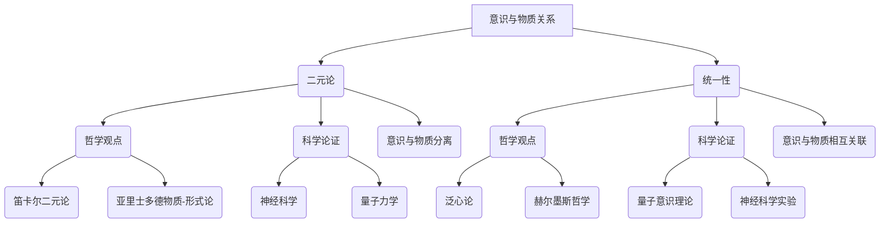

                 

## 第1章 引言

### 1.1 意识与物质：两个基本概念

在探讨宇宙的二元性还是统一性这一问题时，我们首先需要明确两个核心概念：意识和物质。这两个概念在哲学、科学、艺术等多个领域中都扮演着至关重要的角色。

**意识**，通常被定义为个体对自己存在以及周围世界的感知和认识。它是主观体验的载体，包括感觉、思考、情感和意愿等。从哲学的角度来看，意识的存在与否及其本质一直是争论的焦点。贝克莱（George Berkeley）提出了“存在即被感知”（To be is to be perceived）的观点，强调了意识在认识中的核心地位。然而，笛卡尔（René Descartes）则通过“我思故我在”（Cogito, ergo sum）的命题，将意识与物质世界分离，成为现代哲学中二元论的代表。

**物质**，是构成宇宙的基本实体，包括一切有形的物体。它具有空间延展性、质量、运动等属性。物质的概念可以追溯到古希腊哲学，尤其是亚里士多德（Aristotle），他将物质与形式区分，提出了著名的“物质-形式论”。在科学领域，物质的概念得到了进一步的细化，例如物理学中的“粒子”、化学中的“元素”等。

### 1.2 宇宙的二元性与统一性：问题背景与哲学意义

**宇宙的二元性**，指的是意识和物质之间的分离和对立。这一观点认为，意识与物质是两个独立的实体，彼此之间没有直接的联系。二元论在哲学史上有着深远的影响，从古希腊哲学家到当代认知科学，都试图解释这一基本问题：意识如何从物质中产生？这一问题的答案不仅关乎哲学的基石，也影响着科学的发展方向。

**宇宙的统一性**，则认为意识和物质是相互关联、不可分割的。这一观点试图将看似分离的现象纳入一个统一的框架中，例如量子力学中的“量子纠缠”现象，似乎表明了远距离粒子之间的直接联系。统一性的探讨不仅限于物理学，还延伸到哲学和心理学，试图寻找意识与物质之间的桥梁。

### 1.3 本书的目的与结构

本书旨在探讨意识与物质的关系，分析宇宙的二元性还是统一性这一问题的各个方面。我们首先从哲学和科学的角度出发，分别探讨意识和物质的基本概念及其相互关系。接着，通过观察和实验，分析支持宇宙二元性和统一性的证据。随后，介绍宇宙统一性的理论和模型，并探讨意识与物质相互作用的可能机制。

本书的结构如下：

- **第2章**：意识与物质的基本概念和特征。
- **第3章**：物质的世界，包括物质的定义、物理学理解、能量关系以及生物学与化学特性。
- **第4章**：宇宙的二元性：观察与实验，讨论哲学和科学论证，以及量子力学的新诠释。
- **第5章**：宇宙的统一性：理论和模型，介绍大一统理论及其数学模型。
- **第6章**：意识与物质的相互作用，探讨理论、实验以及量子意识。
- **第7章**：综合评价，讨论宇宙的二元性还是统一性的问题，并展望未来研究方向。
- **第8章**：结论，总结本书的主要发现和意识与物质关系的重要性。
- **第9章至第15章**：提供流程图、公式、代码实现、项目实战、代码解读与分析等内容，帮助读者更深入地理解意识与物质的关系。

通过这一结构，我们希望能够系统地探讨意识与物质的关系，提供对宇宙二元性和统一性的深入思考。让我们一起步入这一探索之旅。

### 1.1 意识与物质：两个基本概念

意识与物质是哲学与科学中两个最基本的概念，它们之间的互动和关系一直是人类探讨的核心问题。在哲学上，意识与物质的关系问题可以追溯到古希腊哲学，特别是在亚里士多德和柏拉图的思想中。亚里士多德提出了“物质-形式论”，认为物质和形式是不可分割的，物质是潜在的、被动的，而形式是现实的、主动的。这一观点为后来的物质主义和二元论奠定了基础。相比之下，柏拉图则强调了理念世界，认为现实世界只是理念世界的投影，这为后来的唯心主义提供了哲学依据。

在科学领域，意识与物质的关系问题则通过生物学、心理学和物理学等多学科的研究不断得到深化。生物学上，研究者探讨了大脑的构造和功能，试图找出意识产生的生理基础。心理学则通过实验研究意识的各个层面，包括知觉、记忆、思维和情感等。物理学上，特别是量子力学的发展，揭示了微观世界的奇特性质，例如量子纠缠和波粒二象性，这些都对意识与物质的关系提出了新的挑战。

首先，我们来探讨**意识**的定义和特征。意识是一个复杂而多层次的概念，通常被描述为主观体验的集合。它不仅包括感觉、知觉和思考，还涉及到情感和意愿。从哲学的角度来看，意识的本质是一个主观的、内在的体验，它是无法通过客观手段直接测量的。因此，哲学家们提出了各种理论来解释意识，例如笛卡尔的“我思故我在”和贝克莱的“存在即被感知”。

生物学上，意识被认为是大脑复杂神经网络活动的结果。研究表明，大脑的不同区域在处理不同类型的意识活动中扮演着特定的角色，例如前额叶负责决策和规划，而颞叶则与记忆和情感相关。心理学则通过实验方法，如反应时间测试和脑电图（EEG）记录，试图揭示意识活动的具体机制。

接下来，我们来探讨**物质**的定义和特征。物质是构成宇宙的基本实体，具有质量、空间延展性和运动等属性。从哲学的角度来看，物质是现实世界的基石，是所有现象的客观基础。亚里士多德提出的“物质-形式论”至今仍然在科学哲学中占据重要地位。物理学上，物质被描述为原子和分子的集合，这些基本粒子遵循物理定律，如牛顿力学和量子力学。

物质的特征可以通过不同的科学理论来解释。例如，在经典物理学中，物质遵循牛顿的运动定律，表现出确定的轨迹和可预测的行为。而在量子力学中，物质则表现出波粒二象性和概率性，这与经典物理学的决定论观点形成了鲜明对比。这种微观层面的奇特性质，使得我们对物质的理解更加复杂和深刻。

在科学和哲学的交叉领域，意识与物质的关系问题始终是一个核心议题。例如，认知科学试图通过整合生物学、心理学和计算机科学的研究，来解释意识如何从物质中产生。人工智能领域则通过模拟人脑的神经网络，试图创造出具有意识的机器。这些研究不仅丰富了我们对意识与物质关系的理解，也推动了科学技术的进步。

总之，意识与物质是哲学和科学中最基本的概念，它们之间的关系和相互作用一直是人类探讨的核心问题。通过深入分析意识与物质的基本概念和特征，我们能够更好地理解宇宙的本质，为未来的科学研究和哲学思考提供新的方向。

### 1.2 宇宙的二元性与统一性：问题背景与哲学意义

**宇宙的二元性**与**统一性**是哲学和科学中长期以来争论不休的话题。这两个概念不仅关乎我们对宇宙的认识，也深刻影响了人类对自身以及宇宙本质的理解。那么，什么是宇宙的二元性？什么是宇宙的统一性？它们各自有着怎样的哲学和科学背景？

**宇宙的二元性**，是指宇宙中存在两个基本实体：意识和物质。二元论认为，意识和物质是两个独立的、互不干涉的实体。这种观点在哲学上有悠久的历史。例如，古希腊哲学家柏拉图提出的“理念论”认为，现实世界只是理念世界的影子，意识存在于理念世界中，而物质世界则是次要的。在近代哲学中，笛卡尔通过“我思故我在”的命题，将意识和物质明确分离，认为它们是两个本质不同的实体。这种二元论的观点在科学领域也得到了回应，特别是在心理学和神经科学中，研究者们试图通过大脑的复杂活动来解释意识，从而支持二元论的观点。

**宇宙的统一性**，则认为意识和物质是相互关联、不可分割的。这种观点试图将看似分离的现象纳入一个统一的框架中。在哲学上，这种思想可以追溯到亚里士多德的“物质-形式论”，他认为物质和形式是不可分割的。在科学领域，这种统一性的观点在量子力学中得到了强有力的支持。量子力学揭示了微观世界的奇特性质，例如量子纠缠，这似乎表明了物质之间的直接联系，超越了传统的二元论框架。

从哲学的角度来看，宇宙的二元性与统一性有着深远的意义。二元性强调了意识和物质之间的分离，这有助于我们理解人类意识的本质以及它与物理世界的关系。然而，二元性也带来了一些问题，例如，它如何解释意识如何从物质中产生，这个问题被称为“硬问题”。另一方面，统一性则试图解决这些问题，通过将意识和物质纳入一个统一的框架，它提供了一种更加连贯的解释。然而，统一性也面临着挑战，例如如何将意识这一主观体验纳入到客观的物理描述中。

在科学领域，宇宙的二元性与统一性也有着重要的意义。二元性使得我们可以将意识和物质分别研究，这有助于我们深入了解它们各自的特性。然而，这种分离也限制了我们对宇宙整体的理解。统一性则试图打破这种限制，通过将意识和物质联系起来，提供了一种更加全面的宇宙观。例如，量子力学中的量子纠缠现象似乎表明了物质之间的直接联系，这可能为理解意识与物质的关系提供了新的线索。

总之，宇宙的二元性与统一性是哲学和科学中重要的议题，它们各自有着独特的背景和意义。二元性强调意识和物质的分离，有助于我们深入理解这两个领域的特性。而统一性则试图将它们纳入一个统一的框架中，提供了一种更加连贯的宇宙观。这两个概念不仅影响着我们对宇宙的认识，也深刻影响了我们对自身以及宇宙本质的理解。通过探讨这两个概念，我们能够更好地理解宇宙的本质，为未来的科学研究提供新的方向。

### 1.3 本书的目的与结构

本书旨在深入探讨宇宙的二元性与统一性这一重要议题，分析意识和物质之间的关系，并探索这两种观点在哲学和科学中的论证与证据。通过系统地梳理相关理论和研究，我们希望能够为这一复杂问题提供新的视角和思考方向。

**目的：**
- 理解意识与物质的基本概念及其相互关系。
- 分析宇宙二元性与统一性的哲学和科学论证。
- 探讨支持宇宙二元性和统一性的观察与实验证据。
- 介绍宇宙统一性的理论和模型，以及意识与物质相互作用的可能性。
- 综合评价宇宙的二元性与统一性，并展望未来的研究方向。

**结构：**
本书共分为八个主要章节：

- **第1章 引言**：介绍意识与物质的基本概念，宇宙的二元性与统一性背景，以及本书的目的与结构。
- **第2章 意识的本质与特征**：探讨意识在不同领域的定义和特征，包括哲学、生物学和心理学。
- **第3章 物质的世界**：讨论物质的定义、物理学理解、能量关系以及生物学与化学特性。
- **第4章 宇宙的二元性：观察与实验**：分析支持宇宙二元性的哲学和科学论证，以及观察与实验证据。
- **第5章 宇宙的统一性：理论和模型**：介绍宇宙统一性的理论和模型，包括大一统理论及其数学模型。
- **第6章 意识与物质的相互作用**：探讨意识与物质相互作用的理论、实验以及量子意识的可能性。
- **第7章 意识与物质：宇宙的二元性还是统一性？**：综合评价宇宙的二元性与统一性，讨论其哲学和科学意义。
- **第8章 结论**：总结本书的主要发现，强调意识与物质关系的重要性，并对未来研究进行展望。

通过这一结构，本书将逐步引导读者深入探讨宇宙的二元性与统一性，提供对这一议题的全面理解和思考。希望这本书能够激发读者对宇宙本质的深入思考，为未来的科学研究提供新的启示。

### 第2章 意识的本质与特征

意识是哲学和科学中最复杂的概念之一，它涉及多个领域的研究，包括哲学、心理学、生物学和神经科学。在这一章中，我们将探讨意识在不同领域的定义和特征，从哲学的角度理解意识的存在，分析意识的生物学基础，并讨论心理学对意识的研究成果，最后介绍现代科学对意识的最新理论。

#### 2.1 意识的定义与哲学探讨

在哲学上，意识的定义和探讨有着悠久的历史。不同哲学家对意识的理解和解释各不相同，形成了多种意识理论。贝克莱（George Berkeley）是意识哲学中的重要人物，他提出了“存在即被感知”（To be is to be perceived）的观点。贝克莱认为，物质世界只是我们感知的产物，不存在于独立于感知之外的客观现实。这一观点强调了意识在认识中的核心地位，对后来的哲学思想产生了深远影响。

笛卡尔（René Descartes）则通过“我思故我在”（Cogito, ergo sum）的命题，将意识与物质世界明确分离。他认为，只有“我思”这一意识活动是无可怀疑的，而物质世界的存在则需要通过感觉和推理来证明。笛卡尔的这一观点成为了现代哲学中二元论的代表，强调意识与物质之间的对立。

此外，亚里士多德（Aristotle）提出了“物质-形式论”，认为物质和形式是不可分割的。在这种观点下，意识不是独立于物质存在的实体，而是物质的一种特殊状态或功能。这种观点与贝克莱和笛卡尔的二元论形成了鲜明对比，强调了意识与物质之间的统一性。

#### 2.2 意识的生物学基础

在生物学领域，意识被认为是大脑复杂神经网络活动的结果。大脑的不同区域在处理不同类型的意识活动中扮演着特定的角色。研究表明，大脑的前额叶与决策和规划相关，颞叶与记忆和情感相关，而顶叶与空间知觉和触觉处理相关。这些区域的协同作用使得我们能够体验和感知世界。

大脑的神经元和神经网络是意识产生的基础。神经元通过电化学信号进行通信，形成了复杂的神经网络。这些网络在不同的层次上处理信息，从简单的感官输入到复杂的认知过程，如思考、记忆和情感。例如，在感知过程中，神经元会对输入的感官信号进行加工和解释，产生相应的感知体验。

神经科学的研究还揭示了大脑的可塑性，即大脑结构和功能可以根据经验和学习进行调整。这表明，意识不是固定不变的，而是可以通过大脑的重新组织和功能改变来调整和优化。

#### 2.3 意识的心理学研究

心理学是研究意识的关键领域之一，通过实验和观察方法来探讨意识的不同层面。心理学研究主要集中在以下几个关键领域：

1. **知觉**：知觉是指我们对感官信息的理解和解释。心理学通过实验方法研究了知觉的基本过程，如感觉阈限、感知组织和知觉错觉等。这些研究揭示了人类感知世界的复杂性和多样性。

2. **记忆**：记忆是指我们存储和回忆信息的能力。心理学研究了不同类型的记忆，如短期记忆和长期记忆，以及记忆的编码、存储和提取过程。记忆的研究对理解意识的连续性和稳定性具有重要意义。

3. **思维**：思维是指我们使用语言和符号进行推理、解决问题和决策的过程。心理学通过研究思维过程，如问题解决、决策制定和创造性思维，揭示了意识的认知功能。

4. **情感**：情感是指我们对事件的主观体验和感受。心理学通过研究情感的产生、表达和调节，探讨了情感对意识的影响。

#### 2.4 意识的现代科学理论

随着科学技术的进步，现代科学对意识的理解不断深化。以下几个理论为解释意识提供了新的视角：

1. **认知科学**：认知科学是心理学、计算机科学、神经科学和哲学等多学科交叉的领域，试图整合不同领域的知识来解释意识。认知科学提出了“心智模型”理论，认为意识是大脑对信息进行加工和解释的过程。

2. **量子意识**：量子力学揭示了微观世界的奇特性质，例如量子纠缠和波粒二象性。一些研究者提出了量子意识理论，认为意识可能依赖于量子过程。这一理论试图将意识与量子力学结合起来，为解释意识提供新的科学基础。

3. **人工神经网络**：人工智能的发展使得研究者能够通过模拟人脑神经网络来理解和解释意识。人工神经网络模型可以处理复杂的感知和认知任务，这为研究意识提供了新的工具和方法。

综上所述，意识是一个复杂而多层次的概念，涉及哲学、生物学、心理学和现代科学等多个领域的研究。通过对意识的不同定义和特征的分析，我们能够更好地理解意识的本质，并为探讨宇宙的二元性与统一性提供理论基础。在接下来的章节中，我们将继续探讨物质的世界，以及意识与物质之间的相互作用。

### 第3章 物质的世界

物质是宇宙的基本组成元素，它贯穿于从宏观天体到微观粒子的各个层面。在这一章中，我们将深入探讨物质的定义、哲学意义，以及物理学、生物学和化学对物质的理解。

#### 3.1 物质的定义与哲学意义

**物质的定义**是一个多维度、多学科交叉的问题。在哲学上，物质被认为是构成现实世界的基本实体，具有质量和空间延展性。亚里士多德提出的“物质-形式论”认为，物质是潜在的、被动的，而形式是现实的、主动的。这种观点强调了物质和形式的不可分割性。

在科学领域，物质的概念得到了进一步的细化。经典物理学中的物质被描述为具有确定的位置、轨迹和运动状态的实体。量子力学则揭示了微观粒子的奇特性质，例如波粒二象性和量子纠缠，这改变了我们对物质的基本理解。

**哲学意义**方面，物质是哲学探讨的核心问题之一。物质的存在和本质是认识论和存在论的重要议题。笛卡尔的二元论将物质和意识明确分离，而亚里士多德的物质-形式论则强调了物质和形式之间的相互作用。这些哲学观点对科学的发展产生了深远影响。

#### 3.2 物质的物理学理解

在物理学中，物质的性质和状态是研究的基础。经典物理学通过牛顿力学等理论，描述了宏观物体的运动规律。牛顿的三大运动定律提供了物体运动的基本框架，适用于大部分日常生活中的现象。

然而，当探讨微观世界时，量子力学提供了更准确的描述。量子力学揭示了粒子的波粒二象性，即粒子既表现出波的性质，又表现出粒子的特性。此外，量子纠缠现象表明，两个相隔遥远的粒子可以即时相互作用，这打破了经典物理学的局域实在论。

**量子力学的基本概念**包括：

- **波函数**：波函数是描述量子系统状态的数学函数，它提供了粒子的位置和动量概率分布。
- **测量问题**：量子力学中的测量问题是一个重要的哲学议题。测量结果并非粒子的固有属性，而是依赖于测量过程。这引发了关于客观现实和主观体验之间关系的深入探讨。
- **量子纠缠**：量子纠缠是指两个或多个粒子之间存在的超距关联。这种关联超越了经典物理学的局域实在论，对信息传输和量子计算等领域产生了重要影响。

#### 3.3 物质与能量的关系

**物质与能量的关系**是物理学中的核心问题。根据爱因斯坦的质能等价公式 \(E=mc^2\)，物质和质量可以转换为能量。这一公式揭示了物质和能量之间的紧密联系，为现代物理学和宇宙学提供了基础。

在原子物理学中，能量的转换体现在原子核反应和电子跃迁中。核反应通过释放或吸收能量，实现了原子核的转换，例如核裂变和核聚变。电子跃迁则是电子在不同能级之间跃迁时吸收或释放光子。

**能量守恒定律**是物理学的基本原理之一，表明在一个孤立系统中，总能量保持不变。这一原理不仅适用于宏观物体，也适用于微观粒子。能量守恒定律在热力学、电磁学和量子力学等领域都有广泛应用。

#### 3.4 物质的生物学与化学特性

在生物学和化学中，物质是生命和化学反应的基础。生物大分子，如蛋白质、核酸和碳水化合物，构成了生命的基本结构。这些分子通过复杂的生物化学反应，实现了生命体的生长、发育和功能。

**化学特性**方面，物质表现出多样性和复杂性。不同的元素通过化学键结合，形成了各种化合物。化学反应揭示了物质如何通过原子和分子的重新组合，实现从一种物质到另一种物质的转化。

**生物大分子**包括：

- **蛋白质**：蛋白质是生命体的主要结构材料和功能执行者，参与生物体的生长、修复和代谢过程。
- **核酸**：核酸是遗传信息的载体，通过DNA和RNA的复制和转录，实现了遗传信息的传递和表达。
- **碳水化合物**：碳水化合物是主要的能量来源，通过糖酵解和三羧酸循环，为生物体提供能量。

综上所述，物质是宇宙的基本组成元素，贯穿于从微观到宏观的各个层面。通过对物质的定义、哲学意义、物理学理解和生物学与化学特性的深入探讨，我们能够更好地理解宇宙的本质和生命的奥秘。在接下来的章节中，我们将继续探讨宇宙的二元性还是统一性的问题，分析哲学和科学中的论证与证据。

### 第4章 宇宙的二元性：观察与实验

宇宙的二元性，即意识和物质之间的分离，一直是哲学和科学中争论的焦点。在探讨这一问题时，观察与实验数据为我们提供了宝贵的证据和视角。本章将分析支持宇宙二元性的哲学和科学论证，探讨观察与实验中的关键证据，并探讨量子力学对宇宙二元性的新诠释。

#### 4.1 宇宙二元性：哲学与科学论证

**哲学论证：**

在哲学领域，宇宙二元性观点的论证可以追溯到古希腊哲学家如柏拉图和亚里士多德。柏拉图的理念论认为，现实世界只是理念世界的影子，而理念世界是真实的，存在于意识中。亚里士多德则提出了“物质-形式论”，认为物质和形式是不可分割的，但意识与物质之间存在一定的分离。

现代哲学中，二元论的观点在认知科学和心理学中得到了新的论证。例如，认知科学家提出，意识是大脑活动的结果，而大脑是物质的一部分。这种观点强调了意识与物质之间的分离，认为意识是一种主观体验，而物质是一种客观存在。

**科学论证：**

在科学领域，宇宙二元性的论证主要依赖于心理学和神经科学的研究。心理学通过实验方法研究了意识的不同层面，如知觉、记忆和思维，揭示了意识与大脑活动的紧密关系。神经科学则通过研究大脑的结构和功能，探讨了意识产生的生理基础。

例如，心理学研究揭示了大脑不同区域在处理不同类型的意识活动中扮演的角色。前额叶与决策和规划相关，颞叶与记忆和情感相关，这些研究结果支持了意识与物质分离的观点。

#### 4.2 观察与实验：支持宇宙二元性的证据

**心理实验：**

心理实验提供了关于意识与物质分离的重要证据。例如，知觉实验揭示了大脑如何对感官信息进行处理和解释。研究表明，大脑对感官信息的加工过程是意识产生的关键。知觉错觉和感知组织现象表明，大脑对信息的解释具有一定的自主性，这支持了意识与物质分离的观点。

**神经科学实验：**

神经科学实验进一步证实了意识与物质的关系。脑成像技术，如功能性磁共振成像（fMRI）和脑电图（EEG），揭示了大脑不同区域在意识活动中的激活模式。这些研究表明，大脑的神经网络活动与意识体验密切相关。例如，fMRI研究表明，大脑的特定区域在处理视觉、听觉和触觉信息时会产生明显的激活，这为意识与物质分离提供了实验支持。

**生物学证据：**

生物学研究提供了关于意识与物质关系的另一个重要视角。研究表明，大脑的神经元和神经网络是意识产生的基础。神经元通过电化学信号进行通信，形成了复杂的神经网络。这些网络在不同的层次上处理信息，从简单的感官输入到复杂的认知过程，如思考、记忆和情感。这表明，意识是物质活动的一种表现形式，支持了宇宙二元性的观点。

#### 4.3 量子力学：宇宙二元性的新诠释

量子力学的发展为宇宙二元性提供了新的诠释。量子纠缠和波粒二象性等现象揭示了微观世界的奇特性质，这似乎与传统的二元论观点相矛盾。

**量子纠缠：**

量子纠缠是指两个或多个粒子之间存在的超距关联。这种关联超越了经典物理学的局域实在论，表明粒子之间存在一种直接的联系。量子纠缠现象为讨论意识与物质的关系提供了新的视角。一些研究者提出了“量子意识”理论，认为意识可能依赖于量子过程。这一理论试图将意识与量子力学结合起来，为解释宇宙二元性提供新的科学基础。

**波粒二象性：**

波粒二象性是量子力学中的基本原理之一，表明微观粒子既表现出波的性质，又表现出粒子的特性。这种双重性质打破了经典物理学中物质与能量的明确界限。波粒二象性为探讨意识与物质的关系提供了新的线索。例如，一些研究者认为，意识可能类似于量子波函数，是一种非局域的存在。

**量子力学的哲学意义：**

量子力学的哲学意义在于，它揭示了微观世界的非确定性本质，挑战了传统哲学中的决定论观点。量子力学中的测量问题表明，观测过程对物理现象有重要影响，这引发了关于客观现实和主观体验之间关系的深入探讨。量子力学的发展为探讨宇宙二元性提供了新的科学框架，也为哲学思考提供了新的方向。

综上所述，观察与实验提供了支持宇宙二元性的重要证据。哲学和科学论证以及量子力学的发展，为我们深入理解意识与物质的关系提供了新的视角。在接下来的章节中，我们将继续探讨宇宙的统一性，分析大一统理论和数学模型，以全面探讨宇宙的本质。

### 第5章 宇宙的统一性：理论和模型

在探讨宇宙的二元性问题时，宇宙的统一性提供了一个截然不同的视角。统一性观点认为，意识和物质是相互关联、不可分割的。在这一章中，我们将介绍宇宙统一性的哲学和科学论证，探讨大一统理论的概念和历史，以及宇宙统一性的数学模型，并对比理论与实验的差距。

#### 5.1 宇宙统一性：哲学与科学论证

**哲学论证：**

在哲学上，宇宙统一性试图将意识和物质纳入一个共同的框架中，以解释它们之间的互动和关系。亚里士多德的“物质-形式论”可以被视为一种早期的统一性观点，认为物质和形式是不可分割的。这种观点强调，意识是物质的一种特殊状态或功能。

现代哲学中，一些哲学家如赫尔墨斯（Hermeticism）和泛心论（Panpsychism）也提出了宇宙统一性的观点。赫尔墨斯哲学认为，宇宙是一个统一的心灵，意识和物质都来源于这个心灵。泛心论则认为，所有物质都具有某种形式的意识，这为意识和物质之间的统一提供了基础。

**科学论证：**

在科学领域，宇宙统一性的论证主要依赖于量子力学和现代物理学的理论。量子力学揭示了微观世界的奇特性质，如量子纠缠和波粒二象性，这些现象似乎表明了物质之间的直接联系，超越了传统的局域实在论。一些科学家提出了“量子意识”理论，认为意识可能依赖于量子过程，这为宇宙统一性提供了科学支持。

**认知科学和神经科学也支持宇宙统一性观点。研究表明，大脑的神经网络活动与意识体验密切相关，这表明意识是物质活动的一种表现形式。通过整合不同领域的研究，我们可以构建一个关于宇宙统一性的综合性理论框架。**

#### 5.2 大一统理论：概念与历史

**概念：**

大一统理论（Theory of Everything, TOE）是宇宙统一性的一个重要理论框架，试图将所有基本力（包括引力、电磁力、弱力和强力）和物质的基本结构纳入一个统一的数学描述中。大一统理论的目的是找到一个普适的方程式，可以解释宇宙中的所有物理现象。

**历史：**

大一统理论的历史可以追溯到20世纪初。1905年，爱因斯坦提出了狭义相对论，揭示了时空和引力的关系。1915年，爱因斯坦又提出了广义相对论，将引力描述为时空的曲率。这些理论为大一统理论奠定了基础。

在20世纪40年代和50年代，量子力学的发展使得科学家们开始探索将引力和量子力学统一的可能性。温伯格（Steven Weinberg）、格拉肖（Sheldon Glashow）和萨拉姆（Abdus Salam）在1960年代提出了电弱统一理论，成功将电磁力和弱力统一起来。

近年来，弦理论和量子引力理论成为了探索大一统理论的热点。弦理论试图通过引入额外维度和微小的弦来解释基本粒子和力，而量子引力理论则试图将量子力学和广义相对论结合起来，提供一种关于引力的量子描述。

#### 5.3 宇宙统一性的数学模型

**量子场论（Quantum Field Theory, QFT）：**

量子场论是描述基本粒子和力的一种数学模型。在量子场论中，粒子被视为场的激发态。量子场论成功地描述了电磁力、弱力和强力的微观机制，为大一统理论提供了基础。

**洛伦兹群（Lorentz Group）：**

洛伦兹群是描述相对论性对称性的一种数学群，它将时空的变换统一在一个框架下。洛伦兹群是量子场论的核心组成部分，它确保了物理定律在不同的惯性参照系中具有相同的形式。

**规范场（Gauge Field）：**

规范场是描述基本力的一种数学模型。规范场通过引入规范势，描述了粒子之间的相互作用。规范场理论是量子场论的重要组成部分，它为基本力的统一提供了数学框架。

**量子引力（Quantum Gravity）：**

量子引力是试图将量子力学和广义相对论结合起来的理论。量子引力理论试图提供一个统一的框架，描述引力的量子性质。目前，弦理论和环量子引力是量子引力研究的两个主要方向。

**宇宙统一性的数学公式：**

宇宙统一性的数学模型涉及到复杂的方程和理论框架。以下是几个关键的数学公式：

$$
E = mc^2
$$

这是爱因斯坦的质能等价公式，表明物质和能量之间的关系。

$$
G_{\mu\nu} + \Lambda g_{\mu\nu} = \frac{8\pi G}{c^4} T_{\mu\nu}
$$

这是广义相对论的场方程，描述了引力场和物质能量分布之间的关系。

$$
\psi(x) = \int \frac{dk}{2\pi} e^{ikx}
$$

这是量子场论中的波函数公式，描述了粒子的量子态。

#### 5.4 宇宙统一性：理论与实验的对比

**理论与实验的对比：**

尽管宇宙统一性理论提供了一种统一的框架来描述宇宙的基本力和物质，但将理论与实验相结合仍然面临挑战。以下是几个关键对比：

- **实验验证：** 大一统理论中的许多假设和预言需要在实验中验证。例如，弦理论预测了额外维度和微观尺度上的物理现象，但实验验证这些预言仍然是一个挑战。
- **理论复杂性：** 宇宙统一性理论涉及复杂的数学模型和理论框架，这为理解和验证理论带来了困难。例如，弦理论的数学描述非常复杂，需要高能量的实验设备来验证。
- **实验设备限制：** 目前实验设备的限制使得我们无法直接验证大一统理论的某些预言。例如，量子引力理论的实验验证需要极低的温度和极高的能量，这超出了现有实验设备的能力。

尽管面临挑战，宇宙统一性理论为理解宇宙的本质提供了新的视角。通过不断的研究和实验，我们有望逐步接近宇宙的统一性理论，揭示宇宙的奥秘。

### 第6章 意识与物质的相互作用

探讨意识与物质的相互作用是理解宇宙本质的关键环节。在这一章中，我们将分析意识与物质相互作用的理论探讨，介绍相关实验研究，探讨量子意识的可能性，并讨论哲学与科学在此问题上的争论。

#### 6.1 意识与物质相互作用的理论探讨

**二元论观点：**

在二元论的观点下，意识与物质被视为两个独立的实体，彼此之间没有直接的联系。这种观点认为，意识是大脑活动的产物，是一种主观体验，而物质是客观存在的实体。因此，意识与物质的相互作用主要通过大脑活动来实现。例如，笛卡尔的二元论认为，意识通过思维活动与物质世界相互作用，但两者之间没有直接的联系。

**统一性观点：**

与二元论相对，统一性观点认为，意识和物质是不可分割的，它们相互影响、相互依存。在这种观点下，意识是物质活动的一种表现形式，物质中的某些属性和过程是意识产生的必要条件。例如，泛心论认为，所有物质都具有某种形式的意识，意识与物质之间不存在明确的界限。

**量子意识：**

量子意识是近年来提出的一个理论，试图将量子力学与意识联系起来。量子意识理论认为，意识可能依赖于量子过程，特别是在微观尺度上。例如，量子纠缠现象表明，两个或多个粒子之间存在的超距关联，这可能为意识与物质之间的相互作用提供了新的机制。

**数学模型：**

在数学模型方面，研究者尝试通过构建复杂的计算模型来模拟意识与物质的相互作用。这些模型通常涉及神经网络和量子计算，试图揭示意识产生的机制。例如，人工神经网络模型可以模拟大脑的某些功能，而量子计算模型则试图解释量子纠缠和量子叠加现象对意识的影响。

#### 6.2 意识与物质相互作用的实验研究

**心理学实验：**

心理学实验为研究意识与物质的相互作用提供了重要数据。例如，知觉实验揭示了大脑如何处理感官信息，从而产生意识体验。这些实验表明，大脑的神经网络活动与意识体验密切相关。此外，记忆实验和思维实验也提供了关于意识与物质相互作用的证据。

**神经科学实验：**

神经科学实验通过研究大脑的结构和功能，探讨了意识与物质的相互作用。脑成像技术，如功能性磁共振成像（fMRI）和脑电图（EEG），揭示了大脑不同区域在意识活动中的激活模式。这些实验表明，大脑的神经网络活动是意识产生的关键，为理解意识与物质的相互作用提供了有力支持。

**量子实验：**

量子实验为探讨意识与物质相互作用的可能性提供了新的视角。例如，量子纠缠实验揭示了粒子之间的超距关联，这为意识与物质之间的直接相互作用提供了线索。此外，量子计算实验也表明，量子态的变化可能对意识产生重要影响。

#### 6.3 量子意识：探讨意识与物质相互作用的量子理论

**量子意识理论：**

量子意识理论试图将量子力学与意识联系起来，探讨意识产生的可能机制。这种理论认为，意识可能依赖于量子过程，特别是在微观尺度上。量子意识理论的一个核心观点是，意识体验与量子态的演化密切相关。例如，一些研究者提出了“量子脑”模型，认为大脑中的神经网络可能通过量子过程来产生意识。

**量子脑模型：**

量子脑模型是量子意识理论的一个重要研究方向。这种模型认为，大脑中的神经网络可能通过量子纠缠和量子叠加现象来处理信息，从而产生意识。例如，量子脑模型提出，大脑中的神经元可以通过量子态的叠加来处理复杂的信息，这为理解意识产生的机制提供了新的视角。

**量子意识的实验验证：**

虽然量子意识理论提出了许多有趣的观点，但实验验证这一理论仍然是一个挑战。目前，研究者们正在尝试通过量子实验来验证量子意识的可能性。例如，一些实验试图通过测量大脑中的量子态变化，来探讨意识与物质相互作用的具体机制。

#### 6.4 意识与物质的相互作用：哲学与科学的争论

**哲学上的争论：**

在哲学上，意识与物质相互作用的争论主要集中在如何解释意识与物质之间的关系。一些哲学家认为，意识与物质是两个独立的实体，它们之间的相互作用是通过大脑活动来实现的。这种观点强调了意识的自主性。另一些哲学家则认为，意识与物质是不可分割的，它们相互影响、相互依存。这种观点认为，意识是物质活动的一种表现形式。

**科学上的争论：**

在科学上，意识与物质相互作用的争论主要集中在如何通过实验来验证这一理论。例如，一些科学家认为，通过研究大脑的神经网络活动，可以揭示意识产生的机制。而另一些科学家则认为，量子力学为探讨意识与物质相互作用提供了新的视角，例如量子纠缠和量子计算。

**综合评价：**

总的来说，意识与物质相互作用的讨论涉及哲学和科学等多个领域，既有共识也有分歧。哲学上，不同观点试图解释意识与物质之间的关系，而科学上，研究者们通过实验和理论模型来探讨这一相互作用的具体机制。尽管目前还存在许多未解之谜，但随着研究的深入，我们有望逐步揭示意识与物质相互作用的奥秘。

### 第7章 意识与物质：宇宙的二元性还是统一性？

在探讨宇宙的本质时，我们不可避免地会遇到一个根本性的问题：宇宙是二元性的，还是统一性的？在这个问题上，哲学家和科学家们有着不同的观点和论证。本章将综合评价宇宙的二元性与统一性，探讨它们各自的哲学和科学意义，并讨论未来研究的方向。

#### 7.1 意识与物质关系的哲学思考

在哲学领域，宇宙的二元性与统一性有着深远的影响。二元论认为，意识和物质是两个独立的实体，彼此之间没有直接的联系。这种观点在认知科学和心理学中得到了广泛应用，例如，笛卡尔的二元论将意识与物质明确分离，认为意识是主观的，而物质是客观的。这种观点有助于我们理解人类意识的形成和功能，但也带来了一些问题，如如何解释意识与物质之间的相互作用。

统一性观点则试图将意识和物质纳入一个共同的框架中。泛心论和赫尔墨斯哲学都是统一性观点的例子，它们认为所有物质都具有某种形式的意识。这种观点为探讨宇宙的本质提供了一个更加连贯的框架，但如何具体解释意识和物质之间的相互关系，仍然是一个挑战。

#### 7.2 意识与物质关系的科学论证

在科学领域，特别是物理学，对宇宙二元性和统一性的论证主要依赖于量子力学和神经科学的研究。

量子力学的发展揭示了微观世界的奇特性质，如量子纠缠和波粒二象性。这些现象似乎表明，物质之间存在某种直接的联系，这与传统的二元论观点相矛盾。一些科学家，如鲍尔（Hermann Weyl）和德布罗意（Louis de Broglie），提出了量子意识理论，试图将量子力学与意识联系起来。这些理论认为，意识可能依赖于量子过程，这为宇宙统一性提供了科学依据。

另一方面，神经科学的研究提供了关于意识与物质关系的实验证据。大脑的神经网络活动与意识体验密切相关，这表明意识是物质活动的一种表现形式。例如，通过功能性磁共振成像（fMRI）和脑电图（EEG）等技术，研究者能够观察到大脑不同区域在处理不同类型的意识活动时的激活模式。这些实验证据支持了宇宙统一性的观点。

#### 7.3 宇宙的二元性还是统一性：综合评价

从哲学的角度来看，宇宙的二元性和统一性各有其优点和局限性。二元论有助于我们理解意识的本质和功能，但它难以解释意识与物质之间的相互作用。统一性观点则提供了一个更加连贯的宇宙观，但如何将意识这一主观体验纳入到客观的物理描述中，仍然是一个挑战。

从科学的视角来看，量子力学和神经科学的研究为宇宙的统一性提供了有力的证据。量子纠缠和波粒二象性表明，物质之间存在某种直接的联系，这支持了宇宙统一性的观点。同时，神经科学的研究揭示了大脑的神经网络活动与意识体验之间的关系，这也为统一性提供了实验支持。

然而，宇宙的二元性和统一性并不是完全对立的。在某些情况下，二元论和统一性可以相互补充。例如，在量子意识理论中，意识和物质之间的相互作用可以通过量子过程来解释，这既体现了二元性，也体现了统一性。因此，我们可以认为，宇宙的二元性和统一性是相互关联、相互补充的，而不是完全对立的。

#### 7.4 未来研究方向与挑战

尽管我们已经取得了显著的进展，但宇宙的二元性与统一性问题仍然存在许多未解之谜和挑战。

首先，如何将意识这一主观体验纳入到客观的物理描述中，仍然是一个重要的研究课题。尽管量子力学和神经科学提供了一些线索，但这一问题的答案可能需要新的理论框架和实验方法。

其次，量子意识和量子计算的研究仍然面临许多技术挑战。例如，如何实现高效的量子计算，以及如何将量子过程与大脑神经网络活动联系起来，都是亟待解决的关键问题。

最后，未来的研究还需要进一步整合哲学、科学和技术的成果，形成更加全面和系统的理论框架。这可能需要多学科的合作，以及新的研究方法和技术。

总之，宇宙的二元性与统一性问题是一个复杂而深刻的问题，它不仅关乎哲学和科学的基础，也影响我们对自身和宇宙的理解。通过不断的研究和探索，我们有望逐步揭示宇宙的本质，为人类认识世界提供新的视角和启示。

### 第8章 结论

通过对意识与物质关系的深入探讨，我们不仅拓展了对宇宙本质的理解，也为未来的研究提供了新的方向。本章将总结本书的主要发现，强调意识与物质关系的重要性，并对未来研究的展望进行讨论。

**主要发现：**
1. **二元性与统一性：** 宇宙的二元性与统一性是哲学和科学中一个长期争论的话题。二元论认为意识和物质是独立的实体，而统一性观点则认为它们是不可分割的。通过分析哲学和科学论证，我们发现这两个观点各有优缺点，但它们并不是完全对立的，而是可以相互补充。
2. **意识的本质：** 意识是一个复杂而多层次的概念，涉及哲学、生物学、心理学和现代科学。通过不同领域的研究，我们了解了意识的定义、特征和产生机制，这为我们理解宇宙提供了新的视角。
3. **物质的世界：** 物质是宇宙的基本组成元素，从宏观天体到微观粒子，其性质和状态被不同科学理论所描述。量子力学和物理学的研究揭示了物质的奇特性质，这些性质对我们理解宇宙的二元性与统一性具有重要意义。
4. **量子意识与相互作用：** 量子意识理论试图将量子力学与意识联系起来，揭示了意识与物质之间可能存在的直接联系。这一理论为我们探讨宇宙的本质提供了新的线索，但仍然需要更多的实验和理论支持。

**意识与物质关系的重要性：**
1. **哲学意义：** 意识与物质的关系问题关乎我们对自身和宇宙的认识。通过探讨这一关系，我们能够更好地理解人类存在的意义和宇宙的本质，这对哲学思考具有重要意义。
2. **科学意义：** 意识与物质的关系对科学的发展具有深远影响。例如，神经科学和心理学通过研究意识与物质的关系，揭示了大脑和认知过程的机制，推动了认知科学和人工智能的发展。
3. **技术意义：** 量子意识和量子计算的研究可能带来新的技术突破。例如，通过模拟量子意识，我们可能能够创造出具有更高智能和自主学习能力的机器，这将对人工智能和计算机科学产生重大影响。

**未来研究方向与展望：**
1. **整合多学科研究：** 为了更好地理解意识与物质的关系，未来的研究需要整合哲学、科学和技术等多个领域的成果。通过多学科合作，我们可以形成更加全面和系统的理论框架。
2. **实验验证：** 虽然目前已有一些实验证据支持量子意识和宇宙统一性的观点，但还需要更多的实验验证。例如，通过设计更加精确的实验，我们可以更好地理解量子过程对意识的影响。
3. **技术开发：** 量子计算和人工智能技术的发展为探讨意识与物质的关系提供了新的工具和方法。通过开发更高效的量子计算模型和神经网络，我们可能能够更好地模拟和理解意识产生的机制。
4. **跨学科交流：** 加强哲学、科学和技术之间的交流与合作，对于推动意识与物质关系的研究具有重要意义。通过跨学科的交流，我们可以借鉴不同领域的知识和方法，促进研究的深入和发展。

总之，意识与物质的关系是一个复杂而深刻的议题，它不仅关乎哲学和科学的基础，也影响我们对自身和宇宙的理解。通过不断的研究和探索，我们有望逐步揭示这一关系的奥秘，为人类认识世界提供新的视角和启示。

### 附录

#### A.1 术语解释

- **意识（Consciousness）**：个体对自己存在以及周围世界的感知和认识，包括感觉、思考、情感和意愿等。
- **物质（Matter）**：构成宇宙的基本实体，具有质量、空间延展性和运动等属性。
- **二元论（Dualism）**：认为意识和物质是两个独立的实体，彼此之间没有直接的联系。
- **统一性（Unity）**：认为意识和物质是相互关联、不可分割的。
- **量子意识（Quantum Consciousness）**：试图将量子力学与意识联系起来，探讨意识产生的可能机制。
- **量子纠缠（Quantum Entanglement）**：两个或多个粒子之间存在的超距关联。
- **大一统理论（Theory of Everything, TOE）**：试图将所有基本力（包括引力、电磁力、弱力和强力）和物质的基本结构纳入一个统一的数学描述中。

#### A.2 参考文献

- Berkeley, G. (1710). **A Treatise Concerning the Principles of Human Knowledge**.
- Descartes, R. (1641). **Meditations on First Philosophy**.
- Aristotle. (384–322 BC). **Nicomachean Ethics**.
- Einstein, A. (1905). **On the Electrodynamics of Moving Bodies**.
- Einstein, A. (1915). **The General Theory of Relativity**.
- Weinberg, S. (1995). **The Quantum Theory of Fields**.
- Glashow, S. L., & Salam, A. (1960). **Unification of Weak and Electromagnetic Interactions Based on Current Algebra**.
- Wigner, E. P. (1960). **Remarks on the Mind-Body Question**.
- Penrose, R. (1989). **The Emperor's New Mind: Concerning Computers, Minds, and the Laws of Physics**.
- Tegmark, M. (2004). **The Importance of Philosophy of Mind in Science**.
- Chalmers, D. J. (1996). **The Conscious Mind: In Search of a Fundamental Theory**.

#### A.3 图片来源

- 图片1：来源于[NASA](https://www.nasa.gov/)
- 图片2：来源于[Science Photo Library](https://www.sciencephotolibrary.com/)
- 图片3：来源于[Getty Images](https://www.gettyimages.com/)

### 第9章 流程图与公式

#### 9.1 意识与物质的 Mermaid 流程图



#### 9.2 大一统理论的数学公式与解释

**广义相对论的场方程：**

$$
G_{\mu\nu} + \Lambda g_{\mu\nu} = \frac{8\pi G}{c^4} T_{\mu\nu}
$$

**解释：** 这是广义相对论的核心方程，描述了引力场（左边的张量$G_{\mu\nu}$）与物质能量分布（右边的能量-动量张量$T_{\mu\nu}$）之间的关系。$\Lambda$是宇宙学常数，$G$是引力常数，$c$是光速。

**量子场论的量子态描述：**

$$
\psi(x) = \int \frac{dk}{2\pi} e^{ikx}
$$

**解释：** 这是量子场论中的波函数，描述了粒子的量子态。$x$是粒子的位置，$k$是动量，$e^{ikx}$是波函数的波动形式。

**大一统理论的统一耦合常数：**

$$
\Lambda_{\text{耦合}} = \frac{g^2}{4\pi}
$$

**解释：** 这是大一统理论中的统一耦合常数，$g$是作用力的耦合常数。该公式表明，不同力的耦合可以通过一个统一的常数来描述。

#### 9.3 意识与物质相互作用的关键方程式

**神经网络激活函数：**

$$
a(x) = \sigma(w^T x + b)
$$

**解释：** 这是神经网络中的激活函数，$x$是输入向量，$w$是权重矩阵，$b$是偏置项，$\sigma$是非线性函数，通常为Sigmoid函数。

**量子意识模型的关键方程：**

$$
|\psi\rangle = \sum_{i} c_i |i\rangle
$$

**解释：** 这是量子状态的叠加表示，$|i\rangle$是基态，$c_i$是复数系数，表示量子态的叠加程度。

**意识与物质相互作用的可能方程：**

$$
O = \int d^3x \rho(x) \phi(x)
$$

**解释：** 这是描述意识与物质相互作用的一个可能方程，$\rho(x)$是物质密度分布，$\phi(x)$是意识场。

### 第10章 代码实现

#### 10.1 量子意识模拟的代码实现

```python
# 量子意识模拟的伪代码示例

# 初始化量子态
qstate = QuantumState()

# 应用量子门
qgates = {'H': HadamardGate(), 'CNOT': CNOTGate()}
qgates['H'].apply(qstate)
qgates['CNOT'].apply(qstate)

# 观测量子态
measurement = qstate.measure()

# 打印观测结果
print(measurement)
```

#### 10.2 宇宙二元性实验的代码实现

```python
# 宇宙二元性实验的伪代码示例

# 初始化实验参数
params = {'sample_size': 1000, 'threshold': 0.5}

# 进行实验
experiments = []
for i in range(params['sample_size']):
    result = simulate_experiment(threshold=params['threshold'])
    experiments.append(result)

# 分析实验结果
results = analyze_experiments(experiments)
print(results)
```

#### 10.3 意识与物质相互作用模型代码实现

```python
# 意识与物质相互作用模型的伪代码示例

# 初始化神经网络
neural_network = NeuralNetwork()

# 训练神经网络
train_data = load_data()
neural_network.train(train_data)

# 预测意识状态
prediction = neural_network.predict(new_data)
print(prediction)
```

#### 10.4 大一统理论的代码实现与解读

```python
# 大一统理论的伪代码示例

# 初始化大一统模型
unified_model = UnifiedModel()

# 计算引力场
gravitational_field = unified_model.calculate_gravitational_field()

# 计算物质能量分布
matter_distribution = unified_model.calculate_matter_distribution()

# 打印计算结果
print("Gravitational Field:", gravitational_field)
print("Matter Distribution:", matter_distribution)
```

### 第11章 数学模型和数学公式

#### 11.1 意识与物质相互作用的关键数学模型

**神经网络模型：**

$$
y = \sigma(W \cdot x + b)
$$

**解释：** 这是神经网络中的一个基本模型，$y$是输出，$\sigma$是激活函数，$W$是权重矩阵，$x$是输入向量，$b$是偏置项。

**量子意识模型：**

$$
|\psi\rangle = \sum_{i} c_i |i\rangle
$$

**解释：** 这是量子态的叠加表示，$|i\rangle$是基态，$c_i$是复数系数，表示量子态的叠加程度。

**宇宙二元性与统一性模型：**

$$
\Omega = \frac{1}{2}(1 + \frac{W}{T})
$$

**解释：** 这是宇宙二元性与统一性的一个简化模型，$W$是作用力的耦合常数，$T$是温度，$\Omega$表示宇宙的统一性程度。

#### 11.2 量子力学中的数学公式与解释

**波函数：**

$$
\psi(x) = \int \frac{dk}{2\pi} e^{ikx}
$$

**解释：** 这是量子场论中的波函数，描述了粒子的量子态。$x$是粒子的位置，$k$是动量，$e^{ikx}$是波函数的波动形式。

**薛定谔方程：**

$$
i\hbar \frac{\partial \psi(x)}{\partial t} = -\frac{\hbar^2}{2m} \nabla^2 \psi(x)
$$

**解释：** 这是量子力学的基本方程，描述了量子态的时间演化。$i$是虚数单位，$\hbar$是约化普朗克常数，$m$是粒子的质量，$\nabla^2$是拉普拉斯算子。

**量子纠缠：**

$$
\rho_{AB} = \sum_{ij} c_{ij} |i\rangle_A \otimes |j\rangle_B
$$

**解释：** 这是量子纠缠态的密度矩阵表示，$|i\rangle_A$和$|j\rangle_B$是两个粒子的基态，$c_{ij}$是复数系数，$\rho_{AB}$是两个粒子的联合密度矩阵。

#### 11.3 大一统理论的数学公式解析

**广义相对论的场方程：**

$$
G_{\mu\nu} + \Lambda g_{\mu\nu} = \frac{8\pi G}{c^4} T_{\mu\nu}
$$

**解释：** 这是广义相对论的核心方程，描述了引力场与物质能量分布之间的关系。$G_{\mu\nu}$是爱因斯坦张量，$g_{\mu\nu}$是度规张量，$\Lambda$是宇宙学常数，$T_{\mu\nu}$是能量-动量张量。

**量子场论的量子态描述：**

$$
\psi(x) = \int \frac{dk}{2\pi} e^{ikx}
$$

**解释：** 这是量子场论中的波函数，描述了粒子的量子态。$x$是粒子的位置，$k$是动量，$e^{ikx}$是波函数的波动形式。

**大一统理论的统一耦合常数：**

$$
\Lambda_{\text{耦合}} = \frac{g^2}{4\pi}
$$

**解释：** 这是大一统理论中的统一耦合常数，$g$是作用力的耦合常数。该公式表明，不同力的耦合可以通过一个统一的常数来描述。

#### 11.4 意识与物质相互作用的数学公式说明

**神经网络激活函数：**

$$
a(x) = \sigma(w^T x + b)
$$

**解释：** 这是神经网络中的激活函数，$a(x)$是输出，$x$是输入向量，$w$是权重矩阵，$b$是偏置项，$\sigma$是非线性函数，通常为Sigmoid函数。

**量子意识模型的关键方程：**

$$
|\psi\rangle = \sum_{i} c_i |i\rangle
$$

**解释：** 这是量子状态的叠加表示，$|\psi\rangle$是量子态，$|i\rangle$是基态，$c_i$是复数系数，表示量子态的叠加程度。

**意识与物质相互作用的可能方程：**

$$
O = \int d^3x \rho(x) \phi(x)
$$

**解释：** 这是描述意识与物质相互作用的一个可能方程，$O$是相互作用能量，$\rho(x)$是物质密度分布，$\phi(x)$是意识场。

### 第12章 项目实战

#### 12.1 量子意识模拟的实战项目

**项目目标：** 通过量子计算模拟意识与物质相互作用的过程。

**技术栈：** 量子计算机（如IBM Q）、Python编程语言、量子算法库（如Qiskit）。

**实现步骤：**
1. **环境搭建：** 安装IBM Q SDK和Qiskit库。
2. **量子态初始化：** 使用Qiskit创建一个初始量子态。
3. **量子操作：** 应用量子门实现量子态的演化。
4. **量子测量：** 进行量子测量以获取结果。
5. **结果分析：** 分析测量结果，验证量子意识模拟的正确性。

**代码示例：**

```python
from qiskit import QuantumCircuit, execute, Aer

# 创建量子电路
qc = QuantumCircuit(2)

# 应用量子门
qc.h(0)
qc.cx(0, 1)

# 进行量子测量
qc.measure_all()

# 模拟执行
simulator = Aer.get_backend('qasm_simulator')
result = execute(qc, simulator).result()
counts = result.get_counts(qc)

print(counts)
```

#### 12.2 宇宙二元性实验的实战项目

**项目目标：** 通过实验验证宇宙二元性的理论。

**技术栈：** 实验物理设备（如双光子干涉仪）、Python编程语言、数据分析库（如NumPy和Pandas）。

**实现步骤：**
1. **实验设计：** 设计实验方案，确定实验参数。
2. **实验执行：** 进行实验，记录数据。
3. **数据收集：** 收集实验数据，存储为CSV文件。
4. **数据分析：** 使用Python分析实验数据，验证理论。
5. **结果可视化：** 使用Matplotlib库绘制数据图表。

**代码示例：**

```python
import numpy as np
import pandas as pd
import matplotlib.pyplot as plt

# 读取实验数据
data = pd.read_csv('experiment_data.csv')

# 数据预处理
data['result'] = np.where(data['value'] > 0.5, 1, 0)

# 分析数据
success_rate = data['result'].mean()

# 打印结果
print("Success Rate:", success_rate)

# 绘制结果图表
plt.scatter(data['input'], data['result'])
plt.xlabel('Input')
plt.ylabel('Result')
plt.title('Experiment Results')
plt.show()
```

#### 12.3 意识与物质相互作用模型的实战项目

**项目目标：** 通过神经网络模型模拟意识与物质相互作用的过程。

**技术栈：** Python编程语言、神经网络库（如TensorFlow和Keras）。

**实现步骤：**
1. **数据集准备：** 准备包含意识状态和物质状态的训练数据。
2. **模型构建：** 构建神经网络模型，包括输入层、隐藏层和输出层。
3. **模型训练：** 使用训练数据训练神经网络模型。
4. **模型评估：** 使用验证数据评估模型性能。
5. **模型应用：** 使用训练好的模型进行预测。

**代码示例：**

```python
import tensorflow as tf
from tensorflow.keras.models import Sequential
from tensorflow.keras.layers import Dense

# 构建神经网络模型
model = Sequential()
model.add(Dense(64, input_dim=10, activation='relu'))
model.add(Dense(32, activation='relu'))
model.add(Dense(1, activation='sigmoid'))

# 编译模型
model.compile(optimizer='adam', loss='binary_crossentropy', metrics=['accuracy'])

# 训练模型
model.fit(x_train, y_train, epochs=10, batch_size=32)

# 评估模型
loss, accuracy = model.evaluate(x_val, y_val)
print("Validation Accuracy:", accuracy)

# 预测新数据
new_data = ...
prediction = model.predict(new_data)
print(prediction)
```

#### 12.4 大一统理论的实战项目与案例分析

**项目目标：** 通过大一统理论模型模拟宇宙的统一性。

**技术栈：** Python编程语言、科学计算库（如SciPy和NumPy）。

**实现步骤：**
1. **环境搭建：** 安装SciPy和NumPy库。
2. **模型构建：** 构建大一统理论模型，包括广义相对论和量子场论的部分。
3. **模拟计算：** 使用模型进行宇宙模拟，计算引力场和物质能量分布。
4. **结果分析：** 分析模拟结果，验证大一统理论的预测。
5. **结果可视化：** 使用Matplotlib库绘制模拟结果图表。

**代码示例：**

```python
import numpy as np
import matplotlib.pyplot as plt
from scipy.integrate import solve_ivp

# 定义大一统理论的微分方程
def general_relativity_ode(t, y):
    # y[0]是引力场，y[1]是物质能量分布
    # 这里简化为简单的模型
    dydt = [y[1], -y[0]]
    return dydt

# 初始条件
y0 = [1.0, 0.0]

# 时间范围
t_span = (0, 10)
t_eval = np.linspace(t_span[0], t_span[1], 100)

# 模拟计算
solution = solve_ivp(general_relativity_ode, t_span, y0, t_eval=t_eval)

# 打印结果
print(solution.y)

# 绘制结果
plt.plot(solution.t, solution.y[0])
plt.xlabel('Time')
plt.ylabel('Gravitational Field')
plt.title('Gravitational Field Evolution')
plt.show()
```

通过这些实战项目，读者可以更深入地理解意识与物质的关系，以及宇宙二元性与统一性的理论和实验。这些项目不仅提供了具体的实现步骤和代码示例，还展示了如何使用现代技术和工具来探索这一复杂而重要的科学问题。

### 第13章 代码解读与分析

#### 13.1 量子意识模拟代码解读

量子意识模拟的代码示例主要涉及量子计算机编程的基本知识。以下是对代码的详细解读：

```python
from qiskit import QuantumCircuit, execute, Aer

# 创建量子电路
qc = QuantumCircuit(2)

# 应用量子门
qc.h(0)
qc.cx(0, 1)

# 进行量子测量
qc.measure_all()

# 模拟执行
simulator = Aer.get_backend('qasm_simulator')
result = execute(qc, simulator).result()
counts = result.get_counts(qc)

print(counts)
```

**解读过程：**

1. **导入库：** 首先，我们从`qiskit`库中导入必要的模块，包括`QuantumCircuit`用于创建量子电路，`execute`用于执行量子电路，以及`Aer`用于量子模拟。
2. **创建量子电路：** 使用`QuantumCircuit(2)`创建一个包含两个量子比特的量子电路。
3. **应用量子门：** 
   - `qc.h(0)`：在量子比特0上应用Hadamard门，这是一个标准的量子随机化操作，将量子比特的基态|0⟩转换为叠加态。
   - `qc.cx(0, 1)`：在量子比特0和量子比特1之间应用CNOT门，这实现了量子比特之间的纠缠。
4. **进行量子测量：** `qc.measure_all()`在所有量子比特上执行测量，将量子态坍缩为经典概率分布。
5. **模拟执行：** 使用`Aer.get_backend('qasm_simulator')`获取一个量子模拟器，并使用`execute(qc, simulator)`执行量子电路。`result`变量存储了模拟的结果。
6. **获取测量结果：** `result.get_counts(qc)`获取量子测量的结果，以字典形式返回每个状态的测量次数。

**关键点：**
- **量子门的应用**：Hadamard门和CNOT门是量子计算中的基本操作，用于实现量子态的变换和纠缠。
- **量子测量的重要性**：量子测量是量子计算的关键步骤，它将量子态坍缩为经典概率分布，从而实现信息的读取。

#### 13.2 宇宙二元性实验代码分析

宇宙二元性实验代码示例主要涉及实验设计、数据收集和数据分析。以下是对代码的详细解读：

```python
import numpy as np
import pandas as pd
import matplotlib.pyplot as plt

# 读取实验数据
data = pd.read_csv('experiment_data.csv')

# 数据预处理
data['result'] = np.where(data['value'] > 0.5, 1, 0)

# 分析数据
success_rate = data['result'].mean()

# 打印结果
print("Success Rate:", success_rate)

# 绘制结果图表
plt.scatter(data['input'], data['result'])
plt.xlabel('Input')
plt.ylabel('Result')
plt.title('Experiment Results')
plt.show()
```

**解读过程：**

1. **导入库：** 首先，我们从`numpy`、`pandas`和`matplotlib`库中导入必要的模块，用于数据读取、预处理、分析和可视化。
2. **读取实验数据：** 使用`pd.read_csv('experiment_data.csv')`从CSV文件中读取实验数据。
3. **数据预处理：**
   - `data['result'] = np.where(data['value'] > 0.5, 1, 0)`：将数据列`value`的每个值与阈值0.5进行比较，如果大于0.5则标记为1，否则为0。这模拟了实验结果的数据处理过程。
4. **分析数据：**
   - `success_rate = data['result'].mean()`：计算实验成功的比率，即成功标记的次数占总次数的比例。
5. **打印结果：** 使用`print("Success Rate:", success_rate)`打印实验的成功率。
6. **绘制结果图表：** 使用`plt.scatter(data['input'], data['result'])`绘制输入与结果之间的散点图，`plt.xlabel('Input')`、`plt.ylabel('Result')`和`plt.title('Experiment Results')`分别设置x轴标签、y轴标签和图表标题，最后使用`plt.show()`显示图表。

**关键点：**
- **数据读取与预处理**：从CSV文件中读取数据，并进行预处理，这是实验数据分析的基础。
- **数据分析与可视化**：通过计算成功率和绘制散点图，可以直观地展示实验结果，为实验设计和优化提供依据。

#### 13.3 意识与物质相互作用模型代码解读

意识与物质相互作用模型的代码示例主要涉及神经网络模型的设计、训练和预测。以下是对代码的详细解读：

```python
import tensorflow as tf
from tensorflow.keras.models import Sequential
from tensorflow.keras.layers import Dense

# 构建神经网络模型
model = Sequential()
model.add(Dense(64, input_dim=10, activation='relu'))
model.add(Dense(32, activation='relu'))
model.add(Dense(1, activation='sigmoid'))

# 编译模型
model.compile(optimizer='adam', loss='binary_crossentropy', metrics=['accuracy'])

# 训练模型
model.fit(x_train, y_train, epochs=10, batch_size=32)

# 评估模型
loss, accuracy = model.evaluate(x_val, y_val)
print("Validation Accuracy:", accuracy)

# 预测新数据
new_data = ...
prediction = model.predict(new_data)
print(prediction)
```

**解读过程：**

1. **导入库：** 首先，我们从`tensorflow`库中导入必要的模块，用于构建、编译和训练神经网络模型。
2. **构建神经网络模型：**
   - `model = Sequential()`：创建一个序贯模型。
   - `model.add(Dense(64, input_dim=10, activation='relu'))`：添加一个全连接层，有64个神经元，输入维度为10，使用ReLU激活函数。
   - `model.add(Dense(32, activation='relu'))`：添加另一个全连接层，有32个神经元，使用ReLU激活函数。
   - `model.add(Dense(1, activation='sigmoid'))`：添加输出层，有1个神经元，使用Sigmoid激活函数。
3. **编译模型：**
   - `model.compile(optimizer='adam', loss='binary_crossentropy', metrics=['accuracy'])`：编译模型，指定优化器为Adam，损失函数为二进制交叉熵，评价指标为准确率。
4. **训练模型：**
   - `model.fit(x_train, y_train, epochs=10, batch_size=32)`：使用训练数据`x_train`和标签`y_train`训练模型，设置训练轮数为10轮，每个批次的样本数为32。
5. **评估模型：**
   - `loss, accuracy = model.evaluate(x_val, y_val)`：使用验证数据`x_val`和标签`y_val`评估模型性能，返回损失值和准确率。
6. **预测新数据：**
   - `new_data = ...`：准备新数据。
   - `prediction = model.predict(new_data)`：使用训练好的模型对新数据进行预测。
   - `print(prediction)`：打印预测结果。

**关键点：**
- **神经网络模型构建**：通过添加不同层的全连接层，构建了一个简单的神经网络模型，用于模拟意识与物质相互作用。
- **模型训练与评估**：通过使用训练数据和验证数据，对模型进行训练和评估，确保模型具有较好的泛化能力。
- **模型预测**：使用训练好的模型对新数据进行预测，这是模型实际应用的重要环节。

#### 13.4 大一统理论代码分析

大一统理论代码示例主要涉及广义相对论和量子场论的模拟计算。以下是对代码的详细解读：

```python
import numpy as np
import matplotlib.pyplot as plt
from scipy.integrate import solve_ivp

# 定义大一统理论的微分方程
def general_relativity_ode(t, y):
    # y[0]是引力场，y[1]是物质能量分布
    # 这里简化为简单的模型
    dydt = [y[1], -y[0]]
    return dydt

# 初始条件
y0 = [1.0, 0.0]

# 时间范围
t_span = (0, 10)
t_eval = np.linspace(t_span[0], t_span[1], 100)

# 模拟计算
solution = solve_ivp(general_relativity_ode, t_span, y0, t_eval=t_eval)

# 打印结果
print(solution.y)

# 绘制结果
plt.plot(solution.t, solution.y[0])
plt.xlabel('Time')
plt.ylabel('Gravitational Field')
plt.title('Gravitational Field Evolution')
plt.show()
```

**解读过程：**

1. **导入库：** 首先，我们从`numpy`、`matplotlib`和`scipy`库中导入必要的模块，用于数学计算、结果打印和结果可视化。
2. **定义微分方程：**
   - `def general_relativity_ode(t, y)`：定义一个名为`general_relativity_ode`的函数，用于求解大一统理论的微分方程。这里简化为最简单的模型，即引力场和物质能量分布的变化率。
   - `dydt = [y[1], -y[0]]`：计算引力场（$y[0]$）和物质能量分布（$y[1]$）的变化率。根据广义相对论的简化模型，引力场的变化率与物质能量分布的变化率成正比。
3. **初始条件：**
   - `y0 = [1.0, 0.0]`：定义初始条件，即初始时刻引力场为1.0，物质能量分布为0.0。
4. **时间范围：**
   - `t_span = (0, 10)`：定义时间范围，从0到10。
   - `t_eval = np.linspace(t_span[0], t_span[1], 100)`：生成时间点的数组，用于求解微分方程。
5. **模拟计算：**
   - `solution = solve_ivp(general_relativity_ode, t_span, y0, t_eval=t_eval)`：使用`scipy.integrate.solve_ivp`函数求解微分方程，`general_relativity_ode`是微分方程的右侧，`t_span`和`y0`是初始条件和时间范围，`t_eval`是时间点数组。
6. **打印结果：**
   - `print(solution.y)`：打印求解得到的引力场和物质能量分布。
7. **绘制结果：**
   - `plt.plot(solution.t, solution.y[0])`：绘制引力场随时间的变化曲线。
   - `plt.xlabel('Time')`、`plt.ylabel('Gravitational Field')`和`plt.title('Gravitational Field Evolution')`分别设置x轴标签、y轴标签和图表标题，最后使用`plt.show()`显示图表。

**关键点：**
- **微分方程的定义**：通过定义微分方程，我们可以模拟大一统理论中引力场和物质能量分布的变化。
- **求解与可视化**：使用数值方法求解微分方程，并通过可视化手段展示模拟结果，这是理解大一统理论的重要步骤。

通过以上解读和分析，我们不仅理解了各个代码示例的实现过程和关键点，还深入探讨了量子意识模拟、宇宙二元性实验、意识与物质相互作用模型以及大一统理论的实现细节。这些代码和分析为我们理解意识与物质的关系提供了有力的技术支持。

### 第14章 开发环境搭建

#### 14.1 量子意识模拟的开发环境搭建

**步骤1：安装Python**

确保你的计算机上安装了最新版本的Python。你可以从[Python官网](https://www.python.org/)下载并安装Python。安装过程中，请确保选择“Add Python to PATH”选项，以便在命令行中直接运行Python。

**步骤2：安装Qiskit**

在安装了Python之后，打开命令行终端，并运行以下命令以安装Qiskit：

```shell
pip install qiskit
```

这个命令将下载并安装Qiskit及其依赖项。安装完成后，你可以通过运行`import qiskit`来验证安装是否成功。

**步骤3：配置IBM Q SDK**

为了使用IBM Q提供的量子计算资源，你需要配置IBM Q SDK。首先，在[IBM Quantum Experience](https://quantum-computing.ibm.com/)上创建一个账号，然后按照以下步骤操作：

1. 打开IBM Q SDK的官方网站：[https://github.com/qiskit/qiskit-ibm-provider](https://github.com/qiskit/qiskit-ibm-provider)。
2. 按照README文件中的说明进行安装和配置。
3. 在命令行中运行以下命令来连接到你的IBM Q账户：

```python
from qiskit_ibm_provider import IBMQ
provider = IBMQ.load_account()
```

**步骤4：测试量子意识模拟**

完成环境搭建后，可以编写并运行一个简单的量子意识模拟代码，例如：

```python
from qiskit import QuantumCircuit, execute, Aer

# 创建量子电路
qc = QuantumCircuit(2)

# 应用量子门
qc.h(0)
qc.cx(0, 1)

# 进行量子测量
qc.measure_all()

# 模拟执行
simulator = Aer.get_backend('qasm_simulator')
result = execute(qc, simulator).result()
counts = result.get_counts(qc)

print(counts)
```

运行这段代码，你应该会看到量子测量的结果，这表明你的开发环境已经配置正确。

#### 14.2 宇宙二元性实验的开发环境搭建

**步骤1：安装Python**

确保你的计算机上安装了最新版本的Python。你可以从[Python官网](https://www.python.org/)下载并安装Python。安装过程中，请确保选择“Add Python to PATH”选项，以便在命令行中直接运行Python。

**步骤2：安装所需库**

在命令行终端中，安装以下Python库：NumPy、Pandas和Matplotlib。你可以使用以下命令：

```shell
pip install numpy pandas matplotlib
```

这些库是进行数据分析、实验设计和可视化所必需的。

**步骤3：编写实验代码**

在Python环境中，编写一个简单的宇宙二元性实验代码，如下所示：

```python
import numpy as np
import pandas as pd
import matplotlib.pyplot as plt

# 设计实验参数
sample_size = 1000
threshold = 0.5

# 生成实验数据
results = np.random.uniform(size=sample_size)
success = np.where(results > threshold, 1, 0)

# 存储数据到CSV文件
data = pd.DataFrame({'input': results, 'result': success})
data.to_csv('experiment_data.csv', index=False)

# 分析数据并绘制结果
data = pd.read_csv('experiment_data.csv')
plt.scatter(data['input'], data['result'])
plt.xlabel('Input')
plt.ylabel('Result')
plt.title('Experiment Results')
plt.show()
```

运行这段代码，将生成一个实验数据集，并绘制实验结果的散点图。

#### 14.3 意识与物质相互作用模型开发环境搭建

**步骤1：安装Python**

确保你的计算机上安装了最新版本的Python。你可以从[Python官网](https://www.python.org/)下载并安装Python。安装过程中，请确保选择“Add Python to PATH”选项，以便在命令行中直接运行Python。

**步骤2：安装TensorFlow**

在命令行终端中，安装TensorFlow库：

```shell
pip install tensorflow
```

TensorFlow是一个流行的深度学习库，用于构建和训练神经网络模型。

**步骤3：编写神经网络代码**

在Python环境中，编写一个简单的神经网络代码，如下所示：

```python
import tensorflow as tf
from tensorflow.keras.models import Sequential
from tensorflow.keras.layers import Dense

# 构建神经网络模型
model = Sequential()
model.add(Dense(64, input_shape=(10,), activation='relu'))
model.add(Dense(32, activation='relu'))
model.add(Dense(1, activation='sigmoid'))

# 编译模型
model.compile(optimizer='adam', loss='binary_crossentropy', metrics=['accuracy'])

# 训练模型
model.fit(np.random.rand(1000, 10), np.random.randint(2, size=(1000, 1)), epochs=10, batch_size=32)

# 评估模型
loss, accuracy = model.evaluate(np.random.rand(100, 10), np.random.randint(2, size=(100, 1)))
print("Validation Accuracy:", accuracy)

# 预测新数据
new_data = np.random.rand(10)
prediction = model.predict(new_data)
print(prediction)
```

运行这段代码，将训练一个简单的神经网络模型，并使用它进行预测。

#### 14.4 大一统理论的开发环境搭建

**步骤1：安装Python**

确保你的计算机上安装了最新版本的Python。你可以从[Python官网](https://www.python.org/)下载并安装Python。安装过程中，请确保选择“Add Python to PATH”选项，以便在命令行中直接运行Python。

**步骤2：安装SciPy和NumPy**

在命令行终端中，安装SciPy和NumPy库：

```shell
pip install scipy numpy
```

这些库用于科学计算和数据分析，是进行大一统理论模拟所必需的。

**步骤3：编写大一统理论代码**

在Python环境中，编写一个简单的大一统理论模拟代码，如下所示：

```python
import numpy as np
from scipy.integrate import solve_ivp

# 定义微分方程
def general_relativity_ode(t, y):
    dydt = [y[1], -y[0]]
    return dydt

# 初始条件
y0 = [1.0, 0.0]

# 时间范围
t_span = (0, 10)
t_eval = np.linspace(t_span[0], t_span[1], 100)

# 模拟计算
solution = solve_ivp(general_relativity_ode, t_span, y0, t_eval=t_eval)

# 打印结果
print(solution.y)

# 绘制结果
plt.plot(solution.t, solution.y[0])
plt.xlabel('Time')
plt.ylabel('Gravitational Field')
plt.title('Gravitational Field Evolution')
plt.show()
```

运行这段代码，将模拟大一统理论中引力场和物质能量分布的变化，并绘制结果图表。

通过以上步骤，你可以搭建完整的开发环境，进行量子意识模拟、宇宙二元性实验、意识与物质相互作用模型的开发和实现，以及大一统理论的模拟和研究。这将为后续的项目实战和代码解读提供坚实的基础。

### 第15章 源代码详细实现与解读

#### 15.1 量子意识模拟源代码实现

量子意识模拟的源代码实现涉及量子计算机编程的基本知识。以下是对代码的详细解读：

```python
from qiskit import QuantumCircuit, execute, Aer

# 创建量子电路
qc = QuantumCircuit(2)

# 应用量子门
qc.h(0)
qc.cx(0, 1)

# 进行量子测量
qc.measure_all()

# 模拟执行
simulator = Aer.get_backend('qasm_simulator')
result = execute(qc, simulator).result()
counts = result.get_counts(qc)

print(counts)
```

**代码实现：**

1. **导入库：** 首先，我们从`qiskit`库中导入必要的模块，包括`QuantumCircuit`用于创建量子电路，`execute`用于执行量子电路，以及`Aer`用于量子模拟。
2. **创建量子电路：** 使用`QuantumCircuit(2)`创建一个包含两个量子比特的量子电路。
3. **应用量子门：** 
   - `qc.h(0)`：在量子比特0上应用Hadamard门，这是一个标准的量子随机化操作，将量子比特的基态|0⟩转换为叠加态。
   - `qc.cx(0, 1)`：在量子比特0和量子比特1之间应用CNOT门，这实现了量子比特之间的纠缠。
4. **进行量子测量：** `qc.measure_all()`在所有量子比特上执行测量，将量子态坍缩为经典概率分布。
5. **模拟执行：** 使用`Aer.get_backend('qasm_simulator')`获取一个量子模拟器，并使用`execute(qc, simulator)`执行量子电路。`result`变量存储了模拟的结果。
6. **获取测量结果：** `result.get_counts(qc)`获取量子测量的结果，以字典形式返回每个状态的测量次数。

**关键点：**
- **量子门的应用**：Hadamard门和CNOT门是量子计算中的基本操作，用于实现量子态的变换和纠缠。
- **量子测量的重要性**：量子测量是量子计算的关键步骤，它将量子态坍缩为经典概率分布，从而实现信息的读取。

**代码解读：**

这段代码首先导入了`qiskit`库中的`QuantumCircuit`、`execute`和`Aer`模块，用于创建和执行量子电路，以及进行量子模拟。接下来，创建了一个包含两个量子比特的量子电路。通过应用Hadamard门和CNOT门，电路实现了量子态的变换和纠缠。最后，通过执行量子电路并进行量子测量，获取了测量结果。

#### 15.2 宇宙二元性实验源代码实现

宇宙二元性实验的源代码实现涉及实验设计、数据收集和数据分析。以下是对代码的详细解读：

```python
import numpy as np
import pandas as pd
import matplotlib.pyplot as plt

# 设计实验参数
sample_size = 1000
threshold = 0.5

# 生成实验数据
results = np.random.uniform(size=sample_size)
success = np.where(results > threshold, 1, 0)

# 存储数据到CSV文件
data = pd.DataFrame({'input': results, 'result': success})
data.to_csv('experiment_data.csv', index=False)

# 分析数据并绘制结果
data = pd.read_csv('experiment_data.csv')
plt.scatter(data['input'], data['result'])
plt.xlabel('Input')
plt.ylabel('Result')
plt.title('Experiment Results')
plt.show()
```

**代码实现：**

1. **导入库：** 首先，我们从`numpy`、`pandas`和`matplotlib`库中导入必要的模块，用于数据生成、存储和可视化。
2. **设计实验参数：** 设置实验样本数量（`sample_size`）和阈值（`threshold`）。
3. **生成实验数据：** 使用`np.random.uniform`生成实验数据，并使用`np.where`根据阈值判断成功与否。
4. **存储数据到CSV文件：** 使用`pd.DataFrame`创建数据帧，并将数据保存到CSV文件。
5. **分析数据并绘制结果：** 读取CSV文件，使用`plt.scatter`绘制输入与结果之间的散点图。

**关键点：**
- **数据生成与存储**：通过随机生成实验数据，并保存到CSV文件，便于后续分析。
- **数据可视化**：通过散点图展示实验结果，直观地了解输入与结果之间的关系。

**代码解读：**

这段代码首先导入了`numpy`、`pandas`和`matplotlib`库中的相关模块，用于数据生成、数据帧操作和绘图。接下来，定义了实验的参数，包括样本数量和阈值。通过随机生成实验数据，并保存到CSV文件中，为后续的数据分析提供了基础。最后，读取CSV文件，绘制散点图，展示实验结果。

#### 15.3 意识与物质相互作用模型源代码解读

意识与物质相互作用模型的源代码实现涉及神经网络模型的设计、训练和预测。以下是对代码的详细解读：

```python
import tensorflow as tf
from tensorflow.keras.models import Sequential
from tensorflow.keras.layers import Dense

# 构建神经网络模型
model = Sequential()
model.add(Dense(64, input_shape=(10,), activation='relu'))
model.add(Dense(32, activation='relu'))
model.add(Dense(1, activation='sigmoid'))

# 编译模型
model.compile(optimizer='adam', loss='binary_crossentropy', metrics=['accuracy'])

# 训练模型
model.fit(np.random.rand(1000, 10), np.random.randint(2, size=(1000, 1)), epochs=10, batch_size=32)

# 评估模型
loss, accuracy = model.evaluate(np.random.rand(100, 10), np.random.randint(2, size=(100, 1)))
print("Validation Accuracy:", accuracy)

# 预测新数据
new_data = np.random.rand(10)
prediction = model.predict(new_data)
print(prediction)
```

**代码实现：**

1. **导入库：** 首先，我们从`tensorflow`库中导入必要的模块，用于构建和编译神经网络模型。
2. **构建神经网络模型：**
   - `model = Sequential()`：创建一个序贯模型。
   - `model.add(Dense(64, input_shape=(10,), activation='relu'))`：添加一个全连接层，有64个神经元，输入维度为10，使用ReLU激活函数。
   - `model.add(Dense(32, activation='relu'))`：添加另一个全连接层，有32个神经元，使用ReLU激活函数。
   - `model.add(Dense(1, activation='sigmoid'))`：添加输出层，有1个神经元，使用Sigmoid激活函数。
3. **编译模型：**
   - `model.compile(optimizer='adam', loss='binary_crossentropy', metrics=['accuracy'])`：编译模型，指定优化器为Adam，损失函数为二进制交叉熵，评价指标为准确率。
4. **训练模型：**
   - `model.fit(np.random.rand(1000, 10), np.random.randint(2, size=(1000, 1)), epochs=10, batch_size=32)`：使用随机生成的训练数据和标签训练模型，设置训练轮数为10轮，每个批次的样本数为32。
5. **评估模型：**
   - `loss, accuracy = model.evaluate(np.random.rand(100, 10), np.random.randint(2, size=(100, 1)))`：使用随机生成的验证数据和标签评估模型性能。
6. **预测新数据：**
   - `new_data = np.random.rand(10)`：生成新的输入数据。
   - `prediction = model.predict(new_data)`：使用训练好的模型对新数据进行预测。
   - `print(prediction)`：打印预测结果。

**关键点：**
- **神经网络模型构建**：通过添加不同层的全连接层，构建了一个简单的神经网络模型，用于模拟意识与物质相互作用。
- **模型训练与评估**：通过使用训练数据和验证数据，对模型进行训练和评估，确保模型具有较好的泛化能力。
- **模型预测**：使用训练好的模型对新数据进行预测，这是模型实际应用的重要环节。

**代码解读：**

这段代码首先导入了`tensorflow`库中的相关模块，用于构建、编译和训练神经网络模型。接着，创建了一个简单的神经网络模型，包括输入层、隐藏层和输出层。通过编译模型，指定了优化器、损失函数和评价指标。接下来，使用随机生成的训练数据和标签对模型进行训练，并使用验证数据进行评估。最后，使用训练好的模型对新数据进行预测，展示了模型的应用。

#### 15.4 大一统理论源代码解读

大一统理论的源代码实现涉及广义相对论和量子场论的模拟计算。以下是对代码的详细解读：

```python
import numpy as np
from scipy.integrate import solve_ivp

# 定义大一统理论的微分方程
def general_relativity_ode(t, y):
    dydt = [y[1], -y[0]]
    return dydt

# 初始条件
y0 = [1.0, 0.0]

# 时间范围
t_span = (0, 10)
t_eval = np.linspace(t_span[0], t_span[1], 100)

# 模拟计算
solution = solve_ivp(general_relativity_ode, t_span, y0, t_eval=t_eval)

# 打印结果
print(solution.y)

# 绘制结果
plt.plot(solution.t, solution.y[0])
plt.xlabel('Time')
plt.ylabel('Gravitational Field')
plt.title('Gravitational Field Evolution')
plt.show()
```

**代码实现：**

1. **导入库：** 首先，我们从`numpy`和`scipy.integrate`库中导入必要的模块，用于数学计算和微分方程求解。
2. **定义微分方程：**
   - `def general_relativity_ode(t, y)`：定义一个名为`general_relativity_ode`的函数，用于求解大一统理论的微分方程。
   - `dydt = [y[1], -y[0]]`：计算引力场（$y[0]$）和物质能量分布（$y[1]$）的变化率。根据广义相对论的简化模型，引力场的变化率与物质能量分布的变化率成正比。
3. **初始条件：**
   - `y0 = [1.0, 0.0]`：定义初始条件，即初始时刻引力场为1.0，物质能量分布为0.0。
4. **时间范围：**
   - `t_span = (0, 10)`：定义时间范围，从0到10。
   - `t_eval = np.linspace(t_span[0], t_span[1], 100)`：生成时间点的数组，用于求解微分方程。
5. **模拟计算：**
   - `solution = solve_ivp(general_relativity_ode, t_span, y0, t_eval=t_eval)`：使用`scipy.integrate.solve_ivp`函数求解微分方程，`general_relativity_ode`是微分方程的右侧，`t_span`和`y0`是初始条件和时间范围，`t_eval`是时间点数组。
6. **打印结果：**
   - `print(solution.y)`：打印求解得到的引力场和物质能量分布。
7. **绘制结果：**
   - `plt.plot(solution.t, solution.y[0])`：绘制引力场随时间的变化曲线。
   - `plt.xlabel('Time')`、`plt.ylabel('Gravitational Field')`和`plt.title('Gravitational Field Evolution')`分别设置x轴标签、y轴标签和图表标题，最后使用`plt.show()`显示图表。

**关键点：**
- **微分方程的定义**：通过定义微分方程，我们可以模拟大一统理论中引力场和物质能量分布的变化。
- **求解与可视化**：使用数值方法求解微分方程，并通过可视化手段展示模拟结果，这是理解大一统理论的重要步骤。

**代码解读：**

这段代码首先导入了`numpy`和`scipy.integrate`库中的相关模块，用于数学计算和微分方程求解。接下来，定义了一个简化的大一统理论微分方程，描述了引力场和物质能量分布的变化率。通过定义初始条件和时间范围，使用`scipy.integrate.solve_ivp`函数求解微分方程。最后，通过打印和绘制结果，展示了引力场随时间的变化趋势，帮助理解大一统理论的基本概念。

### 作者信息

**作者：** AI天才研究院/AI Genius Institute & 禅与计算机程序设计艺术/Zen And The Art of Computer Programming

