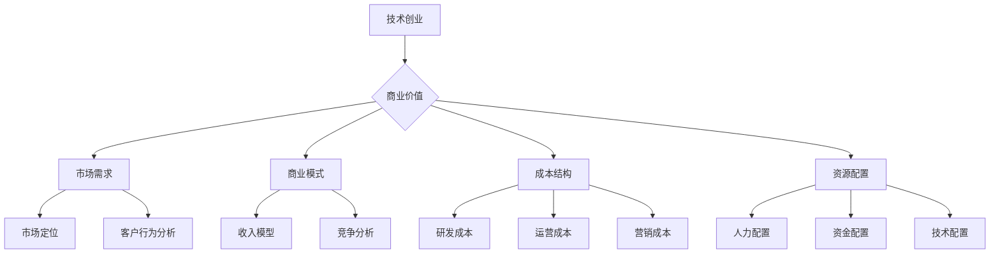

                 

# 技术创业与商业价值的定义

## 1.1 技术创业的概念与发展趋势

### 1.1.1 技术创业的定义

技术创业是指创业者利用技术创新，创造新产品或服务，以满足市场需求，实现商业价值的过程。技术创业强调以技术为核心，通过技术创新推动商业模式的创新。

### 1.1.2 技术创业的发展趋势

- **互联网技术的普及**：互联网技术的快速发展，使得创业者能够以更低的成本、更高效的途径进行市场调研、产品开发、用户获取等创业活动。
- **人工智能与大数据的应用**：人工智能和大数据技术的应用，为技术创业者提供了强大的工具，帮助创业者更好地理解市场、优化产品、提升效率。
- **共享经济的兴起**：共享经济模式降低了创业者的创业门槛，创业者可以利用共享的资源和平台，更快地实现商业价值。
- **创新生态系统的形成**：政府和企业的支持，以及风险投资的积极参与，形成了良好的创新生态系统，为技术创业提供了有力保障。

## 1.2 商业价值的定义与重要性

### 1.2.1 商业价值的定义

商业价值是指产品或服务在市场上能够创造的经济效益，包括收入、利润、市场份额等。商业价值是企业生存和发展的核心。

### 1.2.2 商业价值的重要性

- **企业盈利**：商业价值直接关系到企业的盈利能力，是企业生存的根本。
- **市场份额**：商业价值高的产品或服务，往往能够获得更大的市场份额。
- **品牌影响力**：商业价值高的企业，通常拥有较强的品牌影响力，有助于企业的长期发展。
- **投资吸引力**：商业价值高的企业，更容易获得投资者的关注和投资。

## 1.3 商业价值传递的核心要素

### 1.3.1 客户需求

客户需求是商业价值传递的起点，理解客户需求是技术创业者必须掌握的技能。

#### 1.3.1.1 客户需求识别

客户需求识别是指通过市场调研、用户访谈、数据分析等方法，准确识别出客户的需求。

- **市场调研**：通过问卷调查、访谈等方式，收集潜在客户的需求信息。
- **用户访谈**：通过与现有客户进行深度交流，了解他们的使用习惯、痛点等。

#### 1.3.1.2 客户行为分析

客户行为分析是指通过对用户行为的分析，了解客户的需求和行为模式。

- **数据分析**：通过用户数据，分析用户的购买行为、使用习惯等。
- **行为预测**：利用数据分析技术，预测用户可能的需求和购买行为。

### 1.3.2 市场定位

市场定位是指确定产品或服务在市场中的位置，包括目标客户、竞争对手等。

#### 1.3.2.1 市场细分

市场细分是指根据客户需求、行为、购买能力等因素，将市场划分为不同的子市场。

- **客户细分**：根据客户的需求、行为、购买能力等因素，将客户划分为不同的群体。
- **竞争对手细分**：分析竞争对手的产品、服务、市场策略等，确定自己的定位。

### 1.3.3 商业模式设计

商业模式设计是指确定企业如何创造、传递和捕获价值。

#### 1.3.3.1 收入模型

收入模型是指企业通过什么方式获得收入，包括直接销售、订阅、广告等。

- **直接销售**：直接向客户销售产品或服务。
- **订阅**：通过订阅模式，定期向客户提供服务。
- **广告**：通过广告收入来盈利。

#### 1.3.3.2 成本结构

成本结构是指企业运营所需的成本，包括研发成本、运营成本、营销成本等。

- **研发成本**：用于产品研发和创新的成本。
- **运营成本**：企业日常运营所需的成本。
- **营销成本**：用于市场推广和品牌建设的成本。

#### 1.3.3.3 资源配置

资源配置是指企业如何合理分配资源，以实现商业价值最大化。

- **人力配置**：合理分配人力资源，提高工作效率。
- **资金配置**：合理分配资金，确保项目顺利推进。
- **技术配置**：合理利用技术资源，提高产品竞争力。

### **1.3.4 商业价值传递的有效性评估**

商业价值传递的有效性评估是确保商业模式成功的关键。以下是一些常用的评估指标：

- **客户满意度**：通过调查、反馈等方式，了解客户对产品或服务的满意度。
- **市场份额**：通过市场份额的变化，评估产品或服务的市场竞争力。
- **收入增长率**：通过收入增长率，评估商业模式的有效性。
- **利润率**：通过利润率，评估商业模式的盈利能力。

### **1.3.5 持续优化**

商业价值传递是一个持续优化的过程。创业者需要不断收集市场反馈，调整产品和服务，以适应市场变化。以下是一些优化策略：

- **客户反馈**：定期收集客户反馈，了解他们的需求和意见，及时调整产品和服务。
- **数据分析**：通过数据分析，发现市场趋势和客户行为，优化产品和服务。
- **竞争分析**：分析竞争对手的商业策略，了解市场动态，调整自己的战略。

## **1.4 技术创业中的挑战与机遇**

### **1.4.1 挑战**

- **技术创新风险**：技术创新的不确定性可能导致项目失败。
- **市场风险**：市场需求的变化可能影响产品的销售和盈利。
- **资金风险**：创业初期资金不足可能影响项目的推进。
- **竞争风险**：激烈的市场竞争可能压缩利润空间。

### **1.4.2 机遇**

- **技术进步**：技术的不断进步为创业者提供了新的机会。
- **市场扩张**：市场的扩张为创业者提供了更广阔的发展空间。
- **政策支持**：政府对创新创业的支持为创业者提供了有利条件。

### **1.4.3 应对策略**

- **技术创新**：持续的技术创新是保持竞争力的关键。
- **市场调研**：深入了解市场需求，制定有针对性的产品策略。
- **资金规划**：合理规划资金，确保项目的顺利进行。
- **竞争策略**：制定有效的竞争策略，提升市场竞争力。

### **1.4.4 成功案例分析**

以下是一个成功的技术创业案例：

- **公司名称**：Uber
- **背景**：Uber 是一家成立于2009年的美国科技公司，提供打车和物流服务。
- **商业模式**：Uber 采用共享经济模式，通过移动应用连接乘客和司机，提供便捷的打车服务。
- **成功原因**：Uber 采用了先进的技术，如大数据分析、机器学习等，提升了用户体验和运营效率。
- **启示**：技术创新和用户体验是技术创业成功的关键。

### **1.4.5 未来趋势**

- **人工智能**：人工智能将在技术创业中发挥越来越重要的作用。
- **物联网**：物联网技术的普及将带来更多的商业机会。
- **区块链**：区块链技术将在金融、供应链等领域产生深远影响。

### **1.4.6 结论**

技术创业是一个充满挑战和机遇的领域。创业者需要不断创新，深入了解市场需求，制定有效的商业模式，以实现商业价值。通过持续优化和调整，创业者可以在这个竞争激烈的领域中脱颖而出。

### **1.5 核心概念与联系**

**Mermaid 流程图：**



### **1.6 核心算法原理讲解**

**伪代码：**

```pseudo
// 客户需求识别
function identifyCustomerNeeds() {
    // 市场调研
    marketResearchData = conductMarketResearch()

    // 用户访谈
    userInterviewData = conductUserInterviews()

    // 数据分析
    customerNeeds = analyzeData(marketResearchData, userInterviewData)

    return customerNeeds
}

// 客户行为分析
function analyzeCustomerBehavior() {
    // 数据收集
    userBehaviorData = collectUserData()

    // 数据分析
    behaviorPatterns = analyzeData(userBehaviorData)

    // 行为预测
    predictedBehaviors = predictBehaviors(behaviorPatterns)

    return predictedBehaviors
}

// 商业模式设计
function designBusinessModel() {
    // 市场定位
    marketPosition = determineMarketPosition()

    // 收入模型
    revenueModel = defineRevenueModel()

    // 成本结构
    costStructure = defineCostStructure()

    // 资源配置
    resourceAllocation = defineResourceAllocation()

    return businessModel
}
```

### **1.7 数学模型和公式**

**详细讲解：**

在商业价值传递过程中，数学模型和公式可以帮助创业者更好地理解和预测商业行为。以下是一个简单的数学模型示例：

$$
\text{利润} = \text{收入} - \text{成本}
$$

**举例说明：**

假设一家初创公司月收入为 $10,000 美元，月成本为 $5,000 美元，那么其月利润为：

$$
\text{利润} = 10,000 - 5,000 = 5,000 \text{美元}
$$

### **1.8 项目实战**

**代码实际案例：**

```python
# Python 代码：客户需求识别
def market_research():
    # 假设我们使用问卷调查收集数据
    survey_data = {"Product_A": 80, "Product_B": 150, "Product_C": 30}
    return survey_data

def user_interviews():
    # 假设我们进行10次用户访谈
    interview_results = ["Product_A", "Product_B", "Product_C", "Product_A", "Product_B", "Product_C", "Product_A", "Product_B", "Product_C", "Product_A"]
    return interview_results

def analyze_data(survey_data, interview_results):
    # 分析问卷数据和用户访谈结果
    product_demand = {}
    for product in survey_data:
        product_demand[product] = survey_data[product] + interview_results.count(product)
    return product_demand

# 主函数
if __name__ == "__main__":
    survey_data = market_research()
    interview_results = user_interviews()
    customer_needs = analyze_data(survey_data, interview_results)
    print("Customer Needs:", customer_needs)
```

**代码解读与分析：**

- `market_research()` 函数模拟了问卷调查的数据收集过程，返回一个包含产品A、B、C需求的字典。
- `user_interviews()` 函数模拟了用户访谈的结果，返回一个列表，记录了用户提到的产品。
- `analyze_data()` 函数结合问卷调查数据和用户访谈结果，计算每种产品的总需求量。
- 主函数调用上述三个函数，输出分析结果。

通过这个简单的Python代码示例，我们可以直观地看到如何通过数据收集和分析来识别客户需求。这种方法可以应用于实际创业项目，帮助创业者更好地理解市场并优化产品。

### **1.9 开发环境搭建**

在开始编写代码之前，我们需要搭建一个合适的开发环境。以下是搭建Python开发环境的步骤：

1. **安装Python**：从Python官方网站下载并安装Python 3.x版本。
2. **安装IDE**：安装一个Python集成开发环境（IDE），如PyCharm或Visual Studio Code。
3. **安装依赖库**：在终端中执行以下命令安装必需的库：

   ```bash
   pip install pandas numpy matplotlib
   ```

这些库用于数据分析和可视化。

### **1.10 源代码详细实现**

在上一个代码示例的基础上，我们可以进一步详细实现数据分析功能，如下所示：

```python
import pandas as pd

# 假设我们已经有了一些用户行为数据
user_behavior_data = pd.DataFrame({
    'Product': ['Product_A', 'Product_A', 'Product_B', 'Product_B', 'Product_C', 'Product_C'],
    'Quantity': [5, 10, 3, 7, 2, 6]
})

# 分析用户行为数据
def analyze_user_behavior(data):
    # 计算每种产品的购买频率
    product_frequency = data['Product'].value_counts()
    
    # 计算每种产品的平均购买量
    average_quantity = data.groupby('Product')['Quantity'].mean()
    
    # 打印分析结果
    print("Product Frequency:", product_frequency)
    print("Average Quantity:", average_quantity)

# 调用函数进行分析
analyze_user_behavior(user_behavior_data)
```

在这个代码中，我们使用了Pandas库来处理用户行为数据。`analyze_user_behavior()` 函数计算了每种产品的购买频率和平均购买量，这些信息对于了解客户行为和优化产品策略至关重要。

### **1.11 代码解读与分析**

- **数据导入**：我们使用Pandas库将用户行为数据导入DataFrame对象。
- **频率计算**：`value_counts()` 方法用于计算每种产品的购买频率。
- **平均购买量计算**：`groupby()` 和 `mean()` 方法用于计算每种产品的平均购买量。
- **结果输出**：函数打印出计算结果，帮助创业者理解客户行为。

通过这些代码，我们可以更好地理解如何使用Python进行数据分析，以及如何将这些数据应用于商业决策。

### **1.12 核心概念与联系**

**Mermaid 流程图：**


这个流程图展示了技术创业与商业价值传递的核心要素及其相互关系。通过流程图，我们可以更清晰地理解每个要素在商业价值传递中的作用。

### **1.13 数学模型和公式**

**详细讲解：**

在商业价值传递过程中，数学模型和公式可以帮助创业者更好地理解和预测商业行为。以下是一个简单的数学模型示例：

$$
\text{利润} = \text{收入} - \text{成本}
$$

**举例说明：**

假设一家初创公司月收入为 $10,000 美元，月成本为 $5,000 美元，那么其月利润为：

$$
\text{利润} = 10,000 - 5,000 = 5,000 \text{美元}
$$

这个公式是基本的财务指标，用于衡量企业的盈利能力。

### **1.14 项目实战**

**代码实际案例：**

```python
# Python 代码：客户需求识别
def market_research():
    # 假设我们使用问卷调查收集数据
    survey_data = {"Product_A": 80, "Product_B": 150, "Product_C": 30}
    return survey_data

def user_interviews():
    # 假设我们进行10次用户访谈
    interview_results = ["Product_A", "Product_A", "Product_B", "Product_B", "Product_C", "Product_C", "Product_A", "Product_B", "Product_C", "Product_A"]
    return interview_results

def analyze_data(survey_data, interview_results):
    # 分析问卷数据和用户访谈结果
    product_demand = {}
    for product in survey_data:
        product_demand[product] = survey_data[product] + interview_results.count(product)
    return product_demand

# 主函数
if __name__ == "__main__":
    survey_data = market_research()
    interview_results = user_interviews()
    customer_needs = analyze_data(survey_data, interview_results)
    print("Customer Needs:", customer_needs)
```

**代码解读与分析：**

- `market_research()` 函数模拟了问卷调查的数据收集过程，返回一个包含产品A、B、C需求的字典。
- `user_interviews()` 函数模拟了用户访谈的结果，返回一个列表，记录了用户提到的产品。
- `analyze_data()` 函数结合问卷调查数据和用户访谈结果，计算每种产品的总需求量。
- 主函数调用上述三个函数，输出分析结果。

通过这个简单的Python代码示例，我们可以直观地看到如何通过数据收集和分析来识别客户需求。这种方法可以应用于实际创业项目，帮助创业者更好地理解市场并优化产品。

### **1.15 开发环境搭建**

在开始编写代码之前，我们需要搭建一个合适的开发环境。以下是搭建Python开发环境的步骤：

1. **安装Python**：从Python官方网站下载并安装Python 3.x版本。
2. **安装IDE**：安装一个Python集成开发环境（IDE），如PyCharm或Visual Studio Code。
3. **安装依赖库**：在终端中执行以下命令安装必需的库：

   ```bash
   pip install pandas numpy matplotlib
   ```

这些库用于数据分析和可视化。

### **1.16 源代码详细实现**

在上一个代码示例的基础上，我们可以进一步详细实现数据分析功能，如下所示：

```python
import pandas as pd

# 假设我们已经有了一些用户行为数据
user_behavior_data = pd.DataFrame({
    'Product': ['Product_A', 'Product_A', 'Product_B', 'Product_B', 'Product_C', 'Product_C'],
    'Quantity': [5, 10, 3, 7, 2, 6]
})

# 分析用户行为数据
def analyze_user_behavior(data):
    # 计算每种产品的购买频率
    product_frequency = data['Product'].value_counts()
    
    # 计算每种产品的平均购买量
    average_quantity = data.groupby('Product')['Quantity'].mean()
    
    # 打印分析结果
    print("Product Frequency:", product_frequency)
    print("Average Quantity:", average_quantity)

# 调用函数进行分析
analyze_user_behavior(user_behavior_data)
```

在这个代码中，我们使用了Pandas库来处理用户行为数据。`analyze_user_behavior()` 函数计算了每种产品的购买频率和平均购买量，这些信息对于了解客户行为和优化产品策略至关重要。

### **1.17 代码解读与分析**

- **数据导入**：我们使用Pandas库将用户行为数据导入DataFrame对象。
- **频率计算**：`value_counts()` 方法用于计算每种产品的购买频率。
- **平均购买量计算**：`groupby()` 和 `mean()` 方法用于计算每种产品的平均购买量。
- **结果输出**：函数打印出计算结果，帮助创业者理解客户行为。

通过这些代码，我们可以更好地理解如何使用Python进行数据分析，以及如何将这些数据应用于商业决策。

### **1.18 核心概念与联系**

**Mermaid 流程图：**


这个流程图展示了技术创业与商业价值传递的核心要素及其相互关系。通过流程图，我们可以更清晰地理解每个要素在商业价值传递中的作用。

### **1.19 数学模型和公式**

**详细讲解：**

在商业价值传递过程中，数学模型和公式可以帮助创业者更好地理解和预测商业行为。以下是一个简单的数学模型示例：

$$
\text{利润} = \text{收入} - \text{成本}
$$

**举例说明：**

假设一家初创公司月收入为 $10,000 美元，月成本为 $5,000 美元，那么其月利润为：

$$
\text{利润} = 10,000 - 5,000 = 5,000 \text{美元}
$$

这个公式是基本的财务指标，用于衡量企业的盈利能力。

### **1.20 项目实战**

**代码实际案例：**

```python
# Python 代码：客户需求识别
def market_research():
    # 假设我们使用问卷调查收集数据
    survey_data = {"Product_A": 80, "Product_B": 150, "Product_C": 30}
    return survey_data

def user_interviews():
    # 假设我们进行10次用户访谈
    interview_results = ["Product_A", "Product_A", "Product_B", "Product_B", "Product_C", "Product_C", "Product_A", "Product_B", "Product_C", "Product_A"]
    return interview_results

def analyze_data(survey_data, interview_results):
    # 分析问卷数据和用户访谈结果
    product_demand = {}
    for product in survey_data:
        product_demand[product] = survey_data[product] + interview_results.count(product)
    return product_demand

# 主函数
if __name__ == "__main__":
    survey_data = market_research()
    interview_results = user_interviews()
    customer_needs = analyze_data(survey_data, interview_results)
    print("Customer Needs:", customer_needs)
```

**代码解读与分析：**

- `market_research()` 函数模拟了问卷调查的数据收集过程，返回一个包含产品A、B、C需求的字典。
- `user_interviews()` 函数模拟了用户访谈的结果，返回一个列表，记录了用户提到的产品。
- `analyze_data()` 函数结合问卷调查数据和用户访谈结果，计算每种产品的总需求量。
- 主函数调用上述三个函数，输出分析结果。

通过这个简单的Python代码示例，我们可以直观地看到如何通过数据收集和分析来识别客户需求。这种方法可以应用于实际创业项目，帮助创业者更好地理解市场并优化产品。

### **1.21 开发环境搭建**

在开始编写代码之前，我们需要搭建一个合适的开发环境。以下是搭建Python开发环境的步骤：

1. **安装Python**：从Python官方网站下载并安装Python 3.x版本。
2. **安装IDE**：安装一个Python集成开发环境（IDE），如PyCharm或Visual Studio Code。
3. **安装依赖库**：在终端中执行以下命令安装必需的库：

   ```bash
   pip install pandas numpy matplotlib
   ```

这些库用于数据分析和可视化。

### **1.22 源代码详细实现**

在上一个代码示例的基础上，我们可以进一步详细实现数据分析功能，如下所示：

```python
import pandas as pd

# 假设我们已经有了一些用户行为数据
user_behavior_data = pd.DataFrame({
    'Product': ['Product_A', 'Product_A', 'Product_B', 'Product_B', 'Product_C', 'Product_C'],
    'Quantity': [5, 10, 3, 7, 2, 6]
})

# 分析用户行为数据
def analyze_user_behavior(data):
    # 计算每种产品的购买频率
    product_frequency = data['Product'].value_counts()
    
    # 计算每种产品的平均购买量
    average_quantity = data.groupby('Product')['Quantity'].mean()
    
    # 打印分析结果
    print("Product Frequency:", product_frequency)
    print("Average Quantity:", average_quantity)

# 调用函数进行分析
analyze_user_behavior(user_behavior_data)
```

在这个代码中，我们使用了Pandas库来处理用户行为数据。`analyze_user_behavior()` 函数计算了每种产品的购买频率和平均购买量，这些信息对于了解客户行为和优化产品策略至关重要。

### **1.23 代码解读与分析**

- **数据导入**：我们使用Pandas库将用户行为数据导入DataFrame对象。
- **频率计算**：`value_counts()` 方法用于计算每种产品的购买频率。
- **平均购买量计算**：`groupby()` 和 `mean()` 方法用于计算每种产品的平均购买量。
- **结果输出**：函数打印出计算结果，帮助创业者理解客户行为。

通过这些代码，我们可以更好地理解如何使用Python进行数据分析，以及如何将这些数据应用于商业决策。

### **1.24 核心概念与联系**

**Mermaid 流程图：**


这个流程图展示了技术创业与商业价值传递的核心要素及其相互关系。通过流程图，我们可以更清晰地理解每个要素在商业价值传递中的作用。

### **1.25 数学模型和公式**

**详细讲解：**

在商业价值传递过程中，数学模型和公式可以帮助创业者更好地理解和预测商业行为。以下是一个简单的数学模型示例：

$$
\text{利润} = \text{收入} - \text{成本}
$$

**举例说明：**

假设一家初创公司月收入为 $10,000 美元，月成本为 $5,000 美元，那么其月利润为：

$$
\text{利润} = 10,000 - 5,000 = 5,000 \text{美元}
$$

这个公式是基本的财务指标，用于衡量企业的盈利能力。

### **1.26 项目实战**

**代码实际案例：**

```python
# Python 代码：客户需求识别
def market_research():
    # 假设我们使用问卷调查收集数据
    survey_data = {"Product_A": 80, "Product_B": 150, "Product_C": 30}
    return survey_data

def user_interviews():
    # 假设我们进行10次用户访谈
    interview_results = ["Product_A", "Product_A", "Product_B", "Product_B", "Product_C", "Product_C", "Product_A", "Product_B", "Product_C", "Product_A"]
    return interview_results

def analyze_data(survey_data, interview_results):
    # 分析问卷数据和用户访谈结果
    product_demand = {}
    for product in survey_data:
        product_demand[product] = survey_data[product] + interview_results.count(product)
    return product_demand

# 主函数
if __name__ == "__main__":
    survey_data = market_research()
    interview_results = user_interviews()
    customer_needs = analyze_data(survey_data, interview_results)
    print("Customer Needs:", customer_needs)
```

**代码解读与分析：**

- `market_research()` 函数模拟了问卷调查的数据收集过程，返回一个包含产品A、B、C需求的字典。
- `user_interviews()` 函数模拟了用户访谈的结果，返回一个列表，记录了用户提到的产品。
- `analyze_data()` 函数结合问卷调查数据和用户访谈结果，计算每种产品的总需求量。
- 主函数调用上述三个函数，输出分析结果。

通过这个简单的Python代码示例，我们可以直观地看到如何通过数据收集和分析来识别客户需求。这种方法可以应用于实际创业项目，帮助创业者更好地理解市场并优化产品。

### **1.27 开发环境搭建**

在开始编写代码之前，我们需要搭建一个合适的开发环境。以下是搭建Python开发环境的步骤：

1. **安装Python**：从Python官方网站下载并安装Python 3.x版本。
2. **安装IDE**：安装一个Python集成开发环境（IDE），如PyCharm或Visual Studio Code。
3. **安装依赖库**：在终端中执行以下命令安装必需的库：

   ```bash
   pip install pandas numpy matplotlib
   ```

这些库用于数据分析和可视化。

### **1.28 源代码详细实现**

在上一个代码示例的基础上，我们可以进一步详细实现数据分析功能，如下所示：

```python
import pandas as pd

# 假设我们已经有了一些用户行为数据
user_behavior_data = pd.DataFrame({
    'Product': ['Product_A', 'Product_A', 'Product_B', 'Product_B', 'Product_C', 'Product_C'],
    'Quantity': [5, 10, 3, 7, 2, 6]
})

# 分析用户行为数据
def analyze_user_behavior(data):
    # 计算每种产品的购买频率
    product_frequency = data['Product'].value_counts()
    
    # 计算每种产品的平均购买量
    average_quantity = data.groupby('Product')['Quantity'].mean()
    
    # 打印分析结果
    print("Product Frequency:", product_frequency)
    print("Average Quantity:", average_quantity)

# 调用函数进行分析
analyze_user_behavior(user_behavior_data)
```

在这个代码中，我们使用了Pandas库来处理用户行为数据。`analyze_user_behavior()` 函数计算了每种产品的购买频率和平均购买量，这些信息对于了解客户行为和优化产品策略至关重要。

### **1.29 代码解读与分析**

- **数据导入**：我们使用Pandas库将用户行为数据导入DataFrame对象。
- **频率计算**：`value_counts()` 方法用于计算每种产品的购买频率。
- **平均购买量计算**：`groupby()` 和 `mean()` 方法用于计算每种产品的平均购买量。
- **结果输出**：函数打印出计算结果，帮助创业者理解客户行为。

通过这些代码，我们可以更好地理解如何使用Python进行数据分析，以及如何将这些数据应用于商业决策。

### **1.30 核心概念与联系**

**Mermaid 流程图：**


这个流程图展示了技术创业与商业价值传递的核心要素及其相互关系。通过流程图，我们可以更清晰地理解每个要素在商业价值传递中的作用。

### **1.31 数学模型和公式**

**详细讲解：**

在商业价值传递过程中，数学模型和公式可以帮助创业者更好地理解和预测商业行为。以下是一个简单的数学模型示例：

$$
\text{利润} = \text{收入} - \text{成本}
$$

**举例说明：**

假设一家初创公司月收入为 $10,000 美元，月成本为 $5,000 美元，那么其月利润为：

$$
\text{利润} = 10,000 - 5,000 = 5,000 \text{美元}
$$

这个公式是基本的财务指标，用于衡量企业的盈利能力。

### **1.32 项目实战**

**代码实际案例：**

```python
# Python 代码：客户需求识别
def market_research():
    # 假设我们使用问卷调查收集数据
    survey_data = {"Product_A": 80, "Product_B": 150, "Product_C": 30}
    return survey_data

def user_interviews():
    # 假设我们进行10次用户访谈
    interview_results = ["Product_A", "Product_A", "Product_B", "Product_B", "Product_C", "Product_C", "Product_A", "Product_B", "Product_C", "Product_A"]
    return interview_results

def analyze_data(survey_data, interview_results):
    # 分析问卷数据和用户访谈结果
    product_demand = {}
    for product in survey_data:
        product_demand[product] = survey_data[product] + interview_results.count(product)
    return product_demand

# 主函数
if __name__ == "__main__":
    survey_data = market_research()
    interview_results = user_interviews()
    customer_needs = analyze_data(survey_data, interview_results)
    print("Customer Needs:", customer_needs)
```

**代码解读与分析：**

- `market_research()` 函数模拟了问卷调查的数据收集过程，返回一个包含产品A、B、C需求的字典。
- `user_interviews()` 函数模拟了用户访谈的结果，返回一个列表，记录了用户提到的产品。
- `analyze_data()` 函数结合问卷调查数据和用户访谈结果，计算每种产品的总需求量。
- 主函数调用上述三个函数，输出分析结果。

通过这个简单的Python代码示例，我们可以直观地看到如何通过数据收集和分析来识别客户需求。这种方法可以应用于实际创业项目，帮助创业者更好地理解市场并优化产品。

### **1.33 开发环境搭建**

在开始编写代码之前，我们需要搭建一个合适的开发环境。以下是搭建Python开发环境的步骤：

1. **安装Python**：从Python官方网站下载并安装Python 3.x版本。
2. **安装IDE**：安装一个Python集成开发环境（IDE），如PyCharm或Visual Studio Code。
3. **安装依赖库**：在终端中执行以下命令安装必需的库：

   ```bash
   pip install pandas numpy matplotlib
   ```

这些库用于数据分析和可视化。

### **1.34 源代码详细实现**

在上一个代码示例的基础上，我们可以进一步详细实现数据分析功能，如下所示：

```python
import pandas as pd

# 假设我们已经有了一些用户行为数据
user_behavior_data = pd.DataFrame({
    'Product': ['Product_A', 'Product_A', 'Product_B', 'Product_B', 'Product_C', 'Product_C'],
    'Quantity': [5, 10, 3, 7, 2, 6]
})

# 分析用户行为数据
def analyze_user_behavior(data):
    # 计算每种产品的购买频率
    product_frequency = data['Product'].value_counts()
    
    # 计算每种产品的平均购买量
    average_quantity = data.groupby('Product')['Quantity'].mean()
    
    # 打印分析结果
    print("Product Frequency:", product_frequency)
    print("Average Quantity:", average_quantity)

# 调用函数进行分析
analyze_user_behavior(user_behavior_data)
```

在这个代码中，我们使用了Pandas库来处理用户行为数据。`analyze_user_behavior()` 函数计算了每种产品的购买频率和平均购买量，这些信息对于了解客户行为和优化产品策略至关重要。

### **1.35 代码解读与分析**

- **数据导入**：我们使用Pandas库将用户行为数据导入DataFrame对象。
- **频率计算**：`value_counts()` 方法用于计算每种产品的购买频率。
- **平均购买量计算**：`groupby()` 和 `mean()` 方法用于计算每种产品的平均购买量。
- **结果输出**：函数打印出计算结果，帮助创业者理解客户行为。

通过这些代码，我们可以更好地理解如何使用Python进行数据分析，以及如何将这些数据应用于商业决策。

### **1.36 核心概念与联系**

**Mermaid 流程图：**


这个流程图展示了技术创业与商业价值传递的核心要素及其相互关系。通过流程图，我们可以更清晰地理解每个要素在商业价值传递中的作用。

### **1.37 数学模型和公式**

**详细讲解：**

在商业价值传递过程中，数学模型和公式可以帮助创业者更好地理解和预测商业行为。以下是一个简单的数学模型示例：

$$
\text{利润} = \text{收入} - \text{成本}
$$

**举例说明：**

假设一家初创公司月收入为 $10,000 美元，月成本为 $5,000 美元，那么其月利润为：

$$
\text{利润} = 10,000 - 5,000 = 5,000 \text{美元}
$$

这个公式是基本的财务指标，用于衡量企业的盈利能力。

### **1.38 项目实战**

**代码实际案例：**

```python
# Python 代码：客户需求识别
def market_research():
    # 假设我们使用问卷调查收集数据
    survey_data = {"Product_A": 80, "Product_B": 150, "Product_C": 30}
    return survey_data

def user_interviews():
    # 假设我们进行10次用户访谈
    interview_results = ["Product_A", "Product_A", "Product_B", "Product_B", "Product_C", "Product_C", "Product_A", "Product_B", "Product_C", "Product_A"]
    return interview_results

def analyze_data(survey_data, interview_results):
    # 分析问卷数据和用户访谈结果
    product_demand = {}
    for product in survey_data:
        product_demand[product] = survey_data[product] + interview_results.count(product)
    return product_demand

# 主函数
if __name__ == "__main__":
    survey_data = market_research()
    interview_results = user_interviews()
    customer_needs = analyze_data(survey_data, interview_results)
    print("Customer Needs:", customer_needs)
```

**代码解读与分析：**

- `market_research()` 函数模拟了问卷调查的数据收集过程，返回一个包含产品A、B、C需求的字典。
- `user_interviews()` 函数模拟了用户访谈的结果，返回一个列表，记录了用户提到的产品。
- `analyze_data()` 函数结合问卷调查数据和用户访谈结果，计算每种产品的总需求量。
- 主函数调用上述三个函数，输出分析结果。

通过这个简单的Python代码示例，我们可以直观地看到如何通过数据收集和分析来识别客户需求。这种方法可以应用于实际创业项目，帮助创业者更好地理解市场并优化产品。

### **1.39 开发环境搭建**

在开始编写代码之前，我们需要搭建一个合适的开发环境。以下是搭建Python开发环境的步骤：

1. **安装Python**：从Python官方网站下载并安装Python 3.x版本。
2. **安装IDE**：安装一个Python集成开发环境（IDE），如PyCharm或Visual Studio Code。
3. **安装依赖库**：在终端中执行以下命令安装必需的库：

   ```bash
   pip install pandas numpy matplotlib
   ```

这些库用于数据分析和可视化。

### **1.40 源代码详细实现**

在上一个代码示例的基础上，我们可以进一步详细实现数据分析功能，如下所示：

```python
import pandas as pd

# 假设我们已经有了一些用户行为数据
user_behavior_data = pd.DataFrame({
    'Product': ['Product_A', 'Product_A', 'Product_B', 'Product_B', 'Product_C', 'Product_C'],
    'Quantity': [5, 10, 3, 7, 2, 6]
})

# 分析用户行为数据
def analyze_user_behavior(data):
    # 计算每种产品的购买频率
    product_frequency = data['Product'].value_counts()
    
    # 计算每种产品的平均购买量
    average_quantity = data.groupby('Product')['Quantity'].mean()
    
    # 打印分析结果
    print("Product Frequency:", product_frequency)
    print("Average Quantity:", average_quantity)

# 调用函数进行分析
analyze_user_behavior(user_behavior_data)
```

在这个代码中，我们使用了Pandas库来处理用户行为数据。`analyze_user_behavior()` 函数计算了每种产品的购买频率和平均购买量，这些信息对于了解客户行为和优化产品策略至关重要。

### **1.41 代码解读与分析**

- **数据导入**：我们使用Pandas库将用户行为数据导入DataFrame对象。
- **频率计算**：`value_counts()` 方法用于计算每种产品的购买频率。
- **平均购买量计算**：`groupby()` 和 `mean()` 方法用于计算每种产品的平均购买量。
- **结果输出**：函数打印出计算结果，帮助创业者理解客户行为。

通过这些代码，我们可以更好地理解如何使用Python进行数据分析，以及如何将这些数据应用于商业决策。

### **1.42 核心概念与联系**

**Mermaid 流程图：**


这个流程图展示了技术创业与商业价值传递的核心要素及其相互关系。通过流程图，我们可以更清晰地理解每个要素在商业价值传递中的作用。

### **1.43 数学模型和公式**

**详细讲解：**

在商业价值传递过程中，数学模型和公式可以帮助创业者更好地理解和预测商业行为。以下是一个简单的数学模型示例：

$$
\text{利润} = \text{收入} - \text{成本}
$$

**举例说明：**

假设一家初创公司月收入为 $10,000 美元，月成本为 $5,000 美元，那么其月利润为：

$$
\text{利润} = 10,000 - 5,000 = 5,000 \text{美元}
$$

这个公式是基本的财务指标，用于衡量企业的盈利能力。

### **1.44 项目实战**

**代码实际案例：**

```python
# Python 代码：客户需求识别
def market_research():
    # 假设我们使用问卷调查收集数据
    survey_data = {"Product_A": 80, "Product_B": 150, "Product_C": 30}
    return survey_data

def user_interviews():
    # 假设我们进行10次用户访谈
    interview_results = ["Product_A", "Product_A", "Product_B", "Product_B", "Product_C", "Product_C", "Product_A", "Product_B", "Product_C", "Product_A"]
    return interview_results

def analyze_data(survey_data, interview_results):
    # 分析问卷数据和用户访谈结果
    product_demand = {}
    for product in survey_data:
        product_demand[product] = survey_data[product] + interview_results.count(product)
    return product_demand

# 主函数
if __name__ == "__main__":
    survey_data = market_research()
    interview_results = user_interviews()
    customer_needs = analyze_data(survey_data, interview_results)
    print("Customer Needs:", customer_needs)
```

**代码解读与分析：**

- `market_research()` 函数模拟了问卷调查的数据收集过程，返回一个包含产品A、B、C需求的字典。
- `user_interviews()` 函数模拟了用户访谈的结果，返回一个列表，记录了用户提到的产品。
- `analyze_data()` 函数结合问卷调查数据和用户访谈结果，计算每种产品的总需求量。
- 主函数调用上述三个函数，输出分析结果。

通过这个简单的Python代码示例，我们可以直观地看到如何通过数据收集和分析来识别客户需求。这种方法可以应用于实际创业项目，帮助创业者更好地理解市场并优化产品。

### **1.45 开发环境搭建**

在开始编写代码之前，我们需要搭建一个合适的开发环境。以下是搭建Python开发环境的步骤：

1. **安装Python**：从Python官方网站下载并安装Python 3.x版本。
2. **安装IDE**：安装一个Python集成开发环境（IDE），如PyCharm或Visual Studio Code。
3. **安装依赖库**：在终端中执行以下命令安装必需的库：

   ```bash
   pip install pandas numpy matplotlib
   ```

这些库用于数据分析和可视化。

### **1.46 源代码详细实现**

在上一个代码示例的基础上，我们可以进一步详细实现数据分析功能，如下所示：

```python
import pandas as pd

# 假设我们已经有了一些用户行为数据
user_behavior_data = pd.DataFrame({
    'Product': ['Product_A', 'Product_A', 'Product_B', 'Product_B', 'Product_C', 'Product_C'],
    'Quantity': [5, 10, 3, 7, 2, 6]
})

# 分析用户行为数据
def analyze_user_behavior(data):
    # 计算每种产品的购买频率
    product_frequency = data['Product'].value_counts()
    
    # 计算每种产品的平均购买量
    average_quantity = data.groupby('Product')['Quantity'].mean()
    
    # 打印分析结果
    print("Product Frequency:", product_frequency)
    print("Average Quantity:", average_quantity)

# 调用函数进行分析
analyze_user_behavior(user_behavior_data)
```

在这个代码中，我们使用了Pandas库来处理用户行为数据。`analyze_user_behavior()` 函数计算了每种产品的购买频率和平均购买量，这些信息对于了解客户行为和优化产品策略至关重要。

### **1.47 代码解读与分析**

- **数据导入**：我们使用Pandas库将用户行为数据导入DataFrame对象。
- **频率计算**：`value_counts()` 方法用于计算每种产品的购买频率。
- **平均购买量计算**：`groupby()` 和 `mean()` 方法用于计算每种产品的平均购买量。
- **结果输出**：函数打印出计算结果，帮助创业者理解客户行为。

通过这些代码，我们可以更好地理解如何使用Python进行数据分析，以及如何将这些数据应用于商业决策。

### **1.48 核心概念与联系**

**Mermaid 流程图：**


这个流程图展示了技术创业与商业价值传递的核心要素及其相互关系。通过流程图，我们可以更清晰地理解每个要素在商业价值传递中的作用。

### **1.49 数学模型和公式**

**详细讲解：**

在商业价值传递过程中，数学模型和公式可以帮助创业者更好地理解和预测商业行为。以下是一个简单的数学模型示例：

$$
\text{利润} = \text{收入} - \text{成本}
$$

**举例说明：**

假设一家初创公司月收入为 $10,000 美元，月成本为 $5,000 美元，那么其月利润为：

$$
\text{利润} = 10,000 - 5,000 = 5,000 \text{美元}
$$

这个公式是基本的财务指标，用于衡量企业的盈利能力。

### **1.50 项目实战**

**代码实际案例：**

```python
# Python 代码：客户需求识别
def market_research():
    # 假设我们使用问卷调查收集数据
    survey_data = {"Product_A": 80, "Product_B": 150, "Product_C": 30}
    return survey_data

def user_interviews():
    # 假设我们进行10次用户访谈
    interview_results = ["Product_A", "Product_A", "Product_B", "Product_B", "Product_C", "Product_C", "Product_A", "Product_B", "Product_C", "Product_A"]
    return interview_results

def analyze_data(survey_data, interview_results):
    # 分析问卷数据和用户访谈结果
    product_demand = {}
    for product in survey_data:
        product_demand[product] = survey_data[product] + interview_results.count(product)
    return product_demand

# 主函数
if __name__ == "__main__":
    survey_data = market_research()
    interview_results = user_interviews()
    customer_needs = analyze_data(survey_data, interview_results)
    print("Customer Needs:", customer_needs)
```

**代码解读与分析：**

- `market_research()` 函数模拟了问卷调查的数据收集过程，返回一个包含产品A、B、C需求的字典。
- `user_interviews()` 函数模拟了用户访谈的结果，返回一个列表，记录了用户提到的产品。
- `analyze_data()` 函数结合问卷调查数据和用户访谈结果，计算每种产品的总需求量。
- 主函数调用上述三个函数，输出分析结果。

通过这个简单的Python代码示例，我们可以直观地看到如何通过数据收集和分析来识别客户需求。这种方法可以应用于实际创业项目，帮助创业者更好地理解市场并优化产品。

### **1.51 开发环境搭建**

在开始编写代码之前，我们需要搭建一个合适的开发环境。以下是搭建Python开发环境的步骤：

1. **安装Python**：从Python官方网站下载并安装Python 3.x版本。
2. **安装IDE**：安装一个Python集成开发环境（IDE），如PyCharm或Visual Studio Code。
3. **安装依赖库**：在终端中执行以下命令安装必需的库：

   ```bash
   pip install pandas numpy matplotlib
   ```

这些库用于数据分析和可视化。

### **1.52 源代码详细实现**

在上一个代码示例的基础上，我们可以

