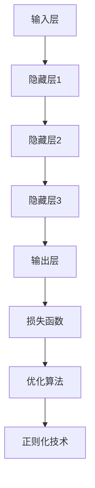
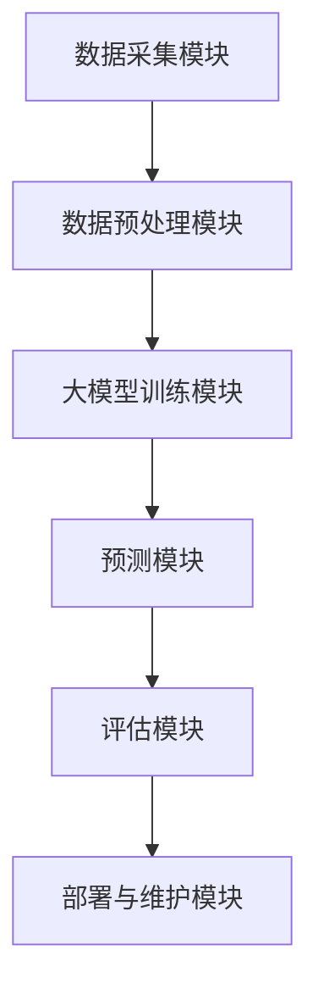
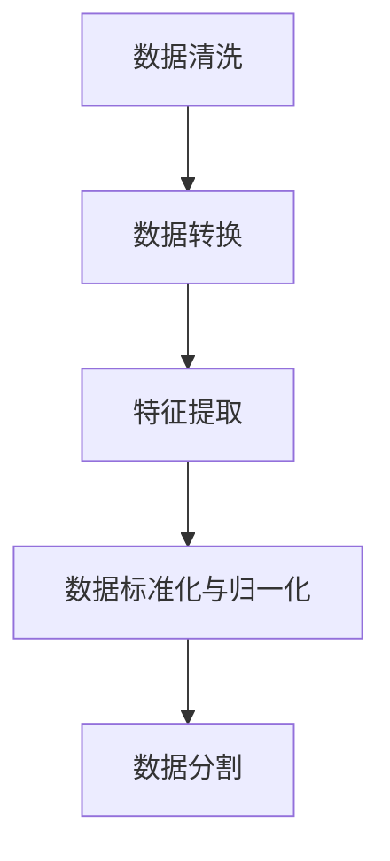
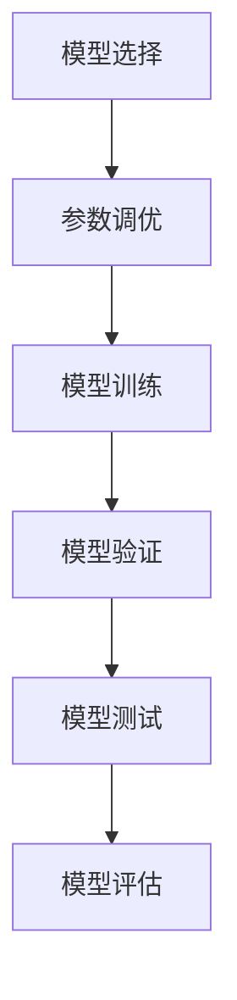

                 

### 《探索基于大模型的电商智能商品属性预测系统》

> **关键词**：电商、智能商品属性预测、大模型、神经网络、系统设计、案例分析

> **摘要**：本文将深入探讨电商领域中的智能商品属性预测系统。通过分析大模型在电商应用中的现状与挑战，详细介绍大模型的基础概念、核心算法原理，以及电商智能商品属性预测系统设计的各个环节，并结合实际案例进行解读。文章旨在为读者提供一份全面、系统的电商智能商品属性预测解决方案，并对其未来发展进行展望。

### 目录大纲

- **第一部分：背景与概念**
  - **第1章：电商行业与商品属性预测概述**
  - **第2章：大模型基础概念**
  - **第3章：大模型的核心算法原理**

- **第二部分：电商智能商品属性预测系统设计**
  - **第4章：系统架构设计**
  - **第5章：数据收集与预处理**
  - **第6章：大模型训练与优化**
  - **第7章：系统部署与优化**

- **第三部分：未来展望与挑战**
  - **第8章：案例分析**
  - **第9章：大模型在电商领域的未来发展**
  - **第10章：总结与展望**

- **附录**
  - **附录A：大模型开发常用工具与资源**

---

### 引言

随着互联网技术的迅猛发展，电商行业迎来了前所未有的繁荣。然而，在这个庞大的市场中，如何提高用户体验、提升商品销售转化率成为各大电商平台关注的焦点。而智能商品属性预测系统正是实现这一目标的关键技术之一。通过精准预测商品属性，电商平台可以更好地推荐商品、优化库存管理、提升营销策略，从而实现商业价值的最大化。

大模型作为一种强大的机器学习技术，近年来在各个领域取得了显著的进展。其强大的数据处理能力和高度的自适应能力，使得大模型在电商智能商品属性预测中具有广泛的应用前景。本文旨在深入探讨大模型在电商智能商品属性预测系统中的应用，从背景、概念、算法原理、系统设计、案例分析等多个角度，为读者提供一份全面、系统的解决方案。

本文首先介绍了电商行业的现状与挑战，以及商品属性预测在电商中的重要地位。接着，详细阐述了大模型的基础概念、分类和基本架构。随后，我们分析了大模型的核心算法原理，包括神经网络、循环神经网络（RNN）、长短期记忆网络（LSTM）和生成对抗网络（GAN）。在此基础上，本文重点介绍了电商智能商品属性预测系统的设计，包括系统架构、数据收集与预处理、大模型训练与优化、系统部署与优化等环节。

为了更好地说明理论，本文还结合实际案例，对某电商平台的商品属性预测系统和某跨境电商平台的用户行为预测系统进行了详细分析。最后，本文对未来大模型在电商领域的应用和发展进行了展望，并对电商行业的影响进行了总结。

通过本文的阅读，读者将全面了解电商智能商品属性预测系统的构建过程，掌握大模型在其中的应用方法，并为未来的研究和实践提供参考。

---

### 电商行业与商品属性预测概述

电商行业的兴起，彻底改变了传统零售业的运作模式，也为消费者带来了更加便捷、个性化的购物体验。随着市场规模的不断扩大，电商平台之间的竞争日益激烈，如何提高用户体验、提升商品销售转化率成为各大电商平台关注的焦点。而商品属性预测技术在这一过程中发挥着至关重要的作用。

#### 1.1 电商行业的现状与挑战

根据统计数据，全球电商市场规模在过去几年中持续增长，预计到2025年，全球电商市场规模将达到6.5万亿美元。这一庞大的市场规模吸引了大量企业和创业者进入电商领域，使得市场竞争愈发激烈。在这样的大背景下，电商平台面临着诸多挑战：

1. **用户需求多样化和个性化**：消费者对商品的需求日益多样化和个性化，这要求电商平台能够精准捕捉用户喜好，提供个性化的商品推荐。

2. **库存管理难度增加**：随着商品种类的增加，库存管理的难度也在不断提升。如何确保商品库存充足，同时又不过度积压，是电商平台需要解决的一大难题。

3. **营销策略的优化**：电商平台的营销策略直接影响商品销售和用户转化率。如何在众多竞争对手中脱颖而出，制定有效的营销策略，是电商平台需要持续探索的方向。

4. **物流配送的效率**：高效、可靠的物流配送是电商平台的重要保障。如何在短时间内将商品送达消费者手中，提升用户满意度，是电商平台需要不断优化的环节。

#### 1.2 商品属性预测的重要性

商品属性预测技术在电商中的应用，可以有效解决上述挑战，提升电商平台的核心竞争力。具体来说，商品属性预测的重要性体现在以下几个方面：

1. **个性化推荐**：通过分析用户的购买历史、浏览行为等数据，预测用户可能感兴趣的商品属性，从而实现个性化推荐。这不仅可以提升用户体验，还可以提高商品销售转化率。

2. **库存优化**：通过预测商品的销售趋势，电商平台可以更准确地制定采购计划，确保商品库存充足，避免因库存不足导致的销售损失。

3. **营销策略优化**：基于商品属性预测，电商平台可以更精准地制定营销策略，例如针对特定属性的商品开展促销活动，提高营销效果。

4. **物流优化**：根据商品属性预测，电商平台可以提前规划物流路线，确保商品能够及时送达消费者手中，提升物流效率。

#### 1.3 大模型在电商智能商品属性预测中的应用

大模型，作为一种先进的机器学习技术，具备强大的数据处理和分析能力，在电商智能商品属性预测中发挥着重要作用。以下是几个典型的应用场景：

1. **用户行为预测**：通过分析用户的浏览、购买、评价等行为数据，大模型可以预测用户的偏好和需求，从而实现个性化推荐。

2. **商品销售预测**：基于历史销售数据、用户行为数据等，大模型可以预测未来一段时间内商品的销售趋势，帮助电商平台进行库存管理。

3. **价格优化**：通过分析竞争对手的定价策略、市场需求等，大模型可以预测最佳的销售价格，从而提高商品竞争力。

4. **供应链优化**：结合库存数据、销售预测等，大模型可以优化供应链管理，提高物流配送效率。

综上所述，商品属性预测技术在电商领域具有重要意义，而大模型作为实现商品属性预测的关键技术，正逐渐成为电商平台提升竞争力的有力工具。在接下来的章节中，我们将进一步探讨大模型的基础概念、核心算法原理，以及电商智能商品属性预测系统的具体实现。

### 大模型基础概念

大模型（Large-scale Model），是指那些具有数十亿甚至千亿参数量的机器学习模型，能够处理海量数据，挖掘出复杂的数据模式。随着数据量和计算资源的不断提升，大模型在各个领域，如自然语言处理、计算机视觉、推荐系统等，都取得了显著的成果。本节将详细介绍大模型的基础概念，包括其定义、分类和基本架构。

#### 2.1 大模型概述

大模型的定义并没有一个明确的界限，通常根据模型的参数量、训练数据量和计算资源的需求来区分。一般来说，一个模型如果拥有超过数十亿个参数，就可以被视为大模型。例如，在自然语言处理领域，BERT（Bidirectional Encoder Representations from Transformers）拥有超过3亿个参数，是一种典型的大模型。

大模型具有以下几个显著特点：

1. **高参数量**：大模型通常具有数百万到数十亿个参数，这些参数需要大量数据进行训练，以避免过拟合。

2. **强大的表示能力**：大模型能够通过训练学习到复杂的数据模式，具备强大的特征表示和提取能力。

3. **高效的数据处理能力**：大模型能够在短时间内处理海量数据，适合于实时应用场景。

4. **高计算需求**：大模型训练和推理过程中需要大量的计算资源，通常依赖于高性能计算平台，如GPU、TPU等。

#### 2.2 大模型的分类

大模型可以根据不同的分类标准进行分类，以下是几种常见的分类方式：

1. **根据任务类型分类**：
   - **分类模型**：用于对数据进行分类，如文本分类、图像分类等。
   - **回归模型**：用于预测连续值，如房价预测、股票价格预测等。
   - **生成模型**：用于生成新的数据样本，如图像生成、文本生成等。

2. **根据数据类型分类**：
   - **监督学习模型**：有明确的标注数据，用于训练模型。
   - **无监督学习模型**：没有明确的标注数据，模型需要自行发现数据中的模式。
   - **半监督学习模型**：结合了有监督和无监督学习的特点，既有标注数据又有未标注数据。

3. **根据模型结构分类**：
   - **深度神经网络**：包括多层感知机、卷积神经网络（CNN）、循环神经网络（RNN）、长短时记忆网络（LSTM）等。
   - **基于图的结构**：如图神经网络（Graph Neural Networks，GNN）。
   - **强化学习模型**：基于策略梯度的模型，如深度强化学习（Deep Reinforcement Learning）。

#### 2.3 大模型的基本架构

大模型的基本架构通常包括以下几个关键部分：

1. **输入层**：接收外部输入数据，如文本、图像、音频等。

2. **隐藏层**：多层结构，用于提取和转换特征。隐藏层的数量和规模决定了模型的能力。

3. **输出层**：产生最终的预测结果。对于分类任务，输出层通常是一个softmax函数；对于回归任务，输出层是一个线性函数。

4. **损失函数**：用于评估模型预测结果与真实值之间的差距，如交叉熵损失、均方误差损失等。

5. **优化算法**：用于调整模型参数，以最小化损失函数。常见的优化算法包括随机梯度下降（SGD）、Adam等。

6. **正则化技术**：用于防止模型过拟合，如Dropout、权重衰减等。

下面是一个简单的Mermaid流程图，展示了大模型的基本架构：



通过上述基本架构，大模型能够处理复杂的任务，并在多个领域取得突破性成果。在接下来的章节中，我们将深入探讨大模型的核心算法原理，进一步理解其在电商智能商品属性预测系统中的应用。

### 大模型的核心算法原理

在了解了大模型的基础概念之后，本节将重点介绍大模型的核心算法原理，包括神经网络、循环神经网络（RNN）、长短期记忆网络（LSTM）和生成对抗网络（GAN）。这些算法是构建大模型的基础，也是电商智能商品属性预测系统中的重要组成部分。

#### 3.1 神经网络基础

神经网络（Neural Networks，NN）是构建大模型的基础，其灵感来源于人类大脑的结构和功能。神经网络由大量的神经元（节点）组成，这些神经元通过权重连接形成网络结构。每个神经元接收输入信号，通过激活函数产生输出信号。

1. **神经元的工作原理**：
   - **输入层**：接收外部输入，每个输入乘以对应的权重。
   - **加权求和**：将所有输入乘以权重后求和。
   - **激活函数**：对加权求和的结果进行非线性变换，如ReLU（Rectified Linear Unit）函数。

2. **激活函数**：
   - **ReLU函数**：简单且计算效率高，常用于隐藏层。
   - **Sigmoid函数**：将输出映射到（0，1）区间，常用于分类任务。
   - **Tanh函数**：将输出映射到（-1，1）区间，有助于模型收敛。

3. **神经网络的基本架构**：
   - **单层神经网络**：只能处理线性可分的数据。
   - **多层神经网络**：通过多个隐藏层，可以学习到更复杂的非线性特征。

4. **前向传播与反向传播**：
   - **前向传播**：从输入层传递信号到输出层，计算输出结果。
   - **反向传播**：计算损失函数的梯度，并更新网络权重。

下面是一个简单的伪代码，展示了神经网络的正向传播和反向传播过程：

```python
# 前向传播
def forward propagation(inputs, weights, biases, activation_function):
    # 加权求和
    z = np.dot(inputs, weights) + biases
    # 应用激活函数
    if activation_function == 'ReLU':
        a = np.maximum(0, z)
    elif activation_function == 'Sigmoid':
        a = 1 / (1 + np.exp(-z))
    elif activation_function == 'Tanh':
        a = np.tanh(z)
    return a

# 反向传播
def backward propagation(a, z, dA, activation_derivative):
    # 计算梯度
    if activation_derivative == 'ReLU':
        dZ = dA * (z > 0)
    elif activation_derivative == 'Sigmoid':
        dZ = dA * (a * (1 - a))
    elif activation_derivative == 'Tanh':
        dZ = dA * (1 - a ** 2)
    # 更新权重和偏置
    dW = np.dot(dZ, inputs.T)
    dB = np.sum(dZ, axis=1, keepdims=True)
    return dW, dB
```

#### 3.2 循环神经网络（RNN）

循环神经网络（Recurrent Neural Networks，RNN）是一种能够处理序列数据的神经网络，其特点是在时间步上递归地更新状态。RNN的核心思想是利用前一时刻的信息来影响当前时刻的输出，这使得RNN在处理序列数据时具有记忆能力。

1. **基本结构**：
   - **输入层**：接收序列的输入。
   - **隐藏层**：通过递归连接，将前一时刻的隐藏状态传递到当前时刻。
   - **输出层**：产生最终的输出。

2. **递归更新**：
   - **当前时刻**：计算当前输入和前一时刻的隐藏状态的新隐藏状态。
   - **当前输出**：将新隐藏状态传递到输出层，生成当前时刻的输出。

3. **问题与改进**：
   - **梯度消失与梯度爆炸**：由于递归连接，RNN在反向传播过程中容易遇到梯度消失或梯度爆炸的问题。
   - **长短时依赖问题**：RNN难以处理长序列数据中的长时依赖关系。

为了解决RNN的上述问题，提出了长短时记忆网络（LSTM）。

#### 3.3 长短时记忆网络（LSTM）

长短时记忆网络（Long Short-Term Memory，LSTM）是一种改进的循环神经网络，旨在解决RNN的梯度消失和长时依赖问题。LSTM通过引入记忆单元和三个门控机制（遗忘门、输入门和输出门），使得网络能够更好地记忆和遗忘信息。

1. **记忆单元（Cell State）**：
   - **遗忘门**：决定前一时刻的Cell State中有多少信息需要遗忘。
   - **输入门**：决定当前输入中有多少信息需要更新到Cell State中。
   - **输出门**：决定当前Cell State中有多少信息需要输出。

2. **门控机制**：
   - **遗忘门**：计算前一时刻的隐藏状态和当前输入，产生遗忘门值，通过sigmoid函数确定遗忘的程度。
   - **输入门**：计算当前输入和前一时刻的隐藏状态，产生输入门值，通过sigmoid函数和tanh函数确定更新的程度。
   - **输出门**：计算当前Cell State和前一时刻的隐藏状态，产生输出门值，通过sigmoid函数和tanh函数确定输出的程度。

3. **更新规则**：
   - **遗忘门**：决定前一时刻的Cell State中有多少信息需要遗忘，公式如下：
     ```math
     ft = \sigma(W_f \cdot [h_{t-1}, x_t] + b_f)
     C_{t-1} = ft \odot C_{t-1}
     ```
   - **输入门**：决定当前输入中有多少信息需要更新到Cell State中，公式如下：
     ```math
     it = \sigma(W_i \cdot [h_{t-1}, x_t] + b_i)
     \tilde{C_t} = \tanh(W_c \cdot [h_{t-1}, x_t] + b_c)
     ```
   - **输出门**：决定当前Cell State中有多少信息需要输出，公式如下：
     ```math
     ot = \sigma(W_o \cdot [h_{t-1}, x_t] + b_o)
     C_t = ot \odot \tilde{C_t}
     h_t = ot \odot \tanh(C_t)
     ```

下面是一个简单的伪代码，展示了LSTM的更新过程：

```python
# LSTM单元更新
def LSTM(input, hidden_state, weights, biases):
    # 遗忘门计算
    ft = sigmoid(np.dot(hidden_state, weights_f) + np.dot(input, weights_f) + biases_f)
    C_t = ft * C_{t-1}

    # 输入门计算
    it = sigmoid(np.dot(hidden_state, weights_i) + np.dot(input, weights_i) + biases_i)
    \tilde{C_t} = tanh(np.dot(hidden_state, weights_c) + np.dot(input, weights_c) + biases_c)

    # 输出门计算
    ot = sigmoid(np.dot(hidden_state, weights_o) + np.dot(input, weights_o) + biases_o)
    C_t = ot * \tilde{C_t}
    h_t = ot * tanh(C_t)

    return h_t, C_t
```

#### 3.4 生成对抗网络（GAN）

生成对抗网络（Generative Adversarial Networks，GAN）是由Ian Goodfellow等人于2014年提出的一种新型生成模型，由生成器（Generator）和判别器（Discriminator）两个神经网络组成。GAN的核心思想是通过两个神经网络的对抗训练，生成逼真的数据样本。

1. **基本结构**：
   - **生成器**：接收随机噪声，生成类似真实数据的样本。
   - **判别器**：接收真实数据和生成器生成的数据，判断其真实性。

2. **训练过程**：
   - **生成器**：生成伪数据，目的是欺骗判别器，使其难以区分生成数据和真实数据。
   - **判别器**：区分真实数据和生成数据，目的是最大化其判断的准确率。

3. **对抗训练**：
   - **生成器**和**判别器**构成一个对抗过程，生成器和判别器相互博弈。
   - **生成器的目标**：使判别器无法区分生成数据和真实数据。
   - **判别器的目标**：最大化其判断真实数据和生成数据的准确率。

4. **损失函数**：
   - **生成器损失**：通过最小化判别器的损失函数来实现，即生成器生成的数据越真实，判别器的损失函数越小。
   - **判别器损失**：通过最大化生成器和判别器之间的差异来实现。

下面是一个简单的伪代码，展示了GAN的训练过程：

```python
# GAN训练过程
for epoch in range(num_epochs):
    for real_data in real_data_loader:
        # 训练判别器
        D_real_loss = discriminator_loss(discriminator(real_data))
        D_fake_loss = discriminator_loss(discriminator(generator(z)))
        
        # 训练生成器
        G_loss = generator_loss(discriminator(generator(z)))
        
        # 更新判别器和生成器的权重
        optimizer_D.update(D_loss)
        optimizer_G.update(G_loss)
```

通过上述核心算法原理的介绍，我们可以看到大模型在实现智能商品属性预测时具有强大的数据处理和分析能力。在接下来的章节中，我们将深入探讨电商智能商品属性预测系统的具体设计和实现。

### 电商智能商品属性预测系统设计

电商智能商品属性预测系统的设计是确保系统能够高效、准确地预测商品属性的关键步骤。一个完整的电商智能商品属性预测系统包括系统架构设计、数据收集与预处理、大模型训练与优化、以及系统部署与优化等多个环节。以下是对这些环节的详细介绍。

#### 4.1 系统总体架构

电商智能商品属性预测系统的总体架构可以分为以下几个主要模块：

1. **数据采集模块**：负责从各种数据源（如电商平台数据库、用户行为日志等）收集数据。

2. **数据预处理模块**：对采集到的原始数据进行清洗、转换和标准化，以便于后续的分析和处理。

3. **大模型训练模块**：利用预处理后的数据对大模型进行训练，优化模型参数。

4. **预测模块**：将训练好的模型应用于新的数据，生成商品属性的预测结果。

5. **评估模块**：通过评估指标（如准确率、召回率等）对模型的性能进行评估。

6. **部署与维护模块**：将训练好的模型部署到生产环境中，进行实时预测和更新维护。

下面是一个简单的Mermaid流程图，展示了电商智能商品属性预测系统的总体架构：



#### 4.2 数据预处理流程

数据预处理是确保数据质量、减少噪声、提高模型训练效果的关键步骤。以下是数据预处理的主要流程：

1. **数据清洗**：去除数据中的缺失值、重复值和异常值，确保数据的完整性。

2. **数据转换**：将不同类型的数据（如文本、图像、时间序列等）转换为适合模型训练的格式。

3. **特征提取**：从原始数据中提取有助于预测的特征，如商品类别、用户行为等。

4. **数据标准化与归一化**：通过标准化或归一化方法，将不同量纲的数据转换为同一量纲，以便模型处理。

5. **数据分割**：将数据集分为训练集、验证集和测试集，用于模型的训练、验证和测试。

以下是一个简单的Mermaid流程图，展示了数据预处理流程：



#### 4.3 大模型训练与评估流程

大模型的训练与评估是电商智能商品属性预测系统的核心环节。以下是详细的训练与评估流程：

1. **模型选择**：根据业务需求选择合适的大模型，如BERT、LSTM、GAN等。

2. **参数调优**：通过交叉验证等方法，选择最佳的模型参数，如学习率、批量大小等。

3. **模型训练**：利用预处理后的训练数据进行模型训练，通过优化算法（如Adam、SGD等）不断调整模型参数。

4. **模型验证**：利用验证集对训练好的模型进行性能评估，调整模型参数，避免过拟合。

5. **模型测试**：利用测试集对模型的最终性能进行评估，确保模型在未知数据上具有良好的泛化能力。

6. **模型评估**：通过评估指标（如准确率、召回率、F1值等）对模型的性能进行全面评估。

以下是一个简单的Mermaid流程图，展示了大模型训练与评估流程：



通过上述系统架构设计、数据预处理流程、大模型训练与评估流程的详细描述，我们可以看到电商智能商品属性预测系统的构建过程。在接下来的章节中，我们将深入探讨每个模块的实现细节，以及如何在实际项目中应用这些技术。

### 数据收集与预处理

在电商智能商品属性预测系统中，数据收集与预处理是至关重要的环节，它直接影响到模型的性能和预测准确性。本节将详细介绍数据收集与预处理的主要任务，包括数据源的选择、数据清洗与处理、数据标准化与归一化等。

#### 5.1 数据源的选择

电商智能商品属性预测系统的数据来源多样，主要包括以下几类：

1. **商品数据**：包括商品的基本属性（如商品ID、类别、品牌、价格等）和描述性信息（如商品名称、详情描述等）。

2. **用户数据**：包括用户的个人信息（如用户ID、性别、年龄、地理位置等）和用户行为数据（如浏览记录、购买历史、评价等）。

3. **交易数据**：包括商品交易记录（如订单号、购买数量、交易时间等）和物流数据（如发货时间、配送方式等）。

4. **市场数据**：包括市场趋势数据（如商品销量、价格波动、促销活动等）和行业数据（如竞争对手信息、市场占有率等）。

在选择数据源时，应考虑数据的完整性、时效性、代表性和可获取性。例如，选择历史数据时应确保数据覆盖时间长、样本量足够大；选择实时数据时应确保数据获取的实时性和准确性。

#### 5.2 数据清洗与处理

数据清洗与处理是数据预处理中的关键步骤，主要包括以下任务：

1. **去除重复数据**：在数据集中可能存在重复的记录，需要通过去重操作来确保数据的唯一性。

2. **处理缺失值**：缺失值处理的方法有多种，如删除缺失值、填充缺失值（使用平均值、中位数或最近邻等）或使用模型预测缺失值。

3. **去除异常值**：异常值可能对模型训练产生不利影响，需要通过统计学方法（如箱线图、Z-score等）检测并处理异常值。

4. **数据格式转换**：将不同类型的数据转换为统一的格式，如将文本数据编码为向量、将时间序列数据转换为时间步序列等。

5. **数据整合**：将来自不同数据源的数据进行整合，形成统一的数据集，以便后续分析。

#### 5.3 数据标准化与归一化

数据标准化与归一化是确保数据在不同量纲上具有可比性的重要步骤，主要包括以下方法：

1. **标准化**：将每个特征缩放至[0, 1]区间，公式如下：
   ```math
   X_{\text{标准化}} = \frac{X - \mu}{\sigma}
   ```
   其中，\( X \) 是原始数据，\( \mu \) 是均值，\( \sigma \) 是标准差。

2. **归一化**：将每个特征缩放至[-1, 1]区间，公式如下：
   ```math
   X_{\text{归一化}} = \frac{X - \mu}{\sigma}
   ```
   这两种方法都可以通过Python中的`sklearn.preprocessing`模块实现。

3. **小数点移位**：对于某些特征（如价格），可以采用小数点移位的方法，例如将价格乘以100并取整数，以减少数值范围。

4. **对数转换**：对于具有长尾分布的特征（如销售额），可以采用对数转换的方法，以减少数据分布的不平衡性。

下面是一个简单的Python代码示例，展示了数据标准化与归一化的实现：

```python
from sklearn.preprocessing import StandardScaler, MinMaxScaler

# 标准化
scaler = StandardScaler()
X_scaled = scaler.fit_transform(X)

# 归一化
minmax_scaler = MinMaxScaler()
X_minmax = minmax_scaler.fit_transform(X)
```

通过上述数据收集与预处理的方法，可以确保数据的准确性和一致性，为后续的模型训练和预测提供可靠的数据支持。在接下来的章节中，我们将深入探讨大模型的训练与优化过程。

### 大模型训练与优化

在大模型训练与优化的过程中，模型的选择、数据集的划分、参数调优以及模型优化技巧等环节至关重要。这些步骤不仅决定了模型的性能，还影响了其在实际应用中的效果。以下是对这些环节的详细探讨。

#### 6.1 数据集划分

数据集划分是模型训练前的关键步骤，通常包括以下几种划分方法：

1. **训练集（Training Set）**：用于训练模型，是模型学习和优化参数的主要数据来源。

2. **验证集（Validation Set）**：用于调整模型参数，通过交叉验证等方法选择最佳模型。

3. **测试集（Test Set）**：用于评估模型的最终性能，确保模型在未知数据上具有良好的泛化能力。

常见的数据集划分方法包括：

- **随机划分**：将数据随机划分为训练集、验证集和测试集，适用于数据量较大的情况。
- **分层划分**：按照不同类别比例划分数据集，确保每个类别在训练集、验证集和测试集中都有足够的样本，适用于类别不平衡的数据集。

以下是一个简单的Python代码示例，展示了数据集的随机划分：

```python
from sklearn.model_selection import train_test_split

X_train, X_val, y_train, y_val = train_test_split(X, y, test_size=0.2, random_state=42)
```

#### 6.2 模型选择与调参

在电商智能商品属性预测系统中，选择合适的模型并对其进行调参是提高模型性能的关键。以下是一些常见的大模型和调参方法：

1. **模型选择**：
   - **深度神经网络（DNN）**：适用于结构化数据，如商品属性数据。
   - **循环神经网络（RNN）**：适用于序列数据，如用户行为数据。
   - **长短时记忆网络（LSTM）**：是RNN的改进版本，适用于长序列数据。
   - **卷积神经网络（CNN）**：适用于图像数据。
   - **生成对抗网络（GAN）**：适用于生成新的数据样本。

2. **参数调优**：
   - **学习率**：影响模型的收敛速度和最终性能，通常采用自适应优化算法（如Adam）自动调整。
   - **批量大小**：影响模型训练的稳定性和效率，过大可能导致梯度消失或梯度爆炸，过小则计算效率低。
   - **正则化**：用于防止过拟合，如Dropout、权重衰减等。
   - **层数与神经元数**：增加层数和神经元数可以提高模型的能力，但也可能导致过拟合。

以下是一个简单的Python代码示例，展示了模型选择和参数调优：

```python
from keras.models import Sequential
from keras.layers import Dense, Dropout
from keras.optimizers import Adam

# 构建深度神经网络模型
model = Sequential()
model.add(Dense(128, input_dim=X_train.shape[1], activation='relu'))
model.add(Dropout(0.5))
model.add(Dense(64, activation='relu'))
model.add(Dropout(0.5))
model.add(Dense(1, activation='sigmoid'))

# 编译模型
model.compile(loss='binary_crossentropy', optimizer=Adam(), metrics=['accuracy'])

# 训练模型
model.fit(X_train, y_train, epochs=10, batch_size=32, validation_data=(X_val, y_val))
```

#### 6.3 模型优化技巧

为了进一步提高大模型的性能，可以采用以下优化技巧：

1. **批量归一化（Batch Normalization）**：通过在训练过程中对批量数据进行归一化，减少内部协变量转移，提高模型训练速度。

2. **数据增强（Data Augmentation）**：通过随机旋转、缩放、裁剪等操作，增加数据的多样性和丰富性，从而提高模型的泛化能力。

3. **学习率调度（Learning Rate Scheduling）**：根据模型训练过程中的性能，动态调整学习率，如采用指数衰减或余弦退火调度策略。

4. **迁移学习（Transfer Learning）**：利用预训练的大模型作为起点，迁移到目标任务上，以减少训练时间和提高性能。

5. **集成学习方法（Ensemble Methods）**：结合多个模型进行预测，提高模型的鲁棒性和准确性。

以下是一个简单的Python代码示例，展示了批量归一化和数据增强：

```python
from keras.layers import BatchNormalization
from keras.preprocessing.image import ImageDataGenerator

# 添加批量归一化层
model.add(BatchNormalization())

# 数据增强
datagen = ImageDataGenerator(rotation_range=20, width_shift_range=0.2, height_shift_range=0.2, shear_range=0.2, zoom_range=0.2)
datagen.fit(X_train)
```

通过上述数据集划分、模型选择与调参、以及模型优化技巧的详细描述，我们可以看到大模型训练与优化是一个复杂而关键的过程。在接下来的章节中，我们将探讨电商智能商品属性预测系统的部署与优化。

### 系统部署与优化

完成模型训练后，系统部署与优化是确保大模型在电商智能商品属性预测系统中稳定运行并持续优化的重要步骤。以下将详细介绍系统部署、性能优化策略以及系统安全性保障等方面。

#### 7.1 系统部署流程

系统部署是指将训练好的大模型部署到生产环境中，以便进行实时预测。以下是系统部署的主要流程：

1. **环境准备**：确保生产环境中的硬件和软件配置满足模型运行的要求，包括安装深度学习框架（如TensorFlow、PyTorch）、数据库（如MySQL、MongoDB）等。

2. **模型保存与加载**：将训练好的模型保存为模型文件（如.h5、.pth），并在部署时加载模型文件，以便进行预测。

3. **服务化部署**：将模型部署为服务，如使用TensorFlow Serving、PyTorch Serve等框架，以实现模型的高效、稳定和安全的部署。

4. **API接口设计**：设计API接口，用于接收用户请求并返回预测结果。API接口应具备高并发处理能力和良好的扩展性。

5. **自动化部署**：通过CI/CD（Continuous Integration/Continuous Deployment）工具，实现模型的自动化部署和更新，确保部署流程的自动化和高效性。

以下是一个简单的Python代码示例，展示了模型保存与加载的过程：

```python
# 保存模型
model.save('model.h5')

# 加载模型
from tensorflow.keras.models import load_model
model = load_model('model.h5')
```

#### 7.2 性能优化策略

在系统部署后，为了确保模型的高性能运行，可以采用以下性能优化策略：

1. **模型压缩**：通过模型压缩技术（如量化、剪枝等），减少模型的参数量和计算量，从而提高模型在移动设备和边缘计算设备上的运行效率。

2. **并行计算**：利用GPU、TPU等高性能计算设备，实现模型的并行计算，提高模型预测速度。

3. **分布式训练与推理**：通过分布式训练和推理，将模型训练和预测任务分布到多台服务器上，提高计算效率和系统吞吐量。

4. **缓存策略**：使用缓存策略（如Redis、Memcached等），减少数据访问延迟，提高系统响应速度。

5. **负载均衡**：使用负载均衡器（如Nginx、HAProxy等），实现流量分发和负载均衡，确保系统的高可用性和稳定性。

以下是一个简单的Python代码示例，展示了分布式训练的配置：

```python
# 分布式训练配置
strategy = tf.distribute.MirroredStrategy()

with strategy.scope():
    model = build_model()  # 构建模型
    optimizer = tf.keras.optimizers.Adam(learning_rate=0.001)
    model.compile(optimizer=optimizer, loss='binary_crossentropy', metrics=['accuracy'])

# 训练模型
model.fit(X_train, y_train, epochs=10, batch_size=32, validation_data=(X_val, y_val))
```

#### 7.3 系统安全性保障

在系统部署过程中，安全性是至关重要的一环。以下是一些常见的系统安全性保障措施：

1. **数据加密**：使用加密算法（如AES、RSA等）对敏感数据进行加密，确保数据传输和存储过程中的安全性。

2. **访问控制**：实现严格的访问控制策略，通过身份验证、权限控制等措施，确保只有授权用户可以访问系统资源。

3. **防火墙与入侵检测**：配置防火墙和入侵检测系统（如IDS、IPS等），保护系统不受外部攻击。

4. **备份与恢复**：定期备份数据和系统配置文件，确保在系统故障或数据丢失时能够快速恢复。

5. **日志审计**：记录系统运行日志，实现日志审计功能，以便在发生异常时进行追踪和排查。

通过上述系统部署、性能优化策略和安全性保障的详细描述，我们可以看到电商智能商品属性预测系统的部署与优化是一个复杂而关键的过程。在接下来的章节中，我们将结合实际案例，进一步探讨大模型在电商智能商品属性预测系统中的应用。

### 案例分析

在本章中，我们将结合两个实际案例，详细分析大模型在电商智能商品属性预测系统中的应用效果和实现方法。这些案例分别来自某国内知名电商平台的商品属性预测系统和某跨境电商平台的用户行为预测系统。

#### 8.1 案例一：某国内知名电商平台的商品属性预测系统

**背景**：

某国内知名电商平台在商品推荐和搜索功能中，引入了大模型进行商品属性预测，以提升用户购物体验和商品销售转化率。该电商平台拥有数百万种商品，每天产生海量用户行为数据，如浏览记录、购买历史、评价等。

**实现方法**：

1. **数据收集与预处理**：
   - 数据来源：商品数据库、用户行为日志、交易数据等。
   - 数据预处理：包括数据清洗、特征提取、数据标准化等。

2. **模型选择与训练**：
   - 模型选择：采用BERT模型，由于其强大的文本处理能力，适用于商品属性预测任务。
   - 参数调优：通过交叉验证选择最佳学习率、批量大小等参数。
   - 训练过程：使用GPU进行分布式训练，提高训练速度和效率。

3. **预测与评估**：
   - 预测：将预处理后的用户行为数据输入BERT模型，预测用户对商品的偏好。
   - 评估：使用准确率、召回率等指标评估模型性能，并进行持续优化。

**效果分析**：

通过大模型的商品属性预测，该电商平台实现了以下效果：

- **个性化推荐**：根据用户的浏览和购买历史，预测用户可能感兴趣的商品属性，提升推荐系统的准确性和用户满意度。
- **库存优化**：根据商品属性预测结果，优化库存管理，减少库存积压和缺货情况。
- **营销策略优化**：根据商品属性预测结果，制定更精准的营销策略，提高营销效果。

**代码示例**：

以下是一个简单的Python代码示例，展示了BERT模型的训练过程：

```python
from transformers import BertTokenizer, BertModel
from torch.utils.data import DataLoader
import torch.optim as optim

# 加载BERT模型和分词器
tokenizer = BertTokenizer.from_pretrained('bert-base-chinese')
model = BertModel.from_pretrained('bert-base-chinese')

# 数据预处理
encoded_inputs = tokenizer(texts, padding=True, truncation=True, return_tensors='pt')

# 训练配置
optimizer = optim.Adam(params=model.parameters(), lr=1e-5)
criterion = torch.nn.CrossEntropyLoss()

# 训练模型
for epoch in range(3):
    model.train()
    for batch in DataLoader(encoded_inputs, batch_size=32):
        inputs = {k: v.unsqueeze(0) for k, v in batch.items()}
        outputs = model(**inputs)
        logits = outputs.logits
        loss = criterion(logits, labels)
        optimizer.zero_grad()
        loss.backward()
        optimizer.step()
```

#### 8.2 案例二：某跨境电商平台的用户行为预测系统

**背景**：

某跨境电商平台在全球市场拥有大量用户，为了提高用户满意度和平台竞争力，引入了大模型进行用户行为预测。该平台积累了大量用户行为数据，包括浏览记录、购买历史、评价等。

**实现方法**：

1. **数据收集与预处理**：
   - 数据来源：用户行为日志、交易数据、社交媒体数据等。
   - 数据预处理：包括数据清洗、特征提取、数据标准化等。

2. **模型选择与训练**：
   - 模型选择：采用LSTM模型，因其能够在处理序列数据方面具有优势。
   - 参数调优：通过交叉验证选择最佳学习率、批量大小等参数。
   - 训练过程：使用GPU进行分布式训练，提高训练速度和效率。

3. **预测与评估**：
   - 预测：将预处理后的用户行为数据输入LSTM模型，预测用户未来的行为。
   - 评估：使用准确率、召回率等指标评估模型性能，并进行持续优化。

**效果分析**：

通过大模型的用户行为预测，该跨境电商平台实现了以下效果：

- **个性化推荐**：根据用户历史行为数据，预测用户可能感兴趣的商品，提升推荐系统的准确性和用户满意度。
- **营销策略优化**：根据用户行为预测结果，制定更有针对性的营销策略，提高营销效果。
- **风险控制**：通过预测用户的行为趋势，提前识别可能存在的风险，采取相应的风险控制措施。

**代码示例**：

以下是一个简单的Python代码示例，展示了LSTM模型的训练过程：

```python
import numpy as np
import tensorflow as tf

# 准备数据
X = np.random.rand(100, 10)  # 输入序列
y = np.random.rand(100, 1)   # 标签

# 构建LSTM模型
model = tf.keras.Sequential([
    tf.keras.layers.LSTM(50, activation='relu', input_shape=(10, 1)),
    tf.keras.layers.Dense(1)
])

# 编译模型
model.compile(optimizer='adam', loss='mse')

# 训练模型
model.fit(X, y, epochs=10)
```

通过这两个实际案例的分析，我们可以看到大模型在电商智能商品属性预测系统中的强大应用潜力。在接下来的章节中，我们将对大模型在电商领域的未来发展进行展望。

### 大模型在电商领域的未来发展

随着技术的不断进步，大模型在电商领域的应用前景广阔，有望在多个方面推动电商行业的发展。以下是对大模型在电商领域未来发展的几个关键方向进行展望：

#### 9.1 大模型在电商领域的潜在应用

1. **个性化推荐系统**：大模型能够处理海量数据，挖掘用户行为和偏好，从而实现高度个性化的商品推荐。未来的推荐系统将更加精准，根据用户的实时行为和需求，提供个性化的购物建议。

2. **智能客服**：大模型在自然语言处理方面的优势使得智能客服系统能够更好地理解用户需求，提供更自然、更高效的客户服务。未来，智能客服将能够处理复杂的对话场景，提高用户满意度。

3. **智能定价**：大模型可以分析市场数据、用户行为和竞争对手策略，为商品制定最优价格，从而提高销售额和利润率。

4. **库存管理**：通过预测商品的销售趋势和需求量，大模型可以帮助电商平台优化库存管理，减少库存积压和缺货情况，提高供应链效率。

5. **欺诈检测**：大模型在模式识别和异常检测方面的能力，可以用于识别和防范电商交易中的欺诈行为，保障用户和平台的资金安全。

6. **供应链优化**：大模型可以整合供应链各环节的数据，优化物流配送、生产计划等，提高整体供应链的效率。

#### 9.2 大模型技术发展趋势

1. **模型压缩与优化**：随着模型的规模越来越大，如何高效地训练和部署大模型成为关键问题。未来的发展趋势将包括模型压缩、量化、剪枝等技术，以提高模型在移动设备和边缘计算设备上的运行效率。

2. **多模态数据处理**：电商领域涉及多种类型的数据（如文本、图像、音频等），未来的大模型将更加注重多模态数据融合和处理，以实现更全面和精准的分析。

3. **实时预测与更新**：随着用户行为和市场的实时变化，大模型将更加注重实时预测和动态调整，以快速响应市场变化，提升用户体验。

4. **自适应学习**：未来的大模型将具备自适应学习的能力，根据用户行为和反馈，不断优化和调整模型参数，实现更高效和精准的预测。

#### 9.3 未来面临的挑战与应对策略

1. **数据隐私与安全**：随着数据量的增加，如何保护用户隐私和数据安全成为重要挑战。未来的解决方案可能包括数据加密、隐私保护技术、联邦学习等。

2. **模型解释性与透明度**：大模型的决策过程往往复杂且难以解释，如何提高模型的解释性和透明度，使其更加可信和可靠，是未来需要关注的问题。

3. **计算资源与成本**：大模型的训练和部署需要大量的计算资源和成本，如何优化资源利用和降低成本是电商企业需要解决的问题。

4. **算法偏见与公平性**：大模型在训练过程中可能受到数据偏见的影响，导致算法在决策过程中不公平。未来的研究应关注如何消除算法偏见，提高模型的公平性。

通过以上分析，我们可以看到大模型在电商领域的未来发展充满机遇和挑战。随着技术的不断进步，大模型将在电商行业中发挥更加重要的作用，推动电商行业向智能化、个性化和高效化方向发展。

### 总结与展望

本文从多个角度深入探讨了电商智能商品属性预测系统，系统性地介绍了大模型在电商领域的应用。通过背景与概念、大模型基础、核心算法原理、系统设计、数据收集与预处理、大模型训练与优化、系统部署与优化，再到案例分析，我们全面了解了如何构建和应用这一系统。

首先，我们分析了电商行业的现状与挑战，强调了商品属性预测在提升用户体验和商品销售转化率中的重要性。接着，我们详细介绍了大模型的基础概念、分类和基本架构，为后续算法的应用奠定了基础。通过探讨神经网络、循环神经网络（RNN）、长短期记忆网络（LSTM）和生成对抗网络（GAN）等核心算法原理，我们理解了这些算法如何在大模型中发挥作用。

在系统设计部分，我们阐述了电商智能商品属性预测系统的整体架构，包括数据采集、预处理、模型训练、预测和评估等环节。通过实际案例的分析，我们展示了大模型在电商领域的成功应用，并探讨了如何通过性能优化和安全性保障来提升系统的效果。

展望未来，大模型在电商领域的应用将更加广泛和深入。随着技术的不断进步，我们有望看到更多创新的应用场景，如智能客服、智能定价、库存管理和供应链优化等。然而，这一过程也面临着数据隐私与安全、模型解释性与透明度、计算资源与成本等挑战。

对未来的研究方向，我们建议关注以下几个方面：

1. **隐私保护技术**：如何在大模型训练和应用过程中保护用户隐私，避免数据泄露。
2. **模型可解释性**：如何提高大模型的解释性，使其决策过程更加透明和可信。
3. **实时预测与动态调整**：如何实现大模型的实时预测和动态调整，以应对市场环境的快速变化。
4. **多模态数据处理**：如何有效地整合文本、图像、音频等多模态数据，提升大模型的分析能力。
5. **算法公平性**：如何消除算法偏见，确保模型的公平性和公正性。

总之，电商智能商品属性预测系统是大模型技术在电商领域的重要应用之一，其发展将极大地推动电商行业的智能化和高效化。通过不断的研究和探索，我们相信未来将会有更多创新和突破，为电商行业带来深远的影响。

### 附录A：大模型开发常用工具与资源

在大模型的开发过程中，选择合适的工具和资源是确保项目顺利进行和高效实现的关键。以下将介绍几类常用的工具和资源，包括深度学习框架、数据处理工具、优化与调试工具以及实践项目资源。

#### A.1 深度学习框架介绍

1. **TensorFlow**：
   - **介绍**：由Google开发的开源深度学习框架，支持多种编程语言，具有良好的扩展性和生态。
   - **优点**：易于使用、丰富的API、强大的社区支持。
   - **资源**：[TensorFlow官网](https://www.tensorflow.org/)

2. **PyTorch**：
   - **介绍**：由Facebook开发的开源深度学习框架，具有动态计算图和灵活的编程接口。
   - **优点**：灵活、易于调试、强大的社区支持。
   - **资源**：[PyTorch官网](https://pytorch.org/)

3. **其他深度学习框架**：
   - **Keras**：基于TensorFlow和Theano的开源深度学习库，易于使用。
   - **MXNet**：由Apache软件基金会开发的深度学习框架，支持多种编程语言。
   - **Caffe**：由加州大学伯克利分校开发的深度学习框架，特别适用于卷积神经网络。

#### A.2 数据处理工具

1. **Pandas**：
   - **介绍**：Python的数据处理库，适用于数据清洗、转换和分析。
   - **优点**：灵活、高效、功能强大。
   - **资源**：[Pandas官方文档](https://pandas.pydata.org/)

2. **Scikit-learn**：
   - **介绍**：Python的机器学习库，提供丰富的算法和工具，适用于数据预处理、模型评估等。
   - **优点**：易于使用、算法丰富、良好的兼容性。
   - **资源**：[Scikit-learn官方文档](https://scikit-learn.org/)

3. **NumPy**：
   - **介绍**：Python的数值计算库，提供多维数组对象和丰富的数学函数。
   - **优点**：高效、灵活、适用于科学计算。
   - **资源**：[NumPy官方文档](https://numpy.org/)

4. **其他数据处理工具**：
   - **Dask**：适用于大规模数据处理的并行计算库。
   - **HDF5**：用于存储和共享大型复杂数据的文件格式。

#### A.3 优化与调试工具

1. **CUDA与GPU优化**：
   - **介绍**：用于在NVIDIA GPU上进行高效计算的工具，适用于大规模深度学习模型的训练。
   - **优点**：大幅提升计算速度、减少内存占用。
   - **资源**：[CUDA官方文档](https://developer.nvidia.com/cuda)

2. **ModelCheckpoint**：
   - **介绍**：用于在模型训练过程中保存最佳模型的工具。
   - **优点**：自动保存最佳模型、节省训练时间。
   - **资源**：[TensorFlow ModelCheckpoint文档](https://www.tensorflow.org/guide/checkpoints)

3. **TensorBoard**：
   - **介绍**：用于可视化深度学习模型训练过程的工具。
   - **优点**：实时监控训练过程、分析模型性能。
   - **资源**：[TensorBoard官方文档](https://www.tensorflow.org/tensorboard)

4. **其他优化与调试工具**：
   - **Profiling Tools**：如NVIDIA Nsight、Intel VTune等，用于分析模型性能和优化计算资源。

#### A.4 实践项目资源

1. **数据集获取**：
   - **公开数据集**：如Kaggle、UCI机器学习库等，提供丰富的公开数据集。
   - **私有数据集**：部分私有数据集可通过学术合作、企业合作等方式获取。

2. **代码示例**：
   - **官方示例**：各大深度学习框架（如TensorFlow、PyTorch）官网提供丰富的示例代码。
   - **GitHub仓库**：在GitHub上，有许多开源的项目和代码示例，供开发者学习和参考。

3. **项目文档与报告**：
   - **技术文档**：详细记录项目的设计、实现和测试过程，有助于其他开发者理解和复现项目。
   - **论文与报告**：相关的学术论文和研究报告，提供深入的理论分析和实践总结。

通过以上工具和资源的介绍，读者可以更加便捷地开展大模型的开发工作，提高项目实现效率。在实际应用中，应根据具体需求选择合适的工具和资源，以实现最佳的开发效果。

