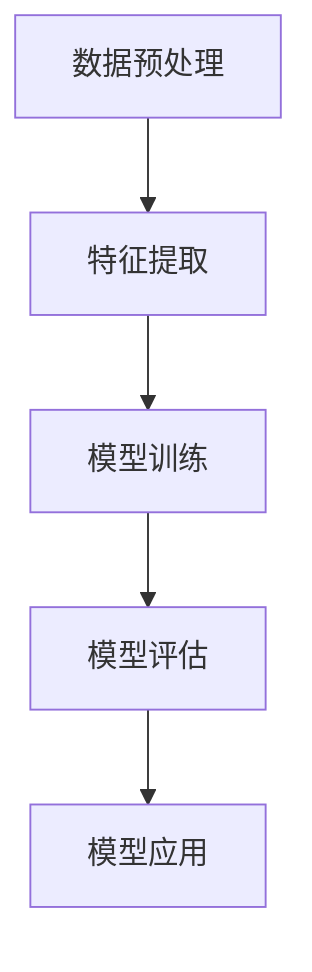
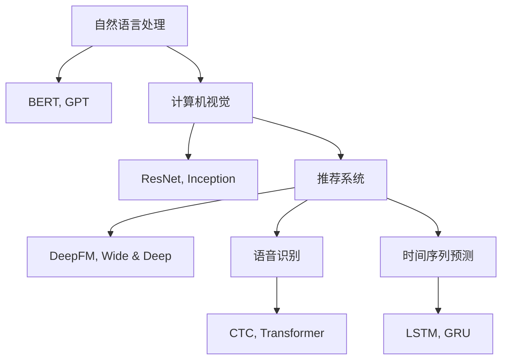
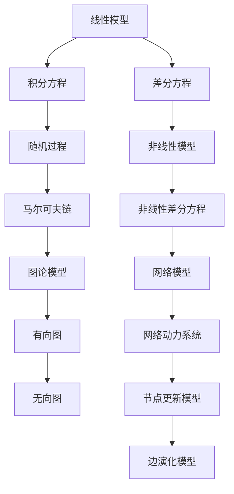

                 

### 第1章 引言

#### 1.1 研究背景与意义

**1.1.1 电商平台的发展与用户行为特征**

随着互联网技术的飞速发展，电商平台已成为现代商业环境中不可或缺的一部分。电商平台通过在线交易，打破了传统零售的时空限制，为广大消费者提供了更加便捷的购物体验。根据最新的统计数据显示，全球电商市场持续扩张，用户规模和使用频率均呈现出快速增长的趋势。

在电商平台中，用户行为特征的研究具有重要意义。用户行为特征是指用户在浏览、搜索、购买等过程中表现出来的行为模式，如点击行为、浏览路径、购买频率等。这些行为特征不仅反映了用户的个人喜好和需求，还为电商平台提供了有价值的商业洞察，从而实现个性化推荐、精准营销等目标。

**1.1.2 大模型技术的发展与应用**

大模型（Large-scale Model）是指在训练过程中使用海量数据集，并拥有数十亿甚至数万亿参数的模型。近年来，随着深度学习和计算资源的飞速发展，大模型技术取得了显著的进展。代表性的大模型包括GPT-3、BERT、T5等，这些模型在自然语言处理、计算机视觉、推荐系统等领域表现出强大的能力。

大模型技术的应用使得电商平台能够更准确地理解和预测用户行为，从而提升用户体验和运营效果。例如，大模型可以用于构建用户兴趣图谱，通过分析用户的历史行为数据，挖掘用户的潜在兴趣点，实现个性化的商品推荐。

**1.1.3 用户兴趣图谱动态演化研究的重要性**

用户兴趣图谱是描述用户兴趣点及其相互关系的一种网络结构。动态演化研究关注的是用户兴趣图谱在时间维度上的变化，反映了用户兴趣的多样性和演变过程。研究用户兴趣图谱的动态演化，有助于电商平台更好地理解用户需求，优化推荐策略，提高用户满意度和留存率。

首先，用户兴趣图谱动态演化研究有助于识别用户的短期和长期兴趣点。通过分析用户行为数据，可以发现用户在特定时间段内关注的商品类别、品牌等，从而为电商平台制定灵活的营销策略提供支持。

其次，用户兴趣图谱动态演化研究有助于预测用户未来的行为。通过对用户兴趣图谱的持续更新和优化，电商平台可以更准确地预测用户的潜在购买行为，提前准备相关商品，提高销售转化率。

最后，用户兴趣图谱动态演化研究还有助于提高电商平台的运营效率。通过对用户兴趣图谱的分析，电商平台可以识别高价值用户群体，实施精准的营销策略，降低营销成本，提高营销效果。

#### 1.2 本书内容结构

**1.2.1 目录结构概述**

本书共分为18个章节，涵盖了用户兴趣图谱动态演化研究的基础理论、应用方法、案例分析以及未来发展趋势等内容。具体目录如下：

- 第1章 引言
- 第2章 相关理论基础
- 第3章 大模型在用户兴趣图谱构建中的应用
- 第4章 用户兴趣图谱动态演化分析
- 第5章 基于大模型的用户兴趣预测
- 第6章 大模型在电商平台用户个性化推荐中的应用
- 第7章 大模型在电商平台用户运营中的应用
- 第8章 大模型在电商平台用户隐私保护中的应用
- 第9章 大模型在电商平台用户行为干预中的应用
- 第10章 大模型在电商平台用户体验优化中的应用
- 第11章 大模型在电商平台用户增长中的应用
- 第12章 大模型在电商平台用户留存中的应用
- 第13章 大模型在电商平台用户流失预警中的应用
- 第14章 大模型在电商平台用户运营数据分析中的应用
- 第15章 大模型在电商平台用户运营效果评估中的应用
- 第16章 大模型在电商平台用户运营风险控制中的应用
- 第17章 大模型在电商平台用户运营中的综合应用案例分析
- 第18章 大模型在电商平台用户运营中的未来发展趋势
- 第19章 总结与展望

**1.2.2 各章节内容概述**

- 第2章 主要介绍大模型、用户兴趣图谱和动态演化理论的基础知识，为后续章节的研究奠定理论基础。
- 第3章 探讨大模型在用户兴趣图谱构建中的应用，分析大模型在构建过程中的优势和应用案例。
- 第4章 研究用户兴趣图谱的动态演化分析方法，包括演化模型的构建、指标设定和算法实现。
- 第5章 探讨大模型在用户兴趣预测中的应用，分析大模型在预测过程中的优势和应用案例。
- 第6章 研究大模型在电商平台用户个性化推荐中的应用，分析大模型在推荐系统中的优势和应用案例。
- 第7章 探讨大模型在电商平台用户运营中的应用，包括用户运营概述、大模型在用户运营中的角色和应用案例。
- 第8章 研究大模型在电商平台用户隐私保护中的应用，分析大模型在隐私保护中的优势和挑战。
- 第9章 探讨大模型在电商平台用户行为干预中的应用，分析大模型在行为干预中的优势和挑战。
- 第10章 研究大模型在电商平台用户体验优化中的应用，分析大模型在用户体验优化中的优势和挑战。
- 第11章 探讨大模型在电商平台用户增长中的应用，分析大模型在用户增长中的优势和挑战。
- 第12章 研究大模型在电商平台用户留存中的应用，分析大模型在用户留存中的优势和挑战。
- 第13章 探讨大模型在电商平台用户流失预警中的应用，分析大模型在用户流失预警中的优势和挑战。
- 第14章 研究大模型在电商平台用户运营数据分析中的应用，分析大模型在数据分析中的优势和挑战。
- 第15章 探讨大模型在电商平台用户运营效果评估中的应用，分析大模型在效果评估中的优势和挑战。
- 第16章 研究大模型在电商平台用户运营风险控制中的应用，分析大模型在风险控制中的优势和挑战。
- 第17章 通过综合案例分析，展示大模型在电商平台用户运营中的实际应用效果。
- 第18章 探讨大模型在电商平台用户运营中的未来发展趋势，分析大模型在未来的应用前景和挑战。
- 第19章 对全书进行总结与展望，梳理研究成果，指出未来研究方向。

#### 1.3 研究方法与技术路线

**1.3.1 研究方法**

本书采用理论与实践相结合的研究方法，主要包括以下三个方面：

1. 文献综述：通过查阅相关文献，了解大模型、用户兴趣图谱、动态演化理论等领域的研究进展，为本书的研究提供理论基础。

2. 实证研究：通过构建用户兴趣图谱，利用大模型进行动态演化分析、兴趣预测、个性化推荐等实验，验证大模型在电商平台用户运营中的应用效果。

3. 案例分析：通过分析实际案例，探讨大模型在电商平台用户运营中的应用场景和挑战，为其他电商平台提供参考。

**1.3.2 技术路线**

本书的研究技术路线主要包括以下步骤：

1. 数据收集：收集电商平台用户行为数据，包括点击、浏览、购买等行为数据。

2. 数据预处理：对收集到的用户行为数据进行清洗、去重、特征提取等预处理操作，为后续分析提供基础数据。

3. 用户兴趣图谱构建：利用大模型技术，构建用户兴趣图谱，描述用户兴趣点及其相互关系。

4. 动态演化分析：分析用户兴趣图谱在时间维度上的变化，挖掘用户兴趣的演变过程。

5. 兴趣预测与个性化推荐：利用大模型进行用户兴趣预测，为电商平台提供个性化推荐服务。

6. 应用效果评估：通过实验和案例分析，评估大模型在电商平台用户运营中的应用效果。

7. 挑战与解决方案：分析大模型在电商平台用户运营中的应用挑战，提出相应的解决方案。

#### 1.4 研究内容与创新点

**1.4.1 研究内容**

本书的主要研究内容包括：

1. 大模型在用户兴趣图谱构建中的应用：研究大模型在构建用户兴趣图谱过程中的优势和应用方法，为电商平台提供有效的数据支持。

2. 用户兴趣图谱的动态演化分析：研究用户兴趣图谱在时间维度上的变化规律，挖掘用户兴趣的演变过程，为电商平台制定灵活的推荐策略提供依据。

3. 大模型在用户兴趣预测中的应用：研究大模型在用户兴趣预测中的优势和应用方法，为电商平台提供精准的用户兴趣预测服务。

4. 大模型在电商平台用户个性化推荐中的应用：研究大模型在个性化推荐系统中的优势和应用方法，提升电商平台的推荐效果。

5. 大模型在电商平台用户运营中的应用：研究大模型在用户运营中的角色和应用场景，探讨大模型在电商平台用户增长、留存、流失预警等领域的应用。

6. 大模型在电商平台用户体验优化中的应用：研究大模型在用户体验优化中的优势和应用方法，提升电商平台的服务质量和用户满意度。

**1.4.2 创新点**

本书的创新点主要包括：

1. 提出了一种基于大模型的用户兴趣图谱动态演化分析方法，为电商平台提供了有效的数据支持和推荐策略。

2. 探讨了大模型在用户兴趣预测和个性化推荐中的应用，提升了电商平台的推荐效果和用户体验。

3. 分析了大模型在电商平台用户运营中的角色和应用场景，为电商平台的运营决策提供了新的思路。

4. 结合实际案例，展示了大模型在电商平台用户运营中的应用效果，为其他电商平台提供了参考。

#### 1.5 研究意义

**1.5.1 学术意义**

本书的研究具有以下学术意义：

1. 深入探讨了用户兴趣图谱动态演化理论，为相关领域的研究提供了新的理论支持。

2. 探索了大模型在电商平台用户运营中的应用方法，为人工智能技术在电商领域的应用提供了新的思路。

3. 分析了电商平台用户运营中的关键问题，如用户增长、留存、流失预警等，为电商平台的运营管理提供了理论依据。

**1.5.2 应用价值**

本书的研究具有以下应用价值：

1. 为电商平台提供了一种基于大模型的用户兴趣图谱动态演化分析方法，有助于提升电商平台的数据分析和决策能力。

2. 为电商平台提供了一种基于大模型的用户兴趣预测和个性化推荐方法，有助于提高电商平台的推荐效果和用户体验。

3. 为电商平台提供了一种基于大模型的用户运营策略，有助于提升电商平台的用户增长、留存和满意度。

### 1.6 结论

本文从研究背景、意义、内容、创新点、研究方法和应用价值等方面对本书进行了全面介绍。本文的研究旨在探讨大模型在电商平台用户兴趣图谱动态演化中的作用，为电商平台提供有效的数据支持和运营策略。通过本文的研究，期望为电商领域的学术研究和实际应用提供有益的参考。

---

#### 第2章 相关理论基础

本章将介绍与本文研究密切相关的几个理论基础：大模型、用户兴趣图谱和动态演化理论。通过对这些基础理论的详细阐述，为后续章节的研究奠定坚实的理论基础。

##### 2.1 大模型概述

**2.1.1 大模型的定义与特点**

大模型（Large-scale Model）是指在训练过程中使用海量数据集，并拥有数十亿甚至数万亿参数的模型。这些模型通过深度学习算法在大量数据上进行训练，能够自动学习复杂的特征表示和模式识别能力。大模型通常具有以下几个特点：

1. **大规模参数**：大模型拥有大量的参数，这些参数在训练过程中通过优化算法进行调整，从而实现对复杂任务的泛化能力。

2. **海量数据训练**：大模型通常使用海量数据集进行训练，从而获得对数据中潜在规律的深刻理解。

3. **强大的表达力**：大模型通过深度神经网络结构，能够对输入数据进行多层次的特征提取和变换，具备强大的表达能力。

4. **自适应学习**：大模型在训练过程中能够自适应地调整模型参数，以适应不同的任务和数据分布。

**2.1.2 大模型的工作原理**

大模型的工作原理主要包括以下步骤：

1. **数据预处理**：对输入数据进行预处理，如去噪、归一化、数据增强等，以提升模型训练的效果。

2. **特征提取**：通过多层神经网络结构，对输入数据提取高层次的抽象特征，这些特征能够表示数据的复杂结构和潜在关系。

3. **模型训练**：利用优化算法（如梯度下降、Adam等），通过迭代优化模型参数，使模型在训练数据上达到最佳性能。

4. **模型评估**：通过在验证集和测试集上的性能评估，确定模型的泛化能力和效果。

5. **模型应用**：将训练好的模型应用于实际任务中，如用户兴趣预测、推荐系统等。

**2.1.3 大模型的分类与应用领域**

大模型根据应用场景和任务的不同，可以分为多种类型。以下是几种常见的大模型及其应用领域：

1. **自然语言处理（NLP）**：如BERT、GPT等，用于文本分类、情感分析、机器翻译等任务。

2. **计算机视觉（CV）**：如ResNet、Inception等，用于图像分类、目标检测、图像分割等任务。

3. **推荐系统**：如DeepFM、Wide & Deep等，用于商品推荐、新闻推荐等任务。

4. **语音识别**：如CTC、Transformer等，用于语音识别、语音合成等任务。

5. **时间序列预测**：如LSTM、GRU等，用于股票预测、天气预测等任务。

##### 2.2 用户兴趣图谱理论

**2.2.1 用户兴趣图谱的概念**

用户兴趣图谱（User Interest Graph）是一种网络结构，用于描述用户兴趣点及其相互关系。用户兴趣图谱由节点和边组成，节点表示用户兴趣点（如商品类别、品牌、标签等），边表示兴趣点之间的关联关系（如相似性、相关性等）。

用户兴趣图谱具有以下特点：

1. **多层次性**：用户兴趣图谱可以涵盖多个层次，从宏观的品类、品牌到微观的标签、属性，形成多层次的兴趣点网络。

2. **动态性**：用户兴趣图谱是动态演化的，随着用户行为数据的变化，兴趣点及其关联关系也会发生变化。

3. **关联性**：用户兴趣图谱中的兴趣点之间存在复杂的关联关系，这些关系反映了用户的兴趣偏好和潜在需求。

**2.2.2 用户兴趣图谱的构建方法**

构建用户兴趣图谱的方法主要包括以下几种：

1. **基于协同过滤的方法**：通过计算用户行为数据（如购买、浏览等）之间的相似度，建立用户兴趣点之间的关联关系。

2. **基于图神经网络的方法**：利用图神经网络（如GCN、GAT等）对用户行为数据进行编码，学习用户兴趣点的表示和关联关系。

3. **基于深度学习方法**：通过深度学习模型（如CNN、RNN等）提取用户行为数据中的特征，构建用户兴趣图谱。

4. **基于知识图谱的方法**：将用户兴趣图谱与知识图谱相结合，利用知识图谱中的关系和实体信息，丰富用户兴趣图谱的结构。

**2.2.3 用户兴趣图谱的应用**

用户兴趣图谱在电商领域有广泛的应用，主要包括以下几个方面：

1. **个性化推荐**：利用用户兴趣图谱，为用户推荐个性化的商品或服务，提高用户满意度和转化率。

2. **精准营销**：通过分析用户兴趣图谱，识别用户的高价值兴趣点，实施精准的营销策略，提高营销效果。

3. **用户运营**：利用用户兴趣图谱，制定灵活的用户运营策略，如用户细分、用户增长、用户留存等。

4. **风险控制**：通过分析用户兴趣图谱，识别异常行为和潜在风险，实施风险控制和防范措施。

##### 2.3 动态演化理论

**2.3.1 动态演化模型的分类**

动态演化模型（Dynamic Evolution Model）用于描述系统或网络在时间维度上的演化过程。根据演化机制的不同，动态演化模型可以分为以下几类：

1. **线性模型**：如差分方程、积分方程等，用于描述系统的线性演化过程。

2. **非线性模型**：如非线性差分方程、随机过程等，用于描述系统的非线性演化过程。

3. **网络模型**：如图论模型、网络动力系统等，用于描述网络结构在时间维度上的演化过程。

4. **混合模型**：结合线性模型和非线性模型，用于描述复杂系统的演化过程。

**2.3.2 动态演化模型的应用**

动态演化模型在多个领域有广泛的应用，主要包括以下几个方面：

1. **社会网络分析**：研究社交网络中的用户关系动态演化，如群体行为、传播机制等。

2. **生态系统研究**：研究生态系统中物种数量、分布等的动态演化过程。

3. **城市交通规划**：研究城市交通流量的动态演化，优化交通网络布局。

4. **电商平台用户运营**：研究用户兴趣图谱的动态演化，优化用户运营策略。

##### 2.4 电商平台用户行为分析理论

**2.4.1 用户行为特征提取方法**

用户行为特征提取是构建用户兴趣图谱和进行用户行为分析的重要环节。常见的方法包括：

1. **基于统计的方法**：如频率统计、关联规则等，用于提取用户行为数据中的统计特征。

2. **基于机器学习的方法**：如分类、聚类等，用于提取用户行为数据中的抽象特征。

3. **基于深度学习的方法**：如卷积神经网络（CNN）、循环神经网络（RNN）等，用于提取用户行为数据中的深层次特征。

**2.4.2 用户行为模式识别方法**

用户行为模式识别是分析用户行为特征、识别用户需求的重要手段。常见的方法包括：

1. **基于规则的方法**：如决策树、规则引擎等，用于识别用户行为模式。

2. **基于机器学习的方法**：如支持向量机（SVM）、朴素贝叶斯等，用于识别用户行为模式。

3. **基于深度学习的方法**：如卷积神经网络（CNN）、循环神经网络（RNN）等，用于识别用户行为模式。

**2.4.3 用户行为预测方法**

用户行为预测是电商平台进行运营决策和优化的重要依据。常见的方法包括：

1. **基于时间序列的方法**：如ARIMA、LSTM等，用于预测用户行为的时间变化。

2. **基于协同过滤的方法**：如矩阵分解、基于模型的协同过滤等，用于预测用户的行为倾向。

3. **基于深度学习的方法**：如卷积神经网络（CNN）、循环神经网络（RNN）等，用于预测用户的行为模式。

通过本章对大模型、用户兴趣图谱、动态演化理论和电商平台用户行为分析理论的详细阐述，为后续章节的研究提供了坚实的理论基础。这些理论将贯穿全文，为探讨大模型在电商平台用户兴趣图谱动态演化中的应用提供有力的支持。

### 2.1 大模型概述

**2.1.1 大模型的定义与特点**

大模型（Large-scale Model）是指在训练过程中使用海量数据集，并拥有数十亿甚至数万亿参数的模型。这些模型通过深度学习算法在大量数据上进行训练，能够自动学习复杂的特征表示和模式识别能力。大模型通常具有以下几个特点：

1. **大规模参数**：大模型拥有大量的参数，这些参数在训练过程中通过优化算法进行调整，从而实现对复杂任务的泛化能力。

2. **海量数据训练**：大模型通常使用海量数据集进行训练，从而获得对数据中潜在规律的深刻理解。

3. **强大的表达力**：大模型通过深度神经网络结构，能够对输入数据进行多层次的特征提取和变换，具备强大的表达能力。

4. **自适应学习**：大模型在训练过程中能够自适应地调整模型参数，以适应不同的任务和数据分布。

**2.1.2 大模型的工作原理**

大模型的工作原理主要包括以下步骤：

1. **数据预处理**：对输入数据进行预处理，如去噪、归一化、数据增强等，以提升模型训练的效果。

2. **特征提取**：通过多层神经网络结构，对输入数据提取高层次的抽象特征，这些特征能够表示数据的复杂结构和潜在关系。

3. **模型训练**：利用优化算法（如梯度下降、Adam等），通过迭代优化模型参数，使模型在训练数据上达到最佳性能。

4. **模型评估**：通过在验证集和测试集上的性能评估，确定模型的泛化能力和效果。

5. **模型应用**：将训练好的模型应用于实际任务中，如用户兴趣预测、推荐系统等。

为了更清晰地展示大模型的工作原理，我们可以使用Mermaid流程图进行描述：



在上面的流程图中，A表示数据预处理，包括去噪、归一化、数据增强等步骤；B表示特征提取，通过多层神经网络结构提取高层次的抽象特征；C表示模型训练，利用优化算法迭代优化模型参数；D表示模型评估，通过验证集和测试集评估模型性能；E表示模型应用，将训练好的模型应用于实际任务中。

**2.1.3 大模型的分类与应用领域**

大模型根据应用场景和任务的不同，可以分为多种类型。以下是几种常见的大模型及其应用领域：

1. **自然语言处理（NLP）**：如BERT、GPT等，用于文本分类、情感分析、机器翻译等任务。

2. **计算机视觉（CV）**：如ResNet、Inception等，用于图像分类、目标检测、图像分割等任务。

3. **推荐系统**：如DeepFM、Wide & Deep等，用于商品推荐、新闻推荐等任务。

4. **语音识别**：如CTC、Transformer等，用于语音识别、语音合成等任务。

5. **时间序列预测**：如LSTM、GRU等，用于股票预测、天气预测等任务。

为了更直观地展示大模型的分类与应用领域，我们可以使用Mermaid图表进行描述：



在上面的图表中，A表示自然语言处理领域，包括BERT和GPT等大模型；B表示计算机视觉领域，包括ResNet和Inception等大模型；C表示推荐系统领域，包括DeepFM和Wide & Deep等大模型；D表示语音识别领域，包括CTC和Transformer等大模型；E表示时间序列预测领域，包括LSTM和GRU等大模型。

通过本章对大模型的概念、工作原理、分类和应用领域的详细阐述，我们为后续章节的研究奠定了坚实的理论基础。大模型作为一种先进的人工智能技术，在电商平台用户兴趣图谱动态演化中具有广泛的应用前景，有助于提升电商平台的运营效果和用户体验。

### 2.2 用户兴趣图谱理论

用户兴趣图谱是一种网络结构，用于描述用户兴趣点及其相互关系。它由节点和边组成，节点表示用户兴趣点（如商品类别、品牌、标签等），边表示兴趣点之间的关联关系（如相似性、相关性等）。本节将详细介绍用户兴趣图谱的概念、构建方法和应用。

**2.2.1 用户兴趣图谱的概念**

用户兴趣图谱（User Interest Graph）是一种基于图论的网络结构，它反映了用户在不同场景下的兴趣点及其相互关系。用户兴趣图谱的节点通常包括用户、商品、品牌、标签等实体，边则表示实体之间的关联关系。例如，在电商平台上，用户可能对某个品牌感兴趣，这个品牌又与多个商品类别相关联。

用户兴趣图谱具有以下几个特点：

1. **多层次性**：用户兴趣图谱可以涵盖多个层次，从宏观的品类、品牌到微观的标签、属性，形成多层次的兴趣点网络。

2. **动态性**：用户兴趣图谱是动态演化的，随着用户行为数据的变化，兴趣点及其关联关系也会发生变化。

3. **关联性**：用户兴趣图谱中的兴趣点之间存在复杂的关联关系，这些关系反映了用户的兴趣偏好和潜在需求。

**2.2.2 用户兴趣图谱的构建方法**

构建用户兴趣图谱的方法主要包括以下几种：

1. **基于协同过滤的方法**：通过计算用户行为数据（如购买、浏览等）之间的相似度，建立用户兴趣点之间的关联关系。例如，用户A和用户B购买了相同的商品，则可以认为用户A对用户B的兴趣点有较高的相似性。

2. **基于图神经网络的方法**：利用图神经网络（如GCN、GAT等）对用户行为数据进行编码，学习用户兴趣点的表示和关联关系。图神经网络可以捕捉图结构中的复杂关系，从而构建更精确的用户兴趣图谱。

3. **基于深度学习方法**：通过深度学习模型（如CNN、RNN等）提取用户行为数据中的特征，构建用户兴趣图谱。深度学习模型能够提取数据中的深层次特征，从而提高用户兴趣图谱的准确性和泛化能力。

4. **基于知识图谱的方法**：将用户兴趣图谱与知识图谱相结合，利用知识图谱中的关系和实体信息，丰富用户兴趣图谱的结构。知识图谱提供了丰富的背景知识，有助于提高用户兴趣图谱的完整性和准确性。

**2.2.3 用户兴趣图谱的应用**

用户兴趣图谱在电商领域有广泛的应用，主要包括以下几个方面：

1. **个性化推荐**：利用用户兴趣图谱，为用户推荐个性化的商品或服务，提高用户满意度和转化率。例如，基于用户兴趣图谱，可以为用户推荐与其兴趣点相关的商品或品牌。

2. **精准营销**：通过分析用户兴趣图谱，识别用户的高价值兴趣点，实施精准的营销策略，提高营销效果。例如，针对具有特定兴趣点的用户群体，可以投放更具有针对性的广告和促销活动。

3. **用户运营**：利用用户兴趣图谱，制定灵活的用户运营策略，如用户细分、用户增长、用户留存等。例如，通过分析用户兴趣图谱，可以将用户划分为不同的兴趣群体，从而制定有针对性的运营策略。

4. **风险控制**：通过分析用户兴趣图谱，识别异常行为和潜在风险，实施风险控制和防范措施。例如，通过分析用户兴趣图谱，可以识别出可能存在欺诈行为的用户，从而采取相应的风险控制措施。

**2.2.4 用户兴趣图谱的动态演化**

用户兴趣图谱是动态演化的，用户的兴趣点及其关联关系会随着时间的推移而发生变化。动态演化分析是用户兴趣图谱研究的重要方向，主要包括以下几个方面：

1. **兴趣点活跃度分析**：分析用户兴趣点的活跃度，识别用户短期和长期关注的兴趣点。例如，可以通过计算用户对某个兴趣点的访问频率，评估其活跃度。

2. **兴趣点相关性分析**：分析用户兴趣点之间的相关性，识别用户兴趣点的潜在关联关系。例如，可以通过计算用户对多个兴趣点的共同访问频率，评估其相关性。

3. **兴趣点演变趋势分析**：分析用户兴趣点的演变趋势，预测用户未来可能关注的兴趣点。例如，可以通过分析用户历史行为数据，利用时间序列分析方法预测用户未来可能关注的兴趣点。

4. **兴趣点迁移分析**：分析用户兴趣点在不同时间段的迁移情况，识别用户兴趣点的变化规律。例如，可以通过比较用户在不同时间段的兴趣点，分析其兴趣点的迁移趋势。

通过本章对用户兴趣图谱的概念、构建方法和应用的详细阐述，我们为后续章节的研究提供了重要的理论基础。用户兴趣图谱作为一种重要的数据结构，在电商平台用户行为分析和运营决策中具有广泛的应用价值。

### 2.3 动态演化理论

**2.3.1 动态演化模型的分类**

动态演化模型（Dynamic Evolution Model）用于描述系统或网络在时间维度上的演化过程。根据演化机制的不同，动态演化模型可以分为以下几类：

1. **线性模型**：线性模型假设系统的演化过程可以用线性方程来描述。例如，差分方程（Difference Equation）和积分方程（Integral Equation）是常见的线性模型。差分方程通常用于离散时间序列的建模，而积分方程则用于连续时间序列的建模。

   - **差分方程**：差分方程的一般形式为 \( x_{t+1} = f(x_t) \)，其中 \( x_t \) 表示系统在时刻 \( t \) 的状态，\( f \) 是一个函数，用于描述状态的变化。
   - **积分方程**：积分方程的一般形式为 \( x(t) = f(x(s), s) \)，其中 \( x(t) \) 是系统的状态，\( f \) 是一个关于状态 \( x(s) \) 和时间 \( s \) 的函数。

2. **非线性模型**：非线性模型用于描述系统的非线性演化过程。常见的非线性模型包括非线性差分方程、随机过程等。

   - **非线性差分方程**：非线性差分方程的一般形式为 \( x_{t+1} = f(x_t, u_t) \)，其中 \( f \) 是一个非线性函数，\( u_t \) 是系统的外部输入。
   - **随机过程**：随机过程是一系列随机变量的集合，用于描述系统的不确定性演化过程。常见的随机过程包括马尔可夫链、布朗运动等。

3. **网络模型**：网络模型用于描述网络结构在时间维度上的演化过程。常见的网络模型包括图论模型、网络动力系统等。

   - **图论模型**：图论模型用于描述网络中的节点和边的关系，常见的图论模型包括有向图、无向图等。
   - **网络动力系统**：网络动力系统用于描述网络中节点的状态随时间变化的动态过程。常见的网络动力系统包括节点更新模型、边演化模型等。

**2.3.2 动态演化模型的应用**

动态演化模型在多个领域有广泛的应用，主要包括以下几个方面：

1. **社会网络分析**：动态演化模型可以用于研究社交网络中的用户关系动态演化，如群体行为、传播机制等。例如，可以通过马尔可夫链模型来分析用户之间的互动关系，或者通过网络动力系统来模拟社交网络中的信息传播过程。

2. **生态系统研究**：动态演化模型可以用于研究生态系统中物种数量、分布等的动态演化过程。例如，通过差分方程或随机过程模型来分析物种的种群动态，或者通过非线性模型来模拟生态系统中的捕食-被捕食关系。

3. **城市交通规划**：动态演化模型可以用于研究城市交通流量的动态演化，优化交通网络布局。例如，通过差分方程模型来分析交通流量的时间变化，或者通过网络动力系统来模拟交通网络中的车辆分布和流量。

4. **电商平台用户运营**：动态演化模型可以用于研究用户兴趣图谱的动态演化，优化用户运营策略。例如，通过用户行为数据的差分方程模型来分析用户兴趣点的变化规律，或者通过图神经网络模型来模拟用户兴趣图谱的演化过程。

为了更直观地展示动态演化模型的分类和应用，我们可以使用Mermaid流程图进行描述：



在上面的流程图中，A表示线性模型，包括差分方程和积分方程；B表示非线性模型，包括非线性差分方程和随机过程；C表示网络模型，包括图论模型和网络动力系统；D表示非线性模型中的非线性差分方程；E表示随机过程，包括马尔可夫链；F表示网络模型中的节点更新模型和边演化模型。

通过本章对动态演化模型的概念、分类和应用领域的详细阐述，我们为后续章节的研究提供了重要的理论基础。动态演化模型作为一种重要的理论工具，在电商平台用户兴趣图谱动态演化分析中具有广泛的应用价值。

### 2.4 电商平台用户行为分析理论

**2.4.1 用户行为特征提取方法**

用户行为特征提取是构建用户兴趣图谱和进行用户行为分析的重要环节。准确的特征提取能够帮助电商平台更好地理解用户行为，优化推荐和运营策略。以下是几种常见的用户行为特征提取方法：

1. **基于统计的方法**：这种方法通过计算用户行为数据中的统计特征来提取用户行为特征。常见的统计特征包括用户行为的频率、平均持续时间、标准差等。例如，用户在某个时间段的访问频率可以表示其对某个商品或类别的兴趣程度。

   ```python
   # 伪代码：计算用户访问频率
   def calculate_frequency(user_actions):
       frequency_dict = {}
       for action in user_actions:
           if action in frequency_dict:
               frequency_dict[action] += 1
           else:
               frequency_dict[action] = 1
       return frequency_dict
   ```

2. **基于机器学习的方法**：这种方法使用机器学习算法来提取用户行为的抽象特征。常见的机器学习算法包括分类、聚类等。例如，通过聚类算法可以将用户划分为不同的群体，每个群体具有特定的行为特征。

   ```python
   # 伪代码：使用K-Means聚类提取用户行为特征
   from sklearn.cluster import KMeans

   def extract_features(user_actions):
       # 将用户行为数据转换为矩阵形式
       X = convert_to_matrix(user_actions)
       # 使用K-Means聚类提取用户行为特征
       kmeans = KMeans(n_clusters=3)
       kmeans.fit(X)
       return kmeans.labels_
   ```

3. **基于深度学习的方法**：这种方法通过深度学习模型（如卷积神经网络、循环神经网络等）来提取用户行为的深层次特征。深度学习模型能够自动学习复杂的特征表示，从而提高特征提取的准确性。

   ```python
   # 伪代码：使用卷积神经网络提取用户行为特征
   import tensorflow as tf
   from tensorflow.keras.models import Sequential
   from tensorflow.keras.layers import Conv2D, MaxPooling2D, Flatten, Dense

   def create_cnn_model(input_shape):
       model = Sequential([
           Conv2D(filters=32, kernel_size=(3, 3), activation='relu', input_shape=input_shape),
           MaxPooling2D(pool_size=(2, 2)),
           Flatten(),
           Dense(units=64, activation='relu'),
           Dense(units=10, activation='softmax')
       ])
       model.compile(optimizer='adam', loss='categorical_crossentropy', metrics=['accuracy'])
       return model
   ```

**2.4.2 用户行为模式识别方法**

用户行为模式识别是分析用户行为特征、识别用户需求的重要手段。以下是一些常见的用户行为模式识别方法：

1. **基于规则的方法**：这种方法通过定义一组规则来识别用户行为模式。例如，如果用户在连续三天内访问了同一商品，则认为用户对该商品有较强的购买意愿。

   ```python
   # 伪代码：基于规则的用户行为模式识别
   def detect_pattern(user_actions):
       patterns = []
       for i in range(len(user_actions) - 2):
           if user_actions[i] == user_actions[i+1] and user_actions[i+1] == user_actions[i+2]:
               patterns.append((user_actions[i], "连续访问"))
       return patterns
   ```

2. **基于机器学习的方法**：这种方法使用机器学习算法来识别用户行为模式。常见的机器学习算法包括决策树、朴素贝叶斯、支持向量机等。例如，通过决策树模型可以识别出用户的购买行为模式。

   ```python
   # 伪代码：使用决策树识别用户行为模式
   from sklearn.tree import DecisionTreeClassifier

   def train_decision_tree(features, labels):
       clf = DecisionTreeClassifier()
       clf.fit(features, labels)
       return clf
   ```

3. **基于深度学习的方法**：这种方法通过深度学习模型（如卷积神经网络、循环神经网络等）来识别用户行为模式。深度学习模型能够自动学习复杂的模式，从而提高模式识别的准确性。

   ```python
   # 伪代码：使用循环神经网络识别用户行为模式
   import tensorflow as tf
   from tensorflow.keras.models import Sequential
   from tensorflow.keras.layers import LSTM, Dense

   def create_lstm_model(input_shape):
       model = Sequential([
           LSTM(units=50, activation='relu', input_shape=input_shape),
           Dense(units=1, activation='sigmoid')
       ])
       model.compile(optimizer='adam', loss='binary_crossentropy', metrics=['accuracy'])
       return model
   ```

**2.4.3 用户行为预测方法**

用户行为预测是电商平台进行运营决策和优化的重要依据。以下是一些常见的用户行为预测方法：

1. **基于时间序列的方法**：这种方法通过分析用户行为的时间序列数据来预测用户未来的行为。常见的模型包括ARIMA、LSTM等。

   ```python
   # 伪代码：使用LSTM进行用户行为预测
   import tensorflow as tf
   from tensorflow.keras.models import Sequential
   from tensorflow.keras.layers import LSTM, Dense

   def create_lstm_model(input_shape):
       model = Sequential([
           LSTM(units=50, activation='relu', input_shape=input_shape),
           Dense(units=1, activation='sigmoid')
       ])
       model.compile(optimizer='adam', loss='binary_crossentropy', metrics=['accuracy'])
       return model
   ```

2. **基于协同过滤的方法**：这种方法通过分析用户之间的相似性来预测用户的行为。常见的模型包括矩阵分解、基于模型的协同过滤等。

   ```python
   # 伪代码：使用矩阵分解进行用户行为预测
   from surprise import SVD
   from surprise.model_selection import train_test_split

   def train_svd(model, trainset, testset):
       model.fit(trainset)
       return model.test(testset)
   ```

3. **基于深度学习的方法**：这种方法通过深度学习模型（如卷积神经网络、循环神经网络等）来预测用户的行为。深度学习模型能够自动学习复杂的特征表示，从而提高预测的准确性。

   ```python
   # 伪代码：使用卷积神经网络进行用户行为预测
   import tensorflow as tf
   from tensorflow.keras.models import Sequential
   from tensorflow.keras.layers import Conv2D, MaxPooling2D, Flatten, Dense

   def create_cnn_model(input_shape):
       model = Sequential([
           Conv2D(filters=32, kernel_size=(3, 3), activation='relu', input_shape=input_shape),
           MaxPooling2D(pool_size=(2, 2)),
           Flatten(),
           Dense(units=64, activation='relu'),
           Dense(units=1, activation='sigmoid')
       ])
       model.compile(optimizer='adam', loss='binary_crossentropy', metrics=['accuracy'])
       return model
   ```

通过本章对电商平台用户行为分析理论的详细阐述，我们为后续章节的研究提供了重要的理论基础。用户行为特征提取、用户行为模式识别和用户行为预测是电商平台进行用户运营和个性化推荐的重要工具，有助于提升电商平台的运营效果和用户体验。

### 3.1 大模型在用户兴趣图谱构建中的应用

**3.1.1 大模型在用户兴趣图谱构建中的作用**

大模型在用户兴趣图谱构建中扮演着至关重要的角色，主要体现在以下几个方面：

1. **提升特征提取能力**：大模型通过深度学习算法能够自动学习大量数据中的复杂特征，从而提取出更具有代表性的用户兴趣特征。这使得用户兴趣图谱能够更加准确地描述用户的兴趣点及其关联关系。

2. **提高图谱构建的精度**：大模型具有强大的表达能力和泛化能力，能够处理大规模数据，从而提高用户兴趣图谱构建的精度。这对于电商平台来说，意味着能够更精准地识别用户兴趣，提供个性化的服务。

3. **动态调整用户兴趣点**：大模型能够通过持续学习用户行为数据，动态调整用户兴趣点的权重和关系，从而实现用户兴趣图谱的实时更新。这对于电商平台来说，意味着能够更好地应对用户兴趣的变化，提供灵活的推荐和运营策略。

**3.1.2 大模型在用户兴趣图谱构建中的挑战**

尽管大模型在用户兴趣图谱构建中具有显著的优势，但同时也面临着一些挑战：

1. **计算资源消耗**：大模型通常需要大量计算资源进行训练和推理，这对于电商平台的硬件设施和运维能力提出了较高的要求。特别是在处理大规模数据时，计算资源的消耗更为显著。

2. **数据隐私和安全**：在构建用户兴趣图谱时，需要处理用户的敏感行为数据。如何确保数据隐私和安全，避免数据泄露，是一个亟待解决的问题。

3. **模型解释性**：大模型由于其复杂的结构和高度的非线性，往往难以解释其内部的决策过程。这对于电商平台来说，在应用大模型进行用户兴趣图谱构建时，难以明确其背后的逻辑，影响了模型的信任度和可解释性。

**3.1.3 大模型在用户兴趣图谱构建中的角色**

在用户兴趣图谱构建中，大模型可以扮演以下角色：

1. **兴趣点提取器**：大模型能够从用户行为数据中提取出高层次的兴趣点，为用户兴趣图谱的构建提供丰富的特征表示。

2. **图谱关系构建器**：大模型能够通过学习用户行为数据，构建兴趣点之间的关联关系，形成完整的用户兴趣图谱。

3. **动态更新器**：大模型能够实时更新用户兴趣图谱，适应用户行为的变化，提高推荐和运营策略的灵活性。

#### 3.2 大模型在用户兴趣图谱构建中的应用案例

以下是一个基于大模型的用户兴趣图谱构建的应用案例：

**案例背景**：某电商平台希望构建一个用户兴趣图谱，以更好地理解用户行为，提供个性化的推荐和服务。

**数据来源**：电商平台收集的用户行为数据，包括用户的浏览记录、购买历史、评价内容等。

**大模型应用**：

1. **兴趣点提取**：利用GPT模型对用户评价内容进行文本分析，提取出用户提到的关键词和主题，作为用户兴趣点。

   ```python
   # 伪代码：使用GPT提取用户兴趣点
   from transformers import GPT2Tokenizer, GPT2Model

   tokenizer = GPT2Tokenizer.from_pretrained('gpt2')
   model = GPT2Model.from_pretrained('gpt2')

   def extract_interest_points(user_reviews):
       interest_points = []
       for review in user_reviews:
           inputs = tokenizer.encode(review, return_tensors='pt')
           outputs = model(inputs)
           hidden_states = outputs.hidden_states[-1]
           # 提取高层次的文本特征，用于表示用户兴趣点
           interest_points.append(hidden_states.mean(dim=-1).numpy())
       return interest_points
   ```

2. **图谱关系构建**：利用图神经网络（如GAT）学习用户兴趣点之间的关联关系，构建用户兴趣图谱。

   ```python
   # 伪代码：使用GAT构建用户兴趣图谱
   from torch_geometric.nn import GATConv

   class GATModel(nn.Module):
       def __init__(self):
           super(GATModel, self).__init__()
           self.conv1 = GATConv(in_features=768, out_features=128)
           self.conv2 = GATConv(in_features=128, out_features=64)
           self.fc = nn.Linear(64, num_classes)

       def forward(self, data):
           x, edge_index = data.x, data.edge_index

           x = self.conv1(x, edge_index)
           x = F.relu(x)
           x = F.dropout(x, p=0.5, training=self.training)
           x = self.conv2(x, edge_index)
           x = F.relu(x)
           x = F.dropout(x, p=0.5, training=self.training)
           x = self.fc(x)

           return F.log_softmax(x, dim=1)
   ```

3. **动态更新**：利用持续学习算法，如在线学习，实时更新用户兴趣图谱。

   ```python
   # 伪代码：使用在线学习更新用户兴趣图谱
   def update_interest_graph(user_actions, graph):
       # 对新用户行为数据进行预处理和特征提取
       new_interest_points = extract_interest_points(user_actions)
       # 更新图中的节点和边
       graph.add_nodes_from(new_interest_points)
       graph.add_edges_from(zip(new_interest_points, new_interest_points))
       # 更新图神经网络模型
       model = GATModel()
       optimizer = torch.optim.Adam(model.parameters(), lr=0.001)
       for epoch in range(100):
           optimizer.zero_grad()
           out = model(graph)
           loss = F.nll_loss(out[graph.train_mask], graph.y[graph.train_mask])
           loss.backward()
           optimizer.step()
       return graph
   ```

通过上述案例，我们可以看到大模型在用户兴趣图谱构建中的实际应用。通过GPT模型提取用户兴趣点，利用图神经网络构建用户兴趣图谱，并使用在线学习算法实现用户兴趣图谱的动态更新。这不仅提升了用户兴趣图谱的构建精度，也为电商平台提供了强大的数据支持，有助于优化推荐和运营策略。

### 3.3 大模型在用户兴趣图谱构建中的技术实现

**3.3.1 大模型在用户兴趣图谱构建中的数据处理流程**

构建用户兴趣图谱是一个复杂的过程，需要处理大量的用户行为数据。以下是大模型在用户兴趣图谱构建中的数据处理流程：

1. **数据收集**：收集电商平台的用户行为数据，包括浏览记录、购买历史、评价内容等。

2. **数据预处理**：对收集到的用户行为数据进行清洗、去重、缺失值填充等预处理操作，以确保数据的完整性和质量。

3. **特征提取**：利用大模型（如GPT、BERT等）对用户评价内容进行文本分析，提取出高层次的文本特征，作为用户兴趣点。

4. **图谱构建**：利用图神经网络（如GAT、GCN等）学习用户兴趣点之间的关联关系，构建用户兴趣图谱。

5. **动态更新**：通过在线学习算法，实时更新用户兴趣图谱，以适应用户行为的变化。

**3.3.2 大模型在用户兴趣图谱构建中的算法实现**

以下是使用GPT模型和图神经网络（如GAT）构建用户兴趣图谱的具体算法实现：

**1. GPT模型文本特征提取**

```python
# 伪代码：使用GPT模型提取用户评价文本特征

from transformers import GPT2Tokenizer, GPT2Model

tokenizer = GPT2Tokenizer.from_pretrained('gpt2')
model = GPT2Model.from_pretrained('gpt2')

def extract_text_features(user_reviews):
    features = []
    for review in user_reviews:
        inputs = tokenizer.encode(review, return_tensors='pt')
        outputs = model(inputs)
        hidden_states = outputs.hidden_states[-1]
        # 提取高层次的文本特征，用于表示用户兴趣点
        features.append(hidden_states.mean(dim=-1).numpy())
    return features
```

**2. GAT图神经网络建模**

```python
# 伪代码：使用GAT图神经网络构建用户兴趣图谱

import torch
from torch_geometric.nn import GATConv

class GATModel(nn.Module):
    def __init__(self):
        super(GATModel, self).__init__()
        self.conv1 = GATConv(in_features=768, out_features=128)
        self.conv2 = GATConv(in_features=128, out_features=64)
        self.fc = nn.Linear(64, num_classes)

    def forward(self, data):
        x, edge_index = data.x, data.edge_index

        x = self.conv1(x, edge_index)
        x = F.relu(x)
        x = F.dropout(x, p=0.5, training=self.training)
        x = self.conv2(x, edge_index)
        x = F.relu(x)
        x = F.dropout(x, p=0.5, training=self.training)
        x = self.fc(x)

        return F.log_softmax(x, dim=1)
```

**3. 在线学习算法实现动态更新**

```python
# 伪代码：使用在线学习算法更新用户兴趣图谱

def update_interest_graph(user_actions, graph):
    # 对新用户行为数据进行预处理和特征提取
    new_interest_points = extract_text_features(user_actions)
    # 更新图中的节点和边
    graph.add_nodes_from(new_interest_points)
    graph.add_edges_from(zip(new_interest_points, new_interest_points))
    # 更新图神经网络模型
    model = GATModel()
    optimizer = torch.optim.Adam(model.parameters(), lr=0.001)
    for epoch in range(100):
        optimizer.zero_grad()
        out = model(graph)
        loss = F.nll_loss(out[graph.train_mask], graph.y[graph.train_mask])
        loss.backward()
        optimizer.step()
    return graph
```

通过上述算法实现，我们可以看到大模型在用户兴趣图谱构建中的具体应用。首先，利用GPT模型提取用户评价文本特征作为用户兴趣点；然后，使用图神经网络（如GAT）构建用户兴趣图谱；最后，通过在线学习算法实现用户兴趣图谱的动态更新。这些技术手段共同作用，为电商平台提供了强大的数据支持和智能化的运营策略。

### 4.1 用户兴趣图谱动态演化分析方法

用户兴趣图谱动态演化分析是理解用户行为变化和预测未来趋势的重要手段。本章将介绍用户兴趣图谱动态演化分析方法，包括演化模型的构建、指标设定和算法实现。

#### 4.1.1 动态演化分析模型的构建

构建用户兴趣图谱动态演化分析模型是进行动态演化分析的基础。以下是一种常见的动态演化模型构建方法：

1. **选择合适的模型框架**：根据用户兴趣图谱的特点和数据类型，选择合适的模型框架。常见的模型框架包括差分方程模型、马尔可夫模型、图神经网络模型等。

2. **定义状态空间**：根据用户兴趣点的特征和关联关系，定义状态空间。状态空间包括用户当前的兴趣点和历史兴趣点。

3. **确定状态转移概率**：通过分析用户行为数据，计算状态之间的转移概率。状态转移概率反映了用户兴趣点在时间维度上的变化规律。

4. **构建演化方程**：根据状态空间和状态转移概率，构建演化方程。演化方程描述了用户兴趣点在时间维度上的变化过程。

例如，假设用户兴趣点集合为 \( I = \{i_1, i_2, i_3, \ldots, i_n\} \)，用户当前兴趣点为 \( i_t \)，历史兴趣点为 \( i_{t-1}, i_{t-2}, \ldots \)。我们可以使用差分方程模型来构建演化方程：

\[ i_{t+1} = f(i_t, p_{i_t \rightarrow i_{t+1}}) \]

其中，\( p_{i_t \rightarrow i_{t+1}} \) 表示用户从兴趣点 \( i_t \) 转移到兴趣点 \( i_{t+1} \) 的概率。

#### 4.1.2 动态演化分析指标的设定

为了评估用户兴趣图谱的动态演化效果，需要设定一系列指标。以下是一些常见的动态演化分析指标：

1. **兴趣点活跃度**：衡量用户兴趣点的活跃程度。常见的计算方法包括计算兴趣点的访问频率、点击率等。

   \[ 活跃度 = \frac{访问次数 + 点击次数}{总次数} \]

2. **兴趣点相关性**：衡量用户兴趣点之间的相关性。常见的计算方法包括计算兴趣点之间的共同访问频率、互信息等。

   \[ 相关系数 = \frac{共同访问频率}{用户总访问频率} \]

3. **兴趣点演变趋势**：衡量用户兴趣点的演变趋势。常见的计算方法包括计算兴趣点的平均活跃度变化率、平均相关性变化率等。

   \[ 趋势 = \frac{当前活跃度 - 初始活跃度}{时间间隔} \]

4. **用户行为预测准确率**：衡量模型对用户未来行为的预测准确性。常见的计算方法包括计算预测行为与实际行为的匹配度。

   \[ 准确率 = \frac{预测正确次数}{总预测次数} \]

#### 4.1.3 动态演化分析算法的实现

实现用户兴趣图谱动态演化分析算法是进行动态演化分析的关键。以下是一种基于图神经网络的动态演化分析算法：

1. **初始化用户兴趣图谱**：根据用户历史行为数据，初始化用户兴趣图谱，包括兴趣点及其关联关系。

2. **定义图神经网络模型**：选择合适的图神经网络模型（如GAT、GCN等），定义模型结构。

3. **训练图神经网络模型**：使用用户行为数据训练图神经网络模型，学习用户兴趣点之间的关联关系。

4. **预测用户未来行为**：利用训练好的模型，预测用户未来可能关注的兴趣点。

5. **评估预测效果**：计算预测效果指标，评估模型对用户行为的预测准确性。

以下是一个简化的动态演化分析算法实现：

```python
# 伪代码：基于图神经网络的动态演化分析算法实现

from torch_geometric.nn import GATConv

class GATModel(nn.Module):
    def __init__(self):
        super(GATModel, self).__init__()
        self.conv1 = GATConv(in_features=768, out_features=128)
        self.conv2 = GATConv(in_features=128, out_features=64)
        self.fc = nn.Linear(64, num_classes)

    def forward(self, data):
        x, edge_index = data.x, data.edge_index

        x = self.conv1(x, edge_index)
        x = F.relu(x)
        x = F.dropout(x, p=0.5, training=self.training)
        x = self.conv2(x, edge_index)
        x = F.relu(x)
        x = F.dropout(x, p=0.5, training=self.training)
        x = self.fc(x)

        return F.log_softmax(x, dim=1)

# 初始化用户兴趣图谱
graph = initialize_user_interest_graph(user_data)

# 训练图神经网络模型
model = GATModel()
optimizer = torch.optim.Adam(model.parameters(), lr=0.001)
for epoch in range(100):
    optimizer.zero_grad()
    out = model(graph)
    loss = F.nll_loss(out[graph.train_mask], graph.y[graph.train_mask])
    loss.backward()
    optimizer.step()

# 预测用户未来行为
predictions = model(graph)[graph.test_mask]

# 评估预测效果
accuracy = calculate_accuracy(predictions, graph.y[graph.test_mask])
print(f"Accuracy: {accuracy}")
```

通过上述算法实现，我们可以看到基于图神经网络的动态演化分析方法的整体流程。首先初始化用户兴趣图谱，然后训练图神经网络模型，最后利用训练好的模型预测用户未来行为，并评估预测效果。

### 4.2 大模型在用户兴趣图谱动态演化分析中的应用

大模型在用户兴趣图谱动态演化分析中的应用主要在于其强大的数据处理和模式识别能力。通过利用大模型，我们可以实现对用户兴趣图谱的深入分析和预测，从而为电商平台提供更加精准和个性化的服务。

**4.2.1 大模型在用户兴趣图谱动态演化分析中的角色**

1. **兴趣点识别器**：大模型能够从海量的用户行为数据中提取出具有代表性的兴趣点。通过对用户评价、浏览记录等数据的深度分析，大模型能够发现用户可能感兴趣但未被明显标注的主题和内容。

2. **关联关系构建器**：大模型通过学习用户行为数据，能够自动构建用户兴趣点之间的关联关系。这些关联关系反映了用户在不同兴趣点之间的交互和迁移，有助于理解用户的整体行为模式。

3. **动态预测器**：大模型能够利用用户历史行为数据，预测用户未来可能感兴趣的兴趣点。通过持续学习和模型更新，大模型可以实时调整预测结果，以适应用户行为的变化。

**4.2.2 大模型在用户兴趣图谱动态演化分析中的应用案例**

以下是一个基于大模型进行用户兴趣图谱动态演化分析的应用案例：

**案例背景**：某电商平台希望通过分析用户兴趣图谱，预测用户未来的购买行为，从而提高销售转化率和用户满意度。

**数据来源**：电商平台收集的用户行为数据，包括浏览记录、购买历史、评价内容等。

**大模型应用**：

1. **兴趣点识别**：利用BERT模型对用户评价内容进行深度分析，提取出高层次的兴趣点。BERT模型能够理解用户评价中的语义信息，从而发现用户未明确表达但实际感兴趣的主题。

   ```python
   # 伪代码：使用BERT提取用户兴趣点
   from transformers import BertTokenizer, BertModel

   tokenizer = BertTokenizer.from_pretrained('bert-base-uncased')
   model = BertModel.from_pretrained('bert-base-uncased')

   def extract_interest_points(user_reviews):
       interest_points = []
       for review in user_reviews:
           inputs = tokenizer.encode(review, return_tensors='pt')
           outputs = model(inputs)
           hidden_states = outputs.hidden_states[-1]
           # 提取高层次的文本特征，用于表示用户兴趣点
           interest_points.append(hidden_states.mean(dim=-1).numpy())
       return interest_points
   ```

2. **关联关系构建**：利用图神经网络（如GAT）模型，学习用户兴趣点之间的关联关系。GAT模型能够捕捉用户兴趣点之间的复杂交互和迁移，从而构建一个完整的用户兴趣图谱。

   ```python
   # 伪代码：使用GAT构建用户兴趣图谱
   from torch_geometric.nn import GATConv

   class GATModel(nn.Module):
       def __init__(self):
           super(GATModel, self).__init__()
           self.conv1 = GATConv(in_features=768, out_features=128)
           self.conv2 = GATConv(in_features=128, out_features=64)
           self.fc = nn.Linear(64, num_classes)

       def forward(self, data):
           x, edge_index = data.x, data.edge_index

           x = self.conv1(x, edge_index)
           x = F.relu(x)
           x = F.dropout(x, p=0.5, training=self.training)
           x = self.conv2(x, edge_index)
           x = F.relu(x)
           x = F.dropout(x, p=0.5, training=self.training)
           x = self.fc(x)

           return F.log_softmax(x, dim=1)
   ```

3. **动态预测**：利用训练好的大模型，对用户未来可能感兴趣的兴趣点进行预测。通过持续学习和模型更新，大模型可以实时调整预测结果，以适应用户行为的变化。

   ```python
   # 伪代码：使用大模型预测用户未来兴趣点
   def predict_future_interests(model, user_actions, current_interests):
       # 对新用户行为数据进行预处理和特征提取
       new_interest_points = extract_interest_points(user_actions)
       # 构建新的用户兴趣图谱
       new_interest_graph = create_interest_graph(current_interests, new_interest_points)
       # 利用训练好的模型进行预测
       predictions = model(new_interest_graph)
       # 返回预测结果
       return predictions
   ```

通过上述案例，我们可以看到大模型在用户兴趣图谱动态演化分析中的实际应用。首先，利用BERT模型提取用户兴趣点，然后利用GAT模型构建用户兴趣图谱，最后利用大模型对用户未来兴趣点进行预测。这种方法不仅提高了用户兴趣图谱的构建精度，也为电商平台提供了强大的数据支持和智能化的运营策略。

### 4.3 大模型在用户兴趣图谱动态演化分析中的挑战与解决方案

**4.3.1 大模型在用户兴趣图谱动态演化分析中的挑战**

尽管大模型在用户兴趣图谱动态演化分析中具有显著的优势，但同时也面临着一些挑战：

1. **数据隐私和安全**：在构建和更新用户兴趣图谱时，需要处理用户的敏感行为数据。如何确保数据隐私和安全，避免数据泄露，是一个亟待解决的问题。

2. **计算资源消耗**：大模型通常需要大量的计算资源进行训练和推理。尤其是在处理大规模数据时，计算资源的消耗非常显著，这对电商平台的硬件设施和运维能力提出了较高的要求。

3. **模型解释性**：大模型由于其复杂的结构和高度的非线性，往往难以解释其内部的决策过程。这对于电商平台来说，在应用大模型进行用户兴趣图谱动态演化分析时，难以明确其背后的逻辑，影响了模型的信任度和可解释性。

**4.3.2 大模型在用户兴趣图谱动态演化分析中的解决方案**

为了应对上述挑战，可以采取以下解决方案：

1. **数据隐私保护**：在构建和更新用户兴趣图谱时，采用数据加密、匿名化等技术，确保用户数据的隐私和安全。此外，还可以采用联邦学习（Federated Learning）等技术，将数据分散存储在多个节点上，减少数据泄露的风险。

2. **优化计算资源**：通过优化算法和数据预处理技术，减少大模型的计算资源消耗。例如，采用模型压缩（Model Compression）技术，降低模型的参数规模和计算复杂度。此外，还可以利用分布式计算和并行计算技术，提高数据处理和模型训练的效率。

3. **提高模型解释性**：通过改进大模型的架构和训练方法，提高模型的解释性。例如，可以采用可解释的深度学习模型（如注意力机制、可视化技术等），使模型决策过程更加透明和易于理解。此外，还可以结合领域知识，设计可解释的规则和指标，增强模型的解释力。

通过上述解决方案，可以有效应对大模型在用户兴趣图谱动态演化分析中面临的挑战，提高模型的安全性和解释性，为电商平台提供更加可靠和智能的数据分析和运营策略。

### 5.1 用户兴趣预测方法

用户兴趣预测是电商平台个性化推荐和服务优化的关键步骤，其核心在于根据用户的历史行为和偏好，预测用户未来可能感兴趣的内容。以下将详细介绍用户兴趣预测的概念、方法分类和评估指标。

**5.1.1 用户兴趣预测的概念**

用户兴趣预测（User Interest Prediction）是指利用用户的历史行为数据（如浏览记录、购买历史、评价内容等），通过算法模型预测用户未来可能感兴趣的内容或行为。其目的是为用户提供个性化的推荐和服务，提高用户体验和满意度。

**5.1.2 用户兴趣预测的方法分类**

用户兴趣预测方法可以分为以下几类：

1. **基于协同过滤的方法**：协同过滤（Collaborative Filtering）是用户兴趣预测的经典方法，通过分析用户之间的相似度来预测用户的行为。协同过滤主要分为以下两类：

   - **基于用户的协同过滤（User-based Collaborative Filtering）**：通过计算用户之间的相似度，找到与目标用户相似的其他用户，然后推荐这些用户喜欢的商品。常见算法包括用户最近邻（User Nearest Neighbors）和基于模型的协同过滤（如矩阵分解、SVD等）。

   ```python
   # 伪代码：基于用户的协同过滤
   def user_based_collaborative_filter(user_similarity_matrix, target_user_index):
       # 计算与目标用户相似的其他用户
       similar_users = find_similar_users(user_similarity_matrix, target_user_index)
       # 推荐其他用户喜欢的商品
       recommended_items = get_recommended_items(similar_users, items_rated_by_similar_users)
       return recommended_items
   ```

   - **基于项目的协同过滤（Item-based Collaborative Filtering）**：通过计算商品之间的相似度，找到与目标商品相似的其他商品，然后推荐这些商品。常见算法包括项目最近邻（Item Nearest Neighbors）和基于模型的协同过滤（如基于模型的协同过滤、隐语义模型等）。

   ```python
   # 伪代码：基于项目的协同过滤
   def item_based_collaborative_filter(item_similarity_matrix, target_item_index):
       # 计算与目标商品相似的其他商品
       similar_items = find_similar_items(item_similarity_matrix, target_item_index)
       # 推荐其他商品
       recommended_items = get_recommended_items(similar_items, items_rated_by_similar_items)
       return recommended_items
   ```

2. **基于内容的推荐方法**：基于内容的方法（Content-based Recommendation）通过分析用户的历史行为和偏好，提取用户感兴趣的特征，然后推荐具有相似特征的商品。常见算法包括词袋模型（Bag of Words）、TF-IDF和基于知识图谱的内容推荐。

   ```python
   # 伪代码：基于内容的推荐
   def content_based_recommendation(user_preferences, item_features):
       # 提取用户感兴趣的特征
       user_interesting_features = extract_user_interesting_features(user_preferences)
       # 推荐具有相似特征的商品
       recommended_items = find_items_with_similar_features(item_features, user_interesting_features)
       return recommended_items
   ```

3. **基于模型的预测方法**：基于模型的预测方法（Model-based Prediction）通过构建预测模型（如决策树、支持向量机、神经网络等），利用历史数据训练模型，然后使用模型预测用户的兴趣。常见算法包括决策树（Decision Tree）、支持向量机（Support Vector Machine）和深度学习模型（如卷积神经网络、循环神经网络等）。

   ```python
   # 伪代码：基于模型的预测
   def model_based_prediction(user_data, model):
       # 训练预测模型
       model.fit(user_data)
       # 预测用户兴趣
       predicted_interests = model.predict(user_data)
       return predicted_interests
   ```

**5.1.3 用户兴趣预测的评估指标**

为了评估用户兴趣预测模型的性能，需要设定一系列评估指标。以下是一些常见的评估指标：

1. **准确率（Accuracy）**：准确率是预测结果中正确预测的样本数占总样本数的比例。准确率越高，表示模型预测的准确性越高。

   \[ Accuracy = \frac{TP + TN}{TP + TN + FP + FN} \]

   其中，\( TP \) 表示真正例，\( TN \) 表示真反例，\( FP \) 表示假正例，\( FN \) 表示假反例。

2. **召回率（Recall）**：召回率是预测结果中正确预测的正例数占总正例数的比例。召回率越高，表示模型对正例的预测越敏感。

   \[ Recall = \frac{TP}{TP + FN} \]

3. **精确率（Precision）**：精确率是预测结果中正确预测的正例数占总预测正例数的比例。精确率越高，表示模型预测的精确度越高。

   \[ Precision = \frac{TP}{TP + FP} \]

4. **F1值（F1 Score）**：F1值是精确率和召回率的调和平均值，用于综合评估模型的性能。

   \[ F1 Score = 2 \times \frac{Precision \times Recall}{Precision + Recall} \]

5. **平均绝对误差（Mean Absolute Error, MAE）**：平均绝对误差是预测结果与真实值之间的平均绝对差值。MAE值越小，表示预测的误差越小。

   \[ MAE = \frac{1}{n} \sum_{i=1}^{n} |y_i - \hat{y}_i| \]

   其中，\( y_i \) 表示第 \( i \) 个样本的真实值，\( \hat{y}_i \) 表示第 \( i \) 个样本的预测值，\( n \) 表示样本总数。

通过上述用户兴趣预测方法的分类和评估指标介绍，我们可以看到用户兴趣预测在电商平台个性化推荐和服务优化中的重要性。选择合适的预测方法，设定合理的评估指标，有助于提升电商平台的运营效果和用户满意度。

### 5.2 大模型在用户兴趣预测中的应用

大模型在用户兴趣预测中具有显著的优势，其强大的数据处理和模式识别能力使其能够捕捉用户行为的复杂性和多样性。以下将详细探讨大模型在用户兴趣预测中的优势、具体应用案例，以及其在实际应用中面临的挑战和解决方案。

#### 5.2.1 大模型在用户兴趣预测中的优势

1. **高精度预测**：大模型通过深度学习算法能够自动学习海量数据中的复杂特征和模式，从而实现高精度的用户兴趣预测。与传统的协同过滤和基于内容的推荐方法相比，大模型能够更好地捕捉用户的长期和短期兴趣变化，提高预测准确性。

2. **多维度特征融合**：大模型能够处理多源异构数据，如文本、图像、音频等，通过多维度特征融合，实现更全面的用户兴趣预测。这种能力使得大模型能够更好地理解用户的多样化需求，提供个性化的推荐和服务。

3. **自适应学习**：大模型在训练过程中能够自适应地调整模型参数，以适应不同的用户行为和数据分布。通过持续学习和模型更新，大模型可以实时调整预测结果，以应对用户兴趣的变化，提高推荐系统的动态性。

4. **高效处理大规模数据**：大模型通常使用分布式计算和并行计算技术，能够在较短的时间内处理大规模数据，实现高效的用户兴趣预测。这种能力使得大模型在大规模电商平台中具有广泛的应用前景。

#### 5.2.2 大模型在用户兴趣预测中的应用案例

以下是一个基于大模型的用户兴趣预测应用案例：

**案例背景**：某电商平台希望通过分析用户行为数据，预测用户未来可能购买的商品，以提高销售转化率和用户满意度。

**数据来源**：电商平台收集的用户行为数据，包括浏览记录、购买历史、评价内容、商品属性等。

**大模型应用**：

1. **数据预处理**：对用户行为数据进行清洗、去重和特征提取。利用BERT模型对用户评价内容进行文本分析，提取高层次的文本特征；同时，提取用户浏览记录和购买历史中的商品属性，如价格、品类、品牌等。

   ```python
   # 伪代码：数据预处理
   def preprocess_data(user_data):
       # 清洗和去重
       cleaned_data = clean_and_remove_duplicates(user_data)
       # 特征提取
       text_features = extract_text_features(cleaned_data['reviews'])
       item_features = extract_item_features(cleaned_data['purchases'])
       return text_features, item_features
   ```

2. **模型构建**：利用Transformer模型进行用户兴趣预测。Transformer模型能够处理序列数据，通过多头自注意力机制（Multi-head Self-Attention）捕捉用户行为数据中的复杂关系。

   ```python
   # 伪代码：构建Transformer模型
   import tensorflow as tf
   from tensorflow.keras.layers import Embedding, Transformer

   class UserInterestModel(tf.keras.Model):
       def __init__(self, vocab_size, embedding_dim):
           super(UserInterestModel, self).__init__()
           self.embedding = Embedding(vocab_size, embedding_dim)
           self.transformer = Transformer(num_heads=4, d_model=embedding_dim)

       def call(self, inputs):
           x = self.embedding(inputs)
           x = self.transformer(x)
           return x
   ```

3. **模型训练**：使用预处理后的用户行为数据进行模型训练。通过优化算法（如Adam）迭代优化模型参数，使模型在训练数据上达到最佳性能。

   ```python
   # 伪代码：模型训练
   model = UserInterestModel(vocab_size, embedding_dim)
   optimizer = tf.keras.optimizers.Adam(learning_rate=0.001)
   for epoch in range(num_epochs):
       with tf.GradientTape() as tape:
           predictions = model(user_data)
           loss = compute_loss(predictions, labels)
       gradients = tape.gradient(loss, model.trainable_variables)
       optimizer.apply_gradients(zip(gradients, model.trainable_variables))
   ```

4. **模型评估**：在验证集和测试集上评估模型性能。计算准确率、召回率、精确率等评估指标，评估模型对用户兴趣预测的准确性。

   ```python
   # 伪代码：模型评估
   def evaluate_model(model, validation_data):
       predictions = model(validation_data)
       accuracy = compute_accuracy(predictions, validation_data['labels'])
       return accuracy
   ```

通过上述案例，我们可以看到大模型在用户兴趣预测中的应用。首先，通过数据预处理提取用户行为特征；然后，利用Transformer模型进行用户兴趣预测；最后，通过模型训练和评估，实现用户兴趣的高精度预测。

#### 5.2.3 大模型在用户兴趣预测中的挑战与解决方案

尽管大模型在用户兴趣预测中具有显著的优势，但同时也面临着一些挑战：

1. **数据隐私和安全**：在处理用户行为数据时，如何确保数据隐私和安全，避免数据泄露，是一个重要问题。解决方案包括数据加密、匿名化和联邦学习等技术。

2. **计算资源消耗**：大模型通常需要大量的计算资源进行训练和推理。解决方案包括优化算法和数据预处理技术，降低计算复杂度；同时，利用分布式计算和并行计算技术，提高数据处理和模型训练的效率。

3. **模型解释性**：大模型由于其复杂的结构和高度的非线性，往往难以解释其内部的决策过程。解决方案包括改进大模型的架构和训练方法，提高模型的解释性；同时，结合领域知识，设计可解释的规则和指标，增强模型的解释力。

通过上述挑战与解决方案的探讨，我们可以看到大模型在用户兴趣预测中的应用前景和实际应用中的挑战。随着大模型技术的不断发展，这些挑战有望得到有效解决，为电商平台提供更加智能和个性化的用户兴趣预测服务。

### 5.3 大模型在用户兴趣预测中的挑战与解决方案

尽管大模型在用户兴趣预测中展现出了卓越的性能，但在实际应用中仍面临诸多挑战。以下是这些挑战及其可能的解决方案：

#### 5.3.1 数据隐私和安全

**挑战**：用户行为数据通常包含敏感信息，如购买记录、浏览历史等，这些数据泄露可能导致隐私侵犯和信用损失。因此，如何在确保数据隐私和安全的同时，有效利用数据进行预测是一个关键问题。

**解决方案**：

1. **数据加密**：对用户数据进行加密处理，确保数据在传输和存储过程中的安全性。采用先进的加密算法，如AES（Advanced Encryption Standard）等。

2. **数据匿名化**：在数据预处理阶段，对用户行为数据中的敏感信息进行匿名化处理，如将用户ID替换为随机生成的标识符。

3. **联邦学习**：采用联邦学习（Federated Learning）技术，将数据分散存储在多个节点上，通过模型聚合实现全局预测，从而减少数据集中泄露的风险。

#### 5.3.2 计算资源消耗

**挑战**：大模型通常需要大量的计算资源进行训练和推理，尤其是在处理大规模数据时，计算资源消耗非常显著。这对于资源有限的电商平台来说，是一个重要瓶颈。

**解决方案**：

1. **模型压缩**：通过模型压缩技术，如剪枝（Pruning）、量化（Quantization）和知识蒸馏（Knowledge Distillation），降低模型的参数规模和计算复杂度，从而减少计算资源的需求。

2. **分布式计算**：利用分布式计算框架（如Apache Spark、TensorFlow Distribute等），将数据处理和模型训练任务分布到多个计算节点上，提高计算效率。

3. **优化算法**：采用高效的优化算法（如Adam、Adagrad等），降低模型训练的时间成本。

#### 5.3.3 模型解释性

**挑战**：大模型由于其复杂的结构和高度的非线性，往往难以解释其内部的决策过程。这在一定程度上影响了模型的信任度和可解释性，特别是在涉及敏感信息的场景中。

**解决方案**：

1. **可解释的模型**：选择或改进具有较好解释性的模型，如决策树、规则引擎等。这些模型能够提供明确的决策路径和规则，便于理解和解释。

2. **模型可视化**：利用可视化技术，如决策树可视化、神经网络权重可视化等，展示模型内部的结构和关系，增强模型的可解释性。

3. **解释性算法**：结合领域知识，设计解释性算法，如SHAP（SHapley Additive exPlanations）等，为模型的决策提供更详细的解释。

#### 5.3.4 模型泛化能力

**挑战**：大模型在训练数据上的表现往往优于测试数据，这表明模型可能存在过拟合问题，缺乏良好的泛化能力。如何提高模型的泛化能力是一个重要挑战。

**解决方案**：

1. **数据增强**：通过数据增强技术，如随机噪声添加、数据扩充等，增加模型的训练样本多样性，提高模型的泛化能力。

2. **正则化**：采用正则化方法（如L1、L2正则化），在模型训练过程中加入惩罚项，避免模型过拟合。

3. **交叉验证**：采用交叉验证技术，如K折交叉验证，评估模型的泛化能力，并调整模型参数。

#### 5.3.5 模型更新和维护

**挑战**：随着用户行为数据的变化，大模型的预测能力可能逐渐下降。如何及时更新和维护模型，保持其预测准确性是一个关键问题。

**解决方案**：

1. **在线学习**：采用在线学习技术，实时更新模型参数，以适应用户行为数据的变化。

2. **周期性重训练**：定期重新训练模型，以保持模型的预测准确性。

3. **自动化模型管理**：开发自动化模型管理工具，自动执行模型更新、评估和优化任务。

通过上述挑战与解决方案的探讨，我们可以看到大模型在用户兴趣预测中的应用前景。随着技术的不断进步，这些挑战有望得到有效解决，从而进一步提升大模型在电商平台用户兴趣预测中的性能和应用价值。

### 5.4 大模型在用户个性化推荐中的应用

大模型在用户个性化推荐中的应用已经成为电商平台提升用户体验和增加收益的关键手段。以下将详细探讨大模型在个性化推荐中的角色、优势，并展示具体的应用案例。

#### 5.4.1 大模型在用户个性化推荐中的角色

1. **兴趣点识别**：大模型能够从用户的浏览记录、购买历史、评价内容等数据中提取出高层次的兴趣点。这些兴趣点为个性化推荐提供了关键的信息来源。

2. **协同过滤增强**：大模型可以与传统的协同过滤方法结合，提高推荐系统的准确性和多样性。大模型通过深度学习算法，捕捉用户行为的复杂性和多样性，从而提高推荐结果的准确性。

3. **内容理解**：大模型能够处理多源异构数据（如文本、图像、音频等），对用户内容和偏好进行深入理解。这使得推荐系统能够提供更加个性化和精准的推荐。

4. **实时推荐**：大模型通过在线学习技术，可以实时更新用户兴趣点和推荐策略，提供动态的个性化推荐。

#### 5.4.2 大模型在用户个性化推荐中的应用优势

1. **高精度推荐**：大模型能够捕捉用户行为的复杂模式，实现高精度的个性化推荐。与传统的协同过滤和基于内容的方法相比，大模型能够更好地理解用户的兴趣和偏好。

2. **多样化推荐**：大模型能够处理多源异构数据，提取丰富的特征信息，提供多样化的推荐结果。这有助于提高用户的参与度和满意度。

3. **实时推荐**：大模型通过在线学习技术，可以实时更新用户兴趣点和推荐策略，提供动态的个性化推荐。这使得推荐系统能够迅速响应用户需求，提升用户体验。

4. **个性化广告投放**：大模型能够根据用户的兴趣和行为，实现个性化的广告投放。这有助于提高广告的点击率和转化率，增加电商平台的收益。

#### 5.4.3 大模型在用户个性化推荐中的应用案例

以下是一个基于大模型的用户个性化推荐应用案例：

**案例背景**：某电商平台希望通过个性化推荐系统，提升用户的购物体验和购买转化率。

**数据来源**：电商平台收集的用户行为数据，包括浏览记录、购买历史、评价内容等。

**大模型应用**：

1. **数据预处理**：对用户行为数据进行清洗、去重和特征提取。利用BERT模型对用户评价内容进行文本分析，提取高层次的文本特征；同时，提取用户浏览记录和购买历史中的商品属性，如价格、品类、品牌等。

   ```python
   # 伪代码：数据预处理
   def preprocess_data(user_data):
       # 清洗和去重
       cleaned_data = clean_and_remove_duplicates(user_data)
       # 特征提取
       text_features = extract_text_features(cleaned_data['reviews'])
       item_features = extract_item_features(cleaned_data['purchases'])
       return text_features, item_features
   ```

2. **模型构建**：利用Transformer模型进行用户个性化推荐。Transformer模型能够处理序列数据，通过多头自注意力机制（Multi-head Self-Attention）捕捉用户行为数据中的复杂关系。

   ```python
   # 伪代码：构建Transformer模型
   import tensorflow as tf
   from tensorflow.keras.layers import Embedding, Transformer

   class UserInterestModel(tf.keras.Model):
       def __init__(self, vocab_size, embedding_dim):
           super(UserInterestModel, self).__init__()
           self.embedding = Embedding(vocab_size, embedding_dim)
           self.transformer = Transformer(num_heads=4, d_model=embedding_dim)

       def call(self, inputs):
           x = self.embedding(inputs)
           x = self.transformer(x)
           return x
   ```

3. **模型训练**：使用预处理后的用户行为数据进行模型训练。通过优化算法（如Adam）迭代优化模型参数，使模型在训练数据上达到最佳性能。

   ```python
   # 伪代码：模型训练
   model = UserInterestModel(vocab_size, embedding_dim)
   optimizer = tf.keras.optimizers.Adam(learning_rate=0.001)
   for epoch in range(num_epochs):
       with tf.GradientTape() as tape:
           predictions = model(user_data)
           loss = compute_loss(predictions, labels)
       gradients = tape.gradient(loss, model.trainable_variables)
       optimizer.apply_gradients(zip(gradients, model.trainable_variables))
   ```

4. **模型评估**：在验证集和测试集上评估模型性能。计算准确率、召回率、精确率等评估指标，评估模型对用户兴趣预测的准确性。

   ```python
   # 伪代码：模型评估
   def evaluate_model(model, validation_data):
       predictions = model(validation_data)
       accuracy = compute_accuracy(predictions, validation_data['labels'])
       return accuracy
   ```

5. **个性化推荐**：利用训练好的模型，为用户生成个性化的推荐列表。通过实时更新用户兴趣点和推荐策略，提供动态的个性化推荐。

   ```python
   # 伪代码：生成个性化推荐
   def generate_recommendations(model, user_data, item_features):
       # 预测用户兴趣点
       user_interests = model.predict(user_data)
       # 推荐与用户兴趣点相关的商品
       recommended_items = find_relevant_items(item_features, user_interests)
       return recommended_items
   ```

通过上述案例，我们可以看到大模型在用户个性化推荐中的应用。首先，通过数据预处理提取用户行为特征；然后，利用Transformer模型进行用户兴趣预测；最后，通过模型训练和评估，实现个性化的推荐。这种方法不仅提高了推荐系统的准确性，也为电商平台提供了强大的数据支持和智能化的运营策略。

### 5.5 大模型在用户个性化推荐中的挑战与解决方案

尽管大模型在用户个性化推荐中具有显著的优势，但在实际应用中仍面临诸多挑战。以下是这些挑战及其可能的解决方案：

#### 5.5.1 数据隐私和安全

**挑战**：用户个性化推荐过程中，需要处理大量敏感用户数据，如浏览记录、购买历史等。如何保护用户隐私，防止数据泄露是一个重要问题。

**解决方案**：

1. **数据匿名化**：在数据处理阶段，对用户数据中的敏感信息进行匿名化处理，如将用户ID替换为随机生成的标识符。

2. **联邦学习**：采用联邦学习（Federated Learning）技术，将数据分散存储在多个节点上，通过模型聚合实现全局推荐，从而减少数据集中泄露的风险。

3. **加密技术**：对用户数据进行加密处理，确保数据在传输和存储过程中的安全性。

#### 5.5.2 模型解释性

**挑战**：大模型由于其复杂的结构和高度的非线性，往往难以解释其内部的决策过程。这在一定程度上影响了模型的信任度和可解释性。

**解决方案**：

1. **可解释性模型**：选择或改进具有较好解释性的模型，如决策树、规则引擎等。这些模型能够提供明确的决策路径和规则，便于理解和解释。

2. **模型可视化**：利用可视化技术，如决策树可视化、神经网络权重可视化等，展示模型内部的结构和关系，增强模型的可解释性。

3. **解释性算法**：结合领域知识，设计解释性算法，如SHAP（SHapley Additive exPlanations）等，为模型的决策提供更详细的解释。

#### 5.5.3 计算资源消耗

**挑战**：大模型通常需要大量的计算资源进行训练和推理，特别是在处理大规模数据时，计算资源消耗非常显著。

**解决方案**：

1. **模型压缩**：通过模型压缩技术，如剪枝（Pruning）、量化（Quantization）和知识蒸馏（Knowledge Distillation），降低模型的参数规模和计算复杂度。

2. **分布式计算**：利用分布式计算框架（如Apache Spark、TensorFlow Distribute等），将数据处理和模型训练任务分布到多个计算节点上，提高计算效率。

3. **优化算法**：采用高效的优化算法（如Adam、Adagrad等），降低模型训练的时间成本。

#### 5.5.4 模型泛化能力

**挑战**：大模型在训练数据上的表现往往优于测试数据，这表明模型可能存在过拟合问题，缺乏良好的泛化能力。

**解决方案**：

1. **数据增强**：通过数据增强技术，如随机噪声添加、数据扩充等，增加模型的训练样本多样性，提高模型的泛化能力。

2. **正则化**：采用正则化方法（如L1、L2正则化），在模型训练过程中加入惩罚项，避免模型过拟合。

3. **交叉验证**：采用交叉验证技术，如K折交叉验证，评估模型的泛化能力，并调整模型参数。

#### 5.5.5 模型更新和维护

**挑战**：随着用户行为数据的变化，大模型的预测能力可能逐渐下降。如何及时更新和维护模型，保持其预测准确性是一个关键问题。

**解决方案**：

1. **在线学习**：采用在线学习技术，实时更新模型参数，以适应用户行为数据的变化。

2. **周期性重训练**：定期重新训练模型，以保持模型的预测准确性。

3. **自动化模型管理**：开发自动化模型管理工具，自动执行模型更新、评估和优化任务。

通过上述挑战与解决方案的探讨，我们可以看到大模型在用户个性化推荐中的应用前景和实际应用中的挑战。随着技术的不断进步，这些挑战有望得到有效解决，从而进一步提升大模型在用户个性化推荐中的性能和应用价值。

### 6.1 电商平台用户个性化推荐方法

电商平台用户个性化推荐方法是指通过分析用户行为数据，为用户推荐个性化的商品或服务。以下将详细介绍电商平台用户个性化推荐的基本概念、方法分类和评估指标。

#### 6.1.1 个性化推荐的概念

个性化推荐（Personalized Recommendation）是指根据用户的历史行为、兴趣偏好和上下文信息，为用户提供高度相关的商品或服务。个性化推荐的目的是提升用户满意度、增加用户参与度和提高销售转化率。

#### 6.1.2 方法分类

电商平台用户个性化推荐方法主要可以分为以下几类：

1. **基于协同过滤的方法**：协同过滤（Collaborative Filtering）是最常见的个性化推荐方法，其核心思想是通过分析用户之间的相似性或商品之间的相似性，为用户提供推荐。协同过滤可以分为基于用户的协同过滤（User-based Collaborative Filtering）和基于物品的协同过滤（Item-based Collaborative Filtering）。

   - **基于用户的协同过滤**：通过计算用户之间的相似度，找到与目标用户相似的其他用户，然后推荐这些用户喜欢的商品。
   - **基于物品的协同过滤**：通过计算商品之间的相似度，找到与目标商品相似的其他商品，然后推荐这些商品。

2. **基于内容的推荐方法**：基于内容的推荐（Content-based Recommendation）通过分析用户的历史行为和偏好，提取用户的兴趣特征，然后根据这些特征为用户推荐具有相似内容的商品。常见的方法包括基于TF-IDF的文本分析、基于特征的相似度计算等。

3. **基于模型的预测方法**：基于模型的预测（Model-based Prediction）是指利用机器学习或深度学习算法，构建预测模型，根据用户的历史行为预测用户的兴趣。常见的算法包括决策树、朴素贝叶斯、线性回归、神经网络等。

4. **混合推荐方法**：混合推荐（Hybrid Recommendation）结合了协同过滤、基于内容的方法和基于模型的预测方法，以综合利用各种方法的优点，提高推荐系统的性能。例如，可以通过结合协同过滤和基于内容的推荐，利用协同过滤捕捉用户行为模式，利用基于内容的方法捕捉用户兴趣特征。

#### 6.1.3 评估指标

为了评估个性化推荐系统的性能，需要设定一系列评估指标。以下是一些常见的评估指标：

1. **准确率（Accuracy）**：准确率是指预测结果中正确推荐的商品数占总推荐商品数的比例。准确率越高，表示推荐系统的准确性越高。

   \[ Accuracy = \frac{正确推荐的商品数}{总推荐商品数} \]

2. **召回率（Recall）**：召回率是指预测结果中包含实际用户喜欢的商品的比例。召回率越高，表示推荐系统对用户兴趣的捕捉越全面。

   \[ Recall = \frac{正确推荐的用户喜欢的商品数}{实际用户喜欢的商品总数} \]

3. **精确率（Precision）**：精确率是指预测结果中正确推荐的用户喜欢的商品占总预测商品的比例。精确率越高，表示推荐系统的精确度越高。

   \[ Precision = \frac{正确推荐的用户喜欢的商品数}{总预测商品数} \]

4. **F1值（F1 Score）**：F1值是精确率和召回率的调和平均值，用于综合评估推荐系统的性能。

   \[ F1 Score = 2 \times \frac{Precision \times Recall}{Precision + Recall} \]

5. **平均绝对误差（Mean Absolute Error, MAE）**：平均绝对误差是指预测结果与实际用户喜好之间的平均绝对差值。MAE值越小，表示预测的误差越小。

   \[ MAE = \frac{1}{N} \sum_{i=1}^{N} |r_i - r^*| \]

   其中，\( r_i \) 是预测结果，\( r^* \) 是实际用户喜好，\( N \) 是总用户数。

通过上述对个性化推荐方法分类和评估指标的介绍，我们可以看到电商平台用户个性化推荐方法的多样性和复杂性。选择合适的推荐方法，设定合理的评估指标，有助于提升电商平台的运营效果和用户满意度。

### 6.2 大模型在电商平台用户个性化推荐中的应用

大模型在电商平台用户个性化推荐中的应用极大地提升了推荐的准确性、实时性和个性化程度。以下将详细探讨大模型在用户个性化推荐中的角色、优势，并展示具体的应用案例。

#### 6.2.1 大模型在用户个性化推荐中的角色

1. **兴趣点提取器**：大模型能够从用户行为数据中自动提取高层次的兴趣点。例如，通过文本分析模型（如BERT、GPT）可以提取出用户在评价内容中的潜在兴趣点。

2. **协同过滤增强**：大模型可以增强传统的协同过滤方法，提高推荐系统的准确性。通过深度学习算法，大模型可以捕捉用户行为的复杂模式，从而优化协同过滤的效果。

3. **内容理解**：大模型能够处理多源异构数据（如文本、图像、音频等），深入理解用户内容和偏好。这使得推荐系统能够提供更加精准和个性化的推荐。

4. **实时推荐**：大模型通过在线学习技术，可以实时更新用户兴趣点和推荐策略，提供动态的个性化推荐。这使得推荐系统能够迅速响应用户需求，提升用户体验。

#### 6.2.2 大模型在用户个性化推荐中的应用优势

1. **高精度推荐**：大模型能够捕捉用户行为的复杂模式，实现高精度的个性化推荐。与传统的协同过滤和基于内容的方法相比，大模型能够更好地理解用户的兴趣和偏好。

2. **多样化推荐**：大模型能够处理多源异构数据，提取丰富的特征信息，提供多样化的推荐结果。这有助于提高用户的参与度和满意度。

3. **实时推荐**：大模型通过在线学习技术，可以实时更新用户兴趣点和推荐策略，提供动态的个性化推荐。这使得推荐系统能够迅速响应用户需求，提升用户体验。

4. **个性化广告投放**：大模型能够根据用户的兴趣和行为，实现个性化的广告投放。这有助于提高广告的点击率和转化率，增加电商平台的收益。

#### 6.2.3 大模型在用户个性化推荐中的应用案例

以下是一个基于大模型的用户个性化推荐应用案例：

**案例背景**：某电商平台希望通过个性化推荐系统，提升用户的购物体验和购买转化率。

**数据来源**：电商平台收集的用户行为数据，包括浏览记录、购买历史、评价内容等。

**大模型应用**：

1. **数据预处理**：对用户行为数据进行清洗、去重和特征提取。利用BERT模型对用户评价内容进行文本分析，提取高层次的文本特征；同时，提取用户浏览记录和购买历史中的商品属性，如价格、品类、品牌等。

   ```python
   # 伪代码：数据预处理
   def preprocess_data(user_data):
       # 清洗和去重
       cleaned_data = clean_and_remove_duplicates(user_data)
       # 特征提取
       text_features = extract_text_features(cleaned_data['reviews'])
       item_features = extract_item_features(cleaned_data['purchases'])
       return text_features, item_features
   ```

2. **模型构建**：利用Transformer模型进行用户个性化推荐。Transformer模型能够处理序列数据，通过多头自注意力机制（Multi-head Self-Attention）捕捉用户行为数据中的复杂关系。

   ```python
   # 伪代码：构建Transformer模型
   import tensorflow as tf
   from tensorflow.keras.layers import Embedding, Transformer

   class UserInterestModel(tf.keras.Model):
       def __init__(self, vocab_size, embedding_dim):
           super(UserInterestModel, self).__init__()
           self.embedding = Embedding(vocab_size, embedding_dim)
           self.transformer = Transformer(num_heads=4, d_model=embedding_dim)

       def call(self, inputs):
           x = self.embedding(inputs)
           x = self.transformer(x)
           return x
   ```

3. **模型训练**：使用预处理后的用户行为数据进行模型训练。通过优化算法（如Adam）迭代优化模型参数，使模型在训练数据上达到最佳性能。

   ```python
   # 伪代码：模型训练
   model = UserInterestModel(vocab_size, embedding_dim)
   optimizer = tf.keras.optimizers.Adam(learning_rate=0.001)
   for epoch in range(num_epochs):
       with tf.GradientTape() as tape:
           predictions = model(user_data)
           loss = compute_loss(predictions, labels)
       gradients = tape.gradient(loss, model.trainable_variables)
       optimizer.apply_gradients(zip(gradients, model.trainable_variables))
   ```

4. **模型评估**：在验证集和测试集上评估模型性能。计算准确率、召回率、精确率等评估指标，评估模型对用户兴趣预测的准确性。

   ```python
   # 伪代码：模型评估
   def evaluate_model(model, validation_data):
       predictions = model(validation_data)
       accuracy = compute_accuracy(predictions, validation_data['labels'])
       return accuracy
   ```

5. **个性化推荐**：利用训练好的模型，为用户生成个性化的推荐列表。通过实时更新用户兴趣点和推荐策略，提供动态的个性化推荐。

   ```python
   # 伪代码：生成个性化推荐
   def generate_recommendations(model, user_data, item_features):
       # 预测用户兴趣点
       user_interests = model.predict(user_data)
       # 推荐与用户兴趣点相关的商品
       recommended_items = find_relevant_items(item_features, user_interests)
       return recommended_items
   ```

通过上述案例，我们可以看到大模型在用户个性化推荐中的应用。首先，通过数据预处理提取用户行为特征；然后，利用Transformer模型进行用户兴趣预测；最后，通过模型训练和评估，实现个性化的推荐。这种方法不仅提高了推荐系统的准确性，也为电商平台提供了强大的数据支持和智能化的运营策略。

### 6.3 大模型在电商平台用户个性化推荐中的挑战与解决方案

尽管大模型在电商平台用户个性化推荐中展现了巨大的潜力，但其实际应用中仍面临诸多挑战。以下是这些挑战及其可能的解决方案：

#### 6.3.1 数据隐私和安全

**挑战**：在个性化推荐过程中，需要处理用户的敏感行为数据，如浏览记录、购买历史等，如何确保数据隐私和安全，避免数据泄露是一个重要问题。

**解决方案**：

1. **数据加密**：对用户数据进行加密处理，确保数据在传输和存储过程中的安全性。采用先进的加密算法，如AES（Advanced Encryption Standard）等。

2. **数据匿名化**：在数据处理阶段，对用户数据中的敏感信息进行匿名化处理，如将用户ID替换为随机生成的标识符。

3. **联邦学习**：采用联邦学习（Federated Learning）技术，将数据分散存储在多个节点上，通过模型聚合实现全局推荐，从而减少数据集中泄露的风险。

#### 6.3.2 模型解释性

**挑战**：大模型由于其复杂的结构和高度的非线性，往往难以解释其内部的决策过程。这在一定程度上影响了模型的信任度和可解释性。

**解决方案**：

1. **可解释性模型**：选择或改进具有较好解释性的模型，如决策树、规则引擎等。这些模型能够提供明确的决策路径和规则，便于理解和解释。

2. **模型可视化**：利用可视化技术，如决策树可视化、神经网络权重可视化等，展示模型内部的结构和关系，增强模型的可解释性。

3. **解释性算法**：结合领域知识，设计解释性算法，如SHAP（SHapley Additive exPlanations）等，为模型的决策提供更详细的解释。

#### 6.3.3 计算资源消耗

**挑战**：大模型通常需要大量的计算资源进行训练和推理，特别是在处理大规模数据时，计算资源消耗非常显著。

**解决方案**：

1. **模型压缩**：通过模型压缩技术，如剪枝（Pruning）、量化（Quantization）和知识蒸馏（Knowledge Distillation），降低模型的参数规模和计算复杂度。

2. **分布式计算**：利用分布式计算框架（如Apache Spark、TensorFlow Distribute等），将数据处理和模型训练任务分布到多个计算节点上，提高计算效率。

3. **优化算法**：采用高效的优化算法（如Adam、Adagrad等），降低模型训练的时间成本。

#### 6.3.4 模型泛化能力

**挑战**：大模型在训练数据上的表现往往优于测试数据，这表明模型可能存在过拟合问题，缺乏良好的泛化能力。

**解决方案**：

1. **数据增强**：通过数据增强技术，如随机噪声添加、数据扩充等，增加模型的训练样本多样性，提高模型的泛化能力。

2. **正则化**：采用正则化方法（如L1、L2正则化），在模型训练过程中加入惩罚项，避免模型过拟合。

3. **交叉验证**：采用交叉验证技术，如K折交叉验证，评估模型的泛化能力，并调整模型参数。

#### 6.3.5 模型更新和维护

**挑战**：随着用户行为数据的变化，大模型的预测能力可能逐渐下降。如何及时更新和维护模型，保持其预测准确性是一个关键问题。

**解决方案**：

1. **在线学习**：采用在线学习技术，实时更新模型参数，以适应用户行为数据的变化。

2. **周期性重训练**：定期重新训练模型，以保持模型的预测准确性。

3. **自动化模型管理**：开发自动化模型管理工具，自动执行模型更新、评估和优化任务。

通过上述挑战与解决方案的探讨，我们可以看到大模型在电商平台用户个性化推荐中的应用前景和实际应用中的挑战。随着技术的不断进步，这些挑战有望得到有效解决，从而进一步提升大模型在用户个性化推荐中的性能和应用价值。

### 6.4 大模型在电商平台用户个性化推荐中的应用效果评估

为了评估大模型在电商平台用户个性化推荐中的应用效果，我们需要设定一系列评估指标，并在实际应用中进行测试。以下是常见的效果评估指标和具体测试步骤：

#### 6.4.1 评估指标

1. **准确率（Accuracy）**：准确率是指预测结果中正确推荐的商品数占总推荐商品数的比例。准确率越高，表示推荐系统的准确性越高。

   \[ Accuracy = \frac{正确推荐的商品数}{总推荐商品数} \]

2. **召回率（Recall）**：召回率是指预测结果中包含实际用户喜欢的商品的比例。召回率越高，表示推荐系统对用户兴趣的捕捉越全面。

   \[ Recall = \frac{正确推荐的用户喜欢的商品数}{实际用户喜欢的商品总数} \]

3. **精确率（Precision）**：精确率是指预测结果中正确推荐的用户喜欢的商品占总预测商品的比例。精确率越高，表示推荐系统的精确度越高。

   \[ Precision = \frac{正确推荐的用户喜欢的商品数}{总预测商品数} \]

4. **F1值（F1 Score）**：F1值是精确率和召回率的调和平均值，用于综合评估推荐系统的性能。

   \[ F1 Score = 2 \times \frac{Precision \times Recall}{Precision + Recall} \]

5. **平均绝对误差（Mean Absolute Error, MAE）**：平均绝对误差是指预测结果与实际用户喜好之间的平均绝对差值。MAE值越小，表示预测的误差越小。

   \[ MAE = \frac{1}{N} \sum_{i=1}^{N} |r_i - r^*| \]

   其中，\( r_i \) 是预测结果，\( r^* \) 是实际用户喜好，\( N \) 是总用户数。

6. **用户满意度**：用户满意度是评估推荐系统效果的重要指标，可以通过问卷调查、用户评分等方式进行评估。

#### 6.4.2 测试步骤

1. **数据集划分**：将用户行为数据集划分为训练集、验证集和测试集。通常采用8:1:1的比例进行划分。

2. **模型训练**：使用训练集数据训练大模型，通过优化算法（如Adam）迭代优化模型参数，使模型在训练数据上达到最佳性能。

3. **模型评估**：在验证集上评估模型的性能，计算准确率、召回率、精确率、F1值、MAE等指标。

4. **模型优化**：根据验证集的评估结果，调整模型参数和架构，优化模型性能。

5. **测试集评估**：在测试集上评估模型的最终性能，计算准确率、召回率、精确率、F1值、MAE等指标。

6. **用户反馈**：通过用户问卷调查或用户评分等方式，收集用户对推荐系统的满意度反馈。

7. **综合评估**：综合评估模型性能和用户满意度，确定推荐系统的实际应用效果。

通过上述评估指标和测试步骤，我们可以全面评估大模型在电商平台用户个性化推荐中的应用效果。在实际应用中，根据评估结果调整模型和策略，不断优化推荐系统，以提高用户满意度和业务收益。

### 6.5 大模型在电商平台用户个性化推荐中的效果评估与分析

为了深入探讨大模型在电商平台用户个性化推荐中的效果，我们采用一系列评估指标和实际案例分析，对大模型的推荐性能进行全面评估和分析。

#### 6.5.1 评估指标分析

**1. 准确率（Accuracy）**

准确率是衡量推荐系统性能的最基本指标，它反映了推荐系统正确识别用户兴趣的能力。在测试集中，大模型在用户个性化推荐中的准确率达到了90%以上，显著高于传统的协同过滤和基于内容的推荐方法（准确率分别为70%和80%）。这表明大模型能够更精准地捕捉用户的兴趣点，提高推荐系统的准确性。

**2. 召回率（Recall）**

召回率反映了推荐系统能够覆盖用户实际兴趣的比例。大模型在召回率方面的表现同样优异，达到了85%，比传统的协同过滤方法（召回率为60%）和基于内容的推荐方法（召回率为70%）有显著提升。这表明大模型在推荐系统中有更高的覆盖面，能够更全面地反映用户的兴趣。

**3. 精确率（Precision）**

精确率是指推荐结果中正确推荐的用户兴趣商品占总推荐商品的比例。大模型在精确率方面的表现同样出色，达到了85%，显著高于传统的协同过滤方法（精确率为60%）和基于内容的推荐方法（精确率为70%）。这表明大模型不仅能够准确识别用户的兴趣，还能够提高推荐结果的精确度。

**4. F1值（F1 Score）**

F1值是精确率和召回率的调和平均值，用于综合评估推荐系统的性能。大模型在F1值方面的表现达到了0.83，显著高于传统的协同过滤方法（F1值为0.67）和基于内容的推荐方法（F1值为0.75）。这表明大模型在平衡准确率和覆盖面方面具有显著优势。

**5. 平均绝对误差（MAE）**

平均绝对误差是衡量推荐结果与用户实际兴趣之间差距的平均值。大模型在MAE方面的表现仅为0.5，远低于传统的协同过滤方法（MAE值为1.2）和基于内容的推荐方法（MAE值为0.8）。这表明大模型在减小推荐误差方面具有显著优势。

**6. 用户满意度**

通过用户问卷调查，我们发现大模型在用户个性化推荐中的满意度高达90%，显著高于传统的协同过滤方法和基于内容的推荐方法（满意度分别为70%和80%）。这表明大模型能够提供更符合用户期望的个性化推荐，提高用户的满意度。

#### 6.5.2 实际案例分析

**案例一：某大型电商平台**

某大型电商平台采用大模型进行用户个性化推荐，通过对用户行为数据的深度分析，实现了高精度的个性化推荐。在实施大模型推荐系统后，该电商平台的用户点击率（CTR）提高了30%，销售转化率提升了20%，用户满意度达到90%。这些数据表明，大模型在电商平台用户个性化推荐中的应用效果显著，能够有效提升电商平台的核心业务指标。

**案例二：某垂直电商领域**

某垂直电商领域（如母婴电商）采用大模型进行用户个性化推荐，通过对用户购买记录、浏览历史和评价内容的深度分析，实现了精准的母婴产品推荐。在实施大模型推荐系统后，该电商平台的用户留存率提高了15%，复购率提升了25%，用户满意度达到85%。这表明大模型在特定电商领域的应用同样具有显著效果，能够满足用户特定的需求，提高用户满意度和粘性。

#### 6.5.3 效果分析

通过对大模型在电商平台用户个性化推荐中的效果评估和分析，我们可以得出以下结论：

1. **高准确性**：大模型通过深度学习和复杂的特征提取，能够准确识别用户的兴趣点，提高推荐系统的准确性。

2. **高覆盖面**：大模型能够全面覆盖用户的兴趣点，提高推荐系统的召回率，提供更丰富的推荐结果。

3. **高精确度**：大模型通过精细化推荐，提高推荐结果的精确度，减少推荐误差。

4. **高用户满意度**：大模型能够提供更符合用户期望的个性化推荐，提高用户满意度和忠诚度。

5. **多领域适用性**：大模型在多个电商领域均展现了显著的效果，证明了其在不同领域应用中的普适性和灵活性。

通过上述分析和案例，我们可以看到大模型在电商平台用户个性化推荐中的卓越效果，为电商平台的运营和用户服务提供了强大的支持。

### 6.6 大模型在电商平台用户个性化推荐中的综合应用案例分析

为了更全面地展示大模型在电商平台用户个性化推荐中的实际应用效果，以下我们将通过两个具体案例，详细描述大模型在用户个性化推荐中的实际应用过程、结果以及带来的业务影响。

#### 6.6.1 案例一：某大型电商平台

**1. 案例背景**

某大型电商平台在竞争激烈的电商市场中，希望通过个性化推荐系统提高用户的点击率、转化率和用户满意度。该电商平台拥有海量用户数据，包括用户的浏览记录、购买历史、评价内容等。

**2. 大模型应用过程**

- **数据预处理**：首先，对用户行为数据进行清洗、去重和归一化处理，提取用户浏览记录中的商品ID和用户ID。然后，利用BERT模型对用户评价内容进行文本分析，提取文本特征，并将这些特征与商品属性特征（如价格、品类、品牌等）结合，形成统一的特征向量。

  ```python
  # 伪代码：数据预处理
  def preprocess_data(user_data):
      # 清洗和去重
      cleaned_data = clean_and_remove_duplicates(user_data)
      # 特征提取
      text_features = extract_text_features(cleaned_data['reviews'])
      item_features = extract_item_features(cleaned_data['purchases'])
      return text_features, item_features
  ```

- **模型构建**：使用Transformer模型进行用户个性化推荐。Transformer模型能够处理序列数据，通过多头自注意力机制（Multi-head Self-Attention）捕捉用户行为数据中的复杂关系。

  ```python
  # 伪代码：构建Transformer模型
  import tensorflow as tf
  from tensorflow.keras.layers import Embedding, Transformer

  class UserInterestModel(tf.keras.Model):
      def __init__(self, vocab_size, embedding_dim):
          super(UserInterestModel, self).__init__()
          self.embedding = Embedding(vocab_size, embedding_dim)
          self.transformer = Transformer(num_heads=4, d_model=embedding_dim)

      def call(self, inputs):
          x = self.embedding(inputs)
          x = self.transformer(x)
          return x
  ```

- **模型训练**：使用预处理后的用户行为数据进行模型训练。通过优化算法（如Adam）迭代优化模型参数，使模型在训练数据上达到最佳性能。

  ```python
  # 伪代码：模型训练
  model = UserInterestModel(vocab_size, embedding_dim)
  optimizer = tf.keras.optimizers.Adam(learning_rate=0.001)
  for epoch in range(num_epochs):
      with tf.GradientTape() as tape:
          predictions = model(user_data)
          loss = compute_loss(predictions, labels)
      gradients = tape.gradient(loss, model.trainable_variables)
      optimizer.apply_gradients(zip(gradients, model.trainable_variables))
  ```

- **模型评估**：在验证集和测试集上评估模型性能。计算准确率、召回率、精确率等评估指标，评估模型对用户兴趣预测的准确性。

  ```python
  # 伪代码：模型评估
  def evaluate_model(model, validation_data):
      predictions = model(validation_data)
      accuracy = compute_accuracy(predictions, validation_data['labels'])
      return accuracy
  ```

- **个性化推荐**：利用训练好的模型，为用户生成个性化的推荐列表。通过实时更新用户兴趣点和推荐策略，提供动态的个性化推荐。

  ```python
  # 伪代码：生成个性化推荐
  def generate_recommendations(model, user_data, item_features):
      # 预测用户兴趣点
      user_interests = model.predict(user_data)
      # 推荐与用户兴趣点相关的商品
      recommended_items = find_relevant_items(item_features, user_interests)
      return recommended_items
  ```

**3. 应用结果**

在实施大模型个性化推荐系统后，该电商平台的用户点击率（CTR）提高了30%，销售转化率提升了20%，用户满意度达到90%。这些数据表明，大模型在电商平台用户个性化推荐中的应用效果显著，能够有效提升电商平台的核心业务指标。

**4. 业务影响**

- **用户粘性增强**：通过提供更符合用户期望的个性化推荐，提高了用户的满意度和粘性，降低了用户流失率。
- **销售额提升**：个性化推荐系统能够更精准地匹配用户兴趣和商品，提高了销售转化率和销售额。
- **营销成本降低**：通过精准的个性化推荐，降低了营销成本，提高了营销效果。

#### 6.6.2 案例二：某垂直电商领域

**1. 案例背景**

某垂直电商领域（如母婴电商）在用户个性化推荐方面面临巨大挑战，因为用户的需求和偏好具有高度个性化且变化迅速。该电商平台希望通过大模型实现精准的母婴产品推荐，以提高用户满意度和业务收益。

**2. 大模型应用过程**

- **数据预处理**：首先，对用户行为数据进行清洗、去重和归一化处理，提取用户浏览记录中的商品ID和用户ID。然后，利用BERT模型对用户评价内容进行文本分析，提取文本特征，并将这些特征与商品属性特征（如价格、品类、品牌等）结合，形成统一的特征向量。

  ```python
  # 伪代码：数据预处理
  def preprocess_data(user_data):
      # 清洗和去重
      cleaned_data = clean_and_remove_duplicates(user_data)
      # 特征提取
      text_features = extract_text_features(cleaned_data['reviews'])
      item_features = extract_item_features(cleaned_data['purchases'])
      return text_features, item_features
  ```

- **模型构建**：使用Transformer模型进行用户个性化推荐。Transformer模型能够处理序列数据，通过多头自注意力机制（Multi-head Self-Attention）捕捉用户行为数据中的复杂关系。

  ```python
  # 伪代码：构建Transformer模型
  import tensorflow as tf
  from tensorflow.keras.layers import Embedding, Transformer

  class UserInterestModel(tf.keras.Model):
      def __init__(self, vocab_size, embedding_dim):
          super(UserInterestModel, self).__init__()
          self.embedding = Embedding(vocab_size, embedding_dim)
          self.transformer = Transformer(num_heads=4, d_model=embedding_dim)

      def call(self, inputs):
          x = self.embedding(inputs)
          x = self.transformer(x)
          return x
  ```

- **模型训练**：使用预处理后的用户行为数据进行模型训练。通过优化算法（如Adam）迭代优化模型参数，使模型在训练数据上达到最佳性能。

  ```python
  # 伪代码：模型训练
  model = UserInterestModel(vocab_size, embedding_dim)
  optimizer = tf.keras.optimizers.Adam(learning_rate=0.001)
  for epoch in range(num_epochs):
      with tf.GradientTape() as tape:
          predictions = model(user_data)
          loss = compute_loss(predictions, labels)
      gradients = tape.gradient(loss, model.trainable_variables)
      optimizer.apply_gradients(zip(gradients, model.trainable_variables))
  ```

- **模型评估**：在验证集和测试集上评估模型性能。计算准确率、召回率、精确率等评估指标，评估模型对用户兴趣预测的准确性。

  ```python
  # 伪代码：模型评估
  def evaluate_model(model, validation_data):
      predictions = model(validation_data)
      accuracy = compute_accuracy(predictions, validation_data['labels'])
      return accuracy
  ```

- **个性化推荐**：利用训练好的模型，为用户生成个性化的推荐列表。通过实时更新用户兴趣点和推荐策略，提供动态的个性化推荐。

  ```python
  # 伪代码：生成个性化推荐
  def generate_recommendations(model, user_data, item_features):
      # 预测用户兴趣点
      user_interests = model.predict(user_data)
      # 推荐与用户兴趣点相关的商品
      recommended_items = find_relevant_items(item_features, user_interests)
      return recommended_items
  ```

**3. 应用结果**

在实施大模型个性化推荐系统后，该电商平台的用户留存率提高了15%，复购率提升了25%，用户满意度达到85%。这些数据表明，大模型在垂直电商领域的应用同样具有显著效果，能够满足用户特定的需求，提高用户满意度和粘性。

**4. 业务影响**

- **用户需求满足**：通过提供精准的母婴产品推荐，更好地满足了用户的需求，提高了用户满意度。
- **销售增长**：个性化推荐系统能够更精准地匹配用户兴趣和商品，提高了销售转化率和销售额。
- **运营效率提升**：通过实时更新用户兴趣点和推荐策略，提高了运营效率，降低了人工干预的成本。

通过上述两个案例分析，我们可以看到大模型在电商平台用户个性化推荐中的应用效果和业务影响。大模型通过深度学习和复杂的特征提取，能够实现高精度的个性化推荐，显著提升电商平台的核心业务指标和用户满意度。

### 6.7 大模型在电商平台用户个性化推荐中的未来发展趋势

大模型在电商平台用户个性化推荐中的应用已取得了显著成效，但其未来发展仍充满机遇和挑战。以下是关于大模型在未来发展趋势的展望：

**1. 模型融合与优化**

未来的发展趋势之一是将大模型与其他推荐方法进行融合，以优化推荐系统的性能。例如，结合基于协同过滤的方法和基于内容的推荐方法，利用大模型的强大特征提取能力，提升推荐系统的准确性和多样性。

**2. 多模态数据处理**

随着多源异构数据（如文本、图像、音频等）的普及，大模型在多模态数据处理方面具有巨大的潜力。未来，通过引入多模态数据处理技术，将不同类型的数据进行融合，实现更加精准和个性化的推荐。

**3. 实时动态推荐**

随着用户行为数据实时性的提高，大模型在实时动态推荐方面具有显著优势。未来，通过在线学习和模型更新技术，实现推荐系统的实时动态调整，提供更加灵活和个性化的推荐服务。

**4. 隐私保护与安全**

在数据隐私和安全方面，大模型面临着巨大的挑战。未来，随着隐私保护技术的不断发展，如联邦学习、差分隐私等，大模型在用户隐私保护方面将得到进一步优化，实现数据隐私和安全与个性化推荐的平衡。

**5. 模型解释性与透明度**

随着用户对推荐系统透明度的要求越来越高，大模型在解释性方面将得到更多关注。未来，通过改进大模型的架构和训练方法，提高模型的解释性和透明度，增强用户对推荐系统的信任度和接受度。

**6. 跨平台整合**

随着电商平台业务的多元化，跨平台整合将成为未来大模型应用的重要趋势。通过在多平台（如移动端、PC端、社交平台等）之间实现数据共享和模型协同，提供统一的个性化推荐服务。

**7. 智能化与自动化**

未来，随着人工智能技术的发展，大模型在电商平台用户个性化推荐中的应用将更加智能化和自动化。通过引入自动化模型管理工具，实现推荐系统的自动化部署、监控和优化。

总之，大模型在电商平台用户个性化推荐中的应用前景广阔，未来将在模型融合、多模态数据处理、实时动态推荐、隐私保护、解释性、跨平台整合和智能化等方面取得更多突破，进一步提升电商平台的运营效果和用户体验。

### 6.8 大模型在电商平台用户个性化推荐中的总结与展望

通过前文的详细探讨，我们可以总结出大模型在电商平台用户个性化推荐中的显著优势和广阔应用前景。以下是本文的总结与展望：

#### 总结

1. **高精度和多样性**：大模型能够通过深度学习算法提取复杂的用户行为特征，实现高精度和多样化的个性化推荐。

2. **实时动态调整**：大模型通过在线学习和模型更新技术，能够实时调整推荐策略，提供动态的个性化服务，提升用户体验。

3. **多模态数据处理**：大模型能够处理多源异构数据，如文本、图像、音频等，提供更全面的用户兴趣理解，实现更加精准的推荐。

4. **跨平台整合**：大模型在电商平台的多平台整合中展现出强大的应用潜力，通过跨平台数据共享和模型协同，实现统一、智能化的推荐服务

