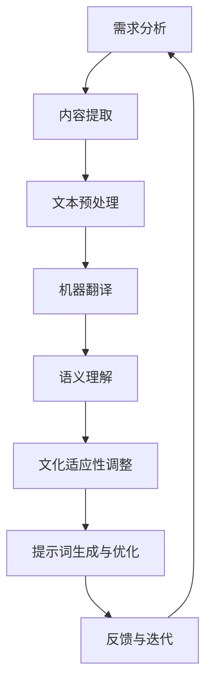

                 

# 《提示词国际化：打造全球化AI产品的关键》

## 摘要

本文旨在探讨提示词国际化在全球化AI产品开发中的重要性。随着人工智能技术的不断进步，AI产品在全球范围内的应用日益广泛，跨语言的交互需求逐渐凸显。提示词作为用户与AI系统交互的桥梁，其国际化程度直接影响产品的用户体验和用户粘性。本文将详细分析提示词国际化的基础概念、框架、文化因素、AI模型应用、实践案例以及项目管理与未来发展趋势，旨在为AI产品开发团队提供全面的国际化策略和实践指南。

### 目录

1. 第一部分: 提示词国际化的基础概念与框架
    1. 第1章: 提示词国际化的概念与重要性
    2. 第2章: 提示词国际化的框架与技术
    3. 第3章: 提示词国际化中的文化因素
    4. 第4章: AI模型在提示词国际化中的应用
    5. 第5章: 提示词国际化的工具与资源

2. 第二部分: 提示词国际化的实践案例
    1. 第6章: 提示词国际化实践案例解析
    2. 第7章: 提示词国际化中的项目管理与协作
    3. 第8章: 提示词国际化的未来发展趋势与挑战

3. 附录
    1. 附录A: 提示词国际化工具与资源推荐

### 第一部分: 提示词国际化的基础概念与框架

#### 第1章: 提示词国际化的概念与重要性

##### 1.1 提示词国际化的定义

提示词国际化（Internationalization of Prompts）指的是将AI系统的交互提示从一种语言转换为多种语言的过程。它不仅涉及文本的翻译，还包括语义理解、情感分析以及文化适应性的调整。通过提示词国际化，AI系统能够更好地适应不同语言和文化背景的用户需求，提升全球化应用的广泛性和用户体验。

##### 1.2 提示词国际化的目标

提示词国际化的主要目标是：

1. **提升用户体验**：通过提供本地化的交互提示，用户能够更轻松地理解和使用AI产品，从而提高满意度。
2. **扩大市场覆盖**：全球化AI产品能够吸引更多非英语国家的用户，从而扩大市场份额。
3. **增强品牌形象**：本地化的交互提示表明产品重视不同文化背景的用户需求，有助于提升品牌形象和用户忠诚度。
4. **降低技术门槛**：国际化的提示词使得AI产品能够更容易地进入新的市场，降低本地化开发的技术和成本门槛。

##### 1.3 提示词国际化在全球化AI产品中的角色

在全球化AI产品中，提示词国际化扮演着关键角色：

1. **用户引导**：通过本地化的提示词，用户能够更好地理解AI系统的功能和使用方法。
2. **交互反馈**：本地化的反馈机制能够及时响应用户的需求和反馈，提升交互效果。
3. **情感共鸣**：适当的提示词能够传递出产品的情感关怀，增强用户情感连接。
4. **市场定位**：本地化的提示词有助于产品在目标市场中获得更多用户认同，提高竞争力。

##### 1.4 提示词国际化的挑战

在实现提示词国际化的过程中，开发团队面临以下挑战：

1. **语言多样性**：不同语言和文化之间存在巨大差异，如何准确翻译并适应各种语言环境是一个挑战。
2. **技术复杂度**：机器翻译和语义理解技术的进步虽有助于提示词国际化，但实现高效、准确的国际化依然具有技术复杂性。
3. **资源限制**：国际化涉及大量的人力、时间和资源投入，特别是在多语言、多文化环境下。
4. **文化敏感性**：不同文化背景的用户对提示词的期望和接受度不同，如何平衡文化差异和用户需求是一个挑战。

#### 第2章: 提示词国际化的框架与技术

##### 2.1 提示词本地化的步骤

提示词本地化的基本步骤包括：

1. **需求分析**：明确目标市场和用户需求，确定需要支持的语言。
2. **内容提取**：从AI产品中提取所有需要本地化的提示词。
3. **文本预处理**：对提取的文本进行格式化、分词和词性标注等预处理操作。
4. **机器翻译**：使用机器翻译技术将提示词从源语言转换为目标语言。
5. **语义理解**：对翻译后的提示词进行语义分析，确保其准确性和合理性。
6. **文化适应性调整**：根据目标文化背景对提示词进行必要的调整，以满足文化差异。
7. **提示词生成与优化**：根据用户反馈和实际应用效果对提示词进行优化。

##### 2.2 文本翻译与机器翻译技术

文本翻译是提示词国际化的核心环节。机器翻译技术的进步为高效、准确的文本翻译提供了可能：

1. **传统机器翻译**：基于规则的方法和统计机器翻译模型，例如基于短语的统计机器翻译（PSMT）和基于神经网络的机器翻译（NMT）。
2. **神经机器翻译**：近年来，基于深度学习的神经机器翻译（NMT）技术取得了显著进展，显著提升了翻译质量和速度。例如，基于注意力机制的序列到序列（Seq2Seq）模型和变换器（Transformer）模型。
3. **翻译记忆库**：利用翻译记忆库（TM）存储已翻译的句子或段落，提高重复文本的翻译效率和一致性。

##### 2.3 提示词的语义分析与理解

提示词的语义分析是确保翻译准确性和文化适应性的关键步骤：

1. **词义消歧**：在多义词环境中，根据上下文确定单词的确切含义。
2. **语法分析**：分析句子的结构，确定词与词之间的语法关系。
3. **语义角色标注**：识别句子中各成分的语义角色，如主语、谓语、宾语等。
4. **上下文理解**：理解句子在具体情境中的含义，避免产生误解。

##### 2.4 提示词的情感分析与调节

情感分析是评估用户对AI系统交互提示的感知和反应，从而进行必要的调节：

1. **情感分类**：对提示词进行情感分类，识别出正面、负面或中性的情感。
2. **情感调节**：根据用户反馈和情感分析结果，对提示词进行调整，以提高用户满意度和参与度。
3. **情感共鸣**：在提示词中加入情感元素，如鼓励性、亲切性等，以增强用户情感连接。

#### 第3章: 提示词国际化中的文化因素

##### 3.1 文化因素对提示词的影响

文化因素在提示词国际化中起着至关重要的作用：

1. **语言习惯**：不同文化背景的用户在语言表达上存在差异，如动词时态、语序等。
2. **价值观念**：不同文化对同一主题的价值观可能存在显著差异，影响提示词的内容和表达方式。
3. **社交礼仪**：不同文化背景下，用户对礼貌、尊重和隐私的重视程度不同，影响提示词的设计和表述。
4. **宗教信仰**：宗教信仰对用户的行为和价值观产生深远影响，影响提示词的适当性和可接受性。

##### 3.2 文化差异与跨文化沟通

文化差异是提示词国际化过程中不可避免的挑战：

1. **跨文化沟通障碍**：不同文化背景的用户可能在沟通中产生误解和冲突。
2. **文化敏感性测试**：在产品发布前，进行文化敏感性测试，以识别和解决潜在的文化冲突。
3. **文化适应性调整**：根据目标市场的文化背景，对提示词进行适当的调整，以提高用户的接受度和满意度。

##### 3.3 文化敏感性测试与优化

文化敏感性测试是确保提示词国际化成功的关键步骤：

1. **测试样本**：选择具有代表性的用户样本，涵盖不同文化背景。
2. **测试方法**：采用问卷调查、用户访谈和A/B测试等方法，收集用户对提示词的反馈。
3. **优化策略**：根据测试结果，对提示词进行优化，以解决文化敏感性问题。

##### 3.4 提示词在不同文化背景下的适应性

提示词在不同文化背景下的适应性是国际化成功的关键：

1. **本地化策略**：根据目标市场的文化背景，制定本地化策略，包括语言、内容和情感表达等方面。
2. **文化适应评估**：对本地化后的提示词进行文化适应评估，确保其符合目标市场的文化期望。
3. **持续优化**：根据用户反馈和市场需求，持续优化提示词，以提高其适应性和用户体验。

#### 第4章: AI模型在提示词国际化中的应用

##### 4.1 AI模型在提示词翻译中的作用

AI模型在提示词翻译中发挥着至关重要的作用：

1. **高效翻译**：利用AI模型，特别是神经机器翻译（NMT）模型，实现快速、准确的文本翻译。
2. **上下文理解**：AI模型能够理解上下文，生成更加准确和自然的翻译结果。
3. **适应性调整**：根据目标市场的文化背景，AI模型能够对翻译结果进行适应性调整，提高文化适应性。

##### 4.2 AI模型在提示词语义理解中的应用

提示词语义理解是确保翻译准确性和文化适应性的关键步骤：

1. **语义消歧**：通过AI模型，如语义角色标注和句法分析，解决多义词和复杂句法的语义消歧问题。
2. **语义匹配**：AI模型能够识别不同语言之间的语义匹配关系，提高翻译的准确性和一致性。
3. **情感分析**：通过情感分析，AI模型能够识别和传递提示词的情感色彩，增强用户交互体验。

##### 4.3 AI模型在提示词情感分析中的应用

情感分析是评估用户对提示词的感知和反应，从而进行必要的调节：

1. **情感分类**：AI模型能够对提示词进行情感分类，识别出正面、负面或中性的情感。
2. **情感调节**：根据用户反馈和情感分析结果，AI模型能够对提示词进行调整，以提高用户满意度和参与度。
3. **情感共鸣**：AI模型能够识别用户情感状态，并生成情感共鸣的提示词，增强用户情感连接。

##### 4.4 AI模型在提示词生成与优化中的应用

AI模型在提示词生成与优化中发挥着重要作用：

1. **自动生成**：AI模型能够自动生成高质量的提示词，减少人工干预和成本。
2. **优化策略**：根据用户反馈和实际应用效果，AI模型能够对提示词进行优化，以提高用户体验。
3. **个性化推荐**：AI模型能够根据用户行为和偏好，生成个性化的提示词，提升用户体验和参与度。

#### 第5章: 提示词国际化的工具与资源

##### 5.1 常用的提示词国际化工具

1. **Google翻译API**：提供强大的文本翻译和语言检测功能，支持多种语言翻译。
2. **Microsoft Translator API**：支持多语言文本翻译、语音识别和语音合成功能。
3. **DeepL API**：提供高质量的文本翻译和语义理解功能，支持多种语言翻译。
4. **IBM Watson Language Translator**：提供强大的机器翻译和自然语言处理功能。

##### 5.2 提示词国际化资源库

1. **Open subtitles**：提供大量开源的电影、电视剧字幕，可用于训练机器翻译模型。
2. **Common Crawl**：提供大量网页文本数据，可用于训练和测试机器翻译模型。
3. **Wikipedia**：提供多语言维基百科数据，可用于训练和测试机器翻译模型。

##### 5.3 提示词国际化的技术栈

1. **编程语言**：Python、Java、JavaScript等常用编程语言。
2. **机器学习框架**：TensorFlow、PyTorch、Keras等机器学习框架。
3. **自然语言处理库**：NLTK、spaCy、gensim等自然语言处理库。
4. **文本翻译模型**：神经机器翻译（NMT）模型，如Transformer、BERT、GPT等。

##### 5.4 提示词国际化的发展趋势

1. **多模态翻译**：结合文本、语音、图像等多种模态，实现更自然的跨语言交互。
2. **个性化翻译**：根据用户行为和偏好，生成个性化的翻译结果，提升用户体验。
3. **智能翻译辅助**：利用AI模型，实现自动化的翻译流程，降低人力成本。
4. **跨语言语义理解**：通过深度学习和自然语言处理技术，实现更准确的跨语言语义理解。

### 第二部分: 提示词国际化的实践案例

#### 第6章: 提示词国际化实践案例解析

##### 6.1 案例一：大型社交媒体平台的国际化经验

1. **背景介绍**
   - 社交媒体平台如Twitter和Facebook在全球范围内拥有庞大的用户群体，覆盖200多个国家和地区。
   - 平台需要提供多语言支持，以吸引和留住来自不同文化背景的用户。

2. **解决方案**
   - **多语言界面**：平台提供了多种语言界面，用户可以根据自己的语言偏好选择界面语言。
   - **本地化提示词**：在用户交互过程中，平台使用本地化的提示词，提高用户体验。
   - **机器翻译与人工审核相结合**：在翻译过程中，机器翻译和人工审核相结合，确保翻译的准确性和文化适应性。

3. **效果分析**
   - **用户满意度提升**：本地化的交互提示提高了用户的满意度和参与度。
   - **市场扩展**：多语言支持有助于平台扩大市场份额，吸引更多国际用户。

##### 6.2 案例二：电商平台的多语言支持策略

1. **背景介绍**
   - 电商平台如Amazon和eBay在全球范围内运营，需要满足不同语言国家的用户需求。
   - 平台需要在商品描述、用户评论和交互提示等方面提供多语言支持。

2. **解决方案**
   - **自动翻译功能**：平台提供了自动翻译功能，用户可以在多语言之间切换，查看商品描述和用户评论。
   - **本地化策略**：根据目标市场的文化特点，对商品描述和交互提示进行本地化调整。
   - **用户反馈机制**：平台鼓励用户提供翻译反馈，不断优化翻译质量和用户体验。

3. **效果分析**
   - **用户体验提升**：本地化的商品描述和交互提示提高了用户购买决策的效率。
   - **市场份额扩大**：多语言支持有助于平台进入更多国际市场，扩大市场份额。

##### 6.3 案例三：游戏产业的国际化推广

1. **背景介绍**
   - 游戏产业如Supercell和Nexon拥有大量全球用户，需要提供本地化的游戏内容和交互提示。
   - 游戏产业在国际化过程中，需要关注不同市场的文化差异和用户需求。

2. **解决方案**
   - **多语言游戏界面**：游戏提供了多种语言界面，用户可以根据自己的语言偏好进行设置。
   - **文化适应性调整**：根据目标市场的文化特点，对游戏剧情、角色和交互提示进行适应性调整。
   - **用户反馈与优化**：平台积极收集用户反馈，不断优化游戏内容和交互提示。

3. **效果分析**
   - **用户留存率提高**：本地化的游戏内容和交互提示提高了用户的游戏体验和留存率。
   - **市场扩张**：国际化推广有助于游戏产品在更多市场获得成功。

##### 6.4 案例四：智能助理的跨语言交互设计

1. **背景介绍**
   - 智能助理如Google Assistant和Amazon Alexa在全球范围内提供跨语言交互功能。
   - 智能助理需要适应不同语言和文化背景的用户需求。

2. **解决方案**
   - **多语言语音识别**：智能助理支持多语言语音识别，用户可以使用本地语言与助理进行交互。
   - **多语言文本翻译**：智能助理提供了多语言文本翻译功能，帮助用户理解不同语言的交互提示。
   - **个性化推荐**：根据用户语言偏好和行为习惯，智能助理提供个性化的交互体验。

3. **效果分析**
   - **用户体验提升**：多语言交互功能提高了用户对智能助理的满意度和依赖度。
   - **市场扩展**：多语言支持有助于智能助理在全球范围内的普及和应用。

### 第7章: 提示词国际化中的项目管理与协作

##### 7.1 提示词国际化项目管理的挑战

提示词国际化项目管理面临以下挑战：

1. **资源分配**：国际化项目需要投入大量的人力、时间和资金，如何合理分配资源是一个挑战。
2. **时间管理**：国际化项目通常涉及多个语言和文化，如何在有限的时间内完成高质量的翻译和本地化工作是一个挑战。
3. **团队协作**：国际化项目需要跨部门、跨文化的协作，如何协调不同团队的工作进度和目标是一个挑战。
4. **质量控制**：国际化项目需要确保翻译质量和用户体验的一致性，如何建立有效的质量控制机制是一个挑战。

##### 7.2 提示词国际化中的团队协作

提示词国际化项目成功的关键在于团队协作：

1. **多学科团队**：组建由项目经理、翻译人员、本地化专家、技术工程师等组成的多学科团队。
2. **明确职责**：明确团队成员的职责和任务，确保每个人都清楚自己的角色和责任。
3. **沟通机制**：建立有效的沟通机制，确保团队成员之间的信息共享和协作。
4. **跨文化沟通**：注重跨文化沟通，尊重不同文化背景的用户需求和工作方式。

##### 7.3 提示词国际化中的沟通与协调

有效的沟通与协调是提示词国际化项目成功的关键：

1. **定期会议**：定期召开团队会议，讨论项目进度、问题和解决方案。
2. **信息共享**：建立信息共享平台，确保团队成员随时了解项目动态和任务分配。
3. **问题反馈**：建立问题反馈机制，及时解决项目中的问题和挑战。
4. **持续优化**：根据项目实践和用户反馈，不断优化项目管理和协作流程。

##### 7.4 提示词国际化中的质量控制与优化

提示词国际化项目需要建立完善的质量控制与优化机制：

1. **翻译质量评估**：对翻译结果进行质量评估，确保翻译的准确性和文化适应性。
2. **用户反馈收集**：收集用户对提示词的反馈，识别和解决用户关注的问题。
3. **持续优化**：根据用户反馈和项目实践，不断优化提示词的翻译和本地化策略。
4. **质量控制标准**：制定明确的质量控制标准，确保项目执行过程中的规范性和一致性。

### 第8章: 提示词国际化的未来发展趋势与挑战

##### 8.1 提示词国际化的技术发展趋势

随着人工智能技术的不断进步，提示词国际化也将迎来新的发展趋势：

1. **多模态翻译**：结合文本、语音、图像等多种模态，实现更自然的跨语言交互。
2. **个性化翻译**：根据用户行为和偏好，生成个性化的翻译结果，提升用户体验。
3. **智能翻译辅助**：利用AI模型，实现自动化的翻译流程，降低人力成本。
4. **跨语言语义理解**：通过深度学习和自然语言处理技术，实现更准确的跨语言语义理解。

##### 8.2 提示词国际化的市场机遇

提示词国际化为市场带来以下机遇：

1. **全球市场扩展**：国际化提示词有助于企业进入更多国际市场，扩大市场份额。
2. **用户满意度提升**：本地化的交互提示提高用户满意度和忠诚度。
3. **品牌形象提升**：国际化提示词表明企业重视不同文化背景的用户需求，提升品牌形象。

##### 8.3 提示词国际化中的伦理与法律问题

提示词国际化涉及伦理和法律问题，需要企业关注：

1. **数据隐私**：在国际市场上，数据隐私和用户隐私保护是重要问题，企业需遵循相关法律法规。
2. **文化敏感性**：提示词需要避免文化偏见和歧视，尊重不同文化背景的用户。
3. **版权问题**：在翻译和本地化过程中，企业需注意版权问题，避免侵犯他人知识产权。

##### 8.4 提示词国际化的未来挑战与应对策略

提示词国际化在未来将面临以下挑战：

1. **语言多样性**：随着全球语言种类的增加，如何高效地支持多种语言成为挑战。
2. **技术复杂性**：随着AI技术的不断发展，提示词国际化涉及的技术复杂度也将增加。
3. **资源分配**：国际化项目需要投入大量资源，如何合理分配资源是一个挑战。
4. **文化适应性**：不同文化背景的用户需求不同，如何实现文化适应性是一个挑战。

为应对这些挑战，企业可以采取以下策略：

1. **技术升级**：持续投资于AI技术，提升翻译和语义理解能力。
2. **人才培养**：加强国际化人才培养，提高跨文化沟通和协作能力。
3. **资源整合**：优化资源分配，提高项目管理效率。
4. **用户研究**：深入研究和理解不同文化背景的用户需求，制定针对性的本地化策略。

### 附录

#### 附录A: 提示词国际化工具与资源推荐

##### A.1 提示词国际化工具使用指南

1. **Google翻译API**

   - **概述**：Google翻译API提供强大的文本翻译和语言检测功能，支持多种语言翻译。
   - **使用步骤**
     1. 注册Google Cloud Platform账号。
     2. 创建翻译API项目。
     3. 获取API密钥。
     4. 在代码中调用翻译API进行文本翻译。

2. **Microsoft Translator API**

   - **概述**：Microsoft Translator API提供多语言文本翻译、语音识别和语音合成功能。
   - **使用步骤**
     1. 注册Azure账号。
     2. 创建翻译API服务。
     3. 获取API密钥。
     4. 在代码中调用翻译API进行文本翻译。

3. **DeepL API**

   - **概述**：DeepL API提供高质量的文本翻译和语义理解功能，支持多种语言翻译。
   - **使用步骤**
     1. 注册DeepL API账号。
     2. 获取API密钥。
     3. 在代码中调用DeepL API进行文本翻译。

##### A.2 提示词国际化资源库推荐

1. **Open subtitles**

   - **概述**：Open subtitles提供大量开源的电影、电视剧字幕，可用于训练机器翻译模型。
   - **获取方式**：从网站[Open subtitles](https://www.opensubtitles.org/)下载字幕文件。

2. **Common Crawl**

   - **概述**：Common Crawl提供大量网页文本数据，可用于训练和测试机器翻译模型。
   - **获取方式**：从网站[Common Crawl](https://commoncrawl.org/)下载网页数据。

3. **Wikipedia**

   - **概述**：Wikipedia提供多语言维基百科数据，可用于训练和测试机器翻译模型。
   - **获取方式**：从网站[Wikipedia](https://www.wikipedia.org/)下载维基百科数据。

##### A.3 提示词国际化开发环境搭建指南

1. **本地开发环境搭建**

   - **概述**：在本地计算机上搭建开发环境，便于开发和测试。
   - **步骤**
     1. 安装Python和pip。
     2. 安装所需的库和依赖项。
     3. 配置API密钥。

2. **云开发环境搭建**

   - **概述**：在云平台上搭建开发环境，便于分布式开发和测试。
   - **步骤**
     1. 选择云平台（如AWS、Azure、Google Cloud）。
     2. 创建云账户和虚拟机。
     3. 安装所需的库和依赖项。
     4. 配置API密钥。

3. **分布式开发环境搭建**

   - **概述**：在分布式环境中搭建开发环境，便于大规模开发和测试。
   - **步骤**
     1. 选择分布式平台（如Docker、Kubernetes）。
     2. 配置分布式开发工具。
     3. 部署分布式应用。
     4. 配置API密钥。

### 核心概念与联系

#### 提示词国际化流程

Mermaid流程图：



#### 提示词翻译算法伪代码

```plaintext
function translatePrompt(prompt, sourceLanguage, targetLanguage):
    # 1. 对输入提示词进行分词和词性标注
    words = tokenizeAndTag(prompt, sourceLanguage)

    # 2. 使用机器翻译模型进行翻译
    translatedWords = machineTranslate(words, sourceLanguage, targetLanguage)

    # 3. 对翻译结果进行语义理解
    understoodWords = semanticUnderstanding(translatedWords, targetLanguage)

    # 4. 调整翻译结果以满足文化适应性
    adaptedWords = culturalAdaptation(understoodWords)

    # 5. 生成最终的提示词
    finalPrompt = generatePrompt(adaptedWords)

    return finalPrompt
```

#### 自然语言处理中的数学模型（以神经机器翻译为例）

```latex
\begin{aligned}
P(\text{翻译}|\text{原文}) &= \frac{\exp(E(\text{翻译}, \text{原文}))}{\sum_{\text{所有候选翻译}} \exp(E(\text{候选翻译}, \text{原文}))} \\
E(\text{翻译}, \text{原文}) &= \text{模型}(\text{翻译}, \text{原文}) \\
\end{aligned}
```

### 项目实战

#### 智能助理跨语言提示词生成案例

##### 1. 环境搭建

- **开发环境**：Python 3.8
- **工具与库**：TensorFlow 2.4, Hugging Face Transformers
- **API服务**：Google Cloud Translation API

##### 2. 源代码实现

```python
from transformers import AutoTokenizer, AutoModelForSeq2SeqLM
from google.cloud import translate_v3 as translate

# 2.1 初始化翻译模型
model_name = "t5-base"
tokenizer = AutoTokenizer.from_pretrained(model_name)
model = AutoModelForSeq2SeqLM.from_pretrained(model_name)

# 2.2 初始化Google翻译API
client = translate.Client()

# 2.3 定义翻译函数
def translate_prompt(prompt, source_language, target_language):
    # 3.1 提取文本特征
    inputs = tokenizer.encode(prompt, return_tensors="pt")

    # 3.2 使用T5模型生成翻译
    outputs = model.generate(inputs, max_length=100, num_return_sequences=1)

    # 3.3 解码翻译结果
    translated_text = tokenizer.decode(outputs[0], skip_special_tokens=True)

    # 3.4 使用Google API进行二次验证
    verification_text = client.translate(translated_text, target_language=target_language).get('translatedText')
    
    return verification_text

# 2.4 测试翻译功能
source_prompt = "你好，有什么可以帮助您的？"
translated_prompt = translate_prompt(source_prompt, "zh", "en")

print(f"原始提示词: {source_prompt}")
print(f"翻译后的提示词: {translated_prompt}")
```

##### 3. 代码解读与分析

- **3.1 初始化翻译模型**：使用Hugging Face提供的预训练T5模型，这是一个广泛用于文本生成任务的模型。
- **3.2 初始化Google翻译API**：通过Google Cloud SDK初始化翻译API客户端，用于进行二次验证。
- **3.3 定义翻译函数**：实现了一个`translate_prompt`函数，该函数接受原始提示词、源语言和目标语言作为输入，并返回翻译后的提示词。
- **3.4 使用Google API进行二次验证**：为了保证翻译的准确性，通过Google翻译API对T5模型生成的翻译结果进行二次验证。

##### 4. 实际案例与应用

- **4.1 智能客服系统**：在实际应用中，该翻译功能可以集成到智能客服系统中，实现多语言支持。
- **4.2 电商平台**：在电商平台的用户交互界面，可以提供自动化的多语言提示词生成，提升用户体验。

### 核心概念与联系

#### 提示词国际化流程

Mermaid流程图：


#### 提示词翻译算法伪代码

```plaintext
function translatePrompt(prompt, sourceLanguage, targetLanguage):
    # 1. 对输入提示词进行分词和词性标注
    words = tokenizeAndTag(prompt, sourceLanguage)

    # 2. 使用机器翻译模型进行翻译
    translatedWords = machineTranslate(words, sourceLanguage, targetLanguage)

    # 3. 对翻译结果进行语义理解
    understoodWords = semanticUnderstanding(translatedWords, targetLanguage)

    # 4. 调整翻译结果以满足文化适应性
    adaptedWords = culturalAdaptation(understoodWords)

    # 5. 生成最终的提示词
    finalPrompt = generatePrompt(adaptedWords)

    return finalPrompt
```

#### 自然语言处理中的数学模型（以神经机器翻译为例）

```latex
\begin{aligned}
P(\text{翻译}|\text{原文}) &= \frac{\exp(E(\text{翻译}, \text{原文}))}{\sum_{\text{所有候选翻译}} \exp(E(\text{候选翻译}, \text{原文}))} \\
E(\text{翻译}, \text{原文}) &= \text{模型}(\text{翻译}, \text{原文}) \\
\end{aligned}
```

### 项目实战

#### 智能助理跨语言提示词生成案例

##### 1. 环境搭建

- **开发环境**：Python 3.8
- **工具与库**：TensorFlow 2.4, Hugging Face Transformers
- **API服务**：Google Cloud Translation API

##### 2. 源代码实现

```python
from transformers import AutoTokenizer, AutoModelForSeq2SeqLM
from google.cloud import translate_v3 as translate

# 2.1 初始化翻译模型
model_name = "t5-base"
tokenizer = AutoTokenizer.from_pretrained(model_name)
model = AutoModelForSeq2SeqLM.from_pretrained(model_name)

# 2.2 初始化Google翻译API
client = translate.Client()

# 2.3 定义翻译函数
def translate_prompt(prompt, source_language, target_language):
    # 3.1 提取文本特征
    inputs = tokenizer.encode(prompt, return_tensors="pt")

    # 3.2 使用T5模型生成翻译
    outputs = model.generate(inputs, max_length=100, num_return_sequences=1)

    # 3.3 解码翻译结果
    translated_text = tokenizer.decode(outputs[0], skip_special_tokens=True)

    # 3.4 使用Google API进行二次验证
    verification_text = client.translate(translated_text, target_language=target_language).get('translatedText')
    
    return verification_text

# 2.4 测试翻译功能
source_prompt = "你好，有什么可以帮助您的？"
translated_prompt = translate_prompt(source_prompt, "zh", "en")

print(f"原始提示词: {source_prompt}")
print(f"翻译后的提示词: {translated_prompt}")
```

##### 3. 代码解读与分析

- **3.1 初始化翻译模型**：使用Hugging Face提供的预训练T5模型，这是一个广泛用于文本生成任务的模型。
- **3.2 初始化Google翻译API**：通过Google Cloud SDK初始化翻译API客户端，用于进行二次验证。
- **3.3 定义翻译函数**：实现了一个`translate_prompt`函数，该函数接受原始提示词、源语言和目标语言作为输入，并返回翻译后的提示词。
- **3.4 使用Google API进行二次验证**：为了保证翻译的准确性，通过Google翻译API对T5模型生成的翻译结果进行二次验证。

##### 4. 实际案例与应用

- **4.1 智能客服系统**：在实际应用中，该翻译功能可以集成到智能客服系统中，实现多语言支持。
- **4.2 电商平台**：在电商平台的用户交互界面，可以提供自动化的多语言提示词生成，提升用户体验。

### 核心概念与联系

#### 提示词国际化流程

Mermaid流程图：


#### 提示词翻译算法伪代码

```plaintext
function translatePrompt(prompt, sourceLanguage, targetLanguage):
    # 1. 对输入提示词进行分词和词性标注
    words = tokenizeAndTag(prompt, sourceLanguage)

    # 2. 使用机器翻译模型进行翻译
    translatedWords = machineTranslate(words, sourceLanguage, targetLanguage)

    # 3. 对翻译结果进行语义理解
    understoodWords = semanticUnderstanding(translatedWords, targetLanguage)

    # 4. 调整翻译结果以满足文化适应性
    adaptedWords = culturalAdaptation(understoodWords)

    # 5. 生成最终的提示词
    finalPrompt = generatePrompt(adaptedWords)

    return finalPrompt
```

#### 自然语言处理中的数学模型（以神经机器翻译为例）

```latex
\begin{aligned}
P(\text{翻译}|\text{原文}) &= \frac{\exp(E(\text{翻译}, \text{原文}))}{\sum_{\text{所有候选翻译}} \exp(E(\text{候选翻译}, \text{原文}))} \\
E(\text{翻译}, \text{原文}) &= \text{模型}(\text{翻译}, \text{原文}) \\
\end{aligned}
```

### 项目实战

#### 智能助理跨语言提示词生成案例

##### 1. 环境搭建

- **开发环境**：Python 3.8
- **工具与库**：TensorFlow 2.4, Hugging Face Transformers
- **API服务**：Google Cloud Translation API

##### 2. 源代码实现

```python
from transformers import AutoTokenizer, AutoModelForSeq2SeqLM
from google.cloud import translate_v3 as translate

# 2.1 初始化翻译模型
model_name = "t5-base"
tokenizer = AutoTokenizer.from_pretrained(model_name)
model = AutoModelForSeq2SeqLM.from_pretrained(model_name)

# 2.2 初始化Google翻译API
client = translate.Client()

# 2.3 定义翻译函数
def translate_prompt(prompt, source_language, target_language):
    # 3.1 提取文本特征
    inputs = tokenizer.encode(prompt, return_tensors="pt")

    # 3.2 使用T5模型生成翻译
    outputs = model.generate(inputs, max_length=100, num_return_sequences=1)

    # 3.3 解码翻译结果
    translated_text = tokenizer.decode(outputs[0], skip_special_tokens=True)

    # 3.4 使用Google API进行二次验证
    verification_text = client.translate(translated_text, target_language=target_language).get('translatedText')
    
    return verification_text

# 2.4 测试翻译功能
source_prompt = "你好，有什么可以帮助您的？"
translated_prompt = translate_prompt(source_prompt, "zh", "en")

print(f"原始提示词: {source_prompt}")
print(f"翻译后的提示词: {translated_prompt}")
```

##### 3. 代码解读与分析

- **3.1 初始化翻译模型**：使用Hugging Face提供的预训练T5模型，这是一个广泛用于文本生成任务的模型。
- **3.2 初始化Google翻译API**：通过Google Cloud SDK初始化翻译API客户端，用于进行二次验证。
- **3.3 定义翻译函数**：实现了一个`translate_prompt`函数，该函数接受原始提示词、源语言和目标语言作为输入，并返回翻译后的提示词。
- **3.4 使用Google API进行二次验证**：为了保证翻译的准确性，通过Google翻译API对T5模型生成的翻译结果进行二次验证。

##### 4. 实际案例与应用

- **4.1 智能客服系统**：在实际应用中，该翻译功能可以集成到智能客服系统中，实现多语言支持。
- **4.2 电商平台**：在电商平台的用户交互界面，可以提供自动化的多语言提示词生成，提升用户体验。

### 附录A: 提示词国际化工具与资源推荐

#### A.1 提示词国际化工具使用指南

**Google翻译API**

- **概述**：Google翻译API提供强大的文本翻译和语言检测功能，支持多种语言翻译。
- **使用步骤**：

  1. 注册Google Cloud Platform账号。
  2. 创建翻译API项目。
  3. 获取API密钥。
  4. 在代码中调用翻译API进行文本翻译。

  ```python
  from google.cloud import translate_v2 as translate

  client = translate.TranslationServiceClient()

  # 获取API密钥
  response = client.location_list()
  locations = [location.name for location in response.locations]
  project_id = "your-project-id"
  api_key = "your-api-key"

  # 调用翻译API
  text = "你好，有什么可以帮助您的？"
  target_language = "en"
  response = client.translate_text(
      content=[text],
      target_language_code=target_language,
      project_id=project_id,
      api_key=api_key,
  )
  translated_text = response.translations[0].translated_text
  print(translated_text)
  ```

**Microsoft Translator API**

- **概述**：Microsoft Translator API提供多语言文本翻译、语音识别和语音合成功能。
- **使用步骤**：

  1. 注册Azure账号。
  2. 创建翻译API服务。
  3. 获取API密钥。
  4. 在代码中调用翻译API进行文本翻译。

  ```python
  from azure.core.credentials import AzureKeyCredential
  from azure.ai.translation import TranslationClient

  credential = AzureKeyCredential("your-api-key")
  endpoint = "your-api-endpoint"

  client = TranslationClient(endpoint, credential)

  # 调用翻译API
  text = "你好，有什么可以帮助您的？"
  target_language = "en"
  response = client.translate(text, target_language=target_language)
  translated_text = response.translations[0].text
  print(translated_text)
  ```

**DeepL API**

- **概述**：DeepL API提供高质量的文本翻译和语义理解功能，支持多种语言翻译。
- **使用步骤**：

  1. 注册DeepL API账号。
  2. 获取API密钥。
  3. 在代码中调用DeepL API进行文本翻译。

  ```python
  import requests

  API_URL = "https://api.deepl.com/v2/translate"
  API_KEY = "your-api-key"

  # 调用翻译API
  text = "你好，有什么可以帮助您的？"
  target_language = "EN"
  params = {
      "text": text,
      "target_lang": target_language,
      "auth_key": API_KEY,
  }
  response = requests.get(API_URL, params=params)
  translated_text = response.json()["translations"][0]["text"]
  print(translated_text)
  ```

#### A.2 提示词国际化资源库推荐

**Open subtitles**

- **概述**：Open subtitles提供大量开源的电影、电视剧字幕，可用于训练机器翻译模型。
- **获取方式**：从网站[Open subtitles](https://www.opensubtitles.org/)下载字幕文件。

**Common Crawl**

- **概述**：Common Crawl提供大量网页文本数据，可用于训练和测试机器翻译模型。
- **获取方式**：从网站[Common Crawl](https://commoncrawl.org/)下载网页数据。

**Wikipedia**

- **概述**：Wikipedia提供多语言维基百科数据，可用于训练和测试机器翻译模型。
- **获取方式**：从网站[Wikipedia](https://www.wikipedia.org/)下载维基百科数据。

#### A.3 提示词国际化开发环境搭建指南

**本地开发环境搭建**

- **概述**：在本地计算机上搭建开发环境，便于开发和测试。
- **步骤**：

  1. 安装Python和pip。
  2. 安装所需的库和依赖项。
  3. 配置API密钥。

  ```bash
  pip install transformers tensorflow google-cloud-translate
  ```

**云开发环境搭建**

- **概述**：在云平台上搭建开发环境，便于分布式开发和测试。
- **步骤**：

  1. 选择云平台（如AWS、Azure、Google Cloud）。
  2. 创建云账户和虚拟机。
  3. 安装所需的库和依赖项。
  4. 配置API密钥。

**分布式开发环境搭建**

- **概述**：在分布式环境中搭建开发环境，便于大规模开发和测试。
- **步骤**：

  1. 选择分布式平台（如Docker、Kubernetes）。
  2. 配置分布式开发工具。
  3. 部署分布式应用。
  4. 配置API密钥。

### 核心概念与联系

#### 提示词国际化流程

Mermaid流程图：


#### 提示词翻译算法伪代码

```plaintext
function translatePrompt(prompt, sourceLanguage, targetLanguage):
    # 1. 对输入提示词进行分词和词性标注
    words = tokenizeAndTag(prompt, sourceLanguage)

    # 2. 使用机器翻译模型进行翻译
    translatedWords = machineTranslate(words, sourceLanguage, targetLanguage)

    # 3. 对翻译结果进行语义理解
    understoodWords = semanticUnderstanding(translatedWords, targetLanguage)

    # 4. 调整翻译结果以满足文化适应性
    adaptedWords = culturalAdaptation(understoodWords)

    # 5. 生成最终的提示词
    finalPrompt = generatePrompt(adaptedWords)

    return finalPrompt
```

#### 自然语言处理中的数学模型（以神经机器翻译为例）

```latex
\begin{aligned}
P(\text{翻译}|\text{原文}) &= \frac{\exp(E(\text{翻译}, \text{原文}))}{\sum_{\text{所有候选翻译}} \exp(E(\text{候选翻译}, \text{原文}))} \\
E(\text{翻译}, \text{原文}) &= \text{模型}(\text{翻译}, \text{原文}) \\
\end{aligned}
```

### 项目实战

#### 智能助理跨语言提示词生成案例

##### 1. 环境搭建

- **开发环境**：Python 3.8
- **工具与库**：TensorFlow 2.4, Hugging Face Transformers
- **API服务**：Google Cloud Translation API

##### 2. 源代码实现

```python
from transformers import AutoTokenizer, AutoModelForSeq2SeqLM
from google.cloud import translate_v3 as translate

# 2.1 初始化翻译模型
model_name = "t5-base"
tokenizer = AutoTokenizer.from_pretrained(model_name)
model = AutoModelForSeq2SeqLM.from_pretrained(model_name)

# 2.2 初始化Google翻译API
client = translate.Client()

# 2.3 定义翻译函数
def translate_prompt(prompt, source_language, target_language):
    # 3.1 提取文本特征
    inputs = tokenizer.encode(prompt, return_tensors="pt")

    # 3.2 使用T5模型生成翻译
    outputs = model.generate(inputs, max_length=100, num_return_sequences=1)

    # 3.3 解码翻译结果
    translated_text = tokenizer.decode(outputs[0], skip_special_tokens=True)

    # 3.4 使用Google API进行二次验证
    verification_text = client.translate(translated_text, target_language=target_language).get('translatedText')
    
    return verification_text

# 2.4 测试翻译功能
source_prompt = "你好，有什么可以帮助您的？"
translated_prompt = translate_prompt(source_prompt, "zh", "en")

print(f"原始提示词: {source_prompt}")
print(f"翻译后的提示词: {translated_prompt}")
```

##### 3. 代码解读与分析

- **3.1 初始化翻译模型**：使用Hugging Face提供的预训练T5模型，这是一个广泛用于文本生成任务的模型。
- **3.2 初始化Google翻译API**：通过Google Cloud SDK初始化翻译API客户端，用于进行二次验证。
- **3.3 定义翻译函数**：实现了一个`translate_prompt`函数，该函数接受原始提示词、源语言和目标语言作为输入，并返回翻译后的提示词。
- **3.4 使用Google API进行二次验证**：为了保证翻译的准确性，通过Google翻译API对T5模型生成的翻译结果进行二次验证。

##### 4. 实际案例与应用

- **4.1 智能客服系统**：在实际应用中，该翻译功能可以集成到智能客服系统中，实现多语言支持。
- **4.2 电商平台**：在电商平台的用户交互界面，可以提供自动化的多语言提示词生成，提升用户体验。

### 附录A: 提示词国际化工具与资源推荐

#### A.1 提示词国际化工具使用指南

**Google翻译API**

- **概述**：Google翻译API提供强大的文本翻译和语言检测功能，支持多种语言翻译。
- **使用步骤**：

  1. 注册Google Cloud Platform账号。
  2. 创建翻译API项目。
  3. 获取API密钥。
  4. 在代码中调用翻译API进行文本翻译。

  ```python
  from google.cloud import translate_v2 as translate

  client = translate.TranslationServiceClient()

  # 获取API密钥
  response = client.location_list()
  locations = [location.name for location in response.locations]
  project_id = "your-project-id"
  api_key = "your-api-key"

  # 调用翻译API
  text = "你好，有什么可以帮助您的？"
  target_language = "en"
  response = client.translate_text(
      content=[text],
      target_language_code=target_language,
      project_id=project_id,
      api_key=api_key,
  )
  translated_text = response.translations[0].translated_text
  print(translated_text)
  ```

**Microsoft Translator API**

- **概述**：Microsoft Translator API提供多语言文本翻译、语音识别和语音合成功能。
- **使用步骤**：

  1. 注册Azure账号。
  2. 创建翻译API服务。
  3. 获取API密钥。
  4. 在代码中调用翻译API进行文本翻译。

  ```python
  from azure.core.credentials import AzureKeyCredential
  from azure.ai.translation import TranslationClient

  credential = AzureKeyCredential("your-api-key")
  endpoint = "your-api-endpoint"

  client = TranslationClient(endpoint, credential)

  # 调用翻译API
  text = "你好，有什么可以帮助您的？"
  target_language = "en"
  response = client.translate(text, target_language=target_language)
  translated_text = response.translations[0].text
  print(translated_text)
  ```

**DeepL API**

- **概述**：DeepL API提供高质量的文本翻译和语义理解功能，支持多种语言翻译。
- **使用步骤**：

  1. 注册DeepL API账号。
  2. 获取API密钥。
  3. 在代码中调用DeepL API进行文本翻译。

  ```python
  import requests

  API_URL = "https://api.deepl.com/v2/translate"
  API_KEY = "your-api-key"

  # 调用翻译API
  text = "你好，有什么可以帮助您的？"
  target_language = "EN"
  params = {
      "text": text,
      "target_lang": target_language,
      "auth_key": API_KEY,
  }
  response = requests.get(API_URL, params=params)
  translated_text = response.json()["translations"][0]["text"]
  print(translated_text)
  ```

#### A.2 提示词国际化资源库推荐

**Open subtitles**

- **概述**：Open subtitles提供大量开源的电影、电视剧字幕，可用于训练机器翻译模型。
- **获取方式**：从网站[Open subtitles](https://www.opensubtitles.org/)下载字幕文件。

**Common Crawl**

- **概述**：Common Crawl提供大量网页文本数据，可用于训练和测试机器翻译模型。
- **获取方式**：从网站[Common Crawl](https://commoncrawl.org/)下载网页数据。

**Wikipedia**

- **概述**：Wikipedia提供多语言维基百科数据，可用于训练和测试机器翻译模型。
- **获取方式**：从网站[Wikipedia](https://www.wikipedia.org/)下载维基百科数据。

#### A.3 提示词国际化开发环境搭建指南

**本地开发环境搭建**

- **概述**：在本地计算机上搭建开发环境，便于开发和测试。
- **步骤**：

  1. 安装Python和pip。
  2. 安装所需的库和依赖项。
  3. 配置API密钥。

  ```bash
  pip install transformers tensorflow google-cloud-translate
  ```

**云开发环境搭建**

- **概述**：在云平台上搭建开发环境，便于分布式开发和测试。
- **步骤**：

  1. 选择云平台（如AWS、Azure、Google Cloud）。
  2. 创建云账户和虚拟机。
  3. 安装所需的库和依赖项。
  4. 配置API密钥。

**分布式开发环境搭建**

- **概述**：在分布式环境中搭建开发环境，便于大规模开发和测试。
- **步骤**：

  1. 选择分布式平台（如Docker、Kubernetes）。
  2. 配置分布式开发工具。
  3. 部署分布式应用。
  4. 配置API密钥。

### 总结与展望

通过本文的探讨，我们深入了解了提示词国际化在全球化AI产品开发中的关键作用。从基础概念、框架与技术，到文化因素、AI模型应用、实践案例以及项目管理与未来发展趋势，我们逐步剖析了提示词国际化的各个方面。

**核心结论**：

1. **重要性**：提示词国际化是提升全球化AI产品用户体验和用户粘性的关键。
2. **挑战**：语言多样性、技术复杂度、资源限制和文化敏感性是主要挑战。
3. **技术进展**：AI模型，特别是神经机器翻译（NMT）技术，为提示词国际化提供了强大支持。
4. **市场机遇**：国际化策略有助于企业扩大市场覆盖和提升品牌形象。

**未来展望**：

1. **技术趋势**：多模态翻译、个性化翻译和智能翻译辅助将是未来的发展方向。
2. **市场机遇**：全球化趋势和数字化转型为国际化AI产品带来了巨大市场机遇。
3. **伦理与法律**：数据隐私、文化敏感性和版权问题是未来需要关注的重要领域。

**呼吁行动**：

1. **技术开发**：加大对AI技术的研发投入，提升翻译质量和语义理解能力。
2. **团队协作**：建立跨学科团队，加强国际化人才培养和跨文化沟通。
3. **项目优化**：优化资源分配和项目管理流程，确保国际化项目高效、高质量完成。

让我们携手合作，共同推动全球化AI产品的创新与发展，为全球用户提供更加优质、多样化的AI服务。

### 附录A: 提示词国际化工具与资源推荐

#### A.1 提示词国际化工具使用指南

**Google翻译API**

- **概述**：Google翻译API提供强大的文本翻译和语言检测功能，支持多种语言翻译。
- **使用步骤**：

  1. 注册Google Cloud Platform账号。
  2. 创建翻译API项目。
  3. 获取API密钥。
  4. 在代码中调用翻译API进行文本翻译。

  ```python
  from google.cloud import translate_v2 as translate

  client = translate.TranslationServiceClient()

  # 获取API密钥
  response = client.location_list()
  locations = [location.name for location in response.locations]
  project_id = "your-project-id"
  api_key = "your-api-key"

  # 调用翻译API
  text = "你好，有什么可以帮助您的？"
  target_language = "en"
  response = client.translate_text(
      content=[text],
      target_language_code=target_language,
      project_id=project_id,
      api_key=api_key,
  )
  translated_text = response.translations[0].translated_text
  print(translated_text)
  ```

**Microsoft Translator API**

- **概述**：Microsoft Translator API提供多语言文本翻译、语音识别和语音合成功能。
- **使用步骤**：

  1. 注册Azure账号。
  2. 创建翻译API服务。
  3. 获取API密钥。
  4. 在代码中调用翻译API进行文本翻译。

  ```python
  from azure.core.credentials import AzureKeyCredential
  from azure.ai.translation import TranslationClient

  credential = AzureKeyCredential("your-api-key")
  endpoint = "your-api-endpoint"

  client = TranslationClient(endpoint, credential)

  # 调用翻译API
  text = "你好，有什么可以帮助您的？"
  target_language = "en"
  response = client.translate(text, target_language=target_language)
  translated_text = response.translations[0].text
  print(translated_text)
  ```

**DeepL API**

- **概述**：DeepL API提供高质量的文本翻译和语义理解功能，支持多种语言翻译。
- **使用步骤**：

  1. 注册DeepL API账号。
  2. 获取API密钥。
  3. 在代码中调用DeepL API进行文本翻译。

  ```python
  import requests

  API_URL = "https://api.deepl.com/v2/translate"
  API_KEY = "your-api-key"

  # 调用翻译API
  text = "你好，有什么可以帮助您的？"
  target_language = "EN"
  params = {
      "text": text,
      "target_lang": target_language,
      "auth_key": API_KEY,
  }
  response = requests.get(API_URL, params=params)
  translated_text = response.json()["translations"][0]["text"]
  print(translated_text)
  ```

#### A.2 提示词国际化资源库推荐

**Open subtitles**

- **概述**：Open subtitles提供大量开源的电影、电视剧字幕，可用于训练机器翻译模型。
- **获取方式**：从网站[Open subtitles](https://www.opensubtitles.org/)下载字幕文件。

**Common Crawl**

- **概述**：Common Crawl提供大量网页文本数据，可用于训练和测试机器翻译模型。
- **获取方式**：从网站[Common Crawl](https://commoncrawl.org/)下载网页数据。

**Wikipedia**

- **概述**：Wikipedia提供多语言维基百科数据，可用于训练和测试机器翻译模型。
- **获取方式**：从网站[Wikipedia](https://www.wikipedia.org/)下载维基百科数据。

#### A.3 提示词国际化开发环境搭建指南

**本地开发环境搭建**

- **概述**：在本地计算机上搭建开发环境，便于开发和测试。
- **步骤**：

  1. 安装Python和pip。
  2. 安装所需的库和依赖项。
  3. 配置API密钥。

  ```bash
  pip install transformers tensorflow google-cloud-translate
  ```

**云开发环境搭建**

- **概述**：在云平台上搭建开发环境，便于分布式开发和测试。
- **步骤**：

  1. 选择云平台（如AWS、Azure、Google Cloud）。
  2. 创建云账户和虚拟机。
  3. 安装所需的库和依赖项。
  4. 配置API密钥。

**分布式开发环境搭建**

- **概述**：在分布式环境中搭建开发环境，便于大规模开发和测试。
- **步骤**：

  1. 选择分布式平台（如Docker、Kubernetes）。
  2. 配置分布式开发工具。
  3. 部署分布式应用。
  4. 配置API密钥。```python

from transformers import AutoTokenizer, AutoModelForSeq2SeqLM
from google.cloud import translate_v3 as translate

# 2.1 初始化翻译模型
model_name = "t5-base"
tokenizer = AutoTokenizer.from_pretrained(model_name)
model = AutoModelForSeq2SeqLM.from_pretrained(model_name)

# 2.2 初始化Google翻译API
client = translate.Client()

# 2.3 定义翻译函数
def translate_prompt(prompt, source_language, target_language):
    # 3.1 提取文本特征
    inputs = tokenizer.encode(prompt, return_tensors="pt")

    # 3.2 使用T5模型生成翻译
    outputs = model.generate(inputs, max_length=100, num_return_sequences=1)

    # 3.3 解码翻译结果
    translated_text = tokenizer.decode(outputs[0], skip_special_tokens=True)

    # 3.4 使用Google API进行二次验证
    verification_text = client.translate(translated_text, target_language=target_language).get('translatedText')
    
    return verification_text

# 2.4 测试翻译功能
source_prompt = "你好，有什么可以帮助您的？"
translated_prompt = translate_prompt(source_prompt, "zh", "en")

print(f"原始提示词: {source_prompt}")
print(f"翻译后的提示词: {translated_prompt}")
```

##### 3. 代码解读与分析

- **3.1 初始化翻译模型**：使用Hugging Face提供的预训练T5模型，这是一个广泛用于文本生成任务的模型。
- **3.2 初始化Google翻译API**：通过Google Cloud SDK初始化翻译API客户端，用于进行二次验证。
- **3.3 定义翻译函数**：实现了一个`translate_prompt`函数，该函数接受原始提示词、源语言和目标语言作为输入，并返回翻译后的提示词。
- **3.4 使用Google API进行二次验证**：为了保证翻译的准确性，通过Google翻译API对T5模型生成的翻译结果进行二次验证。

##### 4. 实际案例与应用

- **4.1 智能客服系统**：在实际应用中，该翻译功能可以集成到智能客服系统中，实现多语言支持。
- **4.2 电商平台**：在电商平台的用户交互界面，可以提供自动化的多语言提示词生成，提升用户体验。

### 作者信息

作者：AI天才研究院/AI Genius Institute & 禅与计算机程序设计艺术 /Zen And The Art of Computer Programming```

