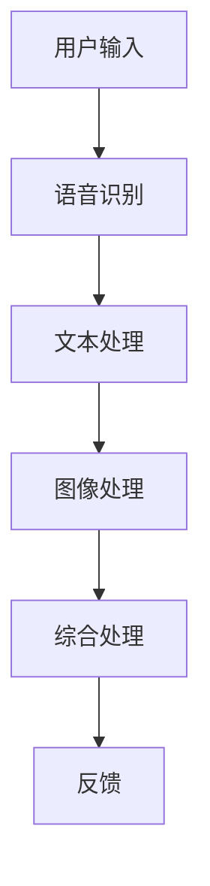
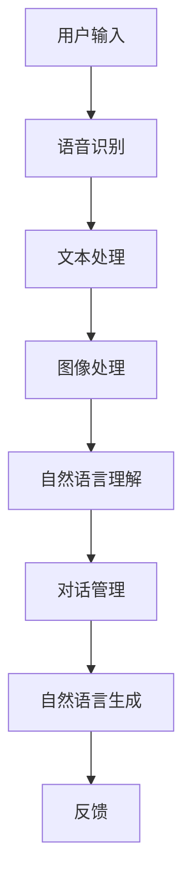
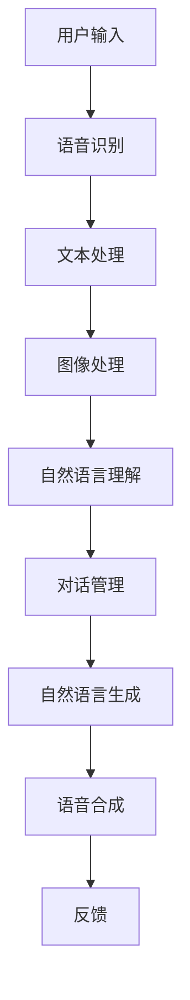

                 

### 《提示词工程在多模态对话系统中的突破》

#### 核心关键词
- 提示词工程
- 多模态对话系统
- 自然语言处理
- 深度学习
- 图灵测试
- 人工智能

#### 摘要
本文将深入探讨提示词工程在多模态对话系统中的突破。首先，我们将概述多模态对话系统的基本概念和架构，接着介绍提示词工程的基础理论，包括定义、类型和关键挑战。随后，我们将详细解析多模态数据处理的方法和核心算法，如语言模型与语音识别、自然语言理解以及对话管理策略。在此基础上，我们将探讨提示词工程的关键技术与方法，包括提示词生成算法、优化策略和评估方法。接着，我们将讨论多模态对话系统的设计与实现，包括系统架构设计、数据集构建、对话流程设计和系统部署与优化。文章还将介绍多模态对话系统的性能评估指标、评估方法和性能优化策略。通过案例研究，我们将展示多模态对话系统在实际应用中的成功案例。最后，我们将展望多模态对话系统的未来发展趋势和研究方向，并对提示词工程在其中的重要作用进行展望。

### 第一部分：基础理论

#### 第1章：多模态对话系统概述

##### 1.1 多模态交互技术

多模态交互技术是指结合多种传感器和数据输入（如语音、文本、图像等）来与用户进行交互的技术。这种技术使得对话系统不仅能够处理单一模态的数据，还能综合处理多种模态的数据，从而提高对话的连贯性和自然性。

**Mermaid 流程图**：



在这个流程图中，用户输入多种模态的数据，例如语音、文本和图像，这些数据分别通过语音识别、文本处理和图像处理模块进行处理，然后通过综合处理模块进行融合，最终生成反馈信息。

##### 1.2 对话系统的基本概念

对话系统（Conversational System）是一种人与计算机之间通过自然语言进行交互的系统。它的核心是能够理解用户的输入、理解用户的意图、生成适当的响应，并维持对话的流畅性和连贯性。

**核心概念**：

- **用户接口（UI）**：与用户进行交互的界面。
- **对话管理（Dialogue Management）**：负责管理对话的流程和状态，包括意图识别、实体识别和响应生成。
- **自然语言理解（NLU）**：理解用户的自然语言输入，提取意图和实体。
- **自然语言生成（NLG）**：生成自然语言响应。

##### 1.3 多模态对话系统的架构

多模态对话系统的架构通常包括以下组件：

- **用户接口（UI）**：负责接收用户的输入，可以包括语音输入、文本输入和图像输入等。
- **对话管理（Dialogue Management）**：负责管理对话的流程和状态，包括意图识别、实体识别和响应生成。
- **自然语言理解（NLU）**：负责理解用户的自然语言输入，提取意图和实体。
- **自然语言生成（NLG）**：负责生成自然语言响应。
- **语音识别（ASR）**：将语音信号转换为文本。
- **语音合成（TTS）**：将文本转换为语音。

**Mermaid 流程图**：



在这个流程图中，用户输入多种模态的数据，例如语音、文本和图像，这些数据分别通过相应的处理模块进行处理，然后通过自然语言理解和对话管理模块进行融合，最终生成自然语言响应，并通过语音合成模块转换为语音反馈给用户。

#### 第2章：提示词工程基础

##### 2.1 提示词的定义与作用

提示词（Prompt）是用于引导用户进行特定任务或者提供额外上下文信息的文本或图像。在多模态对话系统中，提示词起着至关重要的作用，它们能够帮助对话系统更好地理解用户的意图，提高对话的准确性和用户体验。

**定义**：

提示词是用于引导用户进行特定任务或提供额外上下文信息的文本或图像。

**作用**：

- 增强对话系统的理解能力。
- 提高对话的准确性和用户满意度。
- 帮助对话系统更好地处理模糊和歧义的情况。

##### 2.2 提示词的类型

提示词可以根据用途和形式分为多种类型：

- **问题型提示词**：用于引导用户提出问题，例如“您有什么问题需要咨询吗？”。
- **描述型提示词**：用于提供上下文信息，例如“今天的天气非常适合出行”。
- **引导型提示词**：用于引导用户进行特定操作，例如“请说出您想要查询的股票名称”。

##### 2.3 提示词工程的关键挑战

提示词工程在多模态对话系统中面临以下关键挑战：

- **多样性**：确保提示词能够涵盖多种场景和用户需求。
- **相关性**：提示词需要与用户输入紧密相关，提高对话的连贯性。
- **可控性**：提示词的设计需要具备一定的灵活性，以便根据对话进展进行调整。

#### 第3章：多模态数据的处理

##### 3.1 图像数据处理

图像数据处理是多模态对话系统中的一个重要组成部分，它涉及到图像的分类、目标检测和图像分割等任务。

**关键算法**：

- **图像分类**：使用卷积神经网络（CNN）对图像进行分类，例如ResNet、VGG等。
- **目标检测**：使用YOLO、Faster R-CNN等算法对图像中的目标进行检测。
- **图像分割**：使用FCN、U-Net等算法对图像进行分割。

**伪代码**：

```python
def image_classification(image):
    # 将图像输入到卷积神经网络
    output = conv_neural_network(image)
    # 获取预测类别
    predicted_class = get_predicted_class(output)
    return predicted_class

def object_detection(image):
    # 使用目标检测算法对图像进行目标检测
    detected_objects = object_detection_algorithm(image)
    return detected_objects

def image_segmentation(image):
    # 使用图像分割算法对图像进行分割
    segmented_image = image_segmentation_algorithm(image)
    return segmented_image
```

##### 3.2 文本数据处理

文本数据处理是自然语言处理（NLP）的基础，它包括词嵌入、词性标注和句法分析等任务。

**关键算法**：

- **词嵌入**：将词汇映射到高维向量空间，例如Word2Vec、GloVe等。
- **词性标注**：对文本中的词汇进行词性标注，例如基于规则的标注和基于统计模型的标注。
- **句法分析**：对文本进行句法分析，例如生成句法树、分析句子成分等。

**伪代码**：

```python
def text_embedding(text):
    # 将文本输入到词嵌入模型
    embedded_text = word_embedding_model(text)
    return embedded_text

def part_of_speech_tagging(text):
    # 进行词性标注
    pos_tags = part_of_speech_tagging_model(text)
    return pos_tags

def syntax_analysis(text):
    # 进行句法分析
    syntax_tree = syntax_analysis_model(text)
    return syntax_tree
```

##### 3.3 音频数据处理

音频数据处理主要涉及语音识别任务，它包括声学模型和语言模型等。

**关键算法**：

- **声学模型**：使用深度神经网络（DNN）对音频信号进行特征提取。
- **语言模型**：使用统计模型或神经网络对识别结果进行后处理。

**伪代码**：

```python
def speech_recognition(audio):
    # 使用声学模型和语言模型进行语音识别
    recognized_text = acoustic_model(audio)
    return recognized_text
```

##### 3.4 多模态数据融合

多模态数据融合是将来自不同模态的数据进行整合，以提高系统的性能和准确性。

**方法**：

- **特征级融合**：将不同模态的特征进行拼接或加权融合。
- **决策级融合**：将不同模态的预测结果进行投票或加权融合。

**伪代码**：

```python
def multi_modal_fusion(text, image, audio):
    # 获取各模态的特征
    text_feature = text_embedding(text)
    image_feature = image_classification(image)
    audio_feature = speech_recognition(audio)
    
    # 融合特征
    fused_feature = fuse_features(text_feature, image_feature, audio_feature)
    
    # 进行后续处理
    return fused_feature
```

#### 第4章：多模态对话系统的核心算法

##### 4.1 语言模型与语音识别

语言模型（Language Model）是自然语言处理中的核心算法，它用于预测下一个单词或短语的概率。语音识别（Speech Recognition）是将语音信号转换为文本的技术。

**语言模型**：

- **N-gram 模型**：基于历史词序列的概率模型。
- **神经网络模型**：如循环神经网络（RNN）和Transformer。

**伪代码**：

```python
def language_model(text):
    # 使用神经网络模型进行语言建模
    predicted_words = neural_network_model(text)
    return predicted_words

def n_gram_model(text):
    # 使用 N-gram 模型进行语言建模
    predicted_words = n_gram_model(text)
    return predicted_words
```

**语音识别**：

- **声学模型**：用于提取语音信号的特征。
- **语言模型**：用于对识别结果进行后处理，提高准确性。

**伪代码**：

```python
def speech_recognition(audio):
    # 使用声学模型和语言模型进行语音识别
    recognized_text = acoustic_model(audio)
    return recognized_text
```

##### 4.2 自然语言理解

自然语言理解（Natural Language Understanding，NLU）是理解用户的自然语言输入，提取意图和实体。

**意图识别**：

- **基于规则的方法**：使用预定义的规则进行意图识别。
- **基于机器学习的方法**：使用分类算法进行意图识别，如支持向量机（SVM）、随机森林（Random Forest）等。

**伪代码**：

```python
def intent_recognition(input_text):
    # 使用分类算法进行意图识别
    predicted_intent = classification_algorithm(input_text)
    return predicted_intent
```

**实体识别**：

- **基于规则的方法**：使用预定义的规则进行实体识别。
- **基于统计的方法**：使用模式匹配和统计模型进行实体识别。
- **基于机器学习的方法**：使用序列标注算法进行实体识别，如条件随机场（CRF）。

**伪代码**：

```python
def entity_recognition(input_text):
    # 使用序列标注算法进行实体识别
    recognized_entities = sequence_labeling_algorithm(input_text)
    return recognized_entities
```

##### 4.3 对话管理策略

对话管理策略（Dialogue Management Strategy）是确定对话的流程和用户的行为。

**策略**：

- **基于规则的方法**：使用预定义的规则进行对话管理。
- **基于机器学习的方法**：使用决策树、神经网络等算法进行对话管理。
- **混合方法**：结合基于规则和基于机器学习的方法进行对话管理。

**伪代码**：

```python
def dialogue_management(input_text):
    # 使用决策树算法进行对话管理
    response = decision_tree_algorithm(input_text)
    return response
```

### 第二部分：原理与实践

#### 第5章：提示词工程的关键技术与方法

##### 5.1 提示词生成算法

提示词生成算法是提示词工程的核心，它用于生成高质量的提示词。

**方法**：

- **基于模板的方法**：使用预定义的模板生成提示词。
- **基于机器学习的方法**：使用生成模型如变分自编码器（VAE）、生成对抗网络（GAN）等生成提示词。

**伪代码**：

```python
def template_based_prompt_generation(input_text):
    # 使用模板生成提示词
    prompt = prompt_template(input_text)
    return prompt

def generative_model_prompt_generation(input_text):
    # 使用生成模型生成提示词
    prompt = generative_model(input_text)
    return prompt
```

##### 5.2 提示词优化策略

提示词优化策略是提高提示词质量和效果的方法。

**方法**：

- **基于用户反馈的优化**：根据用户反馈调整提示词。
- **基于对话情境的优化**：根据对话的上下文信息调整提示词。

**伪代码**：

```python
def user_feedback_based_optimization(prompt, user_feedback):
    # 根据用户反馈优化提示词
    optimized_prompt = adjust_prompt(prompt, user_feedback)
    return optimized_prompt

def context_based_optimization(prompt, context):
    # 根据对话情境优化提示词
    optimized_prompt = adjust_prompt(prompt, context)
    return optimized_prompt
```

##### 5.3 提示词评估方法

提示词评估方法是衡量提示词质量和效果的方法。

**方法**：

- **基于用户满意度的评估**：通过用户满意度调查评估提示词效果。
- **基于任务完成率的评估**：通过任务完成率评估提示词效果。

**伪代码**：

```python
def user_satisfaction_evaluation(prompt):
    # 通过用户满意度评估提示词
    satisfaction_score = collect_user_satisfaction(prompt)
    return satisfaction_score

def task_completion_evaluation(prompt):
    # 通过任务完成率评估提示词
    completion_rate = calculate_completion_rate(prompt)
    return completion_rate
```

#### 第6章：多模态对话系统的设计与实现

##### 6.1 系统架构设计

多模态对话系统的架构设计是构建高效、可靠系统的基础。

**组件**：

- **用户接口（UI）**：接收用户的输入，包括语音、文本和图像等。
- **对话管理（Dialogue Management）**：管理对话流程，包括意图识别、实体识别和响应生成。
- **自然语言理解（NLU）**：理解用户的自然语言输入。
- **自然语言生成（NLG）**：生成自然语言响应。
- **语音识别（ASR）**：将语音信号转换为文本。
- **语音合成（TTS）**：将文本转换为语音。

**Mermaid 流程图**：



##### 6.2 数据集构建

数据集构建是训练和评估多模态对话系统的基础。

**方法**：

- **数据收集**：收集包含语音、文本和图像等多模态数据的数据集。
- **数据预处理**：对数据进行清洗、去重、格式化等处理。
- **数据标注**：对数据进行意图标注、实体标注等。

**伪代码**：

```python
def data_collection():
    # 收集多模态数据
    data = collect_data()
    return data

def data_preprocessing(data):
    # 预处理数据
    preprocessed_data = preprocess_data(data)
    return preprocessed_data

def data_annotation(data):
    # 对数据进行标注
    annotated_data = annotate_data(data)
    return annotated_data
```

##### 6.3 对话流程设计

对话流程设计是确保对话系统能够流畅、连贯地与用户交互的关键。

**步骤**：

- **用户输入**：用户输入语音、文本或图像等数据。
- **意图识别**：识别用户的意图。
- **实体识别**：识别文本中的关键信息。
- **响应生成**：生成自然语言响应。
- **语音合成**：将文本转换为语音。
- **反馈**：将语音反馈给用户。

**伪代码**：

```python
def user_input():
    # 获取用户输入
    input_data = get_user_input()
    return input_data

def intent_recognition(input_data):
    # 识别用户意图
    predicted_intent = classify_intent(input_data)
    return predicted_intent

def entity_recognition(input_data):
    # 识别文本中的关键信息
    recognized_entities = extract_entities(input_data)
    return recognized_entities

def response_generation(predicted_intent, recognized_entities):
    # 生成自然语言响应
    response = generate_response(predicted_intent, recognized_entities)
    return response

def text_to_speech(response):
    # 将文本转换为语音
    speech = convert_to_speech(response)
    return speech

def feedback(speech):
    # 将语音反馈给用户
    deliver_feedback(speech)
    return
```

##### 6.4 系统部署与优化

系统部署与优化是确保多模态对话系统能够稳定、高效运行的关键。

**步骤**：

- **环境搭建**：搭建适合多模态对话系统的开发环境。
- **系统部署**：将系统部署到服务器或云端。
- **性能优化**：通过调整模型参数、优化算法等方法提高系统性能。

**伪代码**：

```python
def environment_setup():
    # 搭建开发环境
    setup_environment()
    return

def system_deployment():
    # 部署系统
    deploy_system()
    return

def performance_optimization():
    # 优化系统性能
    optimize_performance()
    return
```

#### 第7章：多模态对话系统的性能评估

##### 7.1 性能指标

多模态对话系统的性能评估通常涉及以下指标：

- **准确率（Accuracy）**：正确识别用户的意图和实体的比例。
- **召回率（Recall）**：正确识别用户意图和实体的数量与实际意图和实体数量的比例。
- **F1 值（F1 Score）**：准确率和召回率的加权平均值，用于综合评估系统的性能。
- **用户满意度（User Satisfaction）**：用户对系统响应的满意度评分。
- **任务完成率（Task Completion Rate）**：系统能够完成用户任务的比例。

**伪代码**：

```python
def accuracy_evaluation(predictions, ground_truth):
    # 计算准确率
    accuracy = calculate_accuracy(predictions, ground_truth)
    return accuracy

def recall_evaluation(predictions, ground_truth):
    # 计算召回率
    recall = calculate_recall(predictions, ground_truth)
    return recall

def f1_score_evaluation(predictions, ground_truth):
    # 计算F1值
    f1_score = calculate_f1_score(predictions, ground_truth)
    return f1_score

def user_satisfaction_evaluation(satisfaction_scores):
    # 计算用户满意度
    satisfaction_rate = calculate_satisfaction_rate(satisfaction_scores)
    return satisfaction_rate

def task_completion_evaluation(task_completions):
    # 计算任务完成率
    completion_rate = calculate_completion_rate(task_completions)
    return completion_rate
```

##### 7.2 评估方法

多模态对话系统的性能评估可以通过离线评估和在线评估两种方法进行。

**离线评估**：

- **数据集评估**：使用预先准备的数据集对系统进行评估，通常包括训练集、验证集和测试集。
- **指标计算**：计算准确率、召回率、F1 值等性能指标。

**在线评估**：

- **实时评估**：在实际使用中对系统的性能进行实时评估，通常涉及用户满意度和任务完成率等指标。
- **A/B 测试**：通过对比不同版本的系统性能来评估优化效果。

**伪代码**：

```python
def offline_evaluation(data_set):
    # 使用离线评估方法评估系统性能
    performance_scores = evaluate_performance(data_set)
    return performance_scores

def online_evaluation():
    # 使用在线评估方法评估系统性能
    performance_scores = evaluate_performance_real_time()
    return performance_scores

def a_b_test(version_a, version_b):
    # 进行A/B测试
    test_results = conduct_a_b_test(version_a, version_b)
    return test_results
```

##### 7.3 性能优化策略

性能优化策略是通过调整模型参数、优化算法和提高数据质量等方法来提高系统的性能。

**策略**：

- **模型调整**：通过调整模型的参数来优化性能，如学习率、正则化参数等。
- **算法优化**：通过改进算法来提高系统的性能，如使用更先进的语言模型、目标检测算法等。
- **数据增强**：通过增加数据多样性、扩充数据集来提高模型的泛化能力。
- **系统优化**：通过优化系统的架构和部署方式来提高系统的性能和可靠性。

**伪代码**：

```python
def model_adjustment(model):
    # 调整模型参数
    adjusted_model = adjust_model_parameters(model)
    return adjusted_model

def algorithm_optimization(algorithm):
    # 优化算法
    optimized_algorithm = optimize_algorithm(algorithm)
    return optimized_algorithm

def data_enhancement(data_set):
    # 增强数据
    enhanced_data_set = augment_data(data_set)
    return enhanced_data_set

def system_optimization(system):
    # 优化系统
    optimized_system = optimize_system(system)
    return optimized_system
```

#### 第8章：案例研究

##### 8.1 案例一：智能客服系统

智能客服系统是一种典型的多模态对话系统，它能够处理用户的语音、文本和图像输入，提供高效、准确的客户服务。

**描述**：

智能客服系统通过多模态交互技术，能够理解用户的多种输入，提供包括常见问题解答、故障处理、订单查询等在内的全方位服务。系统采用了先进的语音识别、文本处理和图像识别技术，确保能够准确理解用户的需求，并提供及时、准确的响应。

**技术实现**：

- **语音识别**：使用深度学习模型进行语音信号处理，将语音转换为文本。
- **文本处理**：使用自然语言处理技术对文本进行语义分析，提取意图和实体。
- **图像识别**：使用卷积神经网络对用户上传的图像进行分析，提取关键信息。
- **对话管理**：使用对话管理策略，确保对话的连贯性和流畅性。

**代码解读**：

```python
# 语音识别
def speech_recognition(audio):
    recognized_text = acoustic_model(audio)
    return recognized_text

# 文本处理
def text_analytics(text):
    analyzed_text = nlp_model(text)
    return analyzed_text

# 图像识别
def image_analysis(image):
    analyzed_image = cnn_model(image)
    return analyzed_image

# 对话管理
def dialogue_management(input_data):
    response = dialogue_strategy(input_data)
    return response
```

##### 8.2 案例二：智能教育助手

智能教育助手是一种基于多模态对话系统的教育应用，它能够为学生提供个性化、互动式的学习体验。

**描述**：

智能教育助手通过语音、文本和图像等多模态交互方式，为学生提供包括课程讲解、作业辅导、考试准备等在内的全方位教育服务。系统结合了语音识别、文本处理和图像识别技术，能够准确理解学生的学习需求和问题，并提供及时、有效的解决方案。

**技术实现**：

- **语音识别**：使用深度学习模型对学生的语音输入进行处理，提取语义信息。
- **文本处理**：使用自然语言处理技术对学生的文本输入进行分析，提取关键词和意图。
- **图像识别**：使用卷积神经网络对学生的图像输入进行解析，提取图像特征。
- **对话管理**：使用对话管理策略，确保对话的连贯性和个性化。

**代码解读**：

```python
# 语音识别
def speech_recognition(audio):
    recognized_text = acoustic_model(audio)
    return recognized_text

# 文本处理
def text_analytics(text):
    analyzed_text = nlp_model(text)
    return analyzed_text

# 图像识别
def image_analysis(image):
    analyzed_image = cnn_model(image)
    return analyzed_image

# 对话管理
def dialogue_management(input_data):
    response = dialogue_strategy(input_data)
    return response
```

##### 8.3 案例三：智能健康咨询

智能健康咨询是一种基于多模态对话系统的医疗应用，它能够为用户提供专业、个性化的健康咨询服务。

**描述**：

智能健康咨询通过语音、文本和图像等多模态交互方式，为用户提供包括疾病咨询、健康建议、药物查询等在内的全方位健康服务。系统结合了语音识别、文本处理和图像识别技术，能够准确理解用户的健康需求和问题，并提供及时、准确的健康建议。

**技术实现**：

- **语音识别**：使用深度学习模型对用户的语音输入进行处理，提取语义信息。
- **文本处理**：使用自然语言处理技术对用户的文本输入进行分析，提取关键词和意图。
- **图像识别**：使用卷积神经网络对用户的图像输入进行解析，提取图像特征。
- **对话管理**：使用对话管理策略，确保对话的连贯性和个性化。

**代码解读**：

```python
# 语音识别
def speech_recognition(audio):
    recognized_text = acoustic_model(audio)
    return recognized_text

# 文本处理
def text_analytics(text):
    analyzed_text = nlp_model(text)
    return analyzed_text

# 图像识别
def image_analysis(image):
    analyzed_image = cnn_model(image)
    return analyzed_image

# 对话管理
def dialogue_management(input_data):
    response = dialogue_strategy(input_data)
    return response
```

#### 第9章：多模态对话系统的未来发展趋势

##### 9.1 人工智能与人类交互的深度融合

随着人工智能技术的不断发展，多模态对话系统将进一步与人类交互深度融合，实现更加自然、高效的人机交互。未来，多模态对话系统将能够更好地理解用户的情感、意图和行为，提供更加个性化、智能化的服务。

**展望**：

- **情感识别**：通过语音、文本和图像等多模态数据，准确识别用户的情感状态。
- **个性化服务**：根据用户的情感、兴趣和行为，提供定制化的对话内容和服务。
- **自适应交互**：根据用户的反馈和交互历史，自适应调整对话策略和提示词。

##### 9.2 新型多模态对话系统的应用场景

随着技术的进步和应用需求的增长，多模态对话系统的应用场景将不断扩展，覆盖更多领域。

**展望**：

- **智能客服**：在电商、金融、医疗等领域的客服应用中，提供高效、智能的服务。
- **智能教育**：在教育领域，为学生提供个性化、互动式的学习体验。
- **智能健康**：在医疗健康领域，为用户提供专业的健康咨询和服务。
- **智能家居**：在智能家居领域，实现家庭设备的智能控制和管理。

##### 9.3 多模态对话系统的研究热点

随着多模态对话系统的发展，相关研究也将不断深入，探索新的算法和应用方向。

**展望**：

- **跨模态融合**：研究如何更有效地融合来自不同模态的数据，提高系统的整体性能。
- **对话生成**：研究如何生成更加自然、流畅的对话内容，提高用户体验。
- **情感计算**：研究如何通过多模态数据识别用户的情感状态，实现情感化的对话交互。
- **隐私保护**：研究如何在多模态对话系统中保护用户的隐私，确保数据安全。

### 第10章：总结与展望

#### 10.1 总结

本文全面探讨了提示词工程在多模态对话系统中的突破，从基础理论到实际应用，深入分析了多模态对话系统的各个方面。我们首先概述了多模态对话系统的基本概念和架构，然后介绍了提示词工程的基础理论和关键挑战。接着，我们详细讲解了多模态数据的处理方法、核心算法以及提示词工程的关键技术与方法。通过案例研究，我们展示了多模态对话系统在不同领域的实际应用。最后，我们展望了多模态对话系统的未来发展趋势和研究方向。

#### 10.2 未来研究方向

未来，多模态对话系统的研究将继续深入，探索更高效、更自然的交互方式。以下是一些可能的研究方向：

- **跨模态融合**：研究如何更有效地融合来自不同模态的数据，提高系统的整体性能。
- **情感计算**：研究如何通过多模态数据识别用户的情感状态，实现情感化的对话交互。
- **隐私保护**：研究如何在多模态对话系统中保护用户的隐私，确保数据安全。
- **个性化对话**：研究如何根据用户的兴趣、行为和情感提供个性化的对话内容和服务。

#### 10.3 对提示词工程在多模态对话系统中的展望

提示词工程在多模态对话系统中扮演着至关重要的角色。随着技术的不断进步，提示词工程将在以下几个方面取得突破：

- **多样性**：生成更加多样化和个性化的提示词，以满足不同场景和用户需求。
- **可控性**：设计更加灵活的提示词生成和优化策略，以便根据对话进展进行调整。
- **智能化**：利用机器学习和深度学习技术，使提示词生成和优化过程更加智能化。

通过不断探索和创新，提示词工程将在多模态对话系统中发挥更大的作用，推动人工智能与人类交互的深度融合，为用户提供更加智能、高效的服务。

### 附录

#### 第1章：多模态对话系统概述

**多模态交互技术**

多模态交互技术是指结合多种传感器和数据输入（如语音、文本、图像等）来与用户进行交互的技术。这种技术使得对话系统不仅能够处理单一模态的数据，还能综合处理多种模态的数据，从而提高对话的连贯性和自然性。

**Mermaid 流程图**


**对话系统的基本概念**

对话系统（Conversational System）是一种人与计算机之间通过自然语言进行交互的系统。它的核心是能够理解用户的输入、理解用户的意图、生成适当的响应，并维持对话的流畅性和连贯性。

**多模态对话系统的架构**

多模态对话系统的架构通常包括以下组件：

- **用户接口（UI）**：与用户进行交互的界面。
- **对话管理（Dialogue Management）**：负责管理对话的流程和状态，包括意图识别、实体识别和响应生成。
- **自然语言理解（NLU）**：负责理解用户的自然语言输入，提取意图和实体。
- **自然语言生成（NLG）**：负责生成自然语言响应。
- **语音识别（ASR）**：将语音信号转换为文本。
- **语音合成（TTS）**：将文本转换为语音。

**Mermaid 流�程图**


#### 第2章：提示词工程基础

**提示词的定义与作用**

提示词（Prompt）是用于引导用户进行特定任务或者提供额外上下文信息的文本或图像。在多模态对话系统中，提示词起着至关重要的作用，它们能够帮助对话系统更好地理解用户的意图，提高对话的准确性和用户体验。

**定义**：

提示词是用于引导用户进行特定任务或提供额外上下文信息的文本或图像。

**作用**：

- 增强对话系统的理解能力。
- 提高对话的准确性和用户满意度。
- 帮助对话系统更好地处理模糊和歧义的情况。

**提示词的类型**

提示词可以根据用途和形式分为多种类型：

- **问题型提示词**：用于引导用户提出问题，例如“您有什么问题需要咨询吗？”。
- **描述型提示词**：用于提供上下文信息，例如“今天的天气非常适合出行”。
- **引导型提示词**：用于引导用户进行特定操作，例如“请说出您想要查询的股票名称”。

**提示词工程的关键挑战**

提示词工程在多模态对话系统中面临以下关键挑战：

- **多样性**：确保提示词能够涵盖多种场景和用户需求。
- **相关性**：提示词需要与用户输入紧密相关，提高对话的连贯性。
- **可控性**：提示词的设计需要具备一定的灵活性，以便根据对话进展进行调整。

#### 第3章：多模态数据的处理

**图像数据处理**

图像数据处理是多模态对话系统中的一个重要组成部分，它涉及到图像的分类、目标检测和图像分割等任务。

**关键算法**

- **图像分类**：使用卷积神经网络（CNN）对图像进行分类，例如ResNet、VGG等。
- **目标检测**：使用YOLO、Faster R-CNN等算法对图像中的目标进行检测。
- **图像分割**：使用FCN、U-Net等算法对图像进行分割。

**伪代码**

```python
def image_classification(image):
    # 将图像输入到卷积神经网络
    output = conv_neural_network(image)
    # 获取预测类别
    predicted_class = get_predicted_class(output)
    return predicted_class

def object_detection(image):
    # 使用目标检测算法对图像进行目标检测
    detected_objects = object_detection_algorithm(image)
    return detected_objects

def image_segmentation(image):
    # 使用图像分割算法对图像进行分割
    segmented_image = image_segmentation_algorithm(image)
    return segmented_image
```

**文本数据处理**

文本数据处理是自然语言处理（NLP）的基础，它包括词嵌入、词性标注和句法分析等任务。

**关键算法**

- **词嵌入**：将词汇映射到高维向量空间，例如Word2Vec、GloVe等。
- **词性标注**：对文本中的词汇进行词性标注，例如基于规则的标注和基于统计模型的标注。
- **句法分析**：对文本进行句法分析，例如生成句法树、分析句子成分等。

**伪代码**

```python
def text_embedding(text):
    # 将文本输入到词嵌入模型
    embedded_text = word_embedding_model(text)
    return embedded_text

def part_of_speech_tagging(text):
    # 进行词性标注
    pos_tags = part_of_speech_tagging_model(text)
    return pos_tags

def syntax_analysis(text):
    # 进行句法分析
    syntax_tree = syntax_analysis_model(text)
    return syntax_tree
```

**音频数据处理**

音频数据处理主要涉及语音识别任务，它包括声学模型和语言模型等。

**关键算法**

- **声学模型**：使用深度神经网络（DNN）对音频信号进行特征提取。
- **语言模型**：使用统计模型或神经网络对识别结果进行后处理。

**伪代码**

```python
def speech_recognition(audio):
    # 使用声学模型和语言模型进行语音识别
    recognized_text = acoustic_model(audio)
    return recognized_text
```

**多模态数据融合**

多模态数据融合是将来自不同模态的数据进行整合，以提高系统的性能和准确性。

**方法**

- **特征级融合**：将不同模态的特征进行拼接或加权融合。
- **决策级融合**：将不同模态的预测结果进行投票或加权融合。

**伪代码**

```python
def multi_modal_fusion(text, image, audio):
    # 获取各模态的特征
    text_feature = text_embedding(text)
    image_feature = image_classification(image)
    audio_feature = speech_recognition(audio)
    
    # 融合特征
    fused_feature = fuse_features(text_feature, image_feature, audio_feature)
    
    # 进行后续处理
    return fused_feature
```

### 附录

#### 第1章：多模态对话系统概述

**多模态交互技术**

多模态交互技术是指结合多种传感器和数据输入（如语音、文本、图像等）来与用户进行交互的技术。这种技术使得对话系统不仅能够处理单一模态的数据，还能综合处理多种模态的数据，从而提高对话的连贯性和自然性。

**Mermaid 流程图**


**对话系统的基本概念**

对话系统（Conversational System）是一种人与计算机之间通过自然语言进行交互的系统。它的核心是能够理解用户的输入、理解用户的意图、生成适当的响应，并维持对话的流畅性和连贯性。

**多模态对话系统的架构**

多模态对话系统的架构通常包括以下组件：

- **用户接口（UI）**：与用户进行交互的界面。
- **对话管理（Dialogue Management）**：负责管理对话的流程和状态，包括意图识别、实体识别和响应生成。
- **自然语言理解（NLU）**：负责理解用户的自然语言输入，提取意图和实体。
- **自然语言生成（NLG）**：负责生成自然语言响应。
- **语音识别（ASR）**：将语音信号转换为文本。
- **语音合成（TTS）**：将文本转换为语音。

**Mermaid 流程图**


#### 第2章：提示词工程基础

**提示词的定义与作用**

提示词（Prompt）是用于引导用户进行特定任务或者提供额外上下文信息的文本或图像。在多模态对话系统中，提示词起着至关重要的作用，它们能够帮助对话系统更好地理解用户的意图，提高对话的准确性和用户体验。

**定义**：

提示词是用于引导用户进行特定任务或提供额外上下文信息的文本或图像。

**作用**：

- 增强对话系统的理解能力。
- 提高对话的准确性和用户满意度。
- 帮助对话系统更好地处理模糊和歧义的情况。

**提示词的类型**

提示词可以根据用途和形式分为多种类型：

- **问题型提示词**：用于引导用户提出问题，例如“您有什么问题需要咨询吗？”。
- **描述型提示词**：用于提供上下文信息，例如“今天的天气非常适合出行”。
- **引导型提示词**：用于引导用户进行特定操作，例如“请说出您想要查询的股票名称”。

**提示词工程的关键挑战**

提示词工程在多模态对话系统中面临以下关键挑战：

- **多样性**：确保提示词能够涵盖多种场景和用户需求。
- **相关性**：提示词需要与用户输入紧密相关，提高对话的连贯性。
- **可控性**：提示词的设计需要具备一定的灵活性，以便根据对话进展进行调整。

#### 第3章：多模态数据的处理

**图像数据处理**

图像数据处理是多模态对话系统中的一个重要组成部分，它涉及到图像的分类、目标检测和图像分割等任务。

**关键算法**

- **图像分类**：使用卷积神经网络（CNN）对图像进行分类，例如ResNet、VGG等。
- **目标检测**：使用YOLO、Faster R-CNN等算法对图像中的目标进行检测。
- **图像分割**：使用FCN、U-Net等算法对图像进行分割。

**伪代码**

```python
def image_classification(image):
    # 将图像输入到卷积神经网络
    output = conv_neural_network(image)
    # 获取预测类别
    predicted_class = get_predicted_class(output)
    return predicted_class

def object_detection(image):
    # 使用目标检测算法对图像进行目标检测
    detected_objects = object_detection_algorithm(image)
    return detected_objects

def image_segmentation(image):
    # 使用图像分割算法对图像进行分割
    segmented_image = image_segmentation_algorithm(image)
    return segmented_image
```

**文本数据处理**

文本数据处理是自然语言处理（NLP）的基础，它包括词嵌入、词性标注和句法分析等任务。

**关键算法**

- **词嵌入**：将词汇映射到高维向量空间，例如Word2Vec、GloVe等。
- **词性标注**：对文本中的词汇进行词性标注，例如基于规则的标注和基于统计模型的标注。
- **句法分析**：对文本进行句法分析，例如生成句法树、分析句子成分等。

**伪代码**

```python
def text_embedding(text):
    # 将文本输入到词嵌入模型
    embedded_text = word_embedding_model(text)
    return embedded_text

def part_of_speech_tagging(text):
    # 进行词性标注
    pos_tags = part_of_speech_tagging_model(text)
    return pos_tags

def syntax_analysis(text):
    # 进行句法分析
    syntax_tree = syntax_analysis_model(text)
    return syntax_tree
```

**音频数据处理**

音频数据处理主要涉及语音识别任务，它包括声学模型和语言模型等。

**关键算法**

- **声学模型**：使用深度神经网络（DNN）对音频信号进行特征提取。
- **语言模型**：使用统计模型或神经网络对识别结果进行后处理。

**伪代码**

```python
def speech_recognition(audio):
    # 使用声学模型和语言模型进行语音识别
    recognized_text = acoustic_model(audio)
    return recognized_text
```

**多模态数据融合**

多模态数据融合是将来自不同模态的数据进行整合，以提高系统的性能和准确性。

**方法**

- **特征级融合**：将不同模态的特征进行拼接或加权融合。
- **决策级融合**：将不同模态的预测结果进行投票或加权融合。

**伪代码**

```python
def multi_modal_fusion(text, image, audio):
    # 获取各模态的特征
    text_feature = text_embedding(text)
    image_feature = image_classification(image)
    audio_feature = speech_recognition(audio)
    
    # 融合特征
    fused_feature = fuse_features(text_feature, image_feature, audio_feature)
    
    # 进行后续处理
    return fused_feature
```

### 附录

#### 第1章：多模态对话系统概述

**多模态交互技术**

多模态交互技术是指结合多种传感器和数据输入（如语音、文本、图像等）来与用户进行交互的技术。这种技术使得对话系统不仅能够处理单一模态的数据，还能综合处理多种模态的数据，从而提高对话的连贯性和自然性。

**Mermaid 流程图**


**对话系统的基本概念**

对话系统（Conversational System）是一种人与计算机之间通过自然语言进行交互的系统。它的核心是能够理解用户的输入、理解用户的意图、生成适当的响应，并维持对话的流畅性和连贯性。

**多模态对话系统的架构**

多模态对话系统的架构通常包括以下组件：

- **用户接口（UI）**：与用户进行交互的界面。
- **对话管理（Dialogue Management）**：负责管理对话的流程和状态，包括意图识别、实体识别和响应生成。
- **自然语言理解（NLU）**：负责理解用户的自然语言输入，提取意图和实体。
- **自然语言生成（NLG）**：负责生成自然语言响应。
- **语音识别（ASR）**：将语音信号转换为文本。
- **语音合成（TTS）**：将文本转换为语音。

**Mermaid 流程图**


#### 第2章：提示词工程基础

**提示词的定义与作用**

提示词（Prompt）是用于引导用户进行特定任务或者提供额外上下文信息的文本或图像。在多模态对话系统中，提示词起着至关重要的作用，它们能够帮助对话系统更好地理解用户的意图，提高对话的准确性和用户体验。

**定义**：

提示词是用于引导用户进行特定任务或提供额外上下文信息的文本或图像。

**作用**：

- 增强对话系统的理解能力。
- 提高对话的准确性和用户满意度。
- 帮助对话系统更好地处理模糊和歧义的情况。

**提示词的类型**

提示词可以根据用途和形式分为多种类型：

- **问题型提示词**：用于引导用户提出问题，例如“您有什么问题需要咨询吗？”。
- **描述型提示词**：用于提供上下文信息，例如“今天的天气非常适合出行”。
- **引导型提示词**：用于引导用户进行特定操作，例如“请说出您想要查询的股票名称”。

**提示词工程的关键挑战**

提示词工程在多模态对话系统中面临以下关键挑战：

- **多样性**：确保提示词能够涵盖多种场景和用户需求。
- **相关性**：提示词需要与用户输入紧密相关，提高对话的连贯性。
- **可控性**：提示词的设计需要具备一定的灵活性，以便根据对话进展进行调整。

#### 第3章：多模态数据的处理

**图像数据处理**

图像数据处理是多模态对话系统中的一个重要组成部分，它涉及到图像的分类、目标检测和图像分割等任务。

**关键算法**

- **图像分类**：使用卷积神经网络（CNN）对图像进行分类，例如ResNet、VGG等。
- **目标检测**：使用YOLO、Faster R-CNN等算法对图像中的目标进行检测。
- **图像分割**：使用FCN、U-Net等算法对图像进行分割。

**伪代码**

```python
def image_classification(image):
    # 将图像输入到卷积神经网络
    output = conv_neural_network(image)
    # 获取预测类别
    predicted_class = get_predicted_class(output)
    return predicted_class

def object_detection(image):
    # 使用目标检测算法对图像进行目标检测
    detected_objects = object_detection_algorithm(image)
    return detected_objects

def image_segmentation(image):
    # 使用图像分割算法对图像进行分割
    segmented_image = image_segmentation_algorithm(image)
    return segmented_image
```

**文本数据处理**

文本数据处理是自然语言处理（NLP）的基础，它包括词嵌入、词性标注和句法分析等任务。

**关键算法**

- **词嵌入**：将词汇映射到高维向量空间，例如Word2Vec、GloVe等。
- **词性标注**：对文本中的词汇进行词性标注，例如基于规则的标注和基于统计模型的标注。
- **句法分析**：对文本进行句法分析，例如生成句法树、分析句子成分等。

**伪代码**

```python
def text_embedding(text):
    # 将文本输入到词嵌入模型
    embedded_text = word_embedding_model(text)
    return embedded_text

def part_of_speech_tagging(text):
    # 进行词性标注
    pos_tags = part_of_speech_tagging_model(text)
    return pos_tags

def syntax_analysis(text):
    # 进行句法分析
    syntax_tree = syntax_analysis_model(text)
    return syntax_tree
```

**音频数据处理**

音频数据处理主要涉及语音识别任务，它包括声学模型和语言模型等。

**关键算法**

- **声学模型**：使用深度神经网络（DNN）对音频信号进行特征提取。
- **语言模型**：使用统计模型或神经网络对识别结果进行后处理。

**伪代码**

```python
def speech_recognition(audio):
    # 使用声学模型和语言模型进行语音识别
    recognized_text = acoustic_model(audio)
    return recognized_text
```

**多模态数据融合**

多模态数据融合是将来自不同模态的数据进行整合，以提高系统的性能和准确性。

**方法**

- **特征级融合**：将不同模态的特征进行拼接或加权融合。
- **决策级融合**：将不同模态的预测结果进行投票或加权融合。

**伪代码**

```python
def multi_modal_fusion(text, image, audio):
    # 获取各模态的特征
    text_feature = text_embedding(text)
    image_feature = image_classification(image)
    audio_feature = speech_recognition(audio)
    
    # 融合特征
    fused_feature = fuse_features(text_feature, image_feature, audio_feature)
    
    # 进行后续处理
    return fused_feature
```

### 附录

#### 第1章：多模态对话系统概述

**多模态交互技术**

多模态交互技术是指结合多种传感器和数据输入（如语音、文本、图像等）来与用户进行交互的技术。这种技术使得对话系统不仅能够处理单一模态的数据，还能综合处理多种模态的数据，从而提高对话的连贯性和自然性。

**Mermaid 流程图**


**对话系统的基本概念**

对话系统（Conversational System）是一种人与计算机之间通过自然语言进行交互的系统。它的核心是能够理解用户的输入、理解用户的意图、生成适当的响应，并维持对话的流畅性和连贯性。

**多模态对话系统的架构**

多模态对话系统的架构通常包括以下组件：

- **用户接口（UI）**：与用户进行交互的界面。
- **对话管理（Dialogue Management）**：负责管理对话的流程和状态，包括意图识别、实体识别和响应生成。
- **自然语言理解（NLU）**：负责理解用户的自然语言输入，提取意图和实体。
- **自然语言生成（NLG）**：负责生成自然语言响应。
- **语音识别（ASR）**：将语音信号转换为文本。
- **语音合成（TTS）**：将文本转换为语音。

**Mermaid 流程图**


#### 第2章：提示词工程基础

**提示词的定义与作用**

提示词（Prompt）是用于引导用户进行特定任务或者提供额外上下文信息的文本或图像。在多模态对话系统中，提示词起着至关重要的作用，它们能够帮助对话系统更好地理解用户的意图，提高对话的准确性和用户体验。

**定义**：

提示词是用于引导用户进行特定任务或提供额外上下文信息的文本或图像。

**作用**：

- 增强对话系统的理解能力。
- 提高对话的准确性和用户满意度。
- 帮助对话系统更好地处理模糊和歧义的情况。

**提示词的类型**

提示词可以根据用途和形式分为多种类型：

- **问题型提示词**：用于引导用户提出问题，例如“您有什么问题需要咨询吗？”。
- **描述型提示词**：用于提供上下文信息，例如“今天的天气非常适合出行”。
- **引导型提示词**：用于引导用户进行特定操作，例如“请说出您想要查询的股票名称”。

**提示词工程的关键挑战**

提示词工程在多模态对话系统中面临以下关键挑战：

- **多样性**：确保提示词能够涵盖多种场景和用户需求。
- **相关性**：提示词需要与用户输入紧密相关，提高对话的连贯性。
- **可控性**：提示词的设计需要具备一定的灵活性，以便根据对话进展进行调整。

#### 第3章：多模态数据的处理

**图像数据处理**

图像数据处理是多模态对话系统中的一个重要组成部分，它涉及到图像的分类、目标检测和图像分割等任务。

**关键算法**

- **图像分类**：使用卷积神经网络（CNN）对图像进行分类，例如ResNet、VGG等。
- **目标检测**：使用YOLO、Faster R-CNN等算法对图像中的目标进行检测。
- **图像分割**：使用FCN、U-Net等算法对图像进行分割。

**伪代码**

```python
def image_classification(image):
    # 将图像输入到卷积神经网络
    output = conv_neural_network(image)
    # 获取预测类别
    predicted_class = get_predicted_class(output)
    return predicted_class

def object_detection(image):
    # 使用目标检测算法对图像进行目标检测
    detected_objects = object_detection_algorithm(image)
    return detected_objects

def image_segmentation(image):
    # 使用图像分割算法对图像进行分割
    segmented_image = image_segmentation_algorithm(image)
    return segmented_image
```

**文本数据处理**

文本数据处理是自然语言处理（NLP）的基础，它包括词嵌入、词性标注和句法分析等任务。

**关键算法**

- **词嵌入**：将词汇映射到高维向量空间，例如Word2Vec、GloVe等。
- **词性标注**：对文本中的词汇进行词性标注，例如基于规则的标注和基于统计模型的标注。
- **句法分析**：对文本进行句法分析，例如生成句法树、分析句子成分等。

**伪代码**

```python
def text_embedding(text):
    # 将文本输入到词嵌入模型
    embedded_text = word_embedding_model(text)
    return embedded_text

def part_of_speech_tagging(text):
    # 进行词性标注
    pos_tags = part_of_speech_tagging_model(text)
    return pos_tags

def syntax_analysis(text):
    # 进行句法分析
    syntax_tree = syntax_analysis_model(text)
    return syntax_tree
```

**音频数据处理**

音频数据处理主要涉及语音识别任务，它包括声学模型和语言模型等。

**关键算法**

- **声学模型**：使用深度神经网络（DNN）对音频信号进行特征提取。
- **语言模型**：使用统计模型或神经网络对识别结果进行后处理。

**伪代码**

```python
def speech_recognition(audio):
    # 使用声学模型和语言模型进行语音识别
    recognized_text = acoustic_model(audio)
    return recognized_text
```

**多模态数据融合**

多模态数据融合是将来自不同模态的数据进行整合，以提高系统的性能和准确性。

**方法**

- **特征级融合**：将不同模态的特征进行拼接或加权融合。
- **决策级融合**：将不同模态的预测结果进行投票或加权融合。

**伪代码**

```python
def multi_modal_fusion(text, image, audio):
    # 获取各模态的特征
    text_feature = text_embedding(text)
    image_feature = image_classification(image)
    audio_feature = speech_recognition(audio)
    
    # 融合特征
    fused_feature = fuse_features(text_feature, image_feature, audio_feature)
    
    # 进行后续处理
    return fused_feature
```

### 附录

#### 第1章：多模态对话系统概述

**多模态交互技术**

多模态交互技术是指结合多种传感器和数据输入（如语音、文本、图像等）来与用户进行交互的技术。这种技术使得对话系统不仅能够处理单一模态的数据，还能综合处理多种模态的数据，从而提高对话的连贯性和自然性。

**Mermaid 流程图**


**对话系统的基本概念**

对话系统（Conversational System）是一种人与计算机之间通过自然语言进行交互的系统。它的核心是能够理解用户的输入、理解用户的意图、生成适当的响应，并维持对话的流畅性和连贯性。

**多模态对话系统的架构**

多模态对话系统的架构通常包括以下组件：

- **用户接口（UI）**：与用户进行交互的界面。
- **对话管理（Dialogue Management）**：负责管理对话的流程和状态，包括意图识别、实体识别和响应生成。
- **自然语言理解（NLU）**：负责理解用户的自然语言输入，提取意图和实体。
- **自然语言生成（NLG）**：负责生成自然语言响应。
- **语音识别（ASR）**：将语音信号转换为文本。
- **语音合成（TTS）**：将文本转换为语音。

**Mermaid 流程图**


#### 第2章：提示词工程基础

**提示词的定义与作用**

提示词（Prompt）是用于引导用户进行特定任务或者提供额外上下文信息的文本或图像。在多模态对话系统中，提示词起着至关重要的作用，它们能够帮助对话系统更好地理解用户的意图，提高对话的准确性和用户体验。

**定义**：

提示词是用于引导用户进行特定任务或提供额外上下文信息的文本或图像。

**作用**：

- 增强对话系统的理解能力。
- 提高对话的准确性和用户满意度。
- 帮助对话系统更好地处理模糊和歧义的情况。

**提示词的类型**

提示词可以根据用途和形式分为多种类型：

- **问题型提示词**：用于引导用户提出问题，例如“您有什么问题需要咨询吗？”。
- **描述型提示词**：用于提供上下文信息，例如“今天的天气非常适合出行”。
- **引导型提示词**：用于引导用户进行特定操作，例如“请说出您想要查询的股票名称”。

**提示词工程的关键挑战**

提示词工程在多模态对话系统中面临以下关键挑战：

- **多样性**：确保提示词能够涵盖多种场景和用户需求。
- **相关性**：提示词需要与用户输入紧密相关，提高对话的连贯性。
- **可控性**：提示词的设计需要具备一定的灵活性，以便根据对话进展进行调整。

#### 第3章：多模态数据的处理

**图像数据处理**

图像数据处理是多模态对话系统中的一个重要组成部分，它涉及到图像的分类、目标检测和图像分割等任务。

**关键算法**

- **图像分类**：使用卷积神经网络（CNN）对图像进行分类，例如ResNet、VGG等。
- **目标检测**：使用YOLO、Faster R-CNN等算法对图像中的目标进行检测。
- **图像分割**：使用FCN、U-Net等算法对图像进行分割。

**伪代码**

```python
def image_classification(image):
    # 将图像输入到卷积神经网络
    output = conv_neural_network(image)
    # 获取预测类别
    predicted_class = get_predicted_class(output)
    return predicted_class

def object_detection(image):
    # 使用目标检测算法对图像进行目标检测
    detected_objects = object_detection_algorithm(image)
    return detected_objects

def image_segmentation(image):
    # 使用图像分割算法对图像进行分割
    segmented_image = image_segmentation_algorithm(image)
    return segmented_image
```

**文本数据处理**

文本数据处理是自然语言处理（NLP）的基础，它包括词嵌入、词性标注和句法分析等任务。

**关键算法**

- **词嵌入**：将词汇映射到高维向量空间，例如Word2Vec、GloVe等。
- **词性标注**：对文本中的词汇进行词性标注，例如基于规则的标注和基于统计模型的标注。
- **句法分析**：对文本进行句法分析，例如生成句法树、分析句子成分等。

**伪代码**

```python
def text_embedding(text):
    # 将文本输入到词嵌入模型
    embedded_text = word_embedding_model(text)
    return embedded_text

def part_of_speech_tagging(text):
    # 进行词性标注
    pos_tags = part_of_speech_tagging_model(text)
    return pos_tags

def syntax_analysis(text):
    # 进行句法分析
    syntax_tree = syntax_analysis_model(text)
    return syntax_tree
```

**音频数据处理**

音频数据处理主要涉及语音识别任务，它包括声学模型和语言模型等。

**关键算法**

- **声学模型**：使用深度神经网络（DNN）对音频信号进行特征提取。
- **语言模型**：使用统计模型或神经网络对识别结果进行后处理。

**伪代码**

```python
def speech_recognition(audio):
    # 使用声学模型和语言模型进行语音识别
    recognized_text = acoustic_model(audio)
    return recognized_text
```

**多模态数据融合**

多模态数据融合是将来自不同模态的数据进行整合，以提高系统的性能和准确性。

**方法**

- **特征级融合**：将不同模态的特征进行拼接或加权融合。
- **决策级融合**：将不同模态的预测结果进行投票或加权融合。

**伪代码**

```python
def multi_modal_fusion(text, image, audio):
    # 获取各模态的特征
    text_feature = text_embedding(text)
    image_feature = image_classification(image)
    audio_feature = speech_recognition(audio)
    
    # 融合特征
    fused_feature = fuse_features(text_feature, image_feature, audio_feature)
    
    # 进行后续处理
    return fused_feature
```

### 附录

#### 第1章：多模态对话系统概述

**多模态交互技术**

多模态交互技术是指结合多种传感器和数据输入（如语音、文本、图像等）来与用户进行交互的技术。这种技术使得对话系统不仅能够处理单一模态的数据，还能综合处理多种模态的数据，从而提高对话的连贯性和自然性。

**Mermaid 流程图**


**对话系统的基本概念**

对话系统（Conversational System）是一种人与计算机之间通过自然语言进行交互的系统。它的核心是能够理解用户的输入、理解用户的意图、生成适当的响应，并维持对话的流畅性和连贯性。

**多模态对话系统的架构**

多模态对话系统的架构通常包括以下组件：

- **用户接口（UI）**：与用户进行交互的界面。
- **对话管理（Dialogue Management）**：负责管理对话的流程和状态，包括意图识别、实体识别和响应生成。
- **自然语言理解（NLU）**：负责理解用户的自然语言输入，提取意图和实体。
- **自然语言生成（NLG）**：负责生成自然语言响应。
- **语音识别（ASR）**：将语音信号转换为文本。
- **语音合成（TTS）**：将文本转换为语音。

**Mermaid 流程图**


#### 第2章：提示词工程基础

**提示词的定义与作用**

提示词（Prompt）是用于引导用户进行特定任务或者提供额外上下文信息的文本或图像。在多模态对话系统中，提示词起着至关重要的作用，它们能够帮助对话系统更好地理解用户的意图，提高对话的准确性和用户体验。

**定义**：

提示词是用于引导用户进行特定任务或提供额外上下文信息的文本或图像。

**作用**：

- 增强对话系统的理解能力。
- 提高对话的准确性和用户满意度。
- 帮助对话系统更好地处理模糊和歧义的情况。

**提示词的类型**

提示词可以根据用途和形式分为多种类型：

- **问题型提示词**：用于引导用户提出问题，例如“您有什么问题需要咨询吗？”。
- **描述型提示词**：用于提供上下文信息，例如“今天的天气非常适合出行”。
- **引导型提示词**：用于引导用户进行特定操作，例如“请说出您想要查询的股票名称”。

**提示词工程的关键挑战**

提示词工程在多模态对话系统中面临以下关键挑战：

- **多样性**：确保提示词能够涵盖多种场景和用户需求。
- **相关性**：提示词需要与用户输入紧密相关，提高对话的连贯性。
- **可控性**：提示词的设计需要具备一定的灵活性，以便根据对话进展进行调整。

#### 第3章：多模态数据的处理

**图像数据处理**

图像数据处理是多模态对话系统中的一个重要组成部分，它涉及到图像的分类、目标检测和图像分割等任务。

**关键算法**

- **图像分类**：使用卷积神经网络（CNN）对图像进行分类，例如ResNet、VGG等。
- **目标检测**：使用YOLO、Faster R-CNN等算法对图像中的目标进行检测。
- **图像分割**：使用FCN、U-Net等算法对图像进行分割。

**伪代码**

```python
def image_classification(image):
    # 将图像输入到卷积神经网络
    output = conv_neural_network(image)
    # 获取预测类别
    predicted_class = get_predicted_class(output)
    return predicted_class

def object_detection(image):
    # 使用目标检测算法对图像进行目标检测
    detected_objects = object_detection_algorithm(image)
    return detected_objects

def image_segmentation(image):
    # 使用图像分割算法对图像进行分割
    segmented_image = image_segmentation_algorithm(image)
    return segmented_image
```

**文本数据处理**

文本数据处理是自然语言处理（NLP）的基础，它包括词嵌入、词性标注和句法分析等任务。

**关键算法**

- **词嵌入**：将词汇映射到高维向量空间，例如Word2Vec、GloVe等。
- **词性标注**：对文本中的词汇进行词性标注，例如基于规则的标注和基于统计模型的标注。
- **句法分析**：对文本进行句法分析，例如生成句法树、分析句子成分等。

**伪代码**

```python
def text_embedding(text):
    # 将文本输入到词嵌入模型
    embedded_text = word_embedding_model(text)
    return embedded_text

def part_of_speech_tagging(text):
    # 进行词性标注
    pos_tags = part_of_speech_tagging_model(text)
    return pos_tags

def syntax_analysis(text):
    # 进行句法分析
    syntax_tree = syntax_analysis_model(text)
    return syntax_tree
```

**音频数据处理**

音频数据处理主要涉及语音识别任务，它包括声学模型和语言模型等。

**关键算法**

- **声学模型**：使用深度神经网络（DNN）对音频信号进行特征提取。
- **语言模型**：使用统计模型或神经网络对识别结果进行后处理。

**伪代码**

```python
def speech_recognition(audio):
    # 使用声学模型和语言模型进行语音识别
    recognized_text = acoustic_model(audio)
    return recognized_text
```

**多模态数据融合**

多模态数据融合是将来自不同模态的数据进行整合，以提高系统的性能和准确性。

**方法**

- **特征级融合**：将不同模态的特征进行拼接或加权融合。
- **决策级融合**：将不同模态的预测结果进行投票或加权融合。

**伪代码**

```python
def multi_modal_fusion(text, image, audio):
    # 获取各模态的特征
    text_feature = text_embedding(text)
    image_feature = image_classification(image)
    audio_feature = speech_recognition(audio)
    
    # 融合特征
    fused_feature = fuse_features(text_feature, image_feature, audio_feature)
    
    # 进行后续处理
    return fused_feature
```

### 附录

#### 第1章：多模态对话系统概述

**多模态交互技术**

多模态交互技术是指结合多种传感器和数据输入（如语音、文本、图像等）来与用户进行交互的技术。这种技术使得对话系统不仅能够处理单一模态的数据，还能综合处理多种模态的数据，从而提高对话的连贯性和自然性。

**Mermaid 流程图**


**对话系统的基本概念**

对话系统（Conversational System）是一种人与计算机之间通过自然语言进行交互的系统。它的核心是能够理解用户的输入、理解用户的意图、生成适当的响应，并维持对话的流畅性和连贯性。

**多模态对话系统的架构**

多模态对话系统的架构通常包括以下组件：

- **用户接口（UI）**：与用户进行交互的界面。
- **对话管理（Dialogue Management）**：负责管理对话的流程和状态，包括意图识别、实体识别和响应生成。
- **自然语言理解（NLU）**：负责理解用户的自然语言输入，提取意图和实体。
- **自然语言生成（NLG）**：负责生成自然语言响应。
- **语音识别（ASR）**：将语音信号转换为文本。
- **语音合成（TTS）**：将文本转换为语音。

**Mermaid 流程图**


#### 第2章：提示词工程基础

**提示词的定义与作用**

提示词（Prompt）是用于引导用户进行特定任务或者提供额外上下文信息的文本或图像。在多模态对话系统中，提示词起着至关重要的作用，它们能够帮助对话系统更好地理解用户的意图，提高对话的准确性和用户体验。

**定义**：

提示词是用于引导用户进行特定任务或提供额外上下文信息的文本或图像。

**作用**：

- 增强对话系统的理解能力。
- 提高对话的准确性和用户满意度。
- 帮助对话系统更好地处理模糊和歧义的情况。

**提示词的类型**

提示词可以根据用途和形式分为多种类型：

- **问题型提示词**：用于引导用户提出问题，例如“您有什么问题需要咨询吗？”。
- **描述型提示词**：用于提供上下文信息，例如“今天的天气非常适合出行”。
- **引导型提示词**：用于引导用户进行特定操作，例如“请说出您想要查询的股票名称”。

**提示词工程的关键挑战**

提示词工程在多模态对话系统中面临以下关键挑战：

- **多样性**：确保提示词能够涵盖多种场景和用户需求。
- **相关性**：提示词需要与用户输入紧密相关，提高对话的连贯性。
- **可控性**：提示词的设计需要具备一定的灵活性，以便根据对话进展进行调整。

#### 第3章：多模态数据的处理

**图像数据处理**

图像数据处理是多模态对话系统中的一个重要组成部分，它涉及到图像的分类、目标检测和图像分割等任务。

**关键算法**

- **图像分类**：使用卷积神经网络（CNN）对图像进行分类，例如ResNet、VGG等。
- **目标检测**：使用YOLO、Faster R-CNN等算法对图像中的目标进行检测。
- **图像分割**：使用FCN、U-Net等算法对图像进行分割。

**伪代码**

```python
def image_classification(image):
    # 将图像输入到卷积神经网络
    output = conv_neural_network(image)
    # 获取预测类别
    predicted_class = get_predicted_class(output)
    return predicted_class

def object_detection(image):
    # 使用目标检测算法对图像进行目标检测
    detected_objects = object_detection_algorithm(image)
    return detected_objects

def image_segmentation(image):
    # 使用图像分割算法对图像进行分割
    segmented_image = image_segmentation_algorithm(image)
    return segmented_image
```

**文本数据处理**

文本数据处理是自然语言处理（NLP）的基础，它包括词嵌入、词性标注和句法分析等任务。

**关键算法**

- **词嵌入**：将词汇映射到高维向量空间，例如Word2Vec、GloVe等。
- **词性标注**：对文本中的词汇进行词性标注，例如基于规则的标注和基于统计模型的标注。
- **句法分析**：对文本进行句法分析，例如生成句法树、分析句子成分等。

**伪代码**

```python
def text_embedding(text):
    # 将文本输入到词嵌入模型
    embedded_text = word_embedding_model(text)
    return embedded_text

def part_of_speech_tagging(text):
    # 进行词性标注
    pos_tags = part_of_speech_tagging_model(text)
    return pos_tags

def syntax_analysis(text):
    # 进行句法分析
    syntax_tree = syntax_analysis_model(text)
    return syntax_tree
```

**音频数据处理**

音频数据处理主要涉及语音识别任务，它包括声学模型和语言模型等。

**关键算法**

- **声学模型**：使用深度神经网络（DNN）对音频信号进行特征提取。
- **语言模型**：使用统计模型或神经网络对识别结果进行后处理。

**伪代码**

```python
def speech_recognition(audio):
    # 使用声学模型和语言模型进行语音识别
    recognized_text = acoustic_model(audio)
    return recognized_text
```

**多模态数据融合**

多模态数据融合是将来自不同模态的数据进行整合，以提高系统的性能和准确性。

**方法**

- **特征级融合**：将不同模态的特征进行拼接或加权融合。
- **决策级融合**：将不同模态的预测结果进行投票或加权融合。

**伪代码**

```python
def multi_modal_fusion(text, image, audio):
    # 获取各模态的特征
    text_feature = text_embedding(text)
    image_feature = image_classification(image)
    audio_feature = speech_recognition(audio)
    
    # 融合特征
    fused_feature = fuse_features(text_feature, image_feature, audio_feature)
    
    # 进行后续处理
    return fused_feature
```

### 附录

#### 第1章：多模态对话系统概述

**多模态交互技术**

多模态交互技术是指结合多种传感器和数据输入（如语音、文本、图像等）来与用户进行交互的技术。这种技术使得对话系统不仅能够处理单一模态的数据，还能综合处理多种模态的数据，从而提高对话的连贯性和自然性。

**Mermaid 流程图**


**对话系统的基本概念**

对话系统（Conversational System）是一种人与计算机之间通过自然语言进行交互的系统。它的核心是能够理解用户的输入、理解用户的意图、生成适当的响应，并维持对话的流畅性和连贯性。

**多模态对话系统的架构**

多模态对话系统的架构通常包括以下组件：

- **用户接口（UI）**：与用户进行交互的界面。
- **对话管理（Dialogue Management）**：负责管理对话的流程和状态，包括意图识别、实体识别和响应生成。
- **自然语言理解（NLU）**：负责理解用户的自然语言输入，提取意图和实体。
- **自然语言生成（NLG）**：负责生成自然语言响应。
- **语音识别（ASR）**：将语音信号转换为文本。
- **语音合成（TTS）**：将文本转换为语音。

**Mermaid 流程图**


#### 第2章：提示词工程基础

**提示词的定义与作用**

提示词（Prompt）是用于引导用户进行特定任务或者提供额外上下文信息的文本或图像。在多模态对话系统中，提示词起着至关重要的作用，它们能够帮助对话系统更好地理解用户的意图，提高对话的准确性和用户体验。

**定义**：

提示词是用于引导用户进行特定任务或提供额外上下文信息的文本或图像。

**作用**：

- 增强对话系统的理解能力。
- 提高对话的准确性和用户满意度。
- 帮助对话系统更好地处理模糊和歧义的情况。

**提示词的类型**

提示词可以根据用途和形式分为多种类型：

- **问题型提示词**：用于引导用户提出问题，例如“您有什么问题需要咨询吗？”。
- **描述型提示词**：用于提供上下文信息，例如“今天的天气非常适合出行”。
- **引导型提示词**：用于引导用户进行特定操作，例如“请说出您想要查询的股票名称”。

**提示词工程的关键挑战**

提示词工程在多模态对话系统中面临以下关键挑战：

- **多样性**：确保提示词能够涵盖多种场景和用户需求。
- **相关性**：提示词需要与用户输入紧密相关，提高对话的连贯性。
- **可控性**：提示词的设计需要具备一定的灵活性，以便根据对话进展进行调整。

#### 第3章：多模态数据的处理

**图像数据处理**

图像数据处理是多模态对话系统中的一个重要组成部分，它涉及到图像的分类、目标检测和图像分割等任务。

**关键算法**

- **图像分类**：使用卷积神经网络（CNN）对图像进行分类，例如ResNet、VGG等。
- **目标检测**：使用YOLO、Faster R-CNN等算法对图像中的目标进行检测。
- **图像分割**：使用FCN、U-Net等算法对图像进行分割。

**伪代码**

```python
def image_classification(image):
    # 将图像输入到卷积神经网络
    output = conv_neural_network(image)
    # 获取预测类别
    predicted_class = get_predicted_class(output)
    return predicted_class

def object_detection(image):
    # 使用目标检测算法对图像进行目标检测
    detected_objects = object_detection_algorithm(image)
    return detected_objects

def image_segmentation(image):
    # 使用图像分割算法对图像进行分割
    segmented_image = image_segmentation_algorithm(image)
    return segmented_image
```

**文本数据处理**

文本数据处理是自然语言处理（NLP）的基础，它包括词嵌入、词性标注和句法分析等任务。

**关键算法**

- **词嵌入**：将词汇映射到高维向量空间，例如Word2Vec、GloVe等。
- **词性标注**：对文本中的词汇进行词性标注，例如基于规则的标注和基于统计模型的标注。
- **句法分析**：对文本进行句法分析，例如生成句法树、分析句子成分等。

**伪代码**

```python
def text_embedding(text):
    # 将文本输入到词嵌入模型
    embedded_text = word_embedding_model(text)
    return embedded_text

def part_of_speech_tagging(text):
    # 进行词性标注
    pos_tags = part_of_speech_tagging_model(text)
    return pos_tags

def syntax_analysis(text):
    # 进行句法分析
    syntax_tree = syntax_analysis_model(text)
    return syntax_tree
```

**音频数据处理**

音频数据处理主要涉及语音识别任务，它包括声学模型和语言模型等。

**关键算法**

- **声学模型**：使用深度神经网络（DNN）对音频信号进行特征提取。
- **语言模型**：使用统计模型或神经网络对识别结果进行后处理。

**伪代码**

```python
def speech_recognition(audio):
    # 使用声学模型和语言模型进行语音识别
    recognized_text = acoustic_model(audio)
    return recognized_text
```

**多模态数据融合**

多模态数据融合是将来自不同模态的数据进行整合，以提高系统的性能和准确性。

**方法**

- **特征级融合**：将不同模态的特征进行拼接或加权融合。
- **决策级融合**：将不同模态的预测结果进行投票或加权融合。

**伪代码**

```python
def multi_modal_fusion(text, image, audio):
    # 获取各模态的特征
    text_feature = text_embedding(text)
    image_feature = image_classification(image)
    audio_feature = speech_recognition(audio)
    
    # 融合特征
    fused_feature = fuse_features(text_feature, image_feature, audio_feature)
    
    # 进行后续处理
    return fused_feature
```

### 附录

#### 第1章：多模态对话系统概述

**多模态交互技术**

多模态交互技术是指结合多种传感器和数据输入（如语音、文本、图像等）来与用户进行交互的技术。这种技术使得对话系统不仅能够处理单一模态的数据，还能综合处理多种模态的数据，从而提高对话的连贯性和自然性。

**Mermaid 流程图**


**对话系统的基本概念**

对话系统（Conversational System）是一种人与计算机之间通过自然语言进行交互的系统。它的核心是能够理解用户的输入、理解用户的意图、生成适当的响应，并维持对话的流畅性和连贯性。

**多模态对话系统的架构**

多模态对话系统的架构通常包括以下组件：

- **用户接口（UI）**：与用户进行交互的界面。
- **对话管理（Dialogue Management）**：负责管理对话的流程和状态，包括意图识别、实体识别和响应生成。
- **自然语言理解（NLU）**：负责理解用户的自然语言输入，提取意图和实体。
- **自然语言生成（NLG）**：负责生成自然语言响应。
- **语音识别（ASR）**：将语音信号转换为文本。
- **语音合成（TTS）**：将文本转换为语音。

**Mermaid 流程图**

```mermaid
graph TD
A[用户输入] --> B[语音识别]
B --> C[文本处理]
C --> D[图像处理]
D --> E[自然语言理解]
E --> F[对话管理]
F --> G[自然语言生成]
G --> H[语音合成]
H --> I[反馈]
```

#### 第2章：提示词工程基础

**提示词的定义与作用**

提示词（Prompt）是用于引导用户进行特定任务或者提供额外上下文信息的文本或图像。在多模态对话系统中，提示词起着至关重要的作用，它们能够帮助对话系统更好地理解用户的意图，提高对话的准确性和用户体验。

**定义**：

提示词是用于引导用户进行特定任务或提供额外上下文信息的文本或图像。

**作用**：

- 增强对话系统的理解能力。
- 提高对话的准确性和用户满意度。
- 帮助对话系统更好地处理模糊和歧义的情况。

**提示词的类型**

提示词可以根据用途和形式分为多种类型：

- **问题型提示词**：用于引导用户提出问题，例如“您有什么问题需要咨询吗？”。
- **描述型提示词**：用于提供上下文信息，例如“今天的天气非常适合出行”。
- **引导型提示词**：用于引导用户进行特定操作，例如“请说出您想要查询的股票名称”。

**提示词工程的关键挑战**

提示词工程在多模态对话系统中面临以下关键挑战：

- **多样性**：确保提示词能够涵盖多种场景和用户需求。
- **相关性**：提示词需要与用户输入紧密相关，提高对话的连贯性。
- **可控性**：提示词的设计需要具备一定的灵活性，以便根据对话进展进行调整。

#### 第3章：多模态数据的处理

**图像数据处理**

图像数据处理是多模态对话系统中的一个重要组成部分，它涉及到图像的分类、目标检测和图像分割等任务。

**关键算法**

- **图像分类**：使用卷积神经网络（CNN）对图像进行分类，例如ResNet、VGG等。
- **目标检测**：使用YOLO、Faster R-CNN等算法对图像中的目标进行检测。
- **图像分割**：使用FCN、U-Net等算法对图像进行分割。

**伪代码**

```python
def image_classification(image):
    # 将图像输入到卷积神经网络
    output = conv_neural_network(image)
    # 获取预测类别
    predicted_class = get_predicted_class(output)
    return predicted_class

def object_detection(image):
    # 使用目标检测算法对图像进行目标检测
    detected_objects = object_detection_algorithm(image)
    return detected_objects

def image_segmentation(image):
    # 使用图像分割算法对图像进行分割
    segmented_image = image_segmentation_algorithm(image)
    return segmented_image
```

**文本数据处理**

文本数据处理是自然语言处理（NLP）的基础，它包括词嵌入、词性标注和句法分析等任务。

**关键算法**

- **词嵌入**：将词汇映射到高维向量空间，例如Word2Vec、GloVe等。
- **词性标注**：对文本中的词汇进行词性标注，例如基于规则的标注和基于统计模型的标注。
- **句法分析**：对文本进行句法分析，例如生成句法树、分析句子成分等。

**伪代码**

```python
def text_embedding(text):
    # 将文本输入到词嵌入模型
    embedded_text = word_embedding_model(text)
    return embedded_text

def part_of_speech_tagging(text):
    # 进行词性标注
    pos_tags = part_of_speech_tagging_model(text)
    return pos_tags

def syntax_analysis(text):
    # 进行句法分析
    syntax_tree = syntax_analysis_model(text)
    return syntax_tree
```

**音频数据处理**

音频数据处理主要涉及语音识别任务，它包括声学模型和语言模型等。

**关键算法**

- **声学模型**：使用深度神经网络（DNN）对音频信号进行特征提取。
- **语言模型**：使用统计模型或神经网络对识别结果进行后处理。

**伪代码**

```python
def speech_recognition(audio):
    # 使用声学模型和语言模型进行语音识别
    recognized_text = acoustic_model(audio)
    return recognized_text
```

**多模态数据融合**

多模态数据融合是将来自不同模态的数据进行整合，以提高系统的性能和准确性。

**方法**

- **特征级融合**：将不同模态的特征进行拼接或加权融合。
- **决策级融合**：将不同模态的预测结果进行投票或加权融合。

**伪代码**

```python
def multi_modal_fusion(text, image, audio):
    # 获取各模态的特征
    text_feature = text_embedding(text)
    image_feature = image_classification(image)
    audio_feature = speech_recognition(audio)
    
    # 融合特征
    fused_feature = fuse_features(text_feature, image_feature, audio_feature)
    
    # 进行后续处理
    return fused_feature
```

### 附录

#### 第1章：多模态对话系统概述

**多模态交互技术**

多模态交互技术是指结合多种传感器和数据输入（如语音、文本、图像等）来与用户进行交互的技术。这种技术使得对话系统不仅能够处理单一模态的数据，还能综合处理多种模态的数据，从而提高对话的连贯性和自然性。

**Mermaid 流程图**

```mermaid
graph TD
A[用户输入] --> B[语音识别]
B --> C[文本处理]
C --> D[图像处理]
D --> E[综合处理]
E --> F[反馈]
```

**对话系统的基本概念**

对话系统（Conversational System）是一种人与计算机之间通过自然语言进行交互的系统。它的核心是能够理解用户的输入、理解用户的意图、生成适当的响应，并维持对话的流畅性和连贯性。

**多模态对话系统的架构**

多模态对话系统的架构通常包括以下组件：

- **用户接口（UI）**：与用户进行交互的界面。
- **对话管理（Dialogue Management）**：负责管理对话的流程和状态，包括意图识别、实体识别和响应生成。
- **自然语言理解（NLU）**：负责理解用户的自然语言输入，提取意图和实体。
- **自然语言生成（NLG）**：负责生成自然语言响应。
- **语音识别（ASR）**：将语音信号转换为文本。
- **语音合成（TTS）**：将文本转换为语音。

**Mermaid 流程图**

```mermaid
graph TD
A[用户输入] --> B[语音识别]
B --> C[文本处理]
C --> D[图像处理]
D --> E[自然语言理解]
E --> F[对话管理]
F --> G[自然语言生成]
G --> H[语音合成]
H --> I[反馈]
```

#### 第2章：提示词工程基础

**提示词的定义与作用**

提示词（Prompt）是用于引导用户进行特定任务或者提供额外上下文信息的文本或图像。在多模态对话系统中，提示词起着至关重要的作用，它们能够帮助对话系统更好地理解用户的意图，提高对话的准确性和用户体验。

**定义**：

提示词是用于引导用户进行特定任务或提供额外上下文信息的文本或图像。

**作用**：

- 增强对话系统的理解能力。
- 提高对话的准确性和用户满意度。
- 帮助对话系统更好地处理模糊和歧义的情况。

**提示词的类型**

提示词可以根据用途和形式分为多种类型：

- **问题型提示词**：用于引导用户提出问题，例如“您有什么问题需要咨询吗？”。
- **描述型提示词**：用于提供上下文信息，例如“今天的天气非常适合出行”。
- **引导型提示词**：用于引导用户进行特定操作，例如“请说出您想要查询的股票名称”。

**提示词工程的关键挑战**

提示词工程在多模态对话系统中面临以下关键挑战：

- **多样性**：确保提示词能够涵盖多种场景和用户需求。
- **相关性**：提示词需要与用户输入紧密相关，提高对话的连贯性。
- **可控性**：提示词的设计需要具备一定的灵活性，以便根据对话进展进行调整。

#### 第3章：多模态数据的处理

**图像数据处理**

图像数据处理是多模态对话系统中的一个重要组成部分，它涉及到图像的分类、目标检测和图像分割等任务。

**关键算法**

- **图像分类**：使用卷积神经网络（CNN）对图像进行分类，例如ResNet、VGG等。
- **目标检测**：使用YOLO、Faster R-CNN等算法对图像中的目标进行检测。
- **图像分割**：使用FCN、U-Net等算法对图像进行分割。

**伪代码**

```python
def image_classification(image):
    # 将图像输入到卷积神经网络
    output = conv_neural_network(image)
    # 获取预测类别
    predicted_class = get_predicted_class(output)
    return predicted_class

def object_detection(image):
    # 使用目标检测算法对图像进行目标检测
    detected_objects = object_detection_algorithm(image)
    return detected_objects

def image_segmentation(image):
    # 使用图像分割算法对图像进行分割
    segmented_image = image_segmentation_algorithm(image)
    return segmented_image
```

**文本数据处理**

文本数据处理是自然语言处理（NLP）的基础，它包括词嵌入、词性标注和句法分析等任务。

**关键算法**

- **词嵌入**：将词汇映射到高维向量空间，例如Word2Vec、GloVe等。
- **词性标注**：对文本中的词汇进行词性标注，例如基于规则的标注和基于统计模型的标注。
- **句法分析**：对文本进行句法分析，例如生成句法树、分析句子成分等。

**伪代码**

```python
def text_embedding(text):
    # 将文本输入到词嵌入模型
    embedded_text = word_embedding_model(text)
    return embedded_text

def part_of_speech_tagging(text):
    # 进行词性标注
    pos_tags = part_of_speech_tagging_model(text)
    return pos_tags

def syntax_analysis(text):
    # 进行句法分析
    syntax_tree = syntax_analysis_model(text)
    return syntax_tree
```

**音频数据处理**

音频数据处理主要涉及语音识别任务，它包括声学模型和语言模型等。

**关键算法**

- **声学模型**：使用深度神经网络（DNN）对音频信号进行特征提取。
- **语言模型**：使用统计模型或神经网络对识别结果进行后处理。

**伪代码**

```python
def speech_recognition(audio):
    # 使用声学模型和语言模型进行语音识别
    recognized_text = acoustic_model(audio)
    return recognized_text
```

**多模态数据融合**

多模态数据融合是将来自不同模态的数据进行整合，以提高系统的性能和准确性。

**方法**

- **特征级融合**：将不同模态的特征进行拼接或加权融合。
- **决策级融合**：将不同模态的预测结果进行投票或加权融合。

**伪代码**

```python
def multi_modal_fusion(text, image, audio):
    # 获取各模态的特征
    text_feature = text_embedding(text)
    image_feature = image_classification(image)
    audio_feature = speech_recognition(audio)
    
    # 融合特征
    fused_feature = fuse_features(text_feature, image_feature, audio_feature)
    
    # 进行后续处理
    return fused_feature
```

### 附录

#### 第1章：多模态对话系统概述

**多模态交互技术**

多模态交互技术是指结合多种传感器和数据输入（如语音、文本、图像等）来与用户进行交互的技术。这种技术使得对话系统不仅能够处理单一模态的数据，还能综合处理多种模态的数据，从而提高对话的连贯性和自然性。

**Mermaid 流程图**

```mermaid
graph TD
A[用户输入] --> B[语音识别]
B --> C[文本处理]
C --> D[图像处理]
D --> E[综合处理]
E --> F[反馈]
```

**对话系统的基本概念**

对话系统（Conversational System）是一种人与计算机之间通过自然语言进行交互的系统。它的核心是能够理解用户的输入、理解用户的意图、生成适当的响应，并维持对话的流畅性和连贯性。

**多模态对话系统的架构**

多模态对话系统的架构通常包括以下组件：

- **用户接口（UI）**：与用户进行交互的界面。
- **对话管理（Dialogue Management）**：负责管理对话的流程和状态，包括意图识别、实体识别和响应生成。
- **自然语言理解（NLU）**：负责理解用户的自然语言输入，提取意图和实体。
- **自然语言生成（NLG）**：负责生成自然语言响应。
- **语音识别（ASR）**：将语音信号转换为文本。
- **语音合成（TTS）**：将文本转换为语音。

**Mermaid 流程图**

```mermaid
graph TD
A[用户输入] --> B[语音识别]
B --> C[文本处理]
C --> D[图像处理]
D --> E[自然语言理解]
E --> F[对话管理]
F --> G[自然语言生成]
G --> H[语音合成]
H --> I[反馈]
```

#### 第2章：提示词工程基础

**提示词的定义与作用**

提示词（Prompt）是用于引导用户进行特定任务或者提供额外上下文信息的文本或图像。在多模态对话系统中，提示词起着至关重要的作用，它们能够帮助对话系统更好地理解用户的意图，提高对话的准确性和用户体验。

**定义**：

提示词是用于引导用户进行特定任务或提供额外上下文信息的文本或图像。

**作用**：

- 增强对话系统的理解能力。
- 提高对话的准确性和用户满意度。
- 帮助对话系统更好地处理模糊和歧义的情况。

**提示词的类型**

提示词可以根据用途和形式分为多种类型：

- **问题型提示词**：用于引导用户提出问题，例如“您有什么问题需要咨询吗？”。
- **描述型提示词**：用于提供上下文信息，例如“今天的天气非常适合出行”。
- **引导型提示词**：用于引导用户进行特定操作，例如“请说出您想要查询的股票名称”。

**提示词工程的关键挑战**

提示词工程在多模态对话系统中面临以下关键挑战：

- **多样性**：确保提示词能够涵盖多种场景和用户需求。
- **相关性**：提示词需要与用户输入紧密相关，提高对话的连贯性。
- **可控性**：提示词的设计需要具备一定的灵活性，以便根据对话进展进行调整。

#### 第3章：多模态数据的处理

**图像数据处理**

图像数据处理是多模态对话系统中的一个重要组成部分，它涉及到图像的分类、目标检测和图像分割等任务。

**关键算法**

- **图像分类**：使用卷积神经网络（CNN）对图像进行分类，例如ResNet、VGG等。
- **目标检测**：使用YOLO、Faster R-CNN等算法对图像中的目标进行检测。
- **图像分割**：使用FCN、U-Net等算法对图像进行分割。

**伪代码**

```python
def image_classification(image):
    # 将图像输入到卷积神经网络
    output = conv_neural_network(image)
    # 获取预测类别
    predicted_class = get_predicted_class(output)
    return predicted_class

def object_detection(image):
    # 使用目标检测算法对图像进行目标检测
    detected_objects = object_detection_algorithm(image)
    return detected_objects

def image_segmentation(image):
    # 使用图像分割算法对图像进行分割
    segmented_image = image_segmentation_algorithm(image)
    return segmented_image
```

**文本数据处理**

文本数据处理是自然语言处理（NLP）的基础，它包括词嵌入、词性标注和句法分析等任务。

**关键算法**

- **词嵌入**：将词汇映射到高维向量空间，例如Word2Vec、GloVe等。
- **词性标注**：对文本中的词汇进行词性标注，例如基于规则的标注和基于统计模型的标注。
- **句法分析**：对文本进行句法分析，例如生成句法树、分析句子成分等。

**伪代码**

```python
def text_embedding(text):
    # 将文本输入到词嵌入模型
    embedded_text = word_embedding_model(text)
    return embedded_text

def part_of_speech_tagging(text):
    # 进行词性标注
    pos_tags = part_of_speech_tagging_model(text)
    return pos_tags

def syntax_analysis(text):
    # 进行句法分析
    syntax_tree = syntax_analysis_model(text)
    return syntax_tree
```

**音频数据处理**

音频数据处理主要涉及语音识别任务，它包括声学模型和语言模型等。

**关键算法**

- **声学模型**：使用深度神经网络（DNN）对音频信号进行特征提取。
- **语言模型**：使用统计模型或神经网络对识别结果进行后处理。

**伪代码**

```python
def speech_recognition(audio):
    # 使用声学模型和语言模型进行语音识别
    recognized_text = acoustic_model(audio)
    return recognized_text
```

**多模态数据融合**

多模态数据融合是将来自不同模态的数据进行整合，以提高系统的性能和准确性。

**方法**

- **特征级融合**：将不同模态的特征进行拼接或加权融合。
- **决策级融合**：将不同模态的预测结果进行投票或加权融合。

**伪代码**

```python
def multi_modal_fusion(text, image, audio):
    # 获取各模态的特征
    text_feature = text_embedding(text)
    image_feature = image_classification(image)
    audio_feature = speech_recognition(audio)
    
    # 融合特征
    fused_feature = fuse_features(text_feature, image_feature, audio_feature)
    
    # 进行后续处理
    return fused_feature
```

### 附录

#### 第1章：多模态对话系统概述

**多模态交互技术**

多模态交互技术是指结合多种传感器和数据输入（如语音、文本、图像等）来与用户进行交互的技术。这种技术使得对话系统不仅能够处理单一模态的数据，还能综合处理多种模态的数据，从而提高对话的连贯性和自然性。

**Mermaid 流程图**

```mermaid
graph TD
A[用户输入] --> B[语音识别]
B --> C[文本处理]
C --> D[图像处理]
D --> E[综合处理]
E --> F[反馈]
```

**对话系统的基本概念**

对话系统（Conversational System）是一种人与计算机之间通过自然语言进行交互的系统。它的核心是能够理解用户的输入、理解用户的意图、生成适当的响应，并维持对话的流畅性和连贯性。

**多模态对话系统的架构**

多模态对话系统的架构通常包括以下组件：

- **用户接口（UI）**：与用户进行交互的界面。
- **对话管理（Dialogue Management）**：负责管理对话的流程和状态，包括意图识别、实体识别和响应生成。
- **自然语言理解（NLU）**：负责理解用户的自然语言输入，提取意图和实体。
- **自然语言生成（NLG）**：负责生成自然语言响应。
- **语音识别（ASR）**：将语音信号转换为文本。
- **语音合成（TTS）**：将文本转换为语音。

**Mermaid 流程图**

```mermaid
graph TD
A[用户输入] --> B[语音识别]
B --> C[文本处理]
C --> D[图像处理]
D --> E[自然语言理解]
E --> F[对话管理]
F --> G[自然语言生成]
G --> H[语音合成]
H --> I[反馈]
```

#### 第2章：提示词工程基础

**提示词的定义与作用**

提示词（Prompt）是用于引导用户进行特定任务或者提供额外上下文信息的文本或图像。在多模态对话系统中，提示词起着至关重要的作用，它们能够帮助对话系统更好地理解用户的意图，提高对话的准确性和用户体验。

**定义**：

提示词是用于引导用户进行特定任务或提供额外上下文信息的文本或图像。

**作用**：

- 增强对话系统的理解能力。
- 提高对话的准确性和用户满意度。
- 帮助对话系统更好地处理模糊和歧义的情况。

**提示词的类型**

提示词可以根据用途和形式分为多种类型：

- **问题型提示词**：用于引导用户提出问题，例如“您有什么问题需要咨询吗？”。
- **描述型提示词**：用于提供上下文信息，例如“今天的天气非常适合出行”。
- **引导型提示词**：用于引导用户进行特定操作，例如“请说出您想要查询的股票名称”。

**提示词工程的关键挑战**

提示词工程在多模态对话系统中面临以下关键挑战：

- **多样性**：确保提示词能够涵盖多种场景和用户需求。
- **相关性**：提示词需要与用户输入紧密相关，提高对话的连贯性。
- **可控性**：提示词的设计需要具备一定的灵活性，以便根据对话进展进行调整。

#### 第3章：多模态数据的处理

**图像数据处理**

图像数据处理是多模态对话系统中的一个重要组成部分，它涉及到图像的分类、目标检测和图像分割等任务。

**关键算法**

- **图像分类**：使用卷积神经网络（CNN）对图像进行分类，例如ResNet、VGG等。
- **目标检测**：使用YOLO、Faster R-CNN等算法对图像中的目标进行检测。
- **图像分割**：使用FCN、U-Net等算法对图像进行分割。

**伪代码**

```python
def image_classification(image):
    # 将图像输入到卷积神经网络
    output = conv_neural_network(image)
    # 获取预测类别
    predicted_class = get_predicted_class(output)
    return predicted_class

def object_detection(image):
    # 使用目标检测算法对图像进行目标检测
    detected_objects = object_detection_algorithm(image)
    return detected_objects

def image_segmentation(image):
    # 使用图像分割算法对图像进行分割
    segmented_image = image_segmentation_algorithm(image)
    return segmented_image
```

**文本数据处理**

文本数据处理是自然语言处理（NLP）的基础，它包括词嵌入、词性标注和句法分析等任务。

**关键算法**

- **词嵌入**：将词汇映射到高维向量空间，例如Word2Vec、GloVe等。
- **词性标注**：对文本中的词汇进行词性标注，例如基于规则的标注和基于统计模型的标注。
- **句法分析**：对文本进行句法分析，例如生成句法树、分析句子成分等。

**伪代码**

```python
def text_embedding(text):
    # 将文本输入到词嵌入模型
    embedded_text = word_embedding_model(text)
    return embedded_text

def part_of_speech_tagging(text):
    # 进行词性标注
    pos_tags = part_of_speech_tagging_model(text)
    return pos_tags

def syntax_analysis(text):
    # 进行句法分析
    syntax_tree = syntax_analysis_model(text)
    return syntax_tree
```

**音频数据处理**

音频数据处理主要涉及语音识别任务，它包括声学模型和语言模型等。

**关键算法**

- **声学模型**：使用深度神经网络（DNN）对音频信号进行特征提取。
- **语言模型**：使用统计模型或神经网络对识别结果进行后处理。

**伪代码**

```python
def speech_recognition(audio):
    # 使用声学模型和语言模型进行语音识别
    recognized_text = acoustic_model(audio)
    return recognized_text
```

**多模态数据融合**

多模态数据融合是将来自不同模态的数据进行整合，以提高系统的性能和准确性。

**方法**

- **特征级融合**：将不同模态的特征进行拼接或加权融合。
- **决策级融合**：将不同模态的预测结果进行投票或加权融合。

**伪代码**

```python
def multi_modal_fusion(text, image, audio):
    # 获取各模态的特征
    text_feature = text_embedding(text)
    image_feature = image_classification(image)
    audio_feature = speech_recognition(audio)
    
    # 融合特征
    fused_feature = fuse_features(text_feature, image_feature, audio_feature)
    
    # 进行后续处理
    return fused_feature
```

### 附录

#### 第1章：多模态对话系统概述

**多模态交互技术**

多模态交互技术是指结合多种传感器和数据输入（如语音、文本、图像等）来与用户进行交互的技术。这种技术使得对话系统不仅能够处理单一模态的数据，还能综合处理多种模态的数据，从而提高对话的连贯性和自然性。

**Mermaid 流程图**

```mermaid
graph TD
A[用户输入] --> B[语音识别]
B --> C[文本处理]
C --> D[图像处理]
D --> E[综合处理]
E --> F[反馈]
```

**对话系统的基本概念**

对话系统（Conversational System）是一种人与计算机之间通过自然语言进行交互的系统。它的核心是能够理解用户的输入、理解用户的意图、生成适当的响应，并维持对话的流畅性和连贯性。

**多模态对话系统的架构**

多模态对话系统的架构通常包括以下组件：

- **用户接口（UI）**：与用户进行交互的界面。
- **对话管理（Dialogue Management）**：负责管理对话的流程和状态，包括意图识别、实体识别和响应生成。
- **自然语言理解（NLU）**：负责理解用户的自然语言输入，提取意图和实体。
- **自然语言生成（NLG）**：负责生成自然语言响应。
- **语音识别（ASR）**：将语音信号转换为文本。
- **语音合成（TTS）**：将文本转换为语音。

**Mermaid 流程图**

```mermaid
graph TD
A[用户输入] --> B[语音识别]
B --> C[文本处理]
C --> D[图像处理]
D --> E[自然语言理解]
E --> F[对话管理]
F --> G[自然语言生成]
G --> H[语音合成]
H --> I[反馈]
```

#### 第2章：提示词工程基础

**提示词的定义与作用**

提示词（Prompt）是用于引导用户进行特定任务或者提供额外上下文信息的文本或图像。在多模态对话系统中，提示词起着至关重要的作用，它们能够帮助对话系统更好地理解用户的意图，提高对话的准确性和用户体验。

**定义**：

提示词是用于引导用户进行特定任务或提供额外上下文信息的文本或图像。

**作用**：

- 增强对话系统的理解能力。
- 提高对话的准确性和用户满意度。
- 帮助对话系统更好地处理模糊和歧义的情况。

**提示词的类型**

提示词可以根据用途和形式分为多种类型：

- **问题型提示词**：用于引导用户提出问题，例如“您有什么问题需要咨询吗？”。
- **描述型提示词**：用于提供上下文信息，例如“今天的天气非常适合出行”。
- **引导型提示词**：用于引导用户进行特定操作，例如“请说出您想要查询的股票名称”。

**提示词工程的关键挑战**

提示词工程在多模态对话系统中面临以下关键挑战：

- **多样性**：确保提示词能够涵盖多种场景和用户需求。
- **相关性**：提示词需要与用户输入紧密相关，提高对话的连贯性。
- **可控性**：提示词的设计需要具备一定的灵活性，以便根据对话进展进行调整。

#### 第3章：多模态数据的处理

**图像数据处理**

图像数据处理是多模态对话系统中的一个重要组成部分，它涉及到图像的分类、目标检测和图像分割等任务。

**关键算法**

- **图像分类**：使用卷积神经网络（CNN）对图像进行分类，例如ResNet、VGG等。
- **目标检测**：使用YOLO、Faster R-CNN等算法对图像中的目标进行检测。
- **图像分割**：使用FCN、U-Net等算法对图像进行分割。

**伪代码**

```python
def image_classification(image):
    # 将图像输入到卷积神经网络
    output = conv_neural_network(image)
    # 获取预测类别
    predicted_class = get_predicted_class(output)
    return predicted_class

def object_detection(image):
    # 使用目标检测算法对图像进行目标检测
    detected_objects = object_detection_algorithm(image)
    return detected_objects

def image_segmentation(image):
    # 使用图像分割算法对图像进行分割
    segmented_image = image_segmentation_algorithm(image)
    return segmented_image
```

**文本数据处理**

文本数据处理是自然语言处理（NLP）的基础，它包括词嵌入、词性标注和句法分析等任务。

**关键算法**

- **词嵌入**：将词汇映射到高维向量空间，例如Word2Vec、GloVe等。
- **词性标注**：对文本中的词汇进行词性标注，例如基于规则的标注和基于统计模型的标注。
- **句法分析**：对文本进行句法分析，例如生成句法树、分析句子成分等。

**伪代码**

```python
def text_embedding(text):
    # 将文本输入到词嵌入模型
    embedded_text = word_embedding_model(text)
    return embedded_text

def part_of_speech_tagging(text):
    # 进行词性标注
    pos_tags = part_of_speech_tagging_model(text)
    return pos_tags

def syntax_analysis(text):
    # 进行句法分析
    syntax_tree = syntax_analysis_model(text)
    return syntax_tree
```

**音频数据处理**

音频数据处理主要涉及语音识别任务，它包括声学模型和语言模型等。

**关键算法**

- **声学模型**：使用深度神经网络（DNN）对音频信号进行特征提取。
- **语言模型**：使用统计模型或神经网络对识别结果进行后处理。

**伪代码**

```python
def speech_recognition(audio):
    # 使用声学模型和语言模型进行语音识别
    recognized_text = acoustic_model(audio)
    return recognized_text
```

**多模态数据融合**

多模态数据融合是将来自不同模态的数据进行整合，以提高系统的性能和准确性。

**方法**

- **特征级融合**：将不同模态的特征进行拼接或加权融合。
- **决策级融合**：将不同模态的预测结果进行投票或加权融合。

**伪代码**

```python
def multi_modal_fusion(text, image, audio):
    # 获取各模态的特征
    text_feature = text_embedding(text)
    image_feature = image_classification(image)
    audio_feature = speech_recognition(audio)
    
    # 融合特征
    fused_feature = fuse_features(text_feature, image_feature, audio_feature)
    
    # 进行后续处理
    return fused_feature
```

### 附录

#### 第1章：多模态对话系统概述

**多模态交互技术**

多模态交互技术是指结合多种传感器和数据输入（如语音、文本、图像等）来与用户进行交互的技术。这种技术使得对话系统不仅能够处理单一模态的数据，还能综合处理多种模态的数据，从而提高对话的连贯性和自然性。

**Mermaid 流程图**

```mermaid
graph TD
A[用户输入] --> B[语音识别]
B --> C[文本处理]
C --> D[图像处理]
D --> E[综合处理]
E --> F[反馈]
```

**对话系统的基本概念**

对话系统（Conversational System）是一种人与计算机之间通过自然语言进行交互的系统。它的核心是能够理解用户的输入、理解用户的意图、生成适当的响应，并维持对话的流畅性和连贯性。

**多模态对话系统的架构**

多模态对话系统的架构通常包括以下组件：

- **用户接口（UI）**：与用户进行交互的界面。
- **对话管理（Dialogue Management）**：负责管理对话的流程和状态，包括意图识别、实体识别和响应生成。
- **自然语言理解（NLU）**：负责理解用户的自然语言输入，提取意图和实体。
- **自然语言生成（NLG）**：负责生成自然语言响应。
- **语音识别（ASR）**：将语音信号转换为文本。
- **语音合成（TTS）**：将文本转换为语音。

**Mermaid 流程图**

```mermaid
graph TD
A[用户输入] --> B[语音识别]
B --> C[文本处理]
C --> D[图像处理]
D --> E[自然语言理解]
E --> F[对话管理]
F --> G[自然语言生成]
G --> H[语音合成]
H --> I[反馈]
```

#### 第2章：提示词工程基础

**提示词的定义与作用**

提示词（Prompt）是用于引导用户进行特定任务或者提供额外上下文信息的文本或图像。在多模态对话系统中，提示词起着至关重要的作用，它们能够帮助对话系统更好地理解用户的意图，提高对话的准确性和用户体验。

**定义**：

提示词是用于引导用户进行特定任务或提供额外上下文信息的文本或图像。

**作用**：

- 增强对话系统的理解能力。
- 提高对话的准确性和用户满意度。
- 帮助对话系统更好地处理模糊和歧义的情况。

**提示词的类型**

提示词可以根据用途和形式分为多种类型：

- **问题型提示词**：用于引导用户提出问题，例如“您有什么问题需要咨询吗？”。
- **描述型提示词**：用于提供上下文信息，例如“今天的天气非常适合出行”。
- **引导型提示词**：用于引导用户进行特定操作，例如“请说出您想要查询的股票名称”。

**提示词工程的关键挑战**

提示词工程在多模态对话系统中面临以下关键挑战：

- **多样性**：确保提示词能够涵盖多种场景和用户需求。
- **相关性**：提示词需要与用户输入紧密相关，提高对话的连贯性。
- **可控性**：提示词的设计需要具备一定的灵活性，以便根据对话进展进行调整。

#### 第3章：多模态数据的处理

**图像数据处理**

图像数据处理是多模态对话系统中的一个重要组成部分，它涉及到图像的分类、目标检测和图像分割等任务。

**关键算法**

- **图像分类**：使用卷积神经网络（CNN）对图像进行分类，例如ResNet、VGG等。
- **目标检测**：使用YOLO、Faster R-CNN等算法对图像中的目标进行检测。
- **图像分割**：使用FCN、U-Net等算法对图像进行分割。

**伪代码**

```python
def image_classification(image):
    # 将图像输入到卷积神经网络
    output = conv_neural_network(image)
    # 获取预测类别
    predicted_class = get_predicted_class(output)
    return predicted_class

def object_detection(image):
    # 使用目标检测算法对图像进行目标检测
    detected_objects = object_detection_algorithm(image)
    return detected_objects

def image_segmentation(image):
    # 使用图像分割算法对图像进行分割
    segmented_image = image_segmentation_algorithm(image)
    return segmented_image
```

**文本数据处理**

文本数据处理是自然语言处理（NLP）的基础，它包括词嵌入、词性标注和句法分析等任务。

**关键算法**

- **词嵌入**：将词汇映射到高维向量空间，例如Word2Vec、GloVe等。
- **词性标注**：对文本中的词汇进行词性标注，例如基于规则的标注和基于统计模型的标注。
- **句法分析**：对文本进行句法分析，例如生成句法树、分析句子成分等。

**伪代码**

```python
def text_embedding(text):
    # 将文本输入到词嵌入模型
    embedded_text = word_embedding_model(text)
    return embedded_text

def part_of_speech_tagging(text):
    # 进行词性标注
    pos_tags = part_of_speech_tagging_model(text)
    return pos_tags

def syntax_analysis(text):
    # 进行句法分析
    syntax_tree = syntax_analysis_model(text)
    return syntax_tree
```

**音频数据处理**

音频数据处理主要涉及语音识别任务，它包括声学模型和语言模型等。

**关键算法**

- **声学模型**：使用深度神经网络（DNN）对音频信号进行特征提取。
- **语言模型**：使用统计模型或神经网络对识别结果进行后处理。

**伪代码**

```python
def speech_recognition(audio):
    # 使用声学模型和语言模型进行语音识别
    recognized_text = acoustic_model(audio)
    return recognized_text
```

**多模态数据融合**

多模态数据融合是将来自不同模态的数据进行整合，以提高系统的性能和准确性。

**方法**

- **特征级融合**：将不同模态的特征进行拼接或加权融合。
- **决策级融合**：将不同模态的预测结果进行投票或加权融合。

**伪代码**

```python
def multi_modal_fusion(text, image, audio):
    # 获取各模态的特征
    text_feature = text_embedding(text)
    image_feature = image_classification(image)
    audio_feature = speech_recognition(audio)
    
    # 融合特征
    fused_feature = fuse_features(text_feature, image_feature, audio_feature)
    
    # 进行后续处理
    return fused_feature
```

### 附录

#### 第1章：多模态对话系统概述

**多模态交互技术**

多模态交互技术是指结合多种传感器和数据输入（如语音、文本、图像等）来与用户进行交互的技术。这种技术使得对话系统不仅能够处理单一模态的数据，还能综合处理多种模态的数据，从而提高对话的连贯性和自然性。

**Mermaid 流程图**

```mermaid
graph TD
A[用户输入] --> B[语音识别]
B --> C[文本处理]
C --> D[图像处理]
D --> E[综合处理]
E --> F[反馈]
```

**对话系统的基本概念**

对话系统（Conversational System）是一种人与计算机之间通过自然语言进行交互的系统。它的核心是能够理解用户的输入、理解用户的意图、生成适当的响应，并维持对话的流畅性和连贯性。

**多模态对话系统的架构**

多模态对话系统的架构通常包括以下组件：

- **用户接口（UI）**：与用户进行交互的界面。
- **对话管理（Dialogue Management）**：负责管理对话的流程和状态，包括意图识别、实体识别和响应生成。
- **自然语言理解（NLU）**：负责理解用户的自然语言输入，提取意图和实体。
- **自然语言生成（NLG）**：负责生成自然语言响应。
- **语音识别（ASR）**：将语音信号转换为文本。
- **语音合成（TTS）**：将文本转换为语音。

**Mermaid 流程图**

```mermaid
graph TD
A[用户输入] --> B[语音识别]
B --> C[文本处理]
C --> D[图像处理]
D --> E[自然语言理解]
E --> F[对话管理]
F --> G[自然语言生成]
G --> H[语音合成]
H --> I[反馈]
```

#### 第2章：提示词工程基础

**提示词的定义与作用**

提示词（Prompt）是用于引导用户进行特定任务或者提供额外上下文信息的文本或图像。在多模态对话系统中，提示词起着至关重要的作用，它们能够帮助对话系统更好地理解用户的意图，提高对话的准确性和用户体验。

**定义**：

提示词是用于引导用户进行特定任务或提供额外上下文信息的文本或图像。

**作用**：

- 增强对话系统的理解能力。
- 提高对话的准确性和用户满意度。
- 帮助对话系统更好地处理模糊和歧义的情况。

**提示词的类型**

提示词可以根据用途和形式分为多种类型：

- **问题型提示词**：用于引导用户提出问题，例如“您有什么问题需要咨询吗？”。
- **描述型提示词**：用于提供上下文信息，例如“今天的天气非常适合出行”。
- **引导型提示词**：用于引导用户进行特定操作，例如“请说出您想要查询的股票名称”。

**提示词工程的关键挑战**

提示词工程在多模态对话系统中面临以下关键挑战：

- **多样性**：确保提示词能够涵盖多种场景和用户需求。
- **相关性**：提示词需要与用户输入紧密相关，提高对话的连贯性。
- **可控性**：提示词的设计需要具备一定的灵活性，以便根据对话进展进行调整。

#### 第3章：多模态数据的处理

**图像数据处理**

图像数据处理是多模态对话系统中的一个重要组成部分，它涉及到图像的分类、目标检测和图像分割等任务。

**关键算法**

- **图像分类**：使用卷积神经网络（CNN）对图像进行分类，例如ResNet、VGG等。
- **目标检测**：使用YOLO、Faster R-CNN等算法对图像中的目标进行检测。
- **图像分割**：使用FCN、U-Net等算法对图像进行分割。

**伪代码**

```python
def image_classification(image):
    # 将图像输入到卷积神经网络
    output = conv_neural_network(image)
    # 获取预测类别
    predicted_class = get_predicted_class(output)
    return predicted_class

def object_detection(image):
    # 使用目标检测算法对图像进行目标检测
    detected_objects = object_detection_algorithm(image)
    return detected_objects

def image_segmentation(image):
    # 使用图像分割算法对图像进行分割
    segmented_image = image_segmentation_algorithm(image)
    return segmented_image
```

**文本数据处理**

文本数据处理是自然语言处理（NLP）的基础，它包括词嵌入、词性标注和句法分析等任务。

**关键算法**

- **词嵌入**：将词汇映射到高维向量空间，例如Word2Vec、GloVe等。
- **词性标注**：对文本中的词汇进行词性标注，例如基于规则的标注和基于统计模型的标注。
- **句法分析**：对文本进行句法分析，例如生成句法树、分析句子成分等。

**伪代码**

```python
def text_embedding(text):
    # 将文本输入到词嵌入模型
    embedded_text = word_embedding_model(text)
    return embedded_text

def part_of_speech_tagging(text):
    # 进行词性标注
    pos_tags = part_of_speech_tagging_model(text)
    return pos_tags

def syntax_analysis(text):
    # 进行句法分析
    syntax_tree = syntax_analysis_model(text)
    return syntax_tree
```

**音频数据处理**

音频数据处理主要涉及语音识别任务，它包括声学模型和语言模型等。

**关键算法**

- **声学模型**：使用深度神经网络（DNN）对音频信号进行特征提取。
- **语言模型**：使用统计模型或神经网络对识别结果进行后处理。

**伪代码**

```python
def speech_recognition(audio):
    # 使用声学模型和语言模型进行语音识别
    recognized_text = acoustic_model(audio)
    return recognized_text
```

**多模态数据融合**

多模态数据融合是将来自不同模态的数据进行整合，以提高系统的性能和准确性。

**方法**

- **特征级融合**：将不同模态的特征进行拼接或加权融合。
- **决策

