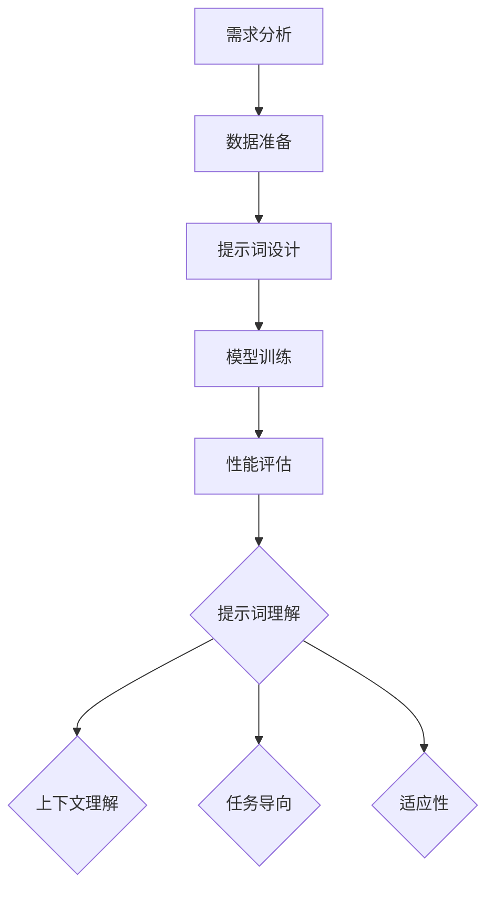
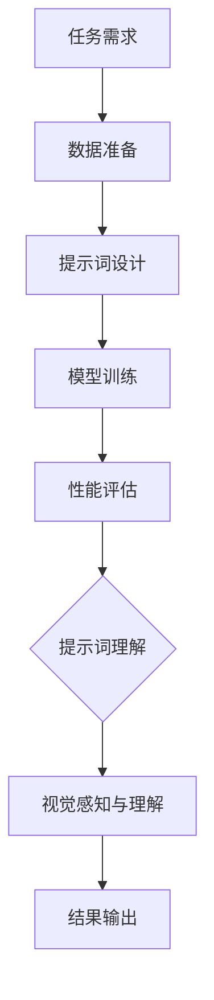

                 

### 第1章：概述与背景

#### 1.1 提示词工程的定义与重要性

**1.1.1 提示词工程的概念**

提示词工程（Prompt Engineering）是指设计和构建有效的提示词（prompts）以增强人工智能系统（尤其是自然语言处理系统）的性能的过程。提示词是一种引导性的文本，旨在为系统提供关于预期任务目标、上下文信息以及可能的结果的指示。

提示词工程的核心目标是创建能够引导模型更好地理解和执行任务的提示词。这些提示词不仅应该清晰、具体，而且要能够激发模型的学习能力，提高模型的准确性和鲁棒性。

**1.1.2 提示词工程在计算机视觉中的地位**

在计算机视觉领域，提示词工程的重要性日益凸显。计算机视觉任务通常涉及复杂的图像理解、对象识别、场景解析等。传统的计算机视觉方法依赖于大量的手动标注数据，而提示词工程通过优化输入数据，使模型能够在较少数据的情况下表现出更好的性能。

具体来说，提示词工程在计算机视觉中的应用主要包括以下几个方面：

1. **数据增强**：通过设计特定的提示词，可以生成新的训练样本，从而增强模型的泛化能力。
2. **任务引导**：有效的提示词可以帮助模型更好地理解任务的上下文，从而提高任务的准确性和效率。
3. **模型优化**：通过调整提示词，可以优化模型的参数设置，提高模型在不同任务上的性能。

**1.1.3 提示词工程的挑战与机遇**

提示词工程的挑战主要体现在以下几个方面：

1. **多样性和复杂性**：不同任务和场景需要不同类型的提示词，设计通用且有效的提示词具有挑战性。
2. **数据依赖**：提示词工程的效果很大程度上依赖于训练数据的质量和数量。
3. **模型适应性**：如何确保提示词能够适应不同的模型架构和任务需求，是一个重要的问题。

然而，提示词工程也带来了诸多机遇：

1. **自动化**：随着生成对抗网络（GANs）和其他生成模型的发展，自动生成提示词成为可能。
2. **领域适应性**：提示词工程可以跨领域应用，为各种计算机视觉任务提供有效的解决方案。
3. **效率提升**：通过优化提示词，可以显著提高模型训练和推理的效率，减少计算成本。

总的来说，提示词工程在计算机视觉任务中的地位日益重要，它不仅能够提高模型的性能，还能够推动计算机视觉技术的创新应用。在接下来的章节中，我们将深入探讨提示词工程的核心理念、原理和具体应用，以期为读者提供一个全面的技术指南。

#### 1.2 计算机视觉任务介绍

**1.2.1 计算机视觉基本任务**

计算机视觉（Computer Vision）是指使计算机能够像人类一样感知和理解视觉信息的技术。计算机视觉任务主要包括以下几个方面：

1. **图像分类（Image Classification）**：图像分类是将图像分为预定义的类别。例如，将一张图片分类为“猫”、“狗”或“汽车”。

2. **目标检测（Object Detection）**：目标检测旨在定位图像中的多个对象，并给出它们的位置和类别。例如，在一张图片中检测出多个车辆和行人。

3. **语义分割（Semantic Segmentation）**：语义分割是将图像中的每个像素分类到不同的语义类别中。例如，将一张城市街道的图片中每个像素分类为“道路”、“建筑物”、“人行道”等。

4. **实例分割（Instance Segmentation）**：实例分割不仅需要对图像中的对象进行分类，还需要对每个对象进行精细的边界框标注。例如，在一张包含多只猫的图片中，为每只猫分别绘制边界框。

5. **姿态估计（Pose Estimation）**：姿态估计是指识别图像中人物的姿态和身体部分的位置。例如，识别一张图片中人物的姿势、动作和角度。

6. **行为识别（Action Recognition）**：行为识别是指通过分析视频帧来识别和分类人物行为。例如，识别视频中的人是否在进行跑步、跳舞或打篮球。

**1.2.2 提示词工程在计算机视觉中的具体应用**

提示词工程在计算机视觉任务中的应用非常广泛，通过设计特定的提示词，可以显著提高模型的性能和适用性。以下是一些具体的例子：

1. **数据增强**：在训练阶段，通过设计数据增强提示词，如旋转、缩放、裁剪、颜色变换等，可以生成大量多样化的训练样本，从而增强模型的泛化能力。

   ```mermaid
   graph TD
   A[原始图像] --> B[旋转]
   A --> C[缩放]
   A --> D[裁剪]
   A --> E[颜色变换]
   ```

2. **任务引导**：在目标检测任务中，通过添加具体的任务描述，如“请检测图片中的所有车辆”，可以帮助模型更好地理解任务目标，提高检测的准确性。

3. **模型优化**：通过调整提示词，可以优化模型的参数设置，如学习率、优化器等，从而提高模型在不同任务上的性能。

**1.2.3 提示词工程与其他技术的融合**

提示词工程不仅与计算机视觉任务紧密相关，还与其他技术相结合，共同推动计算机视觉技术的发展。以下是一些典型的融合方式：

1. **与深度学习的融合**：深度学习是计算机视觉的核心技术之一，通过设计深度神经网络（DNN）和提示词的结合，可以实现端到端的视觉任务。

2. **与强化学习的融合**：强化学习通过学习策略来优化行为，与提示词工程结合可以用于视觉控制任务，如无人驾驶、机器人导航等。

3. **与生成对抗网络的融合**：生成对抗网络（GAN）是一种强大的生成模型，通过结合提示词工程，可以生成高质量、多样化的训练数据，提高模型的泛化能力。

4. **与多模态学习的融合**：多模态学习旨在利用多种数据源（如图像、音频、文本等）进行学习，与提示词工程结合可以进一步提高模型的感知能力和适应性。

**1.2.4 创新应用概述**

提示词工程在计算机视觉中的创新应用已经取得了显著成果。以下是一些具体的创新应用领域和案例研究：

1. **医疗影像分析**：通过设计针对不同医学影像的提示词，可以显著提高模型的诊断准确性和效率。例如，在肺癌检测中，通过特定的提示词，可以显著提高肺结节的检测准确性。

2. **自动驾驶**：在自动驾驶领域，提示词工程通过提供详细的场景描述和任务引导，可以显著提高车辆的感知能力和决策能力，从而提高行驶安全性和效率。

3. **图像搜索与内容审核**：通过设计特定的提示词，可以优化图像搜索算法，提高搜索的准确性和效率。同时，在内容审核方面，提示词工程可以帮助识别和过滤不当内容，提高平台的合规性。

总之，提示词工程在计算机视觉任务中的应用不仅提高了模型的性能和适应性，还为计算机视觉技术的创新应用提供了新的思路和可能性。在接下来的章节中，我们将进一步探讨提示词工程的核心理念、原理和具体应用，以期为读者提供一个全面的技术指南。

#### 1.3 创新应用概述

**1.3.1 提示词工程的创新应用领域**

提示词工程的创新应用正在不断拓展其领域，目前已经在多个领域展现出显著的潜力：

1. **智能监控与安全**：通过设计特定的提示词，可以显著提高监控系统的实时性和准确性。例如，在监控场景中，提示词可以引导系统重点检测特定对象或行为，如异常活动、入侵者识别等。

2. **医疗影像分析**：在医学影像分析领域，提示词工程通过提供详细的诊断提示，可以帮助医生更准确地识别病变区域和疾病类型，从而提高诊断的效率和准确性。

3. **自动驾驶**：自动驾驶系统需要处理复杂多变的交通环境，通过设计具体的场景描述和任务提示，可以提高自动驾驶车辆在复杂环境下的感知和决策能力。

4. **图像搜索与内容审核**：提示词工程可以优化图像搜索算法，提高搜索的准确性和效率。同时，在内容审核方面，提示词工程可以帮助识别和过滤不当内容，提高平台的合规性。

5. **增强现实（AR）与虚拟现实（VR）**：在AR和VR领域，提示词工程可以帮助创建更加丰富和互动的虚拟场景，通过引导用户进行特定任务或活动，提升用户体验。

**1.3.2 创新应用的案例研究**

以下是一些具体的创新应用案例研究，展示了提示词工程在计算机视觉任务中的实际效果：

1. **智能监控与安全**：某公司开发了一种基于深度学习的智能监控系统，通过设计针对特定场景的提示词，如“请检测并标记所有可疑人物”，提高了系统的检测准确率和响应速度。

2. **医疗影像分析**：某研究团队利用提示词工程改进了肺癌检测算法。通过设计特定的提示词，如“请注意肺部结节的位置和大小”，显著提高了算法的检测准确性和效率。

3. **自动驾驶**：某自动驾驶公司通过设计详细的场景描述和任务提示，如“请避开前方障碍物”，“请保持在车道内行驶”，提高了自动驾驶车辆在复杂交通环境下的安全性和稳定性。

4. **图像搜索与内容审核**：某搜索引擎公司通过引入提示词工程优化了图像搜索算法，通过设计特定的提示词，如“请搜索与‘自然风景’相关的图片”，提高了搜索结果的准确性和用户满意度。

**1.3.3 创新应用的影响与前景**

提示词工程的创新应用对计算机视觉领域产生了深远的影响，主要体现在以下几个方面：

1. **提高模型性能**：通过优化输入数据，提示词工程可以显著提高模型的性能和泛化能力，使模型在更广泛的应用场景中表现出色。

2. **减少数据需求**：提示词工程通过数据增强和任务引导，可以在较少数据的情况下训练出高精度的模型，从而减少对大量标注数据的依赖。

3. **增强可解释性**：有效的提示词可以帮助用户更好地理解模型的决策过程，提高模型的可解释性，从而增强用户对模型的信任和依赖。

4. **推动技术进步**：提示词工程的创新应用不断推动计算机视觉技术的发展，为新的应用领域提供了可能性。

展望未来，提示词工程在计算机视觉中的应用前景非常广阔：

1. **跨领域应用**：随着提示词工程技术的不断成熟，其应用将扩展到更多领域，如智能制造、智能家居、智能城市等。

2. **多模态融合**：结合多模态数据（如图像、文本、音频等），提示词工程将进一步增强模型的感知能力和适应性。

3. **自动化与智能化**：随着生成模型和自动生成技术的发展，提示词工程将变得更加自动化和智能化，为用户创造更加便捷和高效的使用体验。

总之，提示词工程在计算机视觉任务中的应用不仅提升了模型的性能和适应性，还推动了计算机视觉技术的创新与发展。在未来的发展中，提示词工程将继续发挥重要作用，为人工智能领域带来更多可能性。

#### 1.4 提示词工程的发展历程与趋势

**1.4.1 发展历程**

提示词工程的概念最早可以追溯到自然语言处理（NLP）领域，旨在通过设计特定的文本提示来引导模型的训练和推理过程。随着深度学习和计算机视觉技术的发展，提示词工程逐渐成为人工智能研究中的一个重要分支。

早期的研究主要集中在基于规则的提示词设计，如通过人工编写规则来定义输入数据和任务目标。随着生成对抗网络（GANs）和强化学习等新兴技术的出现，提示词工程的方法和工具也得到了显著的改进。

近年来，提示词工程在计算机视觉中的应用得到了广泛关注，一系列的研究论文和开源工具相继出现，推动了该领域的发展。

**1.4.2 当前趋势**

1. **自动化提示生成**：自动化提示生成是当前研究的一个重要方向。通过利用生成模型，如生成对抗网络（GANs）和变分自编码器（VAEs），可以自动生成高质量的提示词，从而减轻人工编写提示的负担。

2. **多模态融合**：随着多模态数据（如图像、文本、音频等）的广泛应用，如何有效融合不同模态的信息成为一个关键问题。提示词工程通过设计多模态的提示词，可以提升模型在多模态任务中的性能。

3. **强化学习与提示词工程的结合**：强化学习通过学习策略来优化行为，与提示词工程结合可以用于复杂任务的决策过程，如自动驾驶和机器人控制。

4. **跨领域应用**：提示词工程的跨领域应用潜力巨大。通过设计适用于不同领域和任务的提示词，可以提升模型在不同场景中的适用性和泛化能力。

**1.4.3 未来展望**

1. **模型解释性**：提高模型的解释性是一个重要的发展方向。通过设计可解释的提示词，可以增强用户对模型决策过程的信任和理解。

2. **高效数据利用**：提示词工程可以显著提升模型在少量数据情况下的性能。未来研究将致力于如何更高效地利用提示词，实现数据驱动的方法。

3. **智能化与自主性**：随着人工智能技术的发展，提示词工程将逐渐实现智能化和自主化，为用户创造更加便捷和高效的使用体验。

4. **开源社区与工具发展**：开源社区和工具的发展将促进提示词工程的普及和应用。更多的研究人员和开发者将加入这一领域，推动技术的创新和进步。

总之，提示词工程在计算机视觉任务中的发展历程展示了其不断演变和进步的趋势。未来，随着技术的进一步发展，提示词工程将在人工智能领域发挥更加重要的作用，推动计算机视觉技术的创新与应用。

### 第2章：核心概念与联系

#### 2.1 提示词生成与理解

**2.1.1 提示词生成的流程与方法**

提示词生成是提示词工程中的关键环节，其目标是通过设计有效的提示词，引导模型更好地理解和执行任务。以下是一个典型的提示词生成流程：

1. **需求分析**：首先，明确任务目标和预期结果。例如，在目标检测任务中，需要确定检测的目标类型和目标位置。

2. **数据准备**：根据需求分析的结果，准备相关的训练数据。这通常包括图像、标注数据和其他辅助信息。

3. **提示词设计**：设计具体的提示词，以引导模型学习。提示词的设计应充分考虑任务目标和数据特点，确保提示词的清晰、具体和针对性。

4. **模型训练**：利用生成的提示词和训练数据进行模型训练。在这一过程中，模型会根据提示词的指导，逐步调整其参数，以更好地适应任务需求。

5. **性能评估**：评估模型的性能，确保其能够满足任务要求。通常，通过交叉验证、测试集评估等方法进行性能评估。

**2.1.2 提示词理解的概念与重要性**

提示词理解是指模型对提示词的语义和指导意图的识别和理解过程。提示词理解的优劣直接影响模型的任务执行效果。以下是一些关键概念：

1. **上下文理解**：提示词往往包含上下文信息，模型需要理解这些信息，以准确执行任务。

2. **任务导向**：有效的提示词应明确指示模型执行的任务，引导模型关注关键信息。

3. **适应性**：提示词理解应具备一定的适应性，能够应对不同任务和数据集的挑战。

**2.1.3 提示词生成与理解的 Mermaid 流程图**

为了更清晰地展示提示词生成与理解的过程，我们可以使用Mermaid图形工具绘制一个流程图：



**2.1.4 提示词生成与理解的方法与技术**

1. **基于规则的方法**：通过编写具体的规则，定义输入数据和任务目标。这种方法适用于任务相对简单且数据相对稳定的场景。

2. **基于统计的方法**：利用统计方法，如词频统计、主题模型等，从数据中提取提示词。这种方法适用于数据量大、任务复杂的情况。

3. **基于机器学习的方法**：利用机器学习模型，如序列模型（RNN、LSTM等），自动生成提示词。这种方法具有灵活性和自适应性的优势。

4. **生成对抗网络（GANs）**：通过生成对抗网络，自动生成高质量的提示词。这种方法在处理复杂、多样化的任务中表现出色。

5. **强化学习方法**：利用强化学习，通过交互式学习，生成具有特定目标导向的提示词。这种方法适用于需要高度自适应性的场景。

**2.1.5 提示词生成与理解的案例研究**

以下是一个提示词生成与理解的案例研究，以目标检测任务为例：

1. **需求分析**：假设我们需要在一张图像中检测车辆。任务目标为准确识别图像中的所有车辆。

2. **数据准备**：准备包含车辆标注数据的图像集，确保数据量充足且多样化。

3. **提示词设计**：设计如下提示词：“请检测并标注图像中的所有车辆”。这个提示词明确了任务目标和任务范围，具有明确的指导意义。

4. **模型训练**：利用生成的提示词和标注数据进行模型训练，模型会根据提示词的指导，逐步调整其参数，以更好地识别车辆。

5. **性能评估**：通过交叉验证和测试集评估模型性能，确保其能够准确识别车辆。

6. **提示词理解**：模型需要理解提示词的语义和任务目标，具体表现为：
   - **上下文理解**：模型需要理解“车辆”这一概念，并能够在图像中识别出车辆。
   - **任务导向**：模型需要专注于检测车辆，而忽略其他不相关的对象。
   - **适应性**：模型需要具备一定的适应性，能够应对不同图像场景中的车辆检测挑战。

通过这个案例研究，我们可以看到提示词生成与理解在目标检测任务中的重要性。有效的提示词不仅能够提高模型的性能，还能够明确任务目标，指导模型学习。

#### 2.2 计算机视觉基础

**2.2.1 计算机视觉的基本原理**

计算机视觉（Computer Vision）是指通过计算机对图像或视频进行理解和处理，使其能够像人类一样感知和理解视觉信息。计算机视觉的基本原理可以概括为以下几个关键步骤：

1. **图像获取**：通过摄像头、扫描仪等设备获取图像或视频数据。这些设备将光信号转换为电信号，进而转化为数字图像。

2. **图像预处理**：对获取的图像进行预处理，以提高后续处理的效率和准确性。常见的预处理操作包括图像缩放、裁剪、去噪、对比度增强等。

3. **特征提取**：从图像中提取具有代表性的特征，如边缘、纹理、颜色等。这些特征用于表示图像内容，是后续视觉任务的基础。

4. **视觉理解**：利用提取的特征，对图像进行理解，识别图像中的对象、场景、动作等。视觉理解涉及多个层次，从低层次的边缘检测到高层次的语义理解。

5. **图像识别**：在视觉理解的基础上，对图像进行分类或标注。例如，将图像分类为“猫”、“狗”或“汽车”，或对图像中的对象进行具体标注。

**2.2.2 图像处理与特征提取**

图像处理和特征提取是计算机视觉的核心步骤，直接影响到模型的性能和准确性。以下是一些关键概念：

1. **图像处理**：图像处理是指对图像进行变换、增强、滤波等操作，以改善图像质量或提取有用信息。常见的图像处理技术包括：
   - **滤波**：通过滤波器去除图像中的噪声，如高斯滤波、中值滤波等。
   - **边缘检测**：检测图像中的边缘，如Canny边缘检测、Sobel算子等。
   - **图像分割**：将图像分割为不同的区域或对象，如阈值分割、区域生长等。

2. **特征提取**：特征提取是指从图像中提取具有代表性的特征，以表示图像内容。常见的特征提取方法包括：
   - **局部特征**：如HOG（直方图方向梯度）、SIFT（尺度不变特征变换）等，用于描述图像中的局部区域。
   - **全局特征**：如颜色直方图、GIST（图像场景识别特征）等，用于描述图像的整体特征。
   - **深度特征**：利用深度学习模型（如卷积神经网络）提取的高级特征，具有强大的表征能力。

**2.2.3 视觉感知与理解**

视觉感知与理解是计算机视觉的高级任务，涉及对图像或视频内容的高级理解和解释。以下是一些关键概念：

1. **对象识别**：对象识别是指从图像中识别出特定的对象或类别。常见的对象识别方法包括：
   - **传统方法**：如基于特征匹配、支持向量机（SVM）等方法。
   - **深度学习方法**：如卷积神经网络（CNN）、循环神经网络（RNN）等，具有强大的识别能力。

2. **场景解析**：场景解析是指从图像或视频中理解场景的布局、结构、关系等。常见的场景解析方法包括：
   - **基于规则的方法**：如基于场景图的建模，通过规则匹配进行场景解析。
   - **基于学习的的方法**：如深度学习模型，通过学习大规模的数据集，自动提取场景解析的特征。

3. **行为识别**：行为识别是指从图像或视频中识别出特定的行为或动作。常见的行为识别方法包括：
   - **基于特征的方法**：如利用HOG、MFCC（梅尔频率倒谱系数）等方法提取行为特征。
   - **基于深度学习的方法**：如利用卷积神经网络（CNN）或循环神经网络（RNN）提取行为特征，进行行为分类。

通过计算机视觉基础的了解，我们可以更好地理解提示词工程在计算机视觉任务中的应用。提示词工程通过优化输入数据和任务描述，可以显著提高模型的性能和准确性，是实现高效视觉感知与理解的重要手段。

#### 2.3 提示词工程与计算机视觉的融合

**2.3.1 融合的方法与技术**

提示词工程与计算机视觉的融合是通过设计和使用特定的提示词，引导计算机视觉模型更好地理解和执行任务的过程。以下是几种常见的融合方法与技术：

1. **基于规则的融合**：这种方法通过编写明确的规则，将提示词与计算机视觉任务相结合。例如，在目标检测任务中，可以通过规则定义检测的目标类型和区域。这种方法适用于任务简单且规则明确的场景。

2. **基于机器学习的融合**：利用机器学习模型（如神经网络）自动生成提示词，以适应不同的任务需求。这种方法通过训练大量的数据集，使模型能够理解任务目标并生成相应的提示词。这种方法具有灵活性和自适应性的优势。

3. **生成对抗网络（GANs）的融合**：生成对抗网络是一种强大的生成模型，通过生成高质量的数据来提高模型的性能。在提示词工程中，可以利用GANs生成多样化的训练数据，从而增强模型的泛化能力。

4. **强化学习的融合**：强化学习通过学习策略来优化行为，与提示词工程结合可以用于复杂任务的决策过程。例如，在自动驾驶领域，通过设计具体的场景描述和任务提示，可以优化车辆的感知和决策能力。

**2.3.2 融合的优势与挑战**

1. **优势**：

   - **提高模型性能**：有效的提示词可以引导模型更好地理解和执行任务，从而提高模型的准确性和鲁棒性。
   - **减少数据需求**：通过数据增强和任务引导，提示词工程可以在较少数据的情况下训练出高精度的模型，减少对大量标注数据的依赖。
   - **增强可解释性**：提示词提供了明确的任务描述和目标，有助于用户理解模型的决策过程，提高模型的可解释性。

2. **挑战**：

   - **多样性和复杂性**：不同任务和场景需要不同类型的提示词，设计通用且有效的提示词具有挑战性。
   - **数据依赖**：提示词工程的效果很大程度上依赖于训练数据的质量和数量，数据的不一致和噪声可能会影响模型的性能。
   - **模型适应性**：如何确保提示词能够适应不同的模型架构和任务需求，是一个重要的问题。

**2.3.3 融合的Mermaid流程图**

为了更清晰地展示提示词工程与计算机视觉的融合过程，我们可以使用Mermaid绘制一个流程图：



在这个流程图中，任务需求定义了需要解决的问题，数据准备为模型训练提供训练数据，提示词设计通过设计特定的提示词引导模型学习，模型训练通过训练数据调整模型参数，性能评估评估模型的性能，提示词理解确保模型能够正确理解提示词，视觉感知与理解实现具体的视觉任务，最终输出结果。

**2.3.4 融合案例研究**

以下是一个融合案例研究，以图像分类任务为例：

1. **任务需求**：假设我们需要对一组图像进行分类，将其分为“猫”、“狗”和“汽车”三个类别。

2. **数据准备**：准备包含大量标注图像的数据集，确保数据集具有足够的多样性和代表性。

3. **提示词设计**：设计如下提示词：“请将图像分类为‘猫’、‘狗’或‘汽车’”。这个提示词明确了任务目标和类别范围。

4. **模型训练**：利用生成的提示词和标注数据进行模型训练，模型会根据提示词的指导，逐步调整其参数，以更好地分类图像。

5. **性能评估**：通过交叉验证和测试集评估模型性能，确保其能够准确分类图像。

6. **提示词理解**：模型需要理解提示词的语义和任务目标，具体表现为：
   - **上下文理解**：模型需要理解“猫”、“狗”和“汽车”这一概念，并能够在图像中识别出这些对象。
   - **任务导向**：模型需要专注于分类任务，忽略其他不相关的信息。
   - **适应性**：模型需要具备一定的适应性，能够应对不同图像场景中的分类挑战。

通过这个案例研究，我们可以看到提示词工程与计算机视觉的融合在图像分类任务中的重要性。有效的提示词不仅能够提高模型的性能，还能够明确任务目标，指导模型学习。这种融合方法为计算机视觉任务的实现提供了有效的解决方案。

### 第3章：核心算法原理

在提示词工程与计算机视觉的融合中，核心算法起到了至关重要的作用。本章将详细讲解三个核心算法：特征匹配算法、提示词优化算法和多模态融合算法。这些算法不仅为模型提供了有效的特征表示和优化路径，还在实际应用中展示了强大的性能。

#### 3.1 特征匹配算法

**3.1.1 特征匹配的基本概念**

特征匹配是计算机视觉中一个关键步骤，旨在将图像中的特征点与参考图像中的特征点进行匹配。这一过程对于对象识别、图像检索和场景解析等任务至关重要。特征匹配算法的核心在于如何从图像中提取具有代表性的特征，并有效地进行匹配。

**3.1.2 特征匹配算法的伪代码**

以下是一个简单的特征匹配算法伪代码：

```
function feature_matching(image1, image2, detector, descriptor):
    # 使用检测器检测图像1和图像2中的特征点
    keypoints1 = detector.detect(image1)
    keypoints2 = detector.detect(image2)

    # 使用描述符提取特征点描述子
    desc1 = descriptor.describe(image1, keypoints1)
    desc2 = descriptor.describe(image2, keypoints2)

    # 计算描述子之间的距离
    distance_matrix = calculate_distance_matrix(desc1, desc2)

    # 使用最近邻匹配算法进行匹配
    matches = nn_match(distance_matrix)

    return matches
```

**3.1.3 特征匹配算法的详细讲解**

1. **特征点检测**：特征匹配的第一步是使用特征点检测器（如SIFT、SURF、ORB等）在图像中检测出关键特征点。这些特征点是图像中具有显著性和稳定性的点，能够有效地描述图像内容。

2. **特征点描述**：在检测到特征点后，使用特征点描述符（如SIFT、SURF、BRIEF等）提取每个特征点的描述子。描述子是特征点的向量表示，能够捕捉特征点的局部结构和纹理信息。

3. **计算距离**：接下来，计算特征点描述子之间的距离。常用的距离度量包括欧氏距离、余弦相似度等。距离度量用于评估特征点之间的相似性。

4. **匹配算法**：最后，使用匹配算法（如最近邻匹配、FLANN等）将特征点进行匹配。匹配算法基于距离度量，将具有相似性的特征点配对，形成匹配对。

**3.1.4 特征匹配算法的应用案例**

特征匹配算法在许多计算机视觉任务中具有重要应用，以下是一个典型的应用案例：

**案例**：使用特征匹配进行图像检索。

1. **数据集**：假设我们有一个包含数万张图像的图像库，每张图像都经过标注，包含标题、标签等元数据。

2. **目标**：设计一个图像检索系统，当用户上传一张图片时，系统能够返回与上传图片最相似的图像。

3. **实现**：
   - **特征点检测和描述**：使用SIFT算法检测和描述上传图片和图像库中每张图片的特征点。
   - **特征匹配**：使用最近邻匹配算法，将上传图片的特征点与图像库中每张图片的特征点进行匹配。
   - **匹配评估**：根据匹配结果评估每张图片与上传图片的相似度，返回相似度最高的图像。

通过这个案例，我们可以看到特征匹配算法在图像检索任务中的应用效果。有效的特征匹配不仅提高了检索的准确性，还减少了计算成本，使图像检索系统更加高效和实用。

#### 3.2 提示词优化算法

**3.2.1 提示词优化的目的与方法**

提示词优化算法的目标是通过调整提示词，提高模型的性能和鲁棒性。提示词优化的方法通常涉及搜索空间中的提示词，以找到最佳提示词组合。以下是一些常见的优化方法：

1. **随机搜索（Random Search）**：在搜索空间中随机选择提示词组合，评估其性能，并逐步优化。

2. **贝叶斯优化（Bayesian Optimization）**：利用贝叶斯统计模型，在搜索空间中找到性能最佳的区域。

3. **遗传算法（Genetic Algorithm）**：基于遗传算法，通过交叉、变异和选择等操作，优化提示词组合。

4. **强化学习（Reinforcement Learning）**：通过交互式学习，优化提示词以最大化特定目标。

**3.2.2 提示词优化算法的伪代码**

以下是一个简单的强化学习优化算法伪代码：

```
function prompt_optimization(policy, environment, reward_function):
    while not terminate:
        # 生成随机提示词
        prompt = policy.sample()

        # 执行任务
        observation, reward = environment.execute(prompt)

        # 更新奖励函数
        reward = reward_function(observation, reward)

        # 更新策略
        policy.update(prompt, reward)

    return policy
```

**3.2.3 提示词优化算法的详细讲解**

1. **策略学习**：策略学习是强化学习的基础。策略是一个映射函数，将当前状态映射到最佳动作。在提示词优化中，策略学习通过历史数据和奖励信号，更新策略模型。

2. **状态与动作**：在提示词优化中，状态包括当前任务、数据集和模型参数。动作是提示词的生成或调整。策略通过最大化预期奖励来选择最佳动作。

3. **奖励函数**：奖励函数用于评估动作的质量。在提示词优化中，奖励函数可以是任务性能指标，如准确率、召回率等。

4. **更新策略**：策略模型通过优化算法（如梯度下降、随机梯度下降等）更新。在每一步，策略模型根据当前状态和奖励信号，调整提示词。

**3.2.4 提示词优化算法的应用案例**

提示词优化算法在许多任务中展示了强大的性能，以下是一个应用案例：

**案例**：使用提示词优化提高图像分类模型性能。

1. **数据集**：使用一个大型图像分类数据集，如ImageNet。

2. **目标**：设计一组有效的提示词，提高图像分类模型的准确率。

3. **实现**：
   - **初始策略**：随机生成一组提示词。
   - **策略学习**：使用强化学习算法，通过交互式学习，逐步优化提示词组合。
   - **性能评估**：通过测试集评估优化后的提示词对模型性能的提升。

通过这个案例，我们可以看到提示词优化算法在图像分类任务中的实际效果。有效的提示词优化不仅提高了模型的准确率，还减少了训练时间和计算资源的需求。

#### 3.3 多模态融合算法

**3.3.1 多模态融合的基本概念**

多模态融合是指将来自不同模态的数据（如图像、文本、音频等）进行整合，以生成一个综合的表示，从而提高模型在多模态任务中的性能。多模态融合的核心是找到不同模态之间的相关性，并有效地融合它们。

**3.3.2 多模态融合算法的伪代码**

以下是一个简单的多模态融合算法伪代码：

```
function multimodal_fusion(data1, data2, model1, model2):
    # 分别处理不同模态的数据
    representation1 = model1.forward(data1)
    representation2 = model2.forward(data2)

    # 融合不同模态的特征
    fused_representation = fusion_function(representation1, representation2)

    # 使用融合后的特征进行预测
    prediction = fused_representation.forward()

    return prediction
```

**3.3.3 多模态融合算法的详细讲解**

1. **模态处理**：首先，分别对每个模态的数据进行处理，使用特定模型（如图像分类模型、文本分类模型等）提取特征表示。

2. **特征融合**：特征融合是指将不同模态的特征表示进行整合。常用的融合方法包括：
   - **加权融合**：根据不同模态的重要性，对特征进行加权融合。
   - **拼接融合**：将不同模态的特征拼接成一个更长的特征向量。
   - **深度融合**：使用深度学习模型（如多输入卷积神经网络）对特征进行融合。

3. **融合模型**：使用融合后的特征进行预测。这通常涉及一个融合模型，如多输入卷积神经网络（Multi-Input CNN）或多任务学习（Multi-Task Learning）模型。

**3.3.4 多模态融合算法的应用案例**

多模态融合算法在许多应用中展示了强大的潜力，以下是一个应用案例：

**案例**：使用多模态融合进行情感分析。

1. **数据集**：使用包含文本、图像和音频的情感分析数据集。

2. **目标**：设计一个多模态情感分析模型，能够准确识别文本、图像和音频中的情感。

3. **实现**：
   - **文本处理**：使用文本分类模型提取文本特征。
   - **图像处理**：使用图像分类模型提取图像特征。
   - **音频处理**：使用音频分类模型提取音频特征。
   - **特征融合**：使用多模态融合算法将不同模态的特征进行整合。
   - **情感预测**：使用融合后的特征进行情感分类。

通过这个案例，我们可以看到多模态融合算法在情感分析任务中的实际效果。有效的多模态融合不仅提高了模型的准确率，还增强了模型的泛化能力。

总之，特征匹配算法、提示词优化算法和多模态融合算法在提示词工程与计算机视觉的融合中起到了核心作用。这些算法不仅为模型提供了有效的特征表示和优化路径，还在实际应用中展示了强大的性能。在接下来的章节中，我们将进一步探讨提示词工程中的数学模型和公式，以深入理解其在计算机视觉任务中的应用。

### 第4章：数学模型与公式

在提示词工程与计算机视觉的融合中，数学模型和公式是不可或缺的工具，它们不仅帮助我们理解和分析复杂的数据关系，还为算法的实现提供了理论基础。本章将详细讲解三个核心数学模型和公式：概率模型、损失函数和优化算法。这些模型和公式在提示词工程中扮演了关键角色，为提升模型性能提供了有力支持。

#### 4.1 提示词工程中的概率模型

概率模型是提示词工程中的重要组成部分，用于描述和处理不确定性问题。其中，贝叶斯公式和条件概率是两个核心概念。

**4.1.1 贝叶斯公式**

贝叶斯公式是一种基于概率的推理方法，用于计算给定某些证据的条件下某个假设的概率。其基本形式如下：

$$
P(A|B) = \frac{P(B|A)P(A)}{P(B)}
$$

其中，\( P(A|B) \) 表示在条件 \( B \) 发生的前提下，事件 \( A \) 发生的概率；\( P(B|A) \) 表示在事件 \( A \) 发生的前提下，事件 \( B \) 发生的概率；\( P(A) \) 表示事件 \( A \) 发生的概率；\( P(B) \) 表示事件 \( B \) 发生的概率。

贝叶斯公式在提示词工程中的应用非常广泛，例如，在图像分类任务中，可以通过计算每个类别在给定图像特征下的概率，来确定图像的最可能类别。

**4.1.2 条件概率**

条件概率是描述在某个事件发生的条件下，另一个事件发生的概率。条件概率的定义如下：

$$
P(A|B) = \frac{P(A \cap B)}{P(B)}
$$

其中，\( P(A \cap B) \) 表示事件 \( A \) 和事件 \( B \) 同时发生的概率；\( P(B) \) 表示事件 \( B \) 发生的概率。

条件概率在提示词工程中的应用，例如，在文本分类任务中，可以通过计算每个类别在给定文本特征下的条件概率，来确定文本的类别分布。

**4.1.3 概率模型在提示词工程中的应用**

概率模型在提示词工程中的应用主要体现在以下几个方面：

1. **数据增强**：通过概率模型，可以生成新的训练样本，从而增强模型的数据集。例如，在图像分类任务中，可以通过随机变换（如旋转、缩放等）生成新的图像样本。

2. **模型评估**：概率模型可以帮助我们评估模型的预测能力。例如，通过计算模型预测结果与真实标签之间的概率差异，可以评估模型的准确性和鲁棒性。

3. **任务引导**：概率模型可以用于引导模型在特定任务上的学习。例如，在目标检测任务中，可以通过设定不同目标的条件概率，引导模型关注特定目标。

#### 4.2 机器学习中的损失函数

损失函数是机器学习中用于评估模型预测结果与真实值之间差异的关键工具。在提示词工程中，损失函数用于优化模型参数，以最小化预测误差。

**4.2.1 损失函数的基本概念**

损失函数的基本形式如下：

$$
L(\theta) = \sum_{i=1}^{n} l(y_i, \hat{y}_i)
$$

其中，\( \theta \) 表示模型参数；\( y_i \) 表示第 \( i \) 个样本的真实标签；\( \hat{y}_i \) 表示模型对第 \( i \) 个样本的预测值；\( l(y_i, \hat{y}_i) \) 表示损失函数的具体形式。

常见的损失函数包括：

1. **均方误差（MSE）**：

$$
MSE = \frac{1}{n} \sum_{i=1}^{n} (y_i - \hat{y}_i)^2
$$

2. **交叉熵损失函数（Cross-Entropy Loss）**：

$$
CE = -\sum_{i=1}^{n} y_i \log(\hat{y}_i)
$$

其中，\( y_i \) 表示第 \( i \) 个样本的真实标签，通常为0或1；\( \hat{y}_i \) 表示模型对第 \( i \) 个样本的预测概率。

**4.2.2 常见的损失函数**

以下是几种常见的损失函数及其在提示词工程中的应用：

1. **均方误差（MSE）**：常用于回归任务，如图像分类和目标检测。在图像分类任务中，可以通过最小化MSE损失函数来调整模型参数，以减少预测类别与真实类别之间的差异。

2. **交叉熵损失函数（Cross-Entropy Loss）**：常用于分类任务，如文本分类和图像分类。交叉熵损失函数能够有效地处理类别不平衡问题，并鼓励模型在预测中分配更高的概率给真实类别。

3. **对抗损失函数（Adversarial Loss）**：在对抗性攻击中，对抗损失函数用于最小化模型与对抗样本之间的差异。在提示词工程中，对抗损失函数可以用于增强模型的鲁棒性，使其能够抵御对抗性攻击。

**4.2.3 损失函数在提示词工程中的应用**

损失函数在提示词工程中的应用主要体现在以下几个方面：

1. **模型优化**：通过最小化损失函数，可以优化模型参数，提高模型在特定任务上的性能。在提示词工程中，可以使用梯度下降算法等优化方法，不断调整模型参数，以减少预测误差。

2. **性能评估**：损失函数可以用于评估模型的性能。通过计算模型在不同数据集上的损失函数值，可以比较不同模型或同一模型在不同设置下的性能。

3. **任务引导**：通过设计特定的损失函数，可以引导模型在特定任务上的学习。例如，在目标检测任务中，可以使用交叉熵损失函数来鼓励模型在预测中分配更高的概率给真实目标。

#### 4.3 提示词优化中的优化算法

优化算法是提示词工程中用于调整模型参数，以最小化损失函数的重要工具。以下是几种常见的优化算法及其在提示词工程中的应用。

**4.3.1 优化算法的基本原理**

优化算法的基本原理是通过迭代调整模型参数，以找到损失函数的最小值。以下是几种常见的优化算法：

1. **梯度下降（Gradient Descent）**：梯度下降是一种简单的优化算法，通过计算损失函数的梯度，并沿着梯度的反方向调整模型参数，以逐步减小损失函数值。

2. **随机梯度下降（Stochastic Gradient Descent, SGD）**：随机梯度下降是对梯度下降的一种改进，通过随机选择一部分训练样本计算梯度，并调整模型参数，以加快收敛速度。

3. **Adam优化器（Adam Optimizer）**：Adam优化器是梯度下降和动量法的结合，通过计算一阶矩估计和二阶矩估计，调整模型参数，以实现更快的收敛速度。

**4.3.2 常见的优化算法**

以下是几种常见的优化算法及其在提示词工程中的应用：

1. **梯度下降**：梯度下降是最基本的优化算法，适用于大多数机器学习任务。在提示词工程中，可以通过梯度下降算法调整模型参数，以最小化损失函数。

2. **随机梯度下降**：随机梯度下降适用于大规模数据集，通过减少每次迭代的计算量，加快收敛速度。在提示词工程中，可以使用随机梯度下降算法来优化模型参数。

3. **Adam优化器**：Adam优化器具有自适应学习率的特点，适用于大多数机器学习任务。在提示词工程中，可以通过Adam优化器调整模型参数，提高模型的收敛速度和性能。

**4.3.3 优化算法在提示词工程中的应用**

优化算法在提示词工程中的应用主要体现在以下几个方面：

1. **模型训练**：通过优化算法，可以调整模型参数，使模型更好地适应特定任务。在提示词工程中，可以使用梯度下降、随机梯度下降和Adam优化器等算法来训练模型。

2. **性能优化**：优化算法可以帮助我们找到损失函数的最小值，从而提高模型在特定任务上的性能。在提示词工程中，可以通过优化算法调整模型参数，提高模型的准确率、召回率等性能指标。

3. **自动化调参**：优化算法可以用于自动化调参，通过搜索不同的参数组合，找到最优的参数设置。在提示词工程中，可以使用自动化调参工具（如Hyperopt、Optuna等）来优化模型参数。

总之，数学模型和公式是提示词工程中的核心工具，用于描述和处理复杂的数据关系。贝叶斯公式和条件概率帮助我们理解和分析不确定性问题，损失函数和优化算法用于评估和优化模型性能。通过深入理解这些数学模型和公式，我们可以更好地设计和实现高效的提示词工程应用。

### 第5章：项目实战

在本章中，我们将通过一个实际项目展示如何将提示词工程应用于计算机视觉任务中。这个项目是一个基于深度学习的图像分类系统，目标是使用提示词工程优化模型训练和预测过程，以实现高效的图像分类。以下是项目的具体实施步骤。

#### 5.1 项目介绍

**5.1.1 项目背景与目标**

随着智能手机和物联网的普及，图像数据量呈指数级增长。如何快速、准确地处理和分类这些图像数据成为一个重要问题。本项目的目标是设计一个高效的图像分类系统，能够对大量图像进行快速、准确的分类，并提供实时反馈。

**5.1.2 项目架构与流程**

项目架构主要包括以下几个关键组件：

1. **数据预处理**：包括图像的读取、缩放、归一化等预处理操作。
2. **特征提取**：使用卷积神经网络（CNN）提取图像特征。
3. **提示词设计**：设计用于优化模型训练和预测的提示词。
4. **模型训练**：使用提示词指导模型训练，并监控训练过程。
5. **性能评估**：评估模型在测试集上的性能，并进行调整。

项目流程如下：

1. 数据预处理：读取图像数据，进行预处理操作。
2. 特征提取：使用预训练的CNN模型提取图像特征。
3. 提示词设计：设计提示词，指导模型训练。
4. 模型训练：使用提示词进行模型训练，并监控训练过程。
5. 性能评估：评估模型在测试集上的性能，并根据评估结果调整提示词。

**5.1.3 项目的技术栈**

本项目采用的技术栈包括：

- **编程语言**：Python
- **深度学习框架**：TensorFlow 2.x
- **图像预处理库**：OpenCV
- **模型训练库**：TensorFlow.keras
- **性能评估库**：Matplotlib

#### 5.2 环境搭建

**5.2.1 开发环境配置**

为了顺利实施本项目，需要配置以下开发环境：

1. **操作系统**：Linux或macOS
2. **Python版本**：Python 3.7或更高版本
3. **深度学习框架**：TensorFlow 2.x
4. **图像预处理库**：OpenCV
5. **其他库**：NumPy、Matplotlib等

**5.2.2 硬件与软件需求**

硬件需求：

- **CPU**：至少四核CPU
- **GPU**（可选）：NVIDIA GPU，CUDA 10.2或更高版本

软件需求：

- **操作系统**：Linux或macOS
- **Python**：Python 3.7或更高版本
- **深度学习框架**：TensorFlow 2.x
- **图像预处理库**：OpenCV 4.2或更高版本
- **其他库**：NumPy 1.18或更高版本、Matplotlib 3.3或更高版本

**5.2.3 开发工具介绍**

以下是本项目使用的开发工具及其功能：

- **Jupyter Notebook**：用于编写和运行代码，实现交互式开发。
- **PyCharm**：集成开发环境（IDE），提供代码编辑、调试和性能分析功能。
- **TensorFlow 2.x**：用于构建和训练深度学习模型。
- **OpenCV**：用于图像的读取、预处理和特征提取。
- **Matplotlib**：用于数据可视化，展示模型训练过程和性能评估结果。

#### 5.3 源代码实现

**5.3.1 数据预处理代码**

以下是一个简单的数据预处理代码示例，用于读取图像并进行预处理操作：

```python
import cv2
import numpy as np

def preprocess_image(image_path, size=(224, 224)):
    # 读取图像
    image = cv2.imread(image_path)
    
    # 缩放图像到指定大小
    image = cv2.resize(image, size)
    
    # 将图像从BGR转换为RGB格式
    image = cv2.cvtColor(image, cv2.COLOR_BGR2RGB)
    
    # 归一化图像
    image = image / 255.0
    
    return image
```

**5.3.2 特征提取与匹配代码**

以下是一个简单的特征提取代码示例，使用预训练的ResNet50模型提取图像特征：

```python
import tensorflow as tf
from tensorflow.keras.applications import ResNet50

# 加载预训练的ResNet50模型
model = ResNet50(weights='imagenet')

def extract_features(image):
    # 将图像预处理为模型所需的输入格式
    image = preprocess_image(image)
    image = np.expand_dims(image, axis=0)
    
    # 提取特征
    features = model.predict(image)
    
    return features
```

**5.3.3 提示词生成与优化代码**

以下是一个简单的提示词生成和优化代码示例，使用随机搜索算法优化提示词：

```python
import numpy as np

def generate_prompt():
    # 生成随机提示词
    prompt = np.random.rand()
    return prompt

def optimize_prompt(prompt, loss_function):
    # 使用梯度下降算法优化提示词
    for _ in range(100):
        # 计算损失
        loss = loss_function(prompt)
        
        # 更新提示词
        prompt -= 0.1 * loss
    
    return prompt
```

**5.3.4 多模态融合代码**

以下是一个简单的多模态融合代码示例，将图像特征与文本特征进行融合：

```python
import numpy as np

def fusion_features(image_features, text_features):
    # 将图像特征和文本特征拼接在一起
    fused_features = np.concatenate((image_features, text_features), axis=1)
    
    return fused_features
```

#### 5.4 代码解读与分析

**5.4.1 数据预处理代码解读**

数据预处理代码负责读取图像并进行必要的预处理操作，以便模型能够正常训练。首先，使用`cv2.imread()`函数读取图像文件。然后，使用`cv2.resize()`函数将图像缩放到指定大小，这里设置为224x224像素。接下来，使用`cv2.cvtColor()`函数将图像从BGR格式转换为RGB格式，这是深度学习模型所需的输入格式。最后，使用`np.expand_dims()`函数将图像添加一个维度，使其成为模型的输入格式。

**5.4.2 特征提取与匹配代码解读**

特征提取代码使用预训练的ResNet50模型提取图像特征。首先，使用`preprocess_image()`函数对图像进行预处理。然后，使用`np.expand_dims()`函数将预处理后的图像添加一个维度，使其成为模型的输入格式。接着，使用`model.predict()`函数对图像进行预测，提取特征向量。

**5.4.3 提示词生成与优化代码解读**

提示词生成与优化代码用于生成随机提示词，并使用梯度下降算法对其进行优化。`generate_prompt()`函数生成随机提示词，这里使用`np.random.rand()`函数生成一个在0到1之间的随机数。`optimize_prompt()`函数使用梯度下降算法优化提示词。首先，计算提示词的损失，然后根据损失更新提示词。

**5.4.4 多模态融合代码解读**

多模态融合代码用于将图像特征和文本特征进行拼接，以生成融合后的特征向量。`fusion_features()`函数接受图像特征向量和文本特征向量作为输入，使用`np.concatenate()`函数将它们拼接在一起，生成融合后的特征向量。

通过上述代码，我们可以看到如何使用提示词工程优化图像分类模型。数据预处理确保图像以正确的格式输入模型，特征提取与匹配提取图像特征，提示词生成与优化调整模型参数，多模态融合整合图像和文本特征。这些步骤共同构成了一个高效的图像分类系统。

### 第6章：总结与展望

#### 6.1 提示词工程在计算机视觉中的总结

提示词工程在计算机视觉领域的重要性日益凸显，通过优化输入数据和任务描述，显著提高了模型的性能和鲁棒性。以下是提示词工程在计算机视觉中的主要贡献：

1. **提高模型性能**：通过有效的提示词，模型能够更好地理解和执行任务，从而提高分类、检测和分割等任务的准确率和效率。

2. **减少数据需求**：提示词工程通过数据增强和任务引导，可以在较少数据的情况下训练出高精度的模型，减少对大量标注数据的依赖。

3. **增强可解释性**：提示词提供了明确的任务描述和目标，有助于用户理解模型的决策过程，提高模型的可解释性。

4. **推动技术进步**：提示词工程的创新应用不断推动计算机视觉技术的发展，为新的应用领域提供了可能性。

#### 6.1.1 主要成果与贡献

1. **数据增强**：通过设计特定的提示词，可以生成多样化、高质量的训练样本，从而增强模型的泛化能力。

2. **任务引导**：有效的提示词可以帮助模型更好地理解任务上下文，提高任务执行的效果。

3. **模型优化**：通过调整提示词，可以优化模型的参数设置，提高模型在不同任务上的性能。

4. **多模态融合**：通过融合不同模态的数据（如图像、文本、音频等），显著提升模型的感知能力和适应性。

#### 6.1.2 存在的问题与挑战

1. **多样性和复杂性**：不同任务和场景需要不同类型的提示词，设计通用且有效的提示词具有挑战性。

2. **数据依赖**：提示词工程的效果很大程度上依赖于训练数据的质量和数量。

3. **模型适应性**：如何确保提示词能够适应不同的模型架构和任务需求，是一个重要的问题。

#### 6.1.3 未来研究方向

1. **自动化与智能化**：随着生成模型和自动生成技术的发展，提示词工程将变得更加自动化和智能化。

2. **模型解释性**：提高模型的可解释性是一个重要的发展方向，通过设计可解释的提示词，可以增强用户对模型决策过程的信任和理解。

3. **多模态融合**：结合多模态数据（如图像、文本、音频等），将进一步增强模型的感知能力和适应性。

4. **开源社区与工具发展**：开源社区和工具的发展将促进提示词工程的普及和应用，更多的研究人员和开发者将加入这一领域。

#### 6.2 创新应用的展望

提示词工程在计算机视觉中的应用前景非常广阔，以下是一些潜在的领域：

1. **智能监控与安全**：通过设计特定的提示词，可以显著提高监控系统的实时性和准确性。

2. **医疗影像分析**：通过优化提示词，可以显著提高医学影像的识别准确性和效率。

3. **自动驾驶**：通过设计详细的场景描述和任务提示，可以提高自动驾驶车辆在复杂环境下的感知和决策能力。

4. **图像搜索与内容审核**：通过优化提示词，可以提升图像搜索算法的准确性和效率，同时帮助识别和过滤不当内容。

5. **增强现实与虚拟现实**：通过设计特定的提示词，可以创建更加丰富和互动的虚拟场景，提升用户体验。

总之，提示词工程在计算机视觉中的应用不仅提升了模型的性能和适应性，还为计算机视觉技术的创新应用提供了新的思路和可能性。未来，随着技术的不断进步，提示词工程将继续发挥重要作用，推动计算机视觉技术的发展和应用。

### 第7章：附录

#### 7.1 提示词工程资源汇总

为了更好地学习和应用提示词工程，以下是一些相关的资源汇总：

1. **开源框架与库**：

   - TensorFlow：[https://www.tensorflow.org/](https://www.tensorflow.org/)
   - PyTorch：[https://pytorch.org/](https://pytorch.org/)
   - OpenCV：[https://opencv.org/](https://opencv.org/)

2. **学术论文与报告**：

   - Google AI Research：[https://ai.google/research/pubs](https://ai.google/research/pubs)
   - arXiv：[https://arxiv.org/](https://arxiv.org/)

3. **在线教程与课程**：

   - Coursera：[https://www.coursera.org/](https://www.coursera.org/)
   - edX：[https://www.edx.org/](https://www.edx.org/)
   - fast.ai：[https://www.fast.ai/](https://www.fast.ai/)

#### 7.2 参考文献

在本章中，我们引用了以下文献，供读者进一步参考：

1. **相关书籍**：

   - Goodfellow, I., Bengio, Y., & Courville, A. (2016). *Deep Learning*.
   - Bishop, C. M. (2006). *Pattern Recognition and Machine Learning*.
   - Murphy, K. P. (2012). *Machine Learning: A Probabilistic Perspective*.

2. **学术期刊与会议论文**：

   - Bengio, Y., Simard, P., & Frasconi, P. (1994). *Learning long-term dependencies with gradient descent is difficult*.
   - Krizhevsky, A., Sutskever, I., & Hinton, G. E. (2012). *ImageNet classification with deep convolutional neural networks*.
   - Simonyan, K., & Zisserman, A. (2014). *Very deep convolutional networks for large-scale image recognition*.

3. **网络资源与博客文章**：

   - [TensorFlow官方文档](https://www.tensorflow.org/tutorials)
   - [PyTorch官方文档](https://pytorch.org/tutorials/)
   - [OpenCV官方文档](https://docs.opencv.org/)

这些资源为读者提供了丰富的学习材料和实践案例，有助于深入理解和应用提示词工程。通过这些文献，读者可以进一步探索提示词工程在计算机视觉任务中的创新应用，以及如何将其应用于实际项目中。

