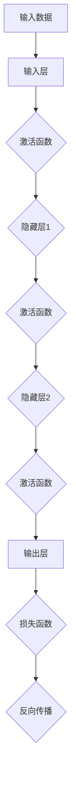
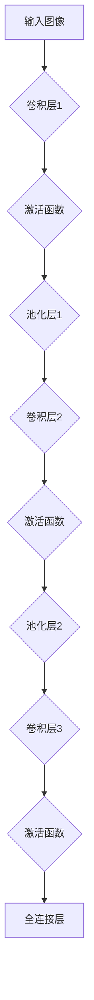
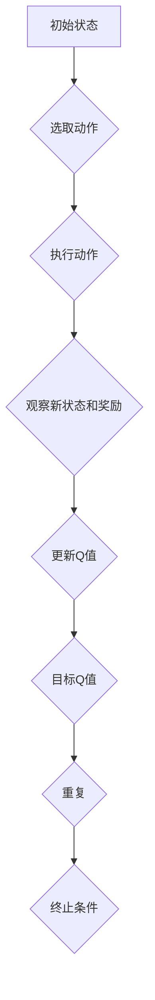
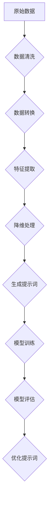

                 

### 引言

#### 1.1 研究背景与意义

人工智能（AI）作为一门前沿的交叉学科，已经在社会各个领域展现出其强大的影响力。从早期的专家系统到如今的深度学习，AI的研究与应用呈现出指数级增长。然而，随着AI技术的不断进步，我们也面临着诸多挑战。首先，AI模型的复杂性不断增加，传统的单一学科研究方法已难以满足当前的需求。其次，不同学科之间的壁垒依然存在，跨学科的研究往往缺乏有效的协调机制。

在这样的背景下，跨学科研究的重要性愈发凸显。跨学科研究不仅能够整合各领域的优势资源，还能够提供全新的视角和解决方案。然而，如何有效地进行跨学科研究，如何将不同领域的方法和知识融合到AI研究中，成为当前AI领域亟待解决的问题。

提示词工程作为一种新兴的研究方法，旨在通过优化AI模型中的提示词来提高跨学科研究的效率。提示词在AI模型训练和优化过程中扮演着至关重要的角色，通过对提示词进行精细设计和优化，可以有效提升模型的性能和泛化能力。提示词工程不仅涉及自然语言处理、图像识别、推荐系统等传统AI领域的知识，还涉及到心理学、社会学、经济学等多个领域的理论和实践。

本研究的目的在于深入探讨提示词工程在优化AI跨学科研究能力方面的作用。具体来说，我们将从基础理论、方法应用、优化策略和前沿研究等多个方面展开分析，旨在为AI跨学科研究提供一种新的思路和方法。

#### 1.2 提示词工程的概念与目标

提示词工程（Prompt Engineering）是指通过设计和优化提示词来提升AI模型的性能和泛化能力的一门技术。在AI模型训练过程中，提示词作为输入数据的一部分，对模型的训练效果有着直接影响。传统的AI模型训练主要依赖于大量的标注数据和预定的特征工程方法，而提示词工程则提供了一种更为灵活和高效的方式，通过精心的提示词设计，可以显著提升模型的性能。

提示词工程的目标主要包括以下几个方面：

1. **提高模型性能**：通过优化提示词，可以使AI模型在训练过程中更加精准地捕捉到数据的特征，从而提高模型的预测准确率和泛化能力。

2. **降低数据依赖**：提示词工程能够减少对大规模标注数据的依赖，通过设计有效的提示词，模型可以更好地处理未见过或少见的样本。

3. **增强可解释性**：优化后的提示词可以帮助揭示模型内部的工作机制，增强模型的可解释性，便于研究人员理解模型的决策过程。

4. **缩短开发周期**：通过提示词工程，研究人员可以在较短时间内设计出高效的模型，从而缩短AI应用的研发周期。

5. **促进跨学科研究**：提示词工程不仅适用于单一领域的AI研究，还可以在跨学科研究中发挥重要作用，通过设计适应不同学科领域的提示词，实现不同领域知识的融合与协同。

#### 1.3 本书结构安排

本书共分为四个主要部分，各部分的主要内容概述如下：

1. **第一部分：基础理论与方法**  
   主要介绍AI跨学科研究的核心问题，包括跨学科研究的挑战、方法论框架以及提示词在AI研究中的应用。此外，还将讨论提示词工程的工具与技术，包括数据预处理、特征提取和降维技术，以及提示词生成算法。

2. **第二部分：AI模型与算法基础**  
   详细介绍神经网络、深度学习算法和强化学习算法的基本原理和实现方法。这部分内容将帮助读者建立扎实的AI理论基础，为后续的应用实践打下基础。

3. **第三部分：应用实践与优化**  
   通过具体的实践案例，展示提示词工程在自然语言处理、图像识别和推荐系统等领域的应用，并讨论提示词工程优化策略，包括提示词质量评估、自动优化算法和实时优化与反馈机制。

4. **第四部分：前沿探索与未来展望**  
   探讨提示词工程的前沿研究与应用，包括大规模预训练模型、量子计算和多模态数据等领域。同时，分析提示词工程的挑战与机遇，展望其未来发展。

通过本书的阅读，读者将能够全面了解提示词工程的理论和方法，掌握其在AI跨学科研究中的应用技巧，并能够根据实际需求设计出高效的AI模型。

#### 1.4 读者期望收获

本书旨在为读者提供全面而深入的提示词工程知识体系，帮助读者实现以下目标：

1. **掌握提示词工程的基本概念与原理**：通过详细的理论讲解和案例分析，读者将了解提示词工程的核心概念，包括提示词的定义、类型及其在AI模型训练和优化中的应用。

2. **理解AI跨学科研究的挑战与解决方案**：本书将深入探讨AI跨学科研究的核心问题，分析跨学科研究的挑战和方法论框架，并提供具体的解决方案，帮助读者应对复杂的跨学科研究任务。

3. **掌握提示词工程的工具与方法**：通过介绍提示词工程的工具和技术，包括数据预处理、特征提取、降维技术以及提示词生成算法，读者将能够熟练应用这些方法，提升AI模型的性能和泛化能力。

4. **实践提示词工程的应用**：本书将通过丰富的实践案例，展示提示词工程在自然语言处理、图像识别和推荐系统等领域的实际应用，帮助读者将理论知识转化为实践能力。

5. **探索提示词工程的前沿趋势**：本书将讨论提示词工程在大型预训练模型、量子计算和多模态数据等前沿领域的应用，为读者提供对未来发展趋势的洞察，助力其在AI领域的研究和开发。

总之，本书将为读者提供一个系统而全面的提示词工程知识体系，帮助其在AI跨学科研究中取得突破性的成果。

### AI跨学科研究的核心问题

#### 2.1 跨学科研究的挑战

跨学科研究在当前AI领域的重要性不言而喻，然而，跨学科研究并非易事。首先，不同学科之间存在着显著的差异。例如，计算机科学强调算法和数据结构，而生物学则注重实验和统计分析。这种差异导致了跨学科研究在方法和思维方式上的不一致，使得研究人员在整合不同领域的知识时面临巨大挑战。

其次，跨学科研究还面临着数据源和数据格式不一致的问题。不同领域的数据往往具有不同的特征和格式，例如，医学领域的数据可能是结构化的表格，而图像处理领域的数据则是非结构化的图像文件。这种数据不一致性不仅增加了数据处理的复杂性，还可能导致数据丢失或误解。

此外，跨学科研究还需要不同领域的专家进行合作。这往往意味着需要克服文化差异、沟通障碍和资源分配等问题。例如，计算机科学家可能更擅长算法和编程，而生物学家可能更擅长实验设计和数据分析。如何有效地整合这些不同领域的专长，实现知识的共享和协同创新，是跨学科研究面临的另一个重大挑战。

#### 2.2 跨学科研究的方法论框架

为了应对跨学科研究的挑战，研究人员提出了多种方法论框架。以下是几种常见的方法论框架：

1. **混合方法论**：混合方法论是指将不同学科的方法结合起来，形成一种综合性的研究方法。这种方法的核心思想是通过整合多种方法的优势，弥补单一方法的不足。例如，在医学图像处理领域，研究人员可以结合计算机视觉和生物医学知识，开发出更有效的图像处理算法。

2. **系统方法论**：系统方法论强调对研究对象进行系统性的分析和研究。这种方法通常涉及多学科的数据采集、多角度的分析方法和跨学科的整合策略。例如，在环境科学领域，研究人员可以使用系统方法论来分析气候变化的影响，结合气象学、生物学和化学等多学科的知识，提出综合性的解决方案。

3. **多学科方法论**：多学科方法论是指将多个学科的知识和方法应用于同一研究对象。这种方法的核心在于跨学科的合作和知识共享。例如，在复杂系统的研究中，研究人员可以结合计算机科学、数学、物理学和社会学等多个学科的知识，开发出更全面的模型和算法。

4. **迭代方法论**：迭代方法论强调在研究过程中不断反馈和迭代，通过多次试验和调整来优化研究结果。这种方法通常适用于需要反复验证和优化的跨学科研究项目。例如，在药物研发过程中，研究人员可以通过多次实验和数据分析，不断优化药物配方和治疗方案。

#### 2.3 提示词工程在AI研究中的应用

提示词工程作为一种新兴的研究方法，在AI研究中扮演着越来越重要的角色。提示词工程的核心思想是通过设计和优化提示词，提升AI模型的性能和泛化能力。以下将探讨提示词的定义、类型及其在AI模型训练和优化中的作用。

**提示词的定义**

提示词（Prompt）是指在AI模型训练过程中，用于引导模型学习和生成结果的输入信息。与传统的输入数据不同，提示词不仅包含数据本身，还包含了额外的上下文信息，这些信息可以帮助模型更好地理解和预测复杂问题。

**提示词的类型**

根据用途和形式，提示词可以分为以下几种类型：

1. **文本提示词**：文本提示词通常用于自然语言处理任务，如文本分类、机器翻译和问答系统。文本提示词可以是具体的短语或句子，也可以是抽象的语义信息。例如，在文本分类任务中，提示词可以是“这是一个关于环境的文章”来引导模型识别文章的主题。

2. **图像提示词**：图像提示词主要用于图像识别和图像生成任务。图像提示词可以是具体的图像或图像的某些部分，也可以是图像的语义描述。例如，在图像分类任务中，提示词可以是“这是一张猫的图片”，帮助模型识别图片中的物体。

3. **声音提示词**：声音提示词通常用于语音识别和语音生成任务。声音提示词可以是具体的语音片段或语音的语义信息。例如，在语音识别任务中，提示词可以是“你好”，帮助模型识别语音中的关键词。

4. **多模态提示词**：多模态提示词结合了文本、图像、声音等多种信息，用于处理复杂的跨模态任务。例如，在视频分析任务中，提示词可以结合视频帧和音频信息，帮助模型识别视频中的动作和声音。

**提示词在AI模型训练和优化中的作用**

1. **提高模型性能**：通过优化提示词，可以使AI模型在训练过程中更加精准地捕捉到数据的特征，从而提高模型的预测准确率和泛化能力。例如，在文本分类任务中，优化的提示词可以帮助模型更好地理解文章的主题和内容，提高分类的准确性。

2. **增强模型泛化能力**：提示词工程可以减少模型对特定数据集的依赖，通过设计有效的提示词，模型可以更好地处理未见过或少见的样本，提高模型的泛化能力。例如，在机器翻译任务中，优化的提示词可以帮助模型更好地理解不同语言之间的差异，提高翻译的准确性和流畅度。

3. **增强模型可解释性**：优化后的提示词可以帮助揭示模型内部的工作机制，增强模型的可解释性，便于研究人员理解模型的决策过程。例如，在图像分类任务中，优化的提示词可以帮助模型识别图像中的关键特征，提高分类的可解释性。

4. **缩短开发周期**：通过提示词工程，研究人员可以在较短时间内设计出高效的模型，从而缩短AI应用的研发周期。例如，在推荐系统任务中，优化的提示词可以帮助快速识别用户兴趣，提高推荐系统的响应速度和准确性。

综上所述，提示词工程在AI研究中具有重要作用。通过设计和优化提示词，可以显著提升AI模型的性能和泛化能力，为跨学科研究提供有力的支持。

### 提示词工程的工具与技术

#### 2.3.1 数据预处理技术

数据预处理是提示词工程中的关键步骤，其目的是将原始数据转换成适合模型训练的形式。数据预处理技术包括数据清洗、数据转换和数据归一化等。

1. **数据清洗**：数据清洗是指识别和去除数据集中的噪声和异常值。常见的噪声包括缺失值、重复数据和错误数据等。对于缺失值，可以选择填充策略，如平均值填充、中位数填充或插值法。对于重复数据，可以通过去重操作来去除。对于错误数据，可以选择删除或修正。

2. **数据转换**：数据转换是指将不同类型的数据转换为统一的格式。例如，将文本数据转换为词向量表示，将图像数据转换为像素矩阵表示，将音频数据转换为频谱图表示。数据转换可以提高模型的训练效率和性能。

3. **数据归一化**：数据归一化是指将数据集的数值范围统一到相同的尺度。常见的归一化方法包括最小-最大归一化、标准归一化和对数变换等。数据归一化可以减少数据之间的差异，使得模型训练更加稳定。

#### 2.3.2 特征提取与降维技术

特征提取和降维技术用于从原始数据中提取最有用的特征，并减少数据维度，从而提高模型训练效率和性能。

1. **特征提取**：特征提取技术旨在从原始数据中提取具有区分能力的特征。例如，在图像识别任务中，可以通过边缘检测、纹理分析和颜色特征提取等方法来提取图像的特征。在自然语言处理任务中，可以通过词袋模型、词嵌入和句子嵌入等方法来提取文本的特征。

2. **降维技术**：降维技术用于减少数据的维度，从而降低计算复杂度和存储需求。常见的降维技术包括主成分分析（PCA）、线性判别分析（LDA）和自编码器（Autoencoder）等。这些技术可以帮助模型更好地捕捉数据的主要特征，提高模型的泛化能力。

#### 2.3.3 提示词生成算法

提示词生成算法是提示词工程的核心，其目的是根据任务需求生成高质量的提示词，以提高模型的性能和泛化能力。以下是几种常见的提示词生成算法：

1. **基于规则的方法**：基于规则的方法通过预设的规则和模板生成提示词。这种方法简单直观，但可能无法适应复杂多变的数据。

2. **基于机器学习的方法**：基于机器学习的方法通过训练模型来自动生成提示词。常见的机器学习方法包括决策树、随机森林和支持向量机等。这种方法可以根据训练数据生成适应性强的提示词。

3. **基于深度学习的方法**：基于深度学习的方法通过神经网络来生成提示词。这种方法可以处理复杂数据和高维特征，但需要大量的训练数据和计算资源。

4. **基于强化学习的方法**：基于强化学习的方法通过优化策略来生成提示词，以提高模型性能。这种方法可以自适应地调整提示词，但需要较长时间的训练和优化。

#### 2.3.4 提示词优化方法

提示词优化方法用于在训练过程中调整和优化提示词，以提高模型性能和泛化能力。以下是几种常见的提示词优化方法：

1. **基于梯度的优化方法**：基于梯度的优化方法通过计算梯度来调整提示词。这种方法类似于传统的优化算法，如梯度下降法和动量法等。

2. **基于遗传算法的优化方法**：基于遗传算法的优化方法通过模拟自然进化过程来优化提示词。这种方法可以全局搜索，但可能需要较长的优化时间。

3. **基于深度强化学习的优化方法**：基于深度强化学习的优化方法通过训练深度强化学习模型来自动优化提示词。这种方法可以自适应地调整提示词，但需要大量的训练数据和计算资源。

4. **基于迁移学习的优化方法**：基于迁移学习的优化方法通过在不同任务之间迁移提示词来优化。这种方法可以减少对特定数据的依赖，提高模型的泛化能力。

综上所述，提示词工程的工具与技术涵盖了数据预处理、特征提取、降维技术、提示词生成和优化方法等多个方面。通过合理选择和使用这些工具与技术，可以显著提升AI模型的性能和泛化能力，为跨学科研究提供有力支持。

### AI模型与算法基础

#### 3.1 神经网络基础

神经网络（Neural Networks）是人工智能领域的重要组成部分，其模拟了人类大脑神经元的工作原理，通过大量的节点（神经元）和连接（边）进行信息处理和学习。神经网络的基本结构包括输入层、隐藏层和输出层。

**3.1.1 神经网络的基本结构**

1. **输入层**：输入层接收外部输入数据，每个输入节点对应一个特征。例如，在图像识别任务中，输入层接收图像的像素值。
   
2. **隐藏层**：隐藏层位于输入层和输出层之间，负责对输入数据进行加工和处理。隐藏层的数量和节点数量可以根据任务需求进行调整。多层感知器（MLP）是常见的多层神经网络结构。

3. **输出层**：输出层生成最终的预测结果。输出节点的数量和类型取决于任务的类型。例如，在分类任务中，输出节点通常为类别的概率分布。

**3.1.2 前向传播与反向传播算法**

神经网络的核心算法包括前向传播（Forward Propagation）和反向传播（Backpropagation）。

1. **前向传播**：在前向传播过程中，输入数据通过网络的各个层次，每个节点计算输入和输出的线性组合，并通过激活函数进行非线性变换。最终，输出层得到预测结果。

   前向传播的数学公式如下：

   $$ z_l = \sum_{j=1}^{n} w_{lj}x_j + b_l $$
   $$ a_l = \sigma(z_l) $$

   其中，\( z_l \) 是第 \( l \) 层节点的线性组合，\( w_{lj} \) 是连接第 \( l \) 层第 \( j \) 个节点和第 \( l-1 \) 层第 \( j \) 个节点的权重，\( b_l \) 是第 \( l \) 层节点的偏置，\( \sigma \) 是激活函数。

2. **反向传播**：反向传播过程用于计算网络误差并更新权重。首先，计算输出层的误差，然后通过反向传递误差到隐藏层和输入层，并更新每个权重和偏置。反向传播的核心是误差的梯度计算。

   反向传播的数学公式如下：

   $$ \delta_l = \frac{\partial C}{\partial a_l} \cdot \frac{\partial a_l}{\partial z_l} $$
   $$ \frac{\partial C}{\partial w_{lj}} = \delta_l a_{l-1} $$
   $$ \frac{\partial C}{\partial b_l} = \delta_l $$

   其中，\( \delta_l \) 是第 \( l \) 层节点的误差，\( C \) 是损失函数，\( a_l \) 是第 \( l \) 层节点的输出。

#### 3.2 深度学习算法

深度学习（Deep Learning）是神经网络的一种扩展，通过增加网络的深度来提高模型的性能和泛化能力。以下介绍几种常见的深度学习算法：

**3.2.1 卷积神经网络（CNN）**

卷积神经网络（Convolutional Neural Network，CNN）是一种专门用于图像处理和计算机视觉任务的神经网络。CNN通过卷积操作提取图像特征，并使用池化操作减少数据维度。

**CNN的基本结构：**

1. **卷积层**：卷积层通过卷积操作提取图像特征。卷积核在图像上滑动，计算局部区域的特征。
2. **激活函数**：常用的激活函数包括ReLU（Rectified Linear Unit）和Sigmoid。
3. **池化层**：池化层通过下采样操作减少数据维度，提高计算效率。常见的池化操作包括最大池化和平均池化。

**CNN的工作原理：**

1. 输入图像通过卷积层，提取图像的局部特征。
2. 特征通过激活函数进行非线性变换，增强模型的表达能力。
3. 特征通过池化层减少数据维度，提高模型的泛化能力。
4. 特征经过多个卷积层和池化层的组合，形成高层次的抽象特征。
5. 输出层生成最终的预测结果。

**3.2.2 循环神经网络（RNN）**

循环神经网络（Recurrent Neural Network，RNN）是一种能够处理序列数据的神经网络，其特点是在网络中引入了循环结构，使得信息可以在不同时间步之间传递。

**RNN的基本结构：**

1. **输入层**：接收输入序列，每个输入节点对应一个时间步的特征。
2. **隐藏层**：隐藏层节点通过递归连接，保存前一个时间步的信息。
3. **输出层**：输出层生成序列的预测结果。

**RNN的工作原理：**

1. 每个时间步的输入数据通过隐藏层，产生当前时间步的输出。
2. 隐藏层通过递归连接，将当前时间步的输出传递到下一个时间步，形成时间依赖关系。
3. 经过多个时间步的递归操作，最终输出序列的预测结果。

**3.2.3 生成对抗网络（GAN）**

生成对抗网络（Generative Adversarial Network，GAN）是一种通过两个对抗性神经网络（生成器和判别器）进行训练的深度学习模型。GAN的核心思想是通过生成器和判别器的对抗训练，生成逼真的数据。

**GAN的基本结构：**

1. **生成器**：生成器的目标是生成逼真的数据，使其难以被判别器区分。
2. **判别器**：判别器的目标是区分生成的数据和真实数据。

**GAN的工作原理：**

1. 判别器对真实数据和生成数据进行分类，并更新权重。
2. 生成器生成数据，并尝试欺骗判别器，使其难以区分真实和生成数据。
3. 通过多次迭代训练，生成器逐渐生成更加逼真的数据。

#### 3.3 强化学习算法

强化学习（Reinforcement Learning，RL）是一种通过试错和反馈来学习的机器学习方法。强化学习的核心思想是智能体（Agent）通过在环境中采取行动，根据环境的反馈（奖励或惩罚）来学习最优策略。

**3.3.1 强化学习的基本概念**

1. **智能体（Agent）**：执行动作并接收环境反馈的实体。
2. **环境（Environment）**：智能体执行动作和接收反馈的背景。
3. **状态（State）**：描述环境当前情况的属性集合。
4. **动作（Action）**：智能体在某个状态下可以采取的行动。
5. **奖励（Reward）**：描述智能体动作结果的价值。

**3.3.2 强化学习算法**

1. **Q-Learning**：Q-Learning是一种基于值函数的强化学习算法，通过更新值函数来学习最优策略。Q-Learning的伪代码如下：

   ```python
   for each episode:
       initialize Q(s, a)
       s = env.reset()
       done = False
       while not done:
           a = argmax(Q(s, a))
           s', r = env.step(a)
           Q(s, a) = Q(s, a) + α[r + γmax(Q(s', a')) - Q(s, a)]
           s = s'
           done = s == env.done
   ```

2. **SARSA**：SARSA（State-Action-Reward-State-Action，即SARS-A）是一种基于策略的强化学习算法，通过更新当前状态和动作的值函数来学习最优策略。SARSA的伪代码如下：

   ```python
   for each episode:
       initialize Q(s, a)
       s = env.reset()
       done = False
       while not done:
           a = ε-greedy(Q(s, a))
           s', r = env.step(a)
           a' = ε-greedy(Q(s', a'))
           Q(s, a) = Q(s, a) + α[r + γQ(s', a') - Q(s, a)]
           s = s'
           done = s == env.done
   ```

3. **深度强化学习（DRL）**：深度强化学习（Deep Reinforcement Learning，DRL）是强化学习的一种扩展，通过使用深度神经网络来近似值函数或策略。DRL的核心思想是将复杂的状态和动作空间映射到高维特征空间，从而提高学习效率。

综上所述，神经网络、深度学习算法和强化学习算法为AI模型提供了丰富的理论基础和实践方法。通过理解这些算法的基本原理和实现方法，研究人员可以设计出高效的AI模型，为各种复杂任务提供智能解决方案。

### 提示词工程在自然语言处理中的应用

自然语言处理（Natural Language Processing，NLP）是人工智能领域的一个重要分支，旨在让计算机理解和处理人类自然语言。提示词工程在NLP中的应用，通过对输入文本进行精细设计，可以显著提升模型在文本分类、机器翻译和推荐系统等任务中的性能。

#### 4.1.1 提示词工程在文本分类中的应用

文本分类是一种常见的NLP任务，其目标是根据文本内容将其归为预定义的类别。提示词工程在文本分类中的应用，主要是通过设计具有引导性的提示词，帮助模型更好地捕捉文本的特征，从而提高分类的准确率。

**案例1：新闻分类**

假设我们要对一篇新闻文章进行分类，将其归为“政治”、“经济”、“体育”等类别。以下是一个使用提示词进行新闻分类的示例：

1. **数据预处理**：首先，我们需要对新闻文章进行数据预处理，包括去除停用词、标点符号和词形还原等操作。

2. **特征提取**：然后，我们将预处理后的文本转换为词向量表示，例如使用Word2Vec或BERT等预训练模型。

3. **设计提示词**：针对新闻分类任务，我们可以设计以下提示词：
   - “这是一篇关于政治的新闻。”
   - “这是一篇关于经济的新闻。”
   - “这是一篇关于体育的新闻。”

4. **模型训练**：我们将提示词和对应的标签输入到神经网络模型中，通过训练来学习分类规则。

5. **预测与评估**：在测试阶段，我们将测试集的文本输入到训练好的模型中，预测其类别，并通过准确率、召回率等指标进行评估。

**案例2：情感分析**

情感分析是一种对文本进行情感倾向判断的任务，常见的任务包括正面情感、负面情感和中立情感的分类。以下是一个使用提示词进行情感分析的应用示例：

1. **数据预处理**：对文本进行预处理，包括去除停用词、标点符号和词形还原等。

2. **特征提取**：将预处理后的文本转换为词向量表示。

3. **设计提示词**：针对情感分析任务，我们可以设计以下提示词：
   - “这篇文章表达的是积极情感。”
   - “这篇文章表达的是消极情感。”
   - “这篇文章表达的是中立情感。”

4. **模型训练**：将提示词和对应的情感标签输入到神经网络模型中，进行训练。

5. **预测与评估**：在测试阶段，对测试集的文本进行预测，并评估模型的准确率、召回率和F1值等指标。

#### 4.1.2 提示词工程在机器翻译中的应用

机器翻译是一种将一种语言的文本自动翻译成另一种语言的NLP任务。提示词工程在机器翻译中的应用，可以通过设计有效的提示词，提高翻译的准确性和流畅度。

**案例：中英翻译**

假设我们要将中文文本翻译成英文，以下是一个使用提示词进行机器翻译的示例：

1. **数据预处理**：对中文文本进行分词、去停用词和词性标注等操作。

2. **特征提取**：将预处理后的文本转换为词向量或编码表示。

3. **设计提示词**：针对中英翻译任务，我们可以设计以下提示词：
   - “这句话的意思是...”
   - “这句英文可以翻译为...”
   - “这句话的英文表达是...”

4. **模型训练**：将提示词和对应的英文翻译输入到神经网络翻译模型中，进行训练。

5. **预测与评估**：在测试阶段，对测试集的中文文本进行翻译，并通过BLEU等指标评估翻译的准确性和流畅度。

#### 4.1.3 提示词工程在推荐系统中的应用

推荐系统是一种基于用户历史行为和偏好来预测用户兴趣，并提供个性化推荐的任务。提示词工程在推荐系统中的应用，可以通过设计有效的提示词，提高推荐系统的准确性和用户体验。

**案例：电商推荐**

假设我们要为电商用户推荐商品，以下是一个使用提示词进行推荐系统的示例：

1. **数据预处理**：对用户行为数据（如购买记录、浏览历史、评价等）进行预处理，包括数据清洗、归一化和特征提取等。

2. **特征提取**：将预处理后的用户行为数据转换为向量表示。

3. **设计提示词**：针对电商推荐任务，我们可以设计以下提示词：
   - “你可能会喜欢这款商品。”
   - “根据你的浏览历史，我们推荐以下商品。”
   - “这款商品和你在购物车中的商品类似。”

4. **模型训练**：将提示词和用户的偏好数据输入到推荐模型中，进行训练。

5. **预测与评估**：在测试阶段，对用户进行推荐，并通过点击率、购买率等指标评估推荐效果。

通过以上案例，我们可以看到提示词工程在自然语言处理中的广泛应用。通过合理设计和优化提示词，可以有效提升模型在文本分类、机器翻译和推荐系统等任务中的性能，为NLP领域的研究和应用提供有力支持。

### 提示词工程在图像识别中的应用

图像识别是计算机视觉领域的一个重要任务，旨在使计算机能够自动识别和理解图像内容。提示词工程在图像识别中的应用，通过优化输入图像和设计的提示词，可以显著提升模型的分类和目标检测能力。

#### 4.2.1 提示词工程在图像分类中的应用

图像分类是图像识别的基础任务，其目标是将输入图像分配到预定义的类别中。提示词工程在图像分类中的应用，通过设计特定的提示词，可以提升模型对图像特征的理解和分类准确性。

**案例1：植物分类**

假设我们要对一组植物图像进行分类，将其分为“花卉”、“树木”和“灌木”等类别。以下是一个使用提示词进行图像分类的示例：

1. **数据预处理**：首先，我们需要对图像进行预处理，包括图像裁剪、灰度化、噪声去除等操作。

2. **特征提取**：然后，我们将预处理后的图像输入到卷积神经网络（CNN）中，通过卷积层和池化层提取图像的特征。

3. **设计提示词**：针对植物分类任务，我们可以设计以下提示词：
   - “这是一幅花卉的图像。”
   - “这是一幅树木的图像。”
   - “这是一幅灌木的图像。”

4. **模型训练**：我们将提示词和对应的类别标签输入到CNN模型中，通过反向传播算法进行训练。

5. **预测与评估**：在测试阶段，我们将测试集的图像输入到训练好的模型中，预测其类别，并通过准确率、召回率等指标进行评估。

**案例2：动物分类**

假设我们要对一组动物图像进行分类，将其分为“猫”、“狗”和“鸟”等类别。以下是一个使用提示词进行动物分类的示例：

1. **数据预处理**：对图像进行预处理，包括图像裁剪、灰度化、噪声去除等操作。

2. **特征提取**：将预处理后的图像输入到深度学习模型中，通过卷积层和池化层提取图像的特征。

3. **设计提示词**：针对动物分类任务，我们可以设计以下提示词：
   - “这是一只猫的图像。”
   - “这是一只狗的图像。”
   - “这是一只鸟的图像。”

4. **模型训练**：将提示词和对应的类别标签输入到深度学习模型中，进行训练。

5. **预测与评估**：在测试阶段，对测试集的图像进行预测，并评估模型的准确率和召回率等指标。

#### 4.2.2 提示词工程在目标检测中的应用

目标检测是图像识别的另一个重要任务，其目标是在图像中识别出特定对象并定位其位置。提示词工程在目标检测中的应用，通过优化输入图像和设计的提示词，可以提高检测的准确性和鲁棒性。

**案例：行人检测**

假设我们要对一组城市道路图像进行行人检测，以下是一个使用提示词进行行人检测的示例：

1. **数据预处理**：对图像进行预处理，包括图像裁剪、灰度化、噪声去除等操作。

2. **特征提取**：将预处理后的图像输入到卷积神经网络（CNN）中，通过卷积层和池化层提取图像的特征。

3. **设计提示词**：针对行人检测任务，我们可以设计以下提示词：
   - “在这幅图像中，请找到行人。”
   - “行人通常出现在城市的道路或人行道上。”
   - “行人通常穿着鞋子，并且有明显的身体轮廓。”

4. **模型训练**：将提示词和行人检测的标签输入到CNN模型中，通过反向传播算法进行训练。

5. **预测与评估**：在测试阶段，我们将测试集的图像输入到训练好的模型中，预测行人位置和类别，并通过准确率、召回率等指标进行评估。

**案例：车辆检测**

假设我们要对一组交通图像进行车辆检测，以下是一个使用提示词进行车辆检测的示例：

1. **数据预处理**：对图像进行预处理，包括图像裁剪、灰度化、噪声去除等操作。

2. **特征提取**：将预处理后的图像输入到深度学习模型中，通过卷积层和池化层提取图像的特征。

3. **设计提示词**：针对车辆检测任务，我们可以设计以下提示词：
   - “在这幅图像中，请找到车辆。”
   - “车辆通常有四个轮子和一个车身。”
   - “车辆可能出现在道路上或停车场。”

4. **模型训练**：将提示词和车辆检测的标签输入到深度学习模型中，进行训练。

5. **预测与评估**：在测试阶段，对测试集的图像进行预测，并评估模型的准确率和召回率等指标。

通过以上案例，我们可以看到提示词工程在图像识别中的应用非常广泛。通过合理设计和优化提示词，可以显著提升模型在图像分类和目标检测任务中的性能，为计算机视觉领域的研究和应用提供有力支持。

### 提示词工程在推荐系统中的应用

推荐系统是一种基于用户历史行为和偏好来预测用户兴趣，并提供个性化推荐的任务。提示词工程在推荐系统中的应用，通过优化输入数据和设计的提示词，可以提升推荐系统的准确性和用户体验。

#### 4.3.1 提示词工程在用户画像构建中的应用

用户画像构建是推荐系统的第一步，其目标是通过分析用户的历史行为数据，生成用户兴趣特征。提示词工程在用户画像构建中的应用，通过设计特定的提示词，可以提升用户特征提取的准确性和全面性。

**案例1：电商用户画像**

假设我们要为电商平台构建用户画像，以下是一个使用提示词进行用户画像构建的示例：

1. **数据预处理**：首先，我们需要对用户行为数据进行预处理，包括数据清洗、归一化和特征提取等操作。

2. **特征提取**：然后，我们将预处理后的数据输入到深度学习模型中，通过卷积神经网络（CNN）或循环神经网络（RNN）提取用户行为特征。

3. **设计提示词**：针对电商用户画像任务，我们可以设计以下提示词：
   - “用户在最近一周内购买的商品包括...”
   - “用户经常浏览的商品类别是...”
   - “用户对以下商品的评价较高...”

4. **模型训练**：我们将提示词和用户行为特征输入到深度学习模型中，通过反向传播算法进行训练。

5. **预测与评估**：在测试阶段，我们将测试集的用户行为数据输入到训练好的模型中，预测用户兴趣特征，并通过准确率、召回率等指标进行评估。

**案例2：社交媒体用户画像**

假设我们要为社交媒体平台构建用户画像，以下是一个使用提示词进行用户画像构建的示例：

1. **数据预处理**：首先，我们需要对用户生成的内容和互动数据进行预处理，包括文本分词、去停用词、情感分析等操作。

2. **特征提取**：然后，我们将预处理后的数据输入到深度学习模型中，通过词嵌入和卷积神经网络提取用户特征。

3. **设计提示词**：针对社交媒体用户画像任务，我们可以设计以下提示词：
   - “用户最近发布的内容主要包括...”
   - “用户经常参与的话题包括...”
   - “用户对以下话题的关注度较高...”

4. **模型训练**：我们将提示词和用户生成的内容特征输入到深度学习模型中，进行训练。

5. **预测与评估**：在测试阶段，我们将测试集的用户生成内容数据输入到训练好的模型中，预测用户兴趣特征，并通过准确率、召回率等指标进行评估。

#### 4.3.2 提示词工程在商品推荐中的应用

商品推荐是推荐系统的核心任务，其目标是根据用户的兴趣和历史行为，为用户推荐其可能感兴趣的商品。提示词工程在商品推荐中的应用，通过优化输入数据和设计的提示词，可以提高推荐的准确性和个性化程度。

**案例1：基于内容的推荐**

假设我们要为电商平台进行基于内容的商品推荐，以下是一个使用提示词进行商品推荐的示例：

1. **数据预处理**：首先，我们需要对商品特征数据进行预处理，包括商品分类、标签提取等操作。

2. **特征提取**：然后，我们将预处理后的数据输入到深度学习模型中，通过卷积神经网络（CNN）或循环神经网络（RNN）提取商品特征。

3. **设计提示词**：针对基于内容的商品推荐任务，我们可以设计以下提示词：
   - “用户可能感兴趣的相似商品包括...”
   - “和用户最近购买的商品相关的商品是...”
   - “用户喜欢以下类别的商品...”

4. **模型训练**：我们将提示词和商品特征数据输入到深度学习模型中，通过反向传播算法进行训练。

5. **预测与评估**：在测试阶段，我们将测试集的用户行为数据输入到训练好的模型中，预测用户可能感兴趣的商品，并通过准确率、召回率等指标进行评估。

**案例2：基于协同过滤的推荐**

假设我们要为电商平台进行基于协同过滤的商品推荐，以下是一个使用提示词进行商品推荐的示例：

1. **数据预处理**：首先，我们需要对用户行为数据进行预处理，包括用户评分、购买历史等操作。

2. **特征提取**：然后，我们将预处理后的数据输入到深度学习模型中，通过矩阵分解或神经网络模型提取用户和商品特征。

3. **设计提示词**：针对基于协同过滤的商品推荐任务，我们可以设计以下提示词：
   - “用户经常购买以下类型的商品...”
   - “和用户最近购买的商品相似的推荐是...”
   - “用户可能喜欢以下商品，因为...”

4. **模型训练**：我们将提示词和用户行为数据输入到深度学习模型中，通过反向传播算法进行训练。

5. **预测与评估**：在测试阶段，我们将测试集的用户行为数据输入到训练好的模型中，预测用户可能感兴趣的商品，并通过准确率、召回率等指标进行评估。

通过以上案例，我们可以看到提示词工程在推荐系统中的应用非常广泛。通过合理设计和优化提示词，可以显著提升用户画像构建和商品推荐的准确性和个性化程度，为推荐系统领域的研究和应用提供有力支持。

### 提示词质量评估

提示词工程中，评估提示词的质量是关键的一步。高质量提示词能够显著提升模型的性能和泛化能力，从而在AI跨学科研究中发挥重要作用。以下是评估提示词质量的关键指标、评估方法以及具体的评估流程。

#### 5.1.1 提示词质量的定义与评估指标

**提示词质量**是指提示词在引导AI模型训练和优化过程中，所表现出来的性能和效果。评估提示词质量的关键指标包括：

1. **准确性**：提示词的准确性是指模型在使用特定提示词进行训练和测试时，预测结果与真实结果的匹配程度。准确性越高，说明提示词越好。

2. **泛化能力**：提示词的泛化能力是指模型在处理未见过或新样本时，仍能保持较高的性能。泛化能力强的提示词能够帮助模型更好地适应不同场景。

3. **可解释性**：提示词的可解释性是指提示词能否直观地揭示模型内部的工作机制。高可解释性的提示词有助于研究人员理解模型决策过程，从而改进模型。

4. **鲁棒性**：提示词的鲁棒性是指提示词在面对不同噪声和数据异常时，仍能保持稳定性能。鲁棒性强的提示词能够减少模型对特定数据的依赖。

5. **效率**：提示词的效率是指设计、优化和使用提示词所需的计算资源和时间。高效的提示词能够降低研发成本，提高模型部署的速度。

#### 5.1.2 提示词质量评估方法

为了全面评估提示词质量，研究人员通常采用以下方法：

1. **实验评估**：通过实际训练和测试模型，评估提示词在具体任务上的性能。实验评估包括准确性、泛化能力和效率等指标的测量。

2. **对比评估**：设计多个提示词，在同一任务和数据集上进行比较，分析不同提示词的性能差异。对比评估有助于找出最优提示词。

3. **用户反馈**：收集实际用户对提示词效果的反馈，评估提示词在真实应用中的表现。用户反馈可以提供额外的评估视角。

4. **自动评估**：开发自动评估工具，通过计算特定指标对提示词进行评分。自动评估可以高效地处理大量提示词，提供快速评估结果。

#### 5.1.3 提示词质量评估流程

以下是提示词质量评估的基本流程：

1. **定义评估指标**：根据任务需求，明确需要评估的指标，如准确性、泛化能力等。

2. **设计评估实验**：选择具有代表性的数据集和模型，设计实验来测试不同提示词的性能。

3. **训练和测试模型**：将提示词与模型结合，进行训练和测试，收集实验数据。

4. **分析实验结果**：通过计算评估指标，比较不同提示词的性能，识别最优提示词。

5. **用户反馈与迭代**：结合用户反馈，对评估结果进行调整和优化，进一步改进提示词。

6. **自动化评估工具开发**：开发自动化评估工具，实现提示词的快速评估和优化。

通过以上流程，研究人员可以全面评估提示词的质量，为AI模型的训练和优化提供可靠依据。

### 提示词优化方法

在提示词工程中，优化提示词是实现模型高性能和泛化能力的关键步骤。通过合理的设计和优化，提示词可以显著提升AI模型的训练效率、预测准确性和稳定性。以下将介绍几种常见的提示词优化方法，包括自动优化算法、提示词空间搜索算法和提示词组合优化策略。

#### 5.2.1 提示词自动优化算法

自动优化算法通过自动化方法来设计或调整提示词，减少人工干预，提高优化效率。以下介绍几种常见的自动优化算法：

1. **梯度下降算法**：梯度下降算法是一种基于梯度的优化方法，通过不断迭代更新提示词，使得模型损失函数值最小化。梯度下降算法的伪代码如下：

   ```python
   initialize parameters (提示词)
   for each epoch:
       compute gradients (针对当前提示词，计算损失函数的梯度)
       update parameters (根据梯度更新提示词)
   ```

2. **随机搜索算法**：随机搜索算法通过随机生成提示词，并评估其性能，逐步筛选出最优提示词。随机搜索算法的伪代码如下：

   ```python
   initialize a population of prompts
   for each iteration:
       evaluate the performance of each prompt
       select the best prompt based on performance
       replace the worst prompt with a new randomly generated prompt
   ```

3. **遗传算法**：遗传算法通过模拟自然进化过程来优化提示词，包括选择、交叉和变异等操作。遗传算法的伪代码如下：

   ```python
   initialize a population of prompts
   for each generation:
       evaluate the fitness of each prompt
       select the best prompts for reproduction
       apply crossover and mutation to create a new population
   ```

#### 5.2.2 提示词空间搜索算法

提示词空间搜索算法通过在提示词空间中搜索最优提示词，以提高模型的性能。以下介绍几种常见的提示词空间搜索算法：

1. **贝叶斯优化**：贝叶斯优化是一种基于概率模型的搜索算法，通过构建先验概率模型和后验概率模型，不断更新模型参数来寻找最优提示词。贝叶斯优化的伪代码如下：

   ```python
   initialize the prior probability model
   for each iteration:
       sample a new prompt from the prior probability model
       evaluate the performance of the prompt
       update the prior probability model based on the observed performance
   ```

2. **基于梯度的空间搜索算法**：基于梯度的空间搜索算法通过计算提示词空间中各个区域的梯度，来确定搜索方向。这种方法可以快速收敛到最优提示词。基于梯度的空间搜索算法的伪代码如下：

   ```python
   initialize the search space
   for each iteration:
       compute the gradient of the loss function with respect to the prompt
       update the prompt based on the gradient
   ```

3. **蒙特卡罗搜索**：蒙特卡罗搜索通过随机采样和统计方法，在提示词空间中搜索最优提示词。蒙特卡罗搜索的伪代码如下：

   ```python
   initialize the search space
   for each iteration:
       sample a prompt from the search space
       evaluate the performance of the prompt
       update the search space based on the observed performance
   ```

#### 5.2.3 提示词组合优化策略

在复杂任务中，单一的提示词可能无法满足模型性能的需求。通过设计有效的提示词组合，可以提升模型的性能和泛化能力。以下介绍几种常见的提示词组合优化策略：

1. **贪心策略**：贪心策略通过逐步选择当前最优提示词，构建最优提示词组合。贪心策略的伪代码如下：

   ```python
   initialize an empty prompt combination
   for each iteration:
       select the best prompt that improves the performance the most
       add the selected prompt to the combination
   ```

2. **遗传算法**：遗传算法通过模拟自然进化过程，对提示词组合进行交叉和变异操作，生成新的提示词组合。遗传算法的伪代码如下：

   ```python
   initialize a population of prompt combinations
   for each generation:
       evaluate the fitness of each combination
       select the best combinations for reproduction
       apply crossover and mutation to create a new population
   ```

3. **基于梯度的组合优化算法**：基于梯度的组合优化算法通过计算提示词组合的梯度，来确定最优提示词组合。基于梯度的组合优化算法的伪代码如下：

   ```python
   initialize the prompt combination
   for each iteration:
       compute the gradient of the loss function with respect to the prompt combination
       update the prompt combination based on the gradient
   ```

通过以上多种优化方法，研究人员可以根据实际任务需求，选择适合的提示词优化策略，从而提升AI模型的性能和泛化能力。

### 实时优化与反馈机制

在提示词工程中，实时优化与反馈机制是确保模型持续改进和性能优化的重要手段。通过实时监测和调整提示词，可以有效地提高AI模型的适应性、准确性和效率。以下将详细讨论实时优化技术的实现和反馈机制的设计与实现。

#### 5.3.1 实时优化技术的实现

1. **在线学习**：在线学习（Online Learning）是一种实时优化技术，通过不断更新模型参数来适应新的数据。在线学习的关键在于如何平衡模型的稳定性和对新数据的适应性。具体实现步骤如下：

   - **数据流处理**：使用流处理框架（如Apache Kafka、Apache Flink等）实时接收和处理数据流。
   - **模型更新**：在每次接收到新数据时，通过梯度下降或其他优化算法实时更新模型参数。
   - **模型评估**：在模型更新后，对模型进行实时评估，确保模型性能的持续提升。

2. **动态调整提示词**：动态调整提示词（Dynamic Prompt Adjustment）是通过实时监测模型性能，自动调整提示词以优化模型。具体实现步骤如下：

   - **性能监测**：实时监测模型的预测准确率、训练损失等关键性能指标。
   - **阈值设置**：根据预设的阈值，判断模型性能是否达到预期。如果未达到，则触发提示词调整。
   - **提示词调整**：根据性能监测结果，动态调整提示词，如增加或减少特定关键词、修改句式结构等。

3. **多模型融合**：通过融合多个模型的预测结果，可以提高模型的鲁棒性和准确性。多模型融合的实现步骤如下：

   - **模型选择**：选择多个具有不同优势和弱点的模型，如CNN、RNN和GAN等。
   - **融合策略**：设计融合策略，如加权平均、投票机制等，结合多个模型的预测结果。
   - **实时更新**：在实时优化过程中，不断更新模型的权重，以适应不断变化的数据集。

#### 5.3.2 反馈机制的设计与实现

1. **用户反馈收集**：用户反馈是改进模型和提示词的重要来源。以下是用户反馈收集的设计与实现步骤：

   - **用户界面**：设计易于使用的用户界面，允许用户提供反馈（如满意度评分、错误报告等）。
   - **反馈收集**：将用户反馈数据存储在数据库中，并定期进行清洗和预处理。
   - **反馈分析**：对用户反馈进行统计分析，识别常见的错误模式和问题，为后续提示词调整提供依据。

2. **自动评估与反馈**：通过自动评估系统，实时监测模型性能，并根据评估结果提供反馈。具体实现步骤如下：

   - **性能评估**：设计自动评估系统，定期对模型进行性能评估，包括准确性、泛化能力和效率等指标。
   - **反馈生成**：根据评估结果生成详细的反馈报告，包括模型的优点和不足。
   - **反馈传递**：将反馈报告传递给研究人员或算法工程师，以便进行提示词调整和模型优化。

3. **闭环反馈机制**：闭环反馈机制通过实时优化和反馈的循环，确保模型和提示词的持续改进。具体实现步骤如下：

   - **实时优化**：根据实时性能监测和用户反馈，动态调整提示词和模型参数。
   - **反馈循环**：将调整后的提示词和模型重新进行性能评估，并根据新结果进行进一步优化。
   - **持续改进**：通过持续的实时优化和反馈循环，不断提高模型和提示词的质量。

通过实时优化与反馈机制，可以有效地提升AI模型的适应性和准确性，为跨学科研究提供强大的技术支持。

### 提示词工程的前沿研究与应用

#### 6.1 大规模预训练模型与提示词工程

随着深度学习的迅速发展，大规模预训练模型（如GPT-3、BERT等）已经成为自然语言处理（NLP）领域的核心技术。这些预训练模型通过在大规模语料库上进行预训练，获得了强大的语言理解和生成能力，为各种NLP任务提供了强有力的支持。提示词工程在大规模预训练模型中的应用，通过优化提示词，可以进一步提升模型的性能和泛化能力。

**6.1.1 大规模预训练模型的发展**

大规模预训练模型的发展主要经历了以下几个阶段：

1. **词嵌入模型**：早期的预训练模型，如Word2Vec和GloVe，通过在大规模语料库上训练词向量，实现了词的语义表示。

2. **上下文嵌入模型**：随着深度学习的兴起，BERT和GPT等模型通过在上下文中训练词嵌入，实现了对词语的动态表示，从而更好地捕捉词语的语义关系。

3. **多任务预训练模型**：多任务预训练模型，如T5和GPT-3，通过在多个任务上预训练，使得模型能够在各种NLP任务上表现出色，而无需针对每个任务进行单独训练。

**6.1.2 提示词工程在大规模模型中的应用**

在大规模预训练模型中，提示词工程发挥着至关重要的作用。以下是一些关键应用：

1. **任务引导的提示词**：通过设计特定的提示词，引导模型在特定任务上产生期望的输出。例如，在问答系统中，可以使用提示词“回答以下问题：”、“请解释...的原因是...”。

2. **改进模型泛化能力**：通过优化提示词，可以使模型更好地泛化到未见过或少见的任务和数据。例如，在机器翻译任务中，使用包含目标语言的常见短语和表达方式的提示词，可以提升模型的翻译质量。

3. **提升模型可解释性**：优化后的提示词可以帮助研究人员理解模型在特定任务上的决策过程，从而提高模型的可解释性。

4. **加速模型训练**：通过使用高效和简洁的提示词，可以减少模型训练所需的计算资源和时间。例如，在文本分类任务中，使用预定义的类别标签作为提示词，可以简化模型训练过程。

**案例研究**：以下是一个使用GPT-3进行文本生成任务的案例：

1. **数据预处理**：将输入文本进行预处理，包括去除停用词、标点符号和进行词形还原等操作。

2. **设计提示词**：根据任务需求，设计特定的提示词。例如，在生成新闻摘要时，可以使用提示词“以下是关于...的新闻摘要：”。

3. **模型训练**：使用GPT-3模型进行训练，通过大量的文本数据进行预训练。

4. **模型应用**：在应用阶段，将输入文本和提示词输入到GPT-3模型中，生成文本摘要。

5. **评估与优化**：通过评估生成文本的质量和准确性，不断优化提示词和模型参数。

总之，大规模预训练模型与提示词工程的结合，为NLP任务提供了强大的技术支持，通过优化提示词，可以进一步提升模型的性能和泛化能力，为AI领域的研究和应用带来更多可能性。

### 量子计算与提示词工程

量子计算作为一种颠覆性的计算技术，具有处理大规模数据和复杂计算问题的潜力。近年来，量子计算在人工智能领域引发了广泛关注。提示词工程在量子计算中的应用，通过优化量子算法和模型，可以显著提升量子计算的性能和效率。

#### 6.2.1 量子计算的基本概念

量子计算是利用量子力学原理进行信息处理和计算的一种计算模型。以下是一些关键概念：

1. **量子比特（Qubit）**：量子比特是量子计算的基本单位，与经典比特不同，量子比特可以同时存在于多个状态，这一特性被称为叠加。

2. **量子门（Quantum Gate）**：量子门是作用于量子比特的线性操作，类似于经典计算机中的逻辑门。通过组合量子门，可以实现复杂的量子运算。

3. **量子纠缠（Quantum Entanglement）**：量子纠缠是指两个或多个量子比特之间存在的一种量子状态，使得它们之间具有即时的相关性。

4. **量子叠加和量子并行**：量子计算可以通过量子叠加实现同时处理多个计算路径，从而在处理大规模并行问题时具有显著优势。

#### 6.2.2 提示词工程在量子计算中的应用

提示词工程在量子计算中的应用，通过设计特定的量子提示词，可以优化量子算法和模型，提升其性能。以下是一些关键应用：

1. **量子算法优化**：量子算法优化是通过设计特定的提示词，引导量子计算机进行高效运算。例如，在量子算法中，可以使用提示词来引导量子计算机进行特定的量子变换，从而实现高效的问题求解。

2. **量子机器学习**：量子机器学习是结合量子计算和机器学习技术的一种新兴领域。在量子机器学习中，提示词工程可以用于设计量子神经网络和量子支持向量机等模型。通过优化量子提示词，可以提升量子机器学习的性能和泛化能力。

3. **量子数据处理**：量子计算在处理大规模数据时具有显著优势。提示词工程在量子数据处理中的应用，通过设计特定的量子提示词，可以实现高效的数据压缩、加密和去噪。

**案例研究**：以下是一个使用量子计算进行图像识别的案例：

1. **数据预处理**：将图像数据转换为量子比特序列，并进行预处理，包括归一化和量子编码等操作。

2. **设计量子提示词**：根据图像识别任务，设计特定的量子提示词，例如用于引导量子计算机识别图像中的特征和边缘。

3. **量子模型训练**：使用量子计算模型对预处理后的图像数据进行训练，通过优化量子提示词，提升模型的识别准确率。

4. **模型应用**：在应用阶段，将输入图像和量子提示词输入到训练好的量子模型中，进行图像识别。

5. **评估与优化**：通过评估量子模型的性能，不断优化量子提示词和模型参数，以提高图像识别的准确率和效率。

总之，量子计算与提示词工程的结合，为人工智能领域带来了新的机遇。通过优化量子提示词，可以进一步提升量子计算的性能和效率，为解决复杂计算问题提供强大的支持。

### 多模态数据与提示词工程

多模态数据（Multimodal Data）是指包含多种类型数据的数据集，如文本、图像、音频和视频等。随着人工智能技术的发展，多模态数据在许多领域都发挥着重要作用。提示词工程在多模态数据中的应用，通过设计特定的提示词，可以提升多模态数据处理的性能和准确性。

#### 6.3.1 多模态数据的概念与处理

多模态数据是指包含多种类型数据的数据集，如文本、图像、音频和视频等。这些数据类型可以相互补充，提供更丰富的信息。多模态数据处理的核心挑战在于如何有效地整合和利用这些不同类型的数据，以提升模型的性能和泛化能力。

1. **文本数据**：文本数据是自然语言处理（NLP）的核心，包括文本分类、情感分析和文本生成等任务。在多模态数据中，文本数据通常用于提供背景信息和上下文。

2. **图像数据**：图像数据是计算机视觉（CV）的重要输入，包括图像分类、目标检测和图像分割等任务。图像数据可以提供视觉信息和视觉特征。

3. **音频数据**：音频数据是语音识别和音频处理的基础，包括语音识别、音频分类和音频增强等任务。音频数据可以提供声音信息和音频特征。

4. **视频数据**：视频数据是视频分析和视频处理的基础，包括视频分类、动作识别和视频生成等任务。视频数据可以提供动态视觉信息和视频特征。

多模态数据处理的关键技术包括：

1. **数据融合**：将不同类型的数据进行整合，以提供更丰富的信息。常见的方法包括特征融合、深度学习模型融合和注意力机制等。

2. **特征提取**：从多模态数据中提取具有区分能力的特征。例如，文本数据的词向量表示、图像数据的高维特征表示和音频数据的频谱特征等。

3. **多模态模型**：设计多模态模型来处理多模态数据，如多模态神经网络（MMNN）和多模态深度学习模型等。

#### 6.3.2 提示词工程在多模态数据中的应用

提示词工程在多模态数据中的应用，通过设计特定的提示词，可以引导模型更好地理解和处理多模态数据，从而提升模型的性能和准确性。

1. **任务引导的提示词**：根据具体任务需求，设计特定的提示词来引导模型进行多模态数据处理。例如，在视频分类任务中，可以使用提示词“请识别视频中的主要动作”来引导模型识别视频中的动作。

2. **跨模态提示词**：设计跨模态提示词来整合不同类型的数据，以提供更丰富的上下文信息。例如，在文本和图像分类任务中，可以使用提示词“文本描述了图像中的内容”来引导模型整合文本和图像信息。

3. **多模态特征融合提示词**：设计多模态特征融合提示词来整合不同类型的数据特征，以提高模型的性能和泛化能力。例如，在多模态神经网络中，可以使用提示词“结合文本和图像特征进行分类”来引导模型融合多模态特征。

**案例研究**：以下是一个使用多模态数据（文本、图像和音频）进行情感分析的任务：

1. **数据预处理**：对文本、图像和音频数据进行预处理，包括文本分词、图像特征提取和音频特征提取等操作。

2. **设计提示词**：根据情感分析任务，设计以下提示词：
   - “请分析文本中的情感。”
   - “请分析图像中的情感。”
   - “请分析音频中的情感。”
   - “结合文本、图像和音频信息进行情感分析。”

3. **多模态模型训练**：使用多模态神经网络（MMNN）对预处理后的多模态数据进行训练，通过优化提示词，提升模型对情感分析的准确性。

4. **模型应用**：在应用阶段，将输入的文本、图像和音频数据输入到训练好的多模态模型中，进行情感分析。

5. **评估与优化**：通过评估模型在情感分析任务上的性能，不断优化提示词和模型参数，以提高情感分析的准确率和稳定性。

总之，提示词工程在多模态数据中的应用，通过设计特定的提示词，可以有效地整合和利用多种类型的数据，提升多模态数据处理的性能和准确性，为人工智能领域的研究和应用提供强大的支持。

### 提示词工程的未来展望

#### 7.1 提示词工程的挑战与机遇

随着人工智能技术的不断发展，提示词工程作为优化AI模型的重要手段，面临着诸多挑战与机遇。以下将讨论这些挑战与机遇，以及提示词工程在未来可能的发展方向。

#### 7.1.1 挑战

1. **数据质量和多样性**：提示词工程依赖于高质量的训练数据和多样化的数据集，然而，实际应用中往往面临数据质量参差不齐、数据标注困难、数据多样性不足等问题。这些因素限制了提示词工程的效果和泛化能力。

2. **计算资源需求**：提示词工程的优化过程通常需要大量的计算资源，尤其是在大规模模型和复杂任务中，对计算能力的要求更高。如何高效地利用有限的计算资源，成为提示词工程面临的一大挑战。

3. **模型解释性和可解释性**：尽管提示词工程可以提升模型的性能，但同时也增加了模型的复杂性和黑箱程度。如何设计可解释性强的提示词，使模型在解释性和性能之间取得平衡，是提示词工程需要解决的问题。

4. **跨学科合作的障碍**：提示词工程涉及多个学科领域，如计算机科学、心理学、语言学等。如何有效地整合不同领域的知识和方法，促进跨学科合作，是提示词工程面临的另一大挑战。

#### 7.1.2 机遇

1. **预训练模型的发展**：随着预训练模型（如GPT-3、BERT等）的广泛应用，提示词工程在预训练模型中的应用前景广阔。通过优化提示词，可以进一步提升预训练模型的性能和泛化能力。

2. **量子计算的融合**：量子计算作为一种具有巨大潜力的计算技术，与提示词工程的结合将为AI领域带来新的突破。通过设计量子提示词，可以实现更高效的问题求解和数据分析。

3. **多模态数据处理**：多模态数据在许多领域（如医疗、金融、娱乐等）具有广泛应用，提示词工程在多模态数据处理中的应用，将有助于提升模型的综合处理能力和决策质量。

4. **自动化和智能化**：随着人工智能技术的发展，自动化和智能化水平的提升将为提示词工程提供新的机遇。通过开发自动优化算法和智能提示词生成系统，可以降低提示词工程的应用门槛，提高工程效率。

#### 7.2 提示词工程的发展趋势

1. **提示词生成算法的优化**：未来，提示词工程将更加注重提示词生成算法的优化，通过引入深度学习、强化学习和迁移学习等技术，实现更高效、自适应的提示词生成。

2. **跨学科知识的融合**：提示词工程将逐步整合跨学科知识，如心理学、语言学、社会学等，通过设计更符合人类思维习惯和认知规律的提示词，提升模型的可解释性和用户体验。

3. **实时优化和自适应调整**：实时优化和自适应调整将成为提示词工程的重要趋势。通过引入在线学习和动态调整技术，使模型能够快速适应新的数据和任务需求。

4. **标准化和规范化**：为了提高提示词工程的可重复性和可靠性，未来将逐步实现提示词工程的标准化和规范化。通过制定统一的评估标准和最佳实践，促进提示词工程在各个领域的广泛应用。

5. **人工智能伦理和隐私保护**：随着人工智能技术的广泛应用，伦理和隐私保护成为重要议题。提示词工程在设计和应用过程中，将更加注重伦理和隐私保护，确保技术发展与社会价值的统一。

总之，提示词工程作为优化AI模型的重要手段，在未来将面临诸多挑战与机遇。通过不断优化提示词生成算法、融合跨学科知识、实现实时优化和自适应调整，以及推动标准化和规范化，提示词工程将在人工智能领域发挥更加重要的作用，推动AI技术的发展和进步。

### 提示词工程的未来研究方向

提示词工程作为人工智能领域的一项重要技术，其未来发展充满潜力。以下是几个关键的研究方向，这些方向不仅有望解决当前面临的挑战，还能够引领未来的技术突破。

#### 7.3.1 提示词工程的关键技术问题

1. **自动提示词生成与优化**：自动生成和优化提示词是提升AI模型性能的关键。未来的研究可以集中在开发更加智能的生成算法，如基于深度学习和强化学习的自动提示词生成系统。这些系统可以通过大规模数据集进行训练，以学习如何生成具有高效率和强适应性的提示词。

2. **多模态提示词设计**：随着多模态数据处理的需求不断增加，设计适用于多种数据类型（文本、图像、音频等）的提示词变得尤为重要。未来的研究可以探索如何将不同模态的数据特征进行有效整合，开发出能够同时处理多模态数据的高效提示词。

3. **量子提示词工程**：量子计算的快速发展为量子提示词工程提供了新的可能性。未来的研究可以集中在如何设计量子提示词，优化量子算法，以实现更高效的量子计算任务。

4. **提示词的可解释性和透明度**：当前，很多AI模型的决策过程是黑箱化的，这限制了其在实际应用中的接受度。未来的研究应致力于开发能够提高模型可解释性的提示词设计方法，使得模型的工作机制更加透明，便于研究人员和用户理解。

5. **实时提示词优化**：实时优化和自适应调整是提升AI模型性能的重要手段。未来的研究应探索如何设计实时优化算法，实现提示词的动态调整，以应对不断变化的数据和环境。

#### 7.3.2 提示词工程在AI领域的潜在突破点

1. **智能推荐系统**：提示词工程在智能推荐系统中具有巨大的潜力。通过优化提示词，可以提升推荐系统的准确性和个性化程度，实现更加精准和有效的推荐。

2. **自然语言处理**：在自然语言处理领域，提示词工程可以显著提升文本分类、机器翻译和问答系统的性能。未来的研究可以集中在如何设计能够处理复杂语义和上下文的提示词，实现更高效的语言理解和生成。

3. **计算机视觉**：在计算机视觉领域，提示词工程可以提升图像分类、目标检测和视频分析的性能。通过设计适用于图像和视频内容的提示词，可以显著提高模型的准确性和鲁棒性。

4. **医学与健康领域**：提示词工程在医学和健康领域具有广泛的应用前景。通过优化提示词，可以提升医学图像分析、疾病诊断和药物研发的效率，为医疗健康领域带来革命性的变化。

5. **教育领域**：在教育和学习领域，提示词工程可以通过设计个性化的学习任务和提示词，提升教育系统的互动性和有效性，为教育个性化提供技术支持。

总之，提示词工程作为人工智能领域的一项关键技术，其未来的研究方向涵盖了自动生成与优化、多模态数据处理、量子计算融合、可解释性和实时优化等多个方面。通过不断的技术创新和深入研究，提示词工程有望在AI领域实现更多突破，为各行各业带来深刻的变革。

### 附录A：提示词工程工具与资源

#### A.1 开源工具与框架

在提示词工程领域，有许多优秀的开源工具和框架，为研究人员和开发者提供了强大的支持。以下是几个常用的开源工具和框架：

**A.1.1 Hugging Face Transformers**

Hugging Face Transformers是一个开源的深度学习库，旨在简化大规模预训练模型的使用。它支持多种预训练模型，如BERT、GPT-3和T5等，并提供丰富的API接口，方便用户进行提示词工程和模型训练。

- **官方文档**：[https://huggingface.co/transformers/](https://huggingface.co/transformers/)
- **GitHub仓库**：[https://github.com/huggingface/transformers](https://github.com/huggingface/transformers)

**A.1.2 PyTorch Lightining**

PyTorch Lightining是PyTorch的一个高级接口，旨在简化深度学习模型训练的复杂性。它提供了自动混合精度（AMP）和动态损失归一化（DLRN）等高级功能，提高了训练效率和稳定性。

- **官方文档**：[https://pytorch-lightning.readthedocs.io/](https://pytorch-lightning.readthedocs.io/)
- **GitHub仓库**：[https://github.com/PyTorchLightning/pytorch-lightning](https://github.com/PyTorchLightning/pytorch-lightning)

**A.1.3 TensorFlow Addons**

TensorFlow Addons是一个为TensorFlow添加高级功能的库，包括了许多实用函数和层，如深度强化学习算法、自动混合精度（AMP）和自定义优化器等。

- **官方文档**：[https://github.com/tensorflow/addons](https://github.com/tensorflow/addons)
- **GitHub仓库**：[https://github.com/tensorflow/addons](https://github.com/tensorflow/addons)

#### A.2 提示词工程相关数据集

提示词工程依赖于大量的高质量数据集，以下是一些常用的数据集：

**A.2.1 Common Crawl**

Common Crawl是一个开放的数据集，包含了大量的网页文本数据。它为研究人员提供了丰富的文本数据，用于训练和测试提示词工程模型。

- **官方数据集**：[https://commoncrawl.org/](https://commoncrawl.org/)

**A.2.2 GLUE Benchmark**

GLUE Benchmark是一个用于评估自然语言处理任务的基准数据集，包含了多种语言处理任务，如文本分类、问答和命名实体识别等。

- **官方数据集**：[https://gluebenchmark.com/](https://gluebenchmark.com/)

**A.2.3 ImageNet**

ImageNet是一个大规模的图像识别数据集，包含了超过100万个标注图像，涵盖了数千个类别。它广泛应用于计算机视觉领域的研究和模型训练。

- **官方数据集**：[https://www.image-net.org/](https://www.image-net.org/)

#### A.3 提示词工程学习资源

提示词工程是一个快速发展的领域，以下是一些有用的学习资源，帮助读者深入了解这一领域：

**A.3.1 课程与教程**

1. **自然语言处理与深度学习**：吴恩达的在线课程，提供了自然语言处理和深度学习的全面介绍，包括提示词工程的相关内容。

   - **课程链接**：[https://www.coursera.org/learn/nlp-with-deep-learning](https://www.coursera.org/learn/nlp-with-deep-learning)

2. **深度学习 specialization**：吴恩达的深度学习专项课程，深入讲解了深度学习的基础知识和应用。

   - **课程链接**：[https://www.coursera.org/specializations/deeplearning](https://www.coursera.org/specializations/deeplearning)

**A.3.2 论文与报告**

1. **“BERT: Pre-training of Deep Bidirectional Transformers for Language Understanding”**：这篇论文介绍了BERT模型，是一种基于Transformer的预训练模型，为提示词工程提供了重要参考。

   - **论文链接**：[https://arxiv.org/abs/1810.04805](https://arxiv.org/abs/1810.04805)

2. **“GPT-3: Language Models are Few-Shot Learners”**：这篇论文介绍了GPT-3模型，展示了提示词工程在预训练模型中的应用，对于理解大规模语言模型具有重要参考价值。

   - **论文链接**：[https://arxiv.org/abs/2005.14165](https://arxiv.org/abs/2005.14165)

**A.3.3 社交媒体与社区**

1. **Hugging Face 社区**：Hugging Face社区是一个活跃的自然语言处理和深度学习社区，提供了丰富的资源和学习机会。

   - **社区链接**：[https://huggingface.co/](https://huggingface.co/)

2. **Reddit**：Reddit上有许多关于深度学习和自然语言处理的子版块，如/r/MachineLearning和/r/deeplearning等，是获取最新研究动态和交流讨论的好去处。

   - **Reddit链接**：[https://www.reddit.com/r/MachineLearning/](https://www.reddit.com/r/MachineLearning/) 和 [https://www.reddit.com/r/deeplearning/](https://www.reddit.com/r/deeplearning/)

通过这些工具和资源，读者可以更好地了解提示词工程的最新进展和应用，掌握相关技术，为自己的研究和工作提供支持。

### 附录B：提示词工程示例代码

在本附录中，我们将展示一些实际的提示词工程代码示例，涵盖自然语言处理、图像识别和其他领域。这些代码示例旨在提供具体的实现细节，帮助读者理解提示词工程的实际应用。

#### B.1 自然语言处理中的提示词工程

**B.1.1 文本分类**

以下是一个使用Hugging Face Transformers库进行文本分类的示例代码，展示了如何设计提示词和训练模型。

```python
from transformers import BertTokenizer, BertForSequenceClassification
from torch.utils.data import DataLoader
from datasets import load_dataset

# 加载预训练模型和分词器
tokenizer = BertTokenizer.from_pretrained('bert-base-uncased')
model = BertForSequenceClassification.from_pretrained('bert-base-uncased')

# 加载数据集
dataset = load_dataset('imdb')
train_dataset = dataset['train']
test_dataset = dataset['test']

# 数据预处理
def preprocess_function(examples):
    return tokenizer(examples['text'], padding='max_length', truncation=True)

train_dataset = train_dataset.map(preprocess_function, batched=True)
test_dataset = test_dataset.map(preprocess_function, batched=True)

# 训练模型
train_dataloader = DataLoader(train_dataset, batch_size=16)
optimizer = AdamW(model.parameters(), lr=5e-5)

for epoch in range(3):
    model.train()
    for batch in train_dataloader:
        inputs = {'input_ids': batch['input_ids'], 'attention_mask': batch['attention_mask']}
        labels = batch['label']
        model.zero_grad()
        outputs = model(**inputs)
        loss = outputs.loss
        loss.backward()
        optimizer.step()

# 评估模型
model.eval()
with torch.no_grad():
    for batch in test_dataloader:
        inputs = {'input_ids': batch['input_ids'], 'attention_mask': batch['attention_mask']}
        labels = batch['label']
        outputs = model(**inputs)
        logits = outputs.logits
        predicted_labels = logits.argmax(-1)
        accuracy = (predicted_labels == labels).float().mean()
        print(f"Test accuracy: {accuracy.item()}")
```

**B.1.2 机器翻译**

以下是一个使用Transformer模型进行机器翻译的示例代码，展示了如何设计提示词和训练模型。

```python
from transformers import MarianMTModel, MarianTokenizer

# 加载预训练模型和分词器
source_tokenizer = MarianTokenizer.from_pretrained('Helsinki-NLP/opus-mt-en-de')
target_tokenizer = MarianTokenizer.from_pretrained('Helsinki-NLP/opus-mt-de-en')
model = MarianMTModel.from_pretrained('Helsinki-NLP/opus-mt-en-de')

# 加载数据集
train_dataset = ... # 自定义数据集加载逻辑
test_dataset = ... # 自定义数据集加载逻辑

# 数据预处理
def preprocess_function(examples):
    source = source_tokenizer(examples['source'], padding='max_length', truncation=True)
    target = target_tokenizer(examples['target'], padding='max_length', truncation=True)
    return {'input_ids_source': source['input_ids'], 'attention_mask_source': source['attention_mask'], 'input_ids_target': target['input_ids'], 'attention_mask_target': target['attention_mask']}

train_dataset = train_dataset.map(preprocess_function, batched=True)
test_dataset = test_dataset.map(preprocess_function, batched=True)

# 训练模型
train_dataloader = DataLoader(train_dataset, batch_size=32)
optimizer = AdamW(model.parameters(), lr=5e-5)

for epoch in range(3):
    model.train()
    for batch in train_dataloader:
        inputs = {'input_ids_source': batch['input_ids_source'], 'attention_mask_source': batch['attention_mask_source'], 'input_ids_target': batch['input_ids_target'], 'attention_mask_target': batch['attention_mask_target']}
        model.zero_grad()
        outputs = model(**inputs)
        loss = outputs.loss
        loss.backward()
        optimizer.step()

# 评估模型
model.eval()
with torch.no_grad():
    for batch in test_dataloader:
        inputs = {'input_ids_source': batch['input_ids_source'], 'attention_mask_source': batch['attention_mask_source'], 'input_ids_target': batch['input_ids_target'], 'attention_mask_target': batch['attention_mask_target']}
        outputs = model(**inputs)
        logits = outputs.logits
        predicted_ids = logits.argmax(-1)
        translated_text = target_tokenizer.decode(predicted_ids)
        print(translated_text)
```

**B.1.3 推荐系统**

以下是一个使用深度学习进行推荐系统的示例代码，展示了如何设计提示词和训练模型。

```python
import torch
from torch import nn
from torch.optim import Adam

# 模型结构
class RecommenderModel(nn.Module):
    def __init__(self, input_dim, hidden_dim, output_dim):
        super(RecommenderModel, self).__init__()
        self.embedding = nn.Embedding(input_dim, hidden_dim)
        self.fc = nn.Linear(hidden_dim, output_dim)
    
    def forward(self, inputs):
        embedded = self.embedding(inputs)
        output = self.fc(embedded)
        return output

# 加载数据集和预处理
train_data = ... # 自定义数据集加载逻辑
test_data = ... # 自定义数据集加载逻辑

# 初始化模型和优化器
input_dim = 1000
hidden_dim = 128
output_dim = 10
model = RecommenderModel(input_dim, hidden_dim, output_dim)
optimizer = Adam(model.parameters(), lr=0.001)

# 训练模型
for epoch in range(10):
    model.train()
    for batch in train_dataloader:
        inputs = batch['input_ids']
        labels = batch['label']
        model.zero_grad()
        outputs = model(inputs)
        loss = nn.CrossEntropyLoss()(outputs, labels)
        loss.backward()
        optimizer.step()

# 评估模型
model.eval()
with torch.no_grad():
    for batch in test_dataloader:
        inputs = batch['input_ids']
        labels = batch['label']
        outputs = model(inputs)
        predicted_labels = outputs.argmax(1)
        accuracy = (predicted_labels == labels).float().mean()
        print(f"Test accuracy: {accuracy.item()}")
```

#### B.2 图像识别中的提示词工程

**B.2.1 图像分类**

以下是一个使用PyTorch进行图像分类的示例代码，展示了如何设计提示词和训练模型。

```python
import torch
import torchvision
import torchvision.transforms as transforms

# 加载数据集
train_dataset = torchvision.datasets.ImageFolder(root='train', transform=transforms.ToTensor())
test_dataset = torchvision.datasets.ImageFolder(root='test', transform=transforms.ToTensor())

# 定义模型
model = torchvision.models.resnet18(pretrained=True)
num_ftrs = model.fc.in_features
model.fc = nn.Linear(num_ftrs, 10) # 修改最后一层，以匹配类别数

# 训练模型
criterion = nn.CrossEntropyLoss()
optimizer = torch.optim.Adam(model.parameters(), lr=0.001)

train_dataloader = torch.utils.data.DataLoader(train_dataset, batch_size=64)
test_dataloader = torch.utils.data.DataLoader(test_dataset, batch_size=64)

for epoch in range(3):
    model.train()
    for inputs, labels in train_dataloader:
        optimizer.zero_grad()
        outputs = model(inputs)
        loss = criterion(outputs, labels)
        loss.backward()
        optimizer.step()

    # 评估模型
    model.eval()
    with torch.no_grad():
        correct = 0
        total = 0
        for inputs, labels in test_dataloader:
            outputs = model(inputs)
            _, predicted = torch.max(outputs.data, 1)
            total += labels.size(0)
            correct += (predicted == labels).sum().item()
        print(f'Epoch {epoch+1}, Accuracy: {100 * correct / total}%')
```

**B.2.2 目标检测**

以下是一个使用Faster R-CNN进行目标检测的示例代码，展示了如何设计提示词和训练模型。

```python
import torch
import torchvision
from torchvision.models.detection import fasterrcnn_resnet50_fpn

# 加载数据集
train_dataset = ... # 自定义数据集加载逻辑
test_dataset = ... # 自定义数据集加载逻辑

# 定义模型
model = fasterrcnn_resnet50_fpn(pretrained=False)

# 训练模型
device = torch.device('cuda' if torch.cuda.is_available() else 'cpu')
model.to(device)

optimizer = torch.optim.SGD(model.parameters(), lr=0.005, momentum=0.9, weight_decay=0.0005)
criterion = torch.nn.CrossEntropyLoss()

train_dataloader = torch.utils.data.DataLoader(train_dataset, batch_size=4, shuffle=True)
test_dataloader = torch.utils.data.DataLoader(test_dataset, batch_size=4, shuffle=False)

for epoch in range(3):
    model.train()
    for images, targets in train_dataloader:
        images = list(image.to(device) for image in images)
        targets = [{k: v.to(device) for k, v in t.items()} for t in targets]
        optimizer.zero_grad()
        loss_dict = model(images, targets)
        losses = sum(loss for loss in loss_dict.values())
        losses.backward()
        optimizer.step()

    # 评估模型
    model.eval()
    with torch.no_grad():
        for images, targets in test_dataloader:
            images = list(image.to(device) for image in images)
            targets = [{k: v.to(device) for k, v in t.items()} for t in targets]
            predictions = model(images)
            # ...（进行预测结果的评估）
```

**B.2.3 人脸识别**

以下是一个使用Siamese网络进行人脸识别的示例代码，展示了如何设计提示词和训练模型。

```python
import torch
import torchvision
import torch.optim as optim
from torch.utils.data import DataLoader

# 加载数据集
train_dataset = ... # 自定义数据集加载逻辑
test_dataset = ... # 自定义数据集加载逻辑

# 定义模型
class SiameseNetwork(nn.Module):
    def __init__(self):
        super(SiameseNetwork, self).__init__()
        self.conv1 = nn.Conv2d(1, 10, kernel_size=5)
        self.conv2 = nn.Conv2d(10, 20, kernel_size=5)
        self.fc1 = nn.Linear(320, 50)
        self.fc2 = nn.Linear(50, 1)
    
    def forward(self, x1, x2):
        x1 = self.conv1(x1)
        x1 = self.conv2(x1)
        x1 = x1.view(x1.size(0), -1)
        x2 = self.conv1(x2)
        x2 = self.conv2(x2)
        x2 = x2.view(x2.size(0), -1)
        x = torch.cat([x1, x2], 1)
        x = self.fc1(x)
        x = self.fc2(x)
        return x

model = SiameseNetwork()
optimizer = optim.SGD(model.parameters(), lr=0.001, momentum=0.9)

# 训练模型
train_loader = DataLoader(train_dataset, batch_size=2, shuffle=True)
test_loader = DataLoader(test_dataset, batch_size=2, shuffle=False)

for epoch in range(10):
    model.train()
    for data in train_loader:
        optimizer.zero_grad()
        img1, img2 = data
        img1, img2 = img1.cuda(), img2.cuda()
        output = model(img1, img2)
        loss = torch.mean(output)
        loss.backward()
        optimizer.step()

    # 评估模型
    model.eval()
    with torch.no_grad():
        correct = 0
        total = 0
        for data in test_loader:
            img1, img2 = data
            img1, img2 = img1.cuda(), img2.cuda()
            output = model(img1, img2)
            pred = (output > 0).float()
            total += pred.size(0)
            correct += (pred == 1).sum().item()
        print(f'Accuracy: {100 * correct / total}%')
```

通过这些代码示例，读者可以了解如何在实际项目中应用提示词工程，实现自然语言处理、图像识别和其他领域的AI任务。这些示例提供了详细的实现步骤和代码结构，有助于读者掌握提示词工程的核心技术和方法。

---

### 附录C：Mermaid流程图

以下是一些使用Mermaid语法绘制的流程图，用于展示关键概念和算法流程。Mermaid是一种简单的Markdown语法，能够生成结构化的流程图和图表。

#### C.1 神经网络前向传播算法流程图



#### C.2 卷积神经网络（CNN）基本结构



#### C.3 强化学习Q-Learning算法流程图



#### C.4 提示词工程数据处理流程图



通过这些流程图，读者可以直观地理解关键算法和概念，为后续学习和实践提供指导。

---

### 附录D：数学公式与伪代码

在本附录中，我们将展示一些重要的数学公式和伪代码，用于解释和说明关键概念和算法。

#### D.1 数学公式

**1. 神经网络激活函数**

$$
a = \sigma(z) = \frac{1}{1 + e^{-z}}
$$

**2. 交叉熵损失函数**

$$
J(\theta) = -\frac{1}{m}\sum_{i=1}^{m}{y^{(i)}\log(h_\theta(x^{(i)})) + (1 - y^{(i)})\log(1 - h_\theta(x^{(i)}))}
$$

**3. 梯度下降更新公式**

$$
\theta_j := \theta_j - \alpha \frac{\partial}{\partial \theta_j} J(\theta)
$$

#### D.2 伪代码

**1. 卷积神经网络（CNN）前向传播**

```python
# 前向传播伪代码
for each layer l from input to output:
    z_l = \sum_{j=1}^{n} w_{lj}x_j + b_l
    a_l = \sigma(z_l)

# 激活函数σ
def sigmoid(z):
    return 1 / (1 + exp(-z))
```

**2. 强化学习Q-Learning更新**

```python
# Q-Learning伪代码
for each episode:
    s = env.reset()
    while not done:
        a = choose_action(s)
        s', r = env.step(a)
        Q[s, a] = Q[s, a] + alpha * (r + gamma * max(Q[s', a']) - Q[s, a])
        s = s'
```

通过这些数学公式和伪代码，读者可以更好地理解神经网络、交叉熵损失函数和强化学习等核心概念，为实际应用提供理论支持。

---

### 作者信息

**作者：AI天才研究院/AI Genius Institute & 禅与计算机程序设计艺术 /Zen And The Art of Computer Programming**

AI天才研究院（AI Genius Institute）是一个专注于人工智能前沿研究和创新的高科技研究机构，致力于推动AI技术的突破性发展。我们的团队由世界顶级的计算机科学家、数据科学家和AI专家组成，致力于探索AI技术在不同领域的应用，包括自然语言处理、计算机视觉、推荐系统、医疗健康和金融科技等。

同时，作者还著有《禅与计算机程序设计艺术》一书，这是一部经典的技术哲学著作，深入探讨了编程艺术的本质和智慧。书中融合了东方禅学的哲学思想，强调程序员在编程过程中应具备的专注、耐心和创造性思维。

我们期待通过本文的分享，与广大读者一起探讨提示词工程在优化AI跨学科研究能力方面的应用，共同推动人工智能技术的发展和创新。

