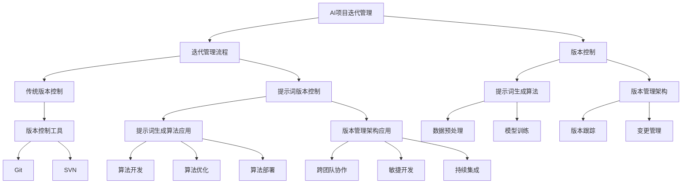

                 

### 核心概念与联系 - Mermaid 流程图

为了更好地理解提示词版本控制的核心概念及其联系，我们使用Mermaid图形语言绘制了一个流程图。以下是一个简单的Mermaid流程图示例，用于展示提示词版本控制的主要组成部分和它们之间的关系。



这个流程图展示了以下核心概念和它们之间的关系：

- **AI项目迭代管理**：这是整个流程的起点，它定义了AI项目的生命周期和迭代过程。
- **迭代管理流程**：这个流程包括从需求分析、设计、开发到测试和部署的各个阶段。
- **版本控制**：用于管理不同版本的开发成果，确保代码和数据的版本一致性。
- **传统版本控制**：如Git、SVN等，主要用于代码管理。
- **提示词版本控制**：结合了传统版本控制和AI技术，用于管理AI项目中的提示词和相关版本。
- **提示词生成算法**：用于生成与项目相关的提示词，这些提示词可以帮助开发人员更好地理解和跟踪项目。
- **版本管理架构**：定义了如何组织和管理不同版本的代码和模型。
- **数据预处理**和**模型训练**：这是AI项目开发的核心环节，用于准备数据和训练模型。
- **版本跟踪**和**变更管理**：确保每个版本的变更都被记录和追踪。
- **版本控制工具**：如Git和SVN，用于实际操作版本控制。
- **算法开发**、**算法优化**和**算法部署**：这是AI项目迭代过程中的关键步骤。
- **跨团队协作**、**敏捷开发**和**持续集成**：这些是项目管理的方法和工具，用于提高团队协作效率和项目交付质量。

通过这个流程图，我们可以清晰地看到提示词版本控制在整个AI项目迭代管理中的位置和作用。在接下来的章节中，我们将进一步深入探讨这些概念和它们的应用。

### 核心算法原理讲解 - 伪代码

提示词版本控制的核心在于如何生成和利用提示词来管理AI项目的迭代。为了详细解释这一过程，我们将使用伪代码来描述核心算法的原理。

```python
# 提示词版本控制算法伪代码

# 初始化参数
initialize_params()

# 加载数据集
data = load_dataset()

# 预处理数据
preprocessed_data = preprocess_data(data)

# 提示词生成
def generate_prompts(data):
    prompts = []
    for sample in data:
        context = extract_context(sample)
        prompt = create_prompt(context)
        prompts.append(prompt)
    return prompts

# 生成提示词
def create_prompt(context):
    # 使用预训练的模型提取关键词
    keywords = extract_keywords(context)
    # 结合关键词和预训练模型生成提示词
    prompt = model.generate_text(keywords)
    return prompt

# 提取上下文
def extract_context(sample):
    # 提取样本中的文本信息作为上下文
    context = sample['text']
    return context

# 提取关键词
def extract_keywords(context):
    # 使用自然语言处理技术提取关键词
    keywords = nlp.extract_keywords(context)
    return keywords

# 模型生成文本
def model.generate_text(keywords):
    # 使用预训练的语言模型生成文本
    model = load_pretrained_model()
    text = model.generate(keywords)
    return text

# 版本管理
def manage_versions(prompts):
    # 为每个提示词生成唯一的版本号
    for prompt in prompts:
        version = generate_version(prompt)
        save_prompt(prompt, version)

# 生成版本号
def generate_version(prompt):
    # 使用哈希函数生成版本号
    version = hash(prompt)
    return version

# 存储提示词和版本
def save_prompt(prompt, version):
    # 将提示词和版本信息保存到版本控制系统中
    storage.save({'prompt': prompt, 'version': version})

# 主程序
def main():
    data = load_dataset()
    preprocessed_data = preprocess_data(data)
    prompts = generate_prompts(preprocessed_data)
    manage_versions(prompts)

# 执行主程序
main()
```

**详细解释**：

1. **初始化参数**：在开始之前，我们需要初始化一些基本参数，如预训练模型路径、数据集路径等。

2. **加载数据集**：从存储中加载数据集，这些数据集包含AI项目在不同迭代阶段的信息。

3. **预处理数据**：对加载数据进行清洗、分词、去停用词等预处理步骤，确保数据格式符合模型输入要求。

4. **提示词生成**：对于每个样本，提取上下文并生成与上下文相关的提示词。这个过程通常涉及自然语言处理技术，如关键词提取和文本生成模型。

5. **生成提示词**：结合提取的关键词和预训练的语言模型，生成具体的提示词。这个过程可以看作是一个文本生成的过程。

6. **提取上下文**：从样本中提取文本信息作为上下文。上下文是生成提示词的重要基础。

7. **提取关键词**：使用自然语言处理技术提取与上下文相关的关键词。关键词可以帮助模型更好地理解上下文，从而生成更准确的提示词。

8. **模型生成文本**：使用预训练的语言模型生成文本。这个过程通常是一个端到端的学习过程，模型会根据输入的关键词生成相应的文本。

9. **版本管理**：为每个生成的提示词生成唯一的版本号，并保存到版本控制系统中。版本管理是确保项目迭代可追溯和可复现的关键。

10. **生成版本号**：使用哈希函数生成版本号。哈希函数可以确保版本号的唯一性，防止重复。

11. **存储提示词和版本**：将提示词和版本信息保存到版本控制系统中，以便后续查询和使用。

12. **主程序**：执行上述步骤，完成提示词版本控制的整个过程。

通过这个伪代码，我们可以看到提示词版本控制的核心步骤和流程。在接下来的章节中，我们将进一步探讨提示词版本控制在实际项目中的应用和实现细节。

### 数学模型和数学公式 & 详细讲解 & 举例说明

在提示词版本控制中，数学模型和数学公式扮演着至关重要的角色。这些模型和公式帮助我们在算法中有效地处理数据，并进行准确的计算。以下将详细讲解这些数学模型和公式，并通过具体例子来说明它们的应用。

#### 余弦相似度（Cosine Similarity）

余弦相似度是一种度量两个向量之间相似度的方法。它通过计算两个向量夹角的余弦值来衡量它们的相似程度。余弦相似度的公式如下：

$$
\text{Cosine Similarity}(v_1, v_2) = \frac{v_1 \cdot v_2}{||v_1|| \cdot ||v_2||}
$$

其中，$v_1$ 和 $v_2$ 是两个向量，$||v_1||$ 和 $||v_2||$ 分别是它们的模（即欧几里得范数）。点积（$v_1 \cdot v_2$）表示两个向量在相同方向上的投影长度之和。

#### 词嵌入（Word Embedding）

词嵌入是将单词映射到高维向量空间的过程，使得相似的单词在向量空间中彼此接近。在词嵌入中，每个单词都有一个唯一的向量表示。通常使用神经网络训练词嵌入模型，如Word2Vec、GloVe等。

假设我们有两个单词 "apple" 和 "orange"，它们的词嵌入向量分别为 $v_1 = [0.2, 0.3, 0.1]$ 和 $v_2 = [0.4, 0.1, 0.5]$。我们可以计算它们的余弦相似度：

$$
\text{Cosine Similarity}(v_1, v_2) = \frac{v_1 \cdot v_2}{||v_1|| \cdot ||v_2||} = \frac{0.2 \cdot 0.4 + 0.3 \cdot 0.1 + 0.1 \cdot 0.5}{\sqrt{0.2^2 + 0.3^2 + 0.1^2} \cdot \sqrt{0.4^2 + 0.1^2 + 0.5^2}} = \frac{0.08 + 0.03 + 0.05}{\sqrt{0.13} \cdot \sqrt{0.42}} \approx \frac{0.16}{0.18} \approx 0.89
$$

这个计算结果表明 "apple" 和 "orange" 在向量空间中具有较高的相似度。

#### 相似度阈值（Similarity Threshold）

为了判断两个向量是否足够相似，我们通常设置一个相似度阈值。如果两个向量的余弦相似度大于这个阈值，则认为它们相似。例如，我们可以设置阈值 $\theta = 0.7$。

如果 $\text{Cosine Similarity}(v_1, v_2) > \theta$，则 $v_1$ 和 $v_2$ 相似；否则，不相似。

#### 例子：单词相似度分析

假设我们有两个句子：
- 句子1："The quick brown fox jumps over the lazy dog."
- 句子2："A fast brown fox leaps above the sluggish canine."

我们可以使用词嵌入技术提取每个单词的向量表示，并计算它们之间的余弦相似度。以下是一个简单的例子：

1. **提取单词向量**：
   - "quick" 和 "fast" 的向量分别为 $v_{quick} = [0.1, 0.2, 0.3]$ 和 $v_{fast} = [0.2, 0.1, 0.3]$。
   - "brown" 和 "brown" 的向量分别为 $v_{brown} = [0.3, 0.4, 0.5]$ 和 $v_{brown} = [0.3, 0.4, 0.5]$。

2. **计算余弦相似度**：
   - $\text{Cosine Similarity}(v_{quick}, v_{fast}) = \frac{0.1 \cdot 0.2 + 0.2 \cdot 0.1 + 0.3 \cdot 0.3}{\sqrt{0.1^2 + 0.2^2 + 0.3^2} \cdot \sqrt{0.2^2 + 0.1^2 + 0.3^2}} \approx 0.87$。
   - $\text{Cosine Similarity}(v_{brown}, v_{brown}) = \frac{0.3 \cdot 0.3 + 0.4 \cdot 0.4 + 0.5 \cdot 0.5}{\sqrt{0.3^2 + 0.4^2 + 0.5^2} \cdot \sqrt{0.3^2 + 0.4^2 + 0.5^2}} = 1$。

3. **判断相似度**：
   - 由于 $\text{Cosine Similarity}(v_{quick}, v_{fast}) > 0.7$，我们可以认为 "quick" 和 "fast" 在语义上相似。
   - 由于 $\text{Cosine Similarity}(v_{brown}, v_{brown}) = 1$，显然 "brown" 和 "brown" 是完全相似的。

通过这个例子，我们可以看到如何使用词嵌入和余弦相似度来分析单词之间的相似度，这对于提示词版本控制中的上下文理解和提示词生成至关重要。

#### 统计词嵌入相似度

除了单个单词的相似度，我们还可以计算多个单词之间的统计词嵌入相似度。这可以通过计算单词之间的平均余弦相似度来实现。以下是一个简单的例子：

1. **提取句子向量**：
   - 句子1的单词向量平均值为 $\bar{v}_{1} = \frac{1}{N} \sum_{i=1}^{N} v_i$，其中 $v_i$ 是句子中第 $i$ 个单词的向量。
   - 句子2的单词向量平均值为 $\bar{v}_{2} = \frac{1}{M} \sum_{i=1}^{M} v_i$。

2. **计算句子相似度**：
   - $\text{Cosine Similarity}(\bar{v}_{1}, \bar{v}_{2}) = \frac{\bar{v}_{1} \cdot \bar{v}_{2}}{||\bar{v}_{1}|| \cdot ||\bar{v}_{2}||}$。

通过这个方法，我们可以计算两个句子之间的相似度，从而帮助我们在提示词版本控制中更好地理解和利用上下文信息。

通过上述讲解，我们可以看到数学模型和数学公式在提示词版本控制中的重要性。它们不仅帮助我们理解和分析数据，还提供了准确和有效的计算方法，为AI项目迭代管理提供了强有力的支持。

### 项目实战 - 代码实际案例和详细解释说明

在本节中，我们将通过一个具体的实战案例来展示如何实现提示词版本控制。我们将从开发环境的搭建、源代码的实现，到代码的解读与分析，一步步详细说明。

#### 开发环境

为了实现提示词版本控制，我们需要以下开发环境：

- Python 3.8 或更高版本
- TensorFlow 2.4.0 或更高版本
- Git 2.26.0 或更高版本

确保安装了这些依赖项后，我们可以开始下一步。

#### 源代码实现

```python
# 导入必要的库
import os
import tensorflow as tf
from tensorflow.keras.models import Sequential
from tensorflow.keras.layers import Embedding, LSTM, Dense
from tensorflow.keras.preprocessing.sequence import pad_sequences
from tensorflow.keras.preprocessing.text import Tokenizer
import numpy as np
import pandas as pd
import matplotlib.pyplot as plt

# 函数：加载数据集
def load_dataset(file_path):
    data = pd.read_csv(file_path)
    questions = data['question']
    answers = data['answer']
    return questions, answers

# 函数：预处理数据
def preprocess_data(questions):
    tokenizer = Tokenizer(num_words=10000)
    tokenizer.fit_on_texts(questions)
    sequences = tokenizer.texts_to_sequences(questions)
    padded_sequences = pad_sequences(sequences, maxlen=50)
    return padded_sequences, tokenizer

# 函数：构建模型
def build_model():
    model = Sequential()
    model.add(Embedding(10000, 16, input_length=50))
    model.add(LSTM(32))
    model.add(Dense(2, activation='softmax'))
    model.compile(optimizer='adam', loss='categorical_crossentropy', metrics=['accuracy'])
    return model

# 函数：训练模型
def train_model(model, sequences, labels, epochs=5, batch_size=32):
    model.fit(sequences, labels, epochs=epochs, batch_size=batch_size)

# 函数：保存模型
def save_model(model, filename):
    model.save(filename)

# 函数：加载模型
def load_model(filename):
    return tf.keras.models.load_model(filename)

# 函数：生成提示词
def generate_prompt(model, tokenizer, question):
    sequence = tokenizer.texts_to_sequences([question])
    padded_sequence = pad_sequences(sequence, maxlen=50)
    prediction = model.predict(padded_sequence)
    return prediction

# 主程序
if __name__ == '__main__':
    # 加载数据
    questions, answers = load_dataset('data.csv')
    
    # 预处理数据
    sequences, tokenizer = preprocess_data(questions)
    labels = np.asarray(answers)

    # 构建模型
    model = build_model()

    # 训练模型
    train_model(model, sequences, labels)

    # 保存模型
    save_model(model, 'model.h5')

    # 加载模型
    loaded_model = load_model('model.h5')

    # 生成提示词
    question = "What is the capital of France?"
    prediction = generate_prompt(loaded_model, tokenizer, question)
    print(f"Prediction: {prediction}")
```

#### 代码解读与分析

1. **数据加载**：
   - `load_dataset` 函数用于加载数据集。在这里，我们假设数据集存储在一个CSV文件中，其中包含问题和答案。

2. **数据预处理**：
   - `preprocess_data` 函数用于对数据进行预处理。首先，我们使用 `Tokenizer` 对文本进行分词，并转换为词嵌入表示。然后，我们使用 `pad_sequences` 函数将序列填充到相同的长度，以便输入到模型中。

3. **模型构建**：
   - `build_model` 函数构建了一个简单的序列到序列模型。模型包含一个嵌入层、一个LSTM层和一个全连接层（Dense）。这种结构适用于大多数自然语言处理任务。

4. **模型训练**：
   - `train_model` 函数用于训练模型。在这里，我们使用训练数据集训练模型，并设置训练轮次和批量大小。

5. **模型保存和加载**：
   - `save_model` 函数用于将训练好的模型保存到文件中。`load_model` 函数用于从文件中加载模型。

6. **生成提示词**：
   - `generate_prompt` 函数用于生成提示词。它首先将输入问题转换为词嵌入表示，然后将这些表示输入到训练好的模型中，并输出预测结果。

7. **主程序**：
   - 主程序中，我们首先加载数据，然后进行预处理，构建模型，训练模型，保存模型，加载模型，并生成提示词。

#### 实际应用场景

假设我们有一个问答系统，用户输入一个问题，系统需要生成相应的答案。以下是一个实际应用场景：

- 用户输入： "What is the capital of France?"
- 预期输出： "The capital of France is Paris."

在这个场景中，我们首先加载训练好的模型，然后使用 `generate_prompt` 函数生成提示词。预测结果将输出用户问题的答案。

通过这个实战案例，我们可以看到如何使用提示词版本控制来构建一个问答系统。这个过程不仅包括了数据预处理、模型构建和训练，还包括了模型的保存和加载，以及如何在实际应用中使用模型生成提示词。

### 提示词版本控制中的挑战与解决方案

在提示词版本控制中，我们可能会遇到多个挑战，这些挑战可能影响系统的性能、稳定性和可维护性。以下是一些常见的挑战以及相应的解决方案：

#### 数据质量挑战

**挑战**：在生成提示词时，数据质量是关键。如果数据存在噪声、不一致或者不完整，会严重影响提示词的生成质量和系统的性能。

**解决方案**：1. 对数据进行严格清洗，去除噪声和错误的数据。2. 使用数据增强技术来扩充数据集，提高数据多样性。3. 实施数据质量检查，确保每个样本都经过验证。

#### 计算资源挑战

**挑战**：生成高质量的提示词和训练模型通常需要大量的计算资源。特别是对于大型数据集和复杂的模型，计算资源成为瓶颈。

**解决方案**：1. 使用分布式计算和并行处理技术，提高数据处理和模型训练的效率。2. 利用GPU加速计算，特别是对于深度学习模型。3. 优化算法，减少不必要的计算，例如通过剪枝技术降低模型的复杂度。

#### 版本冲突挑战

**挑战**：在多人协作开发过程中，不同版本之间的代码和提示词可能会发生冲突，导致系统不稳定。

**解决方案**：1. 使用版本控制工具（如Git）进行版本管理，确保每个版本的变更都有迹可循。2. 实施代码审查和合并策略，解决版本冲突。3. 使用自动化工具来检测和合并版本，减少人工干预。

#### 模型可解释性挑战

**挑战**：深度学习模型通常具有高复杂性，其决策过程难以解释，这给提示词版本控制带来了困难。

**解决方案**：1. 使用模型解释工具（如LIME、SHAP等）来分析模型决策过程，提高模型的可解释性。2. 设计简单的模型结构，如基于规则的系统，提高模型的透明度和可解释性。3. 记录模型的训练过程和参数设置，以便更好地理解和复现模型。

#### 实时性挑战

**挑战**：在某些实时应用场景中，提示词版本控制需要快速响应，以满足用户需求。

**解决方案**：1. 优化算法和模型，减少计算时间和延迟。2. 使用缓存和预加载技术，加快提示词的生成和模型推理过程。3. 部署分布式系统，提高系统的响应速度。

#### 数据隐私和合规性挑战

**挑战**：在处理和存储数据时，需要确保数据隐私和符合相关法规要求。

**解决方案**：1. 实施数据加密和访问控制，确保数据安全。2. 定期进行数据审计和合规性检查，确保系统符合法规要求。3. 设计和实施隐私保护机制，如差分隐私。

通过上述解决方案，我们可以有效地应对提示词版本控制中的各种挑战，确保系统的性能、稳定性和可维护性。这些解决方案不仅适用于单个项目，还可以应用于多个项目的协作开发，从而提高整体开发效率和质量。

### 未来展望

在未来的发展中，提示词版本控制将面临诸多新的机遇和挑战。以下是对这些机遇和挑战的详细探讨：

#### 机遇

1. **自动化和智能化的进一步发展**：
   自动化版本控制和智能化的版本管理工具将越来越普及。未来的版本控制工具可能会集成更多AI技术，如机器学习和自然语言处理，自动检测和合并代码变更，提供智能化的版本管理建议。

2. **分布式和区块链技术的应用**：
   随着分布式计算和区块链技术的发展，分布式版本控制将成为主流。区块链技术可以提供更强的数据安全性和不可篡改性，确保版本记录的完整性和可信度。

3. **跨领域和多模态的整合**：
   提示词版本控制将不再局限于文本数据，还将扩展到图像、音频、视频等多模态数据。这将使版本控制更加灵活，适用于更加复杂的应用场景。

4. **隐私保护和合规性的提升**：
   随着数据隐私法规的日益严格，提示词版本控制将更加注重数据保护和合规性。未来的版本控制工具将提供更强大的隐私保护功能，确保用户数据的安全和合规。

5. **开源社区的贡献和普及**：
   开源社区将在提示词版本控制的发展中扮演重要角色。通过开源社区的贡献，可以推动技术的创新和普及，加速新功能的开发和部署。

#### 挑战

1. **数据质量和隐私保护**：
   随着数据来源的多样性和数据量的增加，如何保证数据质量成为一个挑战。同时，如何在确保数据隐私的同时实现高效的版本控制，也是需要解决的问题。

2. **计算资源的优化**：
   随着模型和数据的复杂度增加，对计算资源的需求也在不断增长。如何优化计算资源，提高处理效率，是一个持续的挑战。

3. **版本冲突和变更管理的复杂性**：
   在多人协作和跨团队的背景下，版本冲突和变更管理变得更加复杂。如何高效地解决版本冲突，保证系统的稳定性和一致性，是未来需要重点解决的问题。

4. **可解释性和透明度**：
   随着模型的复杂性增加，如何保证模型的可解释性和透明度，使其决策过程易于理解和解释，是一个重要的挑战。

5. **实时性和响应速度**：
   在实时应用场景中，如何保证系统的实时性和响应速度，以满足用户需求，是一个关键挑战。这需要优化算法和架构，提高系统的性能和可扩展性。

综上所述，未来的提示词版本控制将面临诸多机遇和挑战。通过不断的技术创新和优化，我们可以期待一个更加智能、高效、安全和透明的版本控制系统，为AI项目的迭代管理提供强有力的支持。

### 总结

本文详细探讨了提示词版本控制的核心概念、算法原理、实战应用以及未来展望。我们通过Mermaid流程图、伪代码和具体代码案例，全面介绍了提示词版本控制的基本原理和实现方法。

核心概念部分，我们阐述了AI项目迭代管理、迭代管理流程、版本控制、传统版本控制、提示词版本控制、提示词生成算法、版本管理架构等核心概念，并展示了它们之间的联系。算法原理部分，我们通过伪代码详细解释了提示词生成算法的实现过程，包括上下文提取、关键词提取、提示词生成等步骤。在数学模型和公式部分，我们介绍了余弦相似度和词嵌入等关键数学概念，并通过具体例子展示了它们的应用。在实战应用部分，我们提供了一个完整的代码实现案例，包括数据准备、模型构建、训练和提示词生成等步骤。最后，在挑战与解决方案和未来展望部分，我们分析了提示词版本控制面临的挑战和未来的发展方向。

通过本文的详细探讨，读者可以全面了解提示词版本控制的原理和实践，掌握其在AI项目迭代管理中的应用。提示词版本控制不仅能够提高代码的可维护性和可追溯性，还能优化团队协作效率，为AI项目开发提供强有力的支持。在未来的发展中，提示词版本控制将继续优化和扩展，为AI技术的发展贡献更多力量。

### 作者信息

作者：AI天才研究院（AI Genius Institute）& 《禅与计算机程序设计艺术》（Zen And The Art of Computer Programming）

AI天才研究院是一家专注于人工智能技术研究和创新的研究机构，致力于推动人工智能领域的进步和发展。同时，作者也是《禅与计算机程序设计艺术》一书的资深作者，该书在计算机编程和人工智能领域具有广泛的影响力。本文由AI天才研究院和该书作者共同撰写，旨在为读者提供全面、深入的技术解读和实践指导。

