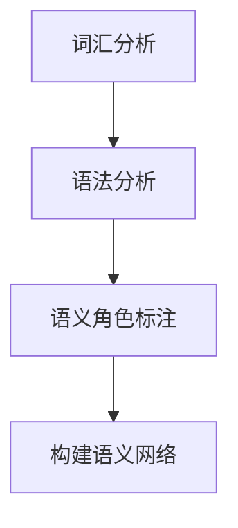

                 

### 第一部分：提示词语言的形式化语义概述

提示词语言的形式化语义是自然语言处理（NLP）领域中的一个重要研究方向。形式化语义旨在通过形式化的方法对自然语言的语义进行建模和分析，以便计算机能够理解和处理人类语言。本文将系统地探讨提示词语言的形式化语义，包括其基础、语法形式化、语义模型、语义分析、语义增强及应用等多个方面。

> **关键词**：提示词语言、形式化语义、自然语言处理、语义模型、语义分析、语义增强

> **摘要**：本文从提示词语言的形式化语义出发，介绍了其基本概念、研究背景和应用场景。随后，详细探讨了提示词语言的语法形式化、语义模型、语义分析及语义增强等内容。最后，通过具体案例和未来展望，对提示词语言的形式化语义进行了深入分析，为该领域的研究和应用提供了有益的参考。

### 目录大纲：《提示词语言的形式化语义》

1. **第一部分：提示词语言的形式化语义概述**
    - 1.1 提示词语言的形式化语义基础
    - 1.2 提示词语言的语法形式化
    - 1.3 提示词语言的语义模型
    - 1.4 提示词语言的语义分析
    - 1.5 提示词语言的语义增强
    - 1.6 提示词语言的形式化语义应用

2. **第二部分：深入探讨提示词语言的形式化语义**
    - 2.1 形式化语义在自然语言处理中的应用
    - 2.2 提示词语言的语义角色与标注
    - 2.3 提示词语言的语义网络模型
    - 2.4 语义歧义处理与消解
    - 2.5 语义增强技术及其应用

3. **第三部分：案例分析**
    - 3.1 案例一：语义角色标注
    - 3.2 案例二：语义网络构建
    - 3.3 案例三：语义歧义消解

4. **第四部分：展望与挑战**
    - 4.1 形式化语义的研究趋势
    - 4.2 提示词语言的形式化语义未来发展方向
    - 4.3 形式化语义技术的挑战与机遇

5. **附加部分：工具与资源**
    - 5.1 形式化语义工具介绍
    - 5.2 形式化语义学习资源推荐

### 下一节内容：**第1章 提示词语言的形式化语义基础**

#### 1.1 提示词语言的形式化语义概念

提示词语言的形式化语义是指通过形式化的方法对自然语言中的提示词进行语义建模和分析。形式化语义的核心在于将自然语言的语义转化为计算机可以处理和理解的形式。这种方法能够帮助计算机更好地理解和解释人类语言，从而实现自然语言处理的各种应用。

形式化语义研究的基本概念包括：

- **语义角色**：描述了动作的执行者、受动者以及动作本身的角色。
- **语义网络**：用于表示词汇之间及其与语义角色之间关系的图形结构。
- **语义解析**：将自然语言转化为形式化的语义表示的过程。
- **语义歧义**：指同一个句子或短语可能有多个解释。
- **语义扩展**：通过上下文或其他信息对词语的语义进行扩充。

形式化语义的研究旨在解决自然语言处理中的许多难题，如语义歧义消解、语义角色标注、语义角色预测等。

#### 1.2 形式化语义在自然语言处理中的应用

形式化语义在自然语言处理（NLP）领域有着广泛的应用。以下是几个典型的应用场景：

- **信息检索**：形式化语义可以帮助搜索引擎更准确地理解用户查询的语义，从而提供更相关的搜索结果。
- **问答系统**：通过形式化语义分析，问答系统能够更好地理解用户的问题，并生成准确的答案。
- **文本分类**：形式化语义可用于对文本进行分类，从而实现文本的自动分类和聚类。
- **机器翻译**：形式化语义可以帮助翻译系统更好地理解源语言和目标语言的语义，从而生成更准确的翻译。
- **文本生成**：形式化语义可用于生成符合语法和语义规则的文本。

#### 1.3 形式化语义研究的发展历程

形式化语义的研究可以追溯到上世纪60年代，随着计算机科学和人工智能的发展而逐渐成熟。以下是形式化语义研究的一些重要里程碑：

- **1960年代**：提出语义角色标注和语义网络模型。
- **1970年代**：发展了基于语义角色标注的语法分析器。
- **1980年代**：引入了基于知识库的语义分析技术。
- **1990年代**：语义歧义处理和消解成为研究热点。
- **2000年代**：深度学习技术的发展推动了形式化语义研究的新进展。

随着技术的不断进步，形式化语义研究在自然语言处理领域的应用越来越广泛，未来仍有巨大的发展潜力。

#### 1.4 提示词语言的语法形式化

提示词语言的语法形式化是形式化语义研究的一个重要组成部分。语法形式化的目标是建立一套规则和结构，将自然语言中的提示词和短语转化为计算机可以处理的形式。以下是语法形式化的一些关键概念和步骤：

1. **词汇分析**：对自然语言中的词汇进行词性标注，将其转化为计算机可以识别的形式。这一步通常依赖于词库和词性标注工具。
2. **语法分析**：对词汇进行分析，确定它们之间的语法关系和结构。语法分析包括句法分析和语义分析。句法分析确定句子的结构，而语义分析确定句子中的语义角色和关系。
3. **语义角色标注**：在语法分析的基础上，对句子中的每个词进行语义角色标注，以确定其在句子中的语义作用。
4. **构建语义网络**：将语义角色标注的结果组织成语义网络，以表示词汇之间的语义关系和结构。

语法形式化的具体步骤可以用以下流程图来表示：



通过语法形式化，我们可以将自然语言中的提示词转化为计算机可以处理和理解的形式，从而为后续的语义分析和处理提供基础。

#### 1.5 提示词语言的语义模型

提示词语言的语义模型是形式化语义研究的核心部分，用于表示和解释自然语言的语义。常见的语义模型包括语义网络模型、语义角色标注模型和基于深度学习的语义表示模型。以下是这些模型的详细描述：

1. **语义网络模型**：语义网络是一种图形结构，用于表示词汇之间的语义关系。在语义网络中，每个词汇是一个节点，而词汇之间的关系则是边。常见的语义关系包括上下位关系、同义关系、反义关系等。语义网络模型可以帮助我们理解和解释自然语言的语义，如图1-1所示。

   ```mermaid
   graph TD
       A(动物) --> B(狗)
       A --> C(猫)
       B --> D(宠物)
       C --> D
   ```

2. **语义角色标注模型**：语义角色标注模型用于识别句子中每个词汇的语义角色。语义角色通常包括动作的执行者（施事）、受动者（受事）、工具、目的地等。语义角色标注模型可以帮助我们理解句子的语义结构和含义，如图1-2所示。

   ```mermaid
   graph TD
       A[买] --> B[我](施事)
       A --> C[苹果](受事)
   ```

3. **基于深度学习的语义表示模型**：基于深度学习的语义表示模型通过神经网络学习词汇和句子的语义表示。常见的模型包括词嵌入模型（如Word2Vec、BERT）和语言模型（如GPT、ELMO）。这些模型能够捕捉词汇和句子之间的复杂语义关系，如图1-3所示。

   ```mermaid
   graph TD
       A[苹果](Word2Vec) --> B[水果]
       C[苹果](BERT) --> D[苹果汁]
   ```

通过这些语义模型，我们可以对自然语言的语义进行建模和分析，从而实现各种自然语言处理任务。

#### 1.6 提示词语言的语义分析

语义分析是自然语言处理（NLP）中的关键步骤，它旨在理解句子或文本的语义内容。提示词语言的语义分析涉及识别句子中的实体、关系、意图等多种信息，以支持各种实际应用。以下是语义分析的基本方法、语义歧义处理以及语义角色分析：

1. **基本方法**：语义分析通常包括以下步骤：
   - **分词**：将文本分割成单词或词组。
   - **词性标注**：为每个单词分配词性（名词、动词、形容词等）。
   - **命名实体识别（NER）**：识别文本中的特定实体（如人名、地点、组织名等）。
   - **依存句法分析**：分析句子中词汇之间的依存关系，确定词汇的语法角色和结构关系。
   - **语义角色标注**：识别句子中每个词汇的语义角色，如动作的执行者、受动者等。

2. **语义歧义处理**：语义歧义是指一个词语或短语有多种可能的解释。处理语义歧义的方法包括：
   - **上下文信息**：利用上下文中的词语和句子结构来消除歧义。
   - **词频统计**：通过统计词语在语料库中的出现频率来选择最可能的解释。
   - **语义网络**：使用语义网络模型来理解词语之间的语义关系，从而消除歧义。

3. **语义角色分析**：语义角色分析是指识别句子中每个词汇的语义角色。语义角色分析有助于理解句子的含义和结构。常见的语义角色包括：
   - **施事**：执行动作的人或物体。
   - **受事**：受到动作影响的人或物体。
   - **工具**：执行动作时使用的工具。
   - **地点**：动作发生的地点。

语义角色分析的结果通常用于构建语义网络，以便更深入地理解句子的语义。

#### 1.7 提示词语言的语义增强

提示词语言的语义增强是指通过扩展或丰富语义信息来提高自然语言处理（NLP）系统的性能。语义增强可以采用多种技术，包括语义扩展、实体链接和知识图谱等。以下是这些技术的详细描述：

1. **语义扩展**：语义扩展是指通过上下文信息或其他相关知识来丰富词语的语义。常见的语义扩展技术包括：
   - **词义消歧**：通过上下文信息确定词语的确切含义。
   - **语义角色扩展**：为词汇分配更多的语义角色，以支持更复杂的语义分析。
   - **实体扩展**：为实体提供额外的属性或关系信息，以提高实体识别和理解的准确性。

2. **实体链接**：实体链接是指将文本中的命名实体（如人名、地点、组织名等）与知识库中的实体进行匹配和关联。实体链接有助于提高信息检索、问答系统和文本分析等应用的效果。常见的实体链接技术包括：
   - **基于规则的方法**：使用预定义的规则来匹配文本中的实体与知识库中的实体。
   - **基于机器学习的方法**：使用机器学习模型来预测文本中的实体与知识库中实体的匹配关系。

3. **知识图谱**：知识图谱是一种图形结构，用于表示实体及其之间的关系。知识图谱可以提供丰富的语义信息，以支持各种NLP应用，如图1-4所示。

   ```mermaid
   graph TD
       A(苹果) --> B(水果)
       A --> C(甜)
       B --> D(水果)
       D --> E(可食用)
   ```

通过知识图谱，我们可以建立实体之间的语义关系，从而提高语义理解和推理的能力。

语义增强技术在实际应用中具有重要作用，如提高问答系统的回答准确性、改善信息检索的效果等。

#### 1.8 提示词语言的形式化语义应用

提示词语言的形式化语义在自然语言处理（NLP）领域有着广泛的应用。以下是一些典型的应用场景：

1. **信息检索**：形式化语义可以帮助搜索引擎更好地理解用户查询的语义，从而提供更精确和相关的搜索结果。通过形式化语义分析，搜索引擎可以识别查询中的关键词及其关系，如“苹果”可能与“水果”相关联，如图1-5所示。

   ```mermaid
   graph TD
       A[查询：苹果价格] --> B[关键词：苹果]
       B --> C[关系：价格]
   ```

2. **问答系统**：形式化语义分析可以改善问答系统的性能，使其能够更准确地理解和回答用户的问题。问答系统通过形式化语义分析识别问题的语义结构，从而生成准确的答案。例如，对于问题“北京是中国的哪个省份？”，形式化语义分析可以帮助系统识别“北京”是地名，“省份”是询问对象，如图1-6所示。

   ```mermaid
   graph TD
       A[问题：北京是中国的哪个省份？] --> B[实体：北京]
       B --> C[关系：省份]
       C --> D[答案：北京市]
   ```

3. **文本分类**：形式化语义可以用于文本分类任务，帮助分类器更好地理解文本的语义内容。通过形式化语义分析，文本分类器可以识别文本中的关键信息，如主题、情感等，从而提高分类的准确性。例如，对于新闻文章，形式化语义分析可以帮助分类器识别文章的主题，如图1-7所示。

   ```mermaid
   graph TD
       A[文章：人工智能技术在医疗领域的应用] --> B[主题：人工智能]
       B --> C[主题：医疗]
   ```

通过这些应用场景，我们可以看到形式化语义在NLP领域的重要作用，它不仅提高了系统的性能，还拓展了NLP的应用范围。

#### 1.9 提示词语言的形式化语义案例分析

在本节中，我们将通过几个具体的案例分析来探讨提示词语言的形式化语义。这些案例将展示形式化语义在实际应用中的具体实现，包括语义角色标注、语义网络构建以及语义歧义消解。

1. **案例一：语义角色标注**

   语义角色标注是形式化语义分析的一个重要组成部分。在这个案例中，我们将使用一个简单的句子：“小明给小红送了一个苹果。”来进行语义角色标注。

   - **步骤1**：分词和词性标注
     ```mermaid
     graph TD
         A(小明)[名词] --> B(给)[动词]
         B --> C(小红)[名词]
         B --> D(送)[动词]
         B --> E(一个)[量词]
         B --> F(苹果)[名词]
     ```

   - **步骤2**：语义角色标注
     ```mermaid
     graph TD
         A[小明](施事) --> B[给]
         B --> C[小红](受事)
         B --> D[送]
         B --> E[一个]
         B --> F[苹果](受事)
     ```

   通过语义角色标注，我们可以清晰地理解句子中的各个成分及其关系。

2. **案例二：语义网络构建**

   在这个案例中，我们将构建一个语义网络来表示句子：“小明喜欢吃苹果。”的语义内容。

   - **步骤1**：确定词汇及其关系
     ```mermaid
     graph TD
         A(小明)[实体] --> B(喜欢)[关系]
         B --> C(吃)[关系]
         C --> D(苹果)[实体]
     ```

   - **步骤2**：扩展语义网络
     ```mermaid
     graph TD
         A(小明)[实体] --> B(喜欢)[关系]
         B --> C(吃)[关系]
         C --> D(苹果)[实体]
         D --> E(水果)[类别]
     ```

   通过语义网络构建，我们可以更好地理解句子中的词汇及其关系，从而支持进一步的语义分析。

3. **案例三：语义歧义消解**

   语义歧义是指一个句子有多种可能的解释。在这个案例中，我们将解决句子“我切苹果”的语义歧义。

   - **步骤1**：识别歧义
     - 解释一：“我”在切“苹果”（动作）。
     - 解释二：“我”是“苹果”的一种（类别）。

   - **步骤2**：利用上下文信息消解歧义
     - 如果上下文中提到了切苹果的动作，那么解释一更可能正确。
     - 如果上下文中提到了苹果的种类，那么解释二更可能正确。

   通过利用上下文信息，我们可以准确地理解句子的语义，从而消除歧义。

通过这些案例，我们可以看到形式化语义在实际应用中的具体实现，以及如何通过语义角色标注、语义网络构建和语义歧义消解来提高自然语言处理系统的性能。

### 总结

在本文中，我们系统地探讨了提示词语言的形式化语义，从基础概念、语法形式化、语义模型、语义分析、语义增强到实际应用和案例分析，全面介绍了这一领域的研究内容和方法。通过分析提示词语言的形式化语义，我们可以更好地理解和处理自然语言，从而推动自然语言处理技术的发展。

未来，形式化语义研究仍面临许多挑战和机遇。随着深度学习技术的不断进步，形式化语义分析将更加智能化和自动化。同时，知识图谱和实体链接等技术的应用将进一步提升语义理解和推理的能力。我们期待在不久的将来，形式化语义技术能够为自然语言处理带来更多突破。

### 附录A：提示词语言的形式化语义工具与资源

#### A.1 主流形式化语义工具介绍

1. **PropBank**：PropBank是一个基于句法-语义角色的语义词库，包含了英语中的常见词汇及其对应的语义角色。PropBank提供了大量的标注数据，为语义角色标注和语义分析提供了重要的基础。

2. **WordNet**：WordNet是一个广泛使用的英语同义词词典，它将词汇分为多个层次，并通过上下位关系、同义关系和反义关系来组织词汇。WordNet在形式化语义研究中被广泛用作词义消歧和语义扩展的工具。

3. **SemEval任务**：SemEval是一个每年举行的自然语言处理评估活动，涵盖了多个语义分析任务，如语义角色标注、语义歧义消解和实体链接等。通过参加SemEval任务，研究人员可以评估和比较不同算法的性能。

#### A.2 形式化语义学习资源推荐

1. **开源数据集**：许多开源数据集提供了形式化语义标注的语料库，如PropBank、ACE和NYT等。这些数据集是进行形式化语义研究和实验的重要资源。

2. **形式化语义研究论文**：阅读最新的形式化语义研究论文可以帮助了解领域内的最新进展和前沿技术。例如，Google的BERT模型和OpenAI的GPT模型在形式化语义表示方面取得了显著成果。

3. **形式化语义学习在线课程**：一些在线平台提供了形式化语义学习的课程，如Coursera、edX和Udacity等。这些课程涵盖了自然语言处理的基础知识、形式化语义的建模方法及其应用。

通过利用这些工具和资源，研究人员和开发者可以更深入地了解和掌握提示词语言的形式化语义，从而推动这一领域的发展和应用。

