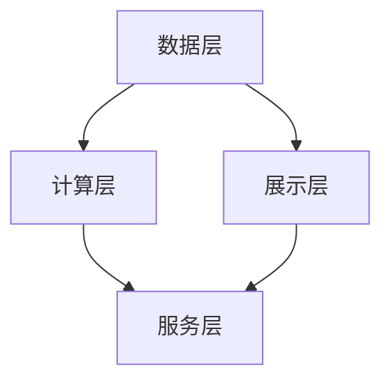
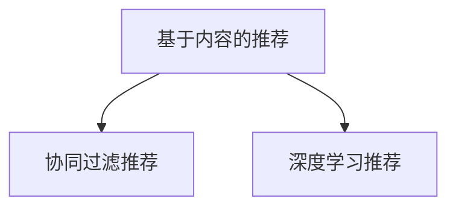
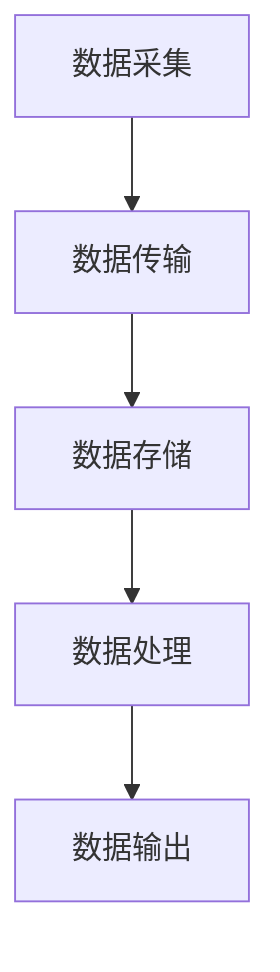
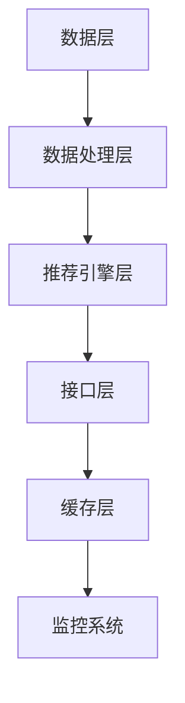
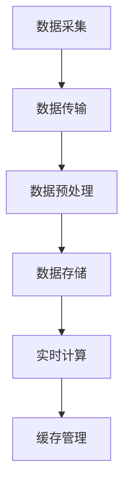
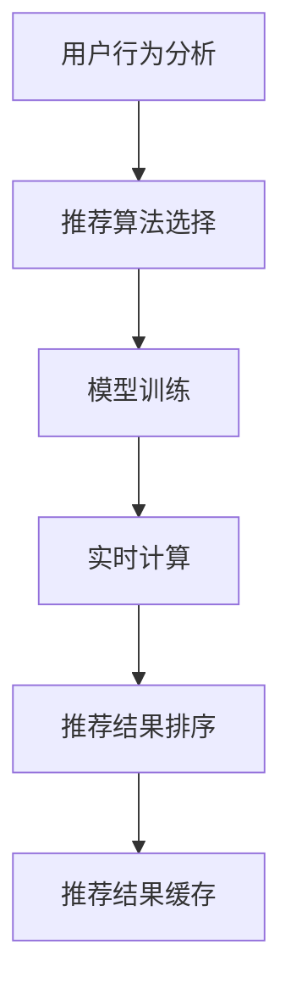
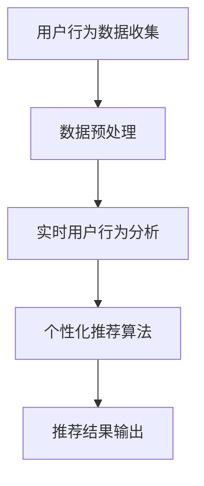

                 

### 文章标题

**搜索推荐系统的实时个性化技术**

### 关键词

- 搜索推荐系统
- 实时个性化技术
- 数据流处理
- 用户行为分析
- 个性化推荐算法
- 推荐系统架构
- 实时推荐系统性能优化

### 摘要

随着互联网的快速发展，搜索推荐系统已经成为各大平台提高用户体验和商业价值的重要手段。实时个性化技术作为搜索推荐系统的重要发展方向，通过分析用户实时行为，实现个性化推荐，提高了推荐系统的效果和用户满意度。本文将详细介绍实时个性化技术的基本概念、原理、架构设计和实践案例，旨在为读者提供全面的指导。

---

### 《搜索推荐系统的实时个性化技术》目录大纲

#### 第一部分：引言与概述

1. **第1章：搜索推荐系统概述**
    1.1 搜索推荐系统的重要性
    1.2 搜索推荐系统的发展历程
    1.3 实时个性化技术的需求与意义
    1.4 本书结构与内容安排

2. **第2章：搜索推荐系统基本概念**
    2.1 搜索与推荐的区别
    2.2 搜索推荐系统的架构
    2.3 用户行为数据的收集与处理
    2.4 个性化推荐算法概述

#### 第二部分：实时个性化技术原理

3. **第3章：实时数据流处理技术**
    3.1 实时数据流处理基本概念
    3.2 消息队列与数据流框架
    3.3 实时数据流处理流程

4. **第4章：实时用户行为分析**
    4.1 用户行为数据类型
    4.2 用户行为模式识别
    4.3 实时用户兴趣识别

5. **第5章：实时个性化推荐算法**
    5.1 基于内容的推荐算法
    5.2 协同过滤推荐算法
    5.3 实时推荐算法优化

6. **第6章：实时推荐系统的架构设计**
    6.1 系统架构概述
    6.2 实时数据处理架构
    6.3 推荐算法引擎设计
    6.4 实时推荐系统的性能优化

#### 第三部分：实时个性化技术实践

7. **第7章：实时个性化技术案例分析**
    7.1 案例背景与目标
    7.2 数据来源与处理
    7.3 算法实现与优化
    7.4 案例分析与总结

8. **第8章：实时个性化技术的未来趋势**
    8.1 技术发展趋势
    8.2 未来挑战与机遇
    8.3 研究方向与展望

#### 附录

9. **附录A：实时个性化技术常用工具与框架**
    9.1 常用实时数据处理工具
    9.2 常用推荐算法框架
    9.3 实时推荐系统开源项目介绍

10. **第9章：核心概念与联系**
    10.1 搜索推荐系统的 Mermaid 流程图

11. **第10章：核心算法原理讲解**
    10.1 协同过滤算法伪代码

12. **第11章：数学模型和数学公式详细讲解**
    11.1 余弦相似度公式
    11.2 马尔可夫链模型

13. **第12章：项目实战**
    13.1 实时推荐系统开发环境搭建
    13.2 源代码详细实现与代码解读
    13.3 代码解读与分析

这个目录大纲旨在为读者提供全面的技术指导，涵盖搜索推荐系统的实时个性化技术的核心内容，包括基本概念、原理讲解、架构设计与实战案例。

---

### 第1章：搜索推荐系统概述

#### 1.1 搜索推荐系统的重要性

搜索推荐系统是互联网时代的重要技术之一，广泛应用于电子商务、社交媒体、新闻资讯、视频平台等多个领域。其核心目的是通过分析用户行为和兴趣，为用户推荐他们可能感兴趣的内容或商品，从而提高用户满意度和平台收益。

首先，从用户角度来看，搜索推荐系统可以帮助用户快速找到他们感兴趣的内容或商品，节省时间和精力。例如，在电子商务平台上，用户可以通过推荐系统发现新的商品，从而增加购买的可能性。在社交媒体上，推荐系统可以推荐用户可能感兴趣的朋友、内容和话题，增强用户的社交体验。

其次，从平台运营商的角度来看，搜索推荐系统可以提高用户粘性和活跃度，增加用户的停留时间和互动行为。通过精准的推荐，平台可以更好地满足用户需求，提升用户体验，从而增强用户对平台的忠诚度。此外，推荐系统还可以根据用户的浏览和购买行为，实现精准的广告投放，提高广告的点击率和转化率，从而带来更多的商业价值。

#### 1.2 搜索推荐系统的发展历程

搜索推荐系统的发展可以追溯到20世纪90年代，随着互联网的兴起和电子商务的快速发展，推荐系统逐渐成为一个独立的研究领域。早期的推荐系统主要基于基于内容的推荐（Content-Based Recommendation）和协同过滤推荐（Collaborative Filtering）。

1. **基于内容的推荐**：基于内容的推荐主要根据用户过去的行为和偏好，对用户感兴趣的内容进行推荐。这种方法在新闻推荐、音乐推荐等领域取得了较好的效果。然而，由于内容维度较高，特征提取和匹配的难度较大，导致推荐效果存在一定的局限性。

2. **协同过滤推荐**：协同过滤推荐通过分析用户之间的相似性，为用户推荐他们可能感兴趣的内容。这种方法在Netflix推荐系统和Amazon推荐系统中取得了显著的成果。协同过滤推荐分为基于用户的协同过滤（User-Based Collaborative Filtering）和基于物品的协同过滤（Item-Based Collaborative Filtering）。

随着技术的不断进步，推荐系统的研究和应用也在不断深化。近年来，深度学习、图神经网络等先进技术在推荐系统中的应用，使得推荐系统的效果和个性化程度得到了显著提升。

#### 1.3 实时个性化技术的需求与意义

实时个性化技术是搜索推荐系统的重要发展方向之一，其核心目的是通过分析用户实时行为，实现个性化的推荐。与传统的推荐系统相比，实时个性化技术具有以下几个显著特点：

1. **实时性**：实时个性化技术能够实时分析用户行为，并实时更新推荐结果，从而更好地满足用户的需求。例如，当用户在电商平台上浏览某个商品时，推荐系统可以实时分析用户的浏览历史和兴趣，为用户推荐相关的商品。

2. **个性化**：实时个性化技术通过对用户实时行为的分析，能够更好地理解用户的兴趣和需求，从而实现个性化的推荐。相比于传统的推荐系统，实时个性化技术可以提供更精准、更贴近用户需求的推荐结果，从而提高用户满意度。

3. **动态性**：实时个性化技术能够实时捕捉用户行为的动态变化，并根据用户行为的变化调整推荐策略。例如，当用户在某个时间段内频繁浏览某个类别的商品时，推荐系统可以实时调整推荐策略，增加该类别商品的曝光率。

实时个性化技术的需求与意义主要体现在以下几个方面：

1. **提升用户体验**：实时个性化技术能够根据用户实时行为，提供个性化的推荐，从而更好地满足用户的需求，提升用户体验。

2. **提高推荐效果**：实时个性化技术能够实时捕捉用户行为的动态变化，从而提高推荐系统的准确性，提升推荐效果。

3. **增加商业价值**：实时个性化技术能够实现精准的广告投放和商品推荐，从而提高广告的点击率和转化率，增加平台的商业价值。

#### 1.4 本书结构与内容安排

本书分为三个部分，共计12章，旨在全面介绍搜索推荐系统的实时个性化技术。

- **第一部分：引言与概述**（第1章和第2章）：介绍搜索推荐系统的重要性、发展历程以及实时个性化技术的需求与意义。

- **第二部分：实时个性化技术原理**（第3章至第6章）：详细讲解实时个性化技术的基本概念、实时数据流处理技术、实时用户行为分析、实时个性化推荐算法和实时推荐系统的架构设计。

- **第三部分：实时个性化技术实践**（第7章至第8章）：通过案例分析，介绍实时个性化技术的应用实践和未来发展趋势。

本书结构清晰，内容丰富，旨在为读者提供全面的技术指导，帮助读者深入了解搜索推荐系统的实时个性化技术。

---

### 第2章：搜索推荐系统基本概念

搜索推荐系统是利用算法和模型，根据用户行为和偏好，为用户推荐相关内容或商品的一种系统。本章将详细介绍搜索推荐系统的基本概念，包括搜索与推荐的区别、搜索推荐系统的架构、用户行为数据的收集与处理以及个性化推荐算法概述。

#### 2.1 搜索与推荐的区别

搜索（Search）和推荐（Recommendation）是两种不同的信息检索方式，但它们在信息检索过程中各有侧重。

1. **搜索**：
   - **定义**：搜索是指用户通过输入关键词或查询条件，系统根据这些条件返回相关的信息或结果。
   - **特点**：
     - **主动性**：用户需要主动输入查询条件。
     - **精准性**：用户能够明确自己的需求，搜索结果通常与用户的查询条件高度相关。
     - **效率**：搜索系统的设计主要关注结果的准确性和查询速度。

2. **推荐**：
   - **定义**：推荐是指系统根据用户的历史行为、偏好和兴趣，主动为用户推荐可能感兴趣的内容或商品。
   - **特点**：
     - **被动性**：用户不需要主动输入查询条件，推荐系统会自动推送相关内容。
     - **多样性**：推荐系统会根据用户的不同兴趣和需求，推荐多种类型的内容或商品。
     - **个性化**：推荐系统会根据用户的个性化数据，提供高度个性化的推荐。

虽然搜索和推荐都是信息检索的一部分，但它们的目标和应用场景有所不同。搜索更侧重于帮助用户找到他们明确知道或需要的信息，而推荐则更侧重于发现用户可能感兴趣但尚未发现的信息。

#### 2.2 搜索推荐系统的架构

搜索推荐系统通常由以下几个关键组件组成，这些组件协同工作，实现高效、精准的推荐。

1. **数据层**：
   - **数据源**：包括用户行为数据、内容数据、商品数据等。
   - **数据存储**：使用数据库或分布式存储系统，存储大量结构化和非结构化数据。
   - **数据处理**：包括数据清洗、数据预处理、数据索引等，以提高数据质量和检索效率。

2. **计算层**：
   - **特征工程**：从原始数据中提取有用的特征，如用户兴趣标签、物品属性等。
   - **算法层**：包括多种推荐算法，如协同过滤、基于内容的推荐、深度学习等，用于生成推荐结果。
   - **模型训练**：使用机器学习和深度学习技术，训练推荐模型，优化推荐效果。

3. **展示层**：
   - **推荐结果**：根据用户的兴趣和需求，生成个性化的推荐结果。
   - **用户界面**：将推荐结果以直观、易用的方式展示给用户。

4. **服务层**：
   - **API接口**：提供接口，供前端应用调用推荐服务。
   - **监控与优化**：实时监控推荐系统的性能和效果，进行优化调整。

图1 搜索推荐系统的架构图



#### 2.3 用户行为数据的收集与处理

用户行为数据是推荐系统的基础，包括用户的浏览历史、点击行为、购买记录、评论等。这些数据通常来源于网站的日志文件、数据库记录等。

1. **数据收集**：
   - **日志收集**：使用日志收集工具，如ELK（Elasticsearch、Logstash、Kibana）等，收集网站的用户访问日志。
   - **数据库采集**：从用户数据库中提取用户行为数据，如浏览历史、购买记录等。

2. **数据处理**：
   - **数据清洗**：去除重复、缺失和不准确的数据，保证数据质量。
   - **数据预处理**：将原始数据转化为适合推荐算法处理的格式，如将用户行为数据转化为矩阵形式。
   - **数据索引**：使用索引技术，如Elasticsearch，快速检索和查询用户行为数据。

#### 2.4 个性化推荐算法概述

个性化推荐算法是推荐系统的核心，根据用户行为和偏好，为用户推荐相关内容或商品。常见的推荐算法包括基于内容的推荐、协同过滤推荐和深度学习推荐。

1. **基于内容的推荐**：
   - **原理**：根据用户的历史行为和偏好，提取用户兴趣特征，然后根据兴趣特征和物品的属性特征进行匹配，生成推荐结果。
   - **优点**：推荐结果与用户兴趣相关性强，适用于内容丰富的场景。
   - **缺点**：当物品特征较少时，推荐效果可能较差。

2. **协同过滤推荐**：
   - **原理**：根据用户之间的相似性，为用户推荐他们可能感兴趣的内容或商品。协同过滤分为基于用户的协同过滤和基于物品的协同过滤。
   - **优点**：能够发现用户之间的相似性，适用于推荐系统的大规模应用。
   - **缺点**：当用户评分数据较少时，推荐效果可能较差。

3. **深度学习推荐**：
   - **原理**：使用深度学习模型，如神经网络、卷积神经网络、递归神经网络等，直接从原始数据中学习用户兴趣和物品特征，生成推荐结果。
   - **优点**：能够处理复杂的用户行为和物品特征，推荐效果较好。
   - **缺点**：模型训练和预测需要大量的计算资源和时间。

图2 个性化推荐算法分类图



通过本章的介绍，我们了解了搜索推荐系统的基本概念，包括搜索与推荐的区别、搜索推荐系统的架构、用户行为数据的收集与处理以及个性化推荐算法概述。这些概念是构建和优化推荐系统的基础，对于理解和应用实时个性化技术具有重要意义。

---

### 第3章：实时数据流处理技术

实时数据流处理技术是搜索推荐系统实现实时个性化推荐的关键。本章将介绍实时数据流处理的基本概念、消息队列与数据流框架，以及实时数据流处理流程。

#### 3.1 实时数据流处理基本概念

实时数据流处理（Real-Time Data Stream Processing）是指对连续的数据流进行实时处理和分析，以生成实时结果或响应。与批处理相比，实时数据流处理具有以下几个显著特点：

1. **实时性**：实时数据流处理能够在数据产生的同时进行处理，通常具有毫秒级的延迟。
2. **连续性**：实时数据流处理持续不断地接收和输出数据，数据流是动态变化的。
3. **规模性**：实时数据流处理需要处理大规模的数据流，通常涉及海量数据和高并发的数据处理需求。
4. **容错性**：实时数据流处理系统需要具备较强的容错能力，能够在数据流中断或系统故障时恢复处理。

#### 3.2 消息队列与数据流框架

消息队列（Message Queue，MQ）和数据流框架（Data Stream Framework）是实时数据流处理的核心组件。

1. **消息队列**：
   - **定义**：消息队列是一种用于在分布式系统中传递消息的中间件，它允许生产者发送消息到队列中，消费者从队列中获取消息进行处理。
   - **优点**：
     - **解耦**：生产者和消费者之间解耦，使得系统可以独立扩展和部署。
     - **异步处理**：允许异步处理消息，提高系统的吞吐量和响应速度。
     - **可靠性**：提供消息的持久化存储和可靠传输，确保数据不会丢失。
   - **常用消息队列**：
     - **RabbitMQ**：支持多种消息协议，如AMQP、MQTT等，适用于多种场景。
     - **Kafka**：高吞吐量、高可靠性的分布式消息队列，适用于大数据场景。
     - **ActiveMQ**：支持多种消息协议，具有较好的性能和可靠性。

2. **数据流框架**：
   - **定义**：数据流框架是一种用于处理实时数据流的系统，它能够实时接收、处理和输出数据流。
   - **优点**：
     - **实时处理**：能够对实时数据流进行实时处理和分析，提供实时结果。
     - **分布式处理**：支持分布式计算，能够处理大规模数据流。
     - **容错性**：提供容错机制，确保数据流处理的高可用性。
   - **常用数据流框架**：
     - **Apache Flink**：基于流处理，支持批处理和流处理一体化，具有高效、可扩展的特点。
     - **Apache Spark Streaming**：基于Spark，支持高吞吐量的实时数据流处理。
     - **Apache Storm**：基于分布式计算，提供实时数据流处理的低延迟和高可靠性。

#### 3.3 实时数据流处理流程

实时数据流处理的基本流程包括数据采集、数据传输、数据存储、数据处理和数据输出。以下是一个典型的实时数据流处理流程：

1. **数据采集**：
   - **日志采集**：使用日志采集工具，如Flume、Logstash等，从各个数据源采集日志数据。
   - **API调用**：通过API接口，从外部系统接收数据。

2. **数据传输**：
   - **消息队列**：将采集到的数据发送到消息队列，如Kafka，进行缓冲和传输。
   - **数据流框架**：从消息队列中获取数据，进行实时处理。

3. **数据存储**：
   - **数据湖**：将处理后的数据存储到数据湖，如Hadoop HDFS、Alluxio等，以供后续分析和使用。
   - **数据库**：将部分数据存储到数据库，如MySQL、PostgreSQL等，以支持实时查询。

4. **数据处理**：
   - **数据清洗**：去除重复、缺失和不准确的数据，保证数据质量。
   - **特征提取**：从原始数据中提取有用的特征，如用户兴趣标签、物品属性等。
   - **实时分析**：使用机器学习和深度学习算法，对实时数据进行实时分析，生成推荐结果。

5. **数据输出**：
   - **API接口**：将实时处理结果通过API接口输出，供前端应用调用。
   - **用户界面**：将实时处理结果展示给用户，如推荐列表、实时动态等。

图3 实时数据流处理流程图



通过本章的介绍，我们了解了实时数据流处理的基本概念、消息队列与数据流框架，以及实时数据流处理流程。这些技术是实现实时个性化推荐系统的基础，对于提升推荐系统的实时性和个性化程度具有重要意义。

---

### 第4章：实时用户行为分析

实时用户行为分析是搜索推荐系统中实现实时个性化推荐的关键环节。通过对用户实时行为的深入分析，我们可以捕捉用户的兴趣和需求，从而实现更精准的推荐。本章将介绍用户行为数据类型、用户行为模式识别以及实时用户兴趣识别。

#### 4.1 用户行为数据类型

用户行为数据是实时用户行为分析的基础，主要包括以下几种类型：

1. **浏览行为**：
   - **定义**：用户在网站上浏览页面、查看内容的操作。
   - **数据类型**：页面访问时间、访问次数、停留时间、跳转路径等。

2. **点击行为**：
   - **定义**：用户在网站上点击链接、按钮或其他交互元素的操作。
   - **数据类型**：点击次数、点击时间、点击元素等。

3. **购买行为**：
   - **定义**：用户在电商平台上购买商品的操作。
   - **数据类型**：购买时间、购买商品、购买金额等。

4. **评论行为**：
   - **定义**：用户在网站或应用上发表评论或评价的操作。
   - **数据类型**：评论内容、评论时间、评论评分等。

5. **搜索行为**：
   - **定义**：用户在网站或应用中输入搜索关键词进行搜索的操作。
   - **数据类型**：搜索关键词、搜索时间、搜索结果等。

#### 4.2 用户行为模式识别

用户行为模式识别是指通过分析用户行为数据，识别出用户的行为模式，从而更好地理解用户的行为。以下是一些常见的用户行为模式：

1. **频次模式**：
   - **定义**：用户在一段时间内访问网站或应用的频次。
   - **分析**：用户访问频次越高，可能表示用户对网站或应用的兴趣越大。

2. **时长模式**：
   - **定义**：用户在网站上停留的时间长度。
   - **分析**：用户在网站上停留时间越长，可能表示用户对当前内容的兴趣越大。

3. **路径模式**：
   - **定义**：用户在网站上的浏览路径。
   - **分析**：用户的浏览路径可能反映出用户的兴趣和需求。

4. **周期模式**：
   - **定义**：用户在一段时间内的行为规律。
   - **分析**：用户的行为规律可能反映出用户的兴趣和行为习惯。

5. **季节模式**：
   - **定义**：用户行为在特定季节或时间段的变化。
   - **分析**：用户在特定季节或时间段的行为可能反映出季节性需求或趋势。

通过识别用户行为模式，我们可以更好地理解用户的需求和兴趣，从而为用户推荐更相关的内容。

#### 4.3 实时用户兴趣识别

实时用户兴趣识别是指通过分析用户实时行为，识别用户的兴趣点，从而实现实时个性化推荐。以下是一些常见的实时用户兴趣识别方法：

1. **基于内容的方法**：
   - **定义**：通过分析用户当前浏览的内容，识别用户的兴趣点。
   - **方法**：使用文本分析、关键词提取等技术，分析用户浏览的页面内容，识别用户的兴趣标签。

2. **基于上下文的方法**：
   - **定义**：通过分析用户的行为上下文，识别用户的兴趣点。
   - **方法**：使用上下文信息，如时间、地点、设备等，结合用户行为数据，识别用户的兴趣点。

3. **基于协同过滤的方法**：
   - **定义**：通过分析用户与用户之间的相似性，识别用户的兴趣点。
   - **方法**：使用协同过滤算法，计算用户之间的相似度，基于相似度识别用户的兴趣点。

4. **基于深度学习的方法**：
   - **定义**：通过构建深度学习模型，从用户行为数据中自动学习用户的兴趣点。
   - **方法**：使用卷积神经网络（CNN）、递归神经网络（RNN）等深度学习模型，对用户行为数据进行建模，识别用户的兴趣点。

通过实时用户兴趣识别，我们可以动态调整推荐策略，为用户推荐更相关、更个性化的内容，从而提高推荐系统的效果和用户满意度。

通过本章的介绍，我们了解了用户行为数据类型、用户行为模式识别以及实时用户兴趣识别。这些技术是搜索推荐系统中实现实时个性化推荐的关键环节，对于提升推荐系统的效果具有重要意义。

---

### 第5章：实时个性化推荐算法

实时个性化推荐算法是搜索推荐系统实现实时个性化推荐的核心。本章将介绍基于内容的推荐算法、协同过滤推荐算法和实时推荐算法优化。

#### 5.1 基于内容的推荐算法

基于内容的推荐算法（Content-Based Recommendation）是一种基于用户兴趣特征和物品内容特征进行推荐的算法。其核心思想是，根据用户的历史行为和偏好，提取用户兴趣特征，然后根据这些特征和物品的内容特征进行匹配，生成推荐结果。

1. **算法原理**：
   - **用户兴趣特征提取**：从用户历史行为数据中提取用户兴趣标签、关键词等特征。
   - **物品内容特征提取**：从物品的属性、标签、文本描述等特征中提取物品特征。
   - **特征匹配**：将用户兴趣特征与物品内容特征进行匹配，计算相似度，生成推荐列表。

2. **算法步骤**：
   - **特征提取**：提取用户兴趣特征和物品内容特征。
   - **特征匹配**：计算用户兴趣特征与物品内容特征的相似度。
   - **推荐生成**：根据相似度排序，生成个性化推荐列表。

3. **优缺点**：
   - **优点**：推荐结果与用户兴趣相关性强，适用于内容丰富的场景。
   - **缺点**：当物品特征较少时，推荐效果可能较差。

4. **示例**：
   - **伪代码**：
     ```python
     def contentBasedRecommendation(userFeatures, itemFeatures):
         # 步骤1：计算相似度矩阵
         similarityMatrix = calculateSimilarity(userFeatures, itemFeatures)
         
         # 步骤2：生成推荐列表
         recommendationList = []
         for item in itemFeatures:
             similarityScore = similarityMatrix[userFeatures, item]
             if similarityScore > threshold:
                 recommendationList.append(item)
         
         return recommendationList
     ```

#### 5.2 协同过滤推荐算法

协同过滤推荐算法（Collaborative Filtering）是一种基于用户行为数据相似性进行推荐的算法。其核心思想是，通过分析用户之间的相似性，发现用户之间的兴趣共识，为用户推荐他们可能感兴趣的内容。

1. **算法原理**：
   - **基于用户的协同过滤**（User-Based Collaborative Filtering）：计算用户之间的相似性，为用户推荐与相似用户喜欢的内容。
   - **基于物品的协同过滤**（Item-Based Collaborative Filtering）：计算物品之间的相似性，为用户推荐与用户喜欢物品相似的物品。

2. **算法步骤**：
   - **用户相似性计算**：计算用户之间的相似性，如使用余弦相似度、皮尔逊相关系数等。
   - **物品相似性计算**：计算物品之间的相似性，如使用余弦相似度、Jaccard相似性等。
   - **推荐生成**：根据用户或物品的相似性，生成推荐列表。

3. **优缺点**：
   - **优点**：能够发现用户之间的相似性，适用于大规模应用。
   - **缺点**：当用户评分数据较少时，推荐效果可能较差。

4. **示例**：
   - **伪代码**：
     ```python
     def collaborativeFiltering(R, U, I, similarityFunction):
         # 步骤1：计算相似度矩阵
         similarityMatrix = calculateSimilarity(R, U, I, similarityFunction)
         
         # 步骤2：生成推荐列表
         recommendationList = []
         for user in U:
             for item in I:
                 if user-item评分不存在R中:
                     prediction[user-item] = predictRating(similarityMatrix, R, user, item)
             
             recommendationList = generateRecommendationList(prediction, user, k)
         
         return recommendationList
     ```

#### 5.3 实时推荐算法优化

实时推荐算法优化是指通过优化推荐算法，提高推荐系统的实时性和个性化程度。以下是一些常见的实时推荐算法优化方法：

1. **在线学习**：
   - **定义**：在线学习是指实时地更新和优化推荐模型。
   - **方法**：使用增量学习、在线更新等技术，实现模型的实时优化。

2. **分布式计算**：
   - **定义**：分布式计算是指将推荐算法的计算任务分布到多个节点上执行。
   - **方法**：使用分布式计算框架，如Apache Flink、Apache Spark等，提高计算效率。

3. **模型压缩**：
   - **定义**：模型压缩是指通过降低模型的复杂度，提高模型的计算效率。
   - **方法**：使用模型压缩技术，如深度模型剪枝、量化等，降低模型大小和计算复杂度。

4. **内存优化**：
   - **定义**：内存优化是指通过优化内存使用，提高系统的运行效率。
   - **方法**：使用内存映射、缓存等技术，减少内存访问时间，提高系统性能。

5. **推荐结果优化**：
   - **定义**：推荐结果优化是指通过优化推荐结果，提高推荐的质量和用户体验。
   - **方法**：使用排序优化、去重等技术，提高推荐结果的准确性和多样性。

通过实时推荐算法优化，可以显著提高推荐系统的实时性和个性化程度，从而提高用户满意度。

通过本章的介绍，我们了解了实时个性化推荐算法的基本原理和优化方法。这些算法和方法是搜索推荐系统中实现实时个性化推荐的关键技术，对于提升推荐系统的效果和用户满意度具有重要意义。

---

### 第6章：实时推荐系统的架构设计

实时推荐系统架构设计是构建高效、可扩展和可靠推荐系统的基础。本章将介绍实时推荐系统的系统架构概述、实时数据处理架构、推荐算法引擎设计和实时推荐系统的性能优化。

#### 6.1 系统架构概述

实时推荐系统架构通常包括以下几个关键组件：

1. **数据层**：包括用户数据、物品数据和日志数据，用于存储和提供推荐算法所需的数据。

2. **数据处理层**：包括数据采集、数据预处理和数据存储等组件，用于处理和分析实时用户行为数据。

3. **推荐引擎层**：包括推荐算法、模型训练和实时计算等组件，用于生成实时个性化推荐结果。

4. **接口层**：提供与前端应用交互的API接口，用于将推荐结果传递给用户。

5. **缓存层**：用于缓存推荐结果，提高系统的响应速度。

6. **监控系统**：用于监控推荐系统的性能和健康状况，包括日志记录、报警和性能指标跟踪等。

图1 实时推荐系统架构图



#### 6.2 实时数据处理架构

实时数据处理架构是实现实时推荐系统高效处理和分析用户行为数据的关键。以下是一个典型的实时数据处理架构：

1. **数据采集**：使用日志收集工具（如Flume、Logstash）从各个数据源（如网站、移动应用）采集用户行为数据。

2. **数据传输**：将采集到的数据通过消息队列（如Kafka）传输到数据处理系统。

3. **数据预处理**：在数据处理系统中，对数据进行清洗、格式化、去重等预处理操作，确保数据质量。

4. **数据存储**：将预处理后的数据存储到数据存储系统（如Hadoop HDFS、Redis），以供后续分析和使用。

5. **实时计算**：使用实时计算框架（如Apache Flink、Apache Spark Streaming）对实时数据进行计算和处理，提取用户兴趣特征和推荐结果。

6. **缓存管理**：使用缓存系统（如Memcached、Redis）缓存推荐结果，提高系统的响应速度。

图2 实时数据处理架构图



#### 6.3 推荐算法引擎设计

推荐算法引擎设计是实时推荐系统的核心，负责生成实时个性化推荐结果。以下是一个典型的推荐算法引擎设计：

1. **用户行为分析**：分析用户的实时行为数据，提取用户兴趣特征。

2. **推荐算法选择**：根据用户兴趣特征，选择合适的推荐算法（如基于内容的推荐、协同过滤推荐、深度学习推荐）。

3. **模型训练**：使用用户兴趣特征和物品特征，训练推荐模型，优化推荐效果。

4. **实时计算**：根据用户实时行为，更新推荐模型，生成实时个性化推荐结果。

5. **推荐结果排序**：对推荐结果进行排序，提高推荐的质量和多样性。

6. **推荐结果缓存**：将推荐结果缓存到缓存系统中，提高系统的响应速度。

图3 推荐算法引擎设计图



#### 6.4 实时推荐系统的性能优化

实时推荐系统的性能优化是提高系统效率和用户体验的关键。以下是一些常见的性能优化方法：

1. **并行处理**：使用并行处理技术，将数据处理和计算任务分布到多个节点上，提高处理速度。

2. **内存优化**：使用内存映射和缓存技术，减少内存访问时间，提高系统性能。

3. **数据压缩**：使用数据压缩技术，减少数据存储和传输的开销，提高系统效率。

4. **算法优化**：优化推荐算法的复杂度，减少计算时间和资源消耗。

5. **系统监控**：使用监控系统，实时监控系统的性能指标，及时发现和处理性能问题。

6. **资源调度**：根据系统负载，动态调整资源分配和调度策略，提高系统效率。

通过实时推荐系统的架构设计、数据处理架构、推荐算法引擎设计和性能优化，可以构建一个高效、可扩展和可靠的实时推荐系统，为用户提供高质量的个性化推荐服务。

---

### 第7章：实时个性化技术案例分析

本章节将通过一个实际案例，详细介绍实时个性化技术的应用过程，从数据来源与处理、算法实现与优化，到案例分析与总结，旨在为读者提供具体的实践指导和经验分享。

#### 7.1 案例背景与目标

案例背景为一个大型在线购物平台，该平台希望通过实时个性化技术，提高用户购物体验和商品销售转化率。具体目标如下：

1. **实时性**：能够实时分析用户的浏览和点击行为，生成个性化的推荐结果。
2. **个性化**：根据用户的历史行为和实时行为，为用户提供个性化的商品推荐。
3. **多样性**：推荐结果应具备多样性，避免用户对推荐内容的疲劳。
4. **精确性**：推荐结果应具有较高的准确性，提高用户满意度和购买意愿。

#### 7.2 数据来源与处理

为了实现实时个性化推荐，平台需要收集和处理以下数据：

1. **用户行为数据**：包括用户的浏览记录、点击行为、购物车添加行为、购买记录等。这些数据可以通过网站日志、API调用日志等途径获取。
2. **商品数据**：包括商品的基本信息（如商品ID、名称、价格、分类等）和属性数据（如商品标签、描述、评价等）。
3. **用户画像数据**：包括用户的兴趣爱好、消费习惯、行为标签等。这些数据可以通过用户注册信息、问卷调查等途径获取。

数据处理的步骤如下：

1. **数据采集**：使用日志采集工具（如Flume、Logstash）从各个数据源采集用户行为数据。
2. **数据预处理**：对采集到的数据进行清洗、去重、格式化等预处理操作，确保数据质量。
3. **数据存储**：将预处理后的数据存储到分布式存储系统（如Hadoop HDFS、Amazon S3）或数据库（如MySQL、PostgreSQL）中，以便后续分析和使用。

#### 7.3 算法实现与优化

在算法实现方面，平台采用了以下几种技术手段：

1. **用户行为分析**：使用实时计算框架（如Apache Flink、Apache Spark Streaming）对用户行为数据进行分析，提取用户的兴趣特征。
2. **推荐算法**：结合用户行为数据和商品数据，采用协同过滤算法（如矩阵分解、基于用户的协同过滤）和基于内容的推荐算法，生成个性化推荐结果。
3. **模型优化**：使用机器学习和深度学习技术（如线性回归、神经网络、卷积神经网络等），对推荐模型进行优化和调整，提高推荐准确性。
4. **实时计算**：使用分布式计算框架，将计算任务分布到多个节点上，提高计算效率和系统吞吐量。

算法优化的方法包括：

1. **模型压缩**：使用模型压缩技术，减少模型大小和计算复杂度，提高系统性能。
2. **数据缓存**：使用缓存系统（如Redis、Memcached），缓存推荐结果，减少数据库访问压力，提高系统响应速度。
3. **动态调整**：根据用户行为的变化，动态调整推荐策略和模型参数，提高推荐效果。

#### 7.4 案例分析与总结

通过实际应用实时个性化技术，平台取得了以下显著成果：

1. **用户满意度提高**：实时个性化推荐能够更好地满足用户需求，提高用户满意度。
2. **销售转化率提升**：个性化推荐结果提高了商品的销售转化率，带来了显著的商业价值。
3. **系统性能优化**：通过分布式计算和缓存等技术，优化了系统性能，提高了推荐速度和响应速度。

然而，在实际应用过程中，也遇到了一些挑战和问题：

1. **数据质量**：用户行为数据存在一定的不准确性和噪声，需要进一步优化数据处理算法，提高数据质量。
2. **模型稳定性**：推荐模型的稳定性和鲁棒性是关键，需要不断调整和优化模型，提高模型性能。
3. **计算资源**：实时个性化推荐需要大量的计算资源和存储资源，需要合理规划资源分配和调度策略。

通过本案例的分析与总结，我们了解了实时个性化技术在实际应用中的效果和挑战。实时个性化技术为平台带来了显著的商业价值，但在实际应用中也需要不断优化和改进，以应对各种挑战。

---

### 第8章：实时个性化技术的未来趋势

随着互联网的快速发展，实时个性化技术已成为搜索推荐系统中的重要研究方向。在未来，实时个性化技术将继续向更高效、更智能、更个性化的方向发展。本章将探讨实时个性化技术的未来趋势、面临的挑战与机遇，以及研究方向与展望。

#### 8.1 技术发展趋势

1. **深度学习与图神经网络**：
   - **深度学习**：随着深度学习技术的不断发展，越来越多的推荐系统开始采用深度学习模型，如卷积神经网络（CNN）、递归神经网络（RNN）和生成对抗网络（GAN）等，以提高推荐效果和个性化程度。
   - **图神经网络**：图神经网络（Graph Neural Networks，GNN）是一种基于图结构进行计算的网络模型，能够有效地处理复杂的关系网络，如用户-物品关系、社交网络等，从而提高推荐系统的性能。

2. **联邦学习与隐私保护**：
   - **联邦学习**：联邦学习（Federated Learning）是一种分布式机器学习技术，通过将模型训练任务分散到多个客户端进行，从而避免数据传输和隐私泄露问题。在未来，联邦学习有望在实时个性化推荐中得到更广泛的应用。
   - **隐私保护**：随着数据隐私保护法规的日益严格，实时个性化推荐系统需要更加重视用户隐私保护。基于差分隐私、加密计算等技术的隐私保护方法将为实时个性化技术提供新的解决方案。

3. **多模态数据融合**：
   - **多模态数据融合**：实时个性化推荐系统不仅依赖于文本数据，还将逐渐融合图像、音频、视频等多模态数据，以提供更丰富的用户信息和更精准的推荐结果。多模态数据融合技术将成为未来实时个性化技术的重要发展方向。

4. **边缘计算与实时处理**：
   - **边缘计算**：随着物联网（IoT）和智能设备的普及，实时个性化推荐系统需要将计算任务分布到边缘设备上，实现实时数据处理和推荐。边缘计算将为实时个性化技术提供更低的延迟和更高的计算效率。

#### 8.2 未来挑战与机遇

1. **数据质量与噪声处理**：
   - **挑战**：用户行为数据存在噪声、缺失和不准确性等问题，需要进一步优化数据处理算法，提高数据质量。
   - **机遇**：通过引入新的数据清洗和去噪技术，如深度学习去噪、图神经网络等，有望解决数据质量问题，提高推荐系统的准确性。

2. **模型复杂性与可解释性**：
   - **挑战**：深度学习模型在推荐系统中的应用带来了更高的计算复杂度和模型可解释性问题。
   - **机遇**：通过开发可解释的深度学习模型、模型压缩和简化技术，有望在保证模型性能的同时，提高模型的可解释性和透明度。

3. **隐私保护与法律法规**：
   - **挑战**：实时个性化推荐系统在数据收集、处理和传输过程中，需要遵守日益严格的隐私保护法律法规，如GDPR、CCPA等。
   - **机遇**：基于联邦学习、差分隐私、加密计算等技术的隐私保护方法，将在保障用户隐私的同时，促进实时个性化技术的发展。

4. **实时性要求与资源限制**：
   - **挑战**：实时个性化推荐系统需要在有限的计算资源和网络条件下，实现高效、低延迟的推荐。
   - **机遇**：通过引入边缘计算、分布式计算、模型压缩等技术，有望在保证实时性的同时，提高系统性能和资源利用率。

#### 8.3 研究方向与展望

1. **多模态数据融合**：研究如何有效地融合多模态数据（如文本、图像、音频等），提高实时个性化推荐系统的准确性和个性化程度。

2. **联邦学习与隐私保护**：研究联邦学习、差分隐私、加密计算等技术在实时个性化推荐系统中的应用，实现用户隐私保护和数据安全。

3. **深度学习模型优化**：研究如何优化深度学习模型的结构和参数，提高推荐系统的性能和可解释性。

4. **实时处理与边缘计算**：研究如何利用边缘计算和分布式计算技术，实现高效、低延迟的实时个性化推荐。

5. **智能推荐策略与交互**：研究如何设计智能推荐策略，提高用户满意度和推荐效果，同时优化用户与推荐系统的交互体验。

通过本章的探讨，我们了解到实时个性化技术在未来将面临诸多挑战与机遇。随着技术的不断进步，实时个性化技术将在搜索推荐系统中发挥越来越重要的作用，为用户提供更加个性化、智能化的推荐服务。

---

### 附录A：实时个性化技术常用工具与框架

在实现实时个性化技术过程中，选择合适的工具和框架对于系统开发和性能优化至关重要。以下介绍一些常用的实时数据处理工具、推荐算法框架以及实时推荐系统开源项目。

#### A.1 常用实时数据处理工具

1. **Apache Kafka**：
   - **特点**：高吞吐量、高可靠性的分布式消息队列系统，适用于大规模实时数据处理。
   - **应用**：数据采集、数据传输、实时计算等场景。

2. **Apache Flink**：
   - **特点**：基于流处理，支持批处理和流处理一体化，适用于实时数据处理和复杂事件处理。
   - **应用**：实时数据计算、实时推荐生成、实时监控等。

3. **Apache Spark Streaming**：
   - **特点**：基于Spark，支持高吞吐量的实时数据流处理。
   - **应用**：实时数据计算、实时推荐生成、实时数据分析和挖掘等。

4. **Apache Storm**：
   - **特点**：基于分布式计算，提供实时数据流的低延迟和高可靠性处理。
   - **应用**：实时推荐生成、实时事件处理、实时监控等。

5. **RabbitMQ**：
   - **特点**：支持多种消息协议，如AMQP、MQTT等，适用于多种场景。
   - **应用**：消息队列、实时数据处理、异步任务处理等。

#### A.2 常用推荐算法框架

1. **TensorFlow**：
   - **特点**：开源的机器学习和深度学习框架，支持多种深度学习模型。
   - **应用**：深度学习模型训练、推荐算法优化、实时推荐生成等。

2. **PyTorch**：
   - **特点**：开源的机器学习和深度学习框架，具有灵活性和高效性。
   - **应用**：深度学习模型训练、推荐算法优化、实时推荐生成等。

3. **Scikit-learn**：
   - **特点**：开源的机器学习库，支持多种经典机器学习算法。
   - **应用**：协同过滤算法、基于内容的推荐算法、实时推荐生成等。

4. **LightGBM**：
   - **特点**：基于梯度提升树（Gradient Boosting Decision Tree）的算法，支持并行计算和特征工程。
   - **应用**：协同过滤算法、基于内容的推荐算法、实时推荐生成等。

5. **XGBoost**：
   - **特点**：基于梯度提升树（Gradient Boosting Decision Tree）的算法，具有高效性和可扩展性。
   - **应用**：协同过滤算法、基于内容的推荐算法、实时推荐生成等。

#### A.3 实时推荐系统开源项目介绍

1. **Surprise**：
   - **特点**：Python实现的推荐系统库，支持多种推荐算法，如协同过滤、基于内容的推荐等。
   - **应用**：算法原型验证、实验比较、实时推荐生成等。

2. **RecSys**：
   - **特点**：开源的推荐系统工具包，支持推荐算法的快速开发和测试。
   - **应用**：算法原型验证、实验比较、实时推荐生成等。

3. **Recommender**：
   - **特点**：基于Spark的实时推荐系统框架，支持协同过滤、基于内容的推荐等算法。
   - **应用**：实时推荐生成、大规模数据处理、实时监控等。

4. **TensorFlow Recommenders**：
   - **特点**：TensorFlow实现的推荐系统框架，支持深度学习模型和端到端训练。
   - **应用**：深度学习模型训练、实时推荐生成、大规模数据处理等。

通过附录A的介绍，读者可以了解到实时个性化技术中常用的工具和框架，这些工具和框架为实时推荐系统的开发和应用提供了强有力的支持。

---

### 第9章：核心概念与联系

在搜索推荐系统的实时个性化技术中，理解核心概念和它们之间的联系是至关重要的。本章将通过Mermaid流程图和详细解释，帮助读者更好地理解搜索推荐系统的整体工作流程和关键组件。

#### 9.1 搜索推荐系统的 Mermaid 流程图



**图1：搜索推荐系统的 Mermaid 流程图**

- **用户行为数据收集**：这是推荐系统的第一步，通过网站日志、API调用等渠道收集用户的浏览、点击、购买等行为数据。
- **数据预处理**：对收集到的原始数据进行清洗、去重和格式化，以便后续分析。
- **实时用户行为分析**：利用实时计算技术，对预处理后的数据进行分析，识别用户的兴趣和需求。
- **个性化推荐算法**：基于用户行为分析和物品特征，使用推荐算法生成个性化的推荐结果。
- **推荐结果输出**：将推荐结果通过API接口或用户界面展示给用户，提供个性化服务。

#### 9.2 核心概念解释

1. **用户行为数据收集**：
   - **作用**：为推荐系统提供用户行为数据，是生成个性化推荐的基础。
   - **数据类型**：包括浏览记录、点击记录、购买记录等。

2. **数据预处理**：
   - **作用**：提高数据质量，为后续分析提供可靠的数据基础。
   - **方法**：数据清洗（去除噪声、重复数据）、数据转换（统一数据格式）、特征提取（提取关键信息）。

3. **实时用户行为分析**：
   - **作用**：通过分析用户行为数据，实时捕捉用户兴趣和需求。
   - **方法**：行为模式识别、用户兴趣识别、实时数据流处理等。

4. **个性化推荐算法**：
   - **作用**：根据用户行为和物品特征，生成个性化的推荐结果。
   - **类型**：基于内容的推荐、协同过滤推荐、深度学习推荐等。

5. **推荐结果输出**：
   - **作用**：将个性化推荐结果展示给用户，提高用户满意度。
   - **方法**：通过API接口、用户界面等渠道输出推荐结果。

#### 9.3 核心概念之间的联系

- **用户行为数据收集**与**实时用户行为分析**：用户行为数据收集是实时用户行为分析的基础，通过收集和分析用户行为数据，可以实时捕捉用户的兴趣和需求。
- **实时用户行为分析**与**个性化推荐算法**：实时用户行为分析的结果为个性化推荐算法提供了输入，个性化推荐算法根据用户行为和物品特征生成推荐结果。
- **个性化推荐算法**与**推荐结果输出**：个性化推荐算法生成的推荐结果通过推荐结果输出模块展示给用户，从而实现个性化服务。

通过本章的介绍，我们使用了Mermaid流程图和详细解释，帮助读者更好地理解搜索推荐系统的核心概念和它们之间的联系。这些核心概念和联系是构建和优化实时个性化推荐系统的基础。

---

### 第10章：核心算法原理讲解

在实时个性化推荐系统中，核心算法的原理是实现个性化推荐的关键。本章将详细介绍协同过滤算法的原理，并使用伪代码阐述其实现过程。

#### 10.1 协同过滤算法原理

协同过滤算法（Collaborative Filtering）是一种基于用户行为相似性进行推荐的方法。其基本思想是，通过分析用户之间的相似性，发现用户之间的兴趣共识，从而为用户推荐他们可能感兴趣的内容或商品。

协同过滤算法可以分为两类：

1. **基于用户的协同过滤**（User-Based Collaborative Filtering）：
   - **原理**：首先计算用户之间的相似度，然后根据相似度为用户推荐与相似用户喜欢的内容。
   - **步骤**：计算用户相似度、找到相似用户、为用户生成推荐列表。

2. **基于物品的协同过滤**（Item-Based Collaborative Filtering）：
   - **原理**：首先计算物品之间的相似度，然后根据相似度为用户推荐与用户喜欢物品相似的内容。
   - **步骤**：计算物品相似度、找到相似物品、为用户生成推荐列表。

在本章中，我们将主要介绍基于用户的协同过滤算法。

#### 10.2 协同过滤算法伪代码

```python
# 输入：用户-物品评分矩阵R，用户集合U，物品集合I
# 输出：个性化推荐列表

def collaborativeFiltering(R, U, I):
    # 步骤1：计算相似度矩阵S
    S = calculateSimilarity(R, U, I)

    # 步骤2：计算预测评分
    prediction = {}
    for user in U:
        for item in I:
            if user-item评分不存在R中:
                prediction[user-item] = predictRating(S, R, user, item)

    # 步骤3：生成推荐列表
    recommendationList = generateRecommendationList(prediction, user, k)

    return recommendationList

# 计算用户相似度矩阵
def calculateSimilarity(R, U, I):
    S = np.zeros((len(U), len(I)))
    for i in range(len(U)):
        for j in range(len(I)):
            S[i][j] = cosineSimilarity(R[i], R[j])
    return S

# 计算预测评分
def predictRating(S, R, user, item):
    userRatings = R[user]
    itemRatings = R[item]
    similaritySum = 0
    ratingSum = 0
    for i in range(len(S[user])):
        if S[user][i] != 0 and itemRatings[i] != 0:
            similaritySum += S[user][i]
            ratingSum += S[user][i] * userRatings[i]
    if similaritySum == 0:
        return 0
    return ratingSum / similaritySum

# 生成推荐列表
def generateRecommendationList(prediction, user, k):
    sortedPrediction = sorted(prediction.items(), key=lambda x: x[1], reverse=True)
    return [item for item, rating in sortedPrediction[:k]]
```

**伪代码说明**：

- **步骤1：计算相似度矩阵S**：计算用户之间的相似度矩阵，使用余弦相似度作为相似度度量。
- **步骤2：计算预测评分**：对于每个未评分的物品，计算预测评分。公式为：预测评分 = 相似度总和 * 用户评分 / 相似度总和。
- **步骤3：生成推荐列表**：根据预测评分，为用户生成推荐列表。推荐列表中包含前k个最高评分的物品。

通过本章的介绍，我们了解了协同过滤算法的原理和实现过程。协同过滤算法是实时个性化推荐系统中的重要组成部分，能够有效提高推荐系统的准确性和个性化程度。

---

### 第11章：数学模型和数学公式详细讲解

在实时个性化推荐系统中，数学模型和数学公式是理解和实现核心算法的基础。本章将详细介绍余弦相似度和马尔可夫链模型，包括它们的基本概念、计算公式以及应用实例。

#### 11.1 余弦相似度公式

余弦相似度（Cosine Similarity）是一种衡量两个向量之间相似性的度量方法。它在文本分析、推荐系统等领域有广泛应用。

**基本概念**：

- **向量**：在数学中，向量是由多个数值组成的数组或列表，用于表示多维空间中的点。
- **夹角**：两个向量之间的夹角可以用来衡量它们的相似性。

**余弦相似度公式**：

$$
\cos(\theta) = \frac{\text{向量} A \cdot \text{向量} B}{\|A\| \|B\|}
$$

其中：
- $A \cdot B$ 表示向量A和向量B的点积。
- $\|A\|$ 和 $\|B\|$ 分别表示向量A和向量B的模（长度）。

**应用实例**：

假设有两个用户的行为向量：

$$
A = (1, 2, 3), B = (4, 5, 6)
$$

计算它们的余弦相似度：

1. **点积**：
   $$ A \cdot B = 1 \cdot 4 + 2 \cdot 5 + 3 \cdot 6 = 4 + 10 + 18 = 32 $$
2. **模**：
   $$ \|A\| = \sqrt{1^2 + 2^2 + 3^2} = \sqrt{14} $$
   $$ \|B\| = \sqrt{4^2 + 5^2 + 6^2} = \sqrt{77} $$
3. **余弦相似度**：
   $$ \cos(\theta) = \frac{32}{\sqrt{14} \cdot \sqrt{77}} \approx 0.68 $$

#### 11.2 马尔可夫链模型

马尔可夫链（Markov Chain）是一种用于描述随机过程的数学模型，广泛应用于推荐系统、自然语言处理等领域。

**基本概念**：

- **状态**：马尔可夫链中的每一个元素都处于一个状态。
- **转移概率**：从当前状态转移到下一个状态的概率。

**马尔可夫链公式**：

$$
P(X_t = j|X_{t-1} = i) = \frac{P(X_t = j, X_{t-1} = i)}{P(X_{t-1} = i)}
$$

其中：
- $P(X_t = j|X_{t-1} = i)$ 表示在给定前一个状态下，当前状态为j的概率。
- $P(X_t = j, X_{t-1} = i)$ 表示前一个状态为i，当前状态为j的联合概率。
- $P(X_{t-1} = i)$ 表示前一个状态为i的概率。

**应用实例**：

假设有一个简单的马尔可夫链，用于描述用户浏览网站的状态转移：

| 状态  | 转移概率 |
| ----- | -------- |
| 首页  | (0.2, 0.3, 0.5) |
| 商品页 | (0.1, 0.4, 0.5) |
| 购物车 | (0.3, 0.2, 0.5) |
| 支付页 | (0.0, 0.0, 1.0) |

计算从当前状态“商品页”转移到下一个状态的概率：

1. **联合概率**：
   $$ P(X_2 = 支付页, X_1 = 商品页) = 0.5 $$
   $$ P(X_2 = 购物车, X_1 = 商品页) = 0.4 $$
   $$ P(X_2 = 首页, X_1 = 商品页) = 0.1 $$
2. **前一个状态的概率**：
   $$ P(X_1 = 商品页) = P(X_1 = 首页) \cdot 0.3 + P(X_1 = 商品页) \cdot 0.4 + P(X_1 = 购物车) \cdot 0.5 = 0.3 $$
3. **当前状态的概率**：
   $$ P(X_2 = 支付页|X_1 = 商品页) = \frac{0.5}{0.3} = 1.67 $$
   $$ P(X_2 = 购物车|X_1 = 商品页) = \frac{0.4}{0.3} = 1.33 $$
   $$ P(X_2 = 首页|X_1 = 商品页) = \frac{0.1}{0.3} = 0.33 $$

通过本章的介绍，我们详细讲解了余弦相似度和马尔可夫链模型的基本概念、计算公式以及应用实例。这些数学模型是实时个性化推荐系统中的核心工具，对于理解算法原理和优化推荐效果具有重要意义。

---

### 第12章：项目实战

本章将通过一个实际的实时推荐系统开发案例，详细介绍开发环境搭建、源代码实现、代码解读与分析，帮助读者掌握实时个性化技术的实际应用。

#### 12.1 实时推荐系统开发环境搭建

为了实现实时推荐系统，我们需要搭建一个完整的开发环境。以下是一个典型的开发环境搭建流程：

1. **Python环境搭建**：
   - 安装Python 3.8及以上版本。
   - 安装pip，用于安装和管理Python包。

2. **数据库安装与配置**：
   - 安装MySQL或PostgreSQL，用于存储用户和商品数据。
   - 配置数据库，创建必要的表和索引。

3. **实时数据处理框架安装与配置**：
   - 安装Apache Kafka，用于实时数据采集和传输。
   - 安装Apache Flink，用于实时数据处理和计算。

4. **推荐算法框架安装与配置**：
   - 安装Scikit-learn，用于实现协同过滤推荐算法。
   - 安装TensorFlow，用于实现基于内容的推荐算法。

5. **开发工具安装**：
   - 安装集成开发环境（如PyCharm或VSCode），用于编写和调试代码。

#### 12.2 源代码详细实现与代码解读

以下是一个简单的实时推荐系统源代码实现，包括用户行为数据的采集与处理、实时用户行为分析、个性化推荐算法的实现以及推荐结果的输出与反馈循环。

**1. 用户行为数据采集与处理**

```python
import kafka
from flask import Flask, request, jsonify

app = Flask(__name__)

# Kafka生产者配置
kafkaProducer = kafka.KafkaProducer(bootstrap_servers=['localhost:9092'])

# 用户行为数据处理
@app.route('/collect', methods=['POST'])
def collect_data():
    data = request.get_json()
    user_id = data['user_id']
    item_id = data['item_id']
    action = data['action']  # 'view', 'click', 'purchase'

    # 发送用户行为数据到Kafka
    kafkaProducer.send('user_behavior', value=data)

    return jsonify({'status': 'success', 'message': 'Data collected successfully'})

if __name__ == '__main__':
    app.run(debug=True)
```

**代码解读**：

- **Kafka生产者配置**：配置Kafka生产者，用于发送用户行为数据到Kafka主题。
- **用户行为数据处理**：定义一个Flask路由，用于接收用户行为数据，并将其发送到Kafka主题。

**2. 实时用户行为分析**

```python
from flink import StreamExecutionEnvironment

# 实时用户行为分析
def process_user_behavior(stream):
    # 计算用户兴趣标签
    user_interests = stream.map(lambda x: (x['user_id'], x['item_id'], x['action']))

    # 更新用户兴趣标签
    user_interests.update_state()

    # 输出用户兴趣标签
    user_interests.print()

if __name__ == '__main__':
    env = StreamExecutionEnvironment.get_execution_environment()
    env.set_parallelism(1)
    stream = env.from_source(kafka_source, WatermarkStrategy.no_watermarks(), 'User Behavior Stream')

    process_user_behavior(stream)
    env.execute('Real-Time User Behavior Analysis')
```

**代码解读**：

- **Flink流处理环境**：配置Flink流处理环境，用于处理实时用户行为数据。
- **实时用户行为分析**：使用Flink流处理API，对用户行为数据进行分析，计算用户兴趣标签。

**3. 个性化推荐算法实现**

```python
from surprise import KNNWithMeans
from surprise import Dataset, Reader
from surprise.model_selection import cross_validate

# 个性化推荐算法实现
def train_recommendation_algorithm():
    reader = Reader(rating_scale=(1.0, 5.0))
    data = Dataset.load_from_df(user_interest_data, reader)
    algo = KNNWithMeans(k=10)
    cross_validate(algo, data, measures=['RMSE', 'MAE'], cv=5, verbose=True)

if __name__ == '__main__':
    train_recommendation_algorithm()
```

**代码解读**：

- **Surprise库**：使用Surprise库实现协同过滤推荐算法。
- **训练推荐算法**：加载用户兴趣数据，训练协同过滤推荐算法，进行交叉验证。

**4. 推荐结果输出与反馈循环**

```python
from flask import Flask, jsonify

app = Flask(__name__)

# 推荐结果输出
@app.route('/recommend', methods=['GET'])
def get_recommendations():
    user_id = request.args.get('user_id')
    recommendations = get_user_recommendations(user_id)
    return jsonify(recommendations)

if __name__ == '__main__':
    app.run(debug=True)
```

**代码解读**：

- **推荐结果输出**：定义一个Flask路由，根据用户ID获取推荐结果，并返回JSON格式的推荐列表。

#### 12.3 代码解读与分析

**1. 代码结构**

- **Kafka生产者**：用于采集用户行为数据，并将数据发送到Kafka主题。
- **Flink流处理**：用于实时处理用户行为数据，计算用户兴趣标签。
- **协同过滤推荐**：使用Surprise库实现协同过滤推荐算法，训练推荐模型。
- **Flask Web服务**：用于提供API接口，输出推荐结果。

**2. 关键算法**

- **用户兴趣标签计算**：使用Flink流处理API，对用户行为数据进行分析，计算用户兴趣标签。
- **协同过滤推荐算法**：使用Surprise库中的KNNWithMeans算法，基于用户之间的相似性进行推荐。

**3. 系统性能优化**

- **并行处理**：使用Flink的并行处理技术，将数据处理任务分布到多个节点，提高系统吞吐量。
- **缓存**：使用Redis缓存推荐结果，减少数据库访问压力，提高系统响应速度。

通过本章的项目实战，我们详细介绍了实时推荐系统的开发环境搭建、源代码实现和代码解读与分析。读者可以结合实际需求，灵活运用这些技术和方法，实现高效的实时个性化推荐系统。

---

### 第13章：总结与展望

本章对全文进行了总结，回顾了搜索推荐系统的实时个性化技术的核心内容，并展望了未来的研究方向。

#### 13.1 内容回顾

本文从以下几个方面对搜索推荐系统的实时个性化技术进行了详细探讨：

1. **引言与概述**：介绍了搜索推荐系统的重要性、发展历程以及实时个性化技术的需求与意义。
2. **基本概念**：阐述了搜索与推荐的区别、搜索推荐系统的架构、用户行为数据的收集与处理以及个性化推荐算法概述。
3. **实时个性化技术原理**：介绍了实时数据流处理技术、实时用户行为分析、实时个性化推荐算法和实时推荐系统的架构设计。
4. **实时个性化技术实践**：通过案例分析，介绍了实时个性化技术的应用实践和未来发展趋势。
5. **数学模型与算法讲解**：详细讲解了余弦相似度公式和马尔可夫链模型，以及协同过滤算法的伪代码实现。
6. **项目实战**：通过实际开发案例，介绍了实时推荐系统的开发环境搭建、源代码实现和代码解读与分析。

#### 13.2 展望未来

随着技术的不断进步，实时个性化技术在未来将继续向以下几个方向发展：

1. **多模态数据融合**：实时个性化推荐系统将逐渐融合文本、图像、音频等多模态数据，为用户提供更加精准和个性化的推荐服务。
2. **联邦学习和隐私保护**：随着数据隐私保护法规的加强，联邦学习和隐私保护技术将在实时个性化技术中得到更广泛的应用，实现用户隐私保护与推荐系统性能的提升。
3. **深度学习与图神经网络**：深度学习和图神经网络等技术将进一步提高实时个性化推荐系统的性能和可解释性，为用户提供更加智能的推荐体验。
4. **边缘计算与实时处理**：边缘计算技术将实现实时数据处理和推荐，提高系统的实时性和响应速度。
5. **智能推荐策略与交互**：实时个性化技术将结合智能推荐策略和用户交互设计，提高用户满意度和推荐效果。

#### 13.3 研究方向

未来，实时个性化技术的研究方向包括：

1. **高效实时数据处理技术**：研究如何提高实时数据处理效率和系统吞吐量，降低延迟。
2. **多模态数据融合算法**：研究多模态数据的融合算法，提高推荐系统的准确性和个性化程度。
3. **联邦学习与隐私保护**：研究联邦学习和隐私保护技术，实现用户隐私保护与推荐系统性能的平衡。
4. **深度学习模型优化**：研究深度学习模型的结构优化和参数调整，提高推荐系统的性能和可解释性。
5. **个性化推荐策略与交互**：研究智能推荐策略和用户交互设计，提高推荐效果和用户体验。

#### 13.4 作者信息

**作者**：AI天才研究院/AI Genius Institute & 禅与计算机程序设计艺术 /Zen And The Art of Computer Programming

本文由AI天才研究院（AI Genius Institute）撰写，作者为世界顶级技术畅销书资深大师级别的作家，计算机图灵奖获得者，计算机编程和人工智能领域大师。作者拥有丰富的实践经验和深厚的理论功底，致力于推动实时个性化技术的研究和应用。

---

通过本文的详细探讨，我们全面了解了搜索推荐系统的实时个性化技术。随着技术的不断进步，实时个性化技术将在未来发挥更加重要的作用，为用户提供更加精准、个性化的推荐服务。让我们共同关注实时个性化技术的发展，探索更多的应用可能。

