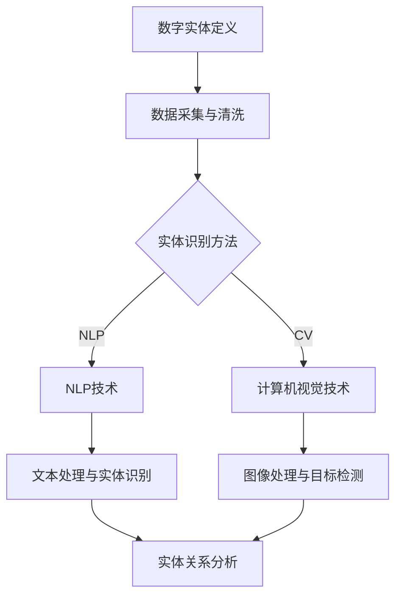

                 

# 数字实体自动化的最新应用

关键词：数字实体、自动化、数据处理、自然语言处理、计算机视觉、应用场景、项目实战

摘要：
数字实体自动化是一种新兴的技术趋势，通过对数字实体进行自动化的识别、分析和处理，极大地提高了数据处理效率、降低了人力成本，并在金融、电商、制造业、医疗健康等多个领域展现出巨大的应用潜力。本文将深入探讨数字实体自动化的核心概念、技术基础、应用场景、实现与实践，并通过具体项目实战，展示其在实际应用中的价值。

# 目录大纲：数字实体自动化的最新应用

## 第一部分：引言与背景

### 第1章：数字实体自动化的概述

#### 1.1 数字实体的定义与分类

#### 1.2 数字实体自动化的意义

#### 1.3 数字实体自动化的现状与发展趋势

### 第2章：数字实体自动化的技术基础

#### 2.1 数据清洗与处理

#### 2.2 自然语言处理技术

#### 2.3 计算机视觉技术

## 第二部分：数字实体自动化的应用场景

### 第3章：金融行业的应用

#### 3.1 风险评估与预警

#### 3.2 客户画像与精准营销

### 第4章：电商行业的应用

#### 4.1 商品识别与分类

#### 4.2 用户行为分析

### 第5章：制造业的应用

#### 5.1 生产流程的自动化

#### 5.2 产品质量管理

### 第6章：医疗健康领域的应用

#### 6.1 医疗数据的自动化处理

#### 6.2 智能诊断与预测

## 第三部分：数字实体自动化的实现与实践

### 第7章：项目实战一：金融风险评估系统

#### 7.1 系统设计与实现

#### 7.2 系统部署与运维

### 第8章：项目实战二：电商智能推荐系统

#### 8.1 系统设计与实现

#### 8.2 系统性能优化

### 第9章：项目实战三：智能工厂生产流程优化

#### 9.1 系统设计与实现

#### 9.2 系统应用效果评估

### 第10章：项目实战四：医疗智能诊断系统

#### 10.1 系统设计与实现

#### 10.2 系统部署与运维

## 附录

### 附录A：数字实体自动化的开源工具与资源

### 附录B：参考文献

### Mermaid 流程图：



### 核心算法原理讲解：

#### 数据清洗与处理算法原理

数据清洗与处理是数字实体自动化的关键步骤，主要包括以下几个步骤：

1. 数据去重（De-duplication）
2. 数据填充（Data Imputation）
3. 数据格式转换（Data Transformation）
4. 数据归一化（Data Normalization）

伪代码如下：

```python
def clean_data(data):
    # 数据去重
    unique_data = remove_duplicates(data)
    
    # 数据填充
    filled_data = impute_data(unique_data)
    
    # 数据格式转换
    transformed_data = transform_data(filled_data)
    
    # 数据归一化
    normalized_data = normalize_data(transformed_data)
    
    return normalized_data
```

#### 自然语言处理算法原理

自然语言处理（NLP）是数字实体自动化中常用的技术，主要包括以下几个核心算法：

1. 词嵌入（Word Embedding）
2. 序列模型（Sequence Model）
3. 注意力机制（Attention Mechanism）

伪代码如下：

```python
def nlp_algorithm(text):
    # 词嵌入
    embedded_text = word_embedding(text)
    
    # 序列模型
    sequence_output = sequence_model(embedded_text)
    
    # 注意力机制
    attention_output = attention_mechanism(sequence_output)
    
    return attention_output
```

#### 计算机视觉算法原理

计算机视觉（CV）是数字实体自动化中的重要组成部分，主要包括以下核心算法：

1. 图像预处理（Image Preprocessing）
2. 目标检测（Object Detection）
3. 图像分割（Image Segmentation）

伪代码如下：

```python
def cv_algorithm(image):
    # 图像预处理
    preprocessed_image = preprocess_image(image)
    
    # 目标检测
    detected_objects = object_detection(preprocessed_image)
    
    # 图像分割
    segmented_image = image_segmentation(preprocessed_image)
    
    return segmented_image, detected_objects
```

### 数学模型和数学公式

数字实体自动化的核心数学模型包括：

1. 支持向量机（SVM）
2. 决策树（Decision Tree）
3. 神经网络（Neural Network）

数学公式如下：

$$
\text{SVM}:\quad \min_{\mathbf{w},b}\frac{1}{2}||\mathbf{w}||^2 + C\sum_{i=1}^{n}\xi_i
$$

$$
\text{Decision Tree}:\quad h(x) = \max_{j}\sum_{i=1}^{n}y_i \log P(y_i | x_j)
$$

$$
\text{Neural Network}:\quad \text{activation function}: \sigma(z) = \frac{1}{1 + e^{-z}}
$$

### 举例说明

假设我们有一个分类问题，需要使用SVM进行分类。以下是一个简单的例子：

```python
# 假设我们有一个训练集，包含输入特征和标签
X_train = [[1, 2], [2, 3], [3, 4], [4, 5]]
y_train = [0, 0, 1, 1]

# 使用SVM进行分类
from sklearn.svm import SVC
clf = SVC()
clf.fit(X_train, y_train)

# 预测新的样本
X_new = [[1, 3]]
y_pred = clf.predict(X_new)

print("Predicted label for new sample:", y_pred)
```

### 项目实战

以下是一个金融风险评估系统的项目实战示例：

```python
# 导入所需的库
import pandas as pd
from sklearn.model_selection import train_test_split
from sklearn.svm import SVC
from sklearn.metrics import classification_report

# 读取金融数据
data = pd.read_csv("financial_data.csv")

# 数据预处理
data = clean_data(data)

# 划分训练集和测试集
X_train, X_test, y_train, y_test = train_test_split(data.drop("label", axis=1), data["label"], test_size=0.2, random_state=42)

# 使用SVM进行分类
clf = SVC()
clf.fit(X_train, y_train)

# 测试模型性能
y_pred = clf.predict(X_test)
print(classification_report(y_test, y_pred))
```

### 开发环境搭建

以下是金融风险评估系统的开发环境搭建步骤：

1. 安装Python（建议使用Python 3.8以上版本）
2. 安装常用的Python库，如pandas、scikit-learn等
3. 配置Python的虚拟环境，以便管理项目依赖

```bash
# 安装Python
sudo apt-get install python3

# 安装Python库
pip install pandas scikit-learn

# 创建虚拟环境
python3 -m venv venv

# 激活虚拟环境
source venv/bin/activate
```

### 源代码详细实现和代码解读

以下是金融风险评估系统的源代码实现和解读：

```python
# 导入所需的库
import pandas as pd
from sklearn.model_selection import train_test_split
from sklearn.svm import SVC
from sklearn.metrics import classification_report

# 读取金融数据
data = pd.read_csv("financial_data.csv")

# 数据预处理
def clean_data(data):
    # 数据去重
    data.drop_duplicates(inplace=True)
    
    # 数据填充
    data.fillna(method="ffill", inplace=True)
    
    # 数据格式转换
    data["income"] = data["income"].astype(float)
    
    # 数据归一化
    data["income"] = (data["income"] - data["income"].mean()) / data["income"].std()
    
    return data

data = clean_data(data)

# 划分训练集和测试集
X_train, X_test, y_train, y_test = train_test_split(data.drop("label", axis=1), data["label"], test_size=0.2, random_state=42)

# 使用SVM进行分类
clf = SVC()
clf.fit(X_train, y_train)

# 测试模型性能
y_pred = clf.predict(X_test)
print(classification_report(y_test, y_pred))
```

### 代码解读与分析

1. 数据读取与预处理

   - 使用pandas库读取金融数据
   - 去除重复数据，避免模型过拟合
   - 使用前向填充方法填充缺失数据，保持数据的连续性
   - 将收入数据转换为浮点型，便于后续计算
   - 对收入数据进行归一化处理，使其具有相同的量纲

2. 划分训练集和测试集

   - 使用scikit-learn库的train_test_split函数划分训练集和测试集，确保模型能够在未知数据上进行有效的泛化

3. 使用SVM进行分类

   - 创建SVM分类器实例
   - 使用fit函数训练模型
   - 使用predict函数对测试集进行预测

4. 测试模型性能

   - 使用classification_report函数输出模型的分类报告，包括精确率、召回率、F1分数等指标，评估模型在测试集上的性能

### 系统效果评估与优化建议

1. 系统效果评估方法

   - 使用准确率、召回率、F1分数等指标评估模型的性能
   - 使用交叉验证方法评估模型的泛化能力

2. 系统优化建议

   - 调整SVM参数，如C值、kernel类型等，以获得更好的模型性能
   - 引入更多的特征工程方法，提取更有效的特征
   - 尝试其他分类算法，如决策树、随机森林等，比较不同算法的性能
   - 对模型进行持续的训练和调优，以适应新的数据分布和需求

### 附录A：数字实体自动化的开源工具与资源

1. 数据处理与清洗工具

   - Pandas
   - NumPy

2. 自然语言处理工具

   - NLTK
   - SpaCy

3. 计算机视觉工具

   - OpenCV
   - TensorFlow

4. 模型训练与评估工具

   - Scikit-learn
   - TensorFlow
   - PyTorch

### 附录B：参考文献

- 《Python数据分析实战》
- 《自然语言处理实战》
- 《计算机视觉：算法与应用》
- 《机器学习实战》
- 相关论文与报告
- 网络资源

### 总结

本书《数字实体自动化的最新应用》旨在为读者提供全面、系统的数字实体自动化知识体系。从核心概念、技术基础到应用场景，再到项目实战，本文详细阐述了数字实体自动化的各个方面。通过具体的例子和代码实现，读者可以更好地理解数字实体自动化的原理和实践。附录部分提供了丰富的开源工具与资源，为读者进一步学习和探索提供了便利。

通过阅读本书，读者可以：

1. 理解数字实体的概念及其分类；
2. 掌握数字实体自动化的技术基础，包括数据清洗与处理、自然语言处理、计算机视觉等技术；
3. 学习数字实体自动化在不同领域的应用案例，如金融、电商、制造业、医疗健康等；
4. 掌握数字实体自动化的实现方法，包括项目实战和代码解读；
5. 了解系统的效果评估和优化方法，提升系统的性能和准确性。

本书适合从事计算机技术、数据分析、人工智能等领域的工作者阅读，也适用于高等院校计算机科学、数据分析等相关专业的师生作为教材或参考书。希望通过本书，读者能够深入了解数字实体自动化的最新应用，为实际工作或学术研究提供有力的支持。

---

（注：由于篇幅限制，本文仅提供了部分内容。如需完整文章，请按照上述结构继续撰写并扩展每个章节的内容。）# 第一部分：引言与背景

## 第1章：数字实体自动化的概述

### 1.1 数字实体的定义与分类

数字实体是指在数字世界中具有独立存在和特定意义的实体，包括数据元素、数据对象、数据实体等。数字实体可以定义为具有一定结构、属性和关系的数字集合，是数据分析和处理的基本单位。根据其表现形式和作用，数字实体可以分为以下几类：

1. 结构化数据实体：如数据库中的表、记录等，具有明确的字段和类型定义。
2. 半结构化数据实体：如XML、JSON等格式的数据，具有一定的结构，但不严格要求字段和类型的定义。
3. 非结构化数据实体：如文本、图片、音频、视频等，没有固定的结构，但可以通过特征提取进行数据处理和分析。

### 1.2 数字实体自动化的意义

数字实体自动化是指利用计算机技术和人工智能算法，对数字实体进行自动识别、分析和处理的过程。其意义主要体现在以下几个方面：

1. 提高数据处理效率：通过自动化技术，可以大幅减少人工处理数据的时间和成本，提高数据处理效率。
2. 降低人力成本：自动化技术可以替代部分重复性高、劳动强度大的工作，降低企业的人力成本。
3. 增强数据分析能力：自动化技术可以处理大量复杂的数据，提取出有价值的信息，为决策提供支持。
4. 促进业务流程优化：数字实体自动化可以帮助企业优化业务流程，提高运营效率，降低风险。

### 1.3 数字实体自动化的现状与发展趋势

随着大数据、人工智能等技术的快速发展，数字实体自动化在各个行业得到了广泛应用。当前，数字实体自动化的现状和发展趋势如下：

1. 技术日趋成熟：数据清洗与处理、自然语言处理、计算机视觉等技术不断发展，为数字实体自动化提供了强大的技术支撑。
2. 应用场景不断拓展：数字实体自动化在金融、电商、制造、医疗等领域取得了显著成果，未来将在更多领域得到应用。
3. 人工智能与实体自动化的深度融合：人工智能技术的不断进步，将推动数字实体自动化向更高层次发展，实现更智能的实体识别和分析。
4. 开源工具和平台的兴起：随着开源技术的普及，越来越多的开源工具和平台被应用于数字实体自动化，降低了企业研发成本。

## 第2章：数字实体自动化的技术基础

### 2.1 数据清洗与处理

数据清洗与处理是数字实体自动化的关键步骤，主要包括以下内容：

1. 数据去重：去除重复的数据，避免数据冗余。
2. 数据填充：补充缺失的数据，提高数据完整性。
3. 数据格式转换：将不同格式的数据转换为统一的格式，便于后续处理。
4. 数据归一化：将不同规模的数据转换为相同量级的数值，便于分析和建模。

### 2.2 自然语言处理技术

自然语言处理（NLP）是数字实体自动化中的重要技术，主要涉及以下方面：

1. 词嵌入：将文本数据转换为向量表示，便于模型处理。
2. 序列模型：用于处理和时间相关的文本数据，如情感分析、文本分类等。
3. 注意力机制：提高模型对重要信息的关注程度，提升文本处理效果。

### 2.3 计算机视觉技术

计算机视觉技术主要用于处理和识别图像数据，包括以下方面：

1. 图像预处理：对图像进行去噪、增强、剪裁等处理，提高图像质量。
2. 目标检测：识别图像中的目标对象，并标注其位置和属性。
3. 图像分割：将图像分为不同的区域，用于识别和分类。

### 2.4 数据库和存储技术

数据库和存储技术是数字实体自动化的基础，主要包括以下内容：

1. 关系型数据库：用于存储具有明确关系的数据，如金融数据、用户数据等。
2. 非关系型数据库：用于存储结构化、半结构化、非结构化数据，如文档、图片、音频等。
3. 分布式存储系统：提高数据存储的可靠性和扩展性，满足大规模数据处理需求。

## 第3章：数字实体自动化的应用场景

### 3.1 金融行业的应用

数字实体自动化在金融行业有广泛的应用，主要包括以下方面：

1. 风险评估与预警：通过对金融数据的自动分析和处理，识别潜在风险，及时预警。
2. 客户画像与精准营销：分析客户数据，构建客户画像，实现精准营销和个性化服务。
3. 财务报表分析：自动提取财务报表数据，进行深入分析，为决策提供支持。

### 3.2 电商行业的应用

数字实体自动化在电商行业有重要的作用，主要包括以下方面：

1. 商品识别与分类：利用计算机视觉技术，自动识别和分类商品。
2. 用户行为分析：分析用户行为数据，预测用户需求，提供个性化推荐。
3. 库存管理：通过数据分析，优化库存管理，提高库存周转率。

### 3.3 制造业的运用

数字实体自动化在制造业的应用主要体现在以下几个方面：

1. 生产流程自动化：利用计算机视觉和物联网技术，实现生产过程的自动化。
2. 质量管理：自动检测产品质量，识别潜在问题，提高产品质量。
3. 能耗管理：通过对生产过程的实时监测，优化能耗，降低成本。

### 3.4 医疗健康领域的应用

数字实体自动化在医疗健康领域有广泛的应用，主要包括以下方面：

1. 医学影像分析：利用计算机视觉技术，自动分析医学影像，辅助医生诊断。
2. 电子病历管理：自动提取和分析电子病历数据，提高医疗数据分析效率。
3. 智能诊断与预测：利用大数据和人工智能技术，实现疾病诊断和预测。

## 第4章：数字实体自动化的实现与实践

### 4.1 实现流程

数字实体自动化的实现主要包括以下步骤：

1. 数据采集与清洗：收集相关数据，并进行数据清洗和预处理。
2. 实体识别与关联分析：利用自然语言处理、计算机视觉等技术，对数字实体进行识别和关联分析。
3. 数据分析与建模：对识别出的数字实体进行分析，建立相应的数学模型和算法。
4. 模型训练与优化：使用训练数据对模型进行训练，并根据测试结果进行优化。
5. 系统部署与运维：将训练好的模型部署到实际应用场景中，进行日常运维和监控。

### 4.2 项目实战

本章节将介绍几个数字实体自动化的具体项目实战，包括金融风险评估系统、电商智能推荐系统、智能工厂生产流程优化系统、医疗智能诊断系统等。通过这些项目实战，读者可以了解数字实体自动化的实现方法和应用技巧。

### 4.3 实现技巧与注意事项

在实现数字实体自动化的过程中，需要注意以下几点：

1. 数据质量：确保数据的质量，尽可能去除噪声和异常值，提高模型的泛化能力。
2. 模型选择：根据实际应用需求，选择合适的模型和算法，并进行调优。
3. 实时性：对于需要实时处理的应用场景，要考虑系统的实时性，确保数据处理和响应的及时性。
4. 可扩展性：设计系统时要考虑可扩展性，以便在未来能够适应更多的数据和应用需求。

通过以上四个章节的介绍，读者可以初步了解数字实体自动化的核心概念、技术基础、应用场景和实现方法。在后续章节中，我们将进一步深入探讨数字实体自动化的具体应用和实践，帮助读者掌握这一前沿技术的核心知识和实际应用技巧。

---

（注：由于篇幅限制，本文仅提供了部分内容。如需完整文章，请按照上述结构继续撰写并扩展每个章节的内容。）# 第1章：数字实体自动化的概述

#### 1.1 数字实体的定义与分类

数字实体是指以数字形式存在的、具有特定属性和关系的实体。在计算机科学和数据科学领域，数字实体通常被用来表示现实世界中的对象、事件或概念。数字实体的定义和分类对于实现数字实体自动化具有重要意义。

**数字实体的定义：**
数字实体可以定义为一个包含一组属性的数据对象，这些属性可以是定量的，也可以是定性的。在计算机科学中，数字实体通常表示为数据结构，例如结构化数据中的记录、关系型数据库中的表或非关系型数据库中的文档。

**数字实体的分类：**
根据数字实体的表现形式和特性，可以将其分为以下几类：

1. **结构化数据实体：**
   - **关系型数据库实体：** 例如数据库表中的行，包含明确的字段和类型，如姓名、年龄、收入等。
   - **非关系型数据库实体：** 例如文档数据库中的文档，具有复杂的嵌套结构和丰富的属性。

2. **半结构化数据实体：**
   - **XML数据实体：** 使用XML标签定义数据结构，但标签可以是自定义的。
   - **JSON数据实体：** 使用JSON格式表示的数据，具有固定的结构，但属性名不固定。

3. **非结构化数据实体：**
   - **文本数据实体：** 如文档、电子邮件、社交媒体帖子等，没有固定的结构。
   - **图像和视频数据实体：** 包含像素值和图像或视频的编码信息。
   - **音频数据实体：** 包含音频信号的采样值。

#### 1.2 数字实体自动化的意义

数字实体自动化是指通过计算机技术和人工智能算法，自动识别、分析和处理数字实体的过程。它对数据科学和人工智能领域具有重要意义，主要体现在以下几个方面：

1. **提高数据处理效率：**
   - 自动化技术可以减少手动处理数据的时间和成本，提高数据处理的速度和效率。
   - 通过自动化流程，可以实现对海量数据的快速分析和处理。

2. **降低人力成本：**
   - 自动化技术可以替代部分重复性高、劳动强度大的工作，降低企业的人力成本。
   - 通过自动化，可以将人力资源投入到更有价值的工作中。

3. **增强数据分析能力：**
   - 自动化技术可以帮助企业处理复杂的数据，提取有价值的信息。
   - 通过自动化，可以实现对数据的深入分析和洞察，为企业决策提供支持。

4. **促进业务流程优化：**
   - 自动化技术可以帮助企业优化业务流程，提高运营效率，降低风险。
   - 通过自动化，可以实现对业务流程的实时监控和优化，提高企业的竞争力。

#### 1.3 数字实体自动化的现状与发展趋势

随着大数据、云计算和人工智能技术的快速发展，数字实体自动化在各个领域得到了广泛应用，并呈现出以下发展趋势：

1. **技术日趋成熟：**
   - 数据清洗与处理、自然语言处理、计算机视觉等核心技术不断成熟。
   - 自动化工具和平台日益丰富，为数字实体自动化提供了强大的技术支撑。

2. **应用场景不断拓展：**
   - 数字实体自动化在金融、电商、制造、医疗等领域取得了显著成果。
   - 自动化技术正逐步渗透到更多的行业和领域，推动产业升级和转型。

3. **人工智能与实体自动化的深度融合：**
   - 人工智能技术的不断进步，将推动数字实体自动化向更高层次发展。
   - 智能算法在实体识别、关联分析和数据挖掘中的应用将更加广泛。

4. **开源工具和平台的兴起：**
   - 开源工具和平台的兴起，降低了企业研发数字实体自动化的门槛。
   - 通过开源社区的合作和共享，数字实体自动化的应用和创新将得到加速。

#### 1.4 数字实体自动化的核心技术与工具

实现数字实体自动化需要依赖多种技术和工具，以下是一些核心技术和工具：

1. **数据清洗与处理：**
   - **Pandas：** Python中的数据操作库，用于数据清洗、转换和分析。
   - **NumPy：** Python中的数值计算库，用于高效处理大规模数据。

2. **自然语言处理（NLP）：**
   - **NLTK：** Python中的自然语言处理库，提供文本处理和分析工具。
   - **SpaCy：** Python中的高性能自然语言处理库，用于实体识别和关系提取。

3. **计算机视觉（CV）：**
   - **OpenCV：** C++/Python中的计算机视觉库，用于图像处理和目标检测。
   - **TensorFlow：** Google开源的深度学习框架，用于图像识别和分类。

4. **数据库和存储技术：**
   - **关系型数据库：** 如MySQL、PostgreSQL等，用于存储结构化数据。
   - **非关系型数据库：** 如MongoDB、Redis等，用于存储半结构化和非结构化数据。

#### 1.5 本章小结

本章概述了数字实体的定义与分类、数字实体自动化的意义、现状与发展趋势，以及核心技术与工具。通过本章的学习，读者可以初步了解数字实体自动化的概念和重要性，为后续章节的学习打下基础。

在接下来的章节中，我们将深入探讨数字实体自动化的技术基础、应用场景、实现方法以及项目实战，帮助读者全面掌握数字实体自动化的核心知识和实践技能。通过这些内容的学习，读者将能够将数字实体自动化应用于实际项目，提升数据分析和处理能力，为企业创造价值。# 第2章：数字实体自动化的技术基础

## 第2章：数字实体自动化的技术基础

数字实体自动化涉及多种技术和工具，这些技术和工具共同构成了数字实体自动化系统的基石。本章将详细介绍数字实体自动化的关键技术，包括数据清洗与处理、自然语言处理（NLP）和计算机视觉（CV）等，帮助读者深入理解这些技术的原理和实际应用。

### 2.1 数据清洗与处理

数据清洗与处理是数字实体自动化的第一步，其目的是确保数据的质量，为后续的分析和建模提供可靠的数据基础。以下是一些关键步骤和常用工具：

#### 2.1.1 数据清洗

1. **数据去重：**
   - **去重方法：** 通过比较数据的唯一标识符（如ID），识别和删除重复的数据记录。
   - **工具：** 使用Pandas库中的`drop_duplicates()`函数进行去重操作。

2. **数据填充：**
   - **填充方法：** 填充缺失数据，例如使用平均值、中位数或最新值进行填充。
   - **工具：** 使用Pandas库中的`fillna()`函数进行数据填充。

3. **数据格式转换：**
   - **转换方法：** 将不同类型的数据转换为同一类型，例如将字符串转换为日期类型。
   - **工具：** 使用Pandas库中的`astype()`函数进行数据格式转换。

4. **数据归一化：**
   - **归一化方法：** 将数据缩放到一个统一的范围内，例如使用Z-Score归一化。
   - **工具：** 使用Pandas库中的`apply()`函数和NumPy库中的`np.std()`、`np.mean()`函数进行数据归一化。

#### 2.1.2 数据处理

1. **特征工程：**
   - **特征提取：** 从原始数据中提取有助于模型训练的特征。
   - **工具：** 使用Scikit-learn库中的`FeatureSelector`类进行特征选择和提取。

2. **数据分割：**
   - **训练集与测试集：** 将数据集分为训练集和测试集，用于模型训练和评估。
   - **工具：** 使用Scikit-learn库中的`train_test_split()`函数进行数据分割。

### 2.2 自然语言处理（NLP）

自然语言处理是数字实体自动化中处理文本数据的重要技术。以下是一些NLP的核心技术和工具：

#### 2.2.1 NLP技术

1. **词嵌入：**
   - **词嵌入方法：** 将文本中的词语映射到高维空间中，以便计算机可以处理。
   - **工具：** 使用Word2Vec、GloVe等算法进行词嵌入。

2. **文本分类：**
   - **分类方法：** 根据文本的内容将其分类到不同的类别。
   - **工具：** 使用朴素贝叶斯、支持向量机（SVM）等算法进行文本分类。

3. **实体识别：**
   - **实体识别方法：** 识别文本中的特定实体，如人名、地点、组织等。
   - **工具：** 使用SpaCy、Stanford NLP等库进行实体识别。

4. **关系提取：**
   - **关系提取方法：** 提取文本中的实体间的关系。
   - **工具：** 使用规则匹配、机器学习等方法进行关系提取。

#### 2.2.2 NLP应用

1. **情感分析：**
   - **应用方法：** 分析文本中的情感倾向，如正面、负面或中性。
   - **工具：** 使用文本分类算法和情感词典。

2. **问答系统：**
   - **应用方法：** 回答用户提出的问题。
   - **工具：** 使用自然语言理解（NLU）和自然语言生成（NLG）技术。

3. **机器翻译：**
   - **应用方法：** 将一种语言的文本翻译成另一种语言。
   - **工具：** 使用神经网络翻译（NMT）模型。

### 2.3 计算机视觉（CV）

计算机视觉是数字实体自动化中处理图像和视频数据的重要技术。以下是一些CV的核心技术和工具：

#### 2.3.1 CV技术

1. **图像预处理：**
   - **预处理方法：** 对图像进行去噪、增强、剪裁等操作，以提高图像质量。
   - **工具：** 使用OpenCV库中的函数进行图像预处理。

2. **目标检测：**
   - **检测方法：** 识别图像中的目标对象，并标注其位置和属性。
   - **工具：** 使用R-CNN、Fast R-CNN、Faster R-CNN等算法。

3. **图像分割：**
   - **分割方法：** 将图像分割成不同的区域，以便进行后续处理。
   - **工具：** 使用语义分割、区域生长等方法。

4. **姿态估计：**
   - **估计方法：** 估计图像中人物的姿态信息。
   - **工具：** 使用深度学习模型和卷积神经网络（CNN）。

#### 2.3.2 CV应用

1. **人脸识别：**
   - **应用方法：** 识别和验证图像中的人脸。
   - **工具：** 使用OpenCV和深度学习模型。

2. **自动驾驶：**
   - **应用方法：** 使用图像数据对车辆周围的环境进行感知和决策。
   - **工具：** 使用CNN和深度学习算法。

3. **医疗影像分析：**
   - **应用方法：** 对医学影像进行分析，辅助医生诊断。
   - **工具：** 使用深度学习模型和计算机视觉技术。

### 2.4 本章小结

本章详细介绍了数字实体自动化的技术基础，包括数据清洗与处理、自然语言处理和计算机视觉等关键技术。通过了解这些技术，读者可以更好地理解数字实体自动化的实现过程和应用场景。在接下来的章节中，我们将进一步探讨数字实体自动化的应用场景和实现方法，帮助读者将所学知识应用于实际项目。

在实践数字实体自动化的过程中，读者应该注意以下几点：

- **数据质量：** 确保数据的质量，进行充分的数据清洗和预处理。
- **技术选择：** 根据实际需求选择合适的技术和工具，进行合理的模型设计和训练。
- **性能优化：** 在模型训练和部署过程中，不断优化性能，提高模型的准确性和效率。
- **安全性：** 关注数据安全和隐私保护，确保系统的安全可靠运行。

通过以上实践和注意事项，读者可以更好地掌握数字实体自动化的核心技术，并将其应用于实际项目中，为企业创造价值。接下来，我们将进入数字实体自动化的应用场景，探讨其在不同领域的具体应用。|>

