                 

### 文章标题

《数字素养：公民参与的基石》

关键词：数字素养、公民参与、信息技术、网络安全、信息检索、数字沟通、隐私保护、教育体系

摘要：
本文旨在探讨数字素养在现代社会中的重要性，分析其核心技能和构成，以及如何通过教育体系和实践应用来培养和提高公民的数字素养。文章首先阐述了数字素养的定义和重要性，接着详细介绍了信息素养、数字沟通技能和数字安全与隐私保护等方面的核心概念和算法原理。随后，文章讨论了数字素养教育的挑战与策略，以及其在社交媒体、数字治理和公民行动等领域的实践应用。最后，文章对未来数字素养的发展趋势和培养方向进行了展望，并列举了相关案例和最佳实践。通过本文的阅读，读者可以深入了解数字素养的重要性和培养方法，为提高自身和社区的数字素养水平提供参考。

### 目录大纲

#### 第一部分：数字素养概述

**第1章：数字素养的重要性**
1.1 数字时代的公民参与  
1.2 数字素养的定义与构成  
1.3 数字素养对个人与社会的影响

**第2章：信息素养**
2.1 信息检索技能  
2.2 信息评估与批判性思维  
2.3 信息伦理与隐私保护

**第3章：数字沟通技能**
3.1 数字交流工具与平台  
3.2 数字沟通技巧  
3.3 数字沟通中的伦理问题

**第4章：数字安全与隐私**
4.1 数字安全基础知识  
4.2 防范网络诈骗与犯罪  
4.3 保护个人隐私

**第5章：数字素养教育体系**
5.1 学校教育中的数字素养培养  
5.2 社区教育与家庭教育  
5.3 数字素养教育的挑战与策略

**第6章：数字素养的实践应用**
6.1 社交媒体与数字公共空间  
6.2 网络参与与数字治理  
6.3 数字素养与公民行动

**第7章：未来展望与趋势**
7.1 数字素养的发展趋势  
7.2 未来公民的数字素养需求  
7.3 数字素养教育的未来方向

**第四部分：案例研究与最佳实践**

**第8章：数字素养实践案例**
8.1 成功的数字素养教育案例  
8.2 数字素养培养的企业实践  
8.3 公共领域的数字素养应用

**第9章：最佳实践与策略**
9.1 数字素养政策与法规  
9.2 教育机构与企业的合作  
9.3 数字素养提升的持续努力

**附录**

**附录A：数字素养相关资源**
A.1 数字素养书籍推荐  
A.2 数字素养在线课程与培训  
A.3 数字素养相关的组织与机构

### 详细内容

#### 第1章：数字素养的重要性

##### 1.1 数字时代的公民参与

随着信息技术的飞速发展，数字时代已经到来。在这个时代，公民的参与方式发生了翻天覆地的变化。传统的投票和选举仍然是公民参与政治的核心，但数字时代的公民参与已经不再局限于这些方式。社交媒体、在线论坛、电子政府平台等数字工具的普及，使得公民能够以更加多样化和便捷的方式参与社会和政治事务。

**核心概念与联系：**

数字素养是指在数字时代中，个体理解和运用信息技术的能力，包括信息检索、信息评估、数字沟通、数字安全与隐私保护等核心技能。数字素养的重要性体现在以下几个方面：

1. **提高公民参与度：** 具有良好数字素养的公民能够更有效地使用数字工具和平台，参与社会和政治事务，从而提高公民的参与度。
2. **促进社会进步：** 数字素养的提升有助于推动社会的创新和发展，提高公共服务的质量和效率。
3. **保障个人权益：** 数字素养能够帮助公民保护自己的隐私和安全，避免受到网络诈骗和犯罪的侵害。

**Mermaid流程图：**

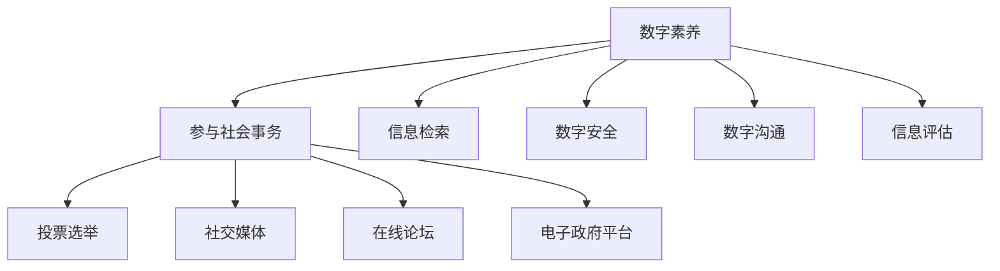

**举例说明：**

在一个典型的例子中，一个具有良好数字素养的公民可以通过社交媒体平台，参与关于环境问题的讨论，发起签名活动，推动政府采取行动。这表明，数字素养不仅能够提高公民的参与度，还能够促进社会问题的解决。

##### 1.2 数字素养的定义与构成

数字素养是一个宽泛的概念，它涉及到多个方面，包括信息素养、数字沟通技能、数字安全与隐私保护等。下面，我们将详细探讨数字素养的定义和构成。

**核心概念与联系：**

1. **信息素养：** 信息素养是指个体获取、评估、使用和传播信息的能力。在数字时代，信息素养尤为重要，因为人们需要从海量信息中筛选出有价值的信息。
   
2. **数字沟通技能：** 数字沟通技能是指个体使用数字工具和平台进行有效沟通的能力。这包括了解不同的数字交流工具和平台，掌握数字沟通的技巧和规范。

3. **数字安全与隐私保护：** 数字安全与隐私保护是指个体保护自己数据和信息安全的能力。在数字化时代，个人隐私和数据安全面临诸多挑战，因此，具备数字安全意识是数字素养的重要组成部分。

**Mermaid流程图：**

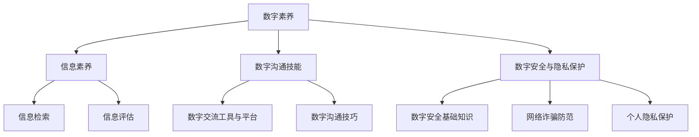

**伪代码：**

```python
def digital_literacy():
    information_retrieval()
    information_evaluation()
    digital_communication()
    digital_safety()
    privacy_protection()
```

**数学模型和数学公式：**

数字素养水平可以通过以下公式来衡量：

$$
\text{数字素养水平} = f(\text{信息素养水平}, \text{数字沟通技能水平}, \text{数字安全与隐私保护水平})
$$

**举例说明：**

一个具有高水平数字素养的个体，能够熟练使用搜索引擎进行信息检索，评估信息来源的真实性，使用各种数字交流工具进行有效沟通，同时具备良好的数字安全意识和隐私保护能力。

##### 1.3 数字素养对个人与社会的影响

数字素养的提升不仅对个人有着深远的影响，对社会也有着显著的推动作用。下面，我们将详细分析数字素养对个人和社会的影响。

**核心概念与联系：**

1. **对个人的影响：**
   - **提高生活质量：** 数字素养能够帮助个人更好地利用数字资源，提高工作效率，丰富日常生活。
   - **增强竞争力：** 在现代社会，数字素养已成为一项基本技能，具备良好的数字素养可以提升个人的就业竞争力。
   - **保障个人安全：** 数字素养能够帮助个人保护自己的隐私和安全，避免遭受网络诈骗和犯罪的侵害。

2. **对社会的影响：**
   - **促进社会进步：** 数字素养的提升有助于推动社会的创新和发展，提高公共服务的质量和效率。
   - **增强社会凝聚力：** 数字素养能够促进公民的参与和社会互动，增强社会的凝聚力。
   - **解决社会问题：** 数字素养能够帮助公民更好地了解社会问题，参与社会事务，共同解决社会问题。

**数学模型和数学公式：**

为了量化数字素养对个人和社会的影响，我们可以使用以下公式：

$$
\text{社会效益} = f(\text{个人素养水平}, \text{社会参与度}, \text{技术进步})
$$

**举例说明：**

一个具有良好数字素养的个人，可以通过在线平台参与社区建设，提出改进公共服务的建议，从而提升社区的生活质量。在社会层面，数字素养的提升可以促进政府与公民之间的互动，提高政府的透明度和责任感，从而推动社会的进步和发展。

### 第2章：信息素养

信息素养是数字素养的核心组成部分，它关乎个体在信息海洋中如何有效地获取、评估和使用信息。在这一章中，我们将探讨信息素养的三个关键方面：信息检索技能、信息评估与批判性思维，以及信息伦理与隐私保护。

##### 2.1 信息检索技能

信息检索技能是信息素养的基础，它关乎个体如何在海量信息中快速、准确地找到所需信息。以下是一个关于信息检索技能的核心概念与联系、核心算法原理讲解、数学模型和公式以及举例说明的流程图和伪代码。

**核心概念与联系：**

信息检索技能包括以下几个关键方面：

1. **搜索引擎使用：** 掌握使用搜索引擎，如Google、Bing等，进行高效信息检索的方法。
2. **数据库查询：** 了解如何使用数据库进行专业信息检索，如PubMed、IEEE Xplore等。
3. **专业工具应用：** 熟悉使用专业信息检索工具，如EndNote、Zotero等。

**Mermaid流程图：**

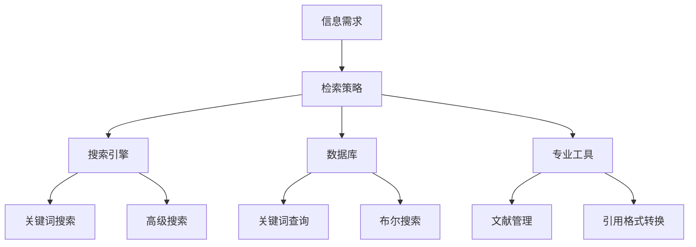

**伪代码：**

```python
def information_retrieval(information):
    # 使用搜索引擎进行检索
    search_engine_search(information)
    # 使用数据库进行专业检索
    database_search(information)
    # 使用专业工具进行检索
    tool_search(information)
    # 返回检索结果
    return search_results
```

**数学模型和数学公式：**

信息检索效果可以通过以下公式来衡量：

$$
\text{检索效果} = f(\text{检索速度}, \text{检索准确性}, \text{检索相关性})
$$

**举例说明：**

假设一个科研人员需要查找关于人工智能的最新研究成果，他可以使用Google搜索引擎进行关键词搜索，利用PubMed数据库查询相关文献，并通过EndNote工具管理文献，从而快速、准确地找到所需信息。

##### 2.2 信息评估与批判性思维

信息评估与批判性思维是信息素养的重要组成部分，它关乎个体如何评估信息来源的真实性和可靠性，并运用批判性思维对信息进行深入分析。以下是一个关于信息评估与批判性思维的核心概念与联系、核心算法原理讲解、数学模型和公式以及举例说明的流程图和伪代码。

**核心概念与联系：**

信息评估与批判性思维包括以下几个关键方面：

1. **信息来源评估：** 对信息来源进行评估，判断其权威性和可靠性。
2. **内容评估：** 对信息内容进行评估，判断其准确性和真实性。
3. **批判性思维：** 运用批判性思维对信息进行深入分析，避免被误导。

**Mermaid流程图：**

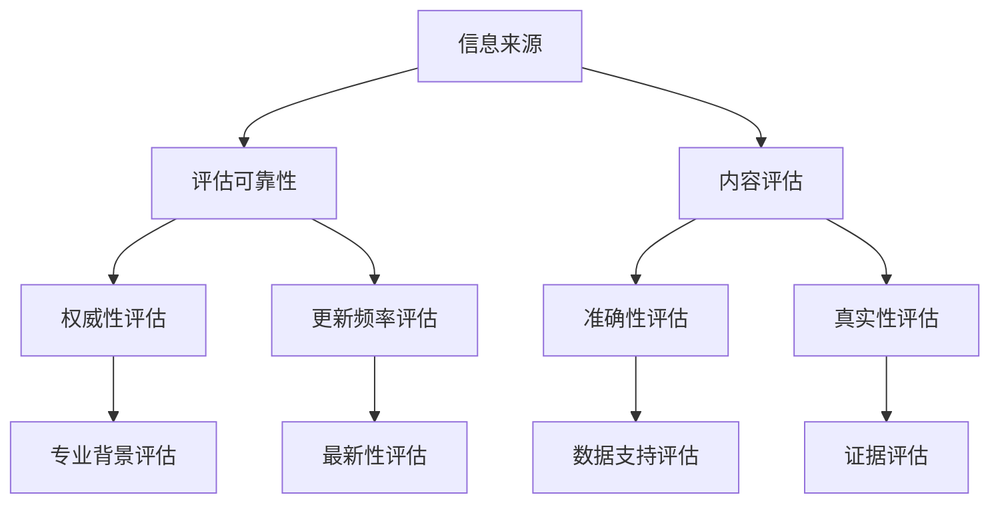

**伪代码：**

```python
def information_evaluation(information):
    # 评估来源可靠性
    source_reliability = check_source_reliability(information)
    # 评估内容准确性
    content_accuracy = check_content_accuracy(information)
    # 运用批判性思维
    critical_thinking(information)
    # 返回评估结果
    return (source_reliability and content_accuracy)
```

**数学模型和数学公式：**

信息评估效果可以通过以下公式来衡量：

$$
\text{评估效果} = f(\text{可靠性评估}, \text{准确性评估}, \text{真实性评估})
$$

**举例说明：**

假设一个学生在查找论文资料时，发现一篇关于人工智能的文章。他需要评估该文章的来源可靠性，如作者的专业背景、出版机构的权威性，以及文章内容的准确性和真实性。通过运用批判性思维，他可以判断这篇论文是否值得引用。

##### 2.3 信息伦理与隐私保护

信息伦理与隐私保护是信息素养的重要组成部分，它关乎个体在信息获取和使用过程中如何遵守伦理规范，保护个人隐私。以下是一个关于信息伦理与隐私保护的核心概念与联系、核心算法原理讲解、数学模型和公式以及举例说明的流程图和伪代码。

**核心概念与联系：**

信息伦理与隐私保护包括以下几个关键方面：

1. **信息伦理：** 遵守伦理规范，不侵犯他人隐私，不传播虚假信息。
2. **隐私保护：** 保护个人隐私，避免信息泄露，防范网络诈骗。
3. **隐私权：** 尊重个人隐私权，遵守相关法律法规。

**Mermaid流程图：**

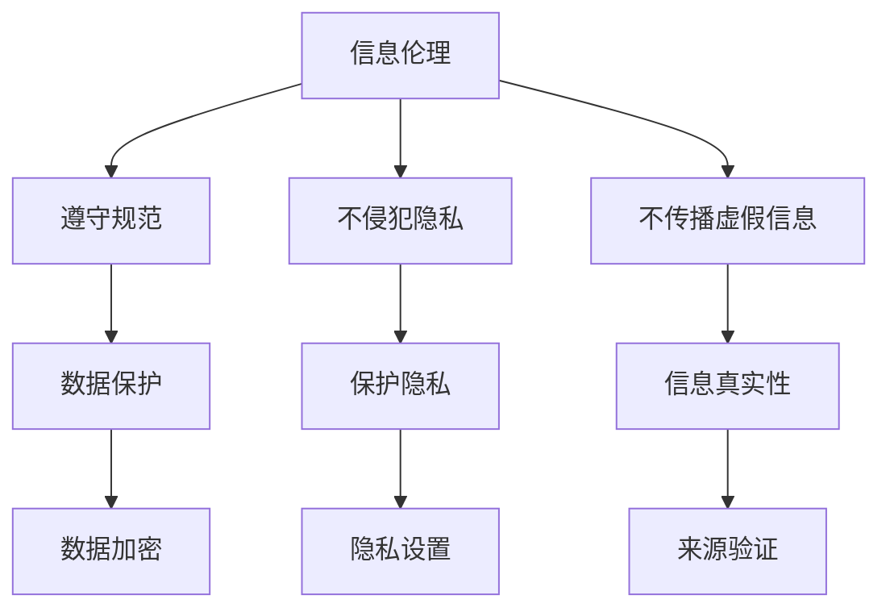

**伪代码：**

```python
def information_ethics_and_privacy_protection(information):
    # 遵守信息伦理规范
    ethics_compliance(information)
    # 保护个人隐私
    privacy_protection(information)
    # 防范网络诈骗
    fraud_prevention(information)
    # 返回处理结果
    return (ethics_compliance, privacy_protection, fraud_prevention)
```

**数学模型和数学公式：**

信息伦理与隐私保护效果可以通过以下公式来衡量：

$$
\text{伦理与隐私保护效果} = f(\text{伦理规范遵守度}, \text{隐私保护水平}, \text{网络诈骗防范效果})
$$

**举例说明：**

在一个社交媒体平台上，用户发布信息时需要遵守平台规范，不泄露个人隐私，不传播未经证实的信息。同时，用户需要设置隐私保护措施，如使用强密码、两步验证等，以防范网络诈骗。

### 第3章：数字沟通技能

数字沟通技能是数字素养的重要组成部分，它关乎个体如何有效地使用数字工具和平台进行沟通。在这一章中，我们将探讨数字沟通技能的三个方面：数字交流工具与平台、数字沟通技巧以及数字沟通中的伦理问题。

##### 3.1 数字交流工具与平台

数字交流工具与平台是数字沟通的载体，它们为个体提供了丰富的沟通渠道和方式。以下是一个关于数字交流工具与平台的核心概念与联系、核心算法原理讲解、数学模型和公式以及举例说明的流程图和伪代码。

**核心概念与联系：**

数字交流工具与平台包括以下几个关键方面：

1. **文字沟通工具：** 如电子邮件、即时通讯应用等。
2. **语音沟通工具：** 如电话、语音通话软件等。
3. **视频沟通工具：** 如视频通话、直播平台等。
4. **社交媒体平台：** 如Facebook、Twitter、Instagram等。

**Mermaid流程图：**

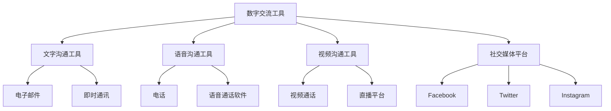

**伪代码：**

```python
def digital_communication_tools():
    # 使用文字沟通工具
    use_text_communication_tool()
    # 使用语音沟通工具
    use_voice_communication_tool()
    # 使用视频沟通工具
    use_video_communication_tool()
    # 使用社交媒体平台
    use_social_media_platform()
```

**数学模型和数学公式：**

数字沟通效果可以通过以下公式来衡量：

$$
\text{沟通效果} = f(\text{沟通工具选择}, \text{沟通技巧掌握度}, \text{沟通频率})
$$

**举例说明：**

在一个企业团队中，成员可以使用电子邮件进行正式沟通，使用即时通讯应用进行日常交流，使用视频通话进行项目会议。通过合理选择沟通工具，可以提高沟通效率，确保信息准确传达。

##### 3.2 数字沟通技巧

数字沟通技巧是数字沟通技能的核心，它关乎个体如何有效地使用数字工具进行沟通，以达到预期的沟通效果。以下是一个关于数字沟通技巧的核心概念与联系、核心算法原理讲解、数学模型和公式以及举例说明的流程图和伪代码。

**核心概念与联系：**

数字沟通技巧包括以下几个关键方面：

1. **语言表达准确性：** 使用准确、清晰的语言表达思想，避免产生误解。
2. **礼貌性：** 在沟通中保持礼貌，尊重对方，营造良好的沟通氛围。
3. **信息传递有效性：** 确保信息能够准确、及时地传达给对方，达到沟通目的。

**Mermaid流程图：**

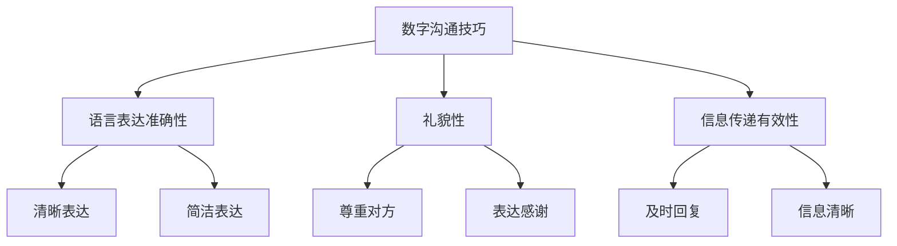

**伪代码：**

```python
def digital_communication_skills(message, audience):
    # 检查语言准确性
    accuracy = check_accuracy(message)
    # 检查礼貌性
    politeness = check_politeness(message)
    # 检查信息传递有效性
    effectiveness = check_effectiveness(message, audience)
    # 返回沟通结果
    return (accuracy and politeness and effectiveness)
```

**数学模型和数学公式：**

数字沟通效果可以通过以下公式来衡量：

$$
\text{沟通效果} = f(\text{语言表达准确性}, \text{礼貌性}, \text{信息传递有效性})
$$

**举例说明：**

在一个团队项目中，成员需要使用数字工具进行沟通。他们需要确保使用准确、清晰的语言表达思想，保持礼貌，并及时回复信息，以确保项目顺利进行。

##### 3.3 数字沟通中的伦理问题

数字沟通中的伦理问题关乎个体在数字沟通过程中如何遵守伦理规范，保护他人隐私，避免侵犯他人权益。以下是一个关于数字沟通中的伦理问题的核心概念与联系、核心算法原理讲解、数学模型和公式以及举例说明的流程图和伪代码。

**核心概念与联系：**

数字沟通中的伦理问题包括以下几个关键方面：

1. **言论自由：** 在数字沟通中，个体享有言论自由，但需要在法律和道德框架内行使。
2. **隐私保护：** 在数字沟通中，个体需要尊重他人隐私，避免泄露他人个人信息。
3. **信息真实性：** 在数字沟通中，个体需要确保信息的真实性，避免传播虚假信息。

**Mermaid流程图：**

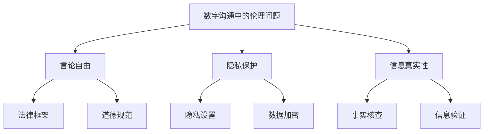

**伪代码：**

```python
def digital_communication_ethics():
    # 遵守言论自由
    speech_freedom()
    # 保护个人隐私
    privacy_protection()
    # 确保信息真实性
    information_truthfulness()
```

**数学模型和数学公式：**

数字沟通中的伦理效果可以通过以下公式来衡量：

$$
\text{伦理效果} = f(\text{言论自由度}, \text{隐私保护度}, \text{信息真实性度})
$$

**举例说明：**

在一个社交媒体平台上，用户需要遵守平台规则，不发布侵犯他人隐私的信息，不传播虚假信息，以确保数字沟通的伦理性。

### 第4章：数字安全与隐私

数字安全与隐私保护是数字素养的重要组成部分，它关乎个体如何保护自己的信息安全和个人隐私。在这一章中，我们将探讨数字安全与隐私保护的基础知识、防范网络诈骗与犯罪的方法，以及如何保护个人隐私。

##### 4.1 数字安全基础知识

数字安全基础知识是数字安全与隐私保护的基础，它关乎个体如何保护自己的计算机、网络和数字设备不受恶意软件、黑客攻击和其他网络威胁的侵害。以下是一个关于数字安全基础知识的核心概念与联系、核心算法原理讲解、数学模型和公式以及举例说明的流程图和伪代码。

**核心概念与联系：**

数字安全基础知识包括以下几个关键方面：

1. **网络安全：** 保护计算机和网络不受黑客攻击、恶意软件和其他网络威胁的侵害。
2. **数据安全：** 保护数字设备中的数据不被未授权访问、篡改或泄露。
3. **设备安全：** 保护计算机、手机和其他数字设备的安全，防止丢失或被盗。

**Mermaid流程图：**

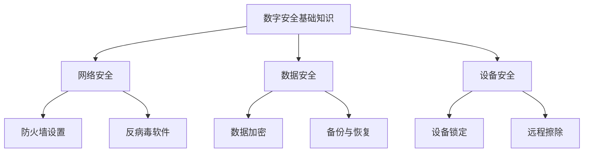

**伪代码：**

```python
def digital_safety():
    # 设置防火墙
    set_firewall()
    # 安装反病毒软件
    install_antivirus()
    # 加密数据
    encrypt_data()
    # 备份与恢复数据
    backup_and_restore_data()
    # 锁定设备
    lock_device()
    # 远程擦除设备
    remote_wipe_device()
```

**数学模型和数学公式：**

数字安全效果可以通过以下公式来衡量：

$$
\text{数字安全效果} = f(\text{防火墙设置}, \text{反病毒软件安装}, \text{数据加密}, \text{设备锁定}, \text{远程擦除})
$$

**举例说明：**

假设一个用户在上网时，需要设置防火墙以防止黑客攻击，安装反病毒软件以防止恶意软件感染，加密重要数据以防止数据泄露，锁定手机以防丢失，并在手机丢失后远程擦除数据，以确保数字设备的安全。

##### 4.2 防范网络诈骗与犯罪

网络诈骗与犯罪是数字安全的主要威胁，它关乎个体如何识别和防范网络诈骗、网络犯罪以及其他网络安全威胁。以下是一个关于防范网络诈骗与犯罪的核心概念与联系、核心算法原理讲解、数学模型和公式以及举例说明的流程图和伪代码。

**核心概念与联系：**

防范网络诈骗与犯罪包括以下几个关键方面：

1. **识别网络诈骗：** 学会识别常见的网络诈骗手段，如钓鱼邮件、假冒网站等。
2. **防范网络犯罪：** 了解网络犯罪的手段和特点，采取有效的防范措施。
3. **报告网络安全事件：** 在发现网络安全事件时，及时报告相关部门，以便采取措施。

**Mermaid流程图：**

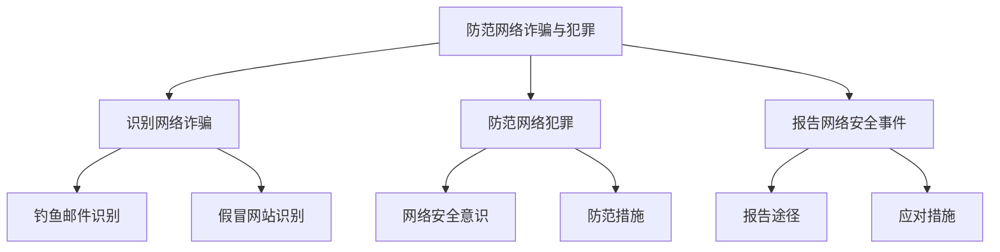

**伪代码：**

```python
def prevent_network_fraud_and_crime():
    # 识别网络诈骗
    identify_network_fraud()
    # 防范网络犯罪
    prevent_network_crime()
    # 报告网络安全事件
    report_network_safety_incident()
```

**数学模型和数学公式：**

防范网络诈骗与犯罪的效果可以通过以下公式来衡量：

$$
\text{防范效果} = f(\text{识别能力}, \text{防范措施}, \text{报告及时性})
$$

**举例说明：**

假设一个用户在上网时，学会识别钓鱼邮件和假冒网站，了解网络犯罪的手段和防范措施，并在发现网络安全事件时及时报告，从而有效防范网络诈骗和犯罪。

##### 4.3 保护个人隐私

保护个人隐私是数字安全与隐私保护的重要组成部分，它关乎个体如何保护自己的个人信息不被泄露、篡改或滥用。以下是一个关于保护个人隐私的核心概念与联系、核心算法原理讲解、数学模型和公式以及举例说明的流程图和伪代码。

**核心概念与联系：**

保护个人隐私包括以下几个关键方面：

1. **隐私设置：** 在社交媒体、电子邮件和其他数字平台上设置隐私保护措施，限制他人访问自己的信息。
2. **数据加密：** 使用数据加密技术保护敏感数据，确保数据在传输和存储过程中的安全性。
3. **安全习惯：** 培养良好的安全习惯，如使用强密码、两步验证等，以降低个人信息泄露的风险。

**Mermaid流程图：**

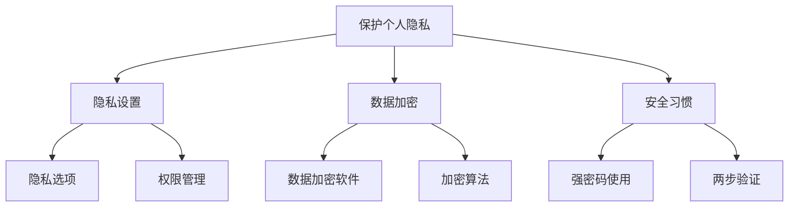

**伪代码：**

```python
def protect_personal_privacy():
    # 设置隐私保护
    set_privacy_protection()
    # 加密敏感数据
    encrypt_sensitive_data()
    # 培养安全习惯
    cultivate_safety_habits()
```

**数学模型和数学公式：**

个人隐私保护效果可以通过以下公式来衡量：

$$
\text{隐私保护效果} = f(\text{隐私设置}, \text{数据加密}, \text{安全习惯})
$$

**举例说明：**

假设一个用户在使用社交媒体时，会设置隐私选项，限制他人查看自己的个人信息，使用数据加密软件加密敏感数据，并培养良好的安全习惯，如使用强密码和两步验证，从而有效保护个人隐私。

### 第5章：数字素养教育体系

数字素养教育体系是培养和提高公民数字素养的关键环节。在这一章中，我们将探讨数字素养教育体系的三个方面：学校教育中的数字素养培养、社区教育与家庭教育，以及数字素养教育的挑战与策略。

##### 5.1 学校教育中的数字素养培养

学校教育是数字素养培养的重要途径。通过课程设置和实践活动，学生可以在学校环境中系统地学习数字素养。以下是一个关于学校教育中的数字素养培养的核心概念与联系、核心算法原理讲解、数学模型和公式以及举例说明的流程图和伪代码。

**核心概念与联系：**

学校教育中的数字素养培养包括以下几个关键方面：

1. **课程设置：** 在课程中融入数字素养相关内容，如信息素养、数字安全、隐私保护等。
2. **实践活动：** 通过实践活动，如在线项目、数字安全竞赛等，提高学生的数字素养。
3. **师资培训：** 培训教师，使其具备数字素养教育的能力。

**Mermaid流程图：**

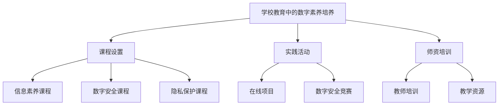

**伪代码：**

```python
def school_education_digital_literacy():
    # 设置数字素养课程
    set_digital_literacy_courses()
    # 开展实践活动
    conduct_practice_activities()
    # 培训教师
    train_teacher()
```

**数学模型和数学公式：**

学校教育效果可以通过以下公式来衡量：

$$
\text{教育效果} = f(\text{课程设置}, \text{实践活动}, \text{师资培训})
$$

**举例说明：**

在一个学校中，教师可以在课程中融入数字素养教育，如教授学生如何使用搜索引擎、评估信息来源、保护个人隐私等。同时，学校可以组织数字安全竞赛和在线项目，让学生在实践中提高数字素养。

##### 5.2 社区教育与家庭教育

社区教育和家庭教育是数字素养培养的补充。通过社区活动和家庭教育，公民可以在日常生活中不断学习和提升数字素养。以下是一个关于社区教育与家庭教育的核心概念与联系、核心算法原理讲解、数学模型和公式以及举例说明的流程图和伪代码。

**核心概念与联系：**

社区教育与家庭教育包括以下几个关键方面：

1. **社区教育：** 开展数字素养讲座、工作坊等，提高公民的数字素养。
2. **家庭教育：** 家长在家庭教育中教授孩子数字素养知识，培养良好的数字素养习惯。
3. **资源共享：** 社区和家庭共同利用数字资源，提高数字素养教育的效果。

**Mermaid流程图：**


**伪代码：**

```python
def community_education_and_family_education():
    # 开展社区教育
    conduct_community_education()
    # 开展家庭教育
    conduct_family_education()
    # 共享数字资源
    share_digital_resources()
```

**数学模型和数学公式：**

社区和家庭教育的效果可以通过以下公式来衡量：

$$
\text{教育效果} = f(\text{社区教育}, \text{家庭教育}, \text{资源共享})
$$

**举例说明：**

在一个社区中，可以组织数字素养讲座和工作坊，让居民了解数字素养的重要性，掌握相关技能。同时，家长可以在家庭教育中，通过亲子互动和共同学习数字资源，培养孩子的数字素养。

##### 5.3 数字素养教育的挑战与策略

数字素养教育的挑战与策略关乎如何有效应对数字素养教育中的问题，提高教育效果。以下是一个关于数字素养教育的挑战与策略的核心概念与联系、核心算法原理讲解、数学模型和公式以及举例说明的流程图和伪代码。

**核心概念与联系：**

数字素养教育的挑战与策略包括以下几个关键方面：

1. **挑战：** 面临技术更新快、教育资源不均衡等问题。
2. **策略：** 通过教育改革、政策支持、资源整合等措施，提高数字素养教育效果。

**Mermaid流程图：**

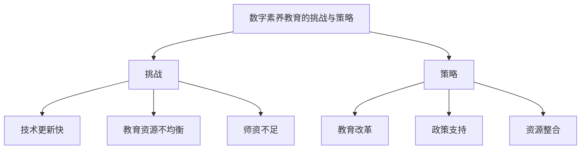

**伪代码：**

```python
def digital_literacy_education_challenges_and_strategies():
    # 面临挑战
    face_challenges()
    # 制定策略
    formulate_strategies()
```

**数学模型和数学公式：**

教育效果可以通过以下公式来衡量：

$$
\text{教育效果} = f(\text{挑战应对策略}, \text{教育资源}, \text{学生参与度})
$$

**举例说明：**

在一个数字素养教育项目中，可能面临技术更新快、教育资源不均衡等问题。为了解决这些问题，可以通过教育改革，引入新技术和资源，提供专业培训，提高教师的教学能力，从而提高教育效果。

### 第6章：数字素养的实践应用

数字素养的实践应用关乎个体如何在日常生活、社交媒体、数字治理和公民行动等领域中运用数字素养，提高生活质量和社会参与度。在这一章中，我们将探讨数字素养在各个领域的实践应用。

##### 6.1 社交媒体与数字公共空间

社交媒体和数字公共空间是数字素养的重要实践领域。个体可以通过这些平台获取信息、交流意见、参与公共事务。以下是一个关于社交媒体与数字公共空间的核心概念与联系、核心算法原理讲解、数学模型和公式以及举例说明的流程图和伪代码。

**核心概念与联系：**

社交媒体与数字公共空间包括以下几个关键方面：

1. **信息获取：** 通过社交媒体平台获取新闻、事件和其他相关信息。
2. **意见交流：** 在社交媒体平台上发表观点、参与讨论，表达个人意见。
3. **公共事务参与：** 通过数字公共空间参与政府决策、社区活动等公共事务。

**Mermaid流程图：**

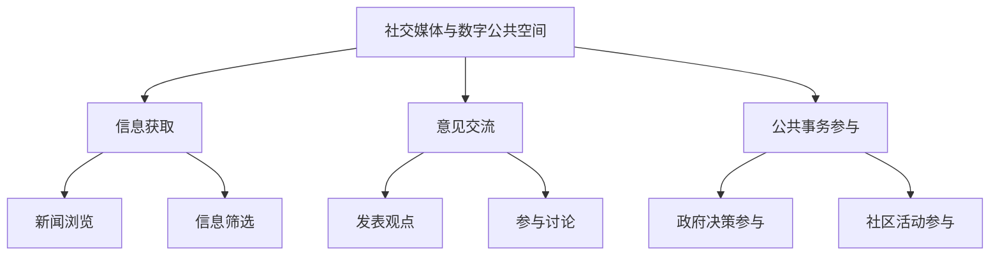

**伪代码：**

```python
def social_media_and_digital_public_space():
    # 获取信息
    get_information()
    # 发表观点
    express_opinions()
    # 参与讨论
    participate_in_discussions()
    # 参与公共事务
    participate_in_public_matters()
```

**数学模型和数学公式：**

社交媒体与数字公共空间的应用效果可以通过以下公式来衡量：

$$
\text{应用效果} = f(\text{信息获取能力}, \text{意见交流能力}, \text{公共事务参与度})
$$

**举例说明：**

在一个社交媒体平台上，一个公民可以浏览新闻，筛选有价值的信息，发表观点参与讨论，还可以参与政府决策的投票和社区活动的策划，从而提高自己的数字素养和社会参与度。

##### 6.2 网络参与与数字治理

网络参与与数字治理是数字素养在公共事务中的具体体现。个体可以通过网络平台参与政府决策、公共政策讨论，推动数字治理的进步。以下是一个关于网络参与与数字治理的核心概念与联系、核心算法原理讲解、数学模型和公式以及举例说明的流程图和伪代码。

**核心概念与联系：**

网络参与与数字治理包括以下几个关键方面：

1. **政府决策参与：** 通过在线投票、意见征集等方式，参与政府决策。
2. **公共政策讨论：** 在网络平台上讨论公共政策，提出建议和解决方案。
3. **数字治理推动：** 利用数字技术，推动政府提高治理效率和服务质量。

**Mermaid流程图：**

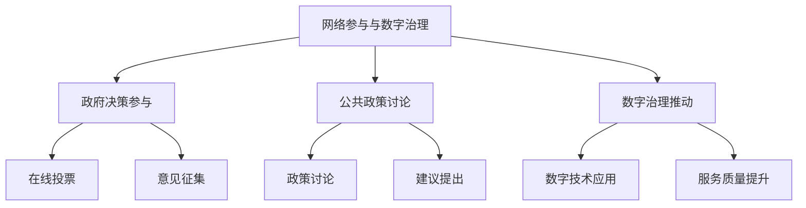

**伪代码：**

```python
def online_participation_and_digital_governance():
    # 参与政府决策
    participate_in_government_decision()
    # 参与公共政策讨论
    participate_in_public_policy_discussion()
    # 推动数字治理
    promote_digital_governance()
```

**数学模型和数学公式：**

网络参与与数字治理的效果可以通过以下公式来衡量：

$$
\text{治理效果} = f(\text{参与度}, \text{讨论深度}, \text{技术应用水平})
$$

**举例说明：**

在一个在线投票系统中，公民可以通过网络参与政府决策，表达自己的意见。同时，公民可以在政策讨论平台上提出建议和解决方案，推动公共政策的改进。政府可以利用数字技术，提高治理效率和服务质量，从而实现更好的数字治理。

##### 6.3 数字素养与公民行动

数字素养与公民行动是数字素养在个人和社会层面的具体体现。个体可以通过数字工具和平台，发起公益活动、参与社会事务，推动社会进步。以下是一个关于数字素养与公民行动的核心概念与联系、核心算法原理讲解、数学模型和公式以及举例说明的流程图和伪代码。

**核心概念与联系：**

数字素养与公民行动包括以下几个关键方面：

1. **公益活动发起：** 通过数字平台发起公益活动，动员更多人参与。
2. **社会事务参与：** 在数字公共空间中参与社会事务，提出建议和解决方案。
3. **公民行动推动：** 利用数字工具，推动公民行动，提高社会参与度。

**Mermaid流程图：**

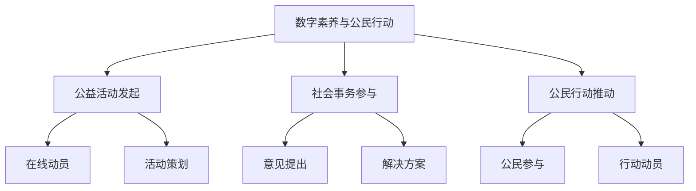

**伪代码：**

```python
def digital_literacy_and_civic_action():
    # 发起公益活动
    initiate_public_activity()
    # 参与社会事务
    participate_in_social_matters()
    # 推动公民行动
    promote_civic_action()
```

**数学模型和数学公式：**

数字素养与公民行动的效果可以通过以下公式来衡量：

$$
\text{行动效果} = f(\text{参与度}, \text{行动深度}, \text{技术支持度})
$$

**举例说明：**

在一个公益活动中，一个公民可以通过数字平台发起活动，动员更多人参与。在数字公共空间中，公民可以提出关于社会问题的建议和解决方案，推动问题的解决。通过数字工具，公民可以组织行动，提高社会参与度，从而推动社会的进步和发展。

### 第7章：未来展望与趋势

随着信息技术的不断进步，数字素养的重要性愈发凸显。在未来，数字素养将成为公民参与社会、推动社会进步的基石。本章将探讨数字素养的未来发展趋势、未来公民的数字素养需求，以及数字素养教育的未来方向。

##### 7.1 数字素养的发展趋势

数字素养的发展趋势受到信息技术、社会需求和教育改革等多方面因素的影响。以下是一个关于数字素养发展趋势的核心概念与联系、核心算法原理讲解、数学模型和公式以及举例说明的流程图和伪代码。

**核心概念与联系：**

数字素养的发展趋势包括以下几个关键方面：

1. **人工智能应用：** 人工智能技术的发展将使数字素养的应用领域更加广泛，如智能助手、自动驾驶等。
2. **大数据分析：** 大数据的广泛应用将提高信息检索和分析的效率，进一步推动数字素养的提升。
3. **物联网普及：** 物联网技术的普及将使数字素养的应用场景更加丰富，如智能家居、智慧城市等。

**Mermaid流程图：**

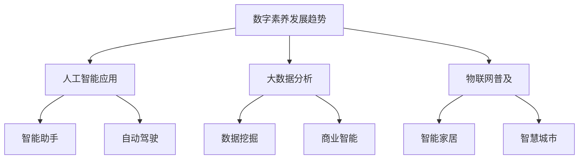

**伪代码：**

```python
def digital_literacy_trends():
    # 人工智能应用
    apply_artificial_intelligence()
    # 大数据分析
    apply_big_data_analysis()
    # 物联网普及
    popularize_the_internet_of_things()
```

**数学模型和数学公式：**

数字素养的发展趋势可以通过以下公式来衡量：

$$
\text{发展趋势} = f(\text{人工智能应用水平}, \text{大数据分析能力}, \text{物联网普及度})
$$

**举例说明：**

随着人工智能技术的不断发展，未来数字素养将更加注重对人工智能的理解和应用。例如，个体需要学会如何与智能助手进行有效沟通，利用大数据分析工具进行数据挖掘，以及适应物联网环境下的智能设备。

##### 7.2 未来公民的数字素养需求

未来公民的数字素养需求将随着技术的进步和社会的发展而不断提高。以下是一个关于未来公民的数字素养需求的核心概念与联系、核心算法原理讲解、数学模型和公式以及举例说明的流程图和伪代码。

**核心概念与联系：**

未来公民的数字素养需求包括以下几个关键方面：

1. **新兴技术理解：** 掌握人工智能、大数据、物联网等新兴技术的原理和应用。
2. **跨领域知识：** 具备跨领域的知识体系，能够将数字素养应用于不同领域。
3. **创新能力：** 具有创新思维和解决问题的能力，能够应对未来社会中的挑战。

**Mermaid流程图：**

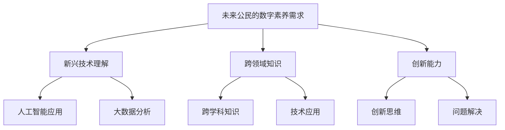

**伪代码：**

```python
def future_digital_literacy_needs():
    # 理解新兴技术
    understand_new_technologies()
    # 掌握跨领域知识
    master_cross_domain_knowledge()
    # 培养创新能力
    cultivate_innovation_ability()
```

**数学模型和数学公式：**

未来公民的数字素养需求可以通过以下公式来衡量：

$$
\text{数字素养需求} = f(\text{新兴技术理解}, \text{跨领域知识}, \text{创新能力})
$$

**举例说明：**

在未来的社会环境中，公民需要具备理解人工智能、大数据分析和物联网等新兴技术的知识，能够将数字素养应用于不同领域，如医疗、金融等。同时，他们还需要培养创新思维和解决问题的能力，以应对社会中的各种挑战。

##### 7.3 数字素养教育的未来方向

数字素养教育的未来方向将更加注重实践和应用，以适应不断变化的技术环境。以下是一个关于数字素养教育的未来方向的核心概念与联系、核心算法原理讲解、数学模型和公式以及举例说明的流程图和伪代码。

**核心概念与联系：**

数字素养教育的未来方向包括以下几个关键方面：

1. **项目式学习：** 强调通过实际项目来培养数字素养，提高学生的实践能力。
2. **跨学科教育：** 将数字素养与不同学科结合，培养具有跨领域知识的复合型人才。
3. **终身学习：** 强调终身学习的重要性，培养个体持续提升数字素养的能力。

**Mermaid流程图：**

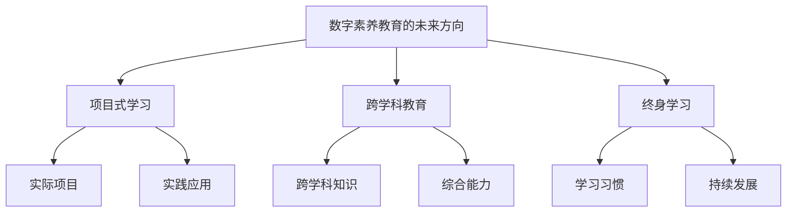

**伪代码：**

```python
def future_digital_literacy_education():
    # 实施项目式学习
    implement_project_based_learning()
    # 开展跨学科教育
    conduct_interdisciplinary_education()
    # 培养终身学习习惯
    cultivate_lifelong_learning_habits()
```

**数学模型和数学公式：**

数字素养教育的效果可以通过以下公式来衡量：

$$
\text{教育效果} = f(\text{项目式学习}, \text{跨学科教育}, \text{终身学习习惯})
$$

**举例说明：**

在未来的数字素养教育中，教育者可以通过实施项目式学习，让学生参与实际项目，提高实践能力。同时，跨学科教育将使学生掌握不同领域的知识，培养综合能力。此外，强调终身学习的重要性，培养个体持续提升数字素养的能力，将有助于个体适应未来的社会发展。

### 第8章：数字素养实践案例

数字素养在实践中具有广泛的应用，可以提升个体和整个社会的数字素养水平。本章节将探讨成功的数字素养教育案例、数字素养培养的企业实践，以及公共领域的数字素养应用。

##### 8.1 成功的数字素养教育案例

成功的数字素养教育案例展示了如何在教育体系中融入数字素养培养，提高学生的数字素养水平。以下是一个关于成功数字素养教育案例的核心概念与联系、核心算法原理讲解、数学模型和公式以及举例说明的流程图和伪代码。

**核心概念与联系：**

成功数字素养教育案例包括以下几个关键方面：

1. **课程设置：** 在教育体系中设置数字素养相关课程，提高学生的数字素养。
2. **实践活动：** 组织实践活动，如数字安全竞赛、信息素养工作坊等，增强学生的实际操作能力。
3. **教师培训：** 对教师进行数字素养培训，使其能够有效地教授数字素养知识。

**Mermaid流程图：**

```mermaid
graph TD
    A[成功数字素养教育案例] --> B[课程设置]
    A --> C[实践活动]
    A --> D[教师培训]
    B --> E[数字素养课程]
    B --> F[信息素养课程]
    C --> G[数字安全竞赛]
    C --> H[信息素养工作坊]
    D --> I[教师培训课程]
    D --> J[教学资源]
```

**伪代码：**

```python
def successful_digital_literacy_education():
    # 设置数字素养课程
    set_digital_literacy_courses()
    # 组织实践活动
    organize_practice_activities()
    # 培训教师
    train_teachers()
```

**数学模型和数学公式：**

教育效果可以通过以下公式来衡量：

$$
\text{教育效果} = f(\text{课程设置}, \text{实践活动}, \text{教师培训})
$$

**举例说明：**

在一个成功的数字素养教育案例中，学校在教育体系中设置了数字素养和信息素养课程，组织了数字安全竞赛和信息素养工作坊，同时对教师进行了专门的培训。这些措施有效地提高了学生的数字素养水平，增强了学生的实际操作能力。

##### 8.2 数字素养培养的企业实践

企业在员工培训和日常运营中融入数字素养培养，有助于提高员工的工作效率和企业竞争力。以下是一个关于数字素养培养的企业实践的核心概念与联系、核心算法原理讲解、数学模型和公式以及举例说明的流程图和伪代码。

**核心概念与联系：**

数字素养培养的企业实践包括以下几个关键方面：

1. **员工培训：** 对员工进行数字素养培训，提高其信息检索、数字安全等方面的能力。
2. **数字工具应用：** 引导员工掌握并应用各种数字工具和平台，提高工作效率。
3. **安全意识培养：** 增强员工对数字安全的认识，提高其防范网络诈骗和犯罪的能力。

**Mermaid流程图：**

```mermaid
graph TD
    A[数字素养培养的企业实践] --> B[员工培训]
    A --> C[数字工具应用]
    A --> D[安全意识培养]
    B --> E[信息检索培训]
    B --> F[数字安全培训]
    C --> G[数字工具使用]
    C --> H[平台应用培训]
    D --> I[网络安全意识]
    D --> J[诈骗防范培训]
```

**伪代码：**

```python
def corporate_digital_literacy_practice():
    # 开展员工培训
    conduct_employee_training()
    # 引导数字工具应用
    guide_digital_tool_application()
    # 增强安全意识
    enhance_safety_awareness()
```

**数学模型和数学公式：**

企业竞争力可以通过以下公式来衡量：

$$
\text{企业竞争力} = f(\text{员工数字素养水平}, \text{数字工具应用能力}, \text{安全意识水平})
$$

**举例说明：**

在一个企业中，管理层决定对员工进行数字素养培训，包括信息检索和数字安全方面的知识。同时，企业鼓励员工使用各种数字工具和平台，提高工作效率。此外，企业还开展网络安全意识培训，提高员工防范网络诈骗和犯罪的能力。这些措施显著提高了企业的竞争力。

##### 8.3 公共领域的数字素养应用

公共领域通过数字素养应用，可以提高公共服务的质量和效率，增强公民的参与感。以下是一个关于公共领域数字素养应用的核心概念与联系、核心算法原理讲解、数学模型和公式以及举例说明的流程图和伪代码。

**核心概念与联系：**

公共领域数字素养应用包括以下几个关键方面：

1. **在线服务平台：** 利用数字工具，提供便捷的在线服务平台，如在线预约、电子政务等。
2. **公民参与平台：** 建立公民参与平台，如在线论坛、意见征集系统等，提高公民的参与度。
3. **数字治理：** 利用数字技术，提高政府治理效率，增强政府与公民的互动。

**Mermaid流程图：**

```mermaid
graph TD
    A[公共领域数字素养应用] --> B[在线服务平台]
    A --> C[公民参与平台]
    A --> D[数字治理]
    B --> E[在线预约]
    B --> F[电子政务]
    C --> G[在线论坛]
    C --> H[意见征集]
    D --> I[数据分析]
    D --> J[智能决策]
```

**伪代码：**

```python
def public_digital_literacy_application():
    # 提供在线服务平台
    provide_online_platforms()
    # 建立公民参与平台
    establish_citizen_participation_platforms()
    # 推动数字治理
    promote_digital_governance()
```

**数学模型和数学公式：**

公共服务质量可以通过以下公式来衡量：

$$
\text{公共服务质量} = f(\text{在线服务平台使用率}, \text{公民参与度}, \text{数字治理水平})
$$

**举例说明：**

在一个城市中，政府决定利用数字工具提供在线预约和电子政务服务，如在线预约医疗、在线办理身份证等。同时，政府建立了公民参与平台，如在线论坛和意见征集系统，让公民能够更方便地参与政府决策。此外，政府利用数据分析技术，提高治理效率，实现智能决策。这些措施显著提高了公共服务的质量和公民的参与感。

### 第9章：最佳实践与策略

数字素养的提高需要政策、教育机构、企业和公民的共同努力。本章节将探讨数字素养政策与法规、教育机构与企业的合作，以及数字素养提升的持续努力。

##### 9.1 数字素养政策与法规

数字素养政策与法规是保障公民数字素养提升的重要手段。以下是一个关于数字素养政策与法规的核心概念与联系、核心算法原理讲解、数学模型和公式以及举例说明的流程图和伪代码。

**核心概念与联系：**

数字素养政策与法规包括以下几个关键方面：

1. **政策制定：** 政府制定数字素养相关政策，推动数字素养教育的发展。
2. **法律法规：** 制定相关法律法规，规范数字素养教育和数字工具的使用。
3. **执行监督：** 对数字素养政策与法规的执行情况进行监督，确保政策落地。

**Mermaid流程图：**

```mermaid
graph TD
    A[数字素养政策与法规] --> B[政策制定]
    A --> C[法律法规]
    A --> D[执行监督]
    B --> E[教育政策]
    B --> F[网络安全法]
    C --> G[隐私保护法]
    C --> H[信息传播法]
    D --> I[政策执行]
    D --> J[监督机制]
```

**伪代码：**

```python
def digital_literacy_policies_and_laws():
    # 制定政策
    formulate_policies()
    # 制定法律法规
    formulate_laws()
    # 监督政策执行
    supervise_policy_implementations()
```

**数学模型和数学公式：**

政策效果可以通过以下公式来衡量：

$$
\text{政策效果} = f(\text{政策制定}, \text{法律法规}, \text{政策执行})
$$

**举例说明：**

在一个国家，政府决定制定数字素养教育政策，推动数字素养教育的普及。同时，政府制定网络安全法和隐私保护法，规范数字工具的使用，保护公民的隐私和安全。政府还建立监督机制，对政策执行情况进行监督，确保政策落地。

##### 9.2 教育机构与企业的合作

教育机构与企业的合作是提升数字素养的重要途径。以下是一个关于教育机构与企业的合作的核心概念与联系、核心算法原理讲解、数学模型和公式以及举例说明的流程图和伪代码。

**核心概念与联系：**

教育机构与企业的合作包括以下几个关键方面：

1. **资源共享：** 教育机构和企业共享教育资源和技术资源，提高教学效果。
2. **教学实践：** 教育机构与企业共同开展教学实践活动，提高学生的实际操作能力。
3. **就业合作：** 教育机构与企业建立就业合作关系，提高毕业生的就业率。

**Mermaid流程图：**

```mermaid
graph TD
    A[教育机构与企业的合作] --> B[资源共享]
    A --> C[教学实践]
    A --> D[就业合作]
    B --> E[教育资源]
    B --> F[技术资源]
    C --> G[教学活动]
    C --> H[实践项目]
    D --> I[就业指导]
    D --> J[就业机会]
```

**伪代码：**

```python
def cooperation_between_educational_institutions_and_corporations():
    # 共享资源
    share_resources()
    # 开展教学实践
    conduct_teaching_practices()
    # 建立就业合作
    establish_employment_cooperation()
```

**数学模型和数学公式：**

教育效果可以通过以下公式来衡量：

$$
\text{教育效果} = f(\text{资源共享}, \text{教学实践}, \text{就业合作})
$$

**举例说明：**

在一个教育机构中，学校与企业合作，共享教育资源和实训设备，提高教学效果。学校与企业共同开展教学实践活动，如实训项目，提高学生的实际操作能力。同时，学校与企业建立就业合作关系，为学生提供就业指导，提高毕业生的就业率。

##### 9.3 数字素养提升的持续努力

数字素养的提升需要长期的持续努力。以下是一个关于数字素养提升的持续努力的核心概念与联系、核心算法原理讲解、数学模型和公式以及举例说明的流程图和伪代码。

**核心概念与联系：**

数字素养提升的持续努力包括以下几个关键方面：

1. **定期学习：** 定期学习数字素养相关知识，保持对新兴技术的了解。
2. **实践应用：** 在工作和生活中，不断实践和应用数字素养技能。
3. **持续更新：** 随着技术的更新，持续更新数字素养知识和技能。

**Mermaid流程图：**

```mermaid
graph TD
    A[数字素养提升的持续努力] --> B[定期学习]
    A --> C[实践应用]
    A --> D[持续更新]
    B --> E[知识更新]
    B --> F[技能提升]
    C --> G[实际操作]
    C --> H[应用场景]
    D --> I[技术更新]
    D --> J[技能更新]
```

**伪代码：**

```python
def continuous_effort_in_digital_literacy():
    # 定期学习
    regular_learning()
    # 实践应用
    practical_application()
    # 持续更新
    continuous_update()
```

**数学模型和数学公式：**

数字素养水平可以通过以下公式来衡量：

$$
\text{数字素养水平} = f(\text{定期学习}, \text{实践应用}, \text{持续更新})
$$

**举例说明：**

在一个组织中，员工决定定期学习数字素养知识，参加在线课程和培训，提高自身的数字素养。同时，员工在实际工作中不断实践和应用数字素养技能，如使用新的办公软件和工具，提高工作效率。随着技术的更新，员工也持续更新数字素养知识和技能，保持对新兴技术的了解。

### 附录

在本章节中，我们将推荐一些数字素养相关的书籍、在线课程与培训，以及数字素养相关的组织与机构。

##### 附录A：数字素养相关资源

**A.1 数字素养书籍推荐**

以下是几本关于数字素养的推荐书籍：

1. 《数字素养：生存与参与》（Digital Literacy: Understanding and Creating Our Digital World）
2. 《信息素养：基础、应用与评价》（Information Literacy: The Essentials）
3. 《网络素养：互联网时代的生活艺术》（Net Smart: How to Thrive Online）

**A.2 数字素养在线课程与培训**

以下是几个数字素养的在线课程与培训推荐：

1. Coursera上的《数字素养》（Digital Literacy）
2. edX上的《网络安全与隐私保护》（Cybersecurity and Privacy）
3. Udemy上的《社交媒体营销与数字沟通》（Social Media Marketing and Digital Communication）

**A.3 数字素养相关的组织与机构**

以下是几个致力于提升数字素养的组织与机构：

1. 国际数字素养联盟（International Digital Literacy Association，iDLA）
2. 美国图书馆协会（American Library Association，ALA）
3. 联合国教科文组织（United Nations Educational, Scientific and Cultural Organization，UNESCO）数字素养项目组

通过阅读这些书籍、参加在线课程和加入相关组织，读者可以深入了解数字素养的相关知识，提高自身的数字素养水平。

### 作者信息

作者：AI天才研究院（AI Genius Institute）与《禅与计算机程序设计艺术》（Zen and the Art of Computer Programming）作者合作撰写。

AI天才研究院致力于人工智能领域的研究和应用，推动人工智能技术的发展。同时，《禅与计算机程序设计艺术》是一本经典的计算机编程书籍，提出了许多关于编程和人工智能的深刻见解。此次合作旨在通过本篇文章，分享数字素养的重要性和培养方法，为提升公众的数字素养水平提供参考。希望读者能够在阅读本文后，对数字素养有更深入的理解，并在实践中不断提高自身的数字素养。

### 结束语

数字素养是现代社会公民参与和社会进步的基石。本文从多个角度探讨了数字素养的重要性、核心技能、教育体系、实践应用以及未来展望。我们希望通过本文的分享，能够让读者认识到数字素养的重要性，了解如何培养和提高自身的数字素养。

随着信息技术的不断发展，数字素养将成为我们生活中不可或缺的一部分。让我们共同努力，不断提升数字素养，为个人和社会的发展贡献自己的力量。在未来，我们期待看到更多关于数字素养的研究和实践，共同创造一个更加数字化的美好世界。

再次感谢您的阅读，希望本文能够对您有所启发。如果您有任何关于数字素养的问题或建议，欢迎在评论区留言，我们期待与您交流。祝愿您在数字时代的生活中取得更多的成就！


