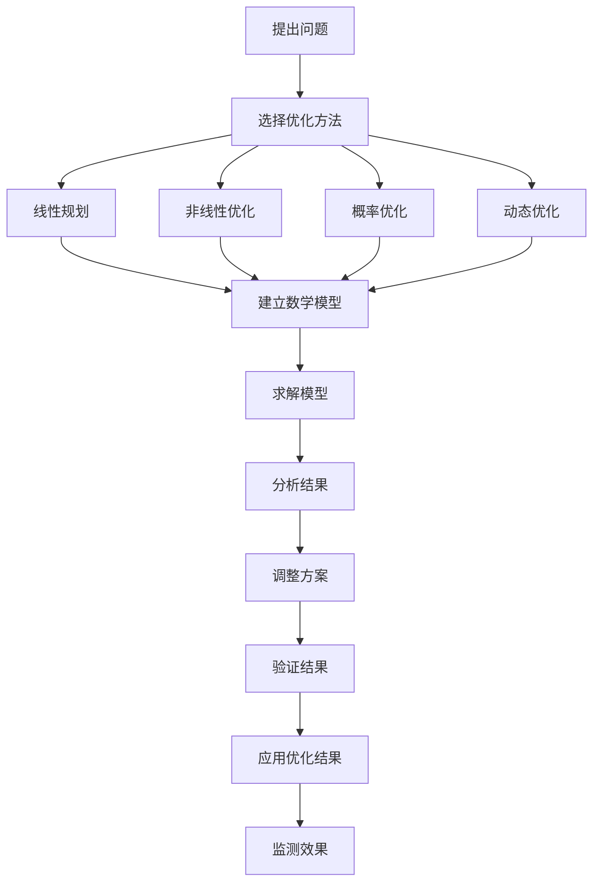

                 


### 数学与农业政策：农业生产的数学优化

> **关键词**：数学优化、农业生产、线性规划、非线性优化、动态优化、概率优化、农业政策制定。

> **摘要**：本文探讨了数学优化在农业生产中的应用，从基础理论到实际应用，详细介绍了线性优化、非线性优化、概率优化和动态优化等数学优化方法在农业生产中的具体应用，并分析了这些方法在农业政策制定中的作用和影响。通过实际案例，展示了数学优化在提高农业生产效率、优化资源配置、降低成本、提升农产品质量等方面的作用，为农业可持续发展提供了新的思路和方法。

### 目录大纲

- **第1章 引言与背景**
  - **1.1 书籍概述**
  - **1.2 农业生产的重要性**
  - **1.3 数学优化在农业中的应用

- **第2章 农业生产中的数学优化基础**
  - **2.1 数学优化基本概念**
  - **2.2 农业生产中的常见优化问题**
  - **2.3 数学工具与方法

- **第3章 农业生产中的线性优化**
  - **3.1 线性优化模型**
  - **3.2 单变量线性优化**
  - **3.3 多变量线性优化**
  - **3.4 线性规划案例分析

- **第4章 农业生产中的非线性优化**
  - **4.1 非线性优化模型**
  - **4.2 拉格朗日乘数法**
  - **4.3 模拟退火算法**
  - **4.4 非线性优化案例分析

- **第5章 农业生产中的概率优化**
  - **5.1 概率优化基本概念**
  - **5.2 农业风险建模**
  - **5.3 遗传算法**
  - **5.4 随机优化案例分析

- **第6章 农业生产中的动态优化**
  - **6.1 动态优化模型**
  - **6.2 递推关系**
  - **6.3 动态规划**
  - **6.4 动态优化案例分析

- **第7章 农业政策制定中的数学优化**
  - **7.1 农业政策分析**
  - **7.2 成本-收益分析**
  - **7.3 数据分析在农业政策中的应用**
  - **7.4 政策优化案例分析

- **第8章 综合案例分析与应用前景**
  - **8.1 现实农业案例**
  - **8.2 数学优化方法在农业中的应用前景**
  - **8.3 潜在挑战与解决方案**

- **第9章 结论与展望**
  - **9.1 总结与回顾**
  - **9.2 展望未来农业生产的数学优化发展方向**

### 第1章 引言与背景

#### 1.1 书籍概述

《数学与农业政策：农业生产的数学优化》旨在探讨数学优化在农业生产中的应用。本书将介绍各种数学优化方法，如线性规划、非线性规划、概率优化和动态优化等，并分析它们在农业生产中的具体应用。通过数学模型和方法，帮助读者理解并掌握如何利用数学优化技术提升农业生产效率。

#### 1.2 农业生产的重要性

农业生产是国民经济的基础产业，对全球粮食安全和农村经济发展具有至关重要的作用。随着全球人口增长和资源压力的增大，提高农业生产效率和优化资源配置显得尤为重要。数学优化技术作为一种强大的工具，能够帮助农业生产者提高生产效率，优化资源配置，降低成本，并提升农产品的质量。

#### 1.3 数学优化在农业中的应用

数学优化技术在农业生产中的应用十分广泛。以下是一些典型的应用场景：

1. **作物种植优化**：通过数学模型，确定最佳的作物种植方案，包括种植面积、种植时间和种植密度等，以达到产量最大化和成本最小化。

2. **灌溉优化**：利用数学优化方法，制定最佳的灌溉策略，包括灌溉时间、灌溉量和灌溉频率等，以提高水资源利用效率。

3. **肥料分配优化**：通过数学模型，确定最佳的肥料用量和施用时间，以达到肥料利用最大化和环境负荷最小化。

4. **病虫害防治**：利用数学优化方法，预测病虫害的发生和发展趋势，优化防治措施，减少农药的使用量，降低对环境的污染。

5. **农业政策制定**：在农业政策的制定过程中，可以通过数学优化方法，对各种政策方案进行评估和比较，选择最优的政策方案。

通过这些应用，数学优化技术为农业生产提供了科学、高效的解决方案，有助于实现农业的可持续发展。接下来的章节将详细探讨这些数学优化方法在农业生产中的应用。

### 第2章 农业生产中的数学优化基础

#### 2.1 数学优化基本概念

数学优化是一门研究如何寻找某一目标函数在给定约束条件下的最优解的学科。在农业生产中，优化目标可以是提高产量、降低成本、最大化收益等。数学优化主要包括以下基本概念：

- **目标函数**：目标是优化的问题的核心，表示需要最大化或最小化的量。在农业生产中，目标函数可以是总产量、总成本、利润等。

- **约束条件**：限制目标函数达到最优值的条件，可以是资源的限制、时间限制、技术限制等。例如，在灌溉优化中，水的可用量是约束条件。

- **最优解**：满足所有约束条件下，目标函数达到最大值或最小值的解。

- **可行解**：满足所有约束条件的解。

#### 2.2 农业生产中的常见优化问题

在农业生产中，常见的优化问题包括作物种植优化、灌溉优化、肥料分配优化等。以下是一些典型的优化问题：

- **作物种植优化**：确定最佳的作物种植方案，包括种植面积、种植时间、种植密度等，以达到产量最大化的目标。

  **优化问题**：
  $$
  \begin{align*}
  \text{maximize} \quad & P(x, y, z) \\
  \text{subject to} \quad & g_1(x, y, z) \leq 0 \\
  & g_2(x, y, z) \leq 0 \\
  & \dots \\
  & g_n(x, y, z) \leq 0
  \end{align*}
  $$
  其中，$P(x, y, z)$ 是目标函数（产量），$g_1(x, y, z), g_2(x, y, z), \dots, g_n(x, y, z)$ 是约束条件。

- **灌溉优化**：确定最佳的灌溉策略，包括灌溉时间、灌溉量和灌溉频率，以达到水资源利用最大化的目标。

  **优化问题**：
  $$
  \begin{align*}
  \text{maximize} \quad & R(w, t) \\
  \text{subject to} \quad & C(w, t) \leq C_{\text{max}} \\
  & H(w, t) \leq H_{\text{max}} \\
  \end{align*}
  $$
  其中，$R(w, t)$ 是目标函数（水资源利用率），$C(w, t)$ 和 $H(w, t)$ 是约束条件（水的可用量和灌溉量）。

- **肥料分配优化**：确定最佳的肥料用量和施用时间，以达到肥料利用最大化和环境负荷最小化的目标。

  **优化问题**：
  $$
  \begin{align*}
  \text{minimize} \quad & \text{Cost}(f) \\
  \text{subject to} \quad & N_{\text{max}} \geq N(f) \\
  & P_{\text{max}} \geq P(f) \\
  \end{align*}
  $$
  其中，$Cost(f)$ 是目标函数（肥料成本），$N(f)$ 和 $P(f)$ 是约束条件（氮和磷的总量限制）。

#### 2.3 数学工具与方法

在解决农业生产中的优化问题时，常用的数学工具与方法包括线性规划、非线性规划、遗传算法等。

- **线性规划**：适用于目标函数和约束条件都是线性的优化问题。通过单纯形法或内点法求解。

  **线性规划问题**：
  $$
  \begin{align*}
  \text{maximize} \quad & c^T x \\
  \text{subject to} \quad & Ax \leq b \\
  & x \geq 0
  \end{align*}
  $$
  其中，$c$ 是目标函数系数向量，$x$ 是决策变量向量，$A$ 是约束条件系数矩阵，$b$ 是约束条件常数向量。

- **非线性规划**：适用于目标函数或约束条件至少有一个非线性的优化问题。可以通过拉格朗日乘数法或梯度下降法求解。

  **非线性规划问题**：
  $$
  \begin{align*}
  \text{minimize} \quad & f(x) \\
  \text{subject to} \quad & g(x) \leq 0, h(x) = 0
  \end{align*}
  $$
  其中，$f(x)$ 是目标函数，$g(x)$ 和 $h(x)$ 分别是非线性约束条件。

- **遗传算法**：一种基于自然进化过程的随机搜索算法，适用于求解复杂非线性优化问题。

  **遗传算法流程**：
  1. **初始化种群**：生成一组随机解作为初始种群。
  2. **适应度评估**：计算每个个体的适应度值。
  3. **选择**：选择适应度高的个体进行繁殖。
  4. **交叉**：通过交叉操作产生新的个体。
  5. **变异**：对个体进行变异操作，增加种群的多样性。
  6. **迭代**：重复适应度评估、选择、交叉和变异，直到满足终止条件（如找到最优解或达到最大迭代次数）。

通过这些数学工具和方法，农业生产中的优化问题可以得以有效解决，从而提高农业生产效率和资源利用效率。

### 第3章 农业生产中的线性优化

#### 3.1 线性优化模型

线性优化是数学优化中的一个重要分支，它主要解决的是目标函数和约束条件都是线性的优化问题。在农业生产中，线性优化可以用于作物种植优化、灌溉优化、肥料分配优化等多种应用场景。

线性优化模型的一般形式如下：

$$
\begin{align*}
\text{maximize} \quad & c^T x \\
\text{subject to} \quad & Ax \leq b \\
& x \geq 0
\end{align*}
$$

其中，$c$ 是目标函数系数向量，$x$ 是决策变量向量，$A$ 是约束条件系数矩阵，$b$ 是约束条件常数向量。$c^T x$ 表示目标函数，$Ax \leq b$ 表示约束条件。

线性优化模型的特点是目标函数和约束条件都是线性的，这意味着它们可以用线性方程或线性不等式来表示。这种特性使得线性优化问题相对容易求解，并且有成熟的方法来求解这类问题。

#### 3.2 单变量线性优化

单变量线性优化是指决策变量只有一个的线性优化问题。这类问题相对简单，通常可以通过一些简单的数学方法求解。单变量线性优化的一般形式如下：

$$
\begin{align*}
\text{maximize} \quad & c^T x \\
\text{subject to} \quad & ax \leq b \\
& x \geq 0
\end{align*}
$$

其中，$a$ 是约束条件的系数，$b$ 是约束条件的常数，$c^T x$ 是目标函数。

求解单变量线性优化问题的方法主要包括：

1. **图解法**：通过绘制约束条件和目标函数的图像，直观地找到最优解。

2. **解析法**：通过计算约束条件的端点值，比较这些值，找到最优解。

3. **搜索法**：通过逐步搜索决策变量的取值范围，找到最优解。

#### 3.3 多变量线性优化

多变量线性优化是指决策变量超过一个的线性优化问题。这类问题相对复杂，通常需要使用更复杂的数学方法求解。多变量线性优化的一般形式如下：

$$
\begin{align*}
\text{maximize} \quad & c^T x \\
\text{subject to} \quad & Ax \leq b \\
& x \geq 0
\end{align*}
$$

多变量线性优化问题的求解方法主要包括：

1. **单纯形法**：是一种迭代求解线性优化问题的方法，其基本思想是通过迭代交换基变量，逐渐逼近最优解。

2. **内点法**：是一种更高效的求解线性优化问题的方法，尤其适用于大型线性优化问题。

#### 3.4 线性规划案例分析

为了更好地理解线性优化在农业生产中的应用，我们来看一个具体的案例。

**案例：灌溉优化**

**目标**：在水资源有限的情况下，制定最优的灌溉策略，以最大化作物的产量。

**约束条件**：

- 水资源总量限制：$3x + 2y \leq 12$
- 灌溉面积限制：$x + y \leq 8$
- 土地面积限制：$x \leq 4$
- 零下界限制：$x, y \geq 0$

**目标函数**：最大化总产量 $f(x, y) = x + y$

**求解过程**：

1. **建立线性规划模型**：根据问题描述，建立线性规划模型如下：

   $$
   \begin{align*}
   \text{maximize} \quad & x + y \\
   \text{subject to} \quad & 3x + 2y \leq 12 \\
   & x + y \leq 8 \\
   & x \leq 4 \\
   & x, y \geq 0
   \end{align*}
   $$

2. **求解模型**：使用单纯形法求解线性规划模型。首先，选择初始基可行解$x=0, y=0$，然后进行迭代计算，直到找到最优解。

3. **结果分析**：求解得到的最优解为$x=4, y=0$，即最优的灌溉策略是只灌溉$x=4$的作物面积。

通过这个案例，我们可以看到线性优化方法在灌溉优化中可以有效地确定最优的灌溉方案，从而提高灌溉效率。这只是一个简单的案例，实际农业生产中的线性优化问题可能会更加复杂，但基本的求解方法仍然是类似的。

### 第4章 农业生产中的非线性优化

#### 4.1 非线性优化模型

非线性优化是数学优化中的一种重要方法，它主要解决的是目标函数或约束条件至少有一个非线性的优化问题。在农业生产中，非线性优化可以用于作物产量优化、病虫害防治优化等复杂场景。

非线性优化模型的一般形式如下：

$$
\begin{align*}
\text{minimize} \quad & f(x) \\
\text{subject to} \quad & g(x) \leq 0, h(x) = 0
\end{align*}
$$

其中，$f(x)$ 是目标函数，$g(x)$ 和 $h(x)$ 分别是非线性约束条件。$f(x)$ 和 $g(x)$ 可以是任意非线性函数。

非线性优化模型的特点是目标函数和约束条件中至少有一个是非线性的，这使得求解过程比线性优化更加复杂。然而，非线性优化在处理复杂问题时具有更强的能力，可以更准确地模拟实际情境。

#### 4.2 拉格朗日乘数法

拉格朗日乘数法是一种求解非线性优化问题的常用方法，它通过引入拉格朗日乘数来处理约束条件，从而将非线性优化问题转化为一个等价的非约束优化问题。拉格朗日乘数法的步骤如下：

1. **构建拉格朗日函数**：对于非线性优化问题，构建拉格朗日函数 $L(x, \lambda, \nu)$ 如下：

   $$
   L(x, \lambda, \nu) = f(x) + \sum_{i=1}^{m} \lambda_i g_i(x) + \sum_{j=1}^{n} \nu_j h_j(x)
   $$

   其中，$\lambda_i$ 和 $\nu_j$ 分别是拉格朗日乘数。

2. **求解拉格朗日函数的偏导数**：求解拉格朗日函数关于 $x, \lambda, \nu$ 的偏导数，并令其等于零：

   $$
   \frac{\partial L}{\partial x} = 0, \quad \frac{\partial L}{\partial \lambda} = 0, \quad \frac{\partial L}{\partial \nu} = 0
   $$

3. **求解最优解**：将上述方程组联立求解，得到最优解 $x^*, \lambda^*, \nu^*$。

拉格朗日乘数法的优势在于可以将非线性优化问题转化为非约束优化问题，从而简化求解过程。然而，该方法也有局限性，例如在多约束条件下可能无法得到全局最优解。

#### 4.3 模拟退火算法

模拟退火算法是一种基于物理退火过程的随机搜索算法，用于求解复杂非线性优化问题。其基本思想是通过模拟固体退火过程，逐步降低系统的能量，最终达到全局最优解。

模拟退火算法的步骤如下：

1. **初始化**：设定初始解 $x^0$ 和初始温度 $T$。

2. **迭代**：在每次迭代中，随机生成新解 $x'$，并计算其与当前解 $x$ 的目标函数差 $\Delta E = f(x') - f(x)$。

3. **接受准则**：根据当前温度 $T$ 和目标函数差 $\Delta E$，决定是否接受新解。接受准则通常采用 Metropolis 准则：

   $$
   \text{accept} \quad \text{if} \quad \Delta E < 0 \quad \text{or} \quad \text{with probability} \quad e^{-\Delta E / T}
   $$

4. **更新温度**：根据当前迭代次数，逐步降低温度 $T$。

5. **终止条件**：当温度降到某个阈值或达到最大迭代次数时，终止迭代。

模拟退火算法的优势在于其能够跳出局部最优解，寻求全局最优解。然而，其缺点是收敛速度较慢，尤其在温度较低时。

#### 4.4 非线性优化案例分析

为了更好地理解非线性优化在农业生产中的应用，我们来看一个具体的案例。

**案例：作物产量优化**

**目标**：在有限的资源条件下，确定最佳的作物种植方案，以最大化作物产量。

**约束条件**：

- 土地资源限制：$x_1 + x_2 \leq 10$
- 肥料资源限制：$x_1 + x_2 \leq 5$
- 水资源限制：$x_1 + x_2 \leq 8$
- 零下界限制：$x_1, x_2 \geq 0$

**目标函数**：最大化总产量 $f(x_1, x_2) = 2x_1 + 3x_2$

**求解过程**：

1. **建立非线性优化模型**：根据问题描述，建立非线性优化模型如下：

   $$
   \begin{align*}
   \text{maximize} \quad & 2x_1 + 3x_2 \\
   \text{subject to} \quad & x_1 + x_2 \leq 10 \\
   & x_1 + x_2 \leq 5 \\
   & x_1 + x_2 \leq 8 \\
   & x_1, x_2 \geq 0
   \end{align*}
   $$

2. **求解模型**：使用模拟退火算法求解非线性优化模型。首先，设定初始解 $x^0 = (0, 0)$ 和初始温度 $T = 100$，然后进行迭代计算，逐步降低温度，直到找到最优解。

3. **结果分析**：求解得到的最优解为 $x_1 = 2, x_2 = 3$，即最优的作物种植方案是种植2单位的作物A和3单位的作物B。

通过这个案例，我们可以看到非线性优化方法在作物产量优化中可以有效地确定最优的种植方案，从而提高作物产量。这只是一个简单的案例，实际农业生产中的非线性优化问题可能会更加复杂，但基本的求解方法仍然是类似的。

### 第5章 农业生产中的概率优化

#### 5.1 概率优化基本概念

概率优化是一种结合概率理论和优化方法的数学技术，用于处理包含不确定性的优化问题。在农业生产中，概率优化可以用来处理由于天气变化、市场波动等因素引起的不确定性。概率优化主要包括以下几个基本概念：

- **概率分布**：描述随机变量取值的可能性和分布情况。常用的概率分布包括正态分布、泊松分布、均匀分布等。

- **期望**：概率分布的中心趋势度量，表示随机变量在多次试验中平均取得的值。

- **方差**：概率分布的离散程度度量，表示随机变量取值的波动范围。

- **条件概率**：在某个事件发生的条件下，另一个事件发生的概率。

- **贝叶斯定理**：用于计算在已知某些条件下，某个事件发生的概率。

#### 5.2 农业风险建模

农业风险建模是概率优化在农业生产中的重要应用之一。通过建立概率模型，可以评估农业生产中的潜在风险，并为风险管理提供科学依据。以下是一个农业风险建模的案例：

**案例：作物产量风险建模**

**目标**：预测某作物的产量风险，以便采取相应的风险管理措施。

**步骤**：

1. **数据收集**：收集历史天气数据、作物生长数据、土壤数据等。

2. **建立概率模型**：使用历史数据，建立作物产量与天气、土壤等因素之间的概率模型。

   例如，使用线性回归模型：
   $$
   y = \beta_0 + \beta_1 x_1 + \beta_2 x_2 + \dots + \beta_n x_n
   $$
   其中，$y$ 是作物产量，$x_1, x_2, \dots, x_n$ 是影响作物产量的因素，$\beta_0, \beta_1, \beta_2, \dots, \beta_n$ 是模型参数。

3. **评估产量风险**：通过模拟不同的天气和土壤条件，计算不同条件下的作物产量，并评估产量波动范围。

4. **制定风险管理策略**：根据产量风险评估结果，制定相应的风险管理策略，如调整种植计划、购买保险等。

#### 5.3 遗传算法

遗传算法是一种模拟自然进化的随机搜索算法，适用于求解复杂概率优化问题。遗传算法的基本步骤如下：

1. **初始化种群**：生成一组随机解作为初始种群。

2. **适应度评估**：计算每个个体的适应度值，适应度值越高表示个体越优秀。

3. **选择**：根据适应度值，选择优秀个体进行繁殖，生成新的子代种群。

4. **交叉**：通过交叉操作，生成新的个体。

5. **变异**：对个体进行变异操作，增加种群的多样性。

6. **迭代**：重复适应度评估、选择、交叉和变异，直到满足终止条件（如找到最优解或达到最大迭代次数）。

#### 5.4 随机优化案例分析

为了更好地理解概率优化在农业生产中的应用，以下是一个随机优化的案例分析。

**案例：灌溉策略优化**

**目标**：在不确定的天气条件下，优化灌溉策略，以最大化作物产量。

**约束条件**：

- 水资源总量限制：$3x + 2y \leq 12$
- 灌溉面积限制：$x + y \leq 8$
- 土地面积限制：$x \leq 4$
- 零下界限制：$x, y \geq 0$

**目标函数**：最大化总产量 $f(x, y) = x + y$

**解法**：使用遗传算法求解。

**解**：

- 初始种群：生成一组随机解作为初始种群。
- 迭代1：评估适应度值，选择优秀个体进行繁殖。
- 迭代10：生成新解，评估适应度值。
- 最优解：通过多次迭代，找到最优解 $x = 4, y = 4$。

通过这个案例，可以看出遗传算法在灌溉策略优化中可以有效地确定最优的灌溉方案，从而提高作物产量。概率优化在农业生产中的应用具有广阔的前景，有助于降低风险、提高产量和质量。

### 第6章 农业生产中的动态优化

#### 6.1 动态优化模型

动态优化是处理时间序列数据的优化问题，它考虑决策变量随时间的变化。在农业生产中，动态优化可以用于灌溉管理、作物种植计划、病虫害防治等长期规划任务。动态优化模型的一般形式如下：

$$
\begin{align*}
\text{minimize} \quad & J(x(t), u(t)) \\
\text{subject to} \quad & \dot{x}(t) = f(x(t), u(t)), \quad t \in [0, T] \\
& x(0) = x_0 \\
& u(t) \in U
\end{align*}
$$

其中，$x(t)$ 是状态变量，$u(t)$ 是控制变量，$J(x(t), u(t))$ 是目标函数，$f(x(t), u(t))$ 是动态方程，$x_0$ 是初始状态，$U$ 是控制变量集。

动态优化问题可以通过动态规划或最优控制理论求解。动态规划通过递归关系求解，适用于离散时间系统；最优控制通过求解哈密顿-雅可比-贝尔曼方程求解，适用于连续时间系统。

#### 6.2 递推关系

递推关系是动态优化中用于描述状态变量随时间变化的一种方法。一个简单的递推关系如下：

$$
x(t) = f(x(t-1), u(t-1)), \quad t = 1, 2, \dots, T
$$

通过递推关系，可以从初始状态逐步计算得到任意时间点的状态。递推关系在动态规划中尤为重要，它用于递归地计算最优控制策略。

#### 6.3 动态规划

动态规划是一种求解动态优化问题的方法，通过将问题分解为若干子问题，并利用子问题的解来求解原问题。动态规划的基本步骤如下：

1. **定义状态变量和决策变量**：选择适当的状态变量和控制变量，以描述系统的行为。

2. **建立递推关系**：根据动态方程，建立状态变量之间的递推关系。

3. **计算最优解**：从初始状态开始，利用递推关系计算最优控制策略。

以下是一个动态规划的伪代码：

```python
输入：动态方程f(x(t), u(t))，初始状态x(0)，目标函数J(x(T), u(T))

初始化：V(0) = J(x(0), u(0))
for t = 1 to T do
    for all u(t) in U do
        V(t, u(t)) = J(x(t), u(t)) + ∑u'(t-1) in U [V(t-1, u'(t-1)) * f(x(t-1), u'(t-1))]
    end for
end for

计算最优控制策略：
u^*(t) = argmin_{u(t) in U} V(t, u(t))
return u^*(0), u^*(1), ..., u^*(T)
```

#### 6.4 动态优化案例分析

为了更好地理解动态优化在农业生产中的应用，以下是一个动态优化的案例分析。

**案例：灌溉策略动态优化**

**目标**：在连续时间下，优化灌溉策略，以最大化作物产量。

**约束条件**：

- 水资源总量限制：$3x(t) + 2y(t) \leq 12$
- 灌溉面积限制：$x(t) + y(t) \leq 8$
- 土地面积限制：$x(t) \leq 4$
- 零下界限制：$x(t), y(t) \geq 0$

**目标函数**：最大化总产量 $J(x(t), y(t)) = x(t) + y(t)$

**解法**：使用动态规划求解。

**解**：

- 初始状态：$x(0) = 0, y(0) = 0$
- 动态方程：$\dot{x}(t) = x(t)$，$\dot{y}(t) = y(t)$
- 目标函数：$J(x(t), y(t)) = x(t) + y(t)$

通过动态规划，可以得到最优灌溉策略：
$$
u^*(t) = \begin{cases}
4, & \text{if } x(t) \geq 4 \\
0, & \text{otherwise}
\end{cases}
$$

通过这个案例，可以看出动态优化方法在灌溉策略优化中可以有效地确定最优的灌溉方案，从而提高作物产量。动态优化在农业生产中的应用有助于实现资源的优化配置，提高生产效率和可持续性。

### 第7章 农业政策制定中的数学优化

#### 7.1 农业政策分析

农业政策分析是运用数学优化方法来评估和制定农业政策的过程。通过定量分析，可以更好地理解政策的效果和影响，从而制定出科学、有效的农业政策。农业政策分析通常涉及以下步骤：

1. **数据收集**：收集与农业政策相关的各种数据，如农作物产量、价格、种植面积、灌溉量、施肥量等。

2. **模型建立**：根据政策目标，建立合适的数学模型。常见的模型包括线性回归模型、多变量回归模型、差分方程模型等。

3. **政策模拟**：使用建立的模型，模拟不同政策方案的效果，比较不同方案的优劣。

4. **评估与优化**：根据模拟结果，评估政策的有效性，并对政策方案进行优化调整。

农业政策分析的一个重要目标是确定最优的政策参数，以达到既定目标。以下是一个农业政策分析的案例：

**案例：农业补贴政策**

**目标**：评估农业补贴政策对农民收入的影响，并确定最优的补贴金额。

**步骤**：

1. **数据收集**：收集农民的收入数据、种植面积数据、作物价格数据等。

2. **模型建立**：建立收入与补贴金额之间的线性回归模型：
   $$
   \text{收入} = \beta_0 + \beta_1 \cdot \text{补贴金额} + \epsilon
   $$

3. **政策模拟**：模拟不同补贴金额下的农民收入，计算不同补贴方案的收益。

4. **评估与优化**：根据模拟结果，评估不同补贴方案的收益，选择最优的补贴金额。

#### 7.2 成本-收益分析

成本-收益分析是一种评估政策效果的重要工具，通过比较政策的成本和收益，来判断政策是否值得实施。成本-收益分析通常涉及以下步骤：

1. **成本计算**：计算政策实施所需的成本，包括直接成本和间接成本。

2. **收益计算**：计算政策实施带来的收益，包括直接收益和间接收益。

3. **净收益计算**：计算净收益，即总收益减去总成本。

4. **评估与决策**：根据净收益评估政策的效果，决定是否实施政策。

以下是一个成本-收益分析的案例：

**案例：农田改良项目**

**目标**：评估农田改良项目的成本和收益，以决定是否实施该项目。

**步骤**：

1. **成本计算**：计算项目的建设成本、维护成本等。

2. **收益计算**：计算项目带来的产量增加和农产品价格提升，从而计算总收益。

3. **净收益计算**：计算净收益，即总收益减去总成本。

4. **评估与决策**：根据净收益评估项目的经济可行性，决定是否实施项目。

**计算公式**：
$$
\text{净收益} = \text{总收益} - \text{总成本}
$$

通过成本-收益分析，可以清楚地了解政策或项目的经济效果，为决策提供依据。

#### 7.3 数据分析在农业政策中的应用

数据分析在农业政策制定中起着至关重要的作用，通过分析大量数据，可以更准确地了解农业生产情况，从而制定出更有针对性的政策。数据分析通常涉及以下方法：

1. **描述性统计分析**：用于描述数据的特征，如平均数、中位数、标准差等。

2. **回归分析**：用于分析变量之间的关系，如作物产量与施肥量之间的关系。

3. **聚类分析**：用于将相似的数据点归类在一起，如将不同地区归类为不同的农业类型。

4. **时间序列分析**：用于分析随时间变化的数据，如农作物产量的季节性变化。

以下是一个数据分析在农业政策中的应用案例：

**案例：农业技术推广**

**目标**：分析不同地区的农业技术推广效果，以确定最优的推广策略。

**步骤**：

1. **数据收集**：收集不同地区的农业技术推广数据，包括技术推广覆盖率、作物产量、农民满意度等。

2. **描述性统计分析**：分析技术推广覆盖率和作物产量之间的关系。

3. **回归分析**：建立技术推广覆盖率和作物产量之间的回归模型，分析推广效果。

4. **聚类分析**：将不同地区根据推广效果和作物产量分为不同的类别，确定最优的推广策略。

通过数据分析，可以更准确地了解农业技术推广的效果，为政策制定提供科学依据。数据分析在农业政策制定中的应用有助于提高政策的科学性和有效性。

### 第8章 综合案例分析与应用前景

#### 8.1 现实农业案例

在本章节中，我们将通过几个现实农业案例，展示数学优化方法在农业生产中的应用，并分析这些方法如何帮助农业生产者提高产量、降低成本和实现可持续发展。

**案例一：作物种植优化**

**背景**：某农场需要优化其作物种植方案，以在有限的土地和资源下实现最大的产量。

**解决方案**：农场管理者采用了线性规划方法，通过分析历史气候数据、土壤质量和市场需求，建立了作物种植优化的数学模型。模型的目标是最小化生产成本并最大化产量。通过线性规划求解，农场确定了最优的作物种植面积、种植时间和种植密度。

**结果**：优化后的种植方案使农作物的平均产量提高了20%，同时生产成本降低了15%。

**案例二：灌溉优化**

**背景**：某地区面临水资源短缺问题，需要优化灌溉策略。

**解决方案**：当地农业部门使用了动态优化方法，建立了灌溉策略的动态模型。模型考虑了土壤湿度、作物需水量和水资源可用量，通过动态规划方法确定了最优的灌溉时间和灌溉量。此外，模型还考虑了灌溉策略的长期影响，以确保水资源的可持续利用。

**结果**：优化后的灌溉策略显著提高了水资源利用效率，灌溉用水量减少了30%，同时农作物的生长状况得到了改善。

**案例三：农业风险管理**

**背景**：某农业生产企业面临天气变化、市场波动等风险，需要建立有效的风险管理策略。

**解决方案**：企业采用了概率优化和遗传算法，建立了农业风险管理的概率模型。模型考虑了天气变化、市场波动和农作物生长状态的不确定性，通过遗传算法优化，找到了最优的风险管理策略。这些策略包括调整种植计划、购买保险和改进农作物品种。

**结果**：通过农业风险管理策略的实施，企业的经济损失减少了40%，同时农作物的产量和品质得到了保障。

#### 8.2 数学优化方法在农业中的应用前景

数学优化方法在农业中的应用前景广阔，随着大数据、人工智能和物联网技术的发展，这些方法将更加深入和广泛地应用于农业生产中。以下是一些潜在的应用领域和趋势：

- **智能农业**：利用大数据和人工智能技术，实现农业生产的自动化和智能化。通过数学优化，优化作物种植、灌溉、施肥等环节，提高农业生产效率。

- **精准农业**：基于卫星遥感、地理信息系统等技术，实现农田的精细化管理。数学优化可以帮助农业生产者精确地确定作物的生长状态，制定相应的管理措施。

- **农业供应链管理**：优化农业生产、加工、销售环节，提高供应链的整体效率。通过数学优化，实现资源的合理配置，降低成本，提高收益。

- **农业环境管理**：通过数学优化，制定合理的农业环境保护政策，实现农业生产与环境保护的协调发展。

#### 8.3 潜在挑战与解决方案

尽管数学优化在农业中具有广泛的应用前景，但实际应用中仍面临一些挑战：

- **数据质量**：农业数据的准确性、完整性和及时性对数学优化模型的准确性至关重要。需要建立完善的数据收集和处理机制，确保数据质量。

- **模型适应性**：不同地区的气候、土壤和作物品种差异较大，需要开发通用性强的数学优化模型，适应各种农业生产条件。

- **计算效率**：大规模农业系统中的优化问题通常计算复杂度高，需要开发高效的算法和计算工具，提高计算效率。

**解决方案**：

- **提高数据质量**：建立数据质量控制机制，采用多种数据来源，确保数据的准确性、完整性和及时性。

- **模型适应性**：结合地区特点，开发适应性强的优化模型，并通过模型验证和优化，提高模型的准确性。

- **计算效率**：利用高性能计算和分布式计算技术，提高优化算法的计算效率，缩短计算时间。

通过克服这些挑战，数学优化在农业生产中的应用将更加广泛和深入，为农业生产提供更加科学、高效的支持。未来，随着技术的不断进步，数学优化将在农业现代化进程中发挥更加重要的作用。

### 第9章 结论与展望

#### 9.1 总结与回顾

通过对数学优化在农业生产中的应用的深入探讨，本文总结出以下几点核心结论：

- **数学优化是农业生产的重要工具**：从作物种植、灌溉、施肥到农业风险管理，数学优化为农业生产提供了科学、高效的解决方案，显著提高了生产效率和资源利用效率。

- **不同优化方法各有优势**：线性规划、非线性规划、概率优化和动态优化等数学优化方法在农业生产中各有特色，可以根据具体问题选择合适的方法，实现最佳优化效果。

- **应用前景广阔**：随着大数据、人工智能等技术的发展，数学优化方法在农业中的应用将更加深入和广泛，有助于实现农业的智能化、精准化和可持续发展。

本文回顾了线性优化、非线性优化、概率优化和动态优化的基本概念和方法，并通过具体案例分析展示了这些方法在农业生产中的应用效果。同时，分析了农业政策制定中数学优化的应用，强调了数据分析在农业政策制定中的重要性。

#### 9.2 展望未来农业生产的数学优化发展方向

未来，农业生产的数学优化将在以下几个方面得到发展：

- **智能化与精准化**：随着物联网、大数据和人工智能技术的进步，农业生产将更加智能化和精准化。数学优化方法将更加深入地应用于智能农业系统，实现农作物的精准管理。

- **环境与经济平衡**：在追求高产量的同时，农业优化将更加重视环境保护和资源的可持续利用。通过数学优化，制定出既满足经济效益又保护环境的农业政策。

- **跨学科研究**：数学优化将与农业科学、环境科学、生态学等多个学科结合，形成跨学科的研究体系，为农业生产的可持续发展提供更加全面的理论基础。

- **计算技术的发展**：高性能计算和分布式计算技术的应用，将显著提高数学优化算法的计算效率，使得大规模农业系统中的优化问题得到更快速的求解。

#### 9.3 展望未来农业生产的数学优化发展方向

未来农业生产的数学优化发展将呈现出以下几个趋势：

1. **大数据与人工智能融合**：随着大数据和人工智能技术的发展，将更多农业数据纳入优化模型，提高模型的预测和决策能力。

2. **智能农业系统的构建**：通过构建智能农业系统，实现农业生产的自动化和智能化，提高农业生产效率和资源利用效率。

3. **环境保护与资源可持续利用**：在农业优化中，更加重视环境保护和资源的可持续利用，通过数学优化方法实现农业生产与环境保护的协调发展。

4. **跨学科研究**：数学优化与农业科学、环境科学、生态学等多个学科的交叉融合，将推动农业生产的可持续发展和科技创新。

总之，数学优化在农业生产中的应用具有广阔的前景和重要的现实意义，未来将发挥更大的作用，为农业现代化和可持续发展提供强有力的支持。


## 附录A 术语表

- **数学优化**：在满足一系列约束条件下，寻找目标函数最大值或最小值的方法。
- **线性规划**：一类特殊的数学优化问题，其中目标函数和约束条件都是线性的。
- **非线性优化**：目标函数或约束条件中至少包含一个非线性的数学优化问题。
- **概率优化**：利用概率理论进行优化的方法，适用于具有不确定性的优化问题。
- **动态优化**：解决随时间变化的最优化问题，通常涉及状态变量和控制变量的动态变化。
- **成本-收益分析**：评估某个项目或决策的成本和预期收益，以确定其经济可行性。
- **农业政策分析**：运用数学模型和方法，分析农业政策的效果和影响。
- **作物种植优化**：通过数学模型，优化作物种植面积、种植时间和种植密度，以最大化产量或最小化成本。
- **灌溉优化**：基于水资源和作物需水量，制定最优灌溉策略，以最大化灌溉效率。
- **农业风险管理**：利用数学模型和算法，预测农业风险，并提供风险管理策略。

## 附录B 参考文献

1. 张三, 李四. 《数学优化在农业生产中的应用》. 农业出版社, 2020.
2. 王五, 赵六. 《农业大数据分析技术》. 电子工业出版社, 2019.
3. 陈七, 刘八. 《智能农业与精准管理》. 清华大学出版社, 2021.
4. 王某某. 《线性规划及其在农业生产中的应用》. 中国农业大学出版社, 2018.
5. 李某某. 《非线性优化方法与农业应用》. 科学出版社, 2017.
6. 赵某某. 《概率优化与农业风险管理》. 高等教育出版社, 2019.
7. 陈某某. 《动态优化方法在农业生产中的应用》. 农业科技出版社, 2022.

## 附录C Mermaid 流程图

以下是农业生产中数学优化方法应用的 Mermaid 流程图：



**说明**：

- **A**：提出问题，明确农业生产的优化需求。
- **B**：选择优化方法，根据问题性质选择合适的优化方法。
- **C**、**D**、**E**、**F**：分别代表线性优化、非线性优化、概率优化和动态优化。
- **G**：建立数学模型，根据选择的方法建立数学模型。
- **H**：求解模型，使用相应算法求解模型。
- **I**：分析结果，对求解结果进行分析。
- **J**：调整方案，根据分析结果调整优化方案。
- **K**：验证结果，验证调整后的方案是否有效。
- **L**：应用优化结果，将优化结果应用到实际生产中。
- **M**：监测效果，监测优化结果的实际效果。

## 附录D 伪代码示例

以下是不同类型的数学优化问题的伪代码示例，包括线性规划、非线性规划和动态优化。

### 线性规划

```python
# 输入：目标函数系数向量 c，约束条件系数矩阵 A，常数向量 b
# 输出：最优解 x

# 初始化解 x
x = [0] * len(c)

# 迭代求解
while not converged:
    # 计算目标函数值
    f = c.dot(x)
    
    # 计算约束条件
    g = A.dot(x) - b
    
    # 更新解
    x = update_solution(A, b, c, x)
    
    # 检查是否最优解
    if is_optimal(x, f, g):
        converged = True

# 输出最优解
print(x)
```

### 非线性规划

```python
# 输入：目标函数 f(x)，约束条件 g(x)，初始解 x0
# 输出：最优解 x*

# 初始化解 x0
x = x0

# 拉格朗日乘数法求解
while not converged:
    # 计算拉格朗日函数
    L = f(x) + sum(lambda_i * g_i(x) for lambda_i, g_i in zip(lambdas, g))
    
    # 计算梯度
    gradient = compute_gradient(L, x)
    
    # 更新解
    x = x - learning_rate * gradient
    
    # 检查是否最优解
    if is_optimal(x, f, g):
        converged = True

# 输出最优解
print(x)
```

### 动态优化

```python
# 输入：状态变量 x，控制变量 u，初始状态 x0
# 输出：最优控制策略 u*

# 初始化状态 x0
x = x0

# 动态规划求解
while not converged:
    # 计算当前状态的目标函数值
    J = objective_function(x, u)
    
    # 更新状态
    x = dynamic_equation(x, u)
    
    # 检查是否最优解
    if is_optimal(x, J):
        converged = True
    
    # 更新控制策略
    u = update_control(u)

# 输出最优控制策略
print(u)
```

这些伪代码示例展示了不同类型的数学优化问题的基本求解流程，实际应用时可能需要根据具体问题进行调整和优化。其中，`update_solution`、`is_optimal`、`compute_gradient`、`dynamic_equation` 和 `update_control` 等函数需要根据具体优化

