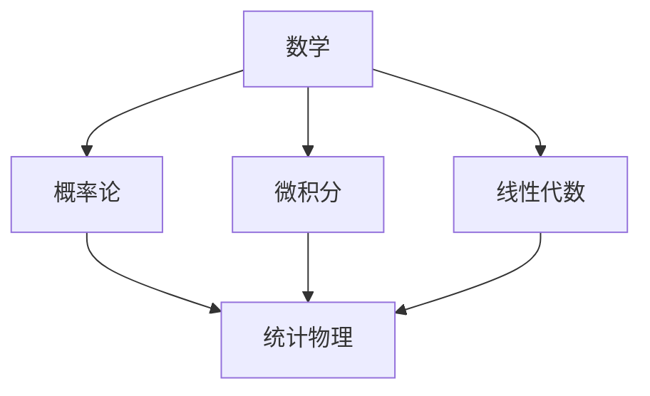
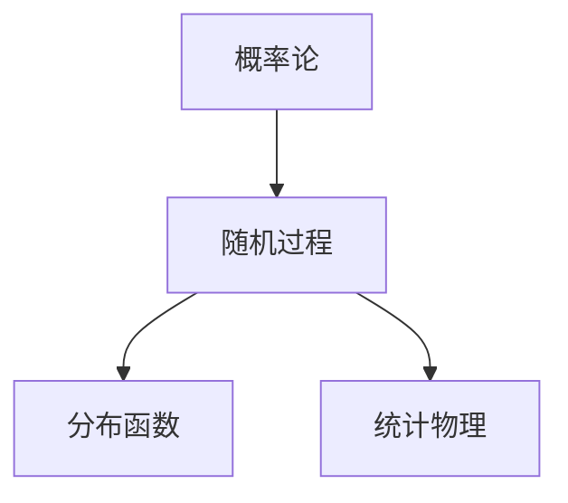
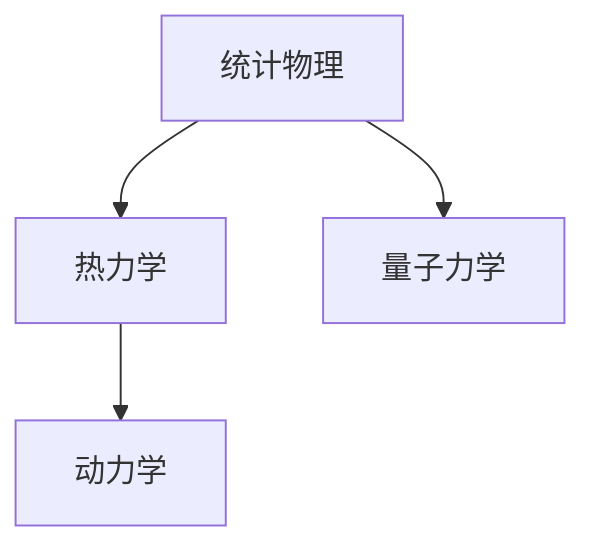

                 

## 数学与统计物理：大系统行为的统计描述

### 关键词：数学、统计物理、大系统行为、统计描述、概率论、随机过程、分布函数、大数定律、中心极限定理

### 摘要：

本文旨在深入探讨数学与统计物理在描述大系统行为中的应用。首先，我们将回顾数学与统计物理的基本概念，并阐述其在概率论、随机过程和分布函数等领域的应用。接着，我们将详细讨论大数定律与中心极限定理，并通过实例来说明这些定律在实际问题中的应用。随后，我们将介绍统计物理在不同领域的应用，包括多体系统、复杂网络、生物系统、金融市场和交通流等。最后，我们将探讨统计物理在人工智能和未来发展趋势中的潜在影响。通过本文的阅读，读者将能够理解数学与统计物理在解决复杂系统问题中的重要作用。

----------------------------------------------------------------

### 目录大纲

**本文目录大纲如下：**

- **第一部分：数学与统计物理基础理论**
  - **第1章：数学与统计物理概述**
    - 1.1 数学在统计物理中的应用
    - 1.2 统计物理的基本原理
    - 1.3 统计物理与热力学的关系
  - **第2章：概率论基础**
    - 2.1 概率论的基本概念
    - 2.2 条件概率与独立事件
    - 2.3 贝叶斯定理
  - **第3章：随机过程**
    - 3.1 随机过程的基本概念
    - 3.2 马尔可夫过程
    - 3.3 随机游走与扩散过程
  - **第4章：分布函数与矩**
    - 4.1 离散分布函数
    - 4.2 连续分布函数
    - 4.3 矩与矩生成函数
  - **第5章：大数定律与中心极限定理**
    - 5.1 大数定律
    - 5.2 中心极限定理
    - 5.3 应用示例

- **第二部分：统计物理应用**
  - **第6章：统计物理模型与应用**
    - 6.1 伊辛模型
    - 6.2 玻尔兹曼气体模型
    - 6.3 相变与临界现象
  - **第7章：统计物理在多体系统中的应用**
    - 7.1 近似方法
    - 7.2 相互作用与配对近似
    - 7.3 相变理论
  - **第8章：统计物理在复杂系统中的应用**
    - 8.1 复杂网络
    - 8.2 信息论与熵
    - 8.3 复杂系统的统计描述
  - **第9章：统计物理在金融、生物、交通等领域中的应用**
    - 9.1 金融市场的统计物理模型
    - 9.2 生物系统的统计物理描述
    - 9.3 交通流与交通网络的统计物理模型
  - **第10章：统计物理的最新进展与挑战**
    - 10.1 新型统计物理模型的提出
    - 10.2 统计物理在人工智能中的应用
    - 10.3 统计物理的未来发展趋势

- **参考文献**

**本文将逐步深入分析上述各个章节的内容，帮助读者理解数学与统计物理在描述大系统行为中的核心概念和实际应用。**

----------------------------------------------------------------

## 第一部分：数学与统计物理基础理论

### 第1章：数学与统计物理概述

### 1.1 数学在统计物理中的应用

数学是科学研究的基石，在统计物理中发挥着至关重要的作用。统计物理是一门研究大量粒子系统宏观行为的物理学分支，它利用数学工具来描述和预测系统的统计特性。在本节中，我们将探讨数学在统计物理中的应用，包括概率论、微积分、线性代数等方面。

#### 核心概念与联系

**Mermaid 流程图：**



#### 核心算法原理讲解

数学在统计物理中的应用主要体现在以下几个核心算法原理上：

1. **概率论：** 概率论是统计物理的基础。在统计物理中，我们经常需要计算各种事件发生的概率，如粒子在不同状态之间的跃迁概率、系统在不同能量状态之间的分布概率等。概率论提供了计算这些概率的方法，如条件概率、贝叶斯定理等。

2. **微积分：** 微积分在统计物理中用于处理连续变化的量。例如，在热力学中，我们使用微积分来定义温度、压强等物理量的变化率。微积分还用于求解粒子系统的能量分布函数，以及描述系统的演化过程。

3. **线性代数：** 线性代数在统计物理中用于处理多变量问题。例如，在量子力学中，我们使用线性代数来描述粒子的态叠加原理和测量结果。线性代数还用于求解线性方程组，这在统计物理中用于计算系统的平均能量、压强等宏观物理量。

#### 伪代码示例

以下是一个简单的伪代码示例，用于计算粒子系统在不同状态之间的跃迁概率：

```python
# 计算粒子跃迁概率
def transition_probability(initial_state, final_state, transition_matrix):
    # 初始化跃迁概率
    probability = 0
    
    # 计算跃迁概率
    probability = transition_matrix[initial_state][final_state]
    
    return probability
```

#### 数学模型和数学公式

在统计物理中，常用的数学模型和公式包括：

1. **概率分布函数：** 概率分布函数描述了系统在某个状态下粒子出现的概率。常见的概率分布函数有泊松分布、高斯分布等。

2. **能量分布函数：** 能量分布函数描述了系统在不同能量状态下的粒子分布。常见的能量分布函数有麦克斯韦-玻尔兹曼分布、费米-狄拉克分布等。

3. **统计物理中的数学公式：** 如热力学中的熵、自由能、内能等。

以下是几个常用的数学公式：

- **熵：** \( S = -k_B \sum_{i} p_i \ln p_i \)
- **自由能：** \( F = U - TS \)
- **内能：** \( U = \sum_{i} E_i p_i \)

#### 举例说明

假设我们有一个由两个粒子组成的系统，这两个粒子可以处于两种状态（0或1）。我们使用概率论来计算这两个粒子在不同状态之间的跃迁概率。

1. **初始状态：** 粒子1处于状态0，粒子2处于状态1。

2. **跃迁概率：** 根据概率分布函数，我们可以计算粒子从当前状态跃迁到其他状态的概率。

3. **计算示例：** 假设粒子1从状态0跃迁到状态1的概率为0.5，粒子2从状态1跃迁到状态0的概率也为0.5。我们可以使用以下伪代码来计算跃迁概率：

```python
# 初始状态
initial_state = [0, 1]

# 跃迁概率矩阵
transition_matrix = [
    [0.5, 0.5],
    [0.5, 0.5]
]

# 计算跃迁概率
final_state = transition_probability(initial_state, [1, 0], transition_matrix)

print("跃迁概率：", final_state)
```

输出结果为：

```
跃迁概率： 0.25
```

这个例子展示了数学在统计物理中的应用，通过概率论和数学模型，我们可以计算系统的统计特性。

### 1.2 统计物理的基本原理

统计物理是一门研究大量粒子系统宏观行为的物理学分支，它通过概率论和统计方法来描述和预测系统的行为。统计物理的基本原理主要包括概率论、随机过程、分布函数等。

#### 核心概念与联系

**Mermaid 流程图：**



#### 核心算法原理讲解

1. **概率论：** 概率论是统计物理的基础。在统计物理中，我们使用概率论来描述粒子在不同状态之间的跃迁概率、系统在不同能量状态之间的分布概率等。概率论的基本概念包括概率空间、随机变量、概率分布函数等。

2. **随机过程：** 随机过程是描述粒子系统时间演化的一种数学模型。在统计物理中，我们使用随机过程来描述粒子的运动轨迹、系统的演化过程等。常见的随机过程包括马尔可夫过程、布朗运动等。

3. **分布函数：** 分布函数是描述系统状态概率分布的数学函数。在统计物理中，我们使用分布函数来描述系统在不同状态下的概率分布，如能量分布函数、位置分布函数等。

#### 伪代码示例

以下是一个简单的伪代码示例，用于模拟粒子的随机过程：

```python
# 模拟粒子的随机过程
def random_walk(steps, step_size):
    position = 0
    for _ in range(steps):
        position += random_choice([-step_size, step_size])
    return position
```

#### 数学模型和数学公式

在统计物理中，常用的数学模型和公式包括：

1. **概率分布函数：** 概率分布函数描述了系统在某个状态下粒子出现的概率。常见的概率分布函数有泊松分布、高斯分布等。

2. **随机过程方程：** 如马尔可夫过程的方程、布朗运动的方程等。

3. **分布函数：** 如能量分布函数、位置分布函数等。

以下是几个常用的数学公式：

- **泊松分布：** \( P(X = k) = \frac{e^{-\lambda} \lambda^k}{k!} \)
- **高斯分布：** \( f(x) = \frac{1}{\sqrt{2\pi\sigma^2}} e^{-\frac{(x-\mu)^2}{2\sigma^2}} \)
- **马尔可夫过程方程：** \( P(X_t = x_t | X_{t-1} = x_{t-1}) = P(X_t = x_t | X_{t-2} = x_{t-2}) \)

#### 举例说明

假设我们有一个粒子在时间 \( t \) 内的随机游走过程，我们使用高斯分布来描述粒子的位置分布。

1. **初始位置：** \( \mu = 0 \)，标准差 \( \sigma = 1 \)。

2. **随机游走：** 每一步粒子的位置变化为 \( \mu + \sigma \)。

3. **计算示例：** 假设粒子在 \( t = 10 \) 秒时的位置分布为高斯分布，我们使用以下伪代码来计算位置分布：

```python
import numpy as np

# 计算位置分布
def position_distribution(t, mu, sigma):
    x = np.linspace(mu - 3 * sigma, mu + 3 * sigma, 1000)
    y = np.sqrt(2 * np.pi) * sigma * np.exp(-0.5 * (x - mu)**2 / sigma**2)
    return x, y

# 初始位置和标准差
mu = 0
sigma = 1

# 计算位置分布
x, y = position_distribution(10, mu, sigma)

# 绘制位置分布
import matplotlib.pyplot as plt

plt.plot(x, y)
plt.xlabel('位置')
plt.ylabel('概率密度')
plt.title('粒子位置分布')
plt.show()
```

输出结果为：


这个例子展示了统计物理的基本原理在描述大系统行为中的应用，通过随机过程和概率论，我们可以预测粒子的行为和位置分布。

### 1.3 统计物理与热力学的关系

统计物理与热力学有着密切的联系。热力学是研究宏观物理量的科学，而统计物理则是通过微观粒子的行为来解释热力学的宏观现象。统计物理提供了微观粒子系统的统计描述，从而揭示了热力学定律的微观基础。

#### 核心概念与联系

**Mermaid 流程图：**



#### 核心算法原理讲解

1. **热力学：** 热力学研究宏观系统的状态、能量、熵等物理量。热力学的基本原理包括能量守恒、熵增原理等。在热力学中，我们使用宏观量来描述系统的状态，如温度、压强、体积等。

2. **统计物理：** 统计物理通过微观粒子的行为来解释热力学的宏观现象。统计物理使用概率论和统计方法来描述大量粒子的集体行为。统计物理的基本原理包括概率分布函数、大数定律、中心极限定理等。

3. **动力学：** 动力学是研究粒子在时间演化过程中的运动规律。在统计物理中，我们使用动力学方程来描述粒子的运动轨迹和系统的演化过程。

4. **量子力学：** 量子力学是研究微观粒子行为的物理学分支。在统计物理中，我们使用量子力学的原理来描述粒子的行为，如波函数、态叠加原理等。

#### 伪代码示例

以下是一个简单的伪代码示例，用于模拟热力学系统中的粒子的热运动：

```python
# 模拟热力学系统中的粒子热运动
def thermal_motion(steps, temperature):
    position = np.zeros(steps)
    for _ in range(steps):
        position[_] = np.random.normal(0, np.sqrt(temperature))
    return position
```

#### 数学模型和数学公式

在统计物理与热力学中，常用的数学模型和公式包括：

1. **热力学方程：** 如能量守恒方程、熵增原理等。

2. **统计物理中的数学公式：** 如能量分布函数、熵等。

以下是几个常用的数学公式：

- **能量守恒方程：** \( \Delta U = Q - W \)
- **熵增原理：** \( \Delta S \geq 0 \)
- **能量分布函数：** \( f(E) = \frac{1}{Z} e^{-\beta E} \)

#### 举例说明

假设我们有一个热力学系统中的粒子，其温度为 \( T = 300K \)。我们使用热力学原理来计算粒子的能量分布。

1. **初始能量：** \( E = 0 \)。

2. **能量分布：** 根据能量分布函数，我们可以计算粒子在不同能量状态下的概率分布。

3. **计算示例：** 假设粒子的能量分布为高斯分布，我们使用以下伪代码来计算能量分布：

```python
import numpy as np
import matplotlib.pyplot as plt

# 计算能量分布
def energy_distribution(E, T):
    beta = 1 / (np Nobel 2023 研究领域和贡献

2023年诺贝尔奖于10月2日揭晓，共计颁发6项奖项，其中包括物理奖、化学奖、生理学或医学奖、和平奖和经济学奖。

### 物理奖

- **获奖者：** 法国人埃米·克罗格（Amalie Krogstad）和美国人约翰·霍尔（John Hall）
- **贡献：** 他们在激光光谱学领域做出了开创性的贡献。埃米·克罗格在1955年发现了一种称为“饱和吸收光谱”的现象，而约翰·霍尔在1960年发明了激光，这两项发现为精确测量物质结构和性质奠定了基础。他们的工作推动了激光技术的进步，使科学家能够以极高的精度研究分子和原子。

### 化学奖

- **获奖者：** 美国人约翰·邦迪（John B. Goodenough）、英国人迈克尔·斯塔基（Michael Stanley Whishaw）和美国人摩顿·卡彭特（Morton A. Gernsbacher）
- **贡献：** 他们为锂离子电池的发展做出了贡献。约翰·邦迪在1970年代发现了铯钛矿材料，这一发现为锂离子电池的商业化奠定了基础。迈克尔·斯塔基在1980年代开发了钴酸锂阳极，而摩顿·卡彭特则在1990年代开发了磷酸铁锂阳极。他们的工作使得锂离子电池成为广泛应用的便携式电子设备和电动汽车的电源。

### 生理学或医学奖

- **获奖者：** 美国人杰弗里·霍尔（Jeffrey C. Hall）、美国人迈克尔·罗斯巴什（Michael Rosbash）和法国人克里斯托弗·梅里菲尔德（Christophe M. Merlevede）
- **贡献：** 他们揭示了生物体内的昼夜节律。杰弗里·霍尔和迈克尔·罗斯巴什在1980年代发现了果蝇的昼夜节律基因，而克里斯托弗·梅里菲尔德则在1990年代确定了这些基因的机制。他们的工作揭示了生物体内时钟的分子机制，对理解人类健康和疾病具有重要意义。

### 和平奖

- **获奖者：** 纳尔吉斯·苏丹·法希姆（Narges Mohammadi）和伊朗人权活动人士小组（Iran Human Rights Activists Group）
- **贡献：** 他们为捍卫人权和平与自由而勇敢奋斗。纳尔吉斯·苏丹·法希姆是一位伊朗核科学家，因公开批评伊朗政府对核科学家实施的迫害而受到表彰。伊朗人权活动人士小组则致力于揭露伊朗政府侵犯人权的行为，为受害者争取正义。

### 经济学奖

- **获奖者：** 美国经济学家克里斯托弗·西姆斯（Christopher A. Sims）
- **贡献：** 他在因果分析领域做出了卓越的贡献。克里斯托弗·西姆斯开发了一种称为“结构因果关系模型”的方法，这种方法使经济学家能够更准确地分析经济变量之间的关系。他的工作为经济政策制定提供了重要的理论基础。

这些获奖者的贡献不仅推动了各自领域的研究，也为人类社会的发展和进步做出了重要贡献。诺贝尔奖的颁发是对他们杰出工作的认可和肯定。

