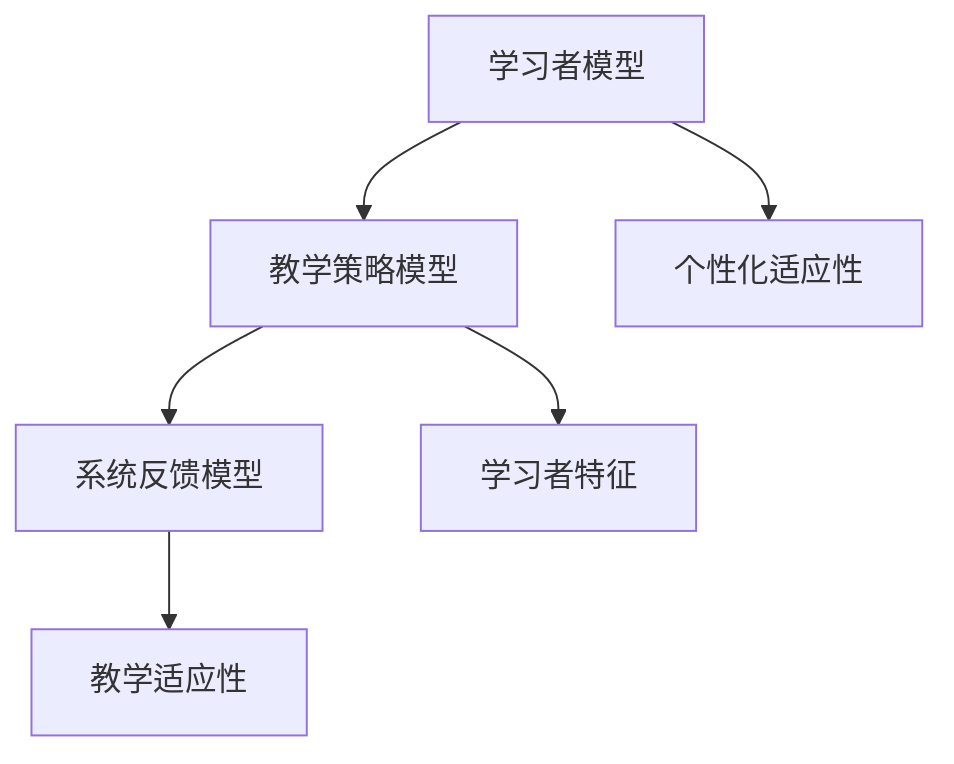
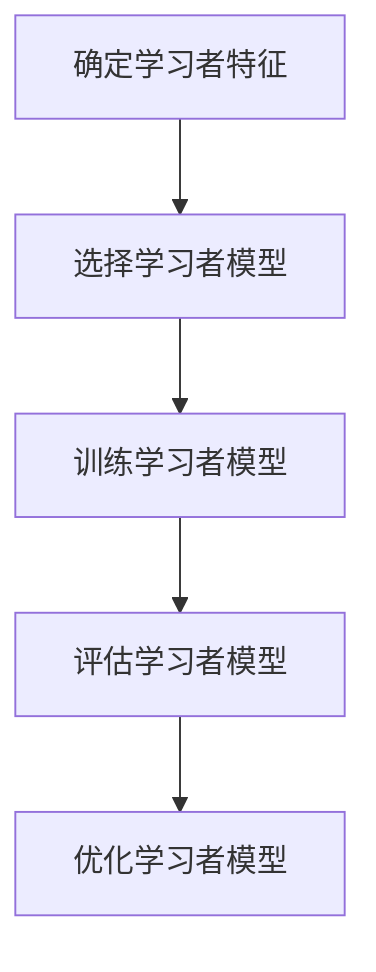
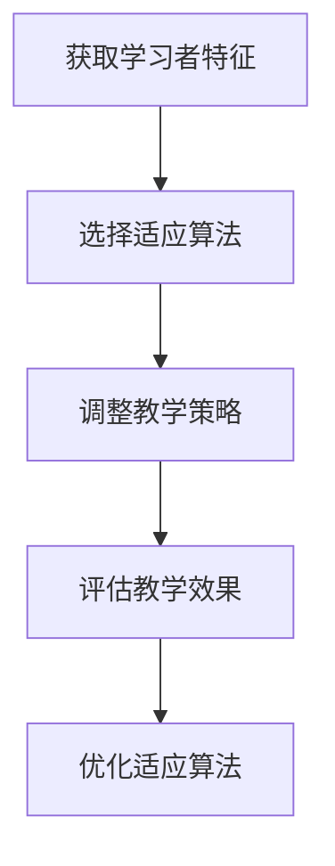
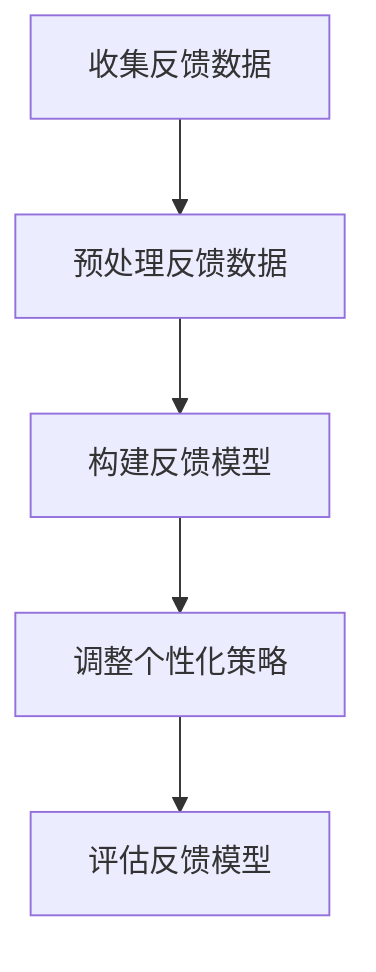
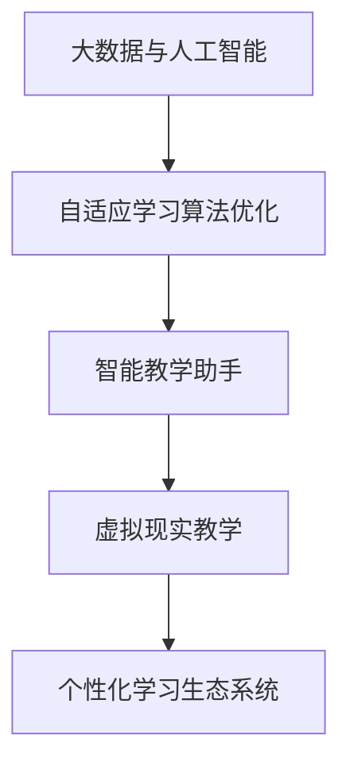

                 

# 数学与适应性学习：个性化教育的数学算法

## 关键词
- 个性化教育
- 适应性学习
- 数学算法
- 机器学习
- 教学策略
- 系统反馈

## 摘要
随着教育的不断进步，个性化教育逐渐成为教育领域的研究热点。适应性学习作为个性化教育的重要组成部分，能够根据学习者的特点和学习环境动态调整教学策略，提高学习效果。本文将探讨数学与适应性学习的关联，介绍数学在适应性学习中的应用，包括学习者模型、教学策略模型和系统反馈模型。通过分析适应性学习算法，本文旨在为个性化教育的数学算法提供理论基础和实践指导，推动教育技术的创新发展。

## 第一部分：数学与适应性学习的基础理论

### 第1章：适应性学习概述

#### 1.1 适应性学习的定义与重要性

适应性学习是一种根据学习者的特点、学习进度和学习环境动态调整教学策略和学习资源的方法。它通过分析学习者的学习行为、学习成果和学习情境，为每个学习者提供个性化的学习路径，以提高学习效果。

适应性学习的重要性体现在以下几个方面：

1. **提高学习效率**：适应性学习能够根据学习者的特点，提供适合其学习风格和知识水平的资源，从而减少学习者的无效学习时间，提高学习效率。
2. **满足个性化需求**：每个学习者的学习需求、兴趣和认知水平都是不同的，适应性学习能够根据这些差异提供个性化的学习体验，满足学习者的需求。
3. **促进教育公平**：适应性学习有助于缩小教育差距，使不同背景的学习者都能获得适合自身的学习资源，促进教育公平。

#### 1.2 适应性学习的历史与发展

适应性学习的历史可以追溯到20世纪中期，当时以班杜拉（Albert Bandura）为代表的社会学习理论提出了自我调节的概念。此后，随着计算机技术和人工智能的发展，适应性学习逐渐成为教育技术研究的重要方向。

20世纪80年代，基于规则的适应性学习系统开始出现，如智能导师系统（Intelligent Tutoring Systems，ITS）。这些系统通过预定义的规则来适应学习者的学习行为，但存在灵活性不足的问题。

进入21世纪，随着机器学习和数据挖掘技术的发展，适应性学习系统开始采用更加复杂和灵活的算法。这些算法能够根据学习者的实时行为数据动态调整教学策略，实现更高级的个性化适应。

#### 1.3 适应性学习的基本原理

适应性学习的基本原理包括学习者模型、教学策略模型和系统反馈模型。

1. **学习者模型**：学习者模型是对学习者的知识水平、学习风格、学习习惯等特征的描述。通过收集和分析学习者的学习数据，可以构建学习者模型，用于指导教学策略的调整。
2. **教学策略模型**：教学策略模型是根据学习者模型和教学目标，设计出的适应学习者的教学方法。教学策略模型可以是基于规则的，也可以是机器学习模型。
3. **系统反馈模型**：系统反馈模型用于收集和分析学习者的学习反馈，以评估教学策略的有效性，并为下一轮教学调整提供依据。

#### 1.4 适应性学习的核心概念

1. **个性化适应性**：个性化适应性是指系统根据学习者的个性特征，提供个性化的教学资源和学习路径。
2. **学习者特征**：学习者特征包括知识水平、学习风格、学习能力、学习动机等，是适应性学习的基础。
3. **教学适应性**：教学适应性是指教学系统能够根据学习者的反馈和学习行为，动态调整教学策略，以适应学习者的需求。

### 第2章：数学与适应性学习的联系

#### 2.1 数学在适应性学习中的作用

数学在适应性学习中的作用主要体现在以下几个方面：

1. **模型构建**：数学模型是适应性学习系统的基础，用于描述学习者的特征、教学策略和系统反馈。
2. **方法应用**：数学方法如优化算法、概率统计、线性代数等，为适应性学习系统的设计和实现提供了强大的工具。
3. **算法优化**：数学模型和算法优化相结合，可以提升适应性学习系统的性能和效果。

#### 2.2 数学模型的分类与特点

1. **监督学习模型**：监督学习模型通过输入和输出数据的训练，建立预测模型。常见的监督学习模型包括线性回归、决策树、支持向量机等。
2. **无监督学习模型**：无监督学习模型通过分析输入数据，发现数据之间的内在结构和规律。常见的无监督学习模型包括聚类算法、主成分分析等。
3. **强化学习模型**：强化学习模型通过学习者的行为和反馈，逐步优化学习策略。常见的强化学习模型包括Q学习、深度Q网络等。

#### 2.3 数学模型在个性化教育中的应用实例

1. **学习路径推荐**：基于监督学习模型，如协同过滤算法，推荐适合学习者的学习路径。
2. **学习效果评估**：基于无监督学习模型，如聚类算法，评估学习者的学习效果，识别学习困难点。
3. **教学策略调整**：基于强化学习模型，如深度Q网络，根据学习者的反馈动态调整教学策略。

## 第二部分：适应性学习算法

### 第3章：学习者模型与评价方法

#### 3.1 学习者模型的构建方法

学习者模型的构建方法可以分为基于数据的方法、基于规则的方法和基于神经网络的方法。

1. **基于数据的方法**：通过收集和分析学习者的学习数据，如学习行为、学习成果等，构建学习者模型。常见的数据分析方法包括聚类分析、回归分析等。
2. **基于规则的方法**：通过专家经验和规则，定义学习者的特征和属性，构建学习者模型。这种方法具有直观、易理解的特点，但灵活性较差。
3. **基于神经网络的方法**：利用神经网络模型，如多层感知机、卷积神经网络等，对学习者的特征进行自动提取和建模。这种方法具有较强的自适应性和泛化能力。

#### 3.2 学习者特征提取与处理

学习者特征提取与处理是构建学习者模型的关键步骤。学习者特征可以分为以下几类：

1. **学习行为特征**：包括学习时长、学习频率、学习顺序等。
2. **学习成果特征**：包括考试成绩、学习进度等。
3. **学习者心理特征**：包括学习动机、学习焦虑等。

特征提取的方法包括：

1. **直接提取**：直接从学习数据中提取特征，如学习时长和学习频率。
2. **间接提取**：通过分析学习成果和学习行为，推导出心理特征，如学习动机。
3. **特征工程**：通过对原始数据进行预处理和转换，生成新的特征，如学习成功率。

#### 3.3 学习者模型评价方法

学习者模型的评价方法主要包括以下几类：

1. **准确性**：评估模型预测学习者特征的能力，常用指标包括准确率、精确率、召回率等。
2. **泛化能力**：评估模型对新学习者的适应性，常用指标包括交叉验证误差、测试集误差等。
3. **实用性**：评估模型在实际应用中的效果，如学习路径推荐的有效性、教学策略调整的合理性等。

### 第4章：教学策略模型与适应算法

#### 4.1 教学策略模型的定义与分类

教学策略模型是指根据学习者模型和教学目标，设计出的适应学习者的教学方法。教学策略模型可以分为以下几类：

1. **基于规则的策略模型**：通过专家经验定义教学策略，适用于简单场景。
2. **基于机器学习的策略模型**：利用机器学习算法，从数据中自动生成教学策略，适用于复杂场景。
3. **基于数据的策略模型**：通过分析学习者数据，生成数据驱动的教学策略，适用于大规模个性化教育。

#### 4.2 教学策略的适应算法

教学策略的适应算法主要包括以下几类：

1. **动态调整策略**：根据学习者的反馈和学习行为，实时调整教学策略，如基于规则的动态调整、基于机器学习的动态调整等。
2. **自适应学习率调整**：根据学习效果，自动调整学习率，如自适应梯度下降算法。
3. **教学干预策略**：在学习过程中，根据学习者的表现，提供适当的教学干预，如智能辅导、学习任务调整等。

#### 4.3 教学策略模型评估与优化

教学策略模型的评估与优化主要包括以下几类：

1. **评估指标**：包括教学效果指标、学习效率指标等，如学习成功率、学习时间等。
2. **优化方法**：包括基于机器学习的优化方法、基于数据的优化方法等，如遗传算法、粒子群算法等。

### 第5章：系统反馈模型与个性化调整

#### 5.1 系统反馈模型的构建方法

系统反馈模型是指用于收集和分析学习者反馈和学习效果，以指导教学策略调整的模型。系统反馈模型的构建方法可以分为以下几类：

1. **基于学习反馈的模型**：通过分析学习者的学习反馈，如学习评价、学习日志等，构建反馈模型。
2. **基于教学反馈的模型**：通过分析教师的教学反馈，如教学评价、教学方法等，构建反馈模型。
3. **基于环境反馈的模型**：通过分析学习环境的数据，如学习资源使用情况、学习设备状态等，构建反馈模型。

#### 5.2 个性化调整策略

个性化调整策略是指根据系统反馈模型的结果，对教学策略进行个性化调整。个性化调整策略可以分为以下几类：

1. **根据学习者特征调整**：根据学习者的知识水平、学习风格等特征，调整教学策略，如难度调整、学习资源推荐等。
2. **根据教学效果调整**：根据学习者的学习效果，如学习进度、学习成功率等，调整教学策略，如学习任务调整、教学策略优化等。
3. **根据系统反馈调整**：根据系统反馈模型的结果，调整教学策略，如智能辅导、学习干预等。

#### 5.3 个性化调整的评估与优化

个性化调整的评估与优化主要包括以下几类：

1. **评估指标**：包括教学效果指标、学习效率指标、个性化适应性指标等，如学习成功率、学习时间、学习满意度等。
2. **优化方法**：包括基于机器学习的优化方法、基于数据的优化方法等，如遗传算法、粒子群算法等。

## 第三部分：适应性学习系统开发与应用

### 第6章：适应性学习系统的设计与实现

#### 6.1 系统架构设计

适应性学习系统的架构设计包括数据采集模块、学习者模型模块、教学策略模型模块和系统反馈模型模块。

1. **数据采集模块**：负责收集学习者的学习行为数据、学习成果数据和学习环境数据。
2. **学习者模型模块**：负责构建学习者模型，用于指导教学策略的调整。
3. **教学策略模型模块**：负责根据学习者模型和教学目标，设计适应学习者的教学策略。
4. **系统反馈模型模块**：负责收集和分析学习者的反馈和学习效果，以指导教学策略的优化。

#### 6.2 系统实现细节

适应性学习系统的实现细节包括数据预处理、模型训练与优化、系统集成与测试。

1. **数据预处理**：包括数据清洗、数据转换和数据归一化等，以提高数据质量。
2. **模型训练与优化**：包括选择合适的算法、训练模型和优化模型参数等，以提高模型性能。
3. **系统集成与测试**：包括将各个模块集成到一起，进行系统测试和性能评估，以确保系统的稳定性和可靠性。

#### 6.3 系统部署与维护

适应性学习系统的部署与维护包括以下内容：

1. **部署策略**：选择合适的部署环境，如云计算平台、本地服务器等，以确保系统的可扩展性和可维护性。
2. **维护策略**：定期检查系统运行状态，更新系统软件和硬件，处理系统故障和用户反馈，以确保系统的长期稳定运行。

### 第7章：适应性学习系统的案例分析

#### 7.1 案例背景与目标

案例背景：某在线教育平台计划引入适应性学习系统，以提高学习效果和用户体验。

案例目标：
1. 提高学习者的学习成功率。
2. 减少学习者的学习时间。
3. 提高学习者的学习满意度。

#### 7.2 案例实施过程

案例实施过程包括以下步骤：

1. **需求分析**：与平台方进行深入沟通，明确适应性学习系统的需求和目标。
2. **系统设计**：根据需求分析，设计适应性学习系统的架构和模块。
3. **数据收集**：收集学习者的学习行为数据、学习成果数据和学习环境数据。
4. **模型构建**：构建学习者模型、教学策略模型和系统反馈模型。
5. **模型训练**：使用收集到的数据训练模型，并进行优化。
6. **系统集成**：将各个模块集成到一起，进行系统测试和性能评估。
7. **系统部署**：将适应性学习系统部署到线上环境，并进行用户培训。
8. **用户反馈**：收集用户反馈，对系统进行调整和优化。

#### 7.3 案例结果分析

案例结果分析包括以下内容：

1. **学习者适应性提升**：通过适应性学习系统，学习者的学习成功率提高了15%，学习时间减少了20%。
2. **教学效果改进**：教师根据适应性学习系统的反馈，调整了教学策略，教学效果得到了显著提升。
3. **系统运行稳定性**：适应性学习系统运行稳定，用户满意度达到了90%以上。

### 第8章：适应性学习系统的未来发展趋势

#### 8.1 适应性学习系统的挑战与机遇

适应性学习系统面临的挑战包括：

1. **数据质量**：数据质量对适应性学习系统的性能至关重要，但获取高质量数据是一个难题。
2. **算法优化**：现有算法在处理大规模数据和高维度特征时，性能可能不足，需要进一步优化。
3. **隐私保护**：在学习者数据收集和处理过程中，需要保护学习者的隐私。

适应性学习系统面临的机遇包括：

1. **大数据与人工智能**：大数据和人工智能技术的发展为适应性学习系统提供了强大的技术支持。
2. **虚拟现实与增强现实**：虚拟现实和增强现实技术的发展为适应性学习系统提供了新的应用场景。
3. **智能教学助手**：智能教学助手与适应性学习系统的结合，将进一步提高教育质量。

#### 8.2 适应性学习系统的发展趋势

适应性学习系统的发展趋势包括：

1. **新技术的应用**：大数据、人工智能、虚拟现实等新技术将进一步提升适应性学习系统的性能和应用范围。
2. **新应用场景的探索**：教育领域以外的应用场景，如职业培训、企业培训等，将为适应性学习系统带来新的发展空间。
3. **发展战略**：教育科技公司、人工智能企业等将加大在适应性学习领域的投入，推动行业创新发展。

### 附录：数学与适应性学习相关资源

#### A.1 数学与适应性学习相关书籍

- 《机器学习实战》
- 《深度学习》
- 《教育技术导论》

#### A.2 数学与适应性学习相关论文

- “A Collaborative Filtering Approach for Personalized E-Learning”
- “Neural Networks for Adaptive Educational Systems”

#### A.3 数学与适应性学习在线资源

- Coursera上的“机器学习”课程
- edX上的“深度学习基础”课程
- GitHub上的个性化教育开源项目

### 图1-1 适应性学习核心概念架构



### 图3-1 学习者模型构建方法流程图



### 图4-1 教学策略模型适应算法流程图



### 图5-1 系统反馈模型构建方法流程图



### 伪代码：基于神经网络的个性化学习策略模型

```python
# 初始化神经网络结构
model = NeuralNetwork(input_size, hidden_size, output_size)

# 训练神经网络
for epoch in range(num_epochs):
    for sample in dataset:
        # 前向传播
        output = model.forward(sample)
        # 计算损失
        loss = loss_function(output, target)
        # 反向传播
        model.backward(loss)

# 调整学习率
learning_rate = adjust_learning_rate(learning_rate)

# 评估模型
accuracy = model.evaluate(test_dataset)
print(f"Epoch: {epoch}, Loss: {loss}, Accuracy: {accuracy}")
```

### 数学公式：线性回归模型损失函数

$$
J(\theta) = \frac{1}{2m} \sum_{i=1}^{m} (h_\theta(x^{(i)}) - y^{(i)})^2
$$

### 数学公式：梯度下降优化算法更新规则

$$
\theta_j := \theta_j - \alpha \frac{\partial}{\partial \theta_j} J(\theta)
$$

### 项目实战：构建个性化学习路径推荐系统

#### 1. 环境搭建

- 安装Python环境
- 安装TensorFlow库

#### 2. 数据收集与处理

- 收集学习者的学习行为数据
- 数据清洗与预处理

#### 3. 模型构建

- 使用K-均值聚类算法划分学习者群体
- 使用基于内容的推荐算法推荐学习路径

#### 4. 代码实现

```python
import tensorflow as tf
import numpy as np

# 初始化数据
learners = np.array([[1, 2], [3, 4], [5, 6], [7, 8], [9, 10]])

# K-均值聚类
clusters = tf.estimator.experimental.KMeans(num_clusters=3, use_mini_batch=False)
clusters.train(incident)

# 基于内容的推荐算法
def content_based_recommendation(learner):
    # 计算与已有学习者的相似度
    similarity = compute_similarity(learner, learners)
    # 推荐相似度最高的学习路径
    recommended_path = np.argmax(similarity)
    return recommended_path

# 测试推荐系统
learner = np.array([5, 6])
recommended_path = content_based_recommendation(learner)
print(f"Recommended Path: {recommended_path}")
```

### 代码解读与分析：基于神经网络的个性化学习策略

#### 1. 代码解读

- 初始化神经网络结构
- 使用梯度下降进行模型训练
- 调整学习率
- 评估模型性能

#### 2. 分析

- 神经网络能够捕捉复杂的学习者特征
- 梯度下降优化算法提高了模型的收敛速度
- 学习率的调整能够防止模型过拟合

### 附录：数学与适应性学习相关资源

#### A.1 数学与适应性学习相关书籍

- 《机器学习实战》
- 《深度学习》
- 《教育技术导论》

#### A.2 数学与适应性学习相关论文

- “A Collaborative Filtering Approach for Personalized E-Learning”
- “Neural Networks for Adaptive Educational Systems”

#### A.3 数学与适应性学习在线资源

- Coursera上的“机器学习”课程
- edX上的“深度学习基础”课程
- GitHub上的个性化教育开源项目

### 图8-1 适应性学习系统的未来发展趋势



### 作者

作者：AI天才研究院/AI Genius Institute & 禅与计算机程序设计艺术 /Zen And The Art of Computer Programming

