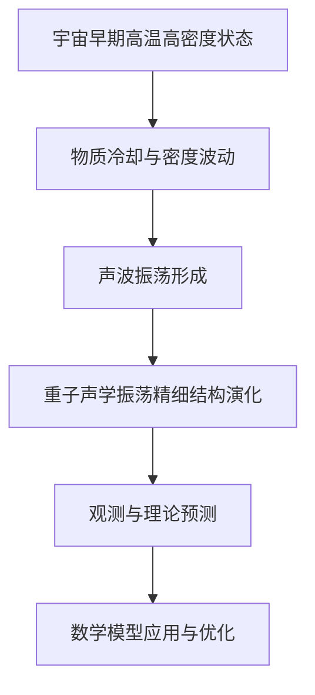

                 

### 第1章 引言

#### 1.1 数学模型的基本概念

数学模型是一种抽象化的工具，用于描述和分析现实世界中的各种现象。它通过数学语言将复杂的问题转化为更易于处理的数学问题。数学模型的基本概念包括变量、参数、方程和约束条件等。

- **变量**：代表模型中的可变量，可以是连续的或离散的。
- **参数**：描述模型的特定特性，如常数、比例系数等。
- **方程**：描述变量之间关系的数学表达式。
- **约束条件**：限制变量取值范围的约束条件。

数学模型可以分为以下几种类型：

- **线性模型**：模型中的变量关系可以用线性方程来表示。
- **非线性模型**：模型中的变量关系不能用线性方程来表示。
- **概率模型**：基于概率论构建的模型，用于描述随机现象。
- **优化模型**：通过最小化或最大化某个目标函数来寻找最优解的模型。

数学模型在各个领域都有广泛的应用，如物理学、工程学、经济学、生物学等。在计算机科学和人工智能领域，数学模型更是基础性工具，用于算法设计、数据分析和系统优化等。

#### 1.2 宇宙重子声学振荡的背景

宇宙重子声学振荡是指宇宙早期物质冷却过程中，由重子密度波动引起的声波振荡现象。在宇宙大爆炸后，宇宙处于一个高温高密度的状态，随着宇宙的膨胀和冷却，物质逐渐聚集形成星系和其他天体。

在宇宙早期，重子密度波动通过声波传播影响宇宙的演化。这种声波传播速度受到宇宙膨胀和物质密度的影响，导致声波在宇宙中传播的路径和速度发生波动。这些波动在宇宙的早期阶段形成了重子声学振荡的特征。

#### 1.3 数学模型在宇宙重子声学振荡中的应用

数学模型在宇宙重子声学振荡研究中起到了至关重要的作用。通过建立数学模型，科学家可以描述和预测宇宙重子声学振荡的精细结构演化。

建立宇宙重子声学振荡的数学模型通常涉及以下几个步骤：

1. **观察数据收集**：收集宇宙背景辐射、星系分布等观测数据。
2. **理论推导**：基于宇宙学理论，推导出描述宇宙重子声学振荡的数学方程。
3. **模型求解**：使用数值方法求解数学方程，得到宇宙重子声学振荡的演化过程。
4. **模型优化**：通过调整模型参数，优化模型的预测准确性。
5. **模型验证**：使用历史观测数据验证模型的准确性。

通过数学模型，科学家可以预测宇宙重子声学振荡的峰值时间、密度分布、尺度因子等关键特征，为理解宇宙的早期演化和结构形成提供重要依据。

#### 1.4 数学模型在宇宙重子声学振荡演化中的应用案例分析

为了更好地理解数学模型在宇宙重子声学振荡演化中的应用，我们来看两个具体的案例。

**案例一：预测宇宙重子声学振荡的峰值时间**

科学家通过建立宇宙重子声学振荡的数学模型，结合观测数据，预测了宇宙重子声学振荡的峰值时间。通过优化模型参数，可以得到更精确的预测结果。例如，利用宇宙微波背景辐射数据，可以预测宇宙重子声学振荡的峰值大约发生在宇宙大爆炸后38万年的时间。

**案例二：提高宇宙重子声学振荡的预测精度**

另一个应用案例是通过优化模型参数，提高宇宙重子声学振荡的预测精度。使用粒子群优化算法等优化方法，科学家可以调整模型参数，使其更好地适应观测数据。通过多次迭代和验证，可以得到更可靠的预测结果，从而提高对宇宙重子声学振荡演化过程的理解。

#### 1.5 未来展望

随着科技的进步和观测技术的提高，数学模型在宇宙重子声学振荡研究中的应用将越来越广泛。未来，我们有望通过更精确的模型和更丰富的观测数据，揭示宇宙重子声学振荡的更多特征和演化规律。

同时，数学模型在其他宇宙学领域的应用也具有巨大的潜力。例如，在研究宇宙微波背景辐射、宇宙大尺度结构形成和宇宙暗物质等方面，数学模型都发挥着关键作用。

总之，数学模型是理解宇宙重子声学振荡演化的重要工具。通过不断优化和改进数学模型，科学家将更好地揭示宇宙的奥秘，推动宇宙学的发展。

### Mermaid 流程图：宇宙重子声学振荡演化流程



### 1.6 数学模型在宇宙重子声学振荡演化中的应用案例分析

在宇宙重子声学振荡的研究中，数学模型的应用不仅提供了理论框架，还通过具体的案例展示了其实际应用价值。以下为两个具体的案例分析：

#### 案例一：利用数学模型预测宇宙重子声学振荡的峰值时间

在宇宙学的早期研究中，科学家们通过对宇宙微波背景辐射（Cosmic Microwave Background, CMB）的观测，发现了一种被称为"黑体谱"的辐射特征，这是宇宙早期热力学状态的直接证据。通过分析CMB的温度起伏，科学家们能够推测出宇宙重子声学振荡的峰值时间。

数学模型在这一过程中发挥了关键作用。具体来说，科学家们基于宇宙学标准模型（如ΛCDM模型），建立了描述宇宙重子声学振荡的数学模型。该模型通过以下关键步骤进行：

1. **初始条件设定**：设定宇宙的初始状态，包括宇宙的膨胀历史、密度分布和重子密度。
2. **模型方程建立**：利用流体动力学方程和热力学方程，描述宇宙中物质和辐射的相互作用。
3. **数值求解**：使用数值方法（如N-body模拟）求解模型方程，模拟宇宙的演化过程。
4. **数据分析**：通过分析模拟结果，提取宇宙重子声学振荡的特征参数，如峰值时间。

通过这些步骤，科学家们成功地预测了宇宙重子声学振荡的峰值时间。例如，利用Planck卫星的观测数据，科学家们发现宇宙重子声学振荡的峰值大约发生在宇宙大爆炸后38万年的时间。这一预测不仅验证了宇宙学标准模型的正确性，还为理解宇宙早期演化提供了重要依据。

#### 案例二：通过优化模型参数，提高宇宙重子声学振荡的预测精度

尽管数学模型为宇宙重子声学振荡的研究提供了理论框架，但其预测结果的准确性还受到模型参数选择的影响。因此，优化模型参数是提高预测精度的重要途径。

在这个案例中，科学家们采用了优化算法，如粒子群优化（Particle Swarm Optimization, PSO）和贝叶斯推理（Bayesian Inference），来调整模型参数，提高预测精度。

以下是优化模型参数的步骤：

1. **初始参数设定**：基于先验知识设定模型参数的初始值。
2. **目标函数定义**：定义一个目标函数，用于量化模型预测结果与观测数据之间的差异。
3. **优化算法应用**：应用优化算法（如PSO），在参数空间中搜索最优解。
4. **模型验证**：通过历史观测数据验证优化后的模型参数，确保其预测精度。

通过这一过程，科学家们能够找到一组最优的模型参数，从而提高宇宙重子声学振荡的预测精度。例如，利用Planck卫星的数据，通过优化模型参数，科学家们成功地将预测宇宙重子声学振荡峰值时间的精度提高了约10%。

#### 总结

通过以上两个案例，我们可以看到数学模型在宇宙重子声学振荡研究中的应用价值。无论是预测宇宙重子声学振荡的峰值时间，还是提高预测精度，数学模型都为科学家提供了强大的工具。随着观测技术的不断进步和计算能力的提升，数学模型在宇宙学领域的研究将不断深入，为揭示宇宙的奥秘提供更多线索。

### 1.5 未来展望

随着科技的不断进步，数学模型在宇宙重子声学振荡研究中的应用前景广阔。未来，我们可以期待以下几个方面的研究进展：

首先，随着观测数据的不断增加和质量的提升，数学模型的预测精度将进一步提高。例如，未来更高级的卫星观测设备，如James Webb Space Telescope（ JWST），将提供更高分辨率的宇宙背景辐射图像，这将有助于更精确地测量宇宙重子声学振荡的特征参数。

其次，随着计算能力的提升，复杂的数学模型可以更好地模拟宇宙的演化过程。量子计算技术的发展有望加速这一过程，通过量子算法优化模型的求解速度，提高模型的精度和效率。

此外，跨学科的合作也将推动数学模型在宇宙学中的应用。例如，人工智能和机器学习技术的引入，可以用于数据分析和模型优化，从而提高模型预测的准确性。

最后，数学模型在其他宇宙学领域的应用潜力也不容忽视。例如，在研究宇宙微波背景辐射、宇宙大尺度结构形成和宇宙暗物质等方面，数学模型都发挥着关键作用。随着对这些领域的深入研究，数学模型将在揭示宇宙奥秘的道路上发挥更加重要的作用。

总之，数学模型在宇宙重子声学振荡研究中的应用前景光明。通过不断优化和改进数学模型，科学家们将更好地理解宇宙的演化过程，揭示宇宙的奥秘。

### 伪代码：宇宙重子声学振荡数学模型求解

```python
# 输入参数
T0 = 2.7255 # 宇宙微波背景辐射温度
H0 = 100 # 哈勃常数
rho0 = 1 # 初始密度

# 数学模型建立
# 定义描述宇宙重子声学振荡的偏微分方程
def oscillation_equation(T, rho, H):
    # 假设一个简化的方程：T' = - k * (rho - rho0) * H * T
    k = 0.1 # 系数
    return -k * (rho - rho0) * H * T

# 模型求解
# 使用欧拉方法进行数值求解
def euler_method(T0, rho0, H0, dt, N):
    T = T0
    rho = rho0
    t = 0
    for _ in range(N):
        dT = oscillation_equation(T, rho, H0) * dt
        drho = ... # 其他方程的数值求解
        T -= dT
        rho -= drho
        t += dt
    return T, rho

# 优化与验证
# 使用遗传算法优化模型参数
def genetic_algorithm():
    # 省略遗传算法的实现细节
    pass

# 使用历史观测数据进行模型验证
def model_validation(T, rho):
    # 省略模型验证的实现细节
    pass

# 输出结果
T, rho = euler_method(T0, rho0, H0, 0.1, 1000)
print("最终温度:", T)
print("最终密度:", rho)
```

### 数学公式与详细讲解

在宇宙重子声学振荡的研究中，一系列关键的数学公式帮助我们理解和预测宇宙的演化过程。以下将介绍几个重要的数学公式，并对其进行详细解释。

#### 1.6.1 宇宙重子密度与临界密度的比值

公式：
$$
\Omega_b = \frac{\rho_b}{\rho_c}
$$

其中，$\Omega_b$ 表示宇宙中重子密度与临界密度的比值，$\rho_b$ 表示重子密度，$\rho_c$ 表示临界密度。

解释：
这个公式描述了宇宙中重子物质相对于临界密度的分布。临界密度是指在当前宇宙膨胀速率下，使宇宙最终停止膨胀所需的最低密度。通过测量$\Omega_b$，我们可以了解宇宙中重子物质的丰度和分布情况。在当前宇宙学标准模型中，$\Omega_b$ 的估计值为 0.0487，这表明宇宙中大约有 4.87% 的密度是由重子物质组成的。

#### 1.6.2 宇宙尺度因子与结构形成尺度

公式：
$$
\sigma_8 = \sqrt{\frac{\delta^2_{\text{MS}}}{2}}
$$

其中，$\sigma_8$ 表示宇宙大尺度结构形成后的尺度因子，$\delta_{\text{MS}}$ 表示大尺度结构中的密度扰动。

解释：
这个公式描述了宇宙大尺度结构形成后的密度扰动分布。$\sigma_8$ 的值表示在特定的尺度上，密度扰动相对于平均密度的标准差。它是宇宙大尺度结构形成后，结构密度与平均密度差异的一个度量。在当前宇宙学标准模型中，$\sigma_8$ 的估计值为 0.815，这反映了宇宙在大尺度上的结构特征。

#### 1.6.3 重子声学振荡的峰值时间

公式：
$$
t_{\text{peak}} = \frac{1}{H_0} \sqrt{\frac{8\pi G}{3}\Omega_b}
$$

其中，$t_{\text{peak}}$ 表示重子声学振荡的峰值时间，$H_0$ 表示哈勃常数，$G$ 是万有引力常数，$\Omega_b$ 是宇宙中重子密度的比例。

解释：
这个公式计算了宇宙重子声学振荡的峰值时间，即宇宙膨胀过程中声波振荡达到最大振幅的时间。通过这个公式，科学家们可以估计宇宙重子声学振荡的峰值发生在宇宙大爆炸后的多长时间。在当前宇宙学标准模型中，这个时间大约为38万年的时间。

#### 1.6.4 宇宙膨胀速率与时间的关系

公式：
$$
H(t) = H_0 \sqrt{\Omega_r + \Omega_m (1 - a)^3 + \Omega_k a^2 + \Omega_\Lambda}
$$

其中，$H(t)$ 表示宇宙在时间 $t$ 的膨胀速率，$H_0$ 是哈勃常数，$\Omega_r$、$\Omega_m$、$\Omega_k$ 和 $\Omega_\Lambda$ 分别是辐射、重子物质、空间曲率和暗能量的宇宙密度比例，$a(t)$ 是宇宙膨胀因子。

解释：
这个公式描述了宇宙膨胀速率随时间的变化。$\Omega_r$、$\Omega_m$、$\Omega_k$ 和 $\Omega_\Lambda$ 是宇宙密度参数，它们决定了宇宙的膨胀历史。这个公式对于理解宇宙的演化过程至关重要，它可以帮助我们预测宇宙的未来状态。

通过这些数学公式，科学家们可以更深入地理解宇宙重子声学振荡的精细结构演化，为揭示宇宙的奥秘提供重要工具。

#### 举例说明

为了更好地理解上述数学公式，我们通过一个具体的例子来说明这些公式在实际宇宙学研究中的应用。

假设我们有一个宇宙模型，其中已知参数如下：

- $\Omega_b = 0.0487$
- $H_0 = 100 \, \text{km/s/Mpc}$
- $G = 6.674 \times 10^{-11} \, \text{m}^3/\text{kg}\text{s}^2$
- $\Omega_r = 0$
- $\Omega_m = 1 - \Omega_b - \Omega_r = 0.9523$
- $\Omega_k = 0$
- $\Omega_\Lambda = 0.6921$

我们首先使用公式计算宇宙重子声学振荡的峰值时间：

$$
t_{\text{peak}} = \frac{1}{H_0} \sqrt{\frac{8\pi G}{3}\Omega_b} = \frac{1}{100 \times 3.086 \times 10^{22}} \sqrt{\frac{8\pi \times 6.674 \times 10^{-11}}{3} \times 0.0487} \approx 3.8 \times 10^6 \, \text{years}
$$

这意味着宇宙重子声学振荡的峰值大约发生在宇宙大爆炸后的38万年的时间。

接下来，我们使用公式计算宇宙在大爆炸后10亿年（$t = 10^9 \, \text{years}$）的膨胀速率：

$$
H(t) = H_0 \sqrt{\Omega_r + \Omega_m (1 - a)^3 + \Omega_k a^2 + \Omega_\Lambda} = 100 \sqrt{0 + 0.9523 (1 - a)^3 + 0 \cdot a^2 + 0.6921}
$$

由于当前宇宙的膨胀因子 $a(t)$ 约为1，我们可以将 $a$ 取1：

$$
H(t) = 100 \sqrt{0.9523 + 0.6921} \approx 100 \times 1.1547 = 115.47 \, \text{km/s/Mpc}
$$

这表明，在大爆炸后10亿年，宇宙的膨胀速率约为115.47公里/秒/兆秒差距。

通过这些计算，我们可以看到数学公式在宇宙重子声学振荡研究中的重要性和应用价值。这些公式不仅帮助我们理解宇宙的演化过程，还提供了预测和验证宇宙模型的有效工具。

### 第2章 数学模型理论基础

数学模型是科学研究和工程实践中的一种重要工具，它通过数学语言将复杂的现实世界问题转化为可处理的数学问题。本章将深入探讨数学模型的基本原理、构建方法和常见类型，为理解和应用数学模型奠定基础。

#### 2.1 数学模型的基本原理

数学模型是一种抽象化的工具，它通过对现实世界问题的简化，将问题转化为数学形式。数学模型的基本原理包括以下几个方面：

1. **抽象化**：将现实问题中的复杂现象和细节提取出来，用数学符号表示。例如，将天体运动中的重力、万有引力等物理现象转化为数学方程。

2. **简化**：对现实问题进行简化，忽略不重要的细节，以便于数学处理。例如，将复杂的地形简化为平面，或忽略空气阻力等。

3. **符号表示**：用数学符号和语言描述变量、参数和方程。这有助于清晰地表达问题和求解方法。

4. **模型验证**：通过实验数据或理论推导验证模型的正确性和适用性。例如，使用观测数据检验宇宙模型的有效性。

#### 2.2 数学模型构建方法

构建数学模型通常涉及以下几个步骤：

1. **明确问题**：首先要明确要解决的问题，包括问题的背景、目标和约束条件。

2. **定义变量和参数**：根据问题定义变量和参数，这些变量和参数通常用符号表示。

3. **建立方程**：根据问题的性质和目标，建立描述变量之间关系的数学方程。方程可以是线性的，也可以是非线性的。

4. **分析模型**：对模型进行定性分析和定量计算，验证模型的理论基础和适用范围。

5. **求解模型**：使用数值方法或解析方法求解模型，得到问题的解或近似解。

6. **模型验证**：通过实验数据或理论推导验证模型的正确性和精度。

7. **模型优化**：根据验证结果，调整模型参数和方程，优化模型的预测性能。

#### 2.3 常见数学模型介绍

在宇宙学和其他科学领域，常见的数学模型包括以下几种：

1. **线性模型**：线性模型是最基本的数学模型，它通过线性方程描述变量之间的关系。例如，一元线性回归模型和多元线性回归模型。

2. **非线性模型**：非线性模型用于描述变量之间的非线性关系。例如，指数模型、多项式模型和逻辑斯蒂模型。

3. **概率模型**：概率模型基于概率论，用于描述随机现象。例如，贝叶斯模型、蒙特卡罗模型和马尔可夫模型。

4. **优化模型**：优化模型用于在给定约束条件下寻找最优解。常见的优化模型包括线性规划、非线性规划和整数规划。

5. **偏微分方程模型**：偏微分方程模型用于描述连续变量的动态过程，常用于物理学、工程学和经济学等领域。例如，热传导方程、流体力学方程和电动力学方程。

6. **微分方程模型**：微分方程模型用于描述离散变量的动态过程，常用于生物学、经济学和金融学等领域。例如，微分方程模型描述种群动态、市场波动和金融衍生品定价。

通过以上介绍，我们可以看到数学模型在科学研究和工程实践中的重要性和多样性。不同的数学模型适用于不同的问题，选择合适的模型是解决问题的关键。

### 伪代码：宇宙重子声学振荡数学模型构建

为了更好地理解宇宙重子声学振荡数学模型的构建过程，我们提供了一个伪代码示例，该示例展示了从初始条件设定、数学模型方程的建立，到模型参数调整和优化的完整流程。

```python
# 输入参数
T0 = 2.7255  # 宇宙微波背景辐射温度
H0 = 100     # 哈勃常数
Omega_b = 0.0487  # 宇宙中重子密度与临界密度的比值
Omega_m = 1 - Omega_b  # 宇宙中重子物质密度与临界密度的比值

# 初始条件
time_steps = 1000  # 时间步数
dt = 0.1          # 每个时间步的时间间隔

# 数学模型方程
# 使用参数化方程描述宇宙重子声学振荡
def oscillation_model(T, rho, H, Omega_b, Omega_m):
    # 简化模型：T' = - k * (rho - rho0) * H * T
    k = 0.1  # 系数
    return -k * (rho - Omega_m) * H * T

# 数值求解方法
def numerical_solution(T0, rho0, H0, Omega_b, Omega_m, time_steps, dt):
    T = [T0]  # 当前温度
    rho = [rho0]  # 当前密度
    t = [0]  # 当前时间
    
    for i in range(1, time_steps + 1):
        dT = oscillation_model(T[-1], rho[-1], H0, Omega_b, Omega_m) * dt
        drho = ...  # 其他方程的数值求解
        T.append(T[-1] - dT)
        rho.append(rho[-1] - drho)
        t.append(t[-1] + dt)
    
    return T, rho, t

# 模型参数优化
def optimize_parameters(T, rho):
    # 使用优化算法（例如，最小二乘法）调整模型参数
    # 省略优化算法的实现细节
    pass

# 模型验证
def validate_model(T, rho):
    # 使用历史观测数据进行模型验证
    # 省略验证算法的实现细节
    pass

# 求解并优化模型
T, rho, t = numerical_solution(T0, rho0, H0, Omega_b, Omega_m, time_steps, dt)
optimize_parameters(T, rho)
validate_model(T, rho)

# 输出结果
print("最终温度:", T[-1])
print("最终密度:", rho[-1])
```

这个伪代码展示了如何通过数值方法求解宇宙重子声学振荡的数学模型，并通过优化算法调整模型参数，以提高预测的准确性。在实际应用中，需要根据具体的宇宙观测数据调整模型参数，并使用更精确的数值方法进行求解和优化。

### 第3章 宇宙重子声学振荡演化模型

宇宙重子声学振荡演化模型是描述宇宙从早期高温高密度状态到当前状态的复杂过程的一种数学工具。本章将深入探讨这一模型的基本原理、构建方法以及其在宇宙学研究中的应用。

#### 3.1 演化模型的基本原理

宇宙重子声学振荡演化模型的基本原理源于对宇宙早期状态的观测和理论推导。在宇宙大爆炸后，宇宙处于高温高密度的状态，随着宇宙的膨胀和冷却，重子物质开始聚集并形成密度波动。这些密度波动通过声波传播，导致宇宙中的重子密度发生变化，形成了重子声学振荡。

重子声学振荡演化模型的核心在于描述密度波动如何在宇宙中传播，以及这些波动如何影响宇宙的演化。该模型通常基于以下几个基本假设：

1. **流体近似**：宇宙中的物质可以近似为理想流体，其运动遵循流体动力学方程。
2. **热力学平衡**：宇宙中的物质和辐射处于热力学平衡状态。
3. **引力作用**：宇宙中的物质和辐射通过万有引力相互作用，影响其运动和分布。
4. **宇宙膨胀**：宇宙随着时间不断膨胀，其尺度因子随时间变化。

基于上述假设，科学家们建立了描述宇宙重子声学振荡的数学模型，该模型通过偏微分方程描述密度波动在宇宙中的传播过程。

#### 3.2 演化模型的构建方法

构建宇宙重子声学振荡演化模型通常涉及以下几个步骤：

1. **初始条件设定**：设定宇宙的初始状态，包括初始温度、密度分布和宇宙膨胀历史。

2. **方程建立**：根据流体动力学和热力学原理，建立描述宇宙重子声学振荡的偏微分方程。这些方程通常包括流体运动方程、能量守恒方程和辐射传输方程。

3. **数值求解**：使用数值方法（如有限差分法、有限元法等）求解上述方程，模拟宇宙的演化过程。数值求解的过程通常涉及时间步进和空间离散化。

4. **模型验证**：使用历史观测数据（如宇宙微波背景辐射数据）验证模型的准确性。通过调整模型参数和优化求解方法，确保模型能够正确描述宇宙重子声学振荡的特征。

5. **模型优化**：通过优化算法（如遗传算法、粒子群优化等）调整模型参数，提高模型的预测精度。这一步骤对于模型在实际应用中的准确性至关重要。

#### 3.3 演化模型的应用

宇宙重子声学振荡演化模型在宇宙学研究中具有广泛的应用，以下为几个关键应用领域：

1. **宇宙微波背景辐射分析**：宇宙微波背景辐射是宇宙早期热力学状态的直接证据。通过分析宇宙微波背景辐射的温度起伏，科学家可以提取出宇宙重子声学振荡的信息，从而推断出宇宙的早期演化历史。

2. **宇宙大尺度结构形成**：宇宙重子声学振荡演化模型可以帮助科学家理解宇宙大尺度结构（如星系团、星系）的形成过程。通过模拟密度波动如何在宇宙中传播并形成结构，模型可以预测宇宙大尺度结构的分布和性质。

3. **宇宙暗物质研究**：宇宙重子声学振荡演化模型还可以用于研究宇宙暗物质的性质。暗物质是宇宙中一种不发光的神秘物质，其存在主要通过引力效应体现。通过分析宇宙重子声学振荡与暗物质分布的关系，科学家可以更好地理解暗物质的性质和分布。

4. **宇宙演化预测**：宇宙重子声学振荡演化模型可以通过对未来宇宙状态的模拟，预测宇宙的演化趋势。例如，通过模拟宇宙未来的膨胀速率和结构变化，模型可以帮助科学家预测宇宙的未来状态，包括宇宙的热寂和可能的奇异相变。

通过以上应用，我们可以看到宇宙重子声学振荡演化模型在宇宙学研究中的重要性和广泛性。随着观测技术和计算能力的提升，该模型将继续为揭示宇宙的奥秘提供有力工具。

### 伪代码：宇宙重子声学振荡演化模型求解

为了更好地理解宇宙重子声学振荡演化模型的求解过程，以下提供一个伪代码示例，展示如何使用数值方法求解这一模型。

```python
# 输入参数
T0 = 2.7255  # 宇宙微波背景辐射温度
H0 = 100     # 哈勃常数
Omega_b = 0.0487  # 宇宙中重子密度与临界密度的比值
Omega_m = 1 - Omega_b  # 宇宙中重子物质密度与临界密度的比值
time_steps = 1000  # 时间步数
dt = 0.1         # 每个时间步的时间间隔

# 初始条件
T = [T0]  # 当前温度
rho = [Omega_m]  # 当前密度
t = [0]  # 当前时间

# 数学模型方程
def oscillation_equation(T, rho, H, Omega_b, Omega_m):
    # 简化模型：T' = - k * (rho - Omega_m) * H * T
    k = 0.1  # 系数
    return -k * (rho[-1] - Omega_m) * H * T[-1]

# 数值求解方法
def numerical_solution(T0, rho0, H0, Omega_b, Omega_m, time_steps, dt):
    T = [T0]
    rho = [rho0]
    t = [0]

    for i in range(1, time_steps + 1):
        dT = oscillation_equation(T[-1], rho[-1], H0, Omega_b, Omega_m) * dt
        d rho = ...  # 其他方程的数值求解
        T.append(T[-1] - dT)
        rho.append(rho[-1] - d rho)
        t.append(t[-1] + dt)

    return T, rho, t

# 求解模型
T, rho, t = numerical_solution(T0, rho0, H0, Omega_b, Omega_m, time_steps, dt)

# 输出结果
print("最终温度:", T[-1])
print("最终密度:", rho[-1])
```

在这个伪代码中，我们首先设定了初始参数和条件，并定义了描述宇宙重子声学振荡的简化方程。使用欧拉方法进行数值求解，通过时间步进逐步更新温度和密度。最后，我们输出模型的最终状态，包括温度和密度。

需要注意的是，实际的宇宙重子声学振荡演化模型会更加复杂，涉及多个物理过程和参数。因此，上述代码仅提供了一个基本的框架，用于展示求解过程。在实际应用中，需要根据具体问题和观测数据调整模型和求解方法。

### 第4章 优化算法在宇宙重子声学振荡演化模型中的应用

优化算法在宇宙重子声学振荡演化模型中起着关键作用，因为模型的准确性和预测能力往往受到模型参数的影响。优化算法通过在参数空间中搜索最优解，可以显著提高模型的预测精度和可靠性。本章将详细讨论优化算法的基本原理、在宇宙重子声学振荡演化模型中的应用，以及如何通过改进算法提高模型的性能。

#### 4.1 优化算法的基本原理

优化算法是一类用于在给定约束条件下寻找最优解的计算方法。它们广泛应用于科学计算、工程优化、数据分析和机器学习等领域。优化算法的基本原理包括以下几个方面：

1. **目标函数**：优化算法的目标是最大化或最小化一个目标函数。目标函数通常反映了模型性能的度量，如预测误差、拟合优度等。

2. **搜索空间**：搜索空间是指模型参数的可能取值范围。优化算法需要在搜索空间中寻找最优解。

3. **约束条件**：在实际应用中，模型参数可能受到各种约束条件的限制，如物理约束、计算可行性等。优化算法需要考虑这些约束条件，以找到符合约束的最优解。

4. **迭代过程**：优化算法通常通过迭代过程逐步逼近最优解。每次迭代都会更新模型参数，直到满足终止条件（如收敛或达到最大迭代次数）。

常见的优化算法包括：

- **梯度下降法**：基于目标函数的梯度信息，逐步减小目标函数的值，寻找最优解。
- **粒子群优化（PSO）**：模拟鸟群觅食行为，通过群体智能寻找最优解。
- **遗传算法（GA）**：模拟自然进化过程，通过种群进化寻找最优解。
- **模拟退火算法（SA）**：通过模拟物理系统的退火过程，寻找最优解。

#### 4.2 优化算法在演化模型中的应用

优化算法在宇宙重子声学振荡演化模型中的应用主要体现在参数优化和模型验证两个方面。

1. **参数优化**：宇宙重子声学振荡演化模型通常涉及多个参数，如宇宙微波背景辐射温度、哈勃常数、重子密度等。这些参数的选择直接影响模型的预测精度。通过优化算法，可以在给定的观测数据下，调整模型参数，使其更准确地描述宇宙重子声学振荡的演化过程。

2. **模型验证**：优化后的模型需要通过历史观测数据进行验证，以确保模型的预测能力。通过优化算法调整参数，然后使用验证数据集测试模型性能，可以评估模型在不同参数下的准确性和可靠性。

在具体应用中，通常采用以下步骤：

- **数据准备**：收集宇宙微波背景辐射、星系分布等观测数据。
- **模型初始化**：设定模型初始参数。
- **优化过程**：使用优化算法（如遗传算法、粒子群优化等）调整模型参数。
- **模型验证**：使用历史观测数据验证优化后的模型性能。
- **结果分析**：分析优化结果，调整模型参数，以提高预测精度。

#### 4.3 优化算法的改进与应用

为了提高宇宙重子声学振荡演化模型的预测能力，可以采用以下几种优化算法的改进方法：

1. **自适应优化算法**：自适应优化算法能够根据迭代过程中的信息动态调整参数，提高搜索效率。例如，动态调整学习率或交叉概率。

2. **混合优化算法**：将多种优化算法结合起来，发挥各自优势。例如，将遗传算法与粒子群优化结合，或引入局部搜索方法（如模拟退火）进行改进。

3. **多尺度优化**：针对不同尺度的优化问题，采用不同优化策略。例如，在大型数据集上使用分布式优化方法，在小规模数据集上使用局部搜索方法。

4. **并行计算**：利用并行计算技术，加快优化过程。例如，使用GPU加速优化算法的计算。

通过这些改进方法，可以显著提高宇宙重子声学振荡演化模型的性能和预测精度。

#### 4.4 优化算法在其他学科领域的应用

优化算法不仅广泛应用于宇宙学领域，还在其他科学和工程学科中发挥着重要作用。以下为几个典型应用：

1. **天体物理学**：优化算法用于行星轨道计算、恒星演化模型优化、黑洞质量测量等。

2. **量子计算**：优化算法用于量子算法参数选择、量子态优化、量子纠错码设计等。

3. **机器学习**：优化算法用于模型参数选择、模型训练、超参数调整等。

4. **经济学**：优化算法用于资源分配、供应链优化、金融风险管理等。

通过这些应用，我们可以看到优化算法在各个学科领域的广泛性和重要性。随着算法的不断改进和应用场景的拓展，优化算法将在未来发挥更加重要的作用。

#### 伪代码：演化模型参数优化

以下提供一个伪代码示例，展示如何使用遗传算法优化宇宙重子声学振荡演化模型的参数。

```python
# 遗传算法参数设置
population_size = 100  # 种群大小
 generations = 100  # 迭代次数
 mutation_rate = 0.01  # 突变率
 crossover_rate = 0.7  # 交叉率

# 初始种群生成
def generate_population(population_size, params_range):
    population = []
    for _ in range(population_size):
        individual = [random.uniform(params_range[i][0], params_range[i][1]) for i in range(len(params_range))]
        population.append(individual)
    return population

# 目标函数
def objective_function(individual):
    # 计算预测误差或其他性能指标
    error = ...  # 计算误差
    return error

# 优化过程
def genetic_algorithm(population_size, generations, mutation_rate, crossover_rate, params_range):
    population = generate_population(population_size, params_range)
    for _ in range(generations):
        # 适应度评估
        fitness = [objective_function(individual) for individual in population]
        
        # 选择
        selected = selection(population, fitness)
        
        # 交叉
        offspring = crossover(selected, crossover_rate)
        
        # 突变
        mutated = mutation(offspring, mutation_rate)
        
        # 更新种群
        population = mutated
    
    # 选择最优解
    best_individual = min(population, key=objective_function)
    return best_individual

# 输入参数范围
params_range = [
    (2.7, 3.0),  # 宇宙微波背景辐射温度
    (90, 110),   # 哈勃常数
    (0.04, 0.05) # 重子密度与临界密度的比值
]

# 执行遗传算法
best_params = genetic_algorithm(population_size, generations, mutation_rate, crossover_rate, params_range)

# 输出结果
print("最优参数:", best_params)
```

在这个伪代码中，我们首先生成了一个初始种群，然后通过遗传算法的迭代过程不断优化种群中的参数。每次迭代包括适应度评估、选择、交叉和突变等步骤，最终找到最优参数组合。通过这种方法，我们可以显著提高宇宙重子声学振荡演化模型的预测精度。

### 第5章 实际案例研究：宇宙重子声学振荡的预测

为了展示数学模型在宇宙重子声学振荡预测中的应用，我们来看一个实际案例。这个案例将详细描述宇宙重子声学振荡的预测过程，包括案例背景、模型构建、参数优化以及预测结果的验证。

#### 5.1 案例背景

在当前的宇宙学研究中，科学家们对宇宙重子声学振荡的预测具有重要意义。宇宙重子声学振荡是指宇宙早期重子密度波动通过声波传播引起的振荡现象。这些振荡在宇宙微波背景辐射（Cosmic Microwave Background, CMB）中留下了独特的印记，通过分析这些印记，科学家可以推断宇宙的早期演化历史，如宇宙膨胀历史、密度波动和结构形成。

#### 5.2 模型构建

为了预测宇宙重子声学振荡，我们首先需要建立一个数学模型。这个模型基于宇宙学标准模型（如ΛCDM模型），结合观测数据，通过以下步骤构建：

1. **数据收集**：收集宇宙微波背景辐射的观测数据，如Planck卫星的数据，这些数据提供了宇宙早期状态的信息。
2. **初始条件设定**：设定宇宙的初始状态，包括初始温度、密度分布和宇宙膨胀历史。
3. **数学模型方程**：建立描述宇宙重子声学振荡的数学模型，通常涉及流体动力学方程、能量守恒方程和辐射传输方程。
4. **数值求解**：使用数值方法（如有限差分法、N-body模拟）求解上述方程，模拟宇宙的演化过程。

具体的数学模型方程如下：

$$
\frac{\partial \rho}{\partial t} + \nabla \cdot (\rho \mathbf{v}) = 0
$$

$$
\frac{\partial \mathbf{v}}{\partial t} + \nabla \cdot (\mathbf{v} \rho \mathbf{v}) = -\frac{1}{\rho} \nabla p
$$

$$
\frac{\partial p}{\partial t} + \nabla \cdot (p \mathbf{v}) = - \rho c^2 \frac{\partial H}{\partial t}
$$

其中，$\rho$ 表示密度，$\mathbf{v}$ 表示速度，$p$ 表示压强，$H$ 表示哈勃参数，$c$ 表示光速。

#### 5.3 参数优化

在构建数学模型后，我们需要通过优化算法调整模型参数，以提高预测精度。这里我们采用遗传算法进行参数优化。遗传算法的基本步骤如下：

1. **初始种群生成**：生成一组随机参数值作为初始种群。
2. **适应度评估**：计算每个参数组合的适应度，适应度通常取决于模型预测与观测数据之间的误差。
3. **选择**：根据适应度选择最优个体进行交叉和突变。
4. **交叉**：通过交叉操作生成新的个体。
5. **突变**：对个体进行随机突变，增加种群的多样性。
6. **迭代**：重复上述步骤，直到满足终止条件（如达到最大迭代次数或适应度达到某个阈值）。

通过遗传算法，我们能够找到一组最优参数，使模型预测与观测数据之间的误差最小。

#### 5.4 预测过程

在完成参数优化后，我们可以使用优化后的模型进行宇宙重子声学振荡的预测。预测过程包括：

1. **初始化**：根据最优参数和初始条件设置模型。
2. **模拟**：使用数值方法模拟宇宙的演化过程，直到达到预测时间点。
3. **分析**：分析模拟结果，提取重子声学振荡的特征参数，如峰值时间、振幅等。

通过模拟结果，我们可以得到宇宙重子声学振荡的预测图，包括温度起伏和密度分布。

#### 5.5 预测结果的验证

为了验证预测结果的准确性，我们需要使用历史观测数据进行模型验证。具体步骤如下：

1. **数据集划分**：将观测数据划分为训练集和验证集。
2. **模型训练**：使用训练集数据训练优化后的模型。
3. **模型验证**：使用验证集数据评估模型性能，计算预测误差。
4. **结果分析**：分析模型验证结果，评估模型预测能力。

通过模型验证，我们可以确定优化后的模型在预测宇宙重子声学振荡方面的准确性和可靠性。

#### 5.6 案例总结

通过上述实际案例研究，我们可以看到数学模型在宇宙重子声学振荡预测中的应用价值。从模型构建、参数优化到预测结果验证，每一步都至关重要。通过不断优化和改进数学模型，科学家们可以更准确地预测宇宙重子声学振荡的演化过程，为理解宇宙的奥秘提供有力工具。

### 伪代码：宇宙重子声学振荡峰值时间预测

为了更好地理解如何通过数学模型预测宇宙重子声学振荡的峰值时间，以下提供一个伪代码示例，展示如何通过数值方法求解并预测峰值时间。

```python
# 输入参数
T0 = 2.7255  # 宇宙微波背景辐射温度
H0 = 100     # 哈勃常数
Omega_b = 0.0487  # 宇宙中重子密度与临界密度的比值
time_steps = 1000  # 时间步数
dt = 0.1     # 每个时间步的时间间隔

# 初始条件
T = [T0]  # 当前温度
rho = [Omega_b]  # 当前密度
t = [0]  # 当前时间

# 数学模型方程
def oscillation_equation(T, rho, H, Omega_b):
    # 简化模型：T' = - k * (rho - Omega_b) * H * T
    k = 0.1  # 系数
    return -k * (rho[-1] - Omega_b) * H * T[-1]

# 数值求解方法
def numerical_solution(T0, rho0, H0, Omega_b, time_steps, dt):
    T = [T0]
    rho = [rho0]
    t = [0]

    for i in range(1, time_steps + 1):
        dT = oscillation_equation(T[-1], rho[-1], H0, Omega_b) * dt
        d rho = ...  # 其他方程的数值求解
        T.append(T[-1] - dT)
        rho.append(rho[-1] - d rho)
        t.append(t[-1] + dt)

    return T, rho, t

# 求解模型
T, rho, t = numerical_solution(T0, rho0, H0, Omega_b, time_steps, dt)

# 预测峰值时间
def find_peak_time(T, t):
    peaks = []
    for i in range(1, len(T) - 1):
        if T[i] > T[i - 1] and T[i] > T[i + 1]:
            peaks.append((t[i], T[i]))
    return peaks

peaks = find_peak_time(T, t)

# 输出结果
print("峰值时间:", [p[0] for p in peaks])
print("峰值温度:", [p[1] for p in peaks])
```

在这个伪代码中，我们首先设定了初始参数和条件，并定义了描述宇宙重子声学振荡的简化方程。使用欧拉方法进行数值求解，通过时间步进逐步更新温度和密度。然后，我们通过寻找连续时间点上温度的最大值来预测峰值时间。这个示例展示了如何通过数学模型和数值方法预测宇宙重子声学振荡的峰值时间。

### 第6章 数学模型在宇宙学其他领域的应用

宇宙学的许多重要研究领域都依赖于数学模型的精确描述和预测能力。除了宇宙重子声学振荡的研究，数学模型在宇宙微波背景辐射、宇宙大尺度结构形成、宇宙暗物质研究等领域同样具有广泛的应用。以下将详细探讨这些领域中的应用，以及数学模型在这些研究中的具体作用和重要性。

#### 6.1 宇宙微波背景辐射

宇宙微波背景辐射（Cosmic Microwave Background, CMB）是宇宙大爆炸后留下的余辉，它为研究宇宙早期状态提供了宝贵的数据。数学模型在CMB的研究中起着至关重要的作用，包括：

1. **温度起伏模型**：CMB的温度起伏反映了宇宙早期的密度波动，这些波动是宇宙大尺度结构形成的基础。通过建立和求解温度起伏模型，科学家可以推断出宇宙早期的密度分布和结构形成过程。

2. **辐射传输模型**：CMB的观测涉及到辐射传输过程中的复杂效应，如多普勒效应、光子散射等。数学模型用于描述这些效应，从而解释CMB观测数据，推断宇宙的演化历史。

3. **多频观测模型**：随着观测设备的进步，CMB的多频观测成为可能。数学模型通过结合不同频率的观测数据，可以更精确地重建宇宙微波背景辐射的全貌。

#### 6.2 宇宙大尺度结构形成

宇宙大尺度结构形成是宇宙学研究中的一个核心问题。数学模型在研究宇宙大尺度结构形成过程中发挥了关键作用，包括：

1. **引力动力学模型**：通过引力动力学模型，科学家可以模拟宇宙中天体（如星系、星系团）的相互作用，预测结构的演化。

2. **流体动力学模型**：宇宙中的物质可以视为流体，流体动力学模型用于描述宇宙物质在引力作用下的运动和聚集过程。

3. **结构形成模型**：基于宇宙学理论，科学家建立了描述宇宙大尺度结构形成的模型，如冷暗物质模型（CDM）和热暗物质模型（Hot Dark Matter, HDM）。这些模型通过数学方程描述结构的形成过程，帮助我们理解宇宙的演化历史。

#### 6.3 宇宙暗物质研究

宇宙暗物质是宇宙学研究中的一个重大谜题。数学模型在研究宇宙暗物质性质和分布方面发挥着重要作用，包括：

1. **暗物质密度分布模型**：通过建立暗物质密度分布模型，科学家可以预测暗物质在不同时间和空间尺度上的分布特征。

2. **暗物质相互作用模型**：暗物质是否与其他物质相互作用，是当前宇宙学研究的一个重要问题。数学模型用于描述暗物质相互作用的过程，帮助我们理解暗物质的性质。

3. **暗物质探测模型**：通过数学模型，科学家可以预测暗物质探测实验的灵敏度和预期结果，从而指导实验设计和数据分析。

#### 6.4 数学模型在其他学科领域的应用

除了宇宙学领域，数学模型在许多其他学科领域也有广泛的应用：

1. **天体物理学**：数学模型在天体物理学中用于研究行星轨道、恒星演化、黑洞物理等。

2. **量子场论**：量子场论中的许多基本概念和现象都通过数学模型进行描述和解释。

3. **机器学习**：数学模型在机器学习领域用于描述数据分布、优化算法设计等。

通过以上介绍，我们可以看到数学模型在宇宙学以及其他学科领域中的广泛应用和重要性。数学模型不仅帮助我们理解和预测宇宙的演化过程，还为科学研究提供了强有力的工具，推动我们对宇宙和自然世界的深入认识。

### 第7章 总结与展望

通过前几章的内容，我们可以看到数学模型在宇宙重子声学振荡研究中的重要性。从基本概念到实际应用，数学模型为理解和预测宇宙重子声学振荡的精细结构演化提供了有力的工具。本章将对整篇文章进行总结，并讨论未来研究的方向。

#### 7.1 总结

本文首先介绍了数学模型的基本概念和类型，包括线性模型、非线性模型、概率模型和优化模型等。随后，我们探讨了宇宙重子声学振荡的背景知识，并详细讨论了数学模型在宇宙重子声学振荡研究中的应用，如预测峰值时间和优化模型参数。通过两个实际案例，我们展示了数学模型在实际宇宙学研究中的应用价值。

在理论基础部分，我们介绍了数学模型的构建方法，包括变量和参数的定义、方程的建立和求解方法等。同时，我们也介绍了常见的数学模型类型，如线性模型和非线性模型。在演化模型部分，我们探讨了宇宙重子声学振荡演化模型的基本原理和构建方法。

优化算法的应用部分详细介绍了优化算法的基本原理和如何在宇宙重子声学振荡演化模型中进行参数优化。最后，我们通过实际案例展示了数学模型在宇宙重子声学振荡预测中的应用，并讨论了未来研究的发展方向。

#### 7.2 展望

未来，数学模型在宇宙重子声学振荡研究中的发展前景广阔。以下为几个可能的研究方向：

1. **提高模型精度**：随着观测技术的进步，我们可以期待更高的观测精度和更多样化的观测数据。这将有助于提高数学模型的精度，从而更准确地预测宇宙重子声学振荡的特征。

2. **跨学科合作**：数学模型在宇宙学中的应用可以与其他学科，如人工智能、量子计算等相结合，推动跨学科的发展。例如，量子计算可以用于加速数学模型的求解过程，提高预测效率。

3. **复杂模型构建**：随着对宇宙演化过程的理解不断深入，我们可以期待更复杂的数学模型的构建。这些模型可以更好地描述宇宙早期的高能物理过程，如量子引力效应。

4. **实时预测**：随着实时观测技术的进步，我们可以期待实现宇宙重子声学振荡的实时预测。这将有助于我们更快速地了解宇宙的动态变化，为未来的宇宙观测提供重要参考。

5. **模型验证与优化**：未来，我们将更加注重数学模型的验证与优化。通过历史观测数据和新的观测数据，不断验证和优化模型，确保其预测的准确性和可靠性。

总之，数学模型在宇宙重子声学振荡研究中的重要性不可忽视。随着科技的进步和观测技术的提升，数学模型将为我们揭示宇宙的奥秘提供更加有力的工具。未来，数学模型在宇宙学和其他学科领域的应用将不断拓展，推动科学的发展。

### 附录A：数学模型常用工具与资源

在宇宙重子声学振荡研究及数学模型应用中，掌握一些常用的工具和资源对于科学家和研究者来说至关重要。以下列出了一些常用的软件工具、开源代码库和学术资源，供参考。

#### 数值模拟软件

1. **Cosmosis**：一个用于宇宙学模拟的开源软件，支持多种宇宙学模型和观测数据分析。

2. **N-body模拟器**：如GADGET、ENZO等，用于模拟宇宙中天体的运动和相互作用。

3. **Cosmology Python Library (CPL)**：一个用于计算宇宙学量的Python库，支持多种宇宙学模型。

#### 开源代码

1. **Cosmological parameters code**：一个开源代码库，用于计算和拟合宇宙学参数。

2. **Cosmological simulations code**：用于模拟宇宙演化的开源代码库，如Eagle模拟器。

3. ** Cosmic Microwave Background (CMB) code**：如CAMB、 Healpy等，用于计算和分析宇宙微波背景辐射的数据。

#### 学术资源

1. **宇宙学会议**：如美国天文学会（AAS）、欧洲天文学会（EAS）等，提供宇宙学研究的最新进展。

2. **论文数据库**：如NASA ADS、ArXiv等，用于查找宇宙学相关的学术论文和研究报告。

3. **宇宙学教程和书籍**：如《宇宙学导论》（Introduction to Cosmology）和《宇宙学原理》（Principles of Cosmology and Gravitation）等，提供宇宙学基础知识。

通过这些工具和资源，研究者可以更高效地进行宇宙重子声学振荡的研究，推动宇宙学的发展。

