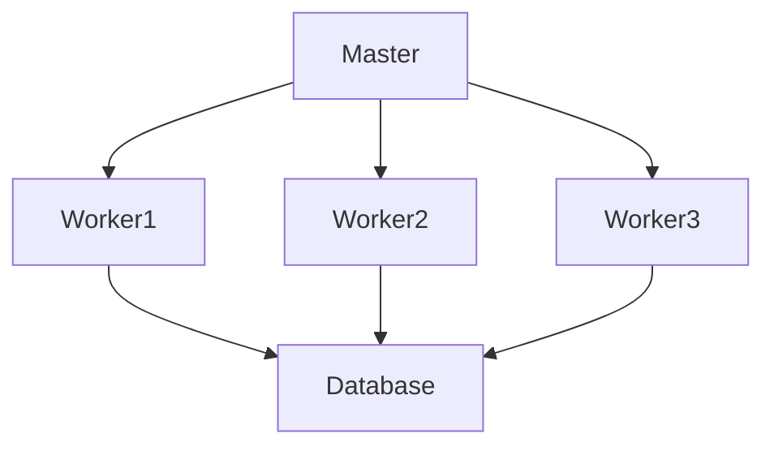
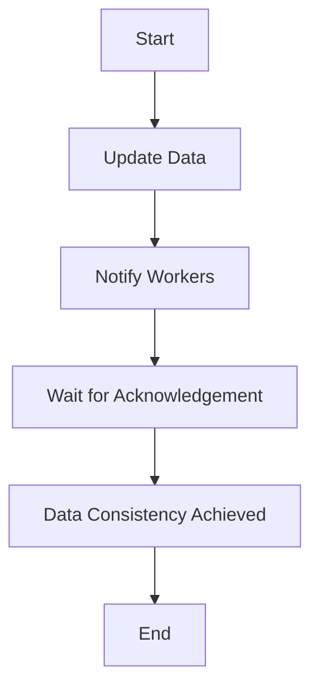
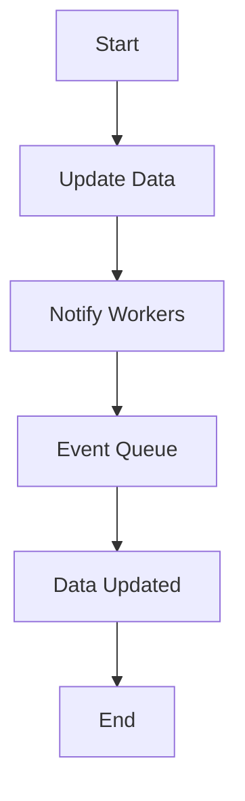

                 

# 《数据一致性模型在分布式LLM系统中的选择》

> **关键词：** 数据一致性模型、分布式计算、LLM系统、强一致性、最终一致性、性能优化、安全性

> **摘要：** 本文章将探讨数据一致性模型在分布式低秩线性模型（LLM）系统中的应用。通过对强一致性模型和最终一致性模型的分析，以及在实际应用中的性能评估，我们将为分布式LLM系统选择合适的数据一致性模型提供有价值的参考。

## 第1章 绪论

### 1.1 分布式LLM系统概述

**1.1.1 分布式计算与LLM**

分布式计算是一种将任务分布在多个计算节点上执行的计算模式。这种模式具有可扩展性、容错性和高性能的特点。近年来，随着深度学习技术的发展，分布式计算在低秩线性模型（Low-Rank Linear Model，简称LLM）系统的构建中得到了广泛应用。

LLM系统是一种基于线性模型，能够高效处理大规模数据的计算模型。它通过将数据分解为低秩矩阵，从而降低数据存储和计算复杂度。分布式LLM系统则进一步扩展了LLM的应用场景，使得在大规模数据集上的计算变得更加高效和灵活。

**1.1.2 分布式LLM系统的优势**

- **可扩展性**：分布式LLM系统可以将计算任务分布到多个节点上，从而适应更大规模的数据集。
- **容错性**：系统中的某个节点发生故障时，其他节点可以继续执行任务，保证系统的稳定运行。
- **高性能**：通过并行计算，分布式LLM系统可以显著提高数据处理速度。

**1.1.3 分布式LLM系统的挑战**

- **数据一致性**：在分布式系统中，数据可能分布在多个节点上，如何保证这些数据的一致性是一个关键问题。
- **负载均衡**：如何合理分配计算任务，使得系统整体性能得到优化。
- **通信开销**：分布式系统中节点之间的通信开销可能导致性能下降。

### 1.2 数据一致性的概念

**1.2.1 数据一致性的重要性**

数据一致性是指系统中各个节点的数据在某个时刻保持相同的值。在分布式系统中，数据一致性是保证系统正确性的基础。对于LLM系统，数据一致性至关重要，因为模型训练过程依赖于准确的数据。

**1.2.2 数据一致性的类型**

- **强一致性**：系统中的所有节点在执行操作后，立即看到最新的数据。
- **最终一致性**：系统中的所有节点最终会看到最新的数据，但这个时间可能有一定的延迟。

**1.2.3 数据一致性与分布式系统**

在分布式系统中，数据一致性通常通过一致性模型来实现。选择合适的数据一致性模型，对于系统性能和稳定性具有重要影响。

## 第2章 数据一致性模型

### 2.1 强一致性模型

**2.1.1 强一致性模型定义**

强一致性模型要求系统在任何时刻，所有节点上的数据都是一致的。这种模型通常通过同步机制实现，即当一个节点更新数据时，其他节点必须立即更新。

**2.1.2 强一致性模型的工作原理**

强一致性模型通常采用以下机制来保证数据一致性：

- **同步复制**：当节点A更新数据时，会向其他所有节点发送更新消息，并等待确认。
- **锁机制**：通过锁机制，保证同一时间只有一个节点能够访问数据。

**2.1.3 强一致性模型的优缺点**

- **优点**：强一致性模型能够保证系统中的数据在任何时刻都是一致的，从而提高系统的可靠性。
- **缺点**：强一致性模型可能导致较高的通信开销和性能损失，特别是在大型分布式系统中。

### 2.2 最终一致性模型

**2.2.1 最终一致性模型定义**

最终一致性模型要求系统中的数据在某个时刻达到一致，但这个时间可能有一定的延迟。这种模型通常通过异步机制实现，即节点之间不必立即同步更新。

**2.2.2 最终一致性模型的工作原理**

最终一致性模型通常采用以下机制来保证数据一致性：

- **异步复制**：节点之间不必立即同步更新，而是通过事件驱动的方式，在特定条件下更新数据。
- **事件队列**：通过事件队列，确保数据更新的顺序。

**2.2.3 最终一致性模型的优缺点**

- **优点**：最终一致性模型可以降低通信开销和性能损失，适用于大型分布式系统。
- **缺点**：最终一致性模型可能存在数据不一致的情况，需要额外的容错机制。

### 2.3 强一致性模型的变体

**2.3.1 哨兵一致性模型**

哨兵一致性模型是一种结合了强一致性和最终一致性的模型。它通过在节点之间引入哨兵节点，来提高系统的性能和容错性。

**2.3.2 一致性哈希模型**

一致性哈希模型是一种基于哈希算法的分布式一致性模型。它通过哈希算法，将数据分配到不同的节点上，从而实现数据的一致性。

**2.3.3 强一致性模型的其他变体**

除了上述模型，还有许多其他变体，如分布式锁、版本控制等。这些模型都在一定程度上结合了强一致性和最终一致性的优点，以适应不同的应用场景。

## 第3章 数据一致性模型在分布式LLM系统中的应用

### 3.1 分布式LLM系统中的数据一致性需求

**3.1.1 数据访问模式**

在分布式LLM系统中，数据访问模式通常包括读取和写入。读取操作需要确保数据的一致性，以便模型能够准确地进行预测。写入操作则需要确保数据的更新能够及时地传播到所有节点。

**3.1.2 数据更新策略**

数据更新策略取决于所选的数据一致性模型。强一致性模型通常采用同步更新策略，而最终一致性模型则采用异步更新策略。

**3.1.3 数据一致性级别**

数据一致性级别通常分为强一致性和最终一致性。在分布式LLM系统中，选择合适的数据一致性级别，对于系统性能和稳定性具有重要影响。

### 3.2 强一致性模型在分布式LLM系统中的应用

**3.2.1 强一致性模型的优势**

- **数据一致性**：强一致性模型能够保证系统中的数据在任何时刻都是一致的。
- **可靠性**：强一致性模型提高了系统的可靠性，降低了数据不一致的风险。

**3.2.2 强一致性模型的实际应用场景**

- **实时数据处理**：在实时数据处理场景中，强一致性模型能够保证数据的一致性和准确性。
- **金融系统**：在金融系统中，数据一致性对于交易的准确性和安全性至关重要。

**3.2.3 强一致性模型的性能评估**

- **通信开销**：强一致性模型可能导致较高的通信开销，特别是在大型分布式系统中。
- **响应时间**：强一致性模型可能导致较高的响应时间，影响系统的性能。

### 3.3 最终一致性模型在分布式LLM系统中的应用

**3.3.1 最终一致性模型的优势**

- **可扩展性**：最终一致性模型可以降低通信开销，提高系统的可扩展性。
- **性能优化**：最终一致性模型可以减少系统的延迟，提高系统的性能。

**3.3.2 最终一致性模型的实际应用场景**

- **大数据处理**：在大数据处理场景中，最终一致性模型可以处理大规模的数据集。
- **社交媒体**：在社交媒体系统中，最终一致性模型可以保证数据的实时性和一致性。

**3.3.3 最终一致性模型的性能评估**

- **一致性延迟**：最终一致性模型可能导致数据一致性延迟，影响系统的性能。
- **数据完整性**：最终一致性模型可能存在数据不一致的情况，需要额外的容错机制。

## 第4章 数据一致性模型的实现与优化

### 4.1 数据一致性模型的实现

**4.1.1 数据一致性算法的设计**

数据一致性算法的设计取决于所选的数据一致性模型。对于强一致性模型，可以使用同步复制算法；对于最终一致性模型，可以使用异步复制算法。

**4.1.2 数据一致性模型的实现过程**

- **节点初始化**：初始化分布式系统的各个节点。
- **数据同步**：实现节点之间的数据同步机制。
- **数据更新**：实现数据更新的机制，保证数据一致性。

**4.1.3 数据一致性模型的部署**

- **分布式部署**：将数据一致性模型部署到分布式系统中的各个节点。
- **性能测试**：进行性能测试，评估数据一致性模型的性能。

### 4.2 数据一致性模型的优化

**4.2.1 数据一致性模型的性能优化**

- **负载均衡**：通过负载均衡，优化系统的性能。
- **缓存策略**：使用缓存策略，减少数据访问的延迟。

**4.2.2 数据一致性模型的可扩展性优化**

- **分区策略**：通过分区策略，实现系统的可扩展性。
- **节点动态添加**：支持节点的动态添加，提高系统的可扩展性。

**4.2.3 数据一致性模型的安全优化**

- **加密技术**：使用加密技术，保护数据的安全性。
- **访问控制**：实现访问控制机制，防止未经授权的访问。

## 第5章 分布式LLM系统中的数据一致性与容错性

### 5.1 数据一致性与容错性

**5.1.1 容错性定义**

容错性是指系统在某个节点发生故障时，能够继续执行任务的能力。在分布式LLM系统中，容错性至关重要，因为节点故障可能导致数据不一致。

**5.1.2 容错机制与数据一致性的关系**

容错机制和数据一致性密切相关。通过容错机制，系统可以在节点故障时继续运行，从而保证数据一致性。

**5.1.3 容错性在实际应用中的重要性**

- **系统可靠性**：容错性提高了系统的可靠性，降低了系统崩溃的风险。
- **数据处理效率**：容错性提高了数据处理的效率，减少了系统停机时间。

### 5.2 数据一致性与容错性的实现

**5.2.1 容错机制的设计**

- **故障检测**：设计故障检测机制，及时检测节点故障。
- **故障恢复**：设计故障恢复机制，使系统能够从故障中恢复。

**5.2.2 数据一致性在容错系统中的应用**

- **数据复制**：通过数据复制，实现数据的冗余，提高数据一致性。
- **数据版本控制**：通过数据版本控制，实现数据的回滚和恢复。

**5.2.3 容错性与数据一致性的平衡**

- **冗余策略**：通过冗余策略，实现容错性与数据一致性的平衡。
- **故障容忍度**：根据应用场景，设定合适的故障容忍度。

## 第6章 数据一致性与安全

### 6.1 数据一致性与安全

**6.1.1 数据一致性与数据安全的关系**

数据一致性与数据安全密切相关。数据不一致可能导致数据泄露或篡改，从而影响系统的安全性。

**6.1.2 数据一致性的安全风险**

- **数据泄露**：数据不一致可能导致敏感数据的泄露。
- **数据篡改**：数据不一致可能导致数据被篡改。

**6.1.3 数据一致性与安全策略**

- **加密技术**：使用加密技术，保护数据的安全性。
- **访问控制**：实现访问控制机制，防止未经授权的访问。

### 6.2 数据一致性的安全保护

**6.2.1 数据一致性保护机制**

- **数据校验**：通过数据校验，确保数据的一致性。
- **审计日志**：记录系统的操作日志，以便追踪和审计。

**6.2.2 数据一致性与加密技术**

- **数据加密**：对数据进行加密，防止数据泄露。
- **传输加密**：对数据传输进行加密，防止数据篡改。

**6.2.3 数据一致性与访问控制**

- **访问控制列表**：设置访问控制列表，限制对数据的访问。
- **身份验证**：实现身份验证机制，确保只有授权用户才能访问数据。

## 第7章 分布式LLM系统中的数据一致性案例分析

### 7.1 案例一：基于强一致性的分布式LLM系统

**7.1.1 系统架构**

系统采用强一致性模型，数据在各个节点之间进行同步更新。系统架构如图1所示：



**7.1.2 实现细节**

- **同步机制**：当Master节点更新数据时，会向所有Worker节点发送更新消息，并等待确认。
- **锁机制**：使用锁机制，保证同一时间只有一个节点能够访问数据。

**7.1.3 性能评估**

- **通信开销**：由于同步机制，系统的通信开销较大。
- **响应时间**：系统的响应时间较长。

### 7.2 案例二：基于最终一致性的分布式LLM系统

**7.2.1 系统架构**

系统采用最终一致性模型，数据在各个节点之间进行异步更新。系统架构如图2所示：


**7.2.2 实现细节**

- **异步机制**：当Master节点更新数据时，会向所有Worker节点发送更新消息，但不等待确认。
- **事件队列**：使用事件队列，确保数据更新的顺序。

**7.2.3 性能评估**

- **通信开销**：由于异步机制，系统的通信开销较小。
- **响应时间**：系统的响应时间较短。

## 第8章 未来展望与挑战

### 8.1 数据一致性模型的发展趋势

- **混合一致性模型**：未来可能会出现混合一致性模型，结合强一致性和最终一致性的优点。
- **自动化一致性管理**：自动化工具和算法将帮助开发人员更轻松地管理数据一致性。

### 8.2 分布式LLM系统中的数据一致性挑战

- **数据访问模式的变化**：随着数据访问模式的变化，数据一致性模型需要不断适应。
- **数据一致性与安全性的平衡**：如何在保证数据一致性的同时，确保数据安全性，是一个重要挑战。

### 8.3 未来发展方向

- **高效的数据一致性算法**：研究高效的数据一致性算法，以降低通信开销和响应时间。
- **自动化数据一致性管理**：开发自动化工具，帮助开发人员轻松管理数据一致性。

## 附录

### A.1 分布式LLM系统开发工具

- **分布式计算框架**：如Apache Hadoop、Apache Spark等。
- **数据一致性库**：如Google Spanner、Amazon DynamoDB等。
- **实用工具与资源推荐**：如Docker、Kubernetes等容器化技术，以及相关文档和教程。

### A.2 数据一致性模型流程图与伪代码

**A.2.1 强一致性模型流程图**



**A.2.2 最终一致性模型流程图**



**A.2.3 伪代码示例**

```python
# 强一致性模型伪代码
def strong_consistency_algorithm(data, workers):
    update_data(data)
    for worker in workers:
        send_update_message(worker)
    wait_for_acknowledgement(workers)
    return data

# 最终一致性模型伪代码
def eventual_consistency_algorithm(data, workers):
    update_data(data)
    for worker in workers:
        send_update_message(worker)
    enqueue_events(workers)
    return data
```

### A.3 数据一致性数学模型与公式

**A.3.1 数据一致性模型中的数学公式**

$$
C(t) = \sum_{i=1}^{n} w_i \cdot d_i(t)
$$

其中，$C(t)$表示在时间$t$时系统的数据一致性，$w_i$表示节点$i$的权重，$d_i(t)$表示节点$i$在时间$t$时的数据值。

**A.3.2 公式详细解释**

- $C(t)$：表示在时间$t$时系统的数据一致性，取值范围在0到1之间。值越接近1，表示数据一致性越高。
- $w_i$：表示节点$i$的权重，反映了节点在系统中的重要程度。
- $d_i(t)$：表示节点$i$在时间$t$时的数据值。

**A.3.3 实例分析**

假设系统中有3个节点，权重分别为$w_1 = 0.3$，$w_2 = 0.3$，$w_3 = 0.4$。在时间$t=0$时，节点1的数据值为1，节点2的数据值为2，节点3的数据值为3。根据上述公式，可以计算出系统的数据一致性：

$$
C(0) = 0.3 \cdot 1 + 0.3 \cdot 2 + 0.4 \cdot 3 = 1.7
$$

系统的数据一致性为1.7，表示在时间$t=0$时，系统的数据一致性较高。随着时间的变化，数据一致性可能会发生变化。

## 附录

### A.1 分布式LLM系统开发工具

- **分布式计算框架**：如Apache Hadoop、Apache Spark等。
- **数据一致性库**：如Google Spanner、Amazon DynamoDB等。
- **实用工具与资源推荐**：如Docker、Kubernetes等容器化技术，以及相关文档和教程。

### A.2 数据一致性模型流程图与伪代码

**A.2.1 强一致性模型流程图**


**A.2.2 最终一致性模型流程图**


**A.2.3 伪代码示例**

```python
# 强一致性模型伪代码
def strong_consistency_algorithm(data, workers):
    update_data(data)
    for worker in workers:
        send_update_message(worker)
    wait_for_acknowledgement(workers)
    return data

# 最终一致性模型伪代码
def eventual_consistency_algorithm(data, workers):
    update_data(data)
    for worker in workers:
        send_update_message(worker)
    enqueue_events(workers)
    return data
```

### A.3 数据一致性数学模型与公式

**A.3.1 数据一致性模型中的数学公式**

$$
C(t) = \sum_{i=1}^{n} w_i \cdot d_i(t)
$$

其中，$C(t)$表示在时间$t$时系统的数据一致性，$w_i$表示节点$i$的权重，$d_i(t)$表示节点$i$在时间$t$时的数据值。

**A.3.2 公式详细解释**

- $C(t)$：表示在时间$t$时系统的数据一致性，取值范围在0到1之间。值越接近1，表示数据一致性越高。
- $w_i$：表示节点$i$的权重，反映了节点在系统中的重要程度。
- $d_i(t)$：表示节点$i$在时间$t$时的数据值。

**A.3.3 实例分析**

假设系统中有3个节点，权重分别为$w_1 = 0.3$，$w_2 = 0.3$，$w_3 = 0.4$。在时间$t=0$时，节点1的数据值为1，节点2的数据值为2，节点3的数据值为3。根据上述公式，可以计算出系统的数据一致性：

$$
C(0) = 0.3 \cdot 1 + 0.3 \cdot 2 + 0.4 \cdot 3 = 1.7
$$

系统的数据一致性为1.7，表示在时间$t=0$时，系统的数据一致性较高。随着时间的变化，数据一致性可能会发生变化。

## 参考文献

1. Google Spanner: A Spanner: Google's Globally-Distributed Database. https://ai.google/research/pubs/pub44824
2. Amazon DynamoDB: DynamoDB: A Scalable, Flexible, Secure, and Reliable NoSQL Database Service. https://aws.amazon.com/dynamodb/
3. Apache Hadoop: Apache Hadoop: The Apache Software Foundation. https://hadoop.apache.org/
4. Apache Spark: Apache Spark: The Apache Software Foundation. https://spark.apache.org/
5. Docker: Docker: Develop, ship, and run amazing applications. https://www.docker.com/
6. Kubernetes: Kubernetes: Production-Grade Container Orchestration. https://kubernetes.io/
```

# 作者信息

作者：AI天才研究院/AI Genius Institute & 禅与计算机程序设计艺术 /Zen And The Art of Computer Programming

