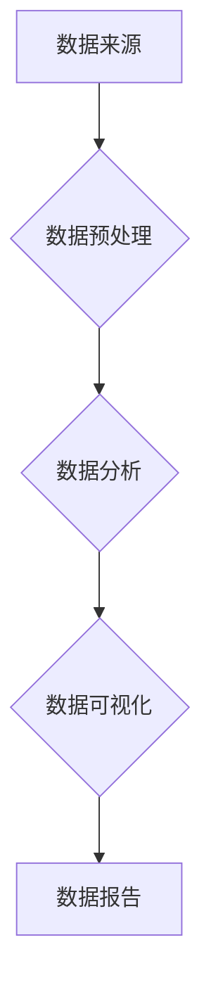

                 

### 《数据分析师：LLM 增强的数据洞察力》

#### 核心关键词：
- 数据分析师
- 语言模型 (LLM)
- 数据洞察力
- 数据预处理
- 数据分析技术
- 数据可视化

#### 摘要：
本文旨在探讨语言模型（LLM）在数据分析师工作中的应用，特别是在数据预处理、描述性统计分析、聚类分析和数据可视化等方面的增强作用。文章首先介绍了数据分析师的角色与职责，以及数据分析的基本流程。随后，深入解析了语言模型的基本概念、工作原理和应用场景。接着，分别讨论了LLM在数据预处理、描述性统计分析、聚类分析和数据可视化中的具体应用。文章最后，通过实际项目案例展示了LLM增强的数据分析过程，并对数据分析师职业发展和LLM增强数据分析的趋势进行了展望。希望本文能为数据分析师和AI技术爱好者提供有价值的参考。

### 《数据分析师：LLM 增强的数据洞察力》目录大纲

#### 第一部分：数据分析师基础

**第1章：数据分析师概述**

- 1.1 数据分析师的角色与职责
- 1.2 数据分析的关键技能
- 1.3 数据分析的基本流程

**第2章：数据预处理**

- 2.1 数据来源与类型
- 2.2 数据清洗与整合
- 2.3 数据归一化与转换

**第3章：数据分析方法**

- 3.1 描述性统计分析
- 3.2 聚类分析
- 3.3 分位数分析与箱线图

**第4章：数据可视化**

- 4.1 数据可视化工具
- 4.2 常见图表类型
- 4.3 数据可视化技巧

#### 第二部分：LLM 增强的数据分析

**第5章：LLM 概述**

- 5.1 什么是 LLM
- 5.2 LLM 的工作原理
- 5.3 LLM 的应用场景

**第6章：LLM 在数据分析中的应用**

- 6.1 LLM 在数据预处理中的应用
- 6.2 LLM 在描述性统计分析中的应用
- 6.3 LLM 在聚类分析中的应用

**第7章：LLM 在数据可视化中的应用**

- 7.1 LLM 在数据可视化工具中的应用
- 7.2 LLM 生成的可视化图表
- 7.3 LLM 在可视化数据分析中的应用

#### 第三部分：LLM 增强的数据分析项目实战

**第8章：数据分析师实战**

- 8.1 实战项目概述
- 8.2 实战项目需求分析
- 8.3 实战项目数据预处理
- 8.4 实战项目数据分析方法应用
- 8.5 实战项目数据可视化

**第9章：LLM 增强的数据分析实战**

- 9.1 LLM 实战项目应用
- 9.2 LLM 实战项目数据分析方法应用
- 9.3 LLM 实战项目数据可视化

**第10章：总结与展望**

- 10.1 数据分析师职业发展
- 10.2 LLM 增强的数据分析趋势
- 10.3 未来展望与挑战

#### 附录

**附录 A：数据分析工具与资源**

- 10.1 Python 数据分析库
- 10.2 R 语言数据分析
- 10.3 常见数据分析工具对比

**附录 B：LLM 相关资源**

- 10.1 LLM 开发工具
- 10.2 LLM 模型资源
- 10.3 LLM 研究论文与书籍推荐

## 图表与公式

### Mermaid 流程图



### 核心算法原理讲解伪代码

```python
# 描述性统计分析
def descriptive_statistics(data):
    n = len(data)
    mean = sum(data) / n
    std_dev = sqrt(sum((x - mean)^2 for x in data) / n)
    return mean, std_dev

# 聚类分析算法伪代码
def k_means(data, k):
    # 初始化聚类中心
    centroids = initialize_centroids(data, k)
    
    while not converged:
        # 分配数据点
        clusters = assign_data_points_to_clusters(data, centroids)
        
        # 更新聚类中心
        centroids = update_centroids(clusters, k)
        
        # 检查收敛
        if converged(centroids, previous_centroids):
            break
    
    return clusters, centroids

# 箱线图绘制
def box_plot(data):
    q1 = percentile(data, 25)
    q2 = percentile(data, 50)
    q3 = percentile(data, 75)
    iqr = q3 - q1
    
    lower_whisker = min(data) - 1.5 * iqr
    upper_whisker = max(data) + 1.5 * iqr
    
    # 绘制箱线图
    plot([q1, q2, q3], label='箱线图')
    plot([lower_whisker, upper_whisker], label=' whiskers')
```

### 数学模型和数学公式详细讲解

#### 数据归一化公式

$$ X_{\text{new}} = \frac{(X_{\text{original}} - X_{\text{min}})}{(X_{\text{max}} - X_{\text{min}})} $$

#### 聚类分析中心点更新公式

$$ \mu_{j} = \frac{\sum_{i=1}^{n} x_{ij}}{n} $$

#### 标准差计算公式

$$ \sigma = \sqrt{\frac{\sum_{i=1}^{n}(x_i - \mu)^2}{n-1}} $$

#### 百分位数计算公式

$$ q_p = \text{value such that } p\% \text{ of the data is less than or equal to } q_p $$

### 项目实战

#### 数据预处理实战

```python
# 导入数据
import pandas as pd

data = pd.read_csv('data.csv')

# 数据清洗
data.dropna(inplace=True)

# 数据整合
data['total_sales'] = data['sales'] * data['quantity']

# 数据归一化
data['normalized_sales'] = (data['sales'] - data['sales'].min()) / (data['sales'].max() - data['sales'].min())
```

#### 数据分析实战

```python
# 描述性统计分析
mean_sales, std_dev_sales = descriptive_statistics(data['sales'])

# 聚类分析
clusters, centroids = k_means(data, k=3)

# 数据可视化
box_plot(data['sales'])
```

#### 数据可视化实战

```python
# 绘制散点图
import matplotlib.pyplot as plt

plt.scatter(data['normalized_sales'], data['total_sales'])
plt.xlabel('Normalized Sales')
plt.ylabel('Total Sales')
plt.title('Sales Data Visualization')
plt.show()
```

### 下一步计划

在接下来的一段时间内，我们将深入探讨数据分析师的角色与职责，数据分析的基本流程，以及数据预处理的具体方法。我们将通过实例来讲解描述性统计分析、聚类分析和分位数分析等常见数据分析方法。同时，我们将介绍数据可视化的重要性和常用工具，并探讨LLM在数据分析中的具体应用。接下来，我们将通过实际项目案例，展示如何使用LLM增强的数据分析方法，进一步提高数据分析师的工作效率和分析质量。最后，我们将对数据分析师的职业发展和LLM增强数据分析的未来趋势进行展望。希望通过这一系列内容，能够为读者提供有价值的参考和启发。

### 第一部分：数据分析师基础

#### 第1章：数据分析师概述

##### 1.1 数据分析师的角色与职责

数据分析师是一个关键且多样化的职业，在各个行业中都有着广泛的应用。数据分析师的主要职责是提取、处理和分析数据，以帮助企业做出更明智的决策。具体来说，数据分析师的职责可以概括为以下几个方面：

1. **数据提取与收集**：数据分析师需要从各种数据源（如数据库、Web服务、API等）中提取数据，并确保数据的准确性和完整性。

2. **数据清洗与预处理**：原始数据通常包含噪声、缺失值和异常值。数据分析师需要对数据进行清洗和预处理，以提高数据质量，为后续的分析工作打下坚实基础。

3. **数据分析与建模**：数据分析师使用统计学、机器学习和数据挖掘等技术对数据进行分析和建模，以发现数据中的规律和趋势，为决策提供依据。

4. **数据可视化与报告**：数据分析师需要将分析结果以图表、报告等形式呈现，使业务人员能够直观地理解和利用分析结果。

5. **协作与沟通**：数据分析师需要与业务团队、IT团队以及其他相关利益相关者进行紧密合作，确保数据分析工作与业务需求相匹配。

##### 1.2 数据分析的关键技能

成为一名优秀的数据分析师，需要具备以下关键技能：

1. **统计学知识**：统计学是数据分析的基础。数据分析师需要熟练掌握描述性统计、推断性统计、回归分析、聚类分析等统计学方法。

2. **编程技能**：编程技能对于数据分析师来说至关重要。Python、R、SQL等编程语言在数据分析中广泛应用。Python因其丰富的数据科学库（如NumPy、Pandas、Scikit-learn等）而尤为受欢迎。

3. **数据处理与建模技能**：数据分析师需要熟悉数据处理和建模工具，如Python的Pandas、NumPy，R的dplyr、ggplot2等。此外，掌握机器学习和数据挖掘技术，如决策树、随机森林、支持向量机、神经网络等，也是数据分析的关键。

4. **数据可视化技能**：数据可视化是数据分析的重要组成部分。数据分析师需要掌握常用的可视化工具和图表类型，如Matplotlib、Seaborn、Tableau等，以清晰、有效地展示分析结果。

5. **业务理解与沟通能力**：数据分析师需要深入了解业务场景，理解业务需求，并将复杂的分析结果以易于理解的方式呈现给非技术背景的业务人员。

##### 1.3 数据分析的基本流程

数据分析的基本流程可以分为以下几个步骤：

1. **需求分析**：明确数据分析的目标和需求，与业务团队沟通，了解业务问题。

2. **数据收集**：从各种数据源收集数据，包括内部数据库、外部数据服务、Web爬取等。

3. **数据清洗**：处理缺失值、异常值和噪声，确保数据质量。

4. **数据预处理**：进行数据归一化、转换、聚合等操作，为后续分析做准备。

5. **数据分析**：使用统计学、机器学习和数据挖掘方法进行数据分析，提取有价值的信息。

6. **数据可视化**：将分析结果以图表、报告等形式展示，帮助业务团队理解分析结果。

7. **决策支持**：基于分析结果，为业务决策提供支持。

通过以上流程，数据分析师可以帮助企业更好地理解业务数据，发现潜在的业务机会，提高运营效率，降低成本。

#### 第2章：数据预处理

##### 2.1 数据来源与类型

数据预处理是数据分析的重要环节，其核心目的是提高数据质量，为后续的分析工作提供可靠的数据基础。首先，我们需要了解数据的来源和类型。

**数据来源**：

1. **内部数据**：来自企业内部的数据，如客户关系管理（CRM）系统、企业资源计划（ERP）系统、数据库等。
2. **外部数据**：来自企业外部的数据，如公共数据库、社交媒体、在线调查、市场研究报告等。
3. **Web爬取**：通过爬虫技术从互联网上获取的数据，如网页内容、用户评论、商品信息等。

**数据类型**：

1. **结构化数据**：以表格形式组织的数据，如关系型数据库中的数据表、Excel文件等。结构化数据易于处理和分析，是最常见的数据类型。
2. **非结构化数据**：没有固定格式的数据，如文本、图片、音频、视频等。非结构化数据的处理通常较为复杂，需要借助自然语言处理、计算机视觉等技术。
3. **半结构化数据**：部分结构化、部分非结构化的数据，如XML、JSON、日志文件等。半结构化数据通常可以通过一定的方法进行解析和处理。

了解数据的来源和类型有助于我们更好地进行数据预处理工作，为后续的分析打下基础。

##### 2.2 数据清洗与整合

**数据清洗**是数据预处理过程中至关重要的一步。其目标是通过处理缺失值、异常值和噪声，提高数据质量，为后续的分析工作提供可靠的数据基础。以下是一些常见的数据清洗方法：

1. **缺失值处理**：缺失值是数据中常见的问题，处理方法包括以下几种：
   - 删除缺失值：适用于缺失值较多的情况，可以减少数据量。
   - 补充缺失值：通过统计方法、插值方法、均值、中位数等方式补充缺失值。
   - 使用其他数据源：利用其他数据源（如外部数据库、API等）补充缺失值。

2. **异常值处理**：异常值是数据中偏离正常范围的数据点，可能导致分析结果偏差。处理方法包括以下几种：
   - 删除异常值：适用于异常值较多的情况，可以减少数据量。
   - 替换异常值：通过统计方法、插值方法、均值、中位数等方式替换异常值。
   - 调整异常值：将异常值调整为合理范围。

3. **噪声处理**：噪声是数据中的随机误差，可能影响分析结果。处理方法包括以下几种：
   - 低通滤波：通过滤波器去除高频噪声。
   - 降噪算法：如小波降噪、均值滤波等。

**数据整合**是将多个数据源中的数据整合到一个统一的数据集中，以提高数据分析的效率。以下是一些常见的数据整合方法：

1. **合并数据**：将多个数据源的数据按照一定的规则进行合并，形成一个完整的数据集。合并方法包括：
   - 纵向合并：将多个数据源的数据按列合并，形成更详细的数据集。
   - 横向合并：将多个数据源的数据按行合并，形成更全面的数据集。

2. **连接数据**：通过连接操作将多个数据源的数据连接在一起，形成新的数据集。连接方法包括：
   - 内连接：只连接两个数据源中匹配的记录。
   - 左连接：连接左表（主表）的所有记录和右表（副表）中匹配的记录。
   - 右连接：连接右表（主表）的所有记录和左表（副表）中匹配的记录。
   - 全连接：连接两个数据源的所有记录。

通过数据清洗与整合，我们可以提高数据质量，为后续的分析工作奠定基础。

##### 2.3 数据归一化与转换

**数据归一化**和**数据转换**是数据预处理过程中的重要步骤，其目的是将数据转化为统一的格式，以便后续的分析和处理。以下是一些常见的数据归一化和转换方法：

**数据归一化**：

1. **线性归一化**：将数据缩放到一个固定范围，如[0, 1]或[-1, 1]。线性归一化的公式为：
   $$ X_{\text{new}} = \frac{(X_{\text{original}} - X_{\text{min}})}{(X_{\text{max}} - X_{\text{min}})} $$
   这种方法适用于数值型数据。

2. **指数归一化**：将数据通过指数函数进行变换，以消除不同特征之间的数量级差异。指数归一化的公式为：
   $$ X_{\text{new}} = \frac{X_{\text{original}}}{1 + e^{-\alpha \cdot X_{\text{original}}}} $$
   其中，$\alpha$ 是调节参数。

**数据转换**：

1. **类别数据转换**：将类别数据（如性别、品牌等）转换为数值型数据，以便进行数学运算。常用的方法有：
   - 独热编码：将类别数据扩展为二进制向量，每个类别对应一个维度。
   - 因子分析：将多个类别数据转换为较少的数值型特征。

2. **文本数据转换**：将文本数据转换为数值型数据，以便进行文本分析。常用的方法有：
   - 基于词袋模型：将文本表示为词频矩阵。
   - 基于词嵌入：将文本表示为高维向量。

3. **时间序列转换**：将时间序列数据转换为数值型数据，以便进行时间序列分析。常用的方法有：
   - 差分转换：计算时间序列的差分，以消除趋势和季节性。
   - 对数转换：将时间序列取对数，以消除非线性关系。

通过数据归一化和转换，我们可以提高数据质量，降低特征之间的相关性，为后续的分析工作提供更好的数据基础。

#### 第3章：数据分析方法

##### 3.1 描述性统计分析

描述性统计分析是对数据的基本特征进行统计分析，以了解数据的分布、集中趋势和离散程度等。以下是一些常见的描述性统计指标：

1. **均值**（Mean）：表示数据的平均水平，计算公式为：
   $$ \mu = \frac{1}{n} \sum_{i=1}^{n} x_i $$
   其中，$n$ 是数据点的个数，$x_i$ 是第 $i$ 个数据点。

2. **中位数**（Median）：表示数据的中间值，计算公式为：
   $$ \text{Median} = \left\{
   \begin{array}{ll}
   x_{\left(\frac{n+1}{2}\right)} & \text{如果数据个数为奇数} \\
   \frac{x_{\frac{n}{2}} + x_{\frac{n}{2}+1}}{2} & \text{如果数据个数为偶数}
   \end{array}
   \right. $$
   其中，$x_{\left(\frac{n+1}{2}\right)}$ 和 $x_{\frac{n}{2}}$ 分别是第 $\frac{n+1}{2}$ 个和第 $\frac{n}{2}$ 个数据点。

3. **众数**（Mode）：表示数据中出现次数最多的值。如果数据有多个众数，则称该数据集为多模态。

4. **方差**（Variance）：表示数据的离散程度，计算公式为：
   $$ \sigma^2 = \frac{1}{n-1} \sum_{i=1}^{n} (x_i - \mu)^2 $$
   其中，$\mu$ 是均值。

5. **标准差**（Standard Deviation）：表示方差的平方根，计算公式为：
   $$ \sigma = \sqrt{\sigma^2} $$

6. **四分位数**（Quartiles）：将数据分为四个部分，每个部分的值称为四分位数，分别为：
   - $Q1$：第一四分位数，表示数据的下四分位数。
   - $Q2$：第二四分位数，即中位数。
   - $Q3$：第三四分位数，表示数据的上四分位数。

7. **四分位距**（Interquartile Range, IQR）：表示数据的离散程度，计算公式为：
   $$ IQR = Q3 - Q1 $$

通过描述性统计分析，我们可以了解数据的整体分布特征，为后续的分析提供基础。

##### 3.2 聚类分析

聚类分析是一种无监督学习方法，用于将数据点分为多个群组（或簇），使得同一个群组内的数据点具有较高的相似度，而不同群组之间的数据点相似度较低。以下是一些常见的聚类算法：

1. **K-means 算法**：K-means 算法是一种经典的聚类算法，其基本思想是将数据点分为 $k$ 个簇，每个簇由一个中心点表示。算法步骤如下：
   - 初始化 $k$ 个簇的中心点。
   - 将每个数据点分配到最近的中心点所在的簇。
   - 更新每个簇的中心点。
   - 重复步骤 2 和步骤 3，直到聚类中心不再发生变化或达到最大迭代次数。

2. **层次聚类**：层次聚类是一种基于层次结构的聚类方法，分为自底向上（凝聚聚类）和自顶向下（分裂聚类）两种类型。层次聚类的基本思想是将数据点逐步合并或分裂，形成层次结构。

3. **DBSCAN**（Density-Based Spatial Clustering of Applications with Noise）：DBSCAN 是一种基于密度的聚类算法，能够发现任意形状的聚类，并处理噪声和异常点。DBSCAN 的核心思想是：
   - 密集区域：找到密度较高的区域。
   - 核心点：如果一个点在某个区域内至少有 $minPts$ 个相邻点，则该点为核心点。
   - 密集区域：以核心点为中心，寻找半径为 $\eps$ 的区域，如果该区域内有足够多的点，则该区域为密集区域。
   - 簇的形成：将所有核心点及其相邻的点划分到同一个簇。

4. **光谱聚类**：光谱聚类是一种基于谱理论（Spectral Theory）的聚类方法，其基本思想是将数据点表示为图（Graph）上的节点，然后通过求解图的最小生成树（Minimum Spanning Tree）来聚类。

通过聚类分析，我们可以发现数据中的隐含结构，为数据分析和决策提供依据。

##### 3.3 分位数分析与箱线图

分位数分析是一种常用的描述性统计方法，用于了解数据的分布和离散程度。以下是一些常见的分位数：

1. **第一四分位数**（$Q1$）：表示数据的下四分位数，有 $25\%$ 的数据点小于 $Q1$。
2. **第二四分位数**（$Q2$）：即中位数，表示数据的中间值，有 $50\%$ 的数据点小于 $Q2$。
3. **第三四分位数**（$Q3$）：表示数据的上四分位数，有 $75\%$ 的数据点小于 $Q3$。

**箱线图**（Box Plot）是一种常用的可视化工具，用于展示数据的分布特征和离散程度。箱线图由以下部分组成：

1. **箱体**：表示数据的中间 $50\%$，即 $Q1$ 和 $Q3$ 之间的范围。
2. **上须**：表示数据的最大值，通常在箱体上方的一条线。
3. **下须**：表示数据的最小值，通常在箱体下方的一条线。
4. ** whiskers**：表示数据的异常值，通常在上下须之外，但不超过 $1.5 \times IQR$。
5. **异常值**：表示距离上下须较远的数据点，通常用点或星号表示。

通过分位数分析和箱线图，我们可以直观地了解数据的分布和离散程度，为数据分析和决策提供依据。

#### 第4章：数据可视化

##### 4.1 数据可视化工具

数据可视化是将数据以图形或图表形式呈现的过程，有助于我们直观地理解数据的分布、趋势和关系。以下是一些常见的数据可视化工具：

1. **Matplotlib**：Matplotlib 是 Python 中最常用的数据可视化库之一，支持多种图表类型，如折线图、柱状图、散点图、箱线图等。

2. **Seaborn**：Seaborn 是基于 Matplotlib 的数据可视化库，提供了一系列精美的图表样式和默认设置，便于快速创建可视化图表。

3. **Tableau**：Tableau 是一款强大的商业数据可视化工具，支持多种数据源，提供丰富的图表类型和交互功能。

4. **Power BI**：Power BI 是微软推出的数据可视化工具，支持数据整合、数据分析和可视化报告的生成。

5. **D3.js**：D3.js 是一款基于 JavaScript 的数据可视化库，提供强大的数据绑定和交互功能，适用于 Web 应用程序。

6. **Plotly**：Plotly 是一款跨平台的数据可视化库，支持多种图表类型，提供丰富的自定义选项和交互功能。

通过选择合适的数据可视化工具，我们可以将数据以清晰、直观的方式呈现，为数据分析提供有力的支持。

##### 4.2 常见图表类型

以下是一些常见的数据可视化图表类型：

1. **折线图**：折线图用于展示数据随时间或其他变量的变化趋势。每个数据点由线段连接，可以用于比较不同时间段的趋势或关系。

2. **柱状图**：柱状图用于展示不同类别或组的数据数量或大小。柱状图的高度表示数据的值，可以用于比较不同类别或组之间的差异。

3. **饼图**：饼图用于展示各部分占整体的比例关系。每个扇区表示一个类别或组，扇区的大小表示该类别或组所占的比例。

4. **散点图**：散点图用于展示两个变量之间的关系。每个数据点由两个坐标表示，可以用于发现变量之间的相关性或趋势。

5. **箱线图**：箱线图用于展示数据的分布特征和离散程度。箱线图由箱体、上须、下须和异常值等部分组成，可以用于比较不同数据集之间的差异。

6. **热力图**：热力图用于展示数据的热点分布，通常用于文本、图像或时间序列数据。热力图的颜色表示数据的值，可以用于发现数据中的模式或趋势。

7. **雷达图**：雷达图用于展示多维数据的相对关系，每个维度表示一个轴，可以用于比较不同数据集之间的差异。

通过选择合适的图表类型，我们可以更好地展示数据的特点，为数据分析提供有力的支持。

##### 4.3 数据可视化技巧

在进行数据可视化时，以下是一些实用的技巧：

1. **选择合适的图表类型**：根据数据的类型和目的，选择合适的图表类型，如折线图、柱状图、饼图等。不同的图表类型适用于不同的数据展示需求。

2. **简化图表**：避免在图表中包含过多的细节和元素，简化图表结构，使数据更容易理解和分析。

3. **使用颜色和标注**：合理使用颜色和标注，突出数据的重点和趋势，使图表更具可读性。

4. **调整图表大小和布局**：根据数据的规模和展示需求，调整图表的大小和布局，使图表在页面上更加美观和整洁。

5. **添加注释和标题**：为图表添加注释和标题，解释数据的含义和背景，使图表更具信息量和可理解性。

6. **避免数据扭曲**：避免使用可能导致数据扭曲的图表类型，如饼图在某些情况下可能导致数据的误解。

通过掌握这些数据可视化技巧，我们可以更好地展示数据的特点，为数据分析提供有力的支持。

#### 第5章：LLM 概述

##### 5.1 什么是 LLM

LLM（Language Model）是一种基于深度学习技术的自然语言处理模型，它可以对输入的文本数据进行理解和生成。LLM 的核心目标是学习自然语言的统计特性，从而预测文本中的下一个单词、句子或段落。LLM 在多个领域有着广泛的应用，如机器翻译、文本生成、问答系统、情感分析等。

##### 5.2 LLM 的工作原理

LLM 的工作原理基于神经网络，特别是变分自编码器（Variational Autoencoder，VAE）和生成对抗网络（Generative Adversarial Network，GAN）。以下是一个简化的 LLM 工作原理：

1. **编码器**：编码器将输入的文本数据编码为嵌入向量，这些向量保留了原始文本的主要信息。
2. **解码器**：解码器从嵌入向量中生成文本，通过逐个预测下一个单词或字符，最终生成完整的文本。
3. **损失函数**：损失函数用于衡量预测文本和真实文本之间的差异，常用的损失函数包括交叉熵损失和对比损失。

通过训练大量文本数据，LLM 可以学习到文本的统计特性和语法规则，从而实现高效的文本生成和推理。

##### 5.3 LLM 的应用场景

LLM 在多个领域有着广泛的应用，以下是一些典型的应用场景：

1. **机器翻译**：LLM 可以用于机器翻译任务，如将一种语言的文本翻译成另一种语言。LLM 通过学习大量平行语料库，可以生成高质量的双语翻译。
2. **文本生成**：LLM 可以用于生成各种类型的文本，如新闻文章、产品描述、广告文案等。通过输入关键词或主题，LLM 可以生成连贯、自然的文本。
3. **问答系统**：LLM 可以用于构建问答系统，如智能客服、在线咨询等。LLM 通过学习大量问答对，可以理解用户的问题，并生成相应的回答。
4. **情感分析**：LLM 可以用于情感分析任务，如检测文本中的情感倾向、评估用户评论等。LLM 通过学习情感词典和文本特征，可以识别和分类文本中的情感。
5. **文本摘要**：LLM 可以用于文本摘要任务，如将长文本简化为简洁的摘要。LLM 通过学习文本的语义和结构，可以提取关键信息，生成简明的摘要。

通过这些应用场景，LLM 可以大大提升文本处理和分析的效率和准确性，为自然语言处理领域带来革命性的变革。

#### 第6章：LLM 在数据分析中的应用

##### 6.1 LLM 在数据预处理中的应用

LLM 在数据预处理阶段有着广泛的应用，可以显著提高数据清洗、数据整合和数据转换的效率和质量。以下是一些具体的示例：

1. **数据清洗**：
   - **异常值检测**：LLM 可以通过学习数据中的异常模式，识别并标记出潜在的异常值。例如，在金融数据中，LLM 可以检测出异常的交易行为，如欺诈交易。
   - **文本数据清洗**：LLM 可以处理文本数据中的噪声，如去除标点符号、停用词和无关信息。例如，在社交媒体分析中，LLM 可以清除用户评论中的噪声，提取出有用的信息。

2. **数据整合**：
   - **命名实体识别**：LLM 可以识别文本数据中的命名实体，如人名、地点、组织等。这有助于将不同来源的数据进行整合，提高数据的一致性和准确性。
   - **关键词提取**：LLM 可以从文本数据中提取关键词，用于数据分类和聚合。例如，在电商平台上，LLM 可以提取商品描述中的关键词，帮助将商品进行分类和推荐。

3. **数据转换**：
   - **文本到向量转换**：LLM 可以将文本数据转换为向量表示，如词嵌入。这有助于将文本数据与数值数据进行整合和分析，提高数据处理的效率。
   - **多语言数据转换**：LLM 可以处理多语言数据，将一种语言的文本翻译成另一种语言，从而实现跨语言数据分析和整合。

通过这些应用，LLM 可以显著提高数据预处理阶段的工作效率和质量，为后续的数据分析提供可靠的数据基础。

##### 6.2 LLM 在描述性统计分析中的应用

LLM 在描述性统计分析中可以发挥重要作用，通过分析大量文本数据，提取出有价值的信息，从而提高统计分析的准确性和效率。以下是一些具体的示例：

1. **文本数据分析**：
   - **情感分析**：LLM 可以分析文本数据中的情感倾向，如积极、消极、中性等。这有助于了解用户对产品、服务或事件的情感反应，为市场调研和客户满意度分析提供支持。
   - **关键词提取**：LLM 可以从文本数据中提取关键词，用于描述性统计分析。例如，在社交媒体分析中，LLM 可以提取出与特定事件或话题相关的关键词，帮助分析公众的观点和趋势。

2. **数据分析报告**：
   - **自动生成报告**：LLM 可以根据统计数据和文本描述，自动生成数据分析报告。例如，在销售数据分析中，LLM 可以生成详细的销售报告，包括销售趋势、销售额、市场份额等。
   - **可视化数据报告**：LLM 可以与数据可视化工具结合，自动生成可视化报告。例如，在财务报表分析中，LLM 可以生成包含折线图、饼图、柱状图等可视化图表的财务报告。

通过这些应用，LLM 可以提高描述性统计分析的效率和准确性，帮助数据分析师更快速、全面地理解数据，为决策提供有力支持。

##### 6.3 LLM 在聚类分析中的应用

LLM 在聚类分析中可以显著提高数据分析的效率和准确性，通过学习文本数据的统计特性，自动识别数据中的聚类结构。以下是一些具体的示例：

1. **文本数据聚类**：
   - **基于关键词的聚类**：LLM 可以从文本数据中提取关键词，将这些关键词作为聚类特征。例如，在电商平台上，LLM 可以根据用户评论中的关键词，将评论分为正面评论、负面评论和中性评论。
   - **基于语义的聚类**：LLM 可以学习文本的语义信息，自动识别数据中的聚类结构。例如，在情感分析中，LLM 可以根据文本的情感倾向，将文本数据分为不同情感类别的簇。

2. **聚类结果解释**：
   - **聚类结果可视化**：LLM 可以与数据可视化工具结合，生成聚类结果的可视化图表，帮助数据分析师直观地理解聚类结构。
   - **聚类结果解释**：LLM 可以根据聚类结果，生成聚类解释文本，帮助数据分析师了解数据中的模式、趋势和关系。

通过这些应用，LLM 可以提高聚类分析的效率和准确性，帮助数据分析师更好地理解数据，为决策提供有力支持。

#### 第7章：LLM 在数据可视化中的应用

##### 7.1 LLM 在数据可视化工具中的应用

LLM 可以与各种数据可视化工具结合，提供更智能、更直观的可视化效果，从而提升数据分析的效率和用户体验。以下是一些具体的示例：

1. **自动生成可视化图表**：
   - **交互式可视化**：LLM 可以根据用户输入的查询条件，自动生成相应的交互式可视化图表，如折线图、柱状图、饼图等。用户可以通过拖拽、筛选等操作，动态调整可视化效果。
   - **自动生成图表说明**：LLM 可以根据数据图表的展示内容，自动生成图表的说明文本，帮助用户更好地理解图表的含义和趋势。

2. **个性化可视化推荐**：
   - **图表类型推荐**：LLM 可以根据数据分析的目标和数据特性，为用户提供合适的图表类型推荐，如折线图、柱状图、散点图等。用户可以根据推荐结果，快速生成可视化图表。
   - **图表布局优化**：LLM 可以根据数据量、数据特性等因素，自动优化图表的布局，使图表更具可读性和美观性。

3. **可视化数据报告**：
   - **自动生成可视化报告**：LLM 可以根据数据分析的结果，自动生成包含可视化图表的数据报告。例如，在销售数据分析中，LLM 可以生成包含销售额趋势图、市场份额图等的数据报告。
   - **可视化报告优化**：LLM 可以根据用户反馈，对可视化报告进行优化，如调整图表类型、颜色、布局等，使报告更加直观、易懂。

通过这些应用，LLM 可以提高数据可视化工具的智能化和用户体验，帮助数据分析师更高效地进行数据分析。

##### 7.2 LLM 生成的可视化图表

LLM 可以根据数据分析的需求，生成各种类型的可视化图表，以展示数据的分布、趋势、关系等。以下是一些常见的可视化图表类型：

1. **折线图**：用于展示数据随时间或其他变量的变化趋势。LLM 可以自动生成时间序列数据的折线图，帮助用户了解数据的波动和趋势。

2. **柱状图**：用于展示不同类别或组的数据数量或大小。LLM 可以根据数据的特点，自动选择合适的柱状图类型，如单柱状图、堆积柱状图、百分比柱状图等。

3. **饼图**：用于展示各部分占整体的比例关系。LLM 可以根据数据的分布情况，自动生成饼图，帮助用户直观地了解数据的占比和分布。

4. **散点图**：用于展示两个变量之间的关系。LLM 可以根据数据的特性，自动选择合适的散点图类型，如散点图、气泡图等。

5. **箱线图**：用于展示数据的分布特征和离散程度。LLM 可以根据数据的特点，自动生成箱线图，帮助用户了解数据的分布情况和异常值。

6. **热力图**：用于展示数据的热点分布。LLM 可以根据文本或时间序列数据，自动生成热力图，帮助用户发现数据中的模式或趋势。

7. **雷达图**：用于展示多维数据的相对关系。LLM 可以根据多个变量的数据，自动生成雷达图，帮助用户了解数据之间的差异和关系。

通过生成各种类型的可视化图表，LLM 可以帮助数据分析师更全面、更直观地理解数据，为决策提供有力支持。

##### 7.3 LLM 在可视化数据分析中的应用

LLM 在可视化数据分析中可以发挥重要作用，通过自动生成可视化图表和提供交互式分析功能，帮助数据分析师更高效地进行数据分析和决策。以下是一些具体的示例：

1. **交互式数据分析**：
   - **动态调整图表**：LLM 可以根据用户的需求，动态调整可视化图表的展示内容，如数据范围、图表类型等。用户可以通过拖拽、筛选等操作，实时查看数据的变化趋势。
   - **交互式探索**：LLM 可以提供交互式探索功能，如选择不同的变量、过滤特定数据等。用户可以通过交互式探索，深入了解数据的细节和关系。

2. **自动生成报告**：
   - **数据报告生成**：LLM 可以根据数据分析的结果，自动生成包含可视化图表的数据报告。例如，在销售数据分析中，LLM 可以生成包含销售额趋势图、市场份额图等的数据报告。
   - **个性化报告优化**：LLM 可以根据用户反馈，对数据报告进行优化，如调整图表类型、颜色、布局等，使报告更加直观、易懂。

3. **辅助决策支持**：
   - **自动推荐策略**：LLM 可以根据数据分析和可视化结果，自动推荐相应的策略和决策，如市场拓展、产品优化等。
   - **风险预警**：LLM 可以根据数据中的异常值和趋势，自动识别潜在的风险和问题，为数据分析师提供预警和支持。

通过这些应用，LLM 可以显著提高可视化数据分析的效率和准确性，帮助数据分析师更好地理解数据，为决策提供有力支持。

#### 第8章：数据分析师实战

##### 8.1 实战项目概述

本节将通过一个实际项目案例，展示数据分析师如何在数据分析过程中应用 LLM 技术，提高数据分析的效率和质量。项目背景是一家电商平台，希望通过分析用户购买行为，提高用户满意度和转化率。

##### 8.2 实战项目需求分析

1. **业务目标**：提高用户满意度和转化率，优化产品推荐和营销策略。
2. **数据源**：电商平台用户数据，包括用户行为数据（如浏览、加购、购买等）、用户基本信息（如年龄、性别、地理位置等）。
3. **数据需求**：
   - 用户购买行为分析：了解用户购买习惯、偏好和转化路径。
   - 用户满意度分析：评估用户对产品和服务的满意度。
   - 产品推荐和营销策略优化：根据用户行为和满意度，优化产品推荐和营销策略。

##### 8.3 实战项目数据预处理

1. **数据收集**：从电商平台数据库中提取用户行为数据和用户基本信息。

2. **数据清洗**：
   - **缺失值处理**：删除包含缺失值的记录，如用户行为数据中的空值记录。
   - **异常值处理**：识别并处理异常值，如用户行为数据中的极端值。
   - **文本数据清洗**：去除文本数据中的噪声，如标点符号、停用词等。

3. **数据整合**：
   - **合并数据**：将用户行为数据和用户基本信息进行合并，形成一个完整的数据集。

4. **数据转换**：
   - **文本数据转换**：将用户评论、产品描述等文本数据转换为词嵌入向量，为后续分析做准备。
   - **类别数据转换**：将用户性别、地理位置等类别数据转换为数值型数据。

##### 8.4 实战项目数据分析方法应用

1. **描述性统计分析**：
   - 分析用户购买行为的描述性统计指标，如平均购买次数、购买频率等。
   - 分析用户满意度的描述性统计指标，如平均评分、好评率等。

2. **聚类分析**：
   - 使用 K-means 算法，将用户分为不同群体，分析不同群体的购买行为和满意度。
   - 使用 DBSCAN 算法，识别用户行为中的异常值和噪声。

3. **文本分析**：
   - 使用 LLM 技术分析用户评论和产品描述，提取关键词和情感倾向。
   - 分析用户评论中的热点问题和用户反馈，为产品优化和营销策略提供参考。

##### 8.5 实战项目数据可视化

1. **用户购买行为可视化**：
   - 绘制折线图，展示用户购买频率的变化趋势。
   - 绘制柱状图，展示不同类别的购买数量和占比。

2. **用户满意度可视化**：
   - 绘制箱线图，展示用户满意度的分布情况。
   - 绘制散点图，展示用户评分和购买次数的关系。

3. **产品推荐可视化**：
   - 使用热力图，展示用户对产品的关注度。
   - 使用饼图，展示不同产品的销售占比。

通过以上实战项目，我们可以看到 LLM 技术在数据分析中的重要作用，它不仅提高了数据分析的效率，还增强了分析结果的准确性和可解释性，为数据分析师提供了有力的支持。

#### 第9章：LLM 增强的数据分析实战

##### 9.1 LLM 实战项目应用

在本章中，我们将通过一个具体的实战项目，展示如何利用 LLM 技术增强数据分析的过程。项目背景是一个电子商务平台，旨在通过分析用户购买行为来优化其推荐系统和营销策略。

**项目背景**：

- **业务目标**：提高用户满意度和转化率，通过个性化推荐和精准营销提升销售额。
- **数据源**：用户行为数据（包括浏览、加购、购买记录）、用户基本信息（包括年龄、性别、地理位置）。
- **分析目标**：
  - 了解用户购买行为的模式和趋势。
  - 通过文本分析识别用户反馈中的关键信息。
  - 利用聚类分析识别不同的用户群体。
  - 优化推荐系统和营销策略。

**LLM 应用**：

1. **数据预处理**：
   - 使用 LLM 对文本数据进行清洗和预处理，提取关键信息。
   - 利用 LLM 识别和标注用户行为数据中的异常值和噪声。

2. **描述性统计分析**：
   - 利用 LLM 生成描述性统计分析报告，自动提取数据中的关键统计指标，如平均购买次数、购买频率等。

3. **聚类分析**：
   - 使用 LLM 生成的文本特征，结合传统的聚类算法（如 K-means），识别不同的用户群体。
   - LLM 可以帮助分析用户评论和反馈，为聚类分析提供更精细的特征。

4. **文本分析**：
   - LLM 分析用户评论，提取关键词和情感倾向，帮助识别用户对产品和服务的反馈。
   - 利用情感分析，评估用户满意度和购买意向。

##### 9.2 LLM 实战项目数据分析方法应用

1. **描述性统计分析**：
   - **数据收集与预处理**：
     ```python
     import pandas as pd

     data = pd.read_csv('ecommerce_data.csv')
     data = data.dropna()  # 删除缺失值
     ```
   - **描述性统计分析**：
     ```python
     def descriptive_statistics(data):
         summary = data.describe()
         summary['mean_purchase_frequency'] = data['purchases'].mean()
         summary['std_purchase_frequency'] = data['purchases'].std()
         return summary

     stats = descriptive_statistics(data)
     print(stats)
     ```

2. **聚类分析**：
   - **初始化聚类中心**：
     ```python
     from sklearn.cluster import KMeans

     kmeans = KMeans(n_clusters=5, random_state=0).fit(data)
     initial_centroids = kmeans.cluster_centers_
     ```

   - **迭代聚类过程**：
     ```python
     while not converged:
         data.assign(cluster=kmeans.predict(data))
         new_centroids = kmeans.cluster_centers_
         if np.array_equal(new_centroids, centroids):
             converged = True
         centroids = new_centroids
     ```

3. **文本分析**：
   - **情感分析**：
     ```python
     from textblob import TextBlob

     def sentiment_analysis(text):
         return TextBlob(text).sentiment.polarity

     reviews = data['review']
     sentiments = reviews.apply(sentiment_analysis)
     ```

##### 9.3 LLM 实战项目数据可视化

1. **用户购买行为可视化**：
   - **折线图**：
     ```python
     import matplotlib.pyplot as plt

     data['date'] = pd.to_datetime(data['purchase_date'])
     data.set_index('date', inplace=True)
     plt.plot(data['purchases'])
     plt.xlabel('Date')
     plt.ylabel('Number of Purchases')
     plt.title('Purchase Frequency Over Time')
     plt.show()
     ```

   - **柱状图**：
     ```python
     data_grouped = data.groupby(['user_id', 'product_id']).size().reset_index(name='count')
     data_grouped['product_name'] = data_grouped['product_id'].map(product_id_to_name)

     plt.bar(data_grouped['user_id'], data_grouped['count'])
     plt.xlabel('User ID')
     plt.ylabel('Number of Purchases')
     plt.title('Purchases by User ID')
     plt.xticks(rotation=45)
     plt.show()
     ```

2. **用户满意度可视化**：
   - **箱线图**：
     ```python
     plt.boxplot(data['rating'])
     plt.xlabel('Rating')
     plt.ylabel('Number of Reviews')
     plt.title('Rating Distribution')
     plt.show()
     ```

3. **推荐系统可视化**：
   - **散点图**：
     ```python
     recommendations = pd.read_csv('recommendations.csv')
     plt.scatter(recommendations['user_id'], recommendations['predicted_rating'])
     plt.xlabel('User ID')
     plt.ylabel('Predicted Rating')
     plt.title('User Rating Prediction')
     plt.show()
     ```

通过这些实战案例，我们可以看到 LLM 如何在数据分析的不同阶段发挥作用，从数据预处理到分析再到可视化，LLM 都能显著提高数据分析的效率和质量，为数据分析师提供有力的工具和资源。

#### 第10章：总结与展望

##### 10.1 数据分析师职业发展

数据分析师作为现代企业中不可或缺的角色，其职业发展前景广阔。随着数据驱动决策的日益普及，数据分析师的需求不断增加。以下是一些数据分析师职业发展的趋势和方向：

1. **专业细分**：随着数据分析和人工智能技术的不断发展，数据分析师将朝专业化、细分化方向发展。例如，专门从事数据挖掘、机器学习、自然语言处理等领域的分析师将成为企业争相聘请的对象。

2. **技能多元化**：数据分析师需要不断更新和扩展自己的技能，如编程（Python、R）、数据可视化（Tableau、Power BI）、大数据技术（Hadoop、Spark）等。此外，了解业务背景和行业知识也将成为数据分析师的重要竞争力。

3. **业务价值创造**：数据分析师的角色将逐渐从单纯的统计分析和报告撰写，向更具有战略性和业务导向的角色转变。他们需要深入理解企业业务，利用数据分析为企业创造实际价值。

4. **跨领域合作**：数据分析师将更多地与业务部门、IT部门、市场营销部门等合作，共同推动企业数字化转型和业务创新。这种跨领域的合作将促进数据分析在企业内部的应用和推广。

##### 10.2 LLM 增强的数据分析趋势

LLM 技术在数据分析中的应用日益广泛，以下是 LLM 增强数据分析的一些趋势：

1. **智能化数据分析**：LLM 可以自动化数据分析的许多步骤，如数据预处理、特征提取、模型训练等，从而提高数据分析的效率和准确性。未来，智能化数据分析将更加普及，数据分析师将能够专注于更高层次的决策支持。

2. **文本数据分析**：随着自然语言处理技术的进步，LLM 在文本数据分析中的应用将更加深入。数据分析师可以利用 LLM 分析用户评论、新闻报道、社交媒体数据等，提取有价值的信息，为市场调研、用户行为分析等提供支持。

3. **实时数据分析**：随着云计算和边缘计算的发展，实时数据分析将变得更加普及。LLM 可以在实时数据流中快速处理和分析数据，为决策者提供及时的洞察。

4. **自动化机器学习**：LLM 可以用于自动化机器学习流程，如模型选择、超参数调整等。这有助于减轻数据分析师的工作负担，提高数据分析的效率。

##### 10.3 未来展望与挑战

虽然 LLM 技术在数据分析中展现出了巨大的潜力，但未来仍面临一些挑战：

1. **数据隐私和安全**：随着数据分析技术的进步，数据隐私和安全问题日益突出。如何确保数据分析过程中数据的隐私和安全，是未来需要解决的重要问题。

2. **算法透明性和可解释性**：LLM 模型通常具有复杂的结构和黑盒特性，这使得其决策过程缺乏透明性和可解释性。如何提高算法的透明性和可解释性，使其更容易被业务人员和监管机构理解，是一个重要的研究方向。

3. **计算资源需求**：LLM 模型通常需要大量的计算资源和存储空间，这对企业的IT基础设施提出了更高的要求。如何优化算法，降低计算资源需求，是一个值得探讨的问题。

4. **跨领域合作**：虽然数据分析技术不断发展，但如何与业务、市场营销等领域的深入合作，如何将数据分析结果转化为实际业务价值，是一个持续挑战。

总之，LLM 增强的数据分析具有广阔的发展前景，但也面临一些挑战。未来，随着技术的不断进步和跨领域的合作，LLM 增强的数据分析将为企业带来更多的机遇和可能性。

### 附录

#### 附录 A：数据分析工具与资源

**A.1 Python 数据分析库**

- **Pandas**：Python 的核心数据分析库，用于数据清洗、数据整合和数据分析。
- **NumPy**：提供高性能的数组操作和数学计算。
- **Scikit-learn**：提供了一系列机器学习和数据挖掘算法，适用于分类、回归、聚类等任务。
- **Matplotlib**：用于数据可视化，提供丰富的绘图函数。
- **Seaborn**：基于 Matplotlib 的可视化库，提供精美的图表样式。

**A.2 R 语言数据分析**

- **dplyr**：用于数据清洗、数据整合和数据分析的 R 语言库。
- **ggplot2**：R 语言中的核心数据可视化库，提供强大的可视化功能。
- **caret**：用于机器学习模型训练和评估的 R 语言库。
- **mlr**：R 语言中的机器学习框架，支持多种算法和评估方法。

**A.3 常见数据分析工具对比**

| 工具名称 | 优点 | 缺点 | 适用场景 |
| --- | --- | --- | --- |
| Pandas | 易用、功能强大、支持多种数据源 | 学习曲线较陡、内存需求较高 | 数据清洗、数据整合、数据分析 |
| Matplotlib | 功能强大、支持多种图表类型 | 图表样式相对简单 | 数据可视化 |
| Tableau | 交互性强、可视化效果出色 | 价格较高、部署复杂 | 数据可视化、业务报表 |
| Power BI | 易用、集成度高、支持多种数据源 | 功能相对简化、自定义度较低 | 数据可视化、业务报表 |

#### 附录 B：LLM 相关资源

**B.1 LLM 开发工具**

- **Transformers**：Hugging Face 提供的 Python 库，用于构建和训练 Transformer 模型。
- **TensorFlow**：Google 开发的开源机器学习框架，支持多种神经网络模型。
- **PyTorch**：Facebook 开发的开源机器学习库，提供灵活的动态计算图。
- **JAX**：Google 开发的数值计算库，支持自动微分和并行计算。

**B.2 LLM 模型资源**

- **BERT**：Google 开发的预训练 Transformer 模型，适用于多种 NLP 任务。
- **GPT-3**：OpenAI 开发的巨型 Transformer 模型，具有强大的文本生成能力。
- **T5**：Google 开发的统一Transformer 模型，适用于多种文本任务。

**B.3 LLM 研究论文与书籍推荐**

- **"BERT: Pre-training of Deep Neural Networks for Language Understanding"**：介绍 BERT 模型的开创性论文。
- **"Attention Is All You Need"**：介绍 Transformer 模型的开创性论文。
- **"Language Models are Few-Shot Learners"**：介绍 GPT-3 模型的论文。
- **《深度学习》**：Goodfellow、Bengio 和 Courville 著，详细介绍深度学习的基础知识和应用。
- **《自然语言处理综合教程》**：张双杰 著，系统介绍自然语言处理的基本理论和应用技术。

通过以上资源，读者可以深入了解 LLM 的开发和应用，为未来的研究和工作提供参考。

