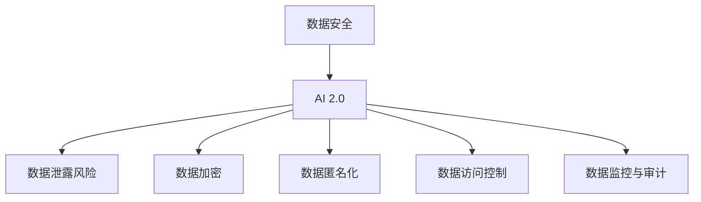

                 

# 《数据安全技术：保障 AI 2.0 数据安全》

## 关键词

- 数据安全
- AI 2.0
- 数据加密
- 数据匿名化
- 数据访问控制
- 数据安全监控与审计
- 数据安全法律与伦理

## 摘要

随着人工智能技术的迅猛发展，AI 2.0时代的到来，数据安全问题日益凸显。本文旨在系统地探讨数据安全技术，以保障 AI 2.0 数据的安全。文章首先介绍了数据安全与 AI 2.0 的关系，随后深入分析了数据安全体系的构建、数据加密技术、数据匿名化技术、数据访问控制技术、数据安全监控与审计技术以及数据安全法律与伦理。通过实际案例和项目实战，本文展示了数据安全技术的具体应用，并对数据安全的发展趋势与未来展望进行了探讨。

---

## 《数据安全技术：保障 AI 2.0 数据安全》目录大纲

### 第一部分：数据安全概述

#### 第1章：数据安全与 AI 2.0 概述
- 核心概念与联系
- 数据安全的重要性
- AI 2.0 的定义与关键技术
- 数据安全与 AI 2.0 的关系

#### 第2章：数据安全体系构建
- 数据安全战略规划
- 数据安全组织建设
- 数据安全风险评估

### 第二部分：数据安全技术

#### 第3章：数据加密技术
- 对称加密与非对称加密
- 常见加密算法介绍
- 数据加密技术的应用

#### 第4章：数据匿名化技术
- 数据匿名化的概念与分类
- 数据匿名化技术
- 数据匿名化技术的应用

#### 第5章：数据访问控制技术
- 数据访问控制的基本原理
- 数据访问控制技术在 AI 2.0 中的应用
- 数据访问控制技术的挑战与应对策略

#### 第6章：数据安全监控与审计技术
- 数据安全监控的概念与目标
- 数据安全监控技术
- 数据安全监控在 AI 2.0 中的应用
- 数据安全审计的概念与实施

### 第三部分：数据安全法律与伦理

#### 第7章：数据安全法律与伦理
- 数据安全法律法规
- 数据安全伦理
- 数据安全法律与伦理在 AI 2.0 中的应用

#### 第8章：数据安全实践案例分析
- 案例背景介绍
- 数据安全挑战与解决方案
- 效果评估

#### 第9章：数据安全发展趋势与展望
- 数据安全发展趋势
- 数据安全未来展望
- 数据安全战略规划与实施

### 附录

- 数据安全技术参考资源
- 数据安全法律法规参考
- 数据安全实战指南

---

### 第一部分：数据安全概述

#### 第1章：数据安全与 AI 2.0 概述

##### 核心概念与联系

**数据安全：** 数据安全是指保护数据免受未经授权的访问、篡改、破坏、泄露等威胁，确保数据的完整性、保密性和可用性。

**AI 2.0：** AI 2.0是指第二代的AI技术，它基于深度学习和大数据，具有自我学习和进化能力，能够在复杂环境中进行决策和预测。

**数据安全与 AI 2.0 的关系：** 数据安全是 AI 2.0 技术的基础保障，AI 2.0 的应用离不开安全的数据环境。数据安全不仅涉及到数据本身的安全，还包括数据处理的各个环节，如数据存储、传输、计算等。

核心概念与联系图：

##### 数据安全的重要性

数据安全在 AI 2.0 时代的重要性体现在以下几个方面：

1. **数据泄露风险：** AI 2.0 技术依赖于大规模的数据集，一旦数据泄露，可能会导致商业机密、个人隐私泄露，对企业和个人造成严重损失。

2. **数据完整性：** 数据安全能够保障数据的完整性，防止数据被篡改或破坏，确保数据真实可靠。

3. **数据保密性：** 数据安全可以确保数据在存储、传输和处理过程中的保密性，防止数据被非法访问。

4. **数据可用性：** 数据安全可以保障数据在需要时能够被及时、准确地访问和使用。

##### AI 2.0 的定义与关键技术

**AI 2.0 的定义：** AI 2.0 是指第二代人工智能技术，它基于深度学习和大数据，具有自我学习和进化能力，能够更好地处理复杂问题。

**AI 2.0 的关键技术：**

1. **深度学习：** 深度学习是一种模拟人脑神经网络进行学习的方法，能够通过大规模数据训练出高度智能的模型。

2. **大数据：** 大数据是指海量、复杂、多样化的数据，AI 2.0 技术需要处理和分析这些数据。

3. **自我学习：** AI 2.0 技术能够从数据中学习，不断优化自身的性能，提高决策和预测的准确性。

4. **进化算法：** 进化算法是一种模拟生物进化过程进行学习的方法，能够自动调整模型的参数，提高模型的适应性和鲁棒性。

##### 数据安全与 AI 2.0 的关系

数据安全与 AI 2.0 的关系可以从以下几个方面来理解：

1. **数据安全是 AI 2.0 的基础：** AI 2.0 技术的运行离不开安全的数据环境，数据安全是确保 AI 2.0 技术正常运行的前提。

2. **数据安全保障 AI 2.0 的应用：** 数据安全能够保障 AI 2.0 技术在各种应用场景中的安全可靠，如金融、医疗、交通等。

3. **数据安全与 AI 2.0 的协同发展：** 数据安全技术的发展可以促进 AI 2.0 的进步，而 AI 2.0 的应用也可以推动数据安全技术的创新。

##### 本章小结

本章介绍了数据安全与 AI 2.0 的关系，分析了数据安全在 AI 2.0 时代的重要性，并探讨了 AI 2.0 的定义与关键技术。通过本章的学习，读者可以了解数据安全与 AI 2.0 之间的紧密联系，为后续章节的数据安全技术学习打下基础。

---

### 第一部分：数据安全概述

#### 第2章：数据安全体系构建

##### 数据安全战略规划

**数据安全战略规划的重要性：**

数据安全战略规划是企业确保数据安全的基础。它不仅指导企业如何保护其数据，还包括确定数据安全的优先级、目标和策略。一个良好的数据安全战略规划能够帮助企业：

1. **识别风险：** 通过全面的风险评估，识别可能影响数据安全的内部和外部威胁。
2. **制定目标：** 根据风险评估结果，制定明确的数据安全目标，如保护客户隐私、防止数据泄露等。
3. **分配资源：** 确保企业有足够的资源来实施数据安全策略，包括人员、技术和资金。
4. **持续改进：** 数据安全是一个不断变化的过程，战略规划需要定期更新以适应新的威胁和挑战。

**数据安全战略规划的步骤：**

1. **风险评估：** 识别和分析潜在的数据安全威胁和漏洞，评估其对数据安全的影响。
2. **制定目标：** 基于风险评估结果，制定具体的、可量化的数据安全目标。
3. **制定策略：** 根据数据安全目标，制定相应的数据安全策略，包括技术、流程和管理措施。
4. **资源分配：** 确定实施数据安全策略所需的人员、技术和资金资源。
5. **执行与监控：** 实施数据安全策略，并建立监控机制，定期评估数据安全状态，确保策略的有效性。
6. **持续改进：** 根据监控结果，不断调整和优化数据安全策略。

**数据安全战略规划的实施方法：**

1. **制定数据安全政策：** 企业应制定明确的、可操作的数据安全政策，确保所有员工了解并遵守。
2. **建立数据安全组织：** 设立专门的数据安全团队，负责数据安全的规划、实施和监控。
3. **培训与意识提升：** 定期对员工进行数据安全培训，提高员工的数据安全意识和技能。
4. **技术投入：** 引入先进的数据安全技术，如数据加密、数据备份、入侵检测等。
5. **合规性检查：** 定期检查企业的数据安全措施是否符合相关法律法规的要求。
6. **持续改进：** 根据最新的安全威胁和技术发展，不断更新和优化数据安全策略。

##### 数据安全组织建设

**数据安全组织架构：**

1. **数据安全委员会：** 负责制定和监督企业的数据安全战略规划，确保数据安全目标的实现。
2. **数据安全经理：** 负责具体的数据安全管理工作，包括风险评估、策略制定和执行。
3. **数据安全工程师：** 负责实施数据安全技术和解决方案，确保数据安全措施的有效性。
4. **数据安全审计师：** 负责定期进行数据安全审计，评估数据安全状态，提出改进建议。
5. **数据安全分析师：** 负责监控数据安全事件，及时发现和应对潜在的安全威胁。

**数据安全岗位职责划分：**

1. **数据安全委员会：** 制定数据安全战略，监督数据安全实施情况。
2. **数据安全经理：** 负责数据安全团队的管理，制定和实施数据安全策略。
3. **数据安全工程师：** 负责实施数据安全技术，如加密、备份和监控。
4. **数据安全审计师：** 定期进行数据安全审计，评估数据安全状态。
5. **数据安全分析师：** 负责监控数据安全事件，进行安全威胁分析。

**数据安全团队协作机制：**

1. **跨部门协作：** 数据安全团队应与企业的其他部门（如IT部门、业务部门等）保持紧密协作，共同应对数据安全挑战。
2. **定期会议：** 定期召开数据安全会议，讨论数据安全策略、措施和进展。
3. **信息共享：** 建立信息共享平台，及时共享数据安全相关的信息和资源。
4. **应急响应：** 建立应急响应机制，快速应对数据安全事件。
5. **培训与支持：** 定期为团队成员提供培训和支持，提高数据安全意识和技能。

##### 数据安全风险评估

**数据安全风险评估方法：**

1. **定性分析：** 通过专家访谈、问卷调查等方法，定性分析数据安全威胁和漏洞。
2. **定量分析：** 通过统计分析方法，定量评估数据安全风险的可能性和影响。
3. **威胁建模：** 构建数据安全威胁模型，分析威胁的来源、攻击路径和潜在影响。
4. **脆弱性分析：** 识别系统中的脆弱性，评估其可能引发的安全事件。

**数据安全风险评估流程：**

1. **识别资产：** 识别企业的重要数据资产，确定其价值和敏感性。
2. **识别威胁：** 识别可能威胁数据安全的外部和内部威胁。
3. **识别脆弱性：** 识别系统中的安全脆弱性，如软件漏洞、配置错误等。
4. **评估风险：** 评估威胁利用脆弱性的可能性和影响，确定数据安全风险。
5. **制定应对策略：** 根据评估结果，制定相应的数据安全策略和措施。
6. **监控与改进：** 监控数据安全状态，根据实际情况不断调整和优化数据安全策略。

**数据安全风险评估工具：**

1. **漏洞扫描工具：** 如 Nessus、OpenVAS 等，用于识别系统中的安全漏洞。
2. **风险评估工具：** 如 Risk Management Studio、QualysRisk 等，用于进行定量风险评估。
3. **威胁情报平台：** 如 threatintel、threatstream 等，用于收集和分析威胁情报。
4. **安全事件管理工具：** 如 SIEM（安全信息与事件管理）、SOC（安全运营中心）等，用于监控和响应安全事件。

##### 本章小结

本章介绍了数据安全体系构建的重要性，包括数据安全战略规划、数据安全组织建设和数据安全风险评估。通过本章的学习，读者可以了解如何系统地构建一个完整的数据安全体系，为保障 AI 2.0 数据安全提供基础。

---

### 第二部分：数据安全技术

#### 第3章：数据加密技术

##### 数据加密的基本原理

数据加密技术是一种将明文数据转换为密文，以防止未授权访问和泄露的技术。其基本原理包括：

1. **加密算法：** 加密算法是一种数学函数，它将明文转换为密文。加密算法通常具有以下特性：
   - **安全性：** 加密算法必须足够复杂，使破解过程在合理时间内不可行。
   - **效率：** 加密算法应能够在合理的时间内处理大量数据。
   - **可扩展性：** 加密算法应能够适应未来的需求，如更高的数据量和更复杂的加密需求。

2. **密钥：** 密钥是加密算法的核心组成部分，用于控制加密和解密过程。密钥分为对称密钥和非对称密钥：
   - **对称密钥：** 对称密钥加密算法使用相同的密钥进行加密和解密。常见的对称加密算法有AES、DES等。
   - **非对称密钥：** 非对称密钥加密算法使用一对密钥，一个用于加密，另一个用于解密。常见的非对称加密算法有RSA、ECC等。

3. **加密过程：** 加密过程包括以下步骤：
   - **生成密钥：** 根据加密算法的要求，生成加密密钥。
   - **加密数据：** 使用加密算法和密钥将明文数据转换为密文。
   - **密文传输：** 将密文传输到目的地，通常通过安全通道进行传输，以防止中间人攻击。

4. **解密过程：** 解密过程包括以下步骤：
   - **接收密文：** 接收密文，通常通过安全通道。
   - **解密数据：** 使用解密算法和密钥将密文转换为明文。
   - **明文使用：** 使用解密后的明文进行后续操作。

##### 常见加密算法介绍

1. **对称加密算法：**

   - **AES（Advanced Encryption Standard）：** AES 是一种常用的对称加密算法，其密钥长度为128、192或256位，支持不同大小的数据块（128位、192位或256位）。
   - **DES（Data Encryption Standard）：** DES 是一种较早的对称加密算法，其密钥长度为56位，数据块大小为64位。由于密钥较短，DES 已被认为不够安全，通常使用其扩展版本3DES。
   - **Blowfish：** Blowfish 是一种对称加密算法，其密钥长度可变，从32位到448位。Blowfish 具有较高的安全性，且实现简单。

2. **非对称加密算法：**

   - **RSA（Rivest-Shamir-Adleman）：** RSA 是一种常用的非对称加密算法，其安全性基于大整数分解问题。RSA 密钥通常由一个大素数和一个较小素数构成，密钥长度为1024位或更高。
   - **ECC（Elliptic Curve Cryptography）：** ECC 是一种基于椭圆曲线理论的非对称加密算法，其安全性相对较低，但实现简单且效率高。ECC 的密钥长度通常较短，即可提供与RSA 相当的安全级别。

3. **哈希加密算法：**

   - **MD5（Message Digest Algorithm 5）：** MD5 是一种常用的哈希加密算法，其输出长度为128位。尽管MD5 被认为存在安全性问题，但在某些场景下仍被使用。
   - **SHA（Secure Hash Algorithm）：** SHA 是一系列安全的哈希加密算法，包括SHA-1、SHA-2 和 SHA-3。SHA-2 包括SHA-224、SHA-256、SHA-384 和 SHA-512 等，具有更高的安全性和输出长度。

##### 数据加密技术在 AI 2.0 中的应用

1. **数据存储加密：** 在 AI 2.0 应用中，数据存储加密是保护数据安全的关键措施。加密技术可以用于保护数据库、文件系统和其他存储介质中的数据，防止未经授权的访问和泄露。

   - **加密数据库：** 使用对称加密算法对数据库中的数据进行加密，确保数据在存储时安全。常见的加密数据库技术包括Oracle Transparent Data Encryption（TDE）和Microsoft SQL Server Transparent Data Encryption（TDE）。
   - **加密文件系统：** 使用对称加密算法对文件系统中的文件和目录进行加密，防止未经授权的访问和泄露。常见的加密文件系统技术包括Linux Encrypted File System（EFS）和Windows BitLocker。

2. **数据传输加密：** 在 AI 2.0 应用中，数据传输加密是保护数据在传输过程中安全的关键措施。加密技术可以用于保护网络通信、文件传输和其他传输介质中的数据，防止中间人攻击和数据泄露。

   - **TLS（Transport Layer Security）：** TLS 是一种常用的加密协议，用于保护 Web 应用程序、电子邮件和其他互联网通信的安全。TLS 可以确保数据在传输过程中加密，防止未经授权的访问和泄露。
   - **VPN（Virtual Private Network）：** VPN 是一种虚拟专用网络技术，通过加密网络通信，确保数据在传输过程中的安全。VPN 可以用于远程访问和跨网络通信，防止未经授权的访问和泄露。

3. **数据处理加密：** 在 AI 2.0 应用中，数据处理加密是保护数据在处理过程中安全的关键措施。加密技术可以用于保护数据处理过程中的数据，防止未经授权的访问和泄露。

   - **加密计算：** 使用对称加密算法对数据处理过程中的数据进行加密，确保数据在处理时安全。加密计算可以用于云计算、分布式计算和其他数据处理场景。
   - **加密存储：** 使用对称加密算法对存储在本地或云端的中间数据进行加密，确保数据在存储时安全。

##### 数据加密技术的挑战与应对策略

1. **加密算法的破解风险：** 加密算法的破解风险是数据加密技术面临的主要挑战之一。为了降低破解风险，可以采取以下措施：

   - **使用强加密算法：** 选择安全性较高的加密算法，如AES、RSA和ECC。
   - **使用长密钥：** 使用较长的密钥长度，以提高破解难度。
   - **定期更换密钥：** 定期更换加密密钥，以降低密钥泄露的风险。

2. **加密技术的性能影响：** 加密技术可能对系统的性能产生影响，特别是在大数据量和高频率的加密操作中。为了降低性能影响，可以采取以下措施：

   - **硬件加速：** 利用硬件加速技术，如GPU和FPGA，提高加密和解密的性能。
   - **并行处理：** 利用多线程和并行处理技术，提高加密和解密的效率。
   - **优化算法：** 对加密算法进行优化，减少计算复杂度，提高性能。

3. **加密技术的应用挑战：** 在实际应用中，加密技术可能面临以下挑战：

   - **密钥管理：** 密钥管理是加密技术的关键，需要确保密钥的安全存储、传输和备份。
   - **兼容性：** 加密技术需要与现有系统兼容，以避免对业务流程和应用程序的影响。
   - **用户隐私：** 在应用加密技术时，需要确保用户隐私不受侵犯，避免过度加密导致隐私泄露。

4. **应对策略：** 针对上述挑战，可以采取以下应对策略：

   - **建立完善的密钥管理体系：** 确保密钥的安全存储、传输和备份，定期进行密钥轮换。
   - **选择合适的加密算法：** 根据应用场景和安全需求，选择合适的加密算法，确保数据的安全性和性能。
   - **平衡安全与便利：** 在保证数据安全的前提下，尽量降低加密技术的复杂性和对用户的影响。

##### 本章小结

本章介绍了数据加密技术的原理和常见加密算法，分析了数据加密技术在 AI 2.0 中的应用，并探讨了数据加密技术面临的挑战和应对策略。通过本章的学习，读者可以了解数据加密技术的重要性，掌握数据加密技术的应用方法，为保障 AI 2.0 数据安全提供技术支持。

---

### 第二部分：数据安全技术

#### 第4章：数据匿名化技术

##### 数据匿名化的概念

数据匿名化是一种数据处理技术，通过去除或模糊化个人身份信息，使得数据在分析、共享和发布时无法识别特定个人。数据匿名化的目的是保护个人隐私，防止个人身份信息被滥用或泄露。

数据匿名化的分类主要包括以下几种：

1. **伪匿名化：** 伪匿名化是一种较低级别的匿名化技术，通过将个人身份信息替换为随机值或虚构值，使得数据在统计分析时无法识别特定个人。常见的伪匿名化方法包括数据替换、数据遮蔽等。

2. **泛匿名化：** 泛匿名化是一种较高级别的匿名化技术，通过删除或合并个人身份信息，使得数据在统计分析时无法识别特定个人，但可能在某些情况下推测出特定个人。常见的泛匿名化方法包括数据泛化、数据集成等。

3. **差分隐私：** 差分隐私是一种基于概率论的匿名化技术，通过在数据中添加随机噪声，使得个人数据无法被识别，同时确保数据分析结果的准确性。差分隐私是近年来发展迅速的匿名化技术，被广泛应用于隐私保护领域。

##### 数据匿名化技术

1. **数据替换：** 数据替换是一种简单的匿名化技术，通过将个人身份信息替换为随机值或虚构值。数据替换方法包括伪名替换、同音字替换等。例如，将姓名替换为随机生成的姓名，将身份证号码替换为随机生成的号码。

2. **数据泛化：** 数据泛化是一种将具体数据转换为较为抽象的数据的方法。通过泛化，可以将具体的数据（如具体的年龄、具体的地址）转换为较为抽象的数据（如年龄范围、地区）。数据泛化可以有效地保护个人隐私，但可能导致数据分析的准确性降低。

3. **数据集成：** 数据集成是一种将多个数据源中的数据合并为一个数据集的方法。通过数据集成，可以减少个人身份信息的重复和暴露。数据集成方法包括数据归并、数据混淆等。

4. **差分隐私：** 差分隐私是一种通过在数据中添加随机噪声来保护个人隐私的方法。差分隐私的核心思想是在保证数据分析结果准确性的同时，最大化地保护个人隐私。常见的差分隐私算法包括Laplace机制、Gaussian机制等。

##### 数据匿名化技术在 AI 2.0 中的应用

1. **数据挖掘：** 数据挖掘是 AI 2.0 技术的重要应用之一，通过分析大量数据，发现潜在的规律和趋势。在数据挖掘过程中，数据匿名化技术可以用于保护个人隐私，防止个人身份信息被泄露。数据匿名化技术可以应用于数据预处理、数据挖掘算法的设计和优化等环节。

2. **数据分享：** 数据分享是促进科学研究和商业发展的重要途径。通过数据分享，研究者可以获取更多的数据，进行更深入的研究。在数据分享过程中，数据匿名化技术可以用于保护个人隐私，确保数据在共享时不会泄露个人身份信息。

3. **隐私保护：** 隐私保护是数据安全的重要方面，通过数据匿名化技术，可以有效地保护个人隐私，防止个人身份信息被滥用或泄露。数据匿名化技术在隐私保护领域具有广泛的应用，如个人健康数据保护、金融数据保护等。

##### 数据匿名化技术的挑战与应对策略

1. **匿名性验证：** 在数据匿名化过程中，需要确保数据匿名化的有效性，即数据在匿名化后无法被重新识别。匿名性验证是数据匿名化技术面临的主要挑战之一。为了应对匿名性验证的挑战，可以采取以下措施：

   - **采用多种匿名化技术：** 结合使用多种匿名化技术，如数据替换、数据泛化、数据集成等，以提高匿名性的有效性。
   - **使用差分隐私：** 差分隐私是一种有效的匿名化技术，可以在保证数据分析结果准确性的同时，最大化地保护个人隐私。

2. **数据质量：** 数据匿名化可能会影响数据的准确性和完整性，导致数据分析结果的偏差。为了应对数据质量下降的挑战，可以采取以下措施：

   - **优化匿名化算法：** 优化匿名化算法，减少匿名化对数据质量的影响。
   - **数据验证：** 在数据匿名化后，对数据进行分析验证，确保数据质量符合要求。

3. **计算性能：** 数据匿名化过程通常需要大量的计算资源，特别是在大数据场景下。为了提高计算性能，可以采取以下措施：

   - **并行处理：** 利用并行处理技术，如多线程、分布式计算等，提高数据匿名化的效率。
   - **硬件加速：** 利用硬件加速技术，如GPU、FPGA等，提高数据匿名化的计算性能。

##### 本章小结

本章介绍了数据匿名化的概念、分类和技术，分析了数据匿名化技术在 AI 2.0 中的应用，并探讨了数据匿名化技术面临的挑战和应对策略。通过本章的学习，读者可以了解数据匿名化技术的基本原理和应用方法，为保障 AI 2.0 数据安全提供技术支持。

---

### 第二部分：数据安全技术

#### 第5章：数据访问控制技术

##### 数据访问控制的基本原理

数据访问控制（Data Access Control，DAC）是一种保护数据安全的技术，通过限制用户对数据的访问权限，防止未经授权的访问和数据泄露。数据访问控制的基本原理包括以下几个方面：

1. **访问控制模型：** 访问控制模型是数据访问控制的基础，它定义了用户、资源、权限之间的关系。常见的访问控制模型包括自主访问控制模型（Discretionary Access Control，DAC）和强制访问控制模型（Mandatory Access Control，MAC）。

   - **自主访问控制模型（DAC）：** DAC 允许数据的所有者自主决定其他用户对数据的访问权限。用户可以根据自己的需要，设置其他用户的访问权限。
   - **强制访问控制模型（MAC）：** MAC 由系统管理员定义访问策略，用户无法改变自己的访问权限。MAC 通常基于安全标签，对用户和资源进行分类，根据分类结果进行访问控制。

2. **访问控制策略：** 访问控制策略是具体的访问控制规则，它定义了用户对资源的访问权限。访问控制策略通常包括以下内容：

   - **用户身份验证：** 确定用户的身份，确保只有授权用户才能访问数据。
   - **权限分配：** 根据用户的身份和角色，分配相应的访问权限，如读取、写入、执行等。
   - **访问控制列表（ACL）：** 访问控制列表是具体的访问控制规则，它定义了用户对资源的访问权限。ACL 可以包含用户、角色和权限等信息。
   - **安全审计：** 记录用户的访问行为，便于审计和追溯。

##### 数据访问控制技术在 AI 2.0 中的应用

1. **数据存储访问控制：** 在 AI 2.0 应用中，数据存储访问控制是保护数据安全的关键措施。数据访问控制技术可以用于保护数据库、文件系统和其他存储介质中的数据，确保只有授权用户可以访问数据。

   - **数据库访问控制：** 通过数据库权限管理，限制用户对数据库的访问权限。例如，使用 SQL 查询权限、存储过程权限等。
   - **文件系统访问控制：** 通过文件权限设置，限制用户对文件的访问权限。例如，使用 Linux 文件权限（读、写、执行）和 Windows 文件属性（只读、隐藏等）。

2. **数据处理访问控制：** 在 AI 2.0 应用中，数据处理访问控制是保护数据处理过程安全的关键措施。数据访问控制技术可以用于控制用户对数据处理任务的访问权限，确保只有授权用户可以执行数据处理任务。

   - **计算任务访问控制：** 通过计算任务权限管理，限制用户对计算任务的访问权限。例如，使用任务队列权限、计算集群权限等。
   - **数据处理工具访问控制：** 通过数据处理工具权限管理，限制用户对数据处理工具的访问权限。例如，使用数据处理框架权限、数据分析工具权限等。

3. **数据传输访问控制：** 在 AI 2.0 应用中，数据传输访问控制是保护数据在传输过程中安全的关键措施。数据访问控制技术可以用于控制用户对数据传输通道的访问权限，确保只有授权用户可以访问数据传输通道。

   - **网络传输访问控制：** 通过网络传输权限管理，限制用户对网络传输通道的访问权限。例如，使用 VPN 权限、SSL/TLS 权限等。
   - **数据传输工具访问控制：** 通过数据传输工具权限管理，限制用户对数据传输工具的访问权限。例如，使用文件传输工具权限、数据同步工具权限等。

##### 数据访问控制技术的挑战与应对策略

1. **权限灵活性：** 数据访问控制技术的权限管理通常较为灵活，但可能导致权限设置复杂、管理困难。为了应对权限灵活性的挑战，可以采取以下措施：

   - **角色与权限分离：** 将用户角色与具体权限分离，通过角色分配权限，简化权限设置和管理。
   - **权限最小化原则：** 实施权限最小化原则，确保用户仅拥有完成任务所需的最低权限。

2. **性能影响：** 数据访问控制技术可能对系统性能产生影响，特别是在大数据量和高频率的访问控制操作中。为了应对性能影响的挑战，可以采取以下措施：

   - **优化访问控制算法：** 优化访问控制算法，减少访问控制操作的复杂度，提高系统性能。
   - **缓存机制：** 采用缓存机制，减少访问控制操作对系统性能的影响。

3. **用户隐私：** 在数据访问控制过程中，需要确保用户隐私不受侵犯，避免过度访问控制导致隐私泄露。为了应对用户隐私的挑战，可以采取以下措施：

   - **隐私保护机制：** 引入隐私保护机制，如差分隐私、数据匿名化等，确保用户隐私得到有效保护。
   - **访问日志审计：** 记录用户的访问行为，便于审计和追溯，确保访问控制措施的执行。

4. **应对策略：** 针对上述挑战，可以采取以下应对策略：

   - **完善访问控制策略：** 根据实际需求，制定完善的访问控制策略，确保权限设置合理、权限管理高效。
   - **定期审计与评估：** 定期对访问控制措施进行审计和评估，发现和解决潜在问题，确保访问控制措施的有效性。
   - **培训与意识提升：** 定期为用户进行数据访问控制培训，提高用户的数据安全意识和技能。

##### 本章小结

本章介绍了数据访问控制的基本原理、技术和应用，分析了数据访问控制技术在 AI 2.0 中的应用，并探讨了数据访问控制技术面临的挑战和应对策略。通过本章的学习，读者可以了解数据访问控制技术的重要性，掌握数据访问控制技术的应用方法，为保障 AI 2.0 数据安全提供技术支持。

---

### 第二部分：数据安全技术

#### 第6章：数据安全监控与审计技术

##### 数据安全监控的概念

数据安全监控（Data Security Monitoring）是指通过技术手段对数据安全状态进行实时监控、检测和分析，以发现潜在的安全威胁和漏洞，并及时采取应对措施，确保数据的安全性和完整性。数据安全监控的目标包括：

1. **实时检测：** 通过实时监控，及时发现数据安全事件，如数据泄露、未经授权的访问等。
2. **威胁预警：** 通过对监控数据的分析，预测潜在的安全威胁，提前采取预防措施。
3. **事件响应：** 在发现安全事件时，快速响应，采取相应的应对措施，减少安全事件的影响。
4. **审计追溯：** 记录数据安全事件的发生过程，便于审计和追溯，确保数据安全事件得到妥善处理。

##### 数据安全监控技术

1. **安全信息与事件管理（SIEM）**

   - **定义：** 安全信息与事件管理（Security Information and Event Management，SIEM）是一种集成系统，用于收集、存储、分析和报告来自不同来源的安全信息和事件。
   - **功能：** SIEM 系统可以收集来自防火墙、入侵检测系统（IDS）、入侵防御系统（IPS）、日志文件等的安全事件数据，并进行实时监控和分析，提供事件关联、趋势分析和报告等功能。
   - **应用场景：** SIEM 系统广泛应用于企业、政府机构、金融机构等，用于监控和响应数据安全事件，提高数据安全防护能力。

2. **入侵检测系统（IDS）**

   - **定义：** 入侵检测系统（Intrusion Detection System，IDS）是一种实时监控系统，用于检测网络中的入侵行为和异常行为。
   - **功能：** IDS 可以通过分析网络流量、系统日志等数据，发现潜在的入侵行为和异常行为，并提供警报和响应功能。
   - **应用场景：** IDS 系统广泛应用于企业、政府机构、金融机构等，用于监控网络安全事件，防止入侵行为和数据泄露。

3. **入侵防御系统（IPS）**

   - **定义：** 入侵防御系统（Intrusion Prevention System，IPS）是一种实时监控系统，用于阻止网络中的入侵行为和异常行为。
   - **功能：** IPS 在 IDS 的基础上，不仅检测入侵行为，还采取主动防御措施，如阻断恶意流量、隔离受感染的系统等。
   - **应用场景：** IPS 系统广泛应用于企业、政府机构、金融机构等，用于实时监控和防御网络入侵行为，提高网络安全防护能力。

##### 数据安全监控在 AI 2.0 中的应用

1. **实时数据处理监控：** 在 AI 2.0 应用中，数据安全监控需要对海量数据进行实时处理和分析，确保数据在处理过程中的安全性和完整性。数据安全监控技术可以用于监控数据流，发现和处理异常数据，防止数据泄露和篡改。

2. **数据处理链路监控：** AI 2.0 应用通常涉及多个数据处理环节，如数据采集、存储、传输、处理和分析等。数据安全监控技术可以用于监控数据处理链路，确保每个环节的数据安全，防止数据泄露和未经授权的访问。

3. **模型训练监控：** 在 AI 2.0 应用中，模型训练是数据安全的关键环节。数据安全监控技术可以用于监控模型训练过程，发现和处理异常训练数据，确保模型训练过程的可靠性和安全性。

4. **模型应用监控：** 在 AI 2.0 应用中，模型应用涉及到实际业务场景，如金融、医疗、交通等。数据安全监控技术可以用于监控模型应用过程，发现和处理异常行为，确保模型应用的安全性和可靠性。

##### 数据安全监控技术的挑战与应对策略

1. **海量数据监控：** 在 AI 2.0 应用中，数据量通常非常大，对数据安全监控技术提出了更高的要求。为了应对海量数据监控的挑战，可以采取以下措施：

   - **分布式监控：** 采用分布式监控架构，将监控任务分布在多个节点上，提高监控系统的性能和可扩展性。
   - **流数据处理：** 采用流数据处理技术，实时处理和分析数据流，提高监控系统的实时性和效率。

2. **实时性要求：** AI 2.0 应用通常对数据安全监控有较高的实时性要求，需要快速检测和响应安全事件。为了应对实时性要求的挑战，可以采取以下措施：

   - **实时监控：** 采用实时监控技术，对数据流进行实时监控，及时发现和处理安全事件。
   - **低延迟算法：** 采用低延迟算法，优化监控算法的效率和性能，降低监控系统的延迟。

3. **隐私保护：** 在数据安全监控过程中，需要确保用户隐私不受侵犯，避免过度监控导致隐私泄露。为了应对隐私保护的挑战，可以采取以下措施：

   - **差分隐私：** 采用差分隐私技术，在保证数据分析结果准确性的同时，最大化地保护用户隐私。
   - **匿名化处理：** 对敏感数据进行匿名化处理，降低隐私泄露的风险。

4. **应对策略：** 针对上述挑战，可以采取以下应对策略：

   - **完善监控策略：** 根据实际需求，制定完善的监控策略，确保监控系统的有效性和可靠性。
   - **定期审计与评估：** 定期对监控系统进行审计和评估，发现和解决潜在问题，确保监控系统的正常运行。
   - **培训与意识提升：** 定期为用户进行数据安全监控培训，提高用户的数据安全意识和技能。

##### 本章小结

本章介绍了数据安全监控的概念、技术和应用，分析了数据安全监控在 AI 2.0 中的应用，并探讨了数据安全监控技术面临的挑战和应对策略。通过本章的学习，读者可以了解数据安全监控的重要性，掌握数据安全监控技术的应用方法，为保障 AI 2.0 数据安全提供技术支持。

---

### 第二部分：数据安全技术

#### 第7章：数据安全法律与伦理

##### 数据安全法律法规

数据安全法律法规是确保数据安全的重要法律基础，它规定了数据收集、存储、处理、传输和销毁等方面的法律要求和责任。以下是一些关键的数据安全法律法规：

1. **《中华人民共和国网络安全法》**：这是我国网络安全的基本法，规定了网络运营者的安全保护义务、网络安全监督管理制度等。

2. **《信息安全技术个人信息保护规范》**：该规范规定了个人信息保护的基本要求，包括个人信息的收集、存储、处理、传输和销毁等方面的具体要求。

3. **《信息安全等级保护管理办法》**：该办法规定了信息安全等级保护的基本要求和实施流程，适用于各行业领域的信息安全建设。

4. **《网络安全审查办法》**：该办法规定了网络安全审查的范围、内容和程序，确保关键信息基础设施的安全性和可控性。

5. **《数据安全法》**：这是我国首部数据安全领域的综合性法律，明确了数据安全保护的基本原则、数据安全保护制度等。

##### 数据安全伦理

数据安全伦理是指数据安全和隐私保护方面的道德原则和规范，它涉及数据处理过程中对个人权利的尊重和保护。以下是一些关键的数据安全伦理原则：

1. **隐私保护原则**：在数据处理过程中，应当尊重和保护个人的隐私权，不得非法收集、使用和泄露个人信息。

2. **数据质量原则**：确保数据的质量和准确性，不得故意提供虚假或错误的数据。

3. **透明度原则**：数据处理者应当对数据处理的目的、范围、方式和影响进行透明化处理，使数据主体能够了解自己的数据如何被使用。

4. **责任原则**：数据处理者应当对其处理的数据承担责任，包括数据安全保护、隐私保护、数据质量保障等。

##### 数据安全法律与伦理在 AI 2.0 中的应用

1. **隐私保护**：在 AI 2.0 应用中，大量个人数据的收集和处理可能导致隐私泄露。数据安全法律和伦理要求在数据收集和处理过程中严格遵守隐私保护原则，确保数据主体的隐私权不受侵犯。

2. **数据透明度**：AI 2.0 应用通常涉及到复杂的算法和模型，数据透明度原则要求数据处理者对数据处理的流程和影响进行透明化处理，使数据主体能够了解其数据如何被使用。

3. **责任追究**：AI 2.0 应用中，数据处理者需要对数据处理过程中的安全事件承担责任。数据安全法律和伦理要求建立明确的责任追究机制，确保在发生安全事件时能够及时追究责任。

4. **合规性审查**：数据安全法律和伦理要求对 AI 2.0 应用的数据安全和隐私保护进行合规性审查，确保其符合相关法律法规和伦理要求。

##### 本章小结

本章介绍了数据安全法律法规和数据安全伦理的基本概念，分析了数据安全法律和伦理在 AI 2.0 中的应用，强调了遵守数据安全法律和伦理的重要性。通过本章的学习，读者可以了解数据安全法律和伦理的基本原则，掌握在 AI 2.0 应用中如何遵守数据安全法律和伦理要求，为保障 AI 2.0 数据安全提供法律和伦理指导。

---

### 第二部分：数据安全技术

#### 第8章：数据安全实践案例分析

##### 案例背景介绍

随着大数据和人工智能技术的迅猛发展，数据安全问题越来越受到关注。本案例选取了一家全球领先的互联网公司，该公司在业务发展过程中，面临着大量数据的安全存储、传输和处理的问题。为保障数据安全，该公司开展了一系列数据安全实践，包括数据加密、数据匿名化、数据访问控制等。

##### 数据安全挑战与解决方案

1. **数据泄露风险**：该公司在处理客户数据时，发现存在数据泄露的风险。为防止数据泄露，公司采取了以下解决方案：

   - **数据加密**：采用AES加密算法对敏感数据（如客户姓名、身份证号码、银行账号等）进行加密存储，确保数据在存储时安全。
   - **数据匿名化**：对非敏感数据（如用户行为数据、浏览记录等）进行数据匿名化处理，去除个人身份信息，降低数据泄露风险。
   - **数据访问控制**：实施严格的访问控制策略，确保只有授权用户可以访问敏感数据，防止未经授权的访问。

2. **数据完整性保障**：在数据处理过程中，数据完整性受到威胁。为保障数据完整性，公司采取了以下解决方案：

   - **数据备份与恢复**：定期进行数据备份，确保数据在发生意外时可以快速恢复。
   - **数据完整性校验**：对数据传输和存储过程中的数据进行完整性校验，确保数据的准确性和可靠性。
   - **数据完整性监控**：采用入侵检测系统（IDS）和入侵防御系统（IPS）等监控技术，实时监控数据完整性，发现和处理潜在的安全威胁。

3. **数据安全审计**：公司需要定期进行数据安全审计，评估数据安全措施的有效性。为提高数据安全审计的效率，公司采取了以下解决方案：

   - **自动化审计工具**：引入自动化审计工具，如SIEM系统，实现对数据安全的自动化监控和审计。
   - **审计日志记录**：详细记录数据安全的审计过程，包括审计时间、审计人员、审计内容等，便于审计追溯和责任追究。
   - **审计报告生成**：定期生成数据安全审计报告，总结审计结果，提出改进建议，推动数据安全措施的不断完善。

##### 效果评估

1. **数据泄露风险降低**：通过实施数据加密、数据匿名化和数据访问控制等安全措施，该公司成功降低了数据泄露风险。据审计数据显示，自实施这些措施以来，公司数据泄露事件明显减少，数据安全防护能力得到显著提升。

2. **数据完整性保障**：通过数据备份与恢复、数据完整性校验和数据完整性监控等措施，公司有效保障了数据的完整性。数据完整性监控数据显示，自实施这些措施以来，公司未发生数据篡改或损坏事件。

3. **数据安全审计效率提高**：通过引入自动化审计工具和详细的审计日志记录，公司数据安全审计效率显著提高。审计报告显示，公司数据安全措施的有效性和合规性得到充分保障，审计发现的潜在问题得到及时解决。

##### 本章小结

本章通过一个实际案例，展示了数据安全实践在应对数据泄露风险、保障数据完整性和提高数据安全审计效率方面的作用。通过本章的学习，读者可以了解数据安全实践的具体方法和效果，为在实际工作中实施数据安全技术提供参考。

---

### 第三部分：数据安全发展趋势与展望

#### 第9章：数据安全发展趋势与展望

##### 数据安全发展趋势

1. **数据安全技术的不断创新**：随着人工智能、云计算、物联网等技术的发展，数据安全技术也在不断创新。例如，基于区块链的数据安全方案、基于机器学习的数据安全检测系统等。

2. **数据安全合规性要求的提高**：随着全球范围内数据安全法律法规的完善，企业对数据安全的合规性要求越来越高。例如，GDPR、CCPA 等法规对数据安全合规性提出了严格要求。

3. **数据安全意识的普及**：随着数据安全事件的频繁发生，企业对数据安全的重视程度逐渐提高。数据安全意识的普及，有助于提高员工的安全意识和技能，减少数据安全风险。

4. **数据安全解决方案的集成化**：未来的数据安全解决方案将更加集成化，不仅包括传统的数据加密、访问控制等技术，还将涵盖数据备份、恢复、监控、审计等多种功能。

##### 数据安全未来展望

1. **人工智能在数据安全中的应用**：随着人工智能技术的发展，人工智能将在数据安全领域发挥更大的作用。例如，利用人工智能进行威胁检测、安全事件响应等。

2. **区块链技术在数据安全中的应用**：区块链技术具有去中心化、不可篡改等特性，将在数据安全领域得到广泛应用。例如，利用区块链技术进行数据存储、传输和审计等。

3. **数据安全技术的自主化**：未来的数据安全技术将更加自主化，能够自动识别和应对数据安全威胁。例如，利用自适应加密技术、自适应访问控制技术等。

4. **数据安全人才培养的重要性**：随着数据安全技术的发展，对数据安全专业人才的需求越来越大。培养具备数据安全专业知识的人才，对保障数据安全具有重要意义。

##### 数据安全战略规划与实施

1. **制定明确的数据安全战略**：企业应制定明确的数据安全战略，包括数据安全目标、策略、措施等。战略规划应结合企业业务特点和数据安全需求，确保数据安全战略的有效性。

2. **建立完善的数据安全组织**：企业应建立专门的数据安全组织，负责数据安全的管理和实施。数据安全组织应包括数据安全委员会、数据安全经理、数据安全工程师等角色。

3. **投入充足的资源**：企业应投入充足的资源，包括人力、资金、技术等，以确保数据安全战略的有效实施。资源投入应与企业的数据安全需求和发展规划相匹配。

4. **定期评估和改进**：企业应定期评估数据安全措施的有效性，并根据评估结果进行改进。评估和改进应包括数据安全策略、技术、流程等方面，确保数据安全战略的持续有效性。

##### 本章小结

本章分析了数据安全技术的发展趋势和未来展望，强调了数据安全战略规划与实施的重要性。通过本章的学习，读者可以了解数据安全技术的发展方向，为企业在数据安全领域的战略规划和实施提供参考。

---

### 附录

#### 附录A：数据安全技术参考资源

1. **数据加密技术参考资料**：
   - 《密码学：理论和实践》（Book: "Cryptography: Theory and Practice" by Douglas R. Stinson）
   - 《信息安全技术》：数据加密标准（Book: "Information Security Technology" by National Information Security Standardization Technical Committee）

2. **数据匿名化工具与资源**：
   - 《数据匿名化工具对比》（Online Resource: "Comparative Analysis of Data Anonymization Tools"）
   - 《差分隐私工具与库》：包括开源库如Pinocchio和Paillier Cryptography Library

3. **数据安全监控与审计工具推荐**：
   - 《安全信息与事件管理工具比较》（Online Resource: "Comparison of SIEM Tools"）
   - 《入侵检测系统与入侵防御系统工具推荐》（Online Resource: "IDS/IPS Tool Recommendations"）

#### 附录B：数据安全法律法规参考

1. **国内数据安全法律法规汇总**：
   - 《中华人民共和国网络安全法》
   - 《信息安全技术个人信息保护规范》
   - 《信息安全等级保护管理办法》

2. **国际数据安全法律法规对比**：
   - 《通用数据保护条例》（GDPR）
   - 《加利福尼亚消费者隐私法案》（CCPA）

3. **数据安全法律法规案例分析**：
   - 《国内外数据安全法规案例分析报告》

#### 附录C：数据安全实战指南

1. **数据安全体系建设指南**：
   - 《数据安全体系建设实战手册》
   - 《企业数据安全战略规划指南》

2. **数据安全风险评估方法与实践**：
   - 《数据安全风险评估工具与技巧》
   - 《数据安全风险评估案例分析》

3. **数据安全监控与审计实操手册**：
   - 《安全监控与审计实战指南》
   - 《实时数据安全监控与审计技术》

---

### 作者信息

**作者：** AI天才研究院/AI Genius Institute & 禅与计算机程序设计艺术 /Zen And The Art of Computer Programming

---

本文通过系统的分析和详细的讲解，全面探讨了数据安全技术，为保障 AI 2.0 数据安全提供了理论支持和实践指导。随着技术的不断发展，数据安全领域将迎来更多创新和挑战，希望读者能够不断学习和探索，为数据安全技术的发展贡献力量。

---

以上为《数据安全技术：保障 AI 2.0 数据安全》的完整文章，希望对读者有所启发和帮助。

