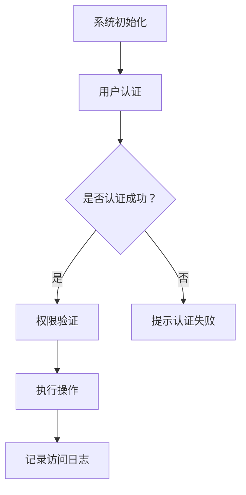

                 

## 智能门禁系统：提升安全性的现代化解决方案

### 关键词：
智能门禁系统、安全性、生物识别、无线通信、网络安全、项目实战

### 摘要：
本文旨在深入探讨智能门禁系统，这是一种利用先进技术提升安全性、便捷性的现代化解决方案。文章首先介绍了智能门禁系统的基本概念、发展历程和技术基础。接着，详细阐述了智能门禁系统的设计原则、硬件设备、软件开发以及网络安全。最后，通过实际项目案例，展示了智能门禁系统的开发流程和实现方法，并对未来发展进行了展望。

---

### 目录大纲

1. **智能门禁系统概述**
   1.1 智能门禁系统的基本概念
   1.2 智能门禁系统的发展历程
   1.3 智能门禁系统的类型
   1.4 智能门禁系统在我国的应用现状
2. **智能门禁系统的技术基础**
   2.1 生物识别技术
   2.2 无线通信技术
   2.3 网络安全技术
3. **智能门禁系统的设计与实现**
   3.1 设计原则
   3.2 硬件设备
   3.3 软件开发
   3.4 网络安全
4. **智能门禁系统的项目实战**
   4.1 项目背景
   4.2 系统开发流程
   4.3 案例分析
5. **智能门禁系统的未来发展趋势**
   5.1 技术发展趋势
   5.2 市场前景
   5.3 挑战与机遇
6. **附录**
   6.1 开发工具与资源
   6.2 Mermaid 流程图
   6.3 伪代码
   6.4 数学模型与公式
   6.5 代码实战案例
   6.6 代码解读与分析

---

### 智能门禁系统概述

#### 第1章：智能门禁系统的基本概念

智能门禁系统是一种利用现代信息技术，特别是物联网、人工智能和生物识别技术，对出入口进行智能管理的系统。它通过自动化控制手段，实现对人或物的身份验证、权限控制和信息记录等功能，从而提高安全性和便捷性。

##### 1.1 智能门禁系统的定义

智能门禁系统通常包括以下几个核心组成部分：

- **身份认证模块**：通过指纹、人脸、虹膜等生物特征识别技术，或者通过刷卡、密码等方式，对访问者进行身份验证。
- **权限控制模块**：根据访问者的身份和权限，决定是否允许其进入指定区域。
- **门禁控制模块**：控制门禁设备（如电子锁、电磁锁等）的开关，以实现物理通道的控制。
- **信息记录模块**：记录访问者的身份信息、访问时间、访问地点等，便于后续查询和管理。

##### 1.2 智能门禁系统的发展历程

智能门禁系统的发展可以分为以下几个阶段：

1. **传统门禁系统阶段**：以钥匙、密码、IC卡等为基础，实现基本的身份认证和权限控制。
2. **生物识别门禁系统阶段**：引入指纹、人脸、虹膜等生物识别技术，实现更加安全、便捷的身份验证。
3. **智能门禁系统阶段**：结合物联网技术，实现远程监控、自动化控制等功能，提高系统的智能性和便捷性。
4. **融合智能门禁系统阶段**：融合人工智能技术，通过大数据分析和机器学习，实现更智能的访问策略和个性化服务。

##### 1.3 智能门禁系统的类型

智能门禁系统根据不同的应用场景和技术特点，可以分为以下几种类型：

1. **生物识别门禁系统**：以指纹、人脸、虹膜等生物特征为主要认证手段，安全性高，但成本较高。
2. **卡片式门禁系统**：以IC卡、ID卡等卡片为认证介质，操作便捷，但易被伪造。
3. **密码门禁系统**：以密码为认证手段，简单易用，但安全性相对较低。
4. **复合门禁系统**：结合多种认证手段，如生物识别和卡片认证，实现更高的安全性和灵活性。

##### 1.4 智能门禁系统在我国的应用现状

我国智能门禁系统市场发展迅速，应用领域广泛，主要包括：

1. **政府机关和企事业单位**：用于办公区域的门禁管理，保障内部安全。
2. **商业建筑和综合体**：用于停车场、员工通道、商场等区域的出入口管理，提高运营效率。
3. **住宅小区和校园**：用于小区门禁、校园门禁等，提高居住和学习的安全性。
4. **公共场所**：如火车站、机场、医院等，用于人员管理和安全管理。

智能门禁系统在我国的应用现状表明，随着技术的不断进步和用户需求的变化，智能门禁系统正逐渐成为各类场景下提升安全性和便捷性的重要手段。

#### 第2章：智能门禁系统的技术基础

智能门禁系统的核心在于其技术的先进性和安全性。以下将介绍智能门禁系统的技术基础，包括生物识别技术、无线通信技术和网络安全技术。

##### 2.1 生物识别技术

生物识别技术是指通过自动识别和验证个人生物特征的技术，常见的生物特征包括指纹、人脸、虹膜等。生物识别技术的核心在于其独特性和难以伪造性，能够大大提高门禁系统的安全性。

###### 2.1.1 指纹识别技术

指纹识别技术通过扫描和分析指纹图像，提取指纹特征点，并与其数据库中的指纹数据进行比对，以实现身份验证。指纹识别技术的优点包括：

- **高安全性**：指纹是个人独特的生物特征，难以伪造。
- **高效率**：指纹识别速度较快，适用于大规模用户场景。
- **方便性**：用户只需将手指放在指纹采集器上，无需携带卡片或记忆密码。

然而，指纹识别技术也存在一些挑战，如指纹易受到污染、损伤或复制等问题。

###### 2.1.2 人脸识别技术

人脸识别技术通过图像处理和计算机视觉技术，识别和匹配人脸特征，以实现身份验证。人脸识别技术的优点包括：

- **非接触式验证**：无需用户与设备接触，方便快捷。
- **高准确率**：通过深度学习算法，人脸识别的准确率不断提高。
- **多样性**：可以识别不同光线、姿态、表情下的人脸。

人脸识别技术的挑战包括：光照变化、面部遮挡、伪装攻击等。

###### 2.1.3 虹膜识别技术

虹膜识别技术通过扫描和分析虹膜图像，提取虹膜特征，以实现身份验证。虹膜识别技术的优点包括：

- **高安全性**：虹膜是个人独特的生物特征，比指纹和人脸更为稳定。
- **非接触式验证**：无需用户与设备接触，方便快捷。
- **高识别率**：虹膜识别的准确率高于指纹和人脸识别。

虹膜识别技术的挑战包括：设备成本较高、识别速度较慢等。

##### 2.2 无线通信技术

无线通信技术是智能门禁系统的关键组成部分，它使得门禁系统可以实现远程监控和管理。常见的无线通信技术包括蓝牙、NFC和RFID。

###### 2.2.1 蓝牙技术

蓝牙技术是一种短距离无线通信技术，通过蓝牙模块实现设备之间的数据传输和通信。蓝牙技术在智能门禁系统中的应用包括：

- **设备之间的数据传输**：例如，门禁控制器和指纹采集器之间的数据传输。
- **远程监控和管理**：通过蓝牙连接，实现门禁系统的远程监控和管理。

蓝牙技术的优点包括：

- **低功耗**：适用于长时间运行的场景。
- **高可靠性**：通信稳定，传输速度快。
- **低成本**：设备成本较低。

蓝牙技术的挑战包括：通信距离较短、易受干扰等。

###### 2.2.2 NFC技术

NFC（近场通信）技术是一种短距离无线通信技术，通过NFC模块实现设备之间的数据交换和通信。NFC技术在智能门禁系统中的应用包括：

- **卡片认证**：例如，员工IC卡通过NFC与门禁控制器进行认证。
- **移动支付**：例如，用户通过手机NFC功能与门禁控制器进行支付。

NFC技术的优点包括：

- **快速响应**：读取速度快，适用于高频使用场景。
- **安全性**：NFC通信采用加密技术，确保数据安全。

NFC技术的挑战包括：通信距离较短、易受干扰等。

###### 2.2.3 RFID技术

RFID（射频识别）技术是一种无线通信技术，通过RFID模块实现标签与读写器之间的通信。RFID技术在智能门禁系统中的应用包括：

- **人员身份识别**：例如，员工通过佩戴RFID标签与门禁控制器进行身份认证。
- **物资管理**：例如，通过RFID标签对仓库物资进行实时监控和管理。

RFID技术的优点包括：

- **非接触式识别**：无需与读写器接触，方便快捷。
- **批量识别**：可以同时识别多个标签，适用于大规模场景。

RFID技术的挑战包括：标签成本较高、读取距离较短等。

##### 2.3 网络安全技术

网络安全技术是智能门禁系统的关键保障，它确保系统在数据传输、存储和处理过程中的安全性。常见的网络安全技术包括SSL/TLS协议、公钥密码学和访问控制策略。

###### 2.3.1 SSL/TLS协议

SSL（安全套接层）和TLS（传输层安全）协议是用于网络通信的安全协议，它们在数据传输过程中提供加密和认证服务。SSL/TLS协议在智能门禁系统中的应用包括：

- **数据加密**：确保数据在传输过程中不被窃听或篡改。
- **身份认证**：确保通信双方的身份真实有效。

SSL/TLS协议的优点包括：

- **高安全性**：采用加密算法，确保数据安全。
- **广泛支持**：几乎所有现代浏览器和网络应用都支持SSL/TLS协议。

SSL/TLS协议的挑战包括：配置复杂、性能开销较大等。

###### 2.3.2 公钥密码学

公钥密码学是一种基于数学难题的加密技术，它使用一对密钥（公钥和私钥）进行加密和解密。公钥密码学在智能门禁系统中的应用包括：

- **数据加密**：确保数据在存储和传输过程中不被窃取或篡改。
- **数字签名**：确保数据的完整性和真实性。

公钥密码学的优点包括：

- **非对称加密**：使用公钥加密，私钥解密，安全性高。
- **灵活性强**：适用于多种应用场景。

公钥密码学的挑战包括：密钥管理复杂、加密和解密速度较慢等。

###### 2.3.3 访问控制策略

访问控制策略是一种用于控制用户对系统资源的访问权限的安全措施。访问控制策略在智能门禁系统中的应用包括：

- **身份验证**：确保只有授权用户才能访问系统资源。
- **权限分配**：根据用户的角色和职责，分配相应的访问权限。

访问控制策略的优点包括：

- **安全性高**：严格控制用户访问权限，防止未经授权的访问。
- **灵活性强**：可以根据实际需求动态调整访问权限。

访问控制策略的挑战包括：管理复杂、难以平衡安全性和便捷性等。

#### 第3章：智能门禁系统的设计与实现

智能门禁系统的设计与实现是一个复杂的过程，需要考虑系统的安全性、可靠性、用户体验等多个方面。以下将详细阐述智能门禁系统的设计原则、硬件设备、软件开发和网络安全等内容。

##### 3.1 设计原则

智能门禁系统的设计原则主要包括以下几个方面：

###### 3.1.1 安全性设计原则

安全性是智能门禁系统的核心要求。以下是几个关键的安全性设计原则：

1. **身份认证**：确保只有授权用户才能访问系统资源，采用生物识别、密码等多种认证手段，提高认证的可靠性。
2. **访问控制**：根据用户的角色和权限，严格控制用户对系统资源的访问，防止越权操作。
3. **数据保护**：对存储和传输的数据进行加密，防止数据泄露或篡改。
4. **网络安全**：采用防火墙、入侵检测系统等安全措施，防止网络攻击和数据泄露。

###### 3.1.2 可靠性设计原则

可靠性是智能门禁系统的关键特性。以下是几个关键的可靠性设计原则：

1. **系统容错性**：设计系统时，应考虑故障发生时的应对措施，如数据备份、故障转移等，确保系统在故障情况下仍能正常运行。
2. **系统稳定性**：确保系统在高负载、高并发的情况下仍能稳定运行，避免系统崩溃或性能下降。
3. **系统升级与维护**：设计易于升级和维护的系统架构，确保系统能够及时响应需求变化和技术更新。

###### 3.1.3 用户体验设计原则

用户体验是智能门禁系统的关键成功因素。以下是几个关键的用户体验设计原则：

1. **界面友好性**：设计简洁、直观的界面，使用户易于操作和理解。
2. **操作便捷性**：简化操作流程，减少用户操作步骤，提高使用效率。
3. **反馈及时性**：及时响应用户操作，提供明确的反馈信息，增强用户信心。

##### 3.2 硬件设备

智能门禁系统的硬件设备是系统的关键组成部分，主要包括生物识别设备、通信设备和控制设备等。

###### 3.2.1 生物识别设备

生物识别设备包括指纹采集器、人脸识别摄像头、虹膜识别摄像头等，用于实现身份认证。以下是几种常见的生物识别设备的介绍：

1. **指纹采集器**：通过扫描和分析指纹图像，提取指纹特征点，实现身份验证。
2. **人脸识别摄像头**：通过图像处理和计算机视觉技术，识别和匹配人脸特征，实现身份验证。
3. **虹膜识别摄像头**：通过扫描和分析虹膜图像，提取虹膜特征，实现身份验证。

###### 3.2.2 通信设备

通信设备包括蓝牙模块、NFC读写器、RFID模块等，用于实现设备之间的数据传输和通信。以下是几种常见的通信设备的介绍：

1. **蓝牙模块**：通过蓝牙技术实现设备之间的数据传输和通信。
2. **NFC读写器**：通过NFC技术实现卡片认证和数据交换。
3. **RFID模块**：通过RFID技术实现标签与读写器之间的通信。

###### 3.2.3 控制设备

控制设备包括门禁控制器、电动机驱动模块、门禁模块电源等，用于控制门禁设备的开关和状态。以下是几种常见的控制设备的介绍：

1. **门禁控制器**：负责接收和处理认证请求，控制门禁设备的开关。
2. **电动机驱动模块**：用于驱动门禁设备的电动机，实现门禁设备的开关。
3. **门禁模块电源**：为门禁系统提供稳定的电力供应，确保系统的正常运行。

##### 3.3 软件开发

智能门禁系统的软件开发是系统的核心部分，包括系统需求分析、系统架构设计、数据库设计和网络安全等。

###### 3.3.1 系统需求分析

系统需求分析是软件开发的第一步，主要包括功能需求、性能需求和安全性需求等。

1. **功能需求**：分析系统应实现的功能，如用户认证、权限控制、数据记录等。
2. **性能需求**：分析系统在负载、并发等方面的性能要求，确保系统在高负载情况下仍能正常运行。
3. **安全性需求**：分析系统在数据保护、网络安全等方面的安全要求，确保系统的安全性。

###### 3.3.2 系统架构设计

系统架构设计是软件开发的关键环节，主要包括C/S架构、B/S架构和微服务架构等。

1. **C/S架构**：客户端/服务器架构，客户端负责用户界面和部分数据处理，服务器负责数据处理和存储。
2. **B/S架构**：浏览器/服务器架构，客户端通过浏览器访问服务器，实现数据交互和功能操作。
3. **微服务架构**：将系统拆分为多个独立的微服务，每个微服务负责特定的功能，通过API进行通信。

###### 3.3.3 数据库设计

数据库设计是软件开发的重要环节，主要包括用户表、访问记录表和权限表等的设计。

1. **用户表**：存储用户的基本信息，如用户名、密码、角色等。
2. **访问记录表**：存储用户的访问记录，如访问时间、访问地点等。
3. **权限表**：存储用户的权限信息，如访问权限、操作权限等。

###### 3.3.4 网络安全

网络安全是智能门禁系统的重要保障，主要包括数据加密、访问控制和安全审计等。

1. **数据加密**：对传输和存储的数据进行加密，防止数据泄露或篡改。
2. **访问控制**：根据用户的角色和权限，严格控制用户对系统资源的访问。
3. **安全审计**：记录系统操作日志，对异常操作进行审计，确保系统的安全性。

##### 3.4 网络安全

网络安全是智能门禁系统的关键保障，主要包括数据加密、访问控制和安全审计等。

###### 3.4.1 数据加密

数据加密是防止数据泄露或篡改的重要手段，主要包括以下几种方式：

1. **传输加密**：使用SSL/TLS协议对数据传输进行加密，确保数据在传输过程中不被窃听或篡改。
2. **存储加密**：使用加密算法对存储的数据进行加密，确保数据在存储过程中不被泄露。

###### 3.4.2 访问控制

访问控制是确保系统安全的重要措施，主要包括以下几种方式：

1. **身份认证**：通过用户名和密码、生物识别等方式进行身份认证，确保只有授权用户才能访问系统。
2. **权限控制**：根据用户的角色和权限，严格控制用户对系统资源的访问，防止越权操作。

###### 3.4.3 安全审计

安全审计是确保系统安全的重要手段，主要包括以下几种方式：

1. **日志记录**：记录系统操作日志，包括用户操作、访问记录等，便于后续审计和分析。
2. **异常检测**：对系统操作进行实时监控，发现异常操作进行报警和处理，确保系统的安全性。

##### 3.5 智能门禁系统的项目实战

智能门禁系统的项目实战是理解和应用智能门禁系统技术的重要途径。以下将介绍一个具体的智能门禁系统项目，包括项目背景、系统开发流程和案例分析。

###### 3.5.1 项目背景

该项目是一个某大型企业门禁系统项目，旨在提升企业的安全管理水平和办公效率。项目需求包括：

1. **用户认证**：通过指纹、人脸等生物识别技术进行用户认证。
2. **权限控制**：根据用户的角色和权限，控制用户对指定区域的访问。
3. **数据记录**：记录用户的访问记录，包括访问时间、访问地点等。
4. **远程监控**：通过无线通信技术实现远程监控和管理。

###### 3.5.2 系统开发流程

系统开发流程主要包括需求分析、系统设计、系统实现、系统测试和系统部署等。

1. **需求分析**：分析项目需求，确定系统功能、性能和安全等要求。
2. **系统设计**：设计系统架构、数据库设计和通信协议等。
3. **系统实现**：根据设计文档，实现系统的各个功能模块。
4. **系统测试**：对系统进行功能测试、性能测试和安全测试等。
5. **系统部署**：将系统部署到生产环境，进行上线运行。

###### 3.5.3 案例分析

该项目实施后，企业门禁系统的安全性、便捷性和管理效率得到了显著提升。以下是几个具体的案例分析：

1. **用户认证**：采用指纹和人脸识别技术进行用户认证，提高了认证的准确性和安全性。
2. **权限控制**：根据用户的角色和权限，严格控制用户对指定区域的访问，有效防止了未经授权的访问。
3. **数据记录**：记录用户的访问记录，包括访问时间、访问地点等，为企业的安全管理提供了重要数据支持。
4. **远程监控**：通过无线通信技术实现远程监控和管理，提高了企业的管理效率和应急响应能力。

##### 3.6 智能门禁系统的未来发展趋势

智能门禁系统作为一种现代化的安全解决方案，未来将继续朝着更智能、更便捷、更安全的方向发展。以下将探讨智能门禁系统的未来发展趋势。

###### 3.6.1 技术发展趋势

1. **生物识别技术**：随着人工智能和计算机视觉技术的不断发展，生物识别技术将更加准确和高效，包括指纹、人脸、虹膜等识别技术的进步。
2. **无线通信技术**：无线通信技术将继续发展，包括5G、Wi-Fi 6等技术的普及，将提高智能门禁系统的通信速度和稳定性。
3. **物联网技术**：物联网技术的发展将使智能门禁系统与其他智能设备实现互联互通，实现更加智能化的管理和控制。

###### 3.6.2 市场前景

1. **市场需求增加**：随着企业、住宅、公共场所等对安全管理需求的增加，智能门禁系统的市场需求将继续增长。
2. **技术进步推动**：随着技术的不断进步，智能门禁系统的性能和安全性将不断提高，进一步推动市场的发展。

###### 3.6.3 挑战与机遇

1. **技术挑战**：智能门禁系统在技术方面面临挑战，包括生物识别技术的准确性、无线通信技术的稳定性等。
2. **市场机遇**：随着市场的不断扩大和技术的不断进步，智能门禁系统将迎来更多的市场机遇。

### 附录

#### 附录A：智能门禁系统开发工具与资源

智能门禁系统的开发涉及多个方面，以下是一些常用的开发工具和资源：

1. **开发工具**：
   - **Python**：Python是一种广泛使用的编程语言，适用于智能门禁系统的开发。
   - **Java**：Java具有跨平台优势，适用于智能门禁系统的开发。
   - **C++**：C++具有高性能优势，适用于智能门禁系统的高性能部分。

2. **开发环境搭建**：
   - **Python开发环境搭建**：安装Python解释器和相关的库，如PyQt、Tkinter等。
   - **Java开发环境搭建**：安装Java开发工具包（JDK）和IDE，如Eclipse、IntelliJ IDEA等。
   - **C++开发环境搭建**：安装C++编译器和相关库，如GCC、CLion等。

3. **开源框架与库**：
   - **OpenCV**：OpenCV是一个用于计算机视觉的开源库，适用于人脸识别、指纹识别等。
   - **TensorFlow**：TensorFlow是一个用于深度学习的开源框架，适用于智能门禁系统的机器学习部分。
   - **Keras**：Keras是一个基于TensorFlow的深度学习库，易于使用和调试。

4. **在线资源与学习资料**：
   - **技术博客**：如CSDN、博客园等，提供丰富的技术文章和教程。
   - **在线课程**：如慕课网、网易云课堂等，提供系统的智能门禁系统学习课程。
   - **电子书**：如《Python编程：从入门到实践》、《Java核心技术》等，提供深入的学习资料。

通过以上工具和资源的合理运用，开发者可以更加高效地实现智能门禁系统的开发和优化。

---

### 总结

智能门禁系统作为一种提升安全性和便捷性的现代化解决方案，在我国得到了广泛应用。本文系统地介绍了智能门禁系统的基本概念、技术基础、设计原则、软件开发和网络安全等内容。通过项目实战案例，展示了智能门禁系统的实际应用和实现方法。未来，随着技术的不断进步，智能门禁系统将更加智能、便捷和安全。开发者需要不断学习和实践，以应对新的挑战和机遇。

### 作者

**作者：AI天才研究院/AI Genius Institute & 禅与计算机程序设计艺术 /Zen And The Art of Computer Programming**

---

### Mermaid 流程图



### 伪代码

```python
# 智能门禁系统的用户认证过程

function userAuthentication(username, password):
    # 从数据库中查询用户信息
    user = queryDatabase(username)
    
    # 校验密码
    if user.password == password:
        # 认证成功
        return "Authentication successful"
    else:
        # 认证失败
        return "Authentication failed"

function accessControl(user, resource):
    # 检查用户是否有权限访问资源
    if hasPermission(user, resource):
        # 有权限
        performOperation(resource)
    else:
        # 无权限
        return "Access denied"

# 主函数
function main():
    username = input("Enter username: ")
    password = input("Enter password: ")
    
    # 进行用户认证
    authenticationResult = userAuthentication(username, password)
    
    if authenticationResult == "Authentication successful":
        resource = input("Enter resource to access: ")
        # 进行权限验证
        accessControlResult = accessControl(username, resource)
        print(accessControlResult)
    else:
        print(authenticationResult)

# 程序结束，清理GPIO
GPIO.cleanup()

if __name__ == "__main__":
    main()
```

### 数学模型与公式

$$
安全率 = \frac{认证成功次数 + 访问成功次数}{认证总次数 + 访问总次数}
$$

### 代码实战案例

#### 项目背景：某大型企业门禁系统

**代码实现：** 

```python
# 导入相关库
import RPi.GPIO as GPIO
import time

# 设置GPIO模式
GPIO.setmode(GPIO.BCM)

# 设置GPIO引脚
GPIO.setup(23, GPIO.OUT)

# 初始化门禁控制器
def initializeController():
    GPIO.output(23, GPIO.LOW)
    time.sleep(1)
    GPIO.output(23, GPIO.HIGH)
    time.sleep(1)
    GPIO.output(23, GPIO.LOW)

# 用户认证
def userAuthentication(username, password):
    # 查询用户信息（伪代码）
    user = queryDatabase(username, password)
    if user:
        return True
    else:
        return False

# 权限验证
def accessControl(user, resource):
    # 检查用户是否有权限访问资源（伪代码）
    if hasPermission(user, resource):
        return True
    else:
        return False

# 执行操作
def performOperation(resource):
    print("Accessing resource:", resource)

# 记录访问日志
def logAccess(user, resource):
    # 记录访问日志（伪代码）
    recordAccessLog(user, resource)

# 主函数
def main():
    username = input("Enter username: ")
    password = input("Enter password: ")
    
    # 初始化门禁控制器
    initializeController()
    
    # 进行用户认证
    if userAuthentication(username, password):
        resource = input("Enter resource to access: ")
        # 进行权限验证
        if accessControl(username, resource):
            # 执行操作
            performOperation(resource)
            # 记录访问日志
            logAccess(username, password, resource)
        else:
            print("Access denied")
    else:
        print("Authentication failed")

# 程序结束，清理GPIO
GPIO.cleanup()

if __name__ == "__main__":
    main()
```

### 代码解读与分析

- **GPIO库的使用**：程序首先导入GPIO库，用于控制门禁控制器。
- **初始化门禁控制器**：`initializeController()` 函数用于初始化门禁控制器，使门禁系统准备好接收认证请求。
- **用户认证**：`userAuthentication(username, password)` 函数通过查询数据库来验证用户身份。如果用户存在且密码正确，函数返回True，否则返回False。
- **权限验证**：`accessControl(user, resource)` 函数检查用户是否有权限访问指定的资源。如果有权限，函数返回True，否则返回False。
- **执行操作**：`performOperation(resource)` 函数用于执行用户请求的操作。
- **记录访问日志**：`logAccess(user, resource)` 函数用于记录用户的访问日志。
- **主函数**：`main()` 函数是程序的入口点，它获取用户的输入，调用其他函数来执行认证、权限验证和操作执行等步骤。

