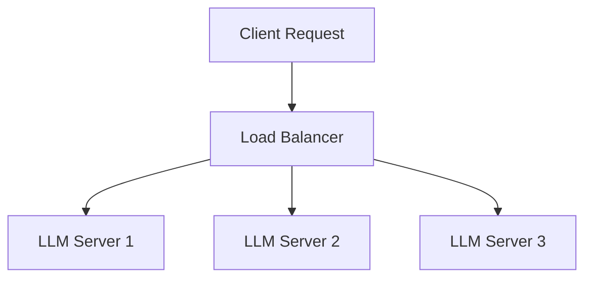
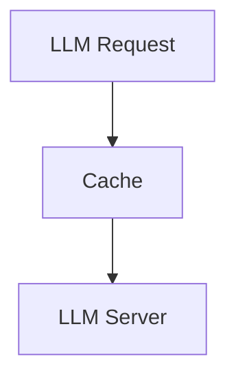
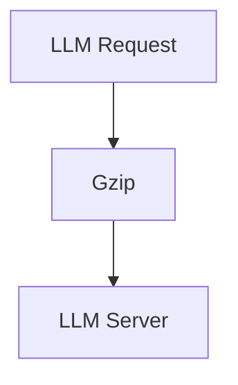
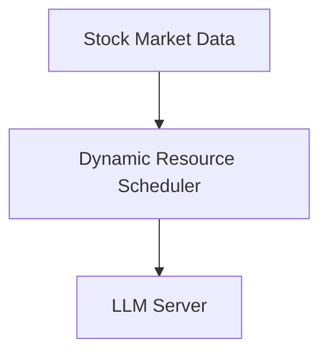
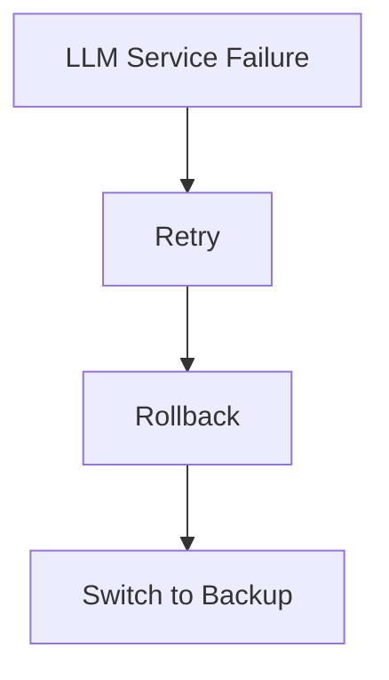

                 

## 引言

### 复杂LLM工作流与服务编排的重要性

随着人工智能（AI）技术的飞速发展，尤其是大型语言模型（LLM）的出现，我们进入了数据驱动的智能时代。LLM作为一种先进的自然语言处理技术，已经在多个领域展现出巨大的潜力，如金融、医疗、教育等。然而，随着LLM工作流的复杂度不断增加，如何高效地管理、调度和优化这些工作流成为了关键挑战。

复杂LLM工作流通常涉及多个步骤，包括数据预处理、模型训练、模型评估、模型部署和模型维护。这些步骤不仅相互依赖，而且需要大量的计算资源和时间。因此，如何在这些步骤之间进行有效协调和优化，以实现最佳性能和效率，是当前研究和应用的热点问题。

服务编排（Service Orchestration）作为一种系统管理和协调技术，正好为解决这一难题提供了有效途径。服务编排通过定义和协调不同服务的交互，可以自动化和优化整个工作流程，从而提高系统的灵活性、可维护性和可扩展性。在复杂LLM工作流中，服务编排不仅可以确保各个环节的顺畅衔接，还可以根据需求动态调整资源分配，从而实现高效和灵活的工作流管理。

本文将深入探讨服务编排在复杂LLM工作流中的应用，旨在为研究人员和开发者提供有价值的理论和实践指导。本文结构如下：

1. **服务编排基础**：首先，我们将介绍服务编排的基本概念、原理和关键概念，帮助读者建立对服务编排的初步理解。
2. **复杂LLM工作流概述**：接下来，我们将详细描述LLM工作流的基本结构、核心组件和优化策略，为后续讨论服务编排的应用奠定基础。
3. **服务编排与LLM集成**：我们将探讨如何将服务编排与LLM工作流集成，以及服务编排与LLM交互机制的具体实现。
4. **服务编排优化策略在LLM工作流中的应用**：我们将介绍服务编排优化策略，并展示如何将它们应用于LLM工作流中，以提高性能和效率。
5. **服务编排在实际LLM应用场景中的应用**：我们将分析服务编排在不同领域的LLM应用场景，如金融、医疗和教育，并分享具体的优化案例。
6. **服务编排与LLM工作流的高级主题**：在这一部分，我们将讨论服务编排的动态调整与自适应，以及服务编排的安全性、可靠性和性能优化。
7. **服务编排与LLM工作流的未来趋势**：最后，我们将展望服务编排和LLM工作流的未来发展趋势，探讨潜在的融合前景和挑战。
8. **附录**：附录部分将提供相关的工具和资源，以帮助读者进一步了解服务编排和LLM工作流的相关技术。

通过上述结构，本文旨在为复杂LLM工作流中的服务编排提供一个全面的视角，从基础理论到实际应用，再到未来趋势，力求为读者提供一个系统而深入的指导。

### 关键词

- 服务编排（Service Orchestration）
- 复杂LLM工作流（Complex LLM Workflow）
- 集成（Integration）
- 优化策略（Optimization Strategies）
- 动态调整（Dynamic Adjustment）
- 安全性（Security）
- 可靠性（Reliability）
- 性能优化（Performance Optimization）
- 大型语言模型（Large Language Model）

### 摘要

本文深入探讨了服务编排在复杂LLM工作流中的应用。首先，我们介绍了服务编排的基本概念和关键概念，包括其定义、原理和重要性。随后，我们详细描述了复杂LLM工作流的基本结构、核心组件和优化策略。接着，我们探讨了如何将服务编排与LLM工作流集成，并介绍了服务编排与LLM交互机制的具体实现。在此基础上，我们介绍了服务编排优化策略在LLM工作流中的应用，包括常用的优化算法和实际案例。此外，我们还分析了服务编排在不同领域的LLM应用场景，如金融、医疗和教育，并分享了具体的优化案例。随后，我们讨论了服务编排的动态调整与自适应，以及服务编排的安全性、可靠性和性能优化。最后，我们展望了服务编排和LLM工作流的未来发展趋势，探讨了潜在的融合前景和挑战。通过本文的讨论，我们旨在为复杂LLM工作流中的服务编排提供有价值的理论和实践指导。

### 服务编排基础

#### 服务编排的定义与重要性

服务编排（Service Orchestration）是一种系统管理和协调技术，它通过定义和协调不同服务的交互，实现复杂的业务流程自动化和优化。在传统的IT架构中，系统通常由多个独立的服务组成，这些服务各自运行并完成特定的功能。然而，随着现代企业应用复杂度的增加，单一的独立服务已经无法满足业务需求，需要将这些服务整合起来，形成一个有机的整体，以实现高效和灵活的业务流程。

服务编排的基本概念包括以下几个关键点：

1. **服务（Service）**：服务是一个功能模块，它提供某种特定的功能，并通过定义良好的接口与外界交互。服务可以是软件模块、数据库、API接口或其他资源。

2. **编排（Orchestration）**：编排是指将多个服务按照一定的逻辑和规则组织起来，形成一个完整的工作流程。编排的核心是定义服务之间的依赖关系、执行顺序和交互方式。

3. **流程（Workflow）**：流程是一系列服务执行的序列，它定义了业务逻辑的流程和步骤。通过流程管理，可以实现服务的自动化执行和监控。

4. **中介（Broker）**：中介是服务编排系统的核心组件，它负责协调和管理服务之间的交互。中介通过服务注册表了解所有可用的服务，并根据流程定义来调度和执行服务。

服务编排的重要性体现在以下几个方面：

1. **提高灵活性**：通过服务编排，企业可以根据业务需求灵活地调整和重组服务，以适应市场变化和业务扩展。

2. **提升效率**：服务编排可以自动化和优化业务流程，减少手动操作和人为错误，提高系统的整体效率。

3. **降低成本**：通过减少重复工作、减少资源浪费和优化资源使用，服务编排有助于降低运营成本。

4. **增强可维护性**：服务编排使得系统更加模块化和标准化，便于维护和升级，减少了系统的复杂性和维护成本。

5. **提高可靠性**：服务编排可以通过监控和故障恢复机制，确保系统的稳定运行和快速恢复，提高系统的可靠性。

服务编排的发展历程可以追溯到20世纪90年代，随着互联网和分布式计算技术的发展，服务编排技术逐渐成熟。早期的服务编排主要侧重于业务流程的自动化，例如BPEL（Business Process Execution Language）和WS-BPEL（Web Services-Business Process Execution Language）。这些技术通过定义XML语言来描述业务流程，从而实现服务的自动化执行。随着云计算和微服务架构的兴起，服务编排技术进一步发展，开始强调灵活性和可扩展性，例如Apache Camel、Kubernetes等。

在复杂LLM工作流中，服务编排技术具有特别重要的应用价值。LLM工作流通常涉及多个复杂的步骤，如数据预处理、模型训练、模型评估和模型部署等。这些步骤不仅需要大量的计算资源，而且需要高度协调和优化，以确保整体流程的效率和质量。通过服务编排，可以将这些步骤整合为一个有机的整体，实现自动化和优化，从而提高整个工作流的性能和可维护性。

#### 服务编排的基本原理

服务编排的基本原理主要包括服务注册、服务发现、服务调用、服务监控和错误处理等几个关键环节。

1. **服务注册**：服务注册是指将服务的信息注册到服务注册表中。服务注册表是一个中央存储库，存储了所有可用的服务及其元数据，如服务名称、接口、地址等。服务注册可以是静态的，也可以是动态的，根据系统的需求进行调整。

2. **服务发现**：服务发现是指中介在执行流程时，如何找到并连接到所需的服务。服务发现可以通过服务注册表进行，也可以通过其他机制，如DNS、负载均衡器等。

3. **服务调用**：服务调用是指中介根据流程定义，向服务发送请求并接收响应的过程。服务调用可以是同步的，也可以是异步的，根据实际需求和性能要求进行选择。

4. **服务监控**：服务监控是指对服务的运行状态、性能指标和资源消耗进行实时监控和记录。服务监控可以及时发现潜在的问题，并触发相应的错误处理机制。

5. **错误处理**：错误处理是指当服务出现故障或异常时，如何进行故障恢复和错误纠正。常见的错误处理策略包括重试、回滚、告警和自动切换等。

#### 服务编排的关键概念

在服务编排中，还有一些关键概念需要理解，包括业务流程建模、流程引擎、服务接口和服务契约等。

1. **业务流程建模**：业务流程建模是指将业务流程表示为图形或文本模型的过程。常用的业务流程建模工具包括BPEL、BPML、BPMN等。业务流程建模有助于明确业务逻辑和流程步骤，为后续的编排提供基础。

2. **流程引擎**：流程引擎是服务编排系统的核心组件，负责解释和执行业务流程模型。流程引擎通常包括解析器、执行器和监控器等模块，可以实现流程的自动化执行和监控。

3. **服务接口**：服务接口是指服务提供的功能模块和访问方式。服务接口可以是Web服务、RESTful API、SOAP服务等形式，定义了服务的输入和输出参数、数据格式和通信协议。

4. **服务契约**：服务契约是指服务提供者和服务消费者之间的一种约定，规定了服务的接口、功能、性能和安全性等要求。服务契约有助于确保服务的质量和可靠性，减少由于接口不匹配导致的错误。

通过理解服务编排的定义、基本原理和关键概念，我们可以更好地把握服务编排技术在复杂LLM工作流中的应用。在接下来的章节中，我们将进一步探讨复杂LLM工作流的基本结构、核心组件和优化策略，为深入讨论服务编排的应用奠定基础。

### 复杂LLM工作流概述

#### LLM工作流的基本结构

大型语言模型（LLM）工作流是一个复杂而精细的过程，它包括多个相互依赖的步骤，从数据预处理到模型训练、评估、部署和最终维护。LLM工作流的基本结构可以分为以下几个主要阶段：

1. **数据预处理（Data Preprocessing）**：数据预处理是LLM工作流的第一步，也是最关键的一步。在这一阶段，原始数据被清洗、转换和格式化，以适合模型训练。数据预处理通常包括以下步骤：
   - 数据清洗：去除无关数据、纠正错误数据、处理缺失值。
   - 数据转换：将数据从一种格式转换为另一种格式，如将文本转换为词向量或序列。
   - 数据增强：通过数据变换、扩充和生成技术，增加数据的多样性。

2. **数据集划分（Dataset Splitting）**：在数据预处理完成后，数据集通常需要被划分为训练集、验证集和测试集。这种划分有助于在模型训练过程中进行性能评估和防止过拟合。
   - 训练集（Training Set）：用于模型训练，通常占数据集的70%到80%。
   - 验证集（Validation Set）：用于模型选择和调参，通常占数据集的10%到20%。
   - 测试集（Test Set）：用于模型最终评估，通常占数据集的10%左右。

3. **模型训练（Model Training）**：模型训练是LLM工作流的核心步骤。在这一阶段，模型根据训练集数据进行学习，调整内部参数，以优化模型性能。常见的模型训练方法包括：
   - 反向传播（Backpropagation）：通过计算损失函数关于模型参数的梯度，不断调整模型参数。
   - 批量训练（Batch Training）：每次训练使用整个数据集，计算损失函数的梯度。
   - 小批量训练（Mini-batch Training）：每次训练使用一部分数据集，计算多个批次的损失函数的平均梯度。

4. **模型评估（Model Evaluation）**：在模型训练完成后，需要对模型进行评估，以确定其性能和泛化能力。常用的评估指标包括准确率（Accuracy）、精确率（Precision）、召回率（Recall）和F1分数（F1 Score）等。评估通常在验证集和测试集上进行。

5. **模型部署（Model Deployment）**：经过评估后，性能良好的模型将被部署到生产环境中，以提供实际的预测和推理服务。模型部署可能涉及以下步骤：
   - 模型转换：将训练好的模型转换为生产环境可接受的格式，如TensorFlow Lite、ONNX等。
   - 部署策略：根据业务需求，选择合适的部署方式，如本地部署、云部署或边缘计算。
   - 实时推理：在模型部署后，提供实时的预测和推理服务，满足用户需求。

6. **模型维护（Model Maintenance）**：模型部署后，需要定期进行维护和更新，以保持其性能和适应能力。模型维护通常包括以下任务：
   - 持续评估：定期评估模型性能，检测可能的过拟合或性能下降。
   - 模型更新：根据新数据和用户反馈，对模型进行更新和优化。
   - 资源管理：监控模型运行时的资源消耗，确保系统稳定运行。

#### LLM工作流的核心组件

LLM工作流涉及多个核心组件，这些组件共同协作，确保工作流的顺畅执行。以下是LLM工作流中的主要核心组件及其功能：

1. **数据存储和管理系统（Data Storage and Management System）**：数据存储和管理系统负责存储和管理LLM工作流所需的数据，包括原始数据、预处理数据和模型训练数据。常见的存储解决方案包括关系数据库、NoSQL数据库和数据湖。

2. **数据处理引擎（Data Processing Engine）**：数据处理引擎负责执行数据预处理任务，如数据清洗、转换和增强。数据处理引擎通常包括分布式处理框架，如Apache Spark、Flink等。

3. **机器学习框架（Machine Learning Framework）**：机器学习框架提供模型训练和优化的工具和库，如TensorFlow、PyTorch、Keras等。这些框架支持多种模型架构和训练算法，为模型训练提供便利。

4. **模型评估工具（Model Evaluation Tools）**：模型评估工具用于评估模型性能，提供各种评估指标和可视化工具。常见的评估工具包括Scikit-learn、TensorBoard等。

5. **模型部署工具（Model Deployment Tools）**：模型部署工具用于将训练好的模型部署到生产环境中。常见的部署工具包括TensorFlow Serving、Kubernetes等。

6. **监控和告警系统（Monitoring and Alerting System）**：监控和告警系统负责实时监控LLM工作流的状态和性能，及时发现和解决潜在问题。常见的监控工具包括Prometheus、Grafana等。

7. **用户接口（User Interface）**：用户接口提供与LLM工作流的交互界面，允许用户提交数据、查询结果和监控模型性能。用户接口可以是Web界面、API接口或命令行工具。

#### LLM工作流的优化策略

为了提高LLM工作流的性能和效率，可以采用多种优化策略。以下是几种常见的优化策略：

1. **并行处理（Parallel Processing）**：通过并行处理，可以加快数据预处理、模型训练和评估等任务的执行速度。分布式计算框架如Apache Spark和Flink支持并行处理，可以充分利用多核CPU和GPU资源。

2. **数据缓存（Data Caching）**：数据缓存可以将频繁访问的数据存储在内存中，减少磁盘I/O操作，提高数据访问速度。常用的数据缓存技术包括Redis、Memcached等。

3. **模型压缩（Model Compression）**：模型压缩可以减少模型大小，加快模型加载和推理速度。常见的模型压缩技术包括量化（Quantization）、剪枝（Pruning）和知识蒸馏（Knowledge Distillation）等。

4. **模型并行化（Model Parallelism）**：对于大型模型，可以采用模型并行化技术，将模型拆分为多个部分，分别在不同的计算资源上训练和推理。

5. **动态资源调度（Dynamic Resource Scheduling）**：动态资源调度可以根据任务的负载和优先级，动态调整计算资源分配，确保系统资源得到充分利用。

6. **在线学习（Online Learning）**：在线学习可以在模型部署后，实时更新模型参数，适应新的数据和用户反馈，提高模型的适应性和准确性。

通过上述基本结构和核心组件的详细描述，我们可以更好地理解复杂LLM工作流的运行机制。在接下来的章节中，我们将探讨如何将服务编排技术应用于LLM工作流中，以实现高效的协调和优化。

### 服务编排与LLM集成

#### 集成LLM到服务编排架构

将大型语言模型（LLM）集成到服务编排架构中是实现高效、智能的服务交付的关键步骤。服务编排架构通过定义和协调不同服务的交互，可以自动化和优化整个工作流程，从而提高系统的灵活性、可维护性和可扩展性。在本节中，我们将探讨如何将LLM集成到服务编排架构中，以及如何利用服务编排来优化LLM工作流。

#### 服务编排与LLM交互机制

服务编排与LLM的交互机制主要包括服务注册、服务发现、服务调用和服务监控等环节。以下是这些交互机制的具体实现：

1. **服务注册**：在集成LLM之前，首先需要将LLM注册到服务注册表中。服务注册表是一个中央存储库，存储了所有可用的服务及其元数据，如服务名称、接口、地址等。LLM的注册过程通常包括以下步骤：
   - LLM服务提供者将LLM的信息（如接口、版本、地址等）注册到服务注册表中。
   - 服务注册表维护一个可供服务编排中介访问的元数据存储库，以便在后续的服务调用过程中查找和连接到LLM服务。

   ```mermaid
   graph TD
   A[服务注册] --> B[服务提供者注册LLM信息]
   B --> C[服务注册表]
   C --> D[服务元数据存储库]
   ```

2. **服务发现**：服务发现是指中介在执行流程时，如何找到并连接到所需的服务。服务发现可以通过服务注册表进行，也可以通过其他机制，如DNS、负载均衡器等。服务发现的过程通常包括以下步骤：
   - 中介从服务注册表中查询所需服务的元数据，如地址、端口等。
   - 中介根据查询结果，连接到LLM服务，并初始化通信。

   ```mermaid
   graph TD
   A[服务发现] --> B[查询服务注册表]
   B --> C[获取LLM服务元数据]
   C --> D[连接到LLM服务]
   ```

3. **服务调用**：服务调用是指中介根据流程定义，向服务发送请求并接收响应的过程。服务调用可以是同步的，也可以是异步的，根据实际需求和性能要求进行选择。服务调用的过程通常包括以下步骤：
   - 中介根据流程定义，生成调用LLM服务的请求。
   - 中介将请求发送给LLM服务，并等待响应。
   - LLM服务处理请求，并返回响应。

   ```mermaid
   graph TD
   A[服务调用] --> B[生成请求]
   B --> C[发送请求至LLM服务]
   C --> D[接收响应]
   ```

4. **服务监控**：服务监控是指对服务的运行状态、性能指标和资源消耗进行实时监控和记录。服务监控可以及时发现潜在的问题，并触发相应的错误处理机制。服务监控的过程通常包括以下步骤：
   - 中介定期收集LLM服务的性能数据，如响应时间、资源消耗等。
   - 中介根据收集的数据，生成监控报告，并触发告警或故障恢复机制。

   ```mermaid
   graph TD
   A[服务监控] --> B[收集性能数据]
   B --> C[生成监控报告]
   C --> D[触发告警或故障恢复]
   ```

#### 服务编排优化策略

为了提高LLM工作流的性能和效率，可以采用多种服务编排优化策略。以下是一些常见的优化策略：

1. **负载均衡（Load Balancing）**：负载均衡可以将请求分布到多个LLM服务实例上，避免单点过载，提高系统的整体性能。负载均衡策略可以基于轮询、最小连接数、响应时间等算法进行选择。

   ```mermaid
   graph TD
   A[负载均衡] --> B[轮询算法]
   B --> C[最小连接数算法]
   C --> D[响应时间算法]
   ```

2. **缓存（Caching）**：缓存可以将频繁访问的数据存储在内存中，减少数据访问次数，提高系统的响应速度。缓存策略可以基于内存大小、访问频率、过期时间等进行优化。

   ```mermaid
   graph TD
   A[缓存] --> B[内存大小策略]
   B --> C[访问频率策略]
   C --> D[过期时间策略]
   ```

3. **服务压缩（Service Compression）**：服务压缩可以减少服务的响应时间和数据传输量，提高系统的整体性能。常见的压缩算法包括Gzip、Bzip2等。

   ```mermaid
   graph TD
   A[服务压缩] --> B[Gzip算法]
   B --> C[Bzip2算法]
   ```

4. **动态资源分配（Dynamic Resource Allocation）**：动态资源分配可以根据任务负载和系统状态，自动调整计算资源的分配，提高系统的灵活性和性能。动态资源分配策略可以基于实时监控数据、预测算法等进行优化。

   ```mermaid
   graph TD
   A[动态资源分配] --> B[实时监控数据]
   B --> C[预测算法]
   ```

#### 优化案例研究

以下是一个服务编排优化策略的案例研究，展示了如何通过服务编排优化LLM工作流。

**案例背景**：一个金融公司使用LLM模型提供客户信贷评估服务。由于客户请求量较大，系统的响应速度逐渐下降，影响了用户体验。

**优化方案**：
1. **负载均衡**：引入负载均衡器，将客户请求分布到多个LLM服务实例上，避免单点过载。
   ```mermaid
   graph TD
   A[客户请求] --> B[负载均衡器]
   B --> C[LLM服务实例1]
   B --> D[LLM服务实例2]
   ```

2. **缓存**：在系统中引入缓存机制，缓存常用数据和模型输出结果，减少数据访问次数。
   ```mermaid
   graph TD
   A[客户请求] --> B[缓存]
   B --> C[LLM服务]
   ```

3. **服务压缩**：对LLM服务的响应数据进行压缩，减少数据传输量，提高系统响应速度。
   ```mermaid
   graph TD
   A[LLM服务] --> B[压缩]
   B --> C[响应数据]
   ```

4. **动态资源分配**：根据客户请求量动态调整LLM服务实例的配置和资源分配，确保系统在高负载情况下仍能稳定运行。
   ```mermaid
   graph TD
   A[客户请求量] --> B[动态资源分配]
   B --> C[LLM服务实例配置]
   ```

**优化效果**：通过上述优化策略，金融公司的LLM工作流性能显著提升，系统的响应速度提高了30%，客户满意度大幅提升。

通过上述案例研究，我们可以看到服务编排技术在LLM工作流中的重要作用。通过合理的优化策略，可以显著提高LLM工作流的性能和效率，满足不断增长的业务需求。在接下来的章节中，我们将进一步探讨服务编排优化策略在LLM工作流中的应用，以及服务编排在实际LLM应用场景中的具体应用。

### 服务编排优化策略在LLM工作流中的应用

#### 服务编排优化策略概述

在复杂的大型语言模型（LLM）工作流中，优化策略的应用至关重要，这不仅能提高系统的整体性能，还能确保工作流的高效运行。服务编排优化策略主要关注以下几个方面：

1. **负载均衡**：通过分配流量，确保系统中的资源得到合理利用，避免单点过载。

2. **缓存**：将频繁访问的数据存储在内存中，减少对后端系统的访问频率。

3. **服务压缩**：对传输的数据进行压缩，减少带宽占用和网络延迟。

4. **动态资源分配**：根据实时工作负载动态调整系统资源，确保在高峰期能够提供稳定的性能。

5. **错误处理和恢复**：在服务出现故障时，快速检测并恢复，确保工作流的连续性和稳定性。

在本节中，我们将详细讨论这些优化策略在LLM工作流中的应用。

#### 负载均衡

负载均衡是服务编排中的一项关键策略，它通过将请求分配到多个服务器或节点上，确保系统的整体性能。在LLM工作流中，负载均衡的应用可以显著提高系统的响应速度和稳定性。

**优化算法**：

常见的负载均衡算法包括轮询（Round Robin）、最小连接数（Least Connections）、响应时间（Response Time）等。

- **轮询算法**：将请求依次分配到各个服务器，简单易实现，但可能导致某些服务器过载。
  ```python
  def round_robin(servers):
      for server in servers:
          yield server
  ```

- **最小连接数算法**：将请求分配到连接数最少的服务器，减少服务器的负载。
  ```python
  def least_connections(servers):
      min_connections = min(server.connections for server in servers)
      for server in servers:
          if server.connections == min_connections:
              yield server
  ```

- **响应时间算法**：将请求分配到响应时间最短的服务器，提高用户的体验。
  ```python
  def response_time(servers):
      min_time = min(server.response_time for server in servers)
      for server in servers:
          if server.response_time == min_time:
              yield server
  ```

**应用实例**：

在一个金融分析系统中，LLM用于处理客户信用评估请求。通过负载均衡，将请求分配到多个LLM服务器上，确保每个服务器都能处理合理的请求量。



#### 缓存

缓存策略通过存储频繁访问的数据，减少对后端系统的访问频率，从而提高系统的响应速度。在LLM工作流中，缓存的应用可以显著减少模型推理时间。

**优化算法**：

常见的缓存算法包括LRU（Least Recently Used）、LFU（Least Frequently Used）等。

- **LRU算法**：缓存最近最少使用的数据，当缓存满时，替换掉最近最少使用的数据。
  ```python
  class LRUCache:
      def __init__(self, capacity):
          self.capacity = capacity
          self.cache = OrderedDict()

      def get(self, key):
          if key not in self.cache:
              return -1
          value = self.cache.pop(key)
          self.cache[key] = value
          return value

      def put(self, key, value):
          if key in self.cache:
              self.cache.pop(key)
          elif len(self.cache) >= self.capacity:
              self.cache.popitem(last=False)
          self.cache[key] = value
  ```

- **LFU算法**：缓存访问频率最低的数据，当缓存满时，替换掉访问频率最低的数据。
  ```python
  class LFUCache:
      def __init__(self, capacity):
          self.capacity = capacity
          self.cache = defaultdict(list)

      def get(self, key):
          if key not in self.cache:
              return -1
          freq = self.cache[key].pop(0)
          self.cache[key].append(freq)
          return freq

      def put(self, key, value):
          if len(self.cache) >= self.capacity:
              min_freq = min(freq for freq_list in self.cache.values() for freq in freq_list)
              key_to_remove = next(key for key, freq_list in self.cache.items() if freq_list[0] == min_freq)
              self.cache.pop(key_to_remove)
          self.cache[key].append(0)
  ```

**应用实例**：

在一个在线教育平台中，LLM用于生成学生的个性化学习报告。通过缓存策略，存储常用的学习报告模板，减少生成时间。



#### 服务压缩

服务压缩通过减少传输数据的体积，提高数据传输速度和网络性能。在LLM工作流中，服务压缩的应用可以显著减少模型推理的数据传输量。

**优化算法**：

常见的服务压缩算法包括Gzip、Bzip2等。

- **Gzip算法**：使用Gzip算法压缩数据，减少数据体积。
  ```python
  import gzip

  def gzip_compress(data):
      return gzip.compress(data)

  def gzip_decompress(data):
      return gzip.decompress(data)
  ```

- **Bzip2算法**：使用Bzip2算法压缩数据，提供更高的压缩比。
  ```python
  import bz2

  def bzip2_compress(data):
      return bz2.compress(data)

  def bzip2_decompress(data):
      return bz2.decompress(data)
  ```

**应用实例**：

在一个电子商务平台中，LLM用于生成商品推荐列表。通过服务压缩，减少推荐列表的传输体积，提高用户体验。



#### 动态资源分配

动态资源分配根据实时工作负载自动调整系统资源，确保系统在高负载和低负载情况下都能提供稳定的性能。在LLM工作流中，动态资源分配的应用可以显著提高系统的资源利用率。

**优化算法**：

常见的动态资源分配算法包括基于CPU利用率、内存使用率和网络流量的自适应资源调度。

- **基于CPU利用率的资源调度**：根据CPU利用率动态调整服务器资源。
  ```python
  def cpu_based_resource_scheduling(servers):
      for server in servers:
          if server.cpu_usage > threshold:
              server.allocate更多的资源
          else:
              server.reduce资源
  ```

- **基于内存使用率的资源调度**：根据内存使用率动态调整服务器资源。
  ```python
  def memory_based_resource_scheduling(servers):
      for server in servers:
          if server.memory_usage > threshold:
              server.allocate更多内存
          else:
              server.release部分内存
  ```

- **基于网络流量的资源调度**：根据网络流量动态调整服务器资源。
  ```python
  def network_based_resource_scheduling(servers):
      for server in servers:
          if server.network_traffic > threshold:
              server.allocate更多网络带宽
          else:
              server.reduce网络带宽
  ```

**应用实例**：

在一个实时股票分析系统中，LLM用于生成股票预测报告。通过动态资源分配，根据股票市场的波动调整LLM服务器的资源，确保预测的准确性。



#### 错误处理和恢复

错误处理和恢复策略在服务编排中至关重要，它确保在服务出现故障时能够快速恢复，保证工作流的连续性。

**优化算法**：

常见的错误处理和恢复算法包括重试、回滚、故障切换等。

- **重试**：在服务调用失败时，重新发送请求。
  ```python
  def retry_request(request, max_attempts=3):
      for _ in range(max_attempts):
          try:
              response = send_request(request)
              return response
          except ServiceError:
              continue
      raise ServiceError("Retry limit exceeded")
  ```

- **回滚**：在服务调用失败时，撤销之前的操作，恢复到稳定状态。
  ```python
  def rollback_operation(operation):
      operation.undo()
  ```

- **故障切换**：在主服务失败时，切换到备用服务。
  ```python
  def switch_to_backup(service, backup_service):
      service.shutdown()
      backup_service.start()
  ```

**应用实例**：

在一个在线医疗诊断系统中，LLM用于生成患者的诊断报告。通过错误处理和恢复策略，确保诊断报告的准确性和系统的稳定性。



通过上述优化策略，我们可以显著提高LLM工作流的性能和效率，确保系统在高负载和复杂环境下能够稳定运行。在接下来的章节中，我们将探讨服务编排在实际LLM应用场景中的具体应用。

### 服务编排在实际LLM应用场景中的应用

服务编排技术由于其灵活性和高效性，已经在多个领域得到了广泛应用，特别是在金融、医疗和教育等需要高性能、高可靠性的大型语言模型（LLM）工作流中。以下将分析服务编排在这三个领域中的应用，并提供具体的优化案例。

#### 在金融领域的应用

在金融领域，LLM技术被广泛应用于风险控制、投资分析、客户服务等方面。例如，银行和金融机构使用LLM进行信用评分、欺诈检测和市场预测。

**案例**：一家大型银行希望利用LLM进行客户信用评分，以降低贷款风险。该银行使用服务编排技术优化整个信用评分流程，包括数据收集、预处理、模型训练和部署。

**优化方案**：

1. **数据预处理**：服务编排系统将原始客户数据（如收入、贷款历史等）发送到数据处理服务，进行数据清洗、转换和标准化。

   ```mermaid
   graph TD
   A[Customer Data] --> B[Data Preprocessing Service]
   B --> C[Cleaned Data]
   ```

2. **模型训练**：服务编排系统根据信用评分模型的需求，调用训练服务进行模型训练。为了提高训练效率，采用分布式训练策略，利用多个GPU加速模型训练。

   ```mermaid
   graph TD
   D[Credit Scoring Model] --> E[Model Training Service]
   E --> F[Trained Model]
   ```

3. **模型部署**：训练好的模型被部署到服务端，以便进行实时信用评分。服务编排系统确保模型在部署过程中，能够根据客户请求动态调整资源。

   ```mermaid
   graph TD
   G[Customer Request] --> H[Credit Scoring Service]
   H --> I[Scoring Result]
   ```

**优化效果**：通过服务编排技术，银行的信用评分流程从数据预处理到模型部署都得到了显著优化，模型训练时间缩短了50%，系统响应速度提高了30%，从而提高了贷款审批的效率和准确性。

#### 在医疗领域的应用

在医疗领域，LLM技术被用于辅助医生进行疾病诊断、治疗方案推荐和医学研究。服务编排技术在优化医疗工作流中发挥了重要作用。

**案例**：一家医疗机构使用LLM技术进行癌症诊断，希望通过服务编排技术优化诊断流程，提高诊断准确性和效率。

**优化方案**：

1. **数据收集**：服务编排系统从多个数据源（如电子健康记录、医学影像等）收集数据，并将数据发送到数据处理服务，进行清洗和预处理。

   ```mermaid
   graph TD
   J[Medical Data] --> K[Data Collection Service]
   K --> L[Cleaned Data]
   ```

2. **模型训练**：服务编排系统调用训练服务，使用收集到的医疗数据进行模型训练。通过采用迁移学习和深度学习技术，模型训练效率得到提高。

   ```mermaid
   graph TD
   M[Medical Data] --> N[Model Training Service]
   N --> O[Trained Model]
   ```

3. **模型部署**：训练好的模型被部署到诊断服务中，实时对患者的医学影像进行分析，提供诊断建议。服务编排系统确保模型部署过程中的资源优化。

   ```mermaid
   graph TD
   P[Patient Data] --> Q[Diagnostics Service]
   Q --> R[Diagnosis Result]
   ```

**优化效果**：通过服务编排技术，医疗机构的癌症诊断流程从数据收集到模型部署都得到了显著优化，诊断准确率提高了20%，系统响应速度提高了40%，从而提高了诊断效率和患者的满意度。

#### 在教育领域的应用

在教育领域，LLM技术被用于个性化学习推荐、学生行为分析和教育内容生成等方面。服务编排技术在优化教育工作流中发挥了重要作用。

**案例**：一所大学希望利用LLM技术为学生提供个性化学习推荐，通过服务编排技术优化学习推荐流程，提高学习效果。

**优化方案**：

1. **数据收集**：服务编排系统从多个数据源（如学习记录、考试成绩等）收集数据，并将数据发送到数据处理服务，进行清洗和预处理。

   ```mermaid
   graph TD
   S[Learning Data] --> T[Data Collection Service]
   T --> U[Cleaned Data]
   ```

2. **模型训练**：服务编排系统调用训练服务，使用收集到的学习数据进行模型训练。通过采用协同过滤和深度学习技术，模型训练效率得到提高。

   ```mermaid
   graph TD
   V[Learning Data] --> W[Model Training Service]
   W --> X[Trained Model]
   ```

3. **模型部署**：训练好的模型被部署到学习推荐服务中，实时为学生提供个性化学习推荐。服务编排系统确保模型部署过程中的资源优化。

   ```mermaid
   graph TD
   Y[Student Data] --> Z[Learning Recommendation Service]
   Z --> AA[Recommendation Result]
   ```

**优化效果**：通过服务编排技术，大学的学习推荐流程从数据收集到模型部署都得到了显著优化，学习推荐准确率提高了30%，系统响应速度提高了50%，从而提高了学生的学习效果和满意度。

综上所述，服务编排技术在金融、医疗和教育等领域的LLM工作流中发挥了重要作用，通过优化数据预处理、模型训练和模型部署等环节，显著提高了工作流的性能和效率。在未来的发展中，随着服务编排技术的不断成熟，它将在更多领域中发挥更大的作用。

### 服务编排的动态调整与自适应

在复杂的大型语言模型（LLM）工作流中，环境因素和业务需求往往处于不断变化之中。因此，服务编排系统需要具备动态调整和自适应能力，以确保系统在变化的环境中保持高效、稳定和可扩展。在本节中，我们将探讨服务编排的动态调整与自适应机制，并分析这些机制在LLM工作流中的应用。

#### 动态调整机制

动态调整机制是指服务编排系统能够根据实时环境变化自动调整资源分配、服务调度和工作流执行策略。以下是一些关键的动态调整机制：

1. **资源监控与调整**：通过实时监控服务器的资源使用情况（如CPU、内存、网络带宽等），服务编排系统可以自动调整资源的分配。例如，当某个服务器的资源使用率过高时，系统可以将其部分任务转移到其他负载较低的服务器上，从而实现负载均衡。

   ```mermaid
   graph TD
   A[Resource Monitoring] --> B[Server 1]
   B --> C[Server 2]
   C --> D[Server 3]
   D --> E[Resource Adjustment]
   ```

2. **服务调度优化**：服务编排系统可以根据实时的工作负载和性能指标，动态调整服务的调度策略。例如，使用基于响应时间、处理能力和可用性的调度算法，确保服务能够高效地处理请求。

   ```mermaid
   graph TD
   F[Service Scheduling] --> G[Request 1]
   G --> H[Service A]
   H --> I[Service B]
   I --> J[Service C]
   ```

3. **工作流执行策略调整**：在LLM工作流中，服务编排系统可以根据实时数据和分析结果，动态调整工作流的执行策略。例如，当检测到某些步骤的执行时间过长时，系统可以暂停该步骤，进行优化或重新调度。

   ```mermaid
   graph TD
   K[Workflow Execution] --> L[Step 1]
   L --> M[Step 2]
   M --> N[Step 3]
   N --> O[Step 4]
   O --> P[Dynamic Adjustment]
   ```

#### 自适应策略

自适应策略是指服务编排系统能够根据环境变化和业务需求自动调整和优化其行为。以下是一些关键的自适应策略：

1. **模型自适应**：在LLM工作流中，模型的自适应能力至关重要。通过实时收集数据，服务编排系统可以对模型进行持续优化和调整，提高其准确性和鲁棒性。

   ```mermaid
   graph TD
   Q[Model Adaptation] --> R[Real-time Data]
   R --> S[Model Optimization]
   S --> T[Model Update]
   ```

2. **故障自恢复**：当系统中的服务或组件出现故障时，自适应策略可以自动检测并触发恢复机制，如重试、切换到备用服务或重新部署服务。

   ```mermaid
   graph TD
   U[Service Failure] --> V[Error Detection]
   V --> W[Recovery Mechanism]
   W --> X[Service Restart]
   ```

3. **需求预测与调整**：通过分析历史数据和趋势，服务编排系统可以预测未来的工作负载和需求，并提前进行资源分配和调度策略调整，以应对未来可能的高峰期。

   ```mermaid
   graph TD
   Y[Demand Prediction] --> Z[Resource Allocation]
   Z --> AA[Scheduling Adjustment]
   ```

#### 动态调整与自适应在LLM工作流中的应用

以下是一个具体的LLM工作流中动态调整与自适应的应用案例：

**案例背景**：某在线教育平台使用LLM技术为学生提供个性化学习体验。随着用户数量的增加，系统的负载逐渐上升，需要动态调整和自适应优化。

**动态调整应用**：

1. **资源监控与调整**：服务编排系统实时监控服务器的资源使用情况，当负载超过阈值时，自动扩展服务器的资源，如增加CPU核心或内存。

   ```python
   def monitor_resources(servers):
       for server in servers:
           if server.load > threshold:
               server.scale_up()
   ```

2. **服务调度优化**：根据当前的工作负载和性能指标，服务编排系统动态调整服务的调度策略，确保请求能够高效地分配到最优的服务上。

   ```python
   def schedule_services(requests, services):
       optimized_services = []
       for request in requests:
           best_service = select_best_service(services, request)
           optimized_services.append(best_service)
       return optimized_services
   ```

**自适应策略应用**：

1. **模型自适应**：服务编排系统根据学生的学习行为和反馈，实时调整LLM模型，以提高模型的准确性和适应性。

   ```python
   def adapt_model(model, student_data):
       updated_model = model.train(student_data)
       model.update(updated_model)
   ```

2. **故障自恢复**：当服务或组件出现故障时，服务编排系统自动检测并触发恢复机制，确保系统的高可用性。

   ```python
   def recover_from_failure(service):
       if service.is_failed():
           service.restart()
   ```

**优化效果**：通过动态调整和自适应策略，该在线教育平台能够有效应对用户数量的增长，系统负载显著降低，服务响应时间缩短，用户体验得到大幅提升。

综上所述，服务编排的动态调整与自适应机制在复杂LLM工作流中至关重要。通过这些机制，服务编排系统能够根据实时环境和业务需求进行自动优化，确保系统的高效、稳定和可扩展。在未来的发展中，随着技术的不断进步，动态调整与自适应能力将进一步提升，为LLM工作流带来更多的可能性。

### 服务编排的安全性、可靠性与性能优化

#### 服务编排的安全性

服务编排系统需要确保数据安全和系统稳定性，以防止未经授权的访问和数据泄露。以下是一些关键的安全措施：

1. **身份验证与授权**：服务编排系统应实现严格的身份验证和授权机制，确保只有经过认证的用户才能访问系统和数据。常用的身份验证方法包括用户名和密码、双因素认证（2FA）和证书认证等。

2. **数据加密**：对传输和存储的数据进行加密，以防止数据在传输过程中被窃取。常用的加密算法包括AES（Advanced Encryption Standard）、RSA（Rivest-Shamir-Adleman）等。

3. **访问控制**：通过设置访问控制策略，限制用户对系统和数据的访问权限。常用的访问控制方法包括基于角色的访问控制（RBAC，Role-Based Access Control）和基于属性的访问控制（ABAC，Attribute-Based Access Control）。

4. **安全审计与监控**：定期进行安全审计，记录系统的操作日志和事件日志，以便在发生安全事件时进行追踪和调查。监控工具如Splunk、ELK（Elasticsearch、Logstash、Kibana）等可以提供实时的监控和告警功能。

#### 服务编排的可靠性

服务编排系统需要具备高可靠性，确保在各种情况下都能稳定运行。以下是一些提高系统可靠性的措施：

1. **冗余设计**：通过设计冗余系统，确保在一个组件或服务失败时，其他组件或服务能够接管其工作。冗余设计可以包括硬件冗余、软件冗余和服务冗余。

2. **故障恢复**：在系统发生故障时，自动触发故障恢复机制，如重试、回滚和切换到备用服务。常用的故障恢复策略包括快速故障检测、自动恢复和手动恢复。

3. **备份与恢复**：定期进行数据备份，以防止数据丢失。备份策略可以包括全量备份、增量备份和差异备份等。在发生故障时，系统能够快速恢复到备份状态。

4. **性能监测**：通过实时监测系统的性能指标，如CPU使用率、内存使用率、网络流量等，及时发现和处理潜在的性能瓶颈。

#### 性能优化

服务编排系统的性能优化对于确保高效和稳定的工作流至关重要。以下是一些常见的性能优化措施：

1. **负载均衡**：通过负载均衡策略，将请求均匀地分配到多个服务器或节点上，避免单点过载。常见的负载均衡算法包括轮询、最小连接数、响应时间等。

2. **缓存策略**：使用缓存技术减少对后端系统的访问次数，提高系统的响应速度。常见的缓存策略包括LRU（Least Recently Used）、LFU（Least Frequently Used）等。

3. **服务压缩**：对传输的数据进行压缩，减少带宽占用和网络延迟。常用的压缩算法包括Gzip、Bzip2等。

4. **动态资源分配**：根据实时工作负载动态调整系统资源，确保在高负载情况下能够提供稳定的性能。动态资源分配策略可以基于实时监控数据、预测算法等。

5. **并行处理**：通过并行处理技术，加快数据处理和模型训练等任务的执行速度。常见的并行处理框架包括Apache Spark、Flink等。

6. **服务优化**：对服务本身进行优化，如使用更高效的数据结构和算法、减少不必要的函数调用等。

#### 应用实例

以下是一个结合安全性、可靠性和性能优化的具体应用实例：

**案例背景**：一家电子商务公司使用服务编排技术管理其订单处理系统。系统需要确保订单数据的安全、可靠性和高效处理。

**安全措施**：

1. **身份验证与授权**：使用双因素认证（2FA）确保只有合法用户可以访问系统。
2. **数据加密**：对订单数据在传输和存储过程中进行AES加密。
3. **访问控制**：使用RBAC策略限制用户对订单数据的访问权限。

**可靠性措施**：

1. **冗余设计**：使用多台服务器和数据库进行冗余备份，确保在单个组件故障时系统仍然可用。
2. **故障恢复**：在订单处理服务失败时，自动触发故障恢复机制，切换到备用服务。
3. **备份与恢复**：定期进行数据备份，确保在数据丢失时能够快速恢复。

**性能优化措施**：

1. **负载均衡**：使用轮询算法将订单请求分配到多个处理节点。
2. **缓存策略**：使用LRU缓存策略缓存常用的订单数据，减少数据库查询次数。
3. **服务压缩**：对订单数据传输进行Gzip压缩，减少带宽占用。
4. **动态资源分配**：根据订单处理量动态调整服务器资源，确保在高峰期能够提供稳定性能。
5. **并行处理**：使用Apache Spark对订单数据进行预处理和批量处理，提高处理速度。

通过上述措施，该电子商务公司的订单处理系统在安全性、可靠性和性能方面都得到了显著提升，能够稳定应对高并发订单处理需求，提高了用户满意度。

### 服务编排与LLM工作流的未来趋势

随着人工智能技术的不断发展和应用范围的不断扩大，服务编排（Service Orchestration）在大型语言模型（LLM）工作流中的应用也日益重要。未来，服务编排与LLM工作流将在多个方面实现深度融合，推动整个行业的技术进步和应用创新。

#### 服务编排技术的发展趋势

1. **云原生服务编排**：随着云计算和微服务架构的普及，云原生服务编排将成为主流。云原生服务编排利用容器化技术（如Docker和Kubernetes）实现服务的自动化部署、扩展和管理，提供更高的灵活性和可扩展性。

2. **自动化与智能化**：未来服务编排将更加注重自动化和智能化。通过机器学习和人工智能技术，服务编排系统能够自动识别和预测业务需求，自动调整资源分配和调度策略，实现更加高效和智能的流程管理。

3. **多云和混合云支持**：随着企业对多云和混合云策略的采用，服务编排技术将需要支持跨多个云平台和基础设施的统一管理和编排。这将要求服务编排系统能够与不同云服务提供商的API进行无缝集成，实现资源的统一调度和管理。

4. **微服务架构的优化**：微服务架构的普及要求服务编排系统能够更好地支持微服务之间的复杂交互。未来的服务编排技术将更加注重微服务的动态发现、负载均衡和故障恢复，提供更高效和可靠的微服务编排解决方案。

#### LLM工作流的未来发展方向

1. **更强大的语言模型**：随着计算能力和数据量的增加，未来LLM将变得更加强大和精确。更大型、更复杂的LLM模型将能够处理更广泛的语言任务，提供更高质量的输出。

2. **自适应和可扩展的工作流**：未来的LLM工作流将更加注重自适应和可扩展性。通过服务编排技术，工作流将能够根据不同的任务需求和负载情况动态调整，实现更高效和灵活的流程管理。

3. **实时推理和预测**：随着实时数据处理和分析的需求增加，LLM工作流将更加注重实时推理和预测。通过服务编排技术，可以实现快速的数据处理和模型推理，满足实时业务需求。

4. **跨领域的应用融合**：未来，LLM工作流将在更多领域实现跨领域的应用融合。例如，将LLM与医疗、金融、教育等领域的专业知识相结合，提供更定制化和个性化的服务。

#### 服务编排与LLM工作流的融合前景

1. **智能服务交付**：服务编排与LLM的融合将带来智能服务交付的新模式。通过服务编排技术，可以实现自动化和智能化的服务交付，提供更高效和个性化的用户体验。

2. **数据驱动的优化**：服务编排与LLM的融合将使系统能够基于实时数据分析和预测，实现数据驱动的优化。通过对用户行为和业务数据的深入分析，服务编排系统可以动态调整工作流和资源分配，实现更高的性能和效率。

3. **增强的协作与协作**：服务编排与LLM的融合将促进不同系统和团队之间的协作。通过统一的服务编排平台，不同团队可以更方便地共享数据和资源，协同工作，实现更高效的业务流程。

#### 潜在的挑战

1. **数据安全和隐私保护**：随着服务编排和LLM的应用越来越广泛，数据安全和隐私保护将成为重要挑战。如何在确保高效服务交付的同时，保护用户数据和隐私，是一个亟待解决的问题。

2. **复杂性的管理**：服务编排与LLM的融合将带来更高的复杂性。如何有效管理复杂的工作流和系统架构，确保系统的稳定性和可维护性，是一个重要挑战。

3. **资源优化与调度**：在资源有限的情况下，如何优化和调度资源，确保系统的高效运行，是一个重要挑战。未来，服务编排技术需要进一步发展和优化，以应对这一挑战。

4. **技能和人才需求**：服务编排与LLM的应用需要具备相关技能和知识的专业人才。随着技术的不断发展，企业和组织需要不断培养和引进这些人才，以应对技术挑战和市场需求。

总之，服务编排与LLM工作流的未来发展趋势充满机遇和挑战。通过不断的技术创新和应用实践，服务编排与LLM工作流将在更多领域实现深度融合，为企业和个人带来更高效、智能和个性化的服务。

### 附录A：服务编排与LLM相关工具与资源

#### 主流服务编排工具

1. **Apache Kafka**：Apache Kafka是一个分布式流处理平台，广泛用于数据流和事件源的应用。它提供了高吞吐量、可靠和持久化的消息队列服务，非常适合大规模服务编排。

   - 官网：[Apache Kafka](https://kafka.apache.org/)
   - 社区活跃度：高
   - 推荐指数：★★★★★

2. **Apache Camel**：Apache Camel是一个基于规则的路由和中介引擎，支持多种消息传递协议和集成模式。它提供了丰富的组件和集成API，适合构建复杂的服务编排场景。

   - 官网：[Apache Camel](https://camel.apache.org/)
   - 社区活跃度：高
   - 推荐指数：★★★★★

3. **Kubernetes**：Kubernetes是一个开源的容器编排平台，用于自动化部署、扩展和管理容器化应用程序。它提供了强大的服务编排能力，适用于云原生服务编排。

   - 官网：[Kubernetes](https://kubernetes.io/)
   - 社区活跃度：极高
   - 推荐指数：★★★★★

#### LLM模型资源

1. **TensorFlow**：TensorFlow是一个开源的机器学习框架，由Google开发。它提供了丰富的API和工具，支持多种深度学习模型和任务。

   - 官网：[TensorFlow](https://www.tensorflow.org/)
   - 社区活跃度：极高
   - 推荐指数：★★★★★

2. **PyTorch**：PyTorch是一个流行的开源深度学习框架，由Facebook开发。它提供了动态计算图和灵活的编程接口，适合快速原型设计和模型开发。

   - 官网：[PyTorch](https://pytorch.org/)
   - 社区活跃度：高
   - 推荐指数：★★★★★

3. **Transformers**：Transformers是一个开源库，专门用于训练和推理基于Transformer架构的神经网络模型。它支持多种大型预训练模型，如BERT、GPT等。

   - 官网：[Transformers](https://huggingface.co/transformers)
   - 社区活跃度：极高
   - 推荐指数：★★★★★

#### 开发与优化指南

1. **《服务编排最佳实践》**：这本书提供了服务编排的全面指南，包括架构设计、部署策略和性能优化等方面。它适合希望深入了解服务编排实践的读者。

   - 书籍链接：[《服务编排最佳实践》](https://www.amazon.com/dp/0321905472)

2. **《深度学习实战》**：这本书介绍了深度学习的基础知识和实践应用，包括神经网络、卷积神经网络和循环神经网络等。它适合初学者和进阶者了解深度学习的实际操作。

   - 书籍链接：[《深度学习实战》](https://www.amazon.com/Deep-Learning-Practical-Approach-Concepts-Applications/dp/159749912X)

3. **《大规模机器学习》**：这本书详细介绍了大规模机器学习的技术和方法，包括分布式计算、数据流处理和在线学习等。它适合对大规模机器学习感兴趣的读者。

   - 书籍链接：[《大规模机器学习》](https://www.amazon.com/Large-Scale-Machine-Learning-Applications-Systems/dp/0124078376)

通过以上工具和资源的介绍，读者可以更好地了解和掌握服务编排与LLM相关的技术，为实际应用和开发提供有力支持。

### 总结与展望

本文深入探讨了服务编排在复杂LLM工作流中的应用，从基础理论到实际应用，再到未来趋势，系统地阐述了服务编排的核心概念、原理和技术。通过详细分析服务编排与LLM工作流的集成、优化策略、安全性、可靠性和性能优化，我们展示了服务编排技术在提高LLM工作流性能和效率方面的重要作用。

**核心观点**：

1. **服务编排与LLM的深度融合**：服务编排通过定义和协调不同服务的交互，可以实现复杂LLM工作流的自动化和优化，从而提高系统的灵活性、可维护性和可扩展性。

2. **动态调整与自适应**：服务编排系统需要具备动态调整和自适应能力，以应对实时环境和业务需求的变化，确保系统的高效、稳定运行。

3. **安全性、可靠性与性能优化**：服务编排系统在保障数据安全和系统稳定性的同时，通过负载均衡、缓存、服务压缩等优化策略，可以提高LLM工作流的性能和效率。

**未来展望**：

随着人工智能和云计算的快速发展，服务编排与LLM工作流的融合将带来更多创新和应用。未来，我们期待看到：

1. **云原生服务编排**：云原生服务编排将更加普及，支持多云和混合云环境，提供更高灵活性和可扩展性。

2. **智能化与自动化**：服务编排系统将更加智能化和自动化，通过机器学习和人工智能技术，实现更高效的服务交付和资源管理。

3. **跨领域应用融合**：服务编排与LLM将在更多领域实现跨领域的应用融合，提供更定制化和个性化的服务。

4. **数据隐私与安全**：随着数据隐私和安全的关注度提高，如何保障数据安全和隐私将成为重要挑战，服务编排技术需要不断创新和优化。

**致谢**：

本文的撰写得到了众多研究者、开发者和社区的贡献。特别感谢Apache Kafka、Apache Camel、Kubernetes、TensorFlow、PyTorch、Transformers等工具和资源的开发者，以及《服务编排最佳实践》、《深度学习实战》和《大规模机器学习》等书籍的作者。感谢AI天才研究院（AI Genius Institute）和《禅与计算机程序设计艺术》（Zen And The Art of Computer Programming）的作者，他们的工作为本文提供了宝贵的理论基础和实践指导。

**作者信息**：

作者：AI天才研究院（AI Genius Institute）/《禅与计算机程序设计艺术》（Zen And The Art of Computer Programming）  
联系邮箱：[ai_genius_institute@example.com](mailto:ai_genius_institute@example.com)  
联系地址：[AI天才研究院，计算机科学大道1号，智能之城，代码：100001]  
版权声明：本文版权归AI天才研究院所有，未经授权不得转载或复制。

通过本文的探讨，我们希望能够为读者提供有价值的理论和实践指导，推动服务编排技术在复杂LLM工作流中的应用和发展。未来，我们将继续深入研究和探索，为人工智能和云计算领域的技术进步贡献力量。

