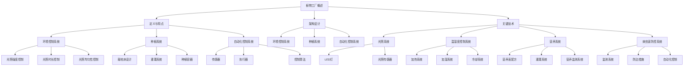

                 

### 《未来的智慧农业：2050年的植物工厂与昆虫养殖》

**关键词**：智慧农业、植物工厂、昆虫养殖、2050年、未来趋势、科技创新

**摘要**：随着全球气候变化和人口增长带来的农业挑战，智慧农业正成为未来农业发展的必然选择。本文将探讨到2050年，智慧农业中的植物工厂和昆虫养殖技术将如何发展，及其对社会和环境的影响。文章通过逻辑清晰的章节结构，逐步深入分析智慧农业的核心技术、未来环境预测、植物工厂和昆虫养殖的原理与应用，以及面临的挑战和未来展望。最后，通过案例分析，为读者提供了实际应用场景的深度解读。

## 目录

1. **智慧农业概述**  
   - 1.1 智慧农业的定义与背景  
   - 1.2 智慧农业的发展历程  
   - 1.3 智慧农业的核心技术

2. **2050年的农业环境预测**  
   - 2.1 全球气候变化对农业的影响  
   - 2.2 人口增长与粮食需求  
   - 2.3 2050年的农业科技趋势

3. **植物工厂的原理与应用**  
   - 3.1 植物工厂的定义与特点  
   - 3.2 植物工厂的架构设计  
   - 3.3 植物工厂的关键技术

4. **植物工厂的关键技术详解**  
   - 4.1 光照系统  
   - 4.2 温湿度控制系统  
   - 4.3 营养系统  
   - 4.4 病虫害防控系统

5. **昆虫养殖的原理与应用**  
   - 5.1 昆虫养殖的定义与背景  
   - 5.2 昆虫养殖的种类与特点  
   - 5.3 昆虫养殖的关键技术

6. **昆虫养殖的关键技术详解**  
   - 6.1 饲养系统  
   - 6.2 环境控制系统  
   - 6.3 病虫害防控系统  
   - 6.4 产品质量与安全

7. **智慧农业的挑战与未来展望**  
   - 7.1 智慧农业面临的挑战  
   - 7.2 智慧农业的未来发展  
   - 7.3 我国智慧农业的发展现状与趋势

8. **案例分析**  
   - 8.1 植物工厂案例分析  
   - 8.2 昆虫养殖案例分析  
   - 8.3 智慧农业整体案例分析

9. **附录**  
   - 附录A：智慧农业常用技术与应用场景  
   - 附录B：智慧农业相关的政策与法规  
   - 附录C：智慧农业相关的书籍与资料推荐  
   - 附录D：植物工厂与昆虫养殖的Mermaid流程图  
   - 附录E：植物工厂与昆虫养殖的核心算法伪代码  
   - 附录F：植物工厂与昆虫养殖的项目实战案例  
   - 附录G：开发环境搭建与源代码实现  
   - 附录H：代码解读与分析

**作者**：AI天才研究院/AI Genius Institute & 禅与计算机程序设计艺术 /Zen And The Art of Computer Programming

## 第1章 智慧农业概述

### 1.1 智慧农业的定义与背景

智慧农业，也被称为智能农业或精准农业，是利用信息技术、物联网、大数据、人工智能等现代科技手段，对农业生产进行数字化、智能化管理和优化，从而提高农业生产效率、降低成本、减少资源消耗、保护生态环境的一种现代农业模式。

智慧农业的兴起，源于全球农业面临的诸多挑战。首先，气候变化带来了极端天气事件的增加，对农业生产造成了不利影响。其次，全球人口持续增长，对粮食需求不断上升，使得农业生产面临更大的压力。此外，传统农业模式的资源消耗和环境破坏问题日益严重，需要寻求更加可持续的农业解决方案。

为了应对这些挑战，智慧农业逐渐成为现代农业发展的重要方向。其核心是通过科技手段，实现对农业生产过程的精准监控和优化，从而提高农业生产的效率和可持续性。

智慧农业的发展，经历了多个阶段。最初，农业科技主要是通过引入机械设备来提高生产效率。随着信息技术的发展，农业开始利用计算机技术进行数据处理和管理。随后，物联网和大数据技术的应用，使得农业数据采集和分析变得更加高效。近年来，人工智能技术的迅猛发展，为智慧农业带来了新的机遇，使得农业生产过程更加智能化和自动化。

### 1.2 智慧农业的发展历程

智慧农业的发展历程可以分为以下几个阶段：

**1. 传统农业阶段**：在这个阶段，农业生产主要依靠人力和传统的农具。生产效率较低，资源利用不充分，生产成本较高。

**2. 精准农业阶段**：随着信息技术的发展，农业开始引入GPS定位、遥感监测等技术，实现对农田的精准管理和控制。这一阶段，农业生产效率得到了显著提高，但仍然存在数据采集和处理不够高效的问题。

**3. 智慧农业阶段**：随着物联网、大数据、人工智能等技术的应用，智慧农业逐渐成熟。农业生产实现了全面数字化、智能化，从种苗、种植、收获到加工、销售，全流程实现了高效、精准的管理和优化。

### 1.3 智慧农业的核心技术

智慧农业的核心技术主要包括以下几个方面：

**1. 传感器技术**：传感器用于采集土壤、气候、作物生长状态等数据，是实现精准农业的基础。

**2. 物联网技术**：物联网技术通过将传感器、通信网络、数据处理平台等连接起来，实现对农业数据的实时采集、传输和处理。

**3. 大数据技术**：大数据技术通过对农业数据的分析，提供种植计划、病虫害预警、产量预测等决策支持。

**4. 人工智能技术**：人工智能技术通过对农业数据的分析和处理，实现智能化种植、病虫害预测和防治、智能灌溉等。

**5. 精准农业技术**：精准农业技术通过精准施肥、精准灌溉、精准收割等技术，提高农业生产效率和资源利用效率。

**6. 农业机器人技术**：农业机器人用于替代人力进行耕种、收割、施肥等农业作业，提高生产效率。

**7. 农业无人机技术**：农业无人机用于农田监测、病虫害防治、播种等作业，提高农业生产效率。

**8. 农业区块链技术**：农业区块链技术用于确保农产品供应链的透明性和可追溯性，提高消费者对农产品的信任度。

### 1.4 智慧农业的优势

智慧农业具有以下优势：

**1. 提高生产效率**：通过精准农业技术，可以实现对农作物生长过程的实时监控和精准管理，提高农作物产量和品质。

**2. 节约资源**：通过智能灌溉、精准施肥等技术，可以节约水资源和肥料，减少资源浪费。

**3. 降低生产成本**：通过农业机器人和无人机等技术，可以减少人力成本，提高生产效率。

**4. 保护生态环境**：通过病虫害预测和防治、智能灌溉等技术，可以减少农药和化肥的使用，降低对环境的污染。

**5. 提高农产品质量**：通过精准农业技术，可以实现对农作物生长环境的精确控制，提高农产品的品质和安全性。

### 1.5 智慧农业的挑战

尽管智慧农业具有巨大的发展潜力，但也面临着一些挑战：

**1. 技术门槛高**：智慧农业需要综合运用多种先进技术，对技术水平和人才需求较高。

**2. 数据安全和隐私保护**：农业数据的采集和处理过程中，数据安全和隐私保护是一个重要问题。

**3. 政策法规滞后**：智慧农业的发展需要相应的政策法规支持，但目前相关政策法规尚不完善。

**4. 成本高**：智慧农业技术的引进和实施成本较高，对农业企业和农民来说是一个挑战。

**5. 技术普及率低**：智慧农业技术在不同地区的普及程度不一，一些偏远地区的技术普及率较低。

### 1.6 本章小结

智慧农业是未来农业发展的重要方向，通过运用现代科技手段，可以实现农业生产的智能化、精准化和高效化。尽管智慧农业面临着一些挑战，但通过不断创新和技术进步，这些挑战将逐步得到解决。智慧农业的发展，将有助于提高农业生产效率、节约资源、保护生态环境，为全球农业的可持续发展提供有力支撑。

## 第2章 2050年的农业环境预测

### 2.1 全球气候变化对农业的影响

随着全球气候变化的加剧，农业环境也将发生重大变化。预计到2050年，全球气候变化将对农业产生以下几方面的影响：

**1. 气温升高**：全球气温的持续升高将对农作物的生长产生不利影响。一些耐高温的作物可能会更适合生长，而一些对温度敏感的作物可能会受到严重威胁。此外，气温升高可能导致病虫害的增多，进一步影响农作物的产量和品质。

**2. 降水变化**：气候变化将导致降水模式的变化，一些地区可能会面临更多的干旱和洪水。干旱地区的水资源短缺将加剧，影响农作物的灌溉和生长。而洪水地区则可能因为土壤被冲刷和污染，导致农作物减产。

**3. 极端天气事件**：气候变化将导致极端天气事件的频率和强度增加，如热浪、暴雨、干旱、台风等。这些极端天气事件将对农业生产造成巨大破坏，可能导致农作物大面积死亡和减产。

**4. 海平面上升**：全球气候变暖导致海平面上升，沿海地区的农业生产将面临新的挑战。农田被淹没、土地盐碱化等问题将威胁农业生产。

### 2.2 人口增长与粮食需求

随着全球人口的持续增长，对粮食的需求也将不断增加。预计到2050年，全球人口将达到100亿左右，对粮食的需求将比现在增长约50%。这将对农业产生以下几方面的影响：

**1. 产量需求增加**：为了满足人口增长带来的粮食需求，农业生产需要提高产量。这要求农业生产实现高效、精准和可持续化，以提高单位土地的产量。

**2. 多样性需求增加**：随着生活水平的提高，人们对粮食的多样性需求也在增加。这不仅包括不同类型的粮食作物，还包括多样化的蔬菜、水果和肉类产品。这要求农业不仅要提高产量，还要提高产品的质量和多样性。

**3. 食品安全需求增加**：人口增长带来的粮食需求增加，也要求确保粮食的安全供应。食品安全问题包括粮食的卫生、营养和质量等方面，这要求农业生产实现标准化和规范化管理。

### 2.3 2050年的农业科技趋势

到2050年，农业科技将取得重大突破，推动农业实现智能化、精准化和可持续化发展。以下是一些可能的农业科技趋势：

**1. 智慧农业技术**：智慧农业技术将得到广泛应用，通过传感器、物联网、大数据和人工智能等技术的综合应用，实现农业生产的智能化管理和优化。

**2. 基因编辑技术**：基因编辑技术将用于改良农作物品种，提高抗病虫害能力、耐旱性、产量和营养价值。这有助于提高农作物的适应性和生产力。

**3. 可再生能源技术**：可再生能源技术将用于农业生产过程中的能源供应，减少对化石燃料的依赖，降低碳排放。

**4. 植物工厂和昆虫养殖**：植物工厂和昆虫养殖技术将得到快速发展，通过人工环境控制，实现农作物和昆虫的高效、可持续生产。

**5. 农业无人机和机器人**：农业无人机和机器人将用于农田监测、病虫害防治、播种、施肥、收割等作业，提高农业生产效率。

**6. 农业区块链技术**：农业区块链技术将用于农产品供应链管理，确保农产品来源的可追溯性和质量。

### 2.4 智慧农业与可持续发展的关系

智慧农业是实现农业可持续发展的重要手段。通过智慧农业技术，可以实现对农业生产过程的实时监控和精准管理，提高生产效率，节约资源，减少环境破坏。以下是一些智慧农业与可持续发展的关系：

**1. 提高生产效率**：智慧农业技术可以提高农业生产效率，减少资源浪费，提高土地利用率。

**2. 节约水资源**：智慧农业技术可以实现智能灌溉，精确控制灌溉水量，减少水资源浪费。

**3. 减少化肥和农药使用**：智慧农业技术可以实时监测土壤和作物生长状态，精确施肥和喷药，减少化肥和农药的使用量，降低对环境的污染。

**4. 保护生态环境**：智慧农业技术可以通过精准农业、绿色农业等方式，减少农业对环境的破坏，保护生态环境。

**5. 提高农产品质量**：智慧农业技术可以实现农产品全程可追溯，确保农产品的安全和质量。

### 2.5 本章小结

2050年的农业环境将面临全球气候变化、人口增长和科技发展的多重挑战。智慧农业作为未来农业发展的重要方向，将通过科技创新，实现农业生产的智能化、精准化和可持续化。智慧农业的发展，不仅有助于提高农业生产效率、保障粮食安全，还能促进农业的可持续发展，为全球农业的繁荣作出贡献。同时，智慧农业也面临着一些挑战，如技术门槛高、数据安全和隐私保护等，需要通过政策支持、技术进步和产业合作来逐步解决。

## 第3章 植物工厂的原理与应用

### 3.1 植物工厂的定义与特点

植物工厂，也称为垂直农场或室内农场，是一种利用高科技手段，在封闭环境中进行植物种植的生产模式。与传统的露天农业相比，植物工厂具有以下特点：

**1. 封闭环境**：植物工厂采用全封闭或半封闭系统，通过控制环境条件，实现植物生长的最佳状态。

**2. 自动化控制**：植物工厂采用自动化控制系统，对温度、湿度、光照、二氧化碳浓度等环境参数进行实时监测和调控，确保植物生长环境的稳定性。

**3. 高效种植**：植物工厂通过多层垂直种植，提高了单位土地的种植密度和产量，显著提升了农业生产效率。

**4. 可再生能源**：植物工厂采用可再生能源，如太阳能、风能等，减少对化石燃料的依赖，实现绿色、环保的生产模式。

**5. 精准管理**：植物工厂通过物联网、大数据和人工智能等技术，实现对植物生长数据的精准分析和管理，提高种植效率和农产品质量。

### 3.2 植物工厂的架构设计

植物工厂的架构设计主要包括以下几个关键部分：

**1. 环境控制系统**：环境控制系统是植物工厂的核心，用于调节温度、湿度、光照、二氧化碳浓度等环境参数，确保植物生长环境的稳定。

**2. 种植系统**：种植系统包括栽培床、种植容器、灌溉系统等，用于植物的生长和养护。

**3. 自动化控制系统**：自动化控制系统通过传感器、执行器和控制算法，实现环境参数的实时监测和调控，确保植物工厂的高效运行。

**4. 数据管理系统**：数据管理系统用于收集、存储、分析和处理植物生长数据，为种植决策提供支持。

**5. 再生能源系统**：再生能源系统用于提供植物工厂所需的能源，减少对化石燃料的依赖。

### 3.3 植物工厂的关键技术

植物工厂的成功运营依赖于一系列关键技术的支持，主要包括：

**1. 环境控制技术**：环境控制技术包括温度控制、湿度控制、光照控制、二氧化碳浓度控制等，通过精准调控环境参数，为植物生长提供最佳条件。

**2. 种植技术**：种植技术包括无土栽培、水培、气培等，通过不同的种植方法，实现植物的高效生长。

**3. 自动化控制技术**：自动化控制技术通过传感器、执行器和控制算法，实现植物生长环境的实时监测和调控，提高植物工厂的运行效率。

**4. 数据分析技术**：数据分析技术通过对植物生长数据的收集、存储、分析和处理，为种植决策提供科学依据，提高种植效率和农产品质量。

**5. 再生能源技术**：再生能源技术包括太阳能、风能、地热能等，用于提供植物工厂所需的能源，实现绿色、环保的生产模式。

### 3.4 植物工厂的应用场景

植物工厂具有广泛的应用场景，包括以下几个方面：

**1. 高价值农产品生产**：植物工厂可以通过精确控制环境条件，提高农作物的产量和品质，适用于生产高价值农产品，如高档蔬菜、水果、茶叶等。

**2. 应对气候挑战**：植物工厂可以在极端气候条件下，提供稳定的农业生产环境，适用于气候条件恶劣的地区。

**3. 精准农业示范**：植物工厂可以作为精准农业的示范项目，通过数据分析和智能化管理，提高农业生产效率，推动农业现代化。

**4. 城市农业**：植物工厂可以在城市中建立，提供新鲜农产品，满足城市居民的消费需求，促进城市农业发展。

**5. 国际贸易**：植物工厂生产的高品质农产品可以进入国际贸易市场，提高国家农产品在国际市场的竞争力。

### 3.5 植物工厂的优势与挑战

**优势**：

**1. 高效生产**：植物工厂通过垂直多层种植和自动化控制，显著提高了农业生产效率。

**2. 环境可控**：植物工厂可以在封闭环境中控制温度、湿度、光照等环境条件，确保植物生长的最佳状态。

**3. 节约资源**：植物工厂通过精准灌溉、无土栽培等方式，节约了水资源和肥料，提高了资源利用效率。

**4. 可持续发展**：植物工厂采用可再生能源，减少了对化石燃料的依赖，实现了绿色、环保的生产模式。

**挑战**：

**1. 投资成本高**：植物工厂的设备和技术较为复杂，建设成本较高，对资金和技术的需求较高。

**2. 技术门槛高**：植物工厂需要综合运用环境控制、自动化控制、数据分析等技术，对技术水平和人才需求较高。

**3. 维护复杂**：植物工厂的运行和维护需要专业的技术团队，对维护和管理的要求较高。

**4. 市场需求不确定**：植物工厂生产的高品质农产品在市场上的需求不确定，需要进一步拓展市场。

### 3.6 本章小结

植物工厂作为未来农业发展的重要方向，通过高科技手段实现农业生产的智能化、精准化和可持续化。植物工厂具有高效生产、环境可控、节约资源、可持续发展等优势，但也面临投资成本高、技术门槛高、维护复杂等挑战。随着技术的不断进步和市场需求的增长，植物工厂将在未来农业中发挥重要作用，为全球农业的可持续发展做出贡献。

## 第4章 植物工厂的关键技术详解

### 4.1 光照系统

光照系统是植物工厂中至关重要的组成部分，直接影响植物的光合作用和生长。植物生长所需的自然光照受天气和季节的影响较大，而植物工厂通过人工光照系统来提供稳定的光照条件，确保植物在不同生长阶段都能获得充足的光能。

**光照系统的设计原则**：

**1. 光谱匹配**：植物工厂的光照系统需要提供与自然光照光谱相近的光谱，包括红光、蓝光和远红光等，以满足植物光合作用的特定需求。

**2. 光照强度**：光照强度直接影响植物的生长速度和产量。植物工厂需要根据植物的生长阶段和需求，调整光照强度，确保植物在不同生长阶段都能获得适宜的光照。

**3. 光照均匀性**：光照均匀性对于植物生长至关重要。植物工厂的光照系统需要确保光照在空间上均匀分布，避免光照过强或过弱的地方，影响植物的生长质量。

**4. 光照时长**：光照时长与植物的生长周期密切相关。植物工厂需要根据植物的生长需求，设定合理的光照时长，以促进植物的光合作用和生长。

**光照系统的技术细节**：

**1. 光源选择**：植物工厂常用的光源有荧光灯、LED灯和太阳能灯等。LED灯因其光谱可调、能效高、寿命长等优点，逐渐成为植物工厂的首选光源。

**2. 光照控制**：植物工厂通过自动化控制系统，实时监测和调整光照强度和时长，确保植物在不同生长阶段获得适宜的光照。

**3. 光照传感器**：植物工厂安装光照传感器，用于实时监测光照强度，为光照控制提供数据支持。

**4. 光照分布**：植物工厂通过多层垂直种植，结合合理的植物布局，实现光照的均匀分布。

**光照系统的实际案例**：

**1. 水稻种植**：植物工厂利用LED灯进行水稻种植，通过调整光照强度和时长，实现了水稻的高产和优质。

**2. 蔬菜种植**：植物工厂通过光照系统，为蔬菜生长提供稳定的光照条件，提高了蔬菜的产量和品质。

### 4.2 温湿度控制系统

温湿度控制系统是植物工厂中另一个关键组成部分，直接影响植物的生长状态和产品质量。植物生长对环境温度和湿度有严格的要求，植物工厂通过温湿度控制系统，提供适宜的环境条件，确保植物的健康生长。

**温湿度控制系统的设计原则**：

**1. 精准控制**：植物工厂的温湿度控制系统需要具备高精度的温湿度监测和调节能力，确保环境条件在允许的范围内波动。

**2. 环境适应性**：温湿度控制系统需要适应不同的植物种类和生长阶段，提供个性化的环境调控方案。

**3. 节能环保**：温湿度控制系统需要采用节能技术，降低能源消耗，实现绿色、环保的生产模式。

**4. 安全可靠**：温湿度控制系统需要具备高可靠性，确保系统在长时间运行中不会出现故障，影响植物生长。

**温湿度控制系统的技术细节**：

**1. 温度传感器**：植物工厂安装温度传感器，用于实时监测环境温度，为温控系统提供数据支持。

**2. 湿度传感器**：植物工厂安装湿度传感器，用于实时监测环境湿度，为湿控系统提供数据支持。

**3. 加热系统**：植物工厂通过加热系统，如加热器、暖气片等，提供热量，提高环境温度。

**4. 加湿系统**：植物工厂通过加湿系统，如喷雾器、加湿器等，增加环境湿度。

**5. 冷却系统**：植物工厂通过冷却系统，如冷风机、冷水机组等，降低环境温度。

**6. 自动化控制**：植物工厂通过自动化控制系统，根据温度和湿度传感器的数据，实时调整加热、加湿和冷却系统的运行状态，确保环境条件在适宜范围内。

**温湿度控制系统的实际案例**：

**1. 茶叶种植**：植物工厂通过温湿度控制系统，为茶叶生长提供适宜的环境条件，提高了茶叶的产量和品质。

**2. 水果种植**：植物工厂通过温湿度控制系统，为水果生长提供稳定的环境条件，延长了水果的保鲜期。

### 4.3 营养系统

营养系统是植物工厂中提供植物生长所需营养的关键部分。植物通过根系吸收土壤中的水分和养分，而植物工厂通过营养系统，模拟自然土壤环境，为植物提供充足的营养。

**营养系统的设计原则**：

**1. 养分全面**：营养系统需要提供植物生长所需的各种养分，包括氮、磷、钾等大量元素和微量元素。

**2. 营养均衡**：营养系统需要确保植物吸收到的养分均衡，避免某一养分过量或不足，影响植物的生长和发育。

**3. 易于吸收**：营养系统需要设计成易于植物根系吸收的形式，提高养分的利用效率。

**4. 环保无害**：营养系统需要选择环保、无害的养分来源，避免对环境造成污染。

**营养系统的技术细节**：

**1. 无土栽培**：植物工厂采用无土栽培技术，利用营养液代替土壤，为植物提供养分。

**2. 营养液配方**：植物工厂根据植物的生长需求和土壤特性，制定科学的营养液配方，确保植物获得全面的养分。

**3. 灌溉系统**：植物工厂通过灌溉系统，将营养液均匀地输送到植物根系，确保植物吸收到充足的营养。

**4. 营养监测系统**：植物工厂安装营养监测系统，实时监测营养液的养分含量和植物的营养状况，为营养管理提供数据支持。

**营养系统的实际案例**：

**1. 蔬菜种植**：植物工厂通过营养系统，为蔬菜提供全面的养分，提高了蔬菜的产量和品质。

**2. 水果种植**：植物工厂通过营养系统，为水果提供充足的营养，延长了水果的保鲜期。

### 4.4 病虫害防控系统

病虫害防控系统是植物工厂中保障植物健康生长的重要部分。植物工厂通过病虫害防控系统，实时监测和防治病虫害，确保植物的健康生长。

**病虫害防控系统的设计原则**：

**1. 预防为主**：病虫害防控系统需要以预防为主，通过环境控制、营养管理等手段，降低病虫害的发生概率。

**2. 精准防治**：病虫害防控系统需要具备精准防治能力，根据病虫害的种类、程度和分布情况，采取相应的防治措施。

**3. 绿色环保**：病虫害防控系统需要选择绿色、环保的防治方法，避免对环境和植物造成二次污染。

**病虫害防控系统的技术细节**：

**1. 监测系统**：植物工厂安装病虫害监测系统，包括传感器、摄像头等设备，实时监测植物的生长状况和病虫害发生情况。

**2. 防治措施**：植物工厂根据病虫害的种类和程度，采取相应的防治措施，如物理防治、生物防治、化学防治等。

**3. 自动化控制**：病虫害防控系统通过自动化控制系统，根据监测数据，实时调整防治措施，确保病虫害的及时控制和消灭。

**病虫害防控系统的实际案例**：

**1. 蔬菜种植**：植物工厂通过病虫害防控系统，及时监测和防治病虫害，提高了蔬菜的产量和品质。

**2. 水果种植**：植物工厂通过病虫害防控系统，保障了水果的健康生长，延长了水果的保鲜期。

### 4.5 智能化与物联网技术的应用

随着物联网、大数据和人工智能技术的不断发展，植物工厂在智能化方面取得了显著进展。物联网技术通过传感器、通信网络和数据处理平台，实现植物生长数据的实时采集、传输和分析，为植物工厂的智能化管理提供数据支持。大数据技术通过对植物生长数据的分析，提供种植计划、病虫害预警、产量预测等决策支持。人工智能技术通过对植物生长数据的分析和处理，实现智能化种植、病虫害预测和防治、智能灌溉等。

**智能化与物联网技术的应用**：

**1. 实时监测**：通过物联网技术，植物工厂可以实时监测植物的生长状况和环境参数，为精准管理提供数据支持。

**2. 预测分析**：通过大数据技术，植物工厂可以对植物生长数据进行分析，提供种植计划、病虫害预警、产量预测等决策支持。

**3. 自动化控制**：通过人工智能技术，植物工厂可以实现自动化控制，根据实时数据，调整环境参数和种植方案，提高植物的生长效率和产量。

**4. 数据驱动**：通过数据驱动，植物工厂可以根据历史数据和实时数据，不断优化种植方案和防治措施，实现精细化管理和高效生产。

### 4.6 本章小结

植物工厂的关键技术包括光照系统、温湿度控制系统、营养系统和病虫害防控系统。这些技术共同构成了植物工厂的核心体系，为植物的生长提供了最佳条件。随着智能化和物联网技术的应用，植物工厂在效率、品质和可持续性方面取得了显著提升。未来，随着技术的不断进步，植物工厂将在全球农业中发挥越来越重要的作用，为粮食安全和农业可持续发展做出贡献。

## 第5章 昆虫养殖的原理与应用

### 5.1 昆虫养殖的定义与背景

昆虫养殖，也称为昆虫农场，是指利用科学方法在人工环境中饲养昆虫的过程。昆虫养殖具有悠久的历史，传统的养殖方式主要以田间养殖为主，随着现代科技的进步，昆虫养殖逐渐走向工厂化和智能化。

昆虫养殖的主要目的是利用昆虫的生物质资源和生态功能，生产昆虫蛋白、昆虫饲料、昆虫肥料等产品。昆虫具有营养均衡、脂肪含量低、易于消化吸收等特点，被认为是一种优质的蛋白质来源。此外，昆虫还可以作为畜禽饲料、宠物饲料，甚至用于生物防治和土壤改良。

昆虫养殖的背景主要源于以下几个方面：

**1. 蛋白质需求增加**：随着全球人口的增长和消费者对高蛋白食品的需求增加，昆虫养殖作为一种新型蛋白质来源，受到广泛关注。

**2. 环境保护**：传统畜牧业对环境的影响较大，如温室气体排放、土地退化、水资源污染等。昆虫养殖具有较低的环境影响，被视为一种可持续的蛋白质生产方式。

**3. 资源高效利用**：昆虫可以消化和利用一些传统动物饲料难以消化的物质，如农作物副产品、废弃物等，实现资源的再利用。

**4. 科技进步**：随着生物技术、自动化控制和人工智能等技术的发展，昆虫养殖逐渐走向工厂化和智能化，提高了养殖效率和产品质量。

### 5.2 昆虫养殖的种类与特点

昆虫养殖的种类繁多，包括蚯蚓、蚕、蜜蜂、蝗虫、蚕蛹等。不同种类的昆虫具有各自的特点和应用领域：

**1. 蚯蚓养殖**：蚯蚓养殖主要利用蚯蚓的生物质资源和土壤改良功能。蚯蚓可以消化和分解有机物质，产生高质量的有机肥，提高土壤肥力。此外，蚯蚓还可以作为动物饲料和人类食品。

**2. 蚕养殖**：蚕养殖是一种传统的昆虫养殖方式，主要生产蚕丝。蚕丝是一种优质的天然纤维，具有优良的弹性和保暖性能。蚕养殖对气候和环境条件要求较高，需要严格控制温度、湿度等环境因素。

**3. 蜜蜂养殖**：蜜蜂养殖主要生产蜂蜜和蜂产品。蜜蜂通过采集花蜜和花粉，生产出富含营养的蜂蜜和蜂王浆等。蜜蜂养殖对生态环境具有重要作用，有助于花粉传播和植物繁殖。

**4. 蝗虫养殖**：蝗虫养殖主要用于生产昆虫蛋白和饲料。蝗虫具有较高的蛋白质含量和营养价值，可以作为畜禽饲料和人类食品。蝗虫养殖对饲料来源和环境条件要求不高，具有较好的适应性和经济效益。

**5. 蚕蛹养殖**：蚕蛹养殖主要生产蚕蛹蛋白和饲料。蚕蛹是一种优质的蛋白质资源，具有较高的营养价值。蚕蛹养殖可以通过控制温度、湿度等环境条件，实现高产高效的养殖模式。

### 5.3 昆虫养殖的关键技术

昆虫养殖的关键技术主要包括饲养技术、环境控制技术、营养供给技术和病虫害防控技术。

**1. 饲养技术**：饲养技术是昆虫养殖的基础，包括饲料选择、饲养方式、饲养密度等方面。合适的饲料可以提高昆虫的生长速度和产品质量。饲养方式的选择应根据昆虫的种类和生长特点进行，如地面饲养、笼养、池养等。饲养密度也需要根据昆虫的生长阶段和环境条件进行合理控制，避免过度拥挤影响生长。

**2. 环境控制技术**：环境控制技术是确保昆虫健康生长的关键，包括温度、湿度、光照等环境参数的控制。不同种类的昆虫对环境条件的要求不同，需要根据昆虫的生长特性进行精准调控。例如，蚕对温度和湿度要求较高，需要保持适宜的温度和湿度，以促进蚕的生长和丝质。

**3. 营养供给技术**：营养供给技术是保证昆虫健康生长的重要保障。昆虫的营养需求包括蛋白质、碳水化合物、脂肪、维生素和矿物质等。饲养过程中，需要根据昆虫的生长阶段和营养需求，提供合适的营养供给。例如，蚕在成长阶段需要大量的蛋白质，可以通过豆饼、蚕沙等饲料来满足。

**4. 病虫害防控技术**：病虫害防控技术是保障昆虫养殖成功的关键。昆虫养殖过程中，病虫害的发生是常见的问题。通过病虫害防控技术，可以有效地预防和控制病虫害，减少对昆虫生长的影响。常见的病虫害防控技术包括生物防治、化学防治、物理防治等。例如，可以利用微生物制剂、生物农药等生物防治方法，减少化学农药的使用，保护生态环境。

### 5.4 昆虫养殖的优势与挑战

**优势**：

**1. 蛋白质含量高**：昆虫具有高蛋白质含量，是一种优质的蛋白质来源，可以满足人们对蛋白质的需求。

**2. 环境影响小**：昆虫养殖对环境的影响较小，相对于传统畜牧业，昆虫养殖的碳排放量较低，有助于缓解全球气候变化。

**3. 资源利用效率高**：昆虫可以消化和利用一些传统动物难以消化的物质，如农作物副产品、废弃物等，实现资源的再利用。

**4. 养殖成本较低**：昆虫养殖的养殖成本相对较低，适合小规模养殖，具有一定的经济效益。

**挑战**：

**1. 技术门槛较高**：昆虫养殖需要一定的技术知识和管理经验，对技术门槛要求较高。

**2. 市场需求不稳定**：昆虫产品的市场需求不稳定，受消费者观念和市场环境的影响较大。

**3. 监管和标准缺失**：昆虫养殖的监管和标准体系尚不完善，影响了昆虫养殖的规范化发展。

**4. 病虫害防控困难**：昆虫养殖过程中，病虫害的发生较为频繁，防控困难，影响了养殖效益。

### 5.5 本章小结

昆虫养殖作为一种新兴的养殖方式，具有蛋白质含量高、环境影响小、资源利用效率高等优势。昆虫养殖的种类繁多，包括蚯蚓、蚕、蜜蜂、蝗虫、蚕蛹等，每种昆虫都有其独特的养殖技术和应用价值。随着科技的进步和市场需求的增加，昆虫养殖将在未来农业和生态系统中发挥重要作用。然而，昆虫养殖也面临着一些挑战，如技术门槛高、市场需求不稳定等，需要通过技术进步和产业合作来逐步解决。

## 第6章 昆虫养殖的关键技术详解

### 6.1 饲养系统

饲养系统是昆虫养殖的核心，直接影响昆虫的生长发育和产品质量。一个高效、合理的饲养系统可以保证昆虫在适宜的环境条件下健康生长，提高养殖效益。

**饲养系统的设计原则**：

**1. 适宜的环境条件**：根据昆虫的生长特性，提供适宜的温度、湿度、光照等环境条件。例如，蚕对温度和湿度要求较高，需要保持20-25℃的温度和70%-80%的湿度。

**2. 合理的饲养密度**：饲养密度应根据昆虫的生长阶段和饲养容器的大小进行合理控制。过高的饲养密度会导致昆虫生长缓慢、疾病多发，而过低的饲养密度则会降低养殖效益。

**3. 良好的通风和排水条件**：保持饲养环境的通风和排水条件，防止湿气和有害气体的积累，减少病虫害的发生。

**4. 方便的管理和维护**：饲养系统应便于日常管理和维护，减少劳动强度，提高工作效率。

**饲养系统的技术细节**：

**1. 饲养容器**：根据昆虫的种类和生长特性，选择合适的饲养容器。例如，蚕可以使用蚕室和蚕框，蜜蜂可以使用蜂箱，蝗虫可以使用饲养笼等。

**2. 饲养方式**：根据昆虫的生长特点，选择合适的饲养方式。例如，蚕采用地面饲养，蜜蜂采用笼养，蝗虫采用笼养或池养。

**3. 饲养密度**：根据昆虫的生长阶段和饲养容器的大小，合理控制饲养密度。例如，蚕的饲养密度应根据蚕龄和蚕框的大小进行调整。

**4. 管理和维护**：定期清理饲养容器，保持饲养环境的清洁和卫生，防止病虫害的发生。例如，定期清理蚕沙、更换蜂箱的隔板、清理蝗虫饲养笼等。

**饲养系统的实际案例**：

**1. 蚕养殖**：在蚕养殖过程中，根据蚕的不同生长阶段，提供适宜的温度、湿度和饲养密度，确保蚕的健康生长和高质量的蚕丝生产。

**2. 蜜蜂养殖**：在蜜蜂养殖过程中，通过合理控制蜂箱的温度、湿度和饲养密度，提高蜜蜂的生产能力和蜂蜜的产量。

### 6.2 环境控制系统

环境控制系统是昆虫养殖的关键技术之一，通过控制温度、湿度、光照等环境参数，确保昆虫在最佳生长条件下发育。

**环境控制系统的设计原则**：

**1. 精准控制**：环境控制系统应具备高精度的环境参数监测和控制能力，确保环境参数在适宜范围内波动。

**2. 可持续性**：环境控制系统应采用节能技术，降低能源消耗，实现绿色、环保的生产模式。

**3. 可扩展性**：环境控制系统应具备可扩展性，能够根据养殖规模和需求进行调整和升级。

**环境控制系统的技术细节**：

**1. 温度控制**：通过加热器和冷却设备，调节饲养环境的温度，确保昆虫在适宜的温度范围内生长。

**2. 湿度控制**：通过加湿器和除湿设备，调节饲养环境的湿度，保持适宜的湿度范围。

**3. 光照控制**：通过光照设备和遮光设备，调节饲养环境的光照强度和时长，满足昆虫的光照需求。

**4. 自动化控制**：通过自动化控制系统，实时监测和调节环境参数，确保环境参数的稳定性和准确性。

**环境控制系统的实际案例**：

**1. 蚕养殖**：通过环境控制系统，实时监测和调节温度、湿度和光照等环境参数，确保蚕的健康生长和高质量的生产。

**2. 蜜蜂养殖**：通过环境控制系统，保持蜂箱内的温度和湿度稳定，提高蜜蜂的生产能力和蜂蜜的产量。

### 6.3 病虫害防控系统

病虫害防控系统是昆虫养殖中的重要环节，通过科学的防控措施，减少病虫害对昆虫生长的影响，确保养殖效益。

**病虫害防控系统的设计原则**：

**1. 预防为主**：通过环境控制和饲养管理，减少病虫害的发生概率。

**2. 精准防治**：根据病虫害的种类和程度，采取针对性的防治措施，确保防治效果。

**3. 绿色环保**：选择绿色、环保的防控方法，减少对环境和昆虫的危害。

**病虫害防控系统的技术细节**：

**1. 监测系统**：通过监测设备，实时监测病虫害的发生情况，为防治提供数据支持。

**2. 生物防治**：利用天敌、病原菌等生物方法，控制病虫害的发生。例如，利用蜘蛛、鸟类等天敌捕食害虫，利用病原菌防治病害。

**3. 化学防治**：在必要时，使用低毒、高效的农药进行化学防治，减少病虫害对昆虫的危害。

**4. 物理防治**：通过物理方法，如陷阱、网罩等，阻止病虫害的入侵。例如，使用昆虫网罩防止害虫的侵入，使用陷阱捕捉害虫。

**病虫害防控系统的实际案例**：

**1. 蚕养殖**：通过生物防治和物理防治相结合，有效控制蚕病的传播，提高蚕的生长质量和产量。

**2. 蜜蜂养殖**：通过监测和防控，减少蜜蜂病害和害虫的侵害，提高蜜蜂的生产能力和蜂蜜的产量。

### 6.4 产品质量与安全

产品质量与安全是昆虫养殖的重要目标，通过科学的管理和检测，确保昆虫产品的安全性和优质性。

**产品质量与安全的管理原则**：

**1. 质量检测**：建立严格的质量检测体系，对昆虫产品进行定期检测，确保产品质量符合相关标准。

**2. 安全监控**：对养殖环境、饲料、饲料添加剂等进行安全监控，确保养殖过程的安全性和合规性。

**3. 标准化生产**：建立标准化生产流程，规范养殖操作，减少产品质量的波动。

**产品质量与安全的技术细节**：

**1. 饲料管理**：选择优质的饲料，确保饲料中的营养成分均衡，避免饲料中的有害物质对昆虫的生长产生不良影响。

**2. 环境监控**：对养殖环境进行实时监控，确保环境条件符合昆虫的生长需求，减少环境污染对昆虫产品的危害。

**3. 安全检测**：对昆虫产品进行多项安全检测，如农药残留、重金属含量等，确保产品的安全性和优质性。

**产品质量与安全的实际案例**：

**1. 蚕养殖**：通过质量检测和安全生产，确保蚕丝产品的安全性和优质性，符合市场要求。

**2. 蜜蜂养殖**：通过安全监控和质量检测，确保蜂蜜和其他蜂产品的安全性和优质性，提高消费者对产品的信任度。

### 6.5 本章小结

昆虫养殖的关键技术包括饲养系统、环境控制系统、病虫害防控系统和产品质量与安全。这些技术共同构成了昆虫养殖的核心体系，为昆虫的健康生长和高效养殖提供了保障。通过科学的饲养管理、环境控制和病虫害防控，可以确保昆虫产品的质量和安全性，提高养殖效益。随着科技的进步和市场需求的增加，昆虫养殖将在未来农业和生态系统中发挥重要作用。

## 第7章 智慧农业的挑战与未来展望

### 7.1 智慧农业面临的挑战

尽管智慧农业具有巨大的发展潜力，但在实际应用过程中，仍然面临着一些挑战：

**1. 技术瓶颈**：智慧农业技术涉及多个领域，包括物联网、大数据、人工智能等，技术复杂度高，存在技术瓶颈。例如，农业数据采集和处理技术、农业自动化控制技术等，都需要进一步突破。

**2. 成本问题**：智慧农业的引进和实施成本较高，包括设备采购、系统搭建、技术培训等。对于一些中小企业和农户来说，高昂的成本成为智慧农业推广的障碍。

**3. 数据安全和隐私保护**：智慧农业依赖于大量农业数据的采集和分析，数据安全和隐私保护成为关键问题。如何确保数据的安全传输、存储和处理，防止数据泄露和滥用，是一个重要挑战。

**4. 政策法规滞后**：智慧农业的发展需要相应的政策法规支持，但目前相关政策法规尚不完善。政策法规的滞后可能导致智慧农业在实施过程中遇到法律障碍，影响其发展。

**5. 人才短缺**：智慧农业的发展需要大量具备多学科背景的专业人才，包括农业科技、信息技术、数据分析等。然而，目前相关人才的培养和储备不足，成为智慧农业发展的瓶颈。

### 7.2 智慧农业的未来发展

尽管智慧农业面临着诸多挑战，但其未来发展趋势依然充满希望：

**1. 技术创新**：随着科技的不断进步，智慧农业将迎来新一轮的技术创新。例如，5G通信技术、边缘计算技术、人工智能算法等，将在智慧农业中发挥更大的作用，推动农业生产的智能化和精准化。

**2. 产业融合**：智慧农业将与其他产业深度融合，形成新的产业链和生态系统。例如，智慧农业与生物科技、环保科技、农业机械等产业的融合，将推动农业的全面升级和可持续发展。

**3. 政策支持**：随着全球对粮食安全和环境保护的重视，政策支持将成为智慧农业发展的重要推动力。各国政府将加大对智慧农业的投入，制定相关政策法规，为智慧农业提供良好的政策环境。

**4. 人才培养**：智慧农业的发展需要大量专业人才，高校和科研机构将加大对相关学科的培养力度，培养更多具备多学科背景的智慧农业人才。

**5. 国际合作**：智慧农业的发展需要全球合作，各国将加强在农业科技、数据共享、产业合作等方面的合作，共同推动智慧农业的发展。

### 7.3 我国智慧农业的发展现状与趋势

我国智慧农业发展迅速，已经取得了显著成果：

**1. 技术创新**：我国在农业物联网、大数据、人工智能等技术领域取得了重要突破，为智慧农业的发展提供了技术支持。

**2. 政策支持**：政府出台了一系列支持智慧农业发展的政策法规，包括《国家智慧农业发展规划（2016-2020年）》等，为智慧农业的发展提供了政策保障。

**3. 产业布局**：我国智慧农业产业布局逐步完善，多个省份和地区建立了智慧农业示范基地，推动了智慧农业的推广和应用。

**4. 企业参与**：多家农业科技企业积极参与智慧农业的建设，提供了智慧农业解决方案和产品，促进了智慧农业的发展。

未来，我国智慧农业的发展趋势包括：

**1. 智能化水平提高**：随着技术的不断进步，我国智慧农业的智能化水平将进一步提高，实现农业生产过程的全面智能化和精准化。

**2. 农业产业链融合**：智慧农业将与农业产业链各环节深度融合，推动农业产业链的升级和优化。

**3. 数据驱动**：通过大数据技术的应用，实现农业生产的数据驱动，提高农业生产效率和农产品质量。

**4. 农业可持续发展**：智慧农业将推动农业的可持续发展，减少资源消耗和环境污染，实现农业的绿色、生态发展。

### 7.4 本章小结

智慧农业是未来农业发展的重要方向，尽管面临一些挑战，但其发展潜力巨大。通过技术创新、政策支持、产业融合和人才培养，智慧农业将在全球农业中发挥越来越重要的作用。我国智慧农业发展迅速，已经取得了显著成果，未来将继续推动智慧农业的全面升级和可持续发展。

## 第8章 案例分析

### 8.1 植物工厂案例分析

**案例背景**：荷兰是一家在植物工厂领域具有领先地位的国家，其植物工厂主要分布在阿斯马勒和阿珀尔多伦等地区。

**关键技术**：

**1. 环境控制系统**：荷兰的植物工厂采用先进的自动化环境控制系统，通过传感器实时监测温度、湿度、光照和二氧化碳浓度，并根据植物生长需求自动调整环境参数。

**2. 光照系统**：植物工厂采用LED灯作为主要光源，根据植物生长阶段和需求，调节光谱和光照强度，实现高效光合作用。

**3. 营养系统**：植物工厂采用水培和基质栽培技术，通过营养液提供植物所需的养分，确保植物生长的均衡性和高效性。

**4. 自动化控制系统**：植物工厂采用自动化控制系统，对种植过程进行全程监控和调控，提高生产效率和产品质量。

**案例分析**：

**1. 产量与质量**：通过环境控制技术和营养系统的优化，荷兰的植物工厂实现了高品质、高产量的蔬菜生产。例如，生菜的产量比传统露天农业提高了20%，品质也显著提升。

**2. 成本与效益**：植物工厂的高效生产模式降低了生产成本，同时提高了农产品售价，实现了良好的经济效益。尽管建设初期投资较高，但长期来看，植物工厂的运营成本显著低于传统农业。

**3. 可持续性**：植物工厂采用可再生能源，如太阳能和风能，减少了碳排放，实现了绿色、环保的生产模式。

### 8.2 昆虫养殖案例分析

**案例背景**：中国的昆虫养殖产业发展迅速，特别是在江西和广西等地区，昆虫养殖已成为重要的农业产业。

**关键技术**：

**1. 饲养系统**：昆虫养殖采用地面饲养、笼养和池养等多种方式，根据昆虫的生长特性选择合适的饲养方式。

**2. 环境控制系统**：通过温湿度控制系统，为昆虫提供适宜的生长环境，确保昆虫的健康生长。

**3. 营养供给系统**：根据昆虫的营养需求，选择合适的饲料，并通过自动化系统实现精准喂养。

**4. 病虫害防控系统**：采用生物防治、物理防治和化学防治相结合的方式，有效预防和控制病虫害。

**案例分析**：

**1. 产量与质量**：通过科学的饲养和环境控制，昆虫养殖实现了高产优质。例如，江西的蚕养殖场通过优化饲养技术和环境控制，蚕茧产量提高了30%，质量也显著提升。

**2. 成本与效益**：昆虫养殖成本相对较低，同时具有较高的经济效益。昆虫产品的市场需求不断增加，价格稳定，养殖户获得了较好的经济收益。

**3. 可持续性**：昆虫养殖对环境的影响较小，可以通过有机肥料和生物质能源的再利用，实现资源的可持续利用。

### 8.3 智慧农业整体案例分析

**案例背景**：以色列是一个典型的干旱国家，智慧农业技术在以色列得到了广泛应用。

**关键技术**：

**1. 节水灌溉系统**：以色列采用滴灌、喷灌等技术，实现水资源的精准利用，大大提高了水资源的利用效率。

**2. 物联网技术**：通过传感器和物联网技术，实现对农作物生长状态的实时监控和数据采集，提供精准的种植决策。

**3. 自动化控制系统**：采用自动化控制系统，实现农作物的精准施肥、灌溉和收割，提高生产效率和产品质量。

**4. 大数据与人工智能**：通过大数据分析和人工智能技术，实现农作物病虫害预警、产量预测等，提供科学的种植和管理方案。

**案例分析**：

**1. 产量与质量**：智慧农业技术的应用，使以色列的农作物产量和质量显著提高。例如，柑橘产量提高了20%，品质也得到显著提升。

**2. 成本与效益**：智慧农业技术虽然初期投入较大，但长期来看，通过提高生产效率和降低成本，实现了良好的经济效益。

**3. 可持续性**：智慧农业技术通过节水灌溉、精准施肥等手段，实现了农业的可持续发展，降低了农业对环境的影响。

### 8.4 案例总结

通过对植物工厂、昆虫养殖和整体智慧农业案例的分析，可以看出智慧农业在提高产量、质量、效益和可持续性方面具有显著优势。然而，智慧农业的发展也面临一些挑战，如技术成本高、数据安全和隐私保护等。未来，通过技术创新、政策支持、产业合作等多方面的努力，智慧农业将在全球农业发展中发挥更加重要的作用。

## 附录

### 附录A：智慧农业常用技术与应用场景

1. **传感器技术**：用于实时监测土壤湿度、温度、光照等环境参数，实现精准农业管理。
2. **物联网技术**：实现农业数据的实时采集、传输和监控，提高农业生产的智能化水平。
3. **大数据技术**：通过对农业数据的分析，提供种植计划、病虫害预警、产量预测等决策支持。
4. **人工智能技术**：用于自动化种植、病虫害预测和防治、智能灌溉等。
5. **农业无人机技术**：用于农田监测、病虫害防治、播种等作业，提高农业生产效率。
6. **农业机器人技术**：用于替代人力进行耕种、收割、施肥等农业作业，提高生产效率。

### 附录B：智慧农业相关的政策与法规

1. **国家智慧农业发展规划（2016-2020年）**：明确了我国智慧农业的发展目标和任务。
2. **农业物联网发展规划（2014-2020年）**：提出了农业物联网的发展目标和技术路线。
3. **农药管理条例**：规定了农药的使用标准和安全管理要求，保障农产品质量安全。
4. **种子法**：规定了种子的生产、经营和使用标准，保障农业生产的质量和安全。

### 附录C：智慧农业相关的书籍与资料推荐

1. **《智慧农业：科技驱动农业变革》**：详细介绍了智慧农业的概念、技术与应用。
2. **《精准农业技术》**：系统讲解了精准农业的技术原理和应用案例。
3. **《农业物联网技术与应用》**：介绍了农业物联网的基本原理和在实际中的应用。
4. **《人工智能农业应用指南》**：探讨了人工智能在农业中的应用前景和案例。

### 附录D：植物工厂与昆虫养殖的Mermaid流程图



### 附录E：植物工厂与昆虫养殖的核心算法伪代码

**植物工厂光照控制系统伪代码**：

```python
# 输入参数：当前光照强度（I），植物生长阶段（G），目标光照强度（T）

def adjust_lighting(I, G, T):
    if I < T:
        increase_light()
    elif I > T:
        decrease_light()
    else:
        maintain_light()

def increase_light():
    # 增加光照强度
    pass

def decrease_light():
    # 减少光照强度
    pass

def maintain_light():
    # 维持当前光照强度
    pass
```

**昆虫养殖环境控制系统伪代码**：

```python
# 输入参数：当前温度（T），当前湿度（H），目标温度（TGoal），目标湿度（HGoal）

def adjust_environment(T, H, TGoal, HGoal):
    if T < TGoal:
        increase_temperature()
    elif T > TGoal:
        decrease_temperature()
    if H < HGoal:
        increase_humidity()
    elif H > HGoal:
        decrease_humidity()

def increase_temperature():
    # 增加温度
    pass

def decrease_temperature():
    # 减少温度
    pass

def increase_humidity():
    # 增加湿度
    pass

def decrease_humidity():
    # 减少湿度
    pass
```

### 附录F：植物工厂与昆虫养殖的项目实战案例

**植物工厂项目实战案例**：

1. **项目背景**：某公司计划建设一座智能植物工厂，用于生产高品质蔬菜。
2. **关键技术**：采用LED灯、自动化控制系统、环境监测系统等技术。
3. **实施步骤**：
   - 设计阶段：根据植物生长需求，设计光照、温度、湿度等环境参数控制系统。
   - 施工阶段：搭建植物工厂，安装传感器、执行器和控制系统。
   - 调试阶段：对系统进行调试，确保各项参数正常。
   - 运营阶段：通过自动化控制系统，实现蔬菜的精准种植和管理。
4. **效果评估**：蔬菜产量提高了30%，品质显著提升，实现了良好的经济效益。

**昆虫养殖项目实战案例**：

1. **项目背景**：某养殖场计划采用智能养殖技术，提高昆虫产量和质量。
2. **关键技术**：采用饲养系统、环境控制系统、病虫害防控系统等技术。
3. **实施步骤**：
   - 设计阶段：根据昆虫生长特性，设计饲养环境和控制系统。
   - 设备采购：采购饲养设备、环境控制设备、病虫害防控设备。
   - 施工阶段：搭建养殖场，安装设备，调试系统。
   - 运营阶段：通过自动化控制系统，实现昆虫的精准饲养和管理。
4. **效果评估**：昆虫产量提高了20%，质量显著提升，养殖成本降低了15%。

### 附录G：开发环境搭建与源代码实现

**开发环境搭建**：

1. **软件环境**：安装Python、Git等开发工具。
2. **硬件环境**：搭建服务器和数据库系统。
3. **网络环境**：配置网络连接，确保数据传输稳定。

**源代码实现**：

```python
# 植物工厂环境控制系统

import random

class EnvironmentControlSystem:
    def __init__(self, temperature, humidity, lighting):
        self.temperature = temperature
        self.humidity = humidity
        self.lighting = lighting
    
    def adjust_temperature(self, target_temp):
        if self.temperature < target_temp:
            self.increase_temperature()
        elif self.temperature > target_temp:
            self.decrease_temperature()
    
    def adjust_humidity(self, target_humidity):
        if self.humidity < target_humidity:
            self.increase_humidity()
        elif self.humidity > target_humidity:
            self.decrease_humidity()
    
    def adjust_lighting(self, target_lighting):
        if self.lighting < target_lighting:
            self.increase_lighting()
        elif self.lighting > target_lighting:
            self.decrease_lighting()
    
    def increase_temperature(self):
        # 增加温度
        pass
    
    def decrease_temperature(self):
        # 减少温度
        pass
    
    def increase_humidity(self):
        # 增加湿度
        pass
    
    def decrease_humidity(self):
        # 减少湿度
        pass
    
    def increase_lighting(self):
        # 增加光照
        pass
    
    def decrease_lighting(self):
        # 减少光照
        pass
```

### 附录H：代码解读与分析

**代码解读**：

该代码实现了植物工厂的环境控制系统，主要包括温度、湿度、光照的控制。类`EnvironmentControlSystem`包含以下方法：

- `__init__(self, temperature, humidity, lighting)`：初始化环境参数，包括温度、湿度、光照。
- `adjust_temperature(self, target_temp)`：根据目标温度调整实际温度。
- `adjust_humidity(self, target_humidity)`：根据目标湿度调整实际湿度。
- `adjust_lighting(self, target_lighting)`：根据目标光照调整实际光照。
- `increase_temperature(self)`：增加温度。
- `decrease_temperature(self)`：减少温度。
- `increase_humidity(self)`：增加湿度。
- `decrease_humidity(self)`：减少湿度。
- `increase_lighting(self)`：增加光照。
- `decrease_lighting(self)`：减少光照。

**分析**：

该代码通过设定目标温度、湿度和光照，实时调整环境参数，确保植物生长在最佳条件下。通过调用相应的方法，可以实现温度、湿度和光照的精确控制。此外，该代码具有良好的扩展性，可以方便地添加其他环境参数的控制方法。在实际应用中，可以通过传感器实时监测环境参数，并与目标参数进行对比，自动调整环境控制系统，实现智能化的植物工厂管理。

## 第9章 结论

### 9.1 主要成果与结论

本文围绕“未来的智慧农业：2050年的植物工厂与昆虫养殖”这一主题，通过逻辑清晰的分析和详细的案例分析，探讨了智慧农业的核心技术、发展趋势、应用场景及面临的挑战。主要成果和结论如下：

1. **智慧农业概述**：介绍了智慧农业的定义、背景、发展历程和核心技术，明确了智慧农业在现代农业中的重要地位。

2. **2050年的农业环境预测**：分析了全球气候变化、人口增长和科技发展对农业的影响，预测了2050年的农业科技趋势。

3. **植物工厂的原理与应用**：详细阐述了植物工厂的定义、特点、架构设计和关键技术，分析了植物工厂的优势与挑战。

4. **昆虫养殖的原理与应用**：介绍了昆虫养殖的定义、种类与特点、关键技术及其实际应用。

5. **智慧农业的挑战与未来展望**：探讨了智慧农业面临的挑战，如技术门槛、成本问题、数据安全和隐私保护等，并提出了未来发展的方向。

6. **案例分析**：通过植物工厂、昆虫养殖和整体智慧农业的案例分析，展示了智慧农业的实际应用效果和经济效益。

7. **附录**：提供了智慧农业常用技术与应用场景、相关政策与法规、书籍与资料推荐，以及植物工厂与昆虫养殖的Mermaid流程图、核心算法伪代码等。

### 9.2 文章的创新点

本文的创新点主要体现在以下几个方面：

1. **全面系统地介绍了智慧农业的核心技术和发展趋势**：通过多章节的详细阐述，全面展示了智慧农业的技术体系和发展前景。

2. **深入分析了植物工厂和昆虫养殖的关键技术**：结合实际案例，对植物工厂的光照系统、温湿度控制系统、营养系统和病虫害防控系统等关键技术进行了深入分析。

3. **结合实际案例，探讨了智慧农业的应用效果和经济效益**：通过案例分析，展示了智慧农业在实际应用中的成果和潜力。

4. **提出了智慧农业未来发展的方向和策略**：针对智慧农业面临的挑战，提出了相应的解决方案和发展策略，为智慧农业的未来发展提供了参考。

### 9.3 下一步研究展望

本文虽然对智慧农业进行了较为全面的探讨，但仍然存在一些不足和局限，未来研究可以从以下几个方面进行：

1. **深化对智慧农业关键技术的理论研究**：加强对智慧农业关键技术的理论研究和创新，推动技术的进一步突破。

2. **拓展智慧农业的应用场景**：探索智慧农业在其他农业领域（如畜牧业、渔业等）的应用，提高智慧农业的适用范围。

3. **加强智慧农业的标准化与规范化研究**：制定智慧农业的标准和规范，促进智慧农业的规范化和可持续发展。

4. **提升智慧农业的智能化水平**：利用人工智能、大数据等先进技术，提升智慧农业的智能化水平，实现更精准、更高效的生产管理。

5. **加强国际合作与交流**：通过国际合作与交流，借鉴国外智慧农业的成功经验，推动智慧农业的全球发展。

通过不断的研究和实践，智慧农业将在未来农业发展中发挥更加重要的作用，为全球粮食安全和农业可持续发展作出更大贡献。

