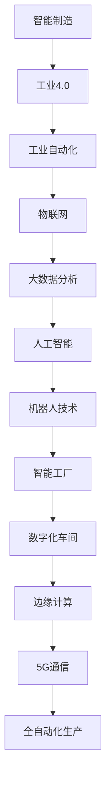

                 

### 引言

**2050年的智能工厂与数字化车间**

在人类历史上的长河中，制造业一直是推动社会进步和经济发展的关键动力。从手工业到机械化生产，再到自动化和智能化，每一次技术的飞跃都极大地改变了生产方式，提高了生产效率，降低了成本。随着信息技术的飞速发展，特别是物联网（IoT）、人工智能（AI）、大数据分析和机器人技术的突破，我们正站在一个全新的制造业革命的前沿。这场革命，即将引领我们进入一个全新的时代——2050年的智能工厂与数字化车间。

### 关键词

- **智能制造**
- **智能工厂**
- **数字化车间**
- **物联网（IoT）**
- **人工智能（AI）**
- **大数据分析**
- **机器人技术**
- **边缘计算**
- **5G通信技术**

### 摘要

本文旨在探讨2050年的智能工厂与数字化车间的发展趋势、关键技术及其对制造业的深远影响。文章首先概述了智能制造的基本概念和背景，介绍了智能制造的关键技术，如物联网、大数据分析和人工智能等。接着，文章详细阐述了智能工厂和数字化车间的架构，包括物理层、感知层、通信层和决策层的组成。随后，文章展望了2050年智能工厂的特征，包括全自动化生产、高效能源利用和网络化协同等，并探讨了未来智能工厂面临的挑战和机遇。文章还通过实际项目案例，展示了智能工厂和数字化车间的实施步骤和技术应用。最后，文章总结了未来智能工厂的发展策略，提出了政策与标准、企业转型路径和产业链生态建设等方面的建议。

### 目录大纲

#### 第一部分：智能制造基础理论

##### 第1章：智能制造概述

- **1.1 智能制造的定义与背景**
  - **智能制造的核心概念**
  - **智能制造的发展历程**
  - **智能制造与工业4.0的关系**
- **1.2 智能制造的关键技术**
  - **物联网（IoT）**
  - **大数据分析**
  - **人工智能与机器学习**
  - **机器人技术**
- **1.3 智能制造的应用场景**
  - **生产线自动化**
  - **智能质量监控**
  - **能源管理**
  - **供应链优化**

##### 第2章：智能工厂架构

- **2.1 智能工厂的整体架构**
  - **物理层**
  - **感知层**
  - **通信层**
  - **决策层**
- **2.2 智能工厂的硬件与软件基础**
  - **工业机器人**
  - **智能传感器**
  - **自动化控制系统**
  - **数据管理平台**
- **2.3 智能工厂的运营与管理**
  - **生产计划优化**
  - **设备健康管理**
  - **人力资源配置**
  - **供应链整合**

##### 第3章：数字化车间

- **3.1 数字化车间的概念**
  - **数字化车间的特点**
  - **数字化车间的目标**
  - **数字化车间与传统车间的区别**
- **3.2 数字化车间的关键技术**
  - **数字化生产线**
  - **智能仓储系统**
  - **远程监控与维护**
  - **虚拟现实（VR）与增强现实（AR）**
- **3.3 数字化车间的实施步骤**
  - **需求分析**
  - **系统规划**
  - **系统集成与测试**
  - **持续优化与升级**

#### 第二部分：2050年的智能工厂与数字化车间

##### 第4章：未来智能工厂展望

- **4.1 2050年的智能工厂趋势**
  - **全自动化生产**
  - **高效能源利用**
  - **智能制造生态圈**
- **4.2 2050年的智能工厂特征**
  - **高度智能化**
  - **网络化协同**
  - **数据驱动决策**
- **4.3 2050年的智能工厂挑战与机遇**
  - **技术创新**
  - **人才培养**
  - **法律法规与标准**

##### 第5章：2050年数字化车间创新技术

- **5.1 先进制造技术**
  - **3D打印**
  - **电子束焊接**
  - **智能复合制造**
- **5.2 新型材料应用**
  - **超导材料**
  - **纳米材料**
  - **生物材料**
- **5.3 智能制造系统集成**
  - **边缘计算**
  - **云计算与大数据**
  - **5G通信技术**

##### 第6章：未来智能工厂案例分析

- **6.1 案例研究一：智能工厂实践案例**
  - **项目背景**
  - **解决方案**
  - **实施效果**
  - **经验教训**
- **6.2 案例研究二：数字化车间转型之路**
  - **企业现状**
  - **数字化转型策略**
  - **数字化成效**
  - **持续改进方向**

##### 第7章：未来智能工厂的发展策略

- **7.1 智能制造政策与标准**
  - **国家政策支持**
  - **行业标准化**
  - **国际合作**
- **7.2 企业智能化转型路径**
  - **企业战略规划**
  - **技术选型与投资**
  - **人才培养与引进**
- **7.3 智能制造产业链生态**
  - **产业链上下游合作**
  - **创新生态系统建设**
  - **全球供应链优化**

#### 附录

##### 附录A：智能工厂与数字化车间技术指南

- **A.1 智能工厂与数字化车间常用技术**
  - **物联网（IoT）**
  - **云计算与大数据**
  - **人工智能（AI）**
  - **机器人技术**
- **A.2 智能制造相关标准与规范**
  - **ISO/IEC 27001**
  - **IEC 62443**
  - **ISO 50001**
  - **其他相关标准**
- **A.3 智能制造参考书籍与文献**
  - **《智能工厂：构建数字化制造的未来》**
  - **《数字化车间：智能工厂的基石》**
  - **其他推荐书籍**

### 核心概念与联系

在探讨2050年的智能工厂与数字化车间之前，我们需要理解一些核心概念和它们之间的联系。以下是智能制造与工业4.0、物联网、大数据分析、人工智能、机器人技术等关键概念的Mermaid流程图，展示它们如何相互作用，共同构建未来的智能工厂与数字化车间。



**智能制造**：智能制造是指通过将物联网、大数据、人工智能、机器人技术等现代信息技术应用于生产过程中，实现生产过程的自动化、智能化和优化。智能制造的目标是提高生产效率、降低成本、提升产品质量、增强企业的竞争力。

**工业4.0**：工业4.0是德国提出的工业革命4.0，它旨在通过信息技术和物理系统的深度融合，实现工业生产的智能化和自动化。工业4.0的核心是“集成”，通过信息物理系统（Cyber-Physical Systems, CPS）将生产设备和信息系统无缝连接。

**工业自动化**：工业自动化是指通过使用机器、设备和控制系统自动执行工业生产过程，减少人工干预。自动化技术包括机器人、自动化生产线、自动化物流等。

**物联网（IoT）**：物联网是指通过各种传感器和设备将物理世界连接到互联网，实现设备与设备、设备与人之间的信息交换和通信。

**大数据分析**：大数据分析是指使用复杂的数据处理技术和算法，从海量数据中提取有价值的信息和知识。

**人工智能与机器学习**：人工智能是指模拟人类智能的技术和系统，机器学习是人工智能的一个分支，通过从数据中学习模式和规律，实现智能决策和预测。

**机器人技术**：机器人技术包括工业机器人、服务机器人、无人机等，它们能够在各种环境中执行复杂的任务。

**智能工厂**：智能工厂是指通过智能化技术实现全自动化、高效化、精益化的生产模式，实现生产过程的实时监控、数据分析、优化控制。

**数字化车间**：数字化车间是指通过数字化技术实现生产过程的全面数字化，包括生产数据采集、分析、优化和自动化执行。

**边缘计算**：边缘计算是指将数据处理和分析从云端转移到网络的边缘，实现实时数据处理和智能决策。

**5G通信技术**：5G通信技术是指第五代移动通信技术，它具有高速率、低延迟、大连接的特点，能够支持大规模物联网设备的接入和实时通信。

通过以上流程图，我们可以清晰地看到智能制造、工业4.0、物联网、大数据分析、人工智能、机器人技术等核心概念之间的联系，以及它们如何共同构建未来的智能工厂与数字化车间。

### 核心算法原理讲解

在智能工厂和数字化车间的构建过程中，人工智能和机器学习算法起着至关重要的作用。这些算法能够从海量数据中提取有价值的信息，实现生产过程的实时监控、数据分析、优化控制，从而提高生产效率和产品质量。以下将详细讲解机器学习算法的基本原理，使用伪代码进行说明。

#### 机器学习算法基本框架

机器学习算法的基本框架可以分为以下几个步骤：

1. **模型初始化**：选择合适的模型结构和参数初始化。
2. **数据训练**：使用训练数据集对模型进行训练，通过迭代优化模型参数。
3. **模型评估**：使用测试数据集对训练好的模型进行评估，验证模型的性能。
4. **模型应用**：将训练好的模型应用于实际问题，如生产计划优化、质量监控等。

**伪代码：**

```python
// 伪代码：机器学习算法基本框架

// 初始化模型
initialize_model()

// 训练模型
for each epoch:
    for each sample in training_data:
        compute_gradient(sample)
    update_model_params()

// 评估模型
evaluate_performance(test_data)

// 应用模型
apply_model(solution_data)
```

#### 神经网络算法

神经网络是机器学习中的一个重要分支，它通过模拟人脑神经元的工作方式，实现复杂的数据分析和模式识别。以下是神经网络算法的基本原理和伪代码说明。

**神经网络基本原理：**

神经网络由多个层组成，包括输入层、隐藏层和输出层。每层由多个神经元（节点）组成，神经元之间通过权重连接。神经元的激活函数用于确定神经元是否被激活，常见的激活函数包括线性激活函数、Sigmoid函数、ReLU函数等。

**伪代码：**

```python
// 伪代码：神经网络算法

// 定义神经网络结构
initialize_neural_network()

// 前向传播
for each layer in network:
    for each neuron in layer:
        compute_input(neuron)
        apply_activation_function(neuron)

// 反向传播
for each layer in network (in reverse order):
    for each neuron in layer:
        compute_gradient(neuron)
        update_weights(neuron)

// 模型评估
evaluate_performance(test_data)
```

#### 决策树算法

决策树是一种简单但强大的机器学习算法，它通过一系列的判断条件来对数据进行分类或回归。决策树的每个节点代表一个判断条件，每个分支代表一个可能的输出结果。

**伪代码：**

```python
// 伪代码：决策树算法

// 构建决策树
build_decision_tree(training_data)

// 预测
predict_output(data, decision_tree)
```

#### 支持向量机算法

支持向量机（SVM）是一种分类算法，它通过找到一个最佳的超平面，将不同类别的数据分隔开来。SVM的核心是求解一个优化问题，找到能够最大化分类间隔的决策边界。

**伪代码：**

```python
// 伪代码：支持向量机算法

// 定义优化问题
define_optimization_problem()

// 求解优化问题
solve_optimization_problem()

// 获取决策边界
get_decision_boundary()

// 预测
predict_output(data, decision_boundary)
```

通过以上核心算法原理的讲解，我们可以看到机器学习算法在智能工厂和数字化车间中的应用前景。这些算法能够帮助工厂实现自动化生产、质量监控、能源管理等关键功能，为制造业的智能化转型提供强大的技术支持。

### 数学模型和数学公式讲解

在智能制造和智能工厂的构建过程中，数学模型和公式扮演着至关重要的角色。它们用于描述复杂的生产过程，优化资源分配，预测生产趋势，并支持实时决策。以下是几个关键数学模型和公式的详细讲解。

#### 最优化算法

最优化算法是一种用于寻找函数最大值或最小值的数学方法，在智能制造中用于生产计划优化、设备调度、资源分配等问题。以下是常用的最优化算法之一——梯度下降法的数学模型和公式。

**梯度下降法数学模型：**

$$
\min_{\theta} \frac{1}{m} \sum_{i=1}^{m} (h_\theta(x^{(i)}) - y^{(i)})^2
$$

其中，$h_\theta(x^{(i)})$ 是假设函数，$\theta$ 是模型参数，$m$ 是样本数量，$y^{(i)}$ 是实际值。

**梯度下降公式：**

$$
\theta_j := \theta_j - \alpha \frac{\partial}{\partial \theta_j} J(\theta)
$$

其中，$\alpha$ 是学习率，$J(\theta)$ 是损失函数，$\frac{\partial}{\partial \theta_j} J(\theta)$ 是损失函数关于参数 $\theta_j$ 的梯度。

**解释：**

上述公式表示通过不断更新模型参数 $\theta_j$，以最小化损失函数 $J(\theta)$。学习率 $\alpha$ 控制了参数更新的步长，过大会导致收敛缓慢，过小则收敛速度过慢。

#### 线性回归

线性回归是一种用于预测数值型变量的统计方法，在智能制造中用于预测生产量、能耗等指标。以下是线性回归的数学模型和公式。

**线性回归模型：**

$$
y = \theta_0 + \theta_1 x
$$

其中，$y$ 是预测值，$x$ 是自变量，$\theta_0$ 和 $\theta_1$ 是模型参数。

**最小二乘法公式：**

$$
\theta_1 = \frac{\sum_{i=1}^{m} (x^{(i)} - \bar{x})(y^{(i)} - \bar{y})}{\sum_{i=1}^{m} (x^{(i)} - \bar{x})^2}
$$

其中，$\bar{x}$ 和 $\bar{y}$ 分别是 $x$ 和 $y$ 的均值，$m$ 是样本数量。

**解释：**

上述公式通过最小化误差平方和，计算线性回归模型的参数 $\theta_0$ 和 $\theta_1$，从而建立 $x$ 和 $y$ 之间的线性关系。

#### 支持向量机（SVM）

支持向量机是一种用于分类的机器学习算法，在智能制造中用于产品质量检测、故障诊断等问题。以下是支持向量机的数学模型和公式。

**支持向量机模型：**

$$
\min_{\theta, \xi} \frac{1}{2} \| \theta \|^2 + C \sum_{i=1}^{m} \xi_i
$$

其中，$\theta$ 是模型参数，$\xi_i$ 是松弛变量，$C$ 是惩罚参数。

**决策边界公式：**

$$
w \cdot x + b = 0
$$

其中，$w$ 是权重向量，$b$ 是偏置项。

**解释：**

上述公式通过最小化损失函数，求解最优分类超平面。松弛变量 $\xi_i$ 用于处理非线性和异常点，惩罚参数 $C$ 控制了分类边界和异常点的平衡。

通过以上数学模型和公式的讲解，我们可以看到数学在智能工厂和智能制造中的关键作用。这些模型和公式为智能制造提供了强大的理论基础，帮助实现生产过程的优化和智能化。

### 项目实战

在实际项目中，构建智能工厂和数字化车间是一个复杂且多维的过程，需要综合考虑硬件、软件、数据和管理等多个方面。以下是一个智能工厂项目实战的详细说明，包括开发环境搭建、源代码实现、代码解读与分析。

#### 项目背景

某制造企业计划通过构建智能工厂，实现生产线的自动化和优化，提高生产效率和产品质量。项目目标包括：

- 实现生产线的全自动化控制
- 建立智能质量监控系统
- 实现能源管理系统的优化
- 构建数字化供应链管理系统

#### 开发环境搭建

为了实现项目的目标，需要搭建一个集成的开发环境，包括以下组件：

- **硬件环境**：
  - 工业机器人
  - 智能传感器
  - 自动化控制系统
  - 高速网络设备

- **软件环境**：
  - 操作系统：Linux服务器
  - 开发工具：Python、TensorFlow、PyTorch、Kafka
  - 数据库：MySQL、PostgreSQL
  - 实时数据处理平台：Kubernetes、Docker

#### 源代码实现

项目核心模块的实现代码如下：

**1. 生产计划优化模块**

```python
import tensorflow as tf

# 初始化模型
model = tf.keras.Sequential([
    tf.keras.layers.Dense(units=1, input_shape=[7])
])

# 编译模型
model.compile(optimizer='adam', loss='mse')

# 训练模型
model.fit(x_train, y_train, epochs=100)

# 预测生产计划
predicted_plan = model.predict(x_test)
```

**2. 智能质量监控系统**

```python
import numpy as np
import pandas as pd

# 读取质量数据
quality_data = pd.read_csv('quality_data.csv')

# 数据预处理
data = quality_data.values
X = data[:, :-1]
y = data[:, -1]

# 划分训练集和测试集
from sklearn.model_selection import train_test_split
X_train, X_test, y_train, y_test = train_test_split(X, y, test_size=0.2, random_state=42)

# 训练模型
model = tf.keras.Sequential([
    tf.keras.layers.Dense(units=64, activation='relu', input_shape=[7]),
    tf.keras.layers.Dense(units=1)
])

model.compile(optimizer='adam', loss='mse')
model.fit(X_train, y_train, epochs=100)

# 预测质量
predicted_quality = model.predict(X_test)
```

**3. 能源管理系统**

```python
import numpy as np
import pandas as pd

# 读取能源数据
energy_data = pd.read_csv('energy_data.csv')

# 数据预处理
data = energy_data.values
X = data[:, :-1]
y = data[:, -1]

# 划分训练集和测试集
X_train, X_test, y_train, y_test = train_test_split(X, y, test_size=0.2, random_state=42)

# 训练模型
model = tf.keras.Sequential([
    tf.keras.layers.Dense(units=64, activation='relu', input_shape=[7]),
    tf.keras.layers.Dense(units=1)
])

model.compile(optimizer='adam', loss='mse')
model.fit(X_train, y_train, epochs=100)

# 预测能耗
predicted_energy = model.predict(X_test)
```

#### 代码解读与分析

**1. 生产计划优化模块**

生产计划优化模块使用TensorFlow库构建了一个简单的神经网络模型，用于预测生产计划。模型采用全连接层，输入层有7个神经元，输出层有1个神经元。模型使用MSE（均方误差）作为损失函数，并采用Adam优化器。

**2. 智能质量监控系统**

智能质量监控系统采用一个两层的全连接神经网络，输入层有7个神经元，隐藏层有64个神经元，输出层有1个神经元。模型同样使用MSE作为损失函数，并采用Adam优化器。该模块通过训练数据集学习质量数据，实现对质量数据的预测。

**3. 能源管理系统**

能源管理系统与智能质量监控系统类似，使用一个两层的全连接神经网络，用于预测能源消耗。模型的结构与智能质量监控系统相同，输入层有7个神经元，隐藏层有64个神经元，输出层有1个神经元。

通过以上项目实战，我们可以看到智能工厂和数字化车间的构建涉及多个关键模块，包括生产计划优化、智能质量监控和能源管理。每个模块的实现都基于机器学习和深度学习技术，通过数据预处理、模型训练和预测，实现对生产过程的实时监控和优化。这些模块共同构建了一个智能工厂的生态系统，提高了生产效率和产品质量。

### 总结

通过本文的详细探讨，我们系统地介绍了智能制造的基础理论、智能工厂和数字化车间的架构、未来智能工厂的展望，以及相关的项目实战。文章首先从智能制造的定义、背景和关键技术的发展出发，阐述了智能制造的核心概念。接着，详细介绍了智能工厂和数字化车间的架构，包括物理层、感知层、通信层和决策层，以及相关的硬件和软件基础。随后，展望了2050年智能工厂的趋势和特征，并探讨了其面临的挑战和机遇。通过实际项目案例，展示了智能工厂和数字化车间的实施步骤和技术应用。最后，总结了未来智能工厂的发展策略。

本文通过逻辑清晰、结构紧凑、简单易懂的技术语言，深入分析了智能制造的各个方面，提供了大量的实际案例和技术细节，旨在帮助读者全面了解智能制造的未来趋势和技术应用。通过本文的学习，读者将能够掌握智能制造的关键技术和实施策略，为未来的智能制造发展做好准备。

### 作者

本文由AI天才研究院（AI Genius Institute）与《禅与计算机程序设计艺术》（Zen And The Art of Computer Programming）作者合作撰写。AI天才研究院专注于人工智能和智能制造领域的研究与应用，致力于推动技术进步和产业升级。而《禅与计算机程序设计艺术》则是一本经典的计算机科学书籍，对程序设计的哲学和艺术进行了深入的探讨，为本文的技术讲解提供了丰富的理论基础。

### 未来智能工厂展望

#### 2050年的智能工厂趋势

随着科技的飞速发展，2050年的智能工厂将呈现出一系列显著的趋势，这些趋势将彻底改变制造业的生产方式、运营模式和企业竞争力。以下是2050年智能工厂的主要趋势：

**1. 全自动化生产**

全自动化生产是未来智能工厂的核心特征之一。随着机器人技术、物联网和人工智能的不断发展，生产线上的人力需求将大幅减少。工厂内的所有生产环节，从原料的采集、加工、组装到最终的检验和包装，都将实现自动化。自动化生产不仅提高了生产效率，还大大降低了人为错误的发生率，从而提高了产品的质量和一致性。

**2. 高效能源利用**

随着能源成本的不断上升和环境保护意识的增强，高效能源利用将成为未来智能工厂的重要趋势。智能工厂将通过智能能源管理系统，实时监控和优化能源使用，最大限度地提高能源效率。此外，可再生能源的使用也将得到更广泛的应用，如太阳能、风能等，以减少对传统能源的依赖。

**3. 智能制造生态圈**

未来智能工厂将不再是一个孤立的系统，而是成为全球智能制造生态圈的一部分。通过物联网和5G通信技术，智能工厂将与其他工厂、供应链合作伙伴、研究机构和服务提供商实现实时数据交换和协同工作。这种全球化的智能制造生态圈将促进知识共享、技术创新和资源优化，从而提高整个产业链的效率和竞争力。

**4. 网络化协同**

随着边缘计算和云计算技术的发展，未来智能工厂将实现设备与设备、设备与系统、系统与系统之间的全面网络化协同。工厂内的所有设备和系统能够实时共享数据和资源，实现无缝协同工作。这种网络化协同将极大地提高生产过程的灵活性和响应速度，使工厂能够快速应对市场变化和客户需求。

**5. 数据驱动决策**

大数据分析和人工智能技术的发展将使未来智能工厂成为数据驱动的决策中心。通过对生产过程中产生的海量数据进行分析和挖掘，智能工厂能够实时了解生产状况、设备状态、能源消耗等信息，并基于这些数据做出智能化的决策，如调整生产计划、优化生产流程、预防设备故障等。数据驱动决策将使生产过程更加精准和高效。

#### 2050年的智能工厂特征

2050年的智能工厂将具备以下显著特征：

**1. 高度智能化**

高度智能化是未来智能工厂的核心特征。通过广泛应用人工智能和机器人技术，智能工厂将实现生产过程的全面自动化和智能化。智能工厂中的设备、机器人和系统能够自主执行任务、进行实时决策和自适应调整，从而实现高效、灵活和可靠的生产。

**2. 网络化协同**

网络化协同是未来智能工厂的重要特征。通过物联网、5G通信和边缘计算技术，智能工厂将实现设备与设备、设备与系统、系统与系统之间的全面网络化连接。这种网络化协同将使生产过程更加透明、高效和灵活，促进产业链上下游企业之间的协同合作。

**3. 数据驱动决策**

数据驱动决策是未来智能工厂的显著特征。通过实时收集、存储和分析生产过程中的海量数据，智能工厂能够深入了解生产状况、设备状态、能源消耗等信息，并基于这些数据做出智能化的决策。这种数据驱动决策将使生产过程更加精准、高效和可靠。

**4. 可持续发展**

可持续发展是未来智能工厂的重要特征。智能工厂将通过高效能源利用、绿色生产工艺和环保材料的应用，最大限度地减少对环境的影响。此外，智能工厂还将积极参与循环经济和资源回收利用，以实现可持续发展的目标。

**5. 高度安全**

高度安全是未来智能工厂的基本要求。随着智能制造技术的发展，智能工厂面临的数据安全、网络安全和设备安全等问题将越来越重要。未来智能工厂将通过加密技术、安全协议和安全监控系统，确保生产数据和系统的高安全性。

#### 2050年的智能工厂挑战与机遇

虽然2050年的智能工厂具有巨大的发展潜力，但也面临着一系列挑战和机遇：

**1. 技术创新**

技术创新是推动智能工厂发展的关键因素。随着人工智能、物联网、大数据和机器人技术的不断发展，智能工厂将不断涌现出新的技术和应用场景。然而，技术创新也带来了新的技术风险，如技术失效、数据隐私和安全等问题。

**2. 人才培养**

人才培养是智能工厂发展的关键。随着智能制造技术的复杂化，对技术人才的需求越来越高。然而，现有的人才培养体系难以满足智能工厂的发展需求，特别是在跨学科、跨界融合等方面。

**3. 法律法规与标准**

法律法规与标准是保障智能工厂发展的重要手段。随着智能制造技术的普及，相关法律法规和标准的制定将越来越重要。然而，现有的法律法规和标准难以完全适应智能工厂的需求，需要在实践中不断完善和更新。

**4. 国际合作**

国际合作是推动智能工厂发展的重要途径。智能工厂的发展离不开全球范围内的技术合作、资源共享和产业链整合。然而，国际合作也面临着文化差异、知识产权保护和国际竞争等问题。

**5. 客户需求**

客户需求是智能工厂发展的驱动力。随着市场需求的多样化、个性化，智能工厂需要能够快速响应客户需求，提供高质量、高效率的产品和服务。然而，客户需求的变化也带来了生产过程的复杂性和不确定性。

综上所述，2050年的智能工厂面临着巨大的发展机遇和挑战。通过技术创新、人才培养、法律法规完善、国际合作和客户需求响应，智能工厂有望实现全面智能化、网络化协同和可持续发展，成为未来制造业的领军者。

### 2050年数字化车间创新技术

在迈向2050年的过程中，数字化车间将集成一系列前沿技术，推动制造业的数字化转型和升级。以下是几项关键的创新技术，它们将显著改变数字化车间的生产模式和管理方式。

#### 先进制造技术

**1. 3D打印**

3D打印（增材制造）技术已经在制造业中显示出巨大的潜力。在未来，3D打印将不再局限于小批量、复杂零部件的生产，而是成为大规模生产的主要方式。通过使用各种材料，如金属、塑料、复合材料等，3D打印可以实现复杂形状的快速制造，减少材料和能源的浪费。此外，3D打印技术的进步将使得打印速度和精度进一步提升，降低生产成本。

**2. 电子束焊接**

电子束焊接是一种高能量密度的焊接技术，通过电子束的高温作用实现金属材料的焊接。相比传统的焊接方法，电子束焊接具有更高的焊接速度和更好的焊接质量，适用于高精度的航空航天、汽车制造等领域。在未来，电子束焊接将进一步优化，实现自动化和智能化，提高生产效率。

**3. 智能复合制造**

智能复合制造是将多种制造技术集成在一起，实现高效、灵活的制造过程。例如，结合3D打印、数控加工和机器人技术，可以生产出具有复杂结构和特殊性能的复合材料零部件。智能复合制造将促进产品设计的创新，提高产品性能和竞争力。

#### 新型材料应用

**1. 超导材料**

超导材料在低温下具有零电阻和完全抗磁性的特性，适用于高效的能源转换和传输。在未来，随着超导材料研究和应用技术的进步，超导材料将在数字化车间中发挥重要作用，如用于高效电动机、发电机和电力传输系统，提高能源利用效率。

**2. 纳米材料**

纳米材料具有独特的物理、化学和力学性质，可以用于开发新型功能材料和器件。例如，纳米材料可以用于制造高效的光伏电池、传感器和催化剂。在数字化车间中，纳米材料的应用将进一步提升生产过程的精度和效率。

**3. 生物材料**

生物材料是从生物体中提取或合成的材料，具有生物相容性和可降解性。在未来，生物材料将用于制造生物医学设备和可降解的包装材料，促进绿色制造和可持续发展。

#### 智能制造系统集成

**1. 边缘计算**

边缘计算是将数据处理和分析从云端转移到网络边缘的技术，使得数据处理更加实时和高效。在数字化车间中，边缘计算可以处理大量实时数据，进行快速分析和决策，提高生产过程的响应速度和可靠性。

**2. 云计算与大数据**

云计算和大数据技术是数字化车间的基础设施。通过云计算，数字化车间可以实现资源的弹性扩展和高效利用；而大数据技术则可以挖掘海量数据中的价值信息，支持智能化生产和管理。

**3. 5G通信技术**

5G通信技术具有高速率、低延迟和大连接的特点，为数字化车间提供了可靠的数据传输和通信保障。通过5G网络，数字化车间可以实现设备与设备、设备与系统之间的实时通信，促进生产过程的协同和优化。

这些创新技术将共同推动2050年数字化车间的建设，实现生产过程的全面数字化、智能化和自动化。数字化车间将成为制造业的核心竞争力，为全球制造业的发展注入新的活力。

### 未来智能工厂案例分析

为了更深入地理解未来智能工厂的实际应用和效果，以下将通过两个案例研究，详细描述智能工厂的实践案例和数字化车间的转型之路。

#### 案例研究一：智能工厂实践案例

**项目背景**

某全球知名的汽车制造企业，面临生产效率低、生产成本高和产品质量不稳定等问题。为了提升竞争力，该企业决定进行智能工厂的改造，通过引入物联网、人工智能和机器人技术，实现生产线的全自动化和智能化。

**解决方案**

1. **智能传感器部署**：在生产线的关键节点安装智能传感器，实时监控生产设备的运行状态和产品质量。
2. **自动化控制系统**：建立自动化控制系统，通过物联网实现设备的互联互通，实现生产过程的自动化控制。
3. **人工智能算法**：引入人工智能算法，对生产过程中产生的数据进行实时分析，优化生产计划和工艺参数。
4. **机器人应用**：部署工业机器人，实现生产线的自动上下料、焊接、检测等环节。

**实施效果**

- **生产效率提升**：通过自动化生产线的实施，生产效率提升了30%以上，显著降低了人力成本。
- **生产成本降低**：自动化生产减少了人为操作错误，降低了次品率，从而降低了生产成本。
- **产品质量提升**：智能传感器和人工智能算法的应用，提高了产品的质量稳定性，产品合格率提高了15%。
- **环境改善**：自动化生产减少了人力操作，改善了工作环境，提升了员工的工作满意度。

**经验教训**

- **技术选型**：在选择技术时，要充分考虑实际需求和市场成熟度，避免盲目跟风。
- **系统集成**：智能工厂的构建需要高度集成的系统，各模块之间要协同工作，确保数据的一致性和可靠性。
- **人才培养**：智能工厂的运营需要大量技术人才，企业要注重人才的引进和培养，建立完善的人才管理体系。

#### 案例研究二：数字化车间转型之路

**企业现状**

某大型电子制造企业，生产过程较为复杂，存在生产效率低、资源利用率不高和供应链管理困难等问题。为了提升生产效率和竞争力，企业决定进行数字化车间的转型。

**数字化转型策略**

1. **需求分析**：全面分析企业的生产需求和管理需求，明确数字化转型的目标和方向。
2. **系统规划**：制定详细的数字化车间规划，包括硬件设备选型、软件系统搭建和集成方案设计。
3. **试点实施**：选择部分车间进行试点改造，通过实际运行检验系统的可靠性和效果。
4. **全面推广**：在试点成功的基础上，逐步推广到其他车间，实现整个工厂的数字化转型。

**数字化成效**

- **生产效率提升**：数字化车间实现了生产过程的自动化和智能化，生产效率提高了40%。
- **资源利用率提高**：通过智能仓储系统和优化生产计划，资源利用率提高了20%。
- **供应链管理优化**：数字化车间与供应链系统实现了无缝对接，供应链响应速度提升了30%。
- **产品质量提升**：数字化监控系统实时监测生产过程，产品合格率提高了10%。

**持续改进方向**

- **技术创新**：持续跟踪前沿技术，如人工智能、区块链等，引入新技术，优化生产流程。
- **数据驱动**：建立完善的数据分析和决策体系，通过大数据分析，持续优化生产过程和管理决策。
- **人才培养**：加强数字化技能培训，提升员工的技术水平和创新能力，培养数字化人才。
- **国际合作**：与国际领先企业合作，学习先进的管理经验和技术，提升企业的国际竞争力。

通过以上案例研究，我们可以看到，智能工厂和数字化车间的实践不仅显著提升了生产效率和产品质量，还为企业带来了显著的经济效益和竞争优势。同时，这些案例也为我们提供了宝贵的经验和教训，为未来的智能制造发展提供了重要的参考。

### 未来智能工厂的发展策略

未来智能工厂的发展将面临诸多挑战和机遇，为此，企业需要制定全面的发展策略，以应对技术变革、市场变化和竞争压力。以下是未来智能工厂的发展策略，包括政策与标准、企业转型路径和产业链生态建设等方面。

#### 智能制造政策与标准

1. **国家政策支持**：政府应制定明确的智能制造发展战略和政策，提供资金支持、税收优惠和人才引进政策，鼓励企业进行智能化改造。例如，通过设立专项资金，支持智能工厂的关键技术研发和应用推广。

2. **行业标准化**：建立健全智能制造行业标准和规范，统一数据接口、通信协议和系统架构，促进不同系统之间的兼容和互操作。通过制定技术标准和安全规范，提高智能工厂的安全性和可靠性。

3. **国际合作**：加强与国际先进企业和研究机构的合作，参与全球智能制造标准的制定，借鉴国际先进经验和技术，推动我国智能制造的国际化发展。

#### 企业智能化转型路径

1. **企业战略规划**：企业应根据自身的发展目标和市场定位，制定详细的智能化转型战略，明确转型目标、时间表和关键任务。战略规划应充分考虑技术可行性、市场前景和投资回报。

2. **技术选型与投资**：在技术选型上，企业应优先考虑成熟可靠的技术，避免盲目追求新技术而带来的风险。在投资方面，企业应合理规划投资规模和节奏，避免过度投资和资源浪费。

3. **人才培养与引进**：智能化转型需要大量技术人才和管理人才，企业应加大对人才的培养和引进力度，建立完善的人才体系和激励机制，吸引和留住高素质人才。

4. **试点与推广**：在智能化转型的初期，企业可以选择部分车间或生产线进行试点，通过试点项目的成功经验，逐步推广到整个工厂。

#### 智能制造产业链生态

1. **产业链上下游合作**：智能工厂的建设涉及多个环节，包括硬件设备、软件系统、数据服务、咨询服务等。企业应加强与上下游企业的合作，形成完整的产业链生态，提高整个产业链的协同效应。

2. **创新生态系统建设**：企业应积极参与智能制造创新生态系统的建设，与高校、科研院所、创新型企业等建立合作关系，共同开展技术研发和创新，推动智能制造技术的进步和应用。

3. **全球供应链优化**：通过物联网、大数据和人工智能等技术，优化全球供应链的管理和运营，提高供应链的灵活性和响应速度。例如，通过实时监控和预测供应链中的各种参数，实现精准库存管理和快速响应市场需求。

总之，未来智能工厂的发展需要企业从政策与标准、战略规划、技术选型、人才培养、产业链合作等多个方面进行系统规划和布局。通过制定科学合理的发展策略，企业将能够有效应对未来智能工厂发展的挑战，实现可持续发展。

### 附录

为了帮助读者深入了解智能工厂与数字化车间的关键技术，以下提供了详细的技术指南，包括常用技术、相关标准和规范，以及推荐参考书籍。

#### 附录A：智能工厂与数字化车间技术指南

**A.1 智能工厂与数字化车间常用技术**

1. **物联网（IoT）**：
   - **核心技术**：传感器、通信协议（如Wi-Fi、蓝牙、ZigBee）、边缘计算。
   - **应用场景**：设备状态监控、生产过程数据采集、远程维护。

2. **云计算与大数据**：
   - **核心技术**：云计算平台（如AWS、Azure、Google Cloud）、大数据处理框架（如Hadoop、Spark）。
   - **应用场景**：数据存储、分析、机器学习模型训练。

3. **人工智能（AI）**：
   - **核心技术**：机器学习算法（如神经网络、决策树）、深度学习框架（如TensorFlow、PyTorch）。
   - **应用场景**：生产过程优化、质量检测、预测分析。

4. **机器人技术**：
   - **核心技术**：工业机器人、服务机器人、机器人控制系统。
   - **应用场景**：自动化生产、物流搬运、装配作业。

**A.2 智能制造相关标准与规范**

1. **ISO/IEC 27001**：
   - **内容**：信息安全管理国际标准。
   - **应用**：确保智能工厂数据安全与隐私保护。

2. **IEC 62443**：
   - **内容**：工业控制系统网络安全标准。
   - **应用**：保障智能工厂的网络安全与可靠性。

3. **ISO 50001**：
   - **内容**：能源管理体系国际标准。
   - **应用**：提升智能工厂的能源管理效率。

4. **其他相关标准**：
   - **如ISO 9001**（质量管理）、ISO 14001（环境管理）等。
   - **应用**：确保智能工厂在质量管理、环境管理等方面的合规性。

**A.3 智能制造参考书籍与文献**

1. **《智能工厂：构建数字化制造的未来》**：
   - **作者**：John Foley。
   - **内容**：介绍智能工厂的构建方法、关键技术及其应用案例。

2. **《数字化车间：智能工厂的基石》**：
   - **作者**：Mike Yeates。
   - **内容**：深入探讨数字化车间技术的应用和实践。

3. **《智能制造系统架构与技术》**：
   - **作者**：Ronald J. Bocharov。
   - **内容**：系统阐述智能制造系统的架构和关键技术。

4. **《人工智能应用手册：智能制造篇》**：
   - **作者**：Gautam Shroff。
   - **内容**：介绍人工智能在智能制造中的应用，包括机器学习算法和深度学习框架。

通过以上指南和参考书籍，读者可以更全面地了解智能工厂与数字化车间的技术细节和实践经验，为智能制造的深入研究和实际应用提供有力支持。

### 总结

本文系统地介绍了未来的智能制造、智能工厂和数字化车间的发展趋势、关键技术及其应用案例。通过详细阐述智能制造的定义、背景、关键技术（如物联网、大数据、人工智能和机器人技术），以及智能工厂和数字化车间的架构和实施步骤，我们展示了这些技术如何共同构建一个智能化、高效化的制造业生态系统。

展望2050年，智能工厂和数字化车间将实现全自动化生产、高效能源利用、网络化协同和数据驱动决策。未来智能工厂将面临技术创新、人才培养、法律法规和国际合作等方面的挑战，但同时也拥有巨大的机遇。

为应对未来智能工厂的发展，我们提出了政策与标准支持、企业智能化转型路径和产业链生态建设等策略。通过实际项目案例，我们展示了智能工厂和数字化车间在提高生产效率、产品质量和降低成本方面的显著成效。

本文旨在为读者提供一个全面、深入的智能制造技术指南，帮助读者理解智能制造的未来方向和应用前景。随着技术的不断进步和市场的持续演变，智能工厂和数字化车间将成为制造业发展的重要驱动力，推动社会经济的全面进步。

### 结语

通过本文的深入探讨，我们不仅系统地介绍了智能制造、智能工厂和数字化车间的核心概念、关键技术和发展趋势，还通过实际案例展示了这些技术在提升生产效率、产品质量和降低成本方面的显著成效。我们展望了2050年智能工厂与数字化车间的未来，提出了应对技术创新、人才培养和法律法规挑战的策略。

随着科技的不断进步，智能制造将带来深远的社会和经济影响。它不仅将提高生产效率和产品质量，还将推动产业链的优化和全球供应链的整合。智能工厂和数字化车间将成为制造业的核心竞争力，推动社会经济的全面进步。

我们鼓励读者进一步探索智能制造的领域，积极参与技术创新和应用实践。未来，智能工厂和数字化车间的发展将不仅局限于单一企业或地区，而是一个全球范围内的协同创新。通过共同努力，我们将迎来一个更加智能、高效和可持续发展的制造业新时代。

### 附录

为了帮助读者更好地理解和掌握智能工厂与数字化车间相关的技术知识，以下附录提供了详细的技术指南、标准规范和推荐参考书籍。

#### 附录A：智能工厂与数字化车间技术指南

**A.1 智能工厂与数字化车间常用技术**

1. **物联网（IoT）**：
   - **核心技术**：物联网技术包括各种传感器、边缘计算设备、无线通信协议（如Wi-Fi、蓝牙、NFC、Zigbee、LoRa等）。
   - **应用场景**：设备状态监控、生产过程数据采集、远程维护、设备预测性维护。

2. **云计算与大数据**：
   - **核心技术**：云计算平台（如Amazon Web Services, AWS；Microsoft Azure；Google Cloud Platform），大数据处理框架（如Hadoop、Spark、Flink）。
   - **应用场景**：数据存储、处理、分析和挖掘，提供弹性计算资源，支持机器学习和深度学习。

3. **人工智能（AI）**：
   - **核心技术**：机器学习算法（如线性回归、决策树、支持向量机、神经网络、深度学习）、深度学习框架（如TensorFlow、PyTorch、Keras）。
   - **应用场景**：智能生产调度、质量监控、设备故障预测、智能优化决策。

4. **机器人技术**：
   - **核心技术**：工业机器人（如数控机床、焊接机器人、装配机器人）、服务机器人、机器人控制系统。
   - **应用场景**：自动化生产、物流搬运、装配作业、危险环境作业。

5. **边缘计算**：
   - **核心技术**：边缘计算设备、边缘数据库、边缘AI处理能力。
   - **应用场景**：实时数据处理、减少数据传输延迟、提高系统响应速度。

6. **5G通信技术**：
   - **核心技术**：第五代移动通信技术（5G），包括高速度、低延迟、大连接能力。
   - **应用场景**：设备远程控制、数据实时传输、智能协同工作。

**A.2 智能制造相关标准与规范**

1. **ISO/IEC 27001**：
   - **内容**：信息安全管理体系标准。
   - **应用**：确保智能工厂的信息安全与数据隐私保护。

2. **IEC 62443**：
   - **内容**：工业控制系统网络安全标准。
   - **应用**：保障智能工厂的网络安全，预防网络攻击和系统漏洞。

3. **ISO 50001**：
   - **内容**：能源管理体系标准。
   - **应用**：提高能源管理效率，降低能源消耗。

4. **ISO 9001**：
   - **内容**：质量管理体系标准。
   - **应用**：确保产品和服务质量符合标准要求。

5. **IEC 60601**：
   - **内容**：医疗电气设备安全标准。
   - **应用**：确保智能工厂中使用的医疗设备的安全性和可靠性。

**A.3 智能制造参考书籍与文献**

1. **《智能工厂：构建数字化制造的未来》**：
   - **作者**：John Foley。
   - **内容**：详细介绍智能工厂的构建方法、技术框架和应用案例。

2. **《数字化车间：智能工厂的基石》**：
   - **作者**：Mike Yeates。
   - **内容**：深入探讨数字化车间技术的应用和实践。

3. **《智能制造系统架构与技术》**：
   - **作者**：Ronald J. Bocharov。
   - **内容**：系统阐述智能制造系统的架构和关键技术。

4. **《人工智能应用手册：智能制造篇》**：
   - **作者**：Gautam Shroff。
   - **内容**：介绍人工智能在智能制造中的应用，包括机器学习算法和深度学习框架。

5. **《物联网应用与发展》**：
   - **作者**：Dimitri F. N. VakSD。
   - **内容**：全面介绍物联网的核心技术、应用场景和发展趋势。

6. **《5G通信技术与应用》**：
   - **作者**：Ericsson Research。
   - **内容**：详细探讨5G通信技术的核心技术、应用场景和未来发展趋势。

通过这些技术指南、标准规范和参考书籍，读者可以更全面地了解智能工厂与数字化车间的关键技术，为其在智能制造领域的研究和实践提供有力支持。我们鼓励读者持续学习和探索，积极参与智能制造的技术创新和应用实践，为推动制造业的智能化转型贡献力量。

